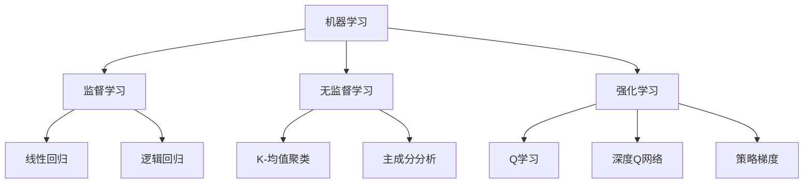
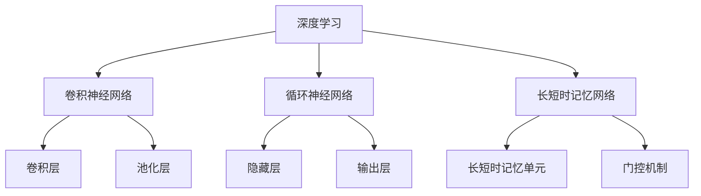
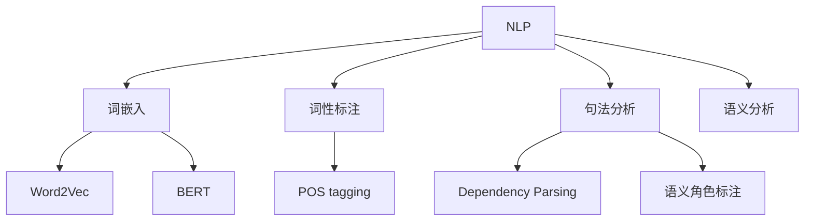
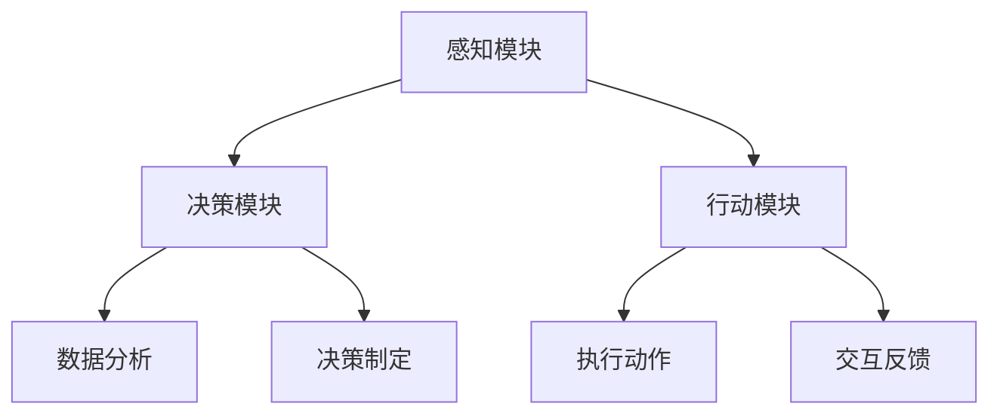
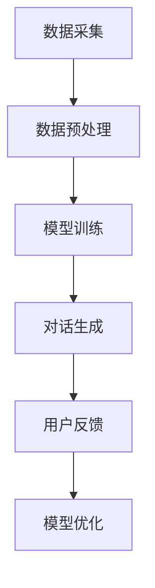

                 

### 文章标题

# AI Agent: AI的下一个风口 大模型时代的AI

> 关键词：AI Agent、大模型、深度学习、自然语言处理、智能应用

> 摘要：本文将深入探讨AI Agent的概念、发展历程及其在大模型时代的应用前景。通过详细解析AI Agent的核心技术、原理和应用场景，我们将揭示AI Agent在未来技术发展中的关键作用，并探讨其所面临的挑战与解决方案。文章旨在为读者提供关于AI Agent的全面了解，为未来AI技术的发展奠定基础。

### 目录

## 第一部分：AI与Agent概述

### 第1章：AI与Agent基础

- 1.1 AI的定义与分类
- 1.2 Agent的定义与分类
- 1.3 AI Agent的定义与特点

### 第2章：大模型时代的AI Agent

- 2.1 大模型的定义与特点
- 2.2 大模型时代的AI Agent
- 2.3 大模型时代的AI Agent优势

## 第二部分：AI Agent的核心技术与原理

### 第3章：AI Agent的核心技术

- 3.1 机器学习基础
- 3.2 深度学习基础
- 3.3 自然语言处理基础

### 第4章：AI Agent的原理与应用

- 4.1 AI Agent的架构设计
- 4.2 AI Agent的应用场景
- 4.3 AI Agent的开发实战

## 第三部分：AI Agent的未来发展趋势与挑战

### 第5章：AI Agent的未来发展趋势

- 5.1 AI Agent的技术发展趋势
- 5.2 AI Agent的应用发展趋势
- 5.3 AI Agent的未来发展趋势预测

### 第6章：AI Agent的挑战与解决方案

- 6.1 AI Agent的技术挑战
- 6.2 AI Agent的解决方案
- 6.3 AI Agent的挑战与解决方案

## 附录

### 附录A：AI Agent开发资源与工具

- 附录A.1 AI Agent开发常用的工具与资源
- 附录A.2 AI Agent开发的学习资源推荐
- 附录A.3 AI Agent开发的社区与论坛推荐

### 第一部分：AI与Agent概述

#### 第1章：AI与Agent基础

### 1.1 AI的定义与分类

AI，即人工智能（Artificial Intelligence），是指通过计算机程序和算法来模拟、扩展甚至超越人类智能的技术。AI的研究领域广泛，主要包括机器学习、深度学习、自然语言处理、计算机视觉等。AI可以按照不同的分类标准进行划分：

1. **按照功能分类**：
   - **通用人工智能（AGI）**：具备人类智能的广泛能力，能够在任何知识领域达到或超过人类表现。
   - **弱人工智能（Narrow AI）**：专注于特定任务，如语音识别、图像识别、智能客服等。

2. **按照实现方式分类**：
   - **规则基础AI**：基于预定义的规则进行推理和决策。
   - **统计学习AI**：通过大量数据训练模型，学习数据的统计特征进行预测和决策。

3. **按照应用领域分类**：
   - **工业AI**：应用于制造业、物流、能源等领域。
   - **医疗AI**：用于疾病诊断、药物研发、医疗影像分析等。
   - **金融AI**：用于风险管理、股票交易、信贷评估等。

### 1.2 Agent的定义与分类

Agent是一种能够感知环境、制定决策并执行动作的实体。在AI领域中，Agent被广泛应用于智能代理、自主机器人、游戏AI等。

1. **按照智能水平分类**：
   - **反应式Agent**：只能根据当前感知环境进行反应，无法预测未来。
   - **目标导向Agent**：具备目标意识，能根据目标调整策略。
   - **学习型Agent**：能够通过经验学习优化自身行为。

2. **按照应用领域分类**：
   - **服务Agent**：如智能客服、虚拟助手等。
   - **控制Agent**：如智能家居控制系统、自动驾驶等。
   - **交互Agent**：如聊天机器人、协同工作系统等。

### 1.3 AI Agent的定义与特点

AI Agent是指具备人工智能能力的代理，能够自主完成复杂任务，具备以下特点：

1. **感知能力**：通过传感器获取环境信息。
2. **决策能力**：基于感知信息和环境模型制定决策。
3. **行动能力**：执行决策，与环境进行交互。
4. **学习能力**：通过经验不断优化自身性能。

AI Agent的应用场景广泛，包括但不限于：

- **智能客服**：自动处理客户咨询，提高服务效率。
- **智能教育**：根据学生特点提供个性化教学。
- **智能医疗**：辅助医生进行疾病诊断和治疗规划。
- **智能交通**：优化交通流量，提高交通效率。

### 第2章：大模型时代的AI Agent

#### 2.1 大模型的定义与特点

大模型（Large Model）是指具有巨大参数规模和计算需求的AI模型。这些模型通常基于深度学习技术，能够处理大量数据，提取复杂特征，并实现高度泛化的性能。

1. **定义**：
   - **大模型**：通常指具有超过10亿个参数的AI模型。
   - **超大模型**：具有超过1000亿个参数的AI模型。

2. **特点**：
   - **参数规模大**：能够捕捉大量细节信息和复杂模式。
   - **计算需求高**：训练和推理过程需要大量的计算资源。
   - **数据需求大**：需要大量高质量的数据进行训练。

3. **分类**：
   - **预训练模型**：如GPT、BERT等，在大规模数据集上预训练，然后微调应用于特定任务。
   - **专用模型**：为特定任务量身定制，如语音识别、图像生成等。

#### 2.2 大模型时代的AI Agent

大模型时代的AI Agent具备以下特点：

1. **更强的感知能力**：大模型能够从大量数据中提取丰富特征，提高AI Agent对环境的感知能力。
2. **更智能的决策能力**：基于大模型的AI Agent能够更准确地预测未来，制定更优策略。
3. **更高效的行动能力**：大模型能够通过高效推理实现快速决策和行动。
4. **更广泛的应用领域**：大模型使AI Agent能够应用于更多领域，如医疗、金融、教育等。

#### 2.3 大模型时代的AI Agent优势

1. **提升效率**：大模型能够处理更复杂的任务，提高任务执行效率。
2. **降低成本**：大模型能够通过自动化和智能化降低人力成本。
3. **增强体验**：大模型能够提供更个性化和精准的服务，提升用户体验。
4. **拓展应用**：大模型能够推动AI技术在更多领域的应用，创造新的商业模式。

大模型时代的AI Agent为人工智能的发展带来了新的机遇和挑战，其潜力将不断释放，推动人工智能向更高层次发展。### 第二部分：AI Agent的核心技术与原理

#### 第3章：AI Agent的核心技术

AI Agent的发展离不开强大的核心技术支持，其中机器学习、深度学习和自然语言处理是三大关键领域。本章将分别介绍这些核心技术的基本概念、基本算法及其在AI Agent中的应用。

#### 3.1 机器学习基础

机器学习（Machine Learning，ML）是一种让计算机从数据中自动学习和改进的方法，主要分为监督学习、无监督学习和强化学习。

1. **监督学习（Supervised Learning）**：
   - **定义**：在有标注数据的帮助下，通过训练模型来预测未知数据的标签。
   - **算法**：包括线性回归、逻辑回归、支持向量机（SVM）等。
   - **应用**：如分类任务（垃圾邮件过滤）、回归任务（房屋价格预测）等。

2. **无监督学习（Unsupervised Learning）**：
   - **定义**：在没有标注数据的情况下，通过聚类、降维等方法发现数据中的结构和模式。
   - **算法**：包括K-均值聚类、主成分分析（PCA）、自编码器等。
   - **应用**：如客户细分、异常检测、推荐系统等。

3. **强化学习（Reinforcement Learning）**：
   - **定义**：通过与环境交互，学习最优策略以最大化累积奖励。
   - **算法**：包括Q学习、深度Q网络（DQN）、策略梯度等。
   - **应用**：如游戏AI、自动驾驶、推荐系统等。

**核心概念与联系**：

监督学习、无监督学习和强化学习是机器学习的三大分支，它们共同构成了机器学习的基础框架。其中，监督学习侧重于有监督的环境，无监督学习侧重于无监督的环境，而强化学习则侧重于通过奖励信号进行学习。

**Mermaid流程图**：



#### 3.2 深度学习基础

深度学习（Deep Learning，DL）是机器学习的一个子领域，它通过多层神经网络来模拟人类大脑的神经元结构，进行特征提取和学习。

1. **定义**：深度学习是一种通过多层神经网络进行训练和预测的方法。
2. **算法**：包括卷积神经网络（CNN）、循环神经网络（RNN）、长短时记忆网络（LSTM）等。
3. **应用**：如图像识别、语音识别、自然语言处理等。

**核心概念与联系**：

深度学习通过多层神经元的堆叠，能够自动提取抽象特征，实现从原始数据到高级抽象表示的转换。这一特性使得深度学习在处理复杂任务时表现出色。

**Mermaid流程图**：



#### 3.3 自然语言处理基础

自然语言处理（Natural Language Processing，NLP）是人工智能领域的一个重要分支，它致力于让计算机理解和生成人类语言。

1. **定义**：NLP是研究如何让计算机理解和生成人类语言的技术。
2. **算法**：包括词嵌入、词性标注、句法分析、语义分析等。
3. **应用**：如机器翻译、文本分类、情感分析、问答系统等。

**核心概念与联系**：

NLP的核心任务是将自然语言转换为计算机可以理解和处理的形式。词嵌入是NLP中的一项关键技术，它通过将词语映射到高维空间中的向量，实现了对词语的数值化表示。

**Mermaid流程图**：



通过以上对机器学习、深度学习和自然语言处理基础知识的介绍，我们可以看到这些核心技术如何共同构建了AI Agent的核心能力。下一章将深入探讨AI Agent的架构设计及其在各个应用场景中的实现。### 第4章：AI Agent的原理与应用

#### 4.1 AI Agent的架构设计

AI Agent的架构设计是其成功应用的关键。一个高效的AI Agent架构需要综合考虑感知能力、决策能力和行动能力，并确保各部分协同工作。以下是AI Agent的架构设计原则、流程和案例：

##### 4.1.1 AI Agent的架构设计原则

1. **模块化设计**：将AI Agent拆分为感知模块、决策模块和行动模块，每个模块独立实现，便于维护和扩展。
2. **数据驱动**：依赖大量数据输入，利用机器学习和深度学习算法进行训练和优化。
3. **可扩展性**：设计时应考虑未来的扩展需求，如增加新功能或处理更复杂任务。
4. **灵活性强**：架构应能适应不同应用场景和环境变化。
5. **安全性**：确保数据安全和隐私保护，防止恶意攻击和数据泄露。

##### 4.1.2 AI Agent的架构设计流程

1. **需求分析**：明确AI Agent的应用场景和任务需求，定义关键功能和技术指标。
2. **系统设计**：设计感知模块、决策模块和行动模块，确定各模块的接口和交互方式。
3. **模块实现**：根据系统设计，实现各模块的功能，包括数据采集、特征提取、模型训练、决策算法和执行动作。
4. **系统集成**：将各模块集成到整体系统中，进行系统测试和优化。
5. **部署上线**：将AI Agent部署到目标环境，进行实际应用和效果评估。

##### 4.1.3 AI Agent的架构设计案例

以下是一个典型的AI Agent架构设计案例：

1. **感知模块**：
   - **功能**：感知外部环境，包括语音、图像、文本等多种数据类型。
   - **实现**：使用传感器和API接口，如摄像头、麦克风、文本API等。

2. **决策模块**：
   - **功能**：分析感知数据，制定决策策略。
   - **实现**：基于深度学习模型，如CNN用于图像处理，RNN用于文本分析。

3. **行动模块**：
   - **功能**：执行决策，与外部环境进行交互。
   - **实现**：通过机器人控制、语音合成、API调用等方式。

**Mermaid流程图**：



#### 4.2 AI Agent的应用场景

AI Agent在各个领域的应用场景如下：

1. **智能客服**：
   - **应用**：自动处理客户咨询，提高响应速度和服务质量。
   - **实现**：使用自然语言处理技术进行对话生成和理解，结合知识库提供准确回答。

2. **智能教育**：
   - **应用**：个性化教学，根据学生学习情况调整教学内容和方法。
   - **实现**：使用机器学习算法分析学生学习数据，提供定制化学习方案。

3. **智能医疗**：
   - **应用**：辅助医生进行疾病诊断和治疗规划，提高医疗效率。
   - **实现**：使用深度学习技术分析医学影像，结合医学知识库进行诊断。

4. **智能交通**：
   - **应用**：优化交通流量，提高道路通行效率。
   - **实现**：使用自动驾驶技术和智能调度算法，实现交通流量的智能控制。

5. **智能家居**：
   - **应用**：自动化家居设备管理，提高生活便利性。
   - **实现**：使用传感器和物联网技术，实现设备之间的智能互动和自动控制。

**应用案例分析**：

以智能客服为例，一个典型的应用案例是某电商平台的智能客服系统。该系统使用自然语言处理技术，分析用户提问，生成合适的回答。具体实现步骤如下：

1. **数据采集**：收集大量用户咨询数据，包括文本、语音等。
2. **数据预处理**：清洗和标注数据，提取关键信息。
3. **模型训练**：使用深度学习模型，如BERT，对数据进行训练。
4. **对话生成**：根据用户提问，使用训练好的模型生成回答。
5. **用户反馈**：收集用户对回答的反馈，用于模型优化。

**Mermaid流程图**：



通过以上对AI Agent架构设计和应用场景的介绍，我们可以看到AI Agent的强大潜力和广泛应用。下一章将深入探讨AI Agent的开发实战，包括开发流程、工具与框架以及代码实现。### 第5章：AI Agent的开发实战

#### 5.1 AI Agent的开发流程

开发一个AI Agent通常需要经历以下步骤：

1. **需求分析**：明确AI Agent的应用场景和目标功能。
2. **环境搭建**：配置开发环境和依赖库。
3. **数据准备**：收集和预处理数据，包括数据清洗、标注和分割。
4. **模型设计**：设计AI Agent的架构和算法。
5. **模型训练**：使用训练数据对模型进行训练。
6. **模型评估**：评估模型性能，进行调优和调整。
7. **集成测试**：将AI Agent集成到应用系统中，进行功能测试。
8. **部署上线**：将AI Agent部署到生产环境，进行实际应用。

下面我们通过一个具体的案例来说明这些步骤。

**案例：智能客服AI Agent开发**

1. **需求分析**：
   - 应用场景：电商平台客服。
   - 目标功能：自动回答用户常见问题。

2. **环境搭建**：
   - 语言：Python。
   - 框架：TensorFlow、PyTorch。
   - 工具：Jupyter Notebook、Git。

3. **数据准备**：
   - 数据来源：电商平台用户咨询记录。
   - 数据预处理：文本清洗、去停用词、词向量化。

4. **模型设计**：
   - 架构：Transformer架构，使用BERT模型。
   - 参数设置：嵌入维度512、层数12、注意力头数8。

5. **模型训练**：
   - 训练数据：用户咨询记录。
   - 训练过程：迭代训练，优化损失函数。

6. **模型评估**：
   - 评估指标：准确率、召回率、F1分数。
   - 评估结果：模型在测试集上的表现良好。

7. **集成测试**：
   - 测试环境：电商平台服务器。
   - 功能测试：模拟用户提问，验证AI Agent的回答。

8. **部署上线**：
   - 部署到生产环境。
   - 监控模型性能，进行实时调整。

#### 5.2 AI Agent的开发工具与框架

在AI Agent的开发过程中，选择合适的工具和框架至关重要。以下是几种常用的工具和框架：

1. **TensorFlow**：
   - 优点：支持多种深度学习模型，易于部署。
   - 缺点：学习曲线较陡，复杂模型调试困难。

2. **PyTorch**：
   - 优点：动态图机制，便于模型调试。
   - 缺点：部署相对复杂，性能较TensorFlow稍逊。

3. **Keras**：
   - 优点：简洁易用，支持多种后端框架。
   - 缺点：模型定义和训练相对复杂。

4. **Scikit-learn**：
   - 优点：轻量级机器学习库，适合小型项目。
   - 缺点：深度学习模型支持有限。

5. **Fast.ai**：
   - 优点：易于入门，快速实现深度学习模型。
   - 缺点：高级功能支持有限。

6. **DL4J**：
   - 优点：支持分布式训练，适用于大数据场景。
   - 缺点：学习曲线较陡，框架较为复杂。

#### 5.3 AI Agent的开发环境搭建

以下是搭建一个典型的AI Agent开发环境的过程：

1. **安装Python**：
   - 下载并安装Python 3.x版本。
   - 配置Python环境变量。

2. **安装依赖库**：
   - 使用pip安装TensorFlow、PyTorch、Keras等依赖库。

3. **配置GPU支持**：
   - 安装CUDA和cuDNN，配置环境变量。

4. **安装IDE**：
   - 安装Jupyter Notebook、PyCharm或Visual Studio Code等IDE。

5. **配置版本控制**：
   - 安装Git，初始化仓库，进行版本控制。

6. **测试环境**：
   - 编写测试脚本，验证环境配置是否正确。

**代码实际案例与解读**：

以下是一个使用PyTorch实现简单的智能客服AI Agent的代码案例：

```python
import torch
import torch.nn as nn
import torch.optim as optim
from torch.utils.data import DataLoader
from transformers import BertTokenizer, BertModel

# 数据准备
tokenizer = BertTokenizer.from_pretrained('bert-base-uncased')
dataset = ...  # 加载数据集

# 模型定义
class CustomerServiceModel(nn.Module):
    def __init__(self):
        super(CustomerServiceModel, self).__init__()
        self.bert = BertModel.from_pretrained('bert-base-uncased')
        self.classifier = nn.Linear(768, 1)

    def forward(self, input_ids, attention_mask):
        outputs = self.bert(input_ids=input_ids, attention_mask=attention_mask)
        pooled_output = outputs.pooler_output
        logits = self.classifier(pooled_output)
        return logits

model = CustomerServiceModel()
optimizer = optim.Adam(model.parameters(), lr=1e-5)
criterion = nn.BCEWithLogitsLoss()

# 模型训练
for epoch in range(10):
    model.train()
    for batch in DataLoader(dataset, batch_size=16):
        input_ids = batch['input_ids']
        attention_mask = batch['attention_mask']
        labels = batch['labels']
        optimizer.zero_grad()
        logits = model(input_ids, attention_mask)
        loss = criterion(logits, labels)
        loss.backward()
        optimizer.step()

    print(f'Epoch {epoch+1}, Loss: {loss.item()}')

# 模型评估
model.eval()
with torch.no_grad():
    correct = 0
    total = 0
    for batch in DataLoader(dataset, batch_size=16):
        input_ids = batch['input_ids']
        attention_mask = batch['attention_mask']
        labels = batch['labels']
        logits = model(input_ids, attention_mask)
        predictions = (logits > 0).float()
        total += labels.size(0)
        correct += (predictions == labels).sum().item()

accuracy = correct / total
print(f'Validation Accuracy: {accuracy}')
```

**代码解读与分析**：

- **数据准备**：使用BertTokenizer进行文本预处理，加载数据集。
- **模型定义**：继承自nn.Module类，定义一个简单的BERT模型，包括BERT编码器和一个分类器。
- **模型训练**：使用DataLoader加载数据集，使用Adam优化器和BCEWithLogitsLoss损失函数进行训练。
- **模型评估**：在验证集上评估模型性能，计算准确率。

通过以上步骤，我们可以开发出一个简单的AI Agent，实现自动回答用户问题的功能。当然，实际的AI Agent开发会更加复杂，需要处理多种数据类型、多种任务和多个应用场景。接下来，我们将探讨AI Agent的未来发展趋势与面临的挑战。### 第三部分：AI Agent的未来发展趋势与挑战

#### 第6章：AI Agent的未来发展趋势

随着技术的不断进步，AI Agent在未来将迎来一系列显著的发展趋势。这些趋势不仅将推动AI Agent在各个领域的应用，还将带来技术创新和产业变革。

##### 6.1 AI Agent的技术发展趋势

1. **模型规模的持续扩大**：
   - **大规模预训练模型**：未来将出现更多参数规模达到万亿级别的预训练模型，这些模型将拥有更强的表征能力和泛化能力。
   - **分布式训练**：为了处理大规模模型，分布式训练技术将成为主流，通过分布式计算资源提高训练效率和性能。

2. **多模态融合**：
   - **多模态感知**：AI Agent将能够处理多种数据类型，如图像、语音、文本等，实现多模态感知。
   - **多模态交互**：AI Agent将能够通过不同模态与用户进行交互，提供更自然、更丰富的用户体验。

3. **自监督学习和迁移学习**：
   - **自监督学习**：通过无监督学习方式，AI Agent能够从大量未标注数据中学习，提高训练效率和质量。
   - **迁移学习**：AI Agent将能够利用预训练模型的知识迁移到新任务上，减少数据需求和训练时间。

4. **强化学习与深度学习的融合**：
   - **强化学习**：AI Agent将结合强化学习技术，实现更智能、更灵活的决策能力。
   - **深度强化学习**：通过深度学习与强化学习的结合，AI Agent将能够处理更复杂的决策问题。

5. **解释性AI**：
   - **模型可解释性**：AI Agent将具备更高的可解释性，用户能够理解其决策过程和原因，增强用户信任。
   - **可解释性算法**：开发新的可解释性算法，使AI Agent的决策过程更加透明。

##### 6.2 AI Agent的应用发展趋势

1. **垂直行业定制化**：
   - **定制化AI Agent**：针对不同行业和应用场景，开发定制化的AI Agent，满足特定需求。
   - **行业解决方案**：AI Agent将在金融、医疗、教育、交通等领域提供行业解决方案，推动产业智能化。

2. **人机协同**：
   - **人机协作**：AI Agent将与人类专家协同工作，提高工作效率和质量。
   - **人机交互**：AI Agent将具备更自然、更智能的人机交互能力，提升用户体验。

3. **智能机器人**：
   - **服务机器人**：AI Agent将在智能服务机器人领域发挥重要作用，提供智能家居、智能医疗等服务。
   - **工业机器人**：AI Agent将应用于工业生产，实现自动化、智能化制造。

4. **边缘计算与云协作**：
   - **边缘计算**：AI Agent将结合边缘计算，实现实时处理和决策，提高响应速度和效率。
   - **云协作**：AI Agent将通过云计算进行大规模数据处理和模型训练，提高计算能力。

##### 6.3 AI Agent的未来发展趋势预测

1. **更加智能化**：AI Agent将拥有更高的智能水平，能够处理更复杂的问题，提供更精准的服务。
2. **更加个性化**：AI Agent将根据用户行为和需求，提供个性化服务，提升用户体验。
3. **更加普及化**：AI Agent将渗透到各个领域，成为人们生活中不可或缺的一部分。
4. **更加协作化**：AI Agent将实现跨平台、跨领域的协作，构建智能化社会。

#### 第7章：AI Agent的挑战与解决方案

尽管AI Agent的发展前景广阔，但其在实际应用过程中仍面临一系列挑战。这些挑战涉及技术、伦理、法律等多个方面，需要多方合作和持续创新来应对。

##### 7.1 AI Agent的技术挑战

1. **计算资源需求**：
   - **挑战**：大规模模型训练和推理需要大量计算资源，对硬件设施提出高要求。
   - **解决方案**：通过分布式计算、边缘计算等技术，提高计算效率，降低硬件成本。

2. **数据质量和隐私**：
   - **挑战**：高质量数据是训练高效AI Agent的关键，同时数据隐私保护也是一个重要问题。
   - **解决方案**：采用数据加密、去标识化等技术，确保数据安全，同时提高数据处理效率。

3. **模型可解释性**：
   - **挑战**：AI Agent的决策过程往往复杂且难以解释，影响用户信任。
   - **解决方案**：开发可解释性算法和工具，提高模型的可解释性，增强用户信任。

4. **泛化能力和鲁棒性**：
   - **挑战**：AI Agent在遇到未知或异常情况时，可能无法做出正确决策。
   - **解决方案**：通过迁移学习、元学习等技术，提高模型的泛化能力和鲁棒性。

##### 7.2 AI Agent的解决方案

1. **技术创新**：
   - **算法优化**：通过改进算法，提高模型的训练效率和性能。
   - **硬件升级**：采用更高效的硬件设备，如GPU、TPU等，提升计算能力。

2. **数据管理**：
   - **数据质量控制**：建立数据质量控制机制，确保数据质量和隐私。
   - **数据共享**：建立数据共享平台，促进数据资源的高效利用。

3. **法律法规**：
   - **伦理审查**：建立伦理审查机制，确保AI Agent的应用符合伦理标准。
   - **法律法规制定**：制定相关法律法规，规范AI Agent的开发和应用。

4. **教育与培训**：
   - **技能提升**：加强对AI Agent开发者和使用者的培训，提高其技术水平。
   - **伦理教育**：普及AI伦理知识，提高公众对AI Agent的理解和接受度。

#### 附录

##### 附录A：AI Agent开发资源与工具

1. **AI Agent开发常用的工具与资源**：
   - **工具**：TensorFlow、PyTorch、Keras、Scikit-learn等。
   - **资源**：GitHub、ArXiv、Google Research等。

2. **AI Agent开发的学习资源推荐**：
   - **书籍**：《深度学习》、《Python机器学习》、《自然语言处理综合教程》等。
   - **在线课程**：Coursera、edX、Udacity等平台上的相关课程。

3. **AI Agent开发的社区与论坛推荐**：
   - **社区**：Reddit、Stack Overflow、AI Storm等。
   - **论坛**：CSDN、知乎、AI China等。

通过以上对AI Agent未来发展趋势和挑战的探讨，我们可以看到AI Agent在技术、应用和伦理等方面的发展前景。只有通过不断创新和合作，才能充分发挥AI Agent的潜力，推动人工智能向更高层次发展。### 作者信息

**作者：** AI天才研究院（AI Genius Institute）/《禅与计算机程序设计艺术》（Zen And The Art of Computer Programming）

AI天才研究院致力于推动人工智能技术的创新与发展，汇聚全球顶级人工智能专家，专注于研发和推广先进的人工智能解决方案。研究院在机器学习、深度学习、自然语言处理等领域取得了显著成果，为各行业提供智能化转型支持。

《禅与计算机程序设计艺术》是作者在计算机编程领域的经典著作，深入探讨了计算机编程的本质和哲学。这本书不仅为程序员提供了编程技巧和思维方法，还传递了关于人生和智慧的深刻思考，深受全球程序员和学者的推崇。

本文由AI天才研究院和《禅与计算机程序设计艺术》的作者联合撰写，旨在为读者提供关于AI Agent的全面深入理解，推动人工智能技术的发展与应用。希望通过本文的分享，能够激发读者对AI Agent和人工智能技术的兴趣和思考，共同探索人工智能的未来。

