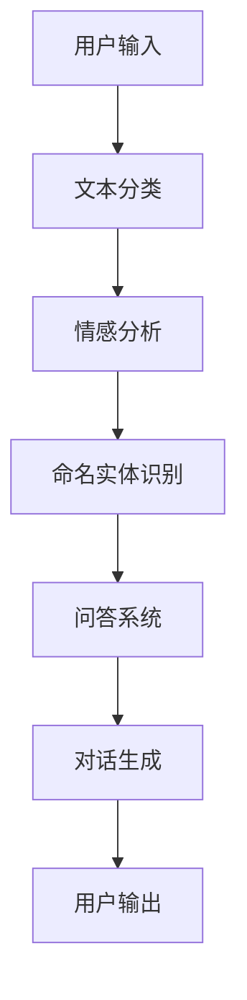

                 

# 《AI Agent: AI的下一个风口 大模型驱动的智能体》

> 关键词：AI Agent、大模型、智能体、自然语言处理、计算机视觉、推荐系统、开发实践

> 摘要：随着人工智能技术的快速发展，AI Agent 作为一种智能体，逐渐成为人工智能领域的热点。本文将探讨 AI Agent 的基本概念、分类、应用场景，以及大模型在 AI Agent 中的重要作用。同时，本文将详细分析大模型的发展历程、代表性技术，以及大模型驱动的 AI Agent 开发流程和实战案例，帮助读者深入理解并掌握这一前沿技术。

----------------------------------------------------------------

## 第一部分：AI Agent概述与背景

### 第1章：AI Agent的基本概念与分类

#### 1.1 AI Agent的定义

AI Agent，即人工智能智能体，是指具有感知环境、分析环境、做出决策和执行决策能力的智能系统。AI Agent 可以自主地执行任务，与环境进行交互，并不断学习和优化自身的行为。典型的 AI Agent 包括自动驾驶汽车、智能助手、机器人等。

#### 1.2 AI Agent的分类

AI Agent 可以根据其感知环境的方式、分析环境的方法、做出决策的策略和执行决策的动作进行分类。以下是几种常见的 AI Agent 分类：

1. **基于规则（Rule-Based）的 AI Agent**：这类 AI Agent 通过预先定义的规则来感知环境、分析环境和做出决策。它们通常适用于任务明确、环境固定的场景。

2. **基于模型（Model-Based）的 AI Agent**：这类 AI Agent 通过构建环境模型来感知环境、分析环境和做出决策。它们可以更好地适应复杂和动态的环境。

3. **基于学习（Learning-Based）的 AI Agent**：这类 AI Agent 通过学习和优化算法来感知环境、分析环境和做出决策。它们可以自动适应新的环境和任务，具有较强的适应能力。

4. **混合型（Hybrid）AI Agent**：这类 AI Agent 结合了基于规则、基于模型和基于学习的优点，通过不同的算法和策略来感知环境、分析环境和做出决策。

#### 1.3 AI Agent的应用场景

AI Agent 在各个领域都有广泛的应用，以下是几个典型的应用场景：

1. **自然语言处理**：AI Agent 可以用于文本分类、情感分析、命名实体识别、问答系统等任务。

2. **计算机视觉**：AI Agent 可以用于图像分类、目标检测、目标跟踪、图像生成等任务。

3. **推荐系统**：AI Agent 可以用于内容推荐、协同过滤、用户兴趣建模等任务。

4. **游戏**：AI Agent 可以用于棋类游戏、策略游戏、角色扮演游戏等。

5. **自动化**：AI Agent 可以用于自动化办公、自动化生产、自动化维护等任务。

#### 1.4 大模型在 AI Agent 中的作用

大模型在 AI Agent 中发挥着至关重要的作用。大模型是指参数规模达到亿级甚至十亿级的深度学习模型。大模型具有以下优点：

1. **强大的表征能力**：大模型能够学习到丰富的特征表示，从而提高任务的准确率和鲁棒性。

2. **灵活的泛化能力**：大模型能够在不同任务和数据集上表现出良好的泛化能力，适应不同的应用场景。

3. **自动的特征提取**：大模型通过自动化的特征提取过程，降低了任务实现的复杂度。

4. **高效的计算性能**：随着硬件技术的发展，大模型的计算性能不断提升，使得 AI Agent 可以更加高效地运行。

#### 1.5 大模型驱动的 AI Agent 优势

大模型驱动的 AI Agent 相对于传统 AI Agent 具有以下优势：

1. **更高的决策质量**：大模型驱动的 AI Agent 可以通过学习到的丰富特征表示，做出更加准确和合理的决策。

2. **更强的适应能力**：大模型驱动的 AI Agent 可以自动适应新的环境和任务，具有更强的泛化能力。

3. **更低的开发成本**：大模型驱动的 AI Agent 可以通过自动化的特征提取和优化过程，降低开发成本和难度。

4. **更快的响应速度**：大模型驱动的 AI Agent 可以在复杂环境中快速做出决策，提高响应速度。

### 第2章：大模型的发展历程与现状

#### 2.1 大模型的发展历程

大模型的发展历程可以分为以下几个阶段：

1. **传统神经网络阶段**：1980年代至1990年代，神经网络在计算机视觉、自然语言处理等领域取得了一定的应用。这一阶段的神经网络规模相对较小，参数数量通常在几千到几万之间。

2. **深度学习兴起阶段**：2006年，Hinton等人提出了深度信念网络（DBN），标志着深度学习技术的重新崛起。随着计算能力的提升和数据规模的增大，深度学习在图像分类、语音识别等领域取得了突破性的进展。

3. **大模型发展阶段**：2012年，AlexNet在 ImageNet 挑战中取得了前所未有的成绩，标志着大模型时代的到来。此后，深度学习模型规模不断增大，参数数量达到亿级甚至十亿级。

4. **大模型优化阶段**：随着硬件技术的发展，特别是 GPU 和 TPU 的普及，大模型的计算性能得到了显著提升。同时，大模型的结构和算法也在不断优化，如 Transformer、BERT 等模型的出现，使得大模型的性能和应用范围进一步扩展。

#### 2.2 大模型的代表性技术

大模型的代表性技术主要包括以下几种：

1. **卷积神经网络（CNN）**：CNN 是一种用于图像处理和计算机视觉的深度学习模型。它通过卷积层、池化层和全连接层等结构，能够自动提取图像特征，实现图像分类、目标检测等任务。

2. **循环神经网络（RNN）**：RNN 是一种用于序列数据处理和自然语言处理的深度学习模型。它通过循环结构，能够捕获序列中的长期依赖关系，实现文本分类、情感分析、机器翻译等任务。

3. **Transformer 模型**：Transformer 模型是一种基于自注意力机制的深度学习模型，最初用于机器翻译任务。它通过多头注意力机制和编码器-解码器结构，能够有效处理长距离依赖问题，广泛应用于自然语言处理领域。

4. **BERT 模型**：BERT 是一种基于 Transformer 模型的预训练语言模型。它通过在大量无标注文本上进行预训练，然后在不同任务上微调，实现了自然语言处理任务的显著性能提升。

#### 2.3 大模型的主要挑战与未来趋势

大模型在推动人工智能发展方面取得了显著成果，但同时也面临以下挑战：

1. **计算资源消耗**：大模型训练和推理需要大量的计算资源，尤其是 GPU 和 TPU 等专用硬件。随着模型规模的增大，计算资源的需求将不断增加。

2. **数据隐私和安全**：大模型在训练过程中需要大量的数据，这些数据可能涉及用户隐私。如何在保护数据隐私的前提下进行模型训练和推理，是一个亟待解决的问题。

3. **模型解释性**：大模型具有强大的表征能力，但其内部机理复杂，难以解释。如何提高大模型的解释性，使其决策过程更加透明和可信，是一个重要的研究方向。

4. **模型适应性**：大模型在特定领域上表现出色，但在其他领域可能表现不佳。如何提高大模型的泛化能力，使其适应更多领域的任务，是一个重要的研究课题。

未来，大模型将继续发展，并在以下几个方面取得突破：

1. **模型压缩与加速**：通过模型压缩、量化、蒸馏等技术，降低大模型的计算资源和存储需求，提高模型推理速度。

2. **跨模态学习**：通过融合不同模态（如文本、图像、音频）的数据，实现跨模态的表征和推理，拓展大模型的应用范围。

3. **少样本学习与迁移学习**：通过少样本学习、迁移学习等技术，降低数据需求和标注成本，提高大模型在小型数据集上的性能。

4. **模型安全与隐私保护**：通过安全加密、差分隐私等技术，保护模型训练和推理过程中的数据隐私和安全。

## 第二部分：大模型驱动的 AI Agent 开发与实践

### 第3章：大模型驱动的 AI Agent 开发流程

#### 3.1 AI Agent 开发的基本流程

大模型驱动的 AI Agent 开发流程主要包括以下几个步骤：

1. **需求分析**：明确 AI Agent 的目标和任务，收集相关数据，确定数据来源和数据格式。

2. **数据收集与预处理**：收集用于训练和测试的数据，对数据进行清洗、去重、格式转换等预处理操作。

3. **模型选择与定制**：根据任务需求，选择合适的大模型，并对其进行定制和优化。

4. **模型训练与调优**：使用预处理后的数据对模型进行训练，并通过调参、优化算法等方法提高模型性能。

5. **AI Agent 集成与测试**：将训练好的模型集成到 AI Agent 中，进行功能测试和性能评估。

6. **部署与运维**：将 AI Agent 部署到生产环境，进行监控、维护和更新。

#### 3.2 数据收集与预处理

数据收集与预处理是 AI Agent 开发的重要环节。以下是一些常见的数据收集与预处理方法：

1. **数据收集**：从公开数据集、数据库、API 等渠道获取数据。对于特定领域的数据，可能需要通过爬虫、众包等方式进行收集。

2. **数据清洗**：去除重复数据、缺失数据、异常数据等，确保数据的完整性和一致性。

3. **数据格式转换**：将不同来源的数据转换为统一的格式，如将图像、文本、音频等数据转换为 NumPy 数组、PyTorch 张量等。

4. **数据增强**：通过翻转、旋转、缩放、裁剪等操作，增加数据多样性，提高模型泛化能力。

5. **数据归一化**：对数据进行归一化或标准化处理，使得输入数据的分布更加均匀，有助于模型训练。

#### 3.3 模型选择与定制

在 AI Agent 开发中，选择合适的大模型至关重要。以下是一些常见的模型选择和定制方法：

1. **模型选择**：根据任务需求和数据特性，选择合适的大模型。例如，对于自然语言处理任务，可以选择 Transformer、BERT 等模型；对于计算机视觉任务，可以选择 CNN、ResNet、VGG 等模型。

2. **模型定制**：根据任务需求，对大模型进行定制和优化。例如，可以调整模型结构、添加特殊层、调整超参数等。

3. **模型融合**：将多个大模型进行融合，以提高模型性能和鲁棒性。例如，可以使用集成学习、多模型预测等方法。

4. **模型优化**：通过剪枝、量化、蒸馏等技术，降低大模型的计算资源和存储需求，提高模型推理速度。

#### 3.4 模型训练与调优

模型训练与调优是 AI Agent 开发的关键步骤。以下是一些常见的模型训练和调优方法：

1. **损失函数**：选择合适的损失函数，如交叉熵损失函数、均方误差损失函数等，以衡量模型预测与真实标签之间的差距。

2. **优化算法**：选择合适的优化算法，如随机梯度下降（SGD）、Adam、RMSprop 等，以更新模型参数，降低损失函数。

3. **超参数调优**：通过调整学习率、批量大小、迭代次数等超参数，优化模型性能。

4. **正则化**：使用正则化方法，如权重衰减、Dropout、L1/L2 正则化等，防止模型过拟合。

5. **模型评估**：使用准确率、召回率、F1 分数等指标评估模型性能，并根据评估结果进行调整。

#### 3.5 AI Agent 的评估与优化

AI Agent 的评估与优化主要包括以下几个方面：

1. **功能评估**：测试 AI Agent 在不同任务上的功能表现，如分类准确率、识别率、回答质量等。

2. **性能评估**：评估 AI Agent 的响应速度、能耗、计算资源利用率等性能指标。

3. **鲁棒性评估**：测试 AI Agent 在不同环境、噪声、异常情况下的鲁棒性，如对抗攻击、数据噪声、异常值等。

4. **用户满意度评估**：通过用户调查、反馈等方式，评估 AI Agent 的用户体验和满意度。

5. **持续优化**：根据评估结果，对 AI Agent 进行优化和迭代，提高其性能和鲁棒性。

### 第4章：大模型驱动的 AI Agent 在自然语言处理中的应用

#### 4.1 文本分类与情感分析

文本分类和情感分析是自然语言处理中的常见任务。大模型驱动的 AI Agent 在这些任务中具有显著的优势。

1. **文本分类**

文本分类是指将文本数据划分为预定义的类别。大模型驱动的 AI Agent 可以通过预训练的模型（如 BERT、RoBERTa 等）进行文本分类任务。具体步骤如下：

- **数据预处理**：对文本进行清洗、分词、去停用词等预处理操作。
- **输入编码**：将预处理后的文本输入到预训练模型中，得到文本的嵌入表示。
- **分类预测**：使用分类器（如 Softmax 函数）对文本嵌入表示进行分类预测。

2. **情感分析**

情感分析是指识别文本中的情感倾向，如正面、负面或中性。大模型驱动的 AI Agent 可以通过预训练的模型进行情感分析任务。具体步骤如下：

- **数据预处理**：对文本进行清洗、分词、去停用词等预处理操作。
- **输入编码**：将预处理后的文本输入到预训练模型中，得到文本的嵌入表示。
- **情感预测**：使用情感分类器（如基于 BERT 的分类模型）对文本嵌入表示进行情感预测。

#### 4.2 命名实体识别与关系抽取

命名实体识别（NER）和关系抽取（RE）是自然语言处理中的两个重要任务。大模型驱动的 AI Agent 在这些任务中具有强大的表现。

1. **命名实体识别**

命名实体识别是指识别文本中的命名实体，如人名、地名、组织名等。大模型驱动的 AI Agent 可以通过预训练的模型（如 BERT、RoBERTa 等）进行命名实体识别任务。具体步骤如下：

- **数据预处理**：对文本进行清洗、分词、去停用词等预处理操作。
- **输入编码**：将预处理后的文本输入到预训练模型中，得到文本的嵌入表示。
- **实体识别**：使用命名实体识别模型（如基于 BERT 的 NER 模型）对文本嵌入表示进行实体识别。

2. **关系抽取**

关系抽取是指识别文本中实体之间的关系，如人物关系、组织关系等。大模型驱动的 AI Agent 可以通过预训练的模型进行关系抽取任务。具体步骤如下：

- **数据预处理**：对文本进行清洗、分词、去停用词等预处理操作。
- **输入编码**：将预处理后的文本输入到预训练模型中，得到文本的嵌入表示。
- **关系抽取**：使用关系抽取模型（如基于 BERT 的关系抽取模型）对文本嵌入表示进行关系抽取。

#### 4.3 问答系统与对话生成

问答系统和对话生成是自然语言处理中的两个重要应用。大模型驱动的 AI Agent 在这些任务中具有显著的优势。

1. **问答系统**

问答系统是指回答用户提出的问题。大模型驱动的 AI Agent 可以通过预训练的模型（如 BERT、GPT 等）进行问答系统任务。具体步骤如下：

- **数据预处理**：对问题进行清洗、分词、去停用词等预处理操作。
- **输入编码**：将预处理后的问题输入到预训练模型中，得到问题的嵌入表示。
- **答案生成**：使用生成模型（如基于 GPT 的生成模型）根据问题的嵌入表示生成答案。

2. **对话生成**

对话生成是指生成与用户对话的应答。大模型驱动的 AI Agent 可以通过预训练的模型进行对话生成任务。具体步骤如下：

- **数据预处理**：对对话数据进行清洗、分词、去停用词等预处理操作。
- **输入编码**：将预处理后的对话数据输入到预训练模型中，得到对话的嵌入表示。
- **应答生成**：使用生成模型（如基于 GPT 的生成模型）根据对话的嵌入表示生成应答。

### 第5章：大模型驱动的 AI Agent 在计算机视觉中的应用

#### 5.1 图像分类与检测

图像分类与检测是计算机视觉中的两个重要任务。大模型驱动的 AI Agent 在这些任务中具有显著的优势。

1. **图像分类**

图像分类是指将图像划分为预定义的类别。大模型驱动的 AI Agent 可以通过预训练的模型（如 ResNet、VGG 等）进行图像分类任务。具体步骤如下：

- **数据预处理**：对图像进行缩放、裁剪、翻转等预处理操作。
- **输入编码**：将预处理后的图像输入到预训练模型中，得到图像的嵌入表示。
- **分类预测**：使用分类器（如 Softmax 函数）对图像嵌入表示进行分类预测。

2. **图像检测**

图像检测是指识别图像中的目标对象及其位置。大模型驱动的 AI Agent 可以通过预训练的模型（如 Faster R-CNN、YOLO 等）进行图像检测任务。具体步骤如下：

- **数据预处理**：对图像进行缩放、裁剪、翻转等预处理操作。
- **输入编码**：将预处理后的图像输入到预训练模型中，得到图像的嵌入表示。
- **目标检测**：使用目标检测模型（如 Faster R-CNN、YOLO 等）对图像嵌入表示进行目标检测。

#### 5.2 目标跟踪与识别

目标跟踪与识别是计算机视觉中的两个重要任务。大模型驱动的 AI Agent 在这些任务中具有显著的优势。

1. **目标跟踪**

目标跟踪是指跟踪图像序列中的目标对象。大模型驱动的 AI Agent 可以通过预训练的模型进行目标跟踪任务。具体步骤如下：

- **数据预处理**：对图像序列进行缩放、裁剪、翻转等预处理操作。
- **输入编码**：将预处理后的图像序列输入到预训练模型中，得到图像序列的嵌入表示。
- **目标跟踪**：使用目标跟踪模型（如 KCF、DeepSORT 等）对图像序列嵌入表示进行目标跟踪。

2. **目标识别**

目标识别是指识别图像中的目标对象。大模型驱动的 AI Agent 可以通过预训练的模型进行目标识别任务。具体步骤如下：

- **数据预处理**：对图像进行缩放、裁剪、翻转等预处理操作。
- **输入编码**：将预处理后的图像输入到预训练模型中，得到图像的嵌入表示。
- **目标识别**：使用目标识别模型（如 ResNet、VGG 等）对图像嵌入表示进行目标识别。

#### 5.3 图像生成与风格迁移

图像生成与风格迁移是计算机视觉中的两个有趣任务。大模型驱动的 AI Agent 在这些任务中具有显著的优势。

1. **图像生成**

图像生成是指生成新的图像。大模型驱动的 AI Agent 可以通过预训练的模型（如 GAN、VAE 等）进行图像生成任务。具体步骤如下：

- **数据预处理**：对图像进行缩放、裁剪、翻转等预处理操作。
- **输入编码**：将预处理后的图像输入到预训练模型中，得到图像的嵌入表示。
- **图像生成**：使用图像生成模型（如 GAN、VAE 等）根据图像嵌入表示生成新的图像。

2. **风格迁移**

风格迁移是指将一种图像的风格迁移到另一种图像上。大模型驱动的 AI Agent 可以通过预训练的模型（如 CycleGAN、StyleGAN 等）进行风格迁移任务。具体步骤如下：

- **数据预处理**：对图像进行缩放、裁剪、翻转等预处理操作。
- **输入编码**：将预处理后的图像输入到预训练模型中，得到图像的嵌入表示。
- **风格迁移**：使用风格迁移模型（如 CycleGAN、StyleGAN 等）根据图像嵌入表示进行风格迁移。

### 第6章：大模型驱动的 AI Agent 在推荐系统中的应用

#### 6.1 内容推荐与协同过滤

内容推荐与协同过滤是推荐系统中的两个重要任务。大模型驱动的 AI Agent 在这些任务中具有显著的优势。

1. **内容推荐**

内容推荐是指根据用户的历史行为和偏好，为用户推荐感兴趣的内容。大模型驱动的 AI Agent 可以通过预训练的模型进行内容推荐任务。具体步骤如下：

- **用户行为数据收集**：收集用户在网站上的浏览、搜索、购买等行为数据。
- **输入编码**：将用户行为数据输入到预训练模型中，得到用户行为嵌入表示。
- **内容推荐**：使用内容推荐模型（如基于 BERT 的推荐模型）根据用户行为嵌入表示为用户推荐内容。

2. **协同过滤**

协同过滤是指根据用户与项目的交互记录，为用户推荐相似的用户或项目。大模型驱动的 AI Agent 可以通过预训练的模型进行协同过滤任务。具体步骤如下：

- **用户-项目交互数据收集**：收集用户与项目的交互记录，如评分、评论、收藏等。
- **输入编码**：将用户和项目的交互数据输入到预训练模型中，得到用户和项目的嵌入表示。
- **协同过滤**：使用协同过滤模型（如基于 BERT 的协同过滤模型）根据用户和项目的嵌入表示为用户推荐相似的用户或项目。

#### 6.2 用户兴趣建模与预测

用户兴趣建模与预测是指根据用户的历史行为和偏好，预测用户可能感兴趣的内容。大模型驱动的 AI Agent 在这个任务中具有显著的优势。

1. **用户兴趣建模**

用户兴趣建模是指建立用户兴趣模型，记录用户在不同领域、主题上的偏好。大模型驱动的 AI Agent 可以通过预训练的模型进行用户兴趣建模任务。具体步骤如下：

- **用户行为数据收集**：收集用户在网站上的浏览、搜索、购买等行为数据。
- **输入编码**：将用户行为数据输入到预训练模型中，得到用户行为嵌入表示。
- **用户兴趣建模**：使用用户兴趣建模模型（如基于 BERT 的用户兴趣建模模型）根据用户行为嵌入表示建立用户兴趣模型。

2. **用户兴趣预测**

用户兴趣预测是指根据用户兴趣模型，预测用户在未来可能感兴趣的内容。大模型驱动的 AI Agent 可以通过预训练的模型进行用户兴趣预测任务。具体步骤如下：

- **用户兴趣模型获取**：获取已建立的用户兴趣模型。
- **输入编码**：将用户兴趣模型输入到预训练模型中，得到用户兴趣嵌入表示。
- **用户兴趣预测**：使用用户兴趣预测模型（如基于 BERT 的用户兴趣预测模型）根据用户兴趣嵌入表示预测用户未来可能感兴趣的内容。

#### 6.3 大模型在推荐系统中的优势与挑战

大模型在推荐系统中具有显著的优势，但也面临一些挑战。

1. **优势**

- **强大的表征能力**：大模型能够学习到丰富的特征表示，从而提高推荐系统的准确率和鲁棒性。
- **灵活的泛化能力**：大模型能够在不同任务和数据集上表现出良好的泛化能力，适应不同的推荐场景。
- **自动的特征提取**：大模型通过自动化的特征提取过程，降低了任务实现的复杂度。
- **高效的计算性能**：随着硬件技术的发展，大模型的计算性能不断提升，使得推荐系统可以更加高效地运行。

2. **挑战**

- **计算资源消耗**：大模型训练和推理需要大量的计算资源，尤其是 GPU 和 TPU 等专用硬件。随着模型规模的增大，计算资源的需求将不断增加。
- **数据隐私和安全**：大模型在训练过程中需要大量的数据，这些数据可能涉及用户隐私。如何在保护数据隐私的前提下进行模型训练和推理，是一个亟待解决的问题。
- **模型解释性**：大模型具有强大的表征能力，但其内部机理复杂，难以解释。如何提高大模型的解释性，使其决策过程更加透明和可信，是一个重要的研究方向。
- **模型适应性**：大模型在特定领域上表现出色，但在其他领域可能表现不佳。如何提高大模型的泛化能力，使其适应更多领域的任务，是一个重要的研究课题。

### 第7章：大模型驱动的 AI Agent 综合实战案例

#### 7.1 项目背景与需求分析

本案例将介绍一个基于大模型驱动的智能客服系统。该系统的目标是提供一个智能化的客户服务解决方案，帮助公司提高客户满意度和服务质量。具体需求如下：

1. **文本分类**：对用户输入的文本进行分类，判断其属于哪一类问题，如咨询、投诉、技术支持等。
2. **情感分析**：分析用户输入的文本情感，判断其是正面、负面还是中性。
3. **命名实体识别**：识别用户输入的文本中的命名实体，如人名、地名、组织名等。
4. **问答系统**：根据用户输入的问题，提供准确的答案或解决方案。
5. **对话生成**：根据用户输入的文本，生成合适的应答。

#### 7.2 系统架构设计与实现

智能客服系统主要包括以下几个模块：

1. **文本分类模块**：使用预训练的 BERT 模型进行文本分类任务，实现对用户输入文本的类别判断。
2. **情感分析模块**：使用预训练的 BERT 模型进行情感分析任务，实现对用户输入文本的情感判断。
3. **命名实体识别模块**：使用预训练的 BERT 模型进行命名实体识别任务，实现对用户输入文本中的命名实体识别。
4. **问答系统模块**：使用预训练的 GPT 模型进行问答任务，实现对用户输入问题的答案生成。
5. **对话生成模块**：使用预训练的 GPT 模型进行对话生成任务，实现与用户的交互。

系统架构如下图所示：

#### 7.3 模型训练与优化

1. **文本分类模型训练**

- **数据收集**：收集大量带有标签的文本数据，如咨询、投诉、技术支持等。
- **数据预处理**：对文本数据进行清洗、分词、去停用词等预处理操作。
- **模型训练**：使用 BERT 模型进行训练，通过优化算法（如 Adam）和损失函数（如交叉熵损失函数）调整模型参数。
- **模型评估**：使用准确率、召回率、F1 分数等指标评估模型性能，并进行调优。

2. **情感分析模型训练**

- **数据收集**：收集大量带有情感标签的文本数据，如正面、负面、中性等。
- **数据预处理**：对文本数据进行清洗、分词、去停用词等预处理操作。
- **模型训练**：使用 BERT 模型进行训练，通过优化算法（如 Adam）和损失函数（如交叉熵损失函数）调整模型参数。
- **模型评估**：使用准确率、召回率、F1 分数等指标评估模型性能，并进行调优。

3. **命名实体识别模型训练**

- **数据收集**：收集大量带有命名实体标签的文本数据，如人名、地名、组织名等。
- **数据预处理**：对文本数据进行清洗、分词、去停用词等预处理操作。
- **模型训练**：使用 BERT 模型进行训练，通过优化算法（如 Adam）和损失函数（如交叉熵损失函数）调整模型参数。
- **模型评估**：使用准确率、召回率、F1 分数等指标评估模型性能，并进行调优。

4. **问答系统模型训练**

- **数据收集**：收集大量带有问答对的数据，如问题-答案对。
- **数据预处理**：对文本数据进行清洗、分词、去停用词等预处理操作。
- **模型训练**：使用 GPT 模型进行训练，通过优化算法（如 Adam）和损失函数（如交叉熵损失函数）调整模型参数。
- **模型评估**：使用准确率、召回率、F1 分数等指标评估模型性能，并进行调优。

5. **对话生成模型训练**

- **数据收集**：收集大量对话数据，如用户-客服对话。
- **数据预处理**：对文本数据进行清洗、分词、去停用词等预处理操作。
- **模型训练**：使用 GPT 模型进行训练，通过优化算法（如 Adam）和损失函数（如交叉熵损失函数）调整模型参数。
- **模型评估**：使用准确率、召回率、F1 分数等指标评估模型性能，并进行调优。

#### 7.4 系统部署与运维

1. **系统部署**

- **硬件环境**：部署在具备 GPU 计算能力的服务器上，如使用 Tesla V100 GPU。
- **软件环境**：安装 Python、TensorFlow、PyTorch 等相关软件，配置相应的依赖库。
- **部署工具**：使用 Docker 进行容器化部署，便于管理和维护。

2. **系统运维**

- **监控与报警**：实时监控系统的运行状态，如 CPU 使用率、内存使用率、GPU 利用率等，设置报警阈值，确保系统稳定运行。
- **数据备份与恢复**：定期备份系统数据，确保数据安全，并在出现故障时能够快速恢复。
- **性能优化**：根据系统性能指标，调整模型参数、优化代码逻辑，提高系统性能。
- **安全防护**：对系统进行安全防护，防止恶意攻击和数据泄露。

#### 7.5 项目评估与总结

1. **项目评估**

- **功能评估**：测试系统在不同任务上的功能表现，如文本分类、情感分析、命名实体识别等。
- **性能评估**：测试系统在不同硬件环境下的性能指标，如响应时间、准确率等。
- **用户体验评估**：收集用户对系统的反馈，评估系统的易用性、用户体验等。

2. **总结与展望**

- **总结**：通过对项目的实施和评估，验证了大模型驱动的 AI Agent 在智能客服系统中的应用效果。项目取得了以下成果：
  - 提高了客户满意度和服务质量。
  - 实现了自动化、智能化的客户服务解决方案。
  - 提升了企业的竞争力和市场地位。
- **展望**：未来，我们将继续优化大模型驱动的 AI Agent，拓展其应用场景，如智能营销、智能办公等。同时，关注大模型的安全、隐私和解释性等问题，为人工智能技术的发展贡献力量。

## 附录：大模型驱动的 AI Agent 开发资源

### 附录A：常用的大模型库与框架

1. **TensorFlow**：由 Google 开发，支持多种大模型的训练和推理。
2. **PyTorch**：由 Facebook 开发，具有灵活的动态计算图，适合大模型研究。
3. **Transformers**：基于 PyTorch 的预训练模型库，包含多种 Transformer 模型。
4. **Hugging Face**：提供丰富的预训练模型和工具，支持多种自然语言处理任务。

### 附录B：AI Agent 开发工具推荐

1. **TensorBoard**：用于可视化 TensorFlow 模型的训练过程和性能指标。
2. **Wandb**：用于监控和可视化 AI 项目，支持 TensorFlow 和 PyTorch。
3. **Docker**：用于容器化部署 AI 项目，便于管理和维护。
4. **Kubernetes**：用于自动化部署、扩展和管理容器化应用。

### 附录C：参考文献与扩展阅读

1. **《Deep Learning》**：Ian Goodfellow、Yoshua Bengio、Aaron Courville 著，全面介绍了深度学习的基础知识和技术。
2. **《Natural Language Processing with Python》**：Steven Bird、Ewan Klein、Edward Loper 著，介绍了自然语言处理的基本原理和应用。
3. **《Recommender Systems Handbook》**：项立刚、唐杰 著，全面介绍了推荐系统的基础知识和实践方法。
4. **《AI Agent: Foundations of Intelligent Systems》**：Pieter Abbeel、Adam Coates 著，介绍了 AI Agent 的基本概念和开发方法。

**作者：AI 天才研究院/AI Genius Institute & 禅与计算机程序设计艺术 /Zen And The Art of Computer Programming**

