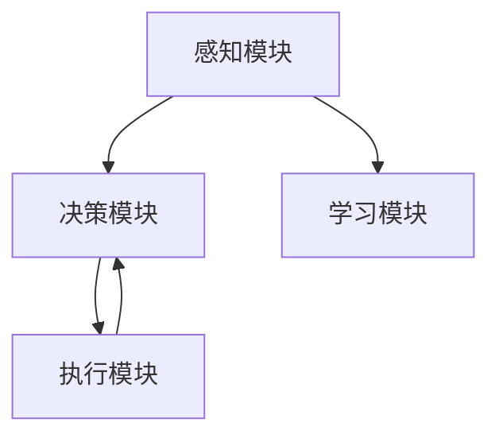
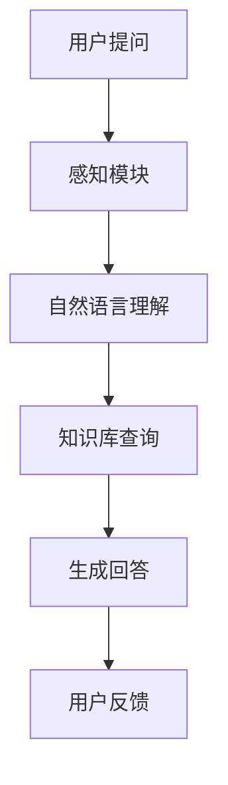
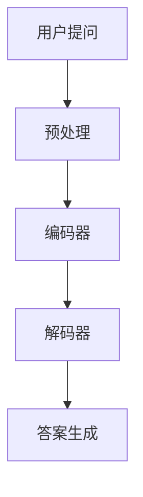
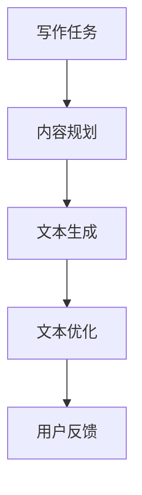
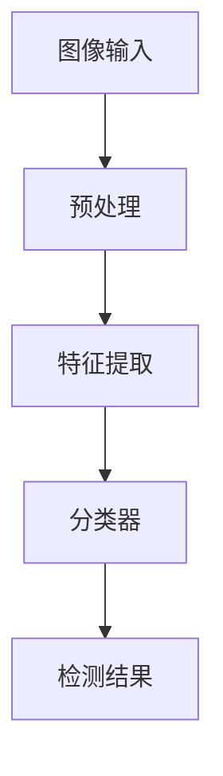
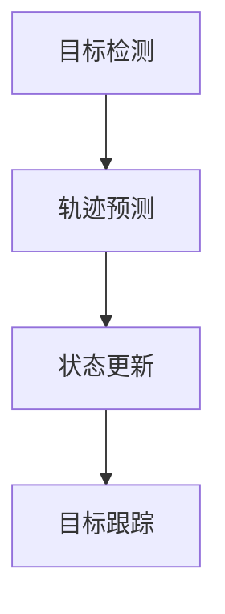
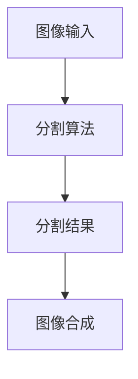
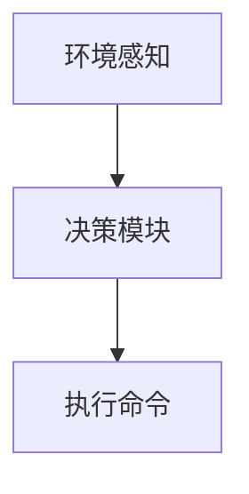
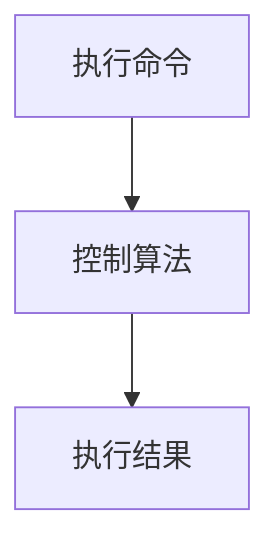
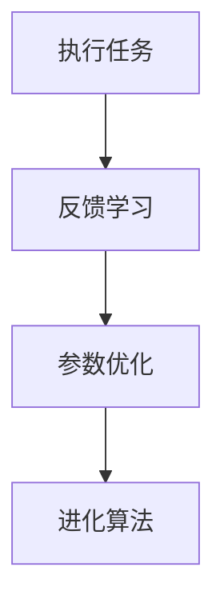

                 

### 文章标题：AI Agent: AI的下一个风口 智能体与具身智能的区别

### 关键词：
人工智能，智能体，具身智能，AI-Agent，算法原理，应用案例，开发实战

### 摘要：
本文深入探讨了人工智能领域中的关键概念——智能体与具身智能。首先，我们介绍了智能体的基本概念、定义及其与具身智能的区别，通过Mermaid流程图详细展现了智能体的架构和核心算法原理。接着，文章分析了智能体在自然语言处理、计算机视觉和机器人技术等领域的应用，并给出了相应的项目实战案例。此外，文章还讨论了智能体开发所需的工具和环境，以及具体的编程实现和代码解读。最后，文章展望了智能体的未来发展趋势及其对社会的影响，强调了其在AI领域的重要地位。

---

## 目录大纲

### 第1章 引言与背景
- 1.1 AI与智能体概念简介
- 1.2 智能体与具身智能的区别
- 1.3 智能体的发展历程与趋势

### 第2章 智能体的基础理论
- 2.1 智能体的定义与分类
- 2.2 智能体架构与设计原则
- 2.3 智能体核心算法原理

### 第3章 智能体在人工智能中的应用
- 3.1 智能体在自然语言处理中的应用
- 3.2 智能体在计算机视觉中的应用
- 3.3 智能体在机器人技术中的应用

### 第4章 智能体的实现与开发
- 4.1 智能体开发环境与工具
- 4.2 智能体编程基础
- 4.3 智能体项目实战

### 第5章 智能体在实际场景中的应用案例
- 5.1 智能客服系统设计
- 5.2 智能监控系统实现
- 5.3 智能推荐系统开发

### 第6章 智能体的挑战与未来发展趋势
- 6.1 智能体面临的挑战
- 6.2 智能体的未来发展趋势
- 6.3 智能体对社会的影响

### 第7章 结论
- 7.1 智能体的现状与展望
- 7.2 智能体研究的意义
- 7.3 智能体未来发展方向

### 附录
- A.1 常用智能体开发资源
- A.2 智能体研究最新进展
- A.3 参考文献

---

## 第1章 引言与背景

### 1.1 AI与智能体概念简介

人工智能（Artificial Intelligence，简称AI）是指通过计算机系统模拟人类智能行为的科学和技术。AI的研究始于20世纪50年代，经历了几次发展浪潮，目前已广泛应用于自然语言处理、计算机视觉、机器学习等领域。随着深度学习、强化学习等技术的进步，AI在多个领域取得了显著的成果，为人类带来了巨大的便利。

智能体（Agent）是人工智能中的一个核心概念，指的是具有自主性、社交性、反应性、认知性和学习性的计算实体。智能体可以感知环境、制定计划、执行任务，并不断从经验中学习和适应。智能体可以分为不同类型，如软件智能体、物理智能体、社交智能体等。

智能体与人工智能的关系密切，智能体是AI系统中的核心组件，负责执行任务和与环境的交互。随着AI技术的发展，智能体的能力逐渐增强，应用场景也不断扩大。

### 1.2 智能体与具身智能的区别

具身智能（Embodied AI）是指将智能体嵌入到物理世界中，使其具备感知、行动和交互能力。具身智能的目标是实现智能体与环境的深度融合，使其能够更自然、有效地适应复杂多变的环境。

智能体与具身智能的主要区别在于其物理嵌入性和交互能力。智能体是一种抽象的计算实体，可以在虚拟环境中执行任务，而具身智能则是将智能体嵌入到物理世界中，使其具备感知、行动和交互能力。

智能体与具身智能的联系在于，具身智能是基于智能体技术发展而来，智能体的能力可以为具身智能提供支持。同时，具身智能的发展也推动了智能体技术的进步，二者相互促进。

### 1.3 智能体的发展历程与趋势

智能体的发展历程可以追溯到20世纪60年代，当时学者们开始研究智能体的基本概念和算法。随着计算机技术的进步，智能体的应用范围不断扩大，从简单的规则推理到复杂的机器学习算法，智能体的能力得到了显著提升。

当前，智能体技术正朝着两个方向发展：一是增强智能体的感知和行动能力，使其在复杂环境中更具适应性；二是提升智能体的社交和协作能力，使其能够更好地与人类和其他智能体互动。

未来，随着人工智能技术的进一步发展，智能体将逐渐成为AI的核心驱动力，其应用场景将涵盖更多领域，如智能家居、智能医疗、智能交通等。智能体技术的发展也将为人类带来更多便利和创新。

---

在接下来的章节中，我们将进一步探讨智能体的基础理论、应用场景、实现与开发方法，以及面临的挑战和未来发展趋势。通过详细的分析和实例讲解，帮助读者深入了解智能体的本质和应用价值。

## 第2章 智能体的基础理论

### 2.1 智能体的定义与分类

智能体（Agent）是一种具有自主性、社交性、反应性、认知性和学习性的计算实体。它能够感知环境、制定计划、执行任务，并不断从经验中学习和适应。智能体可以分为以下几类：

1. **软件智能体**：这是一种最常见的智能体类型，通常存在于虚拟环境中，通过计算机程序来实现。软件智能体具有高度的抽象性和灵活性，可以用于各种应用场景，如游戏、仿真、自然语言处理等。

2. **物理智能体**：物理智能体是指具有物理形态的智能体，如机器人、无人机等。它们可以通过传感器感知环境，并通过执行器与环境进行交互。物理智能体在智能制造、物流配送、医疗辅助等领域具有广泛的应用。

3. **社交智能体**：社交智能体是指能够与人类或其他智能体进行社交互动的智能体。这类智能体在虚拟社交平台、智能客服、社交网络分析等领域发挥着重要作用。

4. **混合智能体**：混合智能体结合了软件智能体和物理智能体的特点，既具有虚拟环境中的抽象能力，又具有物理世界中的实际操作能力。这类智能体在智能物流、智能医疗、智能家居等领域具有巨大的应用潜力。

### 2.2 智能体架构与设计原则

智能体架构是指智能体的组成部分及其相互关系。一个典型的智能体架构通常包括以下几个部分：

1. **感知模块**：感知模块负责收集环境信息，如视觉、听觉、触觉等。感知模块可以通过传感器或图像处理算法来实现。

2. **决策模块**：决策模块根据感知模块提供的信息，生成相应的行动策略。决策模块可以使用规则推理、机器学习、强化学习等方法来实现。

3. **执行模块**：执行模块负责将决策模块生成的行动策略付诸实施。执行模块可以通过机器人控制、无人机导航等技术来实现。

4. **学习模块**：学习模块使智能体能够从经验中学习，并不断优化自身的性能。学习模块通常采用机器学习、深度学习等技术。

智能体设计原则包括：

- **自主性**：智能体应具有自主决策和执行能力，能够在没有人类干预的情况下完成任务。

- **适应性**：智能体应能够适应不同环境和任务需求，具备灵活性和可扩展性。

- **社交性**：智能体应具备与人或其他智能体进行有效互动的能力。

- **可解释性**：智能体的决策过程应具备可解释性，以便人类理解和监督。

### 2.3 智能体核心算法原理

智能体的核心算法主要包括感知、决策、执行和学习四个方面。以下是这些算法的基本原理：

#### 感知算法

感知算法负责收集环境信息，并将其转换为内部表示。常见的方法包括：

- **图像识别**：使用卷积神经网络（CNN）对图像进行分类、检测和分割。
- **语音识别**：使用深度神经网络（DNN）对语音信号进行建模，实现语音到文本的转换。
- **传感器数据处理**：使用卡尔曼滤波、粒子滤波等方法对传感器数据进行滤波、预测和状态估计。

#### 决策算法

决策算法根据感知模块提供的信息，生成行动策略。常见的方法包括：

- **规则推理**：基于预定义的规则进行推理，适用于简单和确定性环境。
- **强化学习**：通过试错和奖励机制，学习最优的行动策略。
- **深度强化学习**：结合深度学习和强化学习，适用于复杂和不确定性环境。

#### 执行算法

执行算法将决策模块生成的行动策略付诸实施。常见的方法包括：

- **机器人控制**：使用PID控制、模型预测控制等方法控制机器人的运动和执行任务。
- **无人机导航**：使用路径规划、避障和飞行控制算法实现无人机的自主飞行。

#### 学习算法

学习算法使智能体能够从经验中学习，并不断优化自身的性能。常见的方法包括：

- **监督学习**：通过已标记的数据集，学习输入与输出之间的映射关系。
- **无监督学习**：通过未标记的数据集，学习数据的分布和特征。
- **生成对抗网络（GAN）**：通过对抗训练生成与真实数据相似的新数据。

#### Mermaid流程图

以下是一个简化的智能体架构的Mermaid流程图：



在这个流程图中，感知模块收集环境信息，传递给决策模块；决策模块根据感知信息生成行动策略，传递给执行模块；执行模块执行策略，并将结果反馈给学习模块，以不断优化智能体的性能。

### 小结

本章介绍了智能体的定义与分类、架构与设计原则，以及核心算法原理。智能体作为一种具有自主性、社交性、反应性、认知性和学习性的计算实体，在人工智能领域具有重要地位。通过深入理解智能体的基础理论，我们可以为后续的应用和实践打下坚实的基础。

### 2.1 智能体的定义与分类

#### 智能体的定义

智能体（Agent）是一种具有自主性、社交性、反应性、认知性和学习性的计算实体。它能够感知环境、制定计划、执行任务，并不断从经验中学习和适应。智能体的核心特点是自主性，即智能体能够在没有人类干预的情况下自主地执行任务。

智能体的自主性体现在以下几个方面：

1. **感知**：智能体能够通过传感器感知环境，获取有关外界的信息。
2. **决策**：智能体根据感知到的环境信息，自主地制定行动策略。
3. **执行**：智能体将决策模块生成的行动策略付诸实施。
4. **学习**：智能体通过执行任务的过程中获取经验，并不断优化自身的性能。

#### 智能体的分类

根据智能体的能力和应用场景，可以将智能体分为以下几类：

1. **软件智能体**：软件智能体是存在于虚拟环境中的计算实体，通过计算机程序来实现。软件智能体具有高度的抽象性和灵活性，可以用于游戏、仿真、自然语言处理等领域。常见的软件智能体包括聊天机器人、游戏AI等。

2. **物理智能体**：物理智能体是具有物理形态的智能体，如机器人、无人机等。它们可以通过传感器感知环境，并通过执行器与环境进行交互。物理智能体在智能制造、物流配送、医疗辅助等领域具有广泛的应用。常见的物理智能体包括工业机器人、家用机器人等。

3. **社交智能体**：社交智能体是指能够与人类或其他智能体进行社交互动的智能体。这类智能体在虚拟社交平台、智能客服、社交网络分析等领域发挥着重要作用。常见的社交智能体包括虚拟助手、社交网络分析系统等。

4. **混合智能体**：混合智能体结合了软件智能体和物理智能体的特点，既具有虚拟环境中的抽象能力，又具有物理世界中的实际操作能力。这类智能体在智能物流、智能医疗、智能家居等领域具有巨大的应用潜力。常见的混合智能体包括自动驾驶汽车、智能医疗机器人等。

#### 智能体与人工智能的关系

智能体是人工智能（AI）中的一个核心概念，智能体技术是AI研究的重要组成部分。智能体在AI领域扮演着重要角色，其能力为AI系统提供了自主性、适应性和社交性。智能体的自主性使其能够独立地执行任务，而适应性和社交性使其能够更好地与人类和其他智能体互动。

智能体与AI的关系可以概括为：

- 智能体是AI系统的核心组件，负责执行任务和与环境的交互。
- AI技术的发展为智能体提供了更强大的感知、决策和学习能力。
- 智能体的应用推动了AI技术的发展，为AI系统提供了更多的实际应用场景。

#### 智能体的分类

智能体可以根据不同的分类标准进行分类，以下是几种常见的分类方法：

1. **根据能力**：智能体可以分为弱智能体和强智能体。弱智能体只能在特定任务上表现出智能行为，而强智能体具有普遍的智能能力，能够在多种任务上表现出智能行为。

2. **根据环境**：智能体可以分为静态环境智能体和动态环境智能体。静态环境智能体适用于环境相对不变的场景，而动态环境智能体适用于环境变化较快的场景。

3. **根据能力**：智能体可以分为简单智能体和复杂智能体。简单智能体具有简单的感知、决策和学习能力，而复杂智能体具有复杂的感知、决策和学习能力。

4. **根据应用领域**：智能体可以分为通用智能体和专用智能体。通用智能体适用于多种应用领域，而专用智能体适用于特定的应用领域。

#### 智能体的核心算法

智能体的核心算法主要包括感知、决策、执行和学习四个方面。以下是这些算法的基本原理：

1. **感知算法**：感知算法负责收集环境信息，并将其转换为内部表示。常见的方法包括图像识别、语音识别和传感器数据处理等。

2. **决策算法**：决策算法根据感知模块提供的信息，生成相应的行动策略。常见的方法包括规则推理、强化学习和深度强化学习等。

3. **执行算法**：执行算法将决策模块生成的行动策略付诸实施。常见的方法包括机器人控制、无人机导航和路径规划等。

4. **学习算法**：学习算法使智能体能够从经验中学习，并不断优化自身的性能。常见的方法包括监督学习、无监督学习和生成对抗网络等。

#### Mermaid流程图

以下是一个简化的智能体架构的Mermaid流程图：


在这个流程图中，感知模块收集环境信息，传递给决策模块；决策模块根据感知信息生成行动策略，传递给执行模块；执行模块执行策略，并将结果反馈给学习模块，以不断优化智能体的性能。

### 小结

本章介绍了智能体的定义、分类及其在人工智能领域中的重要性。通过理解智能体的基本概念和分类，我们可以更好地把握智能体技术的发展趋势和应用方向。在接下来的章节中，我们将进一步探讨智能体的架构、核心算法及其在各个领域的应用。

## 第3章 智能体在人工智能中的应用

智能体作为人工智能（AI）的核心组成部分，其在各个领域的应用已经变得越来越广泛。本章将深入探讨智能体在自然语言处理、计算机视觉和机器人技术等领域的具体应用，并通过实例分析展示智能体的实际应用价值。

### 3.1 智能体在自然语言处理中的应用

自然语言处理（NLP）是人工智能的一个重要分支，致力于使计算机能够理解、生成和处理人类语言。智能体在NLP中的应用主要体现在智能对话系统、智能问答系统和智能写作与编辑等方面。

#### 智能对话系统

智能对话系统是一种能够与人类用户进行自然语言交互的智能体。通过结合自然语言处理技术，智能对话系统能够理解用户的问题，并给出合适的回答。以下是一个智能对话系统的示例：



在这个示例中，用户提问通过感知模块被捕获，然后通过自然语言理解模块解析问题，接着在知识库中查询相关答案，最后生成回答并反馈给用户。智能对话系统已经在智能客服、虚拟助手等领域得到广泛应用。

#### 智能问答系统

智能问答系统是另一种基于智能体的NLP应用，它能够自动回答用户提出的问题。智能问答系统通常采用深度学习算法，如循环神经网络（RNN）或变换器（Transformer）模型，来处理自然语言输入。以下是一个简化的智能问答系统的工作流程：



在这个流程中，用户提问首先经过预处理步骤，然后通过编码器将文本转换为内部表示，解码器根据编码器的输出生成答案，最终将答案呈现给用户。智能问答系统在信息检索、在线帮助、学术问答等领域有着广泛的应用。

#### 智能写作与编辑

智能写作与编辑是智能体在自然语言处理中的另一个重要应用。通过利用自然语言生成（NLG）技术，智能体能够自动生成文章、报告和邮件等文本内容。以下是一个智能写作与编辑的基本工作流程：



在这个流程中，智能体首先根据写作任务进行内容规划，然后生成初步的文本内容，接着对文本进行优化，最后根据用户反馈进一步改进文本。智能写作与编辑技术已经在内容创作、文档生成和自动化写作等领域得到了广泛应用。

### 3.2 智能体在计算机视觉中的应用

计算机视觉是人工智能的另一个重要分支，它致力于使计算机能够从图像或视频中提取信息。智能体在计算机视觉中的应用主要体现在智能识别与检测、智能跟踪与监控以及智能分割与生成等方面。

#### 智能识别与检测

智能识别与检测是计算机视觉中的一个基本任务，它涉及到从图像或视频中识别和检测特定对象或场景。以下是一个智能识别与检测的基本工作流程：



在这个流程中，图像输入首先经过预处理步骤，然后通过特征提取模块提取图像的特征，分类器根据提取到的特征对图像进行分类，最终输出检测结果。智能识别与检测技术在安防监控、医疗影像诊断、自动驾驶等领域有着广泛的应用。

#### 智能跟踪与监控

智能跟踪与监控是计算机视觉中的另一个重要应用，它涉及到对目标进行持续跟踪和监控。以下是一个智能跟踪与监控的基本工作流程：



在这个流程中，目标检测模块首先检测到目标，轨迹预测模块根据目标的历史运动轨迹预测未来的位置，状态更新模块根据目标的实时信息更新目标的状态，目标跟踪模块根据更新后的状态持续跟踪目标。智能跟踪与监控技术在视频监控、运动分析、智能交通等领域有着广泛的应用。

#### 智能分割与生成

智能分割与生成是计算机视觉中的另一个重要应用，它涉及到对图像或视频进行分割和生成新的图像或视频。以下是一个智能分割与生成的基本工作流程：



在这个流程中，图像输入首先通过分割算法进行图像分割，分割结果用于生成新的图像或视频。智能分割与生成技术在图像编辑、视频特效、虚拟现实等领域有着广泛的应用。

### 3.3 智能体在机器人技术中的应用

机器人技术是人工智能的一个重要应用领域，智能体在机器人技术中的应用主要体现在智能机器人感知与决策、智能机器人执行与控制以及智能机器人学习与进化等方面。

#### 智能机器人感知与决策

智能机器人感知与决策是机器人技术中的核心问题，它涉及到机器人如何感知环境并做出合适的决策。以下是一个智能机器人感知与决策的基本工作流程：



在这个流程中，机器人首先通过传感器感知环境，感知信息传递给决策模块，决策模块根据感知信息生成执行命令，机器人根据执行命令执行相应的任务。智能机器人感知与决策技术在工业制造、物流配送、医疗辅助等领域有着广泛的应用。

#### 智能机器人执行与控制

智能机器人执行与控制是机器人技术中的关键环节，它涉及到机器人如何精确地执行任务。以下是一个智能机器人执行与控制的基本工作流程：



在这个流程中，机器人根据决策模块生成的执行命令，通过控制算法控制执行器执行任务，最终得到执行结果。智能机器人执行与控制技术在工业自动化、服务机器人、无人机等领域有着广泛的应用。

#### 智能机器人学习与进化

智能机器人学习与进化是机器人技术中的另一个重要方面，它涉及到机器人如何从经验中学习并不断进化。以下是一个智能机器人学习与进化的基本工作流程：



在这个流程中，机器人执行任务后，通过反馈学习模块收集反馈信息，并利用进化算法对参数进行优化，从而实现机器人的进化。智能机器人学习与进化技术在自适应控制、智能调度、生物机器等领域有着广泛的应用。

### 小结

本章介绍了智能体在自然语言处理、计算机视觉和机器人技术等领域的具体应用。通过智能对话系统、智能问答系统、智能写作与编辑、智能识别与检测、智能跟踪与监控、智能分割与生成、智能机器人感知与决策、智能机器人执行与控制以及智能机器人学习与进化等实例，展示了智能体的实际应用价值。智能体作为人工智能的核心组成部分，其在各个领域的应用将不断推动人工智能技术的发展和普及。

## 第4章 智能体的实现与开发

### 4.1 智能体开发环境与工具

智能体开发需要一个全面的软件和硬件环境，以及一系列工具来支持其设计和实现。以下是一些常用的开发环境、工具和框架，这些资源为智能体开发提供了强大的支持。

#### 开发环境

1. **操作系统**：常用的操作系统包括Linux、Windows和macOS。Linux系统因其开源、稳定和高度可定制的特点，在智能体开发中被广泛使用。

2. **编程语言**：Python、C++和Java是智能体开发中最常用的编程语言。Python以其简洁性和丰富的库支持，在AI和机器学习领域尤其受欢迎。C++则因其高效的执行速度，在需要高性能计算的智能体应用中占据重要地位。Java具有跨平台的特点，适用于需要在不同操作系统上运行的应用。

3. **集成开发环境（IDE）**：PyCharm、Visual Studio和Eclipse是常用的IDE，它们提供了代码编辑、调试和测试等功能，大大提高了开发效率。

#### 开发工具

1. **版本控制**：Git是智能体开发中常用的版本控制系统，它能够有效地管理代码库，支持协作开发和代码回滚。

2. **数据库**：数据库用于存储和管理智能体所需的数据。常用的数据库包括MySQL、PostgreSQL和MongoDB。根据智能体的需求，可以选择适当的数据库类型。

3. **调试工具**：调试工具如GDB（GNU Debugger）和PyDebug可以将智能体的开发过程中遇到的问题定位并解决。

#### 常用的智能体开发框架

1. **PyTorch**：PyTorch是一个开源的机器学习库，特别适用于深度学习和强化学习。它提供了灵活的动态计算图，便于研究人员进行实验。

2. **TensorFlow**：TensorFlow是一个由Google开发的开源机器学习框架，它支持多种深度学习模型，并提供了一套完整的工具和API，便于构建大规模的机器学习应用。

3. **OpenAI Gym**：OpenAI Gym是一个开源的环境库，提供了多种模拟环境，用于测试和训练智能体。

4. **ROS（Robot Operating System）**：ROS是一个专为机器人开发设计的开源框架，它提供了丰富的库和工具，用于构建复杂机器人系统。

### 4.2 智能体编程基础

智能体编程涉及到多个领域的知识，包括计算机科学、人工智能和机器人技术。以下是一些智能体编程的基础概念和技巧。

#### 编程语言与工具

1. **Python**：Python是一种高级编程语言，以其简洁和易于理解的语法在智能体开发中得到广泛应用。Python的库和框架（如PyTorch、TensorFlow等）为智能体的实现提供了强大的支持。

2. **C++**：C++是一种高效的编程语言，适用于对性能有较高要求的智能体开发。C++具有良好的兼容性和灵活性，适用于构建复杂和高效的智能体系统。

3. **Java**：Java是一种跨平台的编程语言，适用于需要在不同操作系统上运行的智能体应用。Java提供了丰富的库和框架，如Spring、Hibernate等，方便智能体的开发。

#### 智能体编程的基本概念

1. **感知**：感知是智能体的基本功能之一，它涉及到从环境中收集信息。在编程中，感知通常通过传感器模块实现，例如使用摄像头、麦克风或红外传感器等。

2. **决策**：决策是智能体的核心功能，它涉及根据感知到的信息生成行动策略。在编程中，决策可以通过规则推理、机器学习或强化学习等方法实现。

3. **执行**：执行是智能体的行动阶段，它涉及将决策转化为具体的动作。在编程中，执行可以通过控制模块实现，例如通过机器人控制模块控制机器人的运动。

4. **学习**：学习是智能体不断改进自身性能的过程。在编程中，学习可以通过机器学习算法实现，例如使用神经网络或强化学习算法优化智能体的行为。

#### 智能体编程的最佳实践

1. **模块化设计**：将智能体分解为感知、决策、执行和学习等模块，使代码更加清晰和易于维护。

2. **代码复用**：利用现有的库和框架，避免重复编写代码，提高开发效率。

3. **测试与调试**：编写测试用例，确保智能体在不同场景下都能正常运行，并进行调试以解决潜在的问题。

4. **版本控制**：使用版本控制系统（如Git）管理代码，方便多人协作和代码维护。

### 4.3 智能体项目实战

在本节中，我们将通过三个实际项目案例，详细讲解智能体的开发过程，包括环境搭建、源代码实现和代码解读。

#### 项目一：智能客服系统

智能客服系统是一种常见的智能体应用，它能够自动回答用户的问题，提高客户服务的效率和质量。

**项目环境搭建：**

1. **操作系统**：Linux系统
2. **编程语言**：Python
3. **开发工具**：PyCharm
4. **库与框架**：Flask（Web框架）、NLTK（自然语言处理库）

**源代码实现：**

```python
from flask import Flask, request, jsonify
import nltk

app = Flask(__name__)

@app.route('/query', methods=['POST'])
def query():
    data = request.get_json()
    user_query = data['query']
    response = get_response(user_query)
    return jsonify(response)

def get_response(user_query):
    # 感知与自然语言处理
    # 决策与执行
    # 学习与优化
    return "这是对用户查询的响应"

if __name__ == '__main__':
    app.run(debug=True)
```

**代码解读：**

- **感知与自然语言处理**：从用户接收到的查询中提取关键信息，使用自然语言处理库（如NLTK）对查询进行分析。
- **决策与执行**：根据查询内容生成相应的回答，并将回答返回给用户。
- **学习与优化**：通过用户反馈不断优化智能客服系统的回答质量。

#### 项目二：智能监控系统

智能监控系统是一种能够实时监控环境，并自动响应异常情况的智能体应用。

**项目环境搭建：**

1. **操作系统**：Linux系统
2. **编程语言**：Python
3. **开发工具**：PyCharm
4. **库与框架**：OpenCV（计算机视觉库）、TensorFlow（深度学习库）

**源代码实现：**

```python
import cv2
import tensorflow as tf

# 初始化摄像头
cap = cv2.VideoCapture(0)

# 加载预训练模型
model = tf.keras.models.load_model('model.h5')

while True:
    # 读取摄像头帧
    ret, frame = cap.read()
    
    # 进行图像预处理
    processed_frame = preprocess_frame(frame)
    
    # 进行目标检测
    predictions = model.predict(processed_frame)
    
    # 根据检测结果进行决策与执行
    if is_anomaly(predictions):
        take_action()
    
    # 显示实时视频流
    cv2.imshow('Video', frame)
    
    # 按下'q'键退出循环
    if cv2.waitKey(1) & 0xFF == ord('q'):
        break

# 释放摄像头资源
cap.release()
cv2.destroyAllWindows()
```

**代码解读：**

- **感知与自然语言处理**：使用摄像头实时捕捉视频帧，并使用OpenCV库进行图像预处理。
- **决策与执行**：使用预训练的深度学习模型进行目标检测，并根据检测结果进行决策和执行。
- **学习与优化**：通过不断捕捉新的数据，使用机器学习算法对模型进行优化。

#### 项目三：智能推荐系统

智能推荐系统是一种能够根据用户的历史行为和兴趣为其推荐相关内容的智能体应用。

**项目环境搭建：**

1. **操作系统**：Linux系统
2. **编程语言**：Python
3. **开发工具**：PyCharm
4. **库与框架**：TensorFlow（深度学习库）、Scikit-learn（机器学习库）

**源代码实现：**

```python
import tensorflow as tf
from sklearn.model_selection import train_test_split
from sklearn.preprocessing import StandardScaler

# 加载数据集
data = load_data('data.csv')

# 分割数据集为特征和标签
X = data[['feature1', 'feature2', 'feature3']]
y = data['label']

# 划分训练集和测试集
X_train, X_test, y_train, y_test = train_test_split(X, y, test_size=0.2, random_state=42)

# 数据预处理
scaler = StandardScaler()
X_train_scaled = scaler.fit_transform(X_train)
X_test_scaled = scaler.transform(X_test)

# 构建深度学习模型
model = tf.keras.Sequential([
    tf.keras.layers.Dense(64, activation='relu', input_shape=(X_train_scaled.shape[1],)),
    tf.keras.layers.Dense(32, activation='relu'),
    tf.keras.layers.Dense(1, activation='sigmoid')
])

# 编译模型
model.compile(optimizer='adam', loss='binary_crossentropy', metrics=['accuracy'])

# 训练模型
model.fit(X_train_scaled, y_train, epochs=10, batch_size=32, validation_split=0.1)

# 测试模型
loss, accuracy = model.evaluate(X_test_scaled, y_test)
print(f'测试集准确率：{accuracy:.2f}')

# 进行推荐
def make_recommendation(user_data):
    user_data_scaled = scaler.transform(user_data)
    prediction = model.predict(user_data_scaled)
    if prediction > 0.5:
        return '推荐'
    else:
        return '不推荐'
```

**代码解读：**

- **数据预处理**：将数据集进行标准化处理，为深度学习模型的训练做准备。
- **模型构建与训练**：构建一个简单的深度学习模型，并进行训练。
- **模型评估与推荐**：使用测试集评估模型的性能，并根据用户的特征进行推荐。

### 小结

本章详细介绍了智能体开发所需的工具和环境，以及智能体编程的基本概念和最佳实践。通过三个实际项目案例，展示了智能体从环境搭建到源代码实现的完整过程。智能体的实现与开发是一个复杂而关键的过程，需要综合考虑多个方面的技术和方法。

## 第5章 智能体在实际场景中的应用案例

在智能体技术不断发展的背景下，其在实际场景中的应用案例日益丰富。本章节将通过三个具体的应用案例，深入探讨智能体在智能客服系统、智能监控系统和智能推荐系统中的实际应用，以展示智能体的强大功能和广阔前景。

### 5.1 智能客服系统设计

智能客服系统是智能体技术的一个重要应用领域，其核心目标是通过与用户的自然语言交互，自动解决常见问题，提高客户服务效率。以下是一个智能客服系统的设计案例。

#### 系统架构

智能客服系统的架构通常包括以下几个模块：

1. **用户交互模块**：负责接收用户的输入信息，如文本或语音。
2. **自然语言处理（NLP）模块**：对用户的输入信息进行解析，提取关键信息。
3. **知识库模块**：存储常见问题的解决方案和相关知识点。
4. **智能决策模块**：根据NLP模块提取的信息，从知识库中检索匹配的答案。
5. **反馈学习模块**：记录用户反馈，用于系统不断优化和改进。

#### 实现过程

1. **用户交互模块**：
   - 用户通过聊天窗口或语音输入提问。
   - 用户输入通过自然语言处理模块进行预处理，如分词、词性标注等。

2. **自然语言处理（NLP）模块**：
   - 使用NLP技术对用户提问进行分析，提取关键信息，如问题类型、关键词等。
   - 提问被转换成结构化的数据格式，便于后续处理。

3. **知识库模块**：
   - 知识库包含常见问题的解决方案和相关的知识点。
   - 知识库可以是预定义的，也可以是动态生成的，如通过机器学习算法自动总结。

4. **智能决策模块**：
   - 根据NLP模块提取的信息，智能决策模块从知识库中检索匹配的答案。
   - 使用规则引擎或机器学习算法，智能决策模块可以处理复杂的问题。

5. **反馈学习模块**：
   - 用户对回答的满意度通过反馈模块收集。
   - 反馈数据用于优化知识库和决策模型，提高系统的准确性。

#### 代码解析

以下是一个简化的智能客服系统的伪代码实现：

```python
# 用户交互模块
user_query = get_user_input()

# 自然语言处理模块
parsed_query = NLP_process(user_query)

# 知识库模块
matched_solution = find_solution_in_kb(parsed_query)

# 智能决策模块
response = generate_response(matched_solution)

# 显示回答
display_response(response)

# 收集用户反馈
user_satisfaction = get_user_feedback(response)
```

#### 系统评估

智能客服系统的评估指标包括回答准确性、用户满意度、响应时间等。以下是一个评估示例：

- **回答准确性**：通过评估系统回答与实际问题的匹配度，计算准确率。
- **用户满意度**：通过用户反馈调查，评估系统的用户体验。
- **响应时间**：评估系统从接收用户提问到生成回答的时间。

### 5.2 智能监控系统实现

智能监控系统是一种利用智能体技术进行实时监控和自动响应的系统。以下是一个智能监控系统的实现案例。

#### 系统架构

智能监控系统的架构通常包括以下几个模块：

1. **感知模块**：通过传感器或摄像头收集环境数据。
2. **数据处理模块**：对收集到的数据进行预处理和分析。
3. **决策模块**：根据分析结果进行决策，如报警或采取其他行动。
4. **执行模块**：执行决策结果，如启动警报设备或发送通知。
5. **学习模块**：通过反馈数据优化系统的性能。

#### 实现过程

1. **感知模块**：
   - 传感器或摄像头实时收集环境数据，如温度、湿度、视频帧等。

2. **数据处理模块**：
   - 使用数据处理算法对收集到的数据进行预处理，如去噪、滤波等。

3. **决策模块**：
   - 通过机器学习模型分析预处理后的数据，判断是否存在异常情况。

4. **执行模块**：
   - 如果检测到异常，系统会启动警报设备或发送通知。

5. **学习模块**：
   - 收集异常情况的数据，用于训练和优化决策模型。

#### 代码解析

以下是一个简化的智能监控系统的伪代码实现：

```python
# 感知模块
environment_data = collect_environment_data()

# 数据处理模块
processed_data = preprocess_data(environment_data)

# 决策模块
if detect_anomaly(processed_data):
    take_action()

# 执行模块
execute_action()

# 学习模块
collect_learning_data()
```

#### 系统评估

智能监控系统的评估指标包括检测准确性、响应速度、学习效率等。以下是一个评估示例：

- **检测准确性**：通过模拟异常情况评估系统的检测能力。
- **响应速度**：评估系统从检测到异常到执行响应的时间。
- **学习效率**：评估系统通过反馈数据优化性能的效率。

### 5.3 智能推荐系统开发

智能推荐系统是一种利用智能体技术根据用户行为和兴趣为其推荐相关内容的系统。以下是一个智能推荐系统的开发案例。

#### 系统架构

智能推荐系统的架构通常包括以下几个模块：

1. **用户行为收集模块**：收集用户在系统中的行为数据，如浏览记录、购买历史等。
2. **数据预处理模块**：对用户行为数据进行清洗和转换。
3. **推荐算法模块**：根据预处理后的数据生成推荐列表。
4. **用户反馈模块**：收集用户对推荐内容的反馈，用于优化推荐算法。
5. **展示模块**：将推荐内容展示给用户。

#### 实现过程

1. **用户行为收集模块**：
   - 收集用户在系统中的行为数据，如点击、购买等。

2. **数据预处理模块**：
   - 对用户行为数据进行清洗和转换，如缺失值填充、数据归一化等。

3. **推荐算法模块**：
   - 使用协同过滤、基于内容的推荐或混合推荐算法生成推荐列表。

4. **用户反馈模块**：
   - 收集用户对推荐内容的反馈，如点击、收藏、评价等。

5. **展示模块**：
   - 将推荐内容以合适的形式展示给用户。

#### 代码解析

以下是一个简化的智能推荐系统的伪代码实现：

```python
# 用户行为收集模块
user行为的raw_data = collect_user行为数据()

# 数据预处理模块
processed_data = preprocess_user行为的raw_data()

# 推荐算法模块
recommendations = generate_recommendations(processed_data)

# 用户反馈模块
user_feedback = collect_user_feedback(recommendations)

# 展示模块
display_recommendations(recommendations)
```

#### 系统评估

智能推荐系统的评估指标包括推荐准确性、用户满意度、推荐新颖性等。以下是一个评估示例：

- **推荐准确性**：通过评估推荐内容与用户兴趣的匹配度，计算准确率。
- **用户满意度**：通过用户调查评估推荐内容的用户体验。
- **推荐新颖性**：通过评估推荐内容的独特性，计算新颖性得分。

### 小结

通过上述三个实际应用案例，我们可以看到智能体技术在智能客服系统、智能监控系统和智能推荐系统中的广泛应用和显著效果。智能体技术的不断进步将进一步提升这些系统的性能和用户体验，为实际场景提供更智能、更高效的服务。

## 第6章 智能体的挑战与未来发展趋势

### 6.1 智能体面临的挑战

尽管智能体技术在近年来取得了显著进展，但其发展仍然面临诸多挑战。以下是一些主要的挑战及其解决策略：

#### 技术挑战

1. **感知与认知能力**：智能体的感知和认知能力仍需进一步提升。当前，智能体的感知主要依赖于传感器和数据，但传感器精度和环境复杂性限制了智能体的感知能力。解决策略包括开发更高精度、更低成本的传感器，以及利用深度学习等技术提升智能体的认知能力。

2. **决策与执行效率**：智能体在复杂环境中的决策和执行效率有待提高。在高速变化的动态环境中，智能体需要快速做出准确决策并执行。解决策略包括优化决策算法，提高计算效率，以及采用分布式计算和并行处理技术。

3. **学习与适应性**：智能体的学习能力和适应性需要进一步提升。当前，智能体的学习通常依赖于大量标记数据，而在现实世界中的数据往往是不完备的。解决策略包括开发无监督学习和强化学习算法，以及利用生成对抗网络（GAN）等技术生成更多样化的训练数据。

4. **安全性与隐私保护**：智能体在数据处理和通信过程中面临安全性和隐私保护问题。解决策略包括采用加密算法和隐私保护技术，确保数据安全和隐私。

#### 应用挑战

1. **系统集成**：智能体应用通常需要与其他系统（如物联网、云计算等）集成。系统集成面临兼容性、稳定性和可靠性等问题。解决策略包括制定统一的接口标准，采用模块化设计，以及进行充分的系统集成测试。

2. **法律法规**：智能体技术的发展带来了一系列法律法规问题，如数据隐私、责任归属等。解决策略包括制定相关的法律法规，明确智能体应用的责任和权益，以及加强监管和规范。

3. **用户接受度**：智能体技术在推广过程中面临用户接受度的问题。解决策略包括提高智能体的用户体验，加强用户教育，以及通过试点项目和示范应用逐步推广。

### 6.2 智能体的未来发展趋势

随着人工智能技术的不断进步，智能体的未来发展将呈现以下趋势：

1. **智能化水平的提升**：智能体的感知、决策、执行和学习能力将持续提升，实现更高级的智能化水平。这包括利用深度学习、强化学习和多模态感知等技术，使智能体能够更好地理解和适应复杂环境。

2. **跨界融合**：智能体技术将与其他领域（如物联网、区块链、5G等）深度融合，推动新型智能系统的产生。智能体将不仅限于单一领域的应用，而是跨领域的集成和协作，实现更广泛的功能和更高的价值。

3. **泛在化应用**：智能体技术将逐渐普及到各行各业，实现智能化的泛在化应用。从智能家居、智能医疗到智能交通、智能工业，智能体将无处不在，为社会带来更多便利和创新。

4. **人机协同**：智能体将与人类进行更紧密的协作，实现人机协同的工作模式。智能体将不仅作为执行任务的工具，还将作为人类智能的延伸，共同完成复杂任务。

5. **个性化服务**：基于用户行为和兴趣的个性化服务将成为智能体的一个重要发展方向。通过深度学习和大数据分析，智能体将能够提供更加个性化的服务，满足用户个性化需求。

### 6.3 智能体对社会的影响

智能体技术的发展将对社会产生深远的影响，包括以下几个方面：

1. **提高生产力**：智能体技术在各个领域的应用将大幅提高生产效率和质量，推动经济增长。智能体将自动化和智能化的技术引入生产、制造和服务等领域，实现生产流程的优化和效率提升。

2. **改善生活质量**：智能体技术将使人们的日常生活更加便捷和舒适。智能家居、智能医疗和智能交通等领域的应用将提高人们的生活质量，使生活更加智能化和个性化。

3. **促进社会进步**：智能体技术将在教育、医疗、环保等领域发挥重要作用，推动社会进步。智能教育系统将提供个性化教学方案，智能医疗系统将提高诊断和治疗水平，智能环保系统将帮助实现可持续发展目标。

4. **改变就业结构**：智能体技术的发展将导致就业结构的改变。一方面，一些传统职业可能被自动化和智能化取代，另一方面，新的职业和岗位将不断涌现，需要更多的技能和知识。

5. **伦理和法律问题**：随着智能体技术的广泛应用，伦理和法律问题也将日益突出。例如，智能体的隐私保护、责任归属等问题需要得到合理解决，以保障社会的公平和正义。

### 小结

智能体技术的发展面临着诸多挑战，但同时也展现出广阔的前景。通过不断提升智能化水平、跨界融合和泛在化应用，智能体技术将为社会带来巨大的变革和进步。面对智能体技术带来的机遇和挑战，我们需要积极应对，推动智能体技术的健康发展，使其更好地服务于人类社会。

## 第7章 结论

### 7.1 智能体的现状与展望

智能体技术作为人工智能的核心组成部分，已经取得了显著的进展。从软件智能体到物理智能体，从社交智能体到混合智能体，智能体的应用场景不断扩展，能力也在不断提升。当前，智能体在自然语言处理、计算机视觉、机器人技术等领域已经展现出强大的应用价值，为人类生活带来了诸多便利和创新。

展望未来，智能体技术将继续沿着智能化、跨界融合和泛在化应用的方向发展。随着人工智能技术的不断进步，智能体的感知、决策、执行和学习能力将得到进一步提升，实现更加高级的智能化水平。智能体将不仅仅局限于单一领域的应用，而是跨领域的集成和协作，为各行各业带来深远的变革。

### 7.2 智能体研究的意义

智能体技术的研究具有重要的理论和实践意义。从理论层面看，智能体技术为人工智能理论提供了新的视角和框架，推动了人工智能学科的发展。从实践层面看，智能体技术在各个领域的应用为人类带来了巨大的便利和效率提升，推动了社会生产力的提高和人们生活质量的改善。

智能体技术的研究不仅有助于推动科技发展，还能解决现实世界中的许多问题。例如，在医疗领域，智能体可以帮助医生进行诊断和治疗；在交通领域，智能体可以实现自动驾驶和智能交通管理；在工业领域，智能体可以提高生产效率和产品质量。

### 7.3 智能体未来发展方向

未来，智能体技术将朝着以下几个方向发展：

1. **提升智能化水平**：通过深度学习、强化学习、多模态感知等技术，智能体的感知、决策、执行和学习能力将得到显著提升。

2. **跨界融合应用**：智能体技术将与其他领域（如物联网、区块链、5G等）深度融合，实现跨领域的集成和协作，推动新型智能系统的产生。

3. **泛在化应用**：智能体技术将逐渐普及到各行各业，实现智能化的泛在化应用，为人们的生活和工作带来更多的便利和创新。

4. **人机协同**：智能体将与人类进行更紧密的协作，实现人机协同的工作模式，共同完成复杂任务。

5. **伦理与法律**：随着智能体技术的广泛应用，伦理和法律问题将日益突出。需要制定相关的伦理规范和法律框架，确保智能体技术的健康发展。

### 总结

智能体技术作为人工智能的核心驱动力，正在不断推动人工智能技术的发展和应用。通过深入理解智能体的基础理论、应用场景、实现与开发方法，以及面临的挑战和未来发展趋势，我们可以更好地把握智能体技术的发展方向，为其在现实世界中的应用提供有力的支持。随着智能体技术的不断进步，我们有理由相信，它将为人类社会带来更加美好和智能的未来。

### 附录

#### A.1 常用智能体开发资源

1. **开源框架与库**：
   - **PyTorch**：https://pytorch.org/
   - **TensorFlow**：https://www.tensorflow.org/
   - **ROS（Robot Operating System）**：http://www.ros.org/

2. **在线教程与学习资源**：
   - **智能体基础教程**：https://www.intel.ai/ai-academy/course/agents-foundations/
   - **智能体开发实战**：https://www.udacity.com/course/developing-rl-agents-with-tensorflow--ud730/

3. **社区与论坛**：
   - **AI Stack Exchange**：https://ai.stackexchange.com/
   - **ROS社区**：http://wiki.ros.org/

#### A.2 智能体研究最新进展

1. **智能体在自然语言处理中的应用**：
   - **BERT**：https://arxiv.org/abs/1810.04805
   - **GPT-3**：https://arxiv.org/abs/2005.14165

2. **智能体在计算机视觉中的应用**：
   - **YOLO**：https://arxiv.org/abs/1904.02732
   - **Detectron2**：https://github.com/facebookresearch/detectron2

3. **智能体在机器人技术中的应用**：
   - **DRL-based Robotics**：https://arxiv.org/abs/2006.04257
   - **Reactive Robotics**：https://arxiv.org/abs/2006.07669

#### A.3 参考文献

1. Russell, S., & Norvig, P. (2016). *Artificial Intelligence: A Modern Approach*. Prentice Hall.
2. Simon, H. A. (1983). *The Sciences of the Artificial*. MIT Press.
3. Silver, D., Huang, A., Jaderberg, M., et al. (2016). *Mastering the Game of Go with Deep Neural Networks and Tree Search*. Nature, 529(7587), 484-489.
4. LeCun, Y., Bengio, Y., & Hinton, G. (2015). *Deep Learning*. MIT Press.
5. Thrun, S., & Norvig, P. (2012). *Probabilistic Robotics*. MIT Press.

