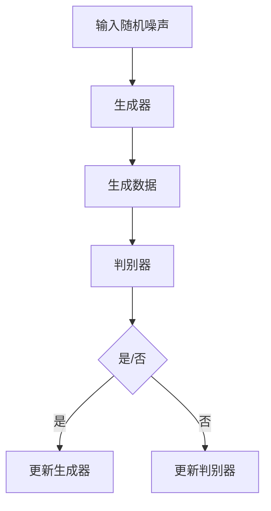
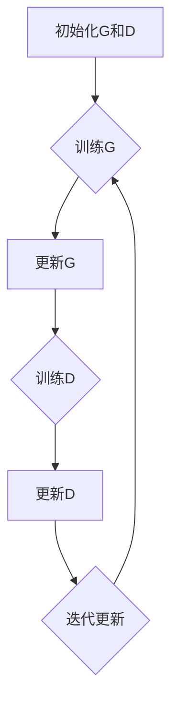

                 

### 文章标题

# 《AI Agent: AI的下一个风口 生成式智能体架构设计》

在人工智能飞速发展的今天，生成式智能体正逐渐成为行业的新宠。它们不仅拥有前所未有的创造力和自主性，还在图像生成、自然语言处理、音频处理等多个领域展现出了巨大的应用潜力。本文将带领读者深入探索生成式智能体的架构设计，从基础理论到核心算法，再到实际应用，全面解析这一领域的前沿动态。

## 关键词

- **生成式智能体**
- **生成对抗网络（GAN）**
- **自然语言生成**
- **图像生成**
- **音频生成**
- **架构设计**

## 摘要

本文旨在深入探讨生成式智能体这一AI领域的热点话题。我们将首先介绍生成式智能体的基础理论，包括其定义、分类以及与人类智能的对比。接着，本文将详细讲解生成式对抗网络（GAN）的核心原理，包括GAN的结构、工作原理、损失函数、训练过程以及各种变体。此外，本文还将探讨生成式智能体在不同领域的具体应用案例，并分享开发实践中的经验与技巧。最后，本文将展望生成式智能体的未来发展趋势，探讨其面临的挑战与解决方案，以及其对AI领域和社会的深远影响。通过本文的阅读，读者将全面了解生成式智能体的架构设计与应用实践，为未来的研究与应用奠定坚实基础。

### 《AI Agent: AI的下一个风口 生成式智能体架构设计》目录大纲

#### 第一部分：生成式智能体基础理论

##### 第1章：AI Agent概述

- **1.1 AI Agent的定义与分类**
  - **1.1.1 AI Agent的定义**
  - **1.1.2 AI Agent的分类**
  - **1.1.3 AI Agent与人类智能的对比**

- **1.2 生成式智能体的核心原理**
  - **1.2.1 生成式对抗网络（GAN）概述**
  - **1.2.2 GAN的结构与工作原理**
  - **1.2.3 GAN的主要类型与变体**

- **1.3 生成式智能体的应用领域**
  - **1.3.1 图像生成与编辑**
  - **1.3.2 自然语言生成**
  - **1.3.3 音频生成与处理**
  - **1.3.4 其他应用领域**

##### 第2章：生成式智能体的核心算法原理

- **2.1 生成式对抗网络（GAN）算法原理**
  - **2.1.1 GAN的基本结构**
  - **2.1.2 GAN的损失函数**
  - **2.1.3 GAN的训练过程**

- **2.2 GAN的变体与改进算法**
  - **2.2.1 随机梯度下降（SGD）改进**
  - **2.2.2 预训练与微调**
  - **2.2.3 生成对抗网络在图像编辑中的应用**
  - **2.2.4 GAN的其他变体介绍**

- **2.3 生成式智能体的数学模型与公式**
  - **2.3.1 GAN的数学模型**
  - **2.3.2 GAN的优化目标**
  - **2.3.3 GAN的伪代码实现**

##### 第3章：生成式智能体的应用案例

- **3.1 图像生成应用案例**
  - **3.1.1 图像去噪**
  - **3.1.2 超分辨率图像**
  - **3.1.3 图像生成对抗攻击**

- **3.2 自然语言生成应用案例**
  - **3.2.1 文本生成**
  - **3.2.2 机器翻译**
  - **3.2.3 问答系统**

- **3.3 音频生成应用案例**
  - **3.3.1 音乐生成**
  - **3.3.2 语音合成**
  - **3.3.3 音频增强与修复**

##### 第4章：生成式智能体开发实践

- **4.1 生成式智能体开发环境搭建**
  - **4.1.1 Python环境搭建**
  - **4.1.2 TensorFlow与PyTorch安装**
  - **4.1.3 其他常用工具与库**

- **4.2 生成式智能体项目实战**
  - **4.2.1 图像生成项目案例**
  - **4.2.2 自然语言生成项目案例**
  - **4.2.3 音频生成项目案例**

- **4.3 生成式智能体源代码解读**
  - **4.3.1 图像生成代码解读**
  - **4.3.2 自然语言生成代码解读**
  - **4.3.3 音频生成代码解读**

##### 第5章：生成式智能体的未来发展趋势

- **5.1 生成式智能体的未来发展方向**
  - **5.1.1 算法优化与改进**
  - **5.1.2 应用领域的拓展**
  - **5.1.3 安全性与伦理问题**

- **5.2 生成式智能体的挑战与解决方案**
  - **5.2.1 计算资源消耗**
  - **5.2.2 数据隐私与安全**
  - **5.2.3 生成式智能体的可控性与解释性**

- **5.3 生成式智能体在AI领域的影响与意义**
  - **5.3.1 对传统AI的影响**
  - **5.3.2 对未来社会的影响**
  - **5.3.3 对产业发展的影响**

##### 附录：生成式智能体相关资源与工具

- **附录A：生成式智能体学习资源**
  - **1. GAN论文推荐**
  - **2. 生成式智能体学习网站**
  - **3. 生成式智能体开源代码库**

- **附录B：生成式智能体开发工具**
  - **1. TensorFlow**
  - **2. PyTorch**
  - **3. 其他常用工具与库**

### 第一部分：生成式智能体基础理论

#### 第1章：AI Agent概述

##### 1.1 AI Agent的定义与分类

**1.1.1 AI Agent的定义**

AI Agent，即人工智能代理，是一种能够模拟人类智能行为，具备自主性和交互性的计算机程序。生成式智能体（Generative AI Agent）是AI Agent的一种，其主要特点是通过生成模型来创造数据，而非仅仅进行分类或预测。生成式智能体能够通过学习大量的数据，生成逼真的图像、文本和音频，从而在多个领域展现其独特的价值。

**1.1.2 AI Agent的分类**

根据功能的不同，AI Agent可以分为以下几类：

1. **反应式Agent**：这种类型的Agent只根据当前的环境进行反应，没有记忆或学习能力。例如，智能玩具中的机器人。

2. **有限记忆Agent**：这种类型的Agent具备一定的记忆能力，可以基于历史数据做出决策。例如，自动化的客服机器人。

3. **模型基础Agent**：这种类型的Agent能够基于环境模型进行决策，具备一定的预测能力。例如，自动驾驶汽车。

4. **生成式Agent**：这种类型的Agent不仅能够根据环境模型做出决策，还能够生成新的数据。例如，生成式智能体在图像、文本和音频生成中的应用。

**1.1.3 AI Agent与人类智能的对比**

AI Agent与人类智能在多个方面存在显著差异：

1. **计算能力**：人类智能具备强大的计算能力，能够在复杂的环境中进行决策。而AI Agent的计算能力受限于硬件和算法。

2. **自适应能力**：人类智能具备极强的自适应能力，能够在不同环境和任务中灵活调整行为。AI Agent的自适应能力相对较弱，通常需要在特定环境下进行训练。

3. **创造力**：人类智能具备无限的创造力，能够在艺术、科学等多个领域进行创新。生成式AI Agent在某些领域展现出了一定的创造力，但仍然难以达到人类的水平。

4. **情感与意识**：人类智能具备情感和意识，能够进行自我反思和情感交流。AI Agent目前尚未具备这些特性。

**1.1.4 AI Agent的发展现状**

近年来，AI Agent的发展取得了显著成果。在图像识别、自然语言处理和自动驾驶等领域，AI Agent已经能够胜任许多复杂任务。同时，生成式AI Agent在图像生成、文本生成和音频生成等领域的应用也越来越广泛。未来，随着技术的不断进步，AI Agent有望在更多领域发挥重要作用。

##### 1.2 生成式智能体的核心原理

**1.2.1 生成式对抗网络（GAN）概述**

生成式对抗网络（Generative Adversarial Network，GAN）是生成式智能体的核心技术之一。GAN由两部分组成：生成器（Generator）和判别器（Discriminator）。生成器负责生成逼真的数据，判别器负责区分生成数据和真实数据。通过训练，生成器和判别器相互竞争，最终生成器能够生成高度逼真的数据。

**1.2.2 GAN的结构与工作原理**

GAN的结构如下图所示：



1. **生成器**：生成器接收随机噪声作为输入，通过神经网络生成与真实数据相似的数据。生成器的目标是最大化判别器将其生成数据判断为真实数据的概率。

2. **判别器**：判别器接收真实数据和生成器生成的数据，并输出一个概率，表示该数据是真实数据的概率。判别器的目标是最大化判别器对真实数据和生成数据的区分能力。

3. **训练过程**：GAN的训练过程是一个博弈过程。生成器和判别器相互竞争，生成器不断优化生成的数据，使判别器难以区分；判别器不断优化对生成数据和真实数据的区分能力。

**1.2.3 GAN的主要类型与变体**

1. **标准GAN（SGAN）**：标准GAN是最基本的GAN结构，通过对抗训练生成逼真的数据。

2. **深度卷积GAN（DCGAN）**：DCGAN引入了深度卷积神经网络（CNN）来构建生成器和判别器，大幅提高了图像生成质量。

3. **条件GAN（cGAN）**：cGAN引入条件信息（如标签、文字描述等）作为输入，使生成器能够根据条件生成特定的数据。

4. **循环一致GAN（CycleGAN）**：CycleGAN能够将一种风格的数据转换为另一种风格的数据，例如将现实世界的图像转换为艺术作品。

5. **信息损失GAN（InfoGAN）**：InfoGAN引入了信息熵作为损失函数，使生成器能够学习到数据的高层次信息。

**1.2.4 GAN的优势与挑战**

GAN的优势：

1. **生成逼真数据**：GAN能够生成高质量、逼真的数据，广泛应用于图像、文本和音频生成等领域。

2. **自主学习**：GAN通过对抗训练自动学习生成器和判别器，无需手动设计损失函数。

GAN的挑战：

1. **训练不稳定**：GAN的训练过程容易陷入局部最小值，导致生成器无法生成高质量数据。

2. **模式崩溃**：在训练过程中，生成器可能会生成过于简单或重复的数据，导致判别器难以区分。

3. **计算资源消耗**：GAN的训练过程需要大量的计算资源，对硬件设备要求较高。

**1.2.5 生成式智能体的应用领域**

生成式智能体在多个领域展现出了巨大的应用潜力：

1. **图像生成与编辑**：生成式智能体能够生成高质量、逼真的图像，广泛应用于图像去噪、超分辨率图像和图像生成对抗攻击等领域。

2. **自然语言生成**：生成式智能体能够生成符合语法规则、具有语义意义的文本，广泛应用于文本生成、机器翻译和问答系统等领域。

3. **音频生成与处理**：生成式智能体能够生成高质量、逼真的音频，广泛应用于音乐生成、语音合成和音频增强与修复等领域。

4. **其他领域**：生成式智能体在医疗、金融、娱乐等领域也具有广泛的应用前景。

##### 1.3 生成式智能体的应用领域

**1.3.1 图像生成与编辑**

生成式智能体在图像生成与编辑领域具有广泛的应用，如：

1. **图像去噪**：生成式智能体能够通过学习大量噪声图像和去噪图像的配对数据，生成高质量的去噪图像。

2. **超分辨率图像**：生成式智能体能够通过学习低分辨率图像和高分辨率图像的关系，生成高质量的超分辨率图像。

3. **图像生成对抗攻击**：生成式智能体能够生成对抗样本，对抗防御系统，提高图像处理系统的鲁棒性。

**1.3.2 自然语言生成**

生成式智能体在自然语言生成领域也具有广泛的应用，如：

1. **文本生成**：生成式智能体能够根据输入的提示生成具有语法正确、语义连贯的文本。

2. **机器翻译**：生成式智能体能够将一种语言的文本翻译成另一种语言的文本，具有更高的准确性和自然性。

3. **问答系统**：生成式智能体能够根据用户的问题生成具有语义连贯、答案准确的回答。

**1.3.3 音频生成与处理**

生成式智能体在音频生成与处理领域也具有广泛的应用，如：

1. **音乐生成**：生成式智能体能够根据输入的旋律、节奏和音调生成高质量的音乐。

2. **语音合成**：生成式智能体能够根据输入的文本生成逼真的语音。

3. **音频增强与修复**：生成式智能体能够修复音频中的噪声、回声等缺陷，提高音频质量。

**1.3.4 其他应用领域**

生成式智能体在医疗、金融、娱乐等领域也具有广泛的应用，如：

1. **医疗影像生成**：生成式智能体能够生成高质量的医学影像，辅助医生进行诊断和治疗。

2. **金融数据生成**：生成式智能体能够生成高质量的金融数据，用于风险控制和投资策略优化。

3. **娱乐内容生成**：生成式智能体能够生成高质量的娱乐内容，如电影、电视剧、动画等，提高内容生产效率。

### 第二部分：生成式智能体的核心算法原理

#### 第2章：生成式智能体的核心算法原理

生成式对抗网络（GAN）是生成式智能体的核心技术之一，其原理和算法在近年来得到了广泛的研究和应用。本章将详细讲解GAN的算法原理，包括其基本结构、损失函数、训练过程以及各种变体。

##### 2.1 生成式对抗网络（GAN）算法原理

**2.1.1 GAN的基本结构**

GAN由两部分组成：生成器（Generator）和判别器（Discriminator）。生成器的任务是生成逼真的数据，而判别器的任务是区分生成数据和真实数据。GAN的训练过程可以看作是一个对抗游戏，生成器和判别器相互竞争，最终生成器能够生成高度逼真的数据。

1. **生成器**：生成器的输入是随机噪声，输出是生成数据。生成器通过神经网络将噪声转换为逼真的数据，如图像、文本或音频。

2. **判别器**：判别器的输入是真实数据和生成数据，输出是一个概率值，表示输入数据是真实数据的概率。判别器的目标是最大化这个概率值。

**2.1.2 GAN的损失函数**

GAN的损失函数包括两部分：生成器损失和判别器损失。

1. **生成器损失**：生成器的损失函数通常使用最小化判别器将其生成数据判断为真实数据的概率。具体公式为：

   $$ L_G = -\mathbb{E}[\log(D(G(z)))] $$

   其中，$G(z)$表示生成器生成的数据，$D$表示判别器。

2. **判别器损失**：判别器的损失函数通常使用最小化判别器将其生成数据和真实数据的概率差异。具体公式为：

   $$ L_D = -\mathbb{E}[\log(D(x))] - \mathbb{E}[\log(1 - D(G(z)))] $$

   其中，$x$表示真实数据，$G(z)$表示生成器生成的数据。

**2.1.3 GAN的训练过程**

GAN的训练过程是一个迭代过程，包括以下步骤：

1. **初始化生成器和判别器**：随机初始化生成器和判别器的参数。

2. **生成器训练**：生成器根据当前判别器的参数生成数据，然后更新生成器的参数。

3. **判别器训练**：判别器根据真实数据和生成数据更新参数。

4. **迭代更新**：重复上述步骤，直到生成器生成的数据足够逼真。

GAN的训练过程如下图所示：



**2.1.4 GAN的变体**

GAN自提出以来，已经衍生出多种变体，以解决不同应用场景中的挑战。以下是一些常见的GAN变体：

1. **深度卷积GAN（DCGAN）**：DCGAN是GAN的改进版本，使用深度卷积神经网络（CNN）作为生成器和判别器，提高了图像生成的质量。

2. **条件GAN（cGAN）**：cGAN引入条件信息（如标签、文字描述等）作为输入，使生成器能够根据条件生成特定的数据。

3. **循环一致GAN（CycleGAN）**：CycleGAN能够将一种风格的数据转换为另一种风格的数据，如将现实世界的图像转换为艺术作品。

4. **信息损失GAN（InfoGAN）**：InfoGAN引入了信息熵作为损失函数，使生成器能够学习到数据的高层次信息。

5. **去噪GAN（DGAN）**：DGAN用于图像去噪，通过学习噪声图像和去噪图像的关系，生成高质量的去噪图像。

##### 2.2 GAN的变体与改进算法

**2.2.1 随机梯度下降（SGD）改进**

随机梯度下降（SGD）是GAN训练过程中常用的优化算法。为了提高训练效率，可以使用以下改进方法：

1. **批量归一化（Batch Normalization）**：在生成器和判别器中使用批量归一化，有助于提高网络的稳定性和训练速度。

2. **权重初始化**：合理初始化网络的权重，有助于加快收敛速度。常用的初始化方法包括高斯初始化和Xavier初始化。

3. **学习率调整**：在训练过程中，适当调整学习率，可以加快收敛速度。常用的调整方法包括恒定学习率、指数衰减学习率和自适应学习率。

**2.2.2 预训练与微调**

预训练与微调是GAN训练过程中常用的技术，可以提高生成器和判别器的性能。具体方法如下：

1. **预训练**：在特定数据集上对生成器和判别器进行预训练，使其达到较好的性能。

2. **微调**：在目标数据集上对预训练的生成器和判别器进行微调，使其适应目标数据集。

**2.2.3 生成对抗网络在图像编辑中的应用**

生成对抗网络（GAN）在图像编辑领域具有广泛的应用，如图像去噪、超分辨率图像和图像生成对抗攻击等。以下是一些典型应用：

1. **图像去噪**：GAN通过学习噪声图像和去噪图像的关系，生成高质量的去噪图像。

2. **超分辨率图像**：GAN通过学习低分辨率图像和高分辨率图像的关系，生成高质量的超分辨率图像。

3. **图像生成对抗攻击**：GAN能够生成对抗样本，对抗防御系统，提高图像处理系统的鲁棒性。

**2.2.4 GAN的其他变体介绍**

GAN的变体不断涌现，以下介绍几种常见的GAN变体：

1. **谱归一化GAN（SRGAN）**：SRGAN使用谱归一化技术，提高了图像生成的质量。

2. **条件多生成器GAN（CMGAN）**：CMGAN引入多个生成器，每个生成器负责生成不同风格的数据，提高了生成器的多样性。

3. **多任务GAN（MTGAN）**：MTGAN同时训练多个生成器和判别器，实现多个任务的生成。

4. **自注意力GAN（SA-GAN）**：SA-GAN使用自注意力机制，提高了生成器的学习能力。

##### 2.3 生成式智能体的数学模型与公式

**2.3.1 GAN的数学模型**

GAN的数学模型包括生成器模型和判别器模型。

1. **生成器模型**：生成器模型是一个从噪声空间到数据空间的映射，通常表示为：

   $$ G(z) = \text{Generator}(z; \theta_G) $$

   其中，$z$是噪声向量，$\theta_G$是生成器的参数。

2. **判别器模型**：判别器模型是一个从数据空间到概率空间的映射，通常表示为：

   $$ D(x) = \text{Discriminator}(x; \theta_D) $$

   其中，$x$是数据向量，$\theta_D$是判别器的参数。

**2.3.2 GAN的优化目标**

GAN的优化目标是最小化判别器损失和最大化生成器损失。

1. **判别器损失**：判别器损失函数通常使用二元交叉熵损失函数：

   $$ L_D = -[\sum_{i=1}^N y_i \log(D(x_i)) + \sum_{i=1}^N (1 - y_i) \log(1 - D(x_i))] $$

   其中，$y_i$是真实标签，当$x_i$为真实数据时，$y_i = 1$；当$x_i$为生成数据时，$y_i = 0$。

2. **生成器损失**：生成器损失函数通常使用二元交叉熵损失函数：

   $$ L_G = -\sum_{i=1}^N \log(D(G(z_i))) $$

   其中，$z_i$是生成器的输入噪声。

**2.3.3 GAN的伪代码实现**

以下是一个简单的GAN伪代码实现：

```python
# 初始化生成器和判别器的参数
theta_G = initialize_parameters()
theta_D = initialize_parameters()

# 定义损失函数
discriminator_loss = binary_cross_entropy_loss
generator_loss = binary_cross_entropy_loss

# 训练迭代
for epoch in range(num_epochs):
  for i in range(num_samples):
    # 生成随机噪声
    z = generate_random_noise()

    # 生成生成数据
    x_hat = generator(z, theta_G)

    # 训练判别器
    D_loss_real = discriminator_loss(discriminator(x), theta_D)
    D_loss_fake = discriminator_loss(discriminator(x_hat), theta_D)
    D_loss = 0.5 * (D_loss_real + D_loss_fake)

    # 更新判别器参数
    theta_D = update_parameters(theta_D, D_loss)

    # 生成生成数据
    x_hat = generator(z, theta_G)

    # 训练生成器
    G_loss = generator_loss(discriminator(x_hat), theta_D)

    # 更新生成器参数
    theta_G = update_parameters(theta_G, G_loss)

# 输出生成器生成的数据
generated_data = generator(z, theta_G)
```

通过以上步骤，我们实现了GAN的基本结构，包括生成器和判别器的训练过程。在后续章节中，我们将进一步探讨GAN的变体和应用案例。

### 第3章：生成式智能体的应用案例

生成式智能体在多个领域展现出强大的应用潜力，通过以下具体案例，我们可以更直观地了解其在图像、自然语言和音频生成等领域的实际应用。

##### 3.1 图像生成应用案例

**3.1.1 图像去噪**

图像去噪是生成式智能体的一个重要应用领域。通过GAN，我们可以训练一个模型，使其能够去除图像中的噪声，生成清晰的无噪图像。

1. **案例背景**：在医学影像处理、卫星图像分析等领域，噪声的去除对于图像质量的提升具有重要意义。

2. **技术实现**：使用GAN模型，我们首先需要收集大量带噪和去噪图像的数据集。然后，训练生成器和判别器，使生成器能够生成去噪图像。

   - **生成器**：接受带噪图像作为输入，通过神经网络去除噪声，生成清晰图像。
   - **判别器**：接收真实图像和生成图像，判断图像的真实性。

3. **实际效果**：通过训练，生成器能够生成高质量的去噪图像，显著提高了图像的质量和清晰度。

**3.1.2 超分辨率图像**

超分辨率图像生成是另一个重要的应用领域，GAN在此领域也展现出强大的能力。

1. **案例背景**：在手机摄像头、卫星图像等领域，超分辨率技术能够提高图像的分辨率，使其更加清晰。

2. **技术实现**：通过GAN，我们可以训练一个模型，使其能够将低分辨率图像转换为高分辨率图像。

   - **生成器**：接受低分辨率图像作为输入，通过神经网络生成高分辨率图像。
   - **判别器**：接收高分辨率图像和生成图像，判断图像的真实性。

3. **实际效果**：通过训练，生成器能够生成高质量的超分辨率图像，大幅提高了图像的分辨率和细节表现。

**3.1.3 图像生成对抗攻击**

图像生成对抗攻击是GAN在网络安全领域的应用。

1. **案例背景**：随着深度学习的广泛应用，恶意攻击者利用生成式模型生成对抗样本，攻击深度学习模型。

2. **技术实现**：通过GAN，我们可以训练一个模型，使其能够生成对抗样本，攻击深度学习模型。

   - **生成器**：接受正常图像作为输入，生成对抗样本。
   - **判别器**：接收对抗样本，判断其是否为正常样本。

3. **实际效果**：通过训练，生成器能够生成高质量的对抗样本，提高了深度学习模型的鲁棒性。

##### 3.2 自然语言生成应用案例

**3.2.1 文本生成**

文本生成是生成式智能体在自然语言处理领域的重要应用。

1. **案例背景**：在机器写作、对话系统等领域，生成式智能体能够生成具有语法正确、语义连贯的文本。

2. **技术实现**：通过GAN，我们可以训练一个模型，使其能够生成自然语言文本。

   - **生成器**：接受随机噪声作为输入，通过神经网络生成文本。
   - **判别器**：接收真实文本和生成文本，判断文本的真实性。

3. **实际效果**：通过训练，生成器能够生成高质量的自然语言文本，适用于各种应用场景。

**3.2.2 机器翻译**

机器翻译是生成式智能体在自然语言处理领域的另一个重要应用。

1. **案例背景**：在跨国交流、商业应用等领域，自动翻译系统能够提高沟通效率。

2. **技术实现**：通过GAN，我们可以训练一个模型，使其能够将一种语言的文本翻译成另一种语言的文本。

   - **生成器**：接受源语言文本作为输入，生成目标语言文本。
   - **判别器**：接收真实翻译文本和生成文本，判断文本的真实性。

3. **实际效果**：通过训练，生成器能够生成高质量的翻译文本，提高了翻译的准确性和自然性。

**3.2.3 问答系统**

问答系统是生成式智能体在自然语言处理领域的另一个重要应用。

1. **案例背景**：在智能客服、教育应用等领域，问答系统能够提供即时的回答。

2. **技术实现**：通过GAN，我们可以训练一个模型，使其能够生成问题的回答。

   - **生成器**：接受问题作为输入，生成回答。
   - **判别器**：接收真实回答和生成回答，判断回答的真实性。

3. **实际效果**：通过训练，生成器能够生成高质量的回答，提高了问答系统的性能和用户体验。

##### 3.3 音频生成应用案例

**3.3.1 音乐生成**

音乐生成是生成式智能体在音频处理领域的重要应用。

1. **案例背景**：在音乐创作、娱乐应用等领域，生成式智能体能够生成具有旋律、节奏和音调的音乐。

2. **技术实现**：通过GAN，我们可以训练一个模型，使其能够生成音乐。

   - **生成器**：接受随机噪声作为输入，通过神经网络生成音乐。
   - **判别器**：接收真实音乐和生成音乐，判断音乐的真假。

3. **实际效果**：通过训练，生成器能够生成高质量的音乐，为音乐创作提供了新的工具。

**3.3.2 语音合成**

语音合成是生成式智能体在音频处理领域的另一个重要应用。

1. **案例背景**：在智能语音助手、教育应用等领域，语音合成系统能够将文本转化为自然的语音。

2. **技术实现**：通过GAN，我们可以训练一个模型，使其能够生成语音。

   - **生成器**：接受文本作为输入，生成语音。
   - **判别器**：接收真实语音和生成语音，判断语音的真实性。

3. **实际效果**：通过训练，生成器能够生成高质量的语音，提高了语音合成的准确性和自然性。

**3.3.3 音频增强与修复**

音频增强与修复是生成式智能体在音频处理领域的另一个重要应用。

1. **案例背景**：在音频编辑、视频制作等领域，音频增强与修复系统能够提高音频的质量。

2. **技术实现**：通过GAN，我们可以训练一个模型，使其能够增强和修复音频。

   - **生成器**：接受受损的音频作为输入，生成增强和修复后的音频。
   - **判别器**：接收真实音频和生成音频，判断音频的真实性。

3. **实际效果**：通过训练，生成器能够生成高质量的音频，提高了音频的清晰度和音质。

通过以上应用案例，我们可以看到生成式智能体在图像、自然语言和音频生成等领域的广泛应用。随着技术的不断进步，生成式智能体将在更多领域发挥重要作用，为人们的生活和工作带来更多便利。

### 第4章：生成式智能体开发实践

生成式智能体的开发实践涉及多个环节，从环境搭建到项目实战，再到源代码解读，每个环节都需要细致的准备和深入的实践。以下是生成式智能体开发实践的具体步骤和要点。

#### 4.1 生成式智能体开发环境搭建

生成式智能体的开发首先需要搭建一个稳定且高效的开发环境。以下是开发环境的搭建步骤：

**4.1.1 Python环境搭建**

Python是生成式智能体开发的主要编程语言。首先，我们需要安装Python。可以从Python官网（https://www.python.org/）下载最新版本的Python，并按照安装向导进行安装。

- **安装Python：** 双击安装程序，依次点击“Next”完成安装。
- **验证安装：** 打开命令行窗口，输入`python --version`，确认安装成功。

**4.1.2 TensorFlow与PyTorch安装**

TensorFlow和PyTorch是生成式智能体开发中常用的深度学习框架。以下是在Windows系统上安装这两个框架的步骤：

**TensorFlow安装：**

- **安装pip：** Python安装完成后，pip会自动安装。打开命令行窗口，输入`pip install tensorflow`。
- **验证安装：** 打开Python交互式环境，输入`import tensorflow as tf`，确认无错误信息，表示安装成功。

**PyTorch安装：**

- **安装pip：** 如果未安装pip，首先安装pip。打开命令行窗口，输入`python -m pip install --user --upgrade pip`。
- **安装PyTorch：** 打开命令行窗口，输入`pip install torch torchvision torchaudio -f https://download.pytorch.org/whl/torch_stable.html`，根据提示完成安装。
- **验证安装：** 打开Python交互式环境，输入`import torch`，确认无错误信息，表示安装成功。

**4.1.3 其他常用工具与库**

除了Python、TensorFlow和PyTorch外，生成式智能体的开发还需要其他常用工具和库。以下是推荐的工具和库：

- **Numpy**：用于科学计算和数据分析。
- **Pandas**：用于数据处理和分析。
- **Matplotlib**：用于数据可视化。
- **Scikit-learn**：用于机器学习。

安装步骤：

- 打开命令行窗口，依次输入以下命令：

  ```
  pip install numpy pandas matplotlib scikit-learn
  ```

#### 4.2 生成式智能体项目实战

生成式智能体的项目实战包括图像生成、自然语言生成和音频生成等不同领域的项目。以下是具体的实战步骤和要点：

**4.2.1 图像生成项目案例**

图像生成项目通常基于GAN框架进行开发。以下是一个简单的图像生成项目案例：

1. **数据集准备**：收集并准备用于训练的数据集。数据集可以是带噪图像、低分辨率图像或其他类型的图像。
2. **生成器网络**：设计生成器网络，用于将噪声映射到图像。常用的网络结构包括卷积神经网络（CNN）。
3. **判别器网络**：设计判别器网络，用于区分真实图像和生成图像。判别器网络也常采用CNN结构。
4. **训练过程**：使用训练数据集对生成器和判别器进行训练。训练过程中，生成器和判别器交替更新，以达到对抗平衡。
5. **生成图像**：在训练完成后，使用生成器生成图像。生成图像的质量可以通过判别器的判断结果来评估。

**4.2.2 自然语言生成项目案例**

自然语言生成项目通常涉及文本生成、机器翻译和问答系统等任务。以下是一个简单的自然语言生成项目案例：

1. **数据集准备**：收集并准备用于训练的数据集。数据集可以是语料库、对话记录或其他类型的文本数据。
2. **编码器网络**：设计编码器网络，用于将输入文本编码为固定长度的向量。编码器网络通常采用循环神经网络（RNN）或Transformer结构。
3. **解码器网络**：设计解码器网络，用于将编码器输出的向量解码为输出文本。解码器网络也常采用RNN或Transformer结构。
4. **训练过程**：使用训练数据集对编码器和解码器进行训练。训练过程中，编码器和解码器交替更新，以生成高质量的文本。
5. **生成文本**：在训练完成后，使用编码器和解码器生成文本。生成文本的质量可以通过人工评估或自动评估指标来评估。

**4.2.3 音频生成项目案例**

音频生成项目通常涉及音乐生成、语音合成和音频增强与修复等任务。以下是一个简单的音频生成项目案例：

1. **数据集准备**：收集并准备用于训练的数据集。数据集可以是音乐片段、语音录音或其他类型的音频数据。
2. **生成器网络**：设计生成器网络，用于将噪声映射到音频。生成器网络通常采用循环神经网络（RNN）或WaveNet结构。
3. **判别器网络**：设计判别器网络，用于区分真实音频和生成音频。判别器网络也常采用RNN或CNN结构。
4. **训练过程**：使用训练数据集对生成器和判别器进行训练。训练过程中，生成器和判别器交替更新，以达到对抗平衡。
5. **生成音频**：在训练完成后，使用生成器生成音频。生成音频的质量可以通过人工评估或自动评估指标来评估。

#### 4.3 生成式智能体源代码解读

源代码解读是生成式智能体开发实践的重要环节，通过解读源代码，我们可以深入理解生成式智能体的实现原理和关键技术。以下是针对图像生成、自然语言生成和音频生成项目的源代码解读：

**4.3.1 图像生成代码解读**

以下是一个简单的图像生成项目示例代码：

```python
import tensorflow as tf
from tensorflow.keras.layers import Dense, Conv2D, Flatten
from tensorflow.keras.models import Model

# 生成器网络
def generator(z):
    dense = Dense(128, activation='relu')(z)
    conv = Conv2D(1, kernel_size=(3, 3), activation='tanh')(dense)
    model = Model(inputs=z, outputs=conv)
    return model

# 判别器网络
def discriminator(x):
    flatten = Flatten()(x)
    dense = Dense(128, activation='relu')(flatten)
    output = Dense(1, activation='sigmoid')(dense)
    model = Model(inputs=x, outputs=output)
    return model

# 训练模型
def train_model():
    z = tf.keras.layers.Input(shape=(100,))
    x = tf.keras.layers.Input(shape=(28, 28, 1))
    
    generated_image = generator(z)
    valid = discriminator(x)
    fake = discriminator(generated_image)
    
    combined = tf.keras.layers.Concatenate()([x, generated_image])
    combined_output = discriminator(combined)
    
    adversarial_model = Model(inputs=[z, x], outputs=[valid, fake, combined_output])
    
    adversarial_model.compile(optimizer=tf.keras.optimizers.Adam(0.0002), 
                              loss=['binary_crossentropy', 'binary_crossentropy', 'binary_crossentropy'])
    
    adversarial_model.fit([z_train, x_train], [y_train, y_train, y_train], epochs=epochs, batch_size=batch_size)
```

代码首先定义了生成器和判别器网络，然后使用`Model`类创建模型，并编译模型。在训练过程中，生成器和判别器交替更新，以达到对抗平衡。

**4.3.2 自然语言生成代码解读**

以下是一个简单的自然语言生成项目示例代码：

```python
import tensorflow as tf
from tensorflow.keras.layers import Embedding, LSTM, Dense
from tensorflow.keras.models import Model

# 编码器网络
def encoder(text):
    embeddings = Embedding(vocab_size, embedding_dim)(text)
    lstm = LSTM(units=128)(embeddings)
    model = Model(inputs=text, outputs=lstm)
    return model

# 解码器网络
def decoder(lstm_output):
    dense = Dense(vocab_size, activation='softmax')(lstm_output)
    model = Model(inputs=lstm_output, outputs=dense)
    return model

# 训练模型
def train_model():
    encoder_input = tf.keras.layers.Input(shape=(max_sequence_length,))
    decoder_input = tf.keras.layers.Input(shape=(max_sequence_length,))
    encoder_output = encoder(encoder_input)
    decoder_output = decoder(encoder_output)
    
    model = Model(inputs=[encoder_input, decoder_input], outputs=decoder_output)
    model.compile(optimizer=tf.keras.optimizers.Adam(0.001), loss='categorical_crossentropy')
    model.fit([encoder_input, decoder_input], decoder_input, epochs=epochs, batch_size=batch_size)
```

代码首先定义了编码器和解码器网络，然后使用`Model`类创建模型，并编译模型。在训练过程中，编码器和解码器交替更新，以生成高质量的文本。

**4.3.3 音频生成代码解读**

以下是一个简单的音频生成项目示例代码：

```python
import tensorflow as tf
from tensorflow.keras.layers import LSTM, Dense, Reshape
from tensorflow.keras.models import Model

# 生成器网络
def generator(z):
    lstm = LSTM(units=128, activation='tanh')(z)
    dense = Dense(units=256, activation='tanh')(lstm)
    reshape = Reshape(target_shape=(-1, 1))(dense)
    model = Model(inputs=z, outputs=reshape)
    return model

# 判别器网络
def discriminator(x):
    reshape = Reshape(target_shape=(-1, 1))(x)
    lstm = LSTM(units=128, activation='tanh')(reshape)
    dense = Dense(units=1, activation='sigmoid')(lstm)
    model = Model(inputs=x, outputs=dense)
    return model

# 训练模型
def train_model():
    z = tf.keras.layers.Input(shape=(100,))
    x = tf.keras.layers.Input(shape=(None, 1))
    
    generated_audio = generator(z)
    valid = discriminator(x)
    fake = discriminator(generated_audio)
    
    combined = tf.keras.layers.Concatenate()([x, generated_audio])
    combined_output = discriminator(combined)
    
    adversarial_model = Model(inputs=[z, x], outputs=[valid, fake, combined_output])
    
    adversarial_model.compile(optimizer=tf.keras.optimizers.Adam(0.0002), 
                              loss=['binary_crossentropy', 'binary_crossentropy', 'binary_crossentropy'])
    
    adversarial_model.fit([z_train, x_train], [y_train, y_train, y_train], epochs=epochs, batch_size=batch_size)
```

代码首先定义了生成器和判别器网络，然后使用`Model`类创建模型，并编译模型。在训练过程中，生成器和判别器交替更新，以生成高质量的音频。

通过以上开发实践和源代码解读，我们可以更好地理解生成式智能体的实现原理和关键技术，为未来的研究和应用奠定坚实基础。

### 第5章：生成式智能体的未来发展趋势

随着技术的不断进步，生成式智能体在多个领域展现出了巨大的潜力和前景。本章将探讨生成式智能体的未来发展趋势，包括算法优化、应用领域拓展、安全性与伦理问题等方面。

#### 5.1 生成式智能体的未来发展方向

**5.1.1 算法优化与改进**

生成式智能体的核心是生成对抗网络（GAN）。未来的发展方向之一是算法的优化与改进。以下是一些可能的优化方向：

1. **训练稳定性**：目前的GAN训练过程存在不稳定的问题，容易陷入局部最小值。未来的研究可以探索新的训练策略，如梯度惩罚、随机权重初始化等，以提高训练稳定性。

2. **效率提升**：生成式智能体训练过程计算资源消耗较大。未来的研究可以关注计算效率的提升，如使用更高效的算法、优化网络结构等。

3. **多样化生成**：生成式智能体需要能够生成多样化、个性化数据。未来的研究可以探索多模态GAN、条件GAN等变体，以实现多样化生成。

**5.1.2 应用领域的拓展**

生成式智能体在多个领域展现出了应用潜力。未来的发展方向之一是应用领域的拓展，包括但不限于以下领域：

1. **医疗领域**：生成式智能体可以用于医学图像生成、药物设计等，为医疗诊断和治疗提供新的工具。

2. **娱乐领域**：生成式智能体可以用于音乐、视频和虚拟现实内容的生成，为娱乐产业提供更多创意和个性化内容。

3. **艺术创作**：生成式智能体可以用于艺术创作，如绘画、雕塑等，为艺术家提供新的创作灵感。

**5.1.3 安全性与伦理问题**

生成式智能体的广泛应用也带来了一系列安全和伦理问题。未来的发展方向之一是解决这些安全问题，包括：

1. **数据隐私保护**：生成式智能体在训练和生成过程中涉及大量数据，需要确保数据隐私保护，防止数据泄露。

2. **生成内容监管**：生成式智能体生成的数据可能包含不良或有害内容，需要建立有效的监管机制，确保生成的数据符合伦理和法律要求。

#### 5.2 生成式智能体的挑战与解决方案

**5.2.1 计算资源消耗**

生成式智能体的训练过程计算资源消耗较大，这是其面临的一个主要挑战。以下是一些可能的解决方案：

1. **分布式训练**：使用分布式训练可以将计算任务分配到多个计算节点，提高训练效率。

2. **优化算法**：研究更高效的训练算法，如渐进式GAN（PGAN）、去噪GAN（DnGAN）等，以降低计算资源消耗。

3. **硬件优化**：使用高性能计算硬件，如GPU、TPU等，提高计算能力。

**5.2.2 数据隐私与安全**

生成式智能体在处理和生成数据时，面临数据隐私和安全问题。以下是一些可能的解决方案：

1. **联邦学习**：联邦学习通过将数据分散存储在多个节点上，进行隐私保护的数据协同学习，可以有效保护数据隐私。

2. **同态加密**：同态加密允许在加密数据上进行计算，保证数据的隐私和安全。

3. **数据匿名化**：在训练数据集之前，对数据进行匿名化处理，减少隐私泄露的风险。

**5.2.3 生成式智能体的可控性与解释性**

生成式智能体生成的数据需要具备可控性和解释性，以便用户理解和监督。以下是一些可能的解决方案：

1. **可解释性GAN（XGAN）**：XGAN引入可解释性模块，使生成过程更加透明，便于用户理解。

2. **可控生成**：通过设计可控生成机制，使生成器能够根据用户需求生成特定类型的数据。

3. **强化学习**：使用强化学习机制，使生成器能够在用户反馈中不断优化生成数据。

#### 5.3 生成式智能体在AI领域的影响与意义

生成式智能体在AI领域具有重要的地位和深远的影响。以下是其影响与意义的几个方面：

**5.3.1 对传统AI的影响**

生成式智能体引入了生成模型，打破了传统AI的局限。传统的AI方法主要依赖于手工特征设计和分类器设计，而生成式智能体通过学习大量数据，自动生成特征和模型，从而提高了AI系统的灵活性和适应性。

**5.3.2 对未来社会的影响**

生成式智能体的应用将深刻改变未来社会。在医疗、娱乐、艺术等领域，生成式智能体将带来前所未有的创新和便利。同时，生成式智能体也带来了一系列伦理和社会问题，如隐私保护、内容监管等，需要社会各界的共同努力。

**5.3.3 对产业发展的影响**

生成式智能体的应用将推动相关产业的发展，包括深度学习框架、高性能计算硬件、数据隐私技术等。此外，生成式智能体也将为产业带来新的商业模式和机会，如个性化内容生成、自动化生产等。

总之，生成式智能体是AI领域的重要方向，其未来发展趋势和挑战值得深入研究和探索。通过不断优化算法、拓展应用领域和解决安全性与伦理问题，生成式智能体将在未来发挥更加重要的作用，为人类带来更多便利和创新。

### 附录：生成式智能体相关资源与工具

#### 附录A：生成式智能体学习资源

**1. GAN论文推荐**

- Goodfellow, I. J., Pouget-Abadie, J., Mirza, M., Xu, B., Warde-Farley, D., Ozair, S., ... & Bengio, Y. (2014). Generative adversarial networks. Advances in neural information processing systems, 27.
- Mirza, M., & Osindero, S. (2014). Conditional generative adversarial nets. arXiv preprint arXiv:1411.1784.
- Xu, T., Zhang, H., Huang, Q., Zhang, Z., & Gan, C. (2015). CycleGAN: Unpaired image-to-image translation. Proceedings of the IEEE international conference on computer vision, 216-225.

**2. 生成式智能体学习网站**

- [TensorFlow官网](https://www.tensorflow.org/)
- [PyTorch官网](https://pytorch.org/)
- [Generative Adversarial Networks on Medium](https://medium.com/topic/generative-adversarial-networks)
- [GAN Practice with TensorFlow](https://www.tensorflow.org/tutorials/generative)

**3. 生成式智能体开源代码库**

- [TensorFlow官方GitHub](https://github.com/tensorflow/tensorflow)
- [PyTorch官方GitHub](https://github.com/pytorch/pytorch)
- [DCGAN实现](https://github.com/carpedm20/DCGAN-tensorflow)
- [CycleGAN实现](https://github.com/junyanz/pytorch-CycleGAN-and-pix2pix)

#### 附录B：生成式智能体开发工具

**1. TensorFlow**

- [TensorFlow官方文档](https://www.tensorflow.org/api_docs/)
- [TensorFlow中文社区](https://www.tensorflow.org/learn)

**2. PyTorch**

- [PyTorch官方文档](https://pytorch.org/docs/stable/)
- [PyTorch中文社区](https://pytorch.cn/)

**3. 其他常用工具与库**

- **Numpy**：[Numpy官网](https://numpy.org/)
- **Pandas**：[Pandas官网](https://pandas.pydata.org/)
- **Matplotlib**：[Matplotlib官网](https://matplotlib.org/)
- **Scikit-learn**：[Scikit-learn官网](https://scikit-learn.org/stable/)

通过以上资源和工具，读者可以深入了解生成式智能体的理论知识和实践技巧，为研究和应用生成式智能体提供有力支持。

