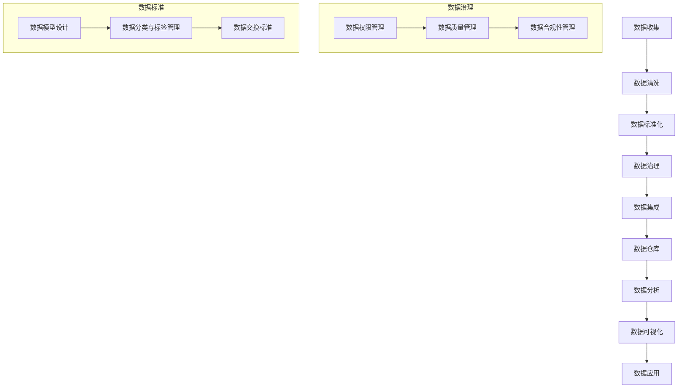

                 

### 文章标题

《AI DMP 数据基建：数据质量与数据标准》

### 关键词

- AI DMP
- 数据质量
- 数据标准
- 数据治理
- 数据模型设计

### 摘要

本文深入探讨了 AI 数据管理平台（DMP）的数据基建，着重分析了数据质量与数据标准在 DMP 中的重要性。文章首先概述了数据基建的基本概念与重要性，随后详细介绍了数据质量与数据治理的概念、策略与框架。接着，文章讨论了数据标准的定义、类型、制定与实施流程，以及数据标准与数据质量的协同作用。最后，文章通过实际案例展示了数据质量评估与改进的方法，并对数据基建的未来发展趋势进行了展望。

### 《AI DMP 数据基建：数据质量与数据标准》目录大纲

#### 第一部分：数据基建概述

##### 第1章：数据基建的基本概念与重要性
- 1.1 数据基建的定义与核心要素
- 1.2 数据基建在AI领域的重要性
- 1.3 数据基建的现状与发展趋势

##### 第2章：数据质量与数据治理
- 2.1 数据质量的定义与重要性
- 2.2 数据治理的基本概念与策略
- 2.3 数据质量管理框架

#### 第二部分：数据标准制定与实施

##### 第3章：数据标准概述
- 3.1 数据标准的定义与类型
- 3.2 数据标准化的意义与目的
- 3.3 数据标准化的挑战与解决方案

##### 第4章：数据标准制定流程
- 4.1 数据标准制定的原则与步骤
- 4.2 数据模型设计
- 4.3 数据分类与标签管理

##### 第5章：数据标准实施与维护
- 5.1 数据标准实施的关键因素
- 5.2 数据标准的推广与培训
- 5.3 数据标准的持续优化

#### 第三部分：数据质量评估与改进

##### 第6章：数据质量评估方法
- 6.1 数据质量评估的指标体系
- 6.2 数据质量评估工具与案例
- 6.3 数据质量改进策略

##### 第7章：数据质量改进实践
- 7.1 数据清洗与处理技术
- 7.2 数据质量监控与预警
- 7.3 数据质量改进案例分析

#### 第四部分：数据标准与数据质量的协同发展

##### 第8章：数据标准与数据质量的协同作用
- 8.1 数据标准与数据质量的相互关系
- 8.2 数据标准在数据质量管理中的应用
- 8.3 数据质量在数据标准制定中的反馈机制

##### 第9章：AI DMP 数据基建的实践与展望
- 9.1 AI DMP 数据基建的实际应用案例
- 9.2 数据基建的未来发展趋势
- 9.3 数据基建在AI领域的潜在价值

#### 附录

##### 附录A：数据标准与数据质量常用工具与技术
- A.1 数据库管理系统与数据仓库
- A.2 数据清洗与数据质量工具
- A.3 数据质量评估与分析工具

##### 附录B：数据标准与数据质量相关参考文献

### 数据基建概述

#### 第1章：数据基建的基本概念与重要性

##### 1.1 数据基建的定义与核心要素

数据基建，顾名思义，是指在企业内部构建一套完整的数据体系，以确保数据的完整性、一致性、可用性和可靠性。它不仅仅是存储和传输数据的基础设施，更包括了数据的整合、治理、安全和分析等各个方面的内容。

数据基建的核心要素通常包括以下几个部分：

1. **数据仓库**：数据仓库是企业数据存储的核心，用于集中存储来自不同源的数据，以便进行统一的分析和挖掘。它通常采用分层架构，包括数据源、数据集成层、数据仓库和数据集市。

2. **数据集成**：数据集成是将来自不同系统、不同格式的数据进行统一和整合的过程。数据集成需要解决数据源的差异、数据格式的统一和数据映射等问题。

3. **数据治理**：数据治理是指对数据进行规范化、标准化和监控的过程，以确保数据的准确性、一致性和可靠性。数据治理包括数据质量管理、数据安全管理和数据合规性管理等。

4. **数据安全与隐私**：数据安全与隐私是数据基建中至关重要的一环，涉及到数据加密、访问控制、权限管理等方面的内容，以确保数据不被未授权访问和泄露。

5. **数据分析**：数据分析是数据基建的重要应用，通过利用数据挖掘、机器学习等技术，从数据中提取有价值的信息，为企业决策提供支持。

##### 1.2 数据基建在AI领域的重要性

在AI领域，数据基建的重要性尤为突出。以下是几个关键点：

1. **数据的质量**：高质量的AI训练数据是AI模型准确性的基础。如果数据存在噪声、错误或不一致，将严重影响AI模型的性能。因此，数据基建的首要任务是确保数据的质量。

2. **数据的一致性**：AI模型通常需要大量的数据来训练，这些数据可能来自不同的来源。数据的一致性是保证AI模型性能的关键，数据基建需要实现数据在不同系统、不同来源之间的统一和同步。

3. **数据的可扩展性**：随着AI应用的不断扩展，数据量也会逐渐增加。数据基建需要具备良好的可扩展性，以应对不断增长的数据量。

4. **数据的隐私性**：在AI领域，很多应用涉及到个人隐私数据。数据基建需要确保数据的隐私性，遵守相关法律法规，保护用户的隐私。

5. **数据的价值**：AI模型的训练和优化需要大量的计算资源和时间。数据基建的目标之一是提高数据的利用率，挖掘数据的价值，为企业创造更多的商业价值。

##### 1.3 数据基建的现状与发展趋势

当前，数据基建在全球范围内已经得到了广泛的关注和应用。随着大数据、云计算和人工智能技术的快速发展，数据基建的现状和发展趋势如下：

1. **数据治理与合规**：随着数据法规的不断完善，数据治理和数据合规性成为数据基建的重要关注点。企业需要建立完善的数据治理框架，确保数据的合法合规。

2. **数据集成与融合**：数据集成和数据融合技术不断发展，使得企业可以更高效地整合和管理多源异构数据，提高数据的利用率和价值。

3. **数据安全与隐私**：随着数据泄露和网络攻击事件的增加，数据安全与隐私成为数据基建的焦点。企业需要采取更严格的措施，保护数据的机密性和完整性。

4. **智能数据分析**：随着人工智能技术的进步，智能数据分析成为数据基建的重要发展方向。通过利用机器学习、深度学习等技术，企业可以更深入地挖掘数据的价值。

5. **云原生数据基建**：云计算的普及推动了云原生数据基建的发展。企业可以通过云服务快速搭建和扩展数据基础设施，降低成本，提高效率。

### 数据质量与数据治理

#### 第2章：数据质量与数据治理

##### 2.1 数据质量的定义与重要性

数据质量是指数据满足其预期用途的程度。数据质量包括多个方面，如准确性、完整性、一致性、及时性、可靠性和易用性等。以下是数据质量的一些关键概念：

1. **准确性**：数据是否真实、正确、无误。
2. **完整性**：数据是否完整，是否缺失关键信息。
3. **一致性**：数据在不同系统、不同时间点是否保持一致。
4. **及时性**：数据是否能够在需要的时间内提供。
5. **可靠性**：数据来源是否可靠，数据是否可靠。
6. **易用性**：数据是否易于理解和使用。

数据质量的重要性体现在以下几个方面：

1. **决策支持**：高质量的数据能够提供更准确的决策依据，帮助企业做出更明智的决策。
2. **业务效率**：高质量的数据可以减少因数据错误导致的业务流程中断，提高业务效率。
3. **客户满意度**：高质量的数据可以提供更好的客户服务，提高客户满意度。
4. **合规性**：高质量的数据有助于企业遵守相关法规和标准，避免因数据问题导致的合规风险。
5. **竞争优势**：高质量的数据可以为企业提供竞争优势，帮助企业抓住市场机遇。

##### 2.2 数据治理的基本概念与策略

数据治理是指制定和管理数据标准，确保数据质量、数据安全和数据合规的过程。数据治理的基本概念包括以下几个方面：

1. **数据治理框架**：数据治理框架是数据治理的组织结构和流程，包括数据治理委员会、数据治理团队和数据治理政策等。
2. **数据标准**：数据标准是规范数据定义、命名、格式、存储和使用的规则和指南。
3. **数据质量**：数据质量是衡量数据满足业务需求的能力，包括准确性、完整性、一致性、及时性、可靠性和易用性等。
4. **数据安全**：数据安全是指保护数据不被未授权访问、篡改和泄露。
5. **数据合规性**：数据合规性是指数据遵守相关法规和标准。

数据治理的策略包括以下几个方面：

1. **数据质量管理**：建立数据质量管理流程，定期进行数据质量检查和改进。
2. **数据安全策略**：制定数据安全策略，确保数据的安全性。
3. **数据合规性管理**：确保数据遵守相关法规和标准，如GDPR、SOX等。
4. **数据标准化**：制定数据标准化策略，确保数据的统一和一致。
5. **数据访问控制**：实施数据访问控制，确保只有授权用户可以访问数据。

##### 2.3 数据质量管理框架

数据质量管理框架是确保数据质量的一系列流程、工具和技术。以下是一个典型数据质量管理框架的组成部分：

1. **数据质量策略**：制定数据质量策略，明确数据质量的目标、指标和责任。
2. **数据质量评估**：定期进行数据质量评估，识别数据质量问题和潜在风险。
3. **数据质量改进**：针对评估结果，制定数据质量改进计划，实施改进措施。
4. **数据质量监控**：建立数据质量监控机制，实时监测数据质量，及时发现和解决数据质量问题。
5. **数据质量报告**：定期生成数据质量报告，分析数据质量状况，为数据质量改进提供依据。

### 数据标准制定与实施

#### 第3章：数据标准概述

##### 3.1 数据标准的定义与类型

数据标准是一套规范，用于定义数据的命名、格式、存储、传输和使用。数据标准的目标是确保数据的一致性、准确性和可靠性，提高数据的可用性和可维护性。以下是数据标准的一些关键定义：

1. **数据元素标准**：定义了数据的基本单元，包括数据名称、数据类型、数据长度、数据格式等。
2. **数据字段标准**：定义了数据表中的字段，包括字段名称、字段类型、字段长度、字段约束等。
3. **数据集标准**：定义了数据集的结构、内容、来源和用途。
4. **数据交换标准**：定义了数据在不同系统、不同格式之间的交换和传输规则。

数据标准可以分为以下几种类型：

1. **结构化数据标准**：适用于数据库、数据仓库和XML等结构化数据格式。
2. **非结构化数据标准**：适用于文本、图片、音频和视频等非结构化数据格式。
3. **元数据标准**：定义了数据的描述信息，如数据来源、数据创建时间、数据修改历史等。
4. **业务规则标准**：定义了业务规则和流程，如订单处理流程、支付流程等。

##### 3.2 数据标准化的意义与目的

数据标准化的意义和目的在于：

1. **提高数据的一致性和可靠性**：通过统一的数据标准，确保数据在不同系统、不同部门之间的统一和一致。
2. **简化数据处理和管理**：标准化后的数据格式和命名规则使得数据处理和管理更加简单和高效。
3. **降低数据集成成本**：标准化的数据可以更容易地进行集成和共享，降低数据集成成本。
4. **提高数据质量**：标准化的数据可以更好地进行数据质量管理和监控，提高数据质量。
5. **促进数据共享和复用**：标准化的数据可以更方便地在不同系统、不同部门之间共享和复用。

##### 3.3 数据标准化的挑战与解决方案

数据标准化面临以下挑战：

1. **数据多样性**：企业中的数据来自不同的系统、不同的部门，存在多样性问题。解决方案是制定一套通用的数据标准，确保数据的统一和一致。
2. **数据变更管理**：数据标准在实施过程中可能会发生变化，需要确保变更的追踪和管理。解决方案是建立变更管理流程，记录变更历史，确保数据的版本控制。
3. **数据质量保证**：数据标准化过程中，需要确保数据质量。解决方案是实施数据质量检查和监控，及时发现和纠正数据质量问题。
4. **技术支持**：数据标准化需要相应的技术支持，如数据库管理系统、数据集成工具等。解决方案是选择合适的技术工具，确保数据标准化的实现。

### 数据标准制定流程

#### 第4章：数据标准制定流程

##### 4.1 数据标准制定的原则与步骤

数据标准制定的原则包括：

1. **一致性**：确保数据标准在不同系统、不同部门之间的一致性，避免数据冲突和误解。
2. **可维护性**：数据标准应易于维护和更新，以适应业务需求的变化。
3. **实用性**：数据标准应满足实际业务需求，确保数据的实际可用性。
4. **可扩展性**：数据标准应具备良好的可扩展性，以适应未来的业务发展。

数据标准制定的步骤包括：

1. **需求分析**：分析业务需求，确定数据标准的需求和范围。
2. **数据调研**：收集现有数据，了解数据来源、数据格式和数据质量。
3. **标准设计**：根据需求分析和数据调研结果，设计数据标准。
4. **标准审核**：对制定的数据标准进行审核和评估，确保标准的合理性和可行性。
5. **标准发布**：发布数据标准，确保相关人员了解和遵守数据标准。
6. **标准实施**：实施数据标准，确保数据的标准化和统一。
7. **标准维护**：定期更新和维护数据标准，确保数据的持续优化。

##### 4.2 数据模型设计

数据模型设计是数据标准制定的核心步骤之一。数据模型定义了数据之间的关系和结构，包括实体、属性和关系等。以下是数据模型设计的关键要素：

1. **实体设计**：确定数据模型中的实体，如用户、订单、产品等。每个实体应具有唯一标识和属性。
2. **属性设计**：确定每个实体的属性，如用户姓名、订单金额、产品名称等。属性应具有明确的类型和约束条件。
3. **关系设计**：确定实体之间的关系，如用户与订单、订单与产品等。关系应具有明确的类型和属性。
4. **数据完整性**：确保数据模型的完整性，避免数据冗余和缺失。
5. **数据一致性**：确保数据模型在不同系统、不同部门之间的一致性。
6. **数据扩展性**：确保数据模型具备良好的扩展性，以适应未来业务需求的变化。

数据模型设计的方法包括：

1. **实体关系模型（ER模型）**：通过实体和关系来表示数据模型，适用于简单和复杂的数据模型设计。
2. **维度模型**：适用于数据仓库和数据挖掘应用，通过维度和度量来表示数据模型。
3. **数据库设计工具**：使用数据库设计工具（如Oracle Designer、Microsoft SQL Server Management Studio等）来设计和可视化数据模型。

##### 4.3 数据分类与标签管理

数据分类与标签管理是数据标准的重要组成部分，用于确保数据的可搜索性和可管理性。以下是数据分类与标签管理的关键要素：

1. **数据分类**：根据业务需求和数据特性，对数据进行分类。数据分类应具备良好的层次结构和可扩展性。
2. **标签管理**：为数据分配标签，用于标识数据的属性、用途和归属。标签应具备明确的定义和标准。
3. **标签体系**：建立标签体系，用于管理和组织标签。标签体系应具备良好的层次结构和关联关系。
4. **标签管理工具**：使用标签管理工具（如Splunk、Elasticsearch等）来管理和跟踪标签。
5. **标签审核**：定期审核标签的使用情况，确保标签的准确性和一致性。
6. **标签更新**：根据业务需求的变化，定期更新和维护标签。

数据分类与标签管理的具体步骤包括：

1. **分类设计**：根据业务需求，设计数据分类体系。
2. **标签定义**：定义标签的名称、属性和用途。
3. **标签分配**：将标签分配给数据，确保数据的可搜索性和可管理性。
4. **标签审核**：定期审核标签的使用情况，确保标签的准确性和一致性。
5. **标签更新**：根据业务需求的变化，定期更新和维护标签。

### 数据标准实施与维护

#### 第5章：数据标准实施与维护

##### 5.1 数据标准实施的关键因素

数据标准实施的成功与否取决于多个关键因素。以下是数据标准实施的关键因素：

1. **领导支持**：数据标准实施需要得到企业高层的支持，确保资源的投入和人员的配置。
2. **培训与教育**：对相关人员进行数据标准培训和教育，确保他们了解和遵守数据标准。
3. **工具与技术**：选择合适的工具和技术来支持数据标准的实施，如数据库管理系统、数据集成工具等。
4. **流程与规范**：制定明确的流程和规范，确保数据标准的执行和监督。
5. **沟通与协作**：建立有效的沟通和协作机制，确保各部门之间的协调和配合。
6. **持续改进**：数据标准实施后，需要定期评估和改进，确保数据标准的持续优化。

##### 5.2 数据标准的推广与培训

数据标准的推广与培训是确保数据标准有效实施的重要环节。以下是数据标准推广与培训的关键步骤：

1. **制定推广计划**：根据数据标准的类型和范围，制定详细的推广计划，明确推广的目标、内容和时间表。
2. **制定培训计划**：根据推广计划，制定培训计划，确定培训的目标、内容、形式和受众。
3. **培训内容**：培训内容应包括数据标准的背景、目的、内容、实施方法和注意事项等。
4. **培训形式**：培训形式可以包括讲座、研讨会、在线课程等，根据受众的特点和需求选择合适的培训形式。
5. **培训评估**：培训结束后，对培训效果进行评估，收集反馈意见，持续改进培训内容和方法。

##### 5.3 数据标准的持续优化

数据标准的持续优化是确保数据标准适应业务需求和环境变化的重要举措。以下是数据标准持续优化的关键步骤：

1. **定期评估**：定期评估数据标准的实施效果，识别存在的问题和改进空间。
2. **反馈机制**：建立数据标准的反馈机制，收集用户对数据标准的意见和建议，及时进行改进。
3. **持续改进**：根据评估结果和用户反馈，持续改进数据标准，确保数据标准的适应性和有效性。
4. **更新文档**：及时更新数据标准文档，确保文档的准确性和最新性。
5. **培训与宣传**：对新的数据标准进行培训与宣传，确保相关人员了解和遵守新的数据标准。

### 数据质量评估方法

#### 第6章：数据质量评估方法

##### 6.1 数据质量评估的指标体系

数据质量评估的指标体系是衡量数据质量的重要工具。以下是常用的数据质量评估指标：

1. **准确性**：数据是否准确无误，如订单金额与实际金额是否一致。
2. **完整性**：数据是否完整，如订单是否包含所有必要的字段。
3. **一致性**：数据在不同系统、不同时间点是否保持一致，如客户信息是否在系统中一致。
4. **及时性**：数据是否能够在需要的时间内提供，如订单是否在订单完成后及时更新。
5. **可靠性**：数据来源是否可靠，如数据是否来自可信的源系统。
6. **易用性**：数据是否易于理解和使用，如报表是否清晰易懂。

这些指标可以根据具体业务需求进行细化和调整。

##### 6.2 数据质量评估工具与案例

数据质量评估工具可以帮助自动识别和评估数据质量问题。以下是几种常用的数据质量评估工具：

1. **Pandas**：Python 的 Pandas 库提供了丰富的数据清洗和评估功能，如数据缺失值检查、重复值检测和数据格式转换等。
2. **Talend**：Talend 是一款数据集成和质量管理工具，提供了数据质量评估、数据清洗和数据转换等功能。
3. **Informatica**：Informatica 是一款强大的数据集成和质量管理工具，提供了全面的数据质量评估和改进功能。

以下是一个使用 Pandas 库进行数据质量评估的案例：

```python
import pandas as pd

# 读取数据
data = pd.read_csv('data.csv')

# 检查缺失值
missing_values = data.isnull().sum()

# 检查重复值
duplicates = data.duplicated().sum()

# 检查数据格式
data['date_column'] = pd.to_datetime(data['date_column'])

# 检查数据一致性
data_check = data.groupby('column_name').count().reset_index()
data_check[data_check['column_name'] != data_check['column_name'].count()].drop(['column_name'], axis=1)

# 输出数据质量报告
print("缺失值总数：", missing_values)
print("重复值总数：", duplicates)
print("数据格式检查：", data['date_column'].isna().sum())
print("数据一致性检查：", data_check.shape[0])
```

##### 6.3 数据质量改进策略

数据质量改进策略是确保数据质量持续提升的关键。以下是一些常用的数据质量改进策略：

1. **数据清洗**：定期进行数据清洗，识别和纠正数据中的错误、缺失和重复值。
2. **数据验证**：使用预定义的规则或模型对数据进行验证，确保数据的准确性。
3. **数据标准化**：对数据进行标准化处理，确保数据的一致性和可靠性。
4. **数据监控**：建立数据质量监控机制，实时监测数据质量，及时发现和解决数据质量问题。
5. **培训与教育**：对相关人员开展数据质量培训，提高他们的数据意识和数据处理能力。
6. **持续改进**：建立数据质量改进流程，定期评估和改进数据质量，确保数据质量的持续提升。

### 数据质量改进实践

#### 第7章：数据质量改进实践

##### 7.1 数据清洗与处理技术

数据清洗是数据质量改进的重要步骤，涉及识别和纠正数据中的错误、缺失和重复值。以下是数据清洗和处理技术的一些关键点：

1. **缺失值处理**：对于缺失值，可以采用以下方法进行处理：
   - 填充默认值：根据业务逻辑为缺失值填充默认值。
   - 填充平均值：为缺失值填充平均值或中位数。
   - 填充预测值：使用机器学习算法预测缺失值。
   - 删除缺失值：对于不影响数据整体分析的部分，可以删除缺失值。

2. **重复值检测**：使用唯一标识（如订单号、客户ID等）识别和删除重复值。

3. **数据格式转换**：对数据进行格式转换，确保数据的一致性和可处理性。例如，将日期格式转换为YYYY-MM-DD格式。

4. **错误值修正**：使用规则或机器学习模型识别和修正数据中的错误值。

以下是一个使用 Python 和 Pandas 库进行数据清洗的案例：

```python
import pandas as pd

# 读取数据
data = pd.read_csv('data.csv')

# 缺失值处理
data.fillna({'column1': 'default_value', 'column2': data['column2'].mean()}, inplace=True)

# 重复值删除
data.drop_duplicates(subset=['column1'], inplace=True)

# 数据格式转换
data['date_column'] = pd.to_datetime(data['date_column'])

# 错误值修正
data['column3'] = data['column3'].replace({'value1': 'correct_value'})

# 输出清洗后的数据
print(data.head())
```

##### 7.2 数据质量监控与预警

数据质量监控与预警是确保数据质量持续稳定的重要手段。以下是数据质量监控与预警的关键步骤：

1. **建立监控指标**：根据业务需求和数据质量评估指标，建立数据质量监控指标。

2. **实时数据监控**：使用实时数据监控工具，如数据质量管理平台、实时数据流处理系统等，监控数据质量指标的实时变化。

3. **预警机制**：当数据质量指标超过预设阈值时，触发预警机制，发送预警通知。

4. **自动纠正**：在可能的情况下，自动纠正数据质量问题，如自动填充缺失值、修正错误值等。

以下是一个使用 Python 和 Pandas 库进行数据质量监控与预警的案例：

```python
import pandas as pd
from datetime import datetime

# 读取数据
data = pd.read_csv('data.csv')

# 建立监控指标
missing_values = data.isnull().sum()
duplicates = data.duplicated().sum()
data_format_check = data['date_column'].isna().sum()

# 实时监控
current_time = datetime.now()
if missing_values > 100:
    print(f"缺失值预警：缺失值总数超过100，时间为 {current_time}")
if duplicates > 10:
    print(f"重复值预警：重复值总数超过10，时间为 {current_time}")
if data_format_check > 0:
    print(f"数据格式预警：日期格式错误，时间为 {current_time}")
```

##### 7.3 数据质量改进案例分析

以下是一个数据质量改进的实际案例：

**背景**：某电商平台的订单数据存在质量问题，影响了用户体验和业务运营效率。

**目标**：通过数据清洗、数据验证和数据一致性检查，提高订单数据质量。

**步骤**：

1. **数据收集**：从不同系统（如订单系统、库存系统等）收集订单数据。

2. **数据清洗**：使用数据清洗工具，识别并处理数据中的缺失值、重复值和错误值。

   - 缺失值处理：使用默认值填充缺失值。
   - 重复值删除：使用唯一标识（订单号）删除重复值。
   - 错误值修正：使用规则或机器学习模型修正错误值。

3. **数据验证**：使用预定义的规则或模型，检查订单数据的正确性。

   - 订单金额与商品数量的验证。
   - 订单日期的验证。
   - 客户信息的完整性验证。

4. **数据一致性检查**：检查订单数据在不同系统之间的统一性。

   - 订单状态在不同系统中的同步。
   - 订单数据与库存数据的匹配度。

5. **数据质量评估**：使用数据质量评估工具，对清洗后的订单数据质量进行评估。

6. **数据质量报告**：生成数据质量报告，记录数据清洗、验证和一致性检查的过程和结果。

7. **数据质量改进**：根据评估结果，持续优化数据质量改进策略。

### 数据标准与数据质量的协同发展

#### 第8章：数据标准与数据质量的协同作用

##### 8.1 数据标准与数据质量的相互关系

数据标准和数据质量是密切相关的，两者相互促进，共同确保数据的价值和可靠性。以下是数据标准与数据质量之间的相互关系：

1. **数据标准是数据质量的基础**：数据标准定义了数据的格式、命名、存储和使用规则，为数据质量管理提供了统一的框架和依据。

2. **数据质量是数据标准的体现**：数据质量反映了数据标准执行的效果，高质量的数据是数据标准成功实施的结果。

3. **数据标准与数据质量相互影响**：良好的数据标准有助于提高数据质量，而高质量的数据可以验证和改进数据标准的实施效果。

4. **数据标准与数据质量相互促进**：通过不断完善数据标准和优化数据质量，可以形成良性的循环，持续提升数据的价值和可靠性。

##### 8.2 数据标准在数据质量管理中的应用

数据标准在数据质量管理中的应用体现在以下几个方面：

1. **数据质量管理流程**：数据标准是数据质量管理流程的一部分，包括数据质量评估、数据清洗、数据验证和数据监控等步骤。

2. **数据质量指标**：数据标准定义了数据质量指标，如准确性、完整性、一致性、及时性、可靠性和易用性等，用于衡量和评估数据质量。

3. **数据质量工具**：数据标准支持数据质量工具的配置和使用，如数据清洗工具、数据验证工具和数据监控工具等。

4. **数据治理**：数据标准是数据治理的核心组成部分，数据治理策略和流程依赖于数据标准的实施和执行。

##### 8.3 数据质量在数据标准制定中的反馈机制

数据质量在数据标准制定中发挥着重要的反馈作用，通过以下方式实现：

1. **数据质量评估**：通过对现有数据的评估，识别数据质量问题，为数据标准的改进提供依据。

2. **用户反馈**：收集用户对数据质量的反馈，了解数据标准在实际应用中的效果，为数据标准的优化提供参考。

3. **持续改进**：将数据质量评估和用户反馈结果纳入数据标准制定流程，持续改进数据标准，确保其适应业务需求和数据质量要求。

4. **自动化反馈**：利用数据监控工具，实时监测数据质量，自动识别和反馈数据质量问题，推动数据标准的动态调整和优化。

### AI DMP 数据基建的实践与展望

#### 第9章：AI DMP 数据基建的实践与展望

##### 9.1 AI DMP 数据基建的实际应用案例

以下是一个 AI DMP 数据基建的实际应用案例：

**背景**：某互联网公司希望利用人工智能技术提升用户个性化推荐的效果，构建一个全面的 AI 数据管理平台（DMP）。

**目标**：通过构建数据基建，实现用户数据的全面整合、标准化和高质量管理，为人工智能算法提供可靠的数据支持。

**步骤**：

1. **数据收集**：从多个渠道收集用户数据，包括用户行为数据、用户属性数据等。

2. **数据清洗**：使用数据清洗技术，识别和纠正数据中的错误、缺失和重复值，确保数据的一致性和准确性。

3. **数据标准化**：制定数据标准，统一数据格式、命名和存储规则，确保数据的可维护性和可扩展性。

4. **数据治理**：建立数据治理框架，制定数据质量管理策略，确保数据的合规性和安全性。

5. **数据集成**：使用数据集成技术，将不同来源的数据整合到一个统一的数据仓库，实现数据的全面整合。

6. **数据分析**：利用机器学习和数据分析技术，对数据进行深入分析，提取有价值的信息，为人工智能算法提供支持。

7. **数据可视化**：通过数据可视化工具，将分析结果呈现给业务人员，支持数据驱动决策。

##### 9.2 数据基建的未来发展趋势

数据基建的未来发展趋势包括以下几个方面：

1. **数据治理与合规性**：随着数据法规的不断完善，数据治理和数据合规性将成为数据基建的核心关注点。

2. **智能化与自动化**：数据基建将更加智能化和自动化，利用人工智能和机器学习技术，实现数据质量管理和数据处理的自动化。

3. **云原生数据基建**：云原生数据基建将逐渐成为主流，利用云计算和容器技术，实现数据的快速部署和弹性扩展。

4. **边缘计算与物联网**：随着物联网和边缘计算技术的发展，数据基建将向边缘计算方向扩展，实现数据的实时处理和分析。

5. **数据价值挖掘**：数据基建将更加注重数据价值的挖掘，通过数据分析和人工智能技术，发现数据的潜在价值。

##### 9.3 数据基建在AI领域的潜在价值

数据基建在AI领域的潜在价值体现在以下几个方面：

1. **数据质量提升**：通过数据清洗、标准化和治理，确保AI训练数据的高质量，提高AI模型的准确性和稳定性。

2. **数据多样化与丰富性**：通过数据集成和数据融合，实现数据的多样化与丰富性，为AI模型提供更多样化的数据输入。

3. **数据实时性与动态性**：通过实时数据集成和处理，实现数据的实时性和动态性，支持实时AI应用和决策。

4. **数据安全与隐私保护**：通过数据加密、访问控制和隐私保护技术，确保数据的安全性和用户隐私。

5. **数据创新与商业化**：通过数据分析和挖掘，发现新的商业机会和用户需求，推动数据创新和商业化。

### 附录

##### 附录A：数据标准与数据质量常用工具与技术

- **数据库管理系统与数据仓库**：
  - **Oracle**：一款功能强大的关系型数据库管理系统，适用于企业级应用。
  - **MySQL**：一款开源的关系型数据库管理系统，广泛应用于Web应用。
  - **SQL Server**：微软公司开发的关系型数据库管理系统，支持高级数据分析和处理。

- **数据清洗与数据质量工具**：
  - **Talend**：一款强大的数据集成和数据质量管理工具，提供数据清洗、转换和传输等功能。
  - **Informatica**：一款专业的数据集成和数据质量管理工具，支持大数据处理。

- **数据质量评估与分析工具**：
  - **Pandas**：Python 的数据分析和处理库，提供丰富的数据清洗、转换和评估功能。
  - **Tableau**：一款数据可视化工具，可以创建交互式数据报表，支持数据质量分析。

### 附录B：数据标准与数据质量相关参考文献

- **数据标准相关文献**：
  - **《数据治理框架：实现数据质量和合规性的最佳实践》**，作者：David Loshin。
  - **《数据建模：基础与工业应用》**，作者：Michael Lynd。
  - **《大数据标准：构建高效的数据管理架构》**，作者：David Corrigan。

- **数据质量相关文献**：
  - **《数据质量管理：从理论到实践》**，作者：John Morris。
  - **《数据质量：定义、度量和管理》**，作者：John Talburt。
  - **《大数据质量：如何确保大数据的可信度》**，作者：Michael Stone。

### 总结与展望

本文深入探讨了 AI DMP 数据基建中的数据质量和数据标准，详细分析了数据基建的基本概念、重要性、数据治理、数据标准制定与实施、数据质量评估与改进，以及数据标准与数据质量的协同发展。通过实际应用案例和未来的发展趋势，我们看到了数据基建在 AI 领域的巨大潜力。

未来的数据基建将更加智能化、自动化和云原生化，数据治理和数据合规性将成为关键关注点。数据标准与数据质量将相互促进，共同推动数据价值的挖掘和商业化。我们呼吁广大读者关注数据基建的发展，积极参与数据标准的制定与实施，共同提升数据质量，为人工智能的进步和商业创新贡献力量。

### 作者信息

**作者：AI天才研究院/AI Genius Institute & 禅与计算机程序设计艺术 /Zen And The Art of Computer Programming**。

### 附录：Mermaid 流程图

以下是数据基建的 Mermaid 流程图：



以上流程图展示了数据从收集到应用的全过程，以及数据治理和数据标准在各阶段的重要性。

