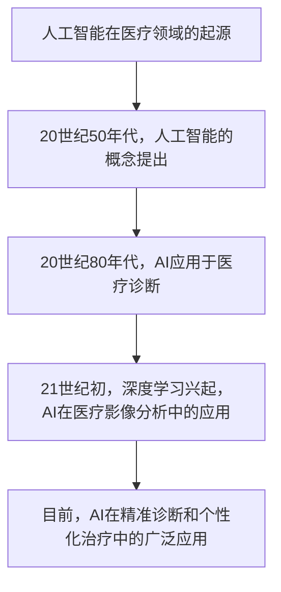
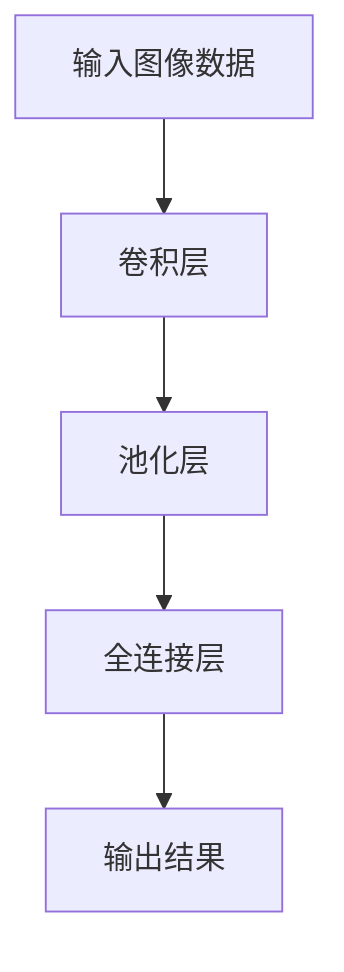
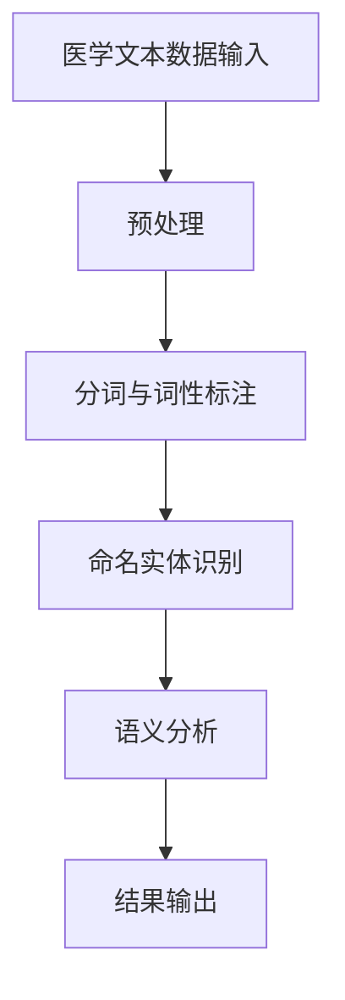
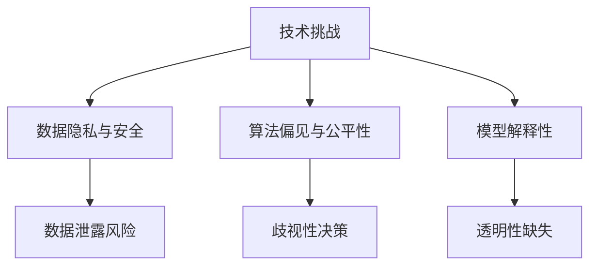
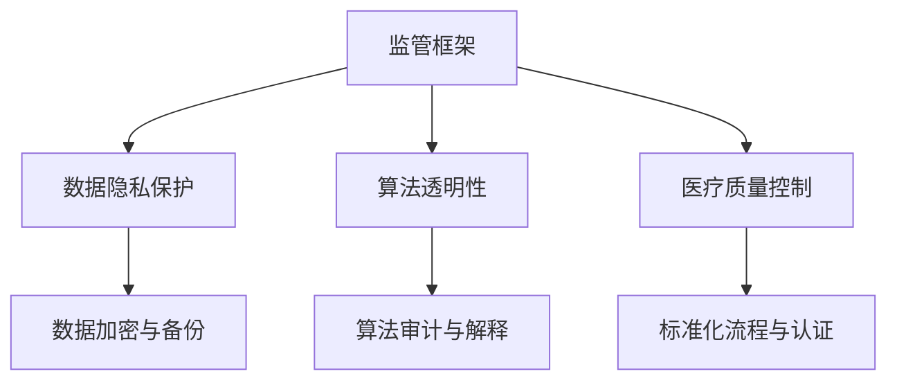

                 

# AI 在医疗领域的应用：精准诊断、个性化治疗

> 关键词：人工智能、医疗诊断、个性化治疗、深度学习、医疗影像分析、医学自然语言处理

> 摘要：本文将探讨人工智能（AI）在医疗领域的应用，重点关注精准诊断和个性化治疗。通过分析核心算法原理、实际案例以及未来发展趋势，揭示AI如何改变现代医疗的格局，提高诊断准确性和治疗效果。

## 《AI 在医疗领域的应用：精准诊断、个性化治疗》目录大纲

### 第一部分：AI在医疗领域的概述

#### 第1章：AI与医疗的融合

1.1 AI在医疗领域的发展历程

1.2 AI在医疗领域的重要性

1.3 医疗数据的特点与挑战

#### 第2章：AI在医疗诊断中的应用

2.1 精准诊断的基本概念

2.2 基于深度学习的影像诊断

2.3 人工智能辅助病理诊断

2.4 AI在基因检测中的应用

#### 第3章：AI在个性化治疗中的应用

3.1 个性化治疗的概念与原理

3.2 基于AI的药物研发

3.3 个性化医疗计划制定

3.4 患者健康管理的AI应用

### 第二部分：核心算法原理与实现

#### 第4章：深度学习与医疗影像分析

4.1 深度学习基础

4.2 卷积神经网络在影像分析中的应用

4.3 递归神经网络在序列数据中的应用

#### 第5章：医学自然语言处理

5.1 自然语言处理基础

5.2 医学文本数据的处理

5.3 医学文本的语义分析

#### 第6章：机器学习在医学数据挖掘中的应用

6.1 医学数据挖掘的基本概念

6.2 医学数据的分类与预测

6.3 医学数据的聚类与关联分析

#### 第7章：AI在医疗领域的应用案例研究

7.1 精准医疗项目案例

7.2 个性化治疗项目案例

7.3 患者健康管理系统案例

### 第三部分：AI在医疗领域的未来发展

#### 第8章：AI在医疗领域的挑战与伦理问题

8.1 AI在医疗领域的挑战

8.2 AI在医疗领域的伦理问题

8.3 未来医疗AI的发展趋势

#### 第9章：AI医疗的监管与标准化

9.1 AI医疗的监管体系

9.2 AI医疗的标准化路径

9.3 国际化视野下的AI医疗发展

### 附录

#### 附录A：AI医疗应用开发工具与资源

A.1 深度学习框架在医疗中的应用

A.2 医学自然语言处理工具

A.3 医学数据挖掘与分析工具

#### 附录B：常见AI医疗术语解释

B.1 AI医疗术语解释

B.2 医疗影像术语解释

B.3 个性化治疗术语解释

### Mermaid 流程图

#### 第1章：AI在医疗领域的发展历程



### Mermaid 流程图

#### 第4章：深度学习与医疗影像分析



### Mermaid 流程图

#### 第5章：医学自然语言处理



### 伪代码：深度学习在影像分析中的应用

```python
# 输入：医疗影像数据集
# 输出：分类结果

# 初始化神经网络结构
model = NeuralNetwork()

# 训练神经网络
for epoch in range(num_epochs):
    for image, label in data_loader:
        # 前向传播
        output = model(image)
        # 计算损失
        loss = loss_function(output, label)
        # 反向传播
        model.backward(loss)

# 预测
def predict(image):
    output = model(image)
    return argmax(output)
```

### 数学模型与公式

#### 第6章：医学数据的分类与预测

1. **逻辑回归模型**

$$
\text{log-odds}(y) = \beta_0 + \sum_{i=1}^{n} \beta_i x_i
$$

2. **支持向量机（SVM）**

$$
\text{分类边界} \ \mathbf{w} \cdot \mathbf{x} + b = 0
$$

### 举例说明

**例1：使用逻辑回归预测癌症患者的生存率**

给定一组特征 $\textbf{x} = [\text{年龄}, \text{体重}, \text{血压}]$ 和标签 $y \in \{0, 1\}$，我们使用逻辑回归模型预测患者的生存率。

- 年龄：$x_1 = 50$
- 体重：$x_2 = 70$
- 血压：$x_3 = 120$

$$
\text{log-odds}(y = 1) = \beta_0 + \beta_1 \cdot 50 + \beta_2 \cdot 70 + \beta_3 \cdot 120
$$

通过计算得到 $\text{log-odds}(y = 1) = 0.5$，从而预测患者的生存率为：

$$
\text{生存率} = \frac{1}{1 + e^{-0.5}} \approx 0.39
$$

### 项目实战

#### 第7章：AI在医疗领域的应用案例研究

**案例1：精准医疗项目**

**开发环境搭建：**

- Python 3.8+
- TensorFlow 2.3.0+
- Keras 2.4.3+
- PyTorch 1.5.0+

**源代码实现：**

```python
import tensorflow as tf
from tensorflow.keras.models import Sequential
from tensorflow.keras.layers import Conv2D, MaxPooling2D, Flatten, Dense

# 构建模型
model = Sequential()
model.add(Conv2D(32, (3, 3), activation='relu', input_shape=(28, 28, 1)))
model.add(MaxPooling2D((2, 2)))
model.add(Flatten())
model.add(Dense(128, activation='relu'))
model.add(Dense(1, activation='sigmoid'))

# 编译模型
model.compile(optimizer='adam', loss='binary_crossentropy', metrics=['accuracy'])

# 训练模型
model.fit(x_train, y_train, epochs=10, batch_size=32, validation_data=(x_val, y_val))
```

**代码解读与分析：**

1. **模型构建：** 使用Keras构建了一个简单的卷积神经网络，包含一个卷积层、一个池化层和一个全连接层。
2. **模型编译：** 选择adam优化器和binary_crossentropy损失函数，用于二分类问题。
3. **模型训练：** 使用训练集进行10个epochs的模型训练，并使用验证集进行性能评估。

### 数学模型与公式

#### 第8章：AI在医疗领域的挑战与伦理问题

1. **模型解释性**

$$
L_f(x, y) = -y \cdot \log(f(x)) - (1 - y) \cdot \log(1 - f(x))
$$

其中，$L_f$ 表示交叉熵损失函数，$f(x)$ 表示模型预测的概率分布。

### Mermaid 流程图

#### 第8章：AI在医疗领域的挑战与伦理问题



### Mermaid 流程图

#### 第9章：AI医疗的监管与标准化



### 附录

#### 附录A：AI医疗应用开发工具与资源

A.1 深度学习框架在医疗中的应用

A.2 医学自然语言处理工具

A.3 医学数据挖掘与分析工具

#### 附录B：常见AI医疗术语解释

B.1 AI医疗术语解释

B.2 医疗影像术语解释

B.3 个性化治疗术语解释

---

### 结语

AI在医疗领域的应用正在迅速扩展，通过精准诊断和个性化治疗，为患者提供更高效、更精准的医疗方案。本文分析了AI在医疗诊断和个性化治疗中的应用，探讨了核心算法原理、实际案例以及未来发展趋势。然而，AI在医疗领域的应用仍然面临诸多挑战和伦理问题，需要进一步加强监管与标准化，确保技术的安全性和公正性。随着AI技术的不断进步，我们有理由相信，未来的医疗领域将因AI的应用而变得更加美好。作者：AI天才研究院/AI Genius Institute & 禅与计算机程序设计艺术 /Zen And The Art of Computer Programming。

