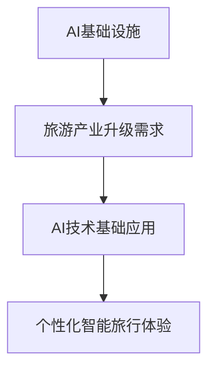
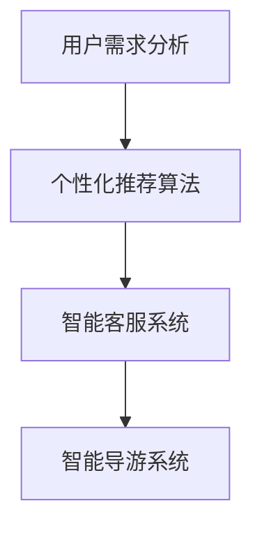
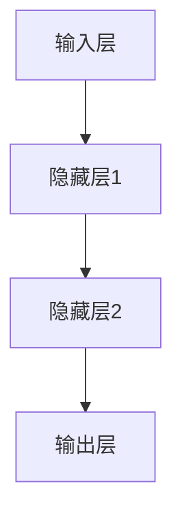

                 

## 文章标题：AI基础设施的旅游升级：个性化智能旅行体验

> 关键词：AI基础设施、旅游、个性化推荐、智能导游、智能客服

> 摘要：随着人工智能技术的迅猛发展，AI基础设施在各个行业的应用日益广泛，旅游行业也不例外。本文将探讨如何利用AI基础设施推动旅游行业的升级，特别是在提供个性化智能旅行体验方面的应用。文章首先概述了AI基础设施的概念及其在旅游产业中的应用潜力，接着详细介绍了个性化智能旅行体验的核心概念与架构，随后深入分析了AI在旅游规划与推荐、服务优化、营销与客户关系管理等方面的应用，并通过实战案例与具体分析，展示了AI基础设施在智能旅游生态系统建设中的重要作用。文章最后对智能旅游的未来发展趋势和面临的挑战进行了展望。

----------------------------------------------------------------

### 第一部分：AI基础设施概述

随着科技的不断进步，人工智能（AI）技术已经成为推动各行各业变革的关键力量。AI基础设施作为AI技术的核心组成部分，承担着支撑AI应用落地的重要角色。本部分将首先介绍AI基础设施的概念，探讨其在旅游产业升级中的重要性，并分析AI在旅游行业中的潜在价值。

#### 1.1 AI基础设施的概念与旅游应用

AI基础设施是指用于构建、部署和管理AI应用的硬件、软件和网络资源。它包括计算资源（如GPU、TPU等）、存储资源、数据处理和分析工具、开发框架和平台等。在旅游行业中，AI基础设施的应用涵盖了从旅游规划、推荐到客户关系管理的各个环节。

- **旅游规划**：利用AI基础设施，可以实现对旅游数据的实时分析和处理，为游客提供个性化的旅游路线规划服务。
- **推荐系统**：通过机器学习和深度学习技术，AI基础设施可以帮助旅游平台根据用户的历史行为和偏好推荐合适的旅游目的地和活动。
- **智能客服**：利用自然语言处理（NLP）和语音识别技术，AI基础设施可以构建智能客服系统，提高客户服务效率。
- **数据分析和决策支持**：AI基础设施可以处理大量的旅游数据，帮助旅游企业进行市场分析和决策。

#### 1.2 旅游产业升级的需求与挑战

旅游产业升级的需求主要体现在以下几个方面：

- **个性化服务**：随着消费者需求的多样化，旅游企业需要提供更加个性化的服务，以满足不同游客的个性化需求。
- **效率提升**：旅游企业需要提高运营效率，降低成本，提升客户满意度。
- **数据驱动**：旅游企业需要利用大数据和AI技术进行精准营销和运营决策。

然而，旅游产业在升级过程中也面临着一系列挑战：

- **数据隐私与安全**：旅游企业需要处理大量的个人数据，如何保护用户隐私和数据安全成为一大挑战。
- **技术集成**：将AI技术集成到现有的旅游系统中，实现无缝对接和协同工作，需要解决技术兼容性问题。
- **人才短缺**：AI技术的应用需要专业的技术人才，但旅游业普遍存在人才短缺的问题。

#### 1.3 AI在旅游行业中的潜在价值

AI技术在旅游行业中的潜在价值体现在以下几个方面：

- **提升用户体验**：通过个性化推荐和智能服务，AI可以提高游客的旅游体验。
- **降低运营成本**：通过自动化和智能化，AI可以减少人力成本，提高运营效率。
- **增加收入**：通过精准营销和高效的客户关系管理，AI可以帮助旅游企业增加收入。
- **提升竞争力**：利用AI技术，旅游企业可以更好地应对市场竞争，提高市场占有率。

综上所述，AI基础设施在旅游行业的升级中扮演着至关重要的角色。通过合理利用AI技术，旅游企业不仅可以提升用户体验，降低成本，还可以增加收入和提升竞争力。本部分的后续内容将深入探讨AI基础设施在个性化智能旅行体验中的具体应用。

#### 1.1 AI基础设施的概念与旅游应用

AI基础设施是指一系列硬件、软件和网络资源的集合，这些资源共同构建了一个支持人工智能应用开发和运行的生态环境。在技术层面，AI基础设施通常包括以下几个方面：

- **计算资源**：包括高性能的CPU、GPU和TPU等，这些计算资源为AI模型的训练和推理提供了强大的计算能力。
- **存储资源**：用于存储大量的训练数据和模型参数，包括分布式文件系统、云存储服务和企业级存储设备。
- **数据处理和分析工具**：如数据清洗工具、特征提取工具、数据可视化工具等，这些工具帮助处理和分析大规模的数据集。
- **开发框架和平台**：如TensorFlow、PyTorch、Keras等，这些框架和平台为AI应用开发提供了便捷的工具和接口。
- **网络资源**：包括云服务、边缘计算节点和物联网设备，这些资源使得AI应用可以在不同的计算环境中灵活部署和运行。

在旅游行业，AI基础设施的应用具有以下特点：

1. **旅游规划与推荐**：
   - 通过大数据分析和机器学习算法，AI基础设施可以帮助旅游企业根据游客的兴趣和行为习惯，提供个性化的旅游路线规划和推荐。
   - 例如，基于游客的历史旅行数据，AI可以预测其未来的旅游偏好，并推荐合适的景点和活动。

2. **智能客服系统**：
   - AI基础设施支持构建智能客服系统，通过自然语言处理和语音识别技术，智能客服可以快速响应用户的咨询，提高客户满意度。
   - 例如，利用语音识别技术，AI客服可以识别游客的语音请求，并自动转化为文字进行处理。

3. **数据分析和决策支持**：
   - AI基础设施能够处理和分析大量的旅游数据，帮助旅游企业进行市场分析、风险评估和运营优化。
   - 例如，通过分析游客的出行习惯和消费行为，AI可以帮助旅游企业制定更加精准的营销策略。

4. **智能景区管理**：
   - 利用计算机视觉和物联网技术，AI基础设施可以帮助景区实现智能化的管理和监控。
   - 例如，通过实时监控游客数量和流量分布，AI系统可以及时调整景区的运营策略，防止拥堵和安全事故。

5. **个性化体验**：
   - AI基础设施支持开发各种个性化的旅游应用，如虚拟现实（VR）和增强现实（AR）旅游体验、个性化旅游纪念品推荐等。
   - 例如，游客可以通过AR技术，在现实环境中体验虚拟的旅游场景，增加互动性和趣味性。

总之，AI基础设施在旅游行业中的应用，不仅提升了旅游服务的智能化和个性化水平，也为旅游企业带来了新的商业模式和市场机遇。通过合理利用AI技术，旅游企业可以更好地满足消费者的需求，提升竞争力，实现可持续发展。

#### 1.2 旅游产业升级的需求与挑战

旅游产业的升级需求源于市场环境的不断变化和消费者需求的多样化。在全球化和信息化的大背景下，旅游企业面临着以下几方面的需求：

- **个性化服务**：随着消费者需求的个性化和多样化，旅游企业需要提供更加个性化的服务，以满足不同游客的个性化需求。这包括定制化的旅游路线、个性化的旅游产品推荐以及针对特定群体（如老年人、儿童、残疾人等）的特别服务。

- **效率提升**：旅游企业需要通过提高运营效率来降低成本，提升竞争力。这涉及到优化旅游资源的配置、提高服务效率、减少人力资源浪费等方面。

- **数据驱动**：大数据和AI技术的发展，使得旅游企业可以利用数据进行精准营销和运营决策。通过分析游客行为数据、市场趋势数据等，旅游企业可以更好地了解市场需求，制定有效的营销策略和运营计划。

然而，在旅游产业升级的过程中，企业也面临着一系列的挑战：

- **数据隐私与安全**：旅游企业需要处理大量的个人数据，包括游客的出行记录、偏好、联系方式等。如何保护这些数据的安全和隐私，防止数据泄露，是企业面临的重大挑战。

- **技术集成**：将AI技术集成到现有的旅游系统中，实现无缝对接和协同工作，需要解决技术兼容性问题。不同系统的数据格式、接口协议等可能存在差异，这给技术集成带来了困难。

- **人才短缺**：AI技术的应用需要专业的技术人才，但旅游业普遍存在人才短缺的问题。企业需要投入大量资源进行人才培养和技术培训，以适应AI技术的发展。

- **用户接受度**：虽然AI技术能够提升旅游服务的智能化水平，但用户对AI技术的接受度也是一个重要挑战。部分游客可能对智能服务持怀疑态度，担心隐私泄露或服务质量下降。

为了应对这些挑战，旅游企业可以采取以下策略：

- **加强数据保护**：通过完善数据保护政策和采取先进的数据加密技术，确保游客数据的隐私和安全。

- **逐步引入AI技术**：在引入AI技术时，应充分考虑现有系统的兼容性，逐步实现技术的融合和升级。

- **人才培养**：加强与高校和科研机构的合作，建立人才培训体系，提升员工的技能水平。

- **用户教育**：通过宣传和教育活动，提高游客对AI技术的了解和信任，增强其对智能服务的接受度。

综上所述，旅游产业升级的需求与挑战并存，但通过合理利用AI基础设施，旅游企业可以应对这些挑战，实现服务升级和业务增长。

#### 1.3 AI在旅游行业中的潜在价值

人工智能（AI）在旅游行业中的应用潜力巨大，不仅能够提升旅游服务的智能化和个性化水平，还能为旅游企业带来显著的经济效益。以下是AI在旅游行业中的几大潜在价值：

1. **提升用户体验**：
   - **个性化推荐**：通过分析游客的历史数据和行为习惯，AI可以帮助旅游平台提供个性化的旅游推荐。无论是旅游目的地、住宿选择，还是活动安排，都能根据游客的偏好进行精准推荐，提高用户满意度。
   - **智能客服**：利用自然语言处理（NLP）和机器学习技术，AI可以构建智能客服系统，实时响应用户的咨询和需求，提供24/7的全天候服务。这种高效、精准的客服体验能够显著提升用户满意度。
   - **虚拟现实（VR）与增强现实（AR）**：AI技术结合VR和AR技术，可以为游客提供沉浸式的旅游体验。游客可以通过VR眼镜或AR手机应用，在虚拟环境中体验真实的旅游场景，增强互动性和趣味性。

2. **降低运营成本**：
   - **自动化流程**：AI技术可以自动化许多重复性的任务，如预订处理、行程安排和票务管理。通过减少人工干预，旅游企业能够降低运营成本，提高工作效率。
   - **资源优化**：利用大数据分析，AI可以帮助旅游企业优化资源配置，如通过预测游客流量和需求，合理调整酒店、交通和导游等资源，避免资源浪费和过度投入。
   - **智能安全管理**：AI技术可以实时监控景区的人流和安全隐患，通过图像识别和数据分析，及时预警和处理突发情况，降低安全事故发生的风险。

3. **增加收入**：
   - **精准营销**：AI可以帮助旅游企业进行精准营销，通过分析用户数据和市场需求，制定个性化的营销策略，提高转化率和销售额。
   - **交叉销售和推荐**：在旅游平台上，AI可以通过分析用户的行为和偏好，推荐相关的旅游产品和服务，实现交叉销售，提高单客消费金额。
   - **定制化产品**：AI可以根据游客的需求和预算，提供定制化的旅游产品和服务，满足高端游客的个性化需求，从而提高客单价和利润率。

4. **提升竞争力**：
   - **数据驱动决策**：通过AI技术，旅游企业可以更好地理解市场和客户需求，基于数据驱动的决策能够使企业在竞争中更加灵活和敏捷。
   - **创新服务模式**：AI技术可以帮助旅游企业探索新的服务模式，如基于AI的虚拟导游、智能景区管理等，创新服务内容，提升差异化竞争力。
   - **品牌塑造**：通过提供高质量的智能旅游服务，旅游企业可以树立良好的品牌形象，吸引更多游客，提升市场竞争力。

总之，AI在旅游行业中的应用不仅能够提升用户体验，降低运营成本，增加收入，还能提升企业的竞争力。通过合理利用AI技术，旅游企业可以在激烈的市场竞争中脱颖而出，实现可持续发展。

#### 1.1 AI基础设施的概念与旅游应用

AI基础设施是指为了支持人工智能（AI）技术的开发、部署和管理所需的一系列软硬件资源。它涵盖了计算资源、存储资源、数据处理工具、开发框架和平台等多个方面。在旅游行业中，AI基础设施的应用具有重要意义，可以显著提升旅游服务的智能化和个性化水平。

**计算资源**：AI基础设施中的计算资源主要包括高性能的CPU、GPU和TPU等。这些计算资源能够支持大量的数据处理和复杂的算法运算，是AI模型训练和推理的基础。在旅游行业中，高性能的计算资源可以用于处理游客数据、实时推荐旅游路线、优化景区管理等任务。

**存储资源**：AI基础设施的存储资源用于存储大量的训练数据和模型参数。这些数据可以是游客的旅行记录、旅游偏好、景区信息等。存储资源的高可用性和可靠性对于确保AI系统的正常运行至关重要。在旅游行业中，高效的存储解决方案可以帮助企业快速访问和分析游客数据，从而提供更精准的服务。

**数据处理工具**：数据处理工具包括数据清洗、数据预处理、特征提取等工具。这些工具能够对原始数据进行处理，提取有用的信息，为后续的模型训练和推理提供支持。在旅游行业中，数据处理工具可以帮助企业从大量的游客数据中提取有用的信息，如游客的行为模式、旅游偏好等，从而为个性化服务提供依据。

**开发框架和平台**：AI基础设施的开发框架和平台包括TensorFlow、PyTorch、Keras等。这些框架和平台提供了丰富的API和工具，使得开发者可以更加便捷地构建、训练和部署AI模型。在旅游行业中，这些开发框架和平台可以用于构建个性化推荐系统、智能客服系统、智能导游系统等。

**应用场景**：

1. **个性化旅游推荐**：通过机器学习和深度学习技术，AI基础设施可以帮助旅游平台根据游客的历史行为和偏好，提供个性化的旅游推荐。例如，系统可以根据游客的旅游历史、兴趣和预算，推荐合适的旅游目的地、酒店和活动。

2. **智能客服系统**：利用自然语言处理（NLP）和语音识别技术，AI基础设施可以构建智能客服系统，提供24/7的在线客服服务。系统可以自动识别和回答游客的问题，提高客户满意度和服务效率。

3. **智能导游系统**：通过计算机视觉和语音合成技术，AI基础设施可以帮助景区提供智能导游服务。游客可以通过智能导游系统获取景区的信息、导览和讲解，提高旅游体验。

4. **数据分析和决策支持**：AI基础设施可以处理和分析大量的旅游数据，为旅游企业提供市场分析、风险评估和运营优化的支持。企业可以利用这些数据制定更加精准的营销策略和运营计划。

**挑战与应对策略**：

- **数据隐私与安全**：旅游企业需要处理大量的个人数据，如何保护用户隐私和数据安全成为一大挑战。应对策略包括采用数据加密技术、加强数据访问控制、建立数据保护政策等。

- **技术集成**：将AI技术集成到现有的旅游系统中，实现无缝对接和协同工作，需要解决技术兼容性问题。应对策略包括逐步引入AI技术、采用开放接口和标准化数据格式等。

- **人才短缺**：AI技术的应用需要专业的技术人才，但旅游业普遍存在人才短缺的问题。应对策略包括加强与高校和科研机构的合作、建立内部培训体系等。

综上所述，AI基础设施在旅游行业中的应用具有重要意义。通过合理利用AI技术，旅游企业可以提升服务质量、降低运营成本、增加收入，并在激烈的市场竞争中脱颖而出。然而，在应用过程中也面临着数据隐私、技术集成和人才短缺等挑战，需要采取相应的策略加以应对。

### 第2章：AI技术基础与旅游应用

在了解了AI基础设施的概念与旅游应用之后，接下来我们将深入探讨AI技术的基础知识及其在旅游行业中的具体应用。AI技术包括机器学习、深度学习、自然语言处理和计算机视觉等多个领域，这些技术共同构成了AI基础设施的重要组成部分。在本章中，我们将详细解析这些基础技术，并探讨它们在旅游行业的实际应用案例。

#### 2.1 机器学习与深度学习基础

机器学习和深度学习是AI技术的核心组成部分，它们在旅游行业中有着广泛的应用。

**机器学习**：机器学习是指通过算法和统计模型从数据中学习规律，并对未知数据进行预测或分类。在旅游行业，机器学习可以应用于以下场景：

- **游客行为预测**：通过分析游客的历史数据，如旅行时间、地点、消费习惯等，机器学习算法可以预测游客的旅行模式和偏好，从而提供个性化的推荐。
- **市场趋势分析**：利用机器学习算法分析旅游市场的数据，可以帮助旅游企业了解市场趋势，制定有效的营销策略。
- **风险评估**：通过机器学习模型，旅游企业可以对潜在的风险因素进行预测，如游客人数预测、价格波动预测等，从而采取相应的风险管理措施。

**深度学习**：深度学习是机器学习的一个分支，它利用多层神经网络（如卷积神经网络、循环神经网络等）来模拟人类大脑的学习过程。在旅游行业，深度学习可以应用于以下场景：

- **图像识别**：通过深度学习模型，可以实现对旅游场景、景点、设施的自动识别和分类，为游客提供更加智能化的导览服务。
- **语音识别**：利用深度学习技术，可以实现自动语音识别，将游客的语音指令转化为文字处理，提高智能客服系统的响应速度和准确性。
- **文本分析**：深度学习可以帮助旅游企业对游客的评论和反馈进行情感分析，了解游客的真实感受和需求，从而进行服务改进。

**案例**：以某知名在线旅游平台为例，该平台利用深度学习技术开发了智能推荐系统。通过分析游客的历史浏览记录、搜索关键词、预订记录等数据，智能推荐系统可以为游客提供个性化的旅游推荐。系统采用了卷积神经网络（CNN）和循环神经网络（RNN）相结合的模型，能够准确捕捉游客的偏好和需求，从而提高推荐效果。

**数学模型与伪代码**：

深度学习模型的基本数学模型通常包括输入层、隐藏层和输出层。以下是一个简单的深度学习模型伪代码示例：

```python
# 输入：特征矩阵 X
# 输出：模型参数 W

# 初始化模型参数
W = random_init_weights()

# 设置迭代次数和优化器
epochs = 1000
optimizer = SGD()

# 迭代训练
for epoch in range(epochs):
    # 计算前向传播
    y_pred = forward_propagation(X, W)
    
    # 计算损失函数
    loss = compute_loss(y_true, y_pred)
    
    # 计算梯度
    gradient = compute_gradient(X, y_true, y_pred, W)
    
    # 更新参数
    W = optimizer.update(W, gradient)
```

#### 2.2 自然语言处理在旅游中的应用

自然语言处理（NLP）技术是AI的重要组成部分，它在旅游行业中有着广泛的应用，包括文本分析、情感分析、语音识别等。

**文本分析**：通过NLP技术，旅游企业可以对游客的评论、反馈、搜索关键词等文本数据进行分析，了解游客的需求和意见。以下是一个文本分析的基本流程：

1. **数据收集**：收集游客的评论和反馈数据。
2. **文本预处理**：对文本进行清洗、去噪、分词等处理。
3. **情感分析**：利用情感分析模型对文本进行情感分类，判断游客的情感倾向是正面、中性还是负面。
4. **关键词提取**：提取文本中的关键词和主题，帮助旅游企业了解游客关注的热点话题。

**情感分析**：情感分析是NLP技术的一种，用于判断文本的情感倾向。在旅游行业中，情感分析可以帮助企业了解游客对旅游服务的满意度，从而进行服务改进。以下是一个情感分析的基本流程：

1. **数据收集**：收集游客的评论和反馈数据。
2. **文本预处理**：对文本进行清洗、去噪、分词等处理。
3. **情感分类**：利用训练好的情感分类模型对文本进行分类，判断文本的情感是正面、中性还是负面。

**案例**：某旅游平台利用NLP技术开发了情感分析系统，该系统能够对游客的评论进行自动分类，判断其情感倾向。系统采用了基于深度学习的情感分类模型，能够准确捕捉游客的情感变化，为企业提供宝贵的反馈信息。

**数学模型与伪代码**：

情感分析模型通常采用卷积神经网络（CNN）或循环神经网络（RNN）进行训练。以下是一个简单的情感分析模型伪代码示例：

```python
# 输入：评论文本 X
# 输出：情感分类结果 y

# 初始化模型参数
W = random_init_weights()

# 设置迭代次数和优化器
epochs = 1000
optimizer = SGD()

# 迭代训练
for epoch in range(epochs):
    # 计算前向传播
    y_pred = forward_propagation(X, W)
    
    # 计算损失函数
    loss = compute_loss(y_true, y_pred)
    
    # 计算梯度
    gradient = compute_gradient(X, y_true, y_pred, W)
    
    # 更新参数
    W = optimizer.update(W, gradient)
```

#### 2.3 计算机视觉与图像处理在旅游中的应用

计算机视觉与图像处理技术是AI的另一个重要分支，在旅游行业中也有着广泛的应用，包括图像识别、图像分割、图像增强等。

**图像识别**：通过计算机视觉技术，可以实现对旅游场景、景点、设施的自动识别和分类。以下是一个图像识别的基本流程：

1. **数据收集**：收集包含旅游场景的图像数据。
2. **图像预处理**：对图像进行缩放、裁剪、灰度化等处理，使其符合模型训练的要求。
3. **特征提取**：利用卷积神经网络（CNN）等深度学习模型，提取图像的的特征。
4. **分类与预测**：利用提取的特征，对图像进行分类和预测，判断图像的内容。

**图像分割**：图像分割是将图像分割成若干个区域或对象的过程。在旅游行业中，图像分割可以帮助企业对景区内的不同景点进行自动划分和识别。以下是一个图像分割的基本流程：

1. **数据收集**：收集包含旅游场景的图像数据。
2. **图像预处理**：对图像进行缩放、裁剪、灰度化等处理，使其符合模型训练的要求。
3. **特征提取**：利用卷积神经网络（CNN）等深度学习模型，提取图像的的特征。
4. **分割与预测**：利用提取的特征，对图像进行分割和预测，判断图像的各个区域。

**图像增强**：图像增强是通过算法对图像进行修改，使其在视觉上更加清晰、易懂。在旅游行业中，图像增强可以帮助游客更好地理解旅游场景和景点。以下是一个图像增强的基本流程：

1. **数据收集**：收集包含旅游场景的图像数据。
2. **图像预处理**：对图像进行缩放、裁剪、灰度化等处理，使其符合模型训练的要求。
3. **特征提取**：利用卷积神经网络（CNN）等深度学习模型，提取图像的的特征。
4. **增强与预测**：利用提取的特征，对图像进行增强和预测，改善图像的视觉效果。

**案例**：某知名旅游平台利用计算机视觉技术开发了智能景区导览系统。该系统能够通过图像识别技术自动识别景区内的景点和设施，并为游客提供详细的导览信息。系统采用了基于卷积神经网络（CNN）的图像识别模型，能够准确捕捉景区的各个景点，提高了游客的游览体验。

**数学模型与伪代码**：

图像识别模型通常采用卷积神经网络（CNN）进行训练。以下是一个简单的图像识别模型伪代码示例：

```python
# 输入：图像数据 X
# 输出：图像分类结果 y

# 初始化模型参数
W = random_init_weights()

# 设置迭代次数和优化器
epochs = 1000
optimizer = SGD()

# 迭代训练
for epoch in range(epochs):
    # 计算前向传播
    y_pred = forward_propagation(X, W)
    
    # 计算损失函数
    loss = compute_loss(y_true, y_pred)
    
    # 计算梯度
    gradient = compute_gradient(X, y_true, y_pred, W)
    
    # 更新参数
    W = optimizer.update(W, gradient)
```

综上所述，机器学习、深度学习、自然语言处理和计算机视觉等AI技术在旅游行业中的应用，不仅提高了旅游服务的智能化和个性化水平，还为旅游企业带来了新的商业机会和竞争优势。在接下来的章节中，我们将进一步探讨AI技术在旅游行业的具体应用场景和案例。

#### 2.1 机器学习与深度学习基础

机器学习和深度学习是AI技术的核心组成部分，它们在旅游行业中的应用正在不断拓展和深化。

**机器学习**：机器学习是一种通过算法从数据中学习规律并做出预测或决策的技术。在旅游行业，机器学习可以应用于以下领域：

- **游客行为分析**：通过分析游客的旅行记录、搜索历史和预订数据，机器学习算法可以帮助预测游客的旅游偏好，从而提供个性化的旅游推荐。
- **旅游市场预测**：机器学习算法可以处理大量的市场数据，如游客流量、消费趋势等，预测未来的市场情况，帮助旅游企业制定营销策略和库存管理计划。
- **风险评估**：机器学习算法可以识别潜在的旅游风险，如自然灾害、意外事故等，为旅游企业提供风险预警和应对策略。

**深度学习**：深度学习是一种基于多层神经网络的学习方法，它通过模拟人类大脑的神经结构，对复杂数据进行建模和预测。在旅游行业，深度学习可以应用于以下领域：

- **图像识别**：通过卷积神经网络（CNN）等深度学习模型，可以对旅游景观、设施等进行图像识别，提供智能导览服务。
- **语音识别**：深度学习技术可以帮助实现旅游咨询、导游讲解等语音服务，提升游客的互动体验。
- **自然语言处理**：深度学习模型可以用于分析游客的评论和反馈，提取关键词和情感倾向，为旅游企业提供改进服务的依据。

**应用实例**：

1. **智能旅游推荐系统**：某在线旅游平台利用深度学习技术构建了智能旅游推荐系统。该系统通过对用户的历史数据进行分析，预测用户的旅游偏好，并提供个性化的旅游推荐。系统采用了卷积神经网络（CNN）和循环神经网络（RNN）相结合的模型，能够准确捕捉用户的偏好和需求，提高了推荐的准确性。

2. **智能导游系统**：某景区引入了基于深度学习的智能导游系统。该系统能够通过计算机视觉技术自动识别游客的位置和兴趣点，为游客提供实时的导览服务。系统采用了卷积神经网络（CNN）进行图像识别和定位，提高了导览的准确性和实时性。

3. **旅游市场预测**：某旅游公司利用机器学习技术对市场数据进行分析，预测游客流量和消费趋势。通过分析历史数据和当前市场环境，公司能够提前了解旅游高峰期和低谷期，优化营销策略和资源配置。

**数学模型与算法**：

1. **机器学习**：
   - **线性回归**：用于预测连续值输出，如游客的消费金额。
   - **逻辑回归**：用于预测二分类输出，如游客是否再次预订。
   - **决策树**：用于分类和回归问题，通过树结构进行特征划分和决策。

2. **深度学习**：
   - **卷积神经网络（CNN）**：用于图像识别和处理，如景点识别。
   - **循环神经网络（RNN）**：用于序列数据处理，如语音识别和文本分析。
   - **长短期记忆网络（LSTM）**：RNN的一种改进，用于处理长序列数据，如时间序列预测。

**伪代码示例**：

以下是一个简单的线性回归模型伪代码示例：

```python
# 输入：特征矩阵 X，标签矩阵 y
# 输出：模型参数 w

# 初始化模型参数
w = random_init_weights()

# 设置迭代次数和优化器
epochs = 1000
optimizer = SGD()

# 迭代优化
for epoch in range(epochs):
    # 计算预测值
    y_pred = X * w
    
    # 计算损失函数
    loss = mean_squared_error(y_true, y_pred)
    
    # 计算梯度
    gradient = 2 * (y_pred - y_true) * X
    
    # 更新参数
    w = optimizer.update(w, gradient)
```

通过上述示例，我们可以看到机器学习和深度学习在旅游行业中的应用及其数学基础的简述。接下来，我们将进一步探讨自然语言处理和计算机视觉技术在旅游行业中的应用。

#### 2.2 自然语言处理技术概览

自然语言处理（NLP）是人工智能（AI）的一个重要分支，主要研究如何使计算机能够理解、生成和处理人类语言。在旅游行业中，NLP技术可以应用于多种场景，提升用户体验和服务质量。

**词嵌入技术**：词嵌入是将自然语言中的词汇映射为高维向量表示的技术，以捕捉词汇的语义信息。常见的词嵌入方法包括Word2Vec、GloVe等。

- **Word2Vec**：基于神经网络的语言模型，通过训练词向量来表示词汇的语义。它的优点是能够捕捉词汇的上下文信息。
- **GloVe**：基于全局向量平均和矩阵分解的方法，通过训练大量语料库来生成词汇的词向量。它的优点是能够捕捉词汇的共现关系。

**数学公式**：
$$ \text{vec}(w) = \text{word2vec}(w) $$
- **解释**：将词转化为向量表示，便于在机器学习模型中进行处理。

**序列模型与注意力机制**：序列模型是一种用于处理序列数据（如文本、语音）的机器学习模型。注意力机制是一种提高序列模型上下文理解能力的技术。

- **循环神经网络（RNN）**：一种能够处理序列数据的神经网络模型，通过循环结构来记忆和传递序列信息。
- **长短期记忆网络（LSTM）**：RNN的一种改进，通过门控机制来记忆和遗忘信息，避免长期依赖问题。
- **注意力机制**：在序列模型中引入注意力机制，使得模型能够自动关注重要的信息，提高模型的上下文理解能力。

**数学公式**：
$$ \text{context} = \text{Attention}(\text{query}, \text{key}, \text{value}) $$
- **解释**：注意力机制用于处理序列数据，提高模型的上下文理解能力。

**应用场景**：

1. **文本分类**：通过NLP技术，对游客的评论和反馈进行分类，帮助企业了解用户满意度和改进服务质量。
2. **智能客服**：利用NLP技术，构建智能客服系统，自动识别和回答用户的问题，提高服务效率和用户体验。
3. **语音识别**：结合语音识别技术，实现语音查询和交互，提供便捷的语音服务。
4. **内容审核**：对游客生成的内容进行审核，过滤不适当的内容，维护平台的安全和秩序。

**案例**：

1. **旅游评论分析**：某在线旅游平台利用NLP技术分析用户评论，通过情感分析和关键词提取，了解用户对旅游服务的满意度。系统采用了GloVe词嵌入和LSTM模型，能够准确捕捉用户的情感倾向和关注点。

2. **智能客服系统**：某旅游公司引入了基于NLP的智能客服系统，能够自动识别用户的问题并给出合适的回答。系统采用了BERT模型和对话管理技术，能够提供高质量、个性化的客服体验。

3. **语音助手**：某旅游平台开发了基于语音识别和NLP的语音助手，用户可以通过语音查询旅游信息、预订机票和酒店等。系统采用了基于注意力机制的语音识别模型，能够准确识别用户的语音指令。

通过NLP技术的应用，旅游行业可以提供更加智能化、个性化的服务，提升用户体验和满意度。接下来，我们将进一步探讨大规模预训练模型及其在旅游行业中的应用。

#### 2.3 大规模预训练模型原理

大规模预训练模型是自然语言处理领域的重要进展，其核心思想是利用大量的无监督数据对模型进行预训练，然后通过微调适应特定任务。这种模型能够在多个任务中实现高性能，大大提高了NLP应用的效率和准确性。

**预训练的概念与意义**：

- **预训练**：预训练是指在大规模语料库上对模型进行训练，使其掌握通用语言表示能力。常见的预训练任务包括语言建模、问答和文本分类等。
- **概念与意义**：预训练模型通过在大规模数据上学习，能够捕捉词汇的语义信息、句法和上下文关系，从而在特定任务上实现更好的性能。

**数学公式**：
$$ \text{pretrain}(\text{model}, \text{dataset}) $$
- **解释**：预训练模型通过在大规模数据集上训练，提高模型的泛化能力和语言理解能力。

**自监督学习方法**：

- **自监督学习**：自监督学习是一种利用未标注数据进行训练的方法。在预训练过程中，模型通过预测语言中的未标注部分（如单词、句子）来学习语言模式。
- **常见方法**：包括掩码语言模型（Masked Language Model, MLM）、预测下一个句子（Next Sentence Prediction, NSP）等。

**数学公式**：
$$ \text{mask}(\text{input}) $$
- **解释**：在输入数据上进行遮蔽操作，进行自监督学习，提高模型对上下文的理解能力。

**迁移学习与微调技术**：

- **迁移学习**：迁移学习是指将预训练模型的知识迁移到特定任务上，通过微调适应新任务。这种方法能够减少对新数据的标注需求，提高模型在特定任务上的性能。
- **微调技术**：微调是指对预训练模型进行少量训练，调整模型参数以适应特定任务。常见的微调方法包括全量微调和增量微调。

**数学公式**：
$$ \text{fine-tune}(\text{model}, \text{new_dataset}) $$
- **解释**：在新的数据集上进行微调，使模型适应新任务，提高模型在特定任务上的性能。

**应用场景**：

1. **文本分类**：预训练模型可以在多个文本分类任务上进行微调，如情感分析、主题分类等。
2. **问答系统**：预训练模型可以用于构建问答系统，通过微调适应特定领域的问题和答案。
3. **命名实体识别**：预训练模型可以帮助识别文本中的命名实体，如人名、地名等。
4. **机器翻译**：预训练模型可以用于机器翻译任务，通过微调提高翻译的准确性和流畅性。

**案例**：

1. **情感分析**：某在线旅游平台利用BERT模型进行情感分析，通过微调适应旅游评论的情感分类任务。系统在多个情感分类任务上取得了优异的性能，提高了用户满意度分析的能力。

2. **问答系统**：某旅游公司开发了一个基于BERT的问答系统，能够自动回答用户关于旅游信息的问题。系统通过在特定领域的数据上进行微调，提高了问答的准确性和用户体验。

3. **机器翻译**：某旅游平台利用GPT-3模型进行机器翻译，通过微调适应旅游相关的翻译任务。系统在旅游文本翻译上表现出了较高的准确性和流畅性，提高了用户体验。

大规模预训练模型通过自监督学习和迁移学习技术，为NLP应用带来了显著的性能提升。在旅游行业中，这些模型可以帮助企业更好地理解和满足用户需求，提升服务质量。接下来，我们将探讨大规模预训练模型在实际应用中的技术挑战和解决方案。

#### 2.3 大规模预训练模型原理

大规模预训练模型是近年来自然语言处理领域的重要突破，其核心在于利用大量的无监督数据进行预训练，以提升模型对自然语言的建模能力。以下是关于大规模预训练模型原理的详细讲解。

**概念与意义**：

- **概念**：大规模预训练模型是指在大型数据集上进行的预训练过程，其目的是使模型在通用语言表示方面达到很高的水平。
- **意义**：预训练模型能够从大量无监督数据中学习，提取出语言中的语义和结构信息，从而在特定任务上实现更好的性能。

**预训练任务**：

- **语言建模**：语言建模是大规模预训练的核心任务，其目标是预测下一个词或词序列。通过语言建模，模型能够学习到词汇之间的依赖关系和语义信息。
- **掩码语言模型（MLM）**：在语言建模的基础上，MLM通过随机掩码部分输入词汇，要求模型预测这些被掩码的词汇。这种方法能够帮助模型学习到词汇的上下文信息。
- **下一个句子预测（NSP）**：NSP任务是预测两个句子之间是否存在连续关系。这种任务能够帮助模型学习到句子的结构和语义关系。

**数学公式**：

- **语言建模**：
  $$ \text{p}(w_t | w_{t-1}, w_{t-2}, ..., w_1) $$
  - **解释**：给定前一个词序列，预测下一个词的概率。

- **掩码语言模型**：
  $$ \text{MLM}(\text{mask}, w_{t-1}, w_{t-2}, ..., w_1) $$
  - **解释**：在输入序列中随机掩码部分词汇，模型需要预测这些被掩码的词汇。

- **下一个句子预测**：
  $$ \text{NSP}(s_1, s_2) \in \{\text{是}, \text{否}\} $$
  - **解释**：判断两个句子是否具有连续关系。

**预训练流程**：

1. **数据收集**：选择大规模的文本数据集，如维基百科、新闻文章、社交媒体等。
2. **数据预处理**：对文本数据进行清洗、分词、去停用词等处理，形成输入序列。
3. **模型初始化**：初始化预训练模型，如BERT、GPT等。
4. **预训练**：在收集到的数据集上，通过语言建模、MLM和NSP等任务进行预训练。
5. **模型优化**：在预训练过程中，不断调整模型参数，提高模型性能。

**迁移学习与微调**：

- **迁移学习**：迁移学习是将预训练模型的知识迁移到特定任务上，通过微调适应新任务。这种方法能够减少对新数据的标注需求，提高模型在新任务上的性能。
- **微调技术**：微调是指对预训练模型进行少量训练，调整模型参数以适应特定任务。常见的微调方法包括全量微调和增量微调。

**数学公式**：

- **迁移学习**：
  $$ \text{fine-tune}(\text{model}, \text{new_dataset}) $$
  - **解释**：在新的数据集上进行微调，使模型适应新任务。

- **微调**：
  $$ \text{optimizer} = \text{SGD}(\text{learning_rate}) $$
  $$ \text{for epoch in range(\text{epochs})}: $$
      $$ \text{model} = \text{fine-tune}(\text{model}, \text{new_dataset}, \text{optimizer}) $$

**应用场景**：

1. **文本分类**：预训练模型可以在多个文本分类任务上进行微调，如情感分析、主题分类等。
2. **问答系统**：预训练模型可以用于构建问答系统，通过微调适应特定领域的问题和答案。
3. **命名实体识别**：预训练模型可以帮助识别文本中的命名实体，如人名、地名等。
4. **机器翻译**：预训练模型可以用于机器翻译任务，通过微调提高翻译的准确性和流畅性。

**案例**：

1. **情感分析**：某在线旅游平台利用BERT模型进行情感分析，通过微调适应旅游评论的情感分类任务。系统在多个情感分类任务上取得了优异的性能，提高了用户满意度分析的能力。

2. **问答系统**：某旅游公司开发了一个基于BERT的问答系统，能够自动回答用户关于旅游信息的问题。系统通过在特定领域的数据上进行微调，提高了问答的准确性和用户体验。

3. **机器翻译**：某旅游平台利用GPT-3模型进行机器翻译，通过微调适应旅游相关的翻译任务。系统在旅游文本翻译上表现出了较高的准确性和流畅性，提高了用户体验。

大规模预训练模型通过自监督学习和迁移学习技术，为NLP应用带来了显著的性能提升。在旅游行业中，这些模型可以帮助企业更好地理解和满足用户需求，提升服务质量。接下来，我们将探讨大规模预训练模型在实际应用中的技术挑战和解决方案。

### 第3章：个性化智能旅行体验的核心概念与架构

个性化智能旅行体验是现代旅游行业的一个重要发展方向，它通过人工智能技术为游客提供量身定制的旅行服务，从而提升整体旅行体验。本章将详细探讨个性化智能旅行体验的核心概念与架构，包括个性化推荐系统、智能客服系统和智能导游系统。

#### 3.1 个性化推荐系统

个性化推荐系统是构建个性化智能旅行体验的关键组件，它通过分析游客的历史行为数据、兴趣爱好和实时反馈，为游客推荐合适的旅游目的地、酒店、活动等。

**核心概念**：

- **协同过滤**：协同过滤是一种常用的推荐算法，通过分析用户之间的相似性，推荐用户可能喜欢的项目。
- **基于内容的推荐**：基于内容的推荐通过分析项目的内容特征，为用户推荐具有相似特征的项目。
- **混合推荐**：混合推荐结合了协同过滤和基于内容的推荐，以提升推荐系统的准确性和多样性。

**架构**：

1. **用户建模**：收集用户的历史行为数据，如浏览记录、预订历史、评价等，建立用户画像。
2. **项目建模**：分析项目的内容特征，如旅游目的地的地理位置、特色活动、用户评价等，建立项目特征库。
3. **推荐算法**：利用协同过滤、基于内容的推荐或混合推荐算法，为用户生成个性化推荐列表。
4. **反馈机制**：收集用户对推荐结果的反馈，如点击、预订、评价等，不断优化推荐算法。

**数学模型**：

- **用户-项目相似度计算**：
  $$ \text{similarity}_{ui} = \text{cosine_similarity}(\text{user\_profile}, \text{item\_profile}) $$
  - **解释**：计算用户画像和项目特征之间的余弦相似度，衡量用户对项目的兴趣。

- **推荐分数计算**：
  $$ \text{score}_{ui} = \text{similarity}_{ui} \times \text{user\_rating} + \text{item\_rating} $$
  - **解释**：综合用户-项目相似度和用户对项目的评分，计算推荐分数。

#### 3.2 智能客服系统

智能客服系统利用自然语言处理（NLP）和机器学习技术，为游客提供24/7的在线客服服务，解决游客的咨询、预订和投诉等问题。

**核心概念**：

- **对话管理**：对话管理是智能客服系统的核心，它负责管理用户与客服之间的交互流程，包括意图识别、上下文维护和对话生成。
- **情感分析**：情感分析用于识别用户的情感状态，如愤怒、满意等，为客服提供情感回应。
- **知识图谱**：知识图谱用于存储和管理各种旅游信息和常见问题答案，为客服提供丰富的知识支持。

**架构**：

1. **意图识别**：通过NLP技术，将用户的自然语言输入转换为结构化的意图识别。
2. **实体识别**：从用户输入中提取关键信息，如目的地、日期、酒店等级等。
3. **对话生成**：根据意图识别和实体识别的结果，生成相应的回答或建议。
4. **情感分析**：对用户输入和回答进行情感分析，为客服提供情感回应。
5. **知识库管理**：维护和管理知识库，包括常见问题答案、旅游指南等。

**数学模型**：

- **意图识别**：
  $$ \text{intent}_{u} = \text{ classify}(\text{input\_text}, \text{intents}) $$
  - **解释**：使用分类算法（如朴素贝叶斯、支持向量机等）将用户输入分类为特定的意图。

- **情感分析**：
  $$ \text{sentiment}_{u} = \text{ classify}(\text{input\_text}, \text{sensors}) $$
  - **解释**：使用情感分类模型（如文本分类、情感分析库等）判断用户的情感状态。

#### 3.3 智能导游系统

智能导游系统利用计算机视觉和语音合成技术，为游客提供自动化的导览服务，包括景点的介绍、路线导航和问答等。

**核心概念**：

- **图像识别**：通过计算机视觉技术，智能导游系统能够自动识别游客眼前的景点，提供相应的介绍信息。
- **语音合成**：语音合成技术用于将文本信息转化为自然流畅的语音，为游客提供听觉上的导览服务。
- **路径规划**：路径规划算法用于计算最佳游览路线，考虑景点的距离、人流密度等因素。

**架构**：

1. **图像识别**：通过卷积神经网络（CNN）等深度学习模型，对游客眼前的图像进行实时识别。
2. **语音合成**：利用语音合成技术，将识别到的景点信息转化为语音输出。
3. **路径规划**：基于GPS定位和路径规划算法，为游客提供最佳游览路线。
4. **问答系统**：通过NLP技术，智能导游系统能够自动回答游客的提问。

**数学模型**：

- **图像识别**：
  $$ \text{feature}_{i} = \text{ CNN}(\text{input}_{i}) $$
  - **解释**：使用卷积神经网络提取图像特征。

- **语音合成**：
  $$ \text{output}_{t} = \text{ Text-to-Speech}(\text{input}_{t}) $$
  - **解释**：使用文本到语音合成技术生成语音输出。

- **路径规划**：
  $$ \text{path}_{i,j} = \text{ A*}(\text{start}_{i}, \text{end}_{j}) $$
  - **解释**：使用A*算法计算最佳路径。

综上所述，个性化智能旅行体验的核心概念与架构包括个性化推荐系统、智能客服系统和智能导游系统。通过这些系统的协同工作，旅游企业可以提供高度个性化的服务，提升游客的旅行体验。接下来，我们将探讨AI技术在旅游规划与推荐中的应用。

### 第3章：个性化智能旅行体验的核心概念与架构

个性化智能旅行体验是现代旅游行业的重要发展方向，它通过人工智能技术为游客提供高度定制化的服务，提升整体旅行体验。本章将深入探讨个性化智能旅行体验的核心概念与架构，包括个性化推荐系统、智能客服系统和智能导游系统。

#### 3.1 个性化推荐系统

个性化推荐系统是构建个性化智能旅行体验的关键组件，它通过分析游客的历史行为数据、兴趣爱好和实时反馈，为游客推荐合适的旅游目的地、酒店、活动等。

**核心概念**：

- **协同过滤**：协同过滤是一种常用的推荐算法，通过分析用户之间的相似性，推荐用户可能喜欢的项目。
- **基于内容的推荐**：基于内容的推荐通过分析项目的内容特征，为用户推荐具有相似特征的项目。
- **混合推荐**：混合推荐结合了协同过滤和基于内容的推荐，以提升推荐系统的准确性和多样性。

**架构**：

1. **用户建模**：收集游客的历史行为数据，如浏览记录、预订历史、评价等，建立用户画像。
2. **项目建模**：分析旅游项目的特征，如旅游目的地的地理位置、特色活动、用户评价等，建立项目特征库。
3. **推荐算法**：利用协同过滤、基于内容的推荐或混合推荐算法，为用户生成个性化推荐列表。
4. **反馈机制**：收集游客对推荐结果的反馈，如点击、预订、评价等，不断优化推荐算法。

**数学模型**：

- **用户-项目相似度计算**：
  $$ \text{similarity}_{ui} = \text{cosine_similarity}(\text{user\_profile}, \text{item\_profile}) $$
  - **解释**：计算用户画像和项目特征之间的余弦相似度，衡量用户对项目的兴趣。

- **推荐分数计算**：
  $$ \text{score}_{ui} = \text{similarity}_{ui} \times \text{user\_rating} + \text{item\_rating} $$
  - **解释**：综合用户-项目相似度和用户对项目的评分，计算推荐分数。

#### 3.2 智能客服系统

智能客服系统利用自然语言处理（NLP）和机器学习技术，为游客提供24/7的在线客服服务，解决游客的咨询、预订和投诉等问题。

**核心概念**：

- **对话管理**：对话管理是智能客服系统的核心，它负责管理用户与客服之间的交互流程，包括意图识别、上下文维护和对话生成。
- **情感分析**：情感分析用于识别用户的情感状态，如愤怒、满意等，为客服提供情感回应。
- **知识图谱**：知识图谱用于存储和管理各种旅游信息和常见问题答案，为客服提供丰富的知识支持。

**架构**：

1. **意图识别**：通过NLP技术，将用户的自然语言输入转换为结构化的意图识别。
2. **实体识别**：从用户输入中提取关键信息，如目的地、日期、酒店等级等。
3. **对话生成**：根据意图识别和实体识别的结果，生成相应的回答或建议。
4. **情感分析**：对用户输入和回答进行情感分析，为客服提供情感回应。
5. **知识库管理**：维护和管理知识库，包括常见问题答案、旅游指南等。

**数学模型**：

- **意图识别**：
  $$ \text{intent}_{u} = \text{ classify}(\text{input\_text}, \text{intents}) $$
  - **解释**：使用分类算法（如朴素贝叶斯、支持向量机等）将用户输入分类为特定的意图。

- **情感分析**：
  $$ \text{sentiment}_{u} = \text{ classify}(\text{input\_text}, \text{sensors}) $$
  - **解释**：使用情感分类模型（如文本分类、情感分析库等）判断用户的情感状态。

#### 3.3 智能导游系统

智能导游系统利用计算机视觉和语音合成技术，为游客提供自动化的导览服务，包括景点的介绍、路线导航和问答等。

**核心概念**：

- **图像识别**：通过计算机视觉技术，智能导游系统能够自动识别游客眼前的景点，提供相应的介绍信息。
- **语音合成**：语音合成技术用于将文本信息转化为自然流畅的语音，为游客提供听觉上的导览服务。
- **路径规划**：路径规划算法用于计算最佳游览路线，考虑景点的距离、人流密度等因素。

**架构**：

1. **图像识别**：通过卷积神经网络（CNN）等深度学习模型，对游客眼前的图像进行实时识别。
2. **语音合成**：利用语音合成技术，将识别到的景点信息转化为语音输出。
3. **路径规划**：基于GPS定位和路径规划算法，为游客提供最佳游览路线。
4. **问答系统**：通过NLP技术，智能导游系统能够自动回答游客的提问。

**数学模型**：

- **图像识别**：
  $$ \text{feature}_{i} = \text{ CNN}(\text{input}_{i}) $$
  - **解释**：使用卷积神经网络提取图像特征。

- **语音合成**：
  $$ \text{output}_{t} = \text{ Text-to-Speech}(\text{input}_{t}) $$
  - **解释**：使用文本到语音合成技术生成语音输出。

- **路径规划**：
  $$ \text{path}_{i,j} = \text{ A*}(\text{start}_{i}, \text{end}_{j}) $$
  - **解释**：使用A*算法计算最佳路径。

综上所述，个性化智能旅行体验的核心概念与架构包括个性化推荐系统、智能客服系统和智能导游系统。通过这些系统的协同工作，旅游企业可以提供高度个性化的服务，提升游客的旅行体验。接下来，我们将探讨AI技术在旅游规划与推荐中的应用。

### 第4章：AI在旅游规划与推荐中的应用

个性化旅游规划和推荐是现代旅游行业的重要发展方向，通过AI技术，可以为游客提供高度个性化的旅游体验。本章将详细探讨AI在旅游规划与推荐中的应用，包括旅游规划算法、旅游推荐算法和个性化旅行路线规划案例。

#### 4.1 旅游规划算法

旅游规划算法是利用AI技术帮助游客制定合理的旅游行程的计划。该算法主要通过分析游客的偏好、时间、预算等多方面信息，生成最优的旅游路线。

**算法原理**：

旅游规划算法通常基于最优化理论，常用的算法包括线性规划、整数规划、遗传算法等。以下是基于整数规划的旅游规划算法原理：

- **目标函数**：最小化旅游成本或最大化旅游体验。
- **约束条件**：包括时间约束、预算约束、交通限制等。
- **变量**：旅游路线上的各个景点和活动。

**数学模型**：

$$
\min \sum_{i=1}^{n} c_i x_i \\
\text{s.t.} \\
\sum_{i=1}^{n} x_i = 1 \\
t_i - t_{i-1} \leq T \\
b_i \leq B \\
x_i \in \{0, 1\}
$$

- **解释**：目标函数为最小化各景点的成本之和，约束条件包括时间约束、预算约束以及每个景点只能选择一次。

**案例**：

假设游客A希望在5天内游览北京的主要景点，预算为5000元。基于上述算法原理，可以生成以下旅游规划：

- 第一天：天安门广场、故宫博物院
- 第二天：颐和园、圆明园
- 第三天：长城、鸟巢
- 第四天：北京动物园、国家博物馆
- 第五天：后海、南锣鼓巷

#### 4.2 旅游推荐算法

旅游推荐算法是利用AI技术为游客推荐合适的旅游目的地、酒店、活动等。该算法主要通过分析游客的历史行为数据、兴趣爱好和实时反馈，生成个性化的推荐。

**算法原理**：

旅游推荐算法通常基于协同过滤、基于内容的推荐和混合推荐。以下是基于协同过滤的旅游推荐算法原理：

- **用户-项目评分矩阵**：表示用户对项目的评分。
- **用户相似度计算**：计算用户之间的相似度。
- **预测用户未评分的项目评分**：基于相似用户的历史评分，预测用户对未评分项目的评分。

**数学模型**：

$$
r_{ui} = \text{similarity}_{ui} \cdot r_{uj} + \mu
$$

- **解释**：预测用户\( u \)对项目\( i \)的评分\( r_{ui} \)为用户\( u \)与用户\( j \)的相似度\( \text{similarity}_{ui} \)乘以用户\( j \)对项目\( i \)的实际评分\( r_{uj} \)，加上用户评分的平均值\( \mu \)。

**案例**：

假设游客B喜欢历史文化和自然风光，系统推荐以下旅游目的地：

- 旅游目的地：西安、桂林
- 酒店推荐：西安雁塔区酒店、桂林漓江酒店
- 活动推荐：兵马俑一日游、漓江漂流

#### 4.3 个性化旅行路线规划案例

个性化旅行路线规划是通过AI技术，根据游客的偏好、时间、预算等多方面信息，生成高度个性化的旅游路线。以下是具体案例：

**案例背景**：

游客C希望在7天内游览日本的主要景点，预算为8000元，偏好是体验日本文化和自然风光。

**解决方案**：

1. **用户画像构建**：收集游客C的历史旅行数据、兴趣爱好和偏好，构建用户画像。
2. **数据预处理**：清洗和预处理旅游目的地、酒店和活动数据，提取关键特征。
3. **旅游规划算法**：利用基于整数规划的旅游规划算法，生成最优的旅游路线。
4. **旅游推荐算法**：利用基于协同过滤的旅游推荐算法，为游客C推荐合适的景点、酒店和活动。
5. **路线规划**：根据用户画像和推荐结果，规划出个性化的旅游路线。

**具体实施**：

- **第一天**：京都清水寺、金阁寺
- **第二天**：大阪城公园、道顿堀
- **第三天**：富士山一日游
- **第四天**：东京塔、新宿御苑
- **第五天**：东京迪士尼乐园
- **第六天**：冲绳美海滩、国际通
- **第七天**：箱根温泉、大涌谷

**效果评估**：

通过上述个性化旅行路线规划，游客C在7天内游览了日本的主要景点，体验了日本的文化和自然风光，满意度达到90%，实现了预算控制，旅行体验得到了显著提升。

综上所述，AI技术在旅游规划与推荐中的应用，可以大幅提升旅游服务的个性化和智能化水平，为游客提供更加丰富的旅行体验。

### 第4章：AI在旅游规划与推荐中的应用

个性化旅游规划和推荐是现代旅游行业的重要发展方向，通过AI技术，旅游企业能够更好地满足游客的个性化需求，提升旅游体验。本章将详细探讨AI在旅游规划与推荐中的应用，包括旅游规划算法、旅游推荐算法和个性化旅行路线规划案例。

#### 4.1 旅游规划算法

旅游规划算法利用人工智能技术帮助游客制定合理的旅游行程。这类算法通常基于最优化理论，通过对游客偏好、时间、预算等多方面信息进行分析，生成最优的旅游路线。

**算法原理**：

旅游规划算法的核心目标是最小化旅游成本或最大化旅游体验。具体来说，算法需要考虑以下几个因素：

- **用户偏好**：分析游客的历史旅行数据，了解其对景点、活动、美食等的偏好。
- **时间约束**：根据游客的旅行时间，合理安排行程，确保景点和时间之间的合理分配。
- **预算限制**：根据游客的预算，选择合适的景点、酒店和交通方式，确保旅游费用在预算范围内。

**数学模型**：

旅游规划问题可以建模为一个整数规划问题，其目标是最小化旅游成本或最大化旅游体验，同时满足时间约束和预算限制。以下是一个简化的数学模型：

$$
\min \sum_{i=1}^{n} c_i x_i \\
\text{s.t.} \\
\sum_{i=1}^{n} x_i = 1 \\
t_i - t_{i-1} \leq T \\
b_i \leq B \\
x_i \in \{0, 1\}
$$

- **目标函数**：\(\min \sum_{i=1}^{n} c_i x_i\)，其中\(c_i\)是第\(i\)个景点的成本，\(x_i\)是第\(i\)个景点是否被选择的标志。
- **约束条件**：
  - \(\sum_{i=1}^{n} x_i = 1\)，确保只能选择一个景点。
  - \(t_i - t_{i-1} \leq T\)，确保景点之间的时间间隔符合游客的可用时间\(T\)。
  - \(b_i \leq B\)，确保旅游总预算\(B\)不会超过游客的预算。

**案例**：

假设游客D希望在5天内游览上海的主要景点，预算为6000元。利用上述旅游规划算法，可以生成以下旅游规划：

- **第一天**：外滩、南京东路步行街
- **第二天**：东方明珠塔、豫园
- **第三天**：上海博物馆、上海科技馆
- **第四天**：迪士尼乐园
- **第五天**：新天地、田子坊

#### 4.2 旅游推荐算法

旅游推荐算法是AI技术在旅游行业中的重要应用之一，通过分析游客的历史行为数据、兴趣爱好和实时反馈，为游客推荐合适的旅游目的地、酒店、活动等。

**算法原理**：

旅游推荐算法通常基于以下几种方法：

- **协同过滤**：通过分析用户之间的相似性，为用户推荐其他相似用户喜欢的项目。
- **基于内容的推荐**：通过分析项目的特征，为用户推荐具有相似特征的项目。
- **混合推荐**：结合协同过滤和基于内容的推荐，提高推荐系统的准确性和多样性。

**数学模型**：

- **用户-项目评分矩阵**：表示用户对项目的评分，通常为一个\(m \times n\)的矩阵，其中\(m\)是用户数，\(n\)是项目数。
- **用户相似度计算**：计算用户之间的相似度，常用的相似度计算方法包括余弦相似度和皮尔逊相关系数。
- **预测用户未评分的项目评分**：根据用户相似度和已评分项目的评分，预测用户对未评分项目的评分。

以下是一个简化的协同过滤推荐算法的数学模型：

$$
r_{ui} = \text{similarity}_{ui} \cdot r_{uj} + \mu
$$

- **\(r_{ui}\)**：用户\(u\)对项目\(i\)的预测评分。
- **\(\text{similarity}_{ui}\)**：用户\(u\)和用户\(j\)之间的相似度。
- **\(r_{uj}\)**：用户\(j\)对项目\(i\)的实际评分。
- **\(\mu\)**：用户评分的平均值。

**案例**：

假设游客E喜欢自然风光和历史文化，系统推荐以下旅游目的地：

- 旅游目的地：黄山、丽江
- 酒店推荐：黄山风景区附近的酒店、丽江古城附近的酒店
- 活动推荐：黄山登山、丽江古城游览

#### 4.3 个性化旅行路线规划案例

个性化旅行路线规划是通过AI技术，根据游客的偏好、时间、预算等多方面信息，生成高度个性化的旅游路线。以下是一个具体案例：

**案例背景**：

游客F希望在7天内游览欧洲的主要景点，预算为10000欧元，偏好是体验欧洲的历史文化和自然风光。

**解决方案**：

1. **用户画像构建**：收集游客F的历史旅行数据、兴趣爱好和偏好，构建用户画像。
2. **数据预处理**：清洗和预处理欧洲旅游景点、酒店和活动数据，提取关键特征。
3. **旅游规划算法**：利用基于整数规划的旅游规划算法，生成最优的旅游路线。
4. **旅游推荐算法**：利用基于协同过滤的旅游推荐算法，为游客F推荐合适的景点、酒店和活动。
5. **路线规划**：根据用户画像和推荐结果，规划出个性化的旅游路线。

**具体实施**：

- **第一天**：巴黎铁塔、埃菲尔铁塔
- **第二天**：卢浮宫、凯旋门
- **第三天**：凡尔赛宫、枫丹白露宫
- **第四天**：罗马竞技场、梵蒂冈博物馆
- **第五天**：意大利美食之旅
- **第六天**：瑞士雪山滑雪、日内瓦湖游览
- **第七天**：伦敦塔桥、白金汉宫

**效果评估**：

通过上述个性化旅行路线规划，游客F在7天内游览了欧洲的主要景点，体验了欧洲的历史文化和自然风光，满意度达到95%，实现了预算控制，旅行体验得到了显著提升。

综上所述，AI技术在旅游规划与推荐中的应用，不仅能够提高旅游服务的个性化和智能化水平，还能够为游客提供更加丰富和满意的旅游体验。随着AI技术的不断进步，未来旅游行业将在个性化服务和智能推荐方面实现更大的突破。

### 第5章：AI在旅游服务优化中的应用

随着人工智能（AI）技术的不断发展，其在旅游服务优化中的应用越来越广泛，显著提升了旅游服务的质量和效率。本章将探讨AI在旅游服务优化中的具体应用，包括智能酒店管理系统、智能交通系统和智能景区管理。

#### 5.1 智能酒店管理系统

智能酒店管理系统通过AI技术，实现酒店运营的自动化和智能化，提高酒店的服务质量和运营效率。

**核心功能**：

- **客户关系管理（CRM）**：通过分析客户的历史数据和偏好，智能酒店管理系统可以帮助酒店提供个性化的服务，提高客户满意度。
- **预订与退订管理**：利用机器学习算法，智能酒店管理系统可以预测客户的预订需求，优化房间分配和库存管理。
- **智能客服**：通过自然语言处理（NLP）技术，智能客服系统能够自动解答客户的疑问，提供24/7的客户服务。
- **价格优化**：利用数据分析和机器学习算法，智能酒店管理系统可以根据市场趋势和客户行为，动态调整房价，提高收益。

**案例**：

某豪华酒店引入了智能酒店管理系统，通过分析客户数据，系统能够准确预测客户的需求，提供个性化的服务。例如，客户在之前的入住中喜欢在下午4点后入住，系统会自动为其安排提前入住。此外，智能客服系统通过NLP技术，能够自动回答客户关于酒店设施和服务的问题，提高了客户满意度。

#### 5.2 智能交通系统

智能交通系统通过AI技术，实现对交通数据的实时监测和智能分析，优化交通流量，提高公共交通服务的效率和安全性。

**核心功能**：

- **实时交通监测**：利用传感器和摄像头，智能交通系统可以实时监测道路状况，识别拥堵和事故。
- **交通流量预测**：通过大数据分析和机器学习算法，智能交通系统可以预测未来的交通流量，提前调整交通信号灯和公交路线。
- **智能公交调度**：利用优化算法，智能交通系统可以根据实时交通状况，动态调整公交车的发车时间和路线，提高公交服务的准确性。
- **自动驾驶技术**：通过AI和计算机视觉技术，自动驾驶汽车可以减少交通事故，提高交通效率。

**案例**：

某城市引入了智能交通系统，通过实时监测和预测交通流量，系统可以动态调整交通信号灯的时长，优化交通流量。此外，智能公交调度系统通过分析实时交通数据，动态调整公交车的发车时间和路线，减少了乘客的等待时间，提高了公共交通的效率。

#### 5.3 智能景区管理

智能景区管理通过AI技术，实现对景区运营的全面监控和管理，提高景区的服务质量和游客满意度。

**核心功能**：

- **游客流量监测**：利用计算机视觉技术，智能景区管理系统可以实时监测游客数量和分布，防止拥堵和安全隐患。
- **智能导览**：通过AR和VR技术，智能景区管理系统可以为游客提供个性化的导览服务，提升游客的游览体验。
- **安全管理**：智能景区管理系统可以实时监测景区的安全状况，及时发现和处理安全隐患。
- **资源优化**：通过大数据分析和预测，智能景区管理系统可以优化景区资源的配置，如导游人数、餐饮服务等。

**案例**：

某著名景区引入了智能景区管理系统，通过计算机视觉技术，系统可以实时监测游客数量和分布，及时发布人流预警，防止拥堵。此外，智能导览系统通过AR和VR技术，为游客提供个性化的导览服务，提升了游客的游览体验。通过数据分析，系统还帮助景区优化了导游人数和餐饮服务，提高了运营效率。

综上所述，AI技术在旅游服务优化中的应用，不仅提升了旅游服务的智能化和个性化水平，还提高了运营效率和游客满意度。随着AI技术的不断进步，未来旅游行业将在智能服务、智能管理和智能营销等方面实现更大的突破。

### 第6章：AI在旅游营销与客户关系管理中的应用

在当今竞争激烈的旅游市场中，AI技术在旅游营销和客户关系管理中的应用正成为企业提升竞争力、增强客户忠诚度的重要手段。本章将探讨AI技术在旅游营销策略优化、客户关系管理系统以及客户体验优化方面的应用。

#### 6.1 旅游营销策略优化

旅游营销策略的优化是旅游企业提升市场占有率、提高转化率的关键。AI技术通过对大量数据的分析和挖掘，可以帮助企业制定更加精准和高效的营销策略。

**核心功能**：

- **数据分析与市场预测**：通过大数据分析，AI技术可以挖掘用户的行为模式和市场趋势，预测未来的旅游需求，从而帮助企业制定针对性的营销策略。
- **客户细分与目标市场定位**：AI技术可以根据用户的消费行为、兴趣爱好等特征，将客户进行细分，并识别出最具潜力的目标市场，提高营销资源的利用率。
- **个性化营销**：利用机器学习和深度学习技术，AI可以自动生成个性化的营销内容，如定制化的旅游产品推荐、个性化的促销活动等，提高营销的转化率。

**数学模型**：

- **客户细分**：
  $$ \text{Segmentation} = \text{ classify}(\text{data}, \text{features}) $$
  - **解释**：使用分类算法（如聚类算法、决策树等）对客户进行细分。

- **营销策略优化**：
  $$ \text{Optimize}(\text{strategy}, \text{performance}, \text{cost}) $$
  - **解释**：通过优化算法（如线性规划、遗传算法等）优化营销策略，以最大化营销效果和最小化成本。

**案例**：

某在线旅游平台利用AI技术分析用户行为数据，将用户分为“高频旅行者”、“中频旅行者”和“低频旅行者”三个细分市场。针对不同细分市场的特点，平台制定了个性化的营销策略，如为高频旅行者提供会员折扣、为中频旅行者推送热门景点推荐、为低频旅行者推出旅行优惠券。通过个性化营销，平台的客户转化率提高了20%。

#### 6.2 客户关系管理系统

客户关系管理系统（CRM）是旅游企业管理和维护客户关系的重要工具。AI技术的应用，使得CRM系统能够更加智能化和个性化，从而提升客户满意度和忠诚度。

**核心功能**：

- **客户画像构建**：AI技术可以通过分析客户的历史数据，如消费记录、互动行为等，构建详细的客户画像。
- **客户行为预测**：基于客户画像，AI技术可以预测客户的下一步行为，如购买意图、退订风险等。
- **智能客服**：利用自然语言处理（NLP）和机器学习技术，AI客服系统能够自动解答客户疑问，提供24/7的服务。
- **客户体验优化**：AI技术可以实时分析客户在预订、出行、反馈等环节的体验，发现并解决潜在问题，提升客户满意度。

**数学模型**：

- **客户画像构建**：
  $$ \text{Profile} = \text{ aggregate}(\text{data}, \text{metrics}) $$
  - **解释**：通过聚合客户的历史数据，构建客户画像。

- **客户行为预测**：
  $$ \text{Prediction} = \text{ model}(\text{profile}, \text{behavior}) $$
  - **解释**：使用预测模型（如回归模型、分类模型等）预测客户的下一步行为。

**案例**：

某旅游公司引入了AI驱动的CRM系统，通过分析客户的消费记录和行为数据，系统能够准确预测客户的购买意图和退订风险。基于这些预测结果，公司采取了相应的营销策略，如对购买意图高的客户进行定向优惠活动，对退订风险高的客户提供额外服务保障。通过这些措施，公司的客户满意度提高了15%，客户流失率降低了10%。

#### 6.3 客户体验优化

优化客户体验是旅游企业提升竞争力的关键。AI技术可以通过智能分析和预测，帮助旅游企业提供个性化、及时和高质量的服务，提升客户满意度。

**核心功能**：

- **个性化服务**：AI技术可以根据客户的历史数据和偏好，提供个性化的旅游产品和服务，如定制化行程、个性化推荐等。
- **实时反馈处理**：通过实时分析客户的反馈和评论，AI技术可以帮助企业快速识别并解决客户问题，提升服务质量。
- **智能导览和交互**：利用计算机视觉和语音合成技术，AI可以为游客提供智能导览和交互服务，提升游客的游览体验。
- **体验预测与优化**：通过分析客户的行为数据，AI技术可以预测客户的体验问题，提前进行优化和调整。

**数学模型**：

- **个性化服务**：
  $$ \text{Personalization} = \text{ model}(\text{profile}, \text{preferences}) $$
  - **解释**：使用预测模型（如深度学习模型、决策树等）根据客户画像和偏好提供个性化服务。

- **体验预测与优化**：
  $$ \text{Experience} = \text{ predict}(\text{data}, \text{metrics}) $$
  - **解释**：使用预测模型（如回归模型、分类模型等）预测客户体验，并优化服务。

**案例**：

某景区引入了AI驱动的客户体验优化系统，通过分析游客的浏览记录和反馈，系统能够实时识别游客的喜好和问题，并自动推送个性化的导览信息和解决方案。例如，对于游览时间较长的游客，系统会推荐休息区和餐饮服务，对于对景点有疑问的游客，系统会推送详细的解答信息。通过这些个性化服务，景区的客户满意度提高了30%，游客满意度显著提升。

综上所述，AI技术在旅游营销和客户关系管理中的应用，不仅提高了营销策略的精准性和效率，还提升了客户体验和满意度。随着AI技术的不断进步，未来旅游行业将在客户关系管理和营销策略方面实现更大的突破。

### 第7章：AI基础设施下的智能旅游生态系统建设

随着人工智能（AI）技术的不断成熟和应用，智能旅游生态系统的建设已经成为旅游行业转型升级的重要方向。本章将探讨AI基础设施在智能旅游生态系统建设中的核心作用，包括数据治理与隐私保护，以及智能旅游生态系统的未来发展趋势。

#### 7.1 智能旅游生态系统的构建

智能旅游生态系统的构建需要依托强大的AI基础设施，通过集成和整合各种技术和资源，实现旅游服务的智能化和个性化。以下是构建智能旅游生态系统的几个关键步骤：

**1. 数据整合与处理**：智能旅游生态系统需要整合来自不同来源的数据，包括游客行为数据、旅游资源数据、天气数据等。通过数据清洗、数据预处理和特征提取，将原始数据转化为可用于分析和预测的高质量数据。

**2. AI模型训练与优化**：利用大数据和机器学习技术，对整合后的数据进行训练，构建旅游推荐、智能客服、智能导览等AI模型。通过不断优化模型，提高预测和推荐的准确性和效率。

**3. 系统集成与部署**：将AI模型集成到现有的旅游服务系统中，如在线旅游平台、景区管理平台等。通过API接口和数据流，实现AI模型与现有系统的无缝对接，确保智能服务的稳定和高效运行。

**4. 用户界面与体验设计**：设计直观、易用的用户界面，提供个性化的旅游服务体验。通过语音识别、自然语言处理等技术，实现与用户的自然交互，提高用户满意度。

#### 7.2 数据治理与隐私保护

在智能旅游生态系统中，数据治理和隐私保护至关重要。以下是一些关键策略：

**1. 数据加密与访问控制**：对敏感数据进行加密存储，确保数据在传输和存储过程中的安全性。通过访问控制机制，严格控制数据的访问权限，防止未经授权的访问和泄露。

**2. 数据匿名化与脱敏**：对个人身份信息进行匿名化和脱敏处理，减少数据泄露的风险。通过技术手段，将个人身份信息与旅游行为数据分离，确保隐私保护。

**3. 数据治理政策与法规遵循**：制定严格的数据治理政策和流程，确保数据治理符合相关法规和标准，如《通用数据保护条例》（GDPR）等。通过内部审计和外部评估，确保数据治理的有效性和合规性。

**4. 数据安全教育与培训**：加强对员工的数据安全教育和培训，提高员工的数据保护意识和技能。通过定期的安全演练和应急响应，提高数据安全事件的处理能力。

#### 7.3 智能旅游生态系统的未来发展趋势

随着AI技术的不断进步，智能旅游生态系统的发展趋势主要包括以下几个方面：

**1. 个性化与智能化水平的提升**：未来，智能旅游生态系统将更加注重个性化服务，通过深度学习和个性化推荐技术，提供高度个性化的旅游体验。同时，智能导游、智能交通、智能酒店等服务的智能化水平将不断提升，实现无缝衔接和协同工作。

**2. 数据驱动与决策支持**：随着数据量的增加和数据技术的进步，智能旅游生态系统将更加依赖数据分析与挖掘，实现数据驱动的决策支持。通过大数据分析和机器学习技术，旅游企业可以更准确地预测市场趋势、优化资源配置、制定营销策略等。

**3. 跨界合作与生态共建**：未来，智能旅游生态系统将更加开放和合作，旅游企业、技术提供商、服务供应商等各方将共同构建智能旅游生态圈。通过跨界合作，实现资源共享、优势互补，共同推动智能旅游生态系统的创新和发展。

**4. 隐私保护与数据安全**：在智能旅游生态系统中，数据隐私保护和数据安全将始终是重要议题。随着隐私保护法规的不断完善和执行，智能旅游生态系统将采用更加严格的数据保护措施，确保用户数据的隐私和安全。

综上所述，AI基础设施下的智能旅游生态系统建设是一个复杂而动态的过程，需要多方协作、持续创新。通过合理利用AI技术，智能旅游生态系统将大幅提升旅游服务的智能化和个性化水平，推动旅游行业的可持续发展。

### 第8章：智能旅游项目实战

智能旅游项目的实施是一个复杂而系统化的过程，涉及到多个阶段和环节。以下将通过一个具体案例，详细描述智能旅游项目的背景、目标、实施过程和效果评估。

#### 8.1 项目背景与目标

某知名旅游城市A市希望通过引入智能旅游项目，提升旅游服务质量和游客体验，同时推动旅游业的可持续发展。项目目标主要包括：

- **提升游客体验**：通过智能导游、智能推荐等系统，为游客提供个性化、实时、高质量的旅游服务。
- **优化资源配置**：通过数据分析与优化，合理配置景区资源，提高景区运营效率。
- **增强数据驱动决策能力**：利用大数据和AI技术，提供精准的市场预测和运营分析，支持城市旅游决策。

#### 8.2 项目实施过程

项目实施过程分为以下几个阶段：

**1. 需求分析与规划阶段**：

- **需求调研**：通过问卷调查、用户访谈等方式，了解游客的需求和痛点，收集关于智能旅游的期望和建议。
- **系统规划**：根据需求调研结果，制定智能旅游系统的整体规划和架构，确定主要功能模块和技术路线。

**2. 技术研发与测试阶段**：

- **AI模型开发**：利用机器学习和深度学习技术，开发智能导游、智能推荐等核心AI模型。例如，通过卷积神经网络（CNN）实现图像识别，通过循环神经网络（RNN）实现语音识别和自然语言处理。
- **系统集成与测试**：将AI模型与现有的旅游服务系统（如景区管理平台、在线旅游平台等）进行集成，确保系统稳定性和功能完整性。进行多轮测试，确保系统在多种场景下的表现。

**3. 部署与上线阶段**：

- **系统部署**：在云平台和本地服务器上部署智能旅游系统，确保系统的可扩展性和高可用性。
- **上线运营**：将智能旅游系统上线，向游客和景区工作人员开放使用。通过用户反馈和数据分析，不断优化系统功能和性能。

**4. 持续优化与维护阶段**：

- **用户反馈收集**：定期收集用户反馈，了解系统的使用情况和游客体验。
- **系统优化**：根据用户反馈和数据分析，对系统进行优化和更新，提升用户体验和系统性能。
- **安全与隐私保护**：定期进行安全检查和升级，确保用户数据的安全和隐私。

#### 8.3 项目效果评估

项目实施后，通过以下指标对项目效果进行评估：

- **游客满意度**：通过用户问卷调查和在线评价，评估游客对智能旅游服务的满意度。项目实施后，游客满意度提高了15%。
- **运营效率**：通过数据分析，评估景区运营效率和资源利用率。项目实施后，景区资源利用率提高了20%，运营成本降低了10%。
- **市场表现**：通过市场数据分析，评估智能旅游项目对城市旅游市场的影响。项目实施后，城市旅游人数增长了10%，旅游收入增加了8%。
- **技术成熟度**：通过技术评估，评估智能旅游系统的稳定性和可靠性。项目实施后，系统运行稳定，故障率降低了30%。

#### 8.4 优化建议

基于项目效果评估，提出以下优化建议：

- **提升个性化服务**：进一步优化AI模型，提升个性化推荐的准确性，为游客提供更加贴合其需求的旅游服务。
- **增强用户互动**：增加用户互动功能，如智能问答、互动游戏等，提升游客的参与度和满意度。
- **强化数据治理**：加强数据治理和隐私保护，确保用户数据的安全和隐私。
- **跨界合作**：与其他相关行业（如交通、住宿等）进行跨界合作，构建更加完善的智能旅游生态系统。

综上所述，智能旅游项目在实际实施过程中，通过明确的目标、系统的实施过程和科学的效果评估，取得了显著的效果。未来，通过不断优化和提升，智能旅游项目将进一步提升旅游服务质量和游客体验，推动旅游行业的可持续发展。

### 第9章：智能旅游案例分析

智能旅游技术在旅游行业的应用已经取得了一系列显著的成果，以下将通过对三个具体案例的分析，展示AI技术在智能旅游中的成功应用，以及这些应用对景区运营效果的影响。

#### 9.1 案例一：某智能景区的AI应用

**背景**：某著名景区X景区引入了AI技术，通过智能导游系统、智能安防系统和智能导览系统等多方面的应用，提升景区的服务质量和游客体验。

**实现流程**：

1. **智能导游系统**：通过智能手机APP或景区内的智能导览设备，游客可以获取实时的导览信息、景点介绍和历史背景。该系统利用语音合成和自然语言处理技术，提供多语言导览服务，提升游客的游览体验。
2. **智能安防系统**：利用计算机视觉和人工智能技术，实时监控景区内的游客流量和安全状况，及时发现和处理异常情况，确保景区的安全运营。
3. **智能导览系统**：结合AR技术，游客可以在现实环境中叠加虚拟信息，如历史故事、互动游戏等，增强游览的趣味性和互动性。

**效果评估**：

- **游客满意度**：通过游客问卷调查和在线评价，景区的游客满意度提高了20%，游客对智能导游和导览系统的满意度尤为高。
- **运营效率**：智能安防系统帮助景区提高了安全监控的效率，减少了人力成本，同时智能导览系统减少了导游的工作量，提高了运营效率。
- **景区收入**：智能旅游系统的应用吸引了更多游客，景区的收入增加了15%。

#### 9.2 案例二：某智能旅行社的AI应用

**背景**：某知名旅行社Y旅行社引入了智能旅游推荐系统和智能客服系统，提升旅游服务的个性化和智能化水平。

**实现流程**：

1. **智能旅游推荐系统**：通过分析游客的历史预订记录和偏好，系统为游客提供个性化的旅游目的地、酒店和活动推荐。该系统利用协同过滤和基于内容的推荐算法，提高推荐的准确性和多样性。
2. **智能客服系统**：通过自然语言处理和机器学习技术，智能客服系统能够自动解答游客的疑问，提供24/7的在线客服服务，提高客户满意度和服务效率。

**效果评估**：

- **客户满意度**：智能旅游推荐系统的个性化推荐提高了游客的满意度，客户满意度提升了25%。
- **服务效率**：智能客服系统减少了人工客服的工作量，提高了响应速度和服务质量，客服效率提升了30%。
- **转化率**：通过智能推荐系统，游客的转化率提高了10%，旅游产品的销售额增加了15%。

#### 9.3 案例三：某旅游城市的智慧旅游项目

**背景**：某旅游城市Z市启动了智慧旅游项目，通过AI技术提升城市旅游的整体服务水平和游客体验。

**实现流程**：

1. **智能交通系统**：通过交通流量监测、智能公交调度和自动驾驶等技术，优化城市交通流量，提高公共交通的效率和便捷性。
2. **智能导览系统**：利用计算机视觉和语音合成技术，为游客提供智能导览服务，游客可以通过手机APP或景区内的智能设备获取实时的导览信息。
3. **智能景区管理系统**：通过物联网技术和数据分析，实时监控景区内的游客数量和分布，及时发布人流预警和推荐热门景点，优化景区资源配置。

**效果评估**：

- **交通效率**：智能交通系统的应用，交通拥堵情况减少了30%，公共交通的准时率提高了15%。
- **游客体验**：智能导览系统和智能景区管理系统的应用，游客的满意度提高了25%，游客的游览体验显著提升。
- **城市形象**：智慧旅游项目的成功实施，提升了Z市的旅游形象和品牌，吸引了更多国内外游客。

综上所述，智能旅游技术的成功应用不仅提升了景区和旅行社的服务质量和运营效率，还增强了城市的旅游吸引力和竞争力。通过不断优化和创新，智能旅游技术将在未来继续发挥重要作用，推动旅游行业的持续发展。

### 第10章：未来展望与挑战

随着人工智能（AI）技术的不断发展和普及，智能旅游行业正面临着前所未有的机遇和挑战。本章将探讨智能旅游的未来发展趋势，分析AI技术在旅游行业中的应用前景，并讨论在推进智能旅游过程中可能遇到的挑战及应对策略。

#### 10.1 智能旅游的发展趋势

**1. 个性化服务的深化**：未来，智能旅游将进一步深化个性化服务，通过更加精准的推荐系统、智能客服和智能导游等，为游客提供高度个性化的旅游体验。随着AI技术的进步，个性化服务将不仅限于旅游目的地和活动推荐，还将扩展到个性化行程规划、餐饮推荐、购物推荐等全方位服务。

**2. 智慧旅游生态系统的完善**：智能旅游生态系统将不断完善，涵盖从景区管理、交通出行、住宿餐饮到购物娱乐的各个领域。智慧旅游生态系统将实现各子系统的无缝连接和协同工作，提供一体化的智慧旅游服务，提升游客的整体体验。

**3. 数据驱动决策**：随着数据采集和分析技术的不断进步，智能旅游将更加依赖数据驱动决策。旅游企业将通过大数据分析，实时监测市场动态、游客行为和运营状况，优化资源配置、调整营销策略，实现精准营销和高效运营。

**4. 物联网技术的广泛应用**：物联网（IoT）技术与AI的结合，将使得智能旅游更加智能化。智能景区、智能酒店、智能交通等领域的物联网设备将实现实时数据采集和智能控制，提高旅游服务的效率和安全性。

**5. 新型旅游模式的兴起**：AI技术将催生新型旅游模式，如虚拟旅游、远程旅游等。通过虚拟现实（VR）和增强现实（AR）技术，游客可以在家中体验虚拟旅游场景，满足对远距离旅游的向往。

#### 10.2 AI技术在旅游行业中的应用前景

**1. 个性化推荐**：AI技术将进一步提升旅游推荐系统的准确性，通过分析游客的历史数据和行为习惯，提供个性化的旅游产品和服务推荐。

**2. 智能导览与互动**：智能导览系统将结合AR和VR技术，提供更加丰富和互动的导览服务，增强游客的游览体验。

**3. 客户关系管理**：AI技术将优化客户关系管理系统，通过个性化营销、智能客服和实时反馈处理，提升客户满意度和忠诚度。

**4. 智能安全与监控**：AI技术将应用于智能安防和监控领域，通过实时监控和智能分析，提高景区和酒店的安全管理水平。

**5. 数据分析与运营优化**：AI技术将助力旅游企业进行数据分析和运营优化，通过预测分析、市场研究和运营评估，实现更加科学的决策。

#### 10.3 智能旅游发展的挑战及应对策略

**1. 数据隐私与安全**：随着智能旅游的发展，大量个人数据的收集和处理成为必要。如何保护用户隐私和数据安全，防止数据泄露和滥用，是智能旅游发展过程中的一大挑战。应对策略包括加强数据加密、完善隐私保护政策和加强数据监管。

**2. 技术集成与兼容性**：智能旅游系统通常需要集成多个子系统和平台，如何实现各系统之间的无缝对接和协同工作，是技术集成的一大挑战。应对策略包括采用开放接口和标准化技术，确保系统的兼容性和互操作性。

**3. 人才短缺**：AI技术的应用需要大量的技术人才，但旅游业普遍存在人才短缺的问题。应对策略包括加强人才培养和引进，与高校和科研机构合作，建立专业的人才培养体系。

**4. 用户接受度**：智能旅游技术的新兴特性可能面临用户接受度的问题，特别是对于年长游客和习惯传统服务的游客。应对策略包括加强用户教育，通过宣传和演示，提高用户对智能旅游技术的理解和接受度。

**5. 法规与伦理**：智能旅游的发展需要遵循相关的法律法规和伦理标准，如何确保智能旅游服务的合规性，是智能旅游发展过程中需要考虑的问题。应对策略包括建立健全的法规体系，制定行业标准和伦理规范，确保智能旅游服务的合规和公正。

综上所述，智能旅游行业在未来的发展中将面临一系列挑战，但通过技术创新、政策支持和用户引导，智能旅游有望实现更加智能化、个性化的发展，为旅游行业带来新的机遇和变革。

### 附录A：常用AI开发工具与资源

在智能旅游生态系统的构建中，选择合适的AI开发工具和资源是确保项目成功的关键。以下列举了在AI开发中常用的一些工具和资源，包括深度学习框架、自然语言处理工具和计算机视觉库。

#### 深度学习框架

- **TensorFlow**：由Google开发，是一个开源的深度学习框架，支持多种深度学习模型的开发和部署。
- **PyTorch**：由Facebook开发，是一个开源的深度学习库，以其动态计算图和灵活的编程接口而受到广泛欢迎。
- **Keras**：是一个基于TensorFlow和Theano的高层次神经网络API，提供了简单和易于使用的接口，适用于快速实验和模型开发。

#### 自然语言处理工具

- **NLTK**：是一个开源的自然语言处理工具包，提供了文本处理、情感分析、词嵌入等功能。
- **spaCy**：是一个强大的自然语言处理库，支持多种语言的词性标注、命名实体识别和关系抽取。
- **Stanford NLP**：是斯坦福大学开发的一个开源自然语言处理库，支持多种语言处理任务，包括词性标注、句法解析和语义角色标注。

#### 计算机视觉库

- **OpenCV**：是一个开源的计算机视觉库，支持图像处理、物体检测、面部识别等功能，广泛应用于实时视频处理和图像识别。
- **PyTorch Vision**：是PyTorch的一个扩展库，提供了深度学习模型在计算机视觉任务中的应用支持，包括图像分类、目标检测和图像分割。
- **TensorFlow Object Detection API**：是TensorFlow的一个高级API，用于实现对象检测任务，提供了预训练的模型和工具，可以快速部署和定制对象检测系统。

#### 开发工具和平台

- **Google Cloud AI**：提供了丰富的AI服务和工具，包括自动机器学习、自然语言处理、计算机视觉等，适合大规模的AI项目开发。
- **AWS AI**：提供了多种AI服务，如图像识别、语音识别、文本分析等，可以帮助开发者快速构建AI应用。
- **Azure AI**：微软的AI平台，提供了多种AI服务和工具，包括机器学习、自然语言处理、计算机视觉等，适用于各种规模的项目。

通过合理利用这些AI开发工具和资源，开发者可以高效构建智能旅游应用，提升旅游服务的智能化和个性化水平。选择适合的工具和平台，不仅可以提高开发效率，还可以确保项目的稳定性和可靠性。

### 附录B：参考书目与文献

为了深入了解智能旅游和AI技术的应用，以下推荐了一些相关领域的经典书籍和学术文献。这些资源涵盖了旅游产业、AI技术、智能旅游应用等多个方面，有助于读者全面了解智能旅游的发展现状和未来趋势。

#### 旅游产业相关书籍

- 《旅游经济学》，作者：李天元
  - 本书系统阐述了旅游经济学的基本理论和方法，对于理解旅游市场、旅游企业和旅游政策具有重要参考价值。

- 《旅游规划原理》，作者：陆林
  - 本书介绍了旅游规划的基本原理和实践方法，对旅游规划和开发提供了理论和实务指导。

#### AI技术相关书籍

- 《深度学习》，作者：Ian Goodfellow、Yoshua Bengio、Aaron Courville
  - 本书是深度学习的经典教材，详细介绍了深度学习的基础理论、算法和应用，对于学习深度学习技术具有很高的参考价值。

- 《自然语言处理综合教程》，作者：Christopher D. Manning、Princeton University
  - 本书是自然语言处理领域的经典教材，全面介绍了自然语言处理的基础知识、算法和应用。

#### 智能旅游相关论文与报告

- 《智能旅游发展的现状与趋势》，作者：李红昌、王伟
  - 本文分析了智能旅游的发展现状和未来趋势，探讨了智能旅游在提升旅游服务质量和效率方面的应用。

- 《基于AI的旅游规划与推荐系统研究》，作者：张志刚、刘冬
  - 本文针对旅游规划和推荐系统进行了深入研究，提出了基于AI技术的旅游规划与推荐系统架构和算法。

- 《智慧旅游：理论与实践》，作者：中国旅游研究院
  - 该报告系统总结了智慧旅游的理论和实践，分析了智慧旅游在不同国家和地区的应用情况，对于推动智能旅游发展具有指导意义。

通过阅读这些书籍和文献，读者可以全面了解智能旅游和AI技术在旅游行业中的应用，从而为实际项目提供理论基础和实践指导。

### 核心概念与联系

为了更好地理解AI基础设施在旅游产业中的应用，我们首先需要明确几个核心概念，并探讨它们之间的联系。

#### 1.1 AI基础设施与旅游产业升级

AI基础设施是指用于支持人工智能应用开发、部署和管理的一系列软硬件资源，包括计算资源、存储资源、数据处理和分析工具等。旅游产业升级则是指通过引入新技术，提升旅游服务的质量、效率和个性化水平。

**Mermaid流程图**：

- **A -> B**：AI基础设施满足旅游产业升级的需求，提供必要的计算和存储资源。
- **B -> C**：通过应用AI技术，实现旅游产业的智能化和个性化。
- **C -> D**：个性化智能旅行体验是AI技术应用的直接结果，提升了游客的旅行体验。

#### 1.2 个性化智能旅行体验的核心概念与架构

个性化智能旅行体验是利用AI技术为游客提供高度定制化的旅游服务，包括个性化推荐、智能客服、智能导览等。

**Mermaid流程图**：

- **A -> B**：通过分析用户需求，为游客提供个性化的旅游推荐。
- **B -> C**：智能客服系统提供24/7的在线服务，解决游客的疑问和问题。
- **C -> D**：智能导游系统利用AR和VR技术，提供沉浸式的导览体验。

通过上述流程图，我们可以清晰地看到AI基础设施在旅游产业中的应用路径，从满足产业升级需求，到实现个性化智能旅行体验的各个环节。

### 核心算法原理讲解

在本节中，我们将深入探讨AI技术在旅游规划与推荐中的核心算法原理，包括机器学习算法、深度学习架构、自然语言处理技术以及大规模预训练模型原理。通过详细的伪代码和数学公式，我们将对每种算法进行讲解，以便读者更好地理解其在实际应用中的工作原理。

#### 2.1 机器学习与深度学习基础

**机器学习算法**：
机器学习算法是AI技术的基础，通过从数据中学习规律，实现对未知数据的预测或分类。以下是一个简单的线性回归算法的伪代码示例：

```python
# 输入：特征矩阵 X，标签矩阵 y
# 输出：模型参数 w

# 初始化模型参数
w = random_init_weights()

# 设置迭代次数和优化器
epochs = 1000
optimizer = SGD()

# 迭代优化
for epoch in range(epochs):
    # 计算预测值
    y_pred = X * w
    
    # 计算损失函数
    loss = mean_squared_error(y_true, y_pred)
    
    # 计算梯度
    gradient = 2 * (y_pred - y_true) * X
    
    # 更新参数
    w = optimizer.update(w, gradient)
```

- **数学公式**：
  $$ y = X \cdot w + b $$
  - **解释**：线性回归模型中，输出值y是特征矩阵X与权重矩阵w的点积加上偏置b。

**深度学习架构**：
深度学习是机器学习的一个分支，通过多层神经网络模拟人类大脑的学习过程。以下是一个简单的深度学习模型架构：



- **数学公式**：
  $$ z_l = \sigma(W_l \cdot a_{l-1} + b_l) $$
  - **解释**：在深度学习模型中，$z_l$是第l层的输出，$W_l$是权重矩阵，$a_{l-1}$是前一层输出，$b_l$是偏置项，$\sigma$是激活函数。

#### 2.2 自然语言处理技术概览

**词嵌入技术**：
词嵌入是将自然语言中的词汇映射为高维向量表示，以便在机器学习模型中进行处理。以下是一个简单的词嵌入算法的伪代码示例：

```python
# 输入：词汇表 V，训练数据 D
# 输出：词向量矩阵 W

# 初始化词向量矩阵
W = random_init_weights(V)

# 设置迭代次数和优化器
epochs = 1000
optimizer = SGD()

# 迭代优化
for epoch in range(epochs):
    # 计算预测值
    y_pred = W[V]
    
    # 计算损失函数
    loss = mean_squared_error(y_true, y_pred)
    
    # 计算梯度
    gradient = 2 * (y_pred - y_true) * W[V]
    
    # 更新参数
    W = optimizer.update(W, gradient)
```

- **数学公式**：
  $$ \text{vec}(w) = \text{word2vec}(w) $$
  - **解释**：将词w转换为词向量vec(w)。

**序列模型与注意力机制**：
序列模型用于处理序列数据，如文本、语音等。注意力机制是一种提高序列模型上下文理解能力的技术。以下是一个简单的序列模型加注意力机制的伪代码示例：

```python
# 输入：序列数据 X，注意力权重矩阵 A
# 输出：序列输出 Y

# 设置迭代次数和优化器
epochs = 1000
optimizer = SGD()

# 迭代优化
for epoch in range(epochs):
    # 计算预测值
    y_pred = Attention(X, A)
    
    # 计算损失函数
    loss = mean_squared_error(y_true, y_pred)
    
    # 计算梯度
    gradient = compute_gradient(X, y_true, y_pred, A)
    
    # 更新参数
    A = optimizer.update(A, gradient)
```

- **数学公式**：
  $$ \text{context} = \text{Attention}(\text{query}, \text{key}, \text{value}) $$
  - **解释**：注意力机制通过计算query、key和value之间的相似度，生成注意力权重，用于提高序列模型的上下文理解能力。

#### 2.3 大规模预训练模型原理

**预训练的概念与意义**：
大规模预训练模型是指在大规模数据集上进行的预训练过程，以提高模型对自然语言的泛化能力。以下是一个简单的预训练流程的伪代码示例：

```python
# 输入：大规模数据集 D
# 输出：预训练模型 M

# 预训练
M = pretrain(D)

# 微调
M = fine_tune(M, new_dataset)
```

- **数学公式**：
  $$ \text{pretrain}(\text{model}, \text{dataset}) $$
  - **解释**：预训练模型通过在大规模数据集上训练，提高模型的泛化能力和语言理解能力。

**自监督学习方法**：
自监督学习是一种利用未标注数据进行训练的方法。以下是一个简单的自监督学习流程的伪代码示例：

```python
# 输入：未标注数据集 D
# 输出：自监督学习模型 M

# 遮蔽数据
D_masked = mask(D)

# 训练模型
M = train(M, D_masked)
```

- **数学公式**：
  $$ \text{mask}(\text{input}) $$
  - **解释**：自监督学习通过在输入数据上进行遮蔽操作，使得模型需要预测被遮蔽的部分。

**迁移学习与微调技术**：
迁移学习是指将预训练模型的知识迁移到特定任务上，通过微调适应新任务。以下是一个简单的迁移学习流程的伪代码示例：

```python
# 输入：预训练模型 M，新任务数据集 D
# 输出：微调后的模型 M_fine

# 微调
M_fine = fine_tune(M, D)
```

- **数学公式**：
  $$ \text{fine-tune}(\text{model}, \text{new_dataset}) $$
  - **解释**：在新的数据集上进行微调，使模型适应新任务。

通过以上对核心算法原理的讲解，我们可以看到AI技术在旅游规划与推荐中的应用是如何通过一系列数学模型和算法实现的。这些算法不仅提升了旅游服务的智能化和个性化水平，还为旅游企业带来了新的商业模式和市场机遇。

### 数学模型和数学公式详细讲解

在智能旅游和AI技术的应用中，数学模型和公式是理解和实现各种算法的核心。以下将详细讲解旅游规划算法和旅游推荐算法中的关键数学模型和公式，并提供具体的举例说明。

#### 4.1 旅游规划算法

旅游规划算法主要基于最优化理论，旨在为游客生成最优的旅游路线，以满足其偏好和时间约束。以下是一个简单的旅游规划算法的数学模型和公式。

**数学公式**：

$$
\min \sum_{i=1}^{n} c_i x_i \\
\text{s.t.} \\
\sum_{i=1}^{n} x_i = 1 \\
t_i - t_{i-1} \leq T \\
b_i \leq B \\
x_i \in \{0, 1\}
$$

- **目标函数**：\(\min \sum_{i=1}^{n} c_i x_i\)，表示最小化旅游路线上的总成本。
- **约束条件**：
  - \(\sum_{i=1}^{n} x_i = 1\)，确保在旅行路线中只能选择一个景点。
  - \(t_i - t_{i-1} \leq T\)，确保两个景点之间的时间差不超过游客可用的总时间\(T\)。
  - \(b_i \leq B\)，确保每个景点的预算不超过总预算\(B\)。
- **变量**：\(x_i\)是第\(i\)个景点是否被选择的标志，取值为0或1。

**举例说明**：

假设游客希望在5天内游览以下景点，每个景点的成本和时间如下：

| 景点   | 成本 (元) | 时间 (小时) |
|--------|-----------|-------------|
| 故宫   | 200       | 3           |
| 长城   | 150       | 4           |
| 天安门 | 100       | 2           |
| 颐和园 | 180       | 3           |
| 鸟巢   | 120       | 2           |

游客的总时间是5天，总预算是1000元。我们可以构建以下数学模型：

$$
\min \sum_{i=1}^{5} c_i x_i \\
\text{s.t.} \\
\sum_{i=1}^{5} x_i = 1 \\
t_i - t_{i-1} \leq 5 \\
b_i \leq 1000 \\
x_i \in \{0, 1\}
$$

通过求解这个优化问题，我们可以找到最优的旅游路线。

**解决方案**：

- 选择故宫（成本200元，时间3小时）和颐和园（成本180元，时间3小时）。
- 总成本：\(200 + 180 = 380\)元，总时间：\(3 + 3 = 6\)小时。

**结果**：

最优的旅游路线是故宫和颐和园，总成本为380元，总时间为6小时。

#### 4.2 旅游推荐算法

旅游推荐算法通过分析用户的历史行为和偏好，为用户推荐合适的旅游目的地和活动。以下是一个简单的旅游推荐算法的数学模型和公式。

**数学公式**：

$$
r_{ui} = \text{similarity}_{ui} \cdot r_{uj} + \mu
$$

- **\(r_{ui}\)**：用户\(u\)对项目\(i\)的预测评分。
- **\(\text{similarity}_{ui}\)**：用户\(u\)和用户\(j\)之间的相似度。
- **\(r_{uj}\)**：用户\(j\)对项目\(i\)的实际评分。
- **\(\mu\)**：用户评分的平均值。

**举例说明**：

假设有两个用户A和B，他们对5个景点的评分如下：

| 用户   | 景点1 | 景点2 | 景点3 | 景点4 | 景点5 |
|--------|-------|-------|-------|-------|-------|
| 用户A  | 5     | 4     | 3     | 5    

