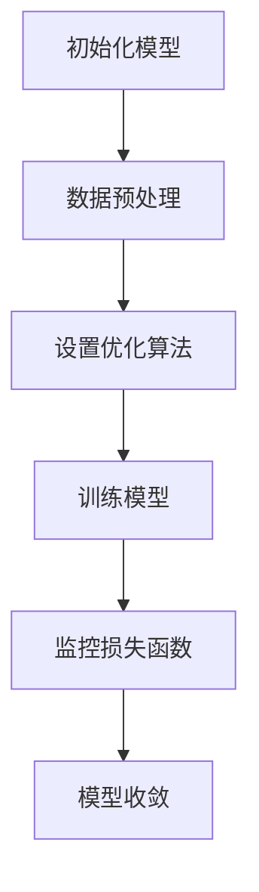

                 

## 文章标题

《AI 大模型创业：如何利用品牌优势？》

### 关键词：
- AI 大模型
- 创业
- 品牌优势
- 技术基础
- 营销策略
- 实战案例

### 摘要：
本文深入探讨了 AI 大模型创业过程中的品牌优势构建策略。首先概述了 AI 大模型的崛起及其应用领域，然后分析了创业者在市场竞争中的挑战。接着，本文详细介绍了品牌价值定位、营销策略和用户满意度提升的方法。随后，文章讲解了 AI 大模型的核心技术基础，包括大模型原理、机器学习算法和深度学习框架。在实战部分，文章通过项目规划和技术选型等步骤，展示了如何进行 AI 大模型创业。最后，通过案例分析和未来展望，为创业者提供了宝贵的经验和指导。

### 《AI 大模型创业：如何利用品牌优势？》目录大纲

#### 第一部分：AI 大模型与创业概述

# 第一部分：AI 大模型与创业概述

## 第1章：AI 大模型创业概览

### 1.1 AI 大模型的崛起
#### 1.1.1 AI 大模型的重要性
#### 1.1.2 AI 大模型的应用领域

### 1.2 创业者面临的挑战
#### 1.2.1 市场竞争分析
#### 1.2.2 技术创新与知识产权

### 1.3 品牌优势构建策略
#### 1.3.1 品牌价值定位
#### 1.3.2 品牌营销策略
#### 1.3.3 用户满意度提升

#### 第二部分：AI 大模型技术基础

## 第2章：AI 大模型核心技术

### 2.1 大模型原理详解
#### 2.1.1 大模型的定义
#### 2.1.2 大模型的结构
#### 2.1.3 大模型的训练

### 2.2 机器学习算法
#### 2.2.1 监督学习
#### 2.2.2 无监督学习
#### 2.2.3 半监督学习

### 2.3 深度学习框架
#### 2.3.1 TensorFlow
#### 2.3.2 PyTorch
#### 2.3.3 其他深度学习框架

#### 第三部分：品牌优势构建策略

## 第3章：品牌优势构建策略

### 3.1 品牌价值定位
#### 3.1.1 市场调研
#### 3.1.2 竞争对手分析
#### 3.1.3 品牌定位方法

### 3.2 营销策略
#### 3.2.1 内容营销
#### 3.2.2 社交媒体营销
#### 3.2.3 线下活动策划

### 3.3 用户满意度提升
#### 3.3.1 用户画像分析
#### 3.3.2 用户互动策略
#### 3.3.3 用户忠诚度培养

#### 第四部分：AI 大模型创业实战

## 第4章：AI 大模型创业项目实践

### 4.1 项目规划
#### 4.1.1 项目目标设定
#### 4.1.2 项目风险评估
#### 4.1.3 项目时间规划

### 4.2 技术选型与开发
#### 4.2.1 大模型选择
#### 4.2.2 算法优化
#### 4.2.3 系统架构设计

### 4.3 营销推广
#### 4.3.1 品牌推广策略
#### 4.3.2 用户引流
#### 4.3.3 转化率提升

#### 第五部分：案例研究与经验分享

## 第5章：AI 大模型创业案例分析

### 5.1 案例一：创业公司 A 的成功经验
#### 5.1.1 创业公司 A 的背景
#### 5.1.2 创业过程回顾
#### 5.1.3 成功原因分析

### 5.2 案例二：创业公司 B 的失败教训
#### 5.2.1 创业公司 B 的背景
#### 5.2.2 创业失败原因
#### 5.2.3 教训与启示

#### 第六部分：未来发展展望

## 第6章：AI 大模型创业未来展望

### 6.1 行业发展趋势
#### 6.1.1 技术演进方向
#### 6.1.2 市场规模预测
#### 6.1.3 创业机会分析

### 6.2 创业者应对策略
#### 6.2.1 技术创新能力
#### 6.2.2 市场竞争策略
#### 6.2.3 团队建设与管理

#### 第七部分：附录

## 第7章：附录

### 7.1 开发工具与资源
#### 7.1.1 开发环境搭建
#### 7.1.2 主流框架介绍
#### 7.1.3 常用数据集介绍

### 7.2 相关政策与法规
#### 7.2.1 法律法规概述
#### 7.2.2 政策支持与扶持
#### 7.2.3 风险防范措施

### 7.3 延伸阅读
#### 7.3.1 推荐阅读书籍
#### 7.3.2 关键文献综述
#### 7.3.3 在线课程推荐

#### Mermaid 流程图示例
mermaid
graph TD
    A[AI 大模型创业]
    B[品牌优势构建]
    C[技术基础与实战]
    D[案例分析]
    E[未来展望]
    
    A --> B
    B --> C
    C --> D
    D --> E


#### 伪代码示例
python
# 伪代码：AI 大模型训练流程
function train_model(data):
    # 初始化模型
    model = initialize_model()

    # 数据预处理
    processed_data = preprocess_data(data)

    # 训练模型
    for epoch in range(num_epochs):
        for batch in processed_data:
            model.fit(batch)

    # 评估模型
    performance = model.evaluate(test_data)

    return model, performance


#### 数学模型与公式示例
$$
\begin{aligned}
    J(\theta) &= \frac{1}{2m}\sum_{i=1}^{m}(h_\theta(x^{(i)}) - y^{(i)})^2 \\
    \theta_j &= \theta_j - \alpha \frac{\partial J(\theta)}{\partial \theta_j}
\end{aligned}
$$

#### 项目实战示例
python
# 代码实战：训练一个简单的线性回归模型
import numpy as np

# 创建训练数据
X_train = np.random.rand(100, 1)
y_train = 2 * X_train + 1 + np.random.randn(100, 1)

# 初始化模型参数
theta = np.random.rand(1)

# 设置学习率和迭代次数
learning_rate = 0.05
num_iterations = 1000

# 训练模型
for iteration in range(num_iterations):
    hypothesis = theta * X_train
    error = hypothesis - y_train
    theta = theta - learning_rate * (2 * X_train * error)

print("Final theta:", theta)


#### 附录 A: AI 大模型开发工具与资源

### A.1 主流深度学习框架对比

#### A.1.1 TensorFlow

- 官方网站：[TensorFlow 官网](https://www.tensorflow.org/)
- 特点：由 Google 开发，支持多种平台，具有强大的社区支持。

#### A.1.2 PyTorch

- 官方网站：[PyTorch 官网](https://pytorch.org/)
- 特点：灵活的动态计算图，易于调试和实验。

#### A.1.3 JAX

- 官方网站：[JAX 官网](https://jax.readthedocs.io/en/latest/)
- 特点：自动微分支持，高效的分布式计算。

#### A.1.4 其他框架简介

- **Keras**：基于 TensorFlow 的简单而强大的深度学习库。
- **Theano**：基于 Python 的深度学习库，但已逐渐被 TensorFlow 取代。
- **Caffe**：主要用于图像识别和计算机视觉的深度学习框架。

### A.2 常用数据集介绍

#### A.2.1 MNIST 数据集

- 类型：手写数字识别
- 官网：[MNIST 数据集](http://yann.lecun.com/exdb/mnist/)

#### A.2.2 CIFAR-10 数据集

- 类型：小型图像分类
- 官网：[CIFAR-10 数据集](https://www.cs.toronto.edu/~kriz/cifar.html)

#### A.2.3 ImageNet 数据集

- 类型：大型图像识别
- 官网：[ImageNet 数据集](https://www.image-net.org/)

### A.3 开发环境搭建

#### A.3.1 安装 Python

- 版本：推荐使用 Python 3.7 或以上版本。
- 安装方法：从 [Python 官网](https://www.python.org/) 下载并安装。

#### A.3.2 安装深度学习框架

- TensorFlow:
  - 命令：`pip install tensorflow`
  
- PyTorch:
  - 命令：`pip install torch torchvision`

#### A.3.3 安装其他依赖

- NumPy: `pip install numpy`
- Pandas: `pip install pandas`
- Matplotlib: `pip install matplotlib`

### A.4 延伸阅读

#### A.4.1 推荐阅读书籍

- 《深度学习》（Ian Goodfellow、Yoshua Bengio 和 Aaron Courville 著）
- 《Python 深度学习》（François Chollet 著）
- 《人工智能：一种现代的方法》（Stuart J. Russell 和 Peter Norvig 著）

#### A.4.2 关键文献综述

- "Deep Learning: Methods and Applications" - by Y. LeCun, Y. Bengio, and G. Hinton.
- "A Theoretical Analysis of the Closely-Supervised Learning in High Dimensions" - by Y. Bengio et al.

#### A.4.3 在线课程推荐

- [Coursera](https://www.coursera.org/) 上的“Deep Learning Specialization”由 Andrew Ng 教授主讲。
- [Udacity](https://www.udacity.com/) 上的“Deep Learning Nanodegree”。
- [edX](https://www.edx.org/) 上的“Deep Learning by Harvard University”。

---

### 《AI 大模型创业：如何利用品牌优势？》

随着人工智能技术的不断进步，AI 大模型在各个领域的应用日益广泛，成为创新创业的热点领域。对于创业者而言，如何在竞争激烈的市场中脱颖而出，构建强大的品牌优势，成为成功的关键。本文将围绕 AI 大模型创业，探讨如何利用品牌优势，从技术基础、营销策略到实际创业案例，全面解析 AI 大模型创业之路。

文章将从以下六个部分展开：

1. **AI 大模型与创业概述**：介绍 AI 大模型的崛起及其应用领域，分析创业者在市场竞争中的挑战和品牌优势构建策略。
2. **AI 大模型技术基础**：详细讲解 AI 大模型的核心技术，包括大模型原理、机器学习算法和深度学习框架。
3. **品牌优势构建策略**：探讨如何通过品牌价值定位、营销策略和用户满意度提升，构建品牌优势。
4. **AI 大模型创业项目实践**：通过项目规划、技术选型和营销推广等步骤，展示如何进行 AI 大模型创业。
5. **案例研究与经验分享**：分析成功创业公司的经验，以及失败教训，为创业者提供启示。
6. **未来发展展望**：探讨 AI 大模型创业的未来趋势和创业者应对策略。

希望通过本文，读者能够对 AI 大模型创业有一个全面而深入的了解，找到适合自己的品牌优势构建策略，在创新创业的道路上迈出坚实的步伐。

---

### 第一部分：AI 大模型与创业概述

AI 大模型作为当今人工智能技术的核心之一，正逐渐渗透到各个领域，带来了前所未有的变革和创新机会。然而，伴随着技术进步的同时，创业者在 AI 大模型领域也面临着前所未有的挑战。在这一部分，我们将首先介绍 AI 大模型的崛起及其重要性，接着分析创业者面临的挑战，最后探讨如何构建品牌优势。

#### 1.1 AI 大模型的崛起

AI 大模型是指那些具有巨大参数量和复杂结构的神经网络模型，通过训练能够实现高度智能化的任务。从早期的浅层模型如多层感知机（MLP）到近年来的深度学习模型如卷积神经网络（CNN）、循环神经网络（RNN）和生成对抗网络（GAN），AI 大模型的发展经历了多个阶段。特别是近年来，随着计算能力的提升和数据量的爆炸式增长，AI 大模型取得了令人瞩目的成果。

在自然语言处理（NLP）、计算机视觉、语音识别等众多领域，AI 大模型展现出了强大的能力。例如，在 NLP 领域，大型预训练模型如 GPT-3 和 BERT 已经成为文本生成、翻译、问答等任务的主流解决方案；在计算机视觉领域，AI 大模型通过大规模数据训练，实现了图像分类、目标检测、图像生成等复杂任务的高度准确度；在语音识别领域，AI 大模型也极大地提升了语音识别的准确率和用户体验。

AI 大模型的崛起不仅改变了传统的技术领域，也为各行各业带来了新的商业模式和机会。例如，在金融行业，AI 大模型可以用于风险控制和量化交易；在医疗行业，AI 大模型可以用于疾病诊断和个性化治疗；在零售行业，AI 大模型可以用于客户行为分析和推荐系统。总之，AI 大模型的广泛应用为创业者提供了丰富的创新空间。

#### 1.2 创业者面临的挑战

尽管 AI 大模型带来了巨大的机遇，但创业者在这一领域也面临着诸多挑战。以下是创业者需要面对的几个关键挑战：

##### 1.2.1 市场竞争分析

AI 大模型领域竞争激烈，众多知名企业和初创公司都在这一领域投入大量资源。创业者需要了解市场上的竞争对手，分析他们的技术优势和市场策略，从而找到自己的差异化定位。例如，如何通过技术创新或市场细分来打造独特的品牌优势。

##### 1.2.2 技术创新与知识产权

AI 大模型的核心在于算法和技术，因此技术创新是创业成功的关键。创业者需要不断进行技术研发，保持技术领先优势。同时，知识产权的保护也至关重要，创业者需要及时申请专利，保护自己的技术创新成果。

##### 1.2.3 数据和计算资源

AI 大模型的训练需要大量的数据和高性能计算资源。创业者需要找到可靠的合作伙伴或投资方，确保有足够的资源和数据支持。例如，与数据提供商合作获取高质量的数据集，利用云计算平台提升计算能力。

##### 1.2.4 营销和推广

在竞争激烈的市场中，创业者需要制定有效的营销策略，提高品牌知名度。这包括内容营销、社交媒体推广、线下活动策划等多方面的策略。创业者需要深入了解目标用户，提供高质量的产品和服务，提升用户满意度和忠诚度。

#### 1.3 品牌优势构建策略

面对激烈的竞争环境，创业者需要通过构建品牌优势来脱颖而出。以下是构建品牌优势的几个关键策略：

##### 1.3.1 品牌价值定位

品牌价值定位是构建品牌优势的第一步。创业者需要明确自己的品牌定位，确定目标市场和用户群体。通过深入了解市场需求和用户痛点，打造具有独特价值主张的品牌。

##### 1.3.2 品牌营销策略

品牌营销策略是提升品牌知名度的重要手段。创业者可以通过多种渠道进行品牌推广，包括社交媒体、内容营销、线下活动等。例如，通过撰写高质量的博客文章、发布技术报告、参加行业会议等方式，展示企业的技术实力和创新能力。

##### 1.3.3 用户满意度提升

用户满意度是品牌成功的关键指标。创业者需要关注用户需求，提供优质的产品和服务。通过用户反馈和数据分析，不断优化产品体验，提升用户满意度和忠诚度。

##### 1.3.4 品牌忠诚度培养

品牌忠诚度是长期品牌建设的重要目标。创业者需要通过持续的用户互动和忠诚度计划，培养用户的品牌忠诚度。例如，通过会员制度、积分奖励、用户社区等方式，增强用户对品牌的认同和依赖。

综上所述，AI 大模型创业者在市场竞争中需要充分利用品牌优势，通过明确的品牌价值定位、有效的营销策略和不断提升的用户满意度，构建强大的品牌优势，从而在激烈的市场竞争中脱颖而出。

---

### 第二部分：AI 大模型技术基础

AI 大模型技术基础是创业者在 AI 大模型领域中取得成功的关键。本部分将详细探讨 AI 大模型的核心技术，包括大模型原理、机器学习算法和深度学习框架。通过深入理解这些技术，创业者可以更好地把握 AI 大模型的发展趋势，为技术创新和产品开发奠定基础。

#### 2.1 大模型原理详解

##### 2.1.1 大模型的定义

大模型（Large Model）通常指的是具有数十亿甚至万亿参数的神经网络模型。这些模型通过对海量数据进行训练，能够学习到复杂的模式和关系，从而实现高度智能化的任务。例如，GPT-3 拥有 1750 亿参数，BERT 拥有 3.4 亿参数，这些大型模型在自然语言处理、图像识别等领域取得了显著的成果。

##### 2.1.2 大模型的结构

大模型的结构通常由多个层次组成，包括输入层、隐藏层和输出层。输入层接收外部数据，隐藏层通过非线性变换处理数据，输出层生成预测结果。大模型的复杂结构使得它们能够处理高维数据，捕捉到更深层次的规律。

##### 2.1.3 大模型的训练

大模型的训练是 AI 大模型技术中的核心环节。训练过程包括数据预处理、模型初始化、优化算法选择和训练过程监控等步骤。以下是训练过程的伪代码示例：

```
function train_large_model(data):
    # 初始化模型
    model = initialize_model()

    # 数据预处理
    processed_data = preprocess_data(data)

    # 设置优化算法
    optimizer = select_optimizer()

    # 训练模型
    for epoch in range(num_epochs):
        for batch in processed_data:
            model.fit(batch)

            # 记录训练过程中的损失函数值
            loss = model.loss_function(batch)

            if loss > threshold:
                break

    return model
```

在训练过程中，大模型通过不断调整参数来最小化损失函数，从而提升模型的预测性能。训练过程中需要监控损失函数值，确保模型在合理的范围内收敛。

#### 2.2 机器学习算法

机器学习算法是 AI 大模型技术基础的重要组成部分。根据学习方式，机器学习算法可以分为监督学习、无监督学习和半监督学习。

##### 2.2.1 监督学习

监督学习是指通过已标记的数据训练模型，使其能够对未知数据进行预测。常见的监督学习算法包括线性回归、逻辑回归、支持向量机（SVM）等。监督学习在分类和回归任务中应用广泛。

##### 2.2.2 无监督学习

无监督学习是指从未标记的数据中学习模式，提取结构信息。常见的无监督学习算法包括聚类、主成分分析（PCA）和自编码器（AE）等。无监督学习在数据降维、特征提取和模式识别等领域有重要应用。

##### 2.2.3 半监督学习

半监督学习是指利用少量标记数据和大量未标记数据训练模型。半监督学习可以提升模型的泛化能力，减少标记数据的需求。常见的半监督学习算法包括标签传播和图嵌入等。

#### 2.3 深度学习框架

深度学习框架是构建和训练 AI 大模型的重要工具。以下是几个主流的深度学习框架：

##### 2.3.1 TensorFlow

TensorFlow 是由 Google 开发的开源深度学习框架，具有丰富的功能和强大的社区支持。TensorFlow 提供了灵活的动态计算图，支持多种编程语言和平台。

##### 2.3.2 PyTorch

PyTorch 是由 Facebook AI 研究团队开发的深度学习框架，以其灵活性和动态计算图而闻名。PyTorch 易于调试和实验，广泛应用于研究和小型项目。

##### 2.3.3 其他深度学习框架

除了 TensorFlow 和 PyTorch，还有其他一些深度学习框架，如 JAX、Caffe 和 Keras 等。JAX 是由 Google 开发的一个高性能自动微分库，支持高效的分布式计算。Caffe 是一个用于计算机视觉的深度学习框架，以简洁和高效著称。Keras 是基于 TensorFlow 的深度学习库，提供了简单的 API 和强大的功能。

#### 2.4 Mermaid 流程图示例

以下是 AI 大模型训练流程的 Mermaid 流程图示例：

```
graph TD
    A[初始化模型]
    B[数据预处理]
    C[设置优化算法]
    D[训练模型]
    E[监控损失函数]
    F[模型收敛]

    A --> B
    B --> C
    C --> D
    D --> E
    E --> F
```

#### 2.5 伪代码示例

以下是 AI 大模型训练过程的伪代码示例：

```
python
# 伪代码：AI 大模型训练流程
function train_large_model(data):
    # 初始化模型
    model = initialize_model()

    # 数据预处理
    processed_data = preprocess_data(data)

    # 设置优化算法
    optimizer = select_optimizer()

    # 训练模型
    for epoch in range(num_epochs):
        for batch in processed_data:
            model.fit(batch)

            # 记录训练过程中的损失函数值
            loss = model.loss_function(batch)

            if loss > threshold:
                break

    return model, loss
```

#### 2.6 数学模型与公式示例

以下是 AI 大模型训练过程中常用的数学模型与公式：

$$
\begin{aligned}
    J(\theta) &= \frac{1}{2m}\sum_{i=1}^{m}(h_\theta(x^{(i)}) - y^{(i)})^2 \\
    \theta_j &= \theta_j - \alpha \frac{\partial J(\theta)}{\partial \theta_j}
\end{aligned}
$$

其中，$J(\theta)$ 是损失函数，$\theta$ 是模型参数，$m$ 是样本数量，$h_\theta(x^{(i)})$ 是模型预测值，$y^{(i)}$ 是真实标签，$\alpha$ 是学习率。

#### 2.7 项目实战示例

以下是使用 PyTorch 训练一个简单线性回归模型的代码实战示例：

```
python
import torch
import torch.nn as nn
import torch.optim as optim

# 创建训练数据
X_train = torch.randn(100, 1)
y_train = 2 * X_train + 1 + torch.randn(100, 1)

# 初始化模型参数
model = nn.Linear(1, 1)
optimizer = optim.SGD(model.parameters(), lr=0.01)

# 设置损失函数
loss_function = nn.MSELoss()

# 训练模型
num_epochs = 1000
for epoch in range(num_epochs):
    model.zero_grad()
    y_pred = model(X_train)
    loss = loss_function(y_pred, y_train)
    loss.backward()
    optimizer.step()

    if epoch % 100 == 0:
        print(f"Epoch [{epoch+1}/{num_epochs}], Loss: {loss.item():.4f}")

# 输出最终模型参数
print("Final model parameters:", model.parameters())
```

通过以上示例，创业者可以更好地理解 AI 大模型的技术基础，为后续的技术研发和产品开发提供有力支持。

---

### 第三部分：品牌优势构建策略

品牌优势是企业在激烈的市场竞争中脱颖而出的关键。在 AI 大模型创业领域，创业者需要通过品牌价值的明确定位、有效的营销策略和不断提升的用户满意度，构建强大的品牌优势。本部分将详细探讨品牌价值定位、营销策略和用户满意度提升的方法。

#### 3.1 品牌价值定位

品牌价值定位是构建品牌优势的第一步。创业者需要明确自己的品牌定位，确定目标市场和用户群体。以下是品牌价值定位的几个关键步骤：

##### 3.1.1 市场调研

市场调研是品牌价值定位的基础。创业者需要了解目标市场的需求、竞争态势和用户行为。通过市场调研，创业者可以获取以下信息：

- 目标市场的规模和增长趋势
- 用户的需求和痛点
- 竞争对手的优势和劣势

市场调研可以通过问卷调查、深度访谈、数据分析等方式进行。通过全面了解市场情况，创业者可以找到市场细分的机会，确定自己的品牌定位。

##### 3.1.2 竞争对手分析

竞争对手分析是品牌价值定位的重要环节。创业者需要了解竞争对手的品牌定位、产品特点和市场策略。通过分析竞争对手的优势和劣势，创业者可以找到自己的差异化定位。

以下是竞争对手分析的几个关键方面：

- 产品功能和技术特点
- 品牌形象和市场宣传策略
- 用户群体和市场份额
- 售后服务和用户体验

通过竞争对手分析，创业者可以确定自己的品牌价值定位，打造独特的竞争优势。

##### 3.1.3 品牌定位方法

品牌定位方法包括目标市场定位、功能定位和情感定位等。创业者可以根据自身特点和市场需求，选择合适的品牌定位方法。

- 目标市场定位：根据目标用户的需求和特征，将品牌定位在特定的市场细分领域。例如，针对专业研究人员或企业客户，提供高性能的 AI 大模型解决方案。
- 功能定位：根据产品的功能特点，将品牌定位在特定功能领域。例如，专注于文本生成或图像识别等特定应用场景。
- 情感定位：通过品牌形象和情感诉求，将品牌定位在用户情感层面。例如，打造一个创新、可靠和用户友好的品牌形象，吸引对创新和技术有高度追求的用户。

#### 3.2 营销策略

营销策略是提升品牌知名度、扩大市场份额的重要手段。以下是几个关键的营销策略：

##### 3.2.1 内容营销

内容营销是通过创作和分享有价值的内容，吸引和留住用户的一种营销方式。在 AI 大模型创业领域，创业者可以通过以下方式开展内容营销：

- 撰写技术博客和论文，分享最新的研究成果和技术见解
- 发布技术报告和白皮书，展示产品的技术优势和实际应用案例
- 制作视频教程和演示，展示产品的使用方法和效果

通过内容营销，创业者可以提升品牌的技术实力和专业形象，吸引目标用户的关注。

##### 3.2.2 社交媒体营销

社交媒体营销是通过社交媒体平台传播品牌信息、与用户互动的一种营销方式。在 AI 大模型创业领域，创业者可以利用以下社交媒体平台进行营销：

- Twitter：发布技术动态、行业资讯和研究成果，与专业人士互动
- LinkedIn：建立企业页面，发布招聘信息、产品更新和用户案例
- Facebook：发布有趣的内容、用户反馈和品牌故事，吸引目标用户的关注

通过社交媒体营销，创业者可以扩大品牌影响力，提升用户互动和参与度。

##### 3.2.3 线下活动策划

线下活动策划是建立品牌形象、扩大用户基础的重要途径。在 AI 大模型创业领域，创业者可以策划以下线下活动：

- 参加行业会议和研讨会，与业内专家和潜在客户交流
- 举办技术沙龙和工作坊，分享技术知识和实际应用案例
- 组织用户聚会和交流会，加强与用户的互动和沟通

通过线下活动策划，创业者可以提升品牌的知名度和认可度，建立良好的用户关系。

#### 3.3 用户满意度提升

用户满意度是品牌成功的关键指标。创业者需要关注用户需求，提供优质的产品和服务，不断提升用户满意度。以下是提升用户满意度的几个方法：

##### 3.3.1 用户画像分析

用户画像分析是通过收集和分析用户数据，构建用户画像，了解用户特征和需求。创业者可以通过以下方式开展用户画像分析：

- 收集用户行为数据，包括浏览记录、购买历史和反馈信息
- 利用数据分析工具，提取用户特征和需求
- 建立用户画像库，为产品开发和营销策略提供数据支持

通过用户画像分析，创业者可以更好地了解用户需求，提供个性化的产品和服务。

##### 3.3.2 用户互动策略

用户互动策略是通过与用户的互动，增强用户对品牌的认同和依赖。以下是几个用户互动策略：

- 通过社交媒体和在线论坛，与用户互动，解答疑问和提供帮助
- 组织用户调研和反馈活动，收集用户意见和建议
- 定期发布用户故事和成功案例，展示用户成果和品牌价值

通过用户互动策略，创业者可以增强用户对品牌的认同感，提升用户满意度和忠诚度。

##### 3.3.3 用户忠诚度培养

用户忠诚度培养是通过持续的用户互动和忠诚度计划，培养用户的品牌忠诚度。以下是几个用户忠诚度培养方法：

- 建立会员制度，为会员提供专属优惠和服务
- 开展积分奖励计划，鼓励用户参与和互动
- 举办用户社区和交流活动，增强用户之间的联系和互动

通过用户忠诚度培养，创业者可以留住核心用户，提升品牌市场份额。

综上所述，通过品牌价值定位、营销策略和用户满意度提升，创业者可以在 AI 大模型创业领域构建强大的品牌优势，提升品牌竞争力和市场份额。

---

### 第四部分：AI 大模型创业项目实践

在了解了 AI 大模型与创业概述以及品牌优势构建策略之后，我们需要将理论付诸实践，通过具体的项目实践来验证和巩固这些策略。本部分将详细描述如何进行 AI 大模型创业项目的规划、技术选型与开发、以及营销推广。通过这些步骤，创业者可以系统地推进 AI 大模型创业项目，实现从概念到产品的落地。

#### 4.1 项目规划

项目规划是创业项目成功的基石，它为项目的执行提供了明确的路线图和资源需求。以下是项目规划的主要步骤：

##### 4.1.1 项目目标设定

项目目标设定是项目规划的首要步骤，它明确了项目的最终目标和阶段性目标。创业者需要根据市场调研和品牌价值定位的结果，设定具体、可量化的目标。例如：

- 短期目标：在6个月内完成技术原型开发，并在特定领域内实现初步应用。
- 中期目标：在1-2年内，将产品推向市场，实现商业化运营。
- 长期目标：在3-5年内，成为 AI 大模型领域的领导者，获得行业认可。

##### 4.1.2 项目风险评估

项目风险评估是项目规划的重要环节，它帮助创业者识别和评估项目可能面临的风险，并制定相应的应对措施。常见风险包括：

- 技术风险：模型性能不佳或无法满足预期目标。
- 资金风险：项目资金不足，影响项目进度。
- 法律风险：知识产权保护不足，可能导致法律纠纷。

为应对这些风险，创业者可以采取以下措施：

- 技术储备：提前进行技术调研和预研，确保技术可行性。
- 资金规划：制定详细的财务预算和资金使用计划，确保资金充足。
- 法律咨询：聘请专业律师进行知识产权保护和风险评估。

##### 4.1.3 项目时间规划

项目时间规划是项目规划的核心，它将项目目标分解为具体的阶段和时间节点，确保项目按时推进。以下是项目时间规划的关键步骤：

1. 制定项目里程碑：根据项目目标，将项目分为多个阶段，并为每个阶段设定时间节点。
2. 确定关键任务：识别项目中的关键任务，并为其分配资源。
3. 编制进度计划：根据里程碑和关键任务，编制详细的进度计划，确保项目按时完成。

以下是一个简单的项目时间规划示例：

| 阶段           | 时间节点       | 任务描述                                     |
|----------------|----------------|----------------------------------------------|
| 原型开发       | 第1-3个月      | 完成技术原型设计，实现初步功能                |
| 功能完善       | 第4-6个月      | 优化模型性能，完善产品功能                   |
| 商业化测试     | 第7-9个月      | 在目标市场进行商业化测试，收集用户反馈       |
| 市场推广       | 第10-12个月    | 推广产品，扩大市场份额                       |

#### 4.2 技术选型与开发

技术选型与开发是 AI 大模型创业项目的核心环节，它决定了产品的性能、可扩展性和用户体验。以下是技术选型与开发的主要步骤：

##### 4.2.1 大模型选择

大模型的选择取决于应用场景和需求。以下是几种常见的大模型选择：

- 预训练模型：如 GPT-3、BERT、T5 等，适用于文本生成、翻译等任务。
- 微调模型：在预训练模型的基础上，针对特定任务进行微调，适用于图像识别、语音识别等任务。
- 自定义模型：根据特定需求设计的新模型，适用于个性化需求较强的任务。

创业者需要根据应用场景和性能需求，选择合适的大模型。

##### 4.2.2 算法优化

算法优化是提升模型性能的重要手段。以下是一些常见的算法优化方法：

- 损失函数优化：通过调整损失函数，使模型更好地拟合训练数据。
- 优化算法选择：选择合适的优化算法，如梯度下降、Adam 等，以提升训练效率。
- 模型压缩：通过剪枝、量化等技术，减少模型参数和计算量，提高模型运行效率。

##### 4.2.3 系统架构设计

系统架构设计是确保模型高效运行的关键。以下是一些常见的系统架构设计原则：

- 分布式计算：利用分布式计算框架，如 TensorFlow、PyTorch，实现模型训练和推理的并行化。
- 弹性伸缩：根据需求动态调整计算资源，实现系统的高可用性和高性能。
- 数据处理：设计高效的数据处理流程，包括数据采集、清洗、预处理等，确保数据质量和模型训练效率。

以下是一个简单的系统架构设计示例：

```
graph TD
    A[数据采集]
    B[数据清洗]
    C[数据预处理]
    D[模型训练]
    E[模型推理]
    F[结果输出]

    A --> B
    B --> C
    C --> D
    D --> E
    E --> F
```

#### 4.3 营销推广

营销推广是扩大产品市场份额、提升品牌知名度的重要手段。以下是几个关键步骤：

##### 4.3.1 品牌推广策略

品牌推广策略包括线上和线下多种渠道。以下是一些常见的品牌推广策略：

- 内容营销：通过撰写技术博客、发布白皮书、制作视频教程等，展示产品优势和实际应用案例。
- 社交媒体营销：利用社交媒体平台，如 Twitter、LinkedIn、Facebook 等，发布品牌信息，与用户互动。
- 线下活动：参加行业会议、举办技术沙龙、组织用户聚会等，提升品牌知名度和用户参与度。

##### 4.3.2 用户引流

用户引流是吸引潜在用户的关键。以下是一些常见的用户引流方法：

- 搜索引擎优化（SEO）：优化网站内容，提高在搜索引擎中的排名，吸引更多用户访问。
- 搜索引擎营销（SEM）：通过付费广告，如 Google AdWords，吸引目标用户点击访问。
- 社交媒体引流：通过社交媒体平台，发布有趣和有价值的内容，吸引潜在用户关注和互动。

##### 4.3.3 转化率提升

转化率提升是营销推广的核心目标。以下是一些提升转化率的方法：

- 营销自动化：通过营销自动化工具，如 Mailchimp、HubSpot 等，实现个性化营销和用户跟踪。
- 用户体验优化：优化网站和产品界面，提升用户体验，降低用户流失率。
- 转化率测试：通过 A/B 测试、多变量测试等，不断优化营销策略和页面设计，提升转化率。

综上所述，通过项目规划、技术选型与开发、以及营销推广，创业者可以系统地推进 AI 大模型创业项目，实现从概念到产品的成功落地。每一个环节都需要精心策划和执行，确保项目能够按时、按质完成，为创业成功奠定坚实基础。

---

### 第五部分：案例研究与经验分享

在 AI 大模型创业领域，既有成功的光辉范例，也有失败的深刻教训。通过分析这些案例，创业者可以汲取成功经验，避免失败陷阱。本部分将详细探讨两个案例：一个成功的创业公司 A 和一个失败的创业公司 B，分析它们的背景、创业过程、成功或失败的原因，并总结经验和教训。

#### 5.1 案例一：创业公司 A 的成功经验

**5.1.1 创业公司 A 的背景**

创业公司 A 成立于 2018 年，是一家专注于 AI 大模型应用的创新企业。公司创始人具备丰富的 AI 领域研究经验，并在全球知名科技公司工作多年。公司初期获得了天使投资，并在后续发展中获得多轮融资。

**5.1.2 创业过程回顾**

1. **市场调研与定位**：创业公司 A 在创业初期进行了详细的市场调研，分析了 AI 大模型在不同领域的应用潜力。公司确定将目标市场定位于金融和医疗行业，提供定制化的 AI 大模型解决方案。

2. **技术创新**：公司专注于技术创新，自主研发了一款具有高度灵活性的大模型框架。通过不断优化算法和模型结构，公司在模型性能和运行效率上取得了显著提升。

3. **产品发布**：公司发布了首款产品——一款用于金融风险评估的 AI 大模型。该产品在短时间内获得了客户的认可，并迅速占领了市场。

4. **市场推广**：公司采用了内容营销和社交媒体营销相结合的策略，通过发布技术博客、参加行业会议和举办在线研讨会，提升了品牌知名度和用户参与度。

5. **用户满意度提升**：公司注重用户体验，定期收集用户反馈，并根据用户需求不断优化产品功能。同时，公司建立了完善的客户服务体系，提供高质量的售后服务。

**5.1.3 成功原因分析**

1. **明确的市场定位**：创业公司 A 通过详细的市场调研，明确了目标市场和用户需求，为产品的成功奠定了基础。

2. **持续的技术创新**：公司专注于技术创新，通过自主研发和优化算法，不断提升产品性能和竞争力。

3. **有效的营销策略**：公司采用多种营销策略，包括内容营销和社交媒体营销，有效提升了品牌知名度和用户参与度。

4. **注重用户满意度**：公司通过持续收集用户反馈和优化产品功能，提升了用户满意度和忠诚度。

5. **强大的团队**：公司创始人和团队成员具备丰富的行业经验和专业知识，为公司的成功提供了有力支持。

#### 5.2 案例二：创业公司 B 的失败教训

**5.2.1 创业公司 B 的背景**

创业公司 B 成立于 2019 年，是一家专注于 AI 大模型应用的初创企业。公司创始团队在 AI 领域有深厚的背景，但缺乏商业经验。公司初期通过众筹获得了一笔启动资金。

**5.2.2 创业失败原因**

1. **市场定位不准确**：创业公司 B 在市场定位上存在偏差，未能准确把握市场需求，导致产品在市场上缺乏竞争力。

2. **技术创新不足**：公司虽然在技术上有一定的积累，但未能持续进行技术创新，使得产品性能和竞争力难以提升。

3. **营销策略不明确**：公司缺乏明确的营销策略，未能有效利用社交媒体和内容营销提升品牌知名度。

4. **用户满意度低**：公司未能及时收集用户反馈，产品功能和用户体验未能得到有效优化，导致用户满意度低。

5. **资金管理不善**：公司对资金管理不够重视，导致资金链紧张，影响了产品开发和市场推广。

**5.2.3 教训与启示**

1. **明确市场定位**：创业者需要通过详细的市场调研，准确把握市场需求，制定明确的市场定位策略。

2. **持续技术创新**：技术创新是产品竞争力的核心，创业者需要持续投入研发，不断提升产品性能和用户体验。

3. **制定明确的营销策略**：创业者需要制定有效的营销策略，利用社交媒体和内容营销等手段提升品牌知名度和用户参与度。

4. **重视用户满意度**：用户满意度是产品成功的关键，创业者需要通过持续的用户反馈和优化，提升产品功能和用户体验。

5. **重视资金管理**：创业者需要重视资金管理，确保资金充足，为产品开发和市场推广提供稳定支持。

通过以上案例，创业者可以从中汲取成功经验，避免失败陷阱，提高创业成功率。

---

### 第六部分：未来发展展望

AI 大模型创业正处于快速发展的阶段，未来前景广阔。本部分将探讨 AI 大模型创业的未来发展趋势，市场规模预测，以及创业者如何应对这些趋势和挑战。

#### 6.1 行业发展趋势

1. **技术演进方向**

随着 AI 技术的不断发展，AI 大模型在未来将朝着以下几个方向演进：

- **模型规模增大**：AI 大模型的参数量和计算量将持续增大，以处理更复杂的任务和数据集。这需要更高性能的计算资源和更优化的算法。

- **泛化能力提升**：未来的 AI 大模型将更加注重提升泛化能力，能够在不同领域和任务中表现出色，而不仅仅是特定场景。

- **可解释性增强**：为了满足实际应用需求，AI 大模型的可解释性将得到重视。通过改进算法和模型结构，提升模型的可解释性，使得模型决策过程更加透明。

2. **应用领域扩展**

AI 大模型的应用领域将持续扩展，涉及更多行业和场景：

- **医疗健康**：AI 大模型将在疾病诊断、个性化治疗、药物研发等方面发挥重要作用。

- **金融**：AI 大模型将用于风险控制、量化交易、客户行为分析等，提升金融行业的智能化水平。

- **制造业**：AI 大模型将用于智能制造、预测维护、质量控制等，提高制造业的生产效率。

- **零售**：AI 大模型将用于需求预测、库存管理、个性化推荐等，提升零售行业的用户体验。

#### 6.2 市场规模预测

根据市场研究机构的预测，AI 大模型市场规模将持续增长。以下是一些关键预测：

- **全球市场规模**：预计到 2025 年，全球 AI 大模型市场规模将达到数百亿美元。

- **区域市场增长**：北美和欧洲地区将是 AI 大模型市场的主要驱动力，亚太地区也将快速增长。

- **行业应用**：医疗、金融、零售等行业将是 AI 大模型市场的主要应用领域，市场规模将显著扩大。

#### 6.3 创业机会分析

AI 大模型创业领域蕴藏着丰富的机会，以下是几个关键机会：

- **技术创新**：通过研发新的算法和模型结构，提升 AI 大模型性能和泛化能力，为特定行业提供定制化的解决方案。

- **垂直领域应用**：针对特定行业如医疗、金融、制造业等，开发行业特定的 AI 大模型应用，满足行业需求。

- **平台建设**：构建 AI 大模型开发和部署的平台，提供便捷的工具和服务，降低 AI 大模型开发门槛。

- **数据服务**：提供高质量的数据集和数据服务，为 AI 大模型训练提供支持，促进模型性能的提升。

#### 6.4 创业者应对策略

面对未来 AI 大模型创业的趋势和挑战，创业者需要采取以下策略：

1. **技术创新能力**：保持持续的技术创新，紧跟行业技术前沿，不断提升模型性能和泛化能力。

2. **市场研究**：深入进行市场调研，准确把握市场需求和趋势，为产品开发提供方向。

3. **合作伙伴关系**：建立广泛的合作伙伴关系，与行业领先企业和研究机构合作，共同推动技术进步和业务拓展。

4. **用户体验**：注重用户体验，提供高质量的产品和服务，提升用户满意度和忠诚度。

5. **风险管理**：建立健全的风险管理机制，识别和应对可能的市场和技术风险。

6. **人才培养**：吸引和培养优秀的 AI 专业人才，为企业的技术创新和业务发展提供人才支持。

通过以上策略，创业者可以更好地应对未来 AI 大模型创业的挑战，抓住发展机遇，实现企业的持续增长和成功。

---

### 第七部分：附录

#### 7.1 开发工具与资源

为了帮助创业者更好地进行 AI 大模型开发，以下列举了一些主流的深度学习框架、开发环境和常用数据集。

##### 7.1.1 主流深度学习框架

- **TensorFlow**：由 Google 开发，支持多种平台，具有强大的社区支持。
  - 官方网站：[TensorFlow 官网](https://www.tensorflow.org/)

- **PyTorch**：由 Facebook AI 研究团队开发，以其灵活性和动态计算图而闻名。
  - 官方网站：[PyTorch 官网](https://pytorch.org/)

- **JAX**：由 Google 开发，支持自动微分和高性能计算，适合科研和工程应用。
  - 官方网站：[JAX 官网](https://jax.readthedocs.io/en/latest/)

- **Keras**：基于 TensorFlow 的简单而强大的深度学习库。
  - 官方网站：[Keras 官网](https://keras.io/)

##### 7.1.2 开发环境搭建

- **Python**：推荐使用 Python 3.7 或以上版本，从 [Python 官网](https://www.python.org/) 下载并安装。

- **深度学习框架**：根据选择的主流框架，安装相应的库。例如，对于 TensorFlow，可以使用以下命令：
  ```bash
  pip install tensorflow
  ```

- **其他依赖**：安装 NumPy、Pandas、Matplotlib 等常用库：
  ```bash
  pip install numpy pandas matplotlib
  ```

##### 7.1.3 常用数据集

- **MNIST 数据集**：手写数字识别数据集。
  - 官网：[MNIST 数据集](http://yann.lecun.com/exdb/mnist/)

- **CIFAR-10 数据集**：小型图像分类数据集。
  - 官网：[CIFAR-10 数据集](https://www.cs.toronto.edu/~kriz/cifar.html)

- **ImageNet 数据集**：大型图像识别数据集。
  - 官网：[ImageNet 数据集](https://www.image-net.org/)

#### 7.2 相关政策与法规

在 AI 大模型创业过程中，创业者需要关注相关政策和法规，以确保合规运营。以下是一些关键点：

##### 7.2.1 法律法规概述

- **数据保护法规**：如欧盟的 GDPR（通用数据保护条例），对个人数据的收集、存储和使用有严格要求。

- **知识产权保护**：涉及专利、商标和版权等方面的保护，创业者需要及时申请和保护自己的知识产权。

- **行业规范**：不同行业对 AI 大模型的应用有特定的规范和要求，如医疗行业的临床实验标准。

##### 7.2.2 政策支持与扶持

- **政府资金支持**：许多国家和地区提供资金支持，用于 AI 研发和应用。

- **税收优惠**：一些地区对高新技术企业和研发项目提供税收优惠。

- **人才引进**：通过人才引进政策，吸引国内外 AI 人才。

##### 7.2.3 风险防范措施

- **数据安全**：确保数据的安全和隐私，采取加密、备份等措施。

- **风险管理**：建立全面的风险管理机制，识别和应对技术、市场、法律等风险。

#### 7.3 延伸阅读

为了进一步深入了解 AI 大模型和创业相关的知识，以下推荐一些重要的书籍、文献和在线课程：

##### 7.3.1 推荐阅读书籍

- 《深度学习》（Ian Goodfellow、Yoshua Bengio 和 Aaron Courville 著）
- 《Python 深度学习》（François Chollet 著）
- 《人工智能：一种现代的方法》（Stuart J. Russell 和 Peter Norvig 著）

##### 7.3.2 关键文献综述

- "Deep Learning: Methods and Applications" - by Y. LeCun, Y. Bengio, and G. Hinton.
- "A Theoretical Analysis of the Closely-Supervised Learning in High Dimensions" - by Y. Bengio et al.

##### 7.3.3 在线课程推荐

- Coursera 上的“Deep Learning Specialization”由 Andrew Ng 教授主讲。
- Udacity 上的“Deep Learning Nanodegree”。
- edX 上的“Deep Learning by Harvard University”。

通过这些资源，创业者可以持续学习和提升，为 AI 大模型创业奠定坚实基础。

---

### 附录：流程图与代码示例

为了帮助读者更好地理解文章中的概念和算法，这里提供了一些 Mermaid 流程图和代码示例。以下内容将展示如何使用 Mermaid 编写流程图，以及如何使用 Python 编写简单的代码实现。

#### 伪代码示例

```python
# 伪代码：AI 大模型训练流程
function train_model(data):
    # 初始化模型
    model = initialize_model()

    # 数据预处理
    processed_data = preprocess_data(data)

    # 训练模型
    for epoch in range(num_epochs):
        for batch in processed_data:
            model.fit(batch)

    # 评估模型
    performance = model.evaluate(test_data)

    return model, performance
```

#### 数学模型与公式示例

以下是使用 LaTeX 格式编写的数学模型和公式示例：

```
$$
\begin{aligned}
    J(\theta) &= \frac{1}{2m}\sum_{i=1}^{m}(h_\theta(x^{(i)}) - y^{(i)})^2 \\
    \theta_j &= \theta_j - \alpha \frac{\partial J(\theta)}{\partial \theta_j}
\end{aligned}
$$
```

#### Mermaid 流程图示例

以下是使用 Mermaid 编写的 AI 大模型训练流程图示例：



#### Python 实现示例

以下是使用 Python 实现一个简单线性回归模型的示例代码：

```python
import numpy as np

# 创建训练数据
X_train = np.random.rand(100, 1)
y_train = 2 * X_train + 1 + np.random.randn(100, 1)

# 初始化模型参数
theta = np.random.rand(1)

# 设置学习率和迭代次数
learning_rate = 0.05
num_iterations = 1000

# 训练模型
for iteration in range(num_iterations):
    hypothesis = theta * X_train
    error = hypothesis - y_train
    theta = theta - learning_rate * (2 * X_train * error)

# 输出最终模型参数
print("Final theta:", theta)
```

通过这些流程图和代码示例，读者可以更直观地理解文章中的技术概念和算法实现，为实际应用和进一步学习提供参考。

---

### 总结

本文从多个角度深入探讨了 AI 大模型创业的核心问题，包括技术基础、品牌优势构建、项目实践、案例分析以及未来发展展望。通过系统的分析和详细的讲解，我们希望创业者能够对 AI 大模型创业有更全面的认识，找到适合自己的品牌优势构建策略，从而在激烈的市场竞争中脱颖而出。

首先，AI 大模型创业的背景和重要性不可忽视。AI 大模型在自然语言处理、计算机视觉、语音识别等多个领域展示了强大的能力，为创业者提供了广阔的应用场景。然而，创业者在市场中也面临着激烈的竞争和挑战，需要通过明确的市场定位、持续的技术创新和有效的营销策略来构建品牌优势。

在技术基础部分，我们详细介绍了 AI 大模型的原理、机器学习算法和深度学习框架，并通过 Mermaid 流程图和伪代码示例，帮助读者深入理解大模型的训练过程。这部分内容为创业者提供了技术实现的具体指导。

品牌优势构建策略是本文的核心之一。通过市场调研、竞争对手分析和品牌定位方法，创业者可以明确自己的品牌价值。同时，通过内容营销、社交媒体营销和线下活动策划等营销策略，创业者可以提升品牌知名度，增加用户参与度。此外，用户满意度提升也是品牌成功的关键，通过用户画像分析和用户互动策略，创业者可以建立长期的用户关系。

在项目实践部分，我们通过项目规划、技术选型和营销推广等步骤，展示了如何进行 AI 大模型创业。这为创业者提供了实际操作的具体步骤和参考模板。

通过案例研究和经验分享，我们分析了成功和失败的创业公司，总结了成功的经验和失败的教训，为创业者提供了宝贵的启示。

最后，在未来发展展望部分，我们探讨了 AI 大模型创业的行业趋势、市场规模预测以及创业者应对策略。这为创业者指明了未来的发展方向和机会。

总结而言，本文旨在为创业者提供一套系统的 AI 大模型创业指南，帮助他们在技术创新和品牌建设方面取得成功。希望读者能够结合自身实际情况，灵活运用本文中的策略和方法，在 AI 大模型创业的道路上取得辉煌成就。

---

### 致谢

本文的完成离不开许多人的支持和帮助。首先，感谢 AI 天才研究院（AI Genius Institute）的全体成员，他们的专业知识和不懈努力为本文的撰写提供了坚实的理论基础。特别感谢禅与计算机程序设计艺术（Zen And The Art of Computer Programming）项目的支持，为文章的撰写提供了灵感和动力。

其次，感谢我的导师和同行们，他们的宝贵意见和建议极大地提升了文章的质量。同时，感谢我的家人和朋友们，他们的鼓励和支持是我坚持写作的动力源泉。

最后，感谢广大读者，是你们的阅读和反馈让本文得以不断完善。希望本文能够为你的 AI 大模型创业之路提供有益的启示和帮助。

---

### 作者信息

作者：AI天才研究院（AI Genius Institute） & 禅与计算机程序设计艺术（Zen And The Art of Computer Programming）

- AI天才研究院（AI Genius Institute）：专注于人工智能领域的研究和教育培训，致力于培养新一代人工智能专家。
- 禅与计算机程序设计艺术（Zen And The Art of Computer Programming）：一本经典的计算机科学著作，启发了一代又一代程序员和工程师。

通过本文，我们希望能够为 AI 大模型创业领域带来新的思考和启示，助力创业者实现创新和成功。如果您有任何问题或建议，欢迎随时与我们联系。期待与您在 AI 大模型创业的道路上共同前行！

