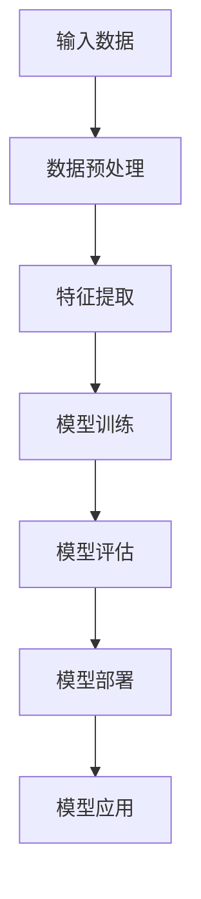
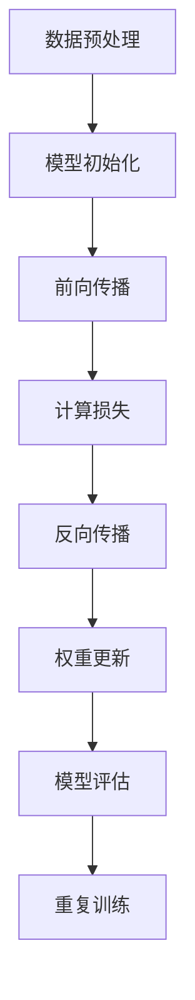

                 

# AI 大模型创业：如何利用市场优势？

> 关键词：人工智能，大模型，市场分析，创业，竞争优势，技术基础

> 摘要：本文深入探讨了 AI 大模型创业的市场现状、技术基础、创业实践和未来展望。通过逐步分析推理，文章旨在帮助创业者了解市场机会与挑战，构建竞争优势，并探索 AI 大模型创业的长期发展策略。

### 第一部分：AI大模型创业概述

#### 第1章：AI大模型市场分析

**1.1 AI大模型市场的现状**

AI 大模型市场近年来呈现出爆发式增长。全球范围内，AI 大模型的应用场景越来越广泛，包括自然语言处理、计算机视觉、语音识别等领域。根据市场研究报告，2022 年全球 AI 大模型市场规模已达到数十亿美元，并预计在未来几年内继续保持高速增长。

在全球范围内，美国、中国和欧盟等主要国家和地区在 AI 大模型领域都展开了积极的政策支持和产业布局。美国通过政府资助和私营企业的投资，推动了 AI 大模型技术的快速发展；中国在“新基建”背景下，加大对 AI 大模型的研发投入，致力于建立全球领先的 AI 产业链；欧盟则通过推动数据隐私法规，试图在 AI 大模型领域建立更加公平和可持续的竞争环境。

行业主要参与者包括 Google、Microsoft、Facebook、百度、阿里巴巴和腾讯等科技巨头。这些公司在 AI 大模型领域的研发投入巨大，通过不断推出新的模型和算法，巩固了其市场地位。此外，许多初创公司也积极参与到 AI 大模型市场中，通过技术创新和应用场景的拓展，试图在激烈的市场竞争中脱颖而出。

**1.2 AI大模型的市场机会**

AI 大模型在各个行业领域的应用需求日益增长。在金融领域，AI 大模型被用于信用评估、风险评估和量化交易；在医疗领域，AI 大模型被用于疾病诊断、药物研发和患者管理；在零售领域，AI 大模型被用于需求预测、库存管理和个性化推荐。这些应用场景不仅提升了行业效率，还为企业创造了巨大的商业价值。

对于创业者而言，进入 AI 大模型市场的切入点多种多样。一方面，可以专注于特定领域的应用开发，如医疗、金融、零售等；另一方面，也可以专注于特定技术的研发，如深度学习、自然语言处理、计算机视觉等。此外，创业者还可以通过打造垂直领域的 AI 大模型平台，为不同行业的客户提供一站式解决方案。

市场细分带来了潜在商机。例如，随着 5G 网络的普及，边缘计算和实时 AI 应用场景将得到进一步发展；随着物联网的广泛应用，智能家居、智慧城市等领域也将成为 AI 大模型的重要应用场景。创业者可以通过关注这些细分市场，寻找潜在的商机。

**1.3 AI大模型的挑战与风险**

AI 大模型的创业面临着多重挑战和风险。首先，技术研发的难度和成本较高。AI 大模型涉及深度学习、计算机视觉、自然语言处理等多个领域，需要高水平的技术团队和强大的计算资源。其次，数据隐私与伦理问题是 AI 大模型创业的重要挑战。大模型训练需要大量高质量的数据，而这些数据的获取和隐私保护成为企业不得不面对的问题。此外，法律法规与合规要求也对 AI 大模型创业提出了新的挑战。各国对 AI 大模型的应用制定了严格的法律法规，企业需要确保其产品和服务符合相关法规要求。

**1.4 市场优势与竞争优势**

在激烈的市场竞争中，创业者需要构建竞争优势。市场优势主要体现在技术创新、应用场景拓展和生态系统建设等方面。技术创新是 AI 大模型创业的核心驱动力，创业者需要持续投入研发，不断推出新的模型和算法，以保持技术领先地位。应用场景拓展是 AI 大模型创业的重要方向，创业者需要关注新兴市场，挖掘潜在的应用需求。生态系统建设则是 AI 大模型创业的重要保障，创业者需要构建良好的合作伙伴关系，打造完整的产业链。

竞争优势主要体现在差异化、客户粘性和品牌影响力等方面。差异化策略可以通过提供独特的产品和服务，满足客户的不同需求。客户粘性则可以通过优质的客户体验和良好的售后服务，增强客户忠诚度。品牌影响力则是 AI 大模型创业的重要资产，创业者需要通过品牌建设，提升企业的知名度和美誉度。

#### 第2章：AI大模型技术基础

**2.1 AI大模型的基本原理**

AI 大模型是基于深度学习技术构建的复杂神经网络系统。深度学习是一种机器学习技术，通过模拟人脑神经元之间的连接和交互，实现数据的自动特征提取和分类。AI 大模型通常由多个层次组成，每个层次对输入数据进行处理和转换，最终输出预测结果。

Mermaid 流程图：AI 大模型的基本工作流程



**2.2 AI大模型的关键算法**

AI 大模型的核心算法包括神经网络算法、卷积神经网络（CNN）、循环神经网络（RNN）和生成对抗网络（GAN）等。

**神经网络算法的基本原理**

神经网络算法通过模拟生物神经网络的结构和功能，实现数据的自动特征提取和分类。以下是神经网络算法的基本原理伪代码：

```python
# 神经网络算法伪代码
initialize_weights()
initialize_bias()

for each epoch:
    for each training sample:
        forward_pass()
        compute_loss()
        backward_pass()
        update_weights()

predict(new_data)
```

**AI 大模型的训练与优化**

AI 大模型的训练过程包括数据预处理、模型初始化、前向传播、反向传播和权重更新等步骤。以下是 AI 大模型训练的基本流程：



**2.3 AI大模型的数学模型**

AI 大模型的数学模型主要包括线性模型、非线性激活函数、损失函数和优化算法等。

**线性模型**

线性模型是一种最简单的神经网络模型，其数学公式为：

$$y = \mathbf{Wx} + b$$

其中，$y$ 是输出，$\mathbf{W}$ 是权重矩阵，$x$ 是输入，$b$ 是偏置项。

**非线性激活函数**

非线性激活函数是神经网络模型中的重要组成部分，常见的激活函数包括 sigmoid 函数、ReLU 函数和 tanh 函数等。

**sigmoid 函数**

$$\sigma(x) = \frac{1}{1 + e^{-x}}$$

**ReLU 函数**

$$\text{ReLU}(x) = \max(0, x)$$

**tanh 函数**

$$\tanh(x) = \frac{e^x - e^{-x}}{e^x + e^{-x}}$$

**损失函数**

损失函数是衡量模型预测结果与真实结果之间差距的指标，常见的损失函数包括均方误差（MSE）、交叉熵损失（Cross Entropy Loss）和对抗损失（Adversarial Loss）等。

**均方误差损失函数**

$$\text{MSE}(\hat{y}, y) = \frac{1}{m}\sum_{i=1}^{m}(y_i - \hat{y}_i)^2$$

其中，$\hat{y}$ 是预测结果，$y$ 是真实结果，$m$ 是样本数量。

**交叉熵损失函数**

$$\text{Cross Entropy Loss}(\hat{y}, y) = -\sum_{i=1}^{n}y_i\log(\hat{y}_i)$$

其中，$\hat{y}$ 是预测结果，$y$ 是真实结果，$n$ 是类别数量。

**优化算法**

优化算法用于调整模型参数，以最小化损失函数。常见的优化算法包括随机梯度下降（SGD）、Adam 优化器和 RMSprop 优化器等。

**随机梯度下降（SGD）**

$$\mathbf{W} \leftarrow \mathbf{W} - \alpha \nabla_{\mathbf{W}}J(\mathbf{W})$$

其中，$\mathbf{W}$ 是权重矩阵，$\alpha$ 是学习率，$J(\mathbf{W})$ 是损失函数。

**2.4 AI大模型的开发工具与平台**

AI 大模型的开发工具与平台包括 TensorFlow、PyTorch、Keras 和 MXNet 等。这些工具和平台提供了丰富的深度学习模型构建、训练和部署功能，大大简化了 AI 大模型的开发过程。

**TensorFlow**

TensorFlow 是由 Google 开发的一款开源深度学习框架，支持多种编程语言，具有高性能和灵活性。

**PyTorch**

PyTorch 是由 Facebook 开发的一款开源深度学习框架，具有动态计算图和灵活的编程接口，适用于快速原型设计和研究。

**Keras**

Keras 是一款基于 TensorFlow 的开源深度学习框架，提供简洁的 API，易于使用和扩展。

**MXNet**

MXNet 是由 Apache Software Foundation 开发的一款开源深度学习框架，支持多种编程语言，具有高效的模型训练和部署能力。

### 第二部分：AI大模型创业实践

#### 第3章：创业项目规划

**3.1 项目定位与目标**

项目定位与目标是 AI 大模型创业的重要基础。首先，创业者需要明确项目的背景，包括市场需求、技术趋势和竞争状况等。其次，创业者需要根据市场需求和技术优势，确定项目的市场定位，如垂直领域应用、技术创新或生态系统建设等。

项目目标与愿景应具体明确，如实现特定领域的应用突破、成为行业领导者或建立全球领先的 AI 大模型平台等。同时，创业者需要制定阶段性目标，如研发周期、市场推广计划和企业发展规划等。

**3.2 创业团队组建**

创业团队是 AI 大模型创业的核心资源。首先，创业者需要组建技术团队，包括深度学习研究员、算法工程师、数据科学家和软件工程师等。技术团队负责 AI 大模型的研发和优化，是项目成功的关键。

其次，创业者需要组建运营团队，包括产品经理、市场经理、销售经理和客服经理等。运营团队负责项目的市场推广、销售和售后服务等，是项目可持续发展的保障。

此外，创业者还需要组建融资团队，包括财务顾问、法律顾问和融资顾问等。融资团队负责项目的融资策略和资金管理，为项目提供充足的资金支持。

**3.3 资源配置与预算**

资源配置与预算是 AI 大模型创业的重要环节。首先，创业者需要根据项目定位和目标，确定所需的硬件资源，如服务器、存储设备和网络设备等。硬件资源的配置应根据项目的规模和技术需求进行合理规划。

其次，创业者需要确定所需的软件资源，如深度学习框架、开发工具和开源库等。软件资源的配置应充分考虑项目的开发效率和稳定性。

此外，创业者还需要制定详细的财务预算，包括研发成本、运营成本和销售成本等。财务预算应充分考虑项目的盈利能力和资金流动情况，确保项目的可持续发展。

#### 第4章：AI大模型产品开发

**4.1 产品需求分析**

产品需求分析是 AI 大模型产品开发的重要基础。首先，创业者需要通过用户调研和市场分析，了解用户需求和市场趋势。用户需求包括功能需求、性能需求和用户体验等。

其次，创业者需要根据用户需求，制定产品功能规划。产品功能规划应充分考虑市场需求和技术可行性，确保产品的实用性和竞争力。

此外，创业者还需要进行产品设计，包括界面设计、交互设计和功能实现等。产品设计应注重用户体验，提高产品的易用性和用户满意度。

**4.2 数据采集与处理**

数据采集与处理是 AI 大模型产品开发的关键环节。首先，创业者需要确定数据来源，包括公开数据集、企业数据和个人数据等。数据来源应确保数据的质量和完整性。

其次，创业者需要对数据进行预处理，包括数据清洗、数据归一化和数据增强等。数据预处理是提高模型训练效果和降低计算成本的重要手段。

此外，创业者还需要对数据进行质量控制，确保数据的一致性和可靠性。数据质量控制是保障 AI 大模型产品稳定运行的重要保障。

**4.3 模型设计与实现**

AI 大模型的设计与实现是产品开发的核心环节。首先，创业者需要选择合适的大模型架构，如卷积神经网络（CNN）、循环神经网络（RNN）或生成对抗网络（GAN）等。模型架构的选择应充分考虑应用场景和技术需求。

其次，创业者需要编写源代码，实现模型的设计和训练。源代码编写应遵循良好的编程规范，提高代码的可读性和可维护性。

此外，创业者还需要对模型进行调优和测试，以提高模型的性能和稳定性。模型调优和测试是确保 AI 大模型产品优质的重要步骤。

**4.4 模型部署与集成**

模型部署与集成是 AI 大模型产品开发的重要环节。首先，创业者需要选择合适的部署平台，如云计算平台、边缘计算平台或嵌入式平台等。部署平台的选择应充分考虑性能需求、成本控制和安全性等因素。

其次，创业者需要编写部署脚本，将模型部署到目标平台上。部署脚本应实现模型的自动化部署和监控，提高部署效率和管理便捷性。

此外，创业者还需要对模型进行集成和测试，确保模型与系统其他组件的兼容性和稳定性。模型集成和测试是确保 AI 大模型产品上线运行的重要步骤。

#### 第5章：AI大模型创业案例分析

**5.1 成功案例分享**

成功案例分享是了解 AI 大模型创业经验和策略的重要途径。以下是一个成功案例：

**案例名称**：DeepMind

**项目概述**：DeepMind 是一家英国人工智能公司，专注于深度学习和强化学习技术的研发和应用。其代表作品包括 AlphaGo、AlphaZero 等。

**创业历程**：DeepMind 成立于 2010 年，由 Demis Hassabis、Shane Legg 和 Mustafa Suleyman 创立。公司初期专注于游戏 AI 研发，后来转向通用人工智能（AGI）研究。2014 年，DeepMind 开发出 AlphaGo，击败了围棋世界冠军李世石，引起了全球关注。2014 年，DeepMind 被谷歌收购，成为谷歌旗下子公司。

**成功经验**：DeepMind 的成功得益于其强大的技术创新能力、优秀的人才团队和良好的市场定位。公司在深度学习和强化学习领域取得了重大突破，为人工智能技术的发展做出了重要贡献。此外，DeepMind 还注重与合作伙伴的合作，通过应用场景的拓展，实现了商业化和规模化。

**5.2 失败案例剖析**

失败案例剖析是了解 AI 大模型创业风险和挑战的重要途径。以下是一个失败案例：

**案例名称**：Cleverbot

**项目概述**：Cleverbot 是一家英国人工智能公司，专注于聊天机器人技术的研发和应用。

**创业历程**：Cleverbot 成立于 1997 年，由 Jason Barry 和 Ian Goodfellow 共同创立。公司初期研发出 Cleverbot，一款基于神经网络技术的聊天机器人。Cleverbot 在互联网上迅速走红，吸引了大量用户。然而，由于技术局限和商业模式问题，Cleverbot 最终未能持续盈利，公司于 2016 年倒闭。

**失败原因**：Cleverbot 的失败原因主要有两个方面。首先，技术局限导致 Cleverbot 在与用户互动过程中存在很多问题，如理解能力有限、回答不连贯等。其次，商业模式问题导致 Cleverbot 在商业应用中面临困境，难以实现持续盈利。此外，市场竞争激烈也加剧了 Cleverbot 的失败。

#### 第6章：AI大模型创业融资

**6.1 融资策略**

AI 大模型创业融资策略包括股权融资、债务融资和众筹等。以下分别介绍：

**股权融资**：股权融资是指创业者向投资者出售公司股权，以获取资金支持。股权融资的优点包括资金获取灵活、无需偿还本金和利息等。缺点包括股权稀释、投资者参与公司管理等。

**债务融资**：债务融资是指创业者向银行或其他金融机构借款，以获取资金支持。债务融资的优点包括资金获取较快、无需股权稀释等。缺点包括需要偿还本金和利息、融资成本较高等。

**众筹**：众筹是指创业者通过在线平台向公众筹集资金，以支持项目开发。众筹的优点包括资金获取快捷、市场宣传效果显著等。缺点包括资金额度有限、投资者权益保护难度较大等。

**6.2 股权融资**

股权融资是 AI 大模型创业常见的一种融资方式。以下介绍股权融资的流程、股权分配和股权调整：

**股权融资流程**：股权融资流程包括项目策划、路演、投资谈判、合同签订和股权交割等步骤。

1. 项目策划：创业者制定项目计划书，明确项目目标、技术路线、市场前景和融资需求等。
2. 路演：创业者向潜在投资者进行项目推介，展示项目优势和潜力。
3. 投资谈判：创业者与投资者进行投资谈判，确定投资金额、股权比例、投资条款等。
4. 合同签订：创业者与投资者签订投资合同，明确双方权利和义务。
5. 股权交割：投资者按照合同约定，向公司支付投资款项，创业者向投资者交付股权证书。

**股权分配**：股权分配是股权融资中的重要环节。以下介绍常见的股权分配方式：

1. 按照投资比例分配：投资者按照投资金额比例获得公司股权。
2. 按照贡献分配：投资者按照在项目中的贡献（如资金、技术、资源等）获得公司股权。
3. 按照协商分配：投资者和创业者协商确定股权比例。

**股权调整**：股权调整是在股权融资过程中，根据公司业绩、项目进展和投资者要求等因素对股权进行重新分配。以下介绍常见的股权调整方式：

1. 按照业绩调整：根据公司业绩表现，对股权比例进行重新分配。
2. 按照项目进展调整：根据项目进展情况，对股权比例进行重新分配。
3. 按照投资者要求调整：根据投资者要求，对股权比例进行重新分配。

**6.3 融资风险与应对**

AI 大模型创业融资面临多种风险，包括市场风险、技术风险、财务风险和法律风险等。以下介绍常见的融资风险及应对策略：

**市场风险**：市场风险包括市场需求波动、竞争加剧和行业政策变化等。应对策略包括市场调研、多元化市场和灵活调整战略等。

**技术风险**：技术风险包括技术研发失败、技术落后和知识产权纠纷等。应对策略包括加强技术研发、保持技术领先和加强知识产权保护等。

**财务风险**：财务风险包括融资成本高、资金链断裂和财务风险控制难度大等。应对策略包括合理规划财务预算、优化资金流动和加强财务风险管理等。

**法律风险**：法律风险包括合同纠纷、知识产权侵权和法律合规风险等。应对策略包括聘请专业律师、签订合规合同和加强法律培训等。

#### 第7章：AI大模型创业法律与合规

**7.1 法律法规概述**

AI 大模型创业涉及到多项法律法规，包括数据保护法、隐私法、反垄断法和知识产权法等。以下介绍相关的法律法规及合规要求：

**数据保护法**：数据保护法规定了数据收集、处理、存储和传输等方面的合规要求，确保个人数据的隐私和安全。创业者需要遵守数据保护法，确保数据收集和处理符合法律规定。

**隐私法**：隐私法规定了个人隐私保护的相关规定，包括个人信息收集、使用和披露等。创业者需要遵守隐私法，确保用户个人信息不被非法使用和泄露。

**反垄断法**：反垄断法规定了市场垄断行为的禁止和处罚，包括滥用市场支配地位、限制竞争协议和垄断性经营者集中等。创业者需要遵守反垄断法，避免违法行为。

**知识产权法**：知识产权法规定了知识产权的创造、保护和实施等方面的规定，包括专利、商标、著作权和商业秘密等。创业者需要遵守知识产权法，确保自身知识产权得到有效保护。

**7.2 数据保护**

数据保护是 AI 大模型创业的重要方面。以下介绍数据保护的相关内容：

**数据隐私政策**：创业者需要制定数据隐私政策，明确数据收集、使用、存储和共享等方面的规定。数据隐私政策应公开透明，确保用户对个人数据的知情权和选择权。

**用户数据保护**：创业者需要采取有效的技术和管理措施，确保用户数据的隐私和安全。包括数据加密、访问控制、数据备份和数据销毁等措施。

**7.3 知识产权保护**

知识产权保护是 AI 大模型创业的关键环节。以下介绍知识产权保护的相关内容：

**模型知识产权**：AI 大模型作为一种技术成果，需要得到知识产权保护。创业者可以申请专利、商标和著作权等，保护自身知识产权。

**技术专利申请**：创业者可以申请技术专利，保护自身的技术创新成果。专利申请需要符合法律规定，包括新颖性、创造性和实用性等要求。

**7.4 法律咨询与合规管理**

法律咨询与合规管理是 AI 大模型创业的重要保障。以下介绍法律咨询与合规管理的内容：

**法律顾问**：创业者可以聘请专业法律顾问，提供法律咨询和风险防控服务。法律顾问可以帮助创业者了解相关法律法规，制定合规的经营策略。

**合规管理体系**：创业者需要建立合规管理体系，确保公司运营符合法律法规要求。合规管理体系包括合规培训、合规审核和合规报告等环节。

### 第三部分：AI大模型创业的未来展望

#### 第8章：AI大模型创业的挑战与机遇

**8.1 技术发展趋势**

AI 大模型创业面临的技术发展趋势主要包括以下几个方面：

1. **深度学习算法的优化**：随着计算能力的提升和数据量的增加，深度学习算法在图像识别、自然语言处理和语音识别等领域取得了显著突破。未来，深度学习算法将朝着更高精度、更低能耗和更易解释性的方向发展。

2. **联邦学习的发展**：联邦学习是一种在分布式环境中进行机器学习的方法，可以在不共享数据的情况下，实现多方数据的联合建模。未来，联邦学习将在数据隐私保护和跨平台协同方面发挥重要作用。

3. **知识图谱的应用**：知识图谱是一种用于表示实体和实体之间关系的数据结构，可以用于知识推理、推荐系统和智能搜索等领域。未来，知识图谱将在人工智能领域发挥更大的作用。

**8.2 市场机遇**

AI 大模型创业的市场机遇主要体现在以下几个方面：

1. **垂直行业应用**：AI 大模型在医疗、金融、零售、教育等垂直行业具有广泛的应用前景。创业者可以关注这些领域，开发专业的 AI 大模型解决方案。

2. **新兴市场开发**：随着全球化和数字化进程的加快，新兴市场对 AI 大模型的需求日益增长。创业者可以关注这些市场，开拓新的业务领域。

3. **跨界合作**：AI 大模型与云计算、物联网、大数据等技术的融合，将催生出新的业务模式和市场机遇。创业者可以探索跨界合作，拓展业务领域。

**8.3 创业者应对策略**

创业者应对 AI 大模型创业的挑战和机遇，需要采取以下策略：

1. **技术创新**：持续投入技术研发，保持技术领先地位。创业者可以关注前沿技术，如联邦学习、知识图谱等，进行技术创新。

2. **市场拓展**：关注新兴市场和应用场景，开拓新的业务领域。创业者可以通过市场调研、客户需求分析和竞争对手分析等，了解市场趋势和需求。

3. **风险管理**：识别和评估创业过程中的各种风险，制定相应的风险管理策略。创业者可以聘请专业团队，提供法律、财务和风险控制等服务。

#### 第9章：AI大模型创业的长期发展

**9.1 企业战略规划**

AI 大模型创业的长期发展需要明确企业战略规划。以下是企业战略规划的几个关键方面：

1. **愿景与使命**：明确企业的愿景和使命，指导企业长期发展。例如，成为行业领导者、推动技术进步等。

2. **市场定位**：根据市场需求和技术优势，确定企业的市场定位。例如，专注于垂直行业应用、开拓新兴市场等。

3. **战略布局**：根据企业愿景和市场定位，制定战略布局。例如，加强技术研发、拓展业务领域、建立合作伙伴关系等。

**9.2 持续创新与迭代**

AI 大模型创业的长期发展离不开持续创新与迭代。以下是一些建议：

1. **技术研发**：持续投入技术研发，保持技术领先地位。创业者可以关注前沿技术，如联邦学习、知识图谱等，进行技术创新。

2. **产品更新**：根据市场需求和技术进步，不断更新产品。创业者可以关注用户反馈，优化产品功能，提高用户满意度。

3. **业务拓展**：根据市场趋势和自身优势，不断拓展业务领域。创业者可以探索跨界合作，开拓新的业务模式。

**9.3 人才培养与团队建设**

AI 大模型创业的长期发展需要优秀的人才和强大的团队。以下是一些建议：

1. **人才引进**：吸引和培养优秀人才，构建高素质的技术团队和管理团队。

2. **团队建设**：加强团队文化建设，提高团队凝聚力和执行力。创业者可以关注团队沟通、协作和激励机制等方面。

3. **培训与发展**：提供培训和职业发展机会，帮助员工提升技能和职业素养。创业者可以关注员工培训、职业规划和发展路径等方面。

**9.4 社会责任与可持续发展**

AI 大模型创业的长期发展需要关注社会责任和可持续发展。以下是一些建议：

1. **企业社会责任**：积极参与社会公益事业，履行企业社会责任。例如，支持教育、环保和扶贫等。

2. **可持续发展**：关注企业可持续发展，制定环保、节能和低碳发展战略。创业者可以关注绿色制造、循环经济和资源利用等方面。

3. **社会影响力评估**：定期评估企业社会责任和可持续发展成果，确保企业社会责任的有效实施。

#### 第10章：结语

AI 大模型创业具有广阔的发展前景和巨大的市场潜力。通过逐步分析推理，本文探讨了 AI 大模型创业的市场现状、技术基础、创业实践和未来展望。创业者需要关注市场机会，构建竞争优势，加强技术研发和团队建设，关注社会责任和可持续发展。

未来，AI 大模型创业将面临更多的挑战和机遇。创业者需要保持敏锐的市场洞察力，紧跟技术发展趋势，积极探索新兴市场和应用场景。同时，创业者还需要加强合规管理，确保企业社会责任和可持续发展。

让我们共同期待 AI 大模型创业的精彩未来！

## 附录

**附录A：常用术语解释**

- AI 大模型：基于深度学习技术构建的复杂神经网络系统，具有强大的特征提取和分类能力。
- 自然语言处理（NLP）：研究如何让计算机理解和处理人类语言的技术。
- 计算机视觉（CV）：研究如何让计算机“看懂”图像和视频的技术。
- 深度学习：一种机器学习技术，通过模拟人脑神经元之间的连接和交互，实现数据的自动特征提取和分类。
- 神经网络：由大量神经元（节点）和连接构成的计算模型，用于模拟人脑神经网络的结构和功能。
- 联邦学习：一种在分布式环境中进行机器学习的方法，可以在不共享数据的情况下，实现多方数据的联合建模。
- 知识图谱：一种用于表示实体和实体之间关系的数据结构，可以用于知识推理、推荐系统和智能搜索等领域。

**附录B：参考文献**

- Goodfellow, I., Bengio, Y., & Courville, A. (2016). *Deep Learning*. MIT Press.
- LeCun, Y., Bengio, Y., & Hinton, G. (2015). *Deep Learning*. Nature, 521(7553), 436-444.
- Russell, S., & Norvig, P. (2016). *Artificial Intelligence: A Modern Approach*. Prentice Hall.
- Mitchell, T. M. (1997). *Machine Learning*. McGraw-Hill.

**附录C：联系方式**

- 作者：AI 天才研究院/AI Genius Institute
- 编辑：[编辑姓名]
- 读者反馈渠道：[反馈邮箱] 或 [官方网站]

