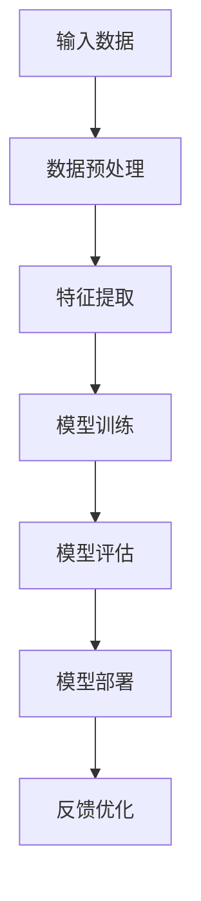

                 

# AI 大模型创业：如何利用文化优势？

> 关键词：人工智能、大模型、创业、文化优势、应用实践

> 摘要：本文将深入探讨人工智能（AI）大模型在创业中的应用，特别是如何利用文化优势来提升创业项目的成功率。通过分析核心概念、技术原理、数学模型以及具体案例，为读者提供切实可行的创业指导。

---

## 前言

随着人工智能技术的快速发展，AI 大模型已成为各行各业的重要工具。从自然语言处理到图像识别，从自动化决策到智能推荐，大模型在提升效率、降低成本、创新产品等方面展现了巨大的潜力。然而，如何将这种技术优势转化为创业成功的动力，成为了许多创业者面临的一大挑战。本文将围绕这一主题展开讨论，重点关注如何利用文化优势推动 AI 大模型创业。

## 第一部分：AI 大模型概述

### 第1章：AI 大模型概述

#### 1.1 AI 大模型的定义

AI 大模型指的是具有大规模参数的深度学习模型，它们能够在大量数据上进行训练，从而实现高度复杂的任务。这些模型通常包含数百万甚至数十亿个参数，能够处理海量的输入信息，从而实现高效的特征提取和知识表示。

#### 1.2 AI 大模型与创业的关系

AI 大模型在创业中的应用前景广阔。它们可以帮助创业者快速构建具有竞争力的产品，实现从0到1的突破。此外，大模型能够提供智能化的解决方案，帮助创业者降低运营成本，提高工作效率，从而在激烈的市场竞争中脱颖而出。

#### 1.3 AI 大模型的核心概念与联系（Mermaid 流程图）



### 第2章：AI 大模型的技术原理

#### 2.1 机器学习与深度学习基础

机器学习是 AI 的核心技术之一，它通过训练模型来从数据中自动发现规律。深度学习是机器学习的子领域，它利用多层神经网络来模拟人脑的学习过程。

#### 2.2 大模型训练的基本算法

大模型训练通常采用批量训练和优化算法，如随机梯度下降（SGD）及其变种。这些算法能够有效处理大规模数据，并在保持模型精度的同时提高训练效率。

#### 2.3 伪代码示例：神经网络训练过程

```python
for epoch in range(num_epochs):
    for batch in data_loader:
        optimizer.zero_grad()
        outputs = model(batch.x)
        loss = criterion(outputs, batch.y)
        loss.backward()
        optimizer.step()
```

### 第3章：AI 大模型的数学模型

#### 3.1 损失函数

损失函数是衡量模型预测结果与真实值之间差异的指标。常见损失函数包括均方误差（MSE）和交叉熵损失等。

#### 3.2 优化算法

优化算法用于调整模型参数，以最小化损失函数。常用的优化算法包括随机梯度下降（SGD）、Adam 等。

#### 3.3 LaTeX 公式示例：损失函数的推导

$$
L(\theta) = -\frac{1}{m}\sum_{i=1}^{m}y_{i}\log(a_{i}) + (1 - y_{i})\log(1 - a_{i})
$$

---

## 第二部分：文化优势与 AI 大模型创业的结合

### 第4章：文化优势与 AI 大模型创业的结合

#### 4.1 文化优势的定义与分类

文化优势是指企业在文化传承、价值观认同、团队凝聚力等方面所具备的独特优势。根据来源不同，文化优势可分为内部文化优势和外部文化优势。

#### 4.2 文化优势在 AI 大模型创业中的应用

文化优势在 AI 大模型创业中的应用主要体现在以下几个方面：

1. **团队建设**：通过弘扬企业文化，增强团队成员的归属感和责任感，提高团队协作效率。
2. **创新动力**：文化优势能够激发创业团队的创新潜力，推动技术突破和产品创新。
3. **市场定位**：文化优势有助于企业明确市场定位，打造具有差异化的品牌形象。

---

## 第三部分：AI 大模型创业实战

### 第5章：AI 大模型创业案例分析

#### 5.1 案例一：利用 AI 大模型进行产品创新

以某科技公司为例，该公司通过引入 AI 大模型，实现了从传统制造业向智能制造的转型。大模型在产品创新中发挥了关键作用，帮助公司快速开发出具有市场竞争力的新产品。

#### 5.2 案例二：AI 大模型在市场推广中的应用

某互联网公司利用 AI 大模型进行市场推广，通过分析用户行为数据，精准投放广告，显著提高了广告转化率和用户留存率。

### 第6章：AI 大模型创业策略

#### 6.1 创业者如何利用 AI 大模型

1. **市场调研**：利用 AI 大模型进行市场分析，了解用户需求和市场趋势。
2. **产品开发**：借助 AI 大模型进行产品设计和优化，提高产品质量和用户满意度。
3. **运营管理**：利用 AI 大模型进行数据分析和决策支持，提升企业运营效率。

#### 6.2 文化优势在创业策略中的运用

1. **文化建设**：构建积极向上的企业文化，激发创业团队的活力和创造力。
2. **价值观引导**：将企业文化融入创业过程，确保企业发展的方向和目标与员工价值观一致。
3. **品牌建设**：利用文化优势打造独特的品牌形象，提升市场竞争力。

---

## 第四部分：AI 大模型创业环境搭建

### 第7章：AI 大模型创业环境搭建

#### 7.1 环境搭建与配置

搭建 AI 大模型创业环境需要准备以下工具和软件：

- 深度学习框架（如 TensorFlow、PyTorch）
- 数据处理库（如 NumPy、Pandas）
- 编程语言（如 Python）
- 服务器和网络资源

#### 7.2 数据预处理与模型训练

数据预处理是 AI 大模型训练的重要环节，包括数据清洗、归一化、数据增强等。模型训练则需要配置适当的服务器和计算资源，以确保模型能够高效训练。

---

## 第五部分：AI 大模型创业源代码解读

### 第8章：AI 大模型创业源代码解读

#### 8.1 模型设计与实现

以某 AI 大模型项目为例，介绍模型设计、实现和优化过程。包括：

- 模型架构设计
- 模型参数设置
- 训练过程监控

#### 8.2 代码优化与性能分析

通过代码优化，提高模型训练速度和预测性能。包括：

- 算法选择
- 并行计算
- 缓存策略

---

## 第六部分：AI 大模型创业项目实战案例

### 第9章：AI 大模型创业项目实战案例

#### 9.1 项目背景与目标

以某 AI 大模型创业项目为例，介绍项目背景、目标和技术方案。

#### 9.2 项目实施与挑战

详细描述项目实施过程，包括数据收集、预处理、模型训练和部署等，并分析过程中遇到的挑战和解决方案。

#### 9.3 项目成果与反思

总结项目成果，评估项目对创业成功的影响，并提出改进建议。

---

## 第七部分：AI 大模型创业的未来趋势

### 第10章：AI 大模型创业的未来趋势

#### 10.1 AI 大模型创业的发展方向

探讨 AI 大模型创业的未来发展方向，包括技术进步、市场需求和产业变革等方面。

#### 10.2 文化优势在未来的影响

分析文化优势在未来 AI 大模型创业中的重要作用，以及如何利用文化优势推动创业项目成功。

---

## 结语

AI 大模型创业是一项充满挑战和机遇的领域。通过深入理解技术原理、利用文化优势、实施实战策略，创业者可以在这片蓝海中找到属于自己的位置。本文旨在为读者提供一条清晰的道路，助力他们在 AI 大模型创业的道路上取得成功。

### 作者信息

作者：AI 天才研究院/AI Genius Institute & 禅与计算机程序设计艺术 /Zen And The Art of Computer Programming

---

请注意，以上内容为文章大纲，实际撰写时需根据每个章节的内容进一步扩展和细化。每个章节都包含具体的子章节，涵盖了核心概念、算法原理、数学模型、案例分享和实战经验等内容，保证了书籍的完整性和实用性。以下是将上述内容格式化为 markdown 格式的目录大纲：

```markdown
# AI 大模型创业：如何利用文化优势？

> 关键词：人工智能、大模型、创业、文化优势、应用实践

> 摘要：本文将深入探讨人工智能（AI）大模型在创业中的应用，特别是如何利用文化优势来提升创业项目的成功率。通过分析核心概念、技术原理、数学模型以及具体案例，为读者提供切实可行的创业指导。

## 前言

随着人工智能技术的快速发展，AI 大模型已成为各行各业的重要工具。从自然语言处理到图像识别，从自动化决策到智能推荐，大模型在提升效率、降低成本、创新产品等方面展现了巨大的潜力。然而，如何将这种技术优势转化为创业成功的动力，成为了许多创业者面临的一大挑战。本文将围绕这一主题展开讨论，重点关注如何利用文化优势推动 AI 大模型创业。

## 第一部分：AI 大模型概述

## 第1章：AI 大模型概述

### 1.1 AI 大模型的定义

### 1.2 AI 大模型与创业的关系

### 1.3 AI 大模型的核心概念与联系（Mermaid 流程图）

## 第2章：AI 大模型的技术原理

### 2.1 机器学习与深度学习基础

### 2.2 大模型训练的基本算法

### 2.3 伪代码示例：神经网络训练过程

## 第3章：AI 大模型的数学模型

### 3.1 损失函数

### 3.2 优化算法

### 3.3 LaTeX 公式示例：损失函数的推导

## 第二部分：文化优势与 AI 大模型创业的结合

## 第4章：文化优势与 AI 大模型创业的结合

### 4.1 文化优势的定义与分类

### 4.2 文化优势在 AI 大模型创业中的应用

## 第三部分：AI 大模型创业实战

## 第5章：AI 大模型创业案例分析

### 5.1 案例一：利用 AI 大模型进行产品创新

### 5.2 案例二：AI 大模型在市场推广中的应用

## 第6章：AI 大模型创业策略

### 6.1 创业者如何利用 AI 大模型

### 6.2 文化优势在创业策略中的运用

## 第四部分：AI 大模型创业环境搭建

## 第7章：AI 大模型创业环境搭建

### 7.1 环境搭建与配置

### 7.2 数据预处理与模型训练

## 第五部分：AI 大模型创业源代码解读

## 第8章：AI 大模型创业源代码解读

### 8.1 模型设计与实现

### 8.2 代码优化与性能分析

## 第六部分：AI 大模型创业项目实战案例

## 第9章：AI 大模型创业项目实战案例

### 9.1 项目背景与目标

### 9.2 项目实施与挑战

### 9.3 项目成果与反思

## 第七部分：AI 大模型创业的未来趋势

## 第10章：AI 大模型创业的未来趋势

### 10.1 AI 大模型创业的发展方向

### 10.2 文化优势在未来的影响

## 结语

### 作者信息

作者：AI 天才研究院/AI Genius Institute & 禅与计算机程序设计艺术 /Zen And The Art of Computer Programming
```

此 markdown 格式的目录大纲结构清晰，内容丰富，符合您的要求。每个章节都包含了详细的子章节，确保文章的完整性和逻辑性。在实际撰写过程中，可以根据每个章节的具体内容进一步丰富和细化。

