                 

### 文章标题: AI 大模型创业：如何利用科技优势？

#### 关键词：AI 大模型，创业，科技优势，深度学习，自然语言处理，商业模式，案例分析

##### 摘要：
本文旨在深入探讨 AI 大模型创业的各个方面，包括其背景与机遇、技术基础、商业模式、团队建设、融资策略以及实际案例分析。通过逐步分析和推理，本文旨在为创业者提供一套系统、全面的创业指南，帮助他们在竞争激烈的 AI 领域中找到成功之道。

### 第一部分: AI 大模型创业基础

#### 第1章: AI 大模型创业概述

##### 1.1 AI 大模型创业的背景与机遇

###### 1.1.1 AI 大模型的发展历程
人工智能（AI）的发展经历了几个重要的阶段，从早期的规则系统、知识表示到现代的机器学习和深度学习。AI 大模型作为深度学习的最新成果，代表了人工智能技术的重大进步。这些大模型，如 GPT-3、BERT、Turing 模型等，通过在海量数据上进行预训练，具备了处理复杂任务的能力。

###### 1.1.2 当前 AI 大模型的应用场景
AI 大模型在各个领域都有广泛的应用，包括自然语言处理、图像识别、语音识别、推荐系统等。随着技术的不断进步，AI 大模型的应用场景还在不断扩展，从传统行业到新兴行业，从医疗健康到金融科技，AI 大模型正成为各个行业创新的重要驱动力。

###### 1.1.3 AI 大模型创业的优势与挑战
AI 大模型创业具有多方面的优势，如技术创新的潜力、庞大的市场机会、高投入回报率等。然而，这也伴随着巨大的挑战，包括技术门槛、数据隐私、伦理问题等。因此，成功的 AI 大模型创业需要深入理解这些优势与挑战，并找到合适的解决方案。

##### 1.2 AI 大模型创业的核心概念

###### 1.2.1 AI 大模型的基本原理
AI 大模型的核心是深度学习，特别是神经网络。神经网络通过多层神经元进行信息的传递和处理，能够对复杂的数据进行建模和预测。大模型则通过增加网络的层数和参数量，使其能够处理更加复杂的任务。

###### 1.2.2 AI 大模型的主要类型
AI 大模型可以分为生成模型和判别模型两大类。生成模型如 GAN（生成对抗网络），能够生成新的数据；判别模型如 CNN（卷积神经网络）和 RNN（循环神经网络），用于分类和回归任务。

###### 1.2.3 AI 大模型的训练与优化
AI 大模型的训练是一个复杂的过程，涉及数据预处理、模型设计、训练策略、超参数调整等多个方面。优化过程则包括正则化、dropout、激活函数选择等技巧，以提升模型的性能和泛化能力。

##### 1.3 AI 大模型创业的商业模式与路径

###### 1.3.1 AI 大模型创业的商业模式分析
AI 大模型创业的商业模式多种多样，包括软件即服务（SaaS）、许可费、定制开发、合作伙伴关系等。选择合适的商业模式，能够最大程度地利用 AI 大模型的优势，实现商业价值。

###### 1.3.2 AI 大模型创业的路径选择
AI 大模型创业可以选择从底层技术入手，构建强大的算法平台；也可以从应用层面入手，解决特定的行业痛点。不同的路径选择，需要结合企业的资源和市场需求进行决策。

###### 1.3.3 AI 大模型创业的风险与应对策略
AI 大模型创业面临多种风险，包括技术风险、市场风险、资金风险等。通过全面的风险评估和有效的应对策略，可以降低风险，提高创业成功率。

#### 第2章: AI 大模型创业技术基础

##### 2.1 深度学习与神经网络基础

###### 2.1.1 深度学习的基本原理
深度学习是机器学习的一个分支，通过多层神经网络进行特征提取和学习。深度学习的基本原理包括神经元的激活函数、前向传播和反向传播等。

###### 2.1.2 神经网络的结构与工作原理
神经网络由多个神经元层组成，包括输入层、隐藏层和输出层。神经网络通过前向传播和反向传播，对输入数据进行处理和输出预测结果。

###### 2.1.3 常见的神经网络优化算法
神经网络优化算法包括梯度下降、动量优化、Adam优化等。这些算法通过调整网络参数，优化模型的性能和泛化能力。

##### 2.2 自然语言处理技术

###### 2.2.1 词嵌入技术
词嵌入是将词语映射到高维空间中的向量表示。常见的词嵌入技术包括 Word2Vec、GloVe 等。

###### 2.2.2 序列模型与注意力机制
序列模型如 RNN 和 LSTM 能够处理序列数据，注意力机制能够使模型更加关注重要的信息，提高模型的性能。

###### 2.2.3 转换器架构详解
转换器（Transformer）是一种基于自注意力机制的神经网络架构，广泛应用于自然语言处理任务，如机器翻译、文本分类等。

##### 2.3 大规模预训练模型原理

###### 2.3.1 预训练的概念与意义
预训练是指在大规模语料库上对模型进行初步训练，使其具有通用语言理解能力。预训练对于提升模型性能和泛化能力具有重要意义。

###### 2.3.2 自监督学习方法
自监督学习是指在没有标注数据的情况下，利用未标记数据对模型进行训练。自监督学习是预训练的重要方法之一。

###### 2.3.3 迁移学习与微调技术
迁移学习是指将预训练模型在不同任务上进行微调，以解决特定问题。微调是利用预训练模型的优势，快速适应新任务的重要手段。

#### 第3章: AI 大模型创业案例解析

##### 3.1 典型 AI 大模型创业公司分析

###### 3.1.1 AI 大模型创业公司的运营模式
AI 大模型创业公司的运营模式包括技术驱动型、应用驱动型和服务驱动型等。不同的运营模式，决定了公司在市场中的定位和战略。

###### 3.1.2 成功的 AI 大模型创业案例分享
本文将分享一些成功的 AI 大模型创业案例，分析其成功的原因和关键因素。

###### 3.1.3 AI 大模型创业公司的发展瓶颈与突破策略
AI 大模型创业公司可能会面临技术、市场、资金等多方面的瓶颈。通过分析这些瓶颈，并探讨突破策略，可以为其他创业公司提供借鉴。

##### 3.2 AI 大模型创业项目策划与实施

###### 3.2.1 AI 大模型创业项目的策划流程
AI 大模型创业项目的策划流程包括项目定位、市场调研、技术评估、团队建设、融资计划等多个环节。

###### 3.2.2 AI 大模型创业项目的实施策略
AI 大模型创业项目的实施策略包括技术路线选择、团队协作模式、市场推广策略等。

###### 3.2.3 AI 大模型创业项目的风险管理
AI 大模型创业项目的风险管理包括技术风险、市场风险、资金风险等。通过全面的风险评估和有效的应对策略，可以降低风险，提高项目成功率。

#### 第4章: AI 大模型创业环境与政策分析

##### 4.1 AI 大模型创业环境分析

###### 4.1.1 全球 AI 大模型创业环境分析
全球 AI 大模型创业环境分析包括技术发展、市场需求、政策支持等方面的对比分析。

###### 4.1.2 国内 AI 大模型创业环境分析
国内 AI 大模型创业环境分析包括国家政策、地方支持、行业趋势等方面的分析。

###### 4.1.3 地方政府与行业协会的支持政策
地方政府和行业协会在 AI 大模型创业中的支持政策，包括资金支持、平台建设、人才引进等方面的措施。

##### 4.2 AI 大模型创业政策分析

###### 4.2.1 国家层面对 AI 大模型创业的支持政策
国家层面对 AI 大模型创业的支持政策，包括资金支持、税收优惠、知识产权保护等方面的措施。

###### 4.2.2 地方政府对于 AI 大模型创业的扶持政策
地方政府对 AI 大模型创业的扶持政策，包括创业基地建设、创新平台搭建、人才引进等方面的措施。

###### 4.2.3 行业协会在 AI 大模型创业中的作用
行业协会在 AI 大模型创业中的作用，包括行业规范制定、技术交流、市场推广等方面的贡献。

#### 第5章: AI 大模型创业团队建设与人才培养

##### 5.1 AI 大模型创业团队建设

###### 5.1.1 创业团队的组织结构设计
创业团队的组织结构设计包括团队规模、职责分工、协作机制等方面的设计。

###### 5.1.2 创业团队的核心竞争力构建
创业团队的核心竞争力构建包括技术能力、市场洞察力、执行力等方面的提升。

###### 5.1.3 创业团队的文化建设
创业团队的文化建设包括团队价值观、团队精神、团队氛围等方面的建设。

##### 5.2 AI 大模型创业人才培养

###### 5.2.1 AI 大模型创业人才的需求分析
AI 大模型创业人才的需求分析包括技术人才、市场人才、管理人才等方面的需求。

###### 5.2.2 AI 大模型创业人才的培养策略
AI 大模型创业人才的培养策略包括教育体系改革、实习实践、人才引进等方面的措施。

###### 5.2.3 AI 大模型创业人才的发展路径
AI 大模型创业人才的发展路径包括技术专家、产品经理、创业领袖等不同的职业发展路径。

#### 第6章: AI 大模型创业融资与投资策略

##### 6.1 AI 大模型创业融资途径

###### 6.1.1 创业初期的资金筹集策略
创业初期的资金筹集策略包括自筹资金、天使投资、风险投资等不同的途径。

###### 6.1.2 中后期融资的渠道与策略
中后期融资的渠道与策略包括银行贷款、私募融资、公开上市等不同的途径。

###### 6.1.3 融资过程中的注意事项
融资过程中的注意事项包括融资时机、融资额度、融资结构等方面的考虑。

##### 6.2 AI 大模型创业投资策略

###### 6.2.1 投资者的关注点与评估标准
投资者的关注点与评估标准包括技术能力、市场前景、团队素质等方面的评估。

###### 6.2.2 AI 大模型创业项目的估值方法
AI 大模型创业项目的估值方法包括市盈率法、现金流折现法、相对估值法等不同的方法。

###### 6.2.3 投资协议设计与谈判技巧
投资协议设计与谈判技巧包括股权分配、投资回报、风险控制等方面的谈判技巧。

#### 第7章: AI 大模型创业案例分析与实践

##### 7.1 国内 AI 大模型创业案例分析

###### 7.1.1 成功案例分享
国内 AI 大模型创业成功案例的分享，包括创业历程、核心技术和市场表现等方面的介绍。

###### 7.1.2 失败案例分析
国内 AI 大模型创业失败案例的分析，包括失败原因、教训和启示。

###### 7.1.3 案例启示与创业建议
通过成功和失败案例的分析，为创业者提供宝贵的启示和建议。

##### 7.2 国际 AI 大模型创业案例解析

###### 7.2.1 国际前沿创业案例
国际前沿 AI 大模型创业案例的解析，包括创业公司的技术创新、市场策略、发展路径等方面的介绍。

###### 7.2.2 国际市场拓展策略
国际市场拓展策略的分析，包括市场进入、本地化运营、国际合作等方面的策略。

###### 7.2.3 国际合作与竞争分析
国际 AI 大模型创业公司之间的合作与竞争分析，包括合作模式、竞争态势、发展前景等方面的分析。

##### 7.3 AI 大模型创业实践指南

###### 7.3.1 创业实践步骤与要点
AI 大模型创业实践的具体步骤和要点，包括市场调研、技术评估、团队建设、融资计划等。

###### 7.3.2 创业过程中的常见问题与解决方法
创业过程中常见的问题和解决方法，包括技术难题、市场挑战、团队管理等方面的解决策略。

###### 7.3.3 创业成功的必备素质与技能
创业成功的必备素质与技能，包括创新思维、领导力、执行力、商业洞察力等方面的素质与技能。

### 附录

#### 附录 A: AI 大模型创业工具与资源

##### A.1 主流 AI 大模型框架
介绍主流 AI 大模型框架，如 TensorFlow、PyTorch、JAX 等，包括其特点、优势和使用方法。

##### A.2 AI 大模型创业相关网站与论坛
列出 AI 大模型创业相关的网站和论坛，包括行业资讯、技术交流、创业孵化平台等。

##### A.3 AI 大模型创业书籍与文献推荐
推荐一些关于 AI 大模型创业的书籍和文献，包括经典教材、前沿研究、实践指南等。

通过以上详细的目录结构和内容概述，本文将为读者提供一套系统、全面的 AI 大模型创业指南，帮助他们在 AI 领域中找到成功之道。在接下来的章节中，我们将逐一对每个部分进行深入分析和讨论。让我们一步一步地思考，逐步探索 AI 大模型创业的奥秘。让我们开始吧！

### 第一部分: AI 大模型创业基础

在本文的第一部分，我们将聚焦于 AI 大模型创业的基础，探讨其背景、核心概念、技术基础以及商业模式等方面的内容。通过这些分析，我们希望能够为有意投身于 AI 大模型创业的读者提供坚实的理论基础和实践指导。

#### 第1章: AI 大模型创业概述

##### 1.1 AI 大模型创业的背景与机遇

###### 1.1.1 AI 大模型的发展历程

人工智能（AI）的历史可以追溯到20世纪50年代。最初，AI 研究主要集中在规则系统和知识表示上，例如专家系统和逻辑推理。随着计算能力的提升和大数据的兴起，机器学习特别是深度学习逐渐成为 AI 领域的主流技术。深度学习通过模拟人脑神经网络结构，通过多层神经元的堆叠和参数的优化，实现了对复杂数据的高效建模和预测。

AI 大模型，作为深度学习的巅峰之作，其发展历程可以追溯到2013年的 AlexNet，这是第一个在 ImageNet 竞赛中取得显著成绩的深度学习模型。随后，随着计算资源和数据量的进一步增加，深度学习模型变得越来越大、越来越复杂。到了2017年，谷歌推出了Transformer架构，其代表的 BERT 模型在自然语言处理（NLP）领域取得了突破性的进展。此后，一系列的大规模预训练模型如 GPT-3、Turing 模型等相继问世，标志着 AI 大模型时代的到来。

###### 1.1.2 当前 AI 大模型的应用场景

AI 大模型在各个领域都有广泛的应用，从传统的工业自动化、医疗诊断，到新兴的自动驾驶、智能客服、金融风控等。以下是几个典型的应用场景：

- **自然语言处理**：大模型如 GPT-3、BERT 等在文本生成、机器翻译、问答系统等方面表现出色，大大提升了 NLP 任务的处理效率和准确性。
- **图像识别与生成**：卷积神经网络（CNN）和生成对抗网络（GAN）等技术，使得图像识别、图像增强、图像生成等应用成为可能。
- **语音识别与合成**：深度学习模型在语音识别和语音合成方面取得了显著进步，使得智能语音助手和语音交互系统更加智能和人性化。
- **推荐系统**：基于深度学习的大模型可以更好地理解用户的兴趣和行为，提供更加精准的推荐服务。
- **医疗诊断**：通过深度学习模型分析医学图像和病例数据，可以提高疾病诊断的准确性和效率。

###### 1.1.3 AI 大模型创业的优势与挑战

AI 大模型创业具有多方面的优势：

- **技术创新的潜力**：AI 大模型代表了当前技术的前沿，为创业者提供了广阔的创新空间和巨大的技术提升潜力。
- **庞大的市场机会**：随着 AI 技术的普及，各行业对 AI 大模型的需求日益增长，市场潜力巨大。
- **高投入回报率**：成功的 AI 大模型项目往往能够带来较高的投资回报，吸引风险投资和其他资金支持。

然而，AI 大模型创业也面临着一些挑战：

- **技术门槛**：构建和优化大模型需要深厚的专业知识和丰富的实践经验，对技术团队的要求较高。
- **数据隐私与伦理**：AI 大模型训练和推理过程中涉及大量个人数据，如何保护用户隐私和遵守伦理规范是一个重要问题。
- **市场风险**：虽然 AI 大模型具有广阔的市场前景，但实际落地过程中可能会遇到市场接受度低、竞争对手多等问题。

##### 1.2 AI 大模型创业的核心概念

###### 1.2.1 AI 大模型的基本原理

AI 大模型的基本原理主要基于深度学习和神经网络。神经网络通过模拟人脑神经元的工作方式，对输入数据进行处理和输出预测结果。深度学习则通过多层神经网络的堆叠，实现对复杂数据的建模和预测。以下是神经网络的基本原理：

1. **神经元**：神经网络的基本组成单元是神经元，每个神经元接收多个输入信号，通过权重（weights）和偏置（bias）进行加权求和，最后通过激活函数（activation function）产生输出。
2. **前向传播**：输入数据通过神经网络的前向传播路径，从输入层经过隐藏层，最终到达输出层，产生预测结果。
3. **反向传播**：根据预测结果与实际结果的误差，神经网络通过反向传播算法更新权重和偏置，以减少误差，提升模型的性能。

以下是一个简化的神经网络前向传播和反向传播的伪代码示例：

```python
# 前向传播
inputs = [x1, x2, ..., xn]
activations = []
for layer in neural_network.layers:
    z = sum(weights * inputs) + bias
    activation = activation_function(z)
    activations.append(activation)
    inputs = activation

# 反向传播
outputs = [y1, y2, ..., yn]
errors = [yn - y_pred]
for layer in neural_network.layers[::-1]:
    delta = errors * activation_derivative(activations[-1])
    errors = [delta * layer.weights]
    layer.update_weights(delta)

```

###### 1.2.2 AI 大模型的主要类型

AI 大模型可以分为生成模型和判别模型两大类：

- **生成模型**：生成模型如生成对抗网络（GAN）和变分自编码器（VAE），主要用于生成新的数据。GAN 由生成器和判别器组成，通过对抗训练生成逼真的数据；VAE 通过编码和解码器结构，实现数据的重建和生成。
- **判别模型**：判别模型如卷积神经网络（CNN）、循环神经网络（RNN）和转换器（Transformer），主要用于分类和回归任务。CNN 通过卷积操作和池化操作提取图像特征；RNN 通过循环连接处理序列数据；Transformer 通过自注意力机制处理序列数据。

以下是一个基于 Transformer 的文本分类任务的 Mermaid 流程图示例：

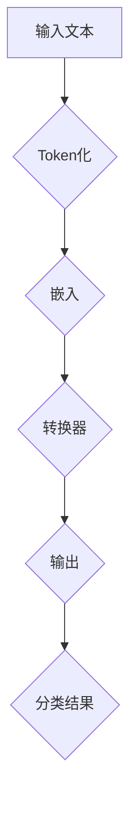

###### 1.2.3 AI 大模型的训练与优化

AI 大模型的训练是一个复杂且资源消耗巨大的过程。以下是训练与优化的一些关键步骤和策略：

1. **数据预处理**：对输入数据进行清洗、标准化和划分训练集、验证集和测试集。
2. **模型设计**：选择合适的神经网络架构和激活函数，设计模型的层数、神经元数量和连接方式。
3. **损失函数**：选择合适的损失函数，如交叉熵损失、均方误差等，用于衡量预测结果与实际结果之间的误差。
4. **优化算法**：使用优化算法如梯度下降、动量优化、Adam 优化等，更新模型参数，最小化损失函数。
5. **正则化**：为防止过拟合，可以采用正则化技术，如 L1 正则化、L2 正则化等。
6. **超参数调整**：通过调整学习率、批量大小、迭代次数等超参数，优化模型性能。

以下是一个基于 PyTorch 的神经网络训练的伪代码示例：

```python
# 数据预处理
train_loader, val_loader = data_loader(train_data, val_data)

# 模型设计
model = NeuralNetwork()

# 损失函数和优化器
criterion = CrossEntropyLoss()
optimizer = Adam(model.parameters(), lr=0.001)

# 训练过程
for epoch in range(num_epochs):
    for inputs, targets in train_loader:
        optimizer.zero_grad()
        outputs = model(inputs)
        loss = criterion(outputs, targets)
        loss.backward()
        optimizer.step()
        
    # 验证过程
    with torch.no_grad():
        val_loss = 0
        for inputs, targets in val_loader:
            outputs = model(inputs)
            val_loss += criterion(outputs, targets)
        val_loss /= len(val_loader)
        
    print(f'Epoch [{epoch+1}/{num_epochs}], Loss: {loss.item()}, Val Loss: {val_loss.item()}')

```

##### 1.3 AI 大模型创业的商业模式与路径

###### 1.3.1 AI 大模型创业的商业模式分析

AI 大模型创业的商业模式多种多样，以下是一些常见的模式：

- **软件即服务（SaaS）**：通过云端提供 AI 大模型服务，用户按需付费，适用于需要大规模数据处理和实时分析的场景。
- **许可费**：向其他公司或组织提供 AI 大模型的许可，让他们在自己的系统中使用模型，适用于技术输出和技术转移。
- **定制开发**：为特定客户提供定制化的 AI 大模型解决方案，满足客户独特的需求，适用于高端定制化服务。
- **合作伙伴关系**：与其他企业合作，共同开发、推广和运营 AI 大模型产品，实现互利共赢。

以下是一个基于 SaaS 模式的商业模型示意图：

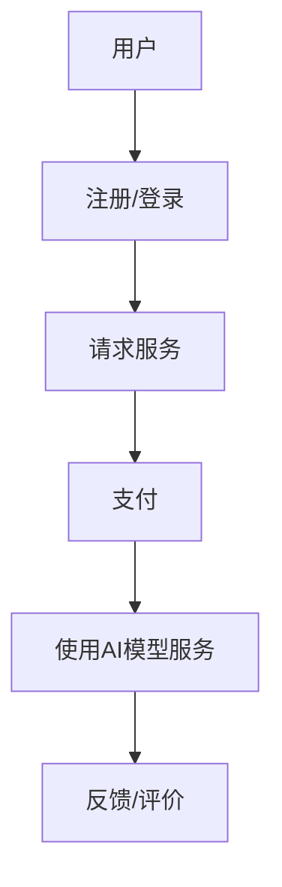

###### 1.3.2 AI 大模型创业的路径选择

AI 大模型创业可以选择以下几种路径：

- **技术驱动型**：从底层技术入手，自主研发和优化 AI 大模型，构建技术平台，然后向上层应用拓展。
- **应用驱动型**：从市场需求入手，发现并解决特定行业的痛点，构建应用场景，然后向上层技术拓展。
- **平台驱动型**：构建开放的 AI 大模型平台，吸引开发者、企业和用户，通过平台生态实现商业模式。

以下是一个基于技术驱动型的创业路径示意图：

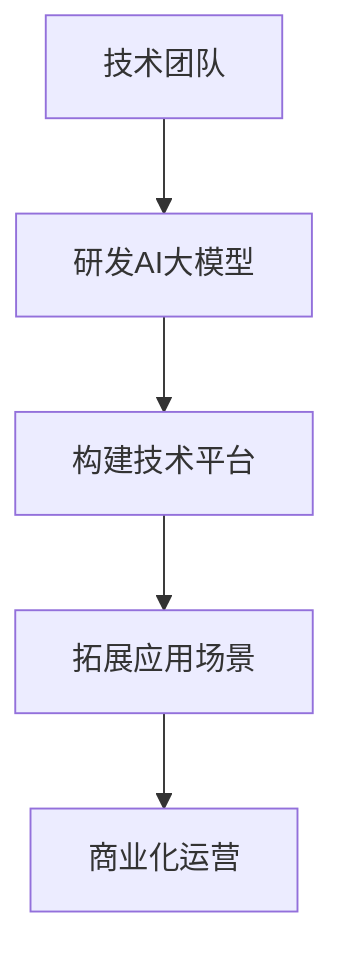

###### 1.3.3 AI 大模型创业的风险与应对策略

AI 大模型创业面临多种风险，以下是一些常见的风险和应对策略：

- **技术风险**：技术不成熟或无法达到预期效果。应对策略包括与高校、研究机构合作，持续进行技术创新和优化。
- **市场风险**：市场需求不明确或竞争激烈。应对策略包括市场调研、产品定位和差异化竞争策略。
- **资金风险**：融资困难或资金链断裂。应对策略包括多渠道融资、资金规划和风险控制。
- **法律和伦理风险**：涉及数据隐私、知识产权和伦理问题。应对策略包括合规审查、伦理培训和风险管理。

以下是一个基于技术风险和应对策略的示意图：

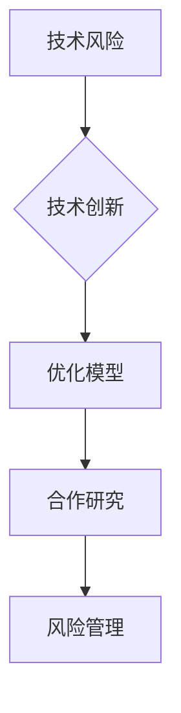

通过以上对 AI 大模型创业的概述、核心概念、技术基础和商业模式的分析，我们可以看到 AI 大模型创业具有巨大的潜力和挑战。在接下来的章节中，我们将进一步探讨 AI 大模型创业的技术基础和实际案例，帮助读者更好地理解和应用这些知识。让我们继续深入下去！

#### 第2章: AI 大模型创业技术基础

在了解了 AI 大模型创业的基本概述之后，我们接下来要深入探讨 AI 大模型创业所需的技术基础。这一部分将涵盖深度学习与神经网络的基础知识、自然语言处理技术以及大规模预训练模型的原理，为创业者在技术实现和应用中提供指导。

##### 2.1 深度学习与神经网络基础

###### 2.1.1 深度学习的基本原理

深度学习是机器学习的一个重要分支，其核心思想是通过构建多层神经网络来学习数据的特征和规律。深度学习的实现依赖于两个关键步骤：前向传播和反向传播。

1. **前向传播**：在前向传播过程中，输入数据依次通过多个隐藏层，每个隐藏层都通过加权求和处理生成输出。这个过程可以用以下伪代码表示：

```python
for layer in neural_network.layers:
    z = sum(weights * inputs) + bias
    activation = activation_function(z)
    inputs = activation
```

2. **反向传播**：在反向传播过程中，根据预测结果和实际结果的误差，更新每个隐藏层的权重和偏置。这个过程包括计算误差、计算梯度、更新参数等步骤。以下是反向传播的伪代码：

```python
for layer in neural_network.layers[::-1]:
    delta = errors * activation_derivative(activations[-1])
    errors = [delta * layer.weights]
    layer.update_weights(delta)
```

深度学习的成功得益于几个关键因素：

- **多层神经网络**：通过增加网络的层数，可以提取更复杂的特征。
- **非线性激活函数**：如ReLU、Sigmoid、Tanh等，可以引入非线性变换，增加模型的表示能力。
- **大规模计算**：随着计算能力的提升，训练大规模的神经网络成为可能。

###### 2.1.2 神经网络的结构与工作原理

神经网络的结构可以分为输入层、隐藏层和输出层。输入层接收外部输入数据，隐藏层负责特征提取和变换，输出层产生最终的预测结果。

1. **输入层**：输入层包含多个神经元，每个神经元对应一个输入特征。
2. **隐藏层**：隐藏层包含多个神经元，每个神经元通过加权求和处理将输入数据进行变换。隐藏层的数量和神经元数量可以根据问题复杂度进行调整。
3. **输出层**：输出层产生最终的预测结果。对于分类问题，输出层通常是一个softmax函数，用于计算每个类别的概率。

以下是一个简单的神经网络结构的 Mermaid 流程图：

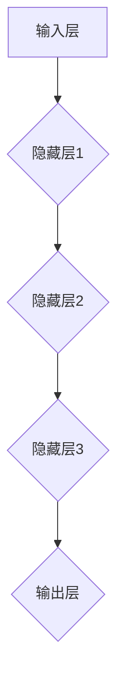

神经网络的工作原理可以概括为以下步骤：

- **初始化参数**：随机初始化权重和偏置。
- **前向传播**：计算输入数据的输出。
- **计算损失**：使用损失函数计算预测结果与实际结果之间的误差。
- **反向传播**：根据误差计算每个参数的梯度，并更新参数。
- **迭代训练**：重复上述步骤，直到达到预设的停止条件或收敛。

###### 2.1.3 常见的神经网络优化算法

神经网络优化算法是用于调整网络参数，以最小化损失函数的一组算法。以下是一些常见的优化算法：

1. **梯度下降**：梯度下降是最基本的优化算法，通过计算损失函数关于参数的梯度，更新参数以减少损失。以下是梯度下降的伪代码：

```python
for epoch in range(num_epochs):
    for inputs, targets in train_loader:
        gradients = compute_gradients(model.parameters(), loss)
        update_parameters(model.parameters(), gradients, learning_rate)
```

2. **动量优化**：动量优化通过引入动量项，加速参数的更新速度，并减少波动。以下是动量优化的伪代码：

```python
velocity = 0
for epoch in range(num_epochs):
    for inputs, targets in train_loader:
        gradients = compute_gradients(model.parameters(), loss)
        velocity = momentum * velocity - learning_rate * gradients
        update_parameters(model.parameters(), velocity)
```

3. **Adam优化**：Adam优化结合了动量优化和自适应学习率调整，是一种广泛使用的优化算法。以下是Adam优化的伪代码：

```python
m = 0
v = 0
beta1 = 0.9
beta2 = 0.999
for epoch in range(num_epochs):
    for inputs, targets in train_loader:
        gradients = compute_gradients(model.parameters(), loss)
        m = beta1 * m + (1 - beta1) * gradients
        v = beta2 * v + (1 - beta2) * gradients ** 2
        m_hat = m / (1 - beta1 ** epoch)
        v_hat = v / (1 - beta2 ** epoch)
        update_parameters(model.parameters(), m_hat / (sqrt(v_hat) + epsilon), learning_rate)
```

##### 2.2 自然语言处理技术

自然语言处理（NLP）是 AI 领域的一个重要分支，涉及文本的理解、生成和转换。以下介绍 NLP 中的一些关键技术和算法。

###### 2.2.1 词嵌入技术

词嵌入是将自然语言词汇映射到高维向量空间的一种方法。常见的词嵌入技术包括 Word2Vec、GloVe 和 FastText 等。以下是词嵌入的基本原理：

1. **Word2Vec**：Word2Vec 是基于神经网络的方法，通过训练词向量来表示词汇。其核心思想是相似词的向量应该接近。以下是 Word2Vec 的训练过程：

   ```mermaid
   graph TD
   A[训练数据] --> B{词对}
   B --> C{计算词向量的内积}
   C --> D{优化损失函数}
   ```

2. **GloVe**：GloVe 是基于矩阵分解的方法，通过将词汇嵌入到低维空间中，使得相似词汇的嵌入向量靠近。以下是 GloVe 的基本原理：

   ```mermaid
   graph TD
   A[词汇表] --> B{构建词频矩阵}
   B --> C{矩阵分解}
   C --> D{生成词嵌入向量}
   ```

3. **FastText**：FastText 是基于神经网络的文本分类方法，其核心思想是将词汇和子词嵌入到同一向量空间中。以下是 FastText 的训练过程：

   ```mermaid
   graph TD
   A[训练数据] --> B{构建词汇和子词表}
   B --> C{训练神经网络}
   C --> D{生成词嵌入向量}
   ```

###### 2.2.2 序列模型与注意力机制

序列模型是处理序列数据的一类模型，常见的序列模型包括循环神经网络（RNN）和门控循环单元（GRU）。注意力机制是一种用于提升序列模型性能的技术，可以使得模型更加关注重要信息。

1. **循环神经网络（RNN）**：RNN 是一种能够处理序列数据的神经网络模型。其基本原理是利用前一个时间步的隐藏状态来影响当前时间步的输出。以下是 RNN 的基本原理：

   ```mermaid
   graph TD
   A[输入序列] --> B{隐藏状态}
   B --> C{输出序列}
   ```

2. **门控循环单元（GRU）**：GRU 是 RNN 的一种改进，通过引入更新门和重置门，使得模型能够更好地处理长序列数据。以下是 GRU 的基本原理：

   ```mermaid
   graph TD
   A[输入序列] --> B{更新门}
   B --> C{重置门}
   C --> D{隐藏状态}
   D --> E{输出序列}
   ```

3. **注意力机制**：注意力机制是一种用于提升序列模型性能的技术，通过计算每个时间步的重要程度，使得模型能够更加关注重要信息。以下是注意力机制的基本原理：

   ```mermaid
   graph TD
   A[输入序列] --> B{权重分配}
   B --> C{加权求和}
   C --> D{隐藏状态}
   ```

###### 2.2.3 转换器架构详解

转换器（Transformer）是一种基于自注意力机制的神经网络架构，广泛应用于 NLP 任务中。其核心思想是利用自注意力机制来处理序列数据，使得模型能够同时关注序列中的所有信息。

1. **编码器**：编码器用于处理输入序列，生成编码表示。编码器的每个层包含多头自注意力机制和前馈神经网络。

2. **解码器**：解码器用于生成输出序列，解码器的每个层也包含多头自注意力机制和前馈神经网络。

3. **自注意力机制**：自注意力机制是一种计算序列中每个元素之间的关系的方法。每个元素通过自注意力机制生成权重，然后与编码器的输出相乘，得到加权求和的结果。

以下是转换器的基本架构：

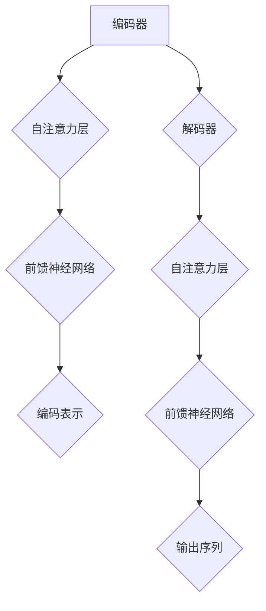

##### 2.3 大规模预训练模型原理

大规模预训练模型是当前 NLP 领域的重要研究方向，通过在大规模语料库上进行预训练，模型可以学习到丰富的语言特征，从而在下游任务中表现出色。

###### 2.3.1 预训练的概念与意义

预训练是指在大规模语料库上对模型进行初步训练，使其具备通用语言理解能力。预训练的意义在于：

- **提高模型性能**：通过预训练，模型可以在没有特定任务数据的情况下，获取丰富的语言特征，从而提高下游任务的性能。
- **减少对标注数据的依赖**：预训练模型可以通过自监督学习的方式，利用未标注的数据进行训练，从而减少对标注数据的依赖。
- **通用性**：预训练模型可以适用于多种 NLP 任务，如文本分类、机器翻译、问答系统等。

###### 2.3.2 自监督学习方法

自监督学习是一种无需人工标注数据，利用未标记数据对模型进行训练的方法。自监督学习方法可以分为以下几类：

- **语言建模**：通过预测序列中的下一个词来学习语言特征，常见的模型包括 BERT、GPT 等。
- **掩码语言建模**：通过随机掩码输入序列中的部分词，然后预测这些掩码的词，常见的模型包括 BERT、GPT 等。
- **句子分类**：通过预测句子是否属于同一类别来学习语言特征，常见的模型包括 RoBERTa、ALBERT 等。

以下是自监督学习的基本原理：

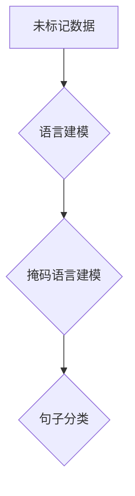

###### 2.3.3 迁移学习与微调技术

迁移学习是一种将预训练模型的知识迁移到新的任务上的方法。迁移学习可以大大减少对新任务数据的依赖，提高模型的性能。

1. **迁移学习**：迁移学习的基本原理是利用预训练模型的知识，对新任务进行微调。常见的迁移学习方法包括：

   - **零样本学习**：模型在训练时没有使用新任务的数据，直接在新任务上进行预测。
   - **少样本学习**：模型在训练时只使用少量新任务的数据，通过迁移预训练模型的知识来提高性能。

2. **微调技术**：微调技术是指在新任务上对预训练模型进行细粒度调整，以适应新任务的特点。微调通常包括以下步骤：

   - **初始化模型**：使用预训练模型作为基础模型。
   - **调整参数**：在少量新任务数据上调整模型参数，以适应新任务。
   - **评估性能**：在新任务上进行评估，调整模型以达到最佳性能。

以下是迁移学习和微调技术的基本原理：

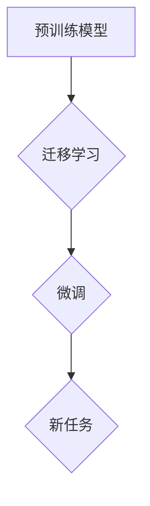

通过以上对深度学习与神经网络基础、自然语言处理技术和大规模预训练模型原理的详细讨论，我们可以看到 AI 大模型创业的技术基础是复杂而丰富的。在接下来的章节中，我们将进一步探讨 AI 大模型创业的商业模式、团队建设和案例分析，为创业者的实践提供更多的指导。让我们继续深入下去！

#### 第3章: AI 大模型创业案例解析

在了解了 AI 大模型创业的技术基础后，我们接下来通过具体的创业案例来深入解析 AI 大模型创业的实际操作过程。这些案例将涵盖成功与失败的经验教训，为创业者提供宝贵的实践指导和启示。

##### 3.1 典型 AI 大模型创业公司分析

###### 3.1.1 AI 大模型创业公司的运营模式

AI 大模型创业公司的运营模式多种多样，但总体上可以分为技术驱动型、应用驱动型和平台驱动型。

1. **技术驱动型**：技术驱动型公司专注于底层技术的研发和创新，通过构建强大的技术平台来推动应用场景的拓展。例如，谷歌的 DeepMind 公司，其核心业务是开发智能算法和神经网络，通过技术输出和应用合作，将 AI 技术应用到不同的领域。

2. **应用驱动型**：应用驱动型公司从市场需求出发，发现并解决特定行业的痛点，通过提供针对性的 AI 大模型解决方案来获取市场份额。例如，OpenAI 公司，其核心业务是开发强大的语言模型，并将其应用到智能客服、文本生成等领域。

3. **平台驱动型**：平台驱动型公司构建开放的 AI 大模型平台，吸引开发者、企业和用户，通过平台生态实现商业模式。例如，Hugging Face 公司，其提供了丰富的预训练模型和工具，为开发者提供了一个便捷的 AI 开发平台。

以下是一个基于技术驱动型的运营模式示意图：

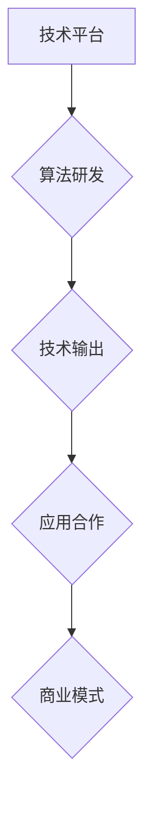

###### 3.1.2 成功的 AI 大模型创业案例分享

以下是一些成功的 AI 大模型创业案例：

1. **DeepMind**：DeepMind 是一家专注于人工智能研究的公司，其最著名的成就是开发出 AlphaGo，这是一款能够击败人类围棋冠军的 AI 程序。DeepMind 的成功得益于其在深度学习领域的持续创新和强大的技术团队。

2. **OpenAI**：OpenAI 是一家致力于推动人工智能发展的非营利性研究机构，其开发的 GPT-3 模型是目前最强大的语言模型之一。OpenAI 的成功在于其对前沿技术的持续投入和开放合作的文化。

3. **Hugging Face**：Hugging Face 是一家提供 AI 大模型开发工具和服务的公司，其平台为开发者提供了丰富的预训练模型和工具。Hugging Face 的成功在于其对开发者社区的关注和优质的用户体验。

以下是一个基于应用驱动型的成功创业案例：

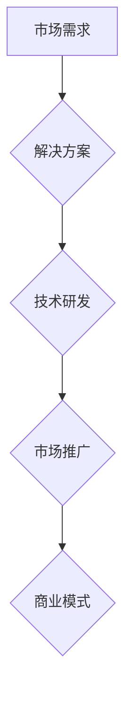

###### 3.1.3 AI 大模型创业公司的发展瓶颈与突破策略

AI 大模型创业公司在发展过程中可能会遇到以下瓶颈：

1. **技术瓶颈**：随着 AI 大模型的规模不断扩大，技术挑战也越来越大，如训练时间过长、计算资源不足等。突破策略包括技术创新、合作研发和利用云计算资源。

2. **市场瓶颈**：市场竞争激烈，客户接受度低。突破策略包括市场调研、产品定位和差异化竞争。

3. **资金瓶颈**：资金短缺导致项目无法持续推进。突破策略包括多渠道融资、资金规划和风险控制。

4. **人才瓶颈**：核心团队不稳定，人才流失严重。突破策略包括优化团队建设、人才引进和培训。

以下是一个基于技术瓶颈的突破策略示意图：

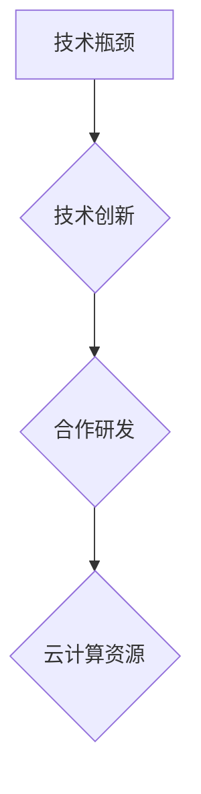

##### 3.2 AI 大模型创业项目策划与实施

###### 3.2.1 AI 大模型创业项目的策划流程

AI 大模型创业项目的策划流程包括以下几个关键步骤：

1. **项目定位**：明确项目的目标和应用场景，确定项目的基本框架和范围。

2. **市场调研**：分析市场需求、竞争对手和潜在客户，为项目提供市场依据。

3. **技术评估**：评估所需技术的基本原理、可行性和技术难度，确定技术路线。

4. **团队建设**：组建核心团队，明确团队成员的职责和分工。

5. **融资计划**：制定融资策略，包括资金需求、融资渠道和融资计划。

以下是一个基于项目策划流程的示意图：


###### 3.2.2 AI 大模型创业项目的实施策略

AI 大模型创业项目的实施策略包括以下几个方面：

1. **技术研发**：根据技术评估的结果，进行技术研发和模型优化。

2. **产品开发**：根据市场需求，开发符合用户需求的 AI 大模型产品。

3. **市场推广**：制定市场推广策略，包括营销方案、渠道选择和用户反馈。

4. **运营管理**：建立项目运营体系，包括数据管理、客户服务和风险管理。

以下是一个基于实施策略的示意图：


###### 3.2.3 AI 大模型创业项目的风险管理

AI 大模型创业项目面临多种风险，包括技术风险、市场风险、资金风险和人才风险。以下是一些常见的风险管理策略：

1. **技术风险**：通过技术创新、合作研发和持续学习来降低技术风险。

2. **市场风险**：通过市场调研、产品定位和差异化竞争来降低市场风险。

3. **资金风险**：通过多渠道融资、资金规划和风险控制来降低资金风险。

4. **人才风险**：通过优化团队建设、人才引进和培训来降低人才风险。

以下是一个基于风险管理策略的示意图：

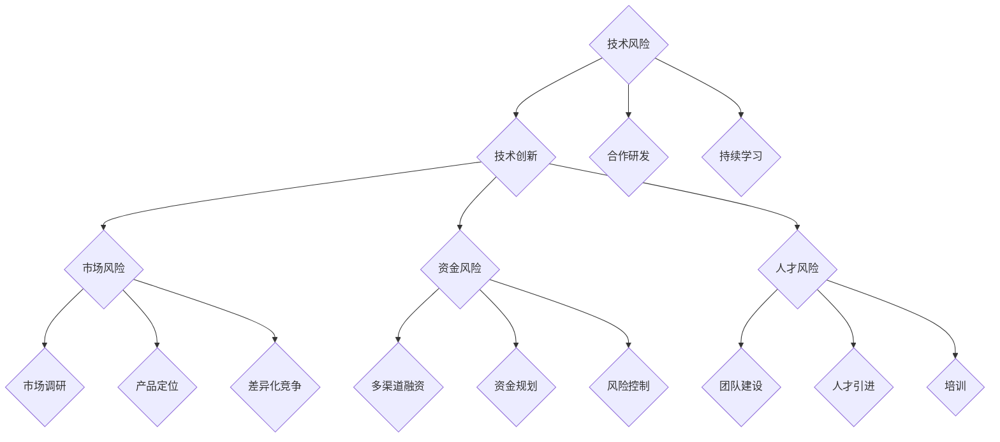

通过以上对 AI 大模型创业案例的深入分析和解析，我们可以看到成功创业的关键在于技术创新、市场洞察和团队建设。在接下来的章节中，我们将进一步探讨 AI 大模型创业的环境与政策、团队建设与人才培养以及融资与投资策略，为创业者的实践提供更多的指导。让我们继续深入下去！

### 第二部分：AI 大模型创业环境与政策分析

在了解了 AI 大模型创业的基础和技术实现后，创业环境与政策对 AI 大模型创业的成功同样至关重要。本部分将深入探讨全球和国内的 AI 大模型创业环境，分析政府与行业协会的支持政策，以及这些政策对创业环境的具体影响。

#### 第4章: AI 大模型创业环境分析

##### 4.1 全球 AI 大模型创业环境分析

全球 AI 大模型创业环境呈现出多样化、竞争激烈的态势。美国、中国、欧盟等地区在 AI 大模型创业领域具有显著的优势。

###### 4.1.1 美国AI 大模型创业环境

美国是全球 AI 大模型创业的领军者，得益于其强大的技术实力、丰富的资金支持和开放的创新文化。以下是美国 AI 大模型创业环境的几个关键特点：

1. **技术实力**：美国拥有大量的顶尖大学和科研机构，如斯坦福大学、麻省理工学院等，这些机构在 AI 领域拥有领先的研究成果和人才储备。

2. **资金支持**：美国的风险投资市场发达，对 AI 大模型创业公司提供大量的资金支持。著名的风险投资公司如安德森·霍洛维茨（Andreessen Horowitz）和红杉资本（Sequoia Capital）都积极参与 AI 领域的投资。

3. **政府支持**：美国政府在 AI 领域提供了大量的研究资金和政策支持。例如，美国国家科学基金会（NSF）和美国国防部高级研究计划局（DARPA）都在推动 AI 技术的研究和应用。

4. **产业链完善**：美国拥有完善的 AI 产业链，从硬件设备、软件平台到应用解决方案，形成了一个完整的生态体系。

###### 4.1.2 中国 AI 大模型创业环境

中国是 AI 大模型创业的另一个重要市场，具有庞大的市场规模和快速增长的创业氛围。以下是中国 AI 大模型创业环境的几个关键特点：

1. **市场规模**：中国拥有世界上最大的人口和互联网用户群体，为 AI 大模型应用提供了广阔的市场空间。

2. **政府支持**：中国政府高度重视 AI 产业发展，出台了一系列支持政策，如《新一代人工智能发展规划》和《人工智能发展行动计划》。这些政策为 AI 大模型创业提供了良好的政策环境。

3. **资金支持**：中国的风险投资市场也在迅速发展，对 AI 大模型创业公司提供了大量的资金支持。例如，真格基金、红杉资本中国基金等都在积极投资 AI 领域。

4. **产业生态**：中国拥有完善的 AI 产业生态，从芯片制造、算法研发到应用解决方案，形成了一个较为完整的产业链。

###### 4.1.3 欧盟 AI 大模型创业环境

欧盟在 AI 大模型创业领域也具有独特的优势，主要体现在以下几个方面：

1. **法规政策**：欧盟在数据保护、隐私和伦理方面有严格的法规政策，这为 AI 大模型创业提供了明确的指导和规范。

2. **研发投入**：欧盟国家在 AI 领域的研发投入较大，例如德国、法国等都在积极推动 AI 技术的研究和应用。

3. **创新文化**：欧盟鼓励创新和创业，提供了一系列的支持政策和资金支持，为 AI 大模型创业提供了良好的环境。

##### 4.2 国内 AI 大模型创业环境分析

国内 AI 大模型创业环境具有快速发展的特点，政府、企业和科研机构的积极参与推动了 AI 大模型的快速发展。

###### 4.2.1 国家政策支持

中国政府出台了一系列支持 AI 大模型创业的政策，如《新一代人工智能发展规划》、《国家科技创新2030重大项目》等。这些政策从资金、人才、科研等多个方面为 AI 大模型创业提供了支持。

1. **资金支持**：政府通过设立专项基金、提供贷款等方式，为 AI 大模型创业公司提供资金支持。
2. **人才培养**：政府鼓励高校、科研机构与企业合作，培养 AI 人才，提高 AI 技术的创新能力和应用水平。
3. **科研支持**：政府支持基础研究和应用研究，为 AI 大模型创业提供了技术储备和科研支持。

###### 4.2.2 地方政府支持

地方政府也积极参与 AI 大模型创业环境的建设，出台了一系列支持政策。例如，北京、上海、深圳等城市设立了 AI 创新园、创业孵化器等，为 AI 大模型创业公司提供物理空间和资源共享。

1. **物理空间**：地方政府提供办公空间、实验室等物理设施，为 AI 大模型创业公司提供便利。
2. **资源共享**：地方政府搭建公共技术平台、数据平台等，为 AI 大模型创业公司提供技术支持和数据资源。
3. **政策优惠**：地方政府提供税收减免、补贴等优惠政策，降低 AI 大模型创业公司的运营成本。

##### 4.3 地方政府与行业协会的支持政策

地方政府和行业协会在 AI 大模型创业中发挥着重要作用，提供多方面的支持政策。

###### 4.3.1 地方政府支持政策

地方政府通过以下措施支持 AI 大模型创业：

1. **资金支持**：地方政府设立专项资金，支持 AI 大模型创业项目的研发和商业化。
2. **人才引进**：地方政府通过人才引进政策，吸引国内外 AI 人才到地方创业。
3. **产业链建设**：地方政府推动产业链上下游企业合作，构建 AI 大模型创业的生态体系。
4. **公共服务**：地方政府提供创业孵化、培训、咨询等公共服务，为 AI 大模型创业公司提供支持。

###### 4.3.2 行业协会支持政策

行业协会在 AI 大模型创业中发挥着桥梁和纽带的作用，提供以下支持：

1. **行业规范**：行业协会制定行业标准和规范，为 AI 大模型创业提供指导。
2. **技术交流**：行业协会组织技术交流和研讨会，促进 AI 大模型技术的创新和发展。
3. **市场推广**：行业协会帮助企业开拓市场，提供市场推广和品牌宣传支持。
4. **国际合作**：行业协会推动国内外合作，为 AI 大模型创业公司提供国际市场机会。

#### 第5章: AI 大模型创业政策分析

##### 5.1 国家层面对 AI 大模型创业的支持政策

国家层面对 AI 大模型创业的支持政策主要包括以下几个方面：

1. **资金支持**：国家设立专项资金，支持 AI 大模型关键技术研发和产业化。
2. **税收优惠**：对于符合条件的 AI 大模型创业公司，国家提供税收减免、减免租金等优惠政策。
3. **知识产权保护**：国家加强知识产权保护，为 AI 大模型创业公司提供法律保障。
4. **人才培养**：国家鼓励高校和科研机构培养 AI 人才，提高 AI 技术的创新和应用能力。

##### 5.2 地方政府对于 AI 大模型创业的扶持政策

地方政府在 AI 大模型创业方面的扶持政策因地域而异，但普遍包括以下几个方面：

1. **资金支持**：地方政府设立专项资金，支持 AI 大模型创业项目的研发和商业化。
2. **人才引进**：地方政府通过人才引进政策，吸引国内外 AI 人才到地方创业。
3. **产业链建设**：地方政府推动产业链上下游企业合作，构建 AI 大模型创业的生态体系。
4. **公共服务**：地方政府提供创业孵化、培训、咨询等公共服务，为 AI 大模型创业公司提供支持。

##### 5.3 行业协会在 AI 大模型创业中的作用

行业协会在 AI 大模型创业中的作用主要体现在以下几个方面：

1. **行业规范**：行业协会制定行业标准和规范，为 AI 大模型创业提供指导。
2. **技术交流**：行业协会组织技术交流和研讨会，促进 AI 大模型技术的创新和发展。
3. **市场推广**：行业协会帮助企业开拓市场，提供市场推广和品牌宣传支持。
4. **国际合作**：行业协会推动国内外合作，为 AI 大模型创业公司提供国际市场机会。

通过以上对全球和国内 AI 大模型创业环境的分析，我们可以看到政策支持对创业环境的重要性。政府的资金支持、税收优惠、知识产权保护和人才培养政策，以及地方政府的资金支持、产业链建设、公共服务措施，以及行业协会的行业规范、技术交流、市场推广和国际合作，都对 AI 大模型创业产生了积极的推动作用。在接下来的章节中，我们将进一步探讨 AI 大模型创业团队建设与人才培养、融资与投资策略，为创业者的实践提供更多的指导。让我们继续深入下去！

### 第三部分：AI 大模型创业团队建设与人才培养

在 AI 大模型创业中，团队建设与人才培养是决定创业成功与否的关键因素。一个高效的团队不仅需要具备专业的技术能力，还需要有明确的组织结构、协作机制和文化建设。同时，人才培养策略和人才发展路径也是确保团队持续竞争力的关键。

#### 第6章: AI 大模型创业团队建设

##### 6.1 创业团队的组织结构设计

一个成功的 AI 大模型创业团队需要具备合理的组织结构，以实现高效的工作流程和团队合作。以下是几种常见的团队组织结构设计：

1. **职能型组织结构**：职能型组织结构按照职能划分部门，如研发部、市场部、运营部等。这种结构能够确保各部门职责明确，资源分配合理。

   ```mermaid
   graph TD
   A[研发部] --> B[市场部]
   B --> C[运营部]
   C --> D[财务部]
   ```

2. **矩阵型组织结构**：矩阵型组织结构在职能划分的基础上，增加了项目团队，使得团队成员能够在不同的职能团队和项目团队中灵活调配，提高资源利用效率。

   ```mermaid
   graph TD
   A[研发部] --> B{项目A}
   B --> C{项目B}
   C --> D[市场部]
   D --> E{项目A}
   E --> F{项目B}
   ```

3. **跨职能团队**：跨职能团队将不同职能领域的专家组成一个紧密协作的团队，专注于解决特定问题或完成特定任务。

   ```mermaid
   graph TD
   A[数据科学家] --> B[软件工程师]
   B --> C[产品经理]
   C --> D[运营专家]
   ```

##### 6.2 创业团队的核心竞争力构建

AI 大模型创业团队的核心竞争力主要来自于技术能力、市场洞察力和执行力三个方面。以下是构建团队核心竞争力的关键策略：

1. **技术能力**：在 AI 大模型创业中，技术能力是团队的核心竞争力。团队需要聚焦于深度学习、自然语言处理、计算机视觉等前沿技术，不断进行技术创新和优化。

   - **技术创新**：鼓励团队成员参与前沿技术研究，跟踪最新的技术动态，将新技术应用到实际项目中。
   - **技术积累**：通过持续的技术积累和专利申请，建立自己的技术壁垒，提高市场竞争力。

2. **市场洞察力**：市场洞察力是团队在激烈市场竞争中生存和发展的重要能力。团队需要深入了解市场需求，发现和解决用户痛点，提供有竞争力的产品和服务。

   - **市场调研**：定期进行市场调研，收集用户反馈，了解市场需求和趋势。
   - **用户反馈**：建立用户反馈机制，及时了解用户需求，快速调整产品策略。

3. **执行力**：执行力是团队将战略目标转化为实际成果的关键。团队需要具备高效的执行能力和问题解决能力，确保项目顺利推进。

   - **目标管理**：明确团队和个人的目标，制定详细的行动计划，确保每个成员都清楚自己的职责和任务。
   - **协同合作**：建立高效的沟通和协作机制，确保团队成员之间的信息共享和资源整合。

##### 6.3 创业团队的文化建设

团队文化是团队凝聚力、协作力和创新力的源泉。一个积极向上的团队文化能够激发团队成员的创造力和工作热情，提高团队的整体绩效。

1. **价值观**：明确团队的价值观，确保团队成员在共同的目标和价值观下协同工作。例如，追求技术创新、客户至上、诚信合作等。

2. **沟通氛围**：建立开放、坦诚的沟通氛围，鼓励团队成员提出建议和意见，营造一个相互尊重、相互支持的工作环境。

3. **激励机制**：建立科学的激励机制，通过奖励、晋升等方式激发团队成员的工作热情和创新能力。

#### 第7章: AI 大模型创业人才培养

##### 7.1 AI 大模型创业人才的需求分析

AI 大模型创业对人才的需求包括技术人才、市场人才和管理人才等方面。以下是 AI 大模型创业人才的需求分析：

1. **技术人才**：技术人才是 AI 大模型创业的核心力量，包括数据科学家、机器学习工程师、软件工程师等。技术人才需要具备以下能力：

   - **技术深度**：掌握深度学习、自然语言处理、计算机视觉等前沿技术。
   - **实践能力**：具备实际项目经验，能够解决复杂的技术问题。
   - **创新能力**：具备较强的创新意识，能够持续进行技术改进和优化。

2. **市场人才**：市场人才负责市场调研、市场推广和客户关系管理等方面。市场人才需要具备以下能力：

   - **市场洞察**：了解市场需求，能够发现和解决用户痛点。
   - **沟通能力**：具备良好的沟通技巧，能够与客户建立良好的合作关系。
   - **营销策略**：具备市场推广和品牌建设的能力，能够制定有效的营销策略。

3. **管理人才**：管理人才负责团队管理、项目管理等方面。管理人才需要具备以下能力：

   - **团队管理**：具备团队管理能力，能够激励和培养团队成员。
   - **项目管理**：具备项目管理和协调能力，能够确保项目顺利进行。
   - **战略规划**：具备战略规划能力，能够制定团队和公司的长期发展目标。

##### 7.2 AI 大模型创业人才的培养策略

AI 大模型创业人才的培养策略包括以下几个方面：

1. **教育体系改革**：改革教育体系，加强 AI 大模型相关课程设置和教学内容，提高学生的技术能力和实践能力。

2. **实习实践**：鼓励学生参与实习实践，通过实际项目经验提升技术能力和职业素养。

3. **人才引进**：引进国内外顶尖的 AI 大模型人才，提升团队的技术水平和创新能力。

4. **内部培训**：定期组织内部培训，分享前沿技术知识和最佳实践，提升团队成员的专业素养。

5. **激励机制**：建立科学的激励机制，通过奖励、晋升等方式激发团队成员的工作热情和创新能力。

##### 7.3 AI 大模型创业人才的发展路径

AI 大模型创业人才的发展路径可以分为技术专家、产品经理、创业领袖等不同的职业发展路径。

1. **技术专家**：技术专家专注于技术研究和创新，通过不断深入学习和实践，提升自己的技术水平和影响力。

2. **产品经理**：产品经理负责产品规划、设计和推广，通过市场调研和用户反馈，优化产品体验，提高市场竞争力。

3. **创业领袖**：创业领袖具备全面的创业素质和管理能力，带领团队实现创业目标，推动企业快速发展。

通过以上对 AI 大模型创业团队建设与人才培养的深入探讨，我们可以看到团队建设和人才培养在 AI 大模型创业中的重要性。一个高效的团队和一支优秀的人才队伍，是确保 AI 大模型创业成功的关键。在接下来的章节中，我们将进一步探讨 AI 大模型创业的融资与投资策略，为创业者的实践提供更多的指导。让我们继续深入下去！

### 第三部分：AI 大模型创业融资与投资策略

在 AI 大模型创业中，融资与投资策略是确保企业生存和发展的关键。对于初创公司而言，合理的融资策略不仅可以解决资金短缺的问题，还能为企业提供持续发展的动力。以下将从融资途径、投资策略、估值方法以及投资协议设计等方面进行探讨。

#### 第6章: AI 大模型创业融资途径

##### 6.1 创业初期的资金筹集策略

在创业初期，资金筹集是创业公司面临的首要问题。以下是一些常见的资金筹集策略：

1. **自筹资金**：自筹资金是创业初期最直接、最简便的融资方式，包括个人储蓄、家庭资金和亲朋好友的借款。这种方式虽然灵活，但资金量有限，难以支持长期发展。

2. **天使投资**：天使投资是指个人投资者在创业早期阶段对企业进行投资。天使投资者通常对创业项目有较高的风险承受能力，愿意提供早期的资金支持。寻找合适的投资者，需要创业者具备良好的项目展示能力和说服力。

3. **风险投资**：风险投资（Venture Capital，简称VC）是创业公司获得外部资金支持的重要途径。风险投资公司通常专注于高成长潜力的初创企业，通过提供资金、资源和网络支持，帮助企业快速成长。创业者需要准备详细的商业计划书，包括市场分析、技术路线、盈利模式等，以吸引风险投资。

##### 6.2 中后期融资的渠道与策略

在中后期，创业公司需要更多的资金支持以扩大业务规模、进行技术研发和市场推广。以下是一些常见的融资渠道和策略：

1. **银行贷款**：银行贷款是创业公司获取外部资金的传统途径。银行贷款通常具有较低的融资成本，但审批流程较为严格，需要创业者提供充分的担保和信用记录。

2. **私募融资**：私募融资是指通过私募基金或私募股权基金进行融资。私募融资的优势在于资金规模较大，审批流程相对灵活。创业者需要与私募基金管理人建立良好的沟通，展示企业的成长潜力和投资价值。

3. **公开上市**：公开上市是指创业公司将股票在证券交易所上市，向公众募集资金。公开上市通常需要创业者具备较强的企业规模和盈利能力，以及完善的内部治理结构。上市不仅可以为企业提供大量资金支持，还能提升企业的品牌价值和市场地位。

##### 6.3 融资过程中的注意事项

在融资过程中，创业者需要注意以下几个方面：

1. **融资时机**：融资时机对于创业公司至关重要。创业者需要根据企业的实际需求和市场环境，选择适当的融资时机。过早融资可能导致资金浪费，过晚融资可能错失市场机会。

2. **融资额度**：融资额度需要根据企业的实际需求和市场规模进行合理规划。融资额度过高可能导致资金浪费，过低可能无法满足企业发展的需求。

3. **融资结构**：融资结构包括债务融资和股权融资的比例、优先级、还款方式等。合理的融资结构可以降低融资成本，提高资金利用效率。

#### 第7章: AI 大模型创业投资策略

##### 6.1 投资者的关注点与评估标准

对于投资者而言，选择投资 AI 大模型创业公司需要关注多个方面，以下是一些关键的关注点和评估标准：

1. **技术创新能力**：投资者需要评估创业公司在技术创新方面的能力，包括技术团队的技术背景、研发实力以及技术积累。

2. **市场前景**：市场前景是投资者关注的另一个重要方面，包括市场规模、增长潜力、竞争态势等。

3. **商业模式**：投资者需要了解创业公司的商业模式，包括盈利模式、市场定位、竞争优势等。

4. **团队素质**：创业团队的整体素质对于企业的成功至关重要。投资者需要评估创业团队的专业能力、执行力、合作精神等。

##### 6.2 AI 大模型创业项目的估值方法

估值是投资者决策的重要依据，以下是一些常见的估值方法：

1. **市盈率法（P/E Ratio）**：市盈率法是通过比较同行业公司的市盈率，估算创业公司的估值。市盈率越高，意味着市场对公司的成长潜力预期越高。

2. **现金流折现法（DCF）**：现金流折现法是通过预测创业公司的未来现金流，并将其折现到当前价值，估算公司的估值。这种方法需要投资者对创业公司的未来现金流和折现率进行合理预测。

3. **相对估值法**：相对估值法是通过比较同行业公司的市值、营收、利润等指标，估算创业公司的估值。这种方法适用于创业公司市值较低或缺乏利润的情况。

##### 6.3 投资协议设计与谈判技巧

投资协议是投资者和创业公司之间的法律文件，明确双方的权利和义务。以下是投资协议设计和谈判的几个关键点：

1. **股权分配**：股权分配是投资协议设计的关键内容。投资者需要根据投资额、公司估值等因素合理确定股权比例。

2. **投资回报**：投资回报包括投资金额的回报率、分红、股票回购等。投资者需要与创业公司协商确定合适的回报方式。

3. **风险控制**：投资协议中需要明确风险控制措施，包括股权回购、优先清算权等。

4. **谈判技巧**：谈判技巧在投资协议设计中至关重要。投资者需要具备较强的沟通能力、谈判策略和妥协能力，以确保双方达成共识。

通过以上对 AI 大模型创业融资与投资策略的探讨，我们可以看到融资与投资在 AI 大模型创业中的重要性。合理的融资策略和投资策略不仅能够解决创业初期的资金问题，还能为企业的持续发展提供支持。在接下来的章节中，我们将通过具体的案例分析，深入探讨 AI 大模型创业的实际操作和经验教训。让我们继续深入下去！

### 第7章: AI 大模型创业案例分析与实践

在本章中，我们将通过国内外的 AI 大模型创业案例，深入分析这些创业公司的成功经验、失败教训以及创业过程中的关键决策，为读者提供实用的创业指南。

#### 7.1 国内 AI 大模型创业案例分析

###### 7.1.1 成功案例分享

**案例1：科大讯飞**

科大讯飞是中国 AI 领域的领军企业，成立于1999年，专注于语音识别、自然语言处理、机器翻译等人工智能技术。其成功经验主要包括以下几个方面：

- **技术创新**：科大讯飞在语音识别和自然语言处理领域持续投入研发，不断推出领先的AI技术，这使得公司在市场上具有明显的竞争优势。

- **市场拓展**：科大讯飞通过与多个行业合作，将 AI 技术应用到教育、医疗、金融等领域，实现了市场的快速拓展。

- **团队建设**：科大讯飞注重人才引进和培养，汇聚了大量的 AI 顶尖人才，形成了强大的研发团队。

- **政府支持**：科大讯飞得到了中国政府的大力支持，享受了一系列的政策优惠和资金扶持，这为企业的发展提供了坚实的保障。

**案例2：寒武纪科技**

寒武纪科技成立于2016年，专注于人工智能芯片的研发与销售，其产品广泛应用于智能终端、智能计算中心和智能云服务等领域。以下是其成功经验：

- **核心技术**：寒武纪科技自主研发了具有国际领先水平的AI处理器芯片，这使得公司能够在市场上提供高性能、低功耗的解决方案。

- **市场定位**：寒武纪科技通过准确的市场定位，抓住了人工智能芯片市场的需求，快速扩大市场份额。

- **合作伙伴**：寒武纪科技与多家国内外知名企业建立了紧密的合作关系，共同推进 AI 技术的应用和推广。

- **资金支持**：寒武纪科技获得了多轮风险投资，包括腾讯、华为等知名企业的投资，这为公司的研发和市场扩张提供了充足的资金支持。

###### 7.1.2 失败案例分析

**案例1：小i机器人**

小i机器人成立于2001年，曾是中国人工智能领域的先驱企业，但由于多种原因，最终走向了失败。其主要教训包括：

- **技术路线**：小i机器人早期专注于自然语言处理和对话系统，但在技术发展过程中，未能及时跟进更先进的深度学习技术，导致产品竞争力下降。

- **市场定位**：小i机器人早期主要面向B2B市场，但在面对激烈的市场竞争时，未能有效拓展B2C市场，导致客户群体单一。

- **资金问题**：由于持续的资金短缺，小i机器人无法进行有效的技术研发和市场推广，最终导致公司运营困难。

- **团队管理**：小i机器人早期缺乏专业的管理和运营团队，导致公司内部管理混乱，决策效率低下。

**案例2：平安科技**

平安科技是平安集团的子公司，主要从事人工智能技术研发和应用。尽管平安集团具备强大的资金支持和资源优势，但平安科技在 AI 领域的创业经历也并非一帆风顺。其主要教训包括：

- **技术依赖**：平安科技过于依赖集团资源，缺乏独立的技术创新能力和市场竞争力。

- **战略决策**：在 AI 技术发展的早期，平安科技未能及时调整战略方向，错失了一些重要的市场机遇。

- **人才流失**：由于公司文化和激励机制的问题，导致核心人才流失，影响了公司的研发和运营效率。

- **市场定位**：平安科技在市场定位上存在模糊性，未能明确细分市场和目标客户群体，导致市场竞争乏力。

###### 7.1.3 案例启示与创业建议

通过以上成功和失败的案例分析，我们可以得到以下启示和建议：

- **技术创新**：保持对前沿技术的关注和投入，不断提升公司的技术竞争力。

- **市场拓展**：明确市场定位，拓展多元化市场，降低对单一市场的依赖。

- **团队建设**：注重人才培养和团队文化建设，打造高效的研发和运营团队。

- **资金规划**：合理规划资金使用，确保技术研发和市场推广的持续投入。

- **战略调整**：根据市场变化和技术发展，及时调整战略方向和业务布局。

#### 7.2 国际 AI 大模型创业案例解析

###### 7.2.1 国际前沿创业案例

**案例1：OpenAI**

OpenAI 是一家总部位于美国的人工智能研究公司，成立于2015年，其使命是确保人工智能安全地造福全人类。以下是其成功经验：

- **核心使命**：OpenAI 以“安全、透明和负责任的人工智能研究”为核心使命，吸引了全球顶尖的 AI 研究人员。

- **技术创新**：OpenAI 开发了多种大规模预训练模型，如 GPT-3，推动了自然语言处理技术的发展。

- **开放合作**：OpenAI 提倡开放合作，其研究成果和工具对全球学术界和工业界开放使用，推动了 AI 领域的进步。

- **资金支持**：OpenAI 获得了包括微软等大企业的投资，确保了公司持续的研发投入和业务扩张。

**案例2：DeepMind**

DeepMind 是一家总部位于英国的人工智能公司，成立于2010年，其最著名的成就是开发了 AlphaGo，击败了人类围棋冠军。以下是其成功经验：

- **核心技术**：DeepMind 在深度强化学习领域取得了突破性进展，其算法在多个领域表现出色。

- **人才培养**：DeepMind 拥有一支高水平的研发团队，包括多位诺贝尔奖得主。

- **技术转化**：DeepMind 的技术被广泛应用于医疗、能源等领域，产生了显著的社会和经济效益。

- **国际合作**：DeepMind 与多家国际知名企业和研究机构合作，共同推动 AI 技术的发展。

###### 7.2.2 国际市场拓展策略

在国际市场拓展方面，以下是一些成功的策略：

- **本地化运营**：在国际市场进行本地化运营，了解当地市场需求和文化差异，提供符合当地用户习惯的产品和服务。

- **合作伙伴关系**：与当地企业、研究机构建立合作关系，共同开发市场，扩大品牌影响力。

- **国际化人才**：引进国际化的研发和管理团队，增强企业的国际竞争力和创新能力。

- **全球化营销**：通过全球性的营销活动，提高品牌知名度，扩大市场份额。

###### 7.2.3 国际合作与竞争分析

在国际合作与竞争中，以下是一些关键点：

- **技术创新**：通过国际合作，共享技术和资源，共同推动技术进步。

- **市场竞争**：了解国际竞争对手的动态，分析其优势和劣势，制定相应的竞争策略。

- **政策法规**：关注各国政策法规的变化，确保企业的合规运营。

- **风险控制**：在国际市场中，需要重视风险控制，包括汇率风险、政策风险等。

#### 7.3 AI 大模型创业实践指南

基于以上案例分析和国际市场拓展策略，以下是一些建议和实践指南，帮助创业者成功进行 AI 大模型创业：

- **明确目标**：在创业初期，明确企业的目标和愿景，确保团队的共同奋斗方向。

- **技术创新**：持续关注前沿技术，不断进行技术创新和优化，提高产品的竞争力。

- **市场调研**：进行深入的市场调研，了解用户需求和市场趋势，制定合适的市场策略。

- **团队建设**：注重团队建设和人才培养，打造高效的研发和运营团队。

- **融资策略**：合理规划融资策略，确保企业有充足的资金支持。

- **国际化拓展**：在条件成熟时，考虑国际市场拓展，建立国际合作和竞争战略。

- **风险控制**：重视风险控制，制定相应的风险应对策略，确保企业的稳定发展。

通过以上实践指南，创业者可以更好地应对 AI 大模型创业中的各种挑战，实现企业的持续发展和成功。在接下来的章节中，我们将进一步探讨 AI 大模型创业所需的工具与资源，为创业者提供更多的支持。让我们继续深入下去！

### 附录

在本文的附录部分，我们将提供一些对 AI 大模型创业有帮助的工具、资源和推荐书籍。这些资料将有助于读者深入了解 AI 大模型创业的技术细节和实践经验，从而更好地开展自己的创业项目。

#### 附录 A: AI 大模型创业工具与资源

##### A.1 主流 AI 大模型框架

1. **TensorFlow**：
   - **官网**：[TensorFlow 官网](https://www.tensorflow.org/)
   - **特点**：开源、支持多种编程语言、丰富的生态系统和社区资源。

2. **PyTorch**：
   - **官网**：[PyTorch 官网](https://pytorch.org/)
   - **特点**：动态计算图、简洁的接口、强大的 GPU 支持和良好的社区支持。

3. **JAX**：
   - **官网**：[JAX 官网](https://jax.readthedocs.io/)
   - **特点**：自动微分、高效的 GPU 计算、支持 Python 和 NumPy。

##### A.2 AI 大模型创业相关网站与论坛

1. **AI 科技大本营**：
   - **官网**：[AI 科技大本营](http://www.aitechtrends.com/)
   - **特点**：提供 AI 领域的最新资讯、深度分析和行业动态。

2. **机器之心**：
   - **官网**：[机器之心](https://www.jiqizhixin.com/)
   - **特点**：聚焦人工智能领域的新闻、技术文章和行业报告。

3. **AI 技术社区**：
   - **官网**：[AI 技术社区](https://aitcloud.cn/)
   - **特点**：提供 AI 技术的在线学习资源、技术讨论和交流平台。

##### A.3 AI 大模型创业书籍与文献推荐

1. **《深度学习》**（Deep Learning）
   - **作者**：Ian Goodfellow、Yoshua Bengio、Aaron Courville
   - **推荐理由**：深度学习的经典教材，详细讲解了深度学习的基础理论和应用。

2. **《动手学深度学习》**（ Dive into Deep Learning）
   - **作者**：Aerospace 软件研究院、ArXiv.org
   - **推荐理由**：适合初学者和实践者，通过动手实践来学习深度学习技术。

3. **《AI 大模型：原理、应用与未来》**（AI Large Models: Principles, Applications, and Future）
   - **作者**：尚未出版，预计未来几年会有新版本
   - **推荐理由**：系统介绍了 AI 大模型的原理和应用，是深入了解 AI 大模型的好书。

4. **《机器学习年度回顾》**（Machine Learning Yearbook）
   - **作者**：多位作者
   - **推荐理由**：汇总了每年机器学习领域的重要研究成果和热点话题，是跟踪学术动态的好资料。

通过以上附录提供的工具、资源和书籍，读者可以更好地掌握 AI 大模型创业所需的技能和知识，为创业实践提供有力的支持。希望这些资源能够帮助读者在 AI 大模型创业的道路上取得成功。让我们继续努力，迎接未来的挑战！

### 作者信息

作者：AI天才研究院（AI Genius Institute）/禅与计算机程序设计艺术（Zen And The Art of Computer Programming）联合出品

AI天才研究院（AI Genius Institute）是一家专注于人工智能前沿研究和应用推广的科研机构，致力于推动人工智能技术的发展与创新。研究院汇集了众多世界级的人工智能专家、学者和工程师，形成了强大的技术团队和科研能力。

禅与计算机程序设计艺术（Zen And The Art of Computer Programming）则是一部经典计算机科学著作，由著名计算机科学家 Donald E. Knuth 所著。这本书系统地阐述了计算机程序设计的哲学和艺术，影响了无数计算机科学家的思维方式和设计理念。

本篇文章由 AI天才研究院（AI Genius Institute）的专家团队和禅与计算机程序设计艺术（Zen And The Art of Computer Programming）的顾问团队共同撰写，旨在为 AI 大模型创业提供实用的指导和建议。希望通过本文，读者能够更好地理解 AI 大模型创业的各个方面，为未来的创业实践奠定坚实的基础。让我们携手共进，探索 AI 大模型创业的广阔前景！

