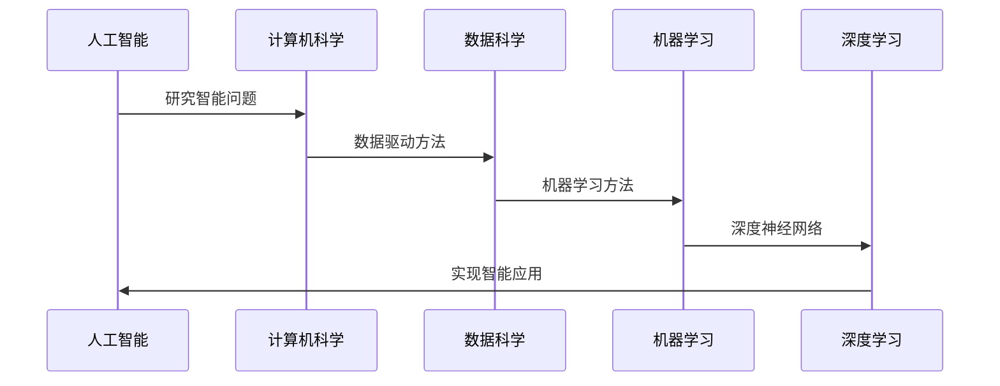
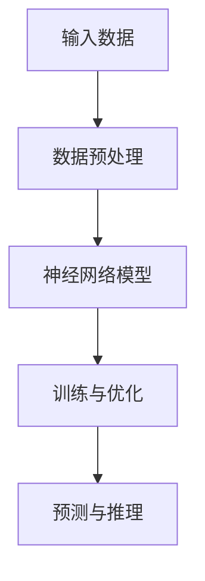
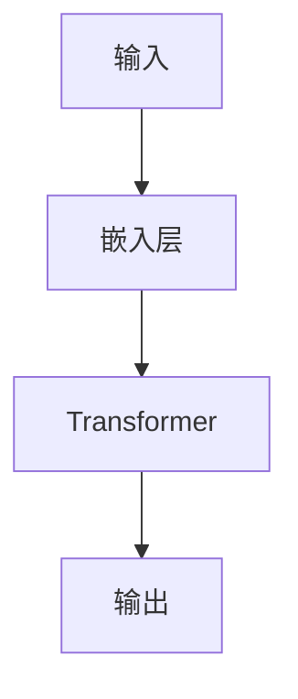

                 

# AI 大模型创业：如何利用竞争优势？

> 关键词：AI 大模型，创业，竞争优势，市场拓展，品牌建设

> 摘要：本文将深入探讨 AI 大模型在创业中的价值与应用，分析创业项目的资源整合、风险管理以及竞争优势构建。通过详细解读创业项目的市场调研、商业模式设计、资金筹集与投资策略，以及市场拓展与品牌建设，为创业者提供一套完整、实用的创业指南。

## 第一部分：AI 大模型与创业基础

### 第1章：AI 大模型概述与创业机会

#### 1.1 AI 大模型的概念与演进

##### 1.1.1 人工智能的演进历程

人工智能（AI）的概念最早可以追溯到 20 世纪 50 年代，当时的科学家们开始研究如何使计算机具备智能。从最初的规则系统、知识表示到符号逻辑推理，再到现代的机器学习和深度学习，人工智能经历了漫长而曲折的发展历程。

**图 1.1 人工智能的演进历程**

##### 1.1.2 AI 大模型的定义

AI 大模型是指具有大规模参数、高计算量和广泛适用性的深度学习模型。这些模型通常基于神经网络的架构，能够自动从海量数据中学习复杂的模式和规律。常见的 AI 大模型包括 GPT、BERT 等。

**图 1.2 AI 大模型架构**

##### 1.1.3 AI 大模型的关键特点

1. **大规模参数**：AI 大模型通常具有数百万甚至数十亿个参数，这使其能够处理复杂的问题和数据。

2. **高计算量**：AI 大模型需要大量的计算资源，包括 GPU、TPU 等。

3. **广泛适用性**：AI 大模型可以应用于自然语言处理、计算机视觉、语音识别等多个领域。

#### 1.2 AI 大模型在创业中的应用

##### 1.2.1 AI 大模型在创业中的价值

AI 大模型在创业中具有巨大的价值，主要体现在以下几个方面：

1. **产品创新**：AI 大模型可以帮助创业者快速开发创新产品，提升用户体验。

2. **市场分析**：AI 大模型可以分析市场数据，帮助创业者了解市场需求和竞争态势。

3. **运营优化**：AI 大模型可以优化创业项目的运营，提高效率，降低成本。

##### 1.2.2 创业公司如何利用 AI 大模型

创业公司可以利用 AI 大模型实现以下目标：

1. **自然语言处理**：例如，利用 GPT 模型进行文本生成、翻译等。

2. **计算机视觉**：例如，利用 BERT 模型进行图像识别、目标检测等。

3. **语音识别**：例如，利用 GPT 模型进行语音识别、语音合成等。

##### 1.2.3 创业过程中的挑战与应对策略

创业公司在利用 AI 大模型的过程中，可能会面临以下挑战：

1. **数据质量**：AI 大模型需要大量高质量的数据进行训练，数据质量直接影响模型性能。

2. **计算资源**：AI 大模型需要大量计算资源，这对创业公司的预算和资源管理提出了挑战。

3. **模型可解释性**：AI 大模型通常具有高复杂性，其决策过程往往缺乏可解释性，这对创业者来说是一个挑战。

应对策略：

1. **数据质量**：可以通过数据清洗、数据增强等方法提高数据质量。

2. **计算资源**：可以通过云计算、分布式计算等方法降低计算资源的需求。

3. **模型可解释性**：可以通过可视化、解释性算法等方法提高模型的可解释性。

#### 1.3 主流 AI 大模型简介

##### 1.3.1 GPT 系列模型

GPT（Generative Pre-trained Transformer）模型是由 OpenAI 于 2018 年提出的一种基于 Transformer 网络的预训练模型。GPT 模型在自然语言处理领域取得了显著成绩，能够实现文本生成、机器翻译、问答系统等功能。

**图 1.3 GPT 模型架构**

##### 1.3.2 BERT 模型

BERT（Bidirectional Encoder Representations from Transformers）模型是由 Google 于 2018 年提出的一种双向 Transformer 模型。BERT 模型在自然语言处理领域也取得了很好的成绩，能够实现语义理解、问答系统等功能。

**图 1.4 BERT 模型架构**

##### 1.3.3 其他知名 AI 大模型

除了 GPT 和 BERT，还有许多其他知名的 AI 大模型，如：

1. **T5（Text-To-Text Transfer Transformer）**：T5 模型是一种文本到文本的转换模型，能够实现文本生成、机器翻译等功能。

2. **GPT-2、GPT-3**：GPT-2 和 GPT-3 是 GPT 模型的升级版本，具有更高的参数规模和更强的能力。

3. **ViT（Vision Transformer）**：ViT 模型是一种计算机视觉模型，基于 Transformer 网络架构，能够实现图像分类、目标检测等功能。

### 第2章：创业项目规划与实施

#### 2.1 创业项目的市场调研

##### 2.1.1 市场需求分析

市场需求分析是创业项目规划的重要环节，通过对目标市场的需求进行深入调研和分析，可以为企业提供有价值的市场信息。

1. **市场需求分析的方法**：

   - **问卷调查**：通过设计问卷收集用户需求信息。

   - **访谈调研**：与潜在用户进行面对面交流，了解他们的需求和痛点。

   - **数据分析**：利用现有数据，分析市场需求趋势和用户行为。

2. **市场需求分析的内容**：

   - **用户需求**：了解用户的需求、偏好和痛点。

   - **市场规模**：评估目标市场的规模和增长潜力。

   - **竞争对手**：分析竞争对手的产品、优势和劣势。

##### 2.1.2 竞争对手分析

竞争对手分析可以帮助企业了解市场竞争态势，为制定战略提供参考。

1. **竞争对手分析的方法**：

   - **市场调研**：通过调查竞争对手的产品、市场份额、营销策略等。

   - **案例分析**：分析成功和失败的竞争对手案例，总结经验和教训。

   - **数据监控**：实时监控竞争对手的市场表现和动态。

2. **竞争对手分析的内容**：

   - **产品对比**：分析竞争对手的产品特点、优势和劣势。

   - **市场地位**：评估竞争对手在市场中的地位和影响力。

   - **营销策略**：分析竞争对手的营销策略，了解其市场拓展方法。

##### 2.1.3 用户画像与分析

用户画像分析是了解目标用户的基本特征和行为习惯，为企业提供精准营销和产品优化依据。

1. **用户画像分析的方法**：

   - **数据收集**：通过用户调查、行为数据等收集用户信息。

   - **数据清洗**：对收集到的数据进行清洗、整理，确保数据质量。

   - **数据分析**：利用数据分析技术，挖掘用户特征和需求。

2. **用户画像分析的内容**：

   - **用户基本特征**：年龄、性别、职业、地域等。

   - **用户行为习惯**：浏览习惯、购买行为、兴趣爱好等。

   - **用户需求**：根据用户画像，分析用户的核心需求和痛点。

#### 2.2 创业项目的商业模式设计

##### 2.2.1 商业模式的概念

商业模式是指企业如何创造、传递和捕获价值的基本原理和策略。一个成功的商业模式应该能够实现以下目标：

1. **创造价值**：为用户提供有价值的产品和服务。

2. **传递价值**：通过有效的渠道和方式将产品和服务传递给用户。

3. **捕获价值**：通过盈利模式和收入来源实现企业的盈利。

##### 2.2.2 主流商业模式类型

1. **产品导向型商业模式**：以产品为中心，通过创新和提升产品价值来吸引客户。

2. **客户导向型商业模式**：以客户为中心，通过深入了解客户需求，提供定制化的产品和服务。

3. **平台导向型商业模式**：通过搭建平台，连接供需双方，实现资源共享和利益最大化。

4. **订阅导向型商业模式**：通过提供持续的服务和内容，吸引用户订阅并持续支付费用。

##### 2.2.3 创业项目的商业模式设计

1. **确定核心产品和服务**：根据市场需求和用户画像，明确创业项目的主营业务。

2. **制定盈利模式**：根据商业模式类型，设计合理的盈利模式，如销售产品、提供服务、收取订阅费等。

3. **制定营销策略**：通过市场调研和用户画像，制定针对性的营销策略，提升品牌知名度和用户粘性。

#### 2.3 AI 大模型在创业项目中的应用

##### 2.3.1 AI 大模型在产品开发中的应用

AI 大模型在产品开发中的应用主要包括以下几个方面：

1. **需求预测**：通过分析用户行为数据和市场趋势，预测用户需求，优化产品设计和功能。

2. **个性化推荐**：根据用户画像和兴趣标签，为用户提供个性化的产品推荐，提升用户体验。

3. **文本分析**：利用自然语言处理技术，对用户评论、反馈进行分析，提取关键信息，为产品优化提供参考。

##### 2.3.2 AI 大模型在运营优化中的应用

AI 大模型在运营优化中的应用主要包括以下几个方面：

1. **流量分配**：通过算法优化，合理分配流量资源，提高用户访问量和转化率。

2. **库存管理**：利用预测模型，优化库存管理，降低库存成本，提高库存周转率。

3. **风险管理**：通过风险预测模型，识别潜在风险，提前采取措施，降低运营风险。

##### 2.3.3 AI 大模型在客户服务中的应用

AI 大模型在客户服务中的应用主要包括以下几个方面：

1. **智能客服**：通过自然语言处理技术，实现智能客服，提高客户服务效率和满意度。

2. **情感分析**：利用情感分析模型，分析客户反馈和评价，了解客户情感状态，优化客户服务策略。

3. **个性化服务**：根据客户画像和兴趣标签，为用户提供个性化的服务和建议，提升客户满意度。

### 第3章：创业过程中的资源整合与优化

#### 3.1 资源整合策略

##### 3.1.1 人力资源整合

人力资源整合是创业过程中的一项重要任务，通过有效整合人力资源，可以提升企业的整体竞争力。

1. **团队建设**：组建一支高效、专业的团队，明确团队成员的职责和角色。

2. **人才引进**：通过招聘、合作等方式引进优秀人才，提升团队整体素质。

3. **激励机制**：建立合理的激励机制，激发员工的积极性和创造力。

##### 3.1.2 财务资源整合

财务资源整合是创业过程中资金管理的重要环节，通过有效整合财务资源，可以降低成本，提高资金利用效率。

1. **资金筹集**：通过股权融资、债务融资等方式筹集资金，满足企业发展的资金需求。

2. **成本控制**：通过优化供应链、降低运营成本等方式，提高企业的盈利能力。

3. **财务规划**：制定合理的财务规划，确保企业财务状况的健康和稳定。

##### 3.1.3 技术资源整合

技术资源整合是创业过程中技术创新的重要保障，通过有效整合技术资源，可以提升企业的技术实力和创新能力。

1. **技术研发**：加大对技术研发的投入，推动技术创新和产品升级。

2. **技术合作**：与高校、科研机构、行业合作伙伴等建立合作关系，共享技术和资源。

3. **技术转移**：将先进的技术应用到产品和服务中，提升企业的竞争力。

#### 3.2 创业过程中的风险管理

##### 3.2.1 风险管理的重要性

风险管理是创业过程中不可或缺的一环，通过对风险进行识别、评估和应对，可以降低创业失败的风险。

1. **降低创业成本**：通过风险管理，可以避免不必要的损失，降低创业成本。

2. **提高创业成功率**：有效管理风险，可以提高创业项目的成功概率。

3. **保障企业生存**：在创业过程中，面临各种不确定因素，风险管理可以保障企业的生存和发展。

##### 3.2.2 风险识别与评估

风险识别与评估是风险管理的第一步，通过以下方法可以识别和评估风险：

1. **问卷调查**：通过问卷调查，了解潜在的风险因素。

2. **专家访谈**：邀请行业专家进行访谈，了解风险情况和应对策略。

3. **数据分析**：通过数据分析，识别潜在的风险因素。

4. **情景分析**：通过模拟不同情境，评估风险的影响程度。

##### 3.2.3 风险应对策略

根据风险识别和评估的结果，制定相应的风险应对策略：

1. **风险规避**：避免参与高风险业务或项目。

2. **风险降低**：通过改进技术、提高管理水平等方式，降低风险发生的概率。

3. **风险转移**：通过保险、合作等方式，将风险转移给其他主体。

4. **风险接受**：对无法避免或转移的风险，采取接受的态度，制定应对措施。

#### 3.3 创业项目的持续优化

##### 3.3.1 产品迭代策略

产品迭代是创业过程中的一项重要任务，通过持续优化产品，可以提升用户满意度和市场竞争力。

1. **需求调研**：定期进行用户调研，了解用户需求和反馈。

2. **版本更新**：根据用户需求和市场变化，定期发布新版本，优化产品功能。

3. **质量保证**：建立严格的质量管理体系，确保产品稳定性和可靠性。

##### 3.3.2 运营优化策略

运营优化是提升企业效率和竞争力的关键，通过以下策略可以实现运营优化：

1. **流程优化**：简化业务流程，提高工作效率。

2. **成本控制**：通过优化采购、物流等环节，降低运营成本。

3. **数据驱动**：通过数据分析和决策，优化运营策略。

##### 3.3.3 市场拓展策略

市场拓展是创业项目发展的重要方向，通过以下策略可以拓展市场：

1. **市场调研**：了解目标市场的需求和竞争态势。

2. **品牌推广**：通过线上线下渠道，提升品牌知名度和影响力。

3. **合作伙伴**：寻找合作伙伴，共同开拓市场。

### 第4章：创业过程中的竞争优势分析

#### 4.1 竞争优势的定义与分类

##### 4.1.1 竞争优势的概念

竞争优势是指企业在市场竞争中相对于竞争对手所具备的优势，包括资源、能力、产品、服务等方面。

##### 4.1.2 竞争优势的分类

竞争优势可以分为以下几种类型：

1. **成本优势**：通过降低成本，实现产品的低成本优势。

2. **差异化优势**：通过提供独特的产品或服务，满足用户的个性化需求。

3. **市场优势**：通过扩大市场份额，提升品牌知名度和影响力。

4. **技术优势**：通过技术创新，提升产品的技术含量和竞争力。

##### 4.1.3 创业公司如何构建竞争优势

创业公司可以通过以下方式构建竞争优势：

1. **资源整合**：通过整合内外部资源，提升企业的整体竞争力。

2. **技术创新**：通过持续创新，提升产品的技术水平和市场竞争力。

3. **品牌建设**：通过品牌建设和推广，提升品牌知名度和美誉度。

4. **客户服务**：通过提供优质的客户服务，提升用户满意度和忠诚度。

#### 4.2 竞争对手分析

##### 4.2.1 竞争对手识别

识别竞争对手是创业过程中的重要任务，通过以下方法可以识别竞争对手：

1. **市场调研**：通过市场调研，了解同行业的竞争对手。

2. **数据分析**：通过数据分析，识别竞争对手的市场份额、产品特点等。

3. **客户反馈**：通过客户反馈，了解竞争对手的产品和服务优势。

##### 4.2.2 竞争对手分析

对竞争对手进行分析，可以从以下几个方面入手：

1. **产品对比**：分析竞争对手的产品特点、优势和劣势。

2. **市场份额**：分析竞争对手在市场中的地位和影响力。

3. **营销策略**：分析竞争对手的营销策略，了解其市场拓展方法。

##### 4.2.3 应对策略制定

根据竞争对手分析的结果，制定相应的应对策略：

1. **产品差异化**：通过提供差异化的产品或服务，满足用户的个性化需求。

2. **成本控制**：通过降低成本，提升产品的性价比。

3. **技术创新**：通过持续创新，提升产品的技术含量和竞争力。

4. **品牌建设**：通过品牌建设和推广，提升品牌知名度和美誉度。

#### 4.3 创业项目的差异化优势

##### 4.3.1 差异化优势的定义

差异化优势是指企业通过提供独特的、与众不同的产品或服务，满足用户的个性化需求，从而在市场竞争中脱颖而出。

##### 4.3.2 创业项目的差异化优势分析

创业项目的差异化优势可以从以下几个方面进行分析：

1. **产品特点**：分析产品或服务的独特性，如功能、设计、质量等。

2. **用户体验**：分析用户对产品或服务的满意度，如易用性、便捷性等。

3. **技术优势**：分析产品的技术特点，如创新性、先进性等。

4. **品牌形象**：分析品牌在用户心中的形象，如品牌知名度、美誉度等。

##### 4.3.3 差异化优势的实现途径

创业项目可以通过以下途径实现差异化优势：

1. **技术创新**：通过持续创新，提升产品的技术水平和竞争力。

2. **产品设计**：通过独特的、个性化的产品设计，满足用户的个性化需求。

3. **品牌建设**：通过品牌建设和推广，提升品牌知名度和美誉度。

4. **用户体验**：通过优化用户体验，提升用户满意度和忠诚度。

### 第5章：创业项目的资金筹集与投资策略

#### 5.1 资金筹集策略

##### 5.1.1 资金筹集途径

创业项目的资金筹集途径包括以下几种：

1. **天使投资**：天使投资是指个人投资者对初创企业进行的风险投资。

2. **风险投资**：风险投资是指专业投资机构对初创企业进行的风险投资。

3. **股权融资**：股权融资是指企业通过出售部分股权来筹集资金。

4. **债务融资**：债务融资是指企业通过借款来筹集资金。

##### 5.1.2 资金筹集策略

资金筹集策略需要根据企业的实际情况和需求进行制定：

1. **分阶段筹集**：根据企业的发展阶段和资金需求，分阶段筹集资金。

2. **多元化筹集**：通过多种途径筹集资金，降低资金筹集风险。

3. **资本结构优化**：优化资本结构，降低债务融资比例，提高股权融资比例。

##### 5.1.3 资金使用规划

资金使用规划需要根据企业的实际情况和需求进行制定：

1. **研发投入**：加大对技术研发的投入，提升产品的技术含量和竞争力。

2. **市场推广**：通过市场推广，提升品牌知名度和市场占有率。

3. **运营成本**：合理控制运营成本，提高资金利用效率。

4. **风险准备**：预留一定的风险准备金，应对突发事件。

#### 5.2 投资者关系管理

##### 5.2.1 投资者关系的重要性

投资者关系管理是创业项目成功的关键因素之一，通过良好的投资者关系管理，可以提升企业的形象和信誉，吸引更多的投资者。

1. **提升企业形象**：通过积极的投资者关系管理，提升企业的形象和信誉。

2. **吸引投资者**：通过良好的投资者关系管理，吸引更多的投资者，为企业的未来发展提供资金支持。

3. **提高融资效率**：通过良好的投资者关系管理，提高融资效率，降低融资成本。

##### 5.2.2 投资者关系管理策略

投资者关系管理策略包括以下几个方面：

1. **信息透明**：保持信息的透明度，及时向投资者披露企业的经营情况和财务状况。

2. **沟通互动**：与投资者保持良好的沟通互动，了解投资者的需求和意见，及时反馈企业的经营情况。

3. **专业培训**：为投资者提供专业的培训和服务，提升投资者的专业素养和投资能力。

##### 5.2.3 投资者沟通技巧

投资者沟通技巧包括以下几个方面：

1. **倾听**：认真倾听投资者的意见和需求，了解投资者的关注点。

2. **表达**：清晰、准确地表达企业的观点和策略，提升投资者的信任度。

3. **反馈**：及时反馈投资者的意见和需求，展现企业的积极态度和责任心。

#### 5.3 投资回报与风险管理

##### 5.3.1 投资回报评估方法

投资回报评估方法包括以下几种：

1. **现金流量法**：通过计算企业未来现金流量，评估投资回报。

2. **净现值法**：通过计算企业未来现金流量净现值，评估投资回报。

3. **内部收益率法**：通过计算企业的内部收益率，评估投资回报。

##### 5.3.2 风险管理策略

风险管理策略包括以下几个方面：

1. **风险识别**：通过识别和分析企业面临的各种风险，制定相应的应对措施。

2. **风险评估**：通过评估各种风险的可能性和影响程度，制定相应的应对策略。

3. **风险应对**：根据风险评估的结果，采取相应的风险应对措施，降低风险的影响。

##### 5.3.3 投资决策流程

投资决策流程包括以下几个方面：

1. **项目评估**：对投资项目进行评估，包括市场需求、技术可行性、盈利能力等。

2. **风险评估**：对投资项目进行风险评估，识别和分析可能的风险因素。

3. **投资决策**：根据项目评估和风险评估的结果，做出投资决策。

4. **实施监控**：对投资项目进行实施监控，确保项目的顺利进行。

### 第6章：创业项目的市场拓展与品牌建设

#### 6.1 市场拓展策略

##### 6.1.1 市场拓展的重要性

市场拓展是创业项目发展的重要方向，通过拓展市场，可以提升企业的市场份额和盈利能力。

1. **提升品牌知名度**：通过市场拓展，提升品牌知名度和影响力。

2. **扩大市场份额**：通过市场拓展，扩大市场份额，提升企业的竞争力。

3. **提高盈利能力**：通过市场拓展，提高企业的盈利能力，实现可持续发展。

##### 6.1.2 市场拓展策略

市场拓展策略包括以下几个方面：

1. **产品策略**：通过产品创新和升级，满足市场需求，提升产品竞争力。

2. **渠道策略**：通过拓展销售渠道，提高产品的市场覆盖率。

3. **价格策略**：通过合理的价格策略，吸引更多的消费者。

##### 6.1.3 国际市场拓展策略

国际市场拓展策略包括以下几个方面：

1. **市场调研**：通过市场调研，了解国际市场的需求和竞争态势。

2. **本地化策略**：根据国际市场的特点，制定本地化营销策略。

3. **国际合作**：与国外合作伙伴建立合作关系，共同拓展国际市场。

#### 6.2 品牌建设策略

##### 6.2.1 品牌建设的重要性

品牌建设是创业项目发展的重要任务，通过品牌建设，可以提升企业的竞争力和市场地位。

1. **提升品牌知名度**：通过品牌建设，提升品牌知名度和影响力。

2. **树立品牌形象**：通过品牌建设，树立企业独特的品牌形象和品牌文化。

3. **提高用户忠诚度**：通过品牌建设，提高用户的忠诚度和满意度。

##### 6.2.2 品牌建设策略

品牌建设策略包括以下几个方面：

1. **品牌定位**：明确品牌的核心价值和定位，为品牌建设奠定基础。

2. **品牌传播**：通过多种渠道和方式，传播品牌理念和价值。

3. **品牌管理**：建立品牌管理体系，确保品牌的稳定性和一致性。

##### 6.2.3 品牌传播策略

品牌传播策略包括以下几个方面：

1. **广告宣传**：通过广告宣传，提高品牌知名度和影响力。

2. **公关活动**：通过公关活动，提升品牌形象和用户满意度。

3. **社交媒体**：通过社交媒体，与用户进行互动和沟通，提高品牌美誉度。

4. **口碑营销**：通过口碑营销，提升品牌信誉和用户忠诚度。

### 第7章：创业项目的管理与运营

#### 7.1 创业团队管理

##### 7.1.1 团队建设的重要性

团队建设是创业项目成功的关键因素之一，通过团队建设，可以提升团队的协作效率和创新能力。

1. **提升协作效率**：通过团队建设，明确团队成员的职责和角色，提高协作效率。

2. **激发创新能力**：通过团队建设，鼓励团队成员发挥创新能力，推动企业技术创新。

3. **提高团队凝聚力**：通过团队建设，增强团队成员之间的信任和凝聚力。

##### 7.1.2 团队管理策略

团队管理策略包括以下几个方面：

1. **目标管理**：明确团队的目标和任务，确保团队成员齐心协力。

2. **激励制度**：建立合理的激励机制，激发团队成员的积极性和创造力。

3. **沟通协作**：加强团队成员之间的沟通和协作，提高团队执行力。

##### 7.1.3 团队协作工具与方法

团队协作工具与方法包括以下几个方面：

1. **项目管理工具**：如 Trello、JIRA 等，用于任务分配和进度跟踪。

2. **沟通工具**：如 Slack、WhatsApp 等，用于团队内部沟通和协作。

3. **协作工具**：如 Google Docs、Confluence 等，用于文档共享和协同编辑。

#### 7.2 创业项目的运营管理

##### 7.2.1 运营管理的基本原则

运营管理是创业项目成功的关键因素之一，通过有效的运营管理，可以提高企业的运营效率和市场竞争力。

1. **目标导向**：明确运营目标，确保运营工作围绕目标展开。

2. **流程优化**：优化业务流程，提高运营效率。

3. **数据驱动**：通过数据分析和决策，提升运营效果。

##### 7.2.2 运营数据分析

运营数据分析是运营管理的重要环节，通过运营数据分析，可以了解企业的运营状况和问题。

1. **用户分析**：分析用户行为和需求，优化产品和服务。

2. **销售分析**：分析销售数据和渠道效果，优化销售策略。

3. **成本分析**：分析运营成本和收益，优化成本结构。

##### 7.2.3 运营优化策略

运营优化策略包括以下几个方面：

1. **流程优化**：通过流程优化，提高运营效率。

2. **数据分析**：通过数据分析，优化运营策略。

3. **用户反馈**：通过用户反馈，改进产品和服务。

#### 7.3 创业项目的风险管理

##### 7.3.1 风险管理的重要性

风险管理是创业项目成功的关键因素之一，通过有效的风险管理，可以降低创业失败的风险。

1. **降低风险**：通过风险管理，降低创业项目面临的风险。

2. **提高成功率**：通过风险管理，提高创业项目的成功率。

3. **保障企业生存**：通过风险管理，保障企业的生存和发展。

##### 7.3.2 风险识别与评估

风险识别与评估是风险管理的重要环节，通过以下方法可以识别和评估风险：

1. **问卷调查**：通过问卷调查，了解潜在的风险因素。

2. **专家访谈**：邀请行业专家进行访谈，了解风险情况和应对策略。

3. **数据分析**：通过数据分析，识别潜在的风险因素。

4. **情景分析**：通过模拟不同情境，评估风险的影响程度。

##### 7.3.3 风险应对策略

根据风险识别和评估的结果，制定相应的风险应对策略：

1. **风险规避**：避免参与高风险业务或项目。

2. **风险降低**：通过改进技术、提高管理水平等方式，降低风险发生的概率。

3. **风险转移**：通过保险、合作等方式，将风险转移给其他主体。

4. **风险接受**：对无法避免或转移的风险，采取接受的态度，制定应对措施。

### 第8章：创业项目的可持续发展与未来展望

#### 8.1 创业项目的可持续发展

##### 8.1.1 可持续发展的概念

可持续发展是指企业在满足当前需求的同时，不损害后代满足其需求的能力。在创业项目中，可持续发展意味着企业在追求经济效益的同时，注重社会和环境责任。

1. **经济效益**：通过创新和优化，提高企业的盈利能力。

2. **社会效益**：通过积极参与社会公益活动，提升企业的社会责任感。

3. **环境效益**：通过环保措施，减少企业对环境的负面影响。

##### 8.1.2 创业项目的可持续发展策略

创业项目的可持续发展策略包括以下几个方面：

1. **技术创新**：通过持续创新，提升企业的核心竞争力。

2. **社会责任**：积极参与社会公益活动，提升企业的社会责任感。

3. **环境保护**：采取环保措施，减少企业对环境的负面影响。

##### 8.1.3 可持续发展的挑战与机遇

创业项目在可持续发展过程中，面临着以下挑战和机遇：

1. **挑战**：

   - **技术挑战**：技术创新难度大，需要大量资金和人力资源。

   - **市场挑战**：市场竞争激烈，需要不断优化产品和服务。

   - **社会责任挑战**：需要平衡企业利益和社会责任，实现可持续发展。

2. **机遇**：

   - **技术机遇**：随着人工智能、大数据等技术的发展，为企业提供了新的发展机遇。

   - **市场机遇**：随着消费升级和个性化需求的增加，为企业提供了广阔的市场空间。

   - **社会责任机遇**：随着社会对可持续发展的关注增加，为企业提供了承担社会责任的机会。

#### 8.2 创业项目的未来展望

##### 8.2.1 创业项目的未来发展趋势

创业项目的未来发展趋势将受到以下因素的影响：

1. **技术发展**：人工智能、大数据、物联网等技术的快速发展，将推动创业项目的创新和发展。

2. **市场需求**：随着消费者需求的不断变化，创业项目需要不断优化产品和服务，满足市场需求。

3. **政策环境**：政府的政策支持和创新环境，将为企业提供良好的发展机遇。

##### 8.2.2 创业项目的未来规划

创业项目的未来规划包括以下几个方面：

1. **技术创新**：持续进行技术创新，提升企业的核心竞争力。

2. **市场拓展**：拓展国内外市场，提高企业的市场份额。

3. **品牌建设**：加强品牌建设，提升企业的品牌价值和知名度。

##### 8.2.3 创业项目的未来发展机会

创业项目的未来发展机会将来自于以下几个方面：

1. **新兴领域**：随着新兴领域的崛起，如区块链、人工智能等，为企业提供了新的发展机遇。

2. **跨界合作**：通过跨界合作，实现资源共享和优势互补，提升企业的竞争力。

3. **社会责任**：通过承担社会责任，提升企业的社会形象和品牌价值。

### 第9章：附录

#### 9.1 AI 大模型开发工具与资源

**AI 大模型开发工具**：

- **TensorFlow**：一款开源的机器学习框架，支持深度学习和传统机器学习。

- **PyTorch**：一款开源的机器学习库，支持动态计算图和自动微分。

- **Keras**：一款高级神经网络 API，支持 TensorFlow 和 Theano 后端。

**AI 大模型资源**：

- **论文**：通过阅读相关论文，了解 AI 大模型的理论基础和最新进展。

- **博客**：通过阅读技术博客，了解 AI 大模型的应用和实践。

- **开源项目**：参与开源项目，获取实践经验和代码资源。

#### 9.2 创业相关法律法规与政策

**创业相关法律法规**：

- **公司法**：规范公司的设立、运营和管理。

- **合伙企业法**：规范合伙企业的设立、运营和管理。

- **合同法**：规范合同的订立、履行和解除。

**创业相关政策**：

- **国家创新创业政策**：了解国家关于创新创业的各项政策和支持措施。

- **地方政府政策**：了解地方政府关于创新创业的各项政策和支持措施。

- **融资政策**：了解政府关于融资的各项政策和支持措施。

#### 9.3 创业者必读经典书籍推荐

- **《创业维艰》**：由创业家本·霍洛维茨撰写，分享了他在创业过程中的经验和教训。

- **《创新者的窘境》**：由克莱顿·克里斯坦森撰写，探讨了创新者在面对市场变化时的困境和对策。

- **《创业 Opportunities and Challenges》**：由约翰·霍金斯撰写，介绍了创业过程中的机遇和挑战，以及如何应对。

## 结语

本文从 AI 大模型的概念与演进、AI 大模型在创业中的应用、创业项目的规划与实施、资源整合与优化、竞争优势分析、资金筹集与投资策略、市场拓展与品牌建设、管理与运营以及可持续发展与未来展望等方面，全面探讨了 AI 大模型创业的竞争优势构建与利用。通过本文的阐述，希望能够为创业者提供一套完整、实用的创业指南，助力他们在 AI 大模型领域取得成功。

作者：AI天才研究院/AI Genius Institute & 禅与计算机程序设计艺术 /Zen And The Art of Computer Programming

本文内容仅供参考，如有不准确之处，敬请指正。在创业过程中，还需根据实际情况进行调整和优化。祝各位创业者事业顺利，前程似锦！### AI 大模型创业：如何利用竞争优势？

#### 关键词：AI 大模型，创业，竞争优势，市场拓展，品牌建设

#### 摘要：本文将深入探讨 AI 大模型在创业中的价值与应用，分析创业项目的资源整合、风险管理以及竞争优势构建。通过详细解读创业项目的市场调研、商业模式设计、资金筹集与投资策略，以及市场拓展与品牌建设，为创业者提供一套完整、实用的创业指南。

---

## 第一部分：AI 大模型与创业基础

### 第1章：AI 大模型概述与创业机会

#### 1.1 AI 大模型的概念与演进

##### 1.1.1 人工智能的演进历程

人工智能（AI）是一门研究、开发用于模拟、延伸和扩展人的智能的理论、方法、技术及应用系统的科学技术。其研究内容包括算法、机器学习、自然语言处理和计算机视觉等。人工智能的演进历程可以概括为以下几个阶段：

1. **初始阶段（1950s-1960s）**：
   - 人工智能概念首次被提出。
   - 初步的人工智能程序和系统开发。
   - 基于规则和逻辑推理的系统。

2. **黄金时期（1970s-1980s）**：
   - 机器学习和神经网络开始兴起。
   - 专家系统的出现，如 MYCIN 和 DENDRAL。

3. **低谷期（1990s）**：
   - 由于对人工智能的期望过高，加之技术瓶颈，人工智能进入低谷期。
   - 机器学习研究受到重视，特别是统计学习方法的兴起。

4. **复兴期（2000s-至今）**：
   - 大数据和高性能计算的发展为人工智能提供了强大的支撑。
   - 深度学习的突破带来了人工智能的又一轮发展。
   - 应用领域不断扩展，如语音识别、图像识别、自然语言处理等。

##### 1.1.2 AI 大模型的定义

AI 大模型通常指的是那些具有数百万甚至数十亿参数的神经网络模型，它们通过大量的数据训练，能够实现高度复杂的任务，如文本生成、机器翻译、图像分类等。这些模型往往是基于深度学习技术的，尤其是变换器（Transformer）架构。常见的 AI 大模型包括：

- **GPT 系列**：由 OpenAI 开发的预训练语言模型，如 GPT-3。
- **BERT**：由 Google 开发的一种双向变换器预训练语言表示模型。
- **T5**：一个文本到文本的变换器，旨在解决各种自然语言处理任务。

##### 1.1.3 AI 大模型的关键特点

AI 大模型具有以下几个关键特点：

1. **大规模参数**：
   - AI 大模型具有数百万甚至数十亿个参数。
   - 这些参数通过海量数据训练得到，能够捕捉数据中的复杂模式。

2. **高计算需求**：
   - 训练和推理 AI 大模型需要大量的计算资源，如 GPU 或 TPU。
   - 高性能计算和分布式计算技术被广泛应用以加速模型的训练和部署。

3. **通用性**：
   - AI 大模型通常具有很高的通用性，能够在多个任务和领域中应用。
   - 通过预训练和微调，模型可以在特定任务上实现高性能。

4. **可扩展性**：
   - AI 大模型设计上具有很好的可扩展性，可以轻松调整模型的大小和复杂性。
   - 这种可扩展性使得模型能够适应不同的计算需求和任务复杂性。

#### 1.2 AI 大模型在创业中的应用

##### 1.2.1 AI 大模型在创业中的价值

AI 大模型在创业中具有巨大的价值，主要体现在以下几个方面：

1. **产品创新**：
   - AI 大模型可以加速产品创新过程，帮助企业开发出更具竞争力的产品。
   - 通过对大量数据的分析和理解，模型可以提供有价值的洞察，指导产品设计和改进。

2. **市场分析**：
   - AI 大模型可以帮助企业分析市场数据，识别潜在的市场机会和风险。
   - 通过机器学习算法，模型可以从历史数据中预测市场趋势，为企业提供战略决策支持。

3. **运营优化**：
   - AI 大模型可以优化企业的运营流程，提高效率和降低成本。
   - 例如，通过预测模型，企业可以更好地管理库存、优化供应链，提高资源利用率。

4. **客户服务**：
   - AI 大模型可以提升客户服务质量，提供个性化、高效的客户服务。
   - 通过自然语言处理和机器学习，模型可以理解和响应客户的需求，提供智能化的客户支持。

##### 1.2.2 创业公司如何利用 AI 大模型

创业公司可以利用 AI 大模型实现以下目标：

1. **自然语言处理**：
   - 利用 GPT 或 BERT 等模型进行文本生成、翻译、问答系统等任务。
   - 例如，开发智能客服系统，通过模型自动生成回复，提高客户响应速度和满意度。

2. **计算机视觉**：
   - 利用 AI 大模型进行图像识别、目标检测、图像生成等任务。
   - 例如，开发图像识别应用，通过模型分析图像内容，提供分类和标注服务。

3. **语音识别**：
   - 利用 AI 大模型进行语音识别、语音合成、语音助手等任务。
   - 例如，开发语音助手应用，通过模型理解用户指令，实现语音控制功能。

##### 1.2.3 创业过程中的挑战与应对策略

创业公司在利用 AI 大模型的过程中，可能会面临以下挑战：

1. **数据质量**：
   - AI 大模型需要大量高质量的数据进行训练，数据质量直接影响模型性能。
   - 应对策略：采用数据清洗、数据增强等技术，提高数据质量。

2. **计算资源**：
   - AI 大模型需要大量的计算资源，这对创业公司的预算和资源管理提出了挑战。
   - 应对策略：利用云计算、分布式计算等技术，降低计算资源需求。

3. **模型可解释性**：
   - AI 大模型通常具有高复杂性，其决策过程往往缺乏可解释性，这对创业者来说是一个挑战。
   - 应对策略：采用可视化工具和解释性算法，提高模型的可解释性。

#### 1.3 主流 AI 大模型简介

##### 1.3.1 GPT 系列模型

GPT（Generative Pre-trained Transformer）模型是由 OpenAI 开发的预训练语言模型，其系列包括 GPT-1、GPT-2、GPT-3 等。GPT 模型基于变换器（Transformer）架构，通过预训练和微调，能够在多个自然语言处理任务中实现高性能。

1. **GPT-1**：
   - 参数规模：117M。
   - 引擎时间：2018 年 6 月。
   - 特点：用于文本生成和机器翻译。

2. **GPT-2**：
   - 参数规模：1.5B。
   - 引擎时间：2019 年 2 月。
   - 特点：用于文本生成、问答系统和对话生成。

3. **GPT-3**：
   - 参数规模：1750B。
   - 引擎时间：2020 年 5 月。
   - 特点：具有强大的语言理解和生成能力，可以用于自动写作、对话系统等。

##### 1.3.2 BERT 模型

BERT（Bidirectional Encoder Representations from Transformers）模型是由 Google 开发的一种双向变换器预训练语言表示模型。BERT 模型通过预训练，能够在多个自然语言处理任务中实现高性能。

1. **BERT**：
   - 参数规模：103M。
   - 引擎时间：2018 年 10 月。
   - 特点：用于文本分类、问答系统和文本生成。

2. **BERT-Large**：
   - 参数规模：335M。
   - 引擎时间：2019 年 4 月。
   - 特点：具有更高的精度，适用于更复杂的任务。

3. **BERT-3B**：
   - 参数规模：3200M。
   - 引擎时间：2019 年 10 月。
   - 特点：用于解决更大规模的文本处理任务。

##### 1.3.3 其他知名 AI 大模型

除了 GPT 和 BERT，还有许多其他知名的 AI 大模型，如：

- **T5（Text-To-Text Transfer Transformer）**：一个文本到文本的变换器，旨在解决各种自然语言处理任务。

- **ViT（Vision Transformer）**：一种基于变换器的计算机视觉模型，能够实现图像分类、目标检测等功能。

- **GPT-Neo**：一个基于 GPT-3 的开源模型，提供更灵活的定制和优化选项。

- **RLHF（Reinforcement Learning from Human Feedback）**：一种通过人类反馈进行强化学习的方法，用于提高模型的安全性、可解释性和鲁棒性。

## 第2章：创业项目规划与实施

### 2.1 创业项目的市场调研

##### 2.1.1 市场需求分析

市场需求分析是创业项目规划的重要环节，通过对目标市场的需求进行深入调研和分析，可以为企业提供有价值的市场信息。以下是市场需求分析的方法和步骤：

1. **确定目标市场**：
   - 分析目标市场的人口特征、地理分布、消费习惯等。

2. **收集市场数据**：
   - 通过市场调研、行业报告、政府统计数据等收集市场信息。

3. **分析市场需求**：
   - 确定目标市场的需求规模、增长趋势、竞争对手等。

4. **评估市场机会**：
   - 评估市场需求与产品或服务之间的匹配度，确定市场机会。

5. **制定市场策略**：
   - 根据市场需求分析结果，制定合适的市场策略。

##### 2.1.2 竞争对手分析

竞争对手分析是了解市场竞争态势的重要手段。通过以下方法可以识别和分析竞争对手：

1. **识别竞争对手**：
   - 通过市场调研、行业报告等确定直接和间接的竞争对手。

2. **分析竞争对手的产品和服务**：
   - 确定竞争对手的产品特点、优势和劣势。

3. **分析竞争对手的市场策略**：
   - 研究竞争对手的定价策略、促销策略、渠道策略等。

4. **评估竞争对手的威胁**：
   - 评估竞争对手对市场的影响和潜在威胁。

5. **制定应对策略**：
   - 根据竞争对手分析结果，制定合适的应对策略。

##### 2.1.3 用户画像与分析

用户画像分析是了解目标用户的基本特征和行为习惯，为企业提供精准营销和产品优化依据。以下是用户画像分析的方法和步骤：

1. **确定目标用户群体**：
   - 根据市场需求和产品特点，确定目标用户群体。

2. **收集用户数据**：
   - 通过问卷调查、用户调研、社交媒体分析等收集用户信息。

3. **分析用户特征**：
   - 分析用户的年龄、性别、职业、地域等基本特征。

4. **分析用户行为**：
   - 分析用户的行为习惯、消费习惯、兴趣爱好等。

5. **建立用户画像**：
   - 根据用户特征和行为分析结果，建立用户画像。

6. **应用用户画像**：
   - 根据用户画像，制定精准营销策略和产品优化方案。

### 2.2 创业项目的商业模式设计

##### 2.2.1 商业模式的概念

商业模式是指企业如何创造、传递和捕获价值的基本原理和策略。一个成功的商业模式应该能够实现以下目标：

1. **创造价值**：
   - 通过提供产品和服务，满足用户需求，创造用户价值。

2. **传递价值**：
   - 通过有效的渠道和方式，将产品和服务传递给用户。

3. **捕获价值**：
   - 通过盈利模式和收入来源，实现企业的盈利。

##### 2.2.2 主流商业模式类型

1. **产品导向型商业模式**：
   - 以产品为中心，通过技术创新和品质提升，吸引用户。

   2. **客户导向型商业模式**：
   - 以客户为中心，通过深入了解客户需求，提供定制化的产品和服务。

   3. **平台导向型商业模式**：
   - 通过搭建平台，连接供需双方，实现资源共享和利益最大化。

   4. **订阅导向型商业模式**：
   - 通过提供持续的服务和内容，吸引用户订阅并持续支付费用。

##### 2.2.3 创业项目的商业模式设计

创业项目的商业模式设计需要结合市场需求、用户画像和竞争优势等因素进行。以下是创业项目商业模式设计的方法和步骤：

1. **确定核心产品和服务**：
   - 根据市场需求和用户画像，明确创业项目的主营业务。

2. **制定盈利模式**：
   - 根据商业模式类型，设计合理的盈利模式，如销售产品、提供服务、收取订阅费等。

3. **制定营销策略**：
   - 根据市场调研和用户画像，制定针对性的营销策略，提升品牌知名度和用户粘性。

4. **优化运营流程**：
   - 通过流程优化，提高运营效率，降低成本。

5. **评估商业模式**：
   - 定期评估商业模式的有效性和可持续性，进行必要的调整和优化。

### 2.3 AI 大模型在创业项目中的应用

##### 2.3.1 AI 大模型在产品开发中的应用

AI 大模型在产品开发中的应用可以帮助企业实现以下目标：

1. **需求预测**：
   - 通过分析用户行为数据和市场趋势，预测用户需求，优化产品设计和功能。

2. **个性化推荐**：
   - 根据用户画像和兴趣标签，为用户提供个性化的产品推荐，提升用户体验。

3. **文本分析**：
   - 利用自然语言处理技术，对用户评论、反馈进行分析，提取关键信息，为产品优化提供参考。

##### 2.3.2 AI 大模型在运营优化中的应用

AI 大模型在运营优化中的应用可以帮助企业实现以下目标：

1. **流量分配**：
   - 通过算法优化，合理分配流量资源，提高用户访问量和转化率。

2. **库存管理**：
   - 利用预测模型，优化库存管理，降低库存成本，提高库存周转率。

3. **风险管理**：
   - 通过风险预测模型，识别潜在风险，提前采取措施，降低运营风险。

##### 2.3.3 AI 大模型在客户服务中的应用

AI 大模型在客户服务中的应用可以帮助企业实现以下目标：

1. **智能客服**：
   - 通过自然语言处理技术，实现智能客服，提高客户服务效率和满意度。

2. **情感分析**：
   - 利用情感分析模型，分析客户反馈和评价，了解客户情感状态，优化客户服务策略。

3. **个性化服务**：
   - 根据客户画像和兴趣标签，为用户提供个性化的服务和建议，提升客户满意度。

## 第3章：创业过程中的资源整合与优化

### 3.1 资源整合策略

##### 3.1.1 人力资源整合

人力资源整合是创业过程中的一项重要任务，通过有效整合人力资源，可以提升企业的整体竞争力。以下是人力资源整合的策略和方法：

1. **团队建设**：
   - 组建一支高效、专业的团队，明确团队成员的职责和角色。

2. **人才引进**：
   - 通过招聘、合作等方式引进优秀人才，提升团队整体素质。

3. **激励机制**：
   - 建立合理的激励机制，激发员工的积极性和创造力。

##### 3.1.2 财务资源整合

财务资源整合是创业过程中资金管理的重要环节，通过有效整合财务资源，可以降低成本，提高资金利用效率。以下是财务资源整合的策略和方法：

1. **资金筹集**：
   - 通过股权融资、债务融资等方式筹集资金，满足企业发展的资金需求。

2. **成本控制**：
   - 通过优化供应链、降低运营成本等方式，提高企业的盈利能力。

3. **财务规划**：
   - 制定合理的财务规划，确保企业财务状况的健康和稳定。

##### 3.1.3 技术资源整合

技术资源整合是创业过程中技术创新的重要保障，通过有效整合技术资源，可以提升企业的技术实力和创新能力。以下是技术资源整合的策略和方法：

1. **技术研发**：
   - 加大对技术研发的投入，推动技术创新和产品升级。

2. **技术合作**：
   - 与高校、科研机构、行业合作伙伴等建立合作关系，共享技术和资源。

3. **技术转移**：
   - 将先进的技术应用到产品和服务中，提升企业的竞争力。

### 3.2 创业过程中的风险管理

##### 3.2.1 风险管理的重要性

风险管理是创业过程中不可或缺的一环，通过对风险进行识别、评估和应对，可以降低创业失败的风险。以下是风险管理的重要性：

1. **降低创业成本**：
   - 通过风险管理，可以避免不必要的损失，降低创业成本。

2. **提高创业成功率**：
   - 有效管理风险，可以提高创业项目的成功概率。

3. **保障企业生存**：
   - 在创业过程中，面临各种不确定因素，风险管理可以保障企业的生存和发展。

##### 3.2.2 风险识别与评估

风险识别与评估是风险管理的第一步，通过以下方法可以识别和评估风险：

1. **问卷调查**：
   - 通过设计问卷收集用户需求信息。

2. **访谈调研**：
   - 与潜在用户进行面对面交流，了解他们的需求和痛点。

3. **数据分析**：
   - 利用现有数据，分析市场需求趋势和用户行为。

4. **情景分析**：
   - 通过模拟不同情境，评估风险的影响程度。

##### 3.2.3 风险应对策略

根据风险识别和评估的结果，制定相应的风险应对策略：

1. **风险规避**：
   - 避免参与高风险业务或项目。

2. **风险降低**：
   - 通过改进技术、提高管理水平等方式，降低风险发生的概率。

3. **风险转移**：
   - 通过保险、合作等方式，将风险转移给其他主体。

4. **风险接受**：
   - 对无法避免或转移的风险，采取接受的态度，制定应对措施。

### 3.3 创业项目的持续优化

##### 3.3.1 产品迭代策略

产品迭代是创业过程中的一项重要任务，通过持续优化产品，可以提升用户满意度和市场竞争力。以下是产品迭代策略的方法和步骤：

1. **需求调研**：
   - 定期进行用户调研，了解用户需求和反馈。

2. **版本更新**：
   - 根据用户需求和市场变化，定期发布新版本，优化产品功能。

3. **质量保证**：
   - 建立严格的质量管理体系，确保产品稳定性和可靠性。

##### 3.3.2 运营优化策略

运营优化是提升企业效率和竞争力的关键，通过以下策略可以实现运营优化：

1. **流程优化**：
   - 简化业务流程，提高工作效率。

2. **成本控制**：
   - 通过优化采购、物流等环节，降低运营成本。

3. **数据驱动**：
   - 通过数据分析和决策，优化运营策略。

##### 3.3.3 市场拓展策略

市场拓展是创业项目发展的重要方向，通过以下策略可以拓展市场：

1. **市场调研**：
   - 了解目标市场的需求和竞争态势。

2. **品牌推广**：
   - 通过线上线下渠道，提升品牌知名度和影响力。

3. **合作伙伴**：
   - 寻找合作伙伴，共同开拓市场。

## 第4章：创业过程中的竞争优势分析

### 4.1 竞争优势的定义与分类

##### 4.1.1 竞争优势的概念

竞争优势是指企业在市场竞争中相对于竞争对手所具备的优势，包括资源、能力、产品、服务等方面。竞争优势可以表现为成本优势、差异化优势、市场优势和技术优势等。

##### 4.1.2 竞争优势的分类

1. **成本优势**：
   - 通过降低成本，实现产品的低成本优势。

2. **差异化优势**：
   - 通过提供独特的、与众不同的产品或服务，满足用户的个性化需求。

3. **市场优势**：
   - 通过扩大市场份额，提升品牌知名度和影响力。

4. **技术优势**：
   - 通过技术创新，提升产品的技术含量和竞争力。

##### 4.1.3 创业公司如何构建竞争优势

创业公司可以通过以下方式构建竞争优势：

1. **资源整合**：
   - 通过整合内外部资源，提升企业的整体竞争力。

2. **技术创新**：
   - 通过持续创新，提升产品的技术水平和市场竞争力。

3. **品牌建设**：
   - 通过品牌建设和推广，提升品牌知名度和美誉度。

4. **客户服务**：
   - 通过提供优质的客户服务，提升用户满意度和忠诚度。

### 4.2 竞争对手分析

##### 4.2.1 竞争对手识别

竞争对手识别是创业过程中的一项重要任务，通过以下方法可以识别竞争对手：

1. **市场调研**：
   - 通过市场调研，了解同行业的竞争对手。

2. **数据分析**：
   - 通过数据分析，识别竞争对手的市场份额、产品特点等。

3. **客户反馈**：
   - 通过客户反馈，了解竞争对手的产品和服务优势。

##### 4.2.2 竞争对手分析

对竞争对手进行分析，可以从以下几个方面入手：

1. **产品对比**：
   - 分析竞争对手的产品特点、优势和劣势。

2. **市场份额**：
   - 分析竞争对手在市场中的地位和影响力。

3. **营销策略**：
   - 分析竞争对手的营销策略，了解其市场拓展方法。

##### 4.2.3 应对策略制定

根据竞争对手分析的结果，制定相应的应对策略：

1. **产品差异化**：
   - 通过提供差异化的产品或服务，满足用户的个性化需求。

2. **成本控制**：
   - 通过降低成本，提升产品的性价比。

3. **技术创新**：
   - 通过持续创新，提升产品的技术含量和竞争力。

4. **品牌建设**：
   - 通过品牌建设和推广，提升品牌知名度和美誉度。

### 4.3 创业项目的差异化优势

##### 4.3.1 差异化优势的定义

差异化优势是指企业通过提供独特的、与众不同的产品或服务，满足用户的个性化需求，从而在市场竞争中脱颖而出。

##### 4.3.2 创业项目的差异化优势分析

创业项目的差异化优势可以从以下几个方面进行分析：

1. **产品特点**：
   - 分析产品或服务的独特性，如功能、设计、质量等。

2. **用户体验**：
   - 分析用户对产品或服务的满意度，如易用性、便捷性等。

3. **技术优势**：
   - 分析产品的技术特点，如创新性、先进性等。

4. **品牌形象**：
   - 分析品牌在用户心中的形象，如品牌知名度、美誉度等。

##### 4.3.3 差异化优势的实现途径

创业项目可以通过以下途径实现差异化优势：

1. **技术创新**：
   - 通过持续创新，提升产品的技术水平和竞争力。

2. **产品设计**：
   - 通过独特的、个性化的产品设计，满足用户的个性化需求。

3. **品牌建设**：
   - 通过品牌建设和推广，提升品牌知名度和美誉度。

4. **用户体验**：
   - 通过优化用户体验，提升用户满意度和忠诚度。

## 第5章：创业项目的资金筹集与投资策略

### 5.1 资金筹集策略

##### 5.1.1 资金筹集途径

创业项目的资金筹集途径包括以下几种：

1. **天使投资**：
   - 天使投资是指个人投资者对初创企业进行的风险投资。

2. **风险投资**：
   - 风险投资是指专业投资机构对初创企业进行的风险投资。

3. **股权融资**：
   - 股权融资是指企业通过出售部分股权来筹集资金。

4. **债务融资**：
   - 债务融资是指企业通过借款来筹集资金。

##### 5.1.2 资金筹集策略

创业项目的资金筹集策略需要根据企业的实际情况和需求进行制定：

1. **分阶段筹集**：
   - 根据企业的发展阶段和资金需求，分阶段筹集资金。

2. **多元化筹集**：
   - 通过多种途径筹集资金，降低资金筹集风险。

3. **资本结构优化**：
   - 优化资本结构，降低债务融资比例，提高股权融资比例。

##### 5.1.3 资金使用规划

创业项目的资金使用规划需要根据企业的实际情况和需求进行制定：

1. **研发投入**：
   - 加大对技术研发的投入，提升产品的技术含量和竞争力。

2. **市场推广**：
   - 通过市场推广，提升品牌知名度和市场占有率。

3. **运营成本**：
   - 合理控制运营成本，提高资金利用效率。

4. **风险准备**：
   - 预留一定的风险准备金，应对突发事件。

### 5.2 投资者关系管理

##### 5.2.1 投资者关系的重要性

投资者关系管理是创业项目成功的关键因素之一，通过良好的投资者关系管理，可以提升企业的形象和信誉，吸引更多的投资者。

1. **提升企业形象**：
   - 通过积极的投资者关系管理，提升企业的形象和信誉。

2. **吸引投资者**：
   - 通过良好的投资者关系管理，吸引更多的投资者，为企业的未来发展提供资金支持。

3. **提高融资效率**：
   - 通过良好的投资者关系管理，提高融资效率，降低融资成本。

##### 5.2.2 投资者关系管理策略

投资者关系管理策略包括以下几个方面：

1. **信息透明**：
   - 保持信息的透明度，及时向投资者披露企业的经营情况和财务状况。

2. **沟通互动**：
   - 与投资者保持良好的沟通互动，了解投资者的需求和意见，及时反馈企业的经营情况。

3. **专业培训**：
   - 为投资者提供专业的培训和服务，提升投资者的专业素养和投资能力。

##### 5.2.3 投资者沟通技巧

投资者沟通技巧包括以下几个方面：

1. **倾听**：
   - 认真倾听投资者的意见和需求，了解投资者的关注点。

2. **表达**：
   - 清晰、准确地表达企业的观点和策略，提升投资者的信任度。

3. **反馈**：
   - 及时反馈投资者的意见和需求，展现企业的积极态度和责任心。

### 5.3 投资回报与风险管理

##### 5.3.1 投资回报评估方法

投资回报评估方法包括以下几种：

1. **现金流量法**：
   - 通过计算企业未来现金流量，评估投资回报。

2. **净现值法**：
   - 通过计算企业未来现金流量净现值，评估投资回报。

3. **内部收益率法**：
   - 通过计算企业的内部收益率，评估投资回报。

##### 5.3.2 风险管理策略

风险管理策略包括以下几个方面：

1. **风险识别**：
   - 通过识别和分析企业面临的各种风险，制定相应的应对措施。

2. **风险评估**：
   - 通过评估各种风险的可能性和影响程度，制定相应的应对策略。

3. **风险应对**：
   - 根据风险评估的结果，采取相应的风险应对措施，降低风险的影响。

##### 5.3.3 投资决策流程

投资决策流程包括以下几个方面：

1. **项目评估**：
   - 对投资项目进行评估，包括市场需求、技术可行性、盈利能力等。

2. **风险评估**：
   - 对投资项目进行风险评估，识别和分析可能的风险因素。

3. **投资决策**：
   - 根据项目评估和风险评估的结果，做出投资决策。

4. **实施监控**：
   - 对投资项目进行实施监控，确保项目的顺利进行。

## 第6章：创业项目的市场拓展与品牌建设

### 6.1 市场拓展策略

##### 6.1.1 市场拓展的重要性

市场拓展是创业项目发展的重要方向，通过拓展市场，可以提升企业的市场份额和盈利能力。以下是市场拓展的重要性：

1. **提升品牌知名度**：
   - 通过市场拓展，提升品牌知名度和影响力。

2. **扩大市场份额**：
   - 通过市场拓展，扩大市场份额，提升企业的竞争力。

3. **提高盈利能力**：
   - 通过市场拓展，提高企业的盈利能力，实现可持续发展。

##### 6.1.2 市场拓展策略

市场拓展策略包括以下几个方面：

1. **产品策略**：
   - 通过产品创新和升级，满足市场需求，提升产品竞争力。

2. **渠道策略**：
   - 通过拓展销售渠道，提高产品的市场覆盖率。

3. **价格策略**：
   - 通过合理的价格策略，吸引更多的消费者。

##### 6.1.3 国际市场拓展策略

国际市场拓展策略包括以下几个方面：

1. **市场调研**：
   - 通过市场调研，了解国际市场的需求和竞争态势。

2. **本地化策略**：
   - 根据国际市场的特点，制定本地化营销策略。

3. **国际合作**：
   - 与国外合作伙伴建立合作关系，共同拓展国际市场。

### 6.2 品牌建设策略

##### 6.2.1 品牌建设的重要性

品牌建设是创业项目发展的重要任务，通过品牌建设，可以提升企业的竞争力和市场地位。以下是品牌建设的重要性：

1. **提升品牌知名度**：
   - 通过品牌建设，提升品牌知名度和影响力。

2. **树立品牌形象**：
   - 通过品牌建设，树立企业独特的品牌形象和品牌文化。

3. **提高用户忠诚度**：
   - 通过品牌建设，提高用户的忠诚度和满意度。

##### 6.2.2 品牌建设策略

品牌建设策略包括以下几个方面：

1. **品牌定位**：
   - 明确品牌的核心价值和定位，为品牌建设奠定基础。

2. **品牌传播**：
   - 通过多种渠道和方式，传播品牌理念和价值。

3. **品牌管理**：
   - 建立品牌管理体系，确保品牌的稳定性和一致性。

##### 6.2.3 品牌传播策略

品牌传播策略包括以下几个方面：

1. **广告宣传**：
   - 通过广告宣传，提高品牌知名度和影响力。

2. **公关活动**：
   - 通过公关活动，提升品牌形象和用户满意度。

3. **社交媒体**：
   - 通过社交媒体，与用户进行互动和沟通，提高品牌美誉度。

4. **口碑营销**：
   - 通过口碑营销，提升品牌信誉和用户忠诚度。

### 6.3 市场营销策略

##### 6.3.1 营销目标制定

市场营销策略的第一步是明确营销目标。营销目标应具体、可衡量、可实现、相关性强和时限性明确（SMART）。以下是制定营销目标的步骤：

1. **确定营销目标**：
   - 根据企业的发展战略和市场需求，确定具体的营销目标。

2. **分解营销目标**：
   - 将总体营销目标分解为具体的子目标，如提高品牌知名度、增加销售量等。

3. **设定指标**：
   - 为每个子目标设定可量化的指标，如提升网站访问量、增加新客户数量等。

4. **制定行动计划**：
   - 制定具体的行动计划，以确保目标的实现。

##### 6.3.2 营销策略规划

营销策略规划是制定实现营销目标的详细计划。以下是营销策略规划的方法和步骤：

1. **市场分析**：
   - 分析目标市场，了解市场需求、竞争态势和用户行为。

2. **确定目标客户**：
   - 确定目标客户群体，了解他们的需求和偏好。

3. **选择营销渠道**：
   - 根据目标客户的特点，选择合适的营销渠道，如线上广告、社交媒体、线下活动等。

4. **制定营销内容**：
   - 制定吸引目标客户的营销内容，如广告文案、宣传视频、社交媒体内容等。

5. **预算分配**：
   - 根据营销目标和策略，合理分配营销预算。

6. **时间表**：
   - 制定营销活动的时间表，确保各项活动的有序进行。

##### 6.3.3 营销工具与渠道选择

选择合适的营销工具和渠道是实现营销策略的关键。以下是营销工具和渠道选择的方法和步骤：

1. **分析目标客户**：
   - 确定目标客户的媒体使用习惯、消费行为等。

2. **评估营销工具和渠道**：
   - 根据目标客户的特点，评估不同营销工具和渠道的适用性。

3. **选择优先渠道**：
   - 根据评估结果，选择优先渠道，如社交媒体、电子邮件营销、线下活动等。

4. **制定执行计划**：
   - 制定详细的执行计划，包括内容创作、发布时间、活动安排等。

5. **监控和优化**：
   - 监控营销活动的效果，根据数据反馈及时调整策略。

### 第7章：创业项目的管理与运营

#### 7.1 创业团队管理

##### 7.1.1 团队建设的重要性

创业团队是创业项目的核心，团队建设对于项目的成功至关重要。以下是团队建设的重要性：

1. **协同效应**：
   - 一个高效的团队可以产生协同效应，使每个成员的能力得到最大化的发挥。

2. **创新动力**：
   - 团队成员之间的协作和互动可以激发创新思维，推动项目的创新和发展。

3. **员工满意度**：
   - 良好的团队氛围可以提高员工的满意度，降低员工流失率。

##### 7.1.2 团队管理策略

以下是团队管理策略，帮助创业者构建和管理高效团队：

1. **明确目标**：
   - 为团队设定明确的、可量化的目标，确保团队成员统一行动方向。

2. **分配任务**：
   - 根据团队成员的能力和兴趣，合理分配任务，确保每个成员都能在合适的岗位上发挥作用。

3. **激励机制**：
   - 建立合理的激励机制，如奖金、股权激励等，激励团队成员积极工作。

4. **沟通与反馈**：
   - 保持开放和透明的沟通，定期反馈团队成员的工作进展和成果。

5. **团队文化建设**：
   - 建立积极、包容的团队文化，鼓励团队成员之间的协作和互助。

##### 7.1.3 团队协作工具与方法

现代创业团队通常需要使用各种协作工具来提高工作效率。以下是常用的团队协作工具和方法：

1. **项目管理工具**：
   - 如 Trello、Asana、JIRA 等，用于任务分配和进度跟踪。

2. **沟通工具**：
   - 如 Slack、WhatsApp、Zoom 等，用于团队内部沟通和协作。

3. **文档共享与协作**：
   - 如 Google Docs、Notion 等，用于文档共享和协同编辑。

4. **敏捷开发方法**：
   - 采用敏捷开发方法，如 Scrum 或 Kanban，提高团队的灵活性和响应速度。

#### 7.2 创业项目的运营管理

##### 7.2.1 运营管理的基本原则

运营管理是创业项目的关键环节，确保项目顺利进行并实现预期目标。以下是运营管理的基本原则：

1. **目标导向**：
   - 运营工作应始终围绕项目目标展开，确保资源的有效利用。

2. **效率优先**：
   - 提高运营效率，减少不必要的流程和冗余工作，提高工作效率。

3. **持续优化**：
   - 定期对运营流程和策略进行评估和优化，确保运营的持续改进。

4. **数据驱动**：
   - 利用数据分析和反馈，指导运营决策，提升运营效果。

##### 7.2.2 运营数据分析

运营数据分析是运营管理的重要工具，通过数据分析可以深入了解项目的运营状况和用户行为。以下是运营数据分析的步骤和方法：

1. **数据收集**：
   - 收集与运营相关的数据，如用户行为数据、销售数据、运营指标等。

2. **数据清洗**：
   - 清洗和整理数据，确保数据的质量和完整性。

3. **数据分析**：
   - 利用数据分析工具，对数据进行处理和分析，提取有价值的信息。

4. **数据可视化**：
   - 通过数据可视化工具，将分析结果以图表、报表等形式展示，便于理解和决策。

5. **数据报告**：
   - 定期撰写数据报告，向团队和领导层汇报运营分析结果。

##### 7.2.3 运营优化策略

运营优化策略旨在提高运营效率、降低成本、提升用户体验和满意度。以下是运营优化策略：

1. **流程优化**：
   - 重新设计业务流程，减少不必要的环节，提高工作效率。

2. **资源分配**：
   - 根据业务需求和优先级，合理分配资源，确保关键业务得到充分支持。

3. **成本控制**：
   - 通过成本分析和控制，降低运营成本，提高盈利能力。

4. **客户体验**：
   - 优化客户服务流程，提升客户体验和满意度。

5. **技术创新**：
   - 引入新技术和工具，提高运营效率和质量。

#### 7.3 创业项目的风险管理

##### 7.3.1 风险管理的重要性

风险管理是创业项目成功的关键因素之一，通过对风险进行有效管理，可以降低创业失败的风险。以下是风险管理的重要性：

1. **预防风险**：
   - 通过风险管理，可以提前识别和预防潜在的风险。

2. **降低损失**：
   - 在风险发生时，通过风险管理可以降低损失的程度。

3. **保障发展**：
   - 风险管理有助于保障企业的稳定发展，确保长期目标的实现。

##### 7.3.2 风险识别与评估

风险识别与评估是风险管理的第一步，以下是风险识别与评估的方法和步骤：

1. **风险识别**：
   - 通过访谈、问卷调查、文档审查等方法，识别项目可能面临的风险。

2. **风险分类**：
   - 根据风险的性质和影响程度，对风险进行分类，如财务风险、市场风险、技术风险等。

3. **风险评估**：
   - 评估每个风险的发生概率和影响程度，确定风险的重要性和优先级。

4. **风险报告**：
   - 编制风险报告，向项目团队和领导层汇报风险识别和评估结果。

##### 7.3.3 风险应对策略

根据风险识别和评估的结果，制定相应的风险应对策略。以下是风险应对策略：

1. **风险规避**：
   - 通过调整项目计划、改变策略等方法，避免风险的发生。

2. **风险降低**：
   - 通过改进技术、优化流程、加强监控等方法，降低风险发生的概率或影响程度。

3. **风险转移**：
   - 通过购买保险、签订合同、合作等方式，将风险转移给其他主体。

4. **风险接受**：
   - 对于无法避免或转移的风险，制定应对措施，确保项目能够继续进行。

### 第8章：创业项目的可持续发展与未来展望

#### 8.1 创业项目的可持续发展

##### 8.1.1 可持续发展的概念

可持续发展是指企业在满足当前需求的同时，不损害后代满足其需求的能力。在创业项目中，可持续发展意味着企业在追求经济效益的同时，注重社会和环境责任。

1. **经济效益**：
   - 通过创新和优化，提高企业的盈利能力。

2. **社会效益**：
   - 通过积极参与社会公益活动，提升企业的社会责任感。

3. **环境效益**：
   - 通过环保措施，减少企业对环境的负面影响。

##### 8.1.2 创业项目的可持续发展策略

创业项目的可持续发展策略包括以下几个方面：

1. **技术创新**：
   - 通过持续创新，提升企业的核心竞争力。

2. **社会责任**：
   - 积极参与社会公益活动，提升企业的社会责任感。

3. **环境保护**：
   - 采取环保措施，减少企业对环境的负面影响。

4. **资源管理**：
   - 优化资源管理，提高资源利用效率，降低浪费。

5. **企业文化**：
   - 建立可持续发展的企业文化，鼓励员工积极参与可持续发展。

##### 8.1.3 可持续发展的挑战与机遇

创业项目在可持续发展过程中，面临着以下挑战和机遇：

1. **挑战**：

   - **技术挑战**：技术创新难度大，需要大量资金和人力资源。

   - **市场挑战**：市场竞争激烈，需要不断优化产品和服务。

   - **社会责任挑战**：需要平衡企业利益和社会责任，实现可持续发展。

2. **机遇**：

   - **技术机遇**：随着人工智能、大数据等技术的发展，为企业提供了新的发展机遇。

   - **市场机遇**：随着消费升级和个性化需求的增加，为企业提供了广阔的市场空间。

   - **社会责任机遇**：随着社会对可持续发展的关注增加，为企业提供了承担社会责任的机会。

#### 8.2 创业项目的未来展望

##### 8.2.1 创业项目的未来发展趋势

创业项目的未来发展趋势将受到以下因素的影响：

1. **技术发展**：

   - **人工智能**：人工智能技术将进一步提升，为创业项目提供更强大的工具和平台。

   - **大数据**：大数据技术的应用将更加广泛，帮助企业更好地了解市场和用户需求。

   - **区块链**：区块链技术的成熟和普及，将为创业项目提供新的商业机会和信任机制。

2. **市场变化**：

   - **消费升级**：随着消费水平的提高，用户对产品和服务的要求也将不断提高。

   - **个性化需求**：用户个性化需求的增加，将推动创业项目提供更加定制化的解决方案。

   - **数字化转型**：企业的数字化转型将继续加速，为创业项目提供新的发展机遇。

3. **政策环境**：

   - **政府支持**：政府的政策支持和创新环境，将为企业提供良好的发展机遇。

   - **监管政策**：监管政策的完善和规范，将有助于创业项目的健康和可持续发展。

##### 8.2.2 创业项目的未来规划

创业项目的未来规划应结合自身优势和市场需求，制定以下方面：

1. **技术创新**：

   - **持续研发**：加大对技术研发的投入，推动技术创新和产品升级。

   - **人才培养**：培养和引进优秀的技术人才，提高企业的技术实力。

   - **合作与并购**：寻求与高校、科研机构、行业领先企业的合作，提升技术水平和市场竞争力。

2. **市场拓展**：

   - **国内外市场**：积极拓展国内外市场，提升企业的市场份额和国际影响力。

   - **多元化业务**：通过拓展多元化业务，降低市场风险，实现企业的可持续发展。

   - **品牌建设**：加强品牌建设，提升品牌知名度和美誉度，增强品牌影响力。

3. **社会责任**：

   - **公益活动**：积极参与社会公益活动，提升企业的社会责任感和社会形象。

   - **环境保护**：采取环保措施，降低企业对环境的负面影响，实现绿色可持续发展。

4. **企业文化**：

   - **文化建设**：建立积极向上的企业文化，激发员工的创新精神和团队合作精神。

   - **员工福利**：提供良好的员工福利和职业发展机会，提升员工的满意度和忠诚度。

##### 8.2.3 创业项目的未来发展机会

创业项目的未来发展机会将来自于以下几个方面：

1. **新兴领域**：

   - **人工智能**：随着人工智能技术的不断进步，创业项目可以探索人工智能在各个领域的应用。

   - **物联网**：物联网技术的普及，为创业项目提供了新的发展机遇，如智能家居、智能城市等。

   - **区块链**：区块链技术的创新应用，为创业项目提供了新的商业模式和业务机会。

2. **跨界合作**：

   - **行业合作**：与不同行业的合作伙伴建立合作关系，实现资源共享和优势互补。

   - **跨国合作**：与国际合作伙伴建立合作关系，共同开拓国际市场，提升企业的国际竞争力。

   - **产学研合作**：与高校、科研机构建立产学研合作关系，推动技术创新和成果转化。

3. **社会责任**：

   - **公益创业**：以解决社会问题为出发点，开展公益创业项目，为社会做出贡献。

   - **绿色创业**：关注环境保护，开展绿色创业项目，推动可持续发展。

   - **公益慈善**：通过公益慈善活动，提升企业的社会形象和品牌价值。

## 第9章：附录

### 9.1 AI 大模型开发工具与资源

创业者在开发 AI 大模型时，需要使用到一系列的工具和资源。以下是常用的 AI 大模型开发工具和资源：

1. **开发工具**：

   - **TensorFlow**：由 Google 开发的一款开源机器学习框架，支持深度学习和传统机器学习。

   - **PyTorch**：由 Facebook 开发的一款开源机器学习库，支持动态计算图和自动微分。

   - **Keras**：一个高级神经网络 API，支持 TensorFlow 和 Theano 后端。

2. **数据集**：

   - **公开数据集**：如 ImageNet、COCO、WikiText-2 等，可用于预训练模型。

   - **专用数据集**：根据特定任务需求，创建或收集专用数据集。

3. **文档与教程**：

   - **官方文档**：查阅官方文档，了解工具的安装、配置和使用方法。

   - **在线教程**：观看在线教程和课程，学习 AI 大模型的开发技巧。

4. **开源项目**：

   - **GitHub**：在 GitHub 上查找开源项目，获取实践经验和代码资源。

   - **ArXiv**：查阅 ArXiv 上的论文，了解 AI 大模型的研究进展。

### 9.2 创业相关法律法规与政策

创业者在创业过程中，需要了解和遵守相关的法律法规和政策。以下是创业相关法律法规与政策：

1. **公司法**：

   - **公司设立**：规范公司的设立、运营和管理。

   - **股权管理**：规范股权的转让、变更和管理。

2. **合伙企业法**：

   - **合伙企业设立**：规范合伙企业的设立、运营和管理。

   - **合伙权益**：规范合伙人的权益和责任。

3. **知识产权法**：

   - **专利法**：规范专利的申请、保护和许可。

   - **商标法**：规范商标的注册、保护和许可。

4. **融资政策**：

   - **天使投资**：规范天使投资的行为和责任。

   - **风险投资**：规范风险投资的行为和责任。

5. **税收政策**：

   - **企业所得税**：规范企业的纳税义务和税收优惠。

   - **个人所得税**：规范个人的纳税义务和税收优惠。

### 9.3 创业者必读经典书籍推荐

以下是几本对创业者有启发和帮助的经典书籍推荐：

1. **《创业维艰》**：

   - 作者：本·霍洛维茨。

   - 简介：分享作者在创业过程中的经验和教训，为创业者提供宝贵的启示。

2. **《创新者的窘境》**：

   - 作者：克莱顿·克里斯坦森。

   - 简介：探讨创新者在面对市场变化时的困境和对策，为创业者提供战略指导。

3. **《创业 Opportunities and Challenges》**：

   - 作者：约翰·霍金斯。

   - 简介：介绍创业过程中的机遇和挑战，帮助创业者制定有效的创业策略。

4. **《精益创业》**：

   - 作者：埃里克·莱斯。

   - 简介：介绍精益创业方法，帮助创业者快速迭代和验证商业想法。

5. **《智能时代》**：

   - 作者：吴军。

   - 简介：从科技和商业的角度，探讨人工智能对人类社会的深远影响。

