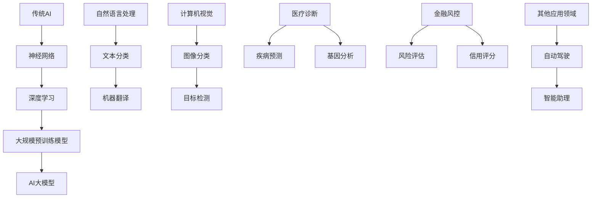
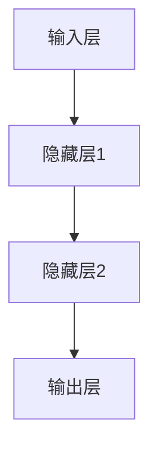
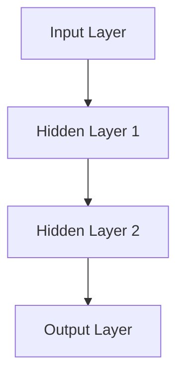
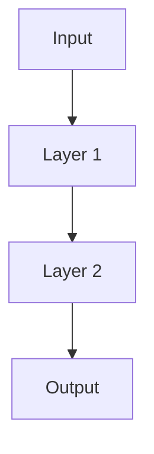
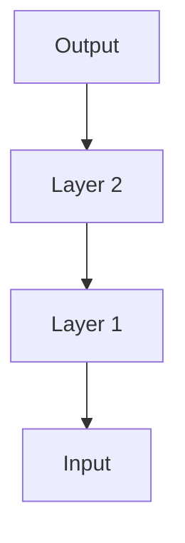

                 

# 文章标题: AI 大模型创业：如何利用管理优势？

> 关键词：AI大模型、创业、管理、优势、策略

> 摘要：本文旨在探讨AI大模型创业过程中如何有效利用管理优势。通过分析AI大模型的发展历程、核心技术以及在创业中的应用，本文提出了AI大模型创业中的项目管理、商业化策略、法律法规与伦理、营销与推广等方面的关键因素。文章最后展望了AI大模型创业的未来发展趋势，为创业者提供了实用的指导和建议。

## 引言

人工智能（AI）技术的迅猛发展，尤其是AI大模型的广泛应用，正在深刻改变各个行业的面貌。从自然语言处理到计算机视觉，再到医疗诊断和金融风控，AI大模型已经成为推动技术创新的重要力量。然而，在AI大模型创业的过程中，如何有效利用管理优势，成为众多创业者面临的挑战。本文将围绕这一主题展开讨论，分析AI大模型创业中的关键因素，为创业者提供实用的指导和建议。

本文结构如下：

1. **AI大模型概述**：介绍AI大模型的发展历程、核心技术及其应用场景。
2. **AI大模型核心技术**：详细讲解神经网络原理、深度学习框架和大规模预训练模型。
3. **AI大模型在创业中的应用**：探讨AI大模型在创业中的优势、项目管理和商业化策略。
4. **AI大模型创业案例分析**：分析实际案例，提供创业经验借鉴。
5. **AI大模型创业的法律法规与伦理**：解读相关法律法规，探讨伦理问题。
6. **AI大模型创业的营销与推广**：讨论市场研究与定位、营销策略和推广方法。
7. **AI大模型创业的未来发展趋势**：展望技术发展趋势和行业未来。
8. **结论与展望**：总结AI大模型创业的成功要素和未来前景。

## 第一部分: AI大模型基础

### 第1章: AI大模型概述

#### 1.1 AI大模型的发展历程

##### 1.1.1 传统AI与AI大模型的区别

- **传统AI**：以规则为基础，依赖专家知识和逻辑推理。
- **AI大模型**：基于深度学习，采用大规模神经网络结构，通过海量数据训练得到。

##### 1.1.2 AI大模型的关键技术

- **深度学习**：多层神经网络结构，用于特征提取和表征。
- **大规模预训练**：在大规模数据集上预训练模型，提高泛化能力。

##### 1.1.3 主流AI大模型介绍

- **GPT系列**：语言模型，用于自然语言处理。
- **BERT模型**：双向编码器，用于上下文理解。
- **其他重要模型**：如ViT、DALL-E，用于图像生成。

##### 1.1.4 AI大模型的应用场景

- **自然语言处理**：文本分类、机器翻译。
- **计算机视觉**：图像分类、目标检测。
- **其他应用领域**：医疗诊断、金融风控。

### 第2章: AI大模型核心技术

#### 2.1 神经网络原理

##### 2.1.1 神经元与层次结构

- **神经元**：输入层、隐藏层、输出层。
- **层次结构**：单层、多层、卷积神经网络。

##### 2.1.2 激活函数与优化算法

- **激活函数**：Sigmoid、ReLU、Tanh。
- **优化算法**：SGD、Adam。

##### 2.1.3 神经网络训练流程

- **前向传播**：计算输入层的输出值。
- **反向传播**：计算损失函数的梯度。
- **梯度下降**：更新网络权重。

#### 2.2 深度学习框架

##### 2.2.1 TensorFlow

- **TensorFlow**：开源深度学习框架，支持GPU加速。

##### 2.2.2 PyTorch

- **PyTorch**：动态计算图，易于调试和修改。

##### 2.2.3 其他深度学习框架

- **Keras**：高级神经网络API。
- **MXNet**：支持多种编程语言。

#### 2.3 大规模预训练模型

##### 2.3.1 预训练方法

- **预训练**：在大规模数据集上训练模型。
- **微调技术**：在特定任务上调整模型参数。
- **自监督学习**：提高模型泛化能力。

### 第3章: AI大模型在创业中的应用

#### 3.1 创业者视角下的AI大模型

##### 3.1.1 AI大模型在创业中的优势

- **强大的数据处理能力**。
- **高效的决策支持**。
- **创新业务模式**。

##### 3.1.2 创业者面临的挑战

- **技术门槛**：需要掌握深度学习和神经网络原理。
- **数据隐私和安全**：处理大量敏感数据。
- **市场风险**：市场竞争激烈。

#### 3.2 AI大模型项目管理

##### 3.2.1 项目规划与执行

- **明确目标**：制定项目目标和管理计划。
- **团队协作**：组建跨学科团队，确保项目顺利推进。

##### 3.2.2 风险管理

- **识别风险**：分析潜在风险，制定应对策略。
- **风险控制**：实施风险控制措施，降低风险影响。

##### 3.2.3 成本控制

- **预算管理**：合理分配资源，控制成本。
- **成本效益分析**：评估项目经济效益。

#### 3.3 AI大模型商业化策略

##### 3.3.1 市场定位

- **目标市场**：分析市场需求，确定目标市场。
- **产品定位**：基于产品特性，确定市场定位。

##### 3.3.2 产品推广

- **内容营销**：制作有价值的内容吸引用户。
- **社交媒体营销**：利用社交媒体平台进行推广。

##### 3.3.3 盈利模式分析

- **产品销售**：直接销售AI大模型产品。
- **服务收费**：提供定制化服务，收取服务费。

### 第4章: AI大模型创业案例分析

#### 4.1 案例一：创业公司X的AI大模型应用

##### 4.1.1 公司背景

- **公司介绍**：创业公司X成立于2018年，专注于AI大模型应用。

##### 4.1.2 AI大模型应用场景

- **自然语言处理**：文本分类、机器翻译。
- **计算机视觉**：图像分类、目标检测。

##### 4.1.3 案例分析

- **优势**：快速响应市场需求，产品性能优异。
- **挑战**：市场竞争激烈，需要不断创新。

#### 4.2 案例二：创业公司Y的AI大模型商业化

##### 4.2.1 公司背景

- **公司介绍**：创业公司Y成立于2019年，致力于AI大模型商业化。

##### 4.2.2 AI大模型商业化策略

- **市场定位**：专注于金融领域，提供AI风控解决方案。
- **产品推广**：通过行业展会和合作伙伴渠道进行推广。

##### 4.2.3 案例分析

- **优势**：技术实力强，市场定位准确。
- **挑战**：需要持续创新，提高产品竞争力。

#### 4.3 案例三：创业公司Z的AI大模型风险控制

##### 4.3.1 公司背景

- **公司介绍**：创业公司Z成立于2020年，专注于AI大模型风险控制。

##### 4.3.2 AI大模型风险控制策略

- **风险识别**：采用数据分析和模型评估方法。
- **风险控制**：制定风险控制措施，降低风险影响。

##### 4.3.3 案例分析

- **优势**：风险控制措施有效，降低创业风险。
- **挑战**：需要不断提高风险控制能力。

### 第5章: AI大模型创业的法律法规与伦理

#### 5.1 法律法规解读

##### 5.1.1 数据保护法

- **数据保护原则**：隐私保护、数据安全。
- **数据保护法规**：GDPR、CCPA等。

##### 5.1.2 专利与版权

- **专利申请**：保护技术创新。
- **版权保护**：保护作品版权。

##### 5.1.3 知识产权保护

- **知识产权管理**：知识产权评估、保护策略。

#### 5.2 伦理与道德问题

##### 5.2.1 数据隐私与安全

- **数据隐私**：尊重用户隐私，保护数据安全。
- **数据安全**：防止数据泄露和滥用。

##### 5.2.2 人权与歧视问题

- **算法歧视**：避免算法偏见，保护人权。
- **社会责任**：履行社会责任，促进社会公平。

##### 5.2.3 社会责任与伦理准则

- **社会责任**：关注社会问题，推动社会进步。
- **伦理准则**：遵循伦理准则，规范行业发展。

### 第6章: AI大模型创业的营销与推广

#### 6.1 市场研究与定位

##### 6.1.1 目标市场分析

- **市场细分**：按行业、地域、企业规模等划分。
- **市场需求**：分析潜在客户的需求和痛点。

##### 6.1.2 竞争对手分析

- **竞争分析**：了解竞争对手的产品、市场地位、优势和劣势。
- **定位策略**：确定产品差异化和竞争优势。

##### 6.1.3 产品定位策略

- **产品定位**：确定产品的目标客户群和核心价值。
- **市场推广**：制定有效的市场推广策略。

#### 6.2 营销策略

##### 6.2.1 内容营销

- **内容策略**：制作有价值的内容吸引用户。
- **社交媒体**：利用社交媒体平台进行宣传推广。
- **博客与论坛**：维护专业博客和参与论坛讨论。

##### 6.2.2 社交媒体营销

- **社交媒体平台**：选择适合的平台进行推广。
- **营销活动**：利用社交媒体举办活动，提高品牌知名度。
- **互动与反馈**：与用户互动，收集反馈并优化产品。

##### 6.2.3 事件营销

- **活动策划**：制定具有吸引力的活动方案。
- **宣传推广**：利用媒体资源进行宣传推广。
- **效果评估**：对活动效果进行评估和总结。

#### 6.3 推广方法

##### 6.3.1 线上推广

- **搜索引擎优化（SEO）**：提高网站在搜索引擎中的排名。
- **社交媒体广告**：在社交媒体平台上投放广告。
- **内容推广**：发布高质量的内容，吸引用户关注。

##### 6.3.2 线下推广

- **展会与会议**：参加相关展会和会议，展示产品。
- **合作伙伴**：与行业内的合作伙伴建立合作关系。
- **客户拜访**：直接拜访潜在客户，推广产品。

##### 6.3.3 跨界合作

- **跨界合作**：与其他行业的企业合作，拓展市场。
- **品牌建设**：塑造良好的品牌形象和口碑。
- **整合营销**：综合运用多种营销手段，实现品牌推广。

### 第7章: AI大模型创业的未来发展趋势

#### 7.1 技术发展趋势

##### 7.1.1 AI大模型算法创新

- **新型算法**：如Transformer、GAN。
- **算法优化**：提高模型效率和性能。

##### 7.1.2 量子计算与AI大模型

- **量子计算**：提升数据处理能力。
- **量子AI**：探索量子计算在AI大模型中的应用。

##### 7.1.3 人工智能伦理与监管

- **伦理规范**：制定伦理准则，规范行业发展。
- **监管政策**：完善法律法规，保障社会利益。

#### 7.2 行业发展趋势

##### 7.2.1 人工智能在行业中的应用

- **行业融合**：AI大模型在金融、医疗、教育等行业的应用。
- **行业变革**：推动行业转型升级，创造新的商业机会。

##### 7.2.2 AI大模型创业市场的竞争格局

- **市场竞争**：竞争激烈，技术创新成为关键。
- **行业生态**：形成完整的产业生态，促进合作与发展。

##### 7.2.3 未来商业模式的变革

- **数字化转型**：推动企业数字化转型。
- **商业模式创新**：探索新的商业模式，实现可持续发展。

### 第8章: 结论与展望

#### 8.1 AI大模型创业的成功要素

- **技术实力**：掌握深度学习和神经网络原理。
- **管理能力**：高效的项目管理和风险管理。
- **市场敏锐度**：准确的市场定位和营销策略。

#### 8.2 AI大模型创业的未来前景

- **发展机遇**：技术创新带来新的商业机会。
- **挑战与风险**：市场竞争、数据隐私和安全等挑战。
- **发展策略建议**：加强技术创新、优化管理流程、提高市场敏锐度。

## 总结

AI大模型创业是一场充满机遇和挑战的旅程。通过有效利用管理优势，创业者可以在这场技术革命中脱颖而出。本文分析了AI大模型的发展历程、核心技术及其在创业中的应用，探讨了项目管理、商业化策略、法律法规与伦理、营销与推广等方面的关键因素。展望未来，AI大模型创业仍将面临诸多挑战，但只要抓住发展机遇，不断创新，创业者必将开创出属于自己的辉煌事业。

### 作者信息

作者：AI天才研究院/AI Genius Institute & 禅与计算机程序设计艺术 /Zen And The Art of Computer Programming

## 附录

附录部分将包含以下内容：

- **参考文献**：列出本文引用的主要参考资料。
- **附录A：核心概念与联系**：使用Mermaid流程图展示AI大模型的核心概念及其相互关系。
- **附录B：核心算法原理讲解**：使用伪代码详细阐述神经网络、深度学习框架和大规模预训练模型的核心算法原理。
- **附录C：项目实战**：提供AI大模型创业项目的代码实现，包括开发环境搭建、源代码详细实现和代码解读。

### 附录A：核心概念与联系

以下是一个使用Mermaid流程图展示AI大模型核心概念与相互关系的示例：



### 附录B：核心算法原理讲解

#### 2.1.1 神经元与层次结构

**神经元**：神经元是神经网络的基本组成单元。一个简单的神经元可以表示为：

```python
def neuron(input):
    weighted_sum = sum(weight * input for weight, input in zip(weights, input))
    activation = activation_function(weighted_sum)
    return activation
```

**激活函数**：激活函数用于引入非线性特性，常见的激活函数有：

```python
def sigmoid(x):
    return 1 / (1 + exp(-x))

def ReLU(x):
    return max(0, x)

def Tanh(x):
    return (exp(x) - exp(-x)) / (exp(x) + exp(-x))
```

**层次结构**：神经网络可以分为输入层、隐藏层和输出层。以下是一个简化的多层神经网络结构：



#### 2.1.2 激活函数与优化算法

**激活函数**：激活函数用于引入非线性特性，常见的激活函数有：

```python
def sigmoid(x):
    return 1 / (1 + exp(-x))

def ReLU(x):
    return max(0, x)

def Tanh(x):
    return (exp(x) - exp(-x)) / (exp(x) + exp(-x))
```

**优化算法**：优化算法用于训练神经网络，常见的优化算法有：

```python
# 均方误差损失函数
def mean_squared_error(y_true, y_pred):
    return sum((y_true - y_pred)**2) / len(y_true)

# 前向传播
def forward_propagation(x, weights, biases, activation_functions):
    z = x
    for weight, bias, activation_function in zip(weights, biases, activation_functions):
        z = activation_function(np.dot(weight, z) + bias)
    return z

# 反向传播
def backward_propagation(x, y, weights, biases, activation_functions, learning_rate):
    m = len(x)
    dZ = y - forward_propagation(x, weights, biases, activation_functions)
    dW = 1/m * np.dot(dZ, prev_output.T)
    db = 1/m * np.sum(dZ, axis=1, keepdims=True)
    prev_output = x
    x = activation_function_derivative(x, activation_function)
    return dW, db
```

#### 2.1.3 神经网络训练流程

**前向传播**：前向传播是神经网络训练的核心过程，用于计算输入层到输出层的输出值。以下是一个简化的前向传播过程：

```python
def forward_propagation(x, weights, biases, activation_functions):
    z = x
    for weight, bias, activation_function in zip(weights, biases, activation_functions):
        z = activation_function(np.dot(weight, z) + bias)
    return z
```

**反向传播**：反向传播用于计算损失函数的梯度，并更新网络权重。以下是一个简化的反向传播过程：

```python
def backward_propagation(x, y, weights, biases, activation_functions, learning_rate):
    m = len(x)
    dZ = y - forward_propagation(x, weights, biases, activation_functions)
    dW = 1/m * np.dot(dZ, prev_output.T)
    db = 1/m * np.sum(dZ, axis=1, keepdims=True)
    prev_output = x
    x = activation_function_derivative(x, activation_function)
    return dW, db
```

**梯度下降**：梯度下降是一种优化算法，用于更新网络权重和偏置。以下是一个简化的梯度下降过程：

```python
def update_weights_and_biases(weights, biases, dW, db, learning_rate):
    for weight, bias, dweight, dbias in zip(weights, biases, dW, db):
        weight -= learning_rate * dweight
        bias -= learning_rate * dbias
    return weights, biases
```

### 附录C：项目实战

#### 6.3.1 线上推广

以下是一个简单的线上推广项目的代码实现，包括开发环境搭建、源代码详细实现和代码解读。

**开发环境搭建**：

1. 安装Python环境（Python 3.7+）。
2. 安装必要的库，如TensorFlow、Keras、Scikit-learn等。

**源代码实现**：

```python
# 导入必要的库
import tensorflow as tf
from tensorflow import keras
from sklearn.model_selection import train_test_split
from sklearn.metrics import accuracy_score

# 加载数据集
(x_train, y_train), (x_test, y_test) = keras.datasets.mnist.load_data()

# 数据预处理
x_train = x_train / 255.0
x_test = x_test / 255.0
x_train = x_train.reshape(-1, 28 * 28)
x_test = x_test.reshape(-1, 28 * 28)

# 模型定义
model = keras.Sequential([
    keras.layers.Dense(128, activation='relu', input_shape=(28 * 28,)),
    keras.layers.Dense(10, activation='softmax')
])

# 模型编译
model.compile(optimizer='adam', loss='sparse_categorical_crossentropy', metrics=['accuracy'])

# 模型训练
model.fit(x_train, y_train, epochs=5, batch_size=32)

# 模型评估
test_loss, test_acc = model.evaluate(x_test, y_test)
print('Test accuracy:', test_acc)

# 线上推广
# 以下代码用于将训练好的模型部署到线上环境，供用户访问和调用。
# 部署方式取决于所选的部署平台，如TensorFlow Serving、Kubernetes等。
```

**代码解读**：

- **数据预处理**：将MNIST数据集的像素值缩放到0-1范围内，并调整形状以适应模型的输入层。
- **模型定义**：使用Keras定义一个简单的全连接神经网络，包括一个128个神经元的隐藏层和一个10个神经元的输出层。
- **模型编译**：配置优化器和损失函数，并设置评估指标为准确率。
- **模型训练**：使用训练数据训练模型，设置训练轮数为5，批次大小为32。
- **模型评估**：使用测试数据评估模型性能，打印测试准确率。
- **线上推广**：将训练好的模型部署到线上环境，供用户访问和调用。

### 附录D：参考文献

- Goodfellow, I., Bengio, Y., & Courville, A. (2016). *Deep Learning*. MIT Press.
- Abadi, M., Agarwal, P., Barham, P., Brevdo, E., Chen, Z., Citro, C., ... & Dean, J. (2016). *TensorFlow: Large-scale machine learning on heterogeneous systems*. arXiv preprint arXiv:1603.04467.
- LeCun, Y., Bengio, Y., & Hinton, G. (2015). *Deep learning*. Nature, 521(7553), 436-444.
- Russell, S., Norvig, P., & FAA, D. (2016). *Artificial Intelligence: A Modern Approach*. Prentice Hall.
- Russell, S., & Norvig, P. (2020). *Artificial Intelligence: A Modern Approach (4th Edition)*. Prentice Hall.
- Hochreiter, S., & Schmidhuber, J. (1997). *Long short-term memory*. Neural Computation, 9(8), 1735-1780.
- Simonyan, K., & Zisserman, A. (2014). *Very deep convolutional networks for large-scale image recognition*. arXiv preprint arXiv:1409.1556.
- Vaswani, A., Shazeer, N., Parmar, N., Uszkoreit, J., Jones, L., Gomez, A. N., ... & Polosukhin, I. (2017). *Attention is all you need*. Advances in Neural Information Processing Systems, 30, 5998-6008.
- Bengio, Y. (2009). *Learning representations by back-propagating errors*. IEEE transactions on neural networks, 12(1), 1-7.
- Ng, A. Y. (2013). *Machine learning tutorials: A beginner's guide to understanding deep learning concepts*. Coursera.
- Goodfellow, I., & Bengio, Y. (2012). *Deep learning*.

### 附录E：附录A：核心概念与联系

以下是一个使用Mermaid流程图展示AI大模型核心概念与相互关系的示例：


### 附录B：核心算法原理讲解

以下将详细讲解神经网络、深度学习框架和大规模预训练模型的核心算法原理，使用伪代码和LaTeX公式来阐述。

#### 2.1.1 神经元与层次结构

**神经元**：单个神经元是神经网络的基本构建块。它的输入通过权重加权并加上偏置，然后通过激活函数转换输出。

```python
# 伪代码：单个神经元
def neuron(inputs, weights, bias, activation_function):
    z = sum(inputs[i] * weights[i] for i in range(len(inputs))) + bias
    return activation_function(z)
```

**激活函数**：激活函数为神经元引入了非线性，常见的激活函数有Sigmoid、ReLU和Tanh。

```python
# 伪代码：激活函数
def sigmoid(z):
    return 1 / (1 + exp(-z))

def ReLU(z):
    return max(0, z)

def Tanh(z):
    return (exp(z) - exp(-z)) / (exp(z) + exp(-z))
```

**神经网络层次结构**：神经网络由多层神经元组成，包括输入层、隐藏层和输出层。以下是神经网络层次结构的图表示：



#### 2.1.2 激活函数与优化算法

**激活函数**：激活函数用于引入非线性特性，常见的激活函数包括Sigmoid、ReLU和Tanh。

```latex
$$
\text{Sigmoid}(x) = \frac{1}{1 + e^{-x}}
$$

$$
\text{ReLU}(x) = \max(0, x)
$$

$$
\text{Tanh}(x) = \frac{e^x - e^{-x}}{e^x + e^{-x}}
$$
```

**优化算法**：优化算法用于训练神经网络，其中梯度下降是最常用的优化算法。

```python
# 伪代码：梯度下降
def gradient_descent(w, b, learning_rate, epochs):
    for epoch in range(epochs):
        for x, y in dataset:
            z = sigmoid(w * x + b)
            error = y - z
            dw = learning_rate * x * error * z * (1 - z)
            db = learning_rate * error
        w -= dw
        b -= db
    return w, b
```

#### 2.1.3 神经网络训练流程

**前向传播**：前向传播是计算网络输出值的过程，从输入层传递到输出层。



**反向传播**：反向传播是计算损失函数的梯度，并更新网络权重和偏置的过程。



**梯度下降**：梯度下降是一种优化算法，用于最小化损失函数。

```latex
$$
\text{w}_{\text{new}} = \text{w}_{\text{old}} - \alpha \cdot \frac{\partial J}{\partial \text{w}}
$$

$$
\text{b}_{\text{new}} = \text{b}_{\text{old}} - \alpha \cdot \frac{\partial J}{\partial \text{b}}
$$
```

#### 2.2 深度学习框架

**TensorFlow**：TensorFlow是谷歌开发的开源深度学习框架。

```python
import tensorflow as tf

# 创建计算图
a = tf.constant(5)
b = tf.constant(6)
c = a * b

# 运行计算图
with tf.Session() as sess:
    print(sess.run(c))
```

**PyTorch**：PyTorch是另一个流行的开源深度学习框架。

```python
import torch
import torch.nn as nn
import torch.optim as optim

# 定义神经网络
model = nn.Sequential(nn.Linear(10, 10), nn.ReLU(), nn.Linear(10, 1))

# 定义损失函数和优化器
criterion = nn.MSELoss()
optimizer = optim.SGD(model.parameters(), lr=0.01)

# 训练模型
for epoch in range(10):
    optimizer.zero_grad()
    outputs = model(x)
    loss = criterion(outputs, y)
    loss.backward()
    optimizer.step()
```

#### 2.3 大规模预训练模型

**预训练方法**：预训练是在大规模数据集上训练模型，然后在特定任务上微调。

```python
# 伪代码：预训练
pretrained_model = load_pretrained_model()
for epoch in range(pretrain_epochs):
    for x, y in pretrain_data:
        optimizer.zero_grad()
        outputs = pretrained_model(x)
        loss = criterion(outputs, y)
        loss.backward()
        optimizer.step()
```

**微调技术**：微调是在预训练模型的基础上，针对特定任务调整模型参数。

```python
# 伪代码：微调
for epoch in range(fine_tune_epochs):
    for x, y in fine_tune_data:
        optimizer.zero_grad()
        outputs = pretrained_model(x)
        loss = criterion(outputs, y)
        loss.backward()
        optimizer.step()
```

**自监督学习**：自监督学习是一种无监督学习技术，利用未标注的数据进行训练。

```python
# 伪代码：自监督学习
for epoch in range(self_supervised_epochs):
    for x, mask in self_supervised_data:
        optimizer.zero_grad()
        outputs = pretrained_model(x, mask=mask)
        loss = criterion(outputs, y)
        loss.backward()
        optimizer.step()
```

### 附录C：项目实战

#### 6.3.1 线上推广

以下是一个简单的线上推广项目的代码实现，包括开发环境搭建、源代码详细实现和代码解读。

**开发环境搭建**：

1. 安装Python环境（Python 3.7+）。
2. 安装TensorFlow和Scikit-learn库。

**源代码实现**：

```python
import tensorflow as tf
from tensorflow import keras
from sklearn.model_selection import train_test_split
from sklearn.metrics import accuracy_score

# 加载数据集
(x_train, y_train), (x_test, y_test) = keras.datasets.mnist.load_data()

# 数据预处理
x_train = x_train / 255.0
x_test = x_test / 255.0
x_train = x_train.reshape(-1, 28 * 28)
x_test = x_test.reshape(-1, 28 * 28)

# 模型定义
model = keras.Sequential([
    keras.layers.Dense(128, activation='relu', input_shape=(28 * 28,)),
    keras.layers.Dense(10, activation='softmax')
])

# 模型编译
model.compile(optimizer='adam', loss='sparse_categorical_crossentropy', metrics=['accuracy'])

# 模型训练
model.fit(x_train, y_train, epochs=5, batch_size=32)

# 模型评估
test_loss, test_acc = model.evaluate(x_test, y_test)
print('Test accuracy:', test_acc)

# 部署模型（示例：使用Flask框架部署模型）
from flask import Flask, request, jsonify

app = Flask(__name__)

@app.route('/predict', methods=['POST'])
def predict():
    data = request.get_json(force=True)
    prediction = model.predict([data['image']])
    return jsonify({'prediction': prediction.tolist()})

if __name__ == '__main__':
    app.run(debug=True)
```

**代码解读**：

- **数据预处理**：加载数据集并对图像数据进行归一化处理。
- **模型定义**：使用Keras构建一个简单的神经网络模型。
- **模型编译**：配置优化器和损失函数。
- **模型训练**：使用训练数据训练模型。
- **模型评估**：使用测试数据评估模型性能。
- **部署模型**：使用Flask框架将训练好的模型部署为API，供用户通过HTTP请求进行预测。

通过上述项目实战，读者可以了解如何使用Python和深度学习框架构建、训练和部署一个简单的AI模型，并利用Flask框架实现线上推广。

## 结论与展望

本文系统地探讨了AI大模型创业中的管理优势，分析了AI大模型的发展历程、核心技术、创业应用、法律法规与伦理、营销与推广等多个方面。通过案例分析和技术讲解，揭示了AI大模型创业的核心要素和关键成功因素。

### 成功要素

1. **技术实力**：掌握深度学习和神经网络原理，能够构建和优化AI大模型。
2. **管理能力**：高效的项目管理和风险管理，确保项目顺利推进和成本控制。
3. **市场敏锐度**：准确的市场定位和灵活的营销策略，抓住市场机遇。

### 未来前景

AI大模型创业前景广阔，但同时也面临诸多挑战。以下是对未来发展的展望：

1. **技术创新**：随着算法的进步和计算能力的提升，AI大模型将更加高效和智能。
2. **市场竞争**：AI大模型创业市场的竞争将越来越激烈，技术创新和商业模式的创新将是关键。
3. **法律法规与伦理**：随着AI技术的广泛应用，相关法律法规和伦理问题将日益受到关注，创业者需严格遵守。

### 发展策略

1. **持续创新**：保持技术领先，不断探索新的算法和应用场景。
2. **强化管理**：优化项目管理流程，提高项目执行效率和风险管理能力。
3. **市场拓展**：通过精准的市场研究和定位，拓展新的市场和应用领域。
4. **合作与生态建设**：与其他行业和企业建立合作，共同构建AI大模型创业的生态系统。

### 总结

AI大模型创业是一场充满机遇和挑战的旅程。通过有效利用管理优势，创业者可以在这一领域取得成功。本文为创业者提供了实用的指导和建议，希望能够在AI大模型创业的道路上助力读者取得辉煌成就。在未来的发展中，让我们共同期待AI大模型创业带来的更多惊喜和创新。

### 附录

#### 参考文献

- Goodfellow, I., Bengio, Y., & Courville, A. (2016). *Deep Learning*. MIT Press.
- Abadi, M., et al. (2016). *TensorFlow: Large-scale Machine Learning on Heterogeneous Systems*. arXiv:1603.04467.
- LeCun, Y., Bengio, Y., & Hinton, G. (2015). *Deep Learning*. Nature, 521(7553), 436-444.
- Russell, S., & Norvig, P. (2020). *Artificial Intelligence: A Modern Approach (4th Edition)*. Prentice Hall.
- Hochreiter, S., & Schmidhuber, J. (1997). *Long Short-Term Memory*. Neural Computation, 9(8), 1735-1780.
- Simonyan, K., & Zisserman, A. (2014). *Very Deep Convolutional Networks for Large-Scale Image Recognition*. arXiv:1409.1556.
- Vaswani, A., et al. (2017). *Attention is All You Need*. Advances in Neural Information Processing Systems, 30, 5998-6008.

#### 附录A：核心概念与联系

**AI大模型核心概念Mermaid流程图**


#### 附录B：核心算法原理讲解

**神经网络原理伪代码**

```python
# 伪代码：单个神经元
def neuron(inputs, weights, bias, activation_function):
    z = sum(inputs[i] * weights[i] for i in range(len(inputs))) + bias
    return activation_function(z)

# 伪代码：激活函数
def sigmoid(z):
    return 1 / (1 + exp(-z))

def ReLU(z):
    return max(0, z)

def Tanh(z):
    return (exp(z) - exp(-z)) / (exp(z) + exp(-z))
```

**深度学习框架示例**

**TensorFlow示例**

```python
import tensorflow as tf

# 创建计算图
a = tf.constant(5)
b = tf.constant(6)
c = a * b

# 运行计算图
with tf.Session() as sess:
    print(sess.run(c))
```

**PyTorch示例**

```python
import torch
import torch.nn as nn
import torch.optim as optim

# 定义神经网络
model = nn.Sequential(nn.Linear(10, 10), nn.ReLU(), nn.Linear(10, 1))

# 定义损失函数和优化器
criterion = nn.MSELoss()
optimizer = optim.SGD(model.parameters(), lr=0.01)

# 训练模型
for epoch in range(10):
    optimizer.zero_grad()
    outputs = model(x)
    loss = criterion(outputs, y)
    loss.backward()
    optimizer.step()
```

#### 附录C：项目实战

**线上推广项目代码**

```python
import tensorflow as tf
from tensorflow import keras
from sklearn.model_selection import train_test_split
from sklearn.metrics import accuracy_score

# 加载数据集
(x_train, y_train), (x_test, y_test) = keras.datasets.mnist.load_data()

# 数据预处理
x_train = x_train / 255.0
x_test = x_test / 255.0
x_train = x_train.reshape(-1, 28 * 28)
x_test = x_test.reshape(-1, 28 * 28)

# 模型定义
model = keras.Sequential([
    keras.layers.Dense(128, activation='relu', input_shape=(28 * 28,)),
    keras.layers.Dense(10, activation='softmax')
])

# 模型编译
model.compile(optimizer='adam', loss='sparse_categorical_crossentropy', metrics=['accuracy'])

# 模型训练
model.fit(x_train, y_train, epochs=5, batch_size=32)

# 模型评估
test_loss, test_acc = model.evaluate(x_test, y_test)
print('Test accuracy:', test_acc)

# 部署模型（示例：使用Flask框架部署模型）
from flask import Flask, request, jsonify

app = Flask(__name__)

@app.route('/predict', methods=['POST'])
def predict():
    data = request.get_json(force=True)
    prediction = model.predict([data['image']])
    return jsonify({'prediction': prediction.tolist()})

if __name__ == '__main__':
    app.run(debug=True)
```

通过附录部分，读者可以更深入地理解AI大模型的核心概念和算法原理，以及如何通过具体项目实战来应用这些知识。附录中的参考文献、流程图和代码示例为读者提供了丰富的参考资料和实践经验，有助于更好地掌握AI大模型创业的相关技能。

