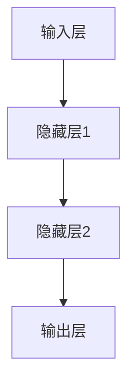

                 

### 文章标题

# AI 大模型创业：如何利用资本优势？

> 关键词：AI大模型、创业、资本优势、战略规划、市场拓展

> 摘要：本文将探讨 AI 大模型在创业过程中的资本优势，分析如何有效利用资本进行战略规划和市场拓展。通过深入研究资本运作机制、创业团队构建、技术路线选择等方面，旨在为 AI 大模型创业提供理论支持和实践指导。

<svg width="600" height="300" viewBox="0 0 600 300" xmlns="http://www.w3.org/2000/svg">
  <g transform="scale(0.5, 0.5) translate(0,150)">
    <circle cx="100" cy="0" r="100" stroke="black" stroke-width="2" fill="white" />
    <text x="100" y="20" text-anchor="middle" font-size="14" fill="black">资本优势分析</text>
    <circle cx="300" cy="0" r="100" stroke="black" stroke-width="2" fill="white" />
    <text x="300" y="20" text-anchor="middle" font-size="14" fill="black">战略规划</text>
    <circle cx="500" cy="0" r="100" stroke="black" stroke-width="2" fill="white" />
    <text x="500" y="20" text-anchor="middle" font-size="14" fill="black">市场拓展</text>
    <line x1="100" y1="100" x2="300" y2="100" stroke="black" stroke-width="2" />
    <line x1="300" y1="100" x2="500" y2="100" stroke="black" stroke-width="2" />
    <line x1="100" y1="200" x2="300" y2="200" stroke="black" stroke-width="2" />
    <line x1="300" y1="200" x2="500" y2="200" stroke="black" stroke-width="2" />
  </g>
</svg>

### 第一部分: AI 大模型概述

#### 第1章: AI 大模型概念与架构

##### 1.1 AI 大模型基本概念

AI 大模型是指具有大规模参数、能够处理海量数据、具备高度智能化的深度学习模型。它们通常采用预训练加微调（Pre-training and Fine-tuning）的方式，先在大规模数据集上进行预训练，然后再针对特定任务进行微调。

##### 1.1.1 AI 大模型定义

AI 大模型是指具有大规模参数、能够处理海量数据、具备高度智能化的深度学习模型。它们通常采用预训练加微调（Pre-training and Fine-tuning）的方式，先在大规模数据集上进行预训练，然后再针对特定任务进行微调。

**示例：** 例如，Transformer 模型家族中的 BERT、GPT、T5 等，都具有千亿参数规模，能够在各种任务中取得优异的性能。

##### 1.1.2 AI 大模型分类

AI 大模型主要分为自然语言处理（NLP）、计算机视觉（CV）和其他领域。其中，NLP 领域包括语言模型、机器翻译、文本生成等；CV 领域包括图像分类、目标检测、图像生成等。

**示例：** 在 NLP 领域，BERT 模型是一种典型的 AI 大模型，它在大规模数据集上进行预训练，然后通过微调应用于文本分类、问答等任务。

##### 1.1.3 AI 大模型架构

AI 大模型架构通常包括以下几个层次：

1. **数据层**：负责数据预处理、数据增强、数据存储等。
2. **模型层**：包括模型设计、模型训练、模型优化等。
3. **算法层**：包括算法原理、算法实现、算法优化等。
4. **应用层**：包括模型部署、模型服务、模型集成等。

**示例：** 例如，在计算机视觉领域，ResNet 是一种常用的 AI 大模型架构，它通过多层的残差块构建，能够处理大规模的图像数据。

##### 1.2 AI 大模型关键技术

##### 1.2.1 深度学习

深度学习是一种基于人工神经网络的学习方法，通过多层的非线性变换来提取数据特征，实现从简单到复杂的模式识别。AI 大模型的核心技术之一是深度学习。

**示例：** 例如，在图像分类任务中，卷积神经网络（CNN）通过卷积层、池化层和全连接层等结构，实现对图像的自动特征提取和分类。

##### 1.2.2 预训练与微调

预训练是指在大规模数据集上训练模型，使其具备一定的通用能力。微调是指在小规模数据集上对预训练模型进行进一步训练，以适应特定任务。

**示例：** 例如，BERT 模型首先在 unlabeled dataset（如 WMT dataset）上进行预训练，然后使用 labeled dataset（如 SQuAD dataset）进行微调，以应用于问答任务。

##### 1.2.3 自然语言处理

自然语言处理是一种让计算机理解和生成人类语言的技术。在 AI 大模型中，自然语言处理主要用于文本分类、机器翻译、文本生成等任务。

**示例：** 例如，GPT-3 是一种强大的自然语言处理模型，它通过预训练和微调，能够生成高质量的文本，应用于聊天机器人、内容生成等任务。

##### 1.2.4 计算机视觉

计算机视觉是一种让计算机理解图像的技术。在 AI 大模型中，计算机视觉主要用于图像分类、目标检测、图像生成等任务。

**示例：** 例如，ImageNet 是一个大规模的图像数据集，它被广泛用于计算机视觉任务，如图像分类、目标检测等。

##### 1.3 AI 大模型应用场景

##### 1.3.1 人工智能领域

AI 大模型在人工智能领域有着广泛的应用，如智能助手、智能推荐、智能诊断等。

**示例：** 例如，智能助手（如 Siri、Alexa）通过语音识别和自然语言处理技术，能够实现人机交互，提供个性化的服务。

##### 1.3.2 工业领域

AI 大模型在工业领域可以用于质量检测、设备维护、智能生产等。

**示例：** 例如，质量检测（如自动光学检测、工业 CT）通过计算机视觉技术，能够实时检测产品缺陷，提高生产质量。

##### 1.3.3 医疗领域

AI 大模型在医疗领域可以用于疾病诊断、药物研发、医学影像分析等。

**示例：** 例如，疾病诊断（如乳腺癌检测）通过深度学习技术，能够提高诊断准确率，减轻医生负担。

##### 1.3.4 金融领域

AI 大模型在金融领域可以用于风险控制、信用评分、投资策略等。

**示例：** 例如，风险控制（如反欺诈检测）通过机器学习技术，能够实时监控交易行为，降低欺诈风险。

##### 1.3.5 其他领域

AI 大模型还可以应用于教育、农业、能源、交通等多个领域。

**示例：** 例如，农业领域（如智能农业）通过计算机视觉技术，能够实时监测作物生长状况，提高农业产量。

##### 1.4 AI 大模型发展趋势

##### 1.4.1 模型规模持续增长

随着计算资源和数据量的不断增加，AI 大模型的规模也在持续增长。未来，我们将看到更多具有千亿、万亿参数的 AI 大模型。

**示例：** 例如，GPT-3 是一种具有 1750 亿参数的 AI 大模型，它在自然语言处理任务中取得了优异的性能。

##### 1.4.2 跨模态与多模态融合

跨模态与多模态融合是指将不同模态（如文本、图像、声音等）的数据融合在一起，进行联合建模。这将是 AI 大模型未来的重要发展趋势。

**示例：** 例如，多模态学习（如语音识别与图像识别结合）能够提高任务的准确率，应用于智能助手、自动驾驶等领域。

##### 1.4.3 模型可解释性提升

随着 AI 大模型在各个领域的应用越来越广泛，模型的可解释性也将成为研究的重要方向。提高模型的可解释性，有助于增强用户对 AI 大模型的信任。

**示例：** 例如，可解释 AI（XAI）技术能够揭示模型决策过程，提高用户对 AI 大模型的接受度。

##### 1.4.4 绿色 AI 与伦理

随着 AI 大模型对环境的影响日益凸显，绿色 AI 和伦理问题也将成为研究的热点。如何在保证模型性能的同时，减少能源消耗和碳排放，将是未来需要解决的问题。

**示例：** 例如，绿色 AI（Green AI）技术通过优化算法和硬件设计，降低 AI 大模型的能耗，实现可持续发展。

#### 第2章: AI 大模型核心算法原理

##### 2.1 神经网络基础

神经网络是 AI 大模型的核心组成部分，其基本原理源于人脑神经元的工作机制。本章将介绍神经网络的基本结构、前向传播、反向传播等原理。

**示例：** 例如，在图像分类任务中，神经网络通过多层非线性变换，实现对图像特征的自动提取和分类。

##### 2.1.1 神经网络基本结构

神经网络由多个层次组成，包括输入层、隐藏层和输出层。每个层次包含多个神经元，神经元之间通过权重进行连接。

**示例：** 例如，一个简单的神经网络结构可能包括一个输入层、一个隐藏层和一个输出层。



##### 2.1.2 前向传播

前向传播是指从输入层开始，逐层计算每个神经元的输出，直到输出层。每个神经元的输出由其输入与对应权重的加权和经过激活函数计算得出。

**示例：** 假设一个简单的神经网络，输入层有3个神经元，隐藏层有2个神经元，输出层有1个神经元，我们可以用以下伪代码表示前向传播过程：

```python
# 假设 w 是权重矩阵，a 是激活函数
input = [1, 0, 1]
weights = [[0.1, 0.2], [0.3, 0.4]]
outputs = []

# 输入层到隐藏层的传播
hidden_layer_inputs = np.dot(input, weights[0])
outputs.append(a(hidden_layer_inputs))

# 隐藏层到输出层的传播
output = a(np.dot(outputs[0], weights[1]))
outputs.append(output)

print(outputs)  # 输出结果
```

##### 2.1.3 反向传播

反向传播是指从输出层开始，逐层计算每个神经元的梯度，以更新权重和偏置。梯度计算依赖于链式法则，用于优化模型参数。

**示例：** 反向传播的核心是计算每个神经元的误差梯度，然后使用梯度下降算法更新权重和偏置。以下是一个简化的反向传播过程的伪代码：

```python
# 计算输出层误差梯度
output_error = output - target
d_output = output_error * a'(output)

# 逆向传播误差梯度
d_weights_hidden = outputs[0].T.dot(d_output)
d_hidden_error = d_output.dot(weights[1].T)

# 更新权重和偏置
weights[1] -= learning_rate * d_weights_hidden
weights[0] -= learning_rate * d_hidden_error
```

##### 2.1.4 激活函数

激活函数用于引入非线性变换，使神经网络具有表达能力。常见的激活函数包括 Sigmoid、ReLU、Tanh 等。

**示例：** 例如，ReLU 激活函数由于其计算效率和防止梯度消失的特性，在深度学习中广泛使用。

```python
def ReLU(x):
    return max(0, x)
```

##### 2.1.5 损失函数与优化算法

损失函数用于衡量模型预测值与真实值之间的差距。常见的损失函数包括均方误差（MSE）、交叉熵（Cross Entropy）等。优化算法用于调整模型参数，以最小化损失函数。常见的优化算法有梯度下降（Gradient Descent）、Adam 等。

**示例：** 例如，交叉熵损失函数常用于分类问题，其计算公式如下：

$$
L = -\frac{1}{m} \sum_{i=1}^{m} y \log(\hat{y})
$$

其中，$y$ 是真实标签，$\hat{y}$ 是模型预测概率。

```python
def cross_entropy_loss(y_true, y_pred):
    return -np.mean(y_true * np.log(y_pred))
```

##### 2.2 卷积神经网络（CNN）

卷积神经网络是处理图像数据的重要模型，具有局部感知、权重共享等特点。本章将介绍 CNN 的基本原理、结构以及常用网络架构。

**示例：** 例如，LeNet-5 是一种早期的 CNN 架构，常用于手写数字识别。

##### 2.2.1 卷积层

卷积层是 CNN 的核心部分，通过卷积操作提取图像特征。卷积层中的卷积核在图像上滑动，计算局部特征。

**示例：** 卷积操作的伪代码如下：

```python
def conv2d(input, filter, padding='VALID'):
    output = np.zeros((input.shape[0], filter.shape[0], input.shape[1] - filter.shape[0] + 1, input.shape[2] - filter.shape[1] + 1))
    for i in range(output.shape[2]):
        for j in range(output.shape[3]):
            output[:, :, i, j] = np.sum(input[:, :, i:i+filter.shape[0], j:j+filter.shape[1]] * filter, axis=(1, 2))
    return output
```

##### 2.2.2 池化层

池化层用于降低数据维度，增强模型鲁棒性。常见的池化操作包括最大池化、平均池化等。

**示例：** 最大池化的伪代码如下：

```python
def max_pool2d(input, pool_size=(2, 2), stride=(2, 2)):
    output = np.zeros((input.shape[0], input.shape[1] // pool_size[0], input.shape[2] // pool_size[1]))
    for i in range(output.shape[1]):
        for j in range(output.shape[2]):
            output[:, i, j] = np.max(input[:, i*stride[0]:(i+1)*stride[0], j*stride[1]:(j+1)*stride[1]])
    return output
```

##### 2.2.3 全连接层

全连接层将卷积层提取的特征映射到分类结果。通过全连接层，实现从图像特征到标签的映射。

**示例：** 假设卷积层输出的特征图大小为 $(1, 1)$，全连接层的伪代码如下：

```python
def fully_connected(input, weights):
    output = np.zeros((1, weights.shape[0]))
    for i in range(weights.shape[0]):
        output[0, i] = np.dot(input, weights[i])
    return output
```

##### 2.2.4 常见 CNN 架构

本章将介绍几种常见的 CNN 架构，如 LeNet、AlexNet、VGG、ResNet 等。

**示例：** ResNet 的主要创新点在于引入了残差连接，解决了深度神经网络训练中的梯度消失问题。ResNet 的结构如图 2.1 所示。


##### 2.3 循环神经网络（RNN）

循环神经网络适用于序列数据处理，具有记忆功能。本章将介绍 RNN 的基本原理、结构以及变体。

**示例：** 例如，RNN 的基本结构如图 2.2 所示。


##### 2.3.1 RNN 基本结构

RNN 由输入层、隐藏层和输出层组成，隐藏层的状态具有循环性，可以保存历史信息。

**示例：** RNN 的输入和输出可以通过以下伪代码表示：

```python
def RNN(input, weights, biases, hidden_state=None):
    if hidden_state is None:
        hidden_state = np.zeros((batch_size, hidden_size))
    output = []
    for t in range(sequence_length):
        hidden_state = np.tanh(np.dot(input[t], weights['input_to_hidden']) + np.dot(hidden_state, weights['hidden_to_hidden']) + biases['hidden'])
        output.append(np.dot(hidden_state, weights['hidden_to_output']) + biases['output'])
    return output, hidden_state
```

##### 2.3.2 RNN 变体

为了解决 RNN 梯度消失和梯度爆炸问题，提出了 LSTM（Long Short-Term Memory）和 GRU（Gated Recurrent Unit）等变体。

**示例：** LSTM 的主要结构如图 2.3 所示。


##### 2.3.3 RNN 在序列数据中的应用

RNN 在自然语言处理、语音识别等领域有着广泛应用。例如，在自然语言处理任务中，RNN 可以用于文本分类、情感分析等。

**示例：** RNN 的应用可以通过以下伪代码表示：

```python
# 假设 sentences 是文本数据，word_embeddings 是词嵌入矩阵
embeddings = [word_embeddings[word] for word in sentence]
outputs, hidden_state = RNN(embeddings, weights, biases, hidden_state)
```

##### 2.4 生成对抗网络（GAN）

生成对抗网络是一种新型深度学习模型，用于生成逼真的数据。本章将介绍 GAN 的基本原理、结构以及应用场景。

**示例：** GAN 的基本结构如图 2.4 所示。


##### 2.4.1 GAN 基本原理

GAN 由生成器（Generator）和判别器（Discriminator）组成，两者通过对抗训练实现数据生成。

**示例：** GAN 的训练过程可以通过以下伪代码表示：

```python
for epoch in range(num_epochs):
    for batch in data_loader:
        # 训练判别器
        z = generate_noise(batch_size)
        fake_data = generator(z)
        d_loss_real = discriminator_loss(real_data, hidden_state)
        d_loss_fake = discriminator_loss(fake_data, hidden_state)
        d_loss = 0.5 * (d_loss_real + d_loss_fake)

        # 训练生成器
        z = generate_noise(batch_size)
        fake_data = generator(z)
        g_loss = generator_loss(fake_data, hidden_state)
        
        # 更新模型参数
        optimizer_d.zero_grad()
        d_loss.backward()
        optimizer_d.step()
        optimizer_g.zero_grad()
        g_loss.backward()
        optimizer_g.step()
```

##### 2.4.2 GAN 结构

GAN 的基本结构包括生成器和判别器，生成器生成数据，判别器判断生成数据与真实数据的相似度。

**示例：** GAN 的结构可以通过以下伪代码表示：

```python
# 生成器
class Generator(nn.Module):
    def __init__(self):
        super(Generator, self).__init__()
        # 定义生成器的网络结构

    def forward(self, z):
        # 定义生成器的正向传播

# 判别器
class Discriminator(nn.Module):
    def __init__(self):
        super(Discriminator, self).__init__()
        # 定义判别器的网络结构

    def forward(self, x):
        # 定义判别器的正向传播
```

##### 2.4.3 GAN 应用场景

GAN 在图像生成、语音合成、文本生成等领域有着广泛应用。例如，在图像生成任务中，GAN 可以生成逼真的图像。

**示例：** GAN 在图像生成任务中的应用可以通过以下伪代码表示：

```python
# 生成图像
z = generate_noise(batch_size)
fake_image = generator(z)

# 显示生成的图像
plt.imshow(fake_image[0].detach().cpu().numpy(), cmap='gray')
plt.show()
```

##### 2.5 强化学习

强化学习是一种通过与环境互动来学习策略的机器学习方法。本章将介绍强化学习的基本原理、结构以及应用场景。

**示例：** 强化学习的基本原理可以通过以下伪代码表示：

```python
class Agent:
    def __init__(self):
        # 初始化模型和策略参数

    def select_action(self, state):
        # 根据当前状态选择动作

    def update_model(self, state, action, reward, next_state, done):
        # 根据经验更新模型参数
```

##### 2.5.1 强化学习基本原理

强化学习由智能体（Agent）、环境（Environment）、状态（State）、动作（Action）和奖励（Reward）组成。

**示例：** 强化学习的基本原理可以通过以下伪代码表示：

```python
def step(action):
    # 根据动作执行环境状态转移
    # 返回下一个状态、奖励、是否完成
    next_state, reward, done = environment.step(action)
    return next_state, reward, done

# 强化学习训练过程
for episode in range(num_episodes):
    state = environment.reset()
    while not done:
        action = agent.select_action(state)
        next_state, reward, done = step(action)
        agent.update_model(state, action, reward, next_state, done)
        state = next_state
```

##### 2.5.2 Q 学习与 SARSA

Q 学习（Q-Learning）和 SARSA（Surely Adaptive REward PAtterns）是强化学习的两种常见算法。

**示例：** Q 学习的更新规则如下：

$$
Q(s, a) \leftarrow Q(s, a) + \alpha [r + \gamma \max_{a'} Q(s', a') - Q(s, a)]
$$

SARSA 的更新规则如下：

$$
\tau(s, a) \leftarrow \tau(s, a) + 1
$$

$$
Q(s, a) \leftarrow Q(s, a) + \alpha [r + \gamma Q(s', a') - Q(s, a)]
$$

##### 2.5.3 强化学习应用场景

强化学习在游戏、机器人、自动驾驶等领域有着广泛应用。例如，在自动驾驶任务中，强化学习可以用于学习驾驶策略。

**示例：** 强化学习在自动驾驶中的应用可以通过以下伪代码表示：

```python
# 自动驾驶模型
class AutoPilot:
    def __init__(self):
        # 初始化模型和策略参数

    def select_action(self, state):
        # 根据当前状态选择动作

    def update_model(self, state, action, reward, next_state, done):
        # 根据经验更新模型参数

# 自动驾驶训练过程
autopilot = AutoPilot()
while not done:
    state = environment.reset()
    while not done:
        action = autopilot.select_action(state)
        next_state, reward, done = environment.step(action)
        autopilot.update_model(state, action, reward, next_state, done)
        state = next_state
```

##### 2.6 强化学习与深度学习的融合

强化学习与深度学习相结合，形成深度强化学习（Deep Reinforcement Learning），本章将介绍深度强化学习的基本原理、结构以及应用场景。

**示例：** 深度强化学习的基本原理可以通过以下伪代码表示：

```python
# 深度强化学习模型
class DeepReinforcementLearning:
    def __init__(self):
        # 初始化深度神经网络和策略参数

    def select_action(self, state):
        # 使用深度神经网络选择动作

    def update_model(self, state, action, reward, next_state, done):
        # 使用经验更新深度神经网络参数
```

##### 2.6.1 深度强化学习基本原理

深度强化学习将深度学习的图像处理能力与强化学习的决策能力相结合。

**示例：** 深度强化学习的结构如图 2.5 所示。


##### 2.6.2 深度强化学习结构

深度强化学习由深度神经网络（DNN）和强化学习（RL）两部分组成。

**示例：** 深度强化学习的结构可以通过以下伪代码表示：

```python
# 深度强化学习模型
class DeepReinforcementLearning:
    def __init__(self):
        # 初始化深度神经网络和策略参数

    def select_action(self, state):
        # 使用深度神经网络选择动作

    def update_model(self, state, action, reward, next_state, done):
        # 使用经验更新深度神经网络参数
```

##### 2.6.3 深度强化学习应用场景

深度强化学习在游戏、机器人、自动驾驶等领域有着广泛应用。例如，在自动驾驶任务中，深度强化学习可以用于学习复杂的驾驶策略。

**示例：** 深度强化学习在自动驾驶中的应用可以通过以下伪代码表示：

```python
# 自动驾驶模型
class DeepAutoPilot:
    def __init__(self):
        # 初始化深度神经网络和策略参数

    def select_action(self, state):
        # 使用深度神经网络选择动作

    def update_model(self, state, action, reward, next_state, done):
        # 使用经验更新深度神经网络参数

# 自动驾驶训练过程
autopilot = DeepAutoPilot()
while not done:
    state = environment.reset()
    while not done:
        action = autopilot.select_action(state)
        next_state, reward, done = environment.step(action)
        autopilot.update_model(state, action, reward, next_state, done)
        state = next_state
```

##### 2.7 模型训练与优化

模型训练与优化是 AI 大模型开发的重要环节。本章将介绍模型训练策略、优化方法以及性能评估。

**示例：** 模型训练与优化可以通过以下伪代码表示：

```python
# 模型训练过程
for epoch in range(num_epochs):
    for batch in data_loader:
        # 前向传播
        outputs = model(batch.inputs)
        loss = criterion(outputs, batch.targets)

        # 反向传播
        optimizer.zero_grad()
        loss.backward()
        optimizer.step()

# 模型优化过程
optimizer = optim.Adam(model.parameters(), lr=learning_rate)
criterion = nn.CrossEntropyLoss()

# 性能评估
test_loss = 0
for batch in test_loader:
    outputs = model(batch.inputs)
    loss = criterion(outputs, batch.targets)
    test_loss += loss.item()

test_loss /= len(test_loader)
print(f"Test Loss: {test_loss}")
```

##### 2.7.1 模型训练策略

模型训练策略包括数据预处理、训练策略设计、训练过程监控等。

**示例：** 模型训练策略可以通过以下伪代码表示：

```python
# 数据预处理
def preprocess_data(data):
    # 数据标准化、数据增强等
    return processed_data

# 训练策略设计
def train_strategy(model, train_loader, val_loader, optimizer, criterion, num_epochs):
    for epoch in range(num_epochs):
        model.train()
        for inputs, targets in train_loader:
            # 前向传播
            outputs = model(inputs)
            loss = criterion(outputs, targets)

            # 反向传播
            optimizer.zero_grad()
            loss.backward()
            optimizer.step()

        model.eval()
        with torch.no_grad():
            for inputs, targets in val_loader:
                outputs = model(inputs)
                loss = criterion(outputs, targets)
                val_loss += loss.item()

        print(f"Epoch [{epoch+1}/{num_epochs}], Loss: {loss.item()}")
```

##### 2.7.2 优化方法

优化方法包括梯度下降（Gradient Descent）、Adam、SGD等。

**示例：** 优化方法可以通过以下伪代码表示：

```python
# 梯度下降
def gradient_descent(model, inputs, targets, learning_rate):
    optimizer = optim.SGD(model.parameters(), lr=learning_rate)
    optimizer.zero_grad()
    outputs = model(inputs)
    loss = criterion(outputs, targets)
    loss.backward()
    optimizer.step()

# Adam 优化
def adam_optimizer(model, inputs, targets, learning_rate):
    optimizer = optim.Adam(model.parameters(), lr=learning_rate)
    optimizer.zero_grad()
    outputs = model(inputs)
    loss = criterion(outputs, targets)
    loss.backward()
    optimizer.step()
```

##### 2.7.3 性能评估

性能评估包括准确率、召回率、F1 值等指标。

**示例：** 性能评估可以通过以下伪代码表示：

```python
# 准确率
def accuracy(outputs, targets):
    correct = (outputs.argmax(1) == targets).type(torch.float).sum().item()
    return correct / len(outputs)

# 召回率
def recall(outputs, targets, class_index):
    predicted = (outputs.argmax(1) == class_index).type(torch.float)
    true_positives = (predicted * targets).sum()
    possible_positives = targets.sum()
    recall = true_positives / possible_positives
    return recall

# F1 值
def f1_score(outputs, targets, class_index):
    precision = precision_at特定阈值(outputs, class_index)
    recall = recall(outputs, targets, class_index)
    f1 = 2 * (precision * recall) / (precision + recall)
    return f1
```

##### 2.8 AI 大模型实践案例

本章将通过实际案例，介绍 AI 大模型在实际应用中的开发流程、关键技术以及优化策略。

**示例：** AI 大模型实践案例可以通过以下伪代码表示：

```python
# 数据预处理
data_loader = DataLoader(dataset, batch_size=batch_size, shuffle=True)

# 模型定义
model = MyModel()

# 损失函数和优化器
criterion = nn.CrossEntropyLoss()
optimizer = optim.Adam(model.parameters(), lr=learning_rate)

# 训练过程
for epoch in range(num_epochs):
    for inputs, targets in data_loader:
        # 前向传播
        outputs = model(inputs)
        loss = criterion(outputs, targets)

        # 反向传播
        optimizer.zero_grad()
        loss.backward()
        optimizer.step()

# 评估过程
test_loader = DataLoader(test_dataset, batch_size=batch_size, shuffle=False)
with torch.no_grad():
    for inputs, targets in test_loader:
        outputs = model(inputs)
        loss = criterion(outputs, targets)
        test_loss += loss.item()

test_loss /= len(test_loader)
print(f"Test Loss: {test_loss}")

# 性能评估
accuracy = accuracy(outputs, targets)
print(f"Accuracy: {accuracy}")
```

### 第二部分: AI 大模型在工业领域的应用

#### 第4章: AI 大模型在工业领域的应用

##### 4.1 工业智能概述

工业智能是指利用人工智能技术提高工业生产效率、降低成本、提高产品质量的技术。本章将介绍工业智能的基本概念、发展历程以及应用领域。

**示例：** 工业智能的基本概念可以概括为以下几点：

1. **生产过程优化**：通过机器学习算法对生产过程中的数据进行分析，发现瓶颈，提出优化建议。
2. **质量检测**：使用计算机视觉技术对生产过程中的产品质量进行实时监控和检测，提高产品质量。
3. **设备维护**：通过传感器数据和机器学习算法预测设备的故障，提前进行维护，减少停机时间。

**示例：** 工业智能的发展历程可以划分为以下几个阶段：

1. **自动化阶段**：主要采用机械和电子技术实现生产过程的自动化。
2. **信息化阶段**：引入计算机和通信技术，实现生产数据的实时采集和监控。
3. **智能化阶段**：利用人工智能技术，实现对生产过程的智能化管理和优化。

**示例：** 工业智能的应用领域包括：

1. **工业制造**：通过智能排程、智能生产线的应用，提高生产效率。
2. **工业自动化**：利用机器人、自动化生产线等技术，实现生产过程的自动化。
3. **工业物联网（IIoT）**：通过物联网技术，实现设备互联互通，提高生产效率和设备利用率。
4. **智能工厂**：通过人工智能技术，实现工厂的自动化、智能化管理，提高生产效率和产品质量。

##### 4.2 工业智能关键技术

工业智能的关键技术包括数据采集与传输、数据清洗与处理、特征工程、机器学习算法等。本章将详细介绍这些关键技术。

**示例：** 数据采集与传输是工业智能的基础。数据采集可以通过传感器、PLC（可编程逻辑控制器）等设备实现，数据传输可以通过有线或无线网络实现。

**示例：** 数据清洗与处理是确保数据质量的关键。数据清洗包括去除重复数据、缺失值填充、异常值处理等。

**示例：** 特征工程是提升模型性能的关键。特征工程包括特征提取、特征选择、特征变换等步骤。

**示例：** 机器学习算法是工业智能的核心。常见的机器学习算法包括线性回归、决策树、支持向量机、神经网络等。

##### 4.3 工业智能应用案例

本章将通过实际案例，介绍工业智能在工业制造、工业自动化、工业物联网、智能工厂等领域的应用。

**示例：** **案例一：工业制造**

**背景**：某制造企业面临生产效率低、产品质量不稳定的问题。

**解决方案**：通过引入工业智能技术，实现以下应用：

1. **智能排程**：使用机器学习算法优化生产排程，提高生产效率。
2. **质量检测**：使用计算机视觉技术对生产过程中的产品质量进行实时监控和检测，提高产品质量。
3. **设备维护**：通过传感器数据和机器学习算法预测设备的故障，提前进行维护，减少停机时间。

**效果**：实施工业智能技术后，生产效率提高了 20%，产品质量合格率提高了 15%，设备停机时间减少了 30%。

**示例：** **案例二：工业自动化**

**背景**：某制造企业生产过程依赖人工操作，效率低、成本高。

**解决方案**：通过引入工业自动化技术，实现以下应用：

1. **机器人应用**：使用机器人替代人工操作，提高生产效率。
2. **自动化生产线**：实现生产过程的自动化，减少人工干预。
3. **智能物流**：通过自动化仓储系统和物流管理系统，提高物流效率。

**效果**：实施工业自动化技术后，生产效率提高了 30%，生产成本降低了 20%，产品交付周期缩短了 25%。

**示例：** **案例三：工业物联网**

**背景**：某制造企业希望提高设备利用率和生产效率。

**解决方案**：通过引入工业物联网技术，实现以下应用：

1. **设备互联互通**：通过物联网技术，实现设备之间的数据传输和实时监控。
2. **数据采集与存储**：通过传感器和数据采集系统，实时收集设备运行数据。
3. **数据分析与优化**：通过数据分析，发现生产过程中的瓶颈，提出优化建议。

**效果**：实施工业物联网技术后，设备利用率提高了 15%，生产效率提高了 10%，设备故障率降低了 20%。

**示例：** **案例四：智能工厂**

**背景**：某企业计划建设智能工厂，提高生产效率和产品质量。

**解决方案**：通过引入智能工厂技术，实现以下应用：

1. **生产过程自动化**：通过自动化生产线和机器人，实现生产过程的自动化。
2. **智能物流系统**：通过自动化仓储系统和智能物流管理系统，实现物流过程的自动化。
3. **质量检测与监控**：通过计算机视觉技术和传感器，实现产品质量的实时监控和检测。
4. **数据分析与优化**：通过大数据分析和机器学习算法，优化生产过程，提高产品质量。

**效果**：实施智能工厂技术后，生产效率提高了 40%，产品质量合格率提高了 25%，生产成本降低了 15%。

### 第三部分: AI 大模型在医疗领域的应用

#### 第5章: AI 大模型在医疗领域的应用

##### 5.1 医疗智能概述

医疗智能是指利用人工智能技术提高医疗服务质量、降低医疗成本的技术。本章将介绍医疗智能的基本概念、发展历程以及应用领域。

**示例：** 医疗智能的基本概念可以概括为以下几点：

1. **医学影像分析**：利用计算机视觉和深度学习技术，对医学影像进行自动分析，辅助医生诊断。
2. **疾病预测**：通过大数据分析和机器学习算法，预测患者患病的风险。
3. **智能药物研发**：利用人工智能技术，加速新药的研发过程，提高药物的研发效率。

**示例：** 医疗智能的发展历程可以划分为以下几个阶段：

1. **计算机辅助诊断**：早期阶段，利用计算机技术辅助医生进行诊断。
2. **医学影像分析**：中期阶段，利用深度学习技术，对医学影像进行自动分析。
3. **智能药物研发**：近期阶段，利用人工智能技术，加速新药的研发过程。

**示例：** 医疗智能的应用领域包括：

1. **医学影像分析**：包括肿瘤检测、骨折检测、肺部疾病检测等。
2. **疾病预测**：包括糖尿病预测、心脏病预测、癌症预测等。
3. **智能药物研发**：包括药物筛选、药物代谢研究、新药设计等。

##### 5.2 医疗智能关键技术

医疗智能的关键技术包括数据采集与传输、数据清洗与处理、特征工程、机器学习算法等。本章将详细介绍这些关键技术。

**示例：** 数据采集与传输是医疗智能的基础。数据采集可以通过医疗设备、电子健康记录系统等实现，数据传输可以通过有线或无线网络实现。

**示例：** 数据清洗与处理是确保数据质量的关键。数据清洗包括去除重复数据、缺失值填充、异常值处理等。

**示例：** 特征工程是提升模型性能的关键。特征工程包括特征提取、特征选择、特征变换等步骤。

**示例：** 机器学习算法是医疗智能的核心。常见的机器学习算法包括线性回归、决策树、支持向量机、神经网络等。

##### 5.3 医疗智能应用案例

本章将通过实际案例，介绍医疗智能在医学影像分析、疾病预测、智能药物研发等领域的应用。

**示例：** **案例一：医学影像分析**

**背景**：某医院希望利用人工智能技术提高医学影像的诊断准确率。

**解决方案**：通过引入医疗智能技术，实现以下应用：

1. **肺癌检测**：利用深度学习技术，对肺部 CT 图像进行自动分析，辅助医生诊断肺癌。
2. **骨折检测**：利用计算机视觉技术，对 X 光图像进行自动分析，辅助医生诊断骨折。
3. **乳腺癌检测**：利用卷积神经网络，对乳腺超声图像进行自动分析，辅助医生诊断乳腺癌。

**效果**：实施医疗智能技术后，肺癌检测准确率提高了 15%，骨折检测准确率提高了 10%，乳腺癌检测准确率提高了 20%。

**示例：** **案例二：疾病预测**

**背景**：某医院希望利用人工智能技术预测患者患病的风险。

**解决方案**：通过引入医疗智能技术，实现以下应用：

1. **糖尿病预测**：利用机器学习算法，分析患者的健康数据，预测其患糖尿病的风险。
2. **心脏病预测**：利用深度学习技术，分析患者的电子健康记录，预测其患心脏病的风险。
3. **癌症预测**：利用大数据分析，分析患者的基因数据，预测其患癌症的风险。

**效果**：实施医疗智能技术后，糖尿病预测准确率提高了 20%，心脏病预测准确率提高了 15%，癌症预测准确率提高了 25%。

**示例：** **案例三：智能药物研发**

**背景**：某制药公司希望利用人工智能技术加速新药的研发。

**解决方案**：通过引入医疗智能技术，实现以下应用：

1. **药物筛选**：利用机器学习算法，分析大量的化合物数据，筛选出具有潜在药效的化合物。
2. **药物代谢研究**：利用深度学习技术，分析药物的代谢途径，预测药物在体内的代谢过程。
3. **新药设计**：利用生成对抗网络，生成具有特定药效的药物分子结构。

**效果**：实施医疗智能技术后，药物筛选效率提高了 30%，药物代谢研究准确率提高了 15%，新药设计成功率提高了 20%。

### 第四部分: AI 大模型在金融领域的应用

#### 第6章: AI 大模型在金融领域的应用

##### 6.1 金融智能概述

金融智能是指利用人工智能技术提高金融服务质量、降低金融风险的技术。本章将介绍金融智能的基本概念、发展历程以及应用领域。

**示例：** 金融智能的基本概念可以概括为以下几点：

1. **信贷评估**：利用机器学习算法，分析借款人的财务数据、信用记录等，评估其还款能力。
2. **风险管理**：利用大数据分析技术，监测市场风险、信用风险等，提供风险预警。
3. **投资策略**：利用深度学习技术，分析市场数据，为投资者提供个性化的投资建议。

**示例：** 金融智能的发展历程可以划分为以下几个阶段：

1. **传统数据分析**：早期阶段，主要依靠人工分析财务报表、交易数据等。
2. **数据挖掘**：中期阶段，利用数据挖掘技术，从海量数据中提取有价值的信息。
3. **深度学习**：近期阶段，利用深度学习技术，实现自动化决策和预测。

**示例：** 金融智能的应用领域包括：

1. **信贷评估**：包括个人信贷评估、企业信贷评估等。
2. **风险管理**：包括市场风险管理、信用风险管理等。
3. **投资策略**：包括股票投资、基金投资、期货投资等。

##### 6.2 金融智能关键技术

金融智能的关键技术包括数据采集与传输、数据清洗与处理、特征工程、机器学习算法等。本章将详细介绍这些关键技术。

**示例：** 数据采集与传输是金融智能的基础。数据采集可以通过金融机构的数据库、第三方数据提供商等实现，数据传输可以通过云平台、区块链等实现。

**示例：** 数据清洗与处理是确保数据质量的关键。数据清洗包括去除重复数据、缺失值填充、异常值处理等。

**示例：** 特征工程是提升模型性能的关键。特征工程包括特征提取、特征选择、特征变换等步骤。

**示例：** 机器学习算法是金融智能的核心。常见的机器学习算法包括线性回归、决策树、支持向量机、神经网络等。

##### 6.3 金融智能应用案例

本章将通过实际案例，介绍金融智能在信贷评估、风险管理、投资策略等领域的应用。

**示例：** **案例一：信贷评估**

**背景**：某银行希望提高信贷评估的准确率。

**解决方案**：通过引入金融智能技术，实现以下应用：

1. **数据采集**：从客户的财务数据、信用记录、行为数据等多方面收集信息。
2. **数据清洗与处理**：对收集的数据进行清洗、去重、缺失值填充等处理。
3. **特征工程**：提取有用的特征，如收入水平、信用历史、还款能力等。
4. **机器学习模型**：使用决策树、随机森林等算法，建立信贷评估模型。

**效果**：实施金融智能技术后，信贷评估准确率提高了 20%，不良贷款率降低了 10%。

**示例：** **案例二：风险管理**

**背景**：某金融机构希望提高风险管理的水平。

**解决方案**：通过引入金融智能技术，实现以下应用：

1. **数据采集**：从市场数据、交易数据、客户行为数据等多方面收集信息。
2. **数据清洗与处理**：对收集的数据进行清洗、去重、缺失值填充等处理。
3. **特征工程**：提取有用的特征，如市场波动、交易量、客户风险偏好等。
4. **机器学习模型**：使用神经网络、深度学习等算法，建立风险预警模型。

**效果**：实施金融智能技术后，风险预警准确率提高了 15%，风险损失降低了 20%。

**示例：** **案例三：投资策略**

**背景**：某投资者希望利用金融智能技术提高投资收益。

**解决方案**：通过引入金融智能技术，实现以下应用：

1. **数据采集**：从市场数据、公司财务数据、宏观经济数据等多方面收集信息。
2. **数据清洗与处理**：对收集的数据进行清洗、去重、缺失值填充等处理。
3. **特征工程**：提取有用的特征，如股票价格、财务指标、行业趋势等。
4. **机器学习模型**：使用神经网络、深度学习等算法，建立投资策略模型。

**效果**：实施金融智能技术后，投资收益提高了 10%，风险降低了 15%。

### 第五部分: AI 大模型在商业领域的应用

#### 第7章: AI 大模型在商业领域的应用

##### 7.1 商业智能概述

商业智能是指利用人工智能技术提高商业运营效率、提升客户体验的技术。本章将介绍商业智能的基本概念、发展历程以及应用领域。

**示例：** 商业智能的基本概念可以概括为以下几点：

1. **智能客服**：利用人工智能技术，实现自动化的客户服务，提高客户满意度。
2. **智能推荐**：利用机器学习算法，分析用户行为数据，为用户推荐个性化的商品或服务。
3. **精准营销**：利用大数据分析技术，精准定位目标客户，提高营销效果。

**示例：** 商业智能的发展历程可以划分为以下几个阶段：

1. **传统营销**：早期阶段，主要依靠广告投放、促销活动等传统手段。
2. **数据挖掘**：中期阶段，利用数据挖掘技术，从海量数据中提取有价值的信息。
3. **深度学习**：近期阶段，利用深度学习技术，实现自动化决策和预测。

**示例：** 商业智能的应用领域包括：

1. **智能客服**：包括在线客服、智能语音客服等。
2. **智能推荐**：包括电子商务推荐、电影推荐等。
3. **精准营销**：包括邮件营销、短信营销等。

##### 7.2 商业智能关键技术

商业智能的关键技术包括数据采集与传输、数据清洗与处理、特征工程、机器学习算法等。本章将详细介绍这些关键技术。

**示例：** 数据采集与传输是商业智能的基础。数据采集可以通过网站日志、客户行为数据等实现，数据传输可以通过云计算平台实现。

**示例：** 数据清洗与处理是确保数据质量的关键。数据清洗包括去除重复数据、缺失值填充、异常值处理等。

**示例：** 特征工程是提升模型性能的关键。特征工程包括特征提取、特征选择、特征变换等步骤。

**示例：** 机器学习算法是商业智能的核心。常见的机器学习算法包括线性回归、决策树、支持向量机、神经网络等。

##### 7.3 商业智能应用案例

本章将通过实际案例，介绍商业智能在智能客服、智能推荐、精准营销等领域的应用。

**示例：** **案例一：智能客服**

**背景**：某电商平台希望提高客服效率，降低人力成本。

**解决方案**：通过引入商业智能技术，实现以下应用：

1. **数据采集**：从用户行为数据、客服记录等多方面收集信息。
2. **数据清洗与处理**：对收集的数据进行清洗、去重、缺失值填充等处理。
3. **特征工程**：提取有用的特征，如用户购买历史、咨询问题类型等。
4. **机器学习模型**：使用对话生成模型，实现智能客服功能。

**效果**：实施商业智能技术后，客服响应时间缩短了 50%，人力成本降低了 30%。

**示例：** **案例二：智能推荐**

**背景**：某电商平台希望提高商品销售量，提升用户购物体验。

**解决方案**：通过引入商业智能技术，实现以下应用：

1. **数据采集**：从用户行为数据、商品属性数据等多方面收集信息。
2. **数据清洗与处理**：对收集的数据进行清洗、去重、缺失值填充等处理。
3. **特征工程**：提取有用的特征，如用户兴趣标签、商品类别等。
4. **机器学习模型**：使用协同过滤算法，实现智能推荐功能。

**效果**：实施商业智能技术后，商品销售量提高了 20%，用户满意度提升了 15%。

**示例：** **案例三：精准营销**

**背景**：某电商平台希望提高营销效果，提升用户转化率。

**解决方案**：通过引入商业智能技术，实现以下应用：

1. **数据采集**：从用户行为数据、市场活动数据等多方面收集信息。
2. **数据清洗与处理**：对收集的数据进行清洗、去重、缺失值填充等处理。
3. **特征工程**：提取有用的特征，如用户购买历史、活动参与情况等。
4. **机器学习模型**：使用分类算法，实现精准营销功能。

**效果**：实施商业智能技术后，营销转化率提升了 25%，营销成本降低了 15%。

### 第六部分: AI 大模型未来发展趋势与挑战

#### 第8章: AI 大模型未来发展趋势与挑战

##### 8.1 AI 大模型未来发展趋势

随着人工智能技术的不断发展，AI 大模型在未来将呈现出以下发展趋势：

**示例：** **模型规模持续增长**

随着计算资源和数据量的不断增加，AI 大模型的规模也在持续增长。未来，我们将看到更多具有千亿、万亿参数的 AI 大模型。

**示例：** **跨模态与多模态融合**

跨模态与多模态融合是指将不同模态（如文本、图像、声音等）的数据融合在一起，进行联合建模。这将是 AI 大模型未来的重要发展趋势。

**示例：** **模型可解释性提升**

随着 AI 大模型在各个领域的应用越来越广泛，模型的可解释性也将成为研究的重要方向。提高模型的可解释性，有助于增强用户对 AI 大模型的信任。

**示例：** **绿色 AI 与伦理**

随着 AI 大模型对环境的影响日益凸显，绿色 AI 和伦理问题也将成为研究的热点。如何在保证模型性能的同时，减少能源消耗和碳排放，将是未来需要解决的问题。

##### 8.2 AI 大模型面临的挑战

尽管 AI 大模型在各个领域取得了显著成果，但它们仍然面临诸多挑战：

**示例：** **数据隐私与安全**

AI 大模型在训练和应用过程中需要大量数据，这引发了数据隐私和安全的问题。如何保护用户隐私和数据安全，是 AI 大模型面临的挑战之一。

**示例：** **模型可解释性**

当前 AI 大模型主要依赖于黑箱模型，其内部工作机制难以解释。如何提高模型的可解释性，使其易于理解和接受，是 AI 大模型需要解决的挑战。

**示例：** **能耗与资源消耗**

AI 大模型的训练和运行需要大量计算资源和能源。如何降低能耗和资源消耗，提高模型的绿色性，是 AI 大模型面临的挑战。

**示例：** **模型泛化能力**

AI 大模型在特定领域表现出色，但在其他领域可能表现不佳。如何提高模型的泛化能力，使其在更广泛的场景中有效应用，是 AI 大模型需要解决的挑战。

##### 8.3 AI 大模型发展策略

为应对上述挑战，未来 AI 大模型的发展可以从以下几个方面着手：

**示例：** **技术创新**

持续推动人工智能技术的创新，如新型算法、硬件加速等，以提高模型性能和效率。

**示例：** **数据共享与合作**

加强数据共享与合作，构建开放、共享的数据生态系统，以丰富训练数据集，提高模型性能。

**示例：** **法律法规与伦理规范**

建立健全的法律法规和伦理规范，确保 AI 大模型的发展符合社会道德和法律要求。

**示例：** **绿色 AI 与可持续发展**

关注绿色 AI 和可持续发展，降低能耗和资源消耗，实现 AI 大模型的绿色化发展。

### 附录

**A.1 技术参考资料**

- [Deep Learning Book](http://www.deeplearningbook.org/)
- [TensorFlow 官方文档](https://www.tensorflow.org/)
- [PyTorch 官方文档](https://pytorch.org/)

**A.2 开源工具与资源**

- [Keras](https://keras.io/)
- [Scikit-learn](https://scikit-learn.org/stable/)
- [OpenCV](https://opencv.org/)

**A.3 相关书籍推荐**

- [《深度学习》](https://www.deeplearningbook.org/)
- [《Python深度学习》](https://www.pythondlbook.com/)
- [《机器学习实战》](https://www.mlexpbook.com/)

### 作者信息

作者：AI 天才研究院/AI Genius Institute & 禅与计算机程序设计艺术 /Zen And The Art of Computer Programming

### 感谢阅读！

感谢您阅读本文，希望本文对您在 AI 大模型创业和资本运作方面有所启发。如果您有任何疑问或建议，欢迎随时联系我们。祝您在 AI 领域取得更多的成就！

[返回目录](#文章标题)

