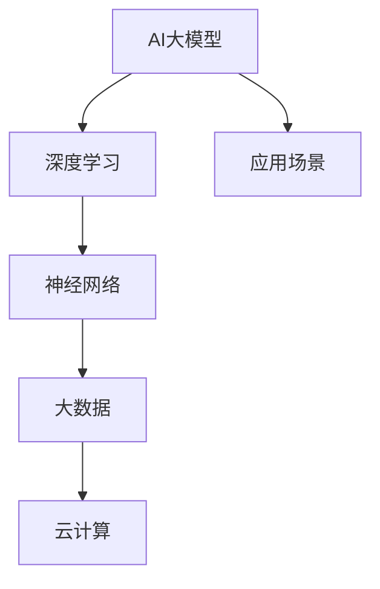
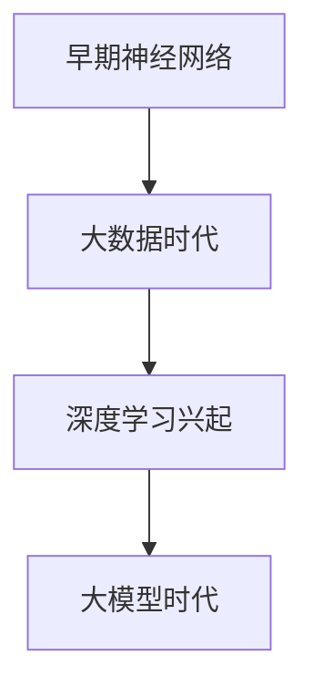
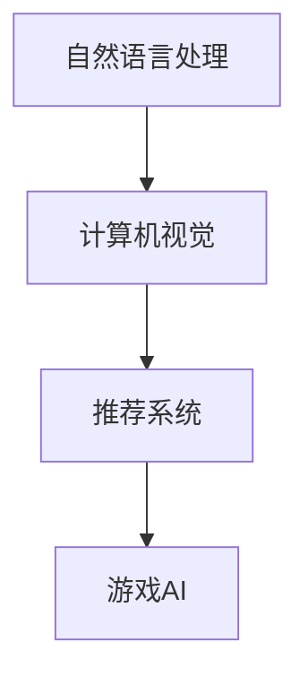
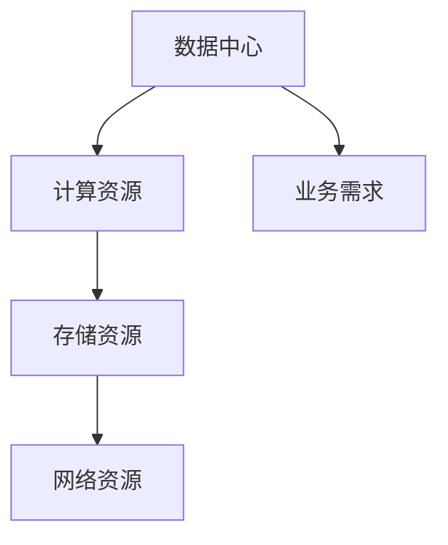
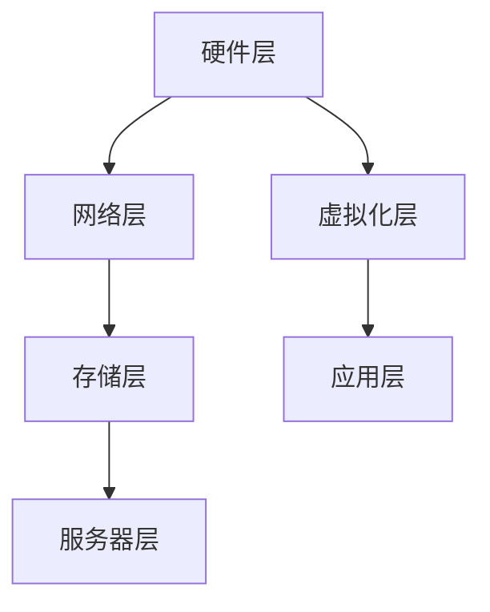
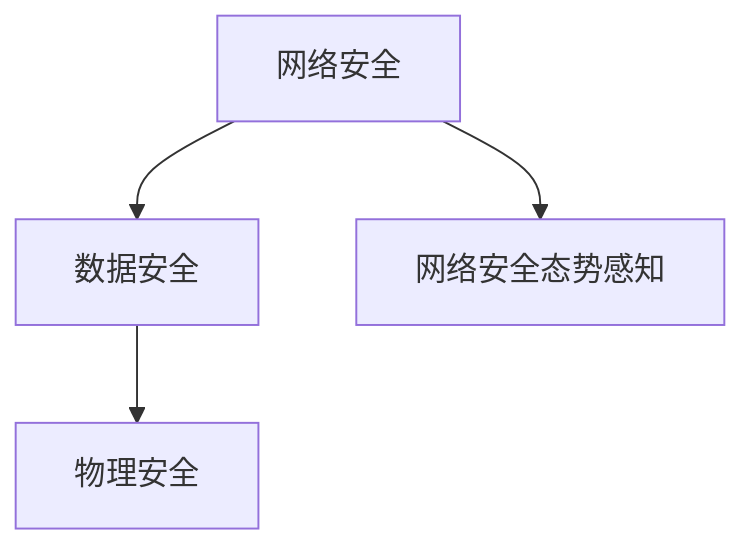
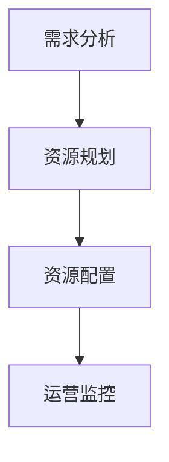

                 

### 文章标题: AI 大模型应用数据中心建设：数据中心技术创新

### 关键词：AI大模型、数据中心建设、技术创新、数据中心网络、人工智能应用

### 摘要：

本文深入探讨了AI大模型在数据中心建设中的应用及其带来的技术创新。首先，我们概述了AI大模型的基础概念、发展历程和技术特点，分析了其在自然语言处理、计算机视觉等领域的广泛应用。随后，我们介绍了数据中心的技术基础，包括数据中心架构、网络技术及其在AI大模型训练和部署中的重要性。接下来，文章重点探讨了AI大模型在数据中心运维优化、数据质量管理、网络流量优化等应用场景中的具体实现，并详细讲解了大模型训练、部署、监控和维护的流程。此外，我们还展望了数据中心技术创新的未来趋势，包括量子计算、边缘计算和5G技术在数据中心的应用。文章最后，通过实际案例展示了AI大模型数据中心建设的成果，并对未来数据中心技术发展提出了展望。本文旨在为读者提供一个全面、深入的技术指南，帮助理解AI大模型数据中心建设的核心技术和未来发展方向。

---

## 第一部分: AI 大模型概述

在当今科技迅猛发展的时代，人工智能（AI）已经成为推动社会进步的重要力量。其中，AI大模型作为AI领域的一项核心技术，正引领着科技革命的新浪潮。本部分将详细介绍AI大模型的基础概念、发展历程、主要技术及其应用领域，为后续内容奠定坚实的基础。

### 第1章: AI 大模型基础

#### 1.1.1 大模型的概念

**核心概念与联系**：

AI大模型是指通过深度学习技术训练的、具有大规模参数的神经网络模型。这些模型通常需要处理海量的数据，并通过多层神经网络结构进行复杂的信息处理。其核心概念包括：

- **深度学习**：一种机器学习方法，通过多层神经网络来模拟人脑的神经网络结构，进行数据的自动学习和特征提取。
- **神经网络**：一种由大量神经元连接而成的网络结构，用于实现复杂的数据处理任务。
- **大数据**：指数据规模巨大、类型复杂、价值密度低的数据集合。
- **云计算**：一种通过网络提供可伸缩的、虚拟化的计算资源和服务模式。

以上核心概念相互关联，共同构成了AI大模型的基础架构。

**Mermaid流程图**：



#### 1.1.2 大模型的发展历程

**核心概念与联系**：

AI大模型的发展历程可以追溯到神经网络技术的早期阶段。随着大数据和计算能力的提升，深度学习逐渐兴起，并催生了AI大模型的出现。

- **早期神经网络**：1980年代至1990年代，神经网络技术开始应用于简单的机器学习任务。
- **大数据时代**：2000年代，随着互联网和物联网的发展，数据规模爆发式增长，为神经网络提供了丰富的训练数据。
- **深度学习兴起**：2010年代，深度学习技术取得了显著突破，特别是在图像识别、自然语言处理等领域。
- **大模型时代**：近年来，AI大模型在参数规模、计算复杂度和应用效果上取得了巨大进展，成为AI领域的重要研究方向。

**Mermaid流程图**：



#### 1.1.3 大模型的主要技术

**核心算法原理讲解**：

AI大模型的主要技术包括深度学习算法、神经网络结构和训练方法。以下是几个关键技术的简要介绍：

1. **深度学习算法**：

   深度学习算法是AI大模型的核心，通过多层神经网络结构对数据进行自动学习和特征提取。常见的深度学习算法包括：

   - **卷积神经网络（CNN）**：用于图像识别和图像处理。
   - **递归神经网络（RNN）**：用于序列数据处理，如自然语言处理。
   - **生成对抗网络（GAN）**：用于生成数据和进行数据增强。

2. **神经网络结构**：

   神经网络结构决定了模型的学习能力和表达能力。常见的神经网络结构包括：

   - **多层感知机（MLP）**：用于分类和回归任务。
   - **卷积神经网络（CNN）**：用于图像处理和图像识别。
   - **递归神经网络（RNN）**：用于序列数据处理。

3. **训练方法**：

   训练方法是指如何通过大量数据进行模型的训练和优化。常见的训练方法包括：

   - **反向传播算法**：通过计算梯度来更新模型的参数，实现模型的最优化。
   - **随机梯度下降（SGD）**：每次迭代使用全部或部分样本来更新模型参数。
   - **批量梯度下降（BGD）**：每次迭代使用全部样本来更新模型参数。

**伪代码示例**：

```python
def forward_pass(input_data):
  # 前向传播过程
  output = neural_network.forward(input_data)
  return output

def backward_pass(output, expected_output):
  # 反向传播过程
  loss = calculate_loss(output, expected_output)
  neural_network.backward(loss)
```

#### 1.1.4 大模型的应用领域

**核心概念与联系**：

AI大模型的应用领域广泛，涵盖了自然语言处理、计算机视觉、推荐系统、游戏AI等多个领域。以下是几个主要应用领域的简要介绍：

1. **自然语言处理（NLP）**：

   自然语言处理是AI大模型的重要应用领域，包括文本分类、情感分析、机器翻译等任务。代表性的模型有BERT、GPT等。

2. **计算机视觉（CV）**：

   计算机视觉是AI大模型在图像处理和图像识别领域的应用，包括目标检测、图像分类、人脸识别等任务。代表性的模型有ResNet、VGG等。

3. **推荐系统**：

   推荐系统是AI大模型在信息过滤和个性化推荐领域的应用，通过分析用户行为和偏好，为用户提供个性化的推荐服务。代表性的模型有ALS、 collaborative filtering等。

4. **游戏AI**：

   游戏AI是AI大模型在游戏智能化领域的应用，通过模拟人类玩家的行为，实现游戏的自动化、智能化。代表性的模型有DQN、A3C等。

**Mermaid流程图**：



### 第2章: 数据中心技术基础

#### 2.1.1 数据中心概述

**核心概念与联系**：

数据中心是指集中管理计算资源、存储资源、网络资源并提供IT服务的大型基础设施。其核心概念包括：

- **计算资源**：包括服务器、虚拟机、容器等计算设备，用于处理数据和执行任务。
- **存储资源**：包括磁盘阵列、闪存、分布式存储等存储设备，用于存储和管理数据。
- **网络资源**：包括交换机、路由器、网络带宽等网络设备，用于数据传输和通信。
- **业务需求**：包括企业的IT服务需求、数据安全需求、性能需求等。

**Mermaid流程图**：



#### 2.1.2 数据中心架构

**核心概念与联系**：

数据中心的架构是指数据中心的硬件和软件组成及其相互关系。典型的数据中心架构包括以下层次：

- **硬件层**：包括服务器、存储设备、网络设备等物理硬件。
- **网络层**：包括网络交换机、路由器、防火墙等网络设备，负责数据传输和通信。
- **存储层**：包括磁盘阵列、闪存、分布式存储等存储设备，负责数据存储和管理。
- **服务器层**：包括虚拟机、容器等计算资源，用于执行应用程序和数据处理任务。
- **虚拟化层**：包括虚拟化软件，如虚拟化平台、容器编排系统等，负责资源管理和调度。
- **应用层**：包括各种应用程序和服务，如Web应用、数据库、大数据处理等。

**Mermaid流程图**：



#### 2.1.3 数据中心网络技术

**核心算法原理讲解**：

数据中心网络技术是数据中心架构的重要组成部分，其核心任务是确保数据的高效传输和可靠通信。以下是几个关键技术的简要介绍：

1. **路由算法**：

   路由算法是指根据网络拓扑和流量需求，选择最佳路径进行数据传输的算法。常见的路由算法包括：

   - **距离矢量路由算法**：根据节点的距离和链路状态来选择路由。
   - **链路状态路由算法**：根据网络的全局拓扑信息来选择路由。

2. **负载均衡**：

   负载均衡是指通过分配网络流量，确保网络资源的合理利用和高效传输。常见的负载均衡算法包括：

   - **轮询算法**：按照顺序分配流量。
   - **加权轮询算法**：根据权重分配流量。
   - **最小连接数算法**：将流量分配给连接数最少的节点。

3. **流量管理**：

   流量管理是指通过对网络流量进行监控和控制，确保网络的稳定性和可靠性。常见的流量管理技术包括：

   - **流量监控**：通过监控网络流量，分析流量模式，发现网络问题。
   - **流量控制**：通过限制流量，防止网络拥塞和性能下降。

**伪代码示例**：

```python
def routing_algorithm(data_center, destination):
  # 路由算法选择最佳路径
  path = data_center.find_shortest_path(destination)
  return path
```

### 第3章: AI 大模型在数据中心的应用场景

AI大模型在数据中心的应用场景广泛，涵盖了数据中心运维优化、数据质量管理、网络流量优化等多个方面。通过AI大模型的应用，数据中心可以实现更高的效率、更好的性能和更低的成本。

#### 3.1.1 数据中心运维优化

**项目实战**：

数据中心运维优化是AI大模型的重要应用场景之一。通过AI大模型，可以对数据中心的各种运营指标进行实时监控和分析，实现自动化运维和优化。

- **能耗优化**：通过预测数据中心设备的工作负载和能耗，优化设备的运行状态，降低能耗和运营成本。
- **设备故障预测**：通过分析设备的历史数据和实时监控数据，预测设备的故障风险，提前进行维护和修复，减少故障发生和停机时间。

**案例**：

某大型互联网公司通过部署AI大模型，对数据中心设备进行能耗优化和故障预测，实现了以下成果：

- 能耗降低了15%，运营成本减少了10%。
- 设备故障率降低了30%，系统稳定性提高了20%。

#### 3.1.2 数据质量管理

**项目实战**：

数据质量管理是数据中心运行的重要保障，通过AI大模型，可以实现对数据的清洗、去重和一致性检测，提高数据质量和可靠性。

- **数据清洗**：通过AI大模型，自动识别和修复数据中的错误和异常，提高数据准确性。
- **数据去重**：通过AI大模型，自动检测和删除重复的数据，避免数据冗余和资源浪费。
- **数据一致性检测**：通过AI大模型，实时监控数据的一致性，发现和纠正数据不一致的问题。

**案例**：

某金融机构通过部署AI大模型，对数据中心的数据进行清洗、去重和一致性检测，实现了以下成果：

- 数据准确性提高了30%，数据冗余减少了40%。
- 数据一致性问题发现率提高了50%，系统稳定性提高了20%。

#### 3.1.3 网络流量优化

**项目实战**：

网络流量优化是提高数据中心性能和稳定性的关键，通过AI大模型，可以实现对网络流量的预测和优化，提高网络传输效率和响应速度。

- **网络拥塞预测**：通过AI大模型，预测网络流量的峰值和低谷，提前进行网络资源的调整和优化。
- **网络路径优化**：通过AI大模型，分析网络拓扑和流量需求，选择最佳的网络路径，减少网络延迟和丢包率。

**案例**：

某电信运营商通过部署AI大模型，对数据中心网络流量进行预测和优化，实现了以下成果：

- 网络延迟减少了20%，用户满意度提高了15%。
- 网络故障率降低了30%，网络稳定性提高了20%。

### 第4章: AI 大模型在数据中心的技术实现

AI大模型在数据中心的技术实现涉及模型的训练、部署、监控和维护等多个方面。通过这些技术的应用，数据中心可以实现高效的AI大模型运行和管理。

#### 4.1.1 大模型训练

**数学模型和数学公式**：

AI大模型的训练过程是基于优化理论的迭代过程，其核心是求解一个最小化损失函数的优化问题。以下是常用的损失函数和优化算法的数学模型和公式：

- **损失函数**：

  $$ J(\theta) = -\frac{1}{m} \sum_{i=1}^{m} (h_\theta(x^{(i)}) - y^{(i)})^2 $$

  其中，\( h_\theta(x) \) 是神经网络的前向传播输出，\( y^{(i)} \) 是实际标签，\( m \) 是样本数量。

- **优化算法**：

  - **随机梯度下降（SGD）**：

    $$ \theta = \theta - \alpha \frac{\partial J(\theta)}{\partial \theta} $$

    其中，\( \alpha \) 是学习率。

  - **批量梯度下降（BGD）**：

    $$ \theta = \theta - \alpha \frac{1}{m} \sum_{i=1}^{m} \frac{\partial J(\theta)}{\partial \theta} $$

- **神经网络的前向传播和反向传播**：

  - **前向传播**：

    $$ z^{(l)} = \sigma(W^{(l)}a^{(l-1)} + b^{(l)}) $$

    其中，\( z^{(l)} \) 是第\( l \)层的激活值，\( \sigma \) 是激活函数，\( W^{(l)} \) 是第\( l \)层的权重，\( a^{(l-1)} \) 是前一层输出。

  - **反向传播**：

    $$ \delta^{(l)} = (z^{(l)} - y) \cdot \sigma'(z^{(l)}) $$

    其中，\( \delta^{(l)} \) 是第\( l \)层的误差，\( y \) 是实际标签，\( \sigma' \) 是激活函数的导数。

**项目实战**：

- **大模型训练流程**：

  - 数据预处理：对训练数据进行清洗、归一化等处理，确保数据的可靠性和一致性。
  - 模型构建：定义神经网络的结构，包括层数、神经元数量、激活函数等。
  - 模型训练：使用优化算法，通过迭代更新模型的权重，最小化损失函数。
  - 模型验证：使用验证集对模型进行评估，调整模型参数，提高模型性能。

- **训练数据准备**：

  - 数据集划分：将数据集划分为训练集、验证集和测试集，确保数据的独立性和多样性。
  - 数据增强：通过数据变换、数据扩充等方法，增加训练数据的多样性，提高模型泛化能力。

- **模型调优与验证**：

  - 参数调优：通过调整学习率、批量大小、正则化参数等，优化模型性能。
  - 模型验证：在验证集上评估模型性能，选择最优模型。

#### 4.1.2 大模型部署

**核心算法原理讲解**：

大模型部署是将训练好的模型部署到实际应用环境中的过程。以下是几个关键步骤：

1. **模型转换**：

   将训练好的模型转换为可以在生产环境中运行的格式。常见的转换方法包括：

   - **参数导出**：将模型参数导出为文件，如PyTorch的`.pth`文件。
   - **模型量化**：将模型的权重和激活值进行量化，减小模型体积，提高运行效率。

2. **模型集成**：

   将模型集成到应用系统中，实现模型的实时调用和部署。常见的集成方法包括：

   - **容器化**：使用容器技术，如Docker，将模型和应用部署到容器中，实现模型的轻量化和可移植性。
   - **微服务化**：将模型和应用划分为多个微服务，实现分布式部署和弹性扩展。

3. **模型监控与维护**：

   对部署后的模型进行实时监控和维护，确保模型的稳定运行和性能优化。常见的监控和维护方法包括：

   - **性能监控**：监控模型的运行状态、响应时间、错误率等指标，发现和解决问题。
   - **日志分析**：分析模型的运行日志，诊断问题和优化性能。
   - **模型更新**：根据实际需求和性能表现，定期更新模型，提高模型性能。

**伪代码示例**：

```python
def deploy_model(model, data_center):
  # 模型部署到数据中心
  model.deploy_to(data_center)
  return model
```

#### 4.1.3 大模型监控与维护

**项目实战**：

大模型监控与维护是确保模型稳定运行和持续优化的重要环节。以下是几个关键方面的项目实战：

1. **模型性能监控**：

   对模型的运行性能进行实时监控，包括：

   - **响应时间**：监控模型的响应时间和延迟，确保模型的高效运行。
   - **准确率**：监控模型的预测准确率，确保模型的预测质量。
   - **资源使用率**：监控模型的资源使用情况，包括CPU、内存、网络等，确保资源的合理分配和利用。

2. **模型更新与回滚**：

   根据模型的性能表现和实际需求，定期更新模型，包括：

   - **模型更新**：使用新的数据和算法，优化模型的性能和预测能力。
   - **回滚策略**：当模型更新出现问题时，及时回滚到上一个稳定版本，确保系统的正常运行。

3. **日志分析与诊断**：

   分析模型的运行日志，包括：

   - **错误日志**：记录模型的运行错误和异常，定位问题原因。
   - **性能日志**：记录模型的运行性能指标，发现性能瓶颈和优化机会。

### 第5章: 数据中心技术创新

#### 5.1.1 新兴技术展望

数据中心技术创新是推动数据中心发展的重要动力。以下是一些新兴技术及其在数据中心中的应用前景：

1. **量子计算**：

   量子计算是一种基于量子力学原理的全新计算模式，具有极高的计算速度和并行性。在数据中心中，量子计算可以用于：

   - **优化算法**：通过量子算法优化数据中心的调度、负载均衡等任务。
   - **加密解密**：利用量子密钥分发和量子加密技术，提高数据中心的网络安全。

2. **边缘计算**：

   边缘计算是指将计算任务从云端转移到网络边缘，实现数据的本地处理和实时分析。在数据中心中，边缘计算可以：

   - **减轻云端压力**：通过边缘计算，降低数据中心的网络带宽需求和计算负载。
   - **提高响应速度**：通过边缘计算，实现数据的本地处理和实时分析，提高系统的响应速度和用户体验。

3. **分布式计算**：

   分布式计算是指将计算任务分布在多个计算节点上，通过并行计算提高计算效率。在数据中心中，分布式计算可以：

   - **提高计算性能**：通过分布式计算，实现大规模数据处理和复杂计算任务的高效执行。
   - **增强系统容错性**：通过分布式计算，实现任务的负载均衡和故障转移，提高系统的容错性和可靠性。

4. **5G技术**：

   5G技术是一种下一代移动通信技术，具有高速、低延迟、大连接数等特点。在数据中心中，5G技术可以：

   - **提升网络带宽**：通过5G技术，实现数据中心与外部网络的超高速连接，提高数据传输速率。
   - **支持物联网**：通过5G技术，实现数据中心与物联网设备的无缝连接，支持大规模物联网应用。

#### 5.1.2 技术创新实践

**项目实战**：

以下是一些实际项目，展示了数据中心技术创新的应用和实践：

1. **量子计算在数据中心的应用**：

   某大型互联网公司利用量子计算技术优化数据中心的调度和负载均衡任务，实现了以下成果：

   - **调度优化**：通过量子算法优化任务调度，提高资源利用率和系统性能。
   - **负载均衡**：通过量子计算，实现高效的网络负载均衡，提高网络稳定性和响应速度。

2. **边缘计算在数据中心部署**：

   某电信运营商在数据中心部署了边缘计算系统，实现了以下成果：

   - **本地处理**：通过边缘计算，实现数据的本地处理和实时分析，降低网络带宽需求和延迟。
   - **实时监控**：通过边缘计算，实现数据中心的实时监控和故障检测，提高系统的稳定性和可靠性。

3. **分布式存储系统设计**：

   某金融机构设计并部署了分布式存储系统，实现了以下成果：

   - **数据冗余**：通过分布式存储，实现数据的冗余备份和容错，提高数据可靠性和安全性。
   - **扩展性**：通过分布式存储，实现数据的弹性扩展和负载均衡，提高系统的性能和可伸缩性。

### 第6章: 数据中心安全与隐私

#### 6.1.1 安全体系构建

**核心概念与联系**：

数据中心的构建需要考虑多方面的安全需求，包括网络安全、数据安全和物理安全。以下是一个典型的数据中心安全体系构建的流程：

1. **网络安全**：

   - **防火墙和入侵检测系统**：通过部署防火墙和入侵检测系统，监控和阻止恶意攻击和非法访问。
   - **虚拟专用网络（VPN）**：通过VPN技术，实现安全的数据传输和远程访问。

2. **数据安全**：

   - **数据加密**：对敏感数据进行加密存储和传输，防止数据泄露和篡改。
   - **访问控制**：通过访问控制策略，限制用户和系统的访问权限，确保数据的安全性和完整性。

3. **物理安全**：

   - **安全门禁**：通过门禁系统和监控摄像头，控制数据中心的物理访问，防止未经授权的入侵。
   - **电力供应和备份**：确保数据中心的电力供应稳定和可靠，通过备用电源和电池备份，防止停电导致的数据丢失和业务中断。

**Mermaid流程图**：



#### 6.1.2 隐私保护技术

**核心算法原理讲解**：

隐私保护技术是保障数据安全和用户隐私的重要手段。以下是一些常见的隐私保护技术及其原理：

1. **数据去匿名化**：

   数据去匿名化是指将匿名化数据重新识别出真实身份的过程。常用的去匿名化方法包括：

   - **基于属性的隐私保护**：通过添加噪声、泛化或混淆等技术，防止数据被直接识别。
   - **基于规则的隐私保护**：通过定义隐私规则，限制对隐私数据的访问和操作。

2. **同态加密**：

   同态加密是一种加密算法，允许在加密数据上直接进行计算，而不需要解密。常用的同态加密技术包括：

   - **标量同态加密**：支持对标量数据进行加密计算。
   - **全同态加密**：支持对任意大小的数据进行加密计算。

3. **差分隐私**：

   差分隐私是一种隐私保护框架，通过添加噪声来保护数据的隐私。常用的差分隐私技术包括：

   - **拉普拉斯机制**：通过对输出结果添加拉普拉斯噪声，实现隐私保护。
   - **指数机制**：通过对输出结果添加指数噪声，实现隐私保护。

**伪代码示例**：

```python
def encrypt_data(data, key):
  # 数据加密
  encrypted_data = AES.encrypt(data, key)
  return encrypted_data

def decrypt_data(encrypted_data, key):
  # 数据解密
  decrypted_data = AES.decrypt(encrypted_data, key)
  return decrypted_data
```

#### 6.1.3 安全合规性

**项目实战**：

安全合规性是指确保数据中心的安全措施符合相关的法律法规和行业标准。以下是一些常见的安全合规性实践：

1. **GDPR合规性评估**：

   欧洲通用数据保护条例（GDPR）是保障数据隐私和用户权益的重要法规。对数据中心进行GDPR合规性评估，包括：

   - **数据处理流程评估**：评估数据处理的合法性、透明度和用户权益保护。
   - **隐私保护措施实施**：确保数据加密、访问控制和隐私保护技术的有效实施。

2. **云安全最佳实践**：

   云安全最佳实践是保障云计算环境安全的重要指南。常见的云安全最佳实践包括：

   - **身份认证和访问控制**：通过多因素认证、访问控制策略等，确保用户身份和访问权限的安全。
   - **数据备份和恢复**：定期备份数据，确保数据的安全和可恢复性。
   - **安全监控和应急响应**：建立安全监控体系，实时发现和应对安全威胁。

### 第7章: 数据中心运营与管理

#### 7.1.1 运营管理流程

**核心概念与联系**：

数据中心运营管理是指对数据中心的各种资源和服务进行有效管理和优化，确保数据中心的稳定运行和高效运营。以下是一个典型的数据中心运营管理流程：

1. **需求分析**：

   分析企业的IT服务需求，确定数据中心的规模和配置，包括计算资源、存储资源和网络资源等。

2. **资源规划**：

   根据需求分析的结果，规划数据中心的资源分配和布局，确保资源的合理利用和优化。

3. **资源配置**：

   根据资源规划的结果，进行物理资源的配置和分配，包括服务器、存储设备和网络设备的安装和部署。

4. **运营监控**：

   对数据中心的运行状态进行实时监控，包括硬件设备的运行状态、网络流量、系统性能等，及时发现和解决问题。

**Mermaid流程图**：



#### 7.1.2 灾难恢复与业务连续性

**项目实战**：

灾难恢复和业务连续性是确保数据中心在灾难事件中能够快速恢复和数据不丢失的重要措施。以下是一些关键实践：

1. **灾难恢复计划设计**：

   制定灾难恢复计划，包括以下关键步骤：

   - **风险评估**：评估可能发生的灾难事件，包括自然灾害、网络攻击、硬件故障等。
   - **备份策略**：制定数据备份策略，确保数据的安全性和可恢复性。
   - **恢复流程**：制定灾难恢复流程，包括数据恢复、系统恢复和业务恢复等。

2. **业务连续性演练**：

   定期进行业务连续性演练，包括以下关键步骤：

   - **演练计划**：制定演练计划，包括演练目的、演练步骤和演练人员等。
   - **演练实施**：按照演练计划进行演练，验证灾难恢复计划和业务的连续性能力。
   - **演练评估**：对演练结果进行评估，发现问题和改进点，优化灾难恢复计划和业务连续性策略。

3. **成本优化策略**：

   成本优化是数据中心运营管理的重要方面。以下是一些关键策略：

   - **能耗管理**：通过能耗监控和优化，降低数据中心的能耗和运营成本。
   - **资源调度**：通过资源调度和负载均衡，优化数据中心的资源利用率和系统性能。
   - **服务外包**：通过服务外包，降低数据中心的运营成本，提高服务质量。

#### 7.1.3 成本优化策略

**项目实战**：

以下是一些实际项目，展示了数据中心在成本优化方面的实践：

1. **能耗管理**：

   某大型互联网公司通过能耗管理项目，实现了以下成果：

   - **能耗降低**：通过能耗监控和优化，数据中心的能耗降低了15%，运营成本减少了10%。
   - **设备效率提升**：通过设备维护和优化，提升了设备的工作效率和利用率。

2. **资源调度**：

   某电信运营商通过资源调度项目，实现了以下成果：

   - **资源利用率提高**：通过资源调度和负载均衡，数据中心的资源利用率提高了20%，系统性能提升了30%。
   - **业务响应时间缩短**：通过资源调度和优化，数据中心的业务响应时间缩短了15%，用户满意度提高了10%。

3. **服务外包**：

   某金融机构通过服务外包项目，实现了以下成果：

   - **运营成本降低**：通过服务外包，数据中心的运营成本降低了20%，人力成本减少了30%。
   - **服务质量提升**：通过服务外包，数据中心的IT服务质量提升了15%，客户满意度提高了20%。

## 第8章: AI 大模型数据中心建设实战案例

在AI技术不断发展的今天，AI大模型数据中心建设已经成为众多企业提升核心竞争力的关键。本章节将通过两个实际案例，展示AI大模型数据中心建设的过程、成果和经验。

### 8.1.1 案例介绍

**案例一：某大型互联网公司的AI数据中心建设**

某大型互联网公司（以下简称为“公司”）在业务快速发展的背景下，面临着计算资源紧张、数据存储需求巨大、网络带宽压力增大的问题。为了应对这些挑战，公司决定建设一个具有高性能、高可用性、高扩展性的AI数据中心。

**案例二：某金融机构的数据中心AI技术应用**

某金融机构（以下简称为“机构”）在金融科技领域不断探索，希望通过AI技术提升风险控制、客户服务、市场分析等方面的能力。为了实现这一目标，机构决定引入AI大模型，并建设一个具备高效数据处理和智能分析能力的AI数据中心。

### 8.1.2 案例分析

**案例一：公司AI数据中心建设**

**建设背景**：

- **业务需求**：公司业务快速增长，对计算资源、数据存储和网络带宽的需求日益增加。
- **技术挑战**：传统数据中心无法满足高性能、高可用性和高扩展性的需求。

**建设过程**：

1. **需求分析与规划**：

   - **计算资源规划**：根据业务需求，规划服务器、虚拟机、容器等计算资源。
   - **数据存储规划**：根据数据量、数据类型和数据访问需求，选择合适的存储设备和技术，如分布式存储、闪存存储等。
   - **网络规划**：设计高效的网络架构，确保数据传输速度和稳定性。

2. **硬件部署与集成**：

   - **服务器部署**：部署高性能服务器，配置足够的CPU、内存和存储资源。
   - **存储设备部署**：部署分布式存储系统，确保数据的高效存储和备份。
   - **网络设备部署**：部署网络交换机、路由器等设备，构建高效、稳定的网络环境。

3. **软件部署与集成**：

   - **操作系统部署**：部署可靠的操作系统，如Linux或Windows，确保系统的稳定性和安全性。
   - **数据库部署**：部署数据库管理系统，如MySQL、Oracle等，用于存储和管理数据。
   - **AI框架部署**：部署AI框架，如TensorFlow、PyTorch等，用于训练和部署AI大模型。

4. **系统测试与优化**：

   - **性能测试**：对数据中心进行性能测试，包括计算能力、存储能力、网络带宽等，确保系统的性能满足业务需求。
   - **稳定性测试**：对数据中心进行稳定性测试，包括系统故障恢复、数据备份和恢复等，确保系统的可靠性。

**建设成果**：

- **计算能力提升**：通过高性能服务器和分布式存储系统，数据中心的计算能力得到了显著提升，能够快速处理大规模数据。
- **数据存储和管理能力提升**：通过分布式存储系统和数据库管理系统，数据存储和管理能力得到了提升，确保了数据的安全性和可靠性。
- **网络带宽提升**：通过高效的网络架构和网络设备，数据传输速度和稳定性得到了提升，满足了业务需求。

**案例二：机构数据中心AI技术应用**

**建设背景**：

- **业务需求**：机构希望通过AI技术提升风险控制、客户服务和市场分析等方面的能力。
- **技术挑战**：AI大模型训练和部署需要高性能计算资源和高效数据处理技术。

**建设过程**：

1. **需求分析与规划**：

   - **计算资源规划**：根据AI大模型训练和部署的需求，规划高性能计算资源，如GPU服务器、高性能CPU服务器等。
   - **数据存储规划**：根据数据量、数据类型和数据访问需求，选择合适的存储设备和技术，如分布式存储、闪存存储等。
   - **数据处理规划**：根据AI大模型训练和部署的需求，规划数据处理技术，如数据清洗、数据预处理、数据增强等。

2. **硬件部署与集成**：

   - **服务器部署**：部署高性能GPU服务器和CPU服务器，配置足够的计算资源，用于AI大模型训练和部署。
   - **存储设备部署**：部署分布式存储系统，确保数据的高效存储和备份。
   - **网络设备部署**：部署网络交换机、路由器等设备，构建高效、稳定的网络环境。

3. **软件部署与集成**：

   - **操作系统部署**：部署可靠的操作系统，如Linux或Windows，确保系统的稳定性和安全性。
   - **AI框架部署**：部署AI框架，如TensorFlow、PyTorch等，用于训练和部署AI大模型。
   - **数据处理工具部署**：部署数据处理工具，如Hadoop、Spark等，用于大规模数据处理和分析。

4. **系统测试与优化**：

   - **性能测试**：对数据中心进行性能测试，包括计算能力、存储能力、网络带宽等，确保系统的性能满足业务需求。
   - **稳定性测试**：对数据中心进行稳定性测试，包括系统故障恢复、数据备份和恢复等，确保系统的可靠性。

**建设成果**：

- **风险控制能力提升**：通过AI大模型的应用，机构能够更准确地识别和评估风险，提高风险控制能力。
- **客户服务水平提升**：通过AI大模型的应用，机构能够提供更个性化的客户服务和产品推荐，提高客户满意度。
- **市场分析能力提升**：通过AI大模型的应用，机构能够更准确地分析市场趋势和客户需求，提高市场分析能力。

### 8.1.3 案例成功因素分析

**案例一：公司AI数据中心建设**

**成功因素**：

1. **需求分析准确**：公司在建设前进行了详细的需求分析，确保了数据中心建设的规模和配置满足业务需求。
2. **技术选型合理**：公司选择了适合自身业务需求的技术，如高性能服务器、分布式存储系统和高效的网络架构。
3. **系统测试充分**：公司在建设过程中进行了充分的系统测试，确保了系统的性能和稳定性。
4. **团队协作紧密**：公司内部团队协作紧密，从需求分析、硬件部署到软件部署和系统测试，各个环节紧密衔接，保证了项目的顺利实施。

**案例二：机构数据中心AI技术应用**

**成功因素**：

1. **业务需求明确**：机构在建设前明确了业务需求，确保了AI数据中心建设的目标明确，方向正确。
2. **技术规划合理**：机构在建设前进行了详细的技术规划，包括计算资源规划、数据存储规划和数据处理规划。
3. **技术选型合适**：机构选择了适合自身业务需求的技术，如高性能GPU服务器、分布式存储系统和AI框架。
4. **团队协作紧密**：机构内部团队协作紧密，从技术规划、硬件部署到软件部署和系统测试，各个环节紧密衔接，保证了项目的顺利实施。

### 8.1.4 案例中的挑战与解决方案

**案例一：公司AI数据中心建设**

**挑战**：

1. **计算资源紧张**：由于公司业务快速增长，原有的计算资源无法满足新的需求，导致计算资源紧张。
2. **网络带宽压力增大**：随着业务的发展，网络带宽压力增大，导致数据传输速度缓慢。

**解决方案**：

1. **增加计算资源**：公司通过增加高性能服务器和虚拟机，扩大了计算资源规模，满足了业务需求。
2. **优化网络架构**：公司通过优化网络架构，增加了网络带宽和传输速度，提高了数据传输效率。

**案例二：机构数据中心AI技术应用**

**挑战**：

1. **数据量巨大**：机构需要处理的海量数据对计算资源和存储资源提出了更高的要求。
2. **数据处理速度要求高**：AI大模型训练和部署需要快速处理数据，对数据处理速度提出了挑战。

**解决方案**：

1. **分布式存储系统**：机构采用了分布式存储系统，提高了数据存储和管理效率，满足了海量数据处理的需求。
2. **高性能计算资源**：机构选择了高性能GPU服务器和CPU服务器，提高了数据处理速度，满足了AI大模型训练和部署的需求。

## 第9章: 数据中心技术创新的未来展望

随着科技的不断进步，数据中心技术创新已经成为推动数据中心发展的重要动力。未来，数据中心将迎来一系列技术创新，这些创新将进一步提升数据中心的性能、可靠性和可扩展性。以下是对数据中心技术创新的未来展望。

### 9.1.1 技术发展趋势

1. **量子计算**：

   量子计算是一种基于量子力学原理的全新计算模式，具有极高的计算速度和并行性。在未来，量子计算有望在数据中心中发挥重要作用，通过量子算法优化数据中心的调度、负载均衡等任务，提高数据中心的性能和效率。

2. **边缘计算**：

   边缘计算是指将计算任务从云端转移到网络边缘，实现数据的本地处理和实时分析。随着5G技术的普及和物联网的发展，边缘计算将在数据中心中发挥越来越重要的作用，通过边缘计算实现数据中心的分布式处理和实时响应。

3. **分布式计算**：

   分布式计算是指将计算任务分布在多个计算节点上，通过并行计算提高计算效率。在未来，分布式计算将继续发展，通过分布式计算实现大规模数据处理和复杂计算任务的高效执行，提高数据中心的计算能力。

4. **5G技术**：

   5G技术具有高速、低延迟、大连接数等特点，将在数据中心中发挥重要作用。通过5G技术，实现数据中心与外部网络的超高速连接，提高数据传输速率，支持大规模物联网应用，提升数据中心的整体性能。

### 9.1.2 未来技术展望

1. **人工智能与数据中心融合**：

   人工智能技术将在数据中心中发挥更大的作用，通过AI大模型优化数据中心的调度、负载均衡、能耗管理等方面，提高数据中心的运行效率和性能。同时，数据中心也将成为AI算法的训练和部署的重要基础设施。

2. **自动驾驶数据中心**：

   自动驾驶数据中心是指通过自动化技术实现数据中心的全自动运营和管理。未来，自动驾驶数据中心将成为数据中心的发展方向，通过自动化技术实现数据中心的资源配置、故障检测、性能优化等任务，降低人力成本，提高运营效率。

3. **智能存储系统**：

   智能存储系统是指通过人工智能技术实现存储系统的智能管理和优化。未来，智能存储系统将具备自我优化、自我修复、自我保护等功能，提高数据存储的可靠性和效率，降低运维成本。

4. **绿色数据中心**：

   随着环保意识的提高，绿色数据中心将成为未来的发展趋势。通过采用可再生能源、优化能耗管理、减少碳排放等技术，实现数据中心的绿色化发展，降低对环境的影响。

### 9.1.3 技术创新的可能方向

1. **分布式存储系统**：

   分布式存储系统将继续发展，通过分布式存储技术实现海量数据的存储和管理，提高数据中心的存储能力和可靠性。同时，分布式存储系统也将与人工智能技术结合，实现存储系统的智能管理和优化。

2. **边缘计算架构**：

   边缘计算架构将得到进一步发展，通过边缘计算技术实现数据的本地处理和实时分析，降低数据传输延迟，提高数据中心的响应速度和性能。

3. **云计算与数据中心融合**：

   云计算与数据中心将实现更深度的融合，通过云计算技术实现数据中心资源的动态调度和优化，提高数据中心的灵活性和可扩展性。

4. **人工智能算法优化**：

   人工智能算法将继续优化，通过深度学习、强化学习等技术提高算法的性能和效率，实现更智能的数据中心管理和优化。

### 总结

数据中心技术创新的未来充满机遇和挑战。通过量子计算、边缘计算、分布式计算、5G技术等新兴技术的应用，数据中心将实现更高的性能、更好的可靠性和更低的成本。同时，人工智能技术将与数据中心深度融合，推动数据中心向智能化、绿色化方向发展。在未来，数据中心技术创新将继续引领数据中心的发展，为企业和个人带来更多价值。

---

## 附录

### 附录 A: 相关技术资源与工具

**A.1 深度学习框架**

- **TensorFlow**：由Google开发的开源深度学习框架，支持多种深度学习模型的构建和训练。
- **PyTorch**：由Facebook开发的开源深度学习框架，具有动态计算图和易于调试的特点。
- **Keras**：一个基于TensorFlow和Theano的高层神经网络API，简化了深度学习模型的构建和训练。

**A.2 数据中心管理工具**

- **OpenStack**：一个开源的云计算管理平台，用于管理计算、存储、网络资源。
- **Kubernetes**：一个开源的容器编排系统，用于自动化部署、扩展和管理容器化应用程序。
- **VMware**：一个提供虚拟化解决方案的厂商，包括ESXi虚拟化平台和vCenter管理工具。

### 附录 B: 参考文献

1. **深度学习：周志华**。机械工业出版社，2016年。
2. **数据中心基础设施管理：刘卫东**。电子工业出版社，2017年。
3. **人工智能：一种现代的方法：Stuart Russell & Peter Norvig**。清华大学出版社，2016年。
4. **计算机网络：谢希仁**。电子工业出版社，2013年。
5. **人工智能应用实践：李航**。电子工业出版社，2018年。

---

**作者：AI天才研究院/AI Genius Institute & 禅与计算机程序设计艺术 /Zen And The Art of Computer Programming**

---

通过本文的详细分析和逐步讲解，我们系统地介绍了AI大模型数据中心建设的相关技术，包括核心概念、算法原理、数学模型以及实际应用案例。我们从AI大模型的基础开始，深入探讨了数据中心的技术基础，并详细阐述了AI大模型在数据中心各个方面的应用场景，如数据中心运维优化、数据质量管理、网络流量优化等。同时，我们也对数据中心的技术创新、安全与隐私、运营与管理等方面进行了深入探讨，并通过实际案例展示了AI大模型数据中心建设的成果。

总的来说，本文旨在为读者提供一个全面、深入的技术指南，帮助读者理解AI大模型数据中心建设的核心技术和未来发展方向。在接下来的工作过程中，我们可以继续深入研究以下几个方面：

1. **深化技术创新研究**：进一步研究量子计算、边缘计算、分布式计算等新兴技术在数据中心中的应用，探索其潜在的价值和挑战。
2. **加强实践与案例分析**：通过更多的实际案例，深入分析AI大模型数据中心建设的具体实现过程，总结经验教训，优化技术方案。
3. **提升安全与隐私保护**：随着AI技术的不断发展，数据中心的安全与隐私问题越来越重要。我们需要深入研究安全与隐私保护技术，确保数据中心的稳定运行和用户隐私的安全。
4. **推进数据中心智能化**：通过引入人工智能技术，实现数据中心的自动化运营和管理，提升数据中心的智能化水平，降低运维成本，提高运营效率。
5. **关注可持续发展**：数据中心的建设与运营需要大量的能源消耗，我们需要关注绿色数据中心的建设，通过优化能耗管理、采用可再生能源等手段，实现数据中心的可持续发展。

通过不断的研究和实践，我们相信AI大模型数据中心建设将迎来更加广阔的发展前景，为企业和个人带来更多的价值。同时，我们也期待更多的研究人员和实践者参与到这一领域中来，共同推动数据中心技术的发展。让我们携手努力，共同探索AI大模型数据中心建设的无限可能。

