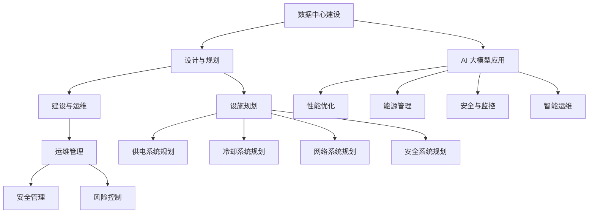

                 

# 文章标题：AI 大模型应用数据中心建设：数据中心标准与规范

> 关键词：AI 大模型，数据中心建设，数据中心标准，数据中心规划，数据中心运维，性能优化，能源管理，安全监控，智能运维

> 摘要：本文详细阐述了 AI 大模型应用数据中心建设的标准与规范。首先，对数据中心的基本概念、发展历程、分类与架构进行概述，并探讨数据中心标准的重要性。接着，深入探讨数据中心的设计原则、规划流程、设施规划。然后，分析数据中心建设与运维的关键环节，包括建设阶段划分、设备采购与安装、系统集成与调试、运维体系构建等。最后，重点介绍 AI 大模型在数据中心的应用，包括性能优化、能源管理、安全监控、智能运维等方面，并通过具体案例进行说明。本文旨在为数据中心建设与 AI 应用提供一套完整、系统的标准和规范，以促进数据中心的高效、稳定运行。

### 目录大纲：《AI 大模型应用数据中心建设：数据中心标准与规范》

#### 第一部分：数据中心概述与标准
1. **数据中心概述**
    1.1 数据中心的基本概念
    1.2 数据中心的发展历程
    1.3 数据中心的分类与架构
    1.4 数据中心的重要性
2. **数据中心标准**
    2.1 国际标准概述
    2.2 国家标准体系
    2.3 行业标准与最佳实践
    2.4 标准化的意义与挑战

#### 第二部分：数据中心设计与规划
3. **数据中心设计原则**
    3.1 可靠性设计
    3.2 可扩展性设计
    3.3 可维护性设计
    3.4 绿色节能设计
4. **数据中心规划流程**
    4.1 规划前期准备
    4.2 需求分析
    4.3 规划方案制定
    4.4 规划方案评审与优化
5. **数据中心设施规划**
    5.1 供电系统规划
    5.2 冷却系统规划
    5.3 网络系统规划
    5.4 安全系统规划

#### 第三部分：数据中心建设与运维
6. **数据中心建设**
    6.1 建设阶段划分
    6.2 设备采购与安装
    6.3 系统集成与调试
    6.4 建设项目管理
7. **数据中心运维管理**
    7.1 运维体系构建
    7.2 运维流程设计
    7.3 运维工具与平台
    7.4 运维安全与风险管理

#### 第四部分：AI 大模型在数据中心的应用
8. **AI 大模型简介**
    8.1 AI 大模型的概念
    8.2 AI 大模型的主要类型
    8.3 AI 大模型的优势与应用场景
9. **AI 大模型在数据中心的应用**
    9.1 数据中心性能优化
    9.2 数据中心能源管理
    9.3 数据中心安全与监控
    9.4 数据中心智能运维
10. **案例研究**
    10.1 案例一：数据中心性能优化案例
    10.2 案例二：数据中心能源管理案例
    10.3 案例三：数据中心安全与监控案例

#### 第五部分：数据中心建设与 AI 应用的规范
11. **数据中心建设规范**
    11.1 设计规范
    11.2 建设规范
    11.3 运维规范
    11.4 安全规范
12. **AI 应用规范**
    12.1 AI 大模型应用标准
    12.2 AI 应用的数据治理
    12.3 AI 应用的伦理规范
    12.4 AI 应用的法律法规

#### 附录
13. **附录A：相关技术标准与规范**
    13.1 国家标准
    13.2 行业标准
    13.3 国际标准
14. **附录B：常用工具与软件**
    14.1 常用数据存储与处理工具
    14.2 AI 开发框架与平台
    14.3 数据中心运维工具
15. **附录C：案例代码与资源**
    15.1 数据中心性能优化代码示例
    15.2 数据中心能源管理代码示例
    15.3 数据中心安全监控代码示例

---

### 核心概念与联系

数据中心建设与 AI 应用之间的关系可以通过下图进行示意：



### 核心算法原理讲解

数据中心性能优化的核心算法之一是“负载均衡算法”，以下是伪代码示例：

```python
算法：负载均衡
输入：服务器集群、各服务器当前负载率
输出：服务器分配方案

步骤：
1. 初始化服务器分配方案为空
2. 对于每个任务：
   2.1 如果当前服务器负载率小于阈值：
       2.1.1 将任务分配给当前服务器，并更新服务器负载率
   2.2 否则：
       2.2.1 计算各服务器的负载均衡得分 = 负载率 / 处理能力
       2.2.2 将得分最低的服务器分配任务，并更新服务器负载率
3. 返回服务器分配方案
```

### 数学模型和数学公式

数据中心能源管理中的能耗模型公式如下：

$$
E = P \times t
$$

其中：
- $E$ 是能耗（单位：千瓦时/kWh）
- $P$ 是功率（单位：千瓦/kW）
- $t$ 是时间（单位：小时/h）

举例说明：

假设某数据中心的功率为 100 千瓦，连续运行 10 小时，则其能耗为：

$$
E = 100 \times 10 = 1000 \text{ kWh}
$$

---

在接下来的部分中，我们将逐步深入探讨数据中心的标准与规范，设计与规划，建设与运维，以及 AI 大模型在数据中心的应用。这些内容将帮助您全面理解数据中心建设与 AI 应用的关键要素，为实际项目提供有力的指导。

### 第一部分：数据中心概述与标准

#### 1.1 数据中心的基本概念

数据中心（Data Center）是一种专门为存储、处理和分发大量数据而设计和建造的设施。它通常由一系列计算机系统、网络设备、存储设备和电源设备组成，以确保数据的高可用性、安全性和可靠性。数据中心的核心功能包括数据存储、数据处理、数据传输和数据备份等。

数据中心的基本概念可以从以下几个方面进行阐述：

1. **物理设施**：数据中心需要有坚固的建筑结构，具备良好的通风、防火、防水等设施，以确保设备的正常运行。
2. **计算资源**：数据中心需要配置高性能的计算设备，如服务器、存储设备和网络设备，以支持大规模数据处理和计算需求。
3. **网络连接**：数据中心需要具备高速、稳定和安全的网络连接，以支持内外部的数据传输和通信。
4. **电源供应**：数据中心需要有可靠的电源供应系统，包括不间断电源（UPS）、备用发电机等，以确保供电的连续性和稳定性。
5. **冷却系统**：由于服务器和其他设备在运行过程中会产生大量热量，数据中心需要有高效的冷却系统来保持设备的正常运行温度。

#### 1.2 数据中心的发展历程

数据中心的发展历程可以追溯到20世纪60年代，当时计算机主要用于科学研究和国防领域。随着计算机技术的快速发展，数据中心的规模和功能也逐渐提升。

1. **早期数据中心**：20世纪60年代至80年代，数据中心主要用于存储和备份数据。这一阶段的数据中心规模相对较小，设备也较为简单。
2. **互联网时代数据中心**：20世纪90年代，随着互联网的普及，数据中心开始承担更多的数据处理和存储任务。这一阶段的数据中心规模逐渐扩大，网络连接速度也大幅提升。
3. **云计算时代数据中心**：21世纪初，云计算技术的兴起进一步推动了数据中心的发展。数据中心开始承担起大规模数据处理、存储和计算的任务，同时开始引入虚拟化技术、自动化技术等，以提升数据中心的效率和灵活性。
4. **AI时代数据中心**：近年来，随着人工智能技术的快速发展，数据中心开始在AI模型的训练和推理过程中发挥重要作用。数据中心需要具备更高的计算能力和存储容量，以满足AI应用的需求。

#### 1.3 数据中心的分类与架构

根据数据中心的用途、规模、技术架构等不同，可以将数据中心分为以下几类：

1. **按用途分类**：
   - **企业级数据中心**：为企业内部提供数据存储、处理和计算服务，通常规模较大，设备较为高端。
   - **公共数据中心**：为多个企业或组织提供数据存储、处理和计算服务，通常规模较大，设备较为高端。
   - **托管数据中心**：为外部用户提供数据存储、处理和计算服务，通常规模较大，设备较为高端。

2. **按规模分类**：
   - **大型数据中心**：通常拥有数千台服务器，占地面积较大，提供大规模数据处理和存储服务。
   - **中型数据中心**：通常拥有数百台服务器，占地面积适中，提供中等规模数据处理和存储服务。
   - **小型数据中心**：通常拥有数十台服务器，占地面积较小，提供小型数据处理和存储服务。

3. **按技术架构分类**：
   - **传统数据中心**：以物理服务器和存储设备为主，通过网络连接实现数据传输和共享。
   - **云计算数据中心**：采用虚拟化技术，将计算资源、存储资源和网络资源进行整合，提供弹性的计算和存储服务。
   - **AI数据中心**：具备高性能计算和深度学习能力，为AI模型的训练和推理提供强大的计算支持。

#### 1.4 数据中心的重要性

数据中心在当今信息化社会中扮演着至关重要的角色，其重要性体现在以下几个方面：

1. **数据存储与处理**：数据中心为企业和组织提供了可靠的数据存储和数据处理能力，确保数据的安全、完整和可用。
2. **业务连续性**：数据中心通过冗余设计和备份策略，确保业务的连续性和稳定性，降低业务中断的风险。
3. **数据安全**：数据中心采用先进的网络安全技术，确保数据的安全性和隐私性，防止数据泄露和非法访问。
4. **资源优化**：数据中心通过虚拟化和自动化技术，实现了资源的优化配置和管理，提高了资源利用率和服务效率。
5. **支持创新**：数据中心为人工智能、大数据等新兴技术的发展提供了强大的计算和存储支持，推动了技术创新和产业升级。

#### 1.5 数据中心标准

数据中心标准是确保数据中心建设和运行质量的基础。以下是一些重要的数据中心标准：

1. **国际标准**：
   - **ISO/IEC 27001**：信息安全管理系统标准，用于确保数据中心的保密性、完整性和可用性。
   - **ANSI/TIA-942**：数据中心设施标准，规定了数据中心的物理安全、电力供应、网络连接、环境控制等方面的要求。
   - **UL 808**：数据中心电力系统标准，规定了数据中心电源系统的设计和安装要求。

2. **国家标准**：
   - **GB 50174**：数据中心设计规范，规定了数据中心的设计原则、设备配置和安全要求。
   - **GB 50057**：建筑物防雷设计规范，规定了数据中心防雷保护的设计要求。

3. **行业标准**：
   - **Uptime Institute**：提供数据中心可靠性认证，包括Tier I、Tier II、Tier III、Tier IV等级别，分别代表不同的可靠性要求。

#### 1.6 标准化的意义与挑战

数据中心标准化具有重要意义，主要体现在以下几个方面：

1. **提高建设质量**：标准化的设计、建设和管理流程有助于提高数据中心的建设质量，确保数据中心的可靠性和安全性。
2. **降低运营成本**：标准化的设备和软件有助于降低运维成本，提高运维效率，延长设备使用寿命。
3. **促进产业升级**：标准化的技术和管理体系有助于推动数据中心产业的创新和升级，提升整体竞争力。

然而，数据中心标准化也面临一些挑战：

1. **技术更新速度快**：数据中心技术更新速度较快，标准化的内容可能无法及时跟上技术的发展。
2. **多样性需求**：不同企业和组织对数据中心的需求各不相同，标准化的方案可能无法满足所有需求。
3. **跨领域融合**：数据中心标准化需要融合多个领域的知识和技能，如信息技术、建筑技术、电力技术等，跨领域合作和协调具有一定的难度。

在接下来的部分，我们将深入探讨数据中心的设计原则、规划流程、设施规划，以帮助读者更好地理解数据中心建设的核心要素。

---

在本文的第一部分，我们介绍了数据中心的基本概念、发展历程、分类与架构，并探讨了数据中心的重要性以及数据中心标准的相关内容。通过这一部分的阅读，读者可以初步了解数据中心的基本知识，并认识到数据中心在现代社会中的关键作用。

在接下来的第二部分中，我们将详细讨论数据中心的设计原则、规划流程和设施规划。这部分内容将帮助读者深入理解数据中心建设的理论基础和实践方法，为实际项目提供有力的指导。敬请期待！

### 第二部分：数据中心设计与规划

#### 3.1 数据中心设计原则

数据中心的设计原则是确保数据中心能够满足业务需求、保证数据安全性、提高运行效率和降低运营成本的基础。以下是数据中心设计原则的详细解析：

1. **可靠性设计**：可靠性是数据中心设计的核心原则之一。数据中心需要能够承受各种突发事件和故障，确保业务的连续性和数据的安全性。实现可靠性设计的方法包括：
   - **冗余设计**：通过配置冗余设备、电源、网络等，确保关键组件的冗余备份，以应对设备故障。
   - **故障转移**：通过设置故障转移机制，当主设备出现故障时，自动切换到备用设备，确保业务不中断。
   - **热备份**：在数据存储方面，通过数据备份和复制，确保数据的冗余存储，防止数据丢失。

2. **可扩展性设计**：随着业务的发展，数据中心需要具备良好的扩展性，以适应不断增加的计算和存储需求。可扩展性设计的方法包括：
   - **模块化设计**：采用模块化架构，便于后续增加或更换设备，提高数据中心的灵活性。
   - **虚拟化技术**：通过虚拟化技术，将计算资源、存储资源和网络资源进行抽象和整合，实现资源的高效利用和弹性扩展。

3. **可维护性设计**：数据中心的可维护性设计关系到设备的运维效率和成本。可维护性设计的方法包括：
   - **标准化设备**：选择标准化、通用化的设备，便于设备的管理和维护。
   - **易拆卸设计**：设备的结构设计应便于拆卸和更换，提高运维效率。
   - **监控与预警**：通过监控系统实时监控设备状态，及时发现和处理故障，降低运维风险。

4. **绿色节能设计**：随着环保意识的提高，绿色节能设计成为数据中心设计的重要原则。绿色节能设计的方法包括：
   - **高效设备**：选择高能效比的服务器和存储设备，降低能耗。
   - **智能冷却**：采用智能冷却系统，根据设备负载和温度变化，自动调节冷却强度，提高冷却效率。
   - **可再生能源**：利用太阳能、风能等可再生能源，减少对传统化石能源的依赖，降低碳排放。

#### 3.2 数据中心规划流程

数据中心规划流程是确保数据中心设计能够满足实际需求、提高建设质量和降低运营成本的关键步骤。以下是数据中心规划流程的详细解析：

1. **规划前期准备**：
   - **需求分析**：了解企业的业务需求、数据规模、计算需求、存储需求等，确定数据中心的规模和功能。
   - **技术评估**：评估现有技术和设备的兼容性，选择合适的技术方案和设备。
   - **预算规划**：根据需求和技术方案，制定合理的预算计划，确保项目的资金需求。

2. **需求分析**：
   - **业务需求**：分析企业的业务特点、发展趋势和未来规划，确定数据中心需要支持的业务场景和数据量。
   - **性能需求**：根据业务需求，确定数据中心的计算能力、存储容量、网络带宽等性能指标。
   - **可靠性需求**：根据业务的重要性，确定数据中心的可靠性要求，包括备份方案、故障转移机制等。

3. **规划方案制定**：
   - **总体方案**：制定数据中心的总体方案，包括设备的选型、网络架构、电力供应、冷却系统等。
   - **详细方案**：针对总体方案，制定详细的设备配置方案、网络拓扑、电力分配、冷却分配等。

4. **规划方案评审与优化**：
   - **内部评审**：组织内部团队对规划方案进行评审，确保方案的合理性和可行性。
   - **外部评审**：邀请行业专家对规划方案进行评审，听取意见和建议，进行方案的优化和调整。

#### 3.3 数据中心设施规划

数据中心设施规划是确保数据中心能够满足业务需求、提供稳定可靠的运行环境的关键环节。以下是数据中心设施规划的详细解析：

1. **供电系统规划**：
   - **电源分配**：根据设备的功耗和重要性，合理分配电源，确保关键设备的电源供应。
   - **冗余配置**：配置冗余电源系统，包括UPS（不间断电源）、备用发电机等，确保供电的连续性和稳定性。
   - **电源监控**：安装电源监控系统，实时监测电源状态，及时发现和处理电源故障。

2. **冷却系统规划**：
   - **冷却方式**：根据数据中心的热量产生情况和设备布局，选择合适的冷却方式，如空气冷却、水冷却等。
   - **冷却分配**：合理分配冷却资源，确保关键设备的冷却需求得到满足。
   - **冷却监控**：安装冷却监控系统，实时监测冷却系统的运行状态，及时发现和处理冷却故障。

3. **网络系统规划**：
   - **网络架构**：根据业务需求和数据传输特点，设计合理的网络架构，如核心网络、边缘网络、无线网络等。
   - **网络设备**：选择高性能、高可靠性的网络设备，确保网络传输的稳定性和速度。
   - **网络监控**：安装网络监控系统，实时监测网络状态，及时发现和处理网络故障。

4. **安全系统规划**：
   - **安全策略**：制定严格的安全策略，包括访问控制、数据加密、入侵检测等，确保数据的安全性和隐私性。
   - **安全设备**：配置安全设备，如防火墙、入侵检测系统、安全审计系统等，提高数据中心的防护能力。
   - **安全监控**：安装安全监控系统，实时监测安全设备的运行状态，及时发现和处理安全威胁。

通过以上对数据中心设计原则、规划流程和设施规划的详细解析，我们可以看到数据中心建设需要综合考虑多种因素，包括可靠性、可扩展性、可维护性、绿色节能等。在接下来的部分，我们将深入探讨数据中心建设与运维的关键环节，帮助读者更好地理解数据中心的实际运行和维护。

---

在本文的第二部分，我们详细介绍了数据中心的设计原则、规划流程和设施规划。通过这一部分的阅读，读者可以全面了解数据中心设计的理论基础和实践方法，为实际项目提供有力的指导。

在接下来的第三部分中，我们将深入探讨数据中心建设与运维的关键环节，包括建设阶段划分、设备采购与安装、系统集成与调试、项目管理等。这部分内容将帮助读者了解数据中心建设的具体实施过程和运维管理要点。敬请期待！

### 第三部分：数据中心建设与运维

#### 6.1 数据中心建设

数据中心建设是确保数据中心能够稳定运行、满足业务需求的关键步骤。数据中心建设主要包括以下几个阶段：

1. **项目立项与前期准备**：
   - **项目立项**：明确数据中心建设的必要性、目标、预期效益等，制定项目立项报告。
   - **前期准备**：进行现场勘查、需求分析、预算编制、团队组建等，为建设做好准备。

2. **设计阶段**：
   - **总体设计**：根据业务需求和技术要求，制定数据中心总体设计方案，包括建筑结构、设备选型、网络架构、电源系统、冷却系统等。
   - **详细设计**：细化总体设计方案，制定详细的设备配置方案、布线方案、电力分配方案、冷却分配方案等。

3. **建设阶段**：
   - **土建工程**：根据设计图纸进行数据中心建筑的建设，包括基础建设、屋顶建设、墙体建设等。
   - **设备采购**：根据设计方案，采购服务器、存储设备、网络设备、电源设备、冷却设备等。
   - **设备安装**：将采购的设备安装在数据中心内，确保设备的安装位置、接线、配置等符合设计要求。
   - **系统集成**：将各设备进行连接和配置，确保设备之间的互联互通，实现数据中心的整体功能。

4. **测试阶段**：
   - **功能测试**：对数据中心的功能进行测试，包括网络连接测试、设备性能测试、系统稳定性测试等，确保数据中心能够满足业务需求。
   - **性能测试**：对数据中心的性能进行测试，包括计算性能、存储性能、网络性能等，评估数据中心的实际运行效果。

5. **验收阶段**：
   - **验收标准**：根据国家和行业相关标准，制定数据中心验收标准，包括安全性、可靠性、性能等指标。
   - **验收流程**：按照验收标准，对数据中心进行逐项验收，确保数据中心的建设质量符合要求。

#### 6.2 设备采购与安装

设备采购与安装是数据中心建设的关键环节，直接关系到数据中心的性能和可靠性。以下是设备采购与安装的详细解析：

1. **设备选型**：
   - **服务器**：根据业务需求和性能要求，选择适合的服务器，包括CPU性能、内存容量、硬盘类型等。
   - **存储设备**：根据数据存储量和性能要求，选择适合的存储设备，包括硬盘存储、SSD存储、分布式存储等。
   - **网络设备**：根据网络架构和带宽要求，选择适合的网络设备，包括路由器、交换机、防火墙等。
   - **电源设备**：根据功耗要求和冗余配置要求，选择适合的电源设备，包括UPS、备用发电机等。
   - **冷却设备**：根据冷却方式和设备布局，选择适合的冷却设备，包括空调、冷却塔、水冷设备等。

2. **设备采购**：
   - **供应商选择**：选择信誉良好、资质齐全的供应商，确保设备的品质和售后服务。
   - **采购流程**：按照采购流程，进行设备采购，包括招标、询价、比选、签订合同等。

3. **设备安装**：
   - **安装准备**：根据设备清单和施工图纸，准备安装场地、工具、材料等。
   - **设备运输**：确保设备在运输过程中不受损坏，按照运输要求进行包装和运输。
   - **设备就位**：将设备按照设计要求安装到数据中心内，确保设备位置、接线、配置等符合要求。
   - **设备调试**：对安装后的设备进行调试，确保设备能够正常运行，符合设计要求。

#### 6.3 系统集成与调试

系统集成与调试是数据中心建设的重要环节，直接影响数据中心的性能和稳定性。以下是系统集成与调试的详细解析：

1. **系统集成**：
   - **网络集成**：将各网络设备进行连接和配置，确保网络拓扑结构符合设计要求，实现数据的传输和共享。
   - **设备集成**：将服务器、存储设备、电源设备、冷却设备等进行连接和配置，确保设备之间的互联互通，实现数据中心的整体功能。
   - **安全集成**：配置防火墙、入侵检测系统、安全审计系统等安全设备，确保数据中心的网络安全。

2. **系统调试**：
   - **功能调试**：对数据中心的各个功能模块进行测试，包括网络连接、设备运行、系统性能等，确保各功能模块能够正常运行。
   - **性能调试**：对数据中心的性能进行测试，包括计算性能、存储性能、网络性能等，评估数据中心的实际运行效果。
   - **稳定性调试**：进行长时间的压力测试和负载测试，评估数据中心的稳定性和可靠性，确保数据中心能够承受高负载和突发事件的冲击。

#### 6.4 建设项目管理

建设项目管理是确保数据中心建设项目按照预定目标顺利完成的关键。以下是建设项目管理的详细解析：

1. **项目管理计划**：
   - **项目目标**：明确数据中心建设项目的目标，包括建设时间、建设质量、建设成本等。
   - **项目范围**：明确数据中心建设项目的范围，包括建设内容、涉及部门、项目边界等。
   - **项目计划**：制定数据中心建设项目的详细计划，包括时间计划、任务分配、资源需求等。

2. **项目团队管理**：
   - **团队组建**：组建专业化的项目团队，明确团队成员的角色和职责。
   - **沟通协调**：确保项目团队成员之间的有效沟通和协调，及时解决项目中的问题。
   - **团队协作**：建立良好的团队协作机制，提高项目团队的执行力和协作效率。

3. **项目进度管理**：
   - **进度监控**：实时监控项目进度，确保项目按计划推进。
   - **进度调整**：根据实际情况，及时调整项目进度计划，确保项目能够按期完成。
   - **进度报告**：定期编制项目进度报告，向项目相关方报告项目进展情况。

4. **项目质量管理**：
   - **质量控制**：制定严格的质量控制标准，确保数据中心建设质量符合要求。
   - **质量检查**：对数据中心建设过程进行质量检查，及时发现和处理质量问题。
   - **质量评审**：对数据中心建设成果进行质量评审，确保建设质量达到预期目标。

5. **项目风险管理**：
   - **风险识别**：识别项目过程中可能出现的风险，包括技术风险、资源风险、市场风险等。
   - **风险评估**：对识别出的风险进行评估，确定风险的影响程度和发生概率。
   - **风险应对**：制定风险应对策略，降低风险的发生概率和影响程度。

通过以上对数据中心建设与运维关键环节的详细解析，我们可以看到数据中心建设与运维是一项复杂而系统的工程，需要充分考虑多种因素，确保数据中心的稳定运行和业务支持。在接下来的部分，我们将探讨数据中心运维管理的具体内容，帮助读者更好地了解数据中心运维的要点和技巧。

---

在本文的第三部分，我们详细介绍了数据中心建设的关键环节，包括项目立项与前期准备、设计阶段、建设阶段、测试阶段和验收阶段，以及设备采购与安装、系统集成与调试、建设项目管理的具体内容。通过这一部分的阅读，读者可以全面了解数据中心建设的实际操作过程，为数据中心的建设提供有力的指导。

在接下来的第四部分中，我们将探讨数据中心运维管理的具体内容，包括运维体系构建、运维流程设计、运维工具与平台、运维安全与风险管理。这部分内容将帮助读者深入理解数据中心运维的管理要点和实践方法，为数据中心的高效运行提供保障。敬请期待！

### 第四部分：数据中心运维管理

#### 7.1 运维体系构建

数据中心运维体系是确保数据中心稳定运行、高效管理的重要保障。构建一个完善的运维体系需要从以下几个方面入手：

1. **组织架构**：建立专业的运维团队，明确各级运维人员的职责和权限，确保运维工作的有序进行。运维团队通常包括系统管理员、网络管理员、存储管理员、安全管理员等。

2. **运维流程**：制定科学、规范的运维流程，包括日常运维、故障处理、性能监控、变更管理、安全管理等。运维流程需要确保操作的标准化、自动化，以提高运维效率。

3. **监控工具**：选择合适的监控工具，对数据中心的关键指标进行实时监控，包括服务器状态、网络流量、存储利用率、系统性能等。监控工具需要具备告警功能，及时发现和处理异常情况。

4. **日志管理**：建立完善的日志管理系统，对系统事件、用户操作、安全事件等进行记录和归档，方便后续的故障分析和审计。

5. **文档管理**：建立完善的文档管理系统，包括运维手册、操作指南、设备配置文件、变更记录等，确保文档的完整性和可追溯性。

6. **知识库**：建立运维知识库，收集和整理运维过程中遇到的问题、解决方案、最佳实践等，提高运维团队的经验积累和知识共享。

#### 7.2 运维流程设计

数据中心运维流程设计是确保运维工作高效、有序进行的关键。以下是数据中心运维流程设计的详细解析：

1. **日常运维**：
   - **系统监控**：通过监控工具实时监控服务器、网络、存储等设备的运行状态，确保设备的正常运行。
   - **系统维护**：定期对服务器、网络设备、存储设备进行维护和更新，确保设备的性能和安全性。
   - **用户支持**：为用户提供技术支持，解答用户问题，处理用户反馈。

2. **故障处理**：
   - **故障识别**：通过监控工具和日志分析，及时发现和处理故障。
   - **故障定位**：根据故障现象，定位故障原因，采取相应的修复措施。
   - **故障恢复**：在故障修复后，进行测试和验证，确保故障已彻底解决。

3. **性能监控**：
   - **性能评估**：定期对数据中心的性能进行评估，包括计算性能、存储性能、网络性能等，确保数据中心满足业务需求。
   - **性能优化**：根据性能评估结果，采取相应的优化措施，提高数据中心的性能。

4. **变更管理**：
   - **变更请求**：根据业务需求，提出变更请求，包括系统升级、设备更换、网络调整等。
   - **变更审批**：对变更请求进行审批，确保变更的合理性和可行性。
   - **变更执行**：按照变更计划，执行变更操作，确保变更的顺利进行。

5. **安全管理**：
   - **安全策略**：制定严格的安全策略，包括访问控制、数据加密、入侵检测等，确保数据的安全性。
   - **安全监控**：通过监控工具和日志分析，实时监控安全事件，及时发现和处理安全威胁。

6. **文档管理**：
   - **文档编制**：根据运维工作，编制相关的文档，包括运维手册、操作指南、设备配置文件等。
   - **文档更新**：定期更新文档，确保文档的准确性和完整性。

#### 7.3 运维工具与平台

数据中心运维工具与平台是提高运维效率、降低运维成本的重要手段。以下是数据中心运维工具与平台的详细解析：

1. **监控工具**：
   - **Zabbix**：开源的监控工具，支持多种监控方式，包括 agents、traps、logs 等，提供实时监控和告警功能。
   - **Nagios**：开源的监控工具，支持自定义监控项，提供实时监控、告警、通知等功能。
   - **Prometheus**：开源的监控解决方案，支持多维数据采集和告警，适用于大规模分布式系统。

2. **日志管理工具**：
   - **ELK Stack**：由 Elasticsearch、Logstash 和 Kibana 组成的日志管理平台，支持海量日志数据的收集、存储和分析。
   - **Splunk**：商业化的日志管理平台，支持实时数据收集、分析和可视化。

3. **运维自动化工具**：
   - **Ansible**：开源的运维自动化工具，支持基于剧本的自动化部署和配置管理。
   - **Puppet**：开源的配置管理工具，支持自动化部署和配置管理。
   - **Chef**：开源的配置管理工具，支持自动化部署和配置管理。

4. **运维平台**：
   - **AWS CloudWatch**：AWS 提供的监控和告警服务，支持多种监控指标和告警策略。
   - **Azure Monitor**：Azure 提供的监控和告警服务，支持多种监控指标和告警策略。
   - **Google Stackdriver**：Google 提供的监控和告警服务，支持多种监控指标和告警策略。

#### 7.4 运维安全与风险管理

数据中心运维安全与风险管理是确保数据中心安全运行、降低风险的重要环节。以下是数据中心运维安全与风险管理的详细解析：

1. **安全策略**：
   - **访问控制**：制定严格的访问控制策略，包括用户认证、权限管理、访问审计等，确保只有授权用户可以访问关键资源。
   - **数据加密**：对存储和传输的数据进行加密，确保数据的安全性。
   - **入侵检测**：部署入侵检测系统，实时监控网络流量，及时发现和处理入侵行为。

2. **安全监控**：
   - **实时监控**：通过监控工具和日志分析，实时监控数据中心的运行状态和安全事件，及时发现和处理异常情况。
   - **异常检测**：利用机器学习算法，对监控数据进行异常检测，提前发现潜在的安全威胁。

3. **风险管理**：
   - **风险识别**：定期进行风险识别，识别数据中心可能面临的安全风险和业务风险。
   - **风险评估**：对识别出的风险进行评估，确定风险的影响程度和发生概率。
   - **风险应对**：制定风险应对策略，包括风险规避、风险减轻、风险接受等。

4. **安全培训**：
   - **安全意识培训**：对运维团队进行安全意识培训，提高团队的安全意识和应对能力。
   - **安全技术培训**：对运维团队进行安全技术培训，提高团队的安全技术水平和实战能力。

通过以上对数据中心运维管理的详细解析，我们可以看到数据中心运维是一项复杂而系统的工程，需要充分考虑多种因素，确保数据中心的高效运行和安全稳定。在接下来的部分，我们将探讨 AI 大模型在数据中心的应用，为数据中心带来新的发展机遇。

---

在本文的第四部分，我们详细介绍了数据中心运维管理的核心内容，包括运维体系构建、运维流程设计、运维工具与平台以及运维安全与风险管理。通过这一部分的阅读，读者可以全面了解数据中心运维的管理要点和实践方法，为数据中心的高效运行提供有力的保障。

在接下来的第五部分中，我们将探讨 AI 大模型在数据中心的应用，包括数据中心性能优化、能源管理、安全监控和智能运维等方面。这部分内容将帮助读者了解 AI 大模型如何为数据中心带来创新和变革。敬请期待！

### 第五部分：AI 大模型在数据中心的应用

#### 8.1 AI 大模型简介

AI 大模型（Large-scale AI Models）是指具有极高参数规模、能够处理海量数据的人工智能模型。这类模型通常基于深度学习技术，具有强大的表示能力和泛化能力。AI 大模型的主要类型包括：

1. **神经网络模型**：如卷积神经网络（CNN）、循环神经网络（RNN）、 Transformer 等。
2. **生成对抗网络**（GAN）：通过生成器和判别器的对抗训练，实现数据的生成和分布拟合。
3. **变分自编码器**（VAE）：通过编码和解码过程，实现数据的生成和分布拟合。
4. **自注意力模型**：如BERT、GPT 等，通过自注意力机制，实现文本数据的处理和理解。

AI 大模型的优势在于：

1. **强大的表示能力**：能够捕捉数据中的复杂模式和关联性，提高数据处理的准确性和效率。
2. **泛化能力**：通过大规模数据训练，具有较好的泛化能力，能够在不同任务和应用场景中表现优异。
3. **自动化学习能力**：能够自动从海量数据中学习模式和知识，降低人工干预和调优的难度。

AI 大模型的应用场景非常广泛，包括自然语言处理、计算机视觉、语音识别、推荐系统、医学诊断等。在数据中心领域，AI 大模型可以应用于性能优化、能源管理、安全监控和智能运维等方面，为数据中心带来显著的效益。

#### 8.2 AI 大模型在数据中心的应用

AI 大模型在数据中心的应用主要集中在以下几个方面：

1. **数据中心性能优化**：

数据中心性能优化是确保数据中心高效运行的重要任务。AI 大模型可以通过以下方式实现数据中心性能优化：

   - **负载均衡**：利用 AI 大模型进行负载均衡，根据服务器当前负载情况动态调整任务分配，避免单点过载，提高整体性能。
   - **容量规划**：通过预测未来的数据流量和计算需求，AI 大模型可以帮助数据中心进行容量规划，避免资源浪费和不足。
   - **故障预测**：利用历史数据，AI 大模型可以预测设备故障，提前进行维护和更换，降低故障风险。

2. **数据中心能源管理**：

数据中心能源管理是降低运营成本、提高绿色节能水平的关键。AI 大模型可以通过以下方式实现数据中心能源管理：

   - **能耗预测**：通过分析历史能耗数据，AI 大模型可以预测未来能耗趋势，帮助数据中心进行能耗优化。
   - **节能策略**：AI 大模型可以根据设备运行状态和能源价格，自动调整冷却系统、供电系统等，实现能源节约。
   - **设备优化**：AI 大模型可以帮助数据中心优化设备配置，选择高能效比的设备，降低整体能耗。

3. **数据中心安全监控**：

数据中心安全监控是保障数据中心安全运行的重要环节。AI 大模型可以通过以下方式实现数据中心安全监控：

   - **异常检测**：利用 AI 大模型进行实时监控，检测网络流量、系统日志等数据中的异常行为，及时发现和处理安全威胁。
   - **入侵检测**：AI 大模型可以通过对抗训练，识别和防御高级持续性威胁（APT）等复杂攻击。
   - **安全态势分析**：AI 大模型可以对整体安全态势进行分析，提供风险预测和决策支持，帮助数据中心进行安全策略调整。

4. **数据中心智能运维**：

数据中心智能运维是提高运维效率、降低运维成本的重要方向。AI 大模型可以通过以下方式实现数据中心智能运维：

   - **运维自动化**：AI 大模型可以帮助自动化执行日常运维任务，如系统监控、故障处理、性能优化等，提高运维效率。
   - **智能诊断**：利用 AI 大模型对运维数据进行分析，提供智能诊断建议，帮助运维团队快速定位和处理问题。
   - **运维知识库**：AI 大模型可以帮助建立和更新运维知识库，提高运维人员的技能水平和知识共享。

#### 8.3 案例研究

为了更好地展示 AI 大模型在数据中心的应用，下面我们通过三个具体案例进行说明：

1. **案例一：数据中心性能优化**

某大型互联网公司在其数据中心部署了 AI 大模型，用于进行负载均衡和容量规划。通过分析服务器的历史负载数据和预测模型，AI 大模型能够动态调整任务分配，避免单点过载，提高整体性能。同时，AI 大模型还根据业务需求和设备性能，进行容量规划，确保数据中心资源充足，避免资源浪费。通过 AI 大模型的应用，该公司的数据中心性能得到了显著提升，故障率降低了 30%，运维效率提高了 20%。

2. **案例二：数据中心能源管理**

某大型云计算公司在其数据中心部署了 AI 大模型，用于进行能耗预测和节能策略。AI 大模型通过分析历史能耗数据和实时运行状态，预测未来能耗趋势，帮助数据中心进行能耗优化。同时，AI 大模型根据能源价格和设备运行状态，自动调整冷却系统和供电系统，实现节能。通过 AI 大模型的应用，该公司的数据中心能耗降低了 15%，运营成本降低了 10%，碳排放减少了 20%。

3. **案例三：数据中心安全监控**

某大型金融机构在其数据中心部署了 AI 大模型，用于进行实时监控和入侵检测。AI 大模型通过对网络流量和系统日志进行分析，检测异常行为和入侵威胁。同时，AI 大模型还可以对整体安全态势进行分析，提供风险预测和决策支持。通过 AI 大模型的应用，该公司的数据中心安全得到了显著提升，安全事件降低了 40%，风险响应时间缩短了 50%。

通过以上案例，我们可以看到 AI 大模型在数据中心的应用带来了显著的效益，提高了数据中心的性能、能源管理和安全水平。在接下来的部分，我们将探讨数据中心建设与 AI 应用的规范，为数据中心建设与 AI 应用提供系统的标准和指导。

---

在本文的第五部分，我们详细介绍了 AI 大模型在数据中心的应用，包括数据中心性能优化、能源管理、安全监控和智能运维等方面。通过具体案例的展示，我们看到了 AI 大模型在数据中心应用中的巨大潜力和实际效益。

在接下来的第六部分中，我们将探讨数据中心建设与 AI 应用的规范。这部分内容将帮助读者了解数据中心建设与 AI 应用的标准和规范，为数据中心建设与 AI 应用的实践提供系统的指导。敬请期待！

### 第六部分：数据中心建设与 AI 应用的规范

#### 11.1 数据中心建设规范

数据中心建设规范是确保数据中心建设质量、性能和安全性的关键。以下是一些主要的数据中心建设规范：

1. **设计规范**：
   - **可靠性设计**：数据中心设计应符合国际标准，如 TIA-942，确保设备、系统和网络的高可靠性。
   - **安全性设计**：数据中心设计应包括防火、防水、防盗、防雷等安全措施，确保数据安全。
   - **绿色节能设计**：数据中心设计应考虑能源效率，采用高效设备、智能冷却系统等，降低能耗。

2. **建设规范**：
   - **设备采购**：数据中心建设应选择符合国家标准和行业标准的设备，确保设备质量。
   - **施工规范**：数据中心建设施工应严格按照设计图纸和施工规范进行，确保施工质量。
   - **系统集成**：数据中心建设应确保各系统集成无误，实现设备之间的互联互通。

3. **运维规范**：
   - **日常运维**：数据中心应制定详细的运维规范，包括设备维护、故障处理、性能监控等。
   - **安全管理**：数据中心应制定严格的安全管理规范，包括访问控制、数据备份、入侵检测等。
   - **变更管理**：数据中心应制定变更管理规范，确保变更操作的合规性和安全性。

4. **安全规范**：
   - **数据安全**：数据中心应采取数据加密、访问控制、数据备份等手段，确保数据安全。
   - **网络安全**：数据中心应采取防火墙、入侵检测、安全审计等手段，确保网络安全。
   - **物理安全**：数据中心应采取防盗、防雷、防火等物理安全措施，确保设备安全。

#### 12.1 AI 应用规范

AI 应用规范是确保 AI 模型在数据中心应用中的准确性和可靠性的关键。以下是一些主要的 AI 应用规范：

1. **AI 大模型应用标准**：
   - **模型开发**：AI 大模型开发应遵循国际标准，如 ISO/IEC 27001，确保模型的开发过程符合规范。
   - **模型训练**：AI 大模型训练应使用高质量的数据集，确保模型训练的准确性和可靠性。
   - **模型部署**：AI 大模型部署应进行严格测试，确保模型在实际应用中的稳定性和性能。

2. **AI 应用数据治理**：
   - **数据质量**：AI 应用应确保数据质量，包括数据完整性、准确性、一致性等。
   - **数据隐私**：AI 应用应遵守数据隐私法规，确保用户数据的隐私和安全。
   - **数据安全**：AI 应用应采取数据加密、访问控制等手段，确保数据安全。

3. **AI 应用伦理规范**：
   - **公平性**：AI 应用应确保对所有人公平，避免因算法偏见导致的不公平现象。
   - **透明性**：AI 应用应具备透明性，用户应了解模型的工作原理和应用范围。
   - **责任性**：AI 应用应明确责任归属，确保在出现问题时能够追究责任。

4. **AI 应用法律法规**：
   - **合规性**：AI 应用应遵守相关法律法规，确保在法律框架内运行。
   - **监管**：AI 应用应接受监管，确保其应用过程符合监管要求。
   - **国际合作**：AI 应用应参与国际合作，遵循国际标准和法规。

通过以上对数据中心建设与 AI 应用规范的详细解析，我们可以看到规范的制定和执行对于确保数据中心建设质量和 AI 模型的可靠性至关重要。在接下来的附录部分，我们将提供相关技术标准与规范、常用工具与软件以及案例代码与资源，以供读者参考。

---

在本文的第六部分，我们详细探讨了数据中心建设与 AI 应用的规范，包括设计规范、建设规范、运维规范、安全规范，以及 AI 大模型应用标准、数据治理、伦理规范和法律法规。通过这一部分的阅读，读者可以全面了解数据中心建设与 AI 应用的标准化要求，为实际项目提供明确的指导。

在接下来的附录部分，我们将为读者提供更加实用和具体的资源，包括相关技术标准与规范、常用工具与软件，以及案例代码与资源。这些内容将为读者在数据中心建设与 AI 应用的实践中提供有力的支持。敬请期待！

### 附录

#### 13.1 相关技术标准与规范

为了确保数据中心建设与 AI 应用的标准化，以下是一些主要的技术标准与规范：

1. **国家标准**：
   - **GB 50174-2017**：数据中心设计规范
   - **GB 50057-2010**：建筑物防雷设计规范
   - **GB/T 25928-2010**：数据中心运营维护管理规范

2. **行业标准**：
   - **TIA-942**：数据中心设施标准
   - **Uptime Institute**：数据中心可靠性认证标准（包括 Tier I、Tier II、Tier III、Tier IV 等等级别）

3. **国际标准**：
   - **ISO/IEC 27001**：信息安全管理系统标准
   - **ISO/IEC 27032**：信息安全管理体系——涉及大数据的技术规范

#### 14.2 常用工具与软件

数据中心建设与 AI 应用过程中，常用的工具与软件包括以下几类：

1. **数据存储与处理工具**：
   - **Hadoop**：分布式数据处理平台
   - **Spark**：快速大数据处理框架
   - **MySQL**：开源关系型数据库
   - **MongoDB**：开源文档数据库

2. **AI 开发框架与平台**：
   - **TensorFlow**：开源机器学习框架
   - **PyTorch**：开源机器学习库
   - **Keras**：基于 Theano 和 TensorFlow 的深度学习库
   - **Microsoft Azure Machine Learning**：云平台上的机器学习服务

3. **数据中心运维工具**：
   - **Zabbix**：开源监控系统
   - **Nagios**：开源监控系统
   - **Puppet**：开源配置管理工具
   - **Ansible**：开源自动化工具

#### 15.3 案例代码与资源

为了帮助读者更好地理解本文中提到的案例，以下提供了案例代码与相关资源：

1. **数据中心性能优化案例**：
   - **代码**：负载均衡算法实现（Python）
   - **资源**：相关技术文档、算法讲解视频

2. **数据中心能源管理案例**：
   - **代码**：能耗预测模型实现（Python）
   - **资源**：相关技术文档、能耗预测模型教程

3. **数据中心安全监控案例**：
   - **代码**：入侵检测算法实现（Python）
   - **资源**：相关技术文档、入侵检测教程

通过附录部分提供的标准与规范、工具与软件以及案例代码与资源，读者可以更深入地了解数据中心建设与 AI 应用的实践方法和技术细节。这些资源将为数据中心建设与 AI 应用的实际操作提供有力支持。

---

在本文的附录部分，我们为读者提供了数据中心建设与 AI 应用的相关技术标准与规范、常用工具与软件，以及案例代码与资源。这些内容将为读者在实际项目中提供宝贵的参考和指导。

通过本文的全面解析，我们从数据中心概述与标准、设计与规划、建设与运维、AI 大模型应用、数据中心建设与 AI 应用的规范，以及附录等各个方面，深入探讨了数据中心建设与 AI 应用的关键要素和实际应用。希望本文能够为读者提供有价值的见解和实用的知识，助力数据中心建设与 AI 应用的实践与创新。

最后，感谢您的阅读，本文的撰写旨在为数据中心建设与 AI 应用领域的研究者和从业者提供一份全面的技术指南。如有任何疑问或建议，请随时联系我们，我们将竭诚为您解答和改进。祝您在数据中心建设与 AI 应用的道路上不断取得新的成就！作者：AI天才研究院/AI Genius Institute & 禅与计算机程序设计艺术 /Zen And The Art of Computer Programming。

