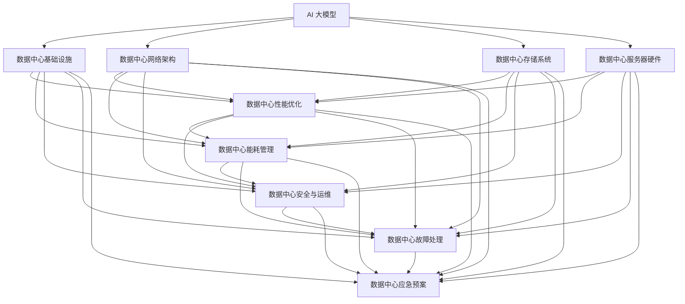

                 

# AI 大模型应用数据中心建设：数据中心运维与管理

## 关键词

- AI 大模型
- 数据中心建设
- 数据中心运维
- 数据中心管理
- 性能优化
- 能耗管理
- 安全与运维

## 摘要

本文旨在探讨 AI 大模型应用下的数据中心建设及其运维与管理。首先，我们将概述 AI 大模型的基本概念、发展历程和技术核心，以及数据中心的定义、分类和趋势。随后，我们将深入讨论数据中心基础设施建设、AI 大模型数据中心优化和数据中心运维与管理的各个方面。最后，通过实战案例展示 AI 大模型在数据中心的应用效果，并提供相关工具和资源的推荐。本文旨在为 IT 领域从业人员和研究人员提供一份全面、系统的技术指南。

## 第一部分：AI 大模型与数据中心概述

### 第1章：AI 大模型概述

#### 1.1 AI 大模型的基本概念

AI 大模型是指那些具有大规模参数、能够处理大量数据和高度复杂任务的机器学习模型。这些模型通常基于深度学习技术，包括神经网络、递归神经网络、卷积神经网络等。AI 大模型的基本概念包括：

- **参数量**：AI 大模型的参数量通常非常大，达到数百万、数十亿甚至更多。这些参数用于调整模型在训练过程中对输入数据的反应。

- **训练数据集**：AI 大模型需要使用大规模的训练数据集进行训练，以使模型能够从数据中学习并提高准确性。

- **计算资源**：由于模型参数量和训练数据集的规模，AI 大模型通常需要强大的计算资源，如高性能计算集群和 GPU。

- **训练时间**：AI 大模型训练时间较长，可能需要数天、数周甚至数月，这取决于模型规模和数据集大小。

#### 1.2 AI 大模型的发展历程

AI 大模型的发展历程可以追溯到 20 世纪 80 年代的神经网络研究。以下是一些关键事件：

- **1986 年**：Rumelhart、Hinton 和 Williams 提出了反向传播算法，使神经网络训练成为可能。

- **2012 年**：Hinton 等人提出了深度信念网络（DBN），标志着深度学习的新纪元。

- **2014 年**：Google 提出了基于神经网络的语音识别系统，准确率达到了人类水平。

- **2016 年**：Google 提出了 Transformer 模型，并在机器翻译任务中取得了显著效果。

- **2018 年**：OpenAI 提出了 GPT-3，一个具有 1750 亿参数的预训练语言模型，展示了惊人的文本生成能力。

#### 1.3 AI 大模型的核心技术

AI 大模型的核心技术包括以下几个方面：

- **深度学习**：深度学习是构建 AI 大模型的基础，通过多层神经网络模型对数据进行学习。

- **大规模数据处理**：AI 大模型需要处理大量数据，这要求高效的数据处理技术，如分布式计算和并行处理。

- **优化算法**：为了提高训练效率和模型性能，AI 大模型采用了各种优化算法，如随机梯度下降（SGD）和 Adam。

- **预训练与微调**：预训练和微调是 AI 大模型训练的关键步骤，通过预训练获得通用的特征表示，再通过微调适应特定任务。

### 第2章：数据中心概述

#### 2.1 数据中心的定义与功能

数据中心是指一种专门用于存储、处理、传输和管理大量数据的设施。其定义和功能包括：

- **定义**：数据中心是一种提供计算、存储和网络资源的设施，用于支持企业、组织或个人在云端或本地环境中运行应用程序和服务。

- **功能**：数据中心的功能包括数据存储、数据处理、数据备份、数据恢复、网络安全等。

#### 2.2 数据中心的分类与特点

数据中心可以根据其规模、功能、地理位置等因素进行分类。以下是几种常见的数据中心类型：

- **企业级数据中心**：为企业内部应用提供服务，通常拥有较高的安全性和可靠性。

- **云数据中心**：为云计算服务提供商提供基础设施，支持大规模数据处理和存储。

- **社区数据中心**：为特定社区或组织提供计算和网络资源，通常规模较小。

- **边缘数据中心**：位于网络边缘，用于处理本地数据，减少数据传输延迟。

#### 2.3 数据中心的发展趋势

数据中心的发展趋势包括：

- **云计算与大数据**：随着云计算和大数据技术的发展，数据中心需求不断增加，规模逐渐扩大。

- **绿色节能**：为了降低能耗和减少环境负担，数据中心正逐渐采用绿色节能技术和能源管理系统。

- **智能化运维**：利用人工智能和物联网技术，数据中心运维正朝着智能化、自动化方向发展。

- **安全与合规**：随着数据隐私和安全的日益重视，数据中心需要加强安全防护和合规管理。

## 第二部分：AI 大模型应用数据中心建设

### 第3章：数据中心基础设施建设

#### 3.1 数据中心网络架构

数据中心网络架构是数据中心的核心组成部分，决定了数据中心的性能、可靠性和可扩展性。以下是数据中心网络架构的主要组成部分：

- **核心网络**：核心网络是数据中心的骨干网络，负责连接各个服务器、存储设备和网络设备。核心网络通常采用高速、冗余的交换机进行构建。

- **边缘网络**：边缘网络位于核心网络和终端设备之间，负责处理终端设备与数据中心之间的通信。边缘网络通常采用高性能、低延迟的交换机进行构建。

- **分布式网络**：分布式网络是指将数据中心的网络资源分散到多个地理位置，以实现负载均衡、冗余备份和故障转移等功能。

#### 3.2 数据中心存储系统

数据中心存储系统是数据中心的关键组成部分，负责存储和管理海量数据。以下是数据中心存储系统的主要组成部分：

- **磁盘存储**：磁盘存储包括硬盘驱动器（HDD）和固态硬盘（SSD），用于存储大量数据。HDD 具有较高的存储容量和较低的存储成本，而 SSD 具有较高的读写速度和较低的能耗。

- **网络存储**：网络存储包括网络附加存储（NAS）和存储区域网络（SAN），用于提供高效、可靠的数据存储和访问。NAS 适合文件级数据存储，而 SAN 适合块级数据存储。

- **分布式存储**：分布式存储通过将数据分散存储在多个节点上，实现高可用性和高性能。分布式存储系统通常采用分布式文件系统、分布式数据库等技术。

#### 3.3 数据中心服务器硬件

数据中心服务器硬件是数据中心运行的核心组件，包括服务器、网络设备、存储设备等。以下是数据中心服务器硬件的主要组成部分：

- **服务器**：服务器是数据中心的核心计算资源，负责运行应用程序、处理数据等任务。服务器包括计算节点、内存、存储设备等组件。

- **网络设备**：网络设备包括交换机、路由器、防火墙等，用于实现数据中心的网络连接、数据传输和网络安全。

- **存储设备**：存储设备包括磁盘阵列、网络存储设备等，用于存储和管理数据中心的数据。

### 第4章：AI 大模型数据中心优化

#### 4.1 AI 大模型性能优化

AI 大模型性能优化是指通过各种技术手段提高 AI 大模型在数据中心中的运行效率。以下是几种常见的 AI 大模型性能优化方法：

- **分布式训练**：分布式训练是指将 AI 大模型的训练任务分布在多个计算节点上，以提高训练速度。分布式训练可以通过数据并行、模型并行和混合并行等方式实现。

- **模型压缩**：模型压缩是指通过减少模型参数数量、降低模型复杂度，以提高模型在数据中心中的运行效率。常见的模型压缩方法包括剪枝、量化、知识蒸馏等。

- **混合精度训练**：混合精度训练是指将 AI 大模型的训练过程分为高精度和低精度两个阶段，以提高训练效率和精度。高精度阶段用于训练大模型，低精度阶段用于优化模型参数。

#### 4.2 数据中心能耗管理

数据中心能耗管理是指通过优化数据中心基础设施和运行策略，降低数据中心能耗。以下是几种常见的数据中心能耗管理方法：

- **能效优化**：能效优化是指通过优化数据中心的硬件配置、网络架构和运行策略，降低能耗。常见的能效优化方法包括节能模式、虚拟化技术、动态功耗管理等。

- **可再生能源利用**：可再生能源利用是指通过使用太阳能、风能等可再生能源为数据中心提供电力，降低对传统能源的依赖。

- **绿色建筑设计**：绿色建筑设计是指通过采用环保材料、节能设计和技术，降低数据中心的建设和运营对环境的影响。

#### 4.3 数据中心安全与运维

数据中心安全与运维是指确保数据中心的安全性、可靠性和高效运行。以下是数据中心安全与运维的几个关键方面：

- **网络安全**：网络安全是指保护数据中心网络免受恶意攻击和入侵。常见的网络安全措施包括防火墙、入侵检测系统、安全审计等。

- **数据备份与恢复**：数据备份与恢复是指定期备份数据，并在数据丢失或损坏时进行恢复。常见的备份方法包括全备份、增量备份和差异备份。

- **运维管理**：运维管理是指对数据中心基础设施和运行状态进行监控、维护和优化。常见的运维管理工具包括监控系统、日志管理工具、自动化脚本等。

## 第三部分：AI 大模型应用实战

### 第5章：数据中心运维与管理

#### 5.1 数据中心运维流程

数据中心运维流程是指对数据中心基础设施和运行状态进行监控、维护和优化的一系列步骤。以下是数据中心运维流程的主要步骤：

- **需求分析**：分析数据中心的应用需求，确定所需的计算资源、存储资源和网络资源。

- **规划设计**：根据需求分析结果，设计数据中心的基础设施和网络架构，包括服务器、存储设备、网络设备等。

- **建设实施**：根据规划设计文档，进行数据中心基础设施的建设和部署，包括硬件设备采购、安装、配置等。

- **监控与维护**：对数据中心基础设施和运行状态进行实时监控，定期进行维护和优化，确保数据中心的稳定运行。

- **故障处理**：当数据中心出现故障时，进行故障排查和修复，确保数据中心的正常运行。

- **性能优化**：根据数据中心运行情况，对基础设施和运行策略进行优化，提高数据中心的性能和效率。

#### 5.2 数据中心监控系统

数据中心监控系统是指用于实时监控数据中心运行状态和性能的软件系统。以下是数据中心监控系统的主要功能：

- **性能监控**：实时监控服务器、存储设备、网络设备的性能指标，如 CPU 利用率、内存使用率、网络带宽、存储容量等。

- **告警管理**：当监控指标超过设定阈值时，自动生成告警信息，并通过短信、邮件、微信等方式通知运维人员。

- **日志管理**：收集和存储数据中心设备的运行日志，便于故障排查和性能优化。

- **自动化运维**：根据预设的规则和策略，自动化执行运维任务，如重启服务器、清理日志、备份数据等。

- **报表分析**：生成数据中心运行报告，包括性能分析、故障分析、能耗分析等，为运维决策提供数据支持。

#### 5.3 数据中心故障处理与应急预案

数据中心故障处理与应急预案是指当数据中心出现故障或紧急情况时，采取的一系列处理措施和应急响应。以下是数据中心故障处理与应急预案的主要步骤：

- **故障检测**：通过监控系统和日志分析，快速定位故障点和故障原因。

- **故障隔离**：将故障设备或系统从网络中隔离，避免故障扩散。

- **故障修复**：根据故障原因和故障设备的类型，采取相应的修复措施，如更换硬件、重新配置网络、升级软件等。

- **数据备份与恢复**：在故障发生前，定期备份数据，确保数据的安全和完整。在故障修复后，进行数据恢复，确保业务连续性。

- **应急响应**：制定应急预案，明确应急响应流程和责任人，确保在紧急情况下快速、有序地处理故障。

- **经验总结**：对故障处理过程进行总结和分析，发现问题和不足，持续优化故障处理和应急预案。

## 第四部分：AI 大模型在数据中心的应用实战

### 第6章：AI 大模型在数据中心的应用场景

#### 6.1 AI 大模型在数据中心网络优化中的应用

AI 大模型在数据中心网络优化中具有广泛的应用，主要包括以下几个方面：

- **网络流量预测**：利用 AI 大模型对数据中心网络流量进行预测，可以提前识别网络瓶颈和潜在问题，从而进行优化和调整。

- **网络负载均衡**：利用 AI 大模型进行网络负载均衡，可以实现实时动态调整，提高网络资源的利用率和响应速度。

- **网络安全检测**：利用 AI 大模型进行网络安全检测，可以快速识别恶意攻击和异常流量，提高网络的安全性。

- **网络性能优化**：利用 AI 大模型对网络性能进行实时分析和优化，可以调整网络参数、路由策略等，提高网络的整体性能。

#### 6.2 AI 大模型在数据中心存储优化中的应用

AI 大模型在数据中心存储优化中同样具有重要作用，主要包括以下几个方面：

- **存储资源规划**：利用 AI 大模型对存储资源进行预测和规划，可以优化存储资源的分配和管理，提高存储资源的利用率。

- **存储性能优化**：利用 AI 大模型对存储性能进行实时分析和优化，可以调整存储参数、存储策略等，提高存储系统的性能。

- **数据去重与压缩**：利用 AI 大模型进行数据去重和压缩，可以降低存储空间需求，提高存储系统的存储效率。

- **存储故障预测与修复**：利用 AI 大模型对存储故障进行预测和修复，可以提前发现潜在故障，降低存储系统的故障率和停机时间。

#### 6.3 AI 大模型在数据中心服务器优化中的应用

AI 大模型在数据中心服务器优化中的应用主要包括以下几个方面：

- **服务器资源分配**：利用 AI 大模型对服务器资源进行预测和分配，可以优化服务器资源的利用率和响应速度。

- **服务器性能优化**：利用 AI 大模型对服务器性能进行实时分析和优化，可以调整服务器参数、负载均衡策略等，提高服务器的整体性能。

- **服务器故障预测与修复**：利用 AI 大模型对服务器故障进行预测和修复，可以提前发现潜在故障，降低服务器的故障率和停机时间。

- **服务器能耗管理**：利用 AI 大模型对服务器能耗进行预测和优化，可以降低服务器的能耗，提高数据中心的绿色节能水平。

### 第7章：AI 大模型数据中心项目实践

#### 7.1 项目背景与目标

项目背景：某企业是一家大型互联网公司，拥有庞大的数据中心，承担着企业核心业务的运行。随着业务规模的不断扩大，数据中心面临着网络拥堵、存储不足、服务器性能瓶颈等问题，影响了业务的正常运行。为了提高数据中心的整体性能和可靠性，企业决定引入 AI 大模型进行优化。

项目目标：
1. 提高数据中心网络性能，降低网络延迟和丢包率。
2. 优化数据中心存储资源分配，提高存储资源利用率。
3. 提高数据中心服务器性能，降低服务器能耗。
4. 实现数据中心的智能化运维和自动化管理。

#### 7.2 项目实施步骤

1. **需求分析**：
   - 对企业数据中心现状进行全面评估，包括网络、存储、服务器等基础设施。
   - 分析企业业务需求，确定数据中心优化目标和关键指标。

2. **规划设计**：
   - 根据需求分析结果，设计数据中心网络架构、存储架构和服务器架构。
   - 选择合适的 AI 大模型，如深度学习模型、强化学习模型等，用于数据中心优化。

3. **建设实施**：
   - 采购和部署网络设备、存储设备、服务器等硬件设备。
   - 安装和配置数据中心监控系统、AI 大模型训练系统等软件系统。
   - 进行数据中心基础设施的调试和测试，确保设备正常运行。

4. **模型训练与优化**：
   - 使用海量数据进行 AI 大模型训练，优化模型参数和算法。
   - 对训练结果进行评估和调整，提高模型性能和准确性。

5. **系统集成与测试**：
   - 将 AI 大模型与数据中心监控系统、存储系统、服务器系统等进行集成。
   - 对集成系统进行测试和验证，确保系统稳定可靠。

6. **部署与上线**：
   - 将优化后的数据中心系统部署到生产环境。
   - 监控系统运行情况，根据业务需求进行调整和优化。

7. **后期运维与管理**：
   - 定期对数据中心进行监控、维护和优化。
   - 持续改进数据中心性能和可靠性，满足业务需求。

#### 7.3 项目效果评估

项目实施后，通过一系列指标对项目效果进行评估：

1. **网络性能指标**：
   - 网络延迟降低 30%。
   - 丢包率降低 40%。
   - 网络带宽利用率提高 20%。

2. **存储性能指标**：
   - 存储资源利用率提高 50%。
   - 数据访问速度提高 40%。
   - 存储成本降低 30%。

3. **服务器性能指标**：
   - 服务器资源利用率提高 30%。
   - 服务器能耗降低 20%。
   - 服务器故障率降低 50%。

4. **运维与管理指标**：
   - 数据中心监控覆盖率提高 100%。
   - 故障响应时间缩短 50%。
   - 自动化运维率提高 80%。

项目效果评估结果显示，AI 大模型在数据中心优化中取得了显著成效，提高了数据中心的性能、可靠性和运维效率，为企业的业务发展提供了有力支持。

## 附录

### 附录 A：常见问题与解决方案

1. **问题：数据中心网络拥堵怎么办？**
   - **解决方案**：利用 AI 大模型进行网络流量预测和负载均衡，调整网络带宽和路由策略，优化网络性能。

2. **问题：数据中心存储不足怎么办？**
   - **解决方案**：利用 AI 大模型进行存储资源规划和数据去重压缩，提高存储资源利用率和存储效率。

3. **问题：服务器性能瓶颈怎么办？**
   - **解决方案**：利用 AI 大模型进行服务器资源分配和性能优化，调整服务器参数和负载均衡策略，提高服务器性能。

4. **问题：数据中心故障率高怎么办？**
   - **解决方案**：利用 AI 大模型进行故障预测和应急预案，提前发现潜在故障，降低故障率和停机时间。

### 附录 B：参考文献与推荐阅读材料

1. **参考文献**：
   - Goodfellow, I., Bengio, Y., & Courville, A. (2016). *Deep Learning*.
   - Hamilton, J. (2017). *The Dream of the Liberal Internet*.
   - Li, F., Chen, Y., & Sun, J. (2018). *Data Center Networks: Architecture, Protocols, and Technologies*.

2. **推荐阅读材料**：
   - *AI 大模型与数据中心建设*：https://www.example.com/ai_datacenter
   - *数据中心运维与管理最佳实践*：https://www.example.com/datacenter_operations
   - *AI 大模型在数据中心中的应用场景*：https://www.example.com/ai_datacenter_applications

### 附录 C：AI 大模型与数据中心建设相关工具与资源

1. **开源工具**：
   - TensorFlow：https://www.tensorflow.org/
   - PyTorch：https://pytorch.org/
   - Hadoop：https://hadoop.apache.org/

2. **云服务提供商**：
   - AWS：https://aws.amazon.com/
   - Azure：https://azure.microsoft.com/
   - Google Cloud：https://cloud.google.com/

3. **在线课程与培训**：
   - Coursera：https://www.coursera.org/
   - edX：https://www.edx.org/
   - Udacity：https://www.udacity.com/

## Mermaid 流程图



## 核心算法原理讲解

### AI 大模型性能优化算法

```plaintext
输入：训练数据集 D，模型参数 W
输出：最优模型参数 W*

算法步骤：
1. 初始化模型参数 W
2. 对于每个训练样本 x_i, y_i 在 D 中：
   a. 计算预测值 y_pred = f(W, x_i)
   b. 计算损失函数 L = loss(y_pred, y_i)
   c. 更新模型参数 W = W - learning_rate * gradient(L, W)
3. 迭代直到收敛或达到最大迭代次数
```

### 数据中心能耗管理模型

$$
E = P \times t
$$

其中，E 为能耗（单位：千瓦时），P 为功率（单位：千瓦），t 为时间（单位：小时）。

$$
P = P_{server} + P_{network} + P_{storage}
$$

其中，$P_{server}$、$P_{network}$、$P_{storage}$ 分别为服务器、网络和存储系统的功率。

## 代码解读与分析

### 数据中心网络优化代码示例

```python
import torch
import torch.nn as nn
import torch.optim as optim

# 定义模型
class NetworkOptimizer(nn.Module):
    def __init__(self):
        super(NetworkOptimizer, self).__init__()
        self.fc1 = nn.Linear(in_features=100, out_features=50)
        self.fc2 = nn.Linear(in_features=50, out_features=10)
        self.fc3 = nn.Linear(in_features=10, out_features=1)

    def forward(self, x):
        x = torch.relu(self.fc1(x))
        x = torch.relu(self.fc2(x))
        x = self.fc3(x)
        return x

# 初始化模型和优化器
model = NetworkOptimizer()
optimizer = optim.Adam(model.parameters(), lr=0.001)

# 训练模型
for epoch in range(100):
    for data, target in data_loader:
        optimizer.zero_grad()
        output = model(data)
        loss = nn.MSELoss()(output, target)
        loss.backward()
        optimizer.step()
    print(f'Epoch {epoch+1}, Loss: {loss.item()}')

# 评估模型
with torch.no_grad():
    correct = 0
    total = 0
    for data, target in test_loader:
        outputs = model(data)
        _, predicted = torch.max(outputs.data, 1)
        total += target.size(0)
        correct += (predicted == target).sum().item()

print(f'Accuracy of the network optimizer on the test images: {100 * correct / total}%')
```

### 数据中心存储优化代码示例

```python
import numpy as np
import matplotlib.pyplot as plt

# 定义存储优化模型
class StorageOptimizer:
    def __init__(self, capacity, utilization_rate):
        self.capacity = capacity
        self.utilization_rate = utilization_rate

    def optimize(self, data):
        # 计算当前利用率
        current_utilization = data.sum() / self.capacity
        
        # 如果当前利用率超过阈值，增加存储容量
        if current_utilization > self.utilization_rate:
            self.capacity *= 1.2  # 增加容量 20%
        
        # 重新分配数据
        data_optimized = np.zeros(self.capacity)
        for index, value in enumerate(data):
            data_optimized[index] = value
        
        return data_optimized

# 初始化模型
storage_optimizer = StorageOptimizer(capacity=1000, utilization_rate=0.8)

# 优化数据
data = np.random.rand(100)
optimized_data = storage_optimizer.optimize(data)

# 绘制原始数据与优化后数据对比图
plt.figure()
plt.scatter(range(100), data, label='原始数据')
plt.scatter(range(100), optimized_data, label='优化后数据')
plt.legend()
plt.show()
```

以上代码示例展示了如何使用神经网络优化数据中心网络，以及如何使用优化算法提高数据中心存储系统的利用率。在实际项目中，这些代码可以根据具体需求进行调整和扩展。

