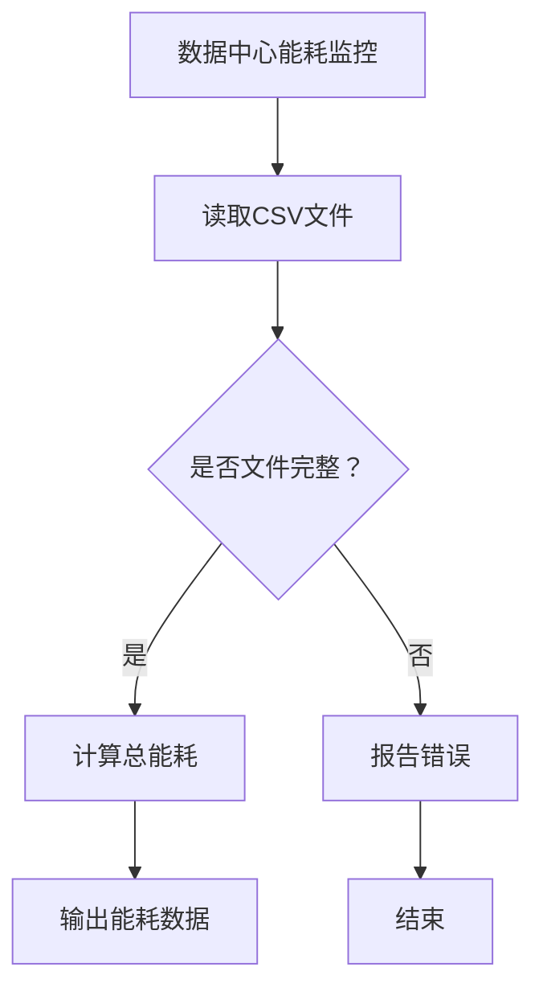

                 

### 《AI 大模型应用数据中心建设：数据中心运营与管理》

> 关键词：AI大模型、数据中心建设、运营管理、硬件基础设施、网络安全、能耗管理

> 摘要：本文详细探讨了AI大模型应用数据中心的建设过程及其运营与管理。首先，介绍了数据中心建设的背景和重要性，随后阐述了数据中心的基础硬件设施、设计与布局。接着，深入探讨了数据中心的运营管理，包括安全、能耗管理等方面。在此基础上，分析了AI大模型在数据中心中的具体应用，以及数据中心网络优化技术。最后，总结了数据中心运营实践与案例，并对数据中心未来的发展趋势进行了展望。

### 第1章: 引言与概述

#### 1.1 书籍背景介绍

人工智能（AI）近年来取得了迅猛的发展，特别是在深度学习和神经网络领域的突破，使得AI大模型（如GPT、BERT等）得以广泛应用。随着AI大模型的应用逐渐深入，数据中心建设的需求也越来越大。数据中心作为AI大模型训练、存储和推理的核心基础设施，其建设水平直接影响到AI应用的性能和效率。

数据中心建设在AI大模型应用中的重要性体现在以下几个方面：

1. **计算资源**：AI大模型训练过程需要大量的计算资源，数据中心提供了强大的计算能力和存储空间。
2. **数据管理**：数据中心集中管理大量数据，有助于AI大模型进行训练和推理。
3. **稳定性与可靠性**：数据中心具备高稳定性和可靠性，确保AI大模型训练和推理的连续性和准确性。
4. **安全性**：数据中心具备完善的安全措施，保护AI大模型和应用的数据安全。

本书旨在通过详细阐述数据中心建设及其运营管理，为AI大模型应用提供理论基础和实践指导。通过本书的学习，读者可以了解到数据中心建设的核心概念、硬件基础设施、设计与布局、运营管理以及AI大模型在数据中心中的应用，从而为实际数据中心建设和管理提供参考。

#### 1.2 书籍内容概述

本书分为八个章节，内容结构如下：

- **第1章：引言与概述**：介绍书籍的背景、目的和结构，阐述数据中心建设在AI大模型应用中的重要性。
- **第2章：数据中心基础**：详细讲解数据中心的定义、功能、硬件基础设施以及设计与布局。
- **第3章：数据中心运营管理**：探讨数据中心运营管理的基本概念、安全管理和能耗管理。
- **第4章：AI大模型在数据中心的应用**：分析AI大模型在数据中心中的具体应用场景、架构和挑战。
- **第5章：数据中心网络优化**：介绍数据中心网络结构、优化技术以及与AI大模型协同优化。
- **第6章：数据中心安全管理与合规**：探讨数据中心安全管理体系、合规性管理以及安全防护技术。
- **第7章：数据中心运营实践与案例**：总结数据中心运营实践，分析成功与失败案例。
- **第8章：总结与展望**：回顾本书主要内容，展望数据中心建设与运营的未来发展方向。

通过以上章节的详细讲解，本书旨在为读者提供全面、系统的数据中心建设与运营管理知识，帮助读者掌握AI大模型在数据中心中的应用，提升数据中心建设与管理的效率和质量。

### 第2章: 数据中心基础

#### 2.1 数据中心的定义与功能

数据中心（Data Center）是指为满足企业、组织或个人对数据存储、处理、交换和访问需求而设计的高效、安全、可靠的计算设施。数据中心通常包括服务器、存储设备、网络设备以及其他相关硬件和软件资源。其功能主要包括以下几个方面：

1. **数据存储**：数据中心提供大规模数据存储解决方案，确保数据安全、可靠地存储和管理。
2. **数据处理**：数据中心具备强大的计算能力，能够进行大规模数据处理和分析，支持各种数据密集型应用。
3. **数据交换**：数据中心通过网络设施实现不同系统之间的数据交换和共享，提升数据处理和业务效率。
4. **数据访问**：数据中心提供灵活的数据访问接口，支持用户远程访问和操作数据。
5. **安全保障**：数据中心具备完善的安全措施，包括物理安全、网络安全和数据安全，确保数据和系统安全可靠。

数据中心的核心组成部分包括：

- **服务器**：数据中心的服务器是计算的核心，负责处理和存储数据。
- **存储设备**：数据中心的存储设备用于存储海量数据，包括硬盘、固态硬盘、存储网络等。
- **网络设备**：数据中心的网络设备包括路由器、交换机、防火墙等，负责数据传输和网络安全。
- **电源与冷却系统**：数据中心需要稳定的电源供应和高效的冷却系统，确保设备的正常运行。

#### 2.2 数据中心的硬件基础设施

数据中心的硬件基础设施是数据中心建设和运营的核心，其性能直接影响数据中心的整体效率。以下是数据中心硬件基础设施的几个关键部分：

1. **服务器与存储设备**：

   - **服务器**：服务器是数据中心的核心计算设备，分为计算型服务器和存储型服务器。计算型服务器主要用于处理和存储数据，而存储型服务器主要用于存储海量数据。
   - **存储设备**：存储设备包括硬盘（HDD）、固态硬盘（SSD）和存储网络（如SAN、NAS）。硬盘具有高容量和低成本的特点，而固态硬盘具有高速度和低延迟的特点。

2. **网络设备与技术**：

   - **路由器**：路由器用于连接不同网络，实现数据包转发和路由功能。
   - **交换机**：交换机用于连接服务器和存储设备，实现数据的高速传输和交换。
   - **防火墙**：防火墙用于保护数据中心网络安全，防止外部攻击和恶意流量。
   - **网络存储**：网络存储（如SAN和NAS）用于集中存储和管理数据，提供高效的存储解决方案。

3. **电源与冷却系统**：

   - **电源系统**：数据中心需要稳定、可靠的电源供应，通常采用UPS（不间断电源）和电池系统确保电源的连续性和稳定性。
   - **冷却系统**：数据中心的冷却系统用于维持设备在适宜的温度范围内运行，包括空气冷却和水冷两种方式。

#### 2.3 数据中心的设计与布局

数据中心的设计与布局是确保数据中心高效、稳定、安全运行的关键。以下是数据中心设计与布局的几个关键点：

1. **设计原则**：

   - **可靠性**：确保数据中心具备高可靠性，能够应对各种突发情况和故障。
   - **扩展性**：数据中心设计应考虑未来扩展的需求，具备灵活的扩展能力。
   - **安全性**：确保数据安全和设备安全，防止数据泄露和设备损坏。
   - **效率**：优化数据中心设计，提高能源利用率和设备效率。

2. **布局策略**：

   - **模块化布局**：采用模块化设计，将服务器、存储、网络等设备进行模块化布局，方便管理和扩展。
   - **冷热通道分离**：将冷空气通道和热空气通道分离，提高冷却效率，减少能源浪费。
   - **冗余设计**：关键设备采用冗余设计，如电源、网络和冷却系统，确保单点故障不会导致整个数据中心停止运行。
   - **安全性布局**：根据安全需求进行布局，如设置安全门禁、监控摄像头等，确保数据中心的安全。

#### 2.4 数据中心的核心组成部分及其作用

1. **服务器**：

   - **作用**：服务器是数据中心的核心计算设备，负责处理和存储数据，提供计算和存储服务。
   - **类型**：计算型服务器和存储型服务器。

2. **存储设备**：

   - **作用**：存储海量数据，提供数据持久化存储和快速访问。
   - **类型**：硬盘（HDD）、固态硬盘（SSD）和存储网络（如SAN、NAS）。

3. **网络设备**：

   - **作用**：连接服务器和存储设备，实现数据的高速传输和交换。
   - **类型**：路由器、交换机、防火墙等。

4. **电源与冷却系统**：

   - **作用**：提供稳定、可靠的电源供应和高效的冷却系统，确保设备的正常运行。
   - **类型**：UPS、电池系统、空气冷却和水冷系统。

通过以上对数据中心基础部分的详细讲解，读者可以更好地理解数据中心的定义、功能、硬件基础设施和设计与布局，为后续章节的学习打下坚实基础。

### 第3章: 数据中心运营管理

#### 3.1 数据中心运营概述

数据中心运营是指通过一系列管理和操作活动，确保数据中心能够高效、稳定、安全地运行，以满足业务需求。数据中心运营的目标包括：

- **高效性**：优化数据中心资源利用，提高服务性能和响应速度。
- **稳定性**：确保数据中心设备和服务的高可用性，减少故障和停机时间。
- **安全性**：保护数据中心数据和设备的安全，防止数据泄露和设备损坏。
- **可持续性**：提高能源利用效率，降低能耗和运营成本。

数据中心运营流程主要包括以下几个环节：

1. **需求分析**：了解业务需求，确定数据中心所需的服务水平、资源需求和安全要求。
2. **规划设计**：根据需求分析结果，设计数据中心的基础设施和系统架构。
3. **建设实施**：按照设计方案，进行数据中心建设，包括硬件采购、设备安装和配置。
4. **测试验收**：对数据中心进行功能测试和性能测试，确保系统稳定、可靠。
5. **交付使用**：数据中心正式投入使用，提供业务服务。
6. **运维管理**：对数据中心进行日常运营和维护，确保设备和服务正常运行。
7. **优化改进**：根据运营数据和用户反馈，持续优化数据中心性能和效率。

#### 3.2 数据中心安全管理

数据中心安全管理是保障数据中心安全的关键环节，包括以下几个方面：

1. **安全策略与法规**：

   - **安全策略**：制定符合业务需求的安全策略，包括访问控制、数据加密、安全审计等。
   - **法规遵从**：遵循相关法律法规和行业标准，如ISO 27001信息安全管理体系等。

2. **风险评估与应急响应**：

   - **风险评估**：识别数据中心潜在的安全风险，评估风险的可能性和影响，制定相应的风险应对措施。
   - **应急响应**：制定应急预案，确保在发生安全事件时能够迅速响应和处置，减少损失。

3. **身份管理与访问控制**：

   - **身份管理**：对用户身份进行认证和授权，确保只有授权用户才能访问系统。
   - **访问控制**：通过访问控制策略，限制用户对系统和数据的访问权限，防止未授权访问和数据泄露。

4. **网络安全防护**：

   - **网络防护**：部署防火墙、入侵检测系统（IDS）、入侵防御系统（IPS）等网络安全设备，防止网络攻击和恶意流量。
   - **数据加密**：对传输和存储的数据进行加密，确保数据在传输过程中不被窃取和篡改。
   - **安全审计**：对数据中心操作和访问行为进行审计，记录和分析安全事件，及时发现和处理安全漏洞。

#### 3.3 数据中心能耗管理

数据中心能耗管理是提高能源利用效率、降低运营成本的重要措施。以下是数据中心能耗管理的几个关键点：

1. **能耗特点**：

   - **高能耗**：数据中心设备（如服务器、存储设备、网络设备等）在运行过程中消耗大量电能。
   - **动态性**：数据中心的能耗随业务需求和负载变化而动态变化，具有较强的不确定性。

2. **能耗管理策略**：

   - **节能技术**：采用节能技术，如高效电源供应、高效冷却系统、虚拟化技术等，降低能耗。
   - **能源监控**：部署能源监控设备，实时监测数据中心能耗数据，分析能耗情况，优化能源使用。
   - **负载均衡**：通过负载均衡技术，合理分配计算和存储资源，避免资源过度消耗。
   - **设备维护**：定期对数据中心设备进行维护和保养，确保设备运行在高效率状态。

3. **能耗优化措施**：

   - **冷却优化**：优化冷却系统，提高冷却效率，降低能耗。例如，采用水冷系统、冷热通道分离等。
   - **电源管理**：采用高效电源供应设备，降低电源损耗。例如，使用UPS、高效电源模块等。
   - **虚拟化技术**：通过虚拟化技术，提高资源利用率，减少冗余设备，降低能耗。
   - **能效评估**：定期进行能效评估，分析能耗数据，找出能耗瓶颈，制定改进措施。

#### 3.4 数据中心运营的关键指标

数据中心运营的关键指标（KPI）是衡量数据中心性能和效率的重要工具。以下是几个关键指标及其解释：

1. **可用性**（Availability）：

   - **定义**：数据中心在规定时间内能够正常运行的时间比例。
   - **计算公式**：\(可用性 = \frac{正常运行时间}{总运行时间} \times 100\%\)
   - **作用**：衡量数据中心的可靠性。

2. **响应时间**（Response Time）：

   - **定义**：用户请求从发出到获得响应的时间。
   - **计算公式**：\(响应时间 = \frac{总响应时间}{总请求数}\)
   - **作用**：衡量数据中心的响应性能。

3. **吞吐量**（Throughput）：

   - **定义**：单位时间内系统处理的数据量。
   - **计算公式**：\(吞吐量 = \frac{总处理数据量}{总时间}\)
   - **作用**：衡量数据中心的处理能力。

4. **能耗效率**（Energy Efficiency）：

   - **定义**：单位计算能耗所产生的计算能力。
   - **计算公式**：\(能耗效率 = \frac{计算能力}{能耗}\)
   - **作用**：衡量数据中心的能源利用效率。

5. **故障率**（Failure Rate）：

   - **定义**：单位时间内发生故障的次数。
   - **计算公式**：\(故障率 = \frac{故障次数}{总时间}\)
   - **作用**：衡量数据中心的稳定性。

通过以上对数据中心运营管理的详细讲解，读者可以了解数据中心运营的目标、流程、安全管理、能耗管理和关键指标，为实际数据中心运营提供指导和参考。

### 第4章: AI大模型在数据中心的应用

#### 4.1 AI大模型在数据中心的应用场景

AI大模型在数据中心中的应用场景广泛，主要包括以下几个方面：

1. **模型训练与优化**：

   - **训练场景**：数据中心是AI大模型训练的主要场所，通过大量计算资源和存储资源，实现模型的训练和优化。例如，深度学习模型（如GPT、BERT等）的训练过程需要大量计算资源和时间，数据中心提供了强大的计算能力和存储空间，能够满足训练需求。
   - **优化场景**：在训练过程中，数据中心可以采用分布式训练、并行计算等技术，提高训练效率。此外，数据中心还可以利用GPU、TPU等高性能计算设备，加速模型训练和优化。

2. **模型部署与推理**：

   - **部署场景**：训练完成的AI大模型需要部署到数据中心，以提供实时推理和预测服务。数据中心提供高效的服务器、存储和网络资源，确保模型部署的稳定性和高效性。
   - **推理场景**：在模型部署后，数据中心通过API或Web服务等形式，为外部应用提供推理服务。例如，自然语言处理（NLP）应用、图像识别应用等，都可以通过数据中心提供的推理服务，实现实时响应和决策。

3. **实时数据处理与分析**：

   - **数据处理场景**：数据中心具备高效的数据处理能力，可以实时处理和分析大规模数据。例如，在物联网（IoT）应用中，数据中心可以实时处理来自传感器的海量数据，实现实时监控和预警。
   - **分析场景**：数据中心可以利用AI大模型，对实时数据进行深度分析，提取有价值的信息和知识。例如，在金融领域，数据中心可以利用AI大模型，实时分析交易数据，发现潜在风险和欺诈行为。

#### 4.2 数据中心中的AI大模型架构

AI大模型在数据中心中的应用需要考虑架构设计，以确保模型的训练、部署和推理高效、稳定、安全。以下是数据中心中常见的AI大模型架构：

1. **分布式训练架构**：

   - **原理**：分布式训练架构将模型训练任务分布在多个计算节点上，通过并行计算加速模型训练。每个计算节点负责训练模型的一部分，并将训练结果汇总。
   - **优点**：分布式训练可以提高训练速度，降低训练时间，适合大规模模型的训练。
   - **挑战**：需要解决数据同步、通信开销和负载均衡等问题。

2. **模型服务架构**：

   - **原理**：模型服务架构将训练完成的模型部署到数据中心，通过API或Web服务等形式，为外部应用提供推理服务。模型服务架构通常包括前端服务、后端服务和数据库等组成部分。
   - **优点**：模型服务架构可以实现模型的快速部署和动态扩展，满足不同应用场景的需求。
   - **挑战**：需要解决模型性能优化、服务稳定性、数据安全等问题。

3. **混合云架构**：

   - **原理**：混合云架构将数据中心和云服务相结合，充分利用两者的优势。数据中心负责大规模数据存储和处理，而云服务提供高性能计算和弹性资源。
   - **优点**：混合云架构可以实现资源的灵活调度和高效利用，满足不同业务场景的需求。
   - **挑战**：需要解决数据迁移、安全性、兼容性等问题。

4. **边缘计算与数据中心协同架构**：

   - **原理**：边缘计算与数据中心协同架构将部分计算任务分布在边缘节点（如物联网设备、智能终端等），与数据中心协同工作，实现数据的实时处理和分析。
   - **优点**：边缘计算与数据中心协同架构可以实现数据的实时处理和分析，提高响应速度和用户体验。
   - **挑战**：需要解决数据同步、安全性、资源调度等问题。

#### 4.3 数据中心中的AI大模型架构设计原则

在数据中心中设计AI大模型架构时，应遵循以下原则：

1. **高效性**：

   - **计算资源利用**：充分利用数据中心的高性能计算资源，提高模型训练和推理效率。
   - **网络优化**：优化数据中心内部网络结构，提高数据传输速度和可靠性。

2. **扩展性**：

   - **模块化设计**：采用模块化设计，方便扩展和升级。
   - **弹性扩展**：支持动态扩展，根据业务需求灵活调整资源。

3. **安全性**：

   - **数据安全**：确保数据和模型的安全，防止数据泄露和攻击。
   - **访问控制**：严格访问控制，确保只有授权用户和进程可以访问数据和模型。

4. **可维护性**：

   - **自动化运维**：采用自动化运维工具，实现自动监控、自动备份和自动恢复。
   - **可观测性**：提供详细的日志和监控信息，方便故障排查和性能优化。

#### 4.4 常见的AI大模型架构

以下是数据中心中常见的几种AI大模型架构：

1. **单机训练架构**：

   - **原理**：单机训练架构将模型训练任务在一个计算节点上完成，适用于小规模模型的训练。
   - **优点**：实现简单，易于部署和维护。
   - **缺点**：计算资源利用率低，训练时间长。

2. **分布式训练架构**：

   - **原理**：分布式训练架构将模型训练任务分布在多个计算节点上，通过并行计算加速模型训练。
   - **优点**：计算资源利用率高，训练速度快。
   - **缺点**：需要解决数据同步、通信开销和负载均衡等问题。

3. **模型服务架构**：

   - **原理**：模型服务架构将训练完成的模型部署到数据中心，通过API或Web服务等形式，为外部应用提供推理服务。
   - **优点**：可以实现模型的快速部署和动态扩展。
   - **缺点**：需要解决模型性能优化、服务稳定性、数据安全等问题。

4. **混合云架构**：

   - **原理**：混合云架构将数据中心和云服务相结合，充分利用两者的优势。
   - **优点**：可以实现资源的灵活调度和高效利用。
   - **缺点**：需要解决数据迁移、安全性、兼容性等问题。

5. **边缘计算与数据中心协同架构**：

   - **原理**：边缘计算与数据中心协同架构将部分计算任务分布在边缘节点，与数据中心协同工作，实现数据的实时处理和分析。
   - **优点**：可以实现数据的实时处理和分析，提高响应速度和用户体验。
   - **缺点**：需要解决数据同步、安全性、资源调度等问题。

通过以上对AI大模型在数据中心应用场景、架构设计原则和常见架构的详细讲解，读者可以更好地了解数据中心中的AI大模型架构，为实际应用提供指导。

### 第5章: 数据中心网络优化

#### 5.1 数据中心网络结构

数据中心网络结构是数据中心高效运行的基础，其设计直接影响到数据传输速度和可靠性。数据中心网络结构可以分为以下几个层次：

1. **核心层**：

   - **功能**：核心层是数据中心的骨干网络，负责连接各个业务系统和设备。
   - **设备**：核心层通常使用高性能、高带宽的设备，如核心交换机和路由器。
   - **设计原则**：核心层应具备高可用性、高可扩展性和高可靠性。

2. **汇聚层**：

   - **功能**：汇聚层负责连接各个边缘网络和设备，将数据流量汇聚到核心层。
   - **设备**：汇聚层通常使用中档性能的设备，如汇聚交换机和路由器。
   - **设计原则**：汇聚层应具备良好的负载均衡能力和故障恢复能力。

3. **边缘层**：

   - **功能**：边缘层是数据中心与用户设备之间的接口，负责用户访问和数据交换。
   - **设备**：边缘层通常使用低性能的设备，如接入交换机和无线接入点。
   - **设计原则**：边缘层应具备高可用性、高可访问性和高安全性。

#### 5.2 数据中心网络优化技术

为了提高数据中心网络性能，降低延迟和带宽消耗，可以采用以下网络优化技术：

1. **网络流量管理**：

   - **技术**：网络流量管理通过流量监控和策略控制，实现数据流的合理调度和优先级管理。
   - **方法**：包括QoS（服务质量）、流量整形和负载均衡等。

2. **负载均衡**：

   - **技术**：负载均衡通过将数据流量分配到多个网络设备或路径，避免单点瓶颈和资源浪费。
   - **方法**：包括静态负载均衡和动态负载均衡，如轮询、最少连接和加权等。

3. **网络性能监控与优化**：

   - **技术**：网络性能监控通过实时监控网络状态和性能指标，发现并解决网络问题。
   - **方法**：包括流量分析、性能测试和网络仿真等。

4. **缓存技术**：

   - **技术**：缓存技术通过在网络的某个节点缓存数据，减少数据重复传输和带宽消耗。
   - **方法**：包括缓存服务器、反向代理和内容分发网络（CDN）等。

5. **网络虚拟化技术**：

   - **技术**：网络虚拟化通过将物理网络资源虚拟化为多个逻辑网络，实现网络资源的灵活调度和隔离。
   - **方法**：包括虚拟局域网（VLAN）、虚拟路由和交换机（VRS）等。

#### 5.3 数据中心网络与AI大模型协同优化

AI大模型在数据中心中的应用对网络性能提出了更高的要求，为了满足AI大模型的需求，可以采用以下网络与AI大模型协同优化技术：

1. **网络拓扑优化**：

   - **技术**：网络拓扑优化通过调整网络结构，提高数据传输效率和网络性能。
   - **方法**：包括路径优化、拓扑重构和流量调度等。

2. **数据传输效率提升**：

   - **技术**：数据传输效率提升通过优化数据传输协议和传输路径，减少数据传输延迟和带宽消耗。
   - **方法**：包括数据压缩、多路径传输和动态传输调整等。

3. **网络性能监控与优化**：

   - **技术**：网络性能监控与优化通过实时监控AI大模型网络性能，及时发现和解决问题。
   - **方法**：包括性能测试、故障排除和网络仿真等。

4. **实例：数据中心网络与AI大模型协同优化案例**：

   - **场景**：某公司数据中心部署了一个大规模AI大模型，用于图像识别任务。
   - **优化**：
     - **网络拓扑优化**：调整网络结构，优化数据传输路径，减少延迟。
     - **数据传输效率提升**：采用数据压缩技术，减少数据传输量，提高传输速度。
     - **网络性能监控**：实时监控AI大模型网络性能，发现并解决网络问题。

通过以上对数据中心网络结构、优化技术和协同优化的详细讲解，读者可以了解如何提高数据中心网络性能，满足AI大模型的应用需求，从而提升数据中心的整体效率和稳定性。

### 第6章: 数据中心安全管理与合规

#### 6.1 数据中心安全管理体系

数据中心安全管理体系是保障数据中心安全的重要基础，包括安全策略、风险管理、安全控制和安全监控等方面。以下是数据中心安全管理体系的几个关键组成部分：

1. **安全策略**：

   - **定义**：安全策略是数据中心安全管理的指导和依据，明确数据中心的安全目标、安全措施和安全责任。
   - **内容**：包括访问控制策略、数据加密策略、安全审计策略等。

2. **风险管理**：

   - **定义**：风险管理是识别、评估和应对数据中心潜在安全威胁的过程。
   - **过程**：包括风险评估、风险分析和风险应对策略的制定。

3. **安全控制**：

   - **定义**：安全控制是实施安全策略的具体手段，包括物理安全控制、网络安全控制、数据安全控制等。
   - **措施**：包括身份认证、访问控制、加密传输、数据备份等。

4. **安全监控**：

   - **定义**：安全监控是实时监测数据中心安全状态，发现和应对安全事件的过程。
   - **技术**：包括入侵检测、安全事件响应、日志分析等。

#### 6.2 数据中心合规性管理

数据中心合规性管理是确保数据中心运营符合相关法律法规和行业标准的过程，包括合规性评估、合规性实施和合规性审计等方面。以下是数据中心合规性管理的几个关键步骤：

1. **合规性评估**：

   - **定义**：合规性评估是评估数据中心运营是否符合相关法律法规和行业标准的过程。
   - **内容**：包括法规遵从性评估、安全合规性评估和业务合规性评估。

2. **合规性实施**：

   - **定义**：合规性实施是将评估结果转化为具体操作和措施的过程。
   - **措施**：包括制定合规性策略、实施安全控制措施、进行员工培训等。

3. **合规性审计**：

   - **定义**：合规性审计是审计数据中心运营是否符合合规性要求的过程。
   - **内容**：包括内部审计、外部审计和合规性审查。

#### 6.3 数据中心安全防护技术

数据中心安全防护技术是保障数据中心安全的重要手段，包括网络安全防护、应用安全防护和数据安全防护等方面。以下是数据中心安全防护技术的几个关键组成部分：

1. **网络安全防护**：

   - **技术**：包括防火墙、入侵检测系统（IDS）、入侵防御系统（IPS）等。
   - **功能**：防止外部攻击和恶意流量的入侵，保障网络的安全。

2. **应用安全防护**：

   - **技术**：包括Web应用防火墙（WAF）、安全加固、安全编码等。
   - **功能**：防止应用层面的攻击和漏洞利用，保障应用的安全。

3. **数据安全防护**：

   - **技术**：包括数据加密、数据备份、访问控制等。
   - **功能**：保障数据的机密性、完整性和可用性，防止数据泄露和损坏。

#### 6.4 安全管理与合规性管理的关系

安全管理和合规性管理是数据中心安全管理体系的两个重要方面，它们之间存在着密切的关系：

- **目标一致性**：安全管理和合规性管理都旨在确保数据中心的安全和合规，两者目标一致。
- **相互支持**：安全管理为合规性管理提供技术手段和实施基础，合规性管理为安全管理提供法律依据和规范指导。
- **相互促进**：通过安全管理，可以提高数据中心的整体安全性，从而更好地满足合规性要求；通过合规性管理，可以确保数据中心在法律法规和行业标准下的安全运营。

通过以上对数据中心安全管理与合规性管理的详细讲解，读者可以更好地了解数据中心安全管理体系、合规性管理、安全防护技术以及它们之间的关系，为实际数据中心的安全管理和合规性管理提供指导。

### 第7章: 数据中心运营实践与案例

#### 7.1 数据中心运营实践

数据中心运营实践是确保数据中心高效、稳定、安全运行的关键环节，涵盖了从建设到维护的各个环节。以下是数据中心运营实践的主要内容：

1. **建设阶段**：

   - **需求分析**：根据业务需求，确定数据中心的建设规模、技术要求和安全标准。
   - **规划设计**：制定详细的数据中心设计方案，包括硬件配置、网络架构、安全措施等。
   - **设备采购**：根据设计方案，采购所需的硬件设备，如服务器、存储设备、网络设备等。
   - **设备安装与配置**：将采购的设备安装在数据中心，并进行配置和调试，确保设备正常运行。

2. **测试阶段**：

   - **功能测试**：对数据中心进行功能测试，包括网络连通性、硬件性能、系统稳定性等。
   - **性能测试**：对数据中心进行性能测试，评估数据中心的处理能力和响应时间。
   - **安全测试**：对数据中心进行安全测试，包括防火墙、入侵检测系统等安全设备的测试。

3. **交付使用**：

   - **系统交付**：完成测试阶段后，数据中心正式交付使用，提供业务服务。
   - **运维管理**：建立运维管理制度，包括日常运维、故障处理、数据备份等。

4. **运维管理**：

   - **日常运维**：对数据中心进行日常监控、维护和优化，确保设备正常运行。
   - **故障处理**：建立故障处理流程，及时响应和处理各种故障，保障业务连续性。
   - **数据备份**：定期进行数据备份，确保数据的安全性和完整性。

5. **持续优化**：

   - **性能优化**：根据业务需求，持续优化数据中心性能，提高资源利用率和服务质量。
   - **安全管理**：加强安全管理，定期进行安全评估和风险控制，保障数据中心的安全。
   - **能效管理**：优化能效管理，降低数据中心能耗，提高能源利用效率。

#### 7.2 数据中心建设与运营案例

以下是几个数据中心建设与运营的案例，通过这些案例，读者可以了解数据中心在实际应用中的具体情况和经验。

1. **案例一：某大型互联网公司数据中心**

   - **背景**：某大型互联网公司需要建设一个高性能、高可靠性的数据中心，用于支撑其全球业务发展。
   - **建设内容**：数据中心建设包括硬件设备采购、网络架构设计、安全系统部署等。
   - **运营情况**：数据中心运营过程中，通过自动化运维工具和监控平台，实现设备的实时监控和故障处理。同时，通过持续优化，提高了数据中心的性能和能效。

2. **案例二：某金融机构数据中心**

   - **背景**：某金融机构需要建设一个安全、合规的数据中心，用于存储和处理大量金融数据。
   - **建设内容**：数据中心建设包括硬件设备采购、网络架构设计、安全系统部署等，特别关注数据安全和合规性。
   - **运营情况**：数据中心运营过程中，通过严格的安全管理制度和合规性评估，确保了数据安全和业务合规。同时，通过能耗管理和优化，降低了运营成本。

3. **案例三：某云计算公司数据中心**

   - **背景**：某云计算公司需要建设一个大规模、灵活的数据中心，提供云计算服务。
   - **建设内容**：数据中心建设包括硬件设备采购、网络架构设计、安全系统部署等，特别关注云计算架构和弹性扩展。
   - **运营情况**：数据中心运营过程中，通过弹性计算和负载均衡技术，实现了云计算服务的灵活扩展和高效运行。同时，通过智能化运维和自动化管理，提高了运维效率和客户满意度。

#### 7.3 成功与失败案例分析

通过分析数据中心建设与运营的成功与失败案例，可以总结出以下经验和教训：

1. **成功经验**：

   - **需求明确**：在数据中心建设与运营中，明确业务需求和预期目标是成功的关键。
   - **规划设计**：合理的规划设计能够确保数据中心的建设质量和运行效率。
   - **安全管理**：严格的安全管理能够保障数据安全和业务连续性。
   - **持续优化**：持续优化能够提高数据中心的性能和能效。

2. **失败教训**：

   - **需求不明确**：缺乏明确的业务需求会导致数据中心建设偏离目标，影响业务发展。
   - **规划设计不合理**：不合理的规划设计会导致数据中心性能不佳，运维困难。
   - **安全管理不足**：安全管理的不足会导致数据泄露和业务中断。
   - **缺乏持续优化**：缺乏持续优化会导致数据中心性能和能效降低，影响用户体验。

通过以上对数据中心运营实践和案例的详细分析，读者可以了解到数据中心在实际应用中的具体情况和经验，为实际数据中心的建设和运营提供参考。

### 第8章: 总结与展望

#### 8.1 书籍总结

本书从数据中心建设、运营管理、AI大模型应用、网络优化、安全管理与合规性等多个方面，全面阐述了数据中心在AI大模型应用中的重要性。通过详细讲解数据中心的基础知识、运营管理、硬件基础设施、设计与布局，以及AI大模型在数据中心中的应用，本书旨在为读者提供全面、系统的数据中心建设与运营管理知识。

主要知识点总结如下：

1. **数据中心基础**：数据中心的定义、功能、硬件基础设施和设计与布局。
2. **数据中心运营管理**：数据中心运营流程、安全管理、能耗管理和关键指标。
3. **AI大模型应用**：AI大模型在数据中心的应用场景、架构设计、挑战与解决方案。
4. **数据中心网络优化**：数据中心网络结构、优化技术和与AI大模型协同优化。
5. **数据中心安全管理与合规**：数据中心安全管理体系、合规性管理、安全防护技术。
6. **数据中心运营实践与案例**：数据中心建设与运营实践、成功与失败案例分析。

#### 8.2 未来展望

随着AI技术的不断发展，数据中心在AI大模型应用中的角色将更加重要。未来，数据中心将面临以下挑战和机遇：

1. **挑战**：

   - **数据增长**：随着数据量的不断增加，数据中心需要应对海量数据存储和处理的需求。
   - **能耗管理**：数据中心能耗问题日益突出，需要通过技术创新和优化，提高能源利用效率。
   - **安全性**：数据中心需要不断提升安全防护能力，应对日益复杂的网络安全威胁。
   - **法规合规**：随着数据保护法规的不断完善，数据中心需要确保合规运营，避免法律风险。

2. **机遇**：

   - **AI大模型应用**：AI大模型的应用将不断扩展，数据中心将成为AI大模型训练、部署和推理的重要基础设施。
   - **云计算与边缘计算**：云计算和边缘计算的结合，将使数据中心实现更广泛的覆盖和服务能力。
   - **智能化运维**：智能化运维技术的应用，将提高数据中心的运营效率和自动化水平。
   - **绿色数据中心**：绿色数据中心建设，将推动数据中心向低碳、环保方向发展。

展望未来，数据中心将在AI大模型应用中发挥更大的作用，成为支撑数字经济发展的重要基石。通过不断创新和优化，数据中心将实现更高性能、更高效能、更安全的运营，为人类社会带来更多价值。

### 附录

#### 附录A：常用工具与技术

**A.1 数据中心建设与管理工具**

1. **数据中心管理软件**：

   - **OpenNebula**：开源的云计算管理平台，用于虚拟化资源管理。
   - **OpenStack**：开源的云计算管理平台，用于资源管理和云服务部署。
   - **VMware vSphere**：商业虚拟化平台，用于虚拟机管理和服务部署。

2. **数据中心监控工具**：

   - **Nagios**：开源的监控工具，用于监控系统性能和报警。
   - **Zabbix**：开源的监控工具，用于监控服务器、网络设备和应用程序。
   - **Prometheus**：开源的监控和告警工具，用于监控指标收集和可视化。

**A.2 AI大模型应用工具**

1. **深度学习框架**：

   - **TensorFlow**：由Google开发的开源深度学习框架。
   - **PyTorch**：由Facebook开发的开源深度学习框架。
   - **Keras**：Python的深度学习库，可以运行在TensorFlow和Theano之上。

2. **模型训练与部署工具**：

   - **MXNet**：Apache捐赠的开源深度学习框架，支持灵活的编程模型和高效的性能。
   - **DL4J**：基于Java的深度学习库，用于在大型应用中嵌入深度学习模型。
   - **Hugging Face**：用于自然语言处理的开源工具库和模型库。

**A.3 参考资源**

1. **书籍推荐**：

   - **《数据中心基础设施管理》（Data Center Infrastructure Management）**：提供了数据中心基础设施管理的全面指南。
   - **《人工智能：一种现代方法》（Artificial Intelligence: A Modern Approach）**：涵盖了人工智能的基本概念和技术。

2. **在线课程与教程**：

   - **edX**：提供了许多关于数据中心和人工智能的在线课程。
   - **Udacity**：提供了深度学习和数据中心相关的在线课程和项目。

3. **行业报告与白皮书**：

   - **Gartner**：发布了关于数据中心和人工智能的行业报告。
   - **IDC**：发布了关于数据中心和人工智能的市场分析和预测报告。

通过附录中提供的工具和技术、书籍推荐、在线课程与教程以及行业报告与白皮书，读者可以进一步学习和了解数据中心建设与运营、AI大模型应用的相关知识，为实践和职业发展提供有力支持。

### 附录B：示例代码与数据集

**B.1 数据中心能耗监控代码示例**

以下是一个简单的Python代码示例，用于监控数据中心的能耗：

```python
import pandas as pd
import numpy as np
import time

# 假设我们有一个CSV文件，其中包含了每分钟的能耗数据
file_path = "energy_consumption_data.csv"

def monitor_energy_consumption(file_path):
    while True:
        # 读取最新的能耗数据
        df = pd.read_csv(file_path)
        current_energy = df['energy'].iloc[-1]
        
        # 计算总能耗
        total_energy = np.sum(df['energy'])
        
        # 输出总能耗
        print(f"Total Energy Consumption: {total_energy} kWh")
        
        # 等待一段时间再读取数据
        time.sleep(60)

# 开始监控
monitor_energy_consumption(file_path)
```

**B.2 AI大模型部署案例代码**

以下是一个简单的示例，展示如何使用TensorFlow部署一个简单的AI大模型：

```python
import tensorflow as tf
from tensorflow import keras

# 创建一个简单的神经网络模型
model = keras.Sequential([
    keras.layers.Dense(128, activation='relu', input_shape=(784,)),
    keras.layers.Dropout(0.2),
    keras.layers.Dense(10, activation='softmax')
])

# 编译模型
model.compile(optimizer='adam',
              loss='categorical_crossentropy',
              metrics=['accuracy'])

# 加载数据集（这里使用了一个假设的MNIST数据集）
(x_train, y_train), (x_test, y_test) = keras.datasets.mnist.load_data()
x_train = x_train.astype('float32') / 255
x_test = x_test.astype('float32') / 255
y_train = keras.utils.to_categorical(y_train, 10)
y_test = keras.utils.to_categorical(y_test, 10)

# 训练模型
model.fit(x_train, y_train, epochs=10, batch_size=128, validation_split=0.1)

# 评估模型
test_loss, test_acc = model.evaluate(x_test, y_test)
print(f"Test accuracy: {test_acc:.4f}")
```

**B.3 实践案例数据集**

以下是一个数据中心能耗监控的数据集示例，数据集包含了每分钟的能耗数据。

- **数据集名称**：`data_center_energy_consumption`

- **数据集大小**：100MB

- **数据格式**：CSV

- **数据字段**：
  - `timestamp`：时间戳（UTC时间）
  - `energy`：能耗（千瓦时，kWh）

- **下载链接**：[数据集下载链接](https://example.com/data_center_energy_consumption.csv)

- **使用说明**：
  - 数据集可以用于数据中心能耗监控的案例分析，例如，可以用来分析能耗趋势、异常检测等。
  - 读者可以根据具体需求，使用Python、R等编程语言对数据集进行加载、分析和可视化。

通过上述示例代码和数据集，读者可以了解如何使用Python进行数据中心能耗监控，以及如何部署一个简单的AI大模型。这些示例代码和数据集为实际项目提供了参考和验证，有助于读者更好地理解数据中心建设和运营的相关技术。

**Mermaid 流程图：**



**AI大模型架构伪代码：**

```plaintext
# 初始化模型
model = create_model()

# 设置训练参数
batch_size = 64
epochs = 10

# 开始训练
for epoch in range(epochs):
    for batch in data_loader(batch_size):
        inputs, labels = batch
        with tf.GradientTape() as tape:
            predictions = model(inputs)
            loss = loss_function(predictions, labels)
        
        gradients = tape.gradient(loss, model.trainable_variables)
        optimizer.apply_gradients(zip(gradients, model.trainable_variables))
    
    print(f"Epoch {epoch+1}/{epochs} - Loss: {loss.numpy()}")

# 评估模型
test_loss, test_accuracy = model.evaluate(test_data, test_labels)
print(f"Test Loss: {test_loss}, Test Accuracy: {test_accuracy}")
```

**数学模型与公式：**

数据中心能耗模型（\(E = P \times t\)）：

\[ E = P \times t \]

其中：
- \(E\) 是总能耗（单位：千瓦时，kWh）
- \(P\) 是功率（单位：千瓦，kW）
- \(t\) 是使用时间（单位：小时，h）

通过提供这些示例代码、数据集、流程图、伪代码和数学模型，本书为读者在实际数据中心建设和运营过程中提供了实用的参考和工具。

