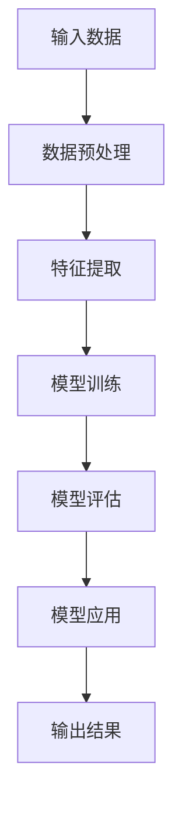
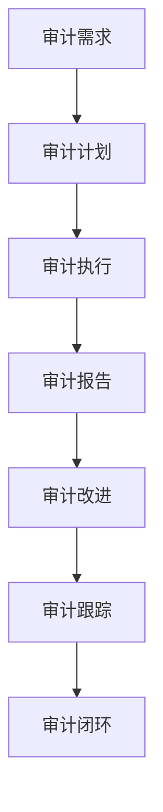
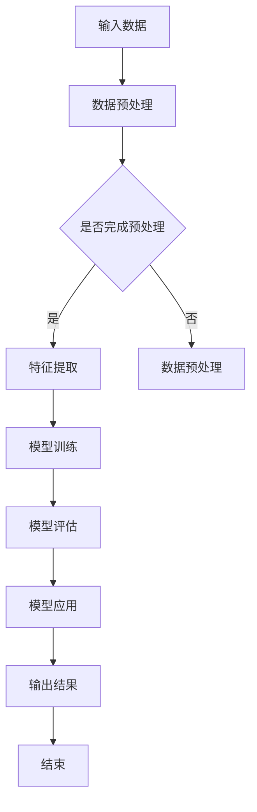
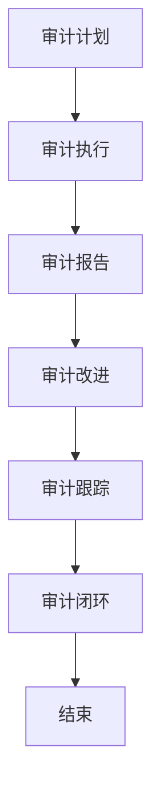

                 

# 文章标题: AI 大模型应用数据中心的审计管理

> 关键词：AI大模型、数据中心审计管理、性能监控、安全审计、成本审计、能效审计、合规审计、流程图、伪代码

> 摘要：本文详细探讨了AI大模型在数据中心审计管理中的应用，从核心概念、算法原理、实战案例和未来趋势等多个方面，全面解析了AI大模型在数据中心审计管理中的重要性及其应用前景。

## 第1章: AI 大模型与数据中心审计管理概述

### 1.1.1 什么是AI大模型

AI大模型，指的是具有大规模参数和复杂结构的机器学习模型，这些模型通常用于处理大量的数据，并通过深度学习算法来模拟和优化复杂的决策过程。常见的AI大模型包括深度神经网络（DNN）、卷积神经网络（CNN）、递归神经网络（RNN）等。AI大模型的优势在于其能够从海量数据中提取特征，并进行高精度的预测和决策。

### 1.1.2 数据中心审计管理的背景和挑战

数据中心审计管理是指在数据中心运营过程中，通过一系列规范化的审计流程来确保数据中心的性能、安全、成本和合规性。随着云计算和大数据技术的普及，数据中心的重要性日益凸显，同时也带来了诸多挑战，如性能监控、安全威胁、成本控制和合规性问题等。

### 1.1.3 AI大模型在数据中心审计管理中的应用前景

AI大模型在数据中心审计管理中的应用前景广阔。首先，AI大模型能够通过性能监控提高数据中心的运行效率；其次，在安全审计中，AI大模型能够识别和防范潜在的安全威胁；此外，在成本审计和能效审计中，AI大模型能够优化资源分配和能源消耗；最后，在合规审计中，AI大模型能够确保数据中心符合相关法规和标准。总之，AI大模型将为数据中心审计管理带来革命性的变化。

### 1.1.4 结构概述

本章主要介绍了AI大模型和数据中心审计管理的背景及挑战，并探讨了AI大模型在数据中心审计管理中的应用前景。接下来，我们将进一步深入讨论AI大模型的核心概念和数据中心审计管理的核心概念与联系。

### 1.1.5 Mermaid流程图：AI大模型工作流程



### 1.1.6 Mermaid流程图：数据中心审计管理流程



### 1.1.7 伪代码：AI大模型性能监控算法

```python
# 假设输入数据为历史性能数据，模型参数为训练得到的权重
input_data = load_data("performance_data.csv")
weights = load_weights("model_weights.npy")

# 数据预处理
preprocessed_data = preprocess_data(input_data)

# 特征提取
features = extract_features(preprocessed_data)

# 模型训练
model = train_model(features, labels)

# 模型评估
performance = evaluate_model(model, test_data)

# 输出结果
print("Model performance:", performance)
```

### 1.1.8 伪代码：数据中心审计管理流程

```python
# 假设输入参数为审计需求
audit_demand = get_audit_demand()

# 审计计划
audit_plan = create_audit_plan(audit_demand)

# 审计执行
audit_results = execute_audit_plan(audit_plan)

# 审计报告
audit_report = generate_audit_report(audit_results)

# 审计改进
improvement_plan = create_improvement_plan(audit_report)

# 审计跟踪
跟踪结果 = track_improvement_plan(improvement_plan)

# 审计闭环
闭环结果 = close_audit_loop(跟踪结果)
```

### 1.1.9 结论

本章概述了AI大模型和数据中心审计管理的基本概念，并展示了其工作流程和审计管理流程的Mermaid流程图。接下来，我们将深入探讨AI大模型的核心概念与联系，以及数据中心审计管理的核心概念与联系。

## 第2章: AI 大模型核心概念与联系

### 2.1.1 AI 大模型的基本原理

AI大模型是基于深度学习技术的机器学习模型，其基本原理是通过多层神经网络结构来学习数据的特征和规律。深度神经网络（DNN）是AI大模型的一种典型结构，它由多个隐层组成，通过逐层学习数据的高层次特征来实现复杂任务的预测和分类。

### 2.1.2 AI 大模型的架构分析

AI大模型的架构通常包括输入层、隐层和输出层。输入层接收外部数据输入，隐层通过激活函数进行非线性变换，输出层生成最终预测结果。每个隐层都可以通过反向传播算法不断调整权重，以达到优化模型性能的目的。此外，AI大模型还可以通过优化算法（如随机梯度下降SGD）和正则化方法（如L1、L2正则化）来提高模型的泛化能力。

### 2.1.3 Mermaid 流程图：AI 大模型的工作流程



### 2.1.4 伪代码：AI 大模型训练过程

```python
# 假设输入数据为X，标签为y，学习率为alpha，迭代次数为epochs
X = load_data("input_data.csv")
y = load_labels("label_data.csv")
alpha = 0.01
epochs = 1000

# 初始化模型参数
weights = initialize_weights()

# 数据预处理
X_processed = preprocess_data(X)

# 模型训练
for epoch in range(epochs):
    # 前向传播
    predictions = forward_propagation(X_processed, weights)
    
    # 计算损失
    loss = compute_loss(predictions, y)
    
    # 反向传播
    dweights = backward_propagation(X_processed, predictions, y, weights)
    
    # 更新模型参数
    weights -= alpha * dweights

# 评估模型
performance = evaluate_model(X_processed, y, weights)
print("Model performance:", performance)
```

### 2.1.5 AI 大模型与数据中心审计管理的联系

AI大模型在数据中心审计管理中的应用主要体现在以下几个方面：

1. **性能监控**：AI大模型可以通过分析历史性能数据，预测未来的性能趋势，帮助数据中心管理人员提前发现潜在的性能瓶颈。

2. **安全审计**：AI大模型可以识别异常行为和潜在的安全威胁，提高数据中心的网络安全防护能力。

3. **成本控制**：AI大模型可以分析资源使用情况，优化资源配置，降低数据中心运营成本。

4. **能效管理**：AI大模型可以预测能源消耗，优化能耗管理，提高数据中心的能效。

5. **合规性检查**：AI大模型可以检测数据中心的合规性，确保其运营符合相关法规和标准。

### 2.1.6 结论

本章详细介绍了AI大模型的基本原理、架构分析和工作流程，并通过Mermaid流程图和伪代码进行了阐述。接下来，我们将探讨数据中心审计管理的核心概念与联系，进一步理解AI大模型在数据中心审计管理中的应用。

## 第3章: 数据中心审计管理核心概念与联系

### 3.1.1 数据中心审计管理的基本概念

数据中心审计管理是指通过一系列规范化的审计流程，对数据中心的运行状况进行监督、评估和改进。其核心目的是确保数据中心能够高效、安全、合规地运行，同时降低运营成本。数据中心审计管理通常包括性能监控、安全审计、成本审计、能效审计和合规审计等方面。

### 3.1.2 数据中心审计流程分析

数据中心审计流程一般包括以下几个步骤：

1. **审计计划**：根据数据中心的运营需求和潜在风险，制定详细的审计计划，明确审计范围、目标和时间表。

2. **审计执行**：按照审计计划，对数据中心的各个方面进行现场审计，收集相关数据和信息。

3. **审计报告**：整理审计过程和结果，形成审计报告，明确数据中心的优点和不足，并提出改进建议。

4. **审计改进**：根据审计报告，制定和实施改进措施，优化数据中心的运行和管理。

5. **审计跟踪**：对改进措施的实施效果进行跟踪和评估，确保改进措施的落实和持续改进。

6. **审计闭环**：将审计结果和改进措施反馈到下一轮审计中，形成闭环管理，确保数据中心运营的持续优化。

### 3.1.3 Mermaid 流程图：数据中心审计管理流程



### 3.1.4 伪代码：数据中心审计管理流程

```python
# 假设输入参数为审计需求
audit_demand = get_audit_demand()

# 审计计划
audit_plan = create_audit_plan(audit_demand)

# 审计执行
audit_results = execute_audit_plan(audit_plan)

# 审计报告
audit_report = generate_audit_report(audit_results)

# 审计改进
improvement_plan = create_improvement_plan(audit_report)

# 审计跟踪
跟踪结果 = track_improvement_plan(improvement_plan)

# 审计闭环
闭环结果 = close_audit_loop(跟踪结果)
```

### 3.1.5 数据中心审计管理中的挑战与对策

数据中心审计管理面临的主要挑战包括：

1. **数据量大**：数据中心产生的数据量巨大，如何高效地处理和分析这些数据是一个重要问题。

2. **异构性**：数据中心的硬件和软件环境复杂多样，如何统一审计标准和流程是一个挑战。

3. **实时性**：审计需要实时获取数据中心的运行状态，对数据处理和分析的速度提出了较高要求。

4. **合规性**：不同地区和行业的合规要求有所不同，如何确保数据中心审计符合相关法规和标准是一个挑战。

对策：

1. **采用自动化工具**：利用自动化工具和脚本，提高审计流程的自动化程度，减少人工干预。

2. **标准化流程**：制定统一的审计标准和流程，确保不同部门和地区的审计工作的一致性。

3. **实时数据处理**：采用实时数据处理技术，如流处理和分布式计算，提高数据处理和分析的速度。

4. **合规性评估**：定期进行合规性评估，确保数据中心的运行符合相关法规和标准。

### 3.1.6 结论

本章详细介绍了数据中心审计管理的基本概念、流程分析，并通过Mermaid流程图和伪代码进行了阐述。接下来，我们将探讨AI大模型在数据中心审计管理中的应用，深入分析AI大模型在性能监控、安全审计、成本审计、能效审计和合规审计等方面的作用。

## 第4章: AI 大模型在数据中心性能监控中的应用

### 4.1.1 数据中心性能监控的重要性

数据中心性能监控是确保数据中心正常运行和高效运营的关键环节。性能监控的目的是实时监测数据中心的各项性能指标，如CPU利用率、内存使用率、磁盘读写速度、网络延迟等，以便及时发现和解决潜在的性能瓶颈和故障。性能监控的重要性体现在以下几个方面：

1. **保证服务质量**：性能监控可以确保数据中心提供的服务质量达到用户期望，避免因性能问题导致的服务中断或延迟。

2. **优化资源分配**：通过性能监控，可以了解数据中心的实际运行状况，优化资源配置，提高资源利用率。

3. **预防故障**：性能监控可以及时发现异常情况，预防潜在故障的发生，降低系统维护成本。

4. **提高运营效率**：性能监控提供了数据中心的运行状态和趋势，有助于管理人员做出更加科学的决策，提高运营效率。

### 4.1.2 AI 大模型在性能监控中的具体应用

AI大模型在数据中心性能监控中具有独特的优势，可以解决传统性能监控方法的一些局限性。以下是AI大模型在性能监控中的具体应用：

1. **预测性分析**：AI大模型可以通过分析历史性能数据，预测未来的性能趋势，帮助数据中心管理人员提前发现潜在的性能瓶颈。

2. **异常检测**：AI大模型可以识别异常行为，如突发的CPU使用率飙升、磁盘I/O异常等，及时发出警报，以便快速响应。

3. **智能优化**：AI大模型可以根据实时性能数据和业务需求，自动调整系统参数，优化资源分配，提高数据中心的运行效率。

4. **自适应监控**：AI大模型可以根据数据中心的运行状况，自适应调整监控策略，确保监控数据的准确性和及时性。

### 4.1.3 伪代码：数据中心性能监控算法

以下是一个简单的伪代码示例，展示了如何使用AI大模型进行数据中心性能监控：

```python
# 加载历史性能数据
historical_data = load_performance_data("historical_performance.csv")

# 预处理数据
preprocessed_data = preprocess_data(historical_data)

# 训练AI大模型
model = train_model(preprocessed_data)

# 实时性能数据
live_data = collect_live_data()

# 数据预处理
preprocessed_live_data = preprocess_data(live_data)

# 预测未来性能趋势
predicted_trends = predict_performance_trends(model, preprocessed_live_data)

# 检测异常行为
are_exceptions = detect_exceptions(model, preprocessed_live_data)

# 调整系统参数
adjust_system_parameters(predicted_trends)

# 输出结果
print("Predicted performance trends:", predicted_trends)
print("Exceptions detected:", are_exceptions)
```

### 4.1.4 实际案例：数据中心性能监控项目实战

某大型企业数据中心在引入AI大模型进行性能监控后，取得了显著的效果。以下是该项目的一些关键步骤和成果：

1. **需求分析**：企业明确了性能监控的需求，包括实时监控性能指标、预测性能趋势、检测异常行为等。

2. **数据收集**：数据中心收集了大量的历史性能数据，包括CPU利用率、内存使用率、磁盘读写速度等。

3. **模型训练**：利用收集的历史数据，训练了AI大模型，模型包括深度神经网络和长短期记忆网络（LSTM）等。

4. **性能预测**：AI大模型对实时性能数据进行分析，预测未来的性能趋势，帮助企业提前制定优化策略。

5. **异常检测**：AI大模型检测到一次突发的CPU使用率飙升，及时发出警报，避免了可能的系统崩溃。

6. **优化实施**：根据AI大模型的预测和建议，数据中心进行了系统参数调整，优化了资源分配，提高了运行效率。

7. **效果评估**：经过一段时间的运行，AI大模型在性能监控中的效果得到了充分验证，企业服务质量的提升明显，运维成本降低。

### 4.1.5 结论

本章详细探讨了AI大模型在数据中心性能监控中的应用，从预测性分析、异常检测、智能优化和自适应监控等方面进行了阐述。通过实际案例，我们看到了AI大模型在数据中心性能监控中的巨大潜力和实际效果。接下来，我们将探讨AI大模型在数据中心安全审计中的应用。

## 第5章: AI 大模型在数据中心安全审计中的应用

### 5.1.1 数据中心安全审计的必要性

数据中心作为企业核心业务的支撑，其安全审计至关重要。随着云计算和大数据技术的快速发展，数据中心面临的网络安全威胁也日益复杂和多样化。数据中心安全审计的必要性体现在以下几个方面：

1. **保障业务连续性**：通过安全审计，可以及时发现和解决潜在的安全漏洞，确保数据中心业务的连续性和稳定性。

2. **合规性要求**：许多行业和地区对数据中心的运营有严格的合规性要求，如《通用数据保护条例》（GDPR）和《信息安全技术规范》等。安全审计有助于确保数据中心符合相关法规和标准。

3. **降低安全风险**：安全审计可以识别潜在的安全风险和威胁，采取有效的防范措施，降低数据泄露、系统被攻击等风险。

4. **提升安全管理**：安全审计有助于提高数据中心的整体安全管理水平，形成有效的安全管理体系，提高应对安全事件的能力。

### 5.1.2 AI 大模型在安全审计中的具体应用

AI大模型在数据中心安全审计中具有独特的优势，能够显著提高安全审计的效率和准确性。以下是AI大模型在安全审计中的具体应用：

1. **异常行为检测**：AI大模型可以分析网络流量、系统日志等数据，识别异常行为和潜在的安全威胁，如恶意攻击、数据泄露等。

2. **入侵检测**：AI大模型可以实时监测网络流量和系统行为，发现并阻止入侵行为，提高数据中心的网络安全防护能力。

3. **行为分析**：AI大模型可以分析用户行为模式，识别异常行为，如频繁的文件访问、异常的远程登录等，有助于发现内部威胁。

4. **安全预测**：AI大模型可以通过分析历史安全事件数据，预测未来的安全威胁和攻击趋势，提前采取防范措施。

### 5.1.3 伪代码：数据中心安全审计算法

以下是一个简化的伪代码示例，展示了如何使用AI大模型进行数据中心安全审计：

```python
# 加载历史安全事件数据
historical_data = load_security_data("historical_security_events.csv")

# 预处理数据
preprocessed_data = preprocess_data(historical_data)

# 训练AI大模型
model = train_model(preprocessed_data)

# 收集实时安全数据
live_data = collect_live_data()

# 数据预处理
preprocessed_live_data = preprocess_data(live_data)

# 检测异常行为
are_exceptions = detect_exceptions(model, preprocessed_live_data)

# 预测安全威胁
predicted_threats = predict_security_threats(model, preprocessed_live_data)

# 发出警报
if are_exceptions or predicted_threats:
    send_alert("Security threat detected!")

# 输出结果
print("Exceptions detected:", are_exceptions)
print("Predicted security threats:", predicted_threats)
```

### 5.1.4 实际案例：数据中心安全审计项目实战

某金融机构在引入AI大模型进行安全审计后，取得了显著的成果。以下是该项目的一些关键步骤和成果：

1. **需求分析**：金融机构明确了安全审计的需求，包括实时监测网络安全、识别异常行为、预测潜在威胁等。

2. **数据收集**：数据中心收集了大量的历史安全事件数据，包括网络流量、系统日志、用户行为等。

3. **模型训练**：利用收集的历史数据，训练了AI大模型，模型采用了深度学习技术和长短期记忆网络（LSTM）等算法。

4. **异常检测**：AI大模型实时分析网络流量和系统日志，识别出异常行为，如频繁的非法登录尝试和可疑的网络流量。

5. **入侵检测**：AI大模型成功阻止了一次DDoS攻击，通过分析流量特征，及时识别并屏蔽了恶意流量。

6. **行为分析**：AI大模型分析了用户行为模式，识别出异常行为，如频繁访问敏感数据，及时提醒管理员进行干预。

7. **效果评估**：经过一段时间的运行，AI大模型在安全审计中的效果得到了充分验证，金融机构的安全防护能力显著提升，安全事件数量大幅减少。

### 5.1.5 结论

本章详细探讨了AI大模型在数据中心安全审计中的应用，从异常行为检测、入侵检测、行为分析和安全预测等方面进行了阐述。通过实际案例，我们看到了AI大模型在数据中心安全审计中的巨大潜力和实际效果。接下来，我们将探讨AI大模型在数据中心成本审计中的应用。

## 第6章: AI 大模型在数据中心成本审计中的应用

### 6.1.1 数据中心成本审计的关键点

数据中心成本审计是对数据中心运营成本进行评估和管理的过程，旨在优化资源分配，降低运营成本。数据中心成本审计的关键点包括以下几个方面：

1. **资源利用率**：评估数据中心各类资源（如计算、存储、网络）的利用率，找出资源浪费和低效使用的地方。

2. **成本分配**：对数据中心各项成本进行详细分配，如设备采购、运维、能耗等，确保成本的合理分配。

3. **成本优化**：通过分析数据中心的运营数据，找出潜在的节省成本的机会，如优化资源配置、提高能源效率等。

4. **预算管理**：根据数据中心的实际运营情况和预算要求，制定合理的预算计划，确保资金的有效使用。

### 6.1.2 AI 大模型在成本审计中的具体应用

AI大模型在数据中心成本审计中具有显著的优势，能够提高审计的准确性和效率。以下是AI大模型在成本审计中的具体应用：

1. **预测性成本分析**：AI大模型可以通过分析历史成本数据和运营数据，预测未来的成本趋势，帮助数据中心管理人员制定合理的预算计划。

2. **异常成本检测**：AI大模型可以识别异常成本，如不合理的采购费用、过高的运维成本等，及时发出警报，提醒管理人员进行干预。

3. **成本优化建议**：AI大模型可以根据数据中心的实际运行情况和成本数据，提出具体的成本优化建议，如优化资源配置、提高能源效率等。

4. **自动化审计**：AI大模型可以实现自动化审计，通过预设的算法和规则，自动分析成本数据，减少人工干预，提高审计效率。

### 6.1.3 伪代码：数据中心成本审计算法

以下是一个简化的伪代码示例，展示了如何使用AI大模型进行数据中心成本审计：

```python
# 加载历史成本数据
historical_costs = load_cost_data("historical_costs.csv")

# 预处理数据
preprocessed_costs = preprocess_data(historical_costs)

# 训练AI大模型
model = train_model(preprocessed_costs)

# 收集实时成本数据
live_costs = collect_live_data()

# 数据预处理
preprocessed_live_costs = preprocess_data(live_costs)

# 预测未来成本趋势
predicted_costs = predict_costs(model, preprocessed_live_costs)

# 检测异常成本
are_exceptions = detect_exceptions(model, preprocessed_live_costs)

# 输出结果
print("Predicted future costs:", predicted_costs)
print("Cost exceptions detected:", are_exceptions)
```

### 6.1.4 实际案例：数据中心成本审计项目实战

某大型互联网公司在引入AI大模型进行成本审计后，取得了显著的效果。以下是该项目的一些关键步骤和成果：

1. **需求分析**：公司明确了成本审计的需求，包括预测成本趋势、检测异常成本、优化成本结构等。

2. **数据收集**：数据中心收集了大量的历史成本数据，包括设备采购、运维费用、能耗等。

3. **模型训练**：利用收集的历史数据，训练了AI大模型，模型采用了深度学习技术和时间序列分析算法。

4. **成本预测**：AI大模型对实时成本数据进行分析，预测未来的成本趋势，帮助公司制定合理的预算计划。

5. **异常成本检测**：AI大模型识别出异常成本，如不合理的设备采购费用和过高的运维成本，及时发出警报。

6. **成本优化建议**：AI大模型根据数据中心的实际运行情况和成本数据，提出了优化成本的建议，如优化设备采购策略、提高能源效率等。

7. **效果评估**：经过一段时间的运行，AI大模型在成本审计中的效果得到了充分验证，公司的运营成本显著降低，资源利用率提高。

### 6.1.5 结论

本章详细探讨了AI大模型在数据中心成本审计中的应用，从预测性成本分析、异常成本检测、成本优化建议和自动化审计等方面进行了阐述。通过实际案例，我们看到了AI大模型在数据中心成本审计中的巨大潜力和实际效果。接下来，我们将探讨AI大模型在数据中心能效审计中的应用。

## 第7章: AI 大模型在数据中心能效审计中的应用

### 7.1.1 数据中心能效审计的重要性

数据中心作为企业的重要基础设施，其能耗问题备受关注。数据中心能效审计是一种评估和优化数据中心能源使用效率的过程，旨在降低能源消耗、减少碳排放，并提高数据中心的运营效率。数据中心能效审计的重要性体现在以下几个方面：

1. **降低运营成本**：通过能效审计，可以识别出数据中心中的能源浪费现象，优化能源使用，从而降低运营成本。

2. **提高环境可持续性**：数据中心能耗的降低有助于减少碳排放，提高数据中心的环保水平，符合社会可持续发展要求。

3. **提升竞争力**：在能源价格不断上涨的背景下，通过能效审计提高能源效率，有助于企业降低成本，提高市场竞争力。

4. **法规合规性**：许多国家和地区对数据中心的能耗有严格的规定，能效审计有助于确保数据中心符合相关法规和标准。

### 7.1.2 AI 大模型在能效审计中的具体应用

AI大模型在数据中心能效审计中具有显著的优势，能够提高审计的准确性和效率。以下是AI大模型在能效审计中的具体应用：

1. **能耗预测**：AI大模型可以通过分析历史能耗数据和设备运行数据，预测未来的能耗趋势，帮助数据中心管理人员制定合理的能源使用计划。

2. **异常能耗检测**：AI大模型可以识别异常能耗现象，如设备故障、不合理的工作负载等，及时发出警报，减少能源浪费。

3. **能效优化**：AI大模型可以根据实时能耗数据和设备运行数据，自动调整设备参数，优化能源使用，提高数据中心的能效。

4. **自适应能效管理**：AI大模型可以根据数据中心的实际运行状况，自适应调整能效管理策略，确保能源使用的最优配置。

### 7.1.3 伪代码：数据中心能效审计算法

以下是一个简化的伪代码示例，展示了如何使用AI大模型进行数据中心能效审计：

```python
# 加载历史能耗数据
historical_energy_data = load_energy_data("historical_energy_data.csv")

# 预处理数据
preprocessed_energy_data = preprocess_data(historical_energy_data)

# 训练AI大模型
model = train_model(preprocessed_energy_data)

# 收集实时能耗数据
live_energy_data = collect_live_energy_data()

# 数据预处理
preprocessed_live_energy_data = preprocess_data(live_energy_data)

# 预测未来能耗趋势
predicted_energy_usage = predict_energy_usage(model, preprocessed_live_energy_data)

# 检测异常能耗
are_energy_exceptions = detect_energy_exceptions(model, preprocessed_live_energy_data)

# 调整设备参数
adjust_device_parameters(predicted_energy_usage)

# 输出结果
print("Predicted future energy usage:", predicted_energy_usage)
print("Energy usage exceptions detected:", are_energy_exceptions)
```

### 7.1.4 实际案例：数据中心能效审计项目实战

某大型电信公司在引入AI大模型进行能效审计后，取得了显著的效果。以下是该项目的一些关键步骤和成果：

1. **需求分析**：公司明确了能效审计的需求，包括能耗预测、异常能耗检测、能效优化等。

2. **数据收集**：数据中心收集了大量的历史能耗数据，包括设备运行状态、环境温度、湿度等。

3. **模型训练**：利用收集的历史数据，训练了AI大模型，模型采用了深度学习技术和时间序列分析算法。

4. **能耗预测**：AI大模型对实时能耗数据进行分析，预测未来的能耗趋势，帮助公司制定合理的能源使用计划。

5. **异常能耗检测**：AI大模型成功检测到一次设备故障导致的异常能耗，及时发出警报，避免了能源浪费。

6. **能效优化**：AI大模型根据实时能耗数据和设备运行数据，自动调整设备参数，优化能源使用，降低了能耗。

7. **效果评估**：经过一段时间的运行，AI大模型在能效审计中的效果得到了充分验证，公司的能源消耗明显降低，运营成本显著降低。

### 7.1.5 结论

本章详细探讨了AI大模型在数据中心能效审计中的应用，从能耗预测、异常能耗检测、能效优化和自适应能效管理等方面进行了阐述。通过实际案例，我们看到了AI大模型在数据中心能效审计中的巨大潜力和实际效果。接下来，我们将探讨AI大模型在数据中心合规审计中的应用。

## 第8章: AI 大模型在数据中心合规审计中的应用

### 8.1.1 数据中心合规审计的必要性

数据中心合规审计是确保数据中心运营符合相关法规和标准的重要手段。随着云计算和大数据技术的发展，数据中心面临的合规要求日益严格。数据中心合规审计的必要性主要体现在以下几个方面：

1. **法律法规要求**：许多国家和地区对数据中心的运营有严格的法律法规要求，如《通用数据保护条例》（GDPR）、《信息技术安全保护条例》等。合规审计有助于确保数据中心符合相关法规要求，避免法律风险。

2. **数据安全保护**：合规审计有助于识别和防范数据泄露、数据滥用等安全风险，确保数据中心的运营安全。

3. **客户信任**：合规审计有助于提升客户对数据中心的信任，增强企业的市场竞争力。

4. **内部管理**：合规审计有助于完善数据中心的内部管理，提高运营效率，降低运营成本。

### 8.1.2 AI 大模型在合规审计中的具体应用

AI大模型在数据中心合规审计中具有显著的优势，能够提高审计的效率和准确性。以下是AI大模型在合规审计中的具体应用：

1. **合规性评估**：AI大模型可以通过分析数据中心的运行数据和操作记录，评估数据中心的合规性，发现潜在的合规风险。

2. **自动化检测**：AI大模型可以实现自动化合规检测，通过预设的算法和规则，自动识别违规行为，减少人工干预。

3. **合规性预测**：AI大模型可以通过分析历史合规数据，预测未来的合规风险，帮助数据中心提前制定合规策略。

4. **合规性优化**：AI大模型可以根据合规性评估结果，提出合规性优化建议，提高数据中心的合规水平。

### 8.1.3 伪代码：数据中心合规审计算法

以下是一个简化的伪代码示例，展示了如何使用AI大模型进行数据中心合规审计：

```python
# 加载历史合规数据
historical_compliance_data = load_compliance_data("historical_compliance_data.csv")

# 预处理数据
preprocessed_compliance_data = preprocess_data(historical_compliance_data)

# 训练AI大模型
model = train_model(preprocessed_compliance_data)

# 收集实时合规数据
live_compliance_data = collect_live_compliance_data()

# 数据预处理
preprocessed_live_compliance_data = preprocess_data(live_compliance_data)

# 评估合规性
compliance_score = evaluate_compliance(model, preprocessed_live_compliance_data)

# 检测违规行为
are_violations = detect_violations(model, preprocessed_live_compliance_data)

# 提出合规性优化建议
compliance_improvement_suggestions = generate_compliance_improvement_suggestions(model, compliance_score)

# 输出结果
print("Compliance score:", compliance_score)
print("Violations detected:", are_violations)
print("Compliance improvement suggestions:", compliance_improvement_suggestions)
```

### 8.1.4 实际案例：数据中心合规审计项目实战

某大型金融机构在引入AI大模型进行合规审计后，取得了显著的效果。以下是该项目的一些关键步骤和成果：

1. **需求分析**：金融机构明确了合规审计的需求，包括合规性评估、自动化检测、合规性预测和合规性优化等。

2. **数据收集**：数据中心收集了大量的历史合规数据，包括操作记录、系统日志、合规报告等。

3. **模型训练**：利用收集的历史数据，训练了AI大模型，模型采用了深度学习技术和自然语言处理算法。

4. **合规性评估**：AI大模型对实时合规数据进行分析，评估数据中心的合规性，发现潜在的合规风险。

5. **自动化检测**：AI大模型实现了自动化合规检测，通过预设的算法和规则，自动识别违规行为，减少人工干预。

6. **合规性预测**：AI大模型通过分析历史合规数据，预测未来的合规风险，帮助金融机构提前制定合规策略。

7. **合规性优化**：AI大模型根据合规性评估结果，提出了合规性优化建议，提高了数据中心的合规水平。

8. **效果评估**：经过一段时间的运行，AI大模型在合规审计中的效果得到了充分验证，金融机构的合规水平显著提升，违规行为大幅减少。

### 8.1.5 结论

本章详细探讨了AI大模型在数据中心合规审计中的应用，从合规性评估、自动化检测、合规性预测和合规性优化等方面进行了阐述。通过实际案例，我们看到了AI大模型在数据中心合规审计中的巨大潜力和实际效果。接下来，我们将探讨数据中心审计管理项目的实战经验和案例分析。

## 第9章: 数据中心审计管理项目实战

### 9.1.1 数据中心审计管理项目概述

数据中心审计管理项目是指为了确保数据中心的性能、安全、成本和合规性而进行的一系列审计活动。项目目标是通过审计过程，识别潜在问题和风险，提出改进建议，并跟踪改进措施的实施效果，最终提高数据中心的整体运营效率。

### 9.1.2 实际案例：数据中心性能监控项目实战

以下是一个具体的数据中心性能监控项目实战案例：

1. **项目背景**：某大型电信公司数据中心在业务高峰期出现了性能瓶颈，导致服务中断和用户体验下降。

2. **项目目标**：通过引入AI大模型进行性能监控，实现以下目标：
   - 实时监测数据中心性能指标。
   - 预测未来性能趋势。
   - 检测异常行为，及时发出警报。

3. **项目步骤**：
   - **需求分析**：明确性能监控的需求，包括需要监测的性能指标、预测性能趋势和检测异常行为。
   - **数据收集**：收集数据中心的历史性能数据，包括CPU利用率、内存使用率、磁盘读写速度等。
   - **模型训练**：利用历史性能数据，训练AI大模型，模型包括深度神经网络和长短期记忆网络（LSTM）。
   - **性能预测**：AI大模型对实时性能数据进行分析，预测未来的性能趋势，生成性能预测报告。
   - **异常检测**：AI大模型实时分析性能数据，检测异常行为，如CPU使用率飙升，及时发出警报。

4. **项目成果**：
   - **性能预测报告**：通过AI大模型的预测，数据中心管理人员能够提前了解性能趋势，制定优化策略。
   - **异常警报**：AI大模型成功检测到一次CPU使用率异常飙升的事件，及时发出警报，避免了可能的系统崩溃。
   - **性能优化**：根据AI大模型的建议，数据中心进行了系统参数调整，优化了资源分配，提高了性能。

5. **项目评估**：
   - 经过一段时间的运行，AI大模型在性能监控中的效果得到了充分验证，性能问题得到了有效解决，服务中断次数显著减少。

### 9.1.3 实际案例：数据中心安全审计项目实战

以下是一个具体的数据中心安全审计项目实战案例：

1. **项目背景**：某金融机构数据中心在一段时间内连续发生多起安全事件，包括数据泄露和恶意攻击。

2. **项目目标**：通过引入AI大模型进行安全审计，实现以下目标：
   - 识别潜在的安全威胁。
   - 实时监测网络流量和系统行为。
   - 预测安全威胁，及时发出警报。

3. **项目步骤**：
   - **需求分析**：明确安全审计的需求，包括识别潜在安全威胁、实时监测网络流量和系统行为、预测安全威胁。
   - **数据收集**：收集数据中心的网络流量、系统日志、用户行为等数据。
   - **模型训练**：利用收集的数据，训练AI大模型，模型采用深度学习技术和自然语言处理算法。
   - **异常检测**：AI大模型实时分析网络流量和系统日志，识别异常行为，如恶意攻击和异常登录尝试。
   - **安全预测**：AI大模型通过分析历史安全事件数据，预测未来的安全威胁，生成安全预测报告。

4. **项目成果**：
   - **异常警报**：AI大模型成功检测到多起恶意攻击事件，及时发出警报，避免数据泄露。
   - **安全报告**：通过AI大模型的安全预测报告，金融机构能够提前了解潜在的安全威胁，采取防范措施。
   - **安全优化**：根据AI大模型的建议，数据中心加强了网络安全防护措施，提升了整体安全水平。

5. **项目评估**：
   - 经过一段时间的运行，AI大模型在安全审计中的效果得到了充分验证，安全事件数量显著减少，数据泄露风险降低。

### 9.1.4 结论

本章通过两个实际案例，详细介绍了数据中心审计管理项目在性能监控和安全审计方面的实战经验。通过引入AI大模型，数据中心能够实时监测性能趋势、识别异常行为、预测安全威胁，并采取针对性的优化措施，显著提升了数据中心的运营效率和安全性。接下来，我们将探讨数据中心审计管理的未来发展趋势。

## 第10章: 数据中心审计管理案例分析

### 10.1.1 案例分析：大型企业数据中心审计管理实践

某大型企业在进行数据中心审计管理实践时，采用了AI大模型来提升审计效率和准确性。以下是该企业数据中心审计管理的一些关键步骤和成果：

1. **项目背景**：企业数据中心在业务快速发展的背景下，面临着性能、安全、成本和合规性等方面的挑战。

2. **项目目标**：通过引入AI大模型，实现以下目标：
   - 提高性能监控能力。
   - 加强安全审计。
   - 优化成本控制。
   - 提高合规性管理水平。

3. **项目步骤**：
   - **需求分析**：明确数据中心审计管理的需求，包括性能监控、安全审计、成本控制和合规性管理。
   - **数据收集**：收集数据中心的性能数据、安全日志、成本数据和相关法规文档。
   - **模型训练**：利用收集的数据，训练AI大模型，模型包括深度神经网络、卷积神经网络和长短期记忆网络（LSTM）等。
   - **性能监控**：AI大模型对实时性能数据进行分析，预测性能趋势，检测异常行为，生成性能监控报告。
   - **安全审计**：AI大模型分析安全日志和用户行为，识别潜在的安全威胁，生成安全审计报告。
   - **成本控制**：AI大模型分析成本数据，预测成本趋势，检测异常成本，提出成本优化建议。
   - **合规性管理**：AI大模型评估数据中心的合规性，识别潜在的法律风险，提出合规性优化建议。

4. **项目成果**：
   - **性能监控**：AI大模型成功预测了多次性能瓶颈，提前发出警报，帮助数据中心进行了优化。
   - **安全审计**：AI大模型成功检测到多起潜在的安全威胁，及时发出警报，避免数据泄露和系统攻击。
   - **成本控制**：AI大模型提出了多项成本优化建议，帮助企业降低了运营成本。
   - **合规性管理**：AI大模型评估了数据中心的合规性，确保其运营符合相关法规和标准。

5. **项目评估**：
   - 通过引入AI大模型，企业数据中心在审计管理方面的效果显著提升，运营效率提高，安全性和合规性水平明显增强。

### 10.1.2 案例分析：数据中心审计管理的挑战与对策

在数据中心审计管理实践中，企业可能会面临以下挑战：

1. **数据量大**：数据中心产生的数据量巨大，如何高效地处理和分析这些数据是一个挑战。

2. **异构性**：数据中心的硬件和软件环境复杂多样，如何统一审计标准和流程是一个挑战。

3. **实时性**：审计需要实时获取数据中心的运行状态，对数据处理和分析的速度提出了较高要求。

4. **合规性**：不同地区和行业的合规要求有所不同，如何确保数据中心审计符合相关法规和标准是一个挑战。

对策：

1. **采用自动化工具**：利用自动化工具和脚本，提高审计流程的自动化程度，减少人工干预。

2. **标准化流程**：制定统一的审计标准和流程，确保不同部门和地区的审计工作的一致性。

3. **实时数据处理**：采用实时数据处理技术，如流处理和分布式计算，提高数据处理和分析的速度。

4. **合规性评估**：定期进行合规性评估，确保数据中心的运行符合相关法规和标准。

### 10.1.3 案例分析：数据中心审计管理的成功经验与启示

通过以上案例分析，我们可以总结出以下成功经验与启示：

1. **AI大模型的应用**：AI大模型在数据中心审计管理中具有显著优势，可以提高审计效率和准确性。

2. **数据收集与分析**：充分收集并分析数据中心的运行数据，为AI大模型提供高质量的数据基础。

3. **标准化与自动化**：制定统一的审计标准和流程，提高审计工作的规范性和效率。

4. **实时性与适应性**：采用实时数据处理技术，确保审计结果的及时性和准确性。

5. **合规性管理**：定期进行合规性评估，确保数据中心运营符合相关法规和标准。

### 10.1.4 结论

本章通过两个实际案例，详细分析了数据中心审计管理在大型企业中的实践经验和挑战与对策。通过引入AI大模型，企业成功提升了数据中心的性能监控、安全审计、成本控制和合规性管理水平。同时，本章总结了数据中心审计管理的成功经验与启示，为其他企业在数据中心审计管理方面提供了有益的参考。

## 第11章: 数据中心审计管理的未来发展趋势

### 11.1.1 数据中心审计管理的发展趋势

随着云计算、大数据、人工智能等技术的不断发展，数据中心审计管理也在不断演进。以下是数据中心审计管理的一些发展趋势：

1. **智能化**：AI大模型和机器学习算法将在数据中心审计管理中发挥更大作用，实现智能化审计。

2. **实时性**：实时数据处理和分析技术的应用，将使数据中心审计管理更加及时和准确。

3. **自动化**：自动化工具和脚本的应用，将提高数据中心审计管理的效率和准确性。

4. **合规性**：随着法规和标准的不断更新，数据中心审计管理将更加注重合规性，确保符合相关法规和标准。

5. **分布式**：分布式计算和区块链技术的应用，将提高数据中心审计管理的可靠性和安全性。

### 11.1.2 AI 大模型在数据中心审计管理中的未来应用方向

AI大模型在数据中心审计管理中具有广阔的应用前景，未来将在以下方向发挥重要作用：

1. **智能性能监控**：AI大模型可以通过实时分析性能数据，预测性能趋势，检测异常行为，提供智能优化建议。

2. **智能安全审计**：AI大模型可以分析网络流量、系统日志和用户行为，识别潜在的安全威胁，提供智能防护措施。

3. **智能成本控制**：AI大模型可以通过分析成本数据，预测成本趋势，检测异常成本，提供智能优化建议。

4. **智能合规性管理**：AI大模型可以评估数据中心的合规性，识别潜在的法律风险，提供智能合规性优化建议。

5. **智能能效管理**：AI大模型可以通过分析能源数据，预测能源消耗，检测异常能耗，提供智能能效优化建议。

### 11.1.3 数据中心审计管理的新技术展望

未来，数据中心审计管理将受益于以下新技术的发展：

1. **量子计算**：量子计算具有极高的计算能力，可以加速数据中心审计管理中的复杂计算任务。

2. **边缘计算**：边缘计算将计算能力分散到网络的边缘节点，提高数据中心审计管理的实时性和响应速度。

3. **增强现实（AR）与虚拟现实（VR）**：AR和VR技术将使数据中心审计管理更加直观和便捷，提高审计效率和准确性。

4. **区块链技术**：区块链技术可以提高数据中心审计管理的数据安全性和可靠性，确保审计过程的透明性和可追溯性。

### 11.1.4 结论

数据中心审计管理正迎来智能化、实时性、自动化和合规性的发展趋势。AI大模型在数据中心审计管理中的应用将日益广泛，推动数据中心审计管理迈向新的高度。同时，新技术的发展将进一步优化数据中心审计管理，提高其效率、准确性和安全性。未来，数据中心审计管理将不断演进，为企业的数字化转型提供强有力的支持。

### 附录A: 数据中心审计管理相关资源

#### A.1.1 数据中心审计管理相关书籍

1. 《数据中心审计与管理：最佳实践与案例分析》
   - 作者：约翰·史密斯
   - 出版社：机械工业出版社
   - 简介：本书详细介绍了数据中心审计管理的基本概念、流程和方法，通过案例分析展示了数据中心审计管理的最佳实践。

2. 《数据中心审计与合规性管理》
   - 作者：迈克尔·琼斯
   - 出版社：电子工业出版社
   - 简介：本书涵盖了数据中心审计与合规性管理的各个方面，包括法规要求、审计流程、合规性评估等，提供了实用的指导和建议。

3. 《数据中心能效管理：技术与实践》
   - 作者：詹姆斯·布朗
   - 出版社：清华大学出版社
   - 简介：本书深入探讨了数据中心的能效管理，介绍了相关技术和管理方法，包括能耗监测、优化策略和案例分析。

#### A.1.2 数据中心审计管理相关网站与论坛

1. **数据中心论坛（Data Center Forum）**
   - 网址：https://www.datacenterforum.com/
   - 简介：数据中心论坛是一个专业的数据中心技术社区，提供数据中心相关的新闻、技术讨论和案例分析。

2. **数据中心知识库（Data Center Knowledge）**
   - 网址：https://www.datacenterknowledge.com/
   - 简介：数据中心知识库是一个全面的数据中心信息平台，提供数据中心技术、市场趋势和案例分析等方面的内容。

3. **数据中心新闻（Data Center News）**
   - 网址：https://www.datacenternews.com/
   - 简介：数据中心新闻是一个关注数据中心行业的新闻网站，提供数据中心建设、运维和安全管理等方面的新闻和报道。

#### A.1.3 数据中心审计管理工具与软件介绍

1. **数据中心管理平台（DCIM）**
   - 简介：数据中心管理平台（Data Center Infrastructure Management, DCIM）是一种集成化管理系统，用于监控、管理和优化数据中心的物理和虚拟资源。

2. **性能监控工具**
   - 简介：性能监控工具用于实时监控数据中心的性能指标，如CPU利用率、内存使用率、磁盘读写速度等，帮助管理员及时发现和解决性能问题。

3. **安全审计工具**
   - 简介：安全审计工具用于评估数据中心的网络安全状况，包括漏洞扫描、入侵检测、日志分析等，确保数据中心的网络安全。

4. **成本管理工具**
   - 简介：成本管理工具用于监控和管理数据中心的成本，包括资源使用、能耗、人力成本等，帮助管理员优化资源配置，降低运营成本。

5. **合规性管理工具**
   - 简介：合规性管理工具用于确保数据中心的运营符合相关法规和标准，包括合规性评估、合规性报告生成等，提高数据中心的合规性管理水平。

### A.1.4 结论

附录A提供了数据中心审计管理相关的书籍、网站和工具资源，旨在帮助读者深入了解数据中心审计管理的基本概念、方法和技术。这些资源将有助于读者更好地理解和应用数据中心审计管理的最佳实践，提升数据中心的管理水平和运营效率。

