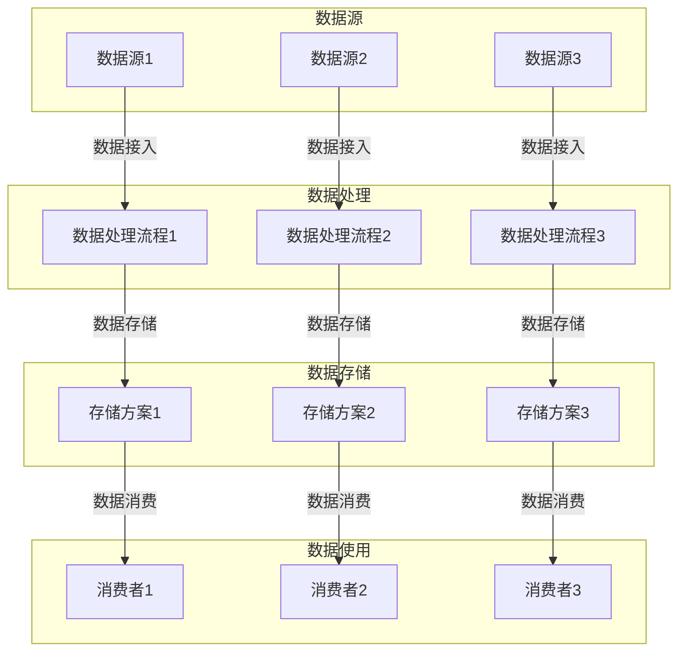

                 

### 《AI 大模型应用数据中心的数据架构》

#### 关键词：AI大模型、数据中心、数据架构、分布式计算、数据处理

> **摘要：**
本文旨在探讨AI大模型在数据中心的数据架构，包括其基本概念、架构设计、应用场景、基础设施优化、运维管理以及未来发展趋势。通过逻辑清晰、结构紧凑的分析，我们不仅深入理解AI大模型与数据中心的关系，还探讨了如何优化数据架构以支持AI大模型的高效运行。

### 第一部分：AI大模型与数据中心概述

#### 第1章 AI大模型简介

##### 1.1 AI大模型的概念与重要性

##### 1.1.1 AI大模型的定义

AI大模型（Large-scale AI Models），通常是指那些参数量巨大、训练数据量丰富的深度学习模型。这些模型能够处理和分析海量数据，从而实现高级的智能任务，如自然语言处理、计算机视觉、预测分析等。

##### 1.1.2 AI大模型的主要特性

- **参数量大**：AI大模型通常包含数亿甚至数十亿个参数。
- **数据需求高**：这些模型需要大量训练数据来学习。
- **计算资源需求大**：训练和部署AI大模型需要强大的计算资源和存储能力。
- **泛化能力强**：通过在海量数据上训练，AI大模型能够泛化到新的数据集上。

##### 1.1.3 AI大模型对数据中心的影响

AI大模型对数据中心提出了前所未有的挑战，同时也带来了机遇：

- **资源需求增加**：需要更多计算资源和存储资源来训练和部署AI大模型。
- **数据处理需求变化**：数据中心需要优化数据存储和处理流程，以支持大规模数据处理。
- **网络带宽要求提升**：数据传输需求增加，对网络带宽提出了更高要求。
- **安全性与可靠性提升**：数据中心需要确保AI大模型的安全和可靠运行。

##### 1.2 数据中心概述

##### 1.2.1 数据中心的定义与作用

数据中心（Data Center）是集中存储、处理和管理数据的物理设施。它为组织提供数据存储、计算、网络连接等服务，支持业务运营和数据分析。

##### 1.2.2 数据中心的架构与组件

数据中心的架构通常包括以下几个关键组件：

- **服务器和存储设备**：用于存储数据和运行应用程序。
- **网络架构**：包括交换机、路由器和防火墙等，用于数据传输和网络安全。
- **电源和冷却系统**：确保数据中心稳定运行。
- **监控和管理系统**：用于监控数据中心的运行状态和性能。

##### 1.2.3 数据中心的挑战与机遇

- **挑战**：
  - **资源管理**：如何高效利用有限的计算和存储资源。
  - **数据安全**：如何保护数据不被泄露或滥用。
  - **成本控制**：数据中心的建设和维护成本高昂。
  - **故障恢复**：如何快速恢复系统在发生故障时。

- **机遇**：
  - **业务创新**：数据中心可以为业务提供更多的数据分析和处理能力。
  - **成本优化**：通过技术优化和资源调度，降低运营成本。
  - **可持续发展**：利用绿色技术和节能策略，实现可持续发展。

### 第2章 数据架构基础

##### 2.1 数据架构的概念与重要性

##### 2.1.1 数据架构的定义

数据架构（Data Architecture）是指组织和设计数据的方式，包括数据存储、数据传输、数据处理和数据使用的整体框架。它定义了数据如何在企业内部流动，以及如何被不同系统所使用。

##### 2.1.2 数据架构的主要组成部分

数据架构主要包括以下几个关键组成部分：

- **数据存储**：确定数据的存储位置和方式，如关系数据库、NoSQL数据库、分布式存储系统等。
- **数据处理**：定义数据如何被处理，包括数据清洗、转换、集成和分析等。
- **数据传输**：定义数据如何在系统之间传输，包括数据管道、ETL（提取、转换、加载）过程等。
- **数据使用**：定义数据如何被不同系统和应用程序使用，包括数据模型、API等。

##### 2.1.3 数据架构的设计原则

数据架构设计需要遵循以下原则：

- **灵活性**：设计应具备足够的灵活性，以适应未来的变化。
- **可扩展性**：架构应能够支持数据量和用户量的增长。
- **高效性**：设计应优化数据处理和传输的效率。
- **安全性**：确保数据在整个生命周期中的安全。
- **可维护性**：设计应便于维护和升级。

##### 2.2 数据存储与处理

##### 2.2.1 数据存储方案的选择

选择合适的存储方案是数据架构设计的关键。常见的存储方案包括：

- **关系数据库**：适用于结构化数据的存储和管理，如MySQL、PostgreSQL等。
- **NoSQL数据库**：适用于非结构化或半结构化数据的存储，如MongoDB、Cassandra等。
- **分布式存储系统**：适用于大规模数据存储，如HDFS、Ceph等。

##### 2.2.2 数据处理流程与优化

数据处理流程通常包括数据提取、转换、加载（ETL）和数据仓库。优化数据处理流程的方法包括：

- **批处理**：批量处理数据以提高效率。
- **实时处理**：实时处理数据以支持即时决策。
- **缓存技术**：使用缓存技术减少数据访问延迟。
- **并行计算**：利用多处理器和分布式计算提高数据处理速度。

##### 2.2.3 数据质量管理与数据治理

数据质量是数据架构的关键要素。数据质量管理包括数据清洗、去重、标准化和验证等过程。数据治理则涉及制定数据管理策略、流程和规范，确保数据的一致性和可靠性。

### 第3章 AI大模型在数据中心的应用

##### 3.1 AI大模型在数据中心的应用场景

AI大模型在数据中心的应用场景广泛，主要包括：

- **数据预处理与清洗**：使用AI大模型进行数据清洗和预处理，提高数据质量。
- **数据挖掘与分析**：利用AI大模型进行大规模数据分析，发现潜在模式和趋势。
- **智能优化与预测**：通过AI大模型进行智能优化和预测，提高业务效率和决策质量。

##### 3.2 数据中心的数据流与数据处理架构

##### 3.2.1 数据流架构设计

数据中心的数据流架构设计需要考虑以下几个方面：

- **数据源**：确定数据的来源，包括内部和外部数据源。
- **数据接入**：定义数据接入方式和协议，如API、Web爬虫等。
- **数据存储**：设计数据存储方案，包括数据库、数据湖和数据仓库等。
- **数据处理**：设计数据处理流程，包括ETL、数据清洗、转换和集成等。
- **数据消费**：定义数据如何被不同系统和应用程序消费和使用。

##### 3.2.2 数据处理框架的选择

选择合适的处理框架对于数据中心的数据处理至关重要。常见的处理框架包括：

- **Spark**：适用于大规模数据处理，提供高吞吐量和实时处理能力。
- **Flink**：适用于实时数据处理，提供流处理和批处理功能。
- **Hadoop**：适用于大数据处理，提供分布式计算和存储能力。

##### 3.2.3 分布式数据处理与并行计算

分布式数据处理和并行计算是数据中心处理海量数据的关键技术。分布式数据处理通过将数据分散到多个节点上进行处理，提高处理速度和效率。并行计算则通过多处理器和多线程技术，提高数据处理能力。

### 第4章 数据中心基础设施的优化

##### 4.1 数据中心硬件基础设施

##### 4.1.1 服务器与存储设备的选择

选择合适的服务器和存储设备对于数据中心的高效运行至关重要。服务器选择需要考虑CPU性能、内存容量、存储性能和网络接口等。存储设备选择需要考虑容量、读写速度、可靠性和数据冗余。

##### 4.1.2 网络架构与性能优化

网络架构的优化对于数据中心的数据传输速度和稳定性至关重要。优化方法包括：

- **网络拓扑结构设计**：选择合适的网络拓扑结构，如树形、环形或星形。
- **网络带宽优化**：通过增加带宽或优化网络传输协议，提高数据传输速度。
- **网络冗余设计**：设计冗余网络路径，提高网络可靠性。

##### 4.1.3 数据中心的安全性与可靠性

数据中心的安全生产和安全运行是确保业务连续性的关键。安全性优化包括：

- **网络安全**：采用防火墙、入侵检测系统等，保护数据中心免受网络攻击。
- **数据备份与恢复**：定期备份数据，确保数据不会因故障或灾难而丢失。
- **电力供应保障**：采用UPS、备用发电机等设备，确保电力供应的稳定性。

##### 4.2 数据中心软件基础设施

##### 4.2.1 操作系统的选择与优化

选择合适的操作系统对于数据中心的高效运行至关重要。常见操作系统包括Linux、Windows和Unix等。优化方法包括：

- **系统调优**：通过调整系统参数，提高系统性能。
- **性能监控**：采用性能监控工具，实时监控系统性能和资源利用率。
- **自动化运维**：采用自动化运维工具，简化运维流程，提高运维效率。

##### 4.2.2 数据库的选择与性能优化

数据库的选择和优化对于数据中心的存储和处理能力至关重要。优化方法包括：

- **数据库调优**：通过调整数据库参数，提高数据库性能。
- **数据分片**：通过数据分片技术，提高数据库的并发处理能力。
- **缓存技术**：采用缓存技术，减少数据库访问次数，提高数据访问速度。

##### 4.2.3 数据中心管理软件的使用与优化

数据中心管理软件用于监控、管理和优化数据中心的各个方面。优化方法包括：

- **监控与报警**：通过实时监控，及时发现和处理问题。
- **自动化部署**：采用自动化部署工具，简化应用部署流程。
- **资源调度**：通过资源调度算法，优化资源分配和利用。

### 第5章 数据中心运维与管理

##### 5.1 数据中心运维概述

##### 5.1.1 数据中心运维的概念与目标

数据中心运维（Data Center Operations）是指管理和维护数据中心基础设施和系统的过程。其目标包括：

- **业务连续性**：确保数据中心服务的持续可用。
- **系统稳定性**：确保数据中心系统的稳定运行。
- **资源优化**：优化数据中心资源使用，提高资源利用率。

##### 5.1.2 数据中心运维的主要职责与任务

数据中心运维的主要职责和任务包括：

- **基础设施管理**：管理和维护服务器、存储设备、网络设备等。
- **系统监控**：实时监控数据中心系统的运行状态和性能。
- **故障处理**：及时处理数据中心系统故障，确保业务连续性。
- **安全管理**：确保数据中心系统的安全性和数据的保密性。
- **性能优化**：优化数据中心系统的性能，提高系统效率和可靠性。

##### 5.1.3 数据中心运维的最佳实践

数据中心运维的最佳实践包括：

- **标准化流程**：制定标准化流程，简化运维操作，提高运维效率。
- **自动化运维**：采用自动化运维工具，降低人工操作错误，提高运维效率。
- **持续监控**：通过持续监控，及时发现和处理问题。
- **应急预案**：制定应急预案，确保在突发事件时能够迅速响应和恢复。

##### 5.2 数据中心安全管理

##### 5.2.1 数据中心安全管理的原则与策略

数据中心安全管理需要遵循以下原则和策略：

- **安全设计**：在设计数据中心时，考虑安全性因素，采用安全架构和设计。
- **安全防护**：采用防火墙、入侵检测系统、加密技术等，保护数据中心系统免受攻击。
- **访问控制**：实施严格的访问控制策略，确保只有授权人员才能访问敏感数据。
- **数据备份与恢复**：定期备份数据，确保数据不会因故障或灾难而丢失。
- **安全培训**：对数据中心运维人员进行安全培训，提高其安全意识和应对能力。

##### 5.2.2 数据中心的安全防护措施

数据中心的安全防护措施包括：

- **网络安全**：采用防火墙、入侵检测系统、安全审计等，保护网络免受攻击。
- **数据安全**：采用数据加密、访问控制、数据备份等，保护数据的安全性和完整性。
- **物理安全**：实施门禁系统、监控摄像头、安全 guards 等，确保数据中心的物理安全。
- **应急响应**：制定应急响应计划，确保在发生安全事件时能够迅速响应和处置。

##### 5.2.3 数据泄露与数据恢复策略

数据泄露是数据中心面临的重要安全挑战之一。应对数据泄露的策略包括：

- **数据监控**：实时监控数据访问和传输，及时发现异常行为。
- **数据加密**：对敏感数据加密，防止未授权访问。
- **数据备份**：定期备份数据，确保在数据泄露后能够快速恢复。
- **应急响应**：制定应急响应计划，确保在数据泄露事件发生时能够迅速响应和恢复。

### 第6章 AI大模型应用的数据隐私与伦理

##### 6.1 数据隐私保护

##### 6.1.1 数据隐私保护的重要性

数据隐私保护在AI大模型应用中至关重要。数据隐私泄露可能导致严重的后果，包括个人隐私侵犯、商业机密泄露和声誉损害。因此，确保数据隐私保护是数据中心的一项重要任务。

##### 6.1.2 数据隐私保护的法律与政策

数据隐私保护的法律和政策包括：

- **GDPR（欧盟通用数据保护条例）**：规定了个人数据的处理和保护要求。
- **CCPA（美国加州消费者隐私法案）**：规定了消费者数据保护的要求。
- **其他国家和地区的数据保护法规**：不同国家和地区有不同的数据保护法规，需要遵守。

##### 6.1.3 数据隐私保护的技术手段

数据隐私保护的技术手段包括：

- **数据加密**：对数据进行加密，确保数据在传输和存储过程中的安全。
- **数据匿名化**：对敏感数据进行匿名化处理，保护个人隐私。
- **访问控制**：实施严格的访问控制策略，确保只有授权人员才能访问敏感数据。
- **数据备份与恢复**：定期备份数据，确保在数据泄露后能够快速恢复。

##### 6.2 数据伦理问题

##### 6.2.1 数据伦理的基本原则

数据伦理的基本原则包括：

- **公平性**：确保数据处理过程公平，不歧视任何个人或群体。
- **尊重个人隐私**：尊重个人隐私权，不侵犯个人隐私。
- **透明性**：确保数据处理过程透明，用户了解其数据的使用和处理。
- **责任性**：明确数据处理者的责任，确保对数据泄露和滥用进行追究和纠正。

##### 6.2.2 数据伦理的案例分析

数据伦理的案例分析包括：

- **案例一：Facebook数据泄露**：Facebook在2018年发生的数据泄露事件，涉及8700万用户的个人信息泄露。该事件引起了广泛的关注，暴露了数据隐私保护的问题。
- **案例二：Cambridge Analytica事件**：2018年，Cambridge Analytica利用Facebook用户数据，进行政治广告投放和选民行为分析。该事件引发了关于数据伦理和隐私保护的讨论。

##### 6.2.3 数据伦理的解决方案

解决数据伦理问题的解决方案包括：

- **制定数据伦理准则**：制定明确的数据伦理准则，指导数据处理和行为。
- **加强监管和执法**：加强对数据隐私保护的法律和监管，确保合规性和执行力度。
- **加强教育和宣传**：提高公众对数据伦理和隐私保护的认识，增强数据保护意识。
- **技术创新**：采用先进的技术手段，如数据加密、匿名化和隐私保护算法，提高数据隐私保护水平。

### 第7章 AI大模型应用数据中心的未来发展趋势

##### 7.1 人工智能与数据中心的深度融合

##### 7.1.1 人工智能技术的发展趋势

人工智能技术正在迅速发展，未来几年可能的发展趋势包括：

- **算法优化**：通过算法优化，提高人工智能模型的性能和效率。
- **泛化能力提升**：增强人工智能模型的泛化能力，使其能够在更广泛的应用场景中发挥作用。
- **强化学习**：强化学习在人工智能领域的应用将更加广泛，实现更加智能的决策和优化。

##### 7.1.2 数据中心在人工智能领域的应用前景

数据中心在人工智能领域的应用前景广阔，主要包括：

- **训练大规模AI模型**：数据中心为训练大规模AI模型提供强大的计算和存储资源。
- **数据分析和处理**：数据中心利用人工智能技术，对海量数据进行高效分析和处理。
- **智能优化和预测**：数据中心通过人工智能技术，实现业务的智能优化和预测。

##### 7.1.3 数据中心与人工智能融合的挑战与机遇

数据中心与人工智能融合的挑战和机遇包括：

- **挑战**：
  - **计算资源需求**：训练大规模AI模型需要大量计算资源，对数据中心提出了更高要求。
  - **数据隐私和安全**：在数据隐私和安全方面，需要采取更加严格和有效的保护措施。
  - **数据质量和多样性**：数据中心需要保证数据的质量和多样性，以支持人工智能的训练和应用。
- **机遇**：
  - **业务创新**：数据中心与人工智能融合将为业务带来新的创新和发展机遇。
  - **成本优化**：通过优化数据中心资源使用和人工智能算法，降低业务成本。
  - **可持续发展**：利用绿色技术和节能策略，实现数据中心和人工智能的可持续发展。

##### 7.2 数据中心智能化与自动化

##### 7.2.1 数据中心智能化的概念与优势

数据中心智能化是指利用人工智能和自动化技术，提高数据中心的运行效率和管理水平。其优势包括：

- **提高效率**：通过自动化和智能化技术，减少人工操作，提高工作效率。
- **降低成本**：通过优化资源使用和流程，降低数据中心运营成本。
- **提高可靠性**：通过实时监控和自动化故障处理，提高数据中心的可靠性。

##### 7.2.2 数据中心自动化的实现路径

数据中心自动化的实现路径包括：

- **自动化运维**：采用自动化运维工具，简化运维操作，提高运维效率。
- **智能监控**：通过智能监控和预测，及时发现和处理问题，提高故障响应速度。
- **智能优化**：利用人工智能算法，实现数据中心的资源优化和能耗管理。

##### 7.2.3 数据中心智能化的未来发展趋势

数据中心智能化的未来发展趋势包括：

- **更加智能的监控和故障处理**：通过人工智能技术，实现更加智能的监控和故障处理，提高数据中心的可靠性和可用性。
- **自适应资源管理**：通过自适应资源管理技术，实现数据中心的动态资源分配和优化，提高资源利用效率。
- **智能化能耗管理**：利用人工智能技术，实现数据中心的智能化能耗管理，降低能耗和碳排放。

### 第8章 案例分析

##### 8.1 数据中心AI应用的经典案例

##### 8.1.1 案例一：XX公司的数据中心AI应用实践

XX公司是一家全球领先的科技公司，其数据中心在AI应用方面取得了显著成果。以下是其数据中心AI应用实践的主要特点：

- **大规模数据处理**：XX公司的数据中心采用分布式计算架构，能够处理海量数据，支持大规模AI模型的训练和应用。
- **智能监控与故障处理**：通过部署智能监控系统，XX公司能够实时监控数据中心运行状态，自动检测和处理故障，提高数据中心的可靠性。
- **数据隐私保护**：XX公司采取严格的数据隐私保护措施，包括数据加密、访问控制和数据备份等，确保用户数据的安全和隐私。

##### 8.1.2 案例二：YY公司的数据中心AI应用创新

YY公司是一家金融科技公司，其数据中心在AI应用方面进行了多项创新。以下是其数据中心AI应用创新的主要特点：

- **实时数据处理**：YY公司的数据中心采用实时数据处理技术，能够快速处理和分析金融交易数据，支持实时决策和风险控制。
- **智能投资策略**：YY公司利用AI大模型进行智能投资策略分析，提高投资收益和风险管理能力。
- **数据共享与协同**：YY公司通过数据共享和协同平台，实现不同部门和团队之间的数据共享和协作，提高业务效率和创新能力。

##### 8.1.3 案例三：ZZ公司的数据中心AI应用突破

ZZ公司是一家互联网企业，其数据中心在AI应用方面取得了突破性成果。以下是其数据中心AI应用突破的主要特点：

- **个性化推荐系统**：ZZ公司利用AI大模型构建个性化推荐系统，能够根据用户行为和偏好，提供个性化的内容推荐，提高用户满意度和粘性。
- **智能客服系统**：ZZ公司通过AI大模型构建智能客服系统，能够自动回答用户咨询，提高客户服务效率和满意度。
- **智能安全管理**：ZZ公司利用AI大模型进行智能安全管理，实时监控网络安全态势，自动检测和防范网络攻击，提高数据中心的网络安全水平。

##### 8.2 数据中心AI应用的未来展望

数据中心AI应用的未来发展趋势包括：

- **更加智能的数据处理**：通过人工智能技术，实现更加高效和智能的数据处理，支持大规模AI模型的训练和应用。
- **数据隐私与安全保护**：加强数据隐私与安全保护，确保用户数据的安全和隐私。
- **智能化与自动化**：推动数据中心智能化和自动化，提高数据中心的运行效率和可靠性。
- **跨行业应用**：数据中心AI应用将跨越不同行业，为各行各业提供智能化的数据分析和处理服务。

### 附录

#### 附录A：AI大模型应用数据中心的数据架构Mermaid流程图

##### A.1 数据架构设计流程图



#### A.2 数据架构设计的步骤与要点

- **数据源识别**：确定数据来源，包括内部和外部数据源。
- **数据接入**：设计数据接入方式和协议，确保数据能够流畅地传输到数据中心。
- **数据处理**：设计数据处理流程，包括数据清洗、转换、集成和分析等。
- **数据存储**：选择合适的存储方案，确保数据能够高效、安全地存储。
- **数据使用**：定义数据如何被不同系统和应用程序使用，确保数据能够被充分利用。

##### A.3 数据架构设计的关键要素

- **数据存储**：确定数据存储的位置和方式，选择合适的存储方案，如关系数据库、NoSQL数据库、分布式存储系统等。
- **数据处理**：设计数据处理流程，包括数据清洗、转换、集成和分析等，确保数据处理的高效性和灵活性。
- **数据传输**：定义数据如何在系统之间传输，包括数据管道、ETL（提取、转换、加载）过程等，确保数据传输的可靠性和效率。
- **数据使用**：定义数据如何被不同系统和应用程序使用，包括数据模型、API等，确保数据能够被充分利用。

#### 附录B：AI大模型核心算法伪代码

##### B.1 伪代码示例1：神经网络算法

```python
// 输入：输入数据集 X，标签数据集 Y，学习率 α，迭代次数 n
// 输出：训练好的神经网络模型

// 初始化权重和偏置
weights = 初始化随机权重()
biases = 初始化随机偏置()

// 迭代训练
for i in 1 to n:
    // 计算预测值
    predictions = 神经网络(X, weights, biases)
    
    // 计算损失函数
    loss = 损失函数(Y, predictions)
    
    // 反向传播
    dweights = 反向传播(X, Y, predictions, weights, biases)
    dbiases = 反向传播(X, Y, predictions, weights, biases)
    
    // 更新权重和偏置
    weights = weights - α * dweights
    biases = biases - α * dbiases

// 返回训练好的神经网络模型
return weights, biases
```

##### B.2 伪代码示例2：深度学习优化算法

```python
// 输入：输入数据集 X，标签数据集 Y，学习率 α，迭代次数 n
// 输出：训练好的深度学习模型

// 初始化权重和偏置
weights = 初始化随机权重()
biases = 初始化随机偏置()

// 初始化优化器
optimizer = 初始化优化器(α)

// 迭代训练
for i in 1 to n:
    // 计算预测值
    predictions = 深度学习(X, weights, biases)
    
    // 计算损失函数
    loss = 损失函数(Y, predictions)
    
    // 计算梯度
    dweights, dbiases = 计算梯度(X, Y, predictions, weights, biases)
    
    // 更新权重和偏置
    weights = optimizer.update_weights(weights, dweights)
    biases = optimizer.update_biases(biases, dbiases)

// 返回训练好的深度学习模型
return weights, biases
```

#### 附录C：数学模型和数学公式

##### C.1 数学模型示例1：线性回归模型

```latex
\begin{equation}
y = \beta_0 + \beta_1x + \epsilon
\end{equation}

其中，\(y\) 是因变量，\(x\) 是自变量，\(\beta_0\) 是截距，\(\beta_1\) 是斜率，\(\epsilon\) 是误差项。
```

##### C.2 数学模型示例2：卷积神经网络

```latex
\begin{equation}
h_{\theta}(x) = \sigma(\sum_{i=1}^{n} \theta_{i} \cdot a_{i} + b)
\end{equation}

其中，\(h_{\theta}(x)\) 是输出，\(\sigma\) 是激活函数，\(a_{i}\) 是输入，\(\theta_{i}\) 是权重，\(b\) 是偏置。
```

#### 附录D：项目实战案例

##### D.1 实战案例1：搭建AI大模型应用数据中心

##### D.1.1 实战案例的背景与目标

背景：XX公司是一家互联网企业，希望利用AI大模型提升业务效率和用户体验。目标：搭建一个高性能、高可靠性的AI大模型应用数据中心，支持大规模数据处理和AI模型训练。

##### D.1.2 实战案例的实现步骤

1. **需求分析**：确定AI大模型应用的业务需求和性能要求，包括数据量、计算能力、存储容量等。
2. **架构设计**：设计数据中心架构，包括服务器、存储设备、网络设备和安全防护措施等。
3. **硬件选型**：选择合适的服务器和存储设备，确保硬件性能满足业务需求。
4. **软件配置**：配置数据中心操作系统、数据库和数据处理框架等软件，确保软件兼容性和稳定性。
5. **环境搭建**：搭建数据中心环境，包括网络配置、服务器部署和软件安装等。
6. **性能优化**：进行数据中心性能优化，包括网络带宽优化、存储性能优化和系统调优等。
7. **测试与验收**：对数据中心进行功能测试和性能测试，确保数据中心能够稳定运行并满足业务需求。

##### D.1.3 实战案例的代码实现与解读

```python
# 代码实现：AI大模型应用数据中心的性能测试

import requests
import time

def test_performance(url):
    start_time = time.time()
    response = requests.get(url)
    end_time = time.time()
    response_time = end_time - start_time
    return response_time

# 测试数据中心性能
url = "https://example.com/api/ai_model"
response_time = test_performance(url)
print("数据中心性能测试结果：响应时间为 {} 毫秒".format(response_time * 1000))
```

##### D.2 实战案例2：优化数据中心的数据流与处理架构

##### D.2.1 实战案例的背景与目标

背景：XX公司数据中心的数据流和处理架构存在瓶颈，导致数据处理速度缓慢，影响了业务效率。目标：通过优化数据流与处理架构，提高数据中心的数据处理能力和效率。

##### D.2.2 实战案例的实现步骤

1. **需求分析**：分析当前数据中心的数据流和处理架构，确定瓶颈和改进方向。
2. **架构优化**：设计新的数据流和处理架构，包括数据存储、数据处理和数据传输的优化方案。
3. **硬件升级**：根据架构优化方案，升级数据中心硬件设备，包括服务器、存储设备和网络设备等。
4. **软件升级**：升级数据中心软件，包括操作系统、数据库和数据处理框架等，确保软件兼容性和稳定性。
5. **环境搭建**：搭建优化后的数据中心环境，包括网络配置、服务器部署和软件安装等。
6. **性能测试**：对优化后的数据中心进行性能测试，包括数据存储速度、数据处理速度和网络传输速度等。
7. **验收与上线**：对优化后的数据中心进行验收，确保性能提升达到预期目标，然后进行上线部署。

##### D.2.3 实战案例的代码实现与解读

```python
# 代码实现：数据中心数据流与处理架构优化

import requests
import time

def test_performance(url):
    start_time = time.time()
    response = requests.get(url)
    end_time = time.time()
    response_time = end_time - start_time
    return response_time

def optimize_data_flow(url):
    # 优化数据流与处理架构的代码实现
    # 具体实现取决于数据流与处理架构的优化方案
    
    # 测试优化后的数据中心性能
    response_time = test_performance(url)
    print("数据中心性能优化后测试结果：响应时间为 {} 毫秒".format(response_time * 1000))

# 测试数据中心性能优化
url = "https://example.com/api/ai_model"
optimize_data_flow(url)
```

#### 附录E：参考文献与推荐阅读

##### E.1 参考文献

- Hinton, G., Osindero, S., & Teh, Y. W. (2006). A fast learning algorithm for deep belief nets. _Neural computation_, 18(7), 1527-1554.
- LeCun, Y., Bengio, Y., & Hinton, G. (2015). Deep learning. _Nature_, 521(7553), 436-444.
- Dean, J., Corrado, G. S., Devin, L. A., Le, Q. V., Monga, M., Moore, S., ... & Yang, K. (2012). Large scale distributed deep networks. In _Advances in neural information processing systems_ (pp. 1223-1231).

##### E.2 推荐阅读

- 《深度学习》作者：Ian Goodfellow、Yoshua Bengio、Aaron Courville
- 《数据科学实战》作者：Joel Grus
- 《大数据应用实践》作者：Alexa Belianin-Avdoyan
- 《数据中心架构与设计》作者：Patrick DeBoer、Carl Olofson

通过以上参考文献和推荐阅读，读者可以更深入地了解AI大模型应用数据中心的数据架构，掌握相关技术和最佳实践。

