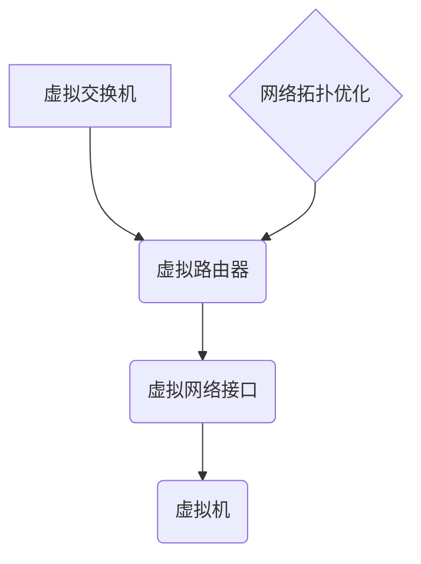
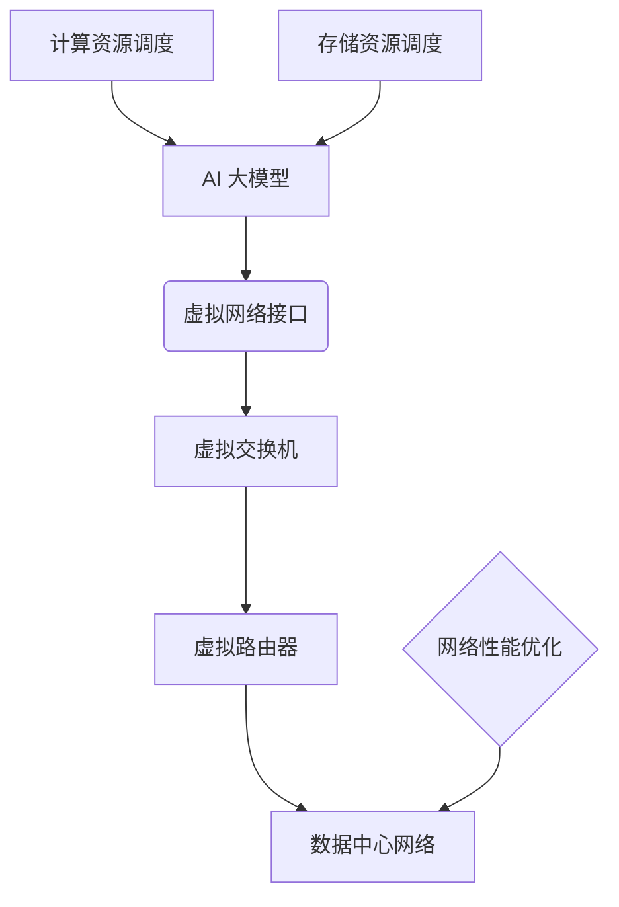

                 

# 《AI 大模型应用数据中心的网络虚拟化》

> 关键词：AI 大模型，数据中心，网络虚拟化，虚拟网络架构，性能优化，安全性

> 摘要：本文从 AI 大模型的发展背景出发，分析了数据中心网络面临的挑战，探讨了网络虚拟化的技术原理及其在 AI 大模型应用中的优势。接着，详细介绍了网络虚拟化架构的设计与实现，包括虚拟网络拓扑、资源调度策略和性能优化方法。此外，本文还讨论了虚拟化网络的安全策略以及网络虚拟化在 AI 大模型应用中的挑战和解决方案。最后，通过实际案例展示了网络虚拟化在 AI 大模型应用中的实践效果，并对未来网络虚拟化与 AI 大模型应用的发展趋势进行了展望。

# 第一部分：背景与概述

## 1.1 AI 大模型与网络虚拟化的背景

### 1.1.1 AI 大模型的发展与需求

随着深度学习技术的发展，AI 大模型逐渐成为人工智能领域的热点。这些模型通常具有庞大的参数量和计算量，例如 GPT-3、BERT 等。大模型的训练和推理需要大量的计算资源和数据传输带宽，这给数据中心带来了巨大的压力。

AI 大模型的发展对数据中心提出了更高的要求。首先，大模型的训练需要大量的计算资源，包括高性能的 GPU、TPU 等。其次，大模型的推理同样需要强大的计算能力，尤其是在线推理场景，对响应时间和吞吐量有很高的要求。此外，大模型的数据传输需求也非常大，需要高效的网络传输机制来保证数据流的高效传输。

### 1.1.2 数据中心的网络挑战

数据中心作为 AI 大模型的主要运行环境，其网络面临着一系列挑战。首先，数据中心的网络规模庞大，网络设备繁多，如何实现高效的网络管理和运维成为一个难题。其次，数据中心网络的稳定性和可靠性至关重要，任何网络故障都可能导致 AI 大模型的训练和推理中断。此外，数据中心网络的高带宽和低延迟也是一大挑战，尤其是在大规模数据处理和传输场景中。

### 1.1.3 网络虚拟化的概念与作用

网络虚拟化是一种通过软件定义网络（SDN）和虚拟化技术，将物理网络资源抽象为逻辑资源，从而实现网络资源的高效管理和调度的技术。网络虚拟化可以提供以下几个方面的优势：

1. **灵活性与可扩展性**：网络虚拟化可以动态地调整网络拓扑和资源配置，以适应不同的业务需求。例如，可以根据 AI 大模型的需求动态调整网络带宽和计算资源。

2. **资源隔离**：网络虚拟化可以将不同的业务或用户隔离在独立的虚拟网络中，从而保证数据的安全性和隐私性。

3. **网络优化**：网络虚拟化可以通过虚拟网络拓扑的优化，提高网络的性能和效率。例如，通过虚拟路由器和交换机的优化，减少网络延迟和数据传输延迟。

4. **自动化管理**：网络虚拟化可以实现网络的自动化管理和运维，减少人工干预，提高运维效率。

## 1.2 网络虚拟化的技术原理

### 1.2.1 虚拟网络架构

虚拟网络架构是网络虚拟化的核心，它通过软件定义的方式，将物理网络资源抽象为逻辑资源。虚拟网络架构通常包括以下几个关键组成部分：

1. **虚拟交换机（VSwitch）**：虚拟交换机是虚拟网络的核心组件，负责数据包的转发和路由。虚拟交换机通常运行在虚拟机（VM）或容器中，通过软件定义的方式实现网络流量的转发。

2. **虚拟路由器（VRouter）**：虚拟路由器负责跨虚拟网络的数据包转发，实现不同虚拟网络之间的通信。虚拟路由器通常也运行在虚拟机或容器中。

3. **虚拟网络接口（VNIC）**：虚拟网络接口是虚拟机或容器与虚拟网络之间的连接点，每个虚拟机或容器都有一个或多个虚拟网络接口。

4. **虚拟路由表**：虚拟路由表用于记录虚拟网络接口的 IP 地址和对应的虚拟路由器信息，用于数据包的路由和转发。

### 1.2.2 虚拟交换机与路由器

虚拟交换机和虚拟路由器是网络虚拟化的关键组件，它们的实现原理如下：

1. **虚拟交换机（VSwitch）实现原理**：

   - 转发数据包：虚拟交换机通过接收和发送数据包，实现网络流量的转发。虚拟交换机使用桥接模式或路由模式进行数据包的转发。

   - 学习 MAC 地址：虚拟交换机通过学习网络接口的 MAC 地址，建立 MAC 地址表，用于数据包的过滤和转发。

   - 虚拟网络隔离：虚拟交换机可以将不同的虚拟网络隔离，实现网络接口之间的安全隔离。

2. **虚拟路由器（VRouter）实现原理**：

   - 路由表管理：虚拟路由器通过管理虚拟路由表，实现数据包的路由和转发。虚拟路由表通常包括目标网络地址、下一跳地址和出接口等信息。

   - 路由算法：虚拟路由器使用路由算法，根据路由表选择最佳路由路径，实现跨虚拟网络的数据包转发。

   - 动态路由协议：虚拟路由器支持动态路由协议（如 OSPF、BGP），自动更新路由表，实现网络拓扑的变化和调整。

### 1.2.3 虚拟化网络的安全问题

虚拟化网络的安全问题是网络虚拟化需要重点关注的问题。以下是一些常见的虚拟化网络安全问题：

1. **虚拟网络接口暴露**：虚拟网络接口容易受到网络攻击，如 ARP 欺骗、MAC 地址欺骗等。为了防止虚拟网络接口暴露，可以采取以下措施：

   - **隔离网络**：通过虚拟交换机和虚拟路由器实现网络隔离，防止虚拟网络接口暴露。

   - **静态 ARP 表**：配置虚拟网络接口的静态 ARP 表，防止 ARP 欺骗攻击。

   - **访问控制**：使用访问控制列表（ACL）限制虚拟网络接口的访问权限，防止未授权的访问。

2. **虚拟网络流量监控**：虚拟化网络中的数据包传输过程中，可能会涉及到敏感数据。为了防止数据泄露，可以采取以下措施：

   - **加密传输**：使用加密协议（如 TLS）对虚拟网络中的数据包进行加密，防止数据泄露。

   - **流量监控**：使用网络流量监控工具，实时监控虚拟网络中的数据包流量，发现潜在的安全威胁。

3. **虚拟网络设备安全**：虚拟网络设备（如虚拟交换机和虚拟路由器）的安全性也是虚拟化网络安全的重要方面。以下是一些安全措施：

   - **访问控制**：对虚拟网络设备的访问进行严格的访问控制，防止未授权的访问。

   - **安全更新**：定期对虚拟网络设备进行安全更新和漏洞修复，确保设备的安全性。

   - **设备隔离**：将虚拟网络设备与其他业务隔离，防止潜在的安全威胁扩散。

## 1.3 AI 大模型应用中的网络虚拟化需求

### 1.3.1 大模型的计算与存储需求

AI 大模型通常具有庞大的参数量和计算量，其训练和推理过程需要大量的计算资源和存储资源。网络虚拟化可以通过以下几个方面满足大模型的计算与存储需求：

1. **计算资源调度**：网络虚拟化可以实现计算资源的动态调度，根据 AI 大模型的需求，动态调整计算资源的分配和调度，确保大模型能够获得足够的计算资源。

2. **存储资源优化**：网络虚拟化可以优化存储资源的利用效率，通过分布式存储系统和存储虚拟化技术，实现存储资源的高效管理和调度。

3. **数据传输优化**：网络虚拟化可以优化数据传输路径，通过虚拟网络拓扑的优化，减少数据传输延迟和带宽消耗，提高数据传输效率。

### 1.3.2 网络性能与稳定性的挑战

AI 大模型应用对网络性能和稳定性提出了更高的要求。以下是一些网络性能与稳定性的挑战：

1. **高带宽需求**：AI 大模型通常需要大量数据传输，对网络带宽有较高的需求。网络虚拟化可以通过虚拟网络拓扑的优化，提高网络带宽的利用率，满足高带宽需求。

2. **低延迟要求**：AI 大模型应用对网络延迟有较低的要求，尤其是在线推理场景。网络虚拟化可以通过虚拟网络拓扑的优化，减少网络延迟和数据传输延迟。

3. **网络稳定性**：AI 大模型应用对网络稳定性有较高的要求，任何网络故障都可能对大模型的训练和推理造成影响。网络虚拟化可以通过网络监控和故障恢复机制，提高网络的稳定性和可靠性。

### 1.3.3 网络虚拟化在 AI 大模型应用中的优势

网络虚拟化在 AI 大模型应用中具有以下几个优势：

1. **资源灵活性**：网络虚拟化可以实现计算资源和存储资源的灵活调度，根据 AI 大模型的需求，动态调整资源分配，提高资源利用率。

2. **网络优化**：网络虚拟化可以通过虚拟网络拓扑的优化，提高网络性能和效率，满足高带宽、低延迟的要求。

3. **安全性**：网络虚拟化可以实现虚拟网络接口的安全隔离，防止网络攻击和数据泄露，提高网络安全。

4. **可扩展性**：网络虚拟化可以实现虚拟网络和物理网络的解耦合，提高网络的扩展性和可维护性。

# 第二部分：网络虚拟化架构与实现

## 2.1 虚拟化网络架构设计

### 2.1.1 虚拟网络拓扑设计

虚拟网络拓扑设计是网络虚拟化的关键，它决定了虚拟网络的性能和可扩展性。以下是一些虚拟网络拓扑设计的关键要素：

1. **网络分层**：虚拟网络可以采用分层设计，分为核心层、分布层和接入层。核心层负责高速转发和路由，分布层负责连接核心层和接入层，接入层负责连接终端设备。

2. **网络隔离**：通过虚拟交换机和虚拟路由器实现网络隔离，将不同的虚拟网络分隔开，提高网络的安全性和稳定性。

3. **网络冗余**：通过虚拟网络拓扑的冗余设计，提高网络的可靠性和容错性。例如，可以使用多路径路由协议（如 ECMP）实现网络路径的冗余。

4. **带宽管理**：通过虚拟网络拓扑的设计，可以实现带宽的动态调整和分配。例如，可以使用带宽分配策略（如 CBWFQ）实现带宽的合理分配。

### 2.1.2 资源调度策略

资源调度策略是网络虚拟化的关键，它决定了虚拟网络资源的利用率和服务质量。以下是一些资源调度策略的关键要素：

1. **计算资源调度**：根据 AI 大模型的需求，动态调整计算资源的分配和调度。可以使用调度算法（如 CFS）实现计算资源的公平调度。

2. **存储资源调度**：根据 AI 大模型的需求，动态调整存储资源的分配和调度。可以使用存储调度算法（如 LRU）实现存储资源的优化调度。

3. **带宽资源调度**：根据 AI 大模型的需求，动态调整网络带宽的分配和调度。可以使用带宽调度算法（如 WFQ）实现带宽的公平调度。

### 2.1.3 虚拟网络性能优化

虚拟网络性能优化是网络虚拟化的关键，它决定了虚拟网络的性能和用户体验。以下是一些虚拟网络性能优化策略：

1. **网络拓扑优化**：通过优化虚拟网络拓扑，减少网络延迟和数据传输延迟。可以使用拓扑优化算法（如 Dijkstra 算法）实现网络拓扑的优化。

2. **流量调度优化**：通过优化网络流量调度，提高网络带宽的利用率。可以使用流量调度算法（如 WFQ）实现流量的优化调度。

3. **缓存优化**：通过优化网络缓存策略，提高数据包的传输效率。可以使用缓存算法（如 LRU）实现缓存的优化。

## 2.2 虚拟交换机与路由器实现

### 2.2.1 虚拟交换机（VSwitch）的实现原理

虚拟交换机（VSwitch）是网络虚拟化的核心组件，负责数据包的转发和路由。以下是一些虚拟交换机的实现原理：

1. **数据包转发**：虚拟交换机通过接收和发送数据包，实现网络流量的转发。数据包的转发过程包括接收数据包、检查数据包头部信息、查找 MAC 地址表、转发数据包等步骤。

2. **MAC 地址学习**：虚拟交换机通过学习网络接口的 MAC 地址，建立 MAC 地址表，用于数据包的过滤和转发。

3. **虚拟网络隔离**：虚拟交换机可以通过虚拟网络标识（VLAN）实现虚拟网络隔离，将不同的虚拟网络分隔开，提高网络的安全性和稳定性。

4. **流表管理**：虚拟交换机通过管理流表，实现数据包的过滤和转发。流表包含数据包的匹配条件和转发动作，可以根据数据包的头部信息进行匹配和转发。

### 2.2.2 虚拟路由器（VRouter）的实现原理

虚拟路由器（VRouter）是网络虚拟化的核心组件，负责跨虚拟网络的数据包转发。以下是一些虚拟路由器的实现原理：

1. **路由表管理**：虚拟路由器通过管理虚拟路由表，实现数据包的路由和转发。虚拟路由表包含目标网络地址、下一跳地址和出接口等信息。

2. **路由算法**：虚拟路由器使用路由算法，根据虚拟路由表选择最佳路由路径，实现跨虚拟网络的数据包转发。常用的路由算法包括 Dijkstra 算法、A* 算法等。

3. **动态路由协议**：虚拟路由器支持动态路由协议（如 OSPF、BGP），自动更新路由表，实现网络拓扑的变化和调整。

4. **流量调度**：虚拟路由器通过流量调度算法，实现数据包的调度和转发。常用的流量调度算法包括 Weighted Fair Queueing（WFQ）等。

### 2.2.3 虚拟交换机与路由器的性能对比

虚拟交换机与虚拟路由器在性能方面存在一些差异。以下是一些性能对比：

1. **转发速度**：虚拟交换机的转发速度通常比虚拟路由器快，因为它只负责本地的数据包转发，不需要进行跨虚拟网络的路由计算。

2. **路由能力**：虚拟路由器具有较强的路由能力，可以支持跨虚拟网络的路由和转发。虚拟交换机通常只能在本虚拟网络内部进行数据包转发。

3. **处理能力**：虚拟路由器的处理能力通常比虚拟交换机强，因为它需要处理更多的路由和流量调度任务。

4. **资源消耗**：虚拟交换机对资源的消耗通常比虚拟路由器小，因为它只需要处理本地网络流量。虚拟路由器需要处理跨虚拟网络的流量，资源消耗较大。

## 2.3 AI 大模型与网络虚拟化的集成

### 2.3.1 AI 大模型在虚拟网络中的部署

AI 大模型在虚拟网络中的部署需要考虑以下几个方面：

1. **虚拟机配置**：根据 AI 大模型的需求，配置虚拟机的 CPU、内存、GPU 等资源。例如，可以使用高性能的 GPU 加速 AI 大模型的训练和推理。

2. **网络配置**：为 AI 大模型配置虚拟网络接口，连接到虚拟网络中。可以使用 VLAN 实现虚拟网络隔离，保证数据的安全性和隐私性。

3. **存储配置**：为 AI 大模型配置存储资源，包括本地存储和分布式存储系统。可以使用分布式存储系统实现数据的高效存储和共享。

### 2.3.2 资源隔离与共享策略

在虚拟网络中，AI 大模型需要与其他业务或用户隔离，同时需要实现资源共享。以下是一些资源隔离与共享策略：

1. **资源隔离**：通过虚拟交换机和虚拟路由器实现虚拟网络接口的隔离，防止网络攻击和数据泄露。例如，可以使用 VLAN 实现虚拟网络隔离。

2. **资源共享**：通过虚拟网络拓扑的优化，实现虚拟网络接口的资源共享。例如，可以使用负载均衡技术实现网络带宽的共享。

3. **资源调度**：根据 AI 大模型的需求，动态调整资源分配和调度。例如，可以使用 CFS 实现计算资源的公平调度。

### 2.3.3 AI 大模型对网络虚拟化的影响与优化

AI 大模型对网络虚拟化提出了新的挑战，同时也带来了优化机会。以下是一些影响与优化：

1. **性能影响**：AI 大模型的数据传输需求和计算资源需求较大，可能对网络虚拟化的性能产生影响。需要通过优化网络拓扑和流量调度策略，提高网络性能和效率。

2. **稳定性影响**：AI 大模型的训练和推理过程对网络稳定性有较高的要求。需要通过优化虚拟网络拓扑和流量调度策略，提高网络的稳定性和可靠性。

3. **安全性影响**：AI 大模型的数据可能包含敏感信息，需要加强虚拟网络的安全性和隐私性。需要通过优化虚拟网络拓扑和流量调度策略，提高网络安全性和数据保护能力。

# 第三部分：网络虚拟化的关键技术与挑战

## 3.1 虚拟网络性能评估方法

### 3.1.1 性能指标体系

虚拟网络性能评估需要一套完整的性能指标体系，以下是一些关键性能指标：

1. **带宽利用率**：表示网络带宽的利用率，通常用百分比表示。带宽利用率越高，说明网络资源利用得越好。

2. **传输延迟**：表示数据包从发送到接收所需要的时间。传输延迟越低，说明网络性能越好。

3. **吞吐量**：表示网络在单位时间内传输的数据量。吞吐量越高，说明网络性能越好。

4. **丢包率**：表示数据包在传输过程中丢失的比例。丢包率越低，说明网络性能越好。

5. **抖动**：表示网络延迟的波动程度。抖动越小，说明网络性能越稳定。

### 3.1.2 性能评估工具

以下是一些常见的虚拟网络性能评估工具：

1. **Iperf**：用于测试网络带宽和吞吐量。

2. **iperf3**：用于测试网络带宽和传输延迟。

3. **NuttX**：用于测试网络性能，包括带宽、传输延迟和抖动等。

4. **Netem**：用于模拟网络延迟、丢包和抖动等网络条件。

### 3.1.3 性能优化策略

以下是一些虚拟网络性能优化策略：

1. **拓扑优化**：通过优化虚拟网络拓扑，减少网络延迟和数据传输延迟。可以使用拓扑优化算法（如 Dijkstra 算法）实现网络拓扑的优化。

2. **流量调度优化**：通过优化网络流量调度，提高网络带宽的利用率。可以使用流量调度算法（如 WFQ）实现流量的优化调度。

3. **缓存优化**：通过优化网络缓存策略，提高数据包的传输效率。可以使用缓存算法（如 LRU）实现缓存的优化。

## 3.2 虚拟网络安全策略

### 3.2.1 安全威胁与防御措施

虚拟网络面临多种安全威胁，以下是一些常见的安全威胁和防御措施：

1. **ARP 欺骗**：攻击者通过伪造 ARP 包，将目标主机的 MAC 地址映射到攻击者的 IP 地址，实现数据包的拦截和篡改。防御措施包括使用静态 ARP 表和 ARP 欺骗检测。

2. **MAC 地址欺骗**：攻击者伪造 MAC 地址，伪装成其他主机进行通信。防御措施包括使用 MAC 地址过滤和 MAC 地址绑定。

3. **DDoS 攻击**：攻击者通过大量请求占用网络带宽和计算资源，导致网络服务瘫痪。防御措施包括 DDoS 攻击检测和防御系统。

4. **数据泄露**：攻击者通过网络监听和破解密码等方式获取敏感数据。防御措施包括数据加密和访问控制。

### 3.2.2 安全策略设计

以下是一些虚拟网络安全策略设计的关键要素：

1. **访问控制**：通过设置访问控制列表（ACL），限制用户和设备对虚拟网络资源的访问权限。

2. **身份认证**：使用用户名和密码、数字证书等方式进行身份认证，确保只有授权用户可以访问虚拟网络资源。

3. **数据加密**：使用加密协议（如 TLS）对虚拟网络中的数据包进行加密，防止数据泄露。

4. **防火墙**：配置虚拟防火墙，限制虚拟网络中数据包的进出，防止未授权的访问。

### 3.2.3 AI 技术在虚拟网络安全中的应用

AI 技术在虚拟网络安全中具有广泛应用，以下是一些典型应用：

1. **异常检测**：使用 AI 技术对网络流量进行分析，检测异常行为，如 DDoS 攻击、恶意软件传播等。

2. **入侵检测**：使用 AI 技术对网络流量进行实时监测，检测入侵行为，如 ARP 欺骗、MAC 地址欺骗等。

3. **安全预测**：使用 AI 技术对网络流量进行分析，预测潜在的安全威胁，如网络攻击、数据泄露等。

## 3.3 网络虚拟化的挑战与解决方案

### 3.3.1 资源分配问题

网络虚拟化在资源分配方面面临一些挑战，以下是一些解决方案：

1. **资源调度算法**：使用高效资源调度算法，如 CFS、RR 等算法，实现资源的动态分配和调度。

2. **资源预留**：在虚拟网络中预留一定的资源，以应对突发流量和资源需求。

3. **负载均衡**：通过负载均衡技术，将流量分配到不同的虚拟网络接口，实现资源的合理利用。

### 3.3.2 网络性能瓶颈

网络虚拟化在性能方面面临一些瓶颈，以下是一些解决方案：

1. **网络拓扑优化**：通过优化网络拓扑，减少网络延迟和数据传输延迟。

2. **流量调度优化**：通过优化流量调度策略，提高网络带宽的利用率。

3. **缓存优化**：通过优化缓存策略，提高数据包的传输效率。

### 3.3.3 跨域虚拟化挑战

跨域虚拟化在实现网络虚拟化方面面临一些挑战，以下是一些解决方案：

1. **跨域网络拓扑设计**：设计合理的跨域网络拓扑，实现不同域之间的数据传输和资源共享。

2. **跨域流量调度**：使用跨域流量调度策略，实现不同域之间的流量平衡和优化。

3. **跨域安全策略**：设计跨域安全策略，确保不同域之间的数据传输安全和隐私。

# 第四部分：AI 大模型应用数据中心的网络虚拟化实践

## 4.1 AI 大模型应用数据中心的网络虚拟化案例

### 4.1.1 案例背景与需求

某知名互联网公司在其数据中心部署了大规模的 AI 大模型应用，用于图像识别、自然语言处理等任务。随着业务的发展，数据中心的数据量和计算需求不断增长，对网络性能和稳定性提出了更高的要求。为了提高数据中心的资源利用率、降低运维成本、提高网络性能和安全性，公司决定采用网络虚拟化技术进行数据中心网络改造。

### 4.1.2 网络虚拟化方案设计

网络虚拟化方案主要包括以下几个方面：

1. **虚拟网络架构设计**：设计包括核心层、分布层和接入层的虚拟网络架构，实现虚拟网络隔离和流量优化。

2. **虚拟交换机与路由器部署**：在虚拟网络中部署虚拟交换机和虚拟路由器，实现数据包的转发和路由。

3. **计算资源调度**：使用 CFS 算法实现计算资源的动态调度，根据 AI 大模型的需求调整计算资源分配。

4. **存储资源优化**：使用分布式存储系统优化存储资源利用，提高数据存储和共享效率。

5. **网络性能优化**：通过拓扑优化和流量调度优化，提高网络性能和效率。

### 4.1.3 实施过程与效果评估

网络虚拟化实施过程包括以下几个方面：

1. **虚拟网络架构部署**：在虚拟网络中部署虚拟交换机和虚拟路由器，配置虚拟网络拓扑和路由策略。

2. **计算资源调度优化**：使用 CFS 算法实现计算资源的动态调度，根据 AI 大模型的需求调整计算资源分配。

3. **存储资源优化**：配置分布式存储系统，优化存储资源利用，提高数据存储和共享效率。

4. **网络性能优化**：通过拓扑优化和流量调度优化，提高网络性能和效率。

效果评估包括以下几个方面：

1. **资源利用率提升**：网络虚拟化后，计算资源和存储资源的利用率显著提升，降低了资源浪费。

2. **网络性能提升**：通过拓扑优化和流量调度优化，网络延迟和数据传输延迟显著降低，提高了网络性能。

3. **运维成本降低**：网络虚拟化后，简化了网络管理和运维，降低了运维成本。

4. **安全性提高**：虚拟网络隔离和访问控制策略提高了数据安全性和隐私性。

## 4.2 开发环境搭建与配置

### 4.2.1 开发环境需求分析

为了实践 AI 大模型应用数据中心的网络虚拟化，需要搭建一个合适的开发环境。以下是对开发环境的需求分析：

1. **操作系统**：选择一个适合的操作系统，如 Ubuntu 18.04 或 CentOS 7，用于部署虚拟化软件和网络设备。

2. **虚拟化软件**：选择一款适合的虚拟化软件，如 VMware、KVM 或 VirtualBox，用于创建和管理虚拟机。

3. **网络设备**：选择一款适合的网络设备，如虚拟交换机、虚拟路由器等，用于实现网络虚拟化功能。

4. **开发工具**：选择一款适合的开发工具，如 Python、OpenVINO 等，用于实现 AI 大模型的应用。

### 4.2.2 虚拟化软件安装与配置

以下是在 Ubuntu 18.04 系统上安装和配置 KVM 虚拟化软件的步骤：

1. **安装 KVM 虚拟化软件**：使用以下命令安装 KVM 虚拟化软件：

   ```shell
   sudo apt-get update
   sudo apt-get install qemu-kvm libvirt-daemon libvirt-clients bridge-utils virt-manager
   ```

2. **配置 KVM 虚拟化软件**：在安装完成后，需要配置 KVM 虚拟化软件。

   - **配置 KVM 模块**：使用以下命令启用 KVM 模块：

     ```shell
     sudo modprobe kvm
     ```

   - **配置 libvirt**：编辑 `/etc/libvirt/libvirt.conf` 文件，将 `authenerate = "yes"` 添加到 `sudoers` 配置中，以便虚拟化管理器可以以 root 用户身份运行。

     ```shell
     sudo nano /etc/libvirt/libvirt.conf
     ```

   - **配置网络桥接**：编辑 `/etc/network/interfaces` 文件，配置虚拟网络桥接。

     ```shell
     sudo nano /etc/network/interfaces
     ```

     在文件中添加以下内容：

     ```shell
     auto br0
     iface br0 inet dhcp
     bridge_ports eth0
     ```

   - **重启网络服务**：重启网络服务使配置生效。

     ```shell
     sudo systemctl restart networking
     ```

### 4.2.3 开发工具与资源准备

以下是在 Ubuntu 18.04 系统上安装和配置开发工具的步骤：

1. **安装 Python 环境**：安装 Python 3 及相关依赖。

   ```shell
   sudo apt-get install python3 python3-pip
   ```

2. **安装 AI 相关库**：安装用于 AI 大模型开发的相关库，如 TensorFlow、PyTorch 等。

   ```shell
   sudo pip3 install tensorflow
   # 或
   sudo pip3 install torch torchvision
   ```

3. **安装 OpenVINO 库**：安装 OpenVINO 库用于 AI 大模型的推理加速。

   ```shell
   sudo apt-get install libopenvino-dev
   ```

4. **配置环境变量**：配置 Python 环境变量，确保 Python 可以正确调用相关库。

   ```shell
   export PYTHONPATH=$PYTHONPATH:/usr/local/lib/python3.x/site-packages
   ```

# 第五部分：展望与未来趋势

## 5.1 网络虚拟化与 AI 大模型应用的发展趋势

随着人工智能技术的快速发展，AI 大模型的应用越来越广泛。网络虚拟化作为一种重要的技术手段，在 AI 大模型应用中发挥着越来越重要的作用。未来，网络虚拟化与 AI 大模型应用的发展趋势主要体现在以下几个方面：

### 5.1.1 技术发展趋势

1. **智能化网络管理**：随着 AI 技术的进步，智能化网络管理将成为网络虚拟化的发展趋势。通过引入 AI 技术，可以实现网络的自动化运维、故障预测和优化，提高网络的稳定性和可靠性。

2. **边缘计算与网络虚拟化融合**：随着物联网和 5G 的发展，边缘计算逐渐成为 AI 大模型应用的重要场景。网络虚拟化与边缘计算相结合，可以实现计算资源的灵活调度和高效利用，满足 AI 大模型在边缘侧的应用需求。

3. **网络切片与虚拟专用网络**：网络切片和虚拟专用网络（VPN）技术为 AI 大模型应用提供了灵活的网络资源分配和管理方案。通过网络切片，可以为不同类型的 AI 大模型应用分配专用的网络资源，实现网络资源的精细化管理和优化。

4. **混合云与多云架构**：随着企业对云服务的需求不断增加，混合云和多云架构逐渐成为主流。网络虚拟化技术可以有效地整合不同云平台的资源，实现 AI 大模型应用的跨云部署和管理。

### 5.1.2 行业应用前景

AI 大模型在各个行业中的应用前景广阔，网络虚拟化技术将在其中发挥重要作用：

1. **金融行业**：AI 大模型在金融行业的应用主要包括风险控制、信用评估、量化交易等。网络虚拟化技术可以提高金融交易的实时性和安全性，降低交易成本。

2. **医疗行业**：AI 大模型在医疗行业的应用包括疾病诊断、医疗影像分析、个性化治疗等。网络虚拟化技术可以为医疗行业提供高效、稳定的数据传输和计算资源，推动医疗信息化的发展。

3. **智能制造**：AI 大模型在智能制造领域的应用包括设备故障预测、生产过程优化、供应链管理等。网络虚拟化技术可以为企业提供灵活的云计算资源，实现制造过程的智能化和自动化。

4. **自动驾驶**：AI 大模型在自动驾驶领域的应用包括环境感知、路径规划、决策控制等。网络虚拟化技术可以提供高效、可靠的数据传输和计算资源，支持自动驾驶系统的实时性和安全性。

### 5.1.3 潜在挑战与应对策略

尽管网络虚拟化与 AI 大模型应用的前景广阔，但仍然面临一些潜在挑战：

1. **网络性能瓶颈**：AI 大模型对网络带宽、延迟和抖动等性能指标有较高要求。未来，需要进一步优化网络架构和流量调度策略，提高网络性能。

2. **安全性问题**：网络虚拟化带来了新的安全挑战，如虚拟网络接口暴露、数据泄露等。需要加强虚拟网络安全策略设计，引入 AI 技术进行安全监测和防护。

3. **跨域虚拟化挑战**：随着企业业务的全球化，跨域虚拟化成为重要需求。需要解决跨域网络拓扑设计、流量调度和安全等问题，实现跨域虚拟化的高效、稳定运行。

4. **资源管理复杂度**：AI 大模型应用对计算资源、存储资源和网络资源的调度和管理提出了更高的要求。需要设计智能化的资源管理策略，实现资源的灵活调度和高效利用。

## 5.2 未来网络虚拟化与 AI 大模型应用的创新方向

未来，网络虚拟化与 AI 大模型应用将在以下几个方向进行创新：

### 5.2.1 新技术探索

1. **新型网络架构**：探索新型网络架构，如联邦网络架构、网络编码技术等，提高网络性能和稳定性。

2. **智能流量调度**：引入 AI 技术，实现智能流量调度，根据实时网络状态动态调整流量路径，提高网络性能。

3. **网络安全防御**：结合 AI 技术，开发智能化的网络安全防御系统，实现自适应的网络威胁检测和响应。

### 5.2.2 创新应用场景

1. **智能城市管理**：利用 AI 大模型和虚拟化技术，实现智能城市管理，如智能交通、智能环保等。

2. **智能制造工厂**：利用虚拟化技术，实现制造过程的智能化，提高生产效率和产品质量。

3. **智慧医疗**：结合虚拟化技术和 AI 大模型，实现智慧医疗，如智能诊断、智能治疗等。

### 5.2.3 未来展望与思考

未来，网络虚拟化与 AI 大模型应用将深度融合，推动各行各业的数字化转型和智能化升级。在此过程中，需要关注以下几个方面：

1. **标准化与规范化**：推动网络虚拟化和 AI 大模型应用的标准化与规范化，实现不同技术、不同平台的兼容与互操作。

2. **产业链协同**：加强产业链各环节的协同创新，推动硬件、软件、网络等技术的融合发展。

3. **人才培养**：加强人才培养，培养一批既懂 AI 技术，又懂网络虚拟化技术的高素质人才，为 AI 大模型应用的发展提供人才保障。

# 附录

## 附录 A：资源链接与推荐阅读

#### A.1 虚拟化相关资源

1. **虚拟化技术教程**：[Virtualization Technologies](https://www.virtualizationsoftware.com/tutorial/)
2. **KVM 官方文档**：[KVM Documentation](https://www.linux-kvm.org/page/Documentation)
3. **OpenVINO 官方文档**：[OpenVINO Documentation](https://docs.openvinotoolkit.org/)

#### A.2 AI 大模型应用相关资源

1. **TensorFlow 官方文档**：[TensorFlow Documentation](https://www.tensorflow.org/)
2. **PyTorch 官方文档**：[PyTorch Documentation](https://pytorch.org/docs/stable/)
3. **AI 大模型应用案例**：[AI Model Applications](https://ai.facebook.com/models/)

#### A.3 深度学习与网络虚拟化学术资源

1. **深度学习论文集**：[ACL Paper Collection](https://aclweb.org/anthology/)
2. **网络虚拟化论文集**：[IEEE Network Virtualization Papers](https://ieeexplore.ieee.org/search/searchresult.jsp?query=Network%20Virtualization)
3. **深度学习与网络虚拟化交叉论文**：[交叉论文](https://ieeexplore.ieee.org/document/8090574)

#### A.4 开发工具与框架推荐

1. **Docker**：[Docker Documentation](https://docs.docker.com/)
2. **Kubernetes**：[Kubernetes Documentation](https://kubernetes.io/docs/home/)
3. **TensorFlow Serving**：[TensorFlow Serving Documentation](https://www.tensorflow.org/tfx/serving)

## 附录 B：Mermaid 流程图

#### B.1 虚拟化网络架构流程图



#### B.2 AI 大模型与网络虚拟化集成流程图



## 附录 C：伪代码示例

#### C.1 虚拟网络性能评估伪代码

```python
# 虚拟网络性能评估伪代码

def performance_evaluation(network):
    # 收集性能数据
    bandwidth = collect_bandwidth_data(network)
    latency = collect_latency_data(network)
    throughput = collect_throughput_data(network)
    packet_loss = collect_packet_loss_data(network)
    jitter = collect_jitter_data(network)

    # 计算性能指标
    utilization = calculate_bandwidth_utilization(bandwidth)
    delay = calculate_average_delay(latency)
    loss_rate = calculate_packet_loss_rate(packet_loss)
    stability = calculate_jitter(stability)

    # 输出性能评估结果
    print("虚拟网络性能评估结果：")
    print("带宽利用率：", utilization)
    print("平均延迟：", delay)
    print("丢包率：", loss_rate)
    print("抖动：", stability)
```

#### C.2 资源调度策略伪代码

```python
# 资源调度策略伪代码

def resource_scheduling(model, resources):
    # 根据模型需求分配计算资源
    compute_resources = allocate_compute_resources(model, resources)

    # 根据模型需求分配存储资源
    storage_resources = allocate_storage_resources(model, resources)

    # 根据网络性能优化策略调整网络带宽
    network_bandwidth = optimize_network_bandwidth(model, resources)

    # 输出资源调度结果
    print("资源调度结果：")
    print("计算资源：", compute_resources)
    print("存储资源：", storage_resources)
    print("网络带宽：", network_bandwidth)
```

## 附录 D：数学公式与解释

#### D.1 资源分配模型公式

$$
C = C_1 + C_2 + \ldots + C_n
$$

其中，$C$ 表示总计算资源，$C_1, C_2, \ldots, C_n$ 表示每个计算任务所需的计算资源。

#### D.2 网络性能优化公式

$$
P = \frac{B \times L}{D}
$$

其中，$P$ 表示网络性能，$B$ 表示带宽，$L$ 表示负载，$D$ 表示延迟。

#### D.3 AI 大模型计算复杂度公式

$$
C = O(N^2)
$$

其中，$C$ 表示计算复杂度，$N$ 表示模型参数数量。

