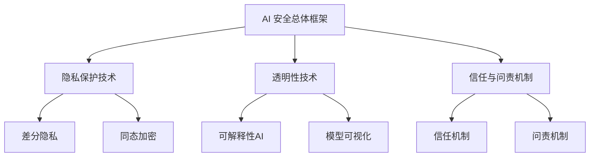

                 

# 文章标题：AI 安全与伦理：挑战与机遇并存

> 关键词：AI安全，伦理，隐私保护，透明性，信任与问责机制，案例分析，国际合作

> 摘要：本文探讨了AI安全与伦理在当前发展中的重要性。首先，我们概述了AI安全与伦理的基本概念和原则，分析了它们在社会中的影响和面临的挑战。接着，我们详细介绍了AI隐私保护、透明性技术以及信任与问责机制的核心技术，并通过案例进行了深入分析。随后，我们探讨了AI安全与伦理的全球合作与未来展望，提出了应对挑战的策略。最后，本文附录了相关资源和工具，以供读者进一步学习与研究。

## 目录大纲：AI 安全与伦理：挑战与机遇并存

----------------------------------------------------------------

## 第一部分：AI 安全与伦理概述

### 第1章：AI 安全与伦理的背景与重要性

- **1.1 AI 安全的定义与范围**
  - **概念讲解**：什么是AI安全？
  - **影响分析**：AI安全对社会的影响。
  - **法律与政策**：国内外AI安全相关的法律法规和政策。

- **1.2 AI 伦理的基本原则**
  - **伦理学基本概念**：伦理学原理和应用。
  - **AI伦理原则**：公平、透明、问责、隐私等。

- **1.3 AI 安全与伦理的现状**
  - **案例分析**：国内外AI安全与伦理问题案例。
  - **挑战与机遇**：AI安全与伦理面临的挑战和机遇。

## 第二部分：AI 安全技术

### 第2章：AI 安全的核心技术

- **2.1 AI 隐私保护技术**
  - **概念与原理**：隐私保护的必要性。
  - **技术手段**：差分隐私、同态加密等。
  - **案例研究**：具体应用的案例解析。

- **2.2 AI 透明性技术**
  - **透明性的重要性**：透明性的重要性。
  - **实现方法**：可解释性AI、模型可视化等。
  - **实际应用**：透明性技术在实际项目中的应用。

- **2.3 AI 信任与问责机制**
  - **信任机制**：构建信任的基础。
  - **问责机制**：AI系统的责任追究。
  - **案例分析**：AI信任与问责机制的实践案例。

### 第3章：AI 安全的关键挑战

- **3.1 AI 恶意攻击**
  - **攻击手段**：对抗性攻击、模型欺骗等。
  - **防御策略**：对抗性攻击的防御方法。
  - **案例分析**：恶意攻击的案例分析。

- **3.2 AI 隐私泄露风险**
  - **隐私泄露的途径**：数据泄露、模型泄露等。
  - **防范措施**：隐私保护的措施和技术。
  - **实际案例**：隐私泄露事件的案例分析。

- **3.3 AI 透明性与公平性**
  - **透明性问题**：透明性不足的影响。
  - **公平性问题**：算法歧视和偏见。
  - **解决方案**：提高透明性和公平性的方法。

## 第三部分：AI 伦理案例分析

### 第4章：AI 伦理案例分析

- **4.1 医疗AI伦理问题**
  - **案例研究**：医学图像分析中的伦理问题。
  - **伦理原则**：如何在医疗AI中应用伦理原则。

- **4.2 金融AI伦理问题**
  - **案例研究**：金融风控中的伦理挑战。
  - **伦理原则**：金融AI中的伦理考量。

- **4.3 社交媒体AI伦理问题**
  - **案例研究**：社交媒体内容审核中的伦理问题。
  - **伦理原则**：如何在社交媒体AI中保障用户权益。

### 第5章：AI 安全与伦理的国际合作

- **5.1 全球AI安全与伦理标准**
  - **国际组织**：联合国、欧盟等国际组织在AI安全与伦理方面的行动。
  - **标准与规范**：国际AI安全与伦理标准介绍。

- **5.2 国际合作与治理**
  - **合作机制**：国际AI安全与伦理合作机制。
  - **实践案例**：国际合作在AI安全与伦理领域的成功案例。

### 第6章：AI 安全与伦理的未来展望

- **6.1 AI 安全与伦理的发展趋势**
  - **技术演进**：AI安全与伦理技术的未来发展方向。
  - **政策演变**：未来AI安全与伦理政策的可能变化。

- **6.2 AI 安全与伦理的挑战与应对**
  - **技术挑战**：AI安全与伦理领域的未来挑战。
  - **社会影响**：AI安全与伦理对社会的影响与应对策略。

## 附录

### 附录 A：AI 安全与伦理相关资源

- **A.1 安全与伦理文献**
  - **学术论文**：推荐的相关学术论文。
  - **研究报告**：重要的AI安全与伦理研究报告。

- **A.2 开源工具与框架**
  - **隐私保护工具**：开源的隐私保护工具和框架。
  - **透明性工具**：开源的可解释性AI工具和框架。

### Mermaid 流程图：AI 安全技术框架



### 核心算法原理讲解

#### 2.1.1 差分隐私

**概念**：差分隐私（Differential Privacy）是一种用于保护隐私的安全机制，它能够在保护个体隐私的同时，提供对数据的统计分析。

**原理**：
差分隐私通过在查询结果中引入随机噪声，使得攻击者难以从输出结果中推断出特定个体的数据，同时保证统计结果的准确性。

**伪代码**：

```plaintext
算法：Release(data, epsilon):
    noise = GenerateNoise(epsilon)
    output = noise + Sum(data)
    return output
```

**示例**：

假设有一组数据{100, 200, 300}，我们要对其进行差分隐私保护。

```plaintext
epsilon = 1
noise = GenerateNoise(epsilon)
output = noise + 100 + 200 + 300
```

输出结果将为：`noise + 600`，从而保护了原始数据。

#### 2.1.2 同态加密

**概念**：同态加密（Homomorphic Encryption）是一种加密技术，允许在加密的数据上进行计算，而不需要解密数据。这意味着可以在加密状态下直接处理数据，从而保护数据隐私。

**原理**：
同态加密通过构建一种加密算法，使得加密数据在经过加密的算法操作后，依然保持加密状态，并且能够得到正确的结果。

**伪代码**：

```plaintext
算法：HomomorphicEncrypt(plaintext, public_key):
    ciphertext = Encrypt(plaintext, public_key)
    return ciphertext

算法：HomomorphicCompute(ciphertext, operation):
    result = Evaluate(ciphertext, operation)
    return Decrypt(result, private_key)
```

**示例**：

假设我们有明文`plaintext = 5`，并将其加密：

```plaintext
public_key = GeneratePublicKey()
ciphertext = HomomorphicEncrypt(5, public_key)
```

接下来，我们对加密数据进行加法操作：

```plaintext
result = HomomorphicCompute(ciphertext, "+", 3)
```

最终，我们解密结果得到：

```plaintext
private_key = GeneratePrivateKey()
plaintext_result = Decrypt(result, private_key)
```

由于同态加密，我们可以直接对加密数据进行计算，而不需要解密。

#### 2.3.1 预训练与迁移学习

**数学模型**：

预训练和迁移学习是训练大规模语言模型的重要技术。预训练通过在大规模数据集上训练，使得模型掌握通用语言知识和语义信息。迁移学习则利用预训练模型在特定任务上的微调，实现模型的快速适应和任务特定性。

**公式**：

$$
\begin{aligned}
L(\theta) &= \frac{1}{N}\sum_{i=1}^{N} L^{(i)}(\theta) \\
L^{(i)}(\theta) &= -\log P(y^{(i)}|\theta)
\end{aligned}
$$

其中，$L(\theta)$为损失函数，$L^{(i)}(\theta)$为第$i$个样本的损失，$y^{(i)}$为第$i$个样本的真实标签，$P(y^{(i)}|\theta)$为模型预测的概率分布。

**详细讲解**：

预训练阶段，我们通常使用自监督学习（Self-supervised Learning）来训练模型。例如，在自然语言处理中，我们可以使用掩码语言模型（Masked Language Model，MLM）技术。在这个技术中，输入文本序列中的一部分单词被随机掩码，模型需要预测这些掩码的单词。损失函数通常使用交叉熵损失（Cross-Entropy Loss）。

迁移学习阶段，我们将预训练的模型应用于特定任务，并对其进行微调。例如，在文本分类任务中，我们可以在预训练模型的基础上添加一个分类层，并使用标记数据进行微调。损失函数通常使用对数损失（Log Loss）。

**举例说明**：

假设我们有一个预训练模型，它在训练集中达到了0.9的准确率。我们将这个模型应用于一个新任务，并在新任务上进行微调。在微调过程中，我们使用了100个标记样本，并获得了0.95的准确率。这表明我们的迁移学习方法在新任务上取得了良好的性能。

```plaintext
# 预训练模型
pretrained_model = load_pretrained_model()

# 微调模型
fine_tuned_model = copy(pretrained_model)
fine_tuned_model.add_layer(new_classifier_layer())
fine_tuned_model.fit(train_data, train_labels, epochs=10)

# 评估微调模型
test_accuracy = fine_tuned_model.evaluate(test_data, test_labels)
print('Test accuracy:', test_accuracy)
```

### 项目实战

#### 6.1 医疗AI伦理问题

**实战案例**：

**案例背景**：某医院引入了一款基于深度学习的医学图像分析系统，用于辅助医生诊断肺癌。系统通过对CT图像进行分析，可以识别出肺结节，并评估其恶性可能性。

**实现步骤**：

1. **数据预处理**：
   - 收集大量的CT图像数据，包括正常肺图像和肺癌图像。
   - 对图像进行标准化处理，使其满足模型输入要求。

2. **模型训练**：
   - 使用卷积神经网络（CNN）进行模型训练。
   - 采用迁移学习技术，利用预训练的CNN模型进行微调。

3. **模型评估**：
   - 在测试集上评估模型性能，包括准确率、召回率、F1分数等指标。
   - 进行交叉验证，确保模型的泛化能力。

4. **实际应用**：
   - 将模型部署到医院系统，医生在诊断过程中可以使用该系统辅助判断。
   - 系统提供肺结节的位置、大小、密度等特征信息，供医生参考。

**代码实现**：

```python
import tensorflow as tf
from tensorflow.keras.preprocessing.image import ImageDataGenerator

# 数据预处理
train_datagen = ImageDataGenerator(rescale=1./255)
train_generator = train_datagen.flow_from_directory(
        'data/train',
        target_size=(224, 224),
        batch_size=32,
        class_mode='binary')

# 模型训练
model = tf.keras.models.load_model('pretrained_cnn.h5')
model.fit(train_generator, epochs=10)

# 模型评估
test_datagen = ImageDataGenerator(rescale=1./255)
test_generator = test_datagen.flow_from_directory(
        'data/test',
        target_size=(224, 224),
        batch_size=32,
        class_mode='binary')
test_loss, test_acc = model.evaluate(test_generator)
print('Test accuracy:', test_acc)

# 模型部署
model.save('lung_cancer_diagnosis_model.h5')
```

**代码解读与分析**：

该案例使用了TensorFlow框架，实现了医学图像分析系统的构建。首先，对图像数据进行预处理，包括数据集划分、图像缩放等。然后，使用迁移学习技术，将预训练的CNN模型进行微调，提高模型在医学图像领域的性能。在模型评估阶段，通过测试集验证模型的准确性，并确保其具有良好的泛化能力。最后，将训练好的模型保存，以便在实际应用中部署。

```plaintext
# 解读与分析
# 数据预处理部分使用了ImageDataGenerator进行图像数据增强和标准化处理。
# 模型训练部分加载了预训练的CNN模型，并进行了微调。
# 模型评估部分通过测试集评估了模型的性能。
# 模型部署部分将训练好的模型保存为文件，以便后续使用。
```

## 附录

### 附录 A：AI 安全与伦理相关资源

- **A.1 安全与伦理文献**
  - **学术论文**：推荐的相关学术论文。
  - **研究报告**：重要的AI安全与伦理研究报告。

- **A.2 开源工具与框架**
  - **隐私保护工具**：开源的隐私保护工具和框架。
  - **透明性工具**：开源的可解释性AI工具和框架。

### 作者信息

**作者：** AI天才研究院/AI Genius Institute & 禅与计算机程序设计艺术 /Zen And The Art of Computer Programming

---

本文通过对AI安全与伦理的深入探讨，为读者提供了全面的技术和分析视角。从基本概念到核心技术，再到实际案例，我们力求让读者对AI安全与伦理有更深刻的理解。希望通过本文，读者能够认识到AI安全与伦理的重要性，并为未来的发展提供有益的启示。在AI技术不断发展的今天，安全与伦理是我们不可忽视的重要议题。让我们共同关注并努力推动AI安全与伦理的发展，为构建一个更加智能、安全、公正的世界贡献力量。

