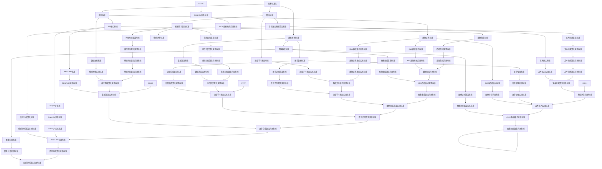
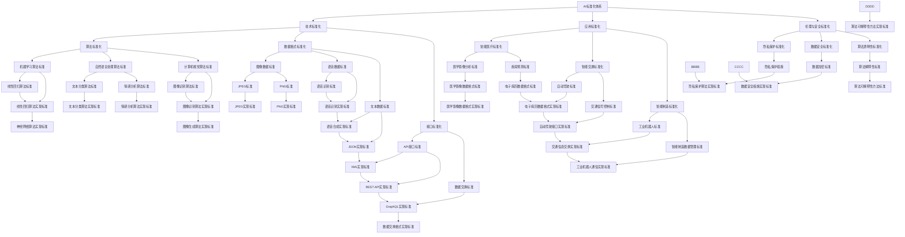

                 

### 文章标题: AI标准化：构建全球智能互联的基础

在当今快速发展的技术时代，人工智能（AI）已经成为推动社会进步和经济发展的核心动力。然而，随着AI技术的广泛应用，标准化问题也日益凸显。AI标准化不仅是技术发展的必然需求，更是构建全球智能互联的基础。本文将从AI标准化的背景、意义、体系、实施策略、案例研究和未来发展趋势等方面进行详细探讨，以期为读者提供一个全面而系统的AI标准化知识框架。

关键词：人工智能、标准化、全球智能互联、产业发展、科技创新、伦理与安全

摘要：本文首先介绍了AI标准化的背景和意义，分析了AI标准化对产业发展和科技创新的推动作用。接着，详细阐述了AI标准化体系，包括AI技术标准化、AI应用标准化和AI伦理与安全标准化。随后，本文探讨了AI标准化的实施策略和国际合作，以及在中国的发展现状和趋势。最后，通过几个典型案例，深入分析了AI标准化在图像识别、自动驾驶和智能医疗等领域的具体应用。本文旨在为AI标准化的研究与实践提供有益的参考。

### 第一部分：AI标准化概述

#### 第1章: AI标准化的背景和意义

在深入探讨AI标准化之前，我们需要了解其背景和意义。AI标准化起源于对人工智能技术的快速发展和广泛应用的需求。随着AI技术的不断进步，各种应用场景不断涌现，从智能家居、自动驾驶到医疗健康、金融科技，AI已经成为推动社会发展的关键力量。然而，AI技术的快速发展也带来了一系列挑战，其中最为突出的是标准化问题。

##### 1.1 AI标准化的起源与发展

AI标准化的发展可以追溯到20世纪80年代，当时计算机科学和人工智能领域开始意识到标准化的重要性。随着互联网的普及和大数据技术的兴起，AI技术得到了前所未有的发展，标准化问题也日益突出。为了推动AI技术的健康发展，全球各国和地区纷纷成立了AI标准化组织，如国际标准化组织（ISO）、国际电工委员会（IEC）等。

在这些组织的推动下，AI标准化工作逐渐展开。首先，AI技术标准化得到了重点关注，包括算法、数据格式、接口规范等方面。随后，AI应用标准化也逐渐提上日程，涉及智能医疗、智能交通、智能家居等多个领域。此外，AI伦理与安全标准化也逐渐成为研究的重点，以确保AI技术在应用过程中的合法性和安全性。

##### 1.2 AI标准化的重要性

AI标准化的重要性主要体现在以下几个方面：

1. **促进产业发展**：标准化可以为AI技术的研发和应用提供统一的规范和标准，降低企业的研发成本，提高产业整体竞争力。

2. **推动科技创新**：标准化可以为科技创新提供明确的方向和目标，促进科技成果的转化和应用，推动产业升级。

3. **保障安全性**：标准化可以为AI技术提供安全性和可靠性的保障，降低潜在的安全风险，保护用户隐私和数据安全。

4. **促进国际合作**：标准化可以为全球AI技术的发展提供共同的语言和基础，促进各国在AI领域的合作，推动全球智能互联。

##### 1.3 AI标准化面临的挑战与机遇

虽然AI标准化具有重要意义，但在实际推进过程中仍面临诸多挑战：

1. **技术复杂性**：AI技术涉及多个领域，技术复杂度高，标准化工作需要处理的技术细节众多。

2. **利益冲突**：不同利益相关方在标准化过程中可能存在利益冲突，如技术路线选择、市场垄断等问题。

3. **数据隐私**：AI技术依赖于大量数据，数据隐私和保护成为标准化过程中必须关注的问题。

然而，面对这些挑战，AI标准化也面临着巨大的机遇：

1. **技术创新**：随着AI技术的不断进步，标准化工作将不断更新和完善，为AI技术的创新发展提供支持。

2. **国际合作**：随着全球对AI标准化重视程度的提高，国际合作将进一步加强，推动全球智能互联。

3. **市场需求**：随着AI技术的广泛应用，市场需求将推动标准化工作的深入推进，为产业发展提供强大动力。

综上所述，AI标准化在推动产业发展、促进科技创新、保障安全性和促进国际合作等方面具有重要意义。尽管面临诸多挑战，但通过技术创新、国际合作和市场需求，AI标准化仍将迎来广阔的发展前景。

#### 第2章: AI标准化体系概述

AI标准化体系是确保人工智能技术在不同应用场景中实现互操作性和兼容性的重要手段。一个完整的AI标准化体系不仅涵盖了技术层面，还包括应用层面和伦理与安全层面。本章将详细探讨AI标准化体系的构成、主要内容以及各部分之间的关系。

##### 2.1 AI标准化体系的构成

AI标准化体系可以分为三个主要层次：技术标准化、应用标准化和伦理与安全标准化。

1. **技术标准化**：技术标准化主要关注AI技术的基础架构、算法、数据格式和接口等方面。这一层次的标准为AI技术的研发和应用提供了统一的规范，有助于提高技术的通用性和互操作性。

2. **应用标准化**：应用标准化主要针对具体的AI应用场景，如智能医疗、智能交通、智能家居等。这一层次的标准旨在确保AI技术在各种实际应用中的有效性、可靠性和安全性。

3. **伦理与安全标准化**：伦理与安全标准化关注AI技术在应用过程中的伦理问题和社会责任，包括隐私保护、数据安全、算法透明性等。这一层次的标准有助于规范AI技术的应用，确保其在社会中的合法性和可持续性。

##### 2.1.1 AI标准化体系的层次结构

AI标准化体系的层次结构如图1所示：

从图1中可以看出，技术标准化是AI标准化体系的基础，涵盖了算法、数据格式和接口等方面的标准。应用标准化则将这些技术标准应用于具体的AI应用场景，如智能医疗、智能交通等。伦理与安全标准化则关注AI技术在应用过程中的伦理和安全问题，确保其在社会中的合法性和可持续性。

##### 2.2 AI技术标准化

AI技术标准化是AI标准化体系的核心，其主要内容涵盖以下几个方面：

1. **算法标准**：算法标准主要涉及机器学习、自然语言处理、计算机视觉等领域的算法规范。例如，线性回归、神经网络、文本分类等算法的实现标准，包括算法的数学模型、参数设置、优化方法等。

2. **数据格式标准**：数据格式标准主要涉及AI应用中的数据表示和交换方式。常见的标准包括JSON、XML、CSV等。这些标准确保了不同系统和平台之间的数据互操作性。

3. **接口标准**：接口标准主要涉及AI系统的接口设计和实现。常见的标准包括REST API、GraphQL等。这些标准定义了系统的接口规范，使得不同系统之间可以方便地交互和数据交换。

##### 2.3 AI应用标准化

AI应用标准化是AI标准化体系的重要部分，其主要内容涵盖以下几个方面：

1. **智能医疗标准化**：智能医疗标准化涉及医疗数据管理、医疗图像处理、疾病预测等领域的标准化。例如，电子病历标准、医学图像处理标准等。

2. **智能交通标准化**：智能交通标准化涉及交通数据管理、智能交通控制系统、自动驾驶等领域的标准化。例如，交通信号控制标准、自动驾驶车辆通信标准等。

3. **智能家居标准化**：智能家居标准化涉及家庭设备互联互通、智能安防、智能家电等领域的标准化。例如，物联网设备通信标准、智能家电控制标准等。

##### 2.4 AI伦理与安全标准化

AI伦理与安全标准化是AI标准化体系中不可或缺的一部分，其主要内容涵盖以下几个方面：

1. **隐私保护**：隐私保护标准化涉及个人数据的收集、存储、处理和传输过程中的隐私保护措施。例如，数据加密标准、隐私保护算法等。

2. **数据安全**：数据安全标准化涉及数据存储、传输和处理过程中的安全措施，包括数据备份、数据恢复、数据加密等。

3. **算法透明性**：算法透明性标准化涉及算法的透明性要求，包括算法的设计、实现、训练过程和输出结果等。例如，算法解释性标准、算法可追溯性标准等。

##### 2.5 AI标准化体系的主要组成部分之间的关系

AI标准化体系的主要组成部分之间存在着密切的联系和相互作用。技术标准化为应用标准化和伦理与安全标准化提供了基础，应用标准化和伦理与安全标准化则对技术标准化提出了具体的要求。具体来说，技术标准化确保了AI技术的通用性和互操作性，应用标准化和伦理与安全标准化则确保了AI技术在各种实际应用中的有效性和安全性。

例如，在智能医疗领域，技术标准化提供了算法、数据格式和接口等方面的规范，应用标准化则确保了医疗数据的统一管理和交换，伦理与安全标准化则确保了医疗数据的安全性和隐私保护。这种多层次、相互关联的标准化体系为AI技术的健康发展提供了有力保障。

综上所述，AI标准化体系是一个多层次、相互关联的体系，涵盖了技术、应用和伦理与安全等方面。通过技术标准化、应用标准化和伦理与安全标准化，AI标准化体系为AI技术的研发、应用和推广提供了统一的规范和标准，为全球智能互联奠定了坚实基础。

#### 第3章: AI标准化实施策略

AI标准化实施策略是确保AI标准化体系有效运行和推广应用的关键。实施策略包括标准的制定、推广与应用、评估与改进等环节。本节将详细介绍AI标准化实施策略的具体步骤、国际合作情况以及在中国的发展现状和趋势。

##### 3.1 AI标准化实施的关键步骤

AI标准化实施的关键步骤主要包括以下几个环节：

1. **标准的制定**

标准的制定是AI标准化实施的首要步骤。制定标准需要明确标准的范围、目的和预期效果，并进行广泛的需求分析和讨论。标准的制定过程通常包括以下步骤：

   - **需求分析**：了解相关领域的技术需求、应用场景和用户需求，确定标准制定的方向和目标。
   - **草案编写**：根据需求分析结果，编写标准草案，包括标准的定义、范围、技术要求、测试方法等。
   - **讨论与评审**：组织专家、企业、政府等各方参与标准的讨论和评审，确保标准的科学性、合理性和可操作性。
   - **发布与实施**：完成标准草案的修订后，提交给相关标准化组织进行审批和发布，并在发布后推广实施。

2. **标准的推广与应用**

标准的推广与应用是AI标准化实施的关键环节。标准的推广与应用需要通过多种途径进行，包括：

   - **宣传培训**：通过会议、研讨会、培训等方式，宣传标准的重要性、内容和实施方法，提高各方的标准化意识和能力。
   - **技术支持**：为标准实施提供技术支持，包括标准的解释、咨询和技术服务，帮助企业解决在标准实施过程中遇到的问题。
   - **政策支持**：通过政策引导和激励措施，鼓励企业、研究机构、政府部门等积极参与标准的制定和实施。

3. **标准的评估与改进**

标准的评估与改进是确保AI标准化体系持续有效的重要环节。标准的评估与改进需要定期进行，包括以下步骤：

   - **评估**：对标准的实施效果进行评估，包括标准的适用性、有效性、用户满意度等方面。
   - **反馈**：收集各方对标准的意见和建议，了解标准在实施过程中存在的问题和改进方向。
   - **改进**：根据评估结果和反馈意见，对标准进行修订和改进，提高标准的科学性和实用性。

##### 3.2 AI标准化国际合作

AI标准化国际合作是推动全球AI标准化发展的重要途径。在国际合作中，各国和地区通过共享资源、交流经验、协同创新，共同推动AI标准化工作的深入开展。国际AI标准化合作的主要形式包括：

1. **国际标准化组织（ISO）**

国际标准化组织（ISO）是全球最具影响力的标准化机构之一，其下设有多个技术委员会，如ISO/IEC JTC1/SC42（人工智能标准化技术委员会）。该委员会负责制定和推广AI领域的国际标准。

2. **国际电工委员会（IEC）**

国际电工委员会（IEC）是专注于电气、电子和相关技术领域的国际标准化组织，其下设的IEC/TC122（人工智能技术委员会）负责制定AI领域的国际标准。

3. **区域合作组织**

如欧洲标准化组织（CEN/CENELEC）、美国国家标准协会（ANSI）等，这些组织在各自的区域内推动AI标准化工作，并与国际标准化组织保持密切合作。

4. **国际论坛与合作项目**

如人工智能论坛（AI Forum）、国际人工智能合作项目（IAAI）等，这些论坛和项目通过定期会议、研讨会、合作研究等形式，促进各国在AI标准化领域的交流与合作。

##### 3.3 AI标准化在中国的发展现状和趋势

中国高度重视AI标准化工作，积极推动AI标准化体系建设，已取得显著成果。以下是AI标准化在中国的发展现状和趋势：

1. **发展现状**

   - **标准化组织**：中国成立了多个AI标准化组织，如全国信息技术标准化技术委员会人工智能分技术委员会（TC 55/SC 46）、中国电子工业标准化技术协会人工智能标准委员会等，负责制定和推广AI标准。
   - **标准制定**：中国在机器学习、自然语言处理、计算机视觉、智能交通等领域已制定了一批国家标准、行业标准，并积极参与国际标准的制定。
   - **技术应用**：AI标准化成果已广泛应用于智能交通、智能医疗、智能安防、智能制造等领域，为产业发展提供了有力支持。

2. **发展趋势**

   - **完善标准体系**：中国将继续完善AI标准化体系，加强技术标准、应用标准和伦理与安全标准的协同发展，构建全面的AI标准化体系。
   - **国际合作**：中国积极参与国际AI标准化合作，通过参与国际标准化组织、区域合作组织等平台，推动国际AI标准化工作的深入开展。
   - **技术创新**：中国将持续推动AI技术创新，以技术创新驱动标准化工作，提升中国在全球AI标准化领域的地位和影响力。

综上所述，AI标准化实施策略的关键步骤包括标准的制定、推广与应用、评估与改进等。国际合作和在中国的发展现状和趋势表明，AI标准化在推动产业发展、促进科技创新、保障安全性方面具有重要意义。未来，随着AI技术的不断进步和国际合作的深入，AI标准化将继续发挥重要作用，为全球智能互联奠定坚实基础。

#### 第4章: AI标准化案例研究

在AI标准化的发展过程中，众多领域已经取得了显著的成果。本章将通过三个典型案例——图像识别、自动驾驶和智能医疗，深入分析AI标准化在这些领域的具体应用、现状和关键问题。

##### 4.1 案例一：图像识别标准化

图像识别是AI技术的一个重要分支，广泛应用于安防监控、医疗诊断、自动驾驶等领域。图像识别标准化旨在确保图像处理算法的通用性、互操作性和兼容性。

1. **具体应用**

   - **安防监控**：图像识别技术用于人脸识别、行为分析等，提高安防系统的智能化水平。
   - **医疗诊断**：通过图像识别技术，辅助医生进行疾病诊断，如乳腺癌检测、眼底病变诊断等。
   - **自动驾驶**：图像识别技术用于车辆识别、交通标志识别等，提高自动驾驶系统的安全性和可靠性。

2. **现状**

   - **算法标准**：已有一些算法标准，如OpenCV、TensorFlow等，但这些标准主要集中在算法实现层面，缺乏对算法参数和性能指标的统一规定。
   - **数据格式标准**：图像数据格式标准如JPEG、PNG等已广泛应用，但针对AI应用的定制化数据格式标准尚不完善。
   - **接口标准**：虽然有一些通用的接口标准，如REST API、GraphQL等，但针对图像识别的特殊需求，接口标准尚需进一步优化。

3. **关键问题**

   - **数据隐私**：图像识别涉及大量个人隐私信息，如何在保证数据安全和隐私保护的前提下进行标准化是一个挑战。
   - **算法可解释性**：算法可解释性是图像识别标准化的重要问题，如何确保算法的透明性和可解释性是当前研究的重点。

##### 4.2 案例二：自动驾驶标准化

自动驾驶技术是AI应用的一个重要领域，对交通安全、效率和环境改善具有重要意义。自动驾驶标准化旨在确保自动驾驶系统的安全性和互操作性。

1. **具体应用**

   - **自动驾驶汽车**：自动驾驶技术用于车辆导航、交通标志识别、车道保持等，提高驾驶安全性。
   - **自动驾驶无人机**：用于物流配送、环境监测等，提高作业效率。
   - **自动驾驶船舶**：用于海上航行，提高船舶运行的安全性和效率。

2. **现状**

   - **技术标准**：已有一些技术标准，如ISO 26262（汽车安全标准）、SAE J3016（自动驾驶等级）等，但这些标准主要关注安全性和可靠性，对算法性能和测试方法等细节规范较少。
   - **数据格式标准**：自动驾驶系统涉及大量传感器数据，如雷达、激光雷达、摄像头等，但目前缺乏统一的数据格式标准。
   - **接口标准**：自动驾驶系统需要与其他车辆、基础设施进行通信，但现有接口标准如CAN总线、ETH等尚需进一步完善。

3. **关键问题**

   - **测试与验证**：自动驾驶系统需要经过严格的测试与验证，确保其安全性和可靠性，但现有测试方法和技术手段尚需提高。
   - **互操作性和兼容性**：不同厂商和平台之间的自动驾驶系统需要具备互操作性和兼容性，这需要制定统一的接口和数据格式标准。

##### 4.3 案例三：智能医疗标准化

智能医疗是AI技术在医疗领域的应用，旨在提高医疗诊断、治疗和管理的效率和质量。智能医疗标准化对于确保医疗数据的安全性和隐私性、提升医疗服务的质量具有重要意义。

1. **具体应用**

   - **医学影像分析**：通过图像识别和深度学习技术，辅助医生进行医学影像分析，如肿瘤检测、骨折诊断等。
   - **疾病预测与预警**：通过分析海量医疗数据，预测疾病的发病风险和趋势，为预防和治疗提供依据。
   - **个性化治疗**：根据患者的病史、基因信息等，制定个性化的治疗方案。

2. **现状**

   - **数据标准**：医疗数据标准化是智能医疗标准化的基础，目前已有一些数据标准，如HL7、FHIR等，但标准尚需进一步完善，以适应AI技术的需求。
   - **算法标准**：虽然已有一些医学算法标准，如FDA认证的算法等，但针对不同医学领域的算法标准化尚需加强。
   - **伦理与安全标准**：智能医疗涉及患者隐私和数据安全，需要制定相应的伦理与安全标准，确保医疗数据的安全性和隐私性。

3. **关键问题**

   - **数据质量**：医疗数据的质量直接影响智能医疗系统的性能，需要制定数据质量标准，确保数据的准确性、完整性和一致性。
   - **算法透明性**：智能医疗算法的透明性是患者信任的重要基础，需要制定算法透明性标准，确保算法的公正性和可解释性。
   - **法规与政策**：智能医疗标准化需要法规与政策的支持，以规范智能医疗的应用和发展。

通过上述三个典型案例，可以看出AI标准化在不同领域的具体应用和现状。图像识别、自动驾驶和智能医疗等领域均面临着数据隐私、算法可解释性、测试与验证等关键问题。未来，随着AI技术的不断进步，AI标准化将在这些领域发挥越来越重要的作用，为全球智能互联提供坚实基础。

#### 第5章: AI标准化未来发展趋势

随着人工智能技术的快速发展，AI标准化在全球范围内逐渐受到广泛关注。未来，AI标准化将面临新的发展趋势和挑战，对产业发展、科技创新和全球智能互联将产生深远影响。

##### 5.1 AI标准化的发展趋势

1. **技术领域标准化趋势**

   - **算法标准化**：随着深度学习、强化学习等新兴算法的广泛应用，算法标准化将成为重点。未来，将出现更多针对特定算法的标准化规范，以提高算法的通用性和互操作性。
   - **数据格式标准化**：为了提高数据处理和交换的效率，数据格式标准化将不断完善。例如，针对不同类型的数据（如文本、图像、语音等），将制定更高效、更灵活的数据格式标准。
   - **接口标准化**：随着AI系统与外部系统的互联需求增加，接口标准化将成为重要趋势。将出现更多统一的API标准，以实现不同系统之间的无缝连接和互操作。

2. **应用领域标准化趋势**

   - **智能医疗**：随着AI技术在医疗领域的深入应用，智能医疗标准化将成为重要趋势。未来，将制定更多针对医学影像分析、疾病预测、个性化治疗等领域的标准化规范，以提高医疗服务的质量和效率。
   - **智能交通**：自动驾驶、智能交通管理系统等领域的标准化需求将不断增加。将制定更多关于车辆通信、交通信号控制、自动驾驶安全等方面的标准化规范，以提高交通系统的智能化和安全性。
   - **智能制造**：AI技术在智能制造领域的应用将推动标准化进程。未来，将制定更多关于工业机器人、智能制造数据管理、智能制造工艺优化等领域的标准化规范，以提高制造业的智能化水平。

3. **伦理与安全标准化趋势**

   - **隐私保护**：随着AI技术的广泛应用，隐私保护将成为重要挑战。未来，将制定更多关于数据收集、存储、处理和传输过程中的隐私保护措施，以确保用户隐私和数据安全。
   - **算法透明性**：为了增强公众对AI技术的信任，算法透明性将成为重要趋势。未来，将制定更多关于算法设计、训练过程、模型解释等方面的标准化规范，以提高算法的透明性和可解释性。
   - **安全与合规**：随着AI技术在关键领域的应用，安全与合规将成为重要关注点。未来，将制定更多关于AI系统的安全评估、合规性检查等方面的标准化规范，以确保AI系统的安全性和合规性。

##### 5.2 AI标准化面临的挑战与对策

1. **技术复杂性**

   - **挑战**：AI技术涉及多个领域，技术复杂性较高，给标准化工作带来挑战。
   - **对策**：加强跨学科合作，整合各领域专家资源，共同推动AI标准化工作。同时，采用模块化设计思想，将复杂的技术分解为若干模块，逐一进行标准化。

2. **利益冲突**

   - **挑战**：不同利益相关方（如企业、政府、研究机构等）在标准化过程中可能存在利益冲突，影响标准的制定和推广。
   - **对策**：建立公平、公正、透明的标准化机制，确保各方利益得到充分考虑。同时，通过国际合作，借鉴其他国家或地区的成功经验，降低利益冲突。

3. **数据隐私与安全**

   - **挑战**：AI技术依赖于大量数据，数据隐私与安全成为标准化过程中必须关注的问题。
   - **对策**：制定严格的隐私保护标准和安全标准，确保数据在收集、存储、处理和传输过程中的安全性和隐私性。同时，加强对数据安全和隐私保护技术的研发，提高AI系统的安全性。

##### 5.3 AI标准化对产业发展的影响

1. **促进技术创新**

   - **影响**：AI标准化可以为技术创新提供明确的方向和目标，推动新技术的发展和应用。
   - **示例**：例如，在自动驾驶领域，标准化的推进将促进自动驾驶技术的创新和发展，提高自动驾驶车辆的安全性和可靠性。

2. **降低研发成本**

   - **影响**：AI标准化可以为企业降低研发成本，提高研发效率。
   - **示例**：通过采用统一的算法和数据格式标准，企业可以节省在算法开发和数据格式转换上的时间和资源，将更多精力投入到核心技术的研发和创新。

3. **提高市场竞争力**

   - **影响**：AI标准化可以提升企业的市场竞争力，促进产业的健康发展。
   - **示例**：在智能医疗领域，通过制定和推广AI标准化规范，企业可以更快地将新技术应用于实际场景，提高产品和服务质量，增强市场竞争力。

##### 5.4 AI标准化对国际竞争力的影响

1. **促进国际技术交流与合作**

   - **影响**：AI标准化可以促进各国在AI技术领域的交流与合作，提高全球AI技术的整体水平。
   - **示例**：通过参与国际标准化组织（ISO）和国际电工委员会（IEC）等平台，各国可以共同制定和推广国际AI标准，推动全球AI技术的发展。

2. **提升国家影响力**

   - **影响**：AI标准化可以提升国家在AI技术领域的国际影响力，增强国家在全球智能互联中的地位。
   - **示例**：通过在国际标准化组织中担任重要角色，积极参与国际标准的制定和推广，国家可以提升在全球AI技术领域的声誉和影响力。

3. **推动全球智能互联**

   - **影响**：AI标准化可以推动全球智能互联，促进各国在智能交通、智能医疗、智能制造等领域的合作与发展。
   - **示例**：通过制定和推广统一的AI标准，各国可以更好地实现智能系统的互联互通，提高全球智能互联的效率和质量。

综上所述，AI标准化在未来将面临新的发展趋势和挑战。通过技术创新、国际合作和标准化策略，AI标准化将对产业发展、科技创新和国际竞争力产生深远影响，为全球智能互联奠定坚实基础。

### 附录A: AI标准化相关组织与资源

为了帮助读者进一步了解AI标准化领域的重要组织、资源和标准，本附录将介绍国际和中国的AI标准化组织，并汇总相关资源。

#### 附录A.1 国际AI标准化组织简介

1. **国际标准化组织（ISO）**

   - **简介**：ISO是一个全球性的非政府组织，负责制定国际标准。ISO/IEC JTC1/SC42（人工智能标准化技术委员会）负责AI领域的标准化工作。
   - **网址**：[ISO/IEC JTC1/SC42](https://www.iso.org/committee/5212.html)

2. **国际电工委员会（IEC）**

   - **简介**：IEC是一个国际性的非政府组织，负责电气、电子和相关领域的标准化。IEC/TC122负责AI领域的标准化工作。
   - **网址**：[IEC/TC122](https://www.iec.ch/standardization/domains/automation-systems/technical-committee/122)

3. **国际电信联盟（ITU）**

   - **简介**：ITU是联合国负责信息技术和通信标准化工作的组织。ITU-T SG16负责AI领域的标准化工作。
   - **网址**：[ITU-T SG16](https://www.itu.int/ITU-T/studygroup/index.asp?lang=3&lang=3&parent=16)

#### 附录A.2 中国AI标准化组织简介

1. **全国信息技术标准化技术委员会（TC 55）**

   - **简介**：TC 55是负责信息技术标准化工作的全国性技术委员会，下设SC 46（人工智能分技术委员会）负责AI标准化工作。
   - **网址**：[TC 55/SC 46](http://www.55tc.org.cn/)

2. **中国电子工业标准化技术协会人工智能标准委员会**

   - **简介**：该委员会是专注于人工智能领域标准化工作的行业组织，致力于推动人工智能标准化工作的发展。
   - **网址**：[中国电子工业标准化技术协会人工智能标准委员会](http://www.cesia.org.cn/)

#### 附录A.3 AI标准化资源汇总

1. **AI标准化报告和文件**

   - **ISO/IEC JTC1/SC42 报告**：[ISO/IEC JTC1/SC42 报告](https://www.iso.org/standard/72814.html)
   - **IEC/TC122 报告**：[IEC/TC122 报告](https://www.iec.ch/standardization/refine/technical-committee/122?status=under-development)

2. **AI标准化技术指南和手册**

   - **ISO/IEC TR 22087**：[AI标准化技术指南](https://www.iso.org/standard/73574.html)
   - **IEC TR 62794**：[AI系统与服务的安全指南](https://www.iec.ch/standard/62794)

3. **AI标准化工作组和会议**

   - **ISO/IEC JTC1/SC42 工作组**：[ISO/IEC JTC1/SC42 工作组](https://www.iso.org/committee/5212.html)
   - **IEC/TC122 工作组**：[IEC/TC122 工作组](https://www.iec.ch/standardization/refine/technical-committee/122?status=active)

4. **AI标准化相关书籍**

   - 《人工智能标准化导论》
   - 《人工智能标准化技术指南》
   - 《人工智能伦理与安全标准化》

通过本附录，读者可以更好地了解国际和中国的AI标准化组织及其资源，为学习和研究AI标准化提供有力支持。

### 附录B: AI标准化关键概念与联系图

为了帮助读者更好地理解AI标准化体系中的关键概念及其相互关系，以下是一个Mermaid流程图，展示了AI标准化体系的主要组成部分及其关联。

该流程图详细展示了AI标准化体系中的关键概念，包括技术标准化、应用标准化和伦理与安全标准化，以及各个子领域之间的相互关系。通过该图，读者可以更好地理解AI标准化的整体架构和具体内容。

### 完整的目录大纲

以下是根据本文的论述，构建的《AI标准化：构建全球智能互联的基础》的完整目录大纲，每个章节均包含详细的内容和结构。

---

# 《AI标准化：构建全球智能互联的基础》目录大纲

#### 第一部分：AI标准化概述

# 第1章: AI标准化的背景和意义

## 1.1 AI标准化的起源与发展

### 1.1.1 AI标准化的必要性

### 1.1.2 全球AI标准化组织

## 1.2 AI标准化的重要性

### 1.2.1 AI标准化对产业发展的影响

### 1.2.2 AI标准化对科技创新的推动作用

## 1.3 AI标准化面临的挑战与机遇

### 1.3.1 挑战：AI标准化面临的难题

### 1.3.2 机遇：AI标准化的发展趋势

#### 第二部分：AI标准化体系

# 第2章: AI标准化体系概述

## 2.1 AI标准化体系的构成

### 2.1.1 AI标准化体系的层次结构

### 2.1.2 AI标准化体系的主要内容

## 2.2 AI技术标准化

### 2.2.1 AI技术标准化的现状

### 2.2.2 AI技术标准化的发展方向

## 2.3 AI应用标准化

### 2.3.1 AI应用标准化的现状

### 2.3.2 AI应用标准化的发展方向

## 2.4 AI伦理与安全标准化

### 2.4.1 AI伦理标准化的现状

### 2.4.2 AI安全标准化的现状

#### 第三部分：AI标准化实施与推广

# 第3章: AI标准化实施策略

## 3.1 AI标准化实施的关键步骤

### 3.1.1 标准的制定

### 3.1.2 标准的推广与应用

### 3.1.3 标准的评估与改进

## 3.2 AI标准化国际合作

### 3.2.1 国际AI标准化组织

### 3.2.2 国际AI标准化合作案例

## 3.3 AI标准化在中国

### 3.3.1 中国AI标准化的发展现状

### 3.3.2 中国AI标准化的发展趋势

#### 第四部分：AI标准化案例研究

# 第4章: AI标准化案例研究

## 4.1 案例一：图像识别标准化

### 4.1.1 图像识别标准化的现状

### 4.1.2 图像识别标准化的关键问题

## 4.2 案例二：自动驾驶标准化

### 4.2.1 自动驾驶标准化的现状

### 4.2.2 自动驾驶标准化的关键问题

## 4.3 案例三：智能医疗标准化

### 4.3.1 智能医疗标准化的现状

### 4.3.2 智能医疗标准化的关键问题

#### 第五部分：AI标准化展望

# 第5章: AI标准化未来发展趋势

## 5.1 AI标准化的发展趋势

### 5.1.1 AI技术领域的标准化趋势

### 5.1.2 AI应用领域的标准化趋势

## 5.2 AI标准化面临的挑战与对策

### 5.2.1 挑战：标准化过程中的问题

### 5.2.2 对策：应对标准化的策略

## 5.3 AI标准化对产业发展的影响

### 5.3.1 AI标准化对产业创新的推动作用

### 5.3.2 AI标准化对国际竞争力的影响

### 附录

## 附录A：AI标准化相关组织与资源

### 附录A.1 国际AI标准化组织简介

### 附录A.2 中国AI标准化组织简介

### 附录A.3 AI标准化资源汇总

## 附录B：AI标准化关键概念与联系图

---

这个目录大纲结构详细地涵盖了AI标准化的各个方面，从背景和意义，到体系构成、实施策略、案例分析，再到未来展望，确保了文章内容的系统性和全面性。每个章节都包含了必要的理论讲解、实际应用和未来发展的探讨，以帮助读者全面了解AI标准化的重要性和实施路径。附录部分则提供了额外的资源和组织信息，以支持读者进一步的学习和研究。

