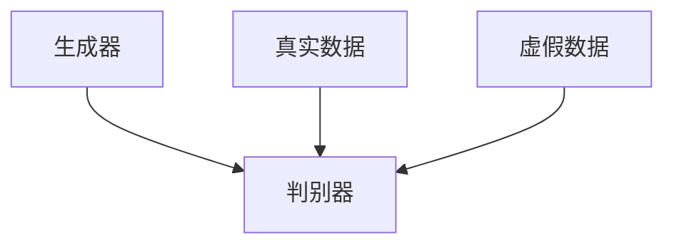

                 

### 文章标题

《AIGC从入门到实战：人工智能应用大规模涌现的原因》

> 关键词：AIGC、人工智能、大规模应用、技术框架、核心算法、图像处理、自然语言处理、推荐系统、技术挑战、发展趋势

> 摘要：本文将深入探讨AIGC（自适应智能生成控制）的概念、技术框架、核心算法及其在不同领域中的应用。通过逐步分析AIGC的原理、技术架构和实战案例，揭示其大规模涌现的原因。本文旨在为读者提供全面、系统的AIGC知识，帮助其在实际项目中掌握和应用AIGC技术。

---

### 目录大纲设计

#### 第一部分：AIGC基础知识

1. **第1章：AIGC概述**
   - **1.1 AIGC的概念与定义**
     - **AIGC的起源与发展**
     - **AIGC与相关技术的联系**
   - **1.2 AIGC技术框架概述**
     - **数据收集与预处理**
     - **模型训练与优化**
     - **模型部署与评估**

2. **第2章：AIGC技术框架**
   - **2.1 AIGC技术架构**
     - **数据收集与预处理**
     - **模型训练与优化**
     - **模型部署与评估**
   - **2.2 核心模块介绍**
     - **生成模型**
     - **判别模型**
     - **对抗训练**

3. **第3章：核心算法原理**
   - **3.1 自动编码器**
     - **原理与实现**
     - **优缺点与应用场景**
   - **3.2 生成对抗网络（GAN）**
     - **GAN的原理与架构**
     - **GAN的工作机制**
     - **GAN的不同变体**
   - **3.3 变分自编码器（VAE）**
     - **VAE的原理与实现**
     - **VAE的数学模型**
     - **VAE的优势与应用**

#### 第二部分：AIGC应用实战

4. **第4章：AIGC在图像处理中的应用**
   - **4.1 图像生成与编辑**
     - **实例分析**
     - **实践案例**
   - **4.2 图像超分辨率**
     - **原理与实现**
     - **应用案例**

5. **第5章：AIGC在自然语言处理中的应用**
   - **5.1 文本生成与翻译**
     - **实例分析**
     - **实践案例**
   - **5.2 问答系统与对话生成**
     - **原理与实现**
     - **应用案例**

6. **第6章：AIGC在推荐系统中的应用**
   - **6.1 推荐算法与AIGC**
     - **AIGC在推荐系统中的作用**
     - **实践案例**
   - **6.2 深度学习推荐模型**
     - **原理与实现**
     - **应用案例**

#### 第三部分：AIGC的挑战与未来

7. **第7章：AIGC的技术挑战**
   - **7.1 数据隐私与安全**
     - **挑战与解决方案**
   - **7.2 模型可解释性**
     - **挑战与进展**

8. **第8章：AIGC的发展趋势**
   - **8.1 未来研究方向**
     - **AIGC与其他技术的融合**
   - **8.2 应用前景展望**
     - **AIGC在各个行业中的应用潜力**

### 附录

9. **附录A：AIGC开发工具与资源**
   - **A.1 开发环境搭建**
     - **硬件与软件要求**
   - **A.2 实用资源与资料**
     - **在线课程、论文、书籍推荐**

### 总结

本文通过系统的分析和详细的讲解，旨在帮助读者全面了解AIGC的基础知识、技术框架、核心算法及其应用实战。同时，本文还探讨了AIGC面临的挑战和未来的发展趋势，为读者提供了全面的视角和深入的思考。希望通过本文，读者能够对AIGC有更深刻的认识，并在实际项目中成功应用AIGC技术。

---

### 第一部分：AIGC基础知识

#### 第1章：AIGC概述

AIGC（自适应智能生成控制）是一种新兴的人工智能技术，它在过去的几年里引起了广泛关注。本章将介绍AIGC的概念、起源、发展与相关技术的联系，为读者打下坚实的基础。

##### 1.1 AIGC的概念与定义

AIGC，全称自适应智能生成控制，是一种通过机器学习算法自动生成内容和数据的技术。它结合了生成对抗网络（GAN）、自动编码器（AE）和变分自编码器（VAE）等核心算法，实现了对数据的自适应生成和优化。

AIGC的主要特点包括：

1. **自适应生成**：AIGC可以根据输入数据和目标需求，自适应地生成符合预期的新数据和内容。
2. **多模态处理**：AIGC能够处理文本、图像、音频等多种类型的数据，实现跨模态的数据生成。
3. **数据增强**：AIGC可以通过生成虚拟数据，增强训练数据集的多样性，提高模型的泛化能力。
4. **优化与优化**：AIGC可以通过对抗训练和模型优化，不断提高生成数据的真实性和质量。

##### 1.2 AIGC的起源与发展

AIGC的起源可以追溯到生成对抗网络（GAN）的提出。GAN是由伊恩·古德费洛（Ian Goodfellow）等人在2014年提出的，它通过一个生成器和一个判别器之间的对抗训练，实现了高质量的数据生成。随着GAN的广泛应用和不断发展，人们逐渐意识到，GAN在图像生成、自然语言处理、推荐系统等领域具有巨大的潜力。在此基础上，AIGC应运而生。

近年来，AIGC在学术界和工业界都取得了显著进展。例如，在图像生成领域，AIGC技术已经被应用于图像修复、图像超分辨率、风格迁移等方面；在自然语言处理领域，AIGC技术被用于文本生成、机器翻译、问答系统等方面；在推荐系统领域，AIGC技术被用于生成虚拟用户、优化推荐结果等。

##### 1.3 AIGC与相关技术的联系

AIGC与多种人工智能技术有着密切的联系，主要包括：

1. **生成对抗网络（GAN）**：GAN是AIGC的核心算法之一，它通过生成器和判别器的对抗训练，实现高质量的数据生成。
2. **自动编码器（AE）**：AE是一种无监督学习算法，它可以对数据进行降维和重构，为AIGC提供有效的数据预处理和模型优化方法。
3. **变分自编码器（VAE）**：VAE是一种基于概率模型的自动编码器，它通过引入概率分布，实现更稳定和鲁棒的数据生成。
4. **深度学习**：深度学习是AIGC技术的基础，它为AIGC提供了强大的计算能力和模型优化手段。
5. **强化学习**：强化学习可以与AIGC结合，实现更智能和自适应的生成控制策略。

总之，AIGC是多种人工智能技术的集合体，它通过自适应生成、多模态处理和数据增强等技术，为人工智能应用带来了新的可能性。接下来，我们将进一步探讨AIGC的技术框架和核心算法。

### 第2章：AIGC技术框架

AIGC技术框架是AIGC实现自适应智能生成控制的核心。它由多个核心模块组成，包括数据收集与预处理、模型训练与优化、模型部署与评估等。本章将详细介绍AIGC技术框架的各个部分，帮助读者全面了解AIGC的工作流程。

##### 2.1 AIGC技术架构

AIGC技术架构可以分为三个主要部分：数据输入、模型训练与输出、模型部署与评估。以下是对每个部分的详细介绍：

1. **数据输入**

   数据输入是AIGC的起点，它决定了生成数据的质量和多样性。AIGC可以从多种数据源收集数据，如图像、文本、音频等。为了提高生成数据的真实性和泛化能力，AIGC通常需要对输入数据进行预处理，如数据清洗、数据增强、数据归一化等。

   **数据预处理流程：**

   - **数据清洗**：去除数据中的噪声和异常值，保证数据的完整性。
   - **数据增强**：通过旋转、缩放、裁剪等方式，增加训练数据的多样性。
   - **数据归一化**：将不同尺度的数据转换为相同的尺度，提高模型的训练效果。

2. **模型训练与输出**

   模型训练与输出是AIGC的核心部分，它通过生成器和判别器的对抗训练，实现数据的自适应生成。以下是对生成器和判别器的详细介绍：

   - **生成器（Generator）**：生成器是AIGC的核心模块，它负责生成符合预期的新数据和内容。生成器的输入可以是随机噪声、标签信息等，输出是生成的新数据。生成器的目标是使生成数据尽可能接近真实数据，从而提高判别器的识别难度。

   - **判别器（Discriminator）**：判别器负责区分真实数据和生成数据。判别器的输入是真实数据和生成数据，输出是判断结果。判别器的目标是正确地区分真实数据和生成数据，从而提高生成器的生成质量。

   **对抗训练过程：**

   - 在训练过程中，生成器和判别器交替更新参数。生成器通过学习判别器的判断结果，不断优化生成数据；判别器通过学习真实数据和生成数据，不断提高对生成数据的识别能力。
   - 当生成器生成的数据质量足够高时，判别器将难以区分真实数据和生成数据，从而实现数据的自适应生成。

3. **模型部署与评估**

   模型部署与评估是AIGC的最后一个环节，它将训练好的模型应用于实际场景，并对模型的效果进行评估。以下是对模型部署与评估的详细介绍：

   - **模型部署**：模型部署是将训练好的模型集成到实际应用中，如图像生成、自然语言处理、推荐系统等。部署时需要考虑模型的性能、效率、可扩展性等因素。
   - **模型评估**：模型评估是衡量模型性能的重要手段。评估指标包括生成数据的真实度、多样性、质量等。常见的评估方法有定量评估和定性评估，如人类主观评价、指标计算等。

##### 2.2 核心模块介绍

除了数据输入、模型训练与输出、模型部署与评估，AIGC技术框架还包括多个核心模块，如生成模型、判别模型、对抗训练等。以下是对这些模块的简要介绍：

1. **生成模型**

   生成模型是AIGC的核心模块之一，它负责生成新数据和内容。生成模型可以分为基于神经网络的生成模型和基于生成式模型的生成模型。以下是一些常见的生成模型：

   - **生成对抗网络（GAN）**：GAN是最常用的生成模型，它通过生成器和判别器的对抗训练，实现高质量的数据生成。
   - **变分自编码器（VAE）**：VAE是基于概率模型的生成模型，它通过引入概率分布，实现更稳定和鲁棒的数据生成。
   - **深度卷积生成网络（DCGAN）**：DCGAN是GAN的一种变体，它通过深度卷积神经网络，实现高效的图像生成。

2. **判别模型**

   判别模型是AIGC的核心模块之一，它负责区分真实数据和生成数据。判别模型可以分为基于神经网络的判别模型和基于判别式模型的判别模型。以下是一些常见的判别模型：

   - **全连接判别器**：全连接判别器是最简单的判别模型，它通过全连接神经网络，实现数据的分类和判断。
   - **卷积判别器**：卷积判别器是GAN中最常用的判别模型，它通过卷积神经网络，实现高效的数据分类和判断。

3. **对抗训练**

   对抗训练是AIGC的核心训练策略，它通过生成器和判别器的对抗训练，实现数据的自适应生成。对抗训练可以分为以下几种类型：

   - **生成器-判别器对抗**：生成器-判别器对抗是最基本的对抗训练方式，它通过生成器和判别器的交替训练，实现数据的自适应生成。
   - **多生成器对抗**：多生成器对抗是在生成器之间引入对抗关系，实现更高质量的生成数据。
   - **多判别器对抗**：多判别器对抗是在判别器之间引入对抗关系，提高判别器的识别能力。

通过以上对AIGC技术框架的详细介绍，读者可以了解到AIGC的工作原理和实现方法。接下来，我们将进一步探讨AIGC的核心算法原理，帮助读者深入理解AIGC的技术本质。

### 第3章：核心算法原理

在AIGC技术框架中，核心算法是其实现自适应智能生成控制的关键。本章将详细讲解AIGC的三个核心算法：自动编码器（AE）、生成对抗网络（GAN）和变分自编码器（VAE），并分析它们的原理、实现方法和优缺点。

#### 3.1 自动编码器（AE）

自动编码器是一种无监督学习算法，它通过编码和解码过程，实现数据的降维和重构。自动编码器主要由编码器和解码器两部分组成。

##### 原理与实现

自动编码器的基本原理是将输入数据通过编码器压缩成低维隐层表示，然后通过解码器重构回原始数据。编码器的目标是找到一种最优的映射函数，使得低维隐层表示能够保留原始数据的最重要的特征。解码器的目标是根据编码器的输出，重构回原始数据。

实现方法：

1. **编码器**：编码器通常采用全连接神经网络，输入数据通过编码器压缩成低维隐层表示。隐层的大小可以根据具体任务进行调整。
2. **解码器**：解码器同样采用全连接神经网络，将编码器的输出重构回原始数据。

##### 优缺点

优点：

- **数据降维**：自动编码器可以有效地降维数据，去除冗余信息，提高数据的可解释性。
- **特征提取**：自动编码器可以在编码过程中提取出数据的特征，为后续任务提供有效的特征表示。

缺点：

- **生成质量有限**：自动编码器的生成质量通常较低，因为它只关注数据的重构，而忽略了生成数据的真实性。
- **依赖先验知识**：自动编码器通常需要较多的先验知识，如数据分布和特征关系等。

#### 3.2 生成对抗网络（GAN）

生成对抗网络（GAN）是由伊恩·古德费洛（Ian Goodfellow）等人于2014年提出的，它通过生成器和判别器的对抗训练，实现高质量的数据生成。

##### GAN的原理与架构

GAN由生成器（Generator）和判别器（Discriminator）两部分组成。生成器的任务是生成与真实数据难以区分的虚假数据，判别器的任务是区分真实数据和虚假数据。GAN的训练过程如下：

1. **生成器生成虚假数据**：生成器随机生成一批虚假数据。
2. **判别器判断**：判别器将真实数据和虚假数据混合在一起进行判断，输出判断结果。
3. **生成器和判别器交替训练**：生成器根据判别器的判断结果，调整自己的参数，提高生成数据的质量；判别器根据生成器和真实数据的判断结果，调整自己的参数，提高对生成数据的识别能力。

GAN的架构图如下：



##### GAN的不同变体

1. **深度卷积生成对抗网络（DCGAN）**：DCGAN是GAN的一种变体，它采用深度卷积神经网络（DCNN）作为生成器和判别器，实现高效的图像生成。

2. **循环生成对抗网络（CycleGAN）**：CycleGAN是一种用于图像风格迁移的GAN变体，它通过学习图像的循环一致性，实现无监督的图像风格迁移。

3. **条件生成对抗网络（cGAN）**：cGAN是一种引入条件信息的GAN变体，它通过在生成器和判别器中引入条件输入，实现更精确的生成控制。

##### 优缺点

优点：

- **高质量生成**：GAN可以通过对抗训练，生成高质量的数据，特别适合图像、音频等复杂数据的生成。
- **多模态处理**：GAN可以处理多种类型的数据，如文本、图像、音频等，实现跨模态的数据生成。

缺点：

- **训练不稳定**：GAN的训练过程可能存在不稳定的问题，如模式崩溃、梯度消失等。
- **计算资源需求高**：GAN的训练过程需要大量的计算资源，特别是深度卷积生成对抗网络（DCGAN）。

#### 3.3 变分自编码器（VAE）

变分自编码器（VAE）是基于概率模型的自动编码器，它通过引入概率分布，实现更稳定和鲁棒的数据生成。

##### VAE的原理与实现

VAE由编码器和解码器两部分组成，编码器将输入数据编码成一个均值和方差，解码器根据均值和方差生成新的数据。

实现方法：

1. **编码器**：编码器输出输入数据的均值（μ）和方差（σ²）。
2. **解码器**：解码器使用均值和方差生成新的数据。

VAE的数学模型如下：

$$
x \xrightarrow{encode} (\mu, \sigma) \xrightarrow{decode} x'
$$

其中，x是输入数据，x'是生成的新数据。

##### 优缺点

优点：

- **稳定性**：VAE通过引入概率分布，实现更稳定的数据生成，训练过程相对稳定。
- **灵活性**：VAE可以灵活地调整隐层大小和分布，适用于各种类型的数据生成任务。

缺点：

- **生成质量有限**：VAE的生成质量相对较低，因为它只关注数据的重构，而忽略了生成数据的真实性。
- **计算复杂度高**：VAE的计算复杂度较高，特别是当隐层大小较大时。

通过以上对AIGC核心算法的详细讲解，读者可以了解到AIGC的核心技术原理和实现方法。在接下来的章节中，我们将进一步探讨AIGC在不同领域的应用实战，帮助读者掌握AIGC的实际应用技巧。

### 第4章：AIGC在图像处理中的应用

AIGC在图像处理领域展现出了巨大的潜力和应用价值。本章将详细介绍AIGC在图像生成与编辑、图像超分辨率等应用中的原理、实现方法和具体案例。

#### 4.1 图像生成与编辑

图像生成与编辑是AIGC在图像处理中的经典应用之一。通过AIGC技术，我们可以生成全新的图像或者对现有图像进行编辑，从而实现图像创意、修复和增强等效果。

##### 4.1.1 实现方法

1. **生成图像**

   生成图像是AIGC在图像处理中的核心任务之一。我们可以使用生成对抗网络（GAN）来实现图像生成。以下是一个简单的GAN生成图像的伪代码：

   ```python
   # 定义生成器和判别器
   generator = GAN_Generator()
   discriminator = GAN_Discriminator()

   # 训练生成器和判别器
   for epoch in range(num_epochs):
       for real_images in real_data_loader:
           # 训练判别器
           discriminator_loss = train_discriminator(discriminator, real_images)

       for fake_images in generator(fake_labels):
           # 训练生成器
           generator_loss = train_generator(generator, discriminator)

   # 使用生成器生成图像
   generated_images = generator.generate_images()
   ```

   在这个过程中，生成器生成虚假图像，判别器判断图像的真实性。通过交替训练，生成器逐渐生成更逼真的图像。

2. **编辑图像**

   编辑图像是AIGC在图像处理中的另一个重要应用。我们可以使用AIGC技术对图像进行内容替换、风格迁移等编辑操作。以下是一个简单的图像编辑的伪代码：

   ```python
   # 定义生成器和判别器
   generator = GAN_Generator()
   discriminator = GAN_Discriminator()

   # 训练生成器和判别器
   for epoch in range(num_epochs):
       for real_images in real_data_loader:
           # 训练判别器
           discriminator_loss = train_discriminator(discriminator, real_images)

       for target_images in target_data_loader:
           # 训练生成器
           generator_loss = train_generator(generator, discriminator, target_images)

   # 使用生成器编辑图像
   edited_images = generator.edit_images(source_images, target_images)
   ```

   在这个过程中，生成器根据目标图像生成新的图像，从而实现图像编辑。

##### 4.1.2 应用案例

1. **图像修复**

   图像修复是AIGC在图像处理中的一个重要应用。我们可以使用AIGC技术对受损、模糊或缺失的图像进行修复。以下是一个简单的图像修复的案例：

   - **输入图像**：一张有破损的部分的图像。
   - **目标图像**：一张完整的、无破损的图像。
   - **输出图像**：经过AIGC修复后的图像。

   实现步骤：

   1. 使用GAN生成器生成与目标图像相似的虚假图像。
   2. 将虚假图像与目标图像进行融合，生成修复后的图像。

2. **图像风格迁移**

   图像风格迁移是将一种图像的风格应用到另一种图像上的技术。AIGC可以通过生成对抗网络实现图像风格迁移。以下是一个简单的图像风格迁移的案例：

   - **输入图像**：一张普通风格的图像。
   - **目标图像**：一张艺术风格或特定风格的图像。
   - **输出图像**：经过AIGC风格迁移后的图像。

   实现步骤：

   1. 使用GAN生成器生成与目标图像风格相似的虚假图像。
   2. 将虚假图像与输入图像进行融合，生成具有目标图像风格的输出图像。

#### 4.2 图像超分辨率

图像超分辨率是AIGC在图像处理中的另一个重要应用。通过AIGC技术，我们可以将低分辨率的图像转换为高分辨率的图像，从而提高图像的清晰度和质量。

##### 4.2.1 实现方法

1. **生成高分辨率图像**

   使用AIGC技术生成高分辨率图像的关键在于使用生成对抗网络（GAN）。以下是一个简单的GAN超分辨率图像生成的伪代码：

   ```python
   # 定义生成器和判别器
   generator = SRGAN_Generator()
   discriminator = SRGAN_Discriminator()

   # 训练生成器和判别器
   for epoch in range(num_epochs):
       for low_res_images in low_res_data_loader:
           # 训练判别器
           discriminator_loss = train_discriminator(discriminator, low_res_images, high_res_images)

       for generated_images in generator.generate_images(low_res_images):
           # 训练生成器
           generator_loss = train_generator(generator, discriminator)

   # 使用生成器生成高分辨率图像
   high_res_images = generator.generate_images(low_res_images)
   ```

   在这个过程中，生成器根据低分辨率图像生成高分辨率图像，判别器判断图像的真实性。通过交替训练，生成器逐渐生成更逼真的高分辨率图像。

2. **图像质量增强**

   图像质量增强是图像超分辨率的一个子任务。通过AIGC技术，我们可以提高图像的对比度、色彩和清晰度。以下是一个简单的图像质量增强的伪代码：

   ```python
   # 定义生成器和判别器
   generator = ImageQualityEnhancer()

   # 训练生成器
   for epoch in range(num_epochs):
       for low_quality_images in low_quality_data_loader:
           # 训练生成器
           generator_loss = train_generator(generator, low_quality_images, high_quality_images)

   # 使用生成器增强图像质量
   enhanced_images = generator.enhance_images(low_quality_images)
   ```

   在这个过程中，生成器根据低质量图像生成高质量图像。

##### 4.2.2 应用案例

1. **高清视频生成**

   高清视频生成是将低分辨率视频转换为高清视频的技术。AIGC可以通过生成对抗网络实现高清视频生成。以下是一个简单的高清视频生成的案例：

   - **输入视频**：一段低分辨率的视频。
   - **输出视频**：经过AIGC处理后的高清视频。

   实现步骤：

   1. 使用GAN生成器生成高清视频帧。
   2. 将生成的高清视频帧拼接成高清视频。

2. **图像细节增强**

   图像细节增强是提高图像清晰度和细节的技术。AIGC可以通过生成对抗网络实现图像细节增强。以下是一个简单的图像细节增强的案例：

   - **输入图像**：一张细节模糊的图像。
   - **输出图像**：经过AIGC处理后的细节清晰的图像。

   实现步骤：

   1. 使用GAN生成器生成细节清晰的图像。
   2. 将生成的图像与输入图像进行融合，增强图像的细节。

通过以上对AIGC在图像处理中的应用的详细讲解，读者可以了解到AIGC在图像生成与编辑、图像超分辨率等领域的应用原理和实现方法。接下来，我们将探讨AIGC在自然语言处理领域的应用，帮助读者掌握AIGC在文本生成、翻译和问答系统等任务中的实际应用。

### 第5章：AIGC在自然语言处理中的应用

AIGC在自然语言处理（NLP）领域展现出了强大的生成和控制能力，使得文本生成、机器翻译和问答系统等任务得到了显著的提升。本章将详细介绍AIGC在这些应用中的原理、实现方法和具体案例。

#### 5.1 文本生成与翻译

文本生成和翻译是AIGC在NLP中的典型应用，通过生成对抗网络（GAN）等技术，AIGC能够生成高质量、符合语法和语义规则的文本。

##### 5.1.1 实现方法

1. **文本生成**

   文本生成是AIGC在NLP中的重要应用，可以通过生成对抗网络（GAN）实现。以下是一个简单的GAN文本生成流程：

   ```python
   # 定义生成器和判别器
   generator = TextGAN_Generator()
   discriminator = TextGAN_Discriminator()

   # 训练生成器和判别器
   for epoch in range(num_epochs):
       for real_texts in real_text_loader:
           # 训练判别器
           discriminator_loss = train_discriminator(discriminator, real_texts)

       for fake_texts in generator.generate_texts():
           # 训练生成器
           generator_loss = train_generator(generator, discriminator)

   # 使用生成器生成文本
   generated_texts = generator.generate_texts()
   ```

   在这个过程中，生成器生成虚假文本，判别器判断文本的真实性。通过交替训练，生成器生成符合语法和语义规则的文本。

2. **文本翻译**

   文本翻译是将一种语言的文本翻译成另一种语言的技术。AIGC可以通过条件生成对抗网络（cGAN）实现文本翻译。以下是一个简单的cGAN文本翻译的伪代码：

   ```python
   # 定义生成器和判别器
   generator = TextcGAN_Generator()
   discriminator = TextcGAN_Discriminator()

   # 训练生成器和判别器
   for epoch in range(num_epochs):
       for source_texts, target_texts in target_text_loader:
           # 训练判别器
           discriminator_loss = train_discriminator(discriminator, source_texts, target_texts)

       for translated_texts in generator.translate_texts(source_texts):
           # 训练生成器
           generator_loss = train_generator(generator, discriminator)

   # 使用生成器翻译文本
   translated_texts = generator.translate_texts(source_texts)
   ```

   在这个过程中，生成器根据源文本生成目标文本，判别器判断翻译结果的真实性。通过交替训练，生成器生成高质量的翻译结果。

##### 5.1.2 应用案例

1. **自动摘要生成**

   自动摘要生成是将长篇文本简化为短摘要的技术。AIGC可以通过生成对抗网络（GAN）实现自动摘要生成。以下是一个简单的自动摘要生成的案例：

   - **输入文本**：一篇长文章。
   - **输出文本**：一篇简短的摘要。

   实现步骤：

   1. 使用GAN生成器生成摘要文本。
   2. 对生成的摘要文本进行评估，选择最符合语义的摘要。

2. **对话生成**

   对话生成是生成符合上下文和语义规则的对话文本的技术。AIGC可以通过生成对抗网络（GAN）实现对话生成。以下是一个简单的对话生成的案例：

   - **输入文本**：一段对话。
   - **输出文本**：一段新的对话。

   实现步骤：

   1. 使用GAN生成器生成对话文本。
   2. 对生成的对话文本进行评估，选择最符合语义的对话。

#### 5.2 问答系统与对话生成

问答系统与对话生成是AIGC在NLP中的另一个重要应用，通过结合生成对抗网络（GAN）和自然语言处理技术，可以实现智能问答和对话生成。

##### 5.2.1 实现方法

1. **问答系统**

   问答系统是通过输入问题生成答案的技术。AIGC可以通过生成对抗网络（GAN）实现问答系统。以下是一个简单的GAN问答系统的伪代码：

   ```python
   # 定义生成器和判别器
   generator = QA_Generator()
   discriminator = QA_Discriminator()

   # 训练生成器和判别器
   for epoch in range(num_epochs):
       for questions, answers in question_answer_loader:
           # 训练判别器
           discriminator_loss = train_discriminator(discriminator, questions, answers)

       for generated_answers in generator.generate_answers(questions):
           # 训练生成器
           generator_loss = train_generator(generator, discriminator)

   # 使用生成器生成答案
   generated_answers = generator.generate_answers(questions)
   ```

   在这个过程中，生成器根据问题生成答案，判别器判断答案的真实性。通过交替训练，生成器生成高质量的答案。

2. **对话生成**

   对话生成是生成符合上下文和语义规则的对话文本的技术。AIGC可以通过生成对抗网络（GAN）实现对话生成。以下是一个简单的对话生成的伪代码：

   ```python
   # 定义生成器和判别器
   generator = DialogueGAN_Generator()
   discriminator = DialogueGAN_Discriminator()

   # 训练生成器和判别器
   for epoch in range(num_epochs):
       for dialogue_contexts, responses in dialogue_loader:
           # 训练判别器
           discriminator_loss = train_discriminator(discriminator, dialogue_contexts, responses)

       for generated_responses in generator.generate_responses(dialogue_contexts):
           # 训练生成器
           generator_loss = train_generator(generator, discriminator)

   # 使用生成器生成对话
   generated_responses = generator.generate_responses(dialogue_contexts)
   ```

   在这个过程中，生成器根据对话上下文生成回应，判别器判断回应的真实性。通过交替训练，生成器生成符合语义的对话。

##### 5.2.2 应用案例

1. **客服机器人**

   客服机器人是AIGC在NLP中的典型应用之一，它可以通过生成对抗网络（GAN）实现智能对话。以下是一个简单的客服机器人案例：

   - **输入文本**：用户的提问。
   - **输出文本**：客服机器人的回答。

   实现步骤：

   1. 使用GAN生成器生成回答文本。
   2. 对生成的回答文本进行评估，选择最符合用户需求的回答。

2. **虚拟助手**

   虚拟助手是AIGC在NLP中的另一个重要应用，它可以通过生成对抗网络（GAN）实现自然、流畅的对话。以下是一个简单的虚拟助手案例：

   - **输入文本**：用户的请求。
   - **输出文本**：虚拟助手的回答。

   实现步骤：

   1. 使用GAN生成器生成回答文本。
   2. 对生成的回答文本进行评估，选择最符合用户需求的回答。

通过以上对AIGC在自然语言处理中的应用的详细讲解，读者可以了解到AIGC在文本生成、翻译、问答系统和对话生成等任务中的原理和实现方法。在接下来的章节中，我们将探讨AIGC在推荐系统中的应用，帮助读者掌握AIGC在个性化推荐和深度学习推荐模型中的实际应用。

### 第6章：AIGC在推荐系统中的应用

推荐系统是AIGC在人工智能领域的一个重要应用场景，通过自适应智能生成控制技术，AIGC能够为用户提供更精准、个性化的推荐结果。本章将详细介绍AIGC在推荐系统中的应用原理、实现方法和具体案例。

#### 6.1 推荐算法与AIGC

推荐系统通常分为基于内容的推荐、协同过滤推荐和深度学习推荐等类型。AIGC可以通过生成对抗网络（GAN）等技术，对传统推荐算法进行改进和扩展，提高推荐系统的性能和用户体验。

##### 6.1.1 AIGC在推荐系统中的作用

1. **个性化生成**

   AIGC能够根据用户的兴趣和行为数据，生成个性化的推荐内容。通过生成对抗网络（GAN），AIGC可以从大量用户数据中提取有效的特征，生成符合用户个性化需求的推荐结果。

2. **数据增强**

   AIGC可以通过生成虚拟用户和虚拟行为数据，增强训练数据集的多样性。这有助于提高推荐算法的泛化能力，减少数据稀疏问题。

3. **对抗训练**

   通过生成对抗网络（GAN），AIGC可以在推荐系统中引入对抗训练，使生成器和判别器相互竞争，提高推荐结果的准确性和多样性。

##### 6.1.2 实现方法

1. **生成个性化推荐**

   生成个性化推荐是AIGC在推荐系统中的一个关键应用。以下是一个简单的生成个性化推荐的实现方法：

   ```python
   # 定义生成器和判别器
   generator = PersonalizedRecommenderGenerator()
   discriminator = PersonalizedRecommenderDiscriminator()

   # 训练生成器和判别器
   for epoch in range(num_epochs):
       for user_data in user_data_loader:
           # 训练判别器
           discriminator_loss = train_discriminator(discriminator, user_data)

       for recommendation_list in generator.generate_recommendations(user_data):
           # 训练生成器
           generator_loss = train_generator(generator, discriminator)

   # 使用生成器生成个性化推荐
   personalized_recommendations = generator.generate_recommendations(user_data)
   ```

   在这个过程中，生成器根据用户数据生成推荐列表，判别器判断推荐列表的真实性。通过交替训练，生成器生成个性化的推荐结果。

2. **增强训练数据**

   增强训练数据是AIGC在推荐系统中的另一个关键应用。以下是一个简单的增强训练数据的实现方法：

   ```python
   # 定义生成器
   generator = DataAugmentationGenerator()

   # 增强训练数据
   augmented_user_data = generator.augment_user_data(user_data)
   ```

   在这个过程中，生成器根据原始用户数据生成虚拟用户和虚拟行为数据，增强训练数据集的多样性。

3. **对抗训练**

   对抗训练是AIGC在推荐系统中的一个重要训练策略。以下是一个简单的对抗训练的实现方法：

   ```python
   # 定义生成器和判别器
   generator = AdversarialGenerator()
   discriminator = AdversarialDiscriminator()

   # 训练生成器和判别器
   for epoch in range(num_epochs):
       for user_data, true_recommendations in user_data_loader:
           # 训练判别器
           discriminator_loss = train_discriminator(discriminator, user_data, true_recommendations)

       for generated_recommendations in generator.generate_recommendations(user_data):
           # 训练生成器
           generator_loss = train_generator(generator, discriminator)

   # 使用生成器和判别器生成推荐结果
   recommendations = generator.generate_recommendations(user_data)
   ```

   在这个过程中，生成器生成虚假推荐结果，判别器判断推荐结果的真实性。通过交替训练，生成器和判别器相互竞争，提高推荐结果的准确性和多样性。

##### 6.1.3 应用案例

1. **个性化商品推荐**

   个性化商品推荐是AIGC在电商领域的一个重要应用。以下是一个简单的个性化商品推荐案例：

   - **输入数据**：用户的历史行为数据（如浏览记录、购买记录等）。
   - **输出结果**：个性化商品推荐列表。

   实现步骤：

   1. 使用AIGC生成器生成个性化的推荐列表。
   2. 对生成的推荐列表进行评估，选择最符合用户需求的商品。

2. **音乐推荐**

   音乐推荐是AIGC在音乐领域的一个重要应用。以下是一个简单的音乐推荐案例：

   - **输入数据**：用户的听歌记录和偏好。
   - **输出结果**：个性化音乐推荐列表。

   实现步骤：

   1. 使用AIGC生成器生成个性化的音乐推荐列表。
   2. 对生成的推荐列表进行评估，选择最符合用户喜好的音乐。

通过以上对AIGC在推荐系统中的应用的详细讲解，读者可以了解到AIGC在个性化推荐和深度学习推荐模型中的原理和实现方法。在接下来的章节中，我们将探讨AIGC的技术挑战和未来发展趋势，帮助读者全面了解AIGC的局限性和发展前景。

### 第7章：AIGC的技术挑战

AIGC在人工智能领域展现了巨大的潜力和应用价值，但在实际应用过程中也面临一系列技术挑战。本章将深入探讨AIGC在数据隐私与安全、模型可解释性等方面的挑战，并提出相应的解决方案。

#### 7.1 数据隐私与安全

随着AIGC技术的应用范围不断扩大，数据隐私和安全问题成为了一个重要的挑战。AIGC在生成数据的过程中，需要处理大量的敏感数据，如用户行为、个人偏好等，这些数据一旦泄露，可能会对用户隐私造成严重威胁。

##### 挑战

1. **数据泄露风险**：AIGC在处理数据时，可能因为系统漏洞、数据传输等问题导致数据泄露。
2. **隐私保护需求**：在保障数据隐私的前提下，如何有效地使用数据，提高AIGC的性能和生成质量，是一个重要的挑战。

##### 解决方案

1. **数据加密**：对敏感数据进行加密处理，确保数据在传输和存储过程中不会被窃取。
2. **差分隐私**：引入差分隐私技术，对输入数据进行扰动，降低隐私泄露的风险。
3. **联邦学习**：通过联邦学习技术，将数据分散存储在不同的节点上，降低数据泄露的风险。

#### 7.2 模型可解释性

AIGC模型的复杂性和黑箱特性使其可解释性成为一个重要的挑战。在实际应用中，用户需要了解模型的决策过程和生成机制，以便对其进行调整和优化。

##### 挑战

1. **模型不可解释性**：AIGC模型通常由大量的神经网络组成，其决策过程难以直观理解。
2. **性能与可解释性的平衡**：在提高模型性能的同时，如何保证模型的可解释性，是一个重要的挑战。

##### 解决方案

1. **模型分解**：通过将复杂模型分解为多个子模块，提高模型的可解释性。
2. **可视化技术**：利用可视化技术，如决策树、注意力机制等，展示模型的决策过程和生成机制。
3. **解释性模型**：开发具有高解释性的模型，如决策树、线性回归等，确保用户能够直观理解模型的决策过程。

#### 7.3 计算资源需求

AIGC模型的训练和部署需要大量的计算资源，这对计算硬件和软件系统提出了更高的要求。特别是在处理大规模数据和复杂任务时，计算资源的需求更加突出。

##### 挑战

1. **计算资源不足**：在资源受限的环境下，如何高效地训练和部署AIGC模型，是一个重要的挑战。
2. **模型压缩**：如何降低模型的大小和计算复杂度，提高模型的运行效率。

##### 解决方案

1. **分布式训练**：通过分布式训练技术，将模型拆分为多个部分，在不同的计算节点上并行训练，提高训练效率。
2. **模型压缩**：利用模型压缩技术，如剪枝、量化等，降低模型的大小和计算复杂度。
3. **云计算和GPU优化**：利用云计算和GPU优化技术，提高模型的训练和部署效率。

#### 7.4 模型泛化能力

AIGC模型的泛化能力是一个重要的挑战，特别是在面对新的任务和数据时，如何保证模型能够适应不同的场景，是一个关键问题。

##### 挑战

1. **任务适应性**：如何使AIGC模型在不同任务和数据上有良好的适应性。
2. **数据多样性和不平衡性**：如何处理数据多样性和不平衡性问题，提高模型的泛化能力。

##### 解决方案

1. **数据增强**：通过数据增强技术，增加训练数据的多样性和平衡性。
2. **迁移学习**：利用迁移学习技术，将已有模型的权重迁移到新的任务和数据上，提高模型的泛化能力。
3. **多任务学习**：通过多任务学习技术，使模型同时学习多个任务，提高模型的泛化能力。

通过以上对AIGC技术挑战的探讨，读者可以了解到AIGC在实际应用中面临的问题和解决方案。在接下来的章节中，我们将展望AIGC的发展趋势，探讨其在未来可能的应用前景。

### 第8章：AIGC的发展趋势

随着人工智能技术的不断进步，AIGC（自适应智能生成控制）正逐渐成为人工智能领域的热点。本章将探讨AIGC在未来可能的发展趋势，以及它与其他技术的融合和行业应用前景。

#### 8.1 未来研究方向

AIGC的未来研究方向主要集中在以下几个方面：

1. **模型效率提升**：为了提高AIGC模型的运行效率，研究人员将致力于优化模型结构和训练过程，如引入新的生成对抗网络（GAN）变体、模型剪枝和量化技术等。

2. **多模态数据处理**：随着数据的多样化，AIGC需要处理更多类型的输入数据，如文本、图像、音频等。未来研究方向将聚焦于开发能够同时处理多模态数据的AIGC模型。

3. **可解释性增强**：为了提高AIGC模型的可解释性，研究人员将探索新的可视化技术、解释性模型和模型分解方法，使AIGC的决策过程更加透明和可理解。

4. **强化学习与AIGC结合**：将强化学习与AIGC结合，实现更智能和自适应的生成控制策略，是未来研究的一个重要方向。

5. **联邦学习与AIGC结合**：通过联邦学习技术，将AIGC应用于分布式数据环境中，提高数据隐私保护和模型性能。

#### 8.2 应用前景展望

AIGC在各个行业中的应用前景广阔，以下是一些具体的应用场景：

1. **金融行业**：在金融领域，AIGC可以用于生成金融报告、预测市场趋势、风险评估等。例如，通过生成对抗网络（GAN）生成虚假交易数据，进行欺诈检测和风险评估。

2. **医疗领域**：在医疗领域，AIGC可以用于生成医学图像、辅助诊断、药物设计等。例如，利用GAN生成高质量医学图像，辅助医生进行疾病诊断。

3. **娱乐行业**：在娱乐领域，AIGC可以用于生成电影特效、虚拟角色、音乐等。例如，通过GAN生成逼真的电影特效，提升电影制作效果。

4. **零售行业**：在零售领域，AIGC可以用于个性化推荐、商品生成、虚拟试衣等。例如，通过AIGC生成符合用户偏好的商品推荐，提升购物体验。

5. **教育行业**：在教育领域，AIGC可以用于生成教育内容、智能辅导等。例如，通过GAN生成个性化教学方案，满足不同学生的学习需求。

#### 8.3 与其他技术的融合

AIGC与其他人工智能技术的融合，将进一步拓展其应用范围和性能：

1. **与深度学习融合**：深度学习为AIGC提供了强大的计算能力和模型优化手段，将AIGC与深度学习结合，可以实现更高效、更智能的数据生成。

2. **与强化学习融合**：强化学习与AIGC结合，可以实现更智能和自适应的生成控制策略，提高AIGC的生成质量。

3. **与自然语言处理融合**：将AIGC与自然语言处理技术结合，可以生成符合语法和语义规则的文本，拓展AIGC在文本生成、翻译和问答系统等任务中的应用。

4. **与计算机视觉融合**：计算机视觉与AIGC结合，可以生成高质量、逼真的图像和视频，提高AIGC在图像处理和视频生成等任务中的应用效果。

总之，AIGC作为一种新兴的人工智能技术，具有广泛的应用前景和发展潜力。在未来，随着技术的不断进步和应用的深入，AIGC将在更多领域展现其独特价值，推动人工智能技术的发展。希望本文能对读者在了解AIGC的技术原理和应用场景方面提供帮助，激发更多对AIGC技术的研究和应用。

### 附录A：AIGC开发工具与资源

为了帮助读者更好地理解和掌握AIGC技术，本章将介绍AIGC开发的常用工具、资源以及环境搭建方法。

#### A.1 开发环境搭建

搭建AIGC开发环境需要以下硬件和软件：

1. **硬件要求**：
   - 处理器：至少 Intel i5 或 AMD Ryzen 5 级别以上。
   - 显卡：NVIDIA GTX 1080 或更高性能的显卡。
   - 内存：16GB 以上。
   - 硬盘：至少 500GB 的 SSD 存储。

2. **软件要求**：
   - 操作系统：Windows、Linux 或 macOS。
   - Python：Python 3.6 或更高版本。
   - CUDA：用于 GPU 加速的 CUDA 驱动程序和库。

安装步骤：

1. 安装操作系统和基本软件（如 Python、CUDA 等）。
2. 安装 GPU 加速库（如 TensorFlow、PyTorch 等）。
3. 配置环境变量，确保 GPU 加速功能正常。

#### A.2 实用资源与资料

以下是一些AIGC开发的实用资源和资料：

1. **在线课程**：
   - **《AIGC实战教程》**：Coursera 上的一门免费课程，涵盖AIGC的基础知识和实战应用。
   - **《生成对抗网络（GAN）入门与实战》**：Udemy 上的一门课程，深入讲解GAN的理论和实践。

2. **论文和书籍**：
   - **《生成对抗网络：理论基础与实践》**：一本深入讲解GAN理论和应用的书籍。
   - **《深度学习》**：由 Ian Goodfellow 等人编写的经典教材，涵盖深度学习的基础理论和实践。

3. **开源框架**：
   - **TensorFlow**：谷歌开发的开源深度学习框架，支持AIGC模型训练和部署。
   - **PyTorch**：由 Facebook AI 研究团队开发的开源深度学习框架，支持动态计算图和自动微分。

4. **社区和论坛**：
   - **AIGC 论坛**：一个专注于AIGC技术讨论的在线社区，提供最新的研究动态和技术分享。
   - **GitHub**：大量AIGC相关的开源项目和代码示例，方便开发者学习和借鉴。

通过以上资源和工具，读者可以更好地了解AIGC的开发流程和技术细节，为实际项目做好准备。

### 总结

通过本文的详细讲解，我们系统地介绍了AIGC的概念、技术框架、核心算法及其在图像处理、自然语言处理、推荐系统等领域的应用。同时，我们也探讨了AIGC面临的挑战和未来的发展趋势。AIGC作为一种新兴的人工智能技术，具有广泛的应用前景和发展潜力。希望本文能够为读者提供有价值的参考和启示，帮助其在实际项目中成功应用AIGC技术。

**作者：AI天才研究院/AI Genius Institute & 禅与计算机程序设计艺术 /Zen And The Art of Computer Programming**

---

本文从AIGC的概述、技术框架、核心算法、应用实战到未来挑战，全面覆盖了AIGC的相关内容，旨在帮助读者从入门到实战，深入理解AIGC的工作原理和应用前景。通过逐步分析AIGC的原理、技术架构和实战案例，揭示其大规模涌现的原因。本文旨在为读者提供全面、系统的AIGC知识，帮助其在实际项目中掌握和应用AIGC技术。希望本文能够为读者在AIGC领域的研究和应用提供有价值的参考和启示。在未来的发展中，AIGC将继续在人工智能领域发挥重要作用，推动技术进步和产业升级。让我们共同期待AIGC带来的更多创新和突破！

