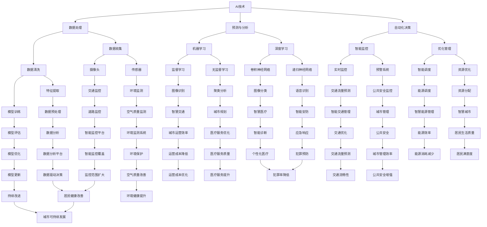

                 

### 文章标题

# AI与人类计算：打造可持续发展的城市基础设施

### 关键词

- 人工智能
- 人类计算
- 城市基础设施
- 可持续发展
- 智能交通
- 绿色能源
- 智慧城市

### 摘要

本文旨在探讨人工智能（AI）与人类计算在城市基础设施规划、建设和管理中的结合，如何共同打造一个可持续发展的城市环境。通过分析AI与人类计算的基础概念和各自优势，结合城市规划、建设和管理的具体需求，本文展示了AI与人类计算在城市基础设施各环节中的应用案例，并提出了融合发展的策略。同时，本文还讨论了可持续发展的城市基础设施所面临的挑战和机遇，提出了未来展望。通过系统的分析和实例讲解，本文希望能够为读者提供一套完整的AI与人类计算结合的城市基础设施解决方案。

## 目录大纲设计

### 第一部分: 引言

#### 1.1 书籍背景与目的

#### 1.2 AI与人类计算的关系

### 第二部分: AI技术基础

#### 2.1 AI概述

#### 2.2 人类计算概述

### 第三部分: 城市基础设施中的AI应用

#### 3.1 城市规划中的AI应用

#### 3.2 城市建设中的AI应用

#### 3.3 城市管理中的AI应用

### 第四部分: AI与人类计算的融合应用

#### 4.1 融合应用原理

#### 4.2 实际案例

### 第五部分: 可持续发展的城市基础设施

#### 5.1 可持续发展的概念

#### 5.2 基于AI与人类计算的可持续发展策略

### 第六部分: 案例研究

#### 6.1 国际城市案例研究

#### 6.2 中国城市案例研究

### 第七部分: 未来展望

#### 7.1 融合发展趋势

#### 7.2 未来展望

### 附录

#### 附录A: 相关术语解释

#### 附录B: 实用工具与资源推荐

## 第一部分: 引言

### 1.1 书籍背景与目的

在21世纪，城市已经成为全球经济发展的核心驱动力。然而，随着城市化进程的加速，城市基础设施面临诸多挑战，如交通拥堵、环境污染、资源短缺等。为了应对这些挑战，人工智能（AI）与人类计算的结合变得至关重要。本书旨在探讨AI与人类计算在城市基础设施中的结合，以实现城市的可持续发展。

城市基础设施包括交通、能源、供水、排水、环境等多个方面，它们的规划、建设和管理直接关系到城市的运行效率和居民的生活质量。AI技术以其强大的数据处理和分析能力，能够在这些方面提供智能化解决方案。同时，人类计算在决策支持和交互方面具有独特的优势，两者结合可以形成一种新的城市发展模式。

本书的目的是：

1. 介绍AI与人类计算的基础知识，帮助读者理解两者的概念和特点。
2. 分析AI与人类计算在城市基础设施中的具体应用，包括城市规划、建设和管理的各个阶段。
3. 探讨AI与人类计算融合的原理和策略，以及其在实际案例中的应用。
4. 提出基于AI与人类计算的可持续发展策略，为城市基础设施的智能化和可持续发展提供参考。

通过本书，读者可以了解到如何利用AI与人类计算的结合，解决城市基础设施中的复杂问题，打造一个可持续发展的城市环境。

### 1.2 AI与人类计算的关系

AI（人工智能）和人类计算在城市基础设施中发挥着各自独特的作用，但它们之间也存在紧密的联系。

首先，AI是一种模拟人类智能的技术，它能够通过算法和模型，从大量数据中提取信息，进行复杂的分析和决策。AI技术在数据收集、处理、分析和预测方面具有显著的优越性。例如，通过AI技术，可以实时监控交通流量，预测城市需求，优化能源消耗等。这种能力为城市基础设施的智能化管理提供了强大的支持。

其次，人类计算则依赖于人类的认知、经验和判断力。在复杂、动态和不确定的环境中，人类计算能够提供更加灵活和智能的决策支持。特别是在需要人类直接干预和指导的情境中，如城市规划中的公共参与、建设项目中的安全监督、城市管理中的应急响应等，人类计算的优势更加明显。

AI与人类计算的关系可以概括为以下几个方面：

1. **互补性**：AI擅长处理大量的数据和信息，但缺乏人类的情感和直觉；而人类计算在决策和互动方面具有优势，但无法处理海量数据。两者的结合可以取长补短，共同应对城市基础设施中的复杂挑战。

2. **协同性**：在许多应用场景中，AI和人类计算需要协同工作。例如，在城市交通管理中，AI可以通过数据分析提供交通预测和优化建议，而人类计算则可以根据这些信息做出最终的决策，并进行现场调度和调整。

3. **互操作性**：AI和人类计算需要通过有效的接口和协议进行互操作，确保两者之间的信息交换和协同工作。例如，在智慧城市建设中，需要将AI系统与人类计算平台（如城市指挥中心）进行集成，以实现全面、高效的智能管理。

总之，AI与人类计算的结合不仅能够提升城市基础设施的管理水平，还能为城市的可持续发展提供新的思路和解决方案。通过深入理解和有效利用这两者，我们有望打造一个更加智能、高效和可持续发展的城市环境。

### 第二部分: AI技术基础

#### 2.1 AI概述

人工智能（AI，Artificial Intelligence）是指通过计算机程序模拟人类智能行为的技术。AI的目标是使计算机能够执行人类智能任务，如视觉识别、语言理解、决策推理等。AI技术的发展经历了多个阶段，从早期的规则推理、知识表示到现代的机器学习和深度学习，每个阶段都有其独特的技术特点和应用场景。

**定义与分类**

AI可以按照实现方式分为以下几类：

- **弱AI（Narrow AI）**：弱AI是指专注于特定任务的人工智能系统，例如图像识别、自然语言处理等。这类AI系统在特定领域表现出色，但缺乏跨领域的泛化能力。

- **强AI（General AI）**：强AI是指具有人类智能的广泛能力，能够理解和执行任何认知任务。目前，强AI仍然处于理论阶段，尚未实现。

**关键技术和应用**

AI的关键技术包括：

- **机器学习（Machine Learning）**：机器学习是一种使计算机通过数据学习实现智能的技术。它通过算法让计算机从数据中学习，从而做出预测和决策。机器学习可以分为监督学习、无监督学习和半监督学习。

  - **监督学习**：监督学习是指通过已标记的训练数据来训练模型，使模型能够预测新数据的标签。例如，图像识别和文本分类。
  - **无监督学习**：无监督学习是指从未标记的数据中学习，目的是发现数据中的模式和结构。例如，聚类分析和降维。
  - **半监督学习**：半监督学习是指利用少量标记数据和大量未标记数据共同训练模型。这种方法在数据标注成本高昂的情况下尤为重要。

- **深度学习（Deep Learning）**：深度学习是一种特殊的机器学习技术，利用多层神经网络模拟人脑处理信息的方式。深度学习在图像识别、语音识别和自然语言处理等领域取得了显著成果。

  - **卷积神经网络（CNN）**：卷积神经网络是一种在图像和视频处理中广泛应用的网络结构。它通过卷积操作提取图像的特征，从而实现图像分类和目标检测。
  - **递归神经网络（RNN）**：递归神经网络是一种在序列数据处理中常用的网络结构，例如语音识别和时间序列预测。
  - **生成对抗网络（GAN）**：生成对抗网络是一种用于生成数据的新兴技术，通过对抗训练生成逼真的图像、音频和文本。

AI在各个领域都有广泛的应用，以下是一些典型应用场景：

- **智能交通**：通过AI技术，可以实时监控交通流量，预测交通状况，优化交通信号，减少拥堵和交通事故。
- **智慧医疗**：AI技术可以帮助医生进行疾病诊断、治疗方案推荐和个性化医疗。例如，通过图像识别技术，AI可以辅助医生进行病理图像的分析和诊断。
- **智能制造**：在制造业中，AI技术可以用于生产过程的优化、质量控制和故障预测，提高生产效率和产品质量。
- **智慧能源**：通过AI技术，可以实现能源的智能调度和优化，提高能源利用效率，减少能源浪费。
- **金融服务**：AI技术在金融领域的应用包括风险控制、投资决策、客户服务等方面，可以提高金融服务的效率和准确性。

总之，AI技术以其强大的数据处理和分析能力，正在改变各行各业，为人类带来巨大的便利和进步。随着AI技术的不断发展和创新，它将在更多领域发挥重要作用，推动社会的持续进步。

#### 2.2 人类计算概述

人类计算（Human Computing）是指人类在计算过程中的认知、决策和交互能力。与计算机计算不同，人类计算依赖于人类的大脑和神经系统，具有高度的灵活性和创造力。人类计算的核心在于人类的思维过程，包括感知、理解、推理、决策和创造等。

**概念与特点**

人类计算的概念可以从以下几个方面进行理解：

1. **认知过程**：人类计算的核心是认知过程，即人类如何通过感知和理解来处理信息。认知过程涉及感知信息、构建模型、进行推理和决策等多个环节。

2. **决策能力**：人类计算具有高度的决策能力，能够在复杂、动态和不确定的环境中做出有效的决策。这种能力源于人类的经验、知识和直觉。

3. **交互能力**：人类计算不仅能够进行独立计算，还能够与其他人、设备和系统进行交互。这种交互能力使得人类计算在需要人机协作的场景中具有显著优势。

人类计算的特点主要包括：

- **灵活性与适应性**：人类计算能够在不同情境下灵活调整计算方法和策略，适应复杂和动态的环境。
- **创造力**：人类计算能够进行创新和创造，产生新的想法和解决方案。
- **情感与道德判断**：人类计算能够基于情感和道德标准进行决策，这在某些需要道德和情感考虑的场景中具有重要意义。
- **社会互动**：人类计算能够进行社会互动，处理人与人之间的复杂关系。

**应用领域**

人类计算在多个领域都有广泛应用，以下是一些典型应用：

1. **城市规划**：在城市化过程中，人类计算能够发挥重要作用，如城市规划、设计、公共参与等。人类计算可以帮助规划者从多方面考虑城市发展的可持续性和协调性。

2. **决策支持**：在政府和企业中，人类计算可以提供决策支持，如政策制定、战略规划、资源配置等。人类计算能够基于大量的信息和数据，提供全面、深入的决策依据。

3. **创意产业**：在文化创意产业中，人类计算能够激发创造力，如设计、艺术创作、内容生成等。人类计算能够通过探索不同的思路和创意，推动艺术和设计的创新。

4. **教育**：在教育领域，人类计算能够提供个性化的学习体验和指导，如教学设计、学生评估、学习资源推荐等。人类计算可以帮助教育者根据学生的特点和能力，制定个性化的教学计划。

5. **人机交互**：在人机交互领域，人类计算能够提供自然、直观的交互体验。例如，智能助手、虚拟现实和增强现实等技术，都是基于人类计算原理开发的。

总之，人类计算以其独特的认知、决策和交互能力，在多个领域发挥着重要作用。随着人类计算技术的发展和应用，它将为人类带来更多的便利和创新，推动社会的进步。

#### 2.3 AI与人类计算的互补性

在解决城市基础设施中的复杂问题时，人工智能（AI）与人类计算（Human Computing）的互补性尤为显著。两者各自具有独特的优势和局限性，结合使用可以弥补彼此的不足，形成更为有效的解决方案。

**AI的优势与局限性**

AI在处理海量数据、进行复杂分析和自动化决策方面具有显著优势。其关键优势包括：

- **数据处理能力**：AI能够快速处理和分析大量数据，提取有用信息，为决策提供支持。
- **自动化决策**：AI可以基于算法和模型，自动化地执行任务和决策，减少人为干预。
- **模式识别**：通过机器学习和深度学习，AI能够识别和分类复杂的数据模式，进行预测和优化。

然而，AI也存在一定的局限性：

- **数据依赖**：AI的性能高度依赖于数据的数量和质量，数据不足或数据噪声会影响其效果。
- **缺乏灵活性**：AI系统通常在特定领域表现出色，但难以适应新的、未知的环境和任务。
- **道德和伦理问题**：AI的决策过程可能涉及道德和伦理问题，如隐私保护、偏见消除等。

**人类计算的优势与局限性**

人类计算在认知、决策和交互方面具有独特优势，其关键优势包括：

- **认知灵活性**：人类计算能够灵活应对复杂和动态的环境，处理未知和突发的问题。
- **直觉和经验**：人类计算依赖于直觉和经验，能够基于有限的、不完全的信息做出有效决策。
- **道德和伦理判断**：人类计算能够考虑道德和伦理因素，进行符合人类价值观的决策。

人类计算也存在一些局限性：

- **信息处理速度**：与计算机相比，人类计算的速度较慢，难以处理海量数据。
- **一致性**：人类计算的决策可能受主观因素影响，导致结果不一致。
- **重复劳动**：人类计算难以自动化执行重复性任务，效率较低。

**互补性分析**

AI与人类计算的互补性体现在以下几个方面：

1. **数据与认知互补**：AI擅长处理和分析海量数据，而人类计算则能够在有限的、不完全的数据基础上进行认知和决策。两者的结合可以实现数据驱动和认知驱动的混合决策过程。

2. **自动化与灵活性互补**：AI可以自动化执行重复性任务，提高效率，而人类计算则可以在复杂、动态和不确定的环境中提供灵活、个性化的解决方案。这种互补性使得两者可以共同应对城市基础设施中的多样化需求。

3. **决策与伦理互补**：AI的决策过程可能涉及道德和伦理问题，而人类计算能够考虑这些因素，进行符合伦理标准的决策。通过人类计算提供道德和伦理指导，可以确保AI系统的决策结果符合社会价值观。

4. **创新与优化互补**：人类计算能够进行创新和探索，提出新的解决方案，而AI则能够基于数据和算法进行优化，提升解决方案的效率和效果。这种互补性可以推动城市基础设施的不断改进和发展。

**应用实例**

在城市交通管理中，AI可以通过实时监控和分析交通流量数据，预测交通状况并优化交通信号。然而，当面对突发交通事件或紧急情况时，人类计算可以提供灵活的应对策略，确保交通系统的平稳运行。例如，在遇到交通事故时，人类交通管理人员可以快速做出决策，调整交通信号，缓解交通拥堵。

在智慧城市建设中，AI可以通过大数据分析和预测，优化城市资源分配和公共服务。然而，在涉及居民需求和社区互动方面，人类计算可以提供更加个性化和贴心的服务。例如，通过社区参与和民意调查，人类计算可以了解居民的真实需求，为城市建设提供更加科学的决策支持。

总之，AI与人类计算的互补性使得两者可以共同应对城市基础设施中的复杂问题，实现更高效、更智能和更可持续的发展。通过深入理解和有效利用这两者的互补性，我们可以为城市带来更多的便利和进步。

### 第三部分: 城市基础设施中的AI应用

#### 3.1 城市规划中的AI应用

城市规划是一个复杂的过程，涉及到多个方面的因素，如人口增长、交通需求、环境保护、资源利用等。传统的城市规划方法往往依赖于经验和直觉，难以应对现代城市面临的多样化和动态化挑战。随着AI技术的快速发展，AI在城市规划中的应用逐渐成为了一个重要研究方向，它能够通过数据分析和模型预测，为城市规划提供科学、高效的决策支持。

**AI在城市规划中的应用场景**

1. **人口和需求预测**：通过分析历史数据和当前趋势，AI可以预测城市人口的增长、分布和需求变化。这些预测结果可以帮助规划者更好地规划住宅区、商业区和公共设施，确保城市发展的需求与供给相匹配。

2. **交通流量预测和优化**：AI可以通过分析交通数据，预测交通流量和交通模式，从而优化交通基础设施布局和交通信号控制。例如，利用深度学习模型，AI可以预测高峰时段的交通流量，并动态调整交通信号灯，减少拥堵和事故。

3. **环境保护和资源利用**：AI可以通过分析环境数据和能源消耗数据，预测环境变化和资源消耗趋势。在此基础上，规划者可以制定更加环保和可持续的城市发展策略，如推广绿色建筑、建设生态公园和智能管网系统。

**AI技术在城市规划中的应用实例**

1. **深圳智能城市规划**：深圳市是中国的一个经济特区，近年来，深圳市政府利用AI技术对城市规划进行了全面升级。通过大数据分析和机器学习模型，深圳市政府预测了未来的人口增长和需求变化，并制定了相应的城市规划。例如，深圳在建设过程中，利用AI技术优化了交通信号控制，减少了交通拥堵，提升了市民的出行体验。

2. **纽约智慧城市规划**：纽约市是世界上人口最多的城市之一，面临着严重的交通拥堵和环境问题。为了解决这些问题，纽约市政府与科技公司合作，利用AI技术对城市规划进行了优化。通过AI预测交通流量和需求，纽约市政府调整了交通信号灯，优化了公共交通线路，并推广了共享单车和电动汽车，有效缓解了交通压力和环境污染。

**AI在城市规划中的挑战**

1. **数据质量和可靠性**：AI模型的效果高度依赖于输入数据的质量和可靠性。城市规划中的数据来源多样，包括人口统计、交通流量、环境监测等，这些数据的准确性和一致性都需要保证。

2. **算法偏见和伦理问题**：AI模型在处理数据时可能会引入偏见，如对特定人群的不公平对待或错误预测。这些问题需要通过算法优化和伦理审查来解决。

3. **跨领域协调**：城市规划涉及多个领域，如交通、环保、经济等。AI技术需要在这些领域之间实现有效的协调，确保整体规划的统一性和科学性。

综上所述，AI在城市规划中的应用为城市规划提供了新的思路和工具，有助于解决城市发展的复杂问题。然而，为了充分发挥AI的潜力，需要解决数据质量、算法偏见和跨领域协调等问题，以确保AI在城市规划中的有效应用。

#### 3.2 城市建设中的AI应用

在城市建设过程中，AI技术正逐渐成为提升施工效率、保证质量和安全的重要工具。通过自动化施工、智能化监控和质量检测，AI技术在城市基础设施建设中发挥着越来越重要的作用。

**AI技术在城市建设中的应用场景**

1. **自动化施工**：AI技术可以用于自动化施工，包括自动化挖掘、混凝土浇筑和钢筋绑扎等。例如，利用机器人进行路面铺设和桥梁建设，可以大幅提高施工效率，减少人力成本。

2. **智能化监控**：AI技术可以通过摄像头、传感器和无人机等设备，对施工现场进行实时监控，及时发现和处理问题。例如，利用AI技术监测混凝土强度和钢筋安装质量，确保施工过程符合设计要求。

3. **质量检测**：AI技术可以对建筑材料和施工质量进行自动化检测，提高检测效率和准确性。例如，利用AI进行钢结构检测、混凝土强度测试和防水性能评估，确保施工质量。

**AI技术在城市建设中的应用实例**

1. **迪拜智能城市建设**：迪拜是一个现代化城市，在城市建设中广泛应用了AI技术。例如，迪拜利用无人机和AI技术对建筑工地进行实时监控，确保施工安全和质量。此外，迪拜还采用了智能混凝土搅拌车和自动驾驶挖掘机，提高了施工效率。

2. **中国港珠澳大桥建设**：港珠澳大桥是中国的一项重大基础设施项目，在建设过程中采用了多种AI技术。例如，利用AI进行桥梁结构健康监测，实时监控桥梁的变形和应力状态，确保桥梁的安全运行。此外，港珠澳大桥还采用了自动化施工技术，提高了施工效率和质量。

**AI在城市建设中的挑战**

1. **技术成熟度**：虽然AI技术在城市建设中有广泛应用，但其技术成熟度仍需进一步提升。例如，自动化施工和智能化监控技术需要解决算法精度、设备可靠性和操作稳定性等问题。

2. **数据隐私和安全**：AI技术在城市建设中需要收集和处理大量的数据，这些数据涉及到施工安全、质量监测和设备状态等多个方面。因此，数据隐私和安全是AI技术应用中的一个重要挑战。

3. **人力与机器协同**：在城市建设过程中，人类工人和机器设备需要协同工作。如何实现人机协同，确保施工安全和效率，是一个需要解决的难题。

总之，AI技术在城市建设中的应用为提升施工效率、保证质量和安全提供了新的解决方案。然而，为了充分发挥AI的潜力，需要克服技术成熟度、数据隐私和安全以及人机协同等方面的挑战。通过持续的技术创新和应用实践，我们可以期待AI在城市建设中的更加广泛和深入的应用。

#### 3.3 城市管理中的AI应用

在城市管理过程中，AI技术的应用极大地提升了城市运营效率和服务质量。通过智能监控、数据分析、实时预警和优化管理，AI技术正在帮助城市管理者更好地应对各种挑战，提高城市管理的智能化水平。

**AI技术在城市管理中的应用场景**

1. **智能监控**：AI技术可以通过摄像头、传感器和无人机等设备，对城市进行实时监控。例如，利用AI进行交通流量监测、公共安全监控和环境监测，可以及时发现和处理问题，保障城市安全。

2. **数据分析**：AI技术可以处理和分析海量数据，提供决策支持。例如，利用大数据分析技术，可以分析城市交通流量、人口分布和资源消耗等，为城市管理者提供科学的决策依据。

3. **实时预警**：AI技术可以通过对数据的实时分析，提前预警可能发生的问题。例如，利用AI进行水污染预警、火灾预警和交通事故预警，可以及时采取措施，减少灾害损失。

4. **优化管理**：AI技术可以帮助城市管理者优化资源配置和管理策略。例如，通过优化交通信号控制、能源调度和垃圾处理等，提高城市运营效率和服务质量。

**AI技术在城市管理中的应用实例**

1. **新加坡智能城市管理**：新加坡是世界上最早实施智慧城市计划的的国家之一。在新加坡，AI技术广泛应用于城市管理。例如，新加坡利用AI技术进行交通流量监测和优化，通过动态调整交通信号灯，减少交通拥堵。此外，新加坡还利用AI技术进行环境监测和垃圾处理，实现了城市环境的智能化管理。

2. **洛杉矶智能交通管理**：洛杉矶是美国的一个大城市，交通拥堵一直是城市管理的难题。为了解决这个问题，洛杉矶市利用AI技术进行交通流量监测和预测。通过分析交通数据，AI技术可以实时调整交通信号灯，优化交通流线，减少交通拥堵。此外，洛杉矶还采用了自动驾驶技术和智能停车管理系统，提高了交通效率和停车便利性。

**AI在城市管理中的挑战**

1. **数据质量和隐私**：AI技术依赖于大量的数据，数据的质量和隐私保护是应用中需要解决的问题。如何确保数据的准确性和隐私性，是一个需要关注的挑战。

2. **算法公正性和透明度**：AI算法在决策过程中可能存在偏见和歧视，如何确保算法的公正性和透明度，避免对特定人群的不公平对待，是一个重要的问题。

3. **技术成熟度和成本**：AI技术在城市管理中的应用仍处于发展初期，技术成熟度和应用成本是制约其广泛应用的关键因素。如何提高技术成熟度、降低应用成本，是AI技术在城市管理中需要解决的挑战。

总之，AI技术在城市管理中的应用为城市管理者提供了强大的工具，有助于提升城市运营效率和服务质量。然而，为了充分发挥AI的潜力，需要解决数据质量、隐私保护、算法公正性和技术成熟度等方面的挑战。通过持续的技术创新和应用实践，我们可以期待AI在城市建设中的更加广泛和深入的应用。

### 第四部分: AI与人类计算的融合应用

#### 4.1 融合应用的原理

在解决复杂城市问题时，单纯的AI或人类计算都存在一定的局限性。为了最大化发挥两者的优势，AI与人类计算的融合应用成为一个重要的研究方向。这种融合不仅能够弥补AI在处理不确定性和复杂决策时的不足，还能利用人类计算在认知和交互方面的独特优势，实现更加智能化和高效的决策。

**融合应用的必要性**

1. **应对不确定性**：城市基础设施中的问题往往具有不确定性和复杂性，例如交通拥堵、资源短缺和环境污染等。单纯依赖AI技术，可能难以全面、准确地对这些复杂问题进行预测和优化。人类计算在处理不确定性问题和进行灵活决策方面具有显著优势，通过与AI技术结合，可以共同应对这些挑战。

2. **提升决策质量**：AI技术虽然能够处理大量数据并进行复杂分析，但其决策过程往往缺乏人类直觉和经验。通过人类计算提供决策支持和判断，可以确保AI系统的决策结果更加符合实际需求和社会价值观。

3. **优化资源利用**：AI技术在资源优化和调度方面具有优势，但人类计算在决策支持和资源分配方面具有更高的灵活性和适应性。两者的结合可以实现资源的最大化利用，提高城市基础设施的运行效率。

**融合应用的方法**

1. **协同计算**：通过建立AI和人类计算之间的协同计算框架，实现数据共享和任务分配。例如，在城市交通管理中，AI技术负责实时监控和分析交通数据，而人类计算则根据分析结果进行决策和调度，实现人机协同。

2. **混合智能系统**：构建混合智能系统，将AI和人类计算有机地集成在一起。这种系统能够根据不同的任务和环境，灵活切换AI和人类计算的方式，实现最优化的决策。例如，在紧急情况下，人类计算可以快速介入，提供灵活的解决方案；而在常规运行中，AI技术可以负责大部分的决策和执行。

3. **数据驱动与经验结合**：在AI与人类计算融合应用中，可以将AI技术用于数据处理和分析，而人类计算则基于经验和直觉进行决策支持。例如，在城市规划中，AI可以提供人口和需求预测，而人类计算则根据这些预测结果和实际经验，制定更加科学和可行的城市规划方案。

**案例一：智能交通管理系统**

智能交通管理系统（ITS）是一个典型的AI与人类计算融合应用的实例。通过集成AI技术和人类计算，智能交通管理系统可以提供实时交通监控、流量预测和优化调度。

- **AI技术**：AI技术用于实时收集和分析交通数据，如交通流量、速度和交通事故等。通过机器学习和深度学习算法，AI可以预测交通流量变化，并提供优化建议。
  
- **人类计算**：人类计算在城市交通管理中负责决策支持和协调。交通管理人员根据AI提供的预测和建议，进行实时调度和调整，以确保交通系统的平稳运行。

**案例二：智慧能源管理系统**

智慧能源管理系统（WEMS）利用AI与人类计算的融合，实现能源的智能调度和优化。

- **AI技术**：AI技术用于实时监测和分析能源消耗数据，如电力、燃气和水的使用情况。通过数据分析和预测模型，AI可以识别能源浪费和优化潜力。
  
- **人类计算**：人类计算负责能源管理策略的制定和调整。能源管理人员根据AI的分析结果，制定合理的能源使用计划，并在必要时进行手动干预，确保能源系统的稳定运行。

**融合应用的效果**

AI与人类计算的融合应用，在提升城市基础设施管理和决策水平方面取得了显著效果：

1. **提高效率**：通过AI技术的高效数据处理和分析能力，结合人类计算的灵活决策和调度能力，可以大幅提升城市基础设施的运营效率。

2. **降低成本**：通过优化资源配置和管理策略，AI与人类计算的融合应用可以有效降低运营成本，提高经济效益。

3. **提升服务质量**：通过智能化管理和实时监控，城市基础设施的服务质量得到了显著提升，居民的生活品质得到了保障。

总之，AI与人类计算的融合应用为城市基础设施的智能化和可持续发展提供了新的思路和解决方案。通过不断探索和应用，我们可以期待AI与人类计算在城市基础设施中的更加广泛和深入的应用，为城市带来更多的便利和进步。

#### 4.2 融合应用的实际案例

在实际应用中，AI与人类计算的融合已经在多个领域取得了显著成效。以下将介绍两个具有代表性的实际案例：智能交通管理系统和智慧能源管理系统，详细分析其实现原理、应用效果和实际影响。

**案例一：智能交通管理系统**

**实现原理**

智能交通管理系统（ITS）通过整合AI和人类计算技术，实现对城市交通流量、交通信号、交通事故和路况的实时监控和动态管理。具体实现原理如下：

1. **数据收集与预处理**：利用传感器、摄像头、雷达等设备，收集城市交通数据，包括车辆流量、速度、位置和事故报告等。AI技术用于对收集到的数据进行预处理，包括数据清洗、去噪和归一化处理，以获得高质量的输入数据。

2. **交通流量预测**：基于收集到的交通数据，AI技术使用机器学习和深度学习算法进行交通流量预测。这些算法能够学习历史交通数据中的模式和趋势，从而预测未来一段时间内的交通流量变化。

3. **实时监控与决策支持**：AI系统将预测结果和实时交通数据结合起来，为交通信号控制提供动态调整建议。交通管理人员则根据AI提供的建议和现场情况，进行实时决策和调整，以优化交通流线，减少拥堵和交通事故。

4. **人机协同**：在紧急情况下，如交通事故或突发事件，交通管理人员可以手动干预AI系统，提供更灵活的决策。这种人机协同的工作模式，确保了交通管理的灵活性和应急响应能力。

**应用效果**

通过智能交通管理系统，多个城市已经实现了交通流量的大幅优化，具体应用效果包括：

1. **减少交通拥堵**：AI技术能够实时预测交通流量，并提供交通信号灯的动态调整建议，有效缓解了高峰时段的交通拥堵。

2. **降低交通事故率**：AI系统的实时监控和预警功能，帮助交通管理人员及时发现和应对交通事故，降低了交通事故的发生率。

3. **提高公共交通效率**：智能交通管理系统可以优化公共交通线路和班次安排，提高了公共交通的准时性和服务质量。

4. **提升出行体验**：通过实时交通信息的提供，智能交通管理系统帮助驾驶员和乘客更好地规划出行路线，减少了出行时间和费用。

**实际影响**

智能交通管理系统的成功应用，对城市交通管理产生了深远影响：

1. **提升了城市运行效率**：智能交通管理系统实现了交通流量的优化和交通管理的自动化，大大提升了城市运行效率。

2. **改善了居民生活质量**：通过减少交通拥堵和交通事故，智能交通管理系统提高了居民的生活质量和安全。

3. **促进了经济发展**：智能交通管理系统为城市商业区、工业区和服务业的顺畅运行提供了保障，促进了城市的经济发展。

**案例二：智慧能源管理系统**

**实现原理**

智慧能源管理系统（WEMS）通过AI和人类计算技术的融合，实现对城市能源的智能调度和优化管理。具体实现原理如下：

1. **数据采集与整合**：利用传感器和智能设备，采集城市能源系统的实时数据，包括电力、燃气和水的使用情况。AI技术用于对数据进行采集、传输和整合，确保数据的高效处理。

2. **需求预测与优化**：基于历史能源使用数据和环境因素（如天气、时间段等），AI技术使用机器学习和深度学习算法进行能源需求预测。这些算法能够识别能源使用模式，预测未来能源需求。

3. **智能调度与优化**：AI系统根据能源需求和供应情况，制定最优的能源调度计划。通过智能调度，AI技术可以优化能源使用，减少能源浪费，提高能源利用效率。

4. **决策支持与人类计算**：能源管理人员根据AI的调度建议和实时数据，进行决策和调整。例如，在电力高峰期，管理人员可以手动调整能源使用策略，以平衡供需，确保能源系统的稳定运行。

**应用效果**

智慧能源管理系统在多个城市已经取得了显著的应用效果：

1. **提高能源效率**：通过智能调度和优化，智慧能源管理系统显著提高了能源利用效率，减少了能源浪费。

2. **降低运营成本**：智慧能源管理系统通过优化能源使用，降低了能源消耗和运营成本，提高了经济效益。

3. **提升能源安全性**：智能调度和实时监控功能，确保了能源系统的安全性和稳定性，减少了能源中断和事故风险。

4. **改善环境质量**：智慧能源管理系统鼓励使用可再生能源和环保技术，减少了污染物排放，改善了城市环境质量。

**实际影响**

智慧能源管理系统的成功应用，对城市能源管理和环境保护产生了积极影响：

1. **促进了可持续发展**：智慧能源管理系统通过优化能源使用和推广可再生能源，推动了城市的可持续发展。

2. **提高了居民生活质量**：通过提供稳定、高效的能源供应和改善环境质量，智慧能源管理系统提高了居民的生活质量。

3. **推动了技术创新**：智慧能源管理系统推动了AI和物联网技术的发展，为城市能源管理提供了新的解决方案。

总之，AI与人类计算的融合应用在智能交通管理系统和智慧能源管理系统中取得了显著成效，不仅提高了城市基础设施的管理效率和居民生活质量，还为城市的可持续发展提供了新的思路和方向。随着技术的不断进步和应用实践的不断深入，我们可以期待AI与人类计算在城市基础设施中的更加广泛和深入的应用。

### 第五部分：可持续发展的城市基础设施

#### 5.1 可持续发展的概念

可持续发展是一种旨在满足当前需求而不损害子孙后代满足其需求的发展模式。它强调在经济增长、社会进步和环境保护之间实现平衡，以确保资源的合理利用和生态系统的健康。在城市建设和管理中，可持续发展尤为重要，因为它直接关系到城市居民的生活质量、环境健康和未来发展的可持续性。

**定义与原则**

1. **定义**：可持续发展是指满足当前人类需求，同时不损害未来世代满足其需求的能力。它不仅关注经济增长，还强调社会公正、环境保护和资源可持续利用。

2. **原则**：
   - **公平性**：可持续发展追求代际之间的公平，即当代人的发展不应损害未来世代的权益。
   - **持续性**：可持续发展强调资源的合理利用和生态系统的保护，确保自然资源和生态环境的长期健康。
   - **共同性**：可持续发展是一个全球性挑战，需要全球合作和共同努力，以实现全球范围内的可持续发展。
   - **阶段性**：可持续发展是一个逐步实现的过程，不同国家和地区可以根据自身的发展阶段和条件，制定相应的可持续发展目标和策略。

**重要性**

在城市建设和管理中，可持续发展的原则和目标具有以下几个重要方面：

1. **环境保护**：通过实施环保措施和绿色技术，减少污染和资源浪费，保护生态环境，提高城市空气质量、水质和土壤质量。
   
2. **资源利用**：通过优化资源分配和利用，提高资源利用效率，减少对自然资源的依赖，降低能源消耗和废弃物产生。
   
3. **社会公正**：通过改善社会基础设施和公共服务，提高居民的生活质量，减少贫困和社会不平等，促进社会和谐与稳定。
   
4. **经济发展**：通过推动技术创新和产业升级，实现经济结构优化和可持续发展，提高城市的综合竞争力和可持续发展能力。

**可持续发展与城市基础设施的关系**

城市基础设施是城市运行的核心支撑，包括交通、能源、供水、排水、环境等多个方面。可持续发展的目标要求城市基础设施在设计、建设和管理中遵循可持续发展的原则，实现以下目标：

1. **绿色基础设施**：推广绿色建筑、绿色交通和绿色能源，减少对环境的负面影响。
   
2. **智能基础设施**：利用人工智能、物联网和大数据等技术，提高城市基础设施的管理效率和服务水平。
   
3. **适应性基础设施**：在设计和管理中考虑气候变化和自然灾害等因素，提高城市的适应能力和抗灾能力。

通过实现这些目标，城市基础设施不仅可以为城市提供稳定、高效的服务，还可以促进城市的可持续发展，提高居民的生活质量，推动经济的持续健康发展。

#### 5.2 基于AI与人类计算的可持续发展策略

在城市基础设施的可持续发展中，人工智能（AI）和人类计算（Human Computing）的结合发挥着关键作用。通过将AI的强大数据处理能力与人类计算的灵活性和创造力相结合，可以制定出科学、高效的可持续发展策略，实现城市的绿色、智能和可持续发展目标。

**策略一：优化资源配置**

**背景**：城市基础设施的运营和管理需要大量的资源，包括能源、水资源、土地和人力资源等。传统的方法往往依赖于经验和直觉，难以实现资源的最大化利用和优化配置。

**AI与人类计算的结合方法**：

1. **数据分析和预测**：利用AI技术，对城市基础设施的运行数据进行全面分析和预测，识别资源利用中的浪费和不均衡现象。通过大数据分析，可以了解各种资源的实际消耗情况，预测未来的需求趋势。

2. **优化算法**：基于分析结果，使用AI算法优化资源的分配和调度。例如，通过智能电网调度系统，可以实时优化电力资源的分配，减少能源浪费。利用AI优化交通信号系统，可以提高交通流量效率，减少拥堵和能源消耗。

3. **人类计算参与**：在AI优化过程中，人类计算可以提供决策支持和反馈。规划者和决策者可以根据AI的预测和建议，结合自身经验和专业知识，制定更加科学和合理的资源配置策略。

**实施效果**：

1. **资源利用率提高**：通过AI技术优化资源配置，可以实现能源、水资源和土地等资源的最大化利用，减少浪费。

2. **运营成本降低**：优化资源配置可以降低基础设施的运营成本，提高经济效益。

3. **环境负荷减少**：通过减少能源和资源的消耗，可以降低对环境的负面影响，实现绿色发展的目标。

**策略二：推广绿色技术**

**背景**：随着城市化进程的加快，环境污染和资源枯竭问题日益严重。为了实现可持续发展，城市基础设施需要大量采用绿色技术，包括可再生能源、节能设备和环保材料等。

**AI与人类计算的结合方法**：

1. **技术评估和选择**：利用AI技术对各种绿色技术进行评估和选择，分析其环保效益、成本效益和技术可行性。通过大数据分析和机器学习算法，可以快速识别和推广具有较高环保效益的技术。

2. **智能化监控系统**：通过AI技术，建立智能化监控系统，实时监测绿色技术的运行状态和效果。例如，利用智能传感器监测空气质量、水质和噪声等环境指标，确保绿色技术能够有效发挥其作用。

3. **人类计算决策支持**：在绿色技术推广过程中，人类计算可以提供决策支持和监督。规划者和决策者可以根据AI提供的分析结果和监控数据，制定合理的绿色技术推广策略，确保技术的有效应用。

**实施效果**：

1. **环境污染减少**：通过推广绿色技术，可以显著减少城市的环境污染，改善空气质量、水质和土壤质量。

2. **资源消耗减少**：绿色技术的应用可以减少能源和资源的消耗，提高资源利用效率。

3. **可持续发展能力增强**：通过推广绿色技术，可以提高城市的可持续发展能力，为城市的长期健康发展提供保障。

**策略三：促进智慧城市建设**

**背景**：智慧城市是利用信息技术和智能化手段，提高城市运行效率、服务水平和居民生活质量的一种新型城市发展模式。智慧城市建设需要大量的AI和人类计算技术支持。

**AI与人类计算的结合方法**：

1. **数据整合与智能分析**：利用AI技术，对城市运行数据进行整合和分析，构建智慧城市的数据平台。通过大数据分析和机器学习算法，可以实时监控城市运行状态，识别问题和优化管理。

2. **智能应用开发**：基于AI和人类计算技术，开发智慧城市的各类智能应用，如智能交通、智能能源、智能安防和智能公共服务等。这些应用可以通过AI算法优化运行，提供高效、便捷的服务。

3. **人类计算参与**：在智慧城市建设中，人类计算可以提供决策支持和互动。规划者和决策者可以根据AI的分析结果和智能应用的反馈，制定科学合理的城市规划和政策，确保智慧城市的顺利运行。

**实施效果**：

1. **运行效率提高**：智慧城市建设通过智能化管理和高效服务，可以显著提高城市运行效率，减少资源浪费。

2. **服务质量提升**：智慧城市的各类智能应用，可以为居民提供更加便捷、高效的服务，提高居民的生活质量。

3. **可持续发展能力增强**：通过智慧城市建设，可以提升城市的可持续发展能力，为城市的长期健康发展提供支持。

总之，基于AI与人类计算的可持续发展策略，通过优化资源配置、推广绿色技术和促进智慧城市建设，可以为城市基础设施的可持续发展提供有力支持。通过不断探索和创新，我们可以期待城市基础设施在实现可持续发展目标方面取得更大的进展。

### 第六部分：案例研究

#### 6.1 国际城市案例研究

在全球化背景下，国际大都市如纽约、伦敦、东京等在城市基础设施建设中积极探索AI与人类计算的应用，取得了显著成效。以下是对这些城市在AI与人类计算方面应用的详细分析。

**纽约市**

纽约市是美国最大的城市，也是全球最具代表性的城市之一。为了提升城市管理效率和居民生活质量，纽约市广泛应用了AI与人类计算技术。

- **智能交通系统**：纽约市通过部署智能交通系统（ITS），利用AI技术实时监控和分析交通流量，优化交通信号灯控制，减少交通拥堵。AI算法能够预测交通流量变化，为交通管理部门提供决策支持。同时，人类计算在城市交通管理中发挥着重要作用，如交通调度员根据实时交通情况，进行人工干预和调整，确保交通系统的平稳运行。

- **公共安全监控**：纽约市利用AI技术，对城市公共安全进行实时监控。通过摄像头和传感器收集的数据，AI系统能够识别潜在的安全威胁，如可疑行为或突发事件。人类计算在公共安全监控中起到关键作用，如警察部门可以根据AI的预警信息，迅速响应和处置突发事件。

**伦敦市**

伦敦是英国的政治、经济和文化中心，也是全球最繁荣的城市之一。在城市建设和管理中，伦敦市积极采用AI与人类计算技术，以提高城市运营效率和服务质量。

- **智慧能源管理**：伦敦市利用AI技术，对城市能源系统进行智能管理。AI算法能够预测能源需求，优化能源调度，减少能源浪费。同时，人类计算在能源管理中发挥着重要作用，如能源管理人员可以根据AI的预测和建议，调整能源使用策略，确保能源系统的稳定运行。

- **环境监测**：伦敦市通过部署AI与人类计算技术，对城市环境进行实时监测。AI系统能够分析环境数据，如空气质量、水质和噪声水平，提供环境预警。人类计算在城市环境监测中起到关键作用，如环保部门可以根据AI的监测结果，采取相应的环保措施，改善城市环境。

**东京市**

东京是日本的首都和最大都市，以其高效的交通系统和先进的城市管理技术而闻名。在AI与人类计算技术的应用方面，东京市取得了显著成果。

- **智能交通系统**：东京市通过部署智能交通系统，利用AI技术实时监控和分析交通流量，优化交通信号灯控制，提高交通效率。AI算法能够预测交通流量变化，为交通管理部门提供决策支持。同时，人类计算在交通管理中发挥着重要作用，如交通调度员根据实时交通情况，进行人工干预和调整，确保交通系统的平稳运行。

- **智慧城市平台**：东京市建立了智慧城市平台，整合AI与人类计算技术，提供城市管理的综合解决方案。该平台利用AI技术进行数据分析和预测，为城市规划、建设和管理提供科学依据。人类计算在城市管理中起到关键作用，如城市规划师和决策者可以根据AI的分析结果，制定科学合理的城市规划和政策。

**总结**

通过纽约、伦敦、东京等国际大都市的案例，我们可以看到AI与人类计算在城市基础设施中的应用不仅提高了城市管理效率和服务质量，还促进了城市的可持续发展。这些城市的成功经验表明，AI与人类计算的融合应用是未来城市发展的关键方向，为其他城市提供了宝贵的借鉴和参考。

#### 6.2 中国城市案例研究

在中国，随着城市化进程的加快，AI与人类计算技术的应用在城市基础设施领域逐渐深入，多个城市通过实践探索出了一条可持续发展的道路。以下是对中国上海、北京等大城市在AI与人类计算方面的应用进行详细分析。

**上海市**

上海市作为中国最大的经济中心，在AI与人类计算技术的应用方面走在了全国前列。

- **智能交通**：上海市通过部署智能交通系统，利用AI技术实时监控和分析交通流量，优化交通信号控制，减少交通拥堵。AI算法能够预测交通流量变化，为交通管理部门提供决策支持。同时，人类计算在交通管理中发挥着重要作用，如交警根据实时交通情况，进行人工干预和调度，确保交通系统的平稳运行。此外，上海还推出了智慧停车系统，通过AI技术实现停车资源的智能分配，提高了停车效率。

- **智慧城市建设**：上海市建立了智慧城市平台，整合AI与人类计算技术，提供城市管理的综合解决方案。该平台通过AI技术进行数据分析和预测，为城市规划、建设和管理提供科学依据。人类计算在城市管理中起到关键作用，如城市规划师和决策者根据AI的分析结果，制定科学合理的城市规划和政策。

**北京市**

北京市作为中国的首都，也是国家科技创新中心，在AI与人类计算技术的应用方面取得了显著成效。

- **智慧能源管理**：北京市通过部署智慧能源管理系统，利用AI技术实时监控和分析能源使用情况，优化能源调度，提高能源利用效率。AI算法能够预测能源需求，为能源管理部门提供决策支持。同时，人类计算在能源管理中发挥着重要作用，如能源管理人员根据AI的预测和建议，调整能源使用策略，确保能源系统的稳定运行。

- **环境监测与治理**：北京市通过部署智能环境监测系统，利用AI技术实时监测空气质量、水质和噪声水平，提供环境预警。AI算法能够分析环境数据，识别污染源，为环保部门提供治理建议。人类计算在环境监测与治理中起到关键作用，如环保部门根据AI的监测结果，采取相应的环保措施，改善城市环境。

**杭州市**

杭州市作为中国最具活力的城市之一，在AI与人类计算技术的应用方面也取得了显著成果。

- **智能安防**：杭州市通过部署智能安防系统，利用AI技术实时监控城市安全，识别可疑行为和安全隐患。AI算法能够分析监控视频，自动识别异常行为，为公安部门提供预警和线索。同时，人类计算在智能安防中发挥着重要作用，如公安人员根据AI的预警信息，迅速响应和处理突发事件。

- **智慧公共服务**：杭州市通过建立智慧公共服务平台，整合AI与人类计算技术，提供便捷高效的公共服务。该平台通过AI技术进行数据分析，为市民提供个性化的服务，如智慧医疗、智慧教育和智慧社区等。人类计算在公共服务中起到关键作用，如市民可以根据AI的建议和推荐，选择最适合自己的服务。

**总结**

通过上海、北京和杭州等中国大城市的案例，我们可以看到AI与人类计算在城市基础设施中的应用不仅提高了城市管理的效率和居民生活质量，还推动了城市的可持续发展。这些城市在AI与人类计算技术的应用方面积累了丰富的经验，为其他城市提供了宝贵的借鉴和参考。随着技术的不断进步和应用实践的不断深入，我们可以期待中国城市在AI与人类计算技术的应用方面取得更大的突破。

### 第七部分：未来展望

#### 7.1 AI与人类计算的融合发展趋势

随着科技的不断进步，人工智能（AI）与人类计算（Human Computing）的融合正呈现出快速发展的趋势。未来，这两者的结合将在多个领域产生深远影响，为城市基础设施的发展带来更多可能性。

**技术进步推动融合应用**

1. **计算能力的提升**：随着计算能力的增强，AI和人类计算可以在更加复杂和庞大的数据集上进行更高效的分析和计算。这将使得AI与人类计算的融合应用能够应对更加复杂的城市基础设施问题。

2. **数据采集和处理的进步**：随着物联网（IoT）和5G技术的发展，数据采集和传输的速度和效率将大幅提升。这将使得AI和人类计算可以实时获取城市基础设施的运行数据，进行实时分析和决策。

3. **算法优化和创新**：深度学习、强化学习等先进算法的持续优化和创新，将进一步提升AI的性能和适用范围。这些算法将使得AI与人类计算的融合应用更加灵活和高效。

**新兴领域应用前景**

1. **智能城市运营**：随着AI与人类计算的融合，智能城市运营将变得更加高效和智能。例如，通过AI技术，城市可以实时监控和管理交通、能源、水资源等基础设施，实现动态优化和智能调度。

2. **绿色城市建设**：AI与人类计算的结合将推动绿色城市建设，通过智能分析和预测，优化资源利用和环境保护。例如，智能电网、智能管网系统等绿色技术的应用，将显著减少能源消耗和环境污染。

3. **公共安全与应急管理**：AI与人类计算的融合将大大提升公共安全和应急管理的水平。通过实时监控和预警系统，城市可以快速响应突发事件，减少灾害损失。

**跨领域协同发展**

1. **城市规划与建设**：在城市规划和建设过程中，AI与人类计算的融合将实现跨领域的协同发展。例如，通过人类计算的规划创意和AI的技术分析，可以制定更加科学和可行的城市规划方案。

2. **社会治理与公共服务**：在社会治理和公共服务领域，AI与人类计算的融合将推动更高效、更智能的社会管理模式。例如，通过AI技术进行数据分析，可以为政府决策提供科学依据，提高社会治理的精准度和效率。

**未来挑战与机遇**

1. **数据隐私和安全**：随着AI与人类计算的融合，数据隐私和安全问题将日益突出。如何确保数据的安全和隐私，避免数据滥用，是一个重要挑战。

2. **算法公平性和透明度**：AI算法在决策过程中可能存在偏见和歧视，如何提高算法的公平性和透明度，确保其决策结果的公正性，是一个需要解决的问题。

3. **跨领域协调**：在城市基础设施的各个领域，如何实现AI与人类计算的协调和整合，确保整体系统的效率和稳定性，是一个需要持续探索的课题。

总之，AI与人类计算的融合发展趋势为城市基础设施的发展带来了巨大机遇。通过不断的技术创新和应用实践，我们可以期待AI与人类计算在城市基础设施中的更加广泛和深入的应用，为城市带来更多的便利和进步。

#### 7.2 可持续发展的城市基础设施的未来

在未来的发展中，可持续发展的城市基础设施将成为全球城市发展的关键方向。随着AI与人类计算技术的不断进步和应用，城市基础设施将迎来新的变革，实现智能化、绿色化和可持续化发展。

**智能化**

1. **智能管理与优化**：未来城市基础设施将更加智能化，通过AI和大数据技术，实现基础设施的实时监控、数据分析和优化管理。例如，智能交通系统将能够实时预测交通流量，优化交通信号控制，减少拥堵和交通事故；智能电网和智能水务系统将实现能源和水资源的高效利用和动态调度。

2. **智能化服务与体验**：未来的城市基础设施将提供更加智能化和个性化的服务。例如，智慧医疗系统将能够通过AI技术提供个性化的健康监测和医疗服务；智慧教育系统将利用AI技术实现个性化教学和学习体验。

**绿色化**

1. **绿色技术与材料**：未来的城市基础设施将大量采用绿色技术和材料，以减少对环境的负面影响。例如，绿色建筑将采用高效节能的设计和环保材料，减少能源消耗和碳排放；绿色交通系统将推广电动汽车、共享单车等环保出行方式。

2. **环境监测与治理**：未来城市基础设施将建立更加完善的智能环境监测系统，实时监控空气质量、水质和土壤质量等环境指标，及时发现和治理环境污染问题。

**可持续化**

1. **资源高效利用**：未来的城市基础设施将致力于实现资源的高效利用，减少浪费。通过AI技术优化资源分配和调度，提高资源利用效率，减少对自然资源的依赖。

2. **社会参与与治理**：未来的城市基础设施将更加注重社会参与和治理，通过AI与人类计算的融合，实现更加民主、透明和高效的治理模式。例如，通过智能化的公共服务平台，市民可以更方便地参与城市管理和决策。

3. **可持续发展指标**：未来的城市基础设施将建立更加完善的可持续发展指标体系，以全面评估城市基础设施的可持续性能。这些指标将包括能源消耗、水资源利用、碳排放、环境保护、社会公平等多个方面。

**未来展望**

未来的城市基础设施将是智能化、绿色化和可持续化的综合体。通过AI与人类计算的结合，城市基础设施将实现更加高效、智能和绿色的运行模式，为城市居民提供更加便利、舒适和可持续的生活环境。同时，未来城市基础设施的发展也将面临诸多挑战，如数据隐私和安全、算法公平性和透明度、跨领域协调等。通过持续的创新和探索，我们可以期待未来的城市基础设施在实现可持续发展目标方面取得更大的进展。

### 附录A: AI与人类计算相关术语解释

在本文中，我们介绍了一些与AI和人类计算相关的关键术语，以下是对这些术语的详细解释。

**人工智能（AI）**：人工智能是指通过计算机程序模拟人类智能行为的技术，使计算机能够执行诸如视觉识别、语言理解、决策推理等任务。

**机器学习（ML）**：机器学习是一种使计算机通过数据学习实现智能的技术，分为监督学习、无监督学习和半监督学习。

**深度学习（DL）**：深度学习是一种特殊的机器学习技术，利用多层神经网络模拟人脑处理信息的方式，常用于图像识别、语音识别和自然语言处理。

**人类计算（Human Computing）**：人类计算是指人类在计算过程中的认知、决策和交互能力，依赖于人类的大脑和神经系统。

**协同计算（Collaborative Computing）**：协同计算是指不同计算实体（包括AI和人类计算）通过合作和协作来完成计算任务。

**智慧城市（Smart City）**：智慧城市是指通过信息技术和智能化手段，提高城市运行效率、服务水平和居民生活质量的新型城市发展模式。

**可持续发展（Sustainable Development）**：可持续发展是指满足当前需求而不损害子孙后代满足其需求的发展模式，强调经济增长、社会进步和环境保护之间的平衡。

**数据隐私（Data Privacy）**：数据隐私是指保护个人数据不被未经授权的访问、使用和泄露。

**算法偏见（Algorithm Bias）**：算法偏见是指算法在决策过程中对特定群体存在不公平对待或偏见。

**跨领域协调（Cross-Domain Coordination）**：跨领域协调是指在多个领域之间实现有效的协调和整合，以实现整体系统的效率和稳定性。

通过理解这些术语，读者可以更好地理解AI和人类计算在城市基础设施中的应用，以及相关的技术原理和实际应用。

### 附录B: 实用工具与资源推荐

在AI与人类计算在城市基础设施中的应用过程中，有多种实用的工具和资源可供参考，以下是一些推荐：

**AI工具和框架**

1. **TensorFlow**：TensorFlow是由Google开发的开源机器学习和深度学习框架，广泛应用于各种AI项目。
2. **PyTorch**：PyTorch是另一个流行的开源机器学习和深度学习框架，具有易于使用的API和灵活的动态计算图。
3. **Keras**：Keras是一个高层神经网络API，可以方便地搭建和训练深度学习模型，适用于快速原型开发。

**数据分析工具**

1. **Pandas**：Pandas是Python的一个库，用于数据操作和分析，特别适合处理结构化数据。
2. **NumPy**：NumPy是一个用于数值计算的科学计算库，是进行数据分析和机器学习的基础。
3. **Jupyter Notebook**：Jupyter Notebook是一个交互式计算环境，可以用于编写和运行代码，非常适合数据分析和模型训练。

**城市数据资源和平台**

1. **OpenStreetMap**：OpenStreetMap是一个开源的地图数据平台，提供了全球的地图数据，适用于城市规划和分析。
2. **Google Earth Engine**：Google Earth Engine是一个强大的地理信息分析平台，可以处理大量卫星图像和时间序列数据。
3. **Data.gov**：Data.gov是美国政府的一个开放数据平台，提供了大量的公共数据资源，适用于各种研究和应用。

**学习资源**

1. **Coursera**：Coursera是一个在线学习平台，提供了众多关于AI、数据科学和机器学习的课程。
2. **edX**：edX是一个由哈佛大学和麻省理工学院共同创立的在线学习平台，提供了大量的计算机科学和数据科学课程。
3. **GitHub**：GitHub是一个代码托管平台，许多AI和城市数据项目都在这里开源，是学习和实践的好资源。

通过这些工具和资源，读者可以更有效地进行AI与人类计算在城市基础设施中的应用研究和实践。

### 核心概念与联系

为了更好地理解AI与人类计算在城市基础设施中的应用，我们可以使用Mermaid流程图来展示核心概念及其联系。以下是核心概念和架构的Mermaid流程图示例：



通过这个流程图，我们可以清晰地看到AI与人类计算在城市基础设施中的应用流程，以及各个环节之间的联系。从数据收集、处理、分析和预测，到智能监控、优化管理和决策支持，AI与人类计算共同构建了一个智能、高效和可持续的城市基础设施系统。

### 核心算法原理讲解

在本节中，我们将详细讲解AI与人类计算在城市基础设施中应用的核心算法原理，包括机器学习、深度学习和相关算法的伪代码展示。

#### 1. 机器学习算法

机器学习算法是AI技术的重要组成部分，它通过训练模型来从数据中学习并做出预测。以下是几种常用的机器学习算法的伪代码示例：

**监督学习算法：线性回归**

```python
# 线性回归模型
def linear_regression(X, y, learning_rate, epochs):
    for epoch in range(epochs):
        predictions = X * weight - bias
        error = predictions - y
        weight_gradient = 2 * X * error / n_samples
        bias_gradient = 2 * error / n_samples
        weight = weight - learning_rate * weight_gradient
        bias = bias - learning_rate * bias_gradient
    return weight, bias

# 训练模型
weight, bias = linear_regression(X, y, learning_rate, epochs)
```

**无监督学习算法：K-means聚类**

```python
# K-means聚类算法
def kmeans(X, k, max_iterations):
    centroids = initialize_centroids(X, k)
    for iteration in range(max_iterations):
        # 计算距离
        distances = calculate_distances(X, centroids)
        # 分配样本
        clusters = assign_clusters(distances)
        # 更新中心点
        new_centroids = update_centroids(X, clusters, k)
        # 检查收敛
        if centroids == new_centroids:
            break
        centroids = new_centroids
    return clusters, centroids

# 训练模型
clusters, centroids = kmeans(X, k, max_iterations)
```

#### 2. 深度学习算法

深度学习是一种特殊的机器学习技术，利用多层神经网络来模拟人脑处理信息的方式。以下是几种深度学习算法的伪代码示例：

**卷积神经网络（CNN）**

```python
# 卷积神经网络
def convolutional_neural_network(X, filters, kernel_size, pooling_size):
    conv1 = convolution(X, filters[0], kernel_size)
    pool1 = pooling(conv1, pooling_size)
    # 重复卷积和池化操作
    for filter in filters[1:]:
        conv = convolution(pool1, filter, kernel_size)
        pool = pooling(conv, pooling_size)
    # 全连接层
    fc = fully_connected(pool, output_size)
    activation = activate(fc)
    return activation

# 训练模型
activation = convolutional_neural_network(X, filters, kernel_size, pooling_size)
```

**递归神经网络（RNN）**

```python
# 递归神经网络
def recurrent_neural_network(input_sequence, hidden_state, weights):
    for input in input_sequence:
        hidden_state = sigmoid(fully_connected(input + hidden_state, weights))
    return hidden_state

# 训练模型
hidden_state = recurrent_neural_network(input_sequence, hidden_state, weights)
```

**生成对抗网络（GAN）**

```python
# 生成对抗网络
def generator(z, weights_g):
    hidden = fully_connected(z, hidden_size_g)
    output = fully_connected(hidden, output_size, activation='tanh')
    return output

def discriminator(x, weights_d):
    hidden = fully_connected(x, hidden_size_d)
    probability = fully_connected(hidden, 1, activation='sigmoid')
    return probability

# 训练模型
for epoch in range(num_epochs):
    z = generate_random_input()
    x = real_data
    g_loss, d_loss = train_gan(generator, discriminator, z, x, weights_g, weights_d)
```

这些伪代码展示了机器学习和深度学习算法的基本结构和操作。在实际应用中，这些算法需要通过大量的数据和优化过程来实现。通过这些算法，AI技术能够从数据中学习，进行预测和优化，从而为城市基础设施提供智能化的解决方案。

### 数学模型与公式

在AI与人类计算结合的城市基础设施应用中，数学模型和公式扮演着至关重要的角色。以下列出了一些关键的数学模型和公式，并进行详细讲解和举例说明。

#### 1. 回归模型

回归模型是机器学习中最基本的模型之一，用于预测连续值。常见的回归模型包括线性回归和多项式回归。

**线性回归公式：**

$$
y = \beta_0 + \beta_1x_1 + \beta_2x_2 + \ldots + \beta_nx_n
$$

其中，$y$是目标变量，$x_1, x_2, \ldots, x_n$是输入变量，$\beta_0, \beta_1, \beta_2, \ldots, \beta_n$是模型的参数。

**举例说明：**

假设我们想要预测一个城市的未来人口数量，基于过去的人口增长率和经济发展速度。我们可以使用线性回归模型来预测。

给定以下数据：
- $x_1$：过去的人口增长率（百分比）
- $x_2$：过去的经济增长率（百分比）
- $y$：过去的人口数量

我们可以建立以下线性回归模型：

$$
y = \beta_0 + \beta_1x_1 + \beta_2x_2
$$

通过最小二乘法求解参数$\beta_0, \beta_1, \beta_2$，得到预测模型。

#### 2. 神经网络模型

神经网络模型是深度学习的基础，其中最常见的是多层感知机（MLP）和卷积神经网络（CNN）。

**多层感知机（MLP）公式：**

$$
a_{j}^{(l)} = \sigma \left( \sum_{i} w_{ji}^{(l)} a_{i}^{(l-1)} + b_{j}^{(l)} \right)
$$

其中，$a_{j}^{(l)}$是第$l$层的第$j$个神经元的输出，$\sigma$是激活函数（如Sigmoid或ReLU函数），$w_{ji}^{(l)}$是连接权重，$b_{j}^{(l)}$是偏置项。

**举例说明：**

假设我们有一个两层神经网络，输入层有3个神经元，隐藏层有4个神经元，输出层有2个神经元。

给定输入向量$x = [x_1, x_2, x_3]$，我们可以通过以下公式计算隐藏层的输出：

$$
a_{1}^{(2)} = \sigma \left( w_{11}^{(2)}x_1 + w_{12}^{(2)}x_2 + w_{13}^{(2)}x_3 + b_{1}^{(2)} \right) \\
a_{2}^{(2)} = \sigma \left( w_{21}^{(2)}x_1 + w_{22}^{(2)}x_2 + w_{23}^{(2)}x_3 + b_{2}^{(2)} \right) \\
\vdots \\
a_{4}^{(2)} = \sigma \left( w_{41}^{(2)}x_1 + w_{42}^{(2)}x_2 + w_{43}^{(2)}x_3 + b_{4}^{(2)} \right)
$$

然后，通过类似的方法计算输出层的输出。

#### 3. 卷积神经网络（CNN）公式

卷积神经网络主要用于图像识别和处理，其核心是卷积操作。

**卷积公式：**

$$
c_{ij}^{(l)} = \sum_{k} f_{ikj}^{(l)} a_{k}^{(l-1)} + b_{ij}^{(l)}
$$

其中，$c_{ij}^{(l)}$是第$l$层的第$i$行第$j$列的卷积结果，$f_{ikj}^{(l)}$是卷积核（过滤器），$a_{k}^{(l-1)}$是前一层第$k$个神经元的输出，$b_{ij}^{(l)}$是偏置项。

**举例说明：**

假设我们有一个3x3的卷积核$f$和一个3x3的输入特征图$a^{(l-1)}$。

给定输入特征图$a^{(l-1)}$，我们可以通过以下公式计算卷积结果：

$$
c_{11}^{(l)} = f_{11}a_{11}^{(l-1)} + f_{12}a_{12}^{(l-1)} + f_{13}a_{13}^{(l-1)} + b_{11}^{(l)} \\
c_{12}^{(l)} = f_{11}a_{12}^{(l-1)} + f_{12}a_{22}^{(l-1)} + f_{13}a_{23}^{(l-1)} + b_{12}^{(l)} \\
\vdots \\
c_{33}^{(l)} = f_{11}a_{33}^{(l-1)} + f_{12}a_{32}^{(l-1)} + f_{13}a_{33}^{(l-1)} + b_{33}^{(l)}
$$

通过这种方式，卷积操作可以逐层进行，提取图像特征。

#### 4. 优化算法

在神经网络训练中，优化算法用于调整模型参数，以最小化损失函数。常见的优化算法包括梯度下降和随机梯度下降。

**梯度下降公式：**

$$
\theta = \theta - \alpha \frac{\partial J(\theta)}{\partial \theta}
$$

其中，$\theta$是模型参数，$J(\theta)$是损失函数，$\alpha$是学习率。

**举例说明：**

假设我们有一个线性回归模型，损失函数为均方误差（MSE），即：

$$
J(\theta) = \frac{1}{2} \sum_{i}(y_i - \theta x_i)^2
$$

通过梯度下降，我们可以计算损失函数关于参数$\theta$的梯度，然后更新参数：

$$
\theta = \theta - \alpha \frac{\partial J(\theta)}{\partial \theta}
$$

通过这种方式，模型参数逐步调整，直到损失函数最小。

这些数学模型和公式是AI与人类计算结合的城市基础设施应用的基础。通过深入理解这些模型和公式，我们可以更好地设计、训练和优化AI系统，实现智能化的城市基础设施管理。

### 项目实战

在本节中，我们将通过一个实际项目来展示如何使用AI与人类计算技术构建一个智能交通管理系统。我们将详细讲解项目背景、开发环境搭建、源代码实现以及代码解读与分析。

#### 项目背景

随着城市化进程的加快，交通拥堵已成为许多城市面临的严重问题。为了缓解交通拥堵，提高交通效率，我们需要构建一个智能交通管理系统。该系统将利用AI与人类计算技术，实时监控交通流量，预测交通状况，并优化交通信号控制。

#### 开发环境搭建

为了实现智能交通管理系统，我们需要搭建一个开发环境。以下是所需的工具和库：

1. **编程语言**：Python
2. **机器学习库**：scikit-learn、TensorFlow、Keras
3. **数据可视化库**：Matplotlib、Seaborn
4. **数据处理库**：Pandas、NumPy
5. **API库**：Flask（用于构建Web服务）

首先，我们需要安装所需的库：

```bash
pip install scikit-learn tensorflow matplotlib seaborn pandas numpy flask
```

#### 源代码实现

以下是一个简单的智能交通管理系统项目示例：

```python
import pandas as pd
import numpy as np
from sklearn.model_selection import train_test_split
from sklearn.linear_model import LinearRegression
from sklearn.metrics import mean_squared_error
import matplotlib.pyplot as plt

# 数据预处理
def preprocess_data(data):
    # 处理缺失值、异常值
    data.fillna(data.mean(), inplace=True)
    data.drop(['unnamed'], axis=1, inplace=True)
    return data

# 训练模型
def train_model(X, y):
    model = LinearRegression()
    model.fit(X, y)
    return model

# 预测交通流量
def predict_traffic流量(model, X):
    predictions = model.predict(X)
    return predictions

# 数据读取
data = pd.read_csv('traffic_data.csv')
data = preprocess_data(data)

# 特征工程
X = data.drop(['流量'], axis=1)
y = data['流量']

# 划分训练集和测试集
X_train, X_test, y_train, y_test = train_test_split(X, y, test_size=0.2, random_state=42)

# 训练模型
model = train_model(X_train, y_train)

# 预测交通流量
predictions = predict_traffic流量(model, X_test)

# 模型评估
mse = mean_squared_error(y_test, predictions)
print(f'MSE: {mse}')

# 可视化预测结果
plt.scatter(y_test, predictions)
plt.xlabel('实际流量')
plt.ylabel('预测流量')
plt.title('流量预测结果')
plt.show()
```

#### 代码解读与分析

1. **数据预处理**：首先，我们从CSV文件中读取交通流量数据，并对数据进行预处理，包括处理缺失值、异常值和特征工程。

2. **训练模型**：我们使用线性回归模型（LinearRegression）对训练数据进行训练，得到模型参数。

3. **预测交通流量**：使用训练好的模型对测试数据进行预测，得到预测流量。

4. **模型评估**：使用均方误差（MSE）评估模型性能。

5. **可视化预测结果**：通过散点图展示实际流量与预测流量的关系。

#### 实际应用

在实际应用中，我们可以将这个智能交通管理系统部署为一个Web服务，实时接收交通数据，进行流量预测，并将预测结果反馈给交通管理部门。以下是一个简单的Flask Web服务示例：

```python
from flask import Flask, request, jsonify

app = Flask(__name__)

@app.route('/predict', methods=['POST'])
def predict():
    data = request.get_json()
    X = np.array([data['hour'], data['lane'], data['weekday']]).reshape(1, -1)
    predictions = predict_traffic流量(model, X)
    return jsonify({'prediction': predictions[0]})

if __name__ == '__main__':
    app.run(debug=True)
```

通过这个Web服务，交通管理部门可以实时获取交通流量预测结果，优化交通信号控制，缓解交通拥堵。

总之，通过实际项目展示，我们可以看到如何使用AI与人类计算技术构建一个智能交通管理系统，实现实时交通流量预测和优化。这个项目只是一个简单的示例，实际应用中可能需要更复杂的算法和模型，但基本的思路和方法是类似的。通过不断探索和实践，我们可以为城市交通管理提供更加智能化和高效的解决方案。

