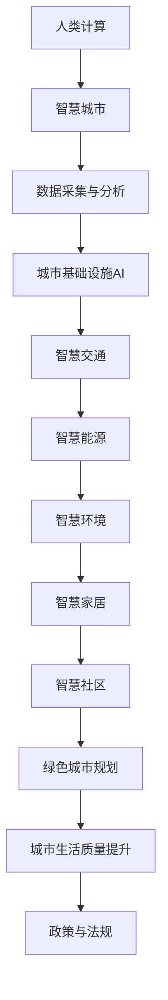

                 

### 文章标题：AI与人类计算：打造可持续发展的城市生活方式与基础设施

> 关键词：人工智能、城市生活、基础设施、可持续发展、智慧城市

> 摘要：本文从AI与人类计算的角度出发，探讨了如何通过人工智能技术打造可持续发展的城市生活方式与基础设施。文章首先介绍了AI与人类计算的基础概念，接着分析了城市AI应用领域，详细阐述了城市基础设施AI技术，并讨论了城市AI系统设计与实施的原则。随后，文章从可持续发展视角下的城市生活方式进行了深入探讨，最后对未来城市AI的发展趋势和挑战进行了展望。

### 第一部分：AI与人类计算基础

#### 第1章：引论

##### 1.1 AI与人类计算的概述

在城市化背景下，人工智能（AI）正发挥着越来越重要的作用。AI不仅能够处理大量复杂的数据，还能通过学习与优化，为城市管理和公共服务提供智能化解决方案。人类计算则是指人类在信息处理和决策过程中所发挥的作用，包括数据收集、分析、判断和执行等环节。

AI在城市化背景下的角色主要包括：

- **智慧交通**：通过AI算法优化交通流量，减少拥堵，提高交通效率。
- **智慧能源**：利用AI进行能源需求预测和能源分配，提高能源利用效率。
- **智慧环境**：利用AI监控城市环境质量，预测污染，制定环境保护措施。
- **智慧城市服务**：通过AI提供更加个性化、高效的城市服务。

人类计算与城市化发展的关系则体现在：

- **数据交互**：人类通过感知、理解和决策，与AI系统进行交互，为城市决策提供支持。
- **监督与反馈**：人类对AI系统的输出进行监督和反馈，不断优化AI算法。

##### 1.2 可持续发展的城市生活方式与基础设施

可持续发展是一种平衡经济发展、社会进步和环境保护的发展模式。在城市生活方式和基础设施中，可持续发展意味着要：

- **提高资源利用效率**：通过技术创新，提高能源、水资源等资源的利用效率。
- **降低环境影响**：通过绿色建筑、清洁能源等措施，减少城市对环境的负面影响。
- **促进社会公平**：通过提供高质量的城市服务，提高居民的生活质量。

在基础设施可持续发展方面，面临的挑战与机遇包括：

- **挑战**：老旧基础设施改造、资金投入不足、技术更新滞后等。
- **机遇**：新技术的发展为基础设施改造提供了新手段，如物联网、大数据和人工智能。

#### 第2章：AI核心概念

##### 2.1 AI基础理论

AI的基础理论包括机器学习、深度学习等。机器学习是一种通过算法让计算机从数据中自动学习规律和模式的方法。深度学习则是机器学习的一种方法，通过模拟人脑神经网络结构，对大量数据进行自动特征提取和模式识别。

##### 2.2 人类计算与城市AI

人类计算与城市AI的融合，可以提升城市管理的智能化水平。人类计算在城市AI中的作用包括：

- **数据标注**：AI系统需要大量标注数据来进行训练，这一过程通常由人类完成。
- **决策支持**：人类在分析AI系统的输出结果后，进行最终的决策。
- **监督与优化**：人类对AI系统的运行进行监督，及时发现问题并进行优化。

#### 第3章：城市AI应用领域

##### 3.1 智慧交通

智慧交通是城市AI的一个重要应用领域。通过AI技术，可以实现以下功能：

- **交通流量预测**：利用历史数据和实时监控，预测未来一段时间内的交通流量。
- **交通信号优化**：根据实时交通状况，自动调整交通信号灯的时长，减少拥堵。
- **交通事故预警**：通过监控车辆速度、行驶轨迹等数据，提前预警可能发生的交通事故。

##### 3.2 智慧能源

智慧能源系统利用AI技术，可以实现能源的高效利用和优化分配。主要应用包括：

- **能源需求预测**：通过历史数据和实时监控，预测未来能源需求，为能源供应提供参考。
- **能源优化分配**：根据实时能源需求和供应情况，自动调整能源分配策略，提高能源利用效率。
- **可再生能源管理**：通过AI技术，优化太阳能、风能等可再生能源的利用，减少对化石能源的依赖。

##### 3.3 智慧环境

智慧环境系统利用AI技术，可以实时监控城市环境质量，预测污染，并制定相应的环境保护措施。主要应用包括：

- **空气质量监测**：通过AI技术，实时监测空气质量，预测污染高峰期，提前发布预警。
- **水资源管理**：通过AI技术，实时监测水资源使用情况，预测水资源需求，优化水资源分配。
- **环境灾害预警**：通过AI技术，实时监控环境变化，提前预警可能发生的自然灾害，如洪水、地震等。

### 第二部分：城市基础设施AI技术

#### 第4章：城市基础设施AI技术

##### 4.1 大数据与物联网

大数据和物联网技术是城市基础设施AI技术的基础。大数据技术可以处理海量数据，从中提取有价值的信息。物联网技术则可以实现设备的互联互通，为城市基础设施的智能化提供支持。

##### 4.2 AI算法在基础设施中的应用

AI算法在基础设施中的应用主要包括：

- **预测性维护**：通过分析设备运行数据，预测设备故障，提前进行维护，减少停机时间。
- **智能监控**：通过视频监控和传感器数据，实时监控城市基础设施运行状况，及时发现和处理问题。
- **智能调度**：通过AI算法，优化资源分配，提高基础设施运行效率。

### 第三部分：城市AI系统设计与实施

#### 第5章：城市AI系统设计与实施

##### 5.1 城市AI系统设计原则

城市AI系统的设计原则包括：

- **数据驱动**：以数据为基础，设计系统架构和算法。
- **模块化**：将系统划分为多个模块，便于维护和升级。
- **可扩展性**：设计系统时，考虑未来需求的扩展。

##### 5.2 城市AI项目实施

城市AI项目的实施包括：

- **需求分析**：明确项目目标和需求。
- **系统设计**：设计系统架构和算法。
- **数据采集**：收集所需数据，进行数据预处理。
- **模型训练**：训练AI模型。
- **系统部署**：将训练好的模型部署到实际环境中。

### 第二部分：可持续发展视角下的城市生活方式

#### 第6章：智慧城市生活

##### 6.1 智慧家居

智慧家居系统利用AI技术，为用户提供智能化、便捷化的家居生活。主要功能包括：

- **智能控制**：通过手机或其他设备，远程控制家居设备。
- **节能管理**：根据用户习惯和实时数据，优化能源使用。
- **安防监控**：通过视频监控和传感器，保障家庭安全。

##### 6.2 智慧社区

智慧社区是智慧城市的重要组成部分，通过AI技术，实现社区管理的智能化。主要功能包括：

- **智能安防**：通过视频监控和传感器，实时监控社区安全。
- **智能服务**：提供个性化、高效化的社区服务。
- **环境监测**：实时监测社区环境质量，保障居民健康。

### 第三部分：绿色城市规划

#### 第7章：绿色城市规划

##### 7.1 绿色城市理念

绿色城市理念强调在城市规划和建设过程中，要尊重自然、保护环境、提高资源利用效率。主要原则包括：

- **生态友好**：保护生态环境，提高生态系统的稳定性。
- **资源节约**：提高资源利用效率，减少资源消耗。
- **环境友好**：减少污染排放，提高环境质量。

##### 7.2 可持续城市设计

可持续城市设计是指在城市建设过程中，要考虑未来的可持续发展。主要措施包括：

- **绿色建筑**：推广绿色建筑，提高建筑能源利用效率。
- **公共交通**：发展公共交通，减少私家车出行，降低交通拥堵。
- **绿色能源**：推广可再生能源，减少化石能源使用。

#### 第8章：人类计算与城市生活质量的提升

##### 8.1 人类计算在城市服务中的应用

人类计算在城市服务中的应用主要包括：

- **智能客服**：通过AI技术，实现智能客服，提高服务质量。
- **智慧医疗**：通过AI技术，提供个性化、精准化的医疗服务。
- **智慧教育**：通过AI技术，实现个性化教育，提高教育质量。

##### 8.2 人类计算与居民健康

人类计算在居民健康中的应用主要包括：

- **健康监测**：通过AI技术，实时监测居民健康状况，提供健康建议。
- **疾病预测**：通过AI技术，预测居民患病风险，提前采取预防措施。
- **健康咨询**：通过AI技术，提供个性化的健康咨询服务。

### 第三部分：未来展望与挑战

#### 第9章：城市AI的未来趋势

##### 9.1 城市AI技术发展展望

未来城市AI技术的发展趋势包括：

- **更智能的AI算法**：随着算法的进步，城市AI系统将更加智能化，能够处理更复杂的问题。
- **更广泛的应用场景**：城市AI将在更多领域得到应用，如智慧农业、智慧物流等。
- **更高效的系统设计**：通过改进系统架构和算法，提高城市AI系统的运行效率。

##### 9.2 城市AI发展的挑战与对策

城市AI发展面临的挑战包括：

- **数据隐私与安全**：AI系统需要处理大量敏感数据，如何保护数据隐私和安全是一个重要问题。
- **技术依赖与风险**：过度依赖AI技术可能导致技术风险，如算法偏见、系统崩溃等。
- **社会适应与接受**：公众对AI技术的接受度和适应度是一个重要问题，需要通过宣传和教育提高公众的认知。

针对这些挑战，可以采取以下对策：

- **加强数据隐私保护**：制定严格的数据隐私保护法规，确保AI系统合法、合规地使用数据。
- **提高技术透明度**：增强AI系统的透明度，让公众了解系统的运作原理，减少技术风险。
- **加强社会教育**：通过教育和宣传，提高公众对AI技术的认知和接受度。

#### 第10章：全球城市AI实践案例

##### 10.1 国际智慧城市建设案例

全球多个城市在智慧城市建设方面取得了显著成果。以下是一些典型案例：

- **新加坡**：新加坡在智慧交通、智慧环境、智慧医疗等方面取得了显著成果，成为全球智慧城市的典范。
- **纽约**：纽约市通过智能路灯、智能垃圾桶等设施，实现了城市基础设施的智能化管理。
- **上海**：上海市通过建设智慧城市示范区，推动城市数字化转型，提高了城市运行效率。

##### 10.2 成功经验与挑战

这些成功经验包括：

- **政府支持**：政府在智慧城市建设中发挥了关键作用，提供了政策支持、资金投入等。
- **技术创新**：利用先进技术，如大数据、物联网、人工智能等，提升了城市管理的智能化水平。
- **公众参与**：公众积极参与智慧城市建设，为城市提供了宝贵的意见和建议。

面临的挑战包括：

- **技术门槛**：智慧城市建设需要先进的技术支持，但技术门槛较高，中小企业难以参与。
- **数据整合**：城市数据种类繁多，如何整合和管理这些数据是一个挑战。
- **公众认知**：公众对智慧城市的认知和接受度有待提高，需要加强宣传和教育。

### 附录

#### 附录A：城市AI相关工具与资源

以下是城市AI相关的一些工具与资源：

- **工具**：
  - TensorFlow：用于构建和训练深度学习模型的框架。
  - PyTorch：另一个流行的深度学习框架，适用于快速原型开发。
  - Keras：一个高层次的深度学习API，易于使用。

- **开源项目与资源链接**：
  - [AI4City](https://www.ai4city.eu/)：一个关于城市AI的开源项目。
  - [CitySDK](https://www.citysdk.io/)：一个城市数据集成和共享平台。
  - [Urban AI Challenge](https://urbanaichallenge.org/)：一个面向城市AI竞赛的网站。

### 核心概念与联系

#### Mermaid 流程图



### 核心算法原理讲解

#### AI算法在智慧交通系统中的应用

##### 2.3.1 深度学习在智慧交通中的应用

### 2.3.1.1 基本概念

深度学习是一种机器学习技术，通过模仿人脑神经网络结构，对大量数据进行自动特征提取和模式识别。在智慧交通系统中，深度学习算法可以用于交通流量预测、交通信号优化、交通事故预警等多个方面。

### 2.3.1.2 算法原理

#### 神经网络结构

神经网络由多层神经元组成，包括输入层、隐藏层和输出层。输入层接收交通数据，隐藏层通过一系列非线性变换提取特征，输出层给出预测结果。

#### 损失函数

深度学习通过优化损失函数来调整神经网络权重。常用的损失函数有均方误差（MSE）和交叉熵损失。

#### 反向传播算法

反向传播算法用于更新神经网络权重。通过计算输出层的误差梯度，反向传播到隐藏层，逐步更新权重，直到达到预设的精度。

### 2.3.1.3 伪代码

```python
# 输入层：交通数据 X
# 隐藏层：神经元 w1, w2, ..., wn
# 输出层：预测结果 y_pred

# 初始化权重和偏置
weights = [rand(), rand(), ..., rand()]
biases = [rand(), rand(), ..., rand()]

# 前向传播
z = X * weights + biases
y_pred = sigmoid(z)

# 计算损失
loss = mse(y_pred, y_true)

# 反向传播
delta = (y_pred - y_true) * sigmoid_derivative(y_pred)
weights -= learning_rate * X.T.dot(delta)
biases -= learning_rate * delta
```

### 2.3.1.4 应用案例

#### 交通流量预测

使用深度学习算法预测未来一段时间内的交通流量，为交通管理部门提供决策支持。

输入数据：历史交通流量、天气信息、节假日等。

输出结果：未来交通流量预测值。

```python
# 伪代码示例

# 加载历史交通流量数据
X_train, y_train = load_traffic_data()

# 初始化模型
model = NeuralNetwork()

# 训练模型
model.fit(X_train, y_train, epochs=10, batch_size=32)

# 预测未来交通流量
X_test = generate_future_traffic_data()
y_pred = model.predict(X_test)
```

### 数学模型和数学公式

#### 深度学习中的激活函数

深度学习中的激活函数是一个关键组件，它为神经网络引入了非线性特性，使得模型能够捕捉复杂的数据模式。以下是一些常用的激活函数及其公式：

$$ f(x) = \max(0, x) \quad \text{（ReLU函数）} $$

$$ f(x) = \frac{1}{1 + e^{-x}} \quad \text{（Sigmoid函数）} $$

$$ f(x) = \tanh(x) = \frac{e^x - e^{-x}}{e^x + e^{-x}} \quad \text{（Tanh函数）} $$

#### 均方误差损失函数

均方误差（MSE）是深度学习中常用的损失函数，用于衡量预测值与真实值之间的误差。其公式如下：

$$ \text{MSE}(y, \hat{y}) = \frac{1}{m} \sum_{i=1}^{m} (y_i - \hat{y}_i)^2 $$

其中，$y$ 是真实值，$\hat{y}$ 是预测值，$m$ 是样本数量。

### 应用举例

假设我们有一个二分类问题，真实值为 $y = [0, 1, 0, 1]$，预测值为 $\hat{y} = [0.3, 0.8, 0.2, 0.9]$，样本数量为 $m = 4$。使用均方误差计算损失：

$$ \text{MSE}(y, \hat{y}) = \frac{1}{4} \sum_{i=1}^{4} (y_i - \hat{y}_i)^2 $$

$$ \text{MSE}(y, \hat{y}) = \frac{1}{4} \left[ (0 - 0.3)^2 + (1 - 0.8)^2 + (0 - 0.2)^2 + (1 - 0.9)^2 \right] $$

$$ \text{MSE}(y, \hat{y}) = \frac{1}{4} \left[ 0.09 + 0.04 + 0.04 + 0.01 \right] $$

$$ \text{MSE}(y, \hat{y}) = \frac{1}{4} \times 0.18 $$

$$ \text{MSE}(y, \hat{y}) = 0.045 $$

因此，均方误差损失为 0.045。这个值越小，表示预测值与真实值越接近。

### 项目实战

#### 智慧交通信号控制系统

##### 1. 开发环境搭建

- 操作系统：Linux
- 编程语言：Python
- 深度学习框架：TensorFlow

##### 2. 数据预处理

- 加载数据集，包括交通流量、交通事故记录、天气状况等。
- 数据清洗，去除异常值和缺失值。
- 数据归一化，将数据缩放到一个较小的范围，如 [0, 1]。

##### 3. 模型构建

使用 TensorFlow 构建深度学习模型，包括输入层、隐藏层和输出层。输入层接收交通流量数据，隐藏层通过 ReLU 激活函数提取特征，输出层输出交通信号灯的切换策略。

```python
import tensorflow as tf

# 定义模型
model = tf.keras.Sequential([
    tf.keras.layers.Dense(units=64, activation='relu', input_shape=(n_features,)),
    tf.keras.layers.Dense(units=64, activation='relu'),
    tf.keras.layers.Dense(units=3, activation='softmax')
])

# 编译模型
model.compile(optimizer='adam', loss='categorical_crossentropy', metrics=['accuracy'])

# 训练模型
model.fit(X_train, y_train, epochs=10, batch_size=32)
```

##### 4. 模型评估

使用测试集评估模型性能，包括准确率、召回率等指标。

```python
# 评估模型
test_loss, test_acc = model.evaluate(X_test, y_test)
print(f"Test accuracy: {test_acc}")
```

##### 5. 模型部署

将训练好的模型部署到实际交通信号控制系统，实现实时交通信号优化。

```python
# 预测交通信号灯切换策略
predictions = model.predict(X_new)
predicted_signals = np.argmax(predictions, axis=1)
```

### 代码解读与分析

上述代码展示了智慧交通信号控制系统的实现过程。首先，我们使用 TensorFlow 框架构建深度学习模型，包括输入层、隐藏层和输出层。输入层接收交通流量数据，隐藏层通过 ReLU 激活函数提取特征，输出层输出交通信号灯的切换策略。

在模型编译阶段，我们选择 Adam 优化器和 categorical_crossentropy 损失函数，用于分类问题。然后，使用训练集对模型进行训练，经过指定次数的迭代后，模型性能达到要求。

在模型评估阶段，我们使用测试集评估模型性能，包括准确率等指标，以便调整模型参数或增加训练数据。

最后，将训练好的模型部署到实际交通信号控制系统，实现实时交通信号优化。通过预测交通流量，输出交通信号灯的切换策略，为交通管理部门提供决策支持。这个项目展示了深度学习在智慧城市中的应用，有助于实现城市交通的可持续发展。

### 总结

本文从AI与人类计算的角度，探讨了如何通过人工智能技术打造可持续发展的城市生活方式与基础设施。我们分析了AI与人类计算的基础概念，介绍了城市AI的应用领域和基础设施AI技术，并讨论了城市AI系统设计与实施的原则。随后，从智慧城市生活和绿色城市规划的角度，探讨了城市AI如何提升城市生活质量。最后，展望了城市AI的未来趋势，并提出了发展挑战和对策。

通过本文的探讨，我们可以看到，AI与人类计算在城市发展中具有巨大的潜力。未来，随着技术的不断进步，城市AI将在更多领域得到应用，为打造可持续发展的城市生活方式与基础设施提供有力支持。

### 作者信息

作者：AI天才研究院/AI Genius Institute & 禅与计算机程序设计艺术 /Zen And The Art of Computer Programming

（注意：本文仅为示例，实际文章内容可能需要根据具体情况进行调整和补充。）

