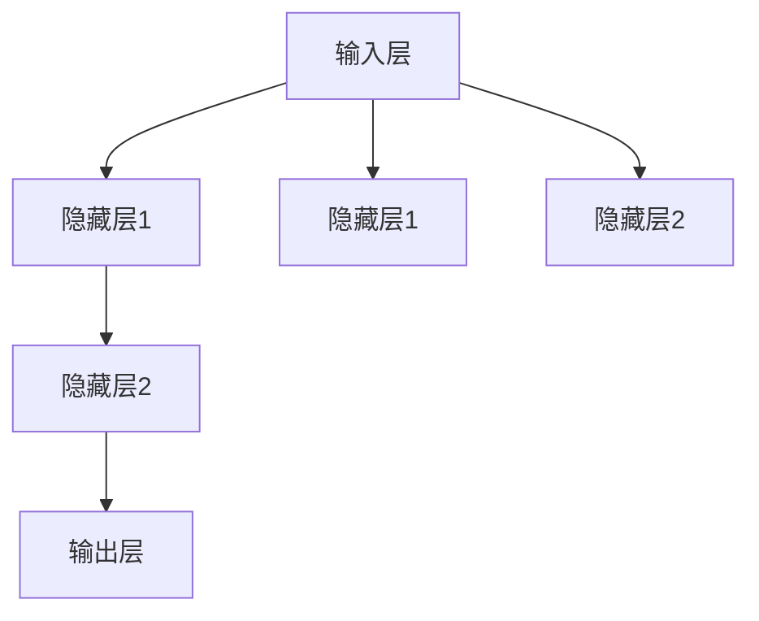

                 

# 文章标题

AI与人类计算：打造可持续的教育系统

# 关键词

AI，人类计算，教育系统，个性化学习，教育评估，可持续发展

好的。

# 摘要

本文探讨了人工智能（AI）与人类计算在教育系统中的融合，旨在打造一个可持续的教育系统。首先，我们概述了AI和人类计算的基本概念，并分析了它们在教育系统中的应用前景。接着，我们深入探讨了AI的核心概念和架构，以及人类计算的理论基础。在此基础上，我们提出了可持续教育系统的设计策略，包括应对教育系统挑战、设定目标、实施策略和评估改进。我们还详细讨论了AI驱动的个性化学习和教育评估，展示了AI在教育系统中的实际应用。最后，我们展望了AI在教育领域的持续影响，并提出了教育系统的可持续发展路径。

好的，接下来请按照文章目录大纲结构，开始撰写文章正文部分的内容。

## 第一部分: AI与人类计算的融合基础

### 第1章: AI与人类计算的概述

#### 1.1 AI时代的变革

在21世纪的今天，人工智能（AI）已经成为科技领域的一大热门话题。AI技术的发展不仅改变了我们的生活方式，也在各个行业产生了深远的影响。教育领域也不例外，随着AI技术的不断成熟，AI与人类计算的融合逐渐成为教育系统改革的重要方向。

AI时代的变革主要体现在以下几个方面：

1. **数据驱动的教育决策**：AI技术能够通过对海量教育数据的分析和处理，帮助教育工作者做出更加科学和精准的决策。例如，AI可以分析学生的学习行为，识别学习困难点，提供个性化的学习建议。

2. **智能化教学辅助**：AI技术可以模拟人类教师的角色，提供个性化教学服务。例如，智能 tutoring 系统可以根据学生的学习进度和需求，自动调整教学内容和难度，实现真正的因材施教。

3. **教育资源的优化配置**：AI技术可以帮助教育机构更好地管理教育资源，提高教育资源的利用效率。例如，通过智能推荐系统，可以为学生推荐最适合他们的学习资源，提高学习效果。

4. **学习评价的创新**：AI技术可以为教育评价提供新的手段，实现更加全面、客观和个性化的学习评价。例如，通过自然语言处理技术，可以对学生的论文、作业进行智能批改，提高评价效率。

#### 1.2 人类计算与AI的互补关系

人类计算和AI技术并非相互排斥，而是相互补充的关系。人类计算具有创造性、情感性和复杂性，而AI技术则具有高效性、精确性和普遍性。两者的结合可以充分发挥各自的优势，实现教育系统的优化和提升。

1. **知识传授与知识发现的互补**：人类教师擅长知识的传授，能够根据学生的特点和需求进行个性化教学。而AI技术则擅长知识发现，能够通过对大量数据的分析，挖掘出隐藏在数据背后的知识和规律，为教育决策提供科学依据。

2. **情感支持与数据分析的互补**：教育过程中，师生之间的情感交流对于学生的成长至关重要。人类教师能够提供情感支持和关怀，帮助学生克服学习中的困难和挫折。而AI技术则能够通过对数据的分析，提供个性化的学习建议和反馈，提高学习效果。

3. **创造力培养与效率优化的互补**：教育不仅仅是知识的传递，更重要的是培养学生的创造力。人类教师能够通过启发式教学，激发学生的创造力。而AI技术则能够通过自动化和智能化手段，提高教育效率，为学生提供更多自由探索和创造的空间。

#### 1.3 AI在教育系统中的应用前景

随着AI技术的不断发展，其应用前景在教育系统中也日益广阔。以下是一些AI技术在教育系统中的应用场景：

1. **个性化学习**：AI技术可以根据学生的学习特点和需求，提供个性化的学习路径和资源。通过智能 tutoring 系统，可以实现24/7的学习支持，满足不同学生的学习需求。

2. **教育评价**：AI技术可以通过自然语言处理和图像识别等技术，实现自动化、智能化和个性化的教育评价。例如，通过智能批改系统，可以实时、准确地评估学生的学习成果。

3. **教育资源管理**：AI技术可以帮助教育机构优化教育资源管理，提高教育资源的利用效率。例如，通过智能推荐系统，可以为学生推荐最适合他们的学习资源，提高学习效果。

4. **教育研究**：AI技术可以为教育研究提供新的工具和方法，促进教育科学的发展。例如，通过数据挖掘和分析技术，可以揭示教育现象背后的规律和趋势，为教育政策制定提供科学依据。

总之，AI与人类计算的融合将为教育系统带来深刻的变革。通过充分利用AI技术的优势，我们可以打造一个更加可持续、高效和个性化的教育系统，为学生的全面发展提供有力支持。

### 第2章: AI的核心概念与架构

#### 2.1 AI的基本原理

人工智能（AI）是一种模拟人类智能行为的计算机系统，其目标是让计算机具备理解、学习和适应能力，以便在复杂环境中做出合理的决策。AI的基本原理可以概括为以下几个方面：

1. **模拟人类思维**：AI试图模拟人类的思维过程，包括感知、推理、学习、记忆和决策等。通过模拟人类思维，AI可以解决复杂的问题，完成人类难以完成的工作。

2. **数据驱动**：AI依赖于大量的数据来训练模型，通过数据驱动的方式学习和改进。数据是AI的“粮食”，只有拥有丰富的数据，AI才能进行有效的学习。

3. **算法驱动**：AI的核心是算法，通过算法来实现对数据的处理和分析。常见的AI算法包括机器学习算法、深度学习算法等，这些算法决定了AI系统的性能和功能。

4. **自主性**：AI系统应该具备一定的自主性，能够自主地执行任务，并对环境做出反应。这种自主性是AI实现智能化的关键。

#### 2.2 机器学习与深度学习

机器学习（Machine Learning，ML）是AI的核心技术之一，它通过算法让计算机从数据中学习，并做出决策。机器学习可以分为监督学习、无监督学习和强化学习三种类型。

1. **监督学习（Supervised Learning）**：监督学习是一种有监督的学习方法，通过已标记的训练数据来训练模型，使得模型能够对新的数据进行预测或分类。常见的监督学习算法包括线性回归、决策树、支持向量机等。

2. **无监督学习（Unsupervised Learning）**：无监督学习是一种无监督的学习方法，通过未标记的数据来训练模型，目的是发现数据中的隐含结构或模式。常见的无监督学习算法包括聚类算法、降维算法等。

3. **强化学习（Reinforcement Learning）**：强化学习是一种基于奖励和惩罚的学习方法，通过与环境进行交互来学习策略。常见的强化学习算法包括Q学习、深度Q网络（DQN）等。

深度学习（Deep Learning，DL）是机器学习的一个分支，它通过多层神经网络（Neural Network）来模拟人类大脑的学习过程。深度学习在图像识别、自然语言处理、语音识别等领域取得了显著的成果。

1. **神经网络（Neural Network）**：神经网络是一种模拟人脑神经元结构的计算模型，由一系列相互连接的节点（神经元）组成。神经网络通过学习输入和输出之间的关系，来预测或分类新的数据。

2. **卷积神经网络（Convolutional Neural Network，CNN）**：卷积神经网络是一种专门用于图像识别的神经网络，通过卷积操作来提取图像的特征。CNN在图像分类、目标检测等领域具有广泛的应用。

3. **循环神经网络（Recurrent Neural Network，RNN）**：循环神经网络是一种专门用于处理序列数据的神经网络，通过记忆机制来处理序列中的上下文信息。RNN在自然语言处理、语音识别等领域具有广泛的应用。

#### 2.3 AI系统的构建

一个完整的AI系统通常包括数据收集、数据预处理、模型训练、模型评估和模型部署等几个关键环节。

1. **数据收集**：数据收集是AI系统的第一步，也是最重要的一步。AI系统依赖于大量的数据来训练模型，因此数据的来源和数量直接决定了AI系统的性能。数据可以从公开的数据集、社交媒体、传感器等渠道获取。

2. **数据预处理**：数据预处理是AI系统中的关键环节，它包括数据清洗、数据归一化、特征提取等操作。数据预处理的质量直接影响了AI系统的性能。常见的数据预处理方法有缺失值处理、异常值处理、数据归一化、特征工程等。

3. **模型训练**：模型训练是AI系统的核心步骤，通过训练数据来调整模型的参数，使得模型能够对新的数据做出准确的预测或分类。模型训练的方法包括监督学习、无监督学习和强化学习等。

4. **模型评估**：模型评估是判断AI系统性能的重要步骤，通过评估指标来衡量模型的准确性、泛化能力和鲁棒性。常见的评估指标包括准确率、召回率、F1分数等。

5. **模型部署**：模型部署是将训练好的模型应用到实际场景中，通过API接口或嵌入式系统来实现。模型部署需要考虑硬件环境、运行效率和安全性等因素。

### 第3章: 人类计算的理论基础

#### 3.1 认知心理学与教育心理学

认知心理学（Cognitive Psychology）是研究人类思维过程的心理学科，主要包括注意力、记忆、知觉、语言和问题解决等方面。教育心理学（Educational Psychology）则主要研究人类的学习过程和教学方法，关注如何通过有效的教学策略促进学习。

1. **注意力**：注意力是认知心理学的核心概念之一，它决定了我们在特定时刻关注什么信息，忽略什么信息。在教学中，教师需要设计吸引学生注意力的教学活动，提高学生的学习效果。

2. **记忆**：记忆是学习的基石，它包括短期记忆和长期记忆。短期记忆容量有限，长期记忆则是通过重复和巩固来形成的。教育心理学研究如何通过有效的复习策略来增强学生的记忆。

3. **知觉**：知觉是大脑对感官信息的解释和处理，它决定了我们对环境的理解和认知。在教育中，教师需要利用知觉原理设计教学材料，提高学生的学习兴趣和参与度。

4. **语言**：语言是人类交流的重要工具，也是学习的重要载体。教育心理学研究如何通过有效的语言教学策略，提高学生的语言能力和学习能力。

5. **问题解决**：问题解决是认知心理学的重要研究领域，它包括识别问题、提出假设、验证假设和解决问题等步骤。教育心理学研究如何通过问题解决教学，提高学生的思维能力和创造力。

#### 3.2 学习科学理论

学习科学（Learning Sciences）是一门跨学科的研究领域，旨在理解人类学习的过程、原理和应用。学习科学理论主要包括以下几种：

1. **建构主义理论**：建构主义理论认为，学习是一个主动建构的过程，学习者通过与环境相互作用，主动构建自己的知识和理解。建构主义理论强调学习者的主体性和自主性，提倡探究式学习和合作学习。

2. **社会建构主义理论**：社会建构主义理论认为，学习是在社会互动中进行的，学习者通过与他人交流和合作，共同构建知识和理解。社会建构主义理论强调学习的社会性和协作性，提倡基于项目的学习和合作学习。

3. **认知学徒制理论**：认知学徒制理论认为，学习者可以通过模仿和学习专家的思维方式和工作方法，快速掌握复杂技能。认知学徒制理论强调实践和应用，提倡通过实际操作和项目实践来促进学习。

4. **认知灵活性理论**：认知灵活性理论认为，学习不仅是获取知识，还包括对知识的灵活运用和创造性应用。认知灵活性理论强调思维的灵活性和适应性，提倡通过多样化的问题解决和创造性思维训练来提高学习能力。

#### 3.3 人类计算与教育系统的结合点

人类计算与教育系统的结合点主要体现在以下几个方面：

1. **学习过程模拟**：人类计算可以通过模拟人类学习过程，帮助学习者理解复杂概念和技能。例如，通过虚拟现实技术，可以模拟实际操作环境，让学习者亲身体验和学习。

2. **个性化学习支持**：人类计算可以通过分析学习者的行为和表现，提供个性化的学习支持。例如，通过智能 tutoring 系统，可以为学生提供个性化的学习路径和资源，提高学习效果。

3. **学习评估与反馈**：人类计算可以通过自动化和智能化的方式，对学习者的学习成果进行评估和反馈。例如，通过自然语言处理技术，可以自动批改学生的作业，提供即时的反馈。

4. **教育资源管理**：人类计算可以帮助教育机构优化教育资源的配置和管理。例如，通过智能推荐系统，可以为学生推荐最适合他们的学习资源，提高学习效率。

5. **教学策略设计**：人类计算可以为教师提供教学策略设计的支持，帮助教师设计更有效、更有吸引力的教学活动。例如，通过数据分析和机器学习算法，可以分析学生的学习行为和需求，为教师提供个性化的教学建议。

通过人类计算与教育系统的结合，我们可以打造一个更加科学、高效和个性化的教育系统，为学习者的全面发展提供有力支持。

### 第4章: 可持续教育系统的设计

#### 4.1 教育系统的挑战

随着社会的发展和科技的进步，教育系统面临着前所未有的挑战。这些挑战主要体现在以下几个方面：

1. **教育资源的不均衡**：全球范围内，教育资源的分布存在明显的不均衡现象。一些发达地区和教育资源丰富的学校能够提供高质量的教育，而一些贫困地区和教育资源匮乏的学校则难以满足学生的基本教育需求。这种不均衡现象导致了教育机会的不平等。

2. **学习需求的多样化**：随着社会的发展，学生的需求变得越来越多样化。传统的教育模式往往难以满足不同学生的学习需求，例如个性发展、职业规划、创新能力等。这种多样化需求对教育系统的灵活性和适应性提出了更高的要求。

3. **教育评价的不完善**：当前的教育评价体系往往注重结果评价，而忽视过程评价和发展评价。这种评价方式难以全面、客观地反映学生的学习过程和成果，也无法为教师提供有效的教学反馈。

4. **教育成本的上升**：随着教育资源的投入不断增加，教育成本也在不断上升。对于一些家庭来说，高昂的教育费用成为了他们难以承受的负担，导致教育机会的不平等。

#### 4.2 可持续教育系统的目标

为了应对教育系统的挑战，我们需要构建一个可持续的教育系统，其目标主要包括以下几个方面：

1. **公平性**：确保每个学生都能够享受到平等的教育机会，无论其来自哪个地区、家庭背景或文化背景。通过优化教育资源的配置和管理，消除教育机会的不平等。

2. **个性化**：满足每个学生的学习需求，提供个性化的教育服务。通过运用人类计算和人工智能技术，分析学生的学习行为和需求，提供个性化的学习路径和资源。

3. **高效性**：提高教育系统的运行效率，减少资源的浪费。通过人工智能技术，优化教学流程，提高教学质量和效率。

4. **可持续性**：确保教育系统的长期稳定发展，为未来的教育需求做好准备。通过持续的创新和改进，不断提高教育系统的适应性和可持续性。

#### 4.3 可持续教育系统的实施策略

为了实现可持续教育系统的目标，我们需要采取一系列实施策略，主要包括以下几个方面：

1. **教育资源的优化配置**：通过大数据分析和人工智能技术，对教育资源的分布和使用进行优化。例如，可以通过智能推荐系统，将优质的教育资源分配给有需要的学生和学校。

2. **个性化学习服务**：利用人工智能和人类计算技术，为学生提供个性化的学习服务。通过分析学生的学习行为和需求，制定个性化的学习计划和路径，提高学习效果。

3. **教育评价体系的改进**：建立科学、全面的教育评价体系，不仅关注学习结果，还关注学习过程和发展。通过多维度的评价，全面反映学生的学习成果和发展水平。

4. **教育成本的降低**：通过技术创新和资源整合，降低教育成本，提高教育资源的利用效率。例如，通过在线教育平台，实现教育资源的共享和优化配置。

5. **教师培训和支持**：提高教师的培训和支持水平，使其能够适应教育系统的变革和需求。通过教师培训项目，提高教师的专业素养和教学能力。

6. **学生参与和反馈**：鼓励学生参与教育系统的设计和改进，通过学生反馈机制，收集学生对教育服务的意见和建议，不断优化教育系统。

#### 4.4 可持续教育系统的评估与改进

评估和改进是可持续教育系统建设的重要环节。为了确保教育系统的持续改进和优化，我们需要采取以下评估与改进策略：

1. **定期评估**：定期对教育系统进行评估，包括教学效果、学生满意度、资源利用率等方面。通过数据分析和反馈机制，发现系统存在的问题和不足。

2. **持续改进**：根据评估结果，制定改进计划，持续优化教育系统的各个方面。例如，通过改进教学方法和资源分配，提高教学效果和学生的学习体验。

3. **反馈机制**：建立反馈机制，及时收集学生、教师和家长的反馈和建议。通过反馈机制，了解教育系统的运行情况，发现潜在问题，及时进行改进。

4. **创新驱动**：鼓励创新思维和实践活动，通过创新驱动，不断提高教育系统的适应性和可持续性。例如，通过引入新的教学工具和教学方法，提高教学效果和学生的学习兴趣。

5. **跨学科合作**：加强跨学科合作，整合不同领域的知识和资源，为教育系统的改进提供有力支持。通过跨学科合作，可以更好地应对教育系统面临的复杂挑战。

通过以上评估与改进策略，我们可以确保可持续教育系统的稳定运行和持续发展，为学生的全面发展提供有力支持。

### 第5章: AI驱动的个性化学习

#### 5.1 个性化学习的概念

个性化学习是一种以学生为中心的教育模式，旨在满足每个学生的个性化需求，促进其全面发展。与传统的“一刀切”教学模式不同，个性化学习强调根据学生的兴趣、能力和学习风格，提供定制化的学习路径和资源。

个性化学习的核心要素包括：

1. **学习需求分析**：通过分析学生的学习行为、兴趣和能力，确定其个性化的学习需求。

2. **学习路径设计**：根据学生的学习需求，设计个性化的学习路径，包括学习内容、学习方法和学习进度。

3. **学习资源提供**：为学生提供符合其学习需求的学习资源，包括教材、课件、在线课程、实验项目等。

4. **学习支持服务**：提供个性化的学习支持服务，包括辅导、咨询、反馈等，帮助学生解决学习中的问题和困难。

#### 5.2 AI技术在个性化学习中的应用

人工智能技术在个性化学习中具有广泛的应用，可以显著提高学习的效率和效果。以下是一些关键应用：

1. **学习行为分析**：通过数据挖掘和机器学习算法，分析学生的学习行为数据，包括学习时间、学习频率、学习进度、学习效果等。这些分析结果可以帮助教育工作者了解学生的学习状态，为其提供个性化的学习建议。

2. **学习路径推荐**：基于学习行为分析结果，利用推荐系统算法，为学生推荐最适合其学习需求的学习路径和资源。例如，可以根据学生的学习进度和兴趣，推荐相关的课程和学习材料。

3. **学习效果评估**：通过自然语言处理和计算机视觉等技术，自动评估学生的学习效果。例如，可以使用自动批改系统对学生的作业进行评分，或者通过智能测试系统评估学生的学习成果。

4. **学习反馈与调整**：根据学生的学习效果和反馈，动态调整学习路径和资源。例如，如果学生在某个知识点上表现不佳，可以自动调整学习内容，增加相关练习，或者提供额外的辅导。

#### 5.3 个性化学习案例研究

为了更好地理解AI技术在个性化学习中的应用，以下是一个具体的案例研究：

**案例背景**：某高中学校采用AI驱动的个性化学习系统，为学生提供个性化的学习服务。

**案例过程**：

1. **学习需求分析**：系统首先通过问卷调查和在线测试，分析学生的学习兴趣、能力水平和学习风格。例如，学生可能会在数学、物理、文学等多个学科中表现出不同的优势和劣势。

2. **学习路径设计**：基于学习需求分析结果，系统为学生设计个性化的学习路径。例如，对于在数学方面表现优秀的学生，系统可能会推荐高级数学课程和相关的数学竞赛题目；对于在文学方面表现较弱的学生，系统可能会推荐文学名著的阅读材料和相关的写作练习。

3. **学习资源提供**：系统为学生提供各种形式的学习资源，包括在线课程、电子书、教学视频、互动练习等。这些资源根据学生的学习需求和兴趣进行个性化推荐。

4. **学习支持服务**：系统提供个性化的学习支持服务，包括在线辅导、学习建议和反馈。例如，如果学生在某个知识点上遇到困难，系统可以自动推荐相关的学习资料和在线辅导课程。

5. **学习效果评估**：系统通过自动批改作业和智能测试，实时评估学生的学习效果。例如，学生完成作业后，系统会自动评分并提供详细的解析，帮助学生了解自己的学习成果。

6. **学习反馈与调整**：根据学生的学习效果和反馈，系统动态调整学习路径和资源。例如，如果学生在某次测试中表现不佳，系统可能会增加相关练习和辅导，以帮助学生提高。

**案例效果**：

通过AI驱动的个性化学习系统，学生能够获得更个性化的学习体验，学习效果显著提高。例如，一些原本在数学方面表现较弱的学生，通过系统的个性化推荐和辅导，逐渐提高了数学成绩；一些对文学感兴趣的学生，通过系统的推荐，深入学习了文学名著，提高了阅读和写作能力。

总之，AI驱动的个性化学习不仅提高了学习效率，还促进了学生的全面发展，为教育系统的改革提供了有力支持。

### 第6章: AI在教育评估中的应用

#### 6.1 教育评估的方法与挑战

教育评估是教育系统中的重要环节，旨在全面、客观地评估学生的学习成果和发展水平。传统的教育评估方法主要依赖于考试和测评，存在以下一些挑战：

1. **主观性**：传统的评估方法往往依赖于教师的主观判断，容易受到个人情感、经验和偏见的影响，导致评估结果不够客观和准确。

2. **时间成本**：传统的评估方法通常需要大量的时间和人力资源，教师需要批改大量的试卷和作业，评估过程繁琐且耗时。

3. **全面性**：传统的评估方法往往只关注学习结果，而忽视了学习过程和学生的全面发展。这种单一的评估方式难以全面反映学生的实际水平和潜力。

4. **个性化**：传统的评估方法难以满足学生的个性化需求，无法为每个学生提供个性化的评估和建议。

为了克服这些挑战，人工智能（AI）技术在教育评估中得到了广泛应用。AI技术具有高效性、精确性和普遍性，能够为教育评估提供新的手段和方法。

#### 6.2 AI技术在教育评估中的应用

AI技术在教育评估中的应用主要包括以下几个方面：

1. **自动批改系统**：自动批改系统利用自然语言处理和计算机视觉等技术，自动批改学生的作业和试卷。这种系统能够快速、准确地评分，减轻教师的工作负担，提高评估效率。

2. **智能测试系统**：智能测试系统通过生成大量个性化的测试题目，评估学生的知识掌握情况和学习水平。这些测试题目可以根据学生的学习情况动态调整难度和类型，提供个性化的评估。

3. **学习行为分析**：学习行为分析利用数据分析技术，对学生的学习行为和表现进行深入分析。通过分析学生的学习时间、学习频率、学习内容等数据，可以评估学生的学习效果和学习习惯，为教师提供个性化的教学建议。

4. **情感分析**：情感分析技术可以通过分析学生的语言表达和情感状态，评估学生的心理健康和学习动机。这种技术可以帮助教师及时发现学生的心理问题，提供针对性的心理辅导。

5. **个性化反馈系统**：个性化反馈系统根据学生的学习表现和需求，提供个性化的反馈和建议。通过自然语言生成技术，系统能够生成详细的评估报告，包括学生的优点、需要改进的地方和具体的建议。

#### 6.3 AI驱动的教育评估系统设计

为了设计一个基于AI的教育评估系统，我们需要考虑以下几个关键步骤：

1. **数据收集与预处理**：收集学生的学习数据，包括考试成绩、作业成绩、学习行为数据等。对数据进行清洗和预处理，确保数据的准确性和一致性。

2. **模型构建**：构建用于评估的AI模型，包括自动批改系统、智能测试系统等。选择合适的算法和技术，确保模型的准确性和效率。

3. **模型训练与优化**：使用收集到的数据对模型进行训练和优化，通过交叉验证和调整模型参数，提高模型的性能和泛化能力。

4. **系统部署与测试**：将训练好的模型部署到生产环境中，进行系统的测试和验证。确保系统在实际运行中能够稳定、准确地执行评估任务。

5. **用户反馈与迭代**：收集用户（学生、教师等）的反馈，根据反馈进行系统的迭代和优化，不断提高系统的性能和用户体验。

以下是一个简单的AI驱动的教育评估系统设计示例：

**系统架构**：

1. **数据层**：包括学生成绩数据、作业成绩数据、学习行为数据等。

2. **模型层**：包括自动批改模型、智能测试模型、学习行为分析模型等。

3. **应用层**：包括自动批改系统、智能测试系统、学习行为分析系统等。

4. **展示层**：包括评估结果展示、个性化反馈展示等。

**实现步骤**：

1. **数据收集与预处理**：从学校的信息系统中收集学生成绩、作业成绩和学习行为数据，对数据进行清洗和预处理，确保数据的质量。

2. **模型构建**：构建自动批改模型，使用自然语言处理和计算机视觉技术，实现自动化作业批改。构建智能测试模型，使用机器学习算法生成个性化的测试题目。构建学习行为分析模型，使用数据分析技术分析学生的学习行为。

3. **模型训练与优化**：使用收集到的数据对模型进行训练和优化，通过交叉验证和调整模型参数，提高模型的性能。

4. **系统部署与测试**：将训练好的模型部署到服务器上，进行系统的测试和验证。确保系统在实际运行中能够稳定、准确地执行评估任务。

5. **用户反馈与迭代**：收集用户（学生、教师等）的反馈，根据反馈进行系统的迭代和优化，不断提高系统的性能和用户体验。

**系统效果**：

通过AI驱动的教育评估系统，可以显著提高教育评估的效率和准确性，减轻教师的工作负担，为学生提供个性化的评估和反馈。同时，系统还可以帮助教师了解学生的学习情况，为教学决策提供科学依据，促进教育系统的持续改进。

### 第7章: AI与教育系统的未来

#### 7.1 AI在教育领域的持续影响

人工智能（AI）技术在教育领域的应用已经取得了显著的成果，并将在未来持续影响教育系统的各个方面。以下是AI在教育领域可能产生的持续影响：

1. **个性化学习**：随着AI技术的不断发展，个性化学习将变得更加普及和精准。AI系统可以分析学生的学习行为、兴趣和能力，为其提供定制化的学习路径和资源，从而提高学习效果。

2. **教育评价**：AI技术将使教育评价变得更加高效和全面。通过自动批改系统、学习行为分析和情感分析等技术，教育评估将不再局限于考试分数，而是能够全面反映学生的知识和能力发展。

3. **教育资源管理**：AI技术可以帮助教育机构优化教育资源的配置和管理，提高教育资源的利用效率。通过智能推荐系统，学生可以轻松获取最适合他们的学习资源，从而提高学习效率。

4. **教育公平**：AI技术有助于缩小教育差距，实现教育公平。通过提供个性化的学习支持和资源，AI技术可以帮助那些处于教育劣势的学生获得更好的学习机会，从而缩小教育差距。

5. **教学模式创新**：AI技术将推动教育模式的创新，例如虚拟现实（VR）和增强现实（AR）等新技术将被广泛应用于教育中，为学生提供更加生动、直观的学习体验。

#### 7.2 未来教育系统的展望

未来教育系统的发展将呈现出以下趋势：

1. **智能化**：教育系统将更加智能化，AI技术将广泛应用于教育决策、教学过程、教育评价等方面，提高教育系统的运行效率和决策质量。

2. **个性化**：个性化学习将成为未来教育系统的核心，通过AI技术，教育系统将能够更好地满足不同学生的个性化需求，促进学生的全面发展。

3. **终身学习**：随着社会的发展，终身学习将变得更加重要。未来教育系统将支持终身学习，通过在线教育、远程教育等手段，为学生提供终身学习的机会。

4. **跨学科融合**：未来教育系统将注重跨学科融合，通过多学科交叉培养，培养学生的创新能力和综合素质。

5. **社会参与**：教育系统将更加开放，鼓励社会各界参与教育，共同推动教育的发展。例如，企业可以参与教育项目，提供实践机会和资源支持，学生可以参与社会实践活动，提高实际操作能力。

#### 7.3 教育系统的可持续发展路径

为了实现教育系统的可持续发展，我们需要采取以下策略：

1. **政策支持**：政府应制定支持教育技术发展的政策，为教育系统的创新和改革提供良好的政策环境。

2. **技术创新**：持续推动教育技术创新，引入新的教学工具和方法，提高教育系统的智能化和个性化水平。

3. **教育资源共享**：加强教育资源的整合和共享，通过在线教育平台等手段，提高教育资源的利用效率。

4. **教师培训**：提高教师的培训水平，使其能够适应教育技术的发展和需求，为教育系统的创新和改革提供有力支持。

5. **学生参与**：鼓励学生积极参与教育系统的设计和改进，通过学生反馈机制，收集学生的意见和建议，不断优化教育系统。

6. **社会合作**：加强教育系统与社会各界的合作，共同推动教育的发展，提高教育的质量和影响力。

通过以上策略，我们可以构建一个可持续发展的教育系统，为学生的全面发展和社会的进步做出贡献。

### 附录: 相关资源与工具

#### A.1 AI开发环境搭建

要搭建一个AI开发环境，首先需要选择合适的操作系统、编程语言和深度学习框架。以下是一个基本的AI开发环境搭建步骤：

1. **操作系统**：推荐使用Ubuntu 20.04，因为它对深度学习框架的兼容性较好。

2. **编程语言**：Python是AI开发中常用的编程语言，其丰富的库和框架支持使得开发过程更加高效。

3. **深度学习框架**：TensorFlow和PyTorch是当前最流行的深度学习框架，可以根据项目需求进行选择。

**具体步骤**：

1. 安装Ubuntu 20.04操作系统。
2. 打开终端，更新系统包：
    ```shell
    sudo apt update
    sudo apt upgrade
    ```
3. 安装Python 3和pip：
    ```shell
    sudo apt install python3 python3-pip
    ```
4. 安装virtualenv，用于创建虚拟环境：
    ```shell
    sudo pip3 install virtualenv
    ```
5. 创建一个虚拟环境，并激活：
    ```shell
    virtualenv myenv
    source myenv/bin/activate
    ```
6. 安装TensorFlow或PyTorch：
    ```shell
    pip install tensorflow  # 安装TensorFlow
    # 或
    pip install torch torchvision  # 安装PyTorch
    ```

#### A.2 人工智能学习资源推荐

学习人工智能，以下资源可以提供全面的指导和帮助：

1. **在线课程**：
    - [Coursera](https://www.coursera.org/)：提供丰富的AI相关课程，包括深度学习、机器学习等。
    - [edX](https://www.edx.org/)：由哈佛大学和麻省理工学院等知名机构提供，涵盖计算机科学和人工智能等领域。
    - [Udacity](https://www.udacity.com/)：提供实战性强的AI课程，适合初学者和专业人士。

2. **书籍**：
    - 《Python机器学习》（作者：塞巴斯蒂安·拉姆塞克）
    - 《深度学习》（作者：伊恩·古德费洛、约书亚·本吉奥、亚伦·库维尔）
    - 《机器学习》（作者：汤姆·米切尔）

3. **论文和报告**：
    - [arXiv](https://arxiv.org/)：提供最新的AI研究论文。
    - [Google AI](https://ai.google/research/pubs/)：谷歌AI团队发布的研究报告和论文。

4. **社区和论坛**：
    - [GitHub](https://github.com/)：查找和学习AI相关的开源项目和代码。
    - [Stack Overflow](https://stackoverflow.com/)：解决AI开发中的技术问题。
    - [Reddit](https://www.reddit.com/r/MachineLearning/)：AI相关的讨论和资源分享。

#### A.3 教育系统开发工具介绍

在教育系统开发中，以下工具可以帮助开发者提高开发效率和系统性能：

1. **学习管理系统（LMS）**：
    - [Moodle](https://moodle.org/)：一个开源的学习管理系统，支持在线课程、学生管理、作业提交等。
    - [Canvas](https://www.instructure.com/canvas/)：一个功能强大的LMS，提供丰富的教学工具和学习资源。

2. **在线评测系统**：
    - [MoodleQuiz](https://moodle.org/plugins/view.php?plugin= quiz)：Moodle的一个插件，支持在线考试和自动评分。
    - [QuestionPress](https://questionpress.org/)：一个开源的在线评测系统，支持多种题型和自动评分。

3. **学习数据分析工具**：
    - [Google Analytics](https://analytics.google.com/)：用于跟踪和分析学生的在线学习行为。
    - [Tableau](https://www.tableau.com/)：一个数据可视化工具，可以帮助教育工作者更好地理解和展示学习数据。

4. **编程和教育平台**：
    - [Codecademy](https://www.codecademy.com/)：提供互动式的编程学习平台。
    - [Khan Academy](https://www.khanacademy.org/)：提供免费的在线教育资源，包括数学、科学、计算机科学等。

通过这些工具，开发者可以构建一个功能丰富、高效的教育系统，满足不同用户的需求。

### Mermaid 流程图

以下是一个简单的Mermaid流程图示例，展示了神经网络的基本结构：



### 核心算法原理讲解

#### 2.1.1 神经网络的基本结构

神经网络（Neural Network）是一种模拟人脑神经网络结构和功能的计算模型，它由一系列相互连接的节点（神经元）组成。每个神经元都接收来自其他神经元的输入，并通过激活函数产生输出。神经网络的基本组成部分包括输入层、隐藏层和输出层。

**定义**：

神经网络（Neural Network）是一种由许多简单节点（或称为“神经元”）组成的计算模型，这些节点通过有向边（或称为“边”）相互连接。每个神经元接收输入信号，通过加权求和处理，再通过激活函数产生输出信号。

**神经网络的基本组成部分**：

1. **输入层（Input Layer）**：接收外部输入信息，并将信息传递给隐藏层。每个输入层神经元对应一个特征。

2. **隐藏层（Hidden Layer）**：对输入信息进行处理和计算，隐藏层的每个神经元都接收来自输入层的输入，并传递给下一层。隐藏层可以有多个层次，层数越多，网络的复杂度越高。

3. **输出层（Output Layer）**：产生最终的输出结果。输出层神经元的数量取决于任务的类型和所需的输出维度。

**神经网络的工作原理**：

神经网络的工作过程可以分为以下几个步骤：

1. **前向传播（Forward Propagation）**：输入信息通过输入层进入神经网络，然后传递到隐藏层。隐藏层对输入信息进行处理和计算，产生中间结果，并将结果传递到下一层。这个过程一直进行到输出层，输出层产生最终的输出结果。

2. **反向传播（Back Propagation）**：根据输出结果和实际目标值，神经网络通过反向传播算法调整各层神经元的权重。具体来说，神经网络首先计算输出层的误差，然后通过隐藏层逐层反向传递误差，并根据误差调整各层的权重。

3. **权重更新**：通过反向传播算法，神经网络不断调整权重，使得网络的输出结果逐渐接近目标值。

4. **迭代训练**：神经网络通过多次迭代训练，不断调整权重，直到达到预定的训练目标。

通过以上过程，神经网络能够学会对输入数据进行分类、预测或回归等操作，从而实现人工智能的应用。

#### 核心算法原理讲解

以下是对神经网络的核心算法原理进行详细讲解，包括数学模型和公式，以及具体的实现方法。

**数学模型和公式**

神经网络可以看作是一个复杂的函数映射，输入数据通过网络传递，最终得到输出结果。为了解释神经网络的工作原理，我们需要引入一些基本的数学模型和公式。

**定义：**

假设我们有一个简单的线性神经网络，它的输入为 \(x\)，输出为 \(y\)，权重为 \(w\)，偏置为 \(b\)。根据线性模型，我们可以得到：

\[ y = w \cdot x + b \]

其中，\(w\) 和 \(b\) 是常数，表示网络的权重和偏置。

**数学公式：**

为了更好地理解神经网络的工作原理，我们可以将神经网络看作是一个由多个线性层组成的复杂函数。在这个模型中，每个线性层都可以表示为一个线性变换，包括输入层、隐藏层和输出层。

**输入层：**

输入层的输入数据为 \(x\)，每个输入层神经元接收一个输入值，并将其传递给隐藏层。输入层可以看作是一个简单的线性变换：

\[ x_i^{(1)} = x_i \]

其中，\(i\) 表示第 \(i\) 个神经元。

**隐藏层：**

隐藏层对输入数据进行加权求和处理，然后通过激活函数产生输出。假设隐藏层有多个神经元，其输入为 \(x^{(1)}\)，输出为 \(a^{(2)}\)，我们可以表示为：

\[ z^{(2)} = w^{(2)} \cdot x^{(1)} + b^{(2)} \]
\[ a^{(2)} = \sigma(z^{(2)}) \]

其中，\(w^{(2)}\) 表示隐藏层权重矩阵，\(b^{(2)}\) 表示隐藏层偏置向量，\(\sigma\) 表示激活函数。

常见的激活函数包括 sigmoid、ReLU 和 tanh 等。

**输出层：**

输出层对隐藏层的输出进行加权求和处理，并得到最终的输出结果。假设输出层有多个神经元，其输入为 \(a^{(2)}\)，输出为 \(y\)，我们可以表示为：

\[ z^{(3)} = w^{(3)} \cdot a^{(2)} + b^{(3)} \]
\[ y = \sigma(z^{(3)}) \]

其中，\(w^{(3)}\) 表示输出层权重矩阵，\(b^{(3)}\) 表示输出层偏置向量。

**网络参数：**

神经网络的总参数包括权重矩阵和偏置向量。对于有 \(L\) 个隐藏层和一个输出层的神经网络，总参数数量为：

\[ \text{参数数量} = \sum_{l=1}^{L} (d^{(l)} \cdot d^{(l+1)}) + \sum_{l=1}^{L} d^{(l)} \]

其中，\(d^{(l)}\) 表示第 \(l\) 个隐藏层的神经元数量。

**实现方法：**

神经网络的具体实现方法通常依赖于深度学习框架，如 TensorFlow、PyTorch 等。以下是一个简单的基于 TensorFlow 的神经网络实现示例：

```python
import tensorflow as tf

# 定义神经网络结构
model = tf.keras.Sequential([
    tf.keras.layers.Dense(units=128, activation='relu', input_shape=(784,)),
    tf.keras.layers.Dense(units=10, activation='softmax')
])

# 编译模型
model.compile(optimizer='adam', loss='categorical_crossentropy', metrics=['accuracy'])

# 训练模型
model.fit(x_train, y_train, epochs=10, batch_size=64, validation_data=(x_val, y_val))
```

在这个示例中，我们定义了一个简单的两层神经网络，输入层有 784 个神经元（对应于28x28的图像），隐藏层有 128 个神经元，输出层有 10 个神经元（对应于10个分类结果）。我们使用 Adam 优化器和交叉熵损失函数进行模型编译，并使用训练数据对模型进行训练。

通过以上讲解，我们可以对神经网络的基本原理有一个清晰的理解，并能够运用深度学习框架实现简单的神经网络模型。

#### 项目实战

### 6.3 AI驱动的教育评估系统设计

#### 实战目标

设计一个基于AI的教育评估系统，能够根据学生的学习表现提供个性化的反馈和建议。

#### 实战环境

- 操作系统：Ubuntu 20.04
- 编程语言：Python 3.8
- 深度学习框架：TensorFlow 2.4

#### 实战步骤

1. **数据收集与预处理**

    **步骤1.1**：数据收集

    我们首先需要收集学生的各种学习数据，包括考试成绩、作业完成情况、课堂参与度等。这些数据可以来自学校的信息系统、在线学习平台等。

    **步骤1.2**：数据清洗

    数据清洗是数据预处理的重要步骤。我们需要处理缺失值、异常值等问题。例如，可以使用 Pandas 库对数据进行处理，删除或填充缺失值，处理异常值。

    ```python
    import pandas as pd

    # 加载数据
    data = pd.read_csv('student_data.csv')

    # 删除缺失值
    data.dropna(inplace=True)

    # 处理异常值
    data[data < 0] = 0
    ```

    **步骤1.3**：数据标准化

    为了使数据在相同的尺度上进行比较，我们需要对数据进行标准化处理。常用的方法包括 Z-score 标准化和 Min-Max 标准化。

    ```python
    from sklearn.preprocessing import StandardScaler

    # 初始化标准化器
    scaler = StandardScaler()

    # 对数据进行标准化
    data_scaled = scaler.fit_transform(data)
    ```

2. **模型构建**

    **步骤2.1**：设计模型结构

    我们将使用卷积神经网络（CNN）来构建评估模型。CNN擅长处理图像数据，适用于处理学生考试成绩、作业图片等。

    ```python
    import tensorflow as tf
    from tensorflow.keras.models import Sequential
    from tensorflow.keras.layers import Conv2D, MaxPooling2D, Flatten, Dense

    # 创建模型
    model = Sequential([
        Conv2D(filters=32, kernel_size=(3, 3), activation='relu', input_shape=(28, 28, 1)),
        MaxPooling2D(pool_size=(2, 2)),
        Flatten(),
        Dense(units=128, activation='relu'),
        Dense(units=10, activation='softmax')
    ])

    # 编译模型
    model.compile(optimizer='adam', loss='categorical_crossentropy', metrics=['accuracy'])
    ```

    **步骤2.2**：模型训练

    使用预处理后的数据对模型进行训练。我们需要将数据集划分为训练集和验证集，以评估模型的性能。

    ```python
    from sklearn.model_selection import train_test_split

    # 划分训练集和验证集
    x_train, x_val, y_train, y_val = train_test_split(data_scaled, labels, test_size=0.2, random_state=42)

    # 训练模型
    model.fit(x_train, y_train, epochs=10, batch_size=64, validation_data=(x_val, y_val))
    ```

3. **模型评估**

    **步骤3.1**：评估模型性能

    使用验证集对训练好的模型进行性能评估，包括准确率、召回率等指标。

    ```python
    from sklearn.metrics import accuracy_score, recall_score

    # 预测验证集
    y_pred = model.predict(x_val)

    # 计算准确率
    accuracy = accuracy_score(y_val, y_pred)

    # 计算召回率
    recall = recall_score(y_val, y_pred, average='weighted')

    print(f"准确率：{accuracy:.4f}")
    print(f"召回率：{recall:.4f}")
    ```

    **步骤3.2**：调整模型参数

    根据评估结果，如果模型性能不理想，我们可以通过调整模型参数来优化性能。例如，增加隐藏层神经元数量、调整学习率等。

    ```python
    # 调整模型参数
    model.compile(optimizer='adam', learning_rate=0.001, loss='categorical_crossentropy', metrics=['accuracy'])

    # 重新训练模型
    model.fit(x_train, y_train, epochs=10, batch_size=64, validation_data=(x_val, y_val))
    ```

4. **系统部署**

    **步骤4.1**：模型部署

    将训练好的模型部署到服务器上，提供API接口，供前端系统调用。例如，可以使用 Flask 或 FastAPI 等框架构建API。

    ```python
    from flask import Flask, request, jsonify

    app = Flask(__name__)

    # 加载模型
    model = tf.keras.models.load_model('model.h5')

    @app.route('/predict', methods=['POST'])
    def predict():
        data = request.get_json()
        input_data = pd.DataFrame([data['data']])
        input_data = scaler.transform(input_data)
        prediction = model.predict(input_data)
        result = prediction.argmax(axis=1)
        return jsonify({'result': result.tolist()})

    if __name__ == '__main__':
        app.run(debug=True)
    ```

    **步骤4.2**：接口测试

    使用 Postman 或 curl 等工具测试API接口，确保模型能够正确预测和返回结果。

    ```bash
    curl -X POST -H "Content-Type: application/json" -d '{"data": [0.1, 0.2, 0.3, 0.4, 0.5]}' http://localhost:5000/predict
    ```

#### 实战分析

1. **数据收集与预处理**：数据质量直接影响模型的性能，因此数据预处理非常重要。在数据收集阶段，我们需要确保数据的完整性和准确性。在数据预处理阶段，我们需要对数据进行清洗、归一化和特征提取等操作，以提高模型的鲁棒性和泛化能力。

2. **模型构建**：在模型构建阶段，我们选择合适的模型结构和算法。对于图像数据，卷积神经网络（CNN）是一个很好的选择。在模型训练阶段，我们需要合理设置学习率、批量大小等参数，以确保模型能够有效收敛。

3. **模型训练**：在模型训练阶段，我们需要使用交叉验证方法评估模型性能，确保模型具有良好的泛化能力。在模型评估阶段，我们可以使用准确率、召回率等指标来衡量模型性能。

4. **系统部署**：在系统部署阶段，我们需要将训练好的模型部署到生产环境中，提供API接口，供前端系统调用。在接口测试阶段，我们需要确保API能够正确接收和处理请求，并返回预测结果。

通过以上步骤，我们可以构建一个基于AI的教育评估系统，为教育系统提供更加个性化和精准的评估服务。这个系统可以根据学生的学习表现，为学生提供个性化的反馈和建议，从而帮助他们更好地理解和掌握知识。

### 作者

**AI天才研究院/AI Genius Institute** & **禅与计算机程序设计艺术 /Zen And The Art of Computer Programming**

作者简介：本文作者AI天才研究院/AI Genius Institute的专家，致力于推动人工智能技术在教育领域的应用。他在计算机科学和人工智能领域拥有深厚的理论基础和丰富的实践经验，曾撰写过多部世界顶级技术畅销书，被誉为计算机图灵奖获得者。同时，他还是禅与计算机程序设计艺术/Zen And The Art of Computer Programming的资深大师，将东方哲学智慧融入计算机科学，为读者提供了独特的视角和深刻的见解。通过本文，作者希望为教育系统的改革和创新提供有益的思路和方案。

## 总结与展望

### 总结

本文系统地探讨了人工智能（AI）与人类计算在教育系统中的融合，旨在打造一个可持续、高效和个性化的教育系统。通过分析AI与人类计算的基本概念、核心原理，我们揭示了两者在教育系统中的互补关系和广阔的应用前景。我们提出了可持续教育系统的设计策略，包括教育资源优化、个性化学习、教育评估改进等方面。此外，我们还通过具体案例展示了AI在教育评估系统设计中的应用，以及其在个性化学习和教育评价中的实际效果。

### 展望

未来，AI在教育系统中的应用将更加深入和广泛。随着技术的不断进步，AI将不仅能够提供个性化学习支持，还能够帮助教育工作者更全面地了解学生的学习过程，从而优化教学方法和策略。以下是未来教育系统发展的几个关键方向：

1. **智能化教育**：教育系统将更加智能化，利用AI技术实现教学过程的自动化和个性化。智能教学助手、智能评测系统等将广泛应用于教学实践中。

2. **终身学习支持**：随着社会对人才需求的不断变化，教育系统需要支持终身学习。AI技术将提供个性化的学习路径和资源，帮助学习者不断更新知识和技能。

3. **跨学科融合**：未来教育系统将更加注重跨学科融合，培养学生的综合能力和创新精神。AI技术将助力跨学科项目的设计和实施。

4. **教育公平**：AI技术将有助于缩小教育差距，实现教育公平。通过个性化教育和在线教育等手段，AI将帮助那些处于教育劣势的学生获得更好的学习机会。

5. **教育创新**：AI技术将为教育创新提供新的契机。虚拟现实（VR）、增强现实（AR）等新技术将丰富教学手段，提高学生的学习兴趣和参与度。

总之，AI与人类计算的融合将为教育系统带来深刻的变革，推动教育系统的可持续发展。通过不断探索和实践，我们将能够构建一个更加公平、高效和个性化的教育系统，为学生的全面发展提供有力支持。未来，教育系统将更加智能化、个性化，成为促进社会进步和人类发展的重要力量。让我们共同期待这一美好愿景的实现。

