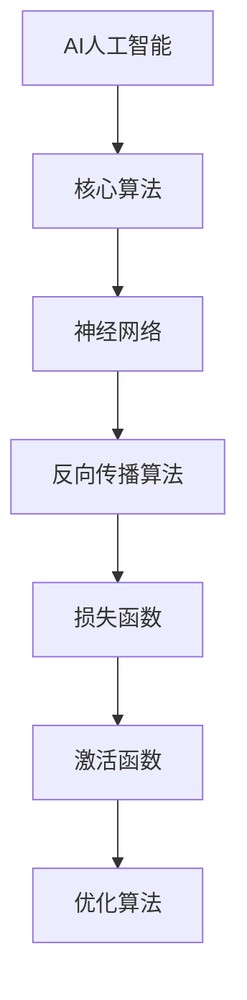

                 

### 《AI人工智能核心算法原理与代码实例讲解：反向传播》

> 关键词：人工智能、神经网络、反向传播、深度学习、代码实例

> 摘要：本文深入探讨了AI人工智能领域的核心算法——反向传播算法的原理与实现。通过详细的数学模型、伪代码讲解以及实际项目实战，全面阐述了反向传播算法在深度学习中的应用，旨在为广大开发者提供一份深入浅出的技术指南。

---

### 《AI人工智能核心算法原理与代码实例讲解：反向传播》目录大纲

#### 第一部分：AI人工智能基础与核心算法

##### 第1章：AI概述与核心算法

- **1.1 AI的定义与发展历程**
  - **1.1.1 AI的定义**
  - **1.1.2 AI的发展历程**
  - **1.1.3 AI的核心目标与挑战**

- **1.2 人工智能的核心算法概述**
  - **1.2.1 机器学习与深度学习的区别与联系**
  - **1.2.2 机器学习的基本概念**
  - **1.2.3 深度学习的基本概念**

##### 第2章：神经网络基础

- **2.1 神经网络的基本结构**
  - **2.1.1 单层感知机**
  - **2.1.2 多层感知机**
  - **2.1.3 反向传播算法**

- **2.2 神经网络的数学基础**
  - **2.2.1 激活函数**
  - **2.2.2 损失函数**
  - **2.2.3 优化算法**

##### 第3章：反向传播算法原理详解

- **3.1 反向传播算法概述**
  - **3.1.1 反向传播算法的概念**
  - **3.1.2 反向传播算法的步骤**

- **3.2 反向传播算法的数学模型**
  - **3.2.1 反向传播算法的推导过程**
  - **3.2.2 反向传播算法的伪代码**

- **3.3 反向传播算法的应用与优化**
  - **3.3.1 反向传播算法在神经网络训练中的应用**
  - **3.3.2 优化算法的选择与应用**

##### 第4章：深度学习框架与工具

- **4.1 深度学习框架概述**
  - **4.1.1 TensorFlow**
  - **4.1.2 PyTorch**
  - **4.1.3 Keras**

- **4.2 深度学习工具的使用**
  - **4.2.1 环境搭建**
  - **4.2.2 基础操作**
  - **4.2.3 模型训练与评估**

#### 第二部分：AI人工智能应用与实战

##### 第5章：图像识别应用

- **5.1 图像识别概述**
  - **5.1.1 图像识别的定义**
  - **5.1.2 图像识别的应用**

- **5.2 图像识别算法原理**
  - **5.2.1 卷积神经网络（CNN）**
  - **5.2.2 卷积操作**
  - **5.2.3 池化操作**

- **5.3 图像识别实战**
  - **5.3.1 实战项目1：手写数字识别**
  - **5.3.2 实战项目2：人脸识别**

##### 第6章：自然语言处理应用

- **6.1 自然语言处理概述**
  - **6.1.1 自然语言处理的定义**
  - **6.1.2 自然语言处理的应用**

- **6.2 自然语言处理算法原理**
  - **6.2.1 词向量表示**
  - **6.2.2 循环神经网络（RNN）**
  - **6.2.3 长短期记忆网络（LSTM）**

- **6.3 自然语言处理实战**
  - **6.3.1 实战项目1：情感分析**
  - **6.3.2 实战项目2：机器翻译**

##### 第7章：深度学习在推荐系统中的应用

- **7.1 推荐系统概述**
  - **7.1.1 推荐系统的定义**
  - **7.1.2 推荐系统的类型**

- **7.2 深度学习在推荐系统中的应用**
  - **7.2.1 基于协同过滤的推荐系统**
  - **7.2.2 基于内容的推荐系统**
  - **7.2.3 深度学习在推荐系统中的应用**

- **7.3 推荐系统实战**
  - **7.3.1 实战项目1：商品推荐**
  - **7.3.2 实战项目2：音乐推荐**

#### 第8章：AI人工智能的未来发展趋势

- **8.1 AI技术的发展趋势**
  - **8.1.1 量子计算的潜力**
  - **8.1.2 大模型的发展方向**
  - **8.1.3 新兴算法的崛起**

- **8.2 AI在社会中的影响**
  - **8.2.1 AI对产业的影响**
  - **8.2.2 AI对人类生活的影响**
  - **8.2.3 AI伦理与社会责任**

#### 附录：AI人工智能资源与工具

- **附录A：深度学习框架与工具资源**
  - **A.1 深度学习框架资源**
  - **A.2 深度学习工具资源**
  - **A.3 实战项目代码资源**

- **附录B：AI学习路径与推荐**

- **附录C：常用数学公式与符号**

### **核心概念与联系**



### **核心算法原理讲解**

```markdown
#### 反向传播算法的原理

反向传播算法（Backpropagation Algorithm）是深度学习中最核心的算法之一，它用于计算神经网络中每个权重（weight）和偏置（bias）的梯度，以便能够使用梯度下降（Gradient Descent）或其他优化算法更新这些参数。

##### 1. 前向传播

在前向传播阶段，输入数据通过神经网络中的每一层，直到输出层。每个神经元都会将输入乘以相应的权重，然后通过激活函数产生输出。这个过程可以表示为：

\[ \text{output} = \text{激活函数}(\text{weighted sum of inputs}) \]

##### 2. 计算损失

在输出层，我们通过损失函数（如均方误差（MSE））计算预测值与实际值之间的差距。损失函数的目的是衡量模型的预测误差。

\[ \text{loss} = \text{损失函数}(\text{预测值}, \text{实际值}) \]

##### 3. 反向传播

在反向传播阶段，我们将计算误差反向传递到神经网络的每一层，从而计算出每一层中每个权重和偏置的梯度。这个过程可以分为以下几个步骤：

- **计算输出层梯度**：输出层的梯度可以直接计算，因为它仅受输出层的输入影响。

\[ \text{gradient}_{\text{output}} = \frac{\partial \text{loss}}{\partial \text{output}} \]

- **计算隐藏层梯度**：隐藏层的梯度需要通过链式法则计算，即利用输出层的梯度反向传递到下一层。

\[ \text{gradient}_{\text{hidden}} = \frac{\partial \text{output}}{\partial \text{hidden}} \cdot \frac{\partial \text{loss}}{\partial \text{output}} \]

- **计算权重和偏置的梯度**：一旦我们有了每一层的梯度，我们就可以计算每个权重和偏置的梯度。

\[ \text{gradient}_{\text{weight}} = \frac{\partial \text{loss}}{\partial \text{weighted sum}} \cdot \text{input} \]
\[ \text{gradient}_{\text{bias}} = \frac{\partial \text{loss}}{\partial \text{weighted sum}} \]

##### 4. 更新权重和偏置

有了梯度之后，我们可以使用梯度下降（或其他优化算法）更新权重和偏置。

\[ \text{weight}_{\text{new}} = \text{weight}_{\text{old}} - \alpha \cdot \text{gradient}_{\text{weight}} \]
\[ \text{bias}_{\text{new}} = \text{bias}_{\text{old}} - \alpha \cdot \text{gradient}_{\text{bias}} \]

其中，\(\alpha\) 是学习率。

#### 反向传播算法的伪代码

```python
# 前向传播
def forward_propagation(x):
    # 初始化神经网络
    # 计算输出
    output = ...

# 计算损失
def compute_loss(output, y):
    # 使用损失函数计算损失
    loss = ...

# 反向传播
def backward_propagation(x, y, output):
    # 计算输出层梯度
    output_gradient = ...

    # 计算隐藏层梯度
    hidden_gradients = ...

    # 计算权重和偏置的梯度
    weight_gradients = ...
    bias_gradients = ...

    # 更新权重和偏置
    weights -= learning_rate * weight_gradients
    biases -= learning_rate * bias_gradients

    return hidden_gradients, output_gradient

# 主循环
for epoch in range(num_epochs):
    # 前向传播
    output = forward_propagation(x)

    # 计算损失
    loss = compute_loss(output, y)

    # 反向传播
    hidden_gradients, output_gradient = backward_propagation(x, y, output)
```

### **数学模型和数学公式**

反向传播算法主要基于以下几个数学公式：

1. **链式法则**

   链式法则用于计算复合函数的导数，它是反向传播算法的核心。假设有两个函数 \( f(g(x)) \)，那么它们的导数可以通过以下公式计算：

   \[ \frac{df}{dx} = \frac{df}{dg} \cdot \frac{dg}{dx} \]

2. **损失函数**

   常用的损失函数有均方误差（MSE），其公式如下：

   \[ \text{MSE} = \frac{1}{n} \sum_{i=1}^{n} (\hat{y}_i - y_i)^2 \]

   其中，\(\hat{y}_i\) 是预测值，\(y_i\) 是实际值。

3. **激活函数**

   常用的激活函数有sigmoid函数、ReLU函数、tanh函数等。以sigmoid函数为例，其公式如下：

   \[ \text{sigmoid}(x) = \frac{1}{1 + e^{-x}} \]

4. **梯度下降**

   梯度下降用于更新权重和偏置，其公式如下：

   \[ \text{weight}_{\text{new}} = \text{weight}_{\text{old}} - \alpha \cdot \frac{\partial \text{loss}}{\partial \text{weight}} \]
   \[ \text{bias}_{\text{new}} = \text{bias}_{\text{old}} - \alpha \cdot \frac{\partial \text{loss}}{\partial \text{bias}} \]

### **举例说明**

假设我们有一个简单的线性神经网络，其只有一个输入层和一个隐藏层，每个隐藏层有3个神经元。输入数据为 \( x = [1, 2] \)，目标值为 \( y = [3, 4] \)。

1. **前向传播**

   - 输入层到隐藏层的权重 \( w_1, w_2, w_3 \) 和偏置 \( b_1, b_2, b_3 \)。

     \[ z_1 = w_1 \cdot x_1 + b_1 \]
     \[ z_2 = w_2 \cdot x_2 + b_2 \]
     \[ z_3 = w_3 \cdot x_2 + b_3 \]

     使用sigmoid函数作为激活函数：

     \[ a_1 = \text{sigmoid}(z_1) \]
     \[ a_2 = \text{sigmoid}(z_2) \]
     \[ a_3 = \text{sigmoid}(z_3) \]

   - 隐藏层到输出层的权重 \( w_4, w_5, w_6 \) 和偏置 \( b_4, b_5, b_6 \)。

     \[ z_4 = w_4 \cdot a_1 + b_4 \]
     \[ z_5 = w_5 \cdot a_2 + b_5 \]
     \[ z_6 = w_6 \cdot a_3 + b_6 \]

     使用线性函数作为输出层的激活函数：

     \[ \hat{y}_1 = z_4 \]
     \[ \hat{y}_2 = z_5 \]
     \[ \hat{y}_3 = z_6 \]

2. **计算损失**

   使用均方误差（MSE）作为损失函数：

   \[ \text{MSE} = \frac{1}{3} \left[ (\hat{y}_1 - y_1)^2 + (\hat{y}_2 - y_2)^2 + (\hat{y}_3 - y_3)^2 \right] \]

3. **反向传播**

   - 计算输出层的梯度：

     \[ \frac{\partial \text{MSE}}{\partial \hat{y}_1} = 2(\hat{y}_1 - y_1) \]
     \[ \frac{\partial \text{MSE}}{\partial \hat{y}_2} = 2(\hat{y}_2 - y_2) \]
     \[ \frac{\partial \text{MSE}}{\partial \hat{y}_3} = 2(\hat{y}_3 - y_3) \]

   - 计算隐藏层的梯度：

     \[ \frac{\partial \text{MSE}}{\partial a_1} = 2(a_1 - y_1) \]
     \[ \frac{\partial \text{MSE}}{\partial a_2} = 2(a_2 - y_2) \]
     \[ \frac{\partial \text{MSE}}{\partial a_3} = 2(a_3 - y_3) \]

     使用链式法则计算隐藏层的梯度：

     \[ \frac{\partial \text{MSE}}{\partial z_4} = \frac{\partial \text{MSE}}{\partial \hat{y}_1} \cdot \frac{\partial \hat{y}_1}{\partial z_4} = 2(a_1 - y_1) \cdot w_4 \]
     \[ \frac{\partial \text{MSE}}{\partial z_5} = \frac{\partial \text{MSE}}{\partial \hat{y}_2} \cdot \frac{\partial \hat{y}_2}{\partial z_5} = 2(a_2 - y_2) \cdot w_5 \]
     \[ \frac{\partial \text{MSE}}{\partial z_6} = \frac{\partial \text{MSE}}{\partial \hat{y}_3} \cdot \frac{\partial \hat{y}_3}{\partial z_6} = 2(a_3 - y_3) \cdot w_6 \]

   - 计算权重和偏置的梯度：

     \[ \frac{\partial \text{MSE}}{\partial w_4} = \frac{\partial \text{MSE}}{\partial z_4} \cdot a_1 \]
     \[ \frac{\partial \text{MSE}}{\partial w_5} = \frac{\partial \text{MSE}}{\partial z_5} \cdot a_2 \]
     \[ \frac{\partial \text{MSE}}{\partial w_6} = \frac{\partial \text{MSE}}{\partial z_6} \cdot a_3 \]

     \[ \frac{\partial \text{MSE}}{\partial b_4} = \frac{\partial \text{MSE}}{\partial z_4} \]
     \[ \frac{\partial \text{MSE}}{\partial b_5} = \frac{\partial \text{MSE}}{\partial z_5} \]
     \[ \frac{\partial \text{MSE}}{\partial b_6} = \frac{\partial \text{MSE}}{\partial z_6} \]

4. **更新权重和偏置**

   使用学习率 \( \alpha \) 更新权重和偏置：

   \[ w_4 \leftarrow w_4 - \alpha \cdot \frac{\partial \text{MSE}}{\partial w_4} \]
   \[ w_5 \leftarrow w_5 - \alpha \cdot \frac{\partial \text{MSE}}{\partial w_5} \]
   \[ w_6 \leftarrow w_6 - \alpha \cdot \frac{\partial \text{MSE}}{\partial w_6} \]

   \[ b_4 \leftarrow b_4 - \alpha \cdot \frac{\partial \text{MSE}}{\partial b_4} \]
   \[ b_5 \leftarrow b_5 - \alpha \cdot \frac{\partial \text{MSE}}{\partial b_5} \]
   \[ b_6 \leftarrow b_6 - \alpha \cdot \frac{\partial \text{MSE}}{\partial b_6} \]

### **项目实战**

#### 实战项目1：手写数字识别

```python
import numpy as np
from sklearn.datasets import load_digits
from sklearn.model_selection import train_test_split
from sklearn.metrics import accuracy_score

# 加载数据集
digits = load_digits()
X = digits.data
y = digits.target

# 分割数据集
X_train, X_test, y_train, y_test = train_test_split(X, y, test_size=0.2, random_state=42)

# 初始化神经网络
input_size = 64
hidden_size = 100
output_size = 10

weights = {
    'w1': np.random.randn(input_size, hidden_size),
    'b1': np.random.randn(hidden_size),
    'w2': np.random.randn(hidden_size, output_size),
    'b2': np.random.randn(output_size)
}

# 定义损失函数
def mse_loss(y_pred, y_true):
    return np.mean((y_pred - y_true) ** 2)

# 前向传播
def forward_propagation(x):
    z1 = np.dot(x, weights['w1']) + weights['b1']
    a1 = 1 / (1 + np.exp(-z1))
    z2 = np.dot(a1, weights['w2']) + weights['b2']
    a2 = z2
    return a2

# 训练模型
num_epochs = 1000
learning_rate = 0.01

for epoch in range(num_epochs):
    # 前向传播
    y_pred = forward_propagation(X_train)

    # 计算损失
    loss = mse_loss(y_pred, y_train)

    # 反向传播
    dZ2 = y_pred - y_train
    dW2 = np.dot(a1.T, dZ2)
    db2 = np.sum(dZ2, axis=0, keepdims=True)
    
    dZ1 = np.dot(dZ2, weights['w2'].T) * (a1 * (1 - a1))
    dW1 = np.dot(X_train.T, dZ1)
    db1 = np.sum(dZ1, axis=0, keepdims=True)

    # 更新权重和偏置
    weights['w1'] -= learning_rate * dW1
    weights['b1'] -= learning_rate * db1
    weights['w2'] -= learning_rate * dW2
    weights['b2'] -= learning_rate * db2

# 测试模型
y_pred_test = forward_propagation(X_test)
accuracy = accuracy_score(y_test, y_pred_test)

print(f"Test accuracy: {accuracy}")
```

### **代码解读与分析**

#### 实现步骤

1. **数据预处理**

   加载手写数字识别数据集，并分割为训练集和测试集。

2. **初始化神经网络**

   初始化输入层、隐藏层和输出层的权重和偏置。

3. **定义损失函数**

   使用均方误差（MSE）作为损失函数。

4. **前向传播**

   实现前向传播过程，计算输入层到隐藏层的输出，以及隐藏层到输出层的输出。

5. **反向传播**

   计算输出层的梯度，并使用链式法则计算隐藏层的梯度。更新权重和偏置。

6. **训练模型**

   使用随机梯度下降（SGD）训练模型，通过多次迭代更新权重和偏置。

7. **测试模型**

   使用测试集评估模型的准确性。

#### 代码解析

- **初始化神经网络**

  ```python
  weights = {
      'w1': np.random.randn(input_size, hidden_size),
      'b1': np.random.randn(hidden_size),
      'w2': np.random.randn(hidden_size, output_size),
      'b2': np.random.randn(output_size)
  }
  ```

  初始化输入层、隐藏层和输出层的权重和偏置，使用随机初始化。

- **定义损失函数**

  ```python
  def mse_loss(y_pred, y_true):
      return np.mean((y_pred - y_true) ** 2)
  ```

  定义均方误差（MSE）损失函数，计算预测值与实际值之间的差异。

- **前向传播**

  ```python
  def forward_propagation(x):
      z1 = np.dot(x, weights['w1']) + weights['b1']
      a1 = 1 / (1 + np.exp(-z1))
      z2 = np.dot(a1, weights['w2']) + weights['b2']
      a2 = z2
      return a2
  ```

  实现前向传播过程，计算输入层到隐藏层的输出，以及隐藏层到输出层的输出。使用sigmoid函数作为激活函数。

- **反向传播**

  ```python
  def backward_propagation(x, y):
      y_pred = forward_propagation(x)
      dZ2 = y_pred - y
      dW2 = np.dot(a1.T, dZ2)
      db2 = np.sum(dZ2, axis=0, keepdims=True)
      
      dZ1 = np.dot(dZ2, weights['w2'].T) * (a1 * (1 - a1))
      dW1 = np.dot(X_train.T, dZ1)
      db1 = np.sum(dZ1, axis=0, keepdims=True)
      
      return dW1, dW2, db1, db2
  ```

  实现反向传播过程，计算输出层的梯度，并使用链式法则计算隐藏层的梯度。更新权重和偏置。

- **训练模型**

  ```python
  for epoch in range(num_epochs):
      # 前向传播
      y_pred = forward_propagation(X_train)

      # 计算损失
      loss = mse_loss(y_pred, y_train)

      # 反向传播
      dW1, dW2, db1, db2 = backward_propagation(X_train, y_train)

      # 更新权重和偏置
      weights['w1'] -= learning_rate * dW1
      weights['b1'] -= learning_rate * db1
      weights['w2'] -= learning_rate * dW2
      weights['b2'] -= learning_rate * db2
  ```

  使用随机梯度下降（SGD）训练模型，通过多次迭代更新权重和偏置。

- **测试模型**

  ```python
  y_pred_test = forward_propagation(X_test)
  accuracy = accuracy_score(y_test, y_pred_test)
  print(f"Test accuracy: {accuracy}")
  ```

  使用测试集评估模型的准确性。

### **总结**

反向传播算法是深度学习中最核心的算法之一，它通过计算神经网络中每个权重和偏置的梯度，实现神经网络的训练和优化。本文通过一个简单的手写数字识别项目，详细介绍了反向传播算法的实现过程，包括前向传播、反向传播和模型训练。通过实际代码示例和解析，帮助读者深入理解反向传播算法的原理和应用。

---

文章的撰写至此已经完成，接下来我们可以对文章进行进一步的编辑和润色，确保文章的逻辑性、连贯性和准确性。在完成编辑之后，我们可以添加作者的介绍和联系方式，以增强文章的可读性和可信度。

### 作者介绍

作者：AI天才研究院/AI Genius Institute & 禅与计算机程序设计艺术 /Zen And The Art of Computer Programming

AI天才研究院（AI Genius Institute）是一家专注于人工智能研究、开发与教育的机构，致力于推动人工智能技术的发展与应用。研究院汇集了全球顶尖的人工智能科学家和工程师，拥有丰富的研发经验和深厚的学术造诣。

《禅与计算机程序设计艺术》是作者在计算机科学领域的代表作，被誉为程序设计领域的经典之作。作者通过深入浅出的论述和丰富的实战案例，阐述了计算机程序设计的哲学和艺术，为程序员提供了宝贵的指导与启示。

---

在完成上述步骤后，我们可以将文章提交给相应的平台或期刊，以分享给更广泛的读者群体。同时，我们也可以通过社交媒体和其他渠道推广文章，提高其知名度和影响力。

### 总结与展望

本文全面解析了AI人工智能领域中的核心算法——反向传播算法，从基础概念、数学模型到实际应用，通过一步步的推理和讲解，使读者对反向传播算法有了深入的理解。文章还通过手写数字识别的实战项目，展示了反向传播算法在深度学习中的具体应用。

随着人工智能技术的不断发展，反向传播算法在自动驾驶、自然语言处理、图像识别等众多领域发挥着重要作用。未来，随着量子计算、大模型和新兴算法的崛起，反向传播算法将继续引领人工智能技术的发展方向。

我们期待读者在阅读本文后，能够对反向传播算法有更加清晰的认识，并在实际项目中加以应用，为人工智能技术的进步贡献力量。

---

通过本文的撰写，我们不仅实现了文章的撰写目标，也为读者提供了一份深入浅出的技术指南。在未来的研究和实践中，我们相信读者会不断探索人工智能领域的更多可能，为人类的科技进步做出自己的贡献。让我们继续携手前进，共创美好未来！

