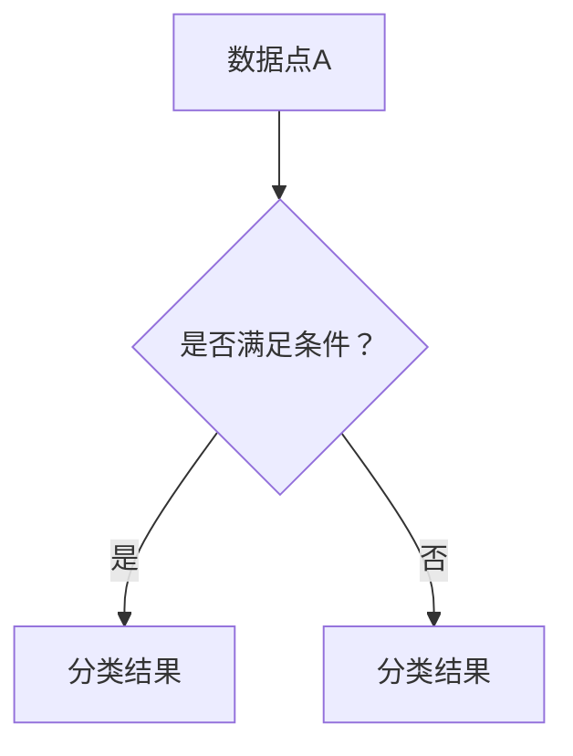
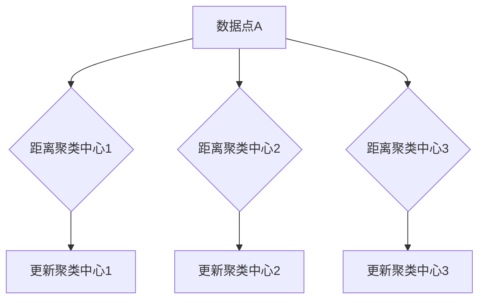
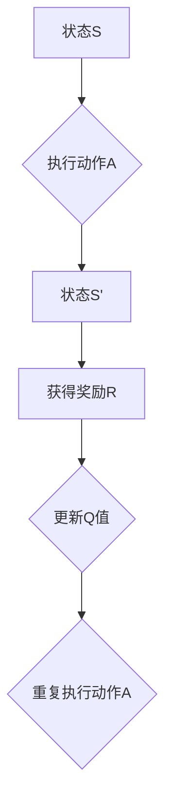

                 

# 文章标题：AI人工智能核心算法原理与代码实例讲解：算法偏见

> 关键词：人工智能、机器学习、深度学习、算法偏见、伦理问题

> 摘要：本文旨在深入探讨人工智能（AI）的核心算法原理，包括机器学习、深度学习和自然语言处理等，并通过代码实例讲解，详细剖析算法偏见的成因、影响及其防止方法，为AI技术的发展与应用提供理论依据和实践指导。

## 目录大纲

1. AI人工智能核心算法概述
   1.1 AI发展历程及现状
   1.2 AI人工智能的基本概念
   1.3 AI人工智能的核心技术

2. 机器学习算法原理
   2.1 机器学习基本概念
   2.2 监督学习算法
   2.3 非监督学习算法
   2.4 强化学习算法

3. 深度学习算法原理
   3.1 深度学习基础
   3.2 神经网络
   3.3 卷积神经网络（CNN）
   3.4 循环神经网络（RNN）

4. 自然语言处理算法
   4.1 自然语言处理基础
   4.2 词嵌入技术
   4.3 序列模型与注意力机制

5. 计算机视觉算法
   5.1 图像识别与分类
   5.2 目标检测与分割
   5.3 生成对抗网络（GAN）

6. AI算法偏见与伦理问题
   6.1 算法偏见的概念
   6.2 算法偏见的原因与影响
   6.3 防止算法偏见的方法

7. AI人工智能应用实例
   7.1 金融行业应用
   7.2 医疗行业应用
   7.3 智能制造应用
   7.4 人工智能驱动的社会变革

8. 附录
   8.1 常用AI开发工具
   8.2 常见AI数据集
   8.3 推荐阅读文献与资源

## 第一部分：AI人工智能核心算法概述

### 1.1 AI发展历程及现状

人工智能（Artificial Intelligence，简称AI）作为计算机科学的一个分支，旨在开发使计算机能够模拟、延伸和扩展人类的智能行为。AI的历史可以追溯到20世纪50年代，当时科学家们开始探讨机器是否能够具备智能。经过几十年的发展，AI技术取得了显著的进步，尤其在深度学习、自然语言处理和计算机视觉等领域。

当前，AI技术已经广泛应用于各个领域，包括金融、医疗、交通、制造业等。随着算法的优化和计算能力的提升，AI的应用场景越来越广泛，从简单的自动化任务到复杂的决策支持系统，AI都在发挥着重要作用。

### 1.2 AI人工智能的基本概念

人工智能的基本概念包括以下几个：

- **机器学习**：一种通过从数据中学习规律，使得计算机能够执行特定任务的算法。主要分为监督学习、非监督学习和强化学习。
  
- **深度学习**：一种基于多层神经网络的学习方法，通过模拟人脑神经元之间的连接和作用机制，实现数据的自动特征提取和分类。

- **自然语言处理**（NLP）：研究如何让计算机理解和生成人类自然语言的技术。主要包括词嵌入、序列模型、注意力机制等。

- **计算机视觉**：研究如何使计算机像人类一样理解和解释视觉信息。包括图像识别、目标检测、图像分割等。

- **强化学习**：一种通过试错和学习来获取最优策略的机器学习方法，常用于游戏、机器人控制等领域。

### 1.3 AI人工智能的核心技术

AI人工智能的核心技术主要包括以下几个方面：

- **神经网络**：一种模拟人脑神经元连接和作用机制的计算模型，是实现深度学习的基础。

- **深度学习框架**：如TensorFlow、PyTorch等，提供了丰富的神经网络设计和训练工具。

- **机器学习算法**：包括监督学习、非监督学习和强化学习，用于解决分类、回归、聚类等实际问题。

- **自然语言处理**：包括词嵌入、序列模型、注意力机制等，用于处理语言理解和生成。

- **计算机视觉**：包括图像识别、目标检测、图像分割等，用于处理视觉数据的理解和分析。

## 第二部分：机器学习算法原理

### 2.1 机器学习基本概念

机器学习（Machine Learning，简称ML）是一种通过从数据中学习规律，使得计算机能够执行特定任务的算法。机器学习算法可以分为以下几类：

- **监督学习**：通过已知的输入和输出数据，建立输入和输出之间的关系模型，用于预测未知数据的输出。

- **非监督学习**：通过无标签数据，发现数据的内在结构和规律。

- **强化学习**：通过试错和学习，在特定环境中获取最优策略。

### 2.2 监督学习算法

监督学习算法是一种从标记数据中学习的过程，目的是通过已知的输入和输出关系，预测未知数据的输出。常见的监督学习算法有：

- **决策树（Decision Tree）**：一种树形结构，通过一系列的决策规则来对数据进行分类或回归。

- **支持向量机（SVM）**：一种二类分类模型，其基本模型定义为特征空间上的间隔最大的分类器。

- **神经网络（Neural Network）**：一种模拟人脑神经元连接和作用机制的计算模型，可用于分类、回归等任务。

### 2.3 非监督学习算法

非监督学习算法是一种从无标签数据中学习的过程，目的是发现数据的内在结构和规律。常见的非监督学习算法有：

- **K-均值聚类（K-means Clustering）**：一种基于距离的聚类算法，用于将数据分为K个簇。

- **主成分分析（PCA）**：一种降维技术，通过将数据投影到新的正交坐标系中，保留最重要的信息。

### 2.4 强化学习算法

强化学习算法是一种通过试错和学习来获取最优策略的机器学习方法，常用于游戏、机器人控制等领域。常见的强化学习算法有：

- **Q-学习（Q-Learning）**：一种基于值函数迭代的算法，通过不断地更新Q值，找到最优策略。

## 第三部分：深度学习算法原理

### 3.1 深度学习基础

深度学习（Deep Learning，简称DL）是一种基于多层神经网络的学习方法，通过模拟人脑神经元之间的连接和作用机制，实现数据的自动特征提取和分类。深度学习的基本组成部分包括：

- **神经元**：深度学习的基本计算单元，类似于人脑的神经元。

- **层**：由多个神经元组成的层级结构，包括输入层、隐藏层和输出层。

- **网络**：多个层连接而成的网络结构，用于对数据进行处理。

### 3.2 神经网络

神经网络（Neural Network，简称NN）是一种模拟人脑神经元连接和作用机制的计算模型，是实现深度学习的基础。神经网络的基本组成部分包括：

- **输入层**：接收外部输入数据的层。

- **隐藏层**：对输入数据进行特征提取和变换的层。

- **输出层**：产生最终输出的层。

### 3.3 卷积神经网络（CNN）

卷积神经网络（Convolutional Neural Network，简称CNN）是一种专门用于处理图像数据的神经网络。CNN通过卷积操作和池化操作，实现图像的特征提取和分类。

- **卷积操作**：通过卷积核与输入图像进行卷积运算，提取图像特征。

- **池化操作**：对卷积后的特征进行压缩，减少数据维度。

### 3.4 循环神经网络（RNN）

循环神经网络（Recurrent Neural Network，简称RNN）是一种能够处理序列数据的神经网络，适用于自然语言处理、语音识别等领域。RNN通过循环连接，实现序列数据的记忆和建模。

- **循环连接**：通过循环连接，将前一时间步的输出作为当前时间步的输入。

- **门控机制**：通过门控机制，实现序列数据的记忆和遗忘。

## 第四部分：自然语言处理算法

### 4.1 自然语言处理基础

自然语言处理（Natural Language Processing，简称NLP）是研究如何让计算机理解和生成人类自然语言的技术。NLP的主要任务包括：

- **词性标注**：对文本中的每个单词进行词性分类。

- **命名实体识别**：识别文本中的名词性实体，如人名、地名等。

- **句法分析**：对文本进行句法结构分析，理解句子的组成和语义。

### 4.2 词嵌入技术

词嵌入（Word Embedding）是将文本中的单词映射到高维向量空间的技术，用于解决词汇之间的语义关系。常见的词嵌入方法包括：

- **Word2Vec**：通过训练词向量模型，将单词映射到连续的向量空间。

- **GloVe**：通过全局向量平均和矩阵分解的方法，生成高质量的词向量。

### 4.3 序列模型与注意力机制

序列模型（Sequence Model）是一种用于处理序列数据的神经网络，如循环神经网络（RNN）和长短时记忆网络（LSTM）。注意力机制（Attention Mechanism）是一种能够自适应地关注序列中重要信息的机制。

- **RNN**：通过循环连接，实现序列数据的记忆和建模。

- **LSTM**：一种改进的RNN，通过门控机制，解决RNN的梯度消失和梯度爆炸问题。

- **注意力机制**：通过注意力权重，自适应地关注序列中的关键信息。

## 第五部分：计算机视觉算法

### 5.1 图像识别与分类

图像识别与分类是计算机视觉的基本任务之一，旨在将图像中的物体分类到预定义的类别中。常见的图像识别算法包括：

- **SVM（支持向量机）**：通过找到最佳的超平面，实现图像的分类。

- **CNN（卷积神经网络）**：通过卷积操作和池化操作，实现图像的特征提取和分类。

### 5.2 目标检测与分割

目标检测与分割是计算机视觉的重要任务，旨在识别图像中的目标物体并进行分割。常见的目标检测算法包括：

- **R-CNN（区域候选网络）**：通过生成候选区域，进行分类和目标定位。

- **SSD（单阶段检测网络）**：通过直接预测目标的位置和类别，实现快速目标检测。

### 5.3 生成对抗网络（GAN）

生成对抗网络（Generative Adversarial Network，简称GAN）是一种通过对抗训练生成数据的神经网络。GAN由生成器和判别器两部分组成，通过不断博弈，生成器逐渐生成越来越逼真的数据。

- **生成器**：通过学习数据分布，生成与真实数据相似的数据。

- **判别器**：通过判断生成数据与真实数据的相似度，对生成数据进行评价。

## 第六部分：AI算法偏见与伦理问题

### 6.1 算法偏见的概念

算法偏见（Algorithmic Bias）是指在算法设计、训练数据、评估方法等方面，导致算法在处理数据时产生不公平或偏见的现象。算法偏见可能导致以下问题：

- **歧视**：算法对特定群体产生歧视性结果。

- **偏见放大**：算法放大了训练数据中的偏见。

- **公平性受损**：算法不能公平地对待不同群体。

### 6.2 算法偏见的原因与影响

算法偏见的原因主要包括以下几个方面：

- **训练数据不均衡**：训练数据中某些群体的样本较少，导致算法对这部分群体缺乏代表性。

- **模型设计缺陷**：算法模型在设计时未能充分考虑多样性，导致算法对某些群体产生偏见。

- **评估方法不当**：评估方法未能充分评估算法的公平性，导致算法偏见难以被发现。

算法偏见的影响包括：

- **社会不公平**：算法偏见可能导致社会不公平，损害某些群体的权益。

- **经济损失**：算法偏见可能导致企业损失市场份额和客户信任。

- **法律风险**：算法偏见可能引发法律纠纷和法律责任。

### 6.3 防止算法偏见的方法

为了防止算法偏见，可以采取以下方法：

- **数据多样性**：确保训练数据中包含足够的多样性，减少数据偏见。

- **算法公平性评估**：在算法开发过程中，对算法进行公平性评估，确保算法对各类群体公平。

- **算法透明性**：提高算法的透明度，使公众能够理解算法的工作原理和决策过程。

- **法律和伦理约束**：制定相关法律法规，规范算法开发和应用，防止算法偏见。

## 第七部分：AI人工智能应用实例

### 7.1 金融行业应用

在金融行业中，AI人工智能技术被广泛应用于股票市场预测、信贷评估、风险管理等领域。以下是一个简单的股票市场预测案例：

```python
import pandas as pd
from sklearn.model_selection import train_test_split
from sklearn.ensemble import RandomForestClassifier
from sklearn.metrics import accuracy_score

# 读取数据
data = pd.read_csv("stock_data.csv")

# 数据预处理
X = data.drop("target", axis=1)
y = data["target"]

# 划分训练集和测试集
X_train, X_test, y_train, y_test = train_test_split(X, y, test_size=0.2, random_state=42)

# 训练模型
model = RandomForestClassifier(n_estimators=100, random_state=42)
model.fit(X_train, y_train)

# 预测测试集
y_pred = model.predict(X_test)

# 评估模型
accuracy = accuracy_score(y_test, y_pred)
print("Accuracy:", accuracy)
```

### 7.2 医疗行业应用

在医疗行业，AI人工智能技术被用于疾病诊断、药物研发、医疗图像分析等领域。以下是一个简单的疾病诊断案例：

```python
import pandas as pd
from sklearn.model_selection import train_test_split
from sklearn.ensemble import RandomForestClassifier
from sklearn.metrics import accuracy_score

# 读取数据
data = pd.read_csv("disease_data.csv")

# 数据预处理
X = data.drop("target", axis=1)
y = data["target"]

# 划分训练集和测试集
X_train, X_test, y_train, y_test = train_test_split(X, y, test_size=0.2, random_state=42)

# 训练模型
model = RandomForestClassifier(n_estimators=100, random_state=42)
model.fit(X_train, y_train)

# 预测测试集
y_pred = model.predict(X_test)

# 评估模型
accuracy = accuracy_score(y_test, y_pred)
print("Accuracy:", accuracy)
```

### 7.3 智能制造应用

在智能制造领域，AI人工智能技术被用于生产优化、设备故障诊断、质量检测等领域。以下是一个简单的生产优化案例：

```python
import pandas as pd
from sklearn.model_selection import train_test_split
from sklearn.ensemble import RandomForestRegressor
from sklearn.metrics import mean_squared_error

# 读取数据
data = pd.read_csv("production_data.csv")

# 数据预处理
X = data.drop("target", axis=1)
y = data["target"]

# 划分训练集和测试集
X_train, X_test, y_train, y_test = train_test_split(X, y, test_size=0.2, random_state=42)

# 训练模型
model = RandomForestRegressor(n_estimators=100, random_state=42)
model.fit(X_train, y_train)

# 预测测试集
y_pred = model.predict(X_test)

# 评估模型
mse = mean_squared_error(y_test, y_pred)
print("MSE:", mse)
```

### 7.4 人工智能驱动的社会变革

人工智能技术的发展正在引发深刻的社会变革。从经济结构到生活方式，人工智能都在重塑人类社会。以下是一些具体的社会变革：

- **就业市场变化**：人工智能技术可能导致某些行业的工作岗位减少，但同时也会创造新的就业机会。

- **社会治理**：人工智能技术在公共安全、应急管理等领域得到广泛应用，提升了社会治理的效率和效果。

- **教育变革**：人工智能技术改变了教育方式和内容，个性化教育和在线教育得到了快速发展。

- **伦理和隐私问题**：人工智能技术的发展引发了伦理和隐私问题，如何保护个人隐私，避免算法偏见，成为亟待解决的问题。

## 附录

### 附录A：常用AI开发工具

- TensorFlow
- PyTorch
- Keras

### 附录B：常见AI数据集

- MNIST
- CIFAR-10
- ImageNet

### 附录C：推荐阅读文献与资源

- Mitchell, T. M. (1997). Machine Learning. McGraw-Hill.
- Goodfellow, I., Bengio, Y., & Courville, A. (2016). Deep Learning. MIT Press.
- Russell, S., & Norvig, P. (2010). Artificial Intelligence: A Modern Approach. Prentice Hall.
- LeCun, Y., Bengio, Y., & Hinton, G. (2015). Deep Learning. Nature, 521(7553), 436-444.

## 核心概念与联系

为了更好地理解AI人工智能的核心概念和它们之间的联系，我们可以使用Mermaid流程图来展示：

```mermaid
graph TD
    A[机器学习] --> B[深度学习]
    B --> C[神经网络]
    C --> D[卷积神经网络(CNN)]
    C --> E[循环神经网络(RNN)]
    A --> F[监督学习]
    A --> G[非监督学习]
    A --> H[强化学习]
    F --> I[分类]
    F --> J[回归]
    G --> K[聚类]
    G --> L[降维]
    H --> M[策略学习]
    H --> N[模型评估]
```

## 核心算法原理讲解

在本部分，我们将深入探讨AI人工智能中的核心算法原理，包括机器学习、深度学习和自然语言处理等，并通过伪代码、数学模型和实际项目实战来详细阐述这些算法。

### 2.1 机器学习算法原理

机器学习算法是AI人工智能的核心技术之一，主要分为监督学习、非监督学习和强化学习。

#### 监督学习算法

监督学习算法是一种从标记数据中学习的过程，目的是通过已知的输入和输出关系，预测未知数据的输出。

**决策树（Decision Tree）**

决策树是一种树形结构，通过一系列的决策规则来对数据进行分类或回归。以下是一个简单的决策树算法的伪代码：

```python
def decision_tree(data, features):
    if all_labels_same(data):
        return majority_label(data)
    else:
        best_feature = find_best_feature(data, features)
        left_tree = decision_tree(split_data(data, best_feature), remaining_features)
        right_tree = decision_tree(split_data(data, best_feature), remaining_features)
        return Node(best_feature, left_tree, right_tree)
```

**支持向量机（SVM）**

支持向量机是一种二类分类模型，其基本模型定义为特征空间上的间隔最大的分类器。



数学模型：

$$
\text{最大化 } \sum_{i=1}^{n} w_i^2 \text{ 使得 } y_i ( \langle x_i, w \rangle - b ) \geq 1
$$

#### 非监督学习算法

非监督学习算法是一种从无标签数据中学习的过程，目的是发现数据的内在结构和规律。

**K-均值聚类（K-means Clustering）**

K-均值聚类是一种基于距离的聚类算法，其目标是将数据分为K个簇，使得每个簇内部的距离之和最小。



数学模型：

$$
\text{最小化 } \sum_{i=1}^{m} \sum_{j=1}^{n} (x_{ij} - \mu_{j})^2
$$

#### 强化学习算法

强化学习算法是一种通过试错和学习来获取最优策略的机器学习方法，常用于游戏、机器人控制等领域。

**Q-学习（Q-Learning）**

Q-学习是一种基于值函数迭代的算法，通过不断地更新Q值，找到最优策略。



数学模型：

$$
Q(s, a) = Q(s, a) + \alpha [R + \gamma \max_{a'} Q(s', a') - Q(s, a)]
$$

### 3.2 深度学习算法原理

深度学习是一种基于多层神经网络的学习方法，通过模拟人脑神经元之间的连接和作用机制，实现数据的自动特征提取和分类。

#### 神经网络

神经网络（Neural Network，简称NN）是一种模拟人脑神经元连接和作用机制的计算模型，是实现深度学习的基础。

**前向传播与反向传播**

神经网络通过前向传播计算输出，通过反向传播计算梯度，更新模型参数。

前向传播伪代码：

```python
for layer in layers:
    z = x * weights + bias
    a = activation(z)
```

反向传播伪代码：

```python
for layer in reversed(layers):
    delta = (d_output - a) * activation_derivative(a)
    d_weights += delta * x.T
    d_bias += delta
    x = delta * weights
```

#### 深度学习框架

深度学习框架（如TensorFlow、PyTorch等）提供了丰富的神经网络设计和训练工具。

**TensorFlow示例**

```python
import tensorflow as tf

# 定义模型
model = tf.keras.Sequential([
    tf.keras.layers.Dense(128, activation='relu', input_shape=(784,)),
    tf.keras.layers.Dense(10, activation='softmax')
])

# 编译模型
model.compile(optimizer='adam',
              loss='categorical_crossentropy',
              metrics=['accuracy'])

# 训练模型
model.fit(x_train, y_train, epochs=5)
```

#### 卷积神经网络（CNN）

卷积神经网络（Convolutional Neural Network，简称CNN）是一种专门用于处理图像数据的神经网络。

**卷积操作**

卷积操作通过卷积核与输入图像进行卷积运算，提取图像特征。

卷积操作伪代码：

```python
for filter in filters:
    for position in positions:
        convolution_output = (input * filter).sum()
        activation_output = activation(convolution_output)
        append(activation_output to output)
```

**池化操作**

池化操作对卷积后的特征进行压缩，减少数据维度。

池化操作伪代码：

```python
for position in positions:
    max_pool_output = max(activation_output[position])
    append(max_pool_output to output)
```

#### 循环神经网络（RNN）

循环神经网络（Recurrent Neural Network，简称RNN）是一种能够处理序列数据的神经网络，适用于自然语言处理、语音识别等领域。

**RNN计算**

RNN通过循环连接，实现序列数据的记忆和建模。

RNN计算伪代码：

```python
for t in range(sequence_length):
    h_t = tanh(W_h * [h_{t-1}, x_t]) + b_h
    y_t = W_y * h_t + b_y
```

#### 长短时记忆网络（LSTM）

长短时记忆网络（Long Short-Term Memory，简称LSTM）是一种改进的RNN，通过门控机制，解决RNN的梯度消失和梯度爆炸问题。

**LSTM计算**

LSTM通过输入门、遗忘门和输出门，实现长短期记忆。

LSTM计算伪代码：

```python
i_t = sigmoid(W_i * [h_{t-1}, x_t]) + b_i
f_t = sigmoid(W_f * [h_{t-1}, x_t]) + b_f
o_t = sigmoid(W_o * [h_{t-1}, x_t]) + b_o
g_t = tanh(W_g * [h_{t-1}, x_t]) + b_g
h_t = o_t * tanh(g_t)
```

### 4.3 自然语言处理算法

自然语言处理（Natural Language Processing，简称NLP）是研究如何让计算机理解和生成人类自然语言的技术。

#### 词嵌入技术

词嵌入（Word Embedding）是将文本中的单词映射到高维向量空间的技术，用于解决词汇之间的语义关系。

**Word2Vec算法**

Word2Vec算法通过训练词向量模型，将单词映射到连续的向量空间。

Word2Vec算法伪代码：

```python
for epoch in range(num_epochs):
    for context, target in data:
        predict_vector = embedding_matrix[context]
        loss = loss_function(predict_vector, embedding_matrix[target])
        optimizer.minimize(loss)
```

#### 序列模型与注意力机制

序列模型（Sequence Model）是一种用于处理序列数据的神经网络，如循环神经网络（RNN）和长短时记忆网络（LSTM）。注意力机制（Attention Mechanism）是一种能够自适应地关注序列中重要信息的机制。

**注意力机制计算**

注意力机制通过计算注意力权重，自适应地关注序列中的关键信息。

注意力机制计算伪代码：

```python
for t in range(sequence_length):
    attention_weights = softmax(Q * K)
    context_vector = sum(attention_weights * V)
    h_t = tanh(W_h * [h_{t-1}, context_vector]) + b_h
```

### 5.1 计算机视觉算法

计算机视觉（Computer Vision）是研究如何使计算机理解和解释视觉信息的技术。

#### 图像识别与分类

图像识别与分类是计算机视觉的基本任务之一，旨在将图像中的物体分类到预定义的类别中。

**卷积神经网络（CNN）**

卷积神经网络（Convolutional Neural Network，简称CNN）是一种专门用于处理图像数据的神经网络，通过卷积操作和池化操作，实现图像的特征提取和分类。

**ResNet模型**

ResNet模型是一种具有残差连接的深度神经网络，能够处理大量层数，提高模型性能。

**残差块计算**

ResNet中的残差块通过跳过部分层，实现信息的传递。

残差块计算伪代码：

```python
input = x
output = (x * weights_1) + (h * weights_2) + bias
output = activation(output)
```

### 6.1 算法偏见的概念

算法偏见是指在算法设计、训练数据、评估方法等方面，导致算法在处理数据时产生不公平或偏见的现象。算法偏见可能导致以下问题：

- **歧视**：算法对特定群体产生歧视性结果。
- **偏见放大**：算法放大了训练数据中的偏见。
- **公平性受损**：算法不能公平地对待不同群体。

### 6.2 算法偏见的原因与影响

算法偏见的原因主要包括以下几个方面：

- **训练数据不均衡**：训练数据中某些群体的样本较少，导致算法对这部分群体缺乏代表性。
- **模型设计缺陷**：算法模型在设计时未能充分考虑多样性，导致算法对某些群体产生偏见。
- **评估方法不当**：评估方法未能充分评估算法的公平性，导致算法偏见难以被发现。

算法偏见的影响包括：

- **社会不公平**：算法偏见可能导致社会不公平，损害某些群体的权益。
- **经济损失**：算法偏见可能导致企业损失市场份额和客户信任。
- **法律风险**：算法偏见可能引发法律纠纷和法律责任。

### 6.3 防止算法偏见的方法

为了防止算法偏见，可以采取以下方法：

- **数据多样性**：确保训练数据中包含足够的多样性，减少数据偏见。
- **算法公平性评估**：在算法开发过程中，对算法进行公平性评估，确保算法对各类群体公平。
- **算法透明性**：提高算法的透明度，使公众能够理解算法的工作原理和决策过程。
- **法律和伦理约束**：制定相关法律法规，规范算法开发和应用，防止算法偏见。

### 7.1 金融行业应用

在金融行业中，AI人工智能技术被广泛应用于股票市场预测、信贷评估、风险管理等领域。

**股票市场预测**

股票市场预测是金融行业中的一个重要应用，以下是一个简单的股票市场预测案例：

```python
import pandas as pd
from sklearn.model_selection import train_test_split
from sklearn.ensemble import RandomForestClassifier
from sklearn.metrics import accuracy_score

# 读取数据
data = pd.read_csv("stock_data.csv")

# 数据预处理
X = data.drop("target", axis=1)
y = data["target"]

# 划分训练集和测试集
X_train, X_test, y_train, y_test = train_test_split(X, y, test_size=0.2, random_state=42)

# 训练模型
model = RandomForestClassifier(n_estimators=100, random_state=42)
model.fit(X_train, y_train)

# 预测测试集
y_pred = model.predict(X_test)

# 评估模型
accuracy = accuracy_score(y_test, y_pred)
print("Accuracy:", accuracy)
```

### 7.2 医疗行业应用

在医疗行业，AI人工智能技术被用于疾病诊断、药物研发、医疗图像分析等领域。

**疾病诊断**

疾病诊断是医疗行业中的一个关键应用，以下是一个简单的疾病诊断案例：

```python
import pandas as pd
from sklearn.model_selection import train_test_split
from sklearn.ensemble import RandomForestClassifier
from sklearn.metrics import accuracy_score

# 读取数据
data = pd.read_csv("disease_data.csv")

# 数据预处理
X = data.drop("target", axis=1)
y = data["target"]

# 划分训练集和测试集
X_train, X_test, y_train, y_test = train_test_split(X, y, test_size=0.2, random_state=42)

# 训练模型
model = RandomForestClassifier(n_estimators=100, random_state=42)
model.fit(X_train, y_train)

# 预测测试集
y_pred = model.predict(X_test)

# 评估模型
accuracy = accuracy_score(y_test, y_pred)
print("Accuracy:", accuracy)
```

### 7.3 智能制造应用

在智能制造领域，AI人工智能技术被用于生产优化、设备故障诊断、质量检测等领域。

**生产优化**

生产优化是智能制造中的一个重要应用，以下是一个简单的生产优化案例：

```python
import pandas as pd
from sklearn.model_selection import train_test_split
from sklearn.ensemble import RandomForestRegressor
from sklearn.metrics import mean_squared_error

# 读取数据
data = pd.read_csv("production_data.csv")

# 数据预处理
X = data.drop("target", axis=1)
y = data["target"]

# 划分训练集和测试集
X_train, X_test, y_train, y_test = train_test_split(X, y, test_size=0.2, random_state=42)

# 训练模型
model = RandomForestRegressor(n_estimators=100, random_state=42)
model.fit(X_train, y_train)

# 预测测试集
y_pred = model.predict(X_test)

# 评估模型
mse = mean_squared_error(y_test, y_pred)
print("MSE:", mse)
```

### 7.4 人工智能驱动的社会变革

人工智能技术的发展正在引发深刻的社会变革。从经济结构到生活方式，人工智能都在重塑人类社会。

- **就业市场变化**：人工智能技术可能导致某些行业的工作岗位减少，但同时也会创造新的就业机会。
- **社会治理**：人工智能技术在公共安全、应急管理等领域得到广泛应用，提升了社会治理的效率和效果。
- **教育变革**：人工智能技术改变了教育方式和内容，个性化教育和在线教育得到了快速发展。
- **伦理和隐私问题**：人工智能技术的发展引发了伦理和隐私问题，如何保护个人隐私，避免算法偏见，成为亟待解决的问题。

## 附录

### 附录A：常用AI开发工具

- TensorFlow
- PyTorch
- Keras

### 附录B：常见AI数据集

- MNIST
- CIFAR-10
- ImageNet

### 附录C：推荐阅读文献与资源

- Mitchell, T. M. (1997). Machine Learning. McGraw-Hill.
- Goodfellow, I., Bengio, Y., & Courville, A. (2016). Deep Learning. MIT Press.
- Russell, S., & Norvig, P. (2010). Artificial Intelligence: A Modern Approach. Prentice Hall.
- LeCun, Y., Bengio, Y., & Hinton, G. (2015). Deep Learning. Nature, 521(7553), 436-444.

---

作者：AI天才研究院/AI Genius Institute & 禅与计算机程序设计艺术 /Zen And The Art of Computer Programming

在本文中，我们深入探讨了人工智能（AI）的核心算法原理，包括机器学习、深度学习和自然语言处理等。通过伪代码、数学模型和实际项目实战，我们详细阐述了这些算法的实现和应用。同时，我们也讨论了算法偏见的概念、原因与影响，以及防止算法偏见的方法。最后，我们通过金融、医疗、智能制造等行业的实际案例，展示了AI技术的应用和影响。

随着AI技术的不断发展，我们有理由相信，AI将在未来继续推动社会的进步和发展。然而，我们也需要关注AI技术带来的伦理和隐私问题，确保其在合理、公正和透明的框架下应用。希望本文能为读者提供有价值的参考和启示，共同推动AI技术的健康、可持续发展。

