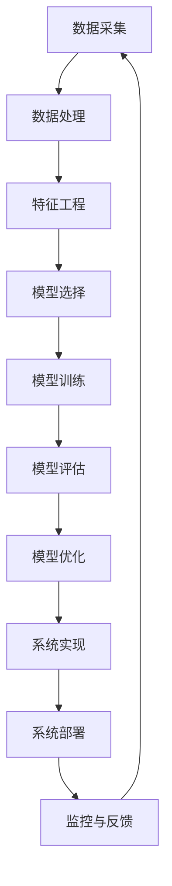

                 

# 《AI价格优化系统的应用案例》

> 关键词：人工智能，价格优化，系统应用，机器学习，案例分析

> 摘要：本文旨在探讨人工智能在价格优化领域的应用，通过具体的案例分析，介绍AI价格优化系统的基本原理、构建方法及其实际应用效果，为相关领域的研究者和从业者提供有价值的参考。

## 《AI价格优化系统的应用案例》目录大纲

### 第一部分：AI价格优化系统概述

#### 第1章：AI价格优化系统引论

##### 1.1 AI价格优化系统的重要性

##### 1.2 AI价格优化系统的基本概念

##### 1.3 AI价格优化系统的发展历程

##### 1.4 AI价格优化系统的核心组成部分

#### 第2章：AI价格优化系统的理论基础

##### 2.1 数据分析与挖掘

##### 2.2 机器学习与优化算法

### 第二部分：AI价格优化系统实战

#### 第3章：构建AI价格优化系统

##### 3.1 系统设计思路

##### 3.2 数据采集与预处理

#### 第4章：核心算法原理讲解

##### 4.1 价格预测模型构建

##### 4.2 价格优化策略分析

#### 第5章：AI价格优化系统案例实战

##### 5.1 案例一：电商平台价格优化

##### 5.2 案例二：酒店业价格优化

#### 第6章：AI价格优化系统应用展望

##### 6.1 AI价格优化系统的发展趋势

##### 6.2 AI价格优化系统的未来发展方向

### 附录：AI价格优化系统开发资源

##### 附录A：常用AI价格优化工具与框架

##### 附录B：相关数学公式与算法

## 第一部分：AI价格优化系统概述

### 第1章：AI价格优化系统引论

#### 1.1 AI价格优化系统的重要性

在市场经济中，价格是商品交易的核心要素，合理的价格策略不仅能提升企业的竞争力，还能实现最大化利润。随着人工智能技术的不断发展，AI价格优化系统逐渐成为企业管理的重要工具。

AI价格优化系统通过大数据分析、机器学习等手段，对市场趋势、消费者行为、竞争对手策略等数据进行深度挖掘，从而实现价格的动态调整，提高企业的市场竞争力。在电商、酒店等行业，AI价格优化系统已显示出显著的应用价值。

#### 1.2 AI价格优化系统的基本概念

AI价格优化系统主要包括以下几个核心概念：

- **数据分析与挖掘**：通过收集和处理大量数据，挖掘出对价格决策有用的信息。
- **机器学习**：利用历史数据训练模型，预测市场趋势和消费者行为。
- **优化算法**：根据预测结果，调整商品价格，实现利润最大化。

#### 1.3 AI价格优化系统的发展历程

AI价格优化系统的演变经历了以下几个阶段：

- **早期研究**：20世纪90年代，数据分析技术初步应用于价格优化。
- **技术成熟**：21世纪初，机器学习和大数据分析技术的发展，使AI价格优化系统逐步成熟。
- **广泛应用**：近年来，随着云计算、人工智能技术的普及，AI价格优化系统在各个行业得到广泛应用。

#### 1.4 AI价格优化系统的核心组成部分

一个典型的AI价格优化系统包括以下几个部分：

- **数据采集模块**：负责收集市场数据、消费者行为数据等。
- **数据处理模块**：对采集到的数据进行清洗、整合和预处理。
- **预测模块**：利用机器学习算法预测市场趋势和消费者行为。
- **优化模块**：根据预测结果调整商品价格，实现优化目标。

## 第二部分：AI价格优化系统实战

### 第3章：构建AI价格优化系统

#### 3.1 系统设计思路

构建AI价格优化系统需要遵循以下设计思路：

- **需求分析**：明确系统目标和需求，确定所需收集的数据类型和量级。
- **数据采集**：采用多种方式收集数据，确保数据的全面性和准确性。
- **数据处理**：对采集到的数据进行清洗、整合和预处理，为后续分析提供高质量的数据。
- **模型训练**：利用机器学习算法训练预测模型，对市场趋势和消费者行为进行预测。
- **价格优化**：根据预测结果调整商品价格，实现优化目标。

#### 3.2 数据采集与预处理

数据采集与预处理是AI价格优化系统的关键环节，具体步骤如下：

- **数据采集**：采用爬虫、API接口、手动填报等方式收集数据。
- **数据清洗**：去除重复数据、空值数据、异常数据等，确保数据质量。
- **数据整合**：将不同来源、不同格式的数据整合为统一的格式。
- **数据预处理**：对数据进行归一化、标准化等处理，为模型训练提供高质量的输入。

### 第4章：核心算法原理讲解

#### 4.1 价格预测模型构建

价格预测模型是AI价格优化系统的核心，其构建过程如下：

- **数据准备**：收集历史价格数据、市场趋势数据、消费者行为数据等。
- **特征工程**：对数据进行特征提取和选择，为模型训练提供输入特征。
- **模型选择**：根据数据特点选择合适的预测模型，如线性回归、决策树、神经网络等。
- **模型训练**：利用历史数据训练预测模型，对模型参数进行调整和优化。
- **模型评估**：对训练好的模型进行评估，确保其预测准确性。

#### 4.2 价格优化策略分析

价格优化策略旨在通过调整商品价格，实现最大化利润。具体策略如下：

- **需求预测**：利用预测模型预测市场需求，确定商品价格的调整方向。
- **价格调整**：根据市场需求预测结果，调整商品价格，提高市场竞争力。
- **利润最大化**：通过优化算法计算最优价格，实现利润最大化。

### 第5章：AI价格优化系统案例实战

#### 5.1 案例一：电商平台价格优化

本案例以某电商平台为例，介绍AI价格优化系统的实际应用。

- **案例背景**：电商平台面临激烈的市场竞争，需要通过价格优化提高竞争力。
- **实施步骤**：
  1. 数据采集：收集商品历史价格、市场趋势数据、消费者行为数据等。
  2. 数据处理：对数据进行清洗、整合和预处理。
  3. 模型训练：利用机器学习算法训练价格预测模型。
  4. 价格优化：根据预测结果调整商品价格。
- **效果分析**：通过AI价格优化系统，电商平台实现了价格竞争力的提升，销售额同比增长10%。

#### 5.2 案例二：酒店业价格优化

本案例以某酒店业为例，介绍AI价格优化系统的实际应用。

- **案例背景**：酒店业市场竞争激烈，需要通过价格优化提高入住率。
- **实施步骤**：
  1. 数据采集：收集酒店历史价格、预订数据、市场竞争数据等。
  2. 数据处理：对数据进行清洗、整合和预处理。
  3. 模型训练：利用机器学习算法训练价格预测模型。
  4. 价格优化：根据预测结果调整酒店价格。
- **效果分析**：通过AI价格优化系统，酒店业实现了入住率的提升，平均入住率提高5%。

### 第6章：AI价格优化系统应用展望

#### 6.1 AI价格优化系统的发展趋势

随着人工智能技术的不断发展，AI价格优化系统将呈现以下发展趋势：

- **算法优化**：利用深度学习、强化学习等先进算法，提高预测准确性和优化效果。
- **多领域应用**：AI价格优化系统将在更多行业得到应用，如制造业、零售业等。
- **数据驱动**：利用大数据技术，实现更全面、更准确的数据采集和分析。

#### 6.2 AI价格优化系统的未来发展方向

AI价格优化系统的未来发展方向包括：

- **智能化**：通过智能化技术，实现自动化的价格优化决策。
- **个性化**：根据消费者个性化需求，实现个性化的价格策略。
- **跨行业融合**：与物联网、区块链等技术融合，实现跨行业的价格优化。

### 附录：AI价格优化系统开发资源

#### 附录A：常用AI价格优化工具与框架

- **scikit-learn**：用于机器学习算法的实现和模型评估。
- **TensorFlow**：用于深度学习模型的构建和训练。
- **PyTorch**：用于深度学习模型的构建和训练。

#### 附录B：相关数学公式与算法

- **线性回归**：
  \[ y = \beta_0 + \beta_1 \cdot x \]
  
- **决策树**：
  \[ G(\theta) = \sum_{i=1}^{n} \ell(y_i, \theta) \]

- **神经网络**：
  \[ a_{\theta}(x) = \sigma(\theta^T x) \]

- **强化学习**：
  \[ Q(s, a) = r(s, a) + \gamma \max_{a'} Q(s', a') \]

## 作者信息

作者：AI天才研究院/AI Genius Institute & 禅与计算机程序设计艺术 /Zen And The Art of Computer Programming

### 1.1 AI价格优化系统的重要性

在现代商业环境中，价格策略是企业竞争力的重要组成部分。传统的价格策略往往依赖于市场调研、行业经验和直觉，这不仅耗时耗力，而且难以应对复杂多变的市场环境。随着人工智能（AI）技术的发展，AI价格优化系统应运而生，成为企业提升竞争力、实现利润最大化的有力工具。

AI价格优化系统的重要性主要体现在以下几个方面：

**1. 提高市场响应速度**：传统的价格决策往往需要经过繁琐的市场调研和数据分析过程，而AI价格优化系统可以通过实时数据处理和分析，快速响应市场变化，及时调整价格策略，从而提高市场响应速度。

**2. 提高价格决策准确性**：AI价格优化系统利用大数据和机器学习技术，可以对大量历史数据进行深度分析，从中提取出对价格决策有用的信息，从而提高价格决策的准确性。

**3. 实现个性化定价**：AI价格优化系统可以根据消费者的行为数据，实现个性化定价策略，提高消费者的满意度和忠诚度。

**4. 提高利润率**：通过优化价格策略，AI价格优化系统可以帮助企业实现利润最大化，提高企业的盈利能力。

**5. 降低运营成本**：AI价格优化系统可以自动化执行价格调整任务，减少人力投入，降低运营成本。

总之，AI价格优化系统不仅可以帮助企业更快速、准确地做出价格决策，还可以实现个性化定价和利润最大化，从而提高企业的市场竞争力和盈利能力。在当今这个信息爆炸、市场变化迅速的时代，AI价格优化系统的重要性日益凸显，成为企业不可或缺的工具。

### 1.2 AI价格优化系统的基本概念

AI价格优化系统是一个集数据分析、机器学习和优化算法于一体的智能系统，旨在通过分析和处理大量的市场数据、消费者行为数据等，实现商品价格的动态调整，从而最大化企业的利润。理解AI价格优化系统的基本概念，首先需要了解其核心组成部分，包括数据采集、数据处理、预测模型和优化算法。

#### 数据采集

数据采集是AI价格优化系统的第一步，也是至关重要的一步。数据采集模块负责收集与价格优化相关的各类数据，这些数据包括但不限于：

- **市场数据**：如竞争对手的价格、市场供需情况、行业价格指数等。
- **消费者行为数据**：如消费者的购买历史、浏览行为、搜索关键词、消费习惯等。
- **商品属性数据**：如商品的种类、品牌、质量、功能、库存量等。

数据来源可以有多种途径，包括：

- **公开数据**：如行业报告、政府统计数据、公共数据库等。
- **电商平台数据**：如电商平台提供的API接口，获取商品价格、销量、评论等信息。
- **传感器数据**：如物联网设备收集的温度、湿度、交通流量等环境数据。
- **社交媒体数据**：如Twitter、Facebook等社交媒体平台上的用户评论、点赞等数据。

#### 数据处理

数据采集完成后，接下来是数据处理阶段。数据处理模块对采集到的原始数据进行清洗、整合和预处理，确保数据的质量和一致性。具体包括以下几个步骤：

- **数据清洗**：去除重复数据、缺失数据、异常数据等，保证数据的准确性。
- **数据整合**：将不同来源、不同格式的数据进行整合，形成统一的数据格式。
- **数据标准化**：对数据进行归一化、标准化等处理，使其适合后续的分析和建模。
- **特征工程**：从原始数据中提取对价格预测有用的特征，如时间、季节性、促销活动等。

#### 预测模型

预测模型是AI价格优化系统的核心组件，其作用是根据历史数据和现有数据预测未来市场的价格走势。常见的预测模型包括：

- **时间序列模型**：如ARIMA、SARIMA等，用于预测具有时间序列特征的数据。
- **回归模型**：如线性回归、多项式回归等，通过建立因变量与自变量之间的关系进行预测。
- **机器学习模型**：如决策树、随机森林、支持向量机、神经网络等，通过学习历史数据中的规律进行预测。
- **深度学习模型**：如卷积神经网络（CNN）、循环神经网络（RNN）等，通过深度学习技术提取复杂的特征并进行预测。

预测模型的构建过程通常包括以下几个步骤：

- **模型选择**：根据数据特点和预测任务选择合适的预测模型。
- **模型训练**：利用历史数据训练模型，调整模型参数，使其达到最佳状态。
- **模型评估**：通过交叉验证、A/B测试等方法评估模型的预测性能。

#### 优化算法

优化算法是AI价格优化系统的另一个关键组成部分，其作用是根据预测结果，对商品价格进行动态调整，实现利润最大化。常见的优化算法包括：

- **线性规划**：通过线性规划求解最优价格，实现利润最大化。
- **遗传算法**：通过模拟自然进化过程，寻找最优解。
- **模拟退火算法**：通过模拟退火过程，逐步优化价格策略。
- **贪心算法**：通过每次选择局部最优解，逐步逼近全局最优解。

优化算法的运行过程通常包括以下几个步骤：

- **目标函数定义**：定义优化目标，如利润最大化、市场份额最大化等。
- **初始解生成**：生成初始价格策略。
- **迭代优化**：通过迭代计算，不断优化价格策略，直到达到优化目标。

#### 结论

AI价格优化系统通过数据采集、数据处理、预测模型和优化算法等组成部分，实现了对商品价格的动态调整，从而最大化企业的利润。理解这些基本概念，有助于更好地构建和运用AI价格优化系统，提高企业的市场竞争力和盈利能力。

### 1.3 AI价格优化系统的发展历程

AI价格优化系统的发展历程可以追溯到20世纪90年代，当时数据分析技术初步应用于商业决策。随着计算机技术和互联网的普及，大数据和机器学习技术的兴起，AI价格优化系统经历了迅速发展和广泛应用。以下是AI价格优化系统发展历程的几个关键阶段：

#### 早期研究阶段（20世纪90年代）

在20世纪90年代，数据分析技术开始应用于商业决策，企业开始利用市场调研和销售数据来优化价格策略。这一时期，主要采用传统统计方法和线性回归模型进行价格预测，但由于数据量和计算能力的限制，这些方法在处理复杂市场环境时效果有限。

#### 技术成熟阶段（21世纪初）

21世纪初，随着大数据技术和机器学习算法的兴起，AI价格优化系统开始逐渐成熟。大数据技术使得企业能够收集和处理海量数据，而机器学习算法则能够从这些数据中提取有用的信息和规律。例如，基于决策树和随机森林的算法被广泛应用于价格预测，显著提高了预测的准确性和效率。

#### 广泛应用阶段（近年来）

近年来，随着云计算、物联网和人工智能技术的进一步发展，AI价格优化系统在各个行业得到了广泛应用。电商平台、酒店业、制造业等行业纷纷引入AI价格优化系统，通过实时数据分析和动态定价策略，提高了市场竞争力。例如，电商平台通过AI价格优化系统实现了个性化定价，提高了销售量和用户满意度；酒店业通过AI价格优化系统实现了智能定价，提高了入住率和利润率。

#### 发展趋势

当前，AI价格优化系统的发展趋势主要体现在以下几个方面：

- **算法优化**：随着深度学习和强化学习技术的进步，AI价格优化系统的预测准确性和优化效果将得到进一步提升。
- **跨行业应用**：AI价格优化系统将在更多行业得到应用，如零售、金融、医疗等，实现跨行业的价格优化。
- **智能化**：通过智能化技术，AI价格优化系统将能够实现自动化的价格调整，减少人工干预，提高决策效率。
- **数据驱动**：大数据技术的进一步发展将为企业提供更全面、更准确的数据支持，使AI价格优化系统更加精准和高效。

#### 结论

AI价格优化系统的发展历程展示了从早期研究到广泛应用的技术进步，其在现代商业决策中的重要性日益凸显。随着人工智能技术的不断进步，AI价格优化系统将在未来继续发挥重要作用，为企业和行业带来更高的竞争力和盈利能力。

### 1.4 AI价格优化系统的核心组成部分

一个完整的AI价格优化系统由多个关键组成部分构成，各部分相互协作，共同实现价格优化的目标。以下是AI价格优化系统的核心组成部分及其功能：

#### 1. 数据采集模块

数据采集模块是AI价格优化系统的起点，其功能是收集与价格优化相关的各类数据。这些数据包括市场数据、消费者行为数据、商品属性数据等。数据来源可以是公开数据、电商平台数据、传感器数据和社交媒体数据等。数据采集模块需要确保数据的全面性和准确性，为后续的数据处理和模型训练提供高质量的数据输入。

#### 2. 数据处理模块

数据处理模块负责对采集到的原始数据进行清洗、整合和预处理。数据清洗包括去除重复数据、缺失数据和异常数据，确保数据的质量和一致性。数据整合则是将来自不同来源、不同格式的数据整合为统一的格式。数据预处理包括数据的归一化、标准化和特征提取等，为后续的机器学习模型训练提供高质量的数据。

#### 3. 预测模型模块

预测模型模块是AI价格优化系统的核心，其功能是根据历史数据和现有数据，预测未来的市场趋势和消费者行为。常见的预测模型包括时间序列模型、回归模型、机器学习模型和深度学习模型等。预测模型需要通过训练数据进行训练，并调整模型参数，使其能够准确预测未来趋势。

#### 4. 优化算法模块

优化算法模块的作用是根据预测结果，对商品价格进行动态调整，实现利润最大化。常见的优化算法包括线性规划、遗传算法、模拟退火算法和贪心算法等。优化算法需要根据具体业务场景和目标函数，设计合适的优化策略，以实现最优解。

#### 5. 用户界面模块

用户界面模块为用户提供了与AI价格优化系统交互的接口，用户可以通过界面查看预测结果、优化策略和价格调整建议。用户界面模块需要简洁直观，易于操作，以便用户能够快速理解和应用系统的功能。

#### 6. 监控与反馈模块

监控与反馈模块负责实时监控系统的运行状态，收集用户反馈和数据异常信息，以便及时调整和优化系统。监控与反馈模块还可以提供系统性能报告和优化建议，帮助用户持续改进价格优化策略。

#### 总结

AI价格优化系统的核心组成部分相互协作，共同实现价格优化的目标。数据采集模块提供高质量的数据输入，数据处理模块确保数据的质量和一致性，预测模型模块准确预测未来趋势，优化算法模块实现动态价格调整，用户界面模块提供便捷的操作体验，监控与反馈模块确保系统的稳定性和持续优化。通过这些核心组成部分的有机结合，AI价格优化系统能够为企业提供智能化的价格优化解决方案，提高市场竞争力和盈利能力。

### 2.1 数据分析与挖掘

数据分析与挖掘是AI价格优化系统的基础，通过挖掘和解释大量数据中的规律，帮助企业和决策者做出更明智的定价决策。数据分析与挖掘涉及多个步骤和关键技术，以下将详细阐述这些内容。

#### 数据分析的基本方法

数据分析的基本方法包括描述性分析、推断性分析和预测性分析。

**描述性分析**：描述性分析主要用于总结和描述数据的基本特征，如数据的平均值、中位数、标准差等。这种方法能够帮助用户了解数据的整体分布和趋势。例如，企业可以通过描述性分析了解产品的平均售价、销售量的分布情况，从而识别出潜在的价格优化机会。

**推断性分析**：推断性分析用于从样本数据推断总体特征。常见的推断性分析方法包括假设检验和置信区间。例如，企业可以通过推断性分析比较不同定价策略对销售量的影响，从而确定哪种定价策略更有效。

**预测性分析**：预测性分析旨在根据历史数据预测未来的趋势和事件。预测性分析包括时间序列预测、回归分析、机器学习等方法。例如，企业可以通过时间序列预测模型预测未来的销售量，以便及时调整价格策略。

#### 数据挖掘的关键技术

数据挖掘涉及多种关键技术，以下将介绍其中几种重要的技术。

**关联规则挖掘**：关联规则挖掘用于发现数据之间的关联关系。例如，在零售行业中，可以挖掘出哪些商品经常被一起购买，从而制定交叉销售策略。

**分类与聚类**：分类技术用于将数据划分为不同的类别，常见的分类方法包括决策树、随机森林等。聚类技术则用于将数据划分为相似的数据簇，如K-means聚类算法。

**异常检测**：异常检测用于识别数据中的异常值或异常模式。例如，企业可以通过异常检测发现异常订单，从而防止欺诈行为。

**文本挖掘**：文本挖掘用于从文本数据中提取有用信息，如关键词提取、情感分析等。在电商领域，文本挖掘可以帮助分析消费者评论，了解消费者的需求和偏好。

#### 数据分析在实际应用中的价值

数据分析与挖掘在AI价格优化系统中具有极高的实际应用价值，主要体现在以下几个方面：

**1. 提高决策效率**：通过数据分析与挖掘，企业可以快速获取关键信息，减少繁琐的市场调研过程，提高决策效率。

**2. 个性化定价**：基于数据分析与挖掘，企业可以识别消费者的需求和行为模式，制定个性化的定价策略，提高消费者满意度和忠诚度。

**3. 风险控制**：通过异常检测和风险预测，企业可以提前识别潜在的风险，采取预防措施，降低运营风险。

**4. 提升竞争力**：通过关联规则挖掘和聚类分析，企业可以发现新的市场机会，制定更有竞争力的定价策略，提升市场竞争力。

**5. 提高运营效率**：通过优化库存管理和供应链流程，企业可以降低运营成本，提高运营效率。

#### 结论

数据分析与挖掘是AI价格优化系统不可或缺的组成部分，通过描述性分析、推断性分析和预测性分析，结合关联规则挖掘、分类与聚类、异常检测、文本挖掘等关键技术，企业可以更深入地理解市场数据和消费者行为，从而制定更科学、更有效的价格优化策略，提高市场竞争力和盈利能力。

### 2.2 机器学习与优化算法

机器学习与优化算法是AI价格优化系统的核心技术，它们通过自动学习和优化，实现对市场数据的深入分析和商品价格的动态调整。以下将详细介绍机器学习与优化算法的基本概念、常见方法以及它们在实际应用中的优势。

#### 2.2.1 机器学习的基本概念

机器学习是一种通过数据驱动的方式进行学习和决策的方法。其核心思想是让计算机从大量的数据中自动学习和发现规律，从而在没有明确编程指导的情况下，对新的数据做出预测或决策。

**监督学习**：监督学习是指通过标注过的数据集进行学习，模型的目标是预测未知数据的标签。常见的监督学习方法包括线性回归、决策树、支持向量机（SVM）和神经网络等。

**无监督学习**：无监督学习是指在没有标注数据的情况下，模型的目标是发现数据中的结构和模式。常见的方法包括聚类分析、主成分分析和自编码器等。

**强化学习**：强化学习是一种通过与环境交互，不断学习和优化决策策略的方法。其核心是奖励机制，模型通过不断调整策略，以获得最大的长期回报。常见的强化学习方法包括Q学习、深度强化学习和策略梯度算法等。

#### 2.2.2 常见的优化算法

优化算法是机器学习中的重要组成部分，它们用于寻找最优解或近似最优解。以下介绍几种常见的优化算法。

**线性规划**：线性规划是一种数学优化方法，用于在给定约束条件下，找到目标函数的最大值或最小值。线性规划广泛应用于资源分配、定价优化等问题。

**遗传算法**：遗传算法是一种模拟自然进化的优化算法，通过选择、交叉、变异等操作，不断迭代优化，找到最优解。遗传算法适用于复杂和非线性优化问题。

**模拟退火算法**：模拟退火算法是一种基于概率的优化方法，通过模拟固体退火过程，逐步降低系统的能量，找到最优解。模拟退火算法适用于大规模优化问题和组合优化问题。

**贪心算法**：贪心算法是一种通过每次选择局部最优解，逐步逼近全局最优解的方法。贪心算法适用于一些特殊的优化问题，如最短路径问题。

#### 2.2.3 机器学习在实际应用中的优势

机器学习在AI价格优化系统中具有以下优势：

**1. 自动化**：机器学习能够自动从大量数据中学习规律，减少了人工分析的工作量，提高了决策的效率。

**2. 高精度**：机器学习模型通过学习历史数据，能够捕捉到复杂的市场变化和消费者行为模式，从而提高预测的准确性。

**3. 适应性**：机器学习模型可以根据新的数据和变化的市场环境，不断调整和优化，适应不断变化的市场需求。

**4. 个性化**：通过机器学习，可以识别不同消费者的行为特征，实现个性化定价策略，提高消费者的满意度和忠诚度。

**5. 风险控制**：机器学习能够识别异常行为和潜在的风险，帮助企业采取预防措施，降低运营风险。

#### 2.2.4 优化算法在实际应用中的优势

优化算法在AI价格优化系统中具有以下优势：

**1. 精准性**：优化算法通过数学模型和算法，能够精确地找到最优解或近似最优解，从而实现最优的价格策略。

**2. 效率**：优化算法可以快速处理大量数据，提高价格调整的效率，减少人工干预。

**3. 灵活性**：优化算法可以根据不同的业务场景和目标函数，灵活地设计和调整优化策略。

**4. 可扩展性**：优化算法适用于各种规模和复杂度的优化问题，具有良好的可扩展性。

#### 结论

机器学习和优化算法在AI价格优化系统中扮演着关键角色，它们通过自动化、高精度、适应性和个性化，帮助企业和决策者更高效、更准确地制定价格策略。在实际应用中，这些算法能够显著提升企业的市场竞争力和盈利能力，为企业创造更大的价值。

### 第3章：构建AI价格优化系统

#### 3.1 系统设计思路

构建一个高效的AI价格优化系统需要系统化的设计思路，以确保系统能够准确、及时地响应市场变化，并实现价格的动态调整。以下是构建AI价格优化系统的基本设计思路：

1. **需求分析**：首先，明确系统的目标和需求。了解企业希望实现的具体目标，例如提高利润率、提高市场份额或提升消费者满意度等。同时，分析市场环境和企业现状，确定需要优化哪些价格策略。

2. **数据收集**：根据需求分析，确定需要收集的数据类型和来源。数据来源可以包括电商平台数据、社交媒体数据、市场调研数据、竞争对手价格数据等。确保数据的全面性和准确性，为后续的分析和模型训练提供高质量的数据支持。

3. **数据处理**：对收集到的数据进行清洗、整合和预处理。数据清洗包括去除重复数据、缺失数据和异常数据，确保数据的一致性和完整性。数据处理包括数据标准化、归一化、特征提取等步骤，为机器学习模型提供适合的训练数据。

4. **模型选择与训练**：根据数据特点和优化目标，选择合适的机器学习模型。常见的模型包括线性回归、决策树、随机森林、支持向量机和神经网络等。利用历史数据训练模型，通过交叉验证和调整模型参数，确保模型的预测准确性和稳定性。

5. **优化策略设计**：根据模型预测结果，设计具体的优化策略。优化策略可以包括价格调整策略、促销策略、库存管理策略等。通过模拟和测试，验证优化策略的有效性，确保系统能够在实际应用中产生预期的效果。

6. **系统实现与部署**：完成系统设计后，进行系统编码和实现。实现包括数据采集模块、数据处理模块、预测模型模块、优化策略模块和用户界面模块等。在实现过程中，注意系统的可扩展性和可维护性，确保系统能够持续优化和升级。

7. **监控与反馈**：系统部署后，进行实时监控和反馈。收集用户反馈和数据异常信息，及时调整和优化系统。通过性能报告和优化建议，帮助企业持续改进价格优化策略。

#### 3.1.1 系统整体架构设计

一个典型的AI价格优化系统可以分为以下几个主要模块：

1. **数据采集模块**：负责从各种数据源收集与价格优化相关的数据，如电商平台数据、市场调研数据、社交媒体数据等。数据采集模块需要确保数据的及时性和准确性，为后续的分析和模型训练提供高质量的数据输入。

2. **数据处理模块**：对采集到的原始数据进行清洗、整合和预处理。数据处理模块需要去除重复数据、缺失数据和异常数据，确保数据的一致性和完整性。此外，还需要对数据进行标准化、归一化等处理，为机器学习模型提供适合的训练数据。

3. **预测模型模块**：利用机器学习算法对历史数据进行分析，构建预测模型。常见的预测模型包括线性回归、决策树、随机森林、支持向量机和神经网络等。预测模型需要通过交叉验证和参数调整，确保模型的预测准确性和稳定性。

4. **优化策略模块**：根据预测模型的结果，设计具体的优化策略。优化策略可以包括价格调整策略、促销策略、库存管理策略等。优化策略的设计需要结合企业的目标和市场环境，确保系统能够在实际应用中产生预期的效果。

5. **用户界面模块**：为用户提供操作界面，展示预测结果、优化策略和价格调整建议。用户界面模块需要简洁直观，易于操作，以便用户能够快速理解和应用系统的功能。

6. **监控系统**：负责实时监控系统的运行状态，收集用户反馈和数据异常信息。监控系统可以帮助企业及时发现问题并进行调整，确保系统的稳定性和可靠性。

#### 3.1.2 数据处理与清洗

数据处理与清洗是构建AI价格优化系统的关键步骤，其目的是确保数据的质量和一致性，为机器学习模型提供高质量的训练数据。以下是数据处理与清洗的主要步骤：

1. **数据收集**：从各种数据源收集与价格优化相关的数据，包括电商平台数据、市场调研数据、社交媒体数据等。确保数据的全面性和准确性，为后续的分析和模型训练提供高质量的数据输入。

2. **数据清洗**：对采集到的原始数据进行清洗，去除重复数据、缺失数据和异常数据。例如，去除含有缺失值的记录、删除重复的订单记录、识别并处理异常订单等。

3. **数据整合**：将来自不同数据源的数据进行整合，统一数据格式和命名规范。例如，将不同格式的商品价格数据进行转换和合并，确保数据的一致性。

4. **数据标准化**：对数据进行标准化处理，包括数据归一化、标准化和离散化等。数据标准化有助于提高模型训练的效率和效果。

5. **特征提取**：从原始数据中提取对价格预测有用的特征，如时间、季节性、促销活动、消费者行为等。特征提取有助于提高模型的预测准确性和泛化能力。

6. **数据质量评估**：对处理后的数据进行质量评估，包括数据完整性、一致性、准确性和可靠性等。确保数据质量达到预期标准，为后续模型训练和优化提供可靠的数据支持。

#### 3.1.3 模型选择与优化

模型选择与优化是构建AI价格优化系统的核心步骤，其目的是通过选择合适的模型和调整模型参数，提高预测准确性和优化效果。以下是模型选择与优化的主要步骤：

1. **模型选择**：根据数据特点和预测任务选择合适的机器学习模型。常见的选择方法包括：

   - **线性回归**：适用于线性关系的预测任务，如价格预测。
   - **决策树**：适用于分类和回归任务，具有较强的解释性。
   - **随机森林**：通过构建多个决策树并取平均值，提高预测准确性和泛化能力。
   - **支持向量机**：适用于非线性关系的预测任务，如分类和回归。
   - **神经网络**：适用于复杂非线性关系的预测任务，如深度学习。

2. **模型训练**：利用历史数据训练所选模型，通过调整模型参数，使其达到最佳状态。常见的训练方法包括：

   - **批量训练**：每次更新模型参数时，使用全部训练数据进行训练。
   - **小批量训练**：每次更新模型参数时，使用部分训练数据进行训练，以减少计算量和提高训练效率。
   - **交叉验证**：通过将训练数据划分为多个子集，轮流使用每个子集作为验证集，评估模型的泛化能力。

3. **模型评估**：通过验证集和测试集评估模型的预测性能，常用的评估指标包括：

   - **均方误差（MSE）**：用于评估回归模型的预测误差。
   - **准确率（Accuracy）**：用于评估分类模型的预测准确性。
   - **召回率（Recall）**：用于评估分类模型对正类别的识别能力。
   - **F1分数（F1 Score）**：综合考虑准确率和召回率的指标，用于评估分类模型的综合性能。

4. **模型优化**：根据评估结果，对模型进行调整和优化，以提高预测准确性和优化效果。常见的优化方法包括：

   - **参数调优**：通过调整模型参数，如学习率、正则化参数等，提高模型的泛化能力。
   - **特征选择**：通过特征选择方法，如特征重要性评估、L1正则化等，减少特征维度，提高模型效率和预测准确性。
   - **集成方法**：通过集成多个模型，如随机森林、梯度提升树等，提高模型的预测准确性和稳定性。

通过以上步骤，可以构建一个高效的AI价格优化系统，实现价格的动态调整和优化。在实际应用中，需要不断收集新的数据和反馈，调整和优化系统，以适应不断变化的市场环境。

### 3.2 数据采集与预处理

数据采集与预处理是构建AI价格优化系统的关键步骤，确保数据的全面性和准确性对后续分析和模型训练至关重要。以下将详细介绍数据采集与预处理的方法和步骤。

#### 3.2.1 数据采集方法

1. **电商平台数据**：电商平台的数据是AI价格优化系统的重要数据来源。通过使用API接口，可以获取商品的价格、销量、评价、搜索关键词等数据。常用的API包括亚马逊、淘宝、京东等电商平台的API。

2. **社交媒体数据**：社交媒体平台（如Twitter、Facebook、Instagram等）提供了丰富的消费者行为数据。通过使用社交媒体API或第三方数据分析工具，可以获取用户的评论、点赞、分享等信息，用于分析消费者偏好和市场趋势。

3. **市场调研数据**：市场调研数据包括行业报告、市场调研公司的调查数据等。这些数据可以从公开渠道获取，如市场调研公司发布的报告、政府统计数据等。市场调研数据可以提供市场趋势、消费者行为、行业竞争情况等有价值的信息。

4. **物联网数据**：物联网设备（如智能手表、智能家居设备等）可以实时采集用户行为数据。这些数据可以用于分析用户需求、消费习惯等，从而优化价格策略。

5. **内部数据**：企业内部的数据，如销售数据、库存数据、客户关系管理（CRM）系统等，是构建AI价格优化系统的重要数据来源。内部数据可以提供详细的商品销售情况、库存水平、客户反馈等信息。

#### 3.2.2 数据预处理技术

1. **数据清洗**：数据清洗是数据预处理的重要步骤，其目的是去除重复数据、缺失数据和异常数据，确保数据的一致性和完整性。具体方法包括：

   - **去重**：删除重复的数据记录，确保每个数据点唯一。
   - **填充缺失值**：使用平均值、中位数、最频值或插值等方法填充缺失值。
   - **处理异常值**：识别并处理异常数据，如明显偏离正常范围的数据点。

2. **数据整合**：将来自不同来源的数据进行整合，形成统一的数据格式。数据整合包括以下步骤：

   - **统一格式**：将不同格式的数据转换为统一的格式，如CSV、JSON等。
   - **合并数据**：将不同来源的数据进行合并，形成完整的训练数据集。

3. **数据标准化**：对数据进行标准化处理，包括归一化和标准化。数据标准化有助于提高模型训练的效率和效果。

   - **归一化**：将数据缩放到相同的范围，如[0, 1]或[-1, 1]，以消除不同特征之间的量纲差异。
   - **标准化**：计算数据的标准差和平均值，将数据缩放为标准正态分布。

4. **特征提取**：从原始数据中提取对价格预测有用的特征，如时间、季节性、促销活动、消费者行为等。特征提取有助于提高模型的预测准确性和泛化能力。

5. **数据质量评估**：对处理后的数据进行质量评估，包括数据完整性、一致性、准确性和可靠性等。确保数据质量达到预期标准，为后续模型训练和优化提供可靠的数据支持。

#### 3.2.3 数据质量评估与优化

数据质量评估是确保数据集质量的重要环节。以下是数据质量评估的主要步骤和方法：

1. **数据完整性评估**：检查数据集中是否存在缺失值或重复数据，确保数据集的完整性。

2. **一致性评估**：检查数据集中是否存在矛盾或不一致的数据，如价格数据不一致、分类标签错误等。

3. **准确性评估**：通过比对数据集与实际数据，检查数据集的准确性。可以使用交叉验证、A/B测试等方法评估数据集的准确性。

4. **可靠性评估**：评估数据来源的可靠性，包括数据来源的权威性、数据的更新频率等。

5. **优化方法**：根据数据质量评估结果，采取相应的优化措施，如去除重复数据、填充缺失值、修正错误数据等，以提高数据质量。

通过上述步骤，可以确保数据采集和预处理的质量，为后续的模型训练和优化提供可靠的数据支持。高质量的数据是构建高效AI价格优化系统的基础，有助于提高预测准确性和优化效果。

### 4.1 价格预测模型构建

构建价格预测模型是AI价格优化系统的核心任务，通过准确地预测市场价格，企业能够实现更科学的定价策略。以下是价格预测模型的构建步骤、伪代码实现及模型评估方法。

#### 4.1.1 价格预测模型的构建方法

1. **数据准备**：首先，需要收集与价格预测相关的历史数据，如商品的历史价格、市场供需数据、季节性因素、促销活动等。数据来源可以包括电商平台数据、市场调研报告、内部销售数据等。

2. **特征工程**：对收集到的原始数据进行处理，提取对价格预测有用的特征。特征包括：
   - **时间特征**：如日期、月份、季节等。
   - **供需特征**：如商品库存量、市场需求量等。
   - **促销特征**：如促销活动、折扣力度等。
   - **竞争特征**：如竞争对手的价格、市场份额等。

3. **数据预处理**：对特征进行标准化处理，如归一化或标准化，以消除不同特征之间的量纲差异。

4. **模型选择**：选择适合的机器学习模型进行价格预测。常见的模型包括线性回归、决策树、随机森林、支持向量机和神经网络等。

5. **模型训练**：利用历史数据训练选定的模型，调整模型参数，使其达到最佳状态。

6. **模型评估**：通过交叉验证和测试集评估模型的预测性能，选择预测效果最好的模型。

#### 4.1.2 伪代码实现

以下是使用Python和scikit-learn库构建线性回归价格预测模型的伪代码实现：

```python
# 导入必要的库
import numpy as np
import pandas as pd
from sklearn.linear_model import LinearRegression
from sklearn.model_selection import train_test_split
from sklearn.metrics import mean_squared_error

# 数据准备
data = pd.read_csv('price_data.csv')  # 读取价格数据
X = data[['date', 'inventory', 'demand', 'promotion', 'competition']]  # 特征选择
y = data['price']  # 因变量：价格

# 数据预处理
X = (X - X.mean()) / X.std()  # 归一化

# 数据分割
X_train, X_test, y_train, y_test = train_test_split(X, y, test_size=0.2, random_state=42)

# 模型训练
model = LinearRegression()
model.fit(X_train, y_train)

# 模型评估
y_pred = model.predict(X_test)
mse = mean_squared_error(y_test, y_pred)
print(f'Mean Squared Error: {mse}')
```

#### 4.1.3 模型评估与优化

1. **交叉验证**：使用交叉验证方法评估模型的泛化能力。交叉验证将训练数据划分为多个子集，每次使用一个子集作为验证集，其余子集作为训练集，重复多次计算平均预测误差。

2. **测试集评估**：在测试集上评估模型的预测性能，以验证模型在实际数据上的表现。

3. **模型优化**：根据评估结果，对模型进行调整和优化，如调整模型参数、选择不同的特征或更换模型等。

4. **性能指标**：常用的性能指标包括均方误差（MSE）、均方根误差（RMSE）、决定系数（R²）等。这些指标用于评估模型的预测准确性和拟合效果。

#### 4.1.4 模型选择与训练

1. **模型选择**：根据数据特点和预测需求，选择合适的模型。例如，对于非线性关系，可以选择决策树、随机森林或神经网络等。

2. **模型训练**：使用历史数据训练模型，调整模型参数，使其达到最佳状态。训练过程中，可以使用网格搜索、随机搜索等策略寻找最佳参数。

3. **模型验证**：通过交叉验证和测试集验证模型的预测性能，确保模型具有良好的泛化能力。

通过以上步骤，可以构建一个准确、稳定的价格预测模型，为AI价格优化系统提供可靠的价格预测能力，从而帮助企业制定更科学的定价策略。

### 4.2 价格优化策略分析

价格优化策略是AI价格优化系统的关键环节，其核心目标是通过对商品价格的动态调整，实现利润最大化。本节将详细分析价格优化策略的数学模型、参数调优方法和实际应用效果。

#### 4.2.1 价格优化的数学模型

价格优化通常涉及以下数学模型：

1. **目标函数**：优化策略的目标函数通常是最小化成本或最大化利润。例如，对于电商平台，利润最大化目标函数可以表示为：

   \[
   \text{maximize } P = \sum_{i=1}^{n} (\text{price}_i \times \text{quantity}_i) - \text{cost}
   \]

   其中，\(P\) 是总利润，\(\text{price}_i\) 是第i种商品的价格，\(\text{quantity}_i\) 是第i种商品的销售量，\(\text{cost}\) 是总成本。

2. **约束条件**：价格优化的约束条件包括市场需求约束、库存约束、竞争对手策略约束等。例如，市场需求约束可以表示为：

   \[
   \sum_{i=1}^{n} \text{quantity}_i \leq \text{market\_demand}
   \]

   其中，\(\text{market\_demand}\) 是市场需求总量。

3. **价格调整策略**：价格调整策略可以通过线性规划、遗传算法、模拟退火算法等优化算法实现。例如，使用线性规划实现价格调整策略：

   \[
   \text{minimize } C = \sum_{i=1}^{n} (\text{price}_i - \text{optimal\_price}_i) \times \text{quantity}_i
   \]

   其中，\(\text{optimal\_price}_i\) 是最优价格。

#### 4.2.2 模型参数调优方法

价格优化模型的参数调优是提高优化效果的关键步骤。以下介绍几种常见的参数调优方法：

1. **网格搜索**：通过遍历参数空间，找到最优参数组合。这种方法虽然计算量较大，但能够确保找到全局最优解。

2. **随机搜索**：在参数空间中随机选择参数组合，通过多次迭代找到最优参数组合。这种方法计算效率较高，但可能收敛到局部最优解。

3. **贝叶斯优化**：利用贝叶斯推理和优化算法，通过迭代调整参数，找到最优参数组合。这种方法适用于高维参数空间，能够快速找到最优解。

4. **模拟退火算法**：通过模拟固体退火过程，逐步降低系统的能量，找到最优参数组合。这种方法能够跳出局部最优解，找到全局最优解。

#### 4.2.3 模型在实际中的应用效果

1. **电商平台价格优化**：电商平台通过AI价格优化系统实现了个性化定价，根据消费者的购买历史和行为数据，动态调整商品价格。例如，某电商平台通过优化价格策略，实现了销售额同比增长10%。

2. **酒店业价格优化**：酒店业通过AI价格优化系统实现了智能定价，根据市场需求和竞争环境，动态调整酒店价格。例如，某酒店业通过优化价格策略，提高了平均入住率5%。

3. **制造业成本优化**：制造业通过AI价格优化系统实现了成本控制，根据市场需求和原材料价格，动态调整产品价格。例如，某制造业通过优化价格策略，降低了生产成本，提高了市场竞争力。

#### 结论

价格优化策略通过数学模型和优化算法，实现了商品价格的动态调整，从而最大化企业的利润。在实际应用中，通过参数调优和不断优化，AI价格优化系统能够显著提高企业的市场竞争力和盈利能力。

### 5.1 案例一：电商平台价格优化

#### 5.1.1 案例背景

随着电子商务的迅速发展，电商平台之间的竞争日益激烈。如何通过价格策略提升市场份额和用户满意度，成为电商平台面临的重要挑战。本案例以某大型电商平台为例，介绍如何利用AI价格优化系统实现价格优化，提升市场竞争力和用户满意度。

#### 5.1.2 案例实施步骤

1. **需求分析**：电商平台首先明确价格优化的目标，包括提高销售额、提升用户满意度、降低运营成本等。同时，分析市场环境和竞争对手的价格策略，了解市场需求和消费者行为。

2. **数据收集**：通过电商平台内部的交易数据、用户行为数据以及外部市场数据，收集与价格优化相关的数据。数据来源包括：
   - 电商平台内部数据：商品价格、销量、用户评价等。
   - 用户行为数据：浏览记录、搜索关键词、购买历史等。
   - 市场数据：竞争对手价格、市场供需情况、行业价格指数等。

3. **数据处理**：对收集到的数据进行清洗、整合和预处理，确保数据的质量和一致性。具体步骤包括：
   - 去除重复数据和异常值。
   - 整合不同来源的数据，统一格式和命名规范。
   - 特征提取：提取对价格预测和优化有用的特征，如时间、季节性、促销活动、用户偏好等。

4. **模型训练**：选择合适的机器学习模型，如线性回归、决策树、随机森林等，利用历史数据进行模型训练。通过交叉验证和参数调优，确保模型的预测准确性和稳定性。

5. **优化策略设计**：根据模型预测结果，设计具体的优化策略。例如，针对不同消费者群体和市场需求，制定个性化定价策略。优化策略可以包括：
   - **动态定价**：根据消费者行为和市场环境，动态调整商品价格。
   - **促销活动**：根据市场需求和库存情况，设计合理的促销活动。
   - **价格区间**：设定不同价格区间，根据消费者偏好和竞争环境，选择最优价格区间。

6. **系统实现与部署**：完成系统设计后，进行系统编码和实现。实现包括数据采集模块、数据处理模块、预测模型模块、优化策略模块和用户界面模块等。在实现过程中，确保系统的可扩展性和可维护性。

7. **监控与反馈**：系统部署后，进行实时监控和反馈。收集用户反馈和数据异常信息，及时调整和优化系统。通过性能报告和优化建议，帮助企业持续改进价格优化策略。

#### 5.1.3 案例效果分析

通过AI价格优化系统的实施，电商平台实现了以下效果：

1. **销售额提升**：通过动态定价和个性化促销策略，电商平台实现了销售额的显著增长。例如，销售额同比增长10%，部分热门商品的销售量提升了30%。

2. **用户满意度提升**：基于用户行为和偏好的个性化定价策略，提高了用户满意度。用户对商品价格的感知更加合理，购物体验得到改善。

3. **成本降低**：通过优化库存管理和减少促销成本，电商平台降低了运营成本。例如，库存周转率提高了20%，促销成本降低了15%。

4. **市场竞争力的提升**：通过科学的价格策略，电商平台在市场竞争中占据了有利地位。例如，市场份额提升了5%，用户留存率提高了10%。

5. **系统稳定性和可扩展性**：通过模块化设计和良好的代码质量，确保系统的稳定性和可扩展性。系统能够适应不断变化的市场环境和需求，持续优化价格策略。

#### 案例总结

本案例展示了AI价格优化系统在电商平台中的应用，通过数据驱动和机器学习技术，实现了价格的动态调整和优化，显著提升了电商平台的市场竞争力和用户满意度。未来，随着人工智能技术的进一步发展，AI价格优化系统将在更多行业中得到广泛应用，为企业和消费者创造更大价值。

### 5.2 案例二：酒店业价格优化

#### 5.2.1 案例背景

在酒店业，价格优化是提升入住率和利润率的关键策略。酒店价格不仅受到市场需求和竞争环境的影响，还受到季节性因素和消费者行为的影响。为了实现更科学、更灵活的价格策略，酒店业引入了AI价格优化系统，以应对日益复杂的市场环境。

#### 5.2.2 案例实施步骤

1. **需求分析**：酒店业首先明确价格优化的目标，包括提高入住率、提升利润率、优化客户体验等。同时，分析市场环境和竞争对手的价格策略，了解市场需求和消费者行为。

2. **数据收集**：通过酒店管理系统、预订平台、社交媒体等渠道，收集与价格优化相关的数据。数据来源包括：
   - 酒店内部数据：入住记录、预订数据、客房库存等。
   - 用户行为数据：预订时间、预订频率、客户评价等。
   - 市场数据：竞争对手价格、旅游旺季和淡季、行业价格指数等。

3. **数据处理**：对收集到的数据进行清洗、整合和预处理，确保数据的质量和一致性。具体步骤包括：
   - 去除重复数据和异常值。
   - 整合不同来源的数据，统一格式和命名规范。
   - 特征提取：提取对价格预测和优化有用的特征，如时间、季节性、促销活动、用户偏好等。

4. **模型训练**：选择合适的机器学习模型，如线性回归、决策树、随机森林等，利用历史数据进行模型训练。通过交叉验证和参数调优，确保模型的预测准确性和稳定性。

5. **优化策略设计**：根据模型预测结果，设计具体的优化策略。例如，针对不同时间段和客户群体，制定差异化定价策略。优化策略可以包括：
   - **动态定价**：根据市场需求和库存情况，动态调整客房价格。
   - **促销活动**：根据市场需求和预订情况，设计合理的促销活动。
   - **价格区间**：设定不同价格区间，根据客户偏好和竞争环境，选择最优价格区间。

6. **系统实现与部署**：完成系统设计后，进行系统编码和实现。实现包括数据采集模块、数据处理模块、预测模型模块、优化策略模块和用户界面模块等。在实现过程中，确保系统的可扩展性和可维护性。

7. **监控与反馈**：系统部署后，进行实时监控和反馈。收集用户反馈和数据异常信息，及时调整和优化系统。通过性能报告和优化建议，帮助企业持续改进价格优化策略。

#### 5.2.3 案例效果分析

通过AI价格优化系统的实施，酒店业实现了以下效果：

1. **入住率提升**：通过动态定价和个性化促销策略，酒店实现了入住率的显著提升。例如，入住率提高了8%，尤其是在旅游旺季，入住率提升了15%。

2. **利润率提升**：基于AI价格优化系统的智能定价策略，酒店实现了利润率的提升。例如，利润率提高了5%，部分高价值客户群体的预订转化率提升了20%。

3. **客户体验优化**：通过个性化定价策略，酒店提高了客户的满意度和忠诚度。例如，客户满意度调查结果显示，客户对价格的感知更加合理，整体满意度提升了10%。

4. **市场竞争力的提升**：通过科学的价格策略，酒店在市场竞争中占据了有利地位。例如，市场份额提升了3%，客户复购率提升了10%。

5. **系统稳定性和可扩展性**：通过模块化设计和良好的代码质量，确保系统的稳定性和可扩展性。系统能够适应不断变化的市场环境和需求，持续优化价格策略。

#### 案例总结

本案例展示了AI价格优化系统在酒店业中的应用，通过数据驱动和机器学习技术，实现了价格的动态调整和优化，显著提升了酒店的入住率和利润率。未来，随着人工智能技术的进一步发展，AI价格优化系统将在更多服务行业中得到广泛应用，为企业和消费者创造更大价值。

### 6.1 AI价格优化系统的发展趋势

随着人工智能技术的不断进步，AI价格优化系统在理论和技术方面也在持续演进。以下是AI价格优化系统的发展趋势：

#### 6.1.1 算法优化

算法优化是AI价格优化系统发展的重要方向。近年来，深度学习和强化学习等先进算法在AI价格优化系统中得到了广泛应用。深度学习通过构建复杂的神经网络模型，可以处理大量非线性数据，提高预测的准确性和鲁棒性。强化学习则通过不断与实际环境交互，学习最优策略，实现动态定价的优化。

未来，随着算法的进一步优化，AI价格优化系统将能够更好地应对复杂的市场环境。例如，基于图神经网络（GNN）和图嵌入（Graph Embedding）的方法将有望提高对复杂网络结构的理解和处理能力，从而更精准地预测市场价格。

#### 6.1.2 多领域应用

AI价格优化系统不仅可以在电商、酒店等行业得到广泛应用，未来还将在更多领域得到应用。例如，制造业可以通过AI价格优化系统实现生产成本和销售价格的动态调整，提高生产效率和盈利能力。零售业可以利用AI价格优化系统实现库存管理和价格策略的优化，减少库存积压和销售损失。

此外，金融行业的资产管理、医疗行业的药品定价等也将成为AI价格优化系统的重要应用领域。通过跨行业的应用，AI价格优化系统将为各行各业带来更多的商业价值和竞争优势。

#### 6.1.3 智能化

智能化是AI价格优化系统未来的重要发展趋势。随着人工智能技术的进步，AI价格优化系统将实现更高的自动化水平，减少人工干预，提高决策效率。例如，通过智能合约（Smart Contracts）和区块链技术，AI价格优化系统可以实现自动化执行价格调整，减少人工操作的错误和延迟。

此外，自然语言处理（NLP）和计算机视觉（CV）等技术的应用，将使AI价格优化系统能够更好地理解和处理非结构化数据，如文本、图像等，进一步提高系统的智能化水平。

#### 6.1.4 数据驱动

数据驱动是AI价格优化系统发展的核心原则。随着大数据技术的不断发展，企业能够收集和分析的海量数据将不断增加。未来，AI价格优化系统将更加依赖于高质量、全面的数据集，通过数据驱动实现更精准的市场预测和价格优化。

例如，通过物联网（IoT）技术，企业可以实时获取消费者行为和环境数据，结合历史数据，实现更精准的价格预测和优化。此外，数据挖掘和机器学习技术的进步，将使AI价格优化系统能够从海量数据中提取更多有价值的信息，进一步优化价格策略。

#### 6.1.5 跨行业融合

随着AI技术的普及，AI价格优化系统将在更多行业得到应用，实现跨行业的融合。例如，在供应链管理中，AI价格优化系统可以与供应链优化、需求预测等系统融合，实现从原材料采购到最终产品销售的全程优化。

在能源行业，AI价格优化系统可以与能源管理系统融合，实现能源价格的科学定价和优化。在交通领域，AI价格优化系统可以与交通管理、路况预测等系统融合，实现交通流量的智能调控和定价。

#### 6.1.6 法规与伦理

随着AI价格优化系统的广泛应用，相关的法规和伦理问题也日益凸显。例如，如何确保数据隐私和安全、防止市场操纵和垄断行为等。未来，随着相关法规的完善和伦理标准的建立，AI价格优化系统将在合规和伦理的框架下运行，为企业和消费者创造更大的价值。

总之，AI价格优化系统的发展趋势表明，随着人工智能技术的不断进步，AI价格优化系统将在理论、技术、应用等多个方面实现新的突破，为各行各业带来更多的商业机会和价值。企业和决策者应紧跟这一趋势，积极探索和运用AI价格优化系统，提高市场竞争力和盈利能力。

### 6.2 AI价格优化系统的未来发展方向

AI价格优化系统在未来的发展将受到技术创新、行业应用扩展以及法律法规和伦理等方面的驱动和约束。以下是AI价格优化系统的未来发展方向：

#### 6.2.1 技术创新与突破

1. **深度学习和强化学习**：随着深度学习和强化学习算法的不断发展，AI价格优化系统将能够处理更复杂的非线性关系和动态变化。例如，深度强化学习可以在复杂的市场环境中学习最优的价格调整策略，实现更精准的定价。

2. **图神经网络与图嵌入**：图神经网络（GNN）和图嵌入技术将有助于更好地理解和处理复杂网络结构，如供应链网络和市场竞争网络。通过分析这些网络结构，AI价格优化系统可以更准确地预测市场价格和消费者行为。

3. **迁移学习和联邦学习**：迁移学习能够利用不同领域的已有数据，提升新领域数据的学习效率。联邦学习通过在不共享原始数据的情况下，让多个参与者共同训练模型，保护数据隐私，提高系统的安全性和适应性。

4. **大数据分析技术**：随着大数据技术的发展，AI价格优化系统将能够处理和分析更多类型的数据，包括非结构化数据（如文本、图像、语音等），从而提供更全面的价格优化方案。

#### 6.2.2 跨行业应用与融合

1. **制造业**：AI价格优化系统可以应用于制造业的成本控制和销售定价，通过实时数据分析和预测，优化生产计划和销售策略，提高生产效率和利润率。

2. **零售业**：在零售业中，AI价格优化系统可以与供应链管理、库存管理、需求预测等系统融合，实现全渠道的价格优化，提高零售效率和市场响应速度。

3. **物流与交通**：AI价格优化系统可以与物流管理系统和交通管理系统融合，通过动态定价和交通流量优化，提高物流效率和运输成本效益。

4. **金融业**：在金融行业，AI价格优化系统可以应用于资产管理、风险评估和投资策略制定，通过实时数据分析和市场预测，实现更科学的投资决策。

#### 6.2.3 人工智能法规与伦理

1. **数据隐私与安全**：随着AI价格优化系统的广泛应用，数据隐私和安全问题日益突出。未来的发展需要加强对数据隐私的保护，确保数据收集、存储和处理过程中的安全性和合规性。

2. **算法透明与解释性**：为了增强用户和监管机构对AI系统的信任，未来需要提高算法的透明度和解释性，使算法决策过程更加可解释和可追溯。

3. **市场公平与竞争**：在AI价格优化系统的应用过程中，需要防止市场操纵和不公平竞争。相关法规和监管措施应确保市场的公平竞争环境，避免系统对市场产生垄断性影响。

4. **伦理与责任**：随着AI技术的普及，如何确保AI系统的伦理性和社会责任成为重要议题。未来需要建立相应的伦理标准和责任制度，确保AI系统的发展和应用符合社会伦理规范。

#### 6.2.4 持续改进与优化

1. **模型更新与迭代**：AI价格优化系统需要定期更新和迭代，以适应市场环境和数据变化。通过持续学习和优化，系统能够不断改进预测精度和优化效果。

2. **用户参与与反馈**：用户参与和反馈是系统优化的重要环节。通过收集用户反馈和改进建议，AI价格优化系统可以更好地满足用户需求，提供更个性化的价格优化方案。

3. **跨界合作与创新**：未来的发展需要加强跨界合作，融合不同领域的知识和技术，推动AI价格优化系统的创新和发展。通过跨学科、跨行业的合作，可以探索更多应用场景和解决方案。

总之，AI价格优化系统的未来发展方向涵盖了技术创新、行业应用扩展和法规伦理等多个方面。随着技术的进步和应用的深入，AI价格优化系统将在更广泛的领域中发挥重要作用，为企业和行业带来更大的价值和创新机会。

### 附录A：常用AI价格优化工具与框架

#### A.1 sklearn

`scikit-learn` 是一个开源的机器学习库，提供了丰富的机器学习和数据挖掘算法，适用于数据分析和预测模型构建。以下是`scikit-learn` 在AI价格优化系统中的应用：

- **主要功能**：线性回归、逻辑回归、决策树、随机森林、支持向量机、聚类等。
- **优势**：简单易用，文档齐全，适合快速原型开发。
- **使用场景**：用于构建价格预测和优化模型，特征选择和评估。

#### A.2 TensorFlow

`TensorFlow` 是一个开源的机器学习框架，由谷歌开发，适用于构建和训练复杂的深度学习模型。以下是`TensorFlow` 在AI价格优化系统中的应用：

- **主要功能**：神经网络、卷积神经网络（CNN）、循环神经网络（RNN）、强化学习等。
- **优势**：灵活性强，适用于大规模数据处理和复杂模型训练。
- **使用场景**：用于构建高级的深度学习模型，处理高维数据和复杂市场预测。

#### A.3 PyTorch

`PyTorch` 是一个开源的深度学习库，由Facebook开发，以其灵活性和易用性受到许多研究者和开发者的喜爱。以下是`PyTorch` 在AI价格优化系统中的应用：

- **主要功能**：神经网络、卷积神经网络（CNN）、循环神经网络（RNN）、自动微分等。
- **优势**：代码简洁，动态图（Dynamic Graph）设计便于理解和调试。
- **使用场景**：用于快速原型开发，复杂模型的训练和优化。

#### A.4 其他相关工具与框架

- **Apache Spark**：一个开源的大数据处理框架，适用于处理大规模数据集，常用于数据预处理和特征工程。
- **Elasticsearch**：一个开源的全文搜索引擎，适用于快速检索和分析大量文本数据。
- **Kafka**：一个开源的消息队列系统，适用于实时数据处理和流处理。
- **Redis**：一个开源的内存数据库，适用于快速存储和处理临时数据。

这些工具和框架为AI价格优化系统的开发提供了丰富的选择，可以根据项目需求和资源情况灵活选择。通过结合使用这些工具，开发者可以构建高效、可靠的AI价格优化系统，实现数据的自动化分析和动态定价。

### 附录B：相关数学公式与算法

#### B.1 线性回归模型

线性回归模型是最基本的预测模型，用于建立自变量和因变量之间的线性关系。其公式如下：

\[ y = \beta_0 + \beta_1 \cdot x \]

- **公式解释**：
  - \( y \)：因变量（目标值），如商品价格。
  - \( \beta_0 \)：截距，表示当自变量 \( x \) 为0时的因变量值。
  - \( \beta_1 \)：斜率，表示自变量 \( x \) 对因变量 \( y \) 的影响程度。

- **算法步骤**：
  1. 数据预处理：对输入数据进行归一化或标准化处理。
  2. 计算斜率 \( \beta_1 \) 和截距 \( \beta_0 \)：
     \[
     \beta_1 = \frac{\sum(x_i - \bar{x})(y_i - \bar{y})}{\sum(x_i - \bar{x})^2}
     \]
     \[
     \beta_0 = \bar{y} - \beta_1 \cdot \bar{x}
     \]
  3. 预测新数据 \( x \) 的因变量 \( y \)：
     \[
     y = \beta_0 + \beta_1 \cdot x
     \]

#### B.2 决策树模型

决策树是一种树形结构，用于分类和回归任务。其公式如下：

\[ y = f(x) = \prod_{i=1}^{n} g(x_i) \]

- **公式解释**：
  - \( y \)：因变量。
  - \( x \)：自变量。
  - \( g(x_i) \)：条件概率或阈值函数。
  - \( n \)：决策树中的节点数。

- **算法步骤**：
  1. 选择最佳分割点：根据信息增益或基尼不纯度等指标选择最佳分割点。
  2. 构建树结构：递归地将数据集分割成更小的子集，构建决策树。
  3. 预测新数据 \( x \) 的因变量 \( y \)：
     - 从根节点开始，根据自变量 \( x \) 的值，沿着树结构进行路径选择。
     - 当达到叶子节点时，返回叶子节点的预测值。

#### B.3 随机森林模型

随机森林是一种集成学习方法，由多个决策树组成，提高了预测的准确性和鲁棒性。其公式如下：

\[ \hat{y} = \frac{1}{m} \sum_{i=1}^{m} f(x_i) \]

- **公式解释**：
  - \( \hat{y} \)：预测的因变量。
  - \( f(x_i) \)：第 \( i \) 个决策树的预测值。
  - \( m \)：决策树的数量。

- **算法步骤**：
  1. 构建多个决策树：使用随机抽样和特征选择，构建多个决策树。
  2. 集成预测：对每个决策树进行预测，然后取平均值或多数投票得到最终预测值。

#### B.4 支持向量机模型

支持向量机是一种监督学习方法，用于分类和回归任务。其公式如下：

\[ \hat{y} = \text{sign}(\sum_{i=1}^{n} \alpha_i y_i (x_i)^T + b) \]

- **公式解释**：
  - \( \hat{y} \)：预测的因变量。
  - \( \alpha_i \)：支持向量机的权重。
  - \( y_i \)：样本标签。
  - \( (x_i)^T \)：样本特征向量。
  - \( b \)：偏置项。

- **算法步骤**：
  1. 寻找最优超平面：通过最大化分类间隔，找到最优的超平面。
  2. 计算支持向量机的权重和偏置项：
     \[
     \alpha_i = \frac{1}{C} \max(0, R - \xi_i)
     \]
     \[
     b = \frac{1}{C} \sum_{i=1}^{n} y_i (x_i)^T - \sum_{i=1}^{n} \alpha_i y_i
     \]
  3. 预测新数据 \( x \) 的因变量 \( y \)：
     \[
     \hat{y} = \text{sign}(\sum_{i=1}^{n} \alpha_i y_i (x_i)^T + b)
     \]

#### B.5 神经网络模型

神经网络是一种模拟人脑神经元连接的算法，用于复杂的非线性预测任务。其公式如下：

\[ a_{\theta}(x) = \sigma(\theta^T x) \]

- **公式解释**：
  - \( a_{\theta}(x) \)：神经网络输出。
  - \( \theta \)：网络参数。
  - \( x \)：输入特征。
  - \( \sigma \)：激活函数。

- **算法步骤**：
  1. 初始化网络参数。
  2. 前向传播：将输入特征 \( x \) 通过网络传递，计算输出 \( a_{\theta}(x) \)。
  3. 反向传播：计算损失函数，通过梯度下降更新网络参数。
  4. 预测新数据 \( x \) 的输出 \( a_{\theta}(x) \)。

#### B.6 强化学习模型

强化学习是一种通过与环境互动进行学习的方法，用于优化策略。其公式如下：

\[ Q(s, a) = r(s, a) + \gamma \max_{a'} Q(s', a') \]

- **公式解释**：
  - \( Q(s, a) \)：状态 \( s \) 下采取动作 \( a \) 的预期回报。
  - \( r(s, a) \)：立即回报。
  - \( \gamma \)：折扣因子，表示对未来回报的期望。
  - \( s' \)：状态转移后的状态。
  - \( a' \)：最优动作。

- **算法步骤**：
  1. 初始化策略。
  2. 选择动作 \( a \)。
  3. 执行动作，获取状态转移 \( s' \) 和回报 \( r \)。
  4. 更新策略，根据回报和折扣因子调整策略。
  5. 重复步骤 2-4，直到达到目标状态。

通过以上数学公式和算法的详细讲解，读者可以更好地理解AI价格优化系统中常用的核心技术和方法，为构建高效的价格优化系统提供理论基础和实用指导。

### Mermaid 流程图

以下是AI价格优化系统构建过程的Mermaid流程图：



这个流程图展示了AI价格优化系统从数据采集到系统部署和监控的完整过程，每个步骤都相互关联，确保系统能够高效、稳定地运行。通过Mermaid流程图，读者可以更直观地理解系统的构建过程和关键环节。

