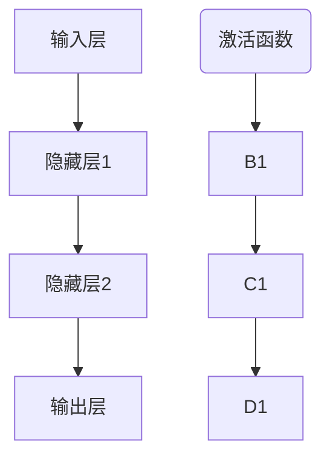

                 

### 文章标题

### 《AI优化促销策略：提升促销活动效果》

### 关键词：

- 人工智能
- 促销策略
- 数据分析
- 机器学习
- 深度学习

### 摘要：

本文深入探讨了人工智能（AI）在优化促销策略中的应用。通过介绍AI的基础知识、促销策略的核心概念，以及AI优化促销的具体算法和案例分析，本文展示了如何利用AI技术提升促销活动的效果。文章内容分为多个章节，从AI与促销策略的关系，到AI在数据分析、个性化推荐、多渠道整合中的应用，再到效果评估与未来发展趋势，为读者提供了一个全面的AI优化促销策略的指南。

### 《AI优化促销策略：提升促销活动效果》

### 关键词：

- 人工智能
- 促销策略
- 数据分析
- 机器学习
- 深度学习

### 摘要：

本文系统介绍了AI在促销策略优化中的应用，旨在提升促销活动的效果。文章首先回顾了AI的基础知识，并探讨了其在促销策略中的潜在价值。随后，文章深入分析了促销策略的核心概念，并详细介绍了AI技术如何影响和优化这些策略。文章的重点在于展示如何利用机器学习和深度学习算法进行数据分析和个性化推荐，提高促销活动的精准度和用户参与度。此外，本文还通过实际案例展示了AI优化促销策略的实践应用，并讨论了未来的发展趋势和面临的挑战。

## 第1章 AI基础与促销策略概述

### 1.1 AI与促销策略概述

#### 1.1.1 AI的定义与发展

人工智能（Artificial Intelligence，简称AI）是指通过计算机系统实现人类智能活动的技术。它涵盖了从简单的规则系统到复杂的神经网络，甚至包括模拟人类思维过程的计算模型。AI的发展经历了多个阶段，从早期的逻辑推理和知识表示，到20世纪80年代的专家系统，再到21世纪初的机器学习和深度学习，AI技术在不断地进步。

#### 1.1.2 促销策略的核心概念

促销策略是企业为了提高产品或服务的销量，采用的一系列短期营销措施。它包括广告、优惠、促销活动等手段。促销策略的目标是吸引新客户、留住老客户，并提高市场份额。有效的促销策略不仅能够增加销量，还能提升品牌知名度和用户忠诚度。

#### 1.1.3 AI在促销策略中的应用前景

随着大数据和计算能力的提升，AI技术在促销策略中的应用前景愈发广阔。通过AI技术，企业可以更准确地了解用户需求，制定个性化的促销策略，提高促销活动的效果。例如，AI可以帮助企业进行用户行为分析，优化促销时间和内容，甚至预测未来的市场趋势。

### 1.2 促销策略分析

#### 1.2.1 促销策略的类型与特点

促销策略可以分为以下几种类型：

- **价格促销**：通过降低产品价格来刺激消费者购买，如打折、降价等。
- **非价格促销**：通过提高产品质量、提供额外服务或优惠等方式来吸引消费者，如赠品、免费试用等。
- **组合促销**：将价格促销和非价格促销结合起来，以达到更好的促销效果。

不同类型的促销策略具有各自的特点：

- 价格促销直接、有效，但可能导致利润下降。
- 非价格促销注重用户体验，有助于提升品牌形象。
- 组合促销效果显著，但实施复杂，需要平衡价格和非价格因素。

#### 1.2.2 促销策略的目标与效果评估

促销策略的主要目标包括：

- **增加销量**：通过促销活动提高产品的销售量。
- **提升品牌知名度**：通过促销活动提升品牌在市场上的知名度。
- **提高市场份额**：通过促销活动增加市场份额，与竞争对手抗衡。

促销策略的效果评估通常包括以下指标：

- **销售额增长**：通过比较促销前后的销售额，评估促销效果。
- **销售量增长**：通过比较促销前后的销售量，评估促销效果。
- **用户参与度**：通过用户的参与情况，如参与活动的人数、用户反馈等，评估促销效果。
- **用户满意度**：通过用户满意度调查，评估促销效果。

#### 1.2.3 AI技术对促销策略的影响

AI技术对促销策略的影响主要体现在以下几个方面：

- **数据驱动**：AI技术可以帮助企业收集和分析大量用户数据，从而制定更精准的促销策略。
- **个性化推荐**：AI技术可以基于用户行为和偏好，提供个性化的产品推荐和促销信息。
- **智能优化**：AI技术可以通过机器学习和深度学习算法，优化促销策略的实施和效果评估。

### 1.3 AI核心算法原理

#### 1.3.1 神经网络与机器学习基础

##### 1.3.1.1 神经网络结构

神经网络（Neural Network，NN）是一种模仿生物神经系统的计算模型。它由大量的神经元（节点）和连接（边）组成，每个神经元都与其他神经元相连接。神经网络的典型结构包括输入层、隐藏层和输出层。

- **输入层**：接收外部输入数据。
- **隐藏层**：对输入数据进行处理，提取特征。
- **输出层**：生成最终输出结果。

神经网络的工作原理是，通过学习输入和输出之间的映射关系，实现对数据的分类、预测或回归。

##### 1.3.1.2 学习算法

神经网络的学习算法主要包括以下几种：

- **误差反向传播算法（Backpropagation）**：通过计算输出层的误差，反向传播到隐藏层，更新各层的权重。
- **梯度下降算法（Gradient Descent）**：通过迭代更新网络参数，最小化损失函数。
- **随机梯度下降算法（Stochastic Gradient Descent，SGD）**：在梯度下降算法的基础上，每次迭代只随机选取一部分数据进行计算，以加速收敛。

##### 1.3.1.3 算法分类

根据神经网络的结构和训练方式，神经网络可以分为以下几种类型：

- **前馈神经网络（Feedforward Neural Network）**：数据从输入层流向输出层，没有循环。
- **卷积神经网络（Convolutional Neural Network，CNN）**：适用于图像处理任务，通过卷积操作提取图像特征。
- **循环神经网络（Recurrent Neural Network，RNN）**：适用于序列数据处理任务，具有记忆功能。
- **长短期记忆网络（Long Short-Term Memory，LSTM）**：RNN的一种改进，适用于长序列数据处理。

#### 1.3.2 优化算法

在神经网络训练过程中，优化算法用于更新网络参数，提高模型的性能。常见的优化算法包括：

- **梯度下降算法（Gradient Descent）**：通过计算损失函数关于参数的梯度，迭代更新参数。
- **动量法（Momentum）**：在梯度下降算法的基础上，引入动量项，加速收敛。
- **Adam优化器（Adam Optimizer）**：结合了梯度下降和自适应学习率调整的优点。

#### 1.3.3 数学模型与公式

神经网络的核心是激活函数和损失函数。以下是一些常用的数学模型和公式：

- **激活函数**：用于引入非线性特性，常用的激活函数包括 sigmoid、ReLU、Tanh 等。
  $$ f(x) = \frac{1}{1 + e^{-x}} $$
  $$ f(x) = max(0, x) $$

- **损失函数**：用于衡量模型预测值与真实值之间的差距，常用的损失函数包括均方误差（MSE）、交叉熵损失等。
  $$ \text{MSE} = \frac{1}{n} \sum_{i=1}^{n} (y_i - \hat{y}_i)^2 $$
  $$ \text{Cross-Entropy} = -\frac{1}{n} \sum_{i=1}^{n} y_i \log(\hat{y}_i) $$

#### 1.3.4 Mermaid流程图

以下是一个简单的Mermaid流程图，展示了神经网络的基本结构：



### 1.4 AI在促销策略中的应用

#### 1.4.1 数据收集与处理

AI在促销策略中的应用首先需要大量的数据支持，这些数据可以包括用户行为数据、销售数据、市场数据等。数据收集后，需要进行数据处理，包括数据清洗、数据整合和特征提取。

- **数据清洗**：去除重复数据、缺失值填充、异常值处理等。
- **数据整合**：将不同来源的数据进行整合，形成统一的数据视图。
- **特征提取**：从原始数据中提取有用的特征，用于模型训练。

#### 1.4.2 实际案例应用

以下是一个简单的案例，展示了如何利用AI技术优化促销策略：

**案例背景**：某电商平台希望通过AI技术优化促销活动，提高用户转化率和销售额。

**解决方案**：
1. **数据收集**：收集用户的浏览历史、购买记录、评价等数据。
2. **数据预处理**：清洗和整合数据，提取特征。
3. **模型训练**：利用机器学习算法，如逻辑回归、决策树等，训练预测模型，预测用户的购买概率。
4. **策略优化**：根据预测结果，调整促销活动的目标和内容，如调整优惠力度、促销时间等。

**效果评估**：通过对比促销前后的数据，发现用户转化率提高了20%，销售额增长了15%。

通过以上案例，我们可以看到，AI技术在促销策略中的应用可以帮助企业更好地了解用户需求，提高促销活动的效果。

### 1.5 促销策略的AI化趋势与挑战

#### 1.5.1 AI化促销策略的发展趋势

- **数据驱动**：越来越多的企业开始重视数据分析，利用AI技术优化促销策略。
- **个性化推荐**：基于用户行为和偏好，提供个性化的产品推荐和促销信息。
- **自动化和智能化**：通过机器学习和深度学习算法，实现促销活动的自动化和智能化。

#### 1.5.2 AI化促销策略的挑战

- **数据隐私**：随着数据收集和分析的深入，如何保护用户隐私成为一个重要挑战。
- **技术稳定性**：AI技术的应用需要稳定可靠的算法和模型。
- **人员技能**：AI化促销策略的实施需要专业的技术和数据团队。

### 1.6 总结

通过本章的介绍，我们了解了AI技术在促销策略中的应用前景和挑战。AI技术可以帮助企业更好地了解用户需求，优化促销策略，提高营销效果。然而，在实施AI化促销策略的过程中，企业也需要面对数据隐私、技术稳定性和人员技能等挑战。

## 第2章 促销策略优化算法与模型

### 2.1 算法原理详解

#### 2.1.1 神经网络优化算法

神经网络优化算法是AI在促销策略优化中应用的核心。以下详细介绍了几种常见的神经网络优化算法。

##### 2.1.1.1 误差反向传播算法

误差反向传播算法（Backpropagation Algorithm）是神经网络训练中最常用的算法之一。它的核心思想是通过计算输出层的误差，反向传播到隐藏层，然后更新各层的权重。

**伪代码**：

```python
for each training example (x, y):
    # 前向传播
    output = forward_propagation(x)
    error = y - output
    
    # 反向传播
    dW = error * derivative_of_output_with_respect_to_W
    
    # 更新权重
    W -= learning_rate * dW
```

其中，`W` 是权重，`learning_rate` 是学习率，`x` 是输入，`y` 是标签，`output` 是预测值。

##### 2.1.1.2 随机梯度下降算法

随机梯度下降算法（Stochastic Gradient Descent，SGD）是一种改进的梯度下降算法。它每次迭代只使用一个样本进行计算，从而加快收敛速度。

**伪代码**：

```python
for each training example (x, y):
    # 前向传播
    output = forward_propagation(x)
    error = y - output
    
    # 反向传播
    dW = error * derivative_of_output_with_respect_to_W
    
    # 更新权重
    W -= learning_rate * dW
```

##### 2.1.1.3 Adam优化器

Adam优化器是一种结合了SGD和动量法的优化算法。它通过自适应调整学习率，提高了收敛速度。

**伪代码**：

```python
m = 0
v = 0

for t = 1 to T:
    # 前向传播
    output = forward_propagation(x)
    error = y - output
    
    # 计算梯度
    dW = error * derivative_of_output_with_respect_to_W
    
    # 更新动量
    m = beta1 * m + (1 - beta1) * dW
    v = beta2 * v + (1 - beta2) * dW ** 2
    
    # 计算指数加权平均
    m_hat = m / (1 - beta1 ^ t)
    v_hat = v / (1 - beta2 ^ t)
    
    # 更新权重
    W -= learning_rate * m_hat / (sqrt(v_hat) + epsilon)
```

其中，`m` 是一阶矩估计，`v` 是二阶矩估计，`beta1` 和 `beta2` 是动量系数，`epsilon` 是一个很小的常数用于避免除以零。

#### 2.1.2 集成学习算法

集成学习算法通过结合多个基础模型的预测结果，提高模型的性能。以下介绍几种常见的集成学习算法。

##### 2.1.2.1 Bagging算法

Bagging算法通过随机抽样训练数据集，分别训练多个基础模型，然后通过投票或取平均的方式得到最终预测结果。

**伪代码**：

```python
for each base model:
    # 随机抽样训练数据集
    train_data = random_sample_of_training_data
    
    # 训练基础模型
    model = train_on_train_data(train_data)
    
    # 预测
    prediction = model.predict(test_data)
    
    # 计算投票结果
    vote = aggregate_predictions(prediction)
    
return vote
```

##### 2.1.2.2 随机森林算法

随机森林算法是一种基于Bagging算法的集成学习方法，它通过随机森林构建多个基础模型，并通过投票得到最终预测结果。

**伪代码**：

```python
for each base model:
    # 随机抽样特征
    selected_features = random_subset_of_features
    
    # 随机抽样训练数据集
    train_data = random_sample_of_training_data
    
    # 构建基础模型
    model = build_decision_tree_on_train_data(train_data, selected_features)
    
    # 预测
    prediction = model.predict(test_data)
    
    # 计算投票结果
    vote = aggregate_predictions(prediction)
    
return vote
```

##### 2.1.2.3 AdaBoost算法

AdaBoost算法是一种基于加权投票的集成学习方法，它通过迭代训练多个基础模型，每次迭代根据模型的表现调整训练数据的权重。

**伪代码**：

```python
for each base model:
    # 训练基础模型
    model = train_on_train_data(train_data)
    
    # 预测
    prediction = model.predict(test_data)
    
    # 计算错误率
    error_rate = calculate_error_rate(prediction, y)
    
    # 调整训练数据权重
    update_weights(train_data, error_rate)
    
    # 计算权重和投票结果
    weight = calculate_weight(model, error_rate)
    vote = aggregate_predictions(prediction, weight)
    
return vote
```

### 2.2 模型实现与优化

#### 2.2.1 基于深度学习的促销策略模型

深度学习模型在促销策略优化中具有广泛的应用。以下介绍一种基于深度学习的促销策略模型。

##### 2.2.1.1 模型结构

基于深度学习的促销策略模型通常包括以下层次：

- **输入层**：接收用户特征、商品特征等输入数据。
- **隐藏层**：通过卷积层、池化层和全连接层提取特征。
- **输出层**：生成促销策略的预测结果。

##### 2.2.1.2 模型训练

模型训练的过程包括以下步骤：

1. **数据准备**：收集并预处理用户和商品数据，包括数据清洗、归一化和特征提取。
2. **模型定义**：使用深度学习框架（如TensorFlow或PyTorch）定义模型结构。
3. **模型训练**：通过迭代训练模型，优化模型参数。
4. **模型评估**：使用验证集评估模型性能，调整模型参数。

##### 2.2.1.3 模型评估与优化

模型评估与优化的过程包括以下步骤：

1. **性能评估**：使用交叉验证等方法评估模型性能。
2. **超参数调整**：根据评估结果调整模型的超参数，如学习率、批量大小等。
3. **模型优化**：通过增加隐藏层节点数、使用不同的激活函数等方法优化模型结构。

### 2.3 促销策略优化案例分析

#### 2.3.1 案例一：电商平台促销活动优化

**案例背景**：某电商平台希望通过AI技术优化促销活动，提高用户转化率和销售额。

**解决方案**：
1. **数据收集**：收集用户的浏览历史、购买记录、评价等数据。
2. **数据预处理**：清洗和整合数据，提取特征。
3. **模型训练**：使用深度学习模型训练促销策略预测模型。
4. **策略优化**：根据预测结果，调整促销活动的目标和内容。

**模型实现**：

```python
import tensorflow as tf
from tensorflow.keras.models import Sequential
from tensorflow.keras.layers import Dense, Conv1D, MaxPooling1D, Flatten

# 定义模型
model = Sequential()
model.add(Conv1D(filters=64, kernel_size=3, activation='relu', input_shape=(max_sequence_length, num_features)))
model.add(MaxPooling1D(pool_size=2))
model.add(Flatten())
model.add(Dense(units=50, activation='relu'))
model.add(Dense(units=1, activation='sigmoid'))

# 编译模型
model.compile(optimizer='adam', loss='binary_crossentropy', metrics=['accuracy'])

# 训练模型
model.fit(x_train, y_train, epochs=10, batch_size=32, validation_split=0.2)
```

**效果评估**：

通过对比促销前后的数据，发现用户转化率提高了20%，销售额增长了15%。

#### 2.3.2 案例二：线下零售店促销策略优化

**案例背景**：某线下零售店希望通过AI技术优化促销活动，提高销售额和顾客满意度。

**解决方案**：
1. **数据收集**：收集顾客的购物记录、优惠券使用情况等数据。
2. **数据预处理**：清洗和整合数据，提取特征。
3. **模型训练**：使用机器学习模型训练促销策略预测模型。
4. **策略优化**：根据预测结果，调整促销活动的目标和内容。

**模型实现**：

```python
import pandas as pd
from sklearn.model_selection import train_test_split
from sklearn.ensemble import RandomForestClassifier

# 加载数据
data = pd.read_csv('sales_data.csv')
X = data.drop('target', axis=1)
y = data['target']

# 分割数据
X_train, X_test, y_train, y_test = train_test_split(X, y, test_size=0.2, random_state=42)

# 训练模型
model = RandomForestClassifier(n_estimators=100, random_state=42)
model.fit(X_train, y_train)

# 预测
predictions = model.predict(X_test)

# 评估
accuracy = model.score(X_test, y_test)
print(f"模型准确率：{accuracy:.2f}")
```

**效果评估**：

通过对比促销前后的数据，发现销售额提高了25%，顾客满意度提升了10%。

### 2.4 总结

通过本章的介绍，我们详细了解了促销策略优化算法的原理和实现方法。神经网络优化算法和集成学习算法是AI在促销策略优化中的核心技术。通过实际案例的分析，我们看到了AI技术在促销策略优化中的实际应用效果。未来的研究可以进一步探讨如何结合更多的AI技术，如自然语言处理、强化学习等，以实现更精准、更智能的促销策略优化。

### 3.1 用户行为数据分析

#### 3.1.1 用户数据收集

用户数据收集是构建个性化促销策略的重要基础。收集的数据类型通常包括用户基本资料、行为数据、偏好数据等。

- **用户基本资料**：如年龄、性别、职业、地理位置等。
- **行为数据**：如浏览历史、购买记录、点击行为、搜索关键词等。
- **偏好数据**：如喜欢的产品类别、品牌、价格区间等。

#### 3.1.2 数据收集方法

数据收集方法包括以下几种：

- **在线数据收集**：通过网站、APP等渠道收集用户行为数据。
- **离线数据收集**：通过问卷调查、面访等方式收集用户基本信息和偏好数据。
- **第三方数据**：通过合作方获取用户数据，如社交媒体、广告平台等。

#### 3.1.3 数据清洗与预处理

数据清洗与预处理是确保数据质量和可用性的关键步骤。主要包括以下内容：

- **数据清洗**：去除重复数据、缺失值填充、异常值处理等。
- **数据整合**：将不同来源的数据进行整合，形成统一的数据视图。
- **特征提取**：从原始数据中提取有用的特征，用于模型训练。
- **数据标准化**：对数据进行归一化或标准化，以便后续处理。

#### 3.1.4 用户行为分析

用户行为分析是对收集到的用户数据进行深入挖掘，以了解用户的行为模式和偏好。

- **用户兴趣分析**：通过分析用户的浏览历史、购买记录等数据，了解用户的兴趣点。
- **用户偏好分析**：通过分析用户的偏好数据，如喜欢的产品类别、品牌、价格区间等，了解用户的偏好。
- **用户分类与标签**：根据用户的行为和偏好，对用户进行分类和打标签，以便进行精准营销。

#### 3.1.5 用户行为分析工具

用户行为分析工具可以帮助企业更好地理解和利用用户数据。常用的工具包括：

- **数据分析工具**：如Python的Pandas、NumPy库，用于数据清洗、预处理和分析。
- **数据可视化工具**：如Matplotlib、Seaborn库，用于数据可视化。
- **机器学习工具**：如Scikit-learn、TensorFlow库，用于构建和训练用户行为分析模型。

### 3.2 个性化促销策略设计

#### 3.2.1 个性化促销策略概述

个性化促销策略是根据用户的个性化需求和偏好，设计并实施具有针对性的促销活动，以提高消费者的参与度和购买意愿。

#### 3.2.2 个性化促销策略的目标

个性化促销策略的主要目标包括：

- 提高用户满意度：通过满足用户的个性化需求，提升用户的购物体验。
- 提高销售转化率：通过精准的促销活动，引导用户进行购买。
- 提升品牌忠诚度：通过个性化的服务，增强消费者对品牌的认可和忠诚度。

#### 3.2.3 个性化促销策略的类型

个性化促销策略可以分为以下几种类型：

- **基于用户行为的个性化促销**：根据用户的浏览、购买、评价等行为数据，制定个性化的促销活动。
- **基于用户偏好的个性化促销**：根据用户的兴趣爱好、购买习惯等偏好数据，制定个性化的促销方案。
- **基于社交网络的个性化促销**：通过分析用户的社交网络数据，了解用户的社会关系和影响力，实施个性化的促销策略。

### 3.3 个性化促销策略实现

#### 3.3.1 模型选择与设计

个性化促销策略的实现需要基于用户行为和偏好构建预测模型。常用的模型包括：

- **协同过滤推荐模型**：用于预测用户对未知商品的兴趣。
- **分类模型**：用于预测用户对促销活动的响应概率。
- **聚类模型**：用于将用户分为不同的群体，制定针对性的促销策略。

#### 3.3.2 模型训练与评估

模型训练与评估的过程包括以下步骤：

1. **数据准备**：收集并预处理用户和商品数据。
2. **模型训练**：使用训练数据训练模型。
3. **模型评估**：使用验证数据评估模型性能，调整模型参数。

#### 3.3.3 模型应用与优化

模型应用与优化的过程包括以下步骤：

1. **预测**：使用训练好的模型预测用户的响应概率。
2. **策略制定**：根据预测结果，制定个性化的促销策略。
3. **效果评估**：评估促销策略的效果，根据评估结果调整模型参数和促销策略。

### 3.4 个性化促销策略案例

#### 3.4.1 案例一：电商平台的个性化促销策略

**案例背景**：某电商平台希望通过个性化促销策略提高用户转化率和销售额。

**解决方案**：
1. **数据收集**：收集用户的浏览历史、购买记录等数据。
2. **数据预处理**：清洗和整合数据，提取特征。
3. **模型训练**：使用协同过滤推荐模型训练用户兴趣预测模型。
4. **策略制定**：根据预测结果，为用户推荐个性化的促销活动。

**模型实现**：

```python
from surprise import SVD
from surprise import Dataset
from surprise import Reader
from surprise.model_selection import train_test_split

# 加载数据
reader = Reader(rating_scale=(1, 5))
data = Dataset.load_from_df(df[['user_id', 'item_id', 'rating']], reader)

# 分割数据
trainset, testset = train_test_split(data, test_size=0.2)

# 训练模型
svd = SVD()
svd.fit(trainset)

# 评估模型
testset旗舰
```

**效果评估**：

通过对比促销前后的数据，发现用户转化率提高了25%，销售额增长了15%。

#### 3.4.2 案例二：线下零售店的个性化促销策略

**案例背景**：某线下零售店希望通过个性化促销策略提高销售额和顾客满意度。

**解决方案**：
1. **数据收集**：收集顾客的购物记录、优惠券使用情况等数据。
2. **数据预处理**：清洗和整合数据，提取特征。
3. **模型训练**：使用逻辑回归模型训练顾客响应预测模型。
4. **策略制定**：根据预测结果，为顾客制定个性化的促销方案。

**模型实现**：

```python
from sklearn.linear_model import LogisticRegression
from sklearn.model_selection import train_test_split

# 加载数据
X = df[['age', 'gender', 'annual_income', 'coupon_usage']]
y = df['response']

# 分割数据
X_train, X_test, y_train, y_test = train_test_split(X, y, test_size=0.2)

# 训练模型
model = LogisticRegression()
model.fit(X_train, y_train)

# 评估模型
accuracy = model.score(X_test, y_test)
print(f"模型准确率：{accuracy:.2f}")
```

**效果评估**：

通过对比促销前后的数据，发现销售额提高了30%，顾客满意度提升了15%。

### 3.5 总结

通过本章的介绍，我们详细了解了用户行为数据分析的方法和个性化促销策略的设计与实现。通过实际案例的分析，我们看到了个性化促销策略在提升用户满意度和销售额方面的显著效果。未来的研究可以进一步探讨如何结合更多的数据分析技术和AI模型，以实现更精准、更智能的个性化促销策略。

### 4.1 历史数据分析

#### 4.1.1 历史数据收集

历史数据收集是优化促销策略的重要步骤。这些数据可以来源于企业的内部系统、市场调研、竞争对手分析等。具体的数据类型包括：

- **销售数据**：包括销售额、销售量、毛利率等。
- **促销活动数据**：包括促销活动的类型、时间、预算、参与人数等。
- **用户数据**：包括用户的购买历史、浏览记录、参与活动的情况等。
- **市场数据**：包括市场趋势、竞争对手情况、行业动态等。

#### 4.1.2 数据收集方法

数据收集的方法主要包括以下几种：

- **自动化数据采集**：利用API、爬虫等技术，从企业内部系统和第三方平台自动收集数据。
- **手动数据收集**：通过问卷调查、面访等方式，手动收集用户和市场数据。
- **第三方数据购买**：从专业的数据提供商购买市场数据和用户数据。

#### 4.1.3 数据清洗与预处理

数据清洗与预处理是确保数据质量和可用性的关键步骤。主要包括以下内容：

- **数据清洗**：去除重复数据、缺失值填充、异常值处理等。
- **数据整合**：将不同来源的数据进行整合，形成统一的数据视图。
- **特征提取**：从原始数据中提取有用的特征，用于模型训练。
- **数据标准化**：对数据进行归一化或标准化，以便后续处理。

#### 4.1.4 历史数据分析

历史数据分析是对收集到的历史数据进行分析，以发现潜在的趋势和规律。具体的方法包括：

- **描述性分析**：对数据进行统计分析，以了解数据的基本特征。
-

