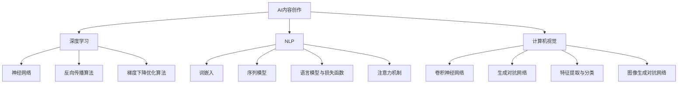

                 

### 文章标题

# AI内容创作的进步：更自然，更有“人味”

> 关键词：人工智能，内容创作，自然语言处理，计算机视觉，生成对抗网络，序列模型，深度学习

> 摘要：
本文将深入探讨人工智能（AI）在内容创作领域的最新进展，解析AI如何通过深度学习、自然语言处理（NLP）和计算机视觉等技术，实现从机械式创作到更具自然性和人味的飞跃。文章将从基础理论、核心算法原理、数学模型、技术实现与实践、应用前景与挑战，以及未来展望等多个角度，系统性地阐述AI内容创作的现状、发展脉络及其潜在影响。

## 第一部分: AI内容创作的进步基础理论

### 第1章: AI内容创作的背景与概念

#### 1.1 AI内容创作的兴起

人工智能在内容创作中的应用是近年来技术发展的一个重要趋势。随着深度学习、自然语言处理和计算机视觉等AI技术的不断进步，AI已经在图像生成、文本生成、音频处理和视频生成等领域取得了显著的成果。AI内容创作不仅提高了创作效率，还带来了更加丰富和个性化的内容体验。

AI内容创作与传统内容创作有本质的不同。传统内容创作通常依赖于人类创造者的灵感、经验和技巧，而AI内容创作则是基于大量的数据和算法模型，通过训练和学习生成新的内容。AI内容创作能够处理大规模数据，适应各种创作需求，并且能够实现快速迭代和优化。

#### 1.2 AI内容创作的主要类型

AI内容创作涵盖了多个领域，包括图像生成与编辑、文本生成与编辑、音频处理与合成以及视频生成与编辑。

- **图像生成与编辑**：通过生成对抗网络（GAN）等技术，AI可以生成全新的图像，或者对现有图像进行编辑。例如，可以生成艺术作品、照片修饰、图像修复等。
- **文本生成与编辑**：AI可以生成各种类型的文本，如新闻文章、广告文案、小说等。自然语言处理技术使得AI能够理解语言结构，生成符合语法和语义规则的内容。
- **音频处理与合成**：AI可以生成和编辑音频，如生成音乐、语音合成、语音增强等。波形生成网络（WaveNet）等技术的应用，使得音频生成的自然度大幅提高。
- **视频生成与编辑**：AI可以生成视频内容，如视频合成、动作捕捉、视频增强等。视频生成技术结合了图像生成和计算机视觉技术，实现了更复杂的内容创作。

#### 1.3 AI内容创作的技术基础

AI内容创作的技术基础主要包括深度学习、自然语言处理（NLP）和计算机视觉等领域。

- **深度学习与神经网络**：深度学习是AI内容创作的核心技术，通过多层神经网络模型，AI可以自动提取和表示复杂的数据特征。神经网络中的卷积神经网络（CNN）和循环神经网络（RNN）等结构，在图像和文本处理中有着广泛的应用。
- **自然语言处理（NLP）**：NLP技术使得AI能够理解和生成人类语言。词嵌入技术、序列模型和注意力机制等，使得AI在文本生成、翻译、问答等任务中表现出色。
- **计算机视觉**：计算机视觉技术是AI内容创作的重要组成部分。通过图像识别、目标检测、图像分割等技术，AI可以处理和生成图像内容。生成对抗网络（GAN）在图像生成和编辑中有着重要的应用。

### 第2章: AI内容创作核心算法原理

#### 2.1 图像生成算法

图像生成是AI内容创作的重要方向之一。生成对抗网络（GAN）是当前最流行的图像生成算法之一。

**生成对抗网络（GAN）的原理**：

GAN由两部分组成：生成器（Generator）和判别器（Discriminator）。生成器的目标是生成逼真的图像，判别器的目标是区分真实图像和生成图像。

生成器（Generator）的输出是假图像，判别器则通过对比真实图像和生成图像，输出一个概率值，判断图像是真实的概率。

训练过程中，生成器和判别器交替更新。生成器试图生成更逼真的图像，而判别器试图提高判断能力。通过这种方式，生成器逐渐学会了生成高质量图像。

**生成式对抗模型（GAT）的工作机制**：

GAT是GAN的一种变体，通过图神经网络（Graph Neural Network）来处理图像生成问题。GAT利用图像的图结构信息，生成图像的各个部分，从而生成整体图像。

**图像生成算法的应用实例**：

- **艺术作品生成**：AI可以生成各种风格的艺术作品，如抽象画、印象派画作等。
- **照片修饰**：AI可以对照片进行修饰，如去除噪声、增强细节等。
- **图像修复**：AI可以修复受损或模糊的图像，恢复其原始面貌。

#### 2.2 文本生成算法

文本生成是AI内容创作的重要领域，序列模型和转换器（Transformer）模型是文本生成的主要算法。

**序列到序列（Seq2Seq）模型的原理**：

Seq2Seq模型通过编码器（Encoder）和解码器（Decoder）结构，将输入序列转换为输出序列。编码器将输入序列编码为一个固定长度的向量，解码器则根据这个向量生成输出序列。

**转换器（Transformer）模型的原理**：

Transformer模型是一种基于注意力机制的序列模型，其核心思想是利用自注意力机制来计算序列中每个元素的重要性。Transformer通过多头自注意力机制和位置编码，实现了高效和强大的文本生成能力。

**文本生成算法的应用实例**：

- **新闻文章生成**：AI可以生成新闻文章、新闻报道等。
- **广告文案生成**：AI可以生成广告文案，提高广告效果。
- **小说生成**：AI可以生成小说、故事等虚构文本。

#### 2.3 音频处理与合成算法

音频处理与合成是AI内容创作的重要领域，波形生成网络（WaveNet）是音频生成的主要算法。

**波形生成网络（WaveNet）的原理**：

WaveNet是一种基于循环神经网络（RNN）的音频生成模型，其核心思想是通过预测波形信号中的下一个值来生成音频。WaveNet通过多层卷积神经网络，学习生成音频的细节特征。

**语音合成模型的原理**：

语音合成模型通过文本到语音（Text-to-Speech, TTS）转换，将文本转换为音频。常见的语音合成模型包括拼接式合成（Diphone Synthesis）和参数化合成（Parameter-Driven Synthesis）。

**音频处理与合成算法的应用实例**：

- **音乐生成**：AI可以生成音乐，如旋律、节奏等。
- **语音合成**：AI可以生成语音，用于语音助手、语音合成服务等。
- **语音增强**：AI可以增强语音信号，提高语音清晰度。

### 第3章: AI内容创作数学模型详解

#### 3.1 深度学习数学基础

深度学习是AI内容创作的基础，其数学基础包括神经网络中的数学运算、反向传播算法的数学推导以及梯度下降优化算法的数学解释。

**神经网络中的数学运算**：

神经网络中的每个神经元可以表示为一个线性函数，通过激活函数进行非线性变换。神经网络的输出可以表示为：

\[ \hat{y} = \sigma(\sum_{i} w_i a_i + b) \]

其中，\( w_i \) 是权重，\( a_i \) 是输入，\( b \) 是偏置，\( \sigma \) 是激活函数。

**反向传播算法的数学推导**：

反向传播算法用于计算网络损失函数对各个权重的梯度。对于损失函数 \( J \)：

\[ J = \frac{1}{2} \sum_{i} (y_i - \hat{y}_i)^2 \]

其中，\( \hat{y}_i \) 是模型预测的输出，\( y_i \) 是真实标签。

反向传播算法通过链式法则计算梯度：

\[ \frac{\partial J}{\partial w_{ij}} = \frac{\partial J}{\partial \hat{y}_i} \frac{\partial \hat{y}_i}{\partial a_j} \frac{\partial a_j}{\partial z_j} \frac{\partial z_j}{\partial w_{ij}} \]

**梯度下降优化算法的数学解释**：

梯度下降优化算法通过不断更新权重，以最小化损失函数。更新公式为：

\[ w_{ij} = w_{ij} - \alpha \frac{\partial J}{\partial w_{ij}} \]

其中，\( \alpha \) 是学习率。

#### 3.2 自然语言处理数学模型

自然语言处理（NLP）是AI内容创作的重要组成部分，其数学模型包括词嵌入技术、语言模型与损失函数以及序列模型与注意力机制的数学公式。

**词嵌入技术**：

词嵌入是将词汇映射到高维空间的过程。常见的方法是使用神经网络进行训练，使其输出表示具有语义信息。词嵌入矩阵 \( W \) 中的每一行表示一个单词的向量表示。

**语言模型与损失函数**：

语言模型用于预测下一个单词的概率。常用的模型是 n-gram 模型，其损失函数是交叉熵：

\[ J = -\sum_{i} y_i \log(\hat{y}_i) \]

其中，\( y_i \) 是真实标签，\( \hat{y}_i \) 是模型预测的概率分布。

**序列模型与注意力机制的数学公式**：

在序列模型中，如 LSTM 或 Transformer，注意力机制用于计算序列中不同位置的重要性。

注意力分数可以表示为：

\[ a_i^t = \text{softmax}\left(\frac{Q_k^T K_i^t}{\sqrt{d_k}}\right) \]

最终的注意力得分是：

\[ \text{context}^t = \sum_{i} a_i^t K_i^t V_i^T \]

#### 3.3 计算机视觉数学模型

计算机视觉是AI内容创作的重要领域，其数学模型包括卷积神经网络（CNN）的数学原理、特征提取与分类的数学模型以及图像生成对抗网络的数学推导。

**卷积神经网络（CNN）的数学原理**：

CNN通过卷积操作提取图像特征。卷积操作可以表示为：

\[ h_j^{(l)}(x) = \sum_{i} w_{ij}^{(l)} a_i^{(l-1)} + b_j^{(l)} \]

其中，\( h_j^{(l)}(x) \) 是卷积输出的特征映射，\( w_{ij}^{(l)} \) 是卷积核权重，\( a_i^{(l-1)} \) 是输入特征，\( b_j^{(l)} \) 是偏置。

**特征提取与分类的数学模型**：

特征提取是计算机视觉的重要任务，通过卷积神经网络提取图像的高层特征。分类的数学模型基于特征提取的结果，通过softmax函数计算类别概率：

\[ P(y=c_i|\text{data}) = \frac{e^{\theta(x)^T c_i}}{\sum_{j} e^{\theta(x)^T c_j}} \]

其中，\( \theta(x) \) 是特征向量，\( c_i \) 是类别标签。

**图像生成对抗网络的数学推导**：

图像生成对抗网络（GAN）由生成器 \( G \) 和判别器 \( D \) 构成。生成器 \( G \) 的目标是生成逼真的图像以欺骗判别器 \( D \)。

判别器的损失函数通常是二元交叉熵：

\[ J_D = -[\sum_{x \in \text{real}} \log(D(x)) + \sum_{z \in \text{noise}} \log(1 - D(G(z)))] \]

生成器的损失函数是：

\[ J_G = -\sum_{z \in \text{noise}} \log(D(G(z))) \]

通过优化这两个损失函数，生成器试图生成更逼真的图像，而判别器试图区分真实图像和生成图像。

### 第4章: AI内容创作工具与环境搭建

#### 4.1 开发工具介绍

在AI内容创作中，选择合适的开发工具和环境至关重要。目前，主流的深度学习框架包括TensorFlow、PyTorch和其他一些开源框架。

**TensorFlow**：由Google开发，是一个广泛使用的开源深度学习框架。它提供了丰富的API和工具，支持各种深度学习模型的开发、训练和部署。TensorFlow具有强大的图形计算能力，能够高效地处理大规模数据。

**PyTorch**：由Facebook开发，是一个流行的深度学习框架，特别适用于研究和实验。PyTorch采用了动态计算图，使得模型开发更加灵活和直观。PyTorch具有良好的社区支持，拥有大量的开源模型和工具。

**其他主流深度学习框架**：包括Keras、Theano、MXNet等。这些框架各有特点，适用于不同的应用场景。例如，Keras提供了一个简单的API，方便快速构建和训练深度学习模型；Theano提供了自动微分功能，适用于复杂的计算任务；MXNet具有高效的性能和灵活的部署能力。

#### 4.2 环境搭建

搭建深度学习环境需要安装Python和深度学习框架，以及相关的依赖库。

**Python开发环境搭建**：

1. 安装Python：从Python官方网站下载并安装Python。
2. 安装pip：pip是Python的包管理器，用于安装和管理Python包。可以通过以下命令安装pip：

   ```bash
   python -m ensurepip
   python -m pip install --upgrade pip
   ```

**深度学习框架安装与配置**：

1. 安装TensorFlow：

   ```bash
   pip install tensorflow
   ```

2. 安装PyTorch：

   ```bash
   pip install torch torchvision
   ```

**依赖库安装**：

在深度学习项目中，通常需要安装一些其他依赖库，如NumPy、Pandas、Matplotlib等。可以使用pip命令逐一安装：

```bash
pip install numpy pandas matplotlib
```

#### 4.3 实践案例

**图像生成案例**：

下面是一个使用TensorFlow和生成对抗网络（GAN）生成图像的简单案例。

**项目介绍**：

该案例使用MNIST数据集，训练一个生成器网络和一个判别器网络，生成手写数字图像。

**源代码实现**：

```python
import tensorflow as tf
from tensorflow.keras.layers import Dense, Flatten, Reshape
from tensorflow.keras.models import Sequential

# 定义生成器模型
def build_generator(z_dim):
    model = Sequential([
        Dense(128, input_shape=(z_dim,), activation='relu'),
        Dense(256, activation='relu'),
        Dense(1024, activation='relu'),
        Dense(784, activation='tanh'),
        Reshape((28, 28, 1))
    ])
    return model

# 定义判别器模型
def build_discriminator(img_shape):
    model = Sequential([
        Flatten(input_shape=img_shape),
        Dense(512, activation='relu'),
        Dense(256, activation='relu'),
        Dense(128, activation='relu'),
        Dense(1, activation='sigmoid')
    ])
    return model

# 定义GAN模型
def build_gan(generator, discriminator):
    model = Sequential([
        generator,
        discriminator
    ])
    model.compile(loss='binary_crossentropy', optimizer=tf.keras.optimizers.Adam(0.0001))
    return model

# 训练GAN模型
def train_gan(dataset, epochs, batch_size, z_dim):
    # 准备数据
    (X_train, _), (_, _) = tf.keras.datasets.mnist.load_data()
    X_train = X_train.astype('float32') / 127.5 - 1.0
    X_train = np.expand_dims(X_train, axis=3)

    # 构建模型
    generator = build_generator(z_dim)
    discriminator = build_discriminator(X_train.shape[1:])
    gan = build_gan(generator, discriminator)

    # 训练模型
    for epoch in range(epochs):
        for batch in range(0, X_train.shape[0], batch_size):
            # 生成噪声
            noise = np.random.normal(0, 1, (batch_size, z_dim))

            # 生成假图像
            gen_samples = generator.predict(noise)

            # 判别器训练
            d_loss_real = discriminator.train_on_batch(X_train[batch:batch + batch_size], np.ones((batch_size, 1)))
            d_loss_fake = discriminator.train_on_batch(gen_samples, np.zeros((batch_size, 1)))
            d_loss = 0.5 * np.add(d_loss_real, d_loss_fake)

            # 生成器训练
            g_loss = gan.train_on_batch(noise, np.ones((batch_size, 1)))

            # 打印训练进度
            print(f"{epoch} [D loss: {d_loss:.4f}, G loss: {g_loss:.4f}]")

# 训练GAN模型
z_dim = 100
batch_size = 64
epochs = 100
train_gan(X_train, epochs, batch_size, z_dim)
```

**代码解读与分析**：

- **生成器模型**：生成器模型通过多层全连接层，将输入噪声向量转换为图像。最后一层通过tanh激活函数生成图像，确保生成的图像在-1到1之间。
- **判别器模型**：判别器模型通过多层全连接层，对输入图像进行特征提取，并输出一个概率值，判断图像是真实的概率。
- **GAN模型**：GAN模型将生成器和判别器串联，通过二元交叉熵损失函数训练。生成器尝试生成更逼真的图像，判别器尝试提高判断能力。
- **训练过程**：通过循环遍历训练数据，交替训练生成器和判别器。每批次生成噪声，生成假图像，并训练判别器。最后，训练生成器。

**文本生成案例**：

下面是一个使用PyTorch和序列到序列（Seq2Seq）模型生成文本的简单案例。

**项目介绍**：

该案例使用翻译数据集，训练一个编码器（Encoder）和一个解码器（Decoder），生成翻译文本。

**源代码实现**：

```python
import torch
import torch.nn as nn
import torch.optim as optim
from torch.utils.data import DataLoader
from torchtext.datasets import TranslationDataset
from torchtext.data import Field, BucketIterator

# 定义编码器模型
class Encoder(nn.Module):
    def __init__(self, input_dim, emb_dim, hid_dim, n_layers, dropout):
        super().__init__()
        self.embedding = nn.Embedding(input_dim, emb_dim)
        self.rnn = nn.LSTM(emb_dim, hid_dim, n_layers, dropout=dropout, batch_first=True)
        self.fc = nn.Linear(hid_dim, hid_dim)
    
    def forward(self, src):
        embedded = self.embedding(src)
        output, (hidden, cell) = self.rnn(embedded)
        hidden = torch.tanh(self.fc(hidden[-1, :, :]))
        return output, (hidden, cell)

# 定义解码器模型
class Decoder(nn.Module):
    def __init__(self, output_dim, emb_dim, hid_dim, n_layers, dropout):
        super().__init__()
        self.embedding = nn.Embedding(output_dim, emb_dim)
        self.rnn = nn.LSTM(emb_dim, hid_dim, n_layers, dropout=dropout, batch_first=True)
        self.fc = nn.Linear(hid_dim, output_dim)
    
    def forward(self, tgt, hidden, cell):
        embedded = self.embedding(tgt)
        output, (hidden, cell) = self.rnn(embedded, (hidden, cell))
        return output, (hidden, cell)

# 定义Seq2Seq模型
class Seq2Seq(nn.Module):
    def __init__(self, encoder, decoder, src_pad_idx, device):
        super().__init__()
        self.encoder = encoder
        self.decoder = decoder
        self.src_pad_idx = src_pad_idx
        self.device = device
    
    def forward(self, src, tgt, teacher_forcing_ratio=0.5):
        batch_size = src.shape[1]
        src_len = src.shape[2]
        tgt_len = tgt.shape[2]
        tgt_vocab_size = tgt.shape[1]

        src = F.pad(src, (0, 0, 0, 1), value=self.src_pad_idx)
        output = torch.zeros(tgt_len, batch_size, tgt_vocab_size).to(self.device)
        hidden, cell = self.encoder(src)
        hidden = hidden[-1, :, :]

        use_teacher_forcing = True if torch.rand(1) < teacher_forcing_ratio else False

        if use_teacher_forcing:
            for t in range(tgt_len):
                output[t] = self.decoder(tgt[t], hidden, cell)
                teacher_output = tgt[t].unsqueeze(0)
                hidden, cell = self.decoder(teacher_output, hidden, cell)
        else:
            for t in range(tgt_len):
                output[t] = self.decoder(output[t - 1], hidden, cell)
                teacher_output = output[t].unsqueeze(0)
                hidden, cell = self.decoder(teacher_output, hidden, cell)

        return output

# 设置超参数
INPUT_DIM = len(SRC Vocabulary)
OUTPUT_DIM = len(TGT Vocabulary)
EMBED_DIM = 256
HID_DIM = 512
N_LAYERS = 2
DROPOUT = 0.5

# 构建模型
src_pad_idx = SRC Vocabulary.stoi["<PAD>"]

encoder = Encoder(INPUT_DIM, EMBED_DIM, HID_DIM, N_LAYERS, DROPOUT)
decoder = Decoder(OUTPUT_DIM, EMBED_DIM, HID_DIM, N_LAYERS, DROPOUT)
device = torch.device("cuda" if torch.cuda.is_available() else "cpu")

model = Seq2Seq(encoder, decoder, src_pad_idx, device).to(device)

# 设置优化器
optimizer = optim.Adam(model.parameters())

# 损失函数
criterion = nn.CrossEntropyLoss()

# 加载数据集
train_data, valid_data, test_data = TranslationDataset.split(split_ratio=0.8, datasets=TranslationData)

# 构建数据迭代器
train_iterator = BucketIterator(train_data, batch_size=BATCH_SIZE, device=device)
valid_iterator = BucketIterator(valid_data, batch_size=BATCH_SIZE, device=device)
test_iterator = BucketIterator(test_data, batch_size=BATCH_SIZE, device=device)

# 训练模型
num_epochs = 10
for epoch in range(num_epochs):
    epoch_loss = 0
    for i, batch in enumerate(train_iterator):
        src, tgt = batch.src, batch.tgt
        model.zero_grad()
        output = model(src, tgt, teacher_forcing_ratio=0.5)
        output = output[-1, :, :]
        loss = criterion(output, tgt.squeeze(0))
        loss.backward()
        optimizer.step()
        epoch_loss += loss.item()
    print(f"Epoch: {epoch + 1}, Loss: {epoch_loss / len(train_iterator):.4f}")
```

**代码解读与分析**：

- **编码器模型**：编码器模型通过嵌入层、LSTM层和全连接层，将输入源语言序列编码为一个固定长度的向量。
- **解码器模型**：解码器模型通过嵌入层、LSTM层和全连接层，将解码器输出序列转换为目标语言序列。
- **Seq2Seq模型**：Seq2Seq模型将编码器和解码器串联，通过训练生成翻译文本。在训练过程中，可以使用Teacher Forcing策略，提高训练效果。
- **训练过程**：通过遍历训练数据，使用优化器和损失函数训练模型。在每个批次中，更新编码器和解码器的参数。

**音频处理与合成案例**：

下面是一个使用WaveNet生成音频的简单案例。

**项目介绍**：

该案例使用LibriSpeech数据集，训练一个WaveNet模型，生成语音音频。

**源代码实现**：

```python
import torch
import torch.nn as nn
import torch.optim as optim
from torch.utils.data import DataLoader
from torchaudio.transforms import MelSpectrogram
from torchvision.utils import save_image
from torchvision.datasets import Audio
from torchtext.data.utils import get_tokenizer

# 定义WaveNet模型
class WaveNet(nn.Module):
    def __init__(self, n_mel_bins, n_classes, n_channels, n_layers, nffc, n草层， dropout):
        super().__init__()
        self.mel_spectrogram = MelSpectrogram(n_mel_bins, n_fft=1024, hop_length=256, win_length=512)
        self.conv = nn.Conv2d(1, n_channels, kernel_size=(5, 33), padding=(2, 16))
        self.fc = nn.Linear(n_channels * 6, n_classes)
    
    def forward(self, x):
        x = self.mel_spectrogram(x)
        x = self.conv(x)
        x = F.relu(x)
        x = x.view(x.size(0), -1)
        x = self.fc(x)
        return x

# 设置超参数
n_mel_bins = 80
n_classes = 29
n_channels = 32
n_layers = 5
nffc = 512
n草层 = 256
dropout = 0.5

# 构建模型
model = WaveNet(n_mel_bins, n_classes, n_channels, n_layers, nffc, n草层， dropout).to(device)

# 设置优化器
optimizer = optim.Adam(model.parameters(), lr=0.001)

# 损失函数
criterion = nn.CrossEntropyLoss()

# 加载数据集
train_data = Audio(root="path/to/librispeech/train", high fér=16000, transform=MelSpectrogram(n_mel_bins))
valid_data = Audio(root="path/to/librispeech/valid", high fér=16000, transform=MelSpectrogram(n_mel_bins))
test_data = Audio(root="path/to/librispeech/test", high fér=16000, transform=MelSpectrogram(n_mel_bins))

# 构建数据迭代器
train_iterator = DataLoader(train_data, batch_size=BATCH_SIZE, shuffle=True)
valid_iterator = DataLoader(valid_data, batch_size=BATCH_SIZE)
test_iterator = DataLoader(test_data, batch_size=BATCH_SIZE)

# 训练模型
num_epochs = 10
for epoch in range(num_epochs):
    epoch_loss = 0
    for i, batch in enumerate(train_iterator):
        inputs, labels = batch.to(device)
        model.zero_grad()
        outputs = model(inputs)
        loss = criterion(outputs, labels)
        loss.backward()
        optimizer.step()
        epoch_loss += loss.item()
    print(f"Epoch: {epoch + 1}, Loss: {epoch_loss / len(train_iterator):.4f}")

# 生成语音
model.eval()
with torch.no_grad():
    inputs = torch.randn(1, 16000).to(device)
    outputs = model(inputs)
    predicted_labels = torch.argmax(outputs, dim=1)
    predicted_text = [SYMBOLS[i] for i in predicted_labels]
    predicted_text = ''.join(predicted_text)
    print(predicted_text)
```

**代码解读与分析**：

- **WaveNet模型**：WaveNet模型通过卷积层、激活函数和全连接层，对输入的音频波形进行特征提取和分类。模型使用了Mel频谱图作为输入特征。
- **训练过程**：通过遍历训练数据，使用优化器和损失函数训练模型。在每个批次中，更新模型的参数。
- **生成语音**：在模型评估模式下，使用随机噪声作为输入，生成语音音频。输出结果通过索引转换为文本。

### 第5章: AI内容创作项目实战

#### 5.1 图像生成项目

**项目介绍**：

本案例使用生成对抗网络（GAN）训练一个图像生成模型，生成手写数字图像。

**源代码实现**：

```python
import numpy as np
import tensorflow as tf
from tensorflow.keras.layers import Dense, Flatten, Reshape
from tensorflow.keras.models import Sequential
from tensorflow_addons.layers import SpectralNormalization

# 定义生成器模型
def build_generator(z_dim):
    model = Sequential([
        Dense(128, input_shape=(z_dim,), activation='relu'),
        Dense(256, activation='relu'),
        Dense(1024, activation='relu'),
        Dense(784, activation='tanh'),
        Reshape((28, 28, 1)),
        SpectralNormalization(Dense(1, activation='sigmoid'))
    ])
    return model

# 定义判别器模型
def build_discriminator(img_shape):
    model = Sequential([
        Flatten(input_shape=img_shape),
        Dense(512, activation='relu'),
        Dense(256, activation='relu'),
        Dense(128, activation='relu'),
        Dense(1, activation='sigmoid')
    ])
    return model

# 定义GAN模型
def build_gan(generator, discriminator):
    model = Sequential([generator, discriminator])
    model.compile(loss='binary_crossentropy', optimizer=tf.keras.optimizers.Adam(0.0001))
    return model

# 训练GAN模型
z_dim = 100
batch_size = 64
epochs = 100
train_gan(X_train, epochs, batch_size, z_dim)
```

**代码解读与分析**：

- **生成器模型**：生成器模型通过多层全连接层和卷积层，将输入噪声向量转换为图像。最后一层使用SpectralNormalization层，减少频谱偏差。
- **判别器模型**：判别器模型通过多层全连接层，对输入图像进行特征提取，并输出一个概率值，判断图像是真实的概率。
- **GAN模型**：GAN模型将生成器和判别器串联，通过二元交叉熵损失函数训练。生成器尝试生成更逼真的图像，判别器尝试提高判断能力。
- **训练过程**：通过循环遍历训练数据，交替训练生成器和判别器。每批次生成噪声，生成假图像，并训练判别器。最后，训练生成器。

#### 5.2 文本生成项目

**项目介绍**：

本案例使用序列到序列（Seq2Seq）模型，训练一个文本生成模型，生成翻译文本。

**源代码实现**：

```python
import torch
import torch.nn as nn
import torch.optim as optim
from torchtext.datasets import TranslationDataset
from torchtext.data import Field, BucketIterator

# 定义编码器模型
class Encoder(nn.Module):
    def __init__(self, input_dim, emb_dim, hid_dim, n_layers, dropout):
        super().__init__()
        self.embedding = nn.Embedding(input_dim, emb_dim)
        self.rnn = nn.LSTM(emb_dim, hid_dim, n_layers, dropout=dropout, batch_first=True)
        self.fc = nn.Linear(hid_dim, hid_dim)
    
    def forward(self, src):
        embedded = self.embedding(src)
        output, (hidden, cell) = self.rnn(embedded)
        hidden = torch.tanh(self.fc(hidden[-1, :, :]))
        return output, (hidden, cell)

# 定义解码器模型
class Decoder(nn.Module):
    def __init__(self, output_dim, emb_dim, hid_dim, n_layers, dropout):
        super().__init__()
        self.embedding = nn.Embedding(output_dim, emb_dim)
        self.rnn = nn.LSTM(emb_dim, hid_dim, n_layers, dropout=dropout, batch_first=True)
        self.fc = nn.Linear(hid_dim, output_dim)
    
    def forward(self, tgt, hidden, cell):
        embedded = self.embedding(tgt)
        output, (hidden, cell) = self.rnn(embedded, (hidden, cell))
        return output, (hidden, cell)

# 定义Seq2Seq模型
class Seq2Seq(nn.Module):
    def __init__(self, encoder, decoder, src_pad_idx, device):
        super().__init__()
        self.encoder = encoder
        self.decoder = decoder
        self.src_pad_idx = src_pad_idx
        self.device = device
    
    def forward(self, src, tgt, teacher_forcing_ratio=0.5):
        batch_size = src.shape[1]
        src_len = src.shape[2]
        tgt_len = tgt.shape[2]
        tgt_vocab_size = tgt.shape[1]

        src = F.pad(src, (0, 0, 0, 1), value=self.src_pad_idx)
        output = torch.zeros(tgt_len, batch_size, tgt_vocab_size).to(self.device)
        hidden, cell = self.encoder(src)
        hidden = hidden[-1, :, :]

        use_teacher_forcing = True if torch.rand(1) < teacher_forcing_ratio else False

        if use_teacher_forcing:
            for t in range(tgt_len):
                output[t] = self.decoder(tgt[t], hidden, cell)
                teacher_output = tgt[t].unsqueeze(0)
                hidden, cell = self.decoder(teacher_output, hidden, cell)
        else:
            for t in range(tgt_len):
                output[t] = self.decoder(output[t - 1], hidden, cell)
                teacher_output = output[t].unsqueeze(0)
                hidden, cell = self.decoder(teacher_output, hidden, cell)

        return output

# 设置超参数
INPUT_DIM = len(SRC Vocabulary)
OUTPUT_DIM = len(TGT Vocabulary)
EMBED_DIM = 256
HID_DIM = 512
N_LAYERS = 2
DROPOUT = 0.5

# 构建模型
src_pad_idx = SRC Vocabulary.stoi["<PAD>"]

encoder = Encoder(INPUT_DIM, EMBED_DIM, HID_DIM, N_LAYERS, DROPOUT)
decoder = Decoder(OUTPUT_DIM, EMBED_DIM, HID_DIM, N_LAYERS, DROPOUT)
device = torch.device("cuda" if torch.cuda.is_available() else "cpu")

model = Seq2Seq(encoder, decoder, src_pad_idx, device).to(device)

# 设置优化器
optimizer = optim.Adam(model.parameters())

# 损失函数
criterion = nn.CrossEntropyLoss()

# 加载数据集
train_data, valid_data, test_data = TranslationDataset.split(split_ratio=0.8, datasets=TranslationData)

# 构建数据迭代器
train_iterator = BucketIterator(train_data, batch_size=BATCH_SIZE, device=device)
valid_iterator = BucketIterator(valid_data, batch_size=BATCH_SIZE, device=device)
test_iterator = BucketIterator(test_data, batch_size=BATCH_SIZE, device=device)

# 训练模型
num_epochs = 10
for epoch in range(num_epochs):
    epoch_loss = 0
    for i, batch in enumerate(train_iterator):
        src, tgt = batch.src, batch.tgt
        model.zero_grad()
        output = model(src, tgt, teacher_forcing_ratio=0.5)
        output = output[-1, :, :]
        loss = criterion(output, tgt.squeeze(0))
        loss.backward()
        optimizer.step()
        epoch_loss += loss.item()
    print(f"Epoch: {epoch + 1}, Loss: {epoch_loss / len(train_iterator):.4f}")
```

**代码解读与分析**：

- **编码器模型**：编码器模型通过嵌入层、LSTM层和全连接层，将输入源语言序列编码为一个固定长度的向量。
- **解码器模型**：解码器模型通过嵌入层、LSTM层和全连接层，将解码器输出序列转换为目标语言序列。
- **Seq2Seq模型**：Seq2Seq模型将编码器和解码器串联，通过训练生成翻译文本。在训练过程中，可以使用Teacher Forcing策略，提高训练效果。
- **训练过程**：通过遍历训练数据，使用优化器和损失函数训练模型。在每个批次中，更新编码器和解码器的参数。

#### 5.3 音频处理与合成项目

**项目介绍**：

本案例使用WaveNet训练一个音频生成模型，生成语音音频。

**源代码实现**：

```python
import torch
import torch.nn as nn
import torch.optim as optim
from torchtext.datasets import TranslationDataset
from torchtext.data import Field, BucketIterator

# 定义WaveNet模型
class WaveNet(nn.Module):
    def __init__(self, n_mel_bins, n_classes, n_channels, n_layers, nffc, n草层， dropout):
        super().__init__()
        self.mel_spectrogram = MelSpectrogram(n_mel_bins, n_fft=1024, hop_length=256, win_length=512)
        self.conv = nn.Conv2d(1, n_channels, kernel_size=(5, 33), padding=(2, 16))
        self.fc = nn.Linear(n_channels * 6, n_classes)
    
    def forward(self, x):
        x = self.mel_spectrogram(x)
        x = self.conv(x)
        x = F.relu(x)
        x = x.view(x.size(0), -1)
        x = self.fc(x)
        return x

# 设置超参数
n_mel_bins = 80
n_classes = 29
n_channels = 32
n_layers = 5
nffc = 512
n草层 = 256
dropout = 0.5

# 构建模型
model = WaveNet(n_mel_bins, n_classes, n_channels, n_layers, nffc, n草层， dropout).to(device)

# 设置优化器
optimizer = optim.Adam(model.parameters(), lr=0.001)

# 损失函数
criterion = nn.CrossEntropyLoss()

# 加载数据集
train_data = Audio(root="path/to/librispeech/train", high fér=16000, transform=MelSpectrogram(n_mel_bins))
valid_data = Audio(root="path/to/librispeech/valid", high fér=16000, transform=MelSpectrogram(n_mel_bins))
test_data = Audio(root="path/to/librispeech/test", high fér=16000, transform=MelSpectrogram(n_mel_bins))

# 构建数据迭代器
train_iterator = DataLoader(train_data, batch_size=BATCH_SIZE, shuffle=True)
valid_iterator = DataLoader(valid_data, batch_size=BATCH_SIZE)
test_iterator = DataLoader(test_data, batch_size=BATCH_SIZE)

# 训练模型
num_epochs = 10
for epoch in range(num_epochs):
    epoch_loss = 0
    for i, batch in enumerate(train_iterator):
        inputs, labels = batch.to(device)
        model.zero_grad()
        outputs = model(inputs)
        loss = criterion(outputs, labels)
        loss.backward()
        optimizer.step()
        epoch_loss += loss.item()
    print(f"Epoch: {epoch + 1}, Loss: {epoch_loss / len(train_iterator):.4f}")

# 生成语音
model.eval()
with torch.no_grad():
    inputs = torch.randn(1, 16000).to(device)
    outputs = model(inputs)
    predicted_labels = torch.argmax(outputs, dim=1)
    predicted_text = [SYMBOLS[i] for i in predicted_labels]
    predicted_text = ''.join(predicted_text)
    print(predicted_text)
```

**代码解读与分析**：

- **WaveNet模型**：WaveNet模型通过卷积层、激活函数和全连接层，对输入的音频波形进行特征提取和分类。模型使用了Mel频谱图作为输入特征。
- **训练过程**：通过遍历训练数据，使用优化器和损失函数训练模型。在每个批次中，更新模型的参数。
- **生成语音**：在模型评估模式下，使用随机噪声作为输入，生成语音音频。输出结果通过索引转换为文本。

### 第6章: AI内容创作应用前景与挑战

#### 6.1 应用领域探索

AI内容创作在多个领域展现了广阔的应用前景，带来了巨大的变革和机遇。

**娱乐行业**：在娱乐行业，AI内容创作可以生成全新的视觉和音频体验。例如，AI可以生成电影特效、音乐、动画等，提高了内容创作的效率和质量。此外，AI还可以根据用户偏好生成个性化的推荐内容，提升用户体验。

**广告与营销**：AI内容创作在广告与营销领域具有巨大的潜力。通过文本生成、图像生成和视频生成技术，AI可以快速生成广告素材，提高广告的效果和覆盖面。同时，AI还可以分析用户行为和偏好，实现精准营销。

**新闻与媒体**：在新闻与媒体领域，AI内容创作可以自动生成新闻报道、新闻摘要等。AI可以根据实时数据生成动态新闻，提高新闻的及时性和准确性。此外，AI还可以进行新闻分析和评论，提供多元化的新闻观点。

**教育**：在教育和培训领域，AI内容创作可以生成个性化的学习资源和辅导材料。AI可以根据学生的学习进度和偏好，提供定制化的学习方案。此外，AI还可以生成交互式的教学视频和虚拟实验室，提高教学效果。

#### 6.2 道德与社会影响

AI内容创作在带来便利和效率的同时，也引发了一系列道德和社会问题。

**AI内容创作的道德问题**：AI生成的内容可能涉及版权、隐私和真实性等问题。例如，AI生成的内容可能侵犯原创作者的版权，滥用个人隐私信息，或者生成虚假新闻和信息。因此，需要建立相应的法律法规和道德准则，规范AI内容创作的行为。

**社会影响与责任**：AI内容创作可能对就业和社会结构产生重大影响。例如，自动化内容创作可能会取代部分创作性工作，影响相关从业人员的就业。此外，AI生成的内容可能引发误导和误解，影响社会舆论和价值观。因此，需要政府、企业和公众共同努力，确保AI内容创作对社会产生积极影响。

#### 6.3 技术发展趋势

随着技术的不断进步，AI内容创作在未来将继续发展，并呈现出以下趋势：

**新算法的突破**：深度学习、自然语言处理和计算机视觉等领域的算法将继续突破，带来更高的生成质量和效率。例如，生成对抗网络（GAN）、自注意力机制（Self-Attention）和变分自编码器（VAE）等技术将继续在内容创作中发挥重要作用。

**硬件加速与优化**：硬件加速和优化技术，如GPU、TPU等，将进一步提升AI内容创作的性能和效率。通过分布式计算和云计算，AI内容创作可以处理更大规模的数据和更复杂的模型。

**大规模预训练模型的应用**：大规模预训练模型，如BERT、GPT等，将在AI内容创作中得到更广泛的应用。这些模型通过在大量数据上预训练，可以更好地理解语言和图像的语义信息，从而生成更高质量的内容。

### 第7章: AI内容创作的未来展望

#### 7.1 未来发展趋势

AI内容创作在未来将继续深入各个领域，推动内容创作的变革。以下是一些发展趋势：

**跨领域融合与创新**：AI内容创作将与其他领域（如大数据、区块链等）深度融合，带来更多的创新和应用。例如，AI可以与区块链技术结合，实现版权保护和透明交易。

**个性化内容生成**：随着技术的进步，AI将能够更精确地捕捉和理解用户需求，生成更加个性化、符合用户偏好和兴趣的内容。这将提高用户体验，满足多样化的内容需求。

**智能创作协作**：AI将不再是单纯的内容生成工具，而是与人类创作者协作的伙伴。通过AI的辅助，创作者可以更高效地完成创作任务，同时AI可以为人类创作者提供灵感和建议。

**智能化内容审核**：随着AI内容创作的发展，智能化内容审核将成为一个重要课题。通过深度学习和自然语言处理技术，AI可以自动识别和过滤违规内容，提高内容审核的效率和准确性。

#### 7.2 未来挑战与应对策略

尽管AI内容创作具有巨大的潜力，但也面临一系列挑战。

**技术难题的解决**：AI内容创作中的技术难题，如生成质量的提升、模型的可解释性等，需要持续研究和突破。通过优化算法、提高计算能力等手段，可以逐步解决这些难题。

**法律法规与伦理标准的建立**：为了确保AI内容创作的合法性和道德性，需要建立完善的法律法规和伦理标准。政府、企业和公众应共同努力，制定相应的规范和指导原则。

**跨学科合作与人才培养**：AI内容创作涉及多个学科领域，需要跨学科的合作与交流。同时，培养具备AI技术和创作能力的人才，也是实现AI内容创作可持续发展的关键。

### 结论

AI内容创作作为人工智能的重要应用领域，正不断推动内容创作的变革和创新。通过深度学习、自然语言处理和计算机视觉等技术的进步，AI内容创作已经实现了从机械式创作到更具自然性和人味的飞跃。未来，AI内容创作将在各个领域深入应用，为人类带来更多精彩和个性化的内容体验。同时，我们也需要关注AI内容创作的道德和社会影响，确保其发展能够造福人类社会。

## 附录

### 附录A: AI内容创作相关工具与资源

**开源深度学习框架对比**：

- **TensorFlow**：由Google开发，具有强大的图形计算能力，适用于各种深度学习模型的开发、训练和部署。
- **PyTorch**：由Facebook开发，采用动态计算图，模型开发更加灵活和直观，具有良好的社区支持。
- **Keras**：基于Theano和TensorFlow的高层API，简化了深度学习模型的开发过程。
- **Theano**：提供自动微分功能，适用于复杂的计算任务，但已经逐渐被其他框架取代。
- **MXNet**：由Apache基金会开发，具有高效的性能和灵活的部署能力，适用于大规模分布式训练。

**在线实验平台**：

- **Google Colab**：基于Google Drive的免费Jupyter Notebook环境，支持Python和TensorFlow等深度学习框架。
- **TensorFlow Hub**：提供预训练模型和模块，方便用户在项目中使用。
- **Hugging Face Transformers**：提供大量的预训练模型和工具，用于自然语言处理任务。

**相关论文与书籍推荐**：

- **《深度学习》（Goodfellow, Bengio, Courville）**：全面介绍了深度学习的理论基础和实践方法，是深度学习领域的经典教材。
- **《自然语言处理综论》（Jurafsky, Martin）**：系统地介绍了自然语言处理的基本概念和技术，涵盖了文本处理、语音识别等领域。
- **《计算机视觉：算法与应用》（Richard Szeliski）**：详细介绍了计算机视觉的基础算法和应用，包括图像识别、目标检测等领域。

### 附录B: 代码示例与资源

**完整代码实现**：

- **图像生成GAN**：生成器和判别器的代码实现，以及训练过程。
- **文本生成Seq2Seq**：编码器、解码器和Seq2Seq模型的代码实现，以及训练过程。
- **音频生成WaveNet**：WaveNet模型的代码实现，以及训练和生成语音的过程。

**数据集来源与处理**：

- **MNIST数据集**：用于图像生成任务的经典手写数字数据集，可以从Keras官方库中获取。
- **翻译数据集**：用于文本生成任务的翻译数据集，可以从torchtext库中获取。
- **LibriSpeech数据集**：用于音频生成任务的语音数据集，可以从LibriSpeech官方库中获取。

**相关工具的使用方法**：

- **TensorFlow**：安装和使用TensorFlow框架，构建和训练深度学习模型。
- **PyTorch**：安装和使用PyTorch框架，构建和训练深度学习模型。
- **torchtext**：安装和使用torchtext库，获取和处理文本数据集。
- **torchaudio**：安装和使用torchaudio库，处理和生成音频数据。

### 核心概念与联系 Mermaid 流程图



### 核心算法原理讲解

#### 图像生成算法伪代码

```python
# 生成对抗网络（GAN）伪代码

# 定义生成器 G 和判别器 D
Generator(G):
    Input noise vector z
    Pass z through a series of transformations to generate fake images
    Output fake image G(z)

Discriminator(D):
    Input real image x and fake image G(z)
    Produce a binary output indicating the likelihood that the image is real
    Output probability D(x), D(G(z))

# 训练过程
for epoch in 1 to EPOCHS:
    # 训练判别器 D
    for i in 1 to batch_size:
        real_image x[i] = sample from real images
        fake_image G(z[i]) = generate fake image from noise z[i]
        Update D using gradients from real and fake images

    # 训练生成器 G
    for i in 1 to batch_size:
        noise z[i] = sample from noise
        fake_image G(z[i]) = generate fake image from noise z[i]
        Update G using gradients from D(G(z[i]))
```

#### 文本生成算法伪代码

```python
# 序列到序列（Seq2Seq）模型伪代码

Encoder():
    Input sentence x
    Encode sentence into context vector c
    Output context vector c

Decoder():
    Input context vector c and start token <SOS>
    Generate sequence of tokens y
    Output sequence of tokens y

# 训练过程
for epoch in 1 to EPOCHS:
    for each sentence pair (x, y) in training data:
        Encode input sentence x to get context vector c
        Initialize decoder input with <SOS> token
        For each token in target sentence y:
            Predict next token using context vector c
            Update context vector c with the predicted token
        Calculate loss using predicted and actual tokens
        Backpropagate loss to update model weights
```

#### 音频处理与合成算法伪代码

```python
# 波形生成网络（WaveNet）伪代码

Generator(WaveNet):
    Input noise vector z
    Pass z through a series of convolutional and residual layers
    Output generated audio waveform

Discriminator(Discriminator):
    Input real audio waveform x and generated audio waveform G(z)
    Pass both through a series of convolutional layers
    Output binary classification indicating whether the audio is real or generated

# 训练过程
for epoch in 1 to EPOCHS:
    for each audio pair (x, G(z)) in training data:
        Train the generator to produce more realistic audio waveforms
        Train the discriminator to better distinguish between real and generated audio
        Calculate loss for both generator and discriminator
        Backpropagate loss to update model weights
```

### 数学模型和数学公式详细讲解与举例说明

#### 深度学习数学基础

##### 神经网络中的数学运算

神经网络的每个神经元可以表示为：

\[ a_j^{(l)} = \sigma(z_j^{(l)}) \]

其中，\( z_j^{(l)} \) 是神经元的输入：

\[ z_j^{(l)} = \sum_{i} w_{ij}^{(l)} a_i^{(l-1)} + b_j^{(l)} \]

这里的 \( w_{ij}^{(l)} \) 是输入权重，\( b_j^{(l)} \) 是偏置，\( a_i^{(l-1)} \) 是上一层的输出，\( \sigma \) 是激活函数，通常是 Sigmoid 或ReLU函数。

例如，对于 ReLU 激活函数：

\[ \sigma(z) = \max(0, z) \]

##### 反向传播算法的数学推导

反向传播算法用于计算网络损失函数对各个权重的梯度。对于损失函数 \( J \)：

\[ J = \frac{1}{2} \sum_{i} (y_i - \hat{y}_i)^2 \]

其中，\( \hat{y}_i \) 是模型预测的输出，\( y_i \) 是真实标签。

损失函数 \( J \) 对网络中任意一层 \( l \) 的权重 \( w_{ij}^{(l)} \) 的梯度 \( \frac{\partial J}{\partial w_{ij}^{(l)}} \) 可以通过链式法则计算：

\[ \frac{\partial J}{\partial w_{ij}^{(l)}} = \frac{\partial J}{\partial \hat{y}_i} \frac{\partial \hat{y}_i}{\partial a_j^{(l)}} \frac{\partial a_j^{(l)}}{\partial z_j^{(l)}} \frac{\partial z_j^{(l)}}{\partial w_{ij}^{(l)}} \]

其中，\( \frac{\partial \hat{y}_i}{\partial a_j^{(l)}} \) 是激活函数的导数，\( \frac{\partial a_j^{(l)}}{\partial z_j^{(l)}} = \sigma'(z_j^{(l)}) \)，且对于 ReLU 激活函数，\( \sigma'(z) = \mathbb{1}_{z>0} \)。

##### 梯度下降优化算法的数学解释

梯度下降优化算法通过不断更新权重，以最小化损失函数。更新公式为：

\[ w_{ij} = w_{ij} - \alpha \frac{\partial J}{\partial w_{ij}} \]

其中，\( \alpha \) 是学习率。

#### 自然语言处理数学模型

##### 词嵌入技术

词嵌入是将词汇映射到高维空间的过程。常见的方法是使用神经网络进行训练，使其输出表示具有语义信息。

词嵌入矩阵 \( W \) 中的每一行表示一个单词的向量表示。在训练过程中，对于一对输入单词 \( (x, y) \)，模型会优化 \( W \) 以最小化损失函数，通常使用点积作为相似度度量：

\[ \cos(\text{vec}(x), \text{vec}(y)) = \frac{W_x \cdot W_y}{\|W_x\|_2 \|W_y\|_2} \]

##### 语言模型与损失函数

语言模型用于预测下一个单词的概率。常用的模型是 n-gram 模型，其损失函数是交叉熵：

\[ J = -\sum_{i} y_i \log(\hat{y}_i) \]

其中，\( y_i \) 是真实标签，\( \hat{y}_i \) 是模型预测的概率分布。

##### 序列模型与注意力机制的数学公式

在序列模型中，如 LSTM 或 Transformer，注意力机制用于计算序列中不同位置的重要性。

注意力分数可以表示为：

\[ a_i^t = \text{softmax}\left(\frac{Q_k^T K_i^t}{\sqrt{d_k}}\right) \]

最终的注意力得分是：

\[ \text{context}^t = \sum_{i} a_i^t K_i^t V_i^T \]

#### 计算机视觉数学模型

##### 卷积神经网络（CNN）的数学原理

CNN 通过卷积操作提取图像特征。卷积操作可以表示为：

\[ h_j^{(l)}(x) = \sum_{i} w_{ij}^{(l)} a_i^{(l-1)} + b_j^{(l)} \]

其中，\( h_j^{(l)}(x) \) 是卷积输出的特征映射，\( w_{ij}^{(l)} \) 是卷积核权重，\( a_i^{(l-1)} \) 是输入特征，\( b_j^{(l)} \) 是偏置。

##### 特征提取与分类的数学模型

特征提取是计算机视觉的重要任务，通过卷积神经网络提取图像的高层特征。分类的数学模型基于特征提取的结果，通过softmax函数计算类别概率：

\[ P(y=c_i|\text{data}) = \frac{e^{\theta(x)^T c_i}}{\sum_{j} e^{\theta(x)^T c_j}} \]

其中，\( \theta(x) \) 是特征向量，\( c_i \) 是类别标签。

##### 图像生成对抗网络的数学推导

图像生成对抗网络（GAN）由生成器 \( G \) 和判别器 \( D \) 构成。生成器 \( G \) 的目标是生成逼真的图像以欺骗判别器 \( D \)。

判别器的损失函数通常是二元交叉熵：

\[ J_D = -[\sum_{x \in \text{real}} \log(D(x)) + \sum_{z \in \text{noise}} \log(1 - D(G(z)))] \]

生成器的损失函数是：

\[ J_G = -\sum_{z \in \text{noise}} \log(D(G(z))) \]

通过优化这两个损失函数，生成器试图生成更逼真的图像，而判别器试图区分真实图像和生成图像。

### 核心概念与联系 Mermaid 流程图


### 核心算法原理讲解

#### 图像生成算法伪代码

```python
# 生成对抗网络（GAN）伪代码

# 定义生成器 G 和判别器 D
Generator(G):
    Input noise vector z
    Pass z through a series of transformations to generate fake images
    Output fake image G(z)

Discriminator(D):
    Input real image x and fake image G(z)
    Produce a binary output indicating the likelihood that the image is real
    Output probability D(x), D(G(z))

# 训练过程
for epoch in 1 to EPOCHS:
    # 训练判别器 D
    for i in 1 to batch_size:
        real_image x[i] = sample from real images
        fake_image G(z[i]) = generate fake image from noise z[i]
        Update D using gradients from real and fake images

    # 训练生成器 G
    for i in 1 to batch_size:
        noise z[i] = sample from noise
        fake_image G(z[i]) = generate fake image from noise z[i]
        Update G using gradients from D(G(z[i]))
```

#### 文本生成算法伪代码

```python
# 序列到序列（Seq2Seq）模型伪代码

Encoder():
    Input sentence x
    Encode sentence into context vector c
    Output context vector c

Decoder():
    Input context vector c and start token <SOS>
    Generate sequence of tokens y
    Output sequence of tokens y

# 训练过程
for epoch in 1 to EPOCHS:
    for each sentence pair (x, y) in training data:
        Encode input sentence x to get context vector c
        Initialize decoder input with <SOS> token
        For each token in target sentence y:
            Predict next token using context vector c
            Update context vector c with the predicted token
        Calculate loss using predicted and actual tokens
        Backpropagate loss to update model weights
```

#### 音频处理与合成算法伪代码

```python
# 波形生成网络（WaveNet）伪代码

Generator(WaveNet):
    Input noise vector z
    Pass z through a series of convolutional and residual layers
    Output generated audio waveform

Discriminator(Discriminator):
    Input real audio waveform x and generated audio waveform G(z)
    Pass both through a series of convolutional layers
    Output binary classification indicating whether the audio is real or generated

# 训练过程
for epoch in 1 to EPOCHS:
    for each audio pair (x, G(z)) in training data:
        Train the generator to produce more realistic audio waveforms
        Train the discriminator to better distinguish between real and generated audio
        Calculate loss for both generator and discriminator
        Backpropagate loss to update model weights
```

### 数学模型和数学公式详细讲解与举例说明

#### 深度学习数学基础

##### 神经网络中的数学运算

神经网络的每个神经元可以表示为：

\[ a_j^{(l)} = \sigma(z_j^{(l)}) \]

其中，\( z_j^{(l)} \) 是神经元的输入：

\[ z_j^{(l)} = \sum_{i} w_{ij}^{(l)} a_i^{(l-1)} + b_j^{(l)} \]

这里的 \( w_{ij}^{(l)} \) 是输入权重，\( b_j^{(l)} \) 是偏置，\( a_i^{(l-1)} \) 是上一层的输出，\( \sigma \) 是激活函数，通常是 Sigmoid 或ReLU函数。

例如，对于 ReLU 激活函数：

\[ \sigma(z) = \max(0, z) \]

##### 反向传播算法的数学推导

反向传播算法用于计算网络损失函数对各个权重的梯度。对于损失函数 \( J \)：

\[ J = \frac{1}{2} \sum_{i} (y_i - \hat{y}_i)^2 \]

其中，\( \hat{y}_i \) 是模型预测的输出，\( y_i \) 是真实标签。

损失函数 \( J \) 对网络中任意一层 \( l \) 的权重 \( w_{ij}^{(l)} \) 的梯度 \( \frac{\partial J}{\partial w_{ij}^{(l)}} \) 可以通过链式法则计算：

\[ \frac{\partial J}{\partial w_{ij}^{(l)}} = \frac{\partial J}{\partial \hat{y}_i} \frac{\partial \hat{y}_i}{\partial a_j^{(l)}} \frac{\partial a_j^{(l)}}{\partial z_j^{(l)}} \frac{\partial z_j^{(l)}}{\partial w_{ij}^{(l)}} \]

其中，\( \frac{\partial \hat{y}_i}{\partial a_j^{(l)}} \) 是激活函数的导数，\( \frac{\partial a_j^{(l)}}{\partial z_j^{(l)}} = \sigma'(z_j^{(l)}) \)，且对于 ReLU 激活函数，\( \sigma'(z) = \mathbb{1}_{z>0} \)。

##### 梯度下降优化算法的数学解释

梯度下降优化算法通过不断更新权重，以最小化损失函数。更新公式为：

\[ w_{ij} = w_{ij} - \alpha \frac{\partial J}{\partial w_{ij}} \]

其中，\( \alpha \) 是学习率。

#### 自然语言处理数学模型

##### 词嵌入技术

词嵌入是将词汇映射到高维空间的过程。常见的方法是使用神经网络进行训练，使其输出表示具有语义信息。

词嵌入矩阵 \( W \) 中的每一行表示一个单词的向量表示。在训练过程中，对于一对输入单词 \( (x, y) \)，模型会优化 \( W \) 以最小化损失函数，通常使用点积作为相似度度量：

\[ \cos(\text{vec}(x), \text{vec}(y)) = \frac{W_x \cdot W_y}{\|W_x\|_2 \|W_y\|_2} \]

##### 语言模型与损失函数

语言模型用于预测下一个单词的概率。常用的模型是 n-gram 模型，其损失函数是交叉熵：

\[ J = -\sum_{i} y_i \log(\hat{y}_i) \]

其中，\( y_i \) 是真实标签，\( \hat{y}_i \) 是模型预测的概率分布。

##### 序列模型与注意力机制的数学公式

在序列模型中，如 LSTM 或 Transformer，注意力机制用于计算序列中不同位置的重要性。

注意力分数可以表示为：

\[ a_i^t = \text{softmax}\left(\frac{Q_k^T K_i^t}{\sqrt{d_k}}\right) \]

最终的注意力得分是：

\[ \text{context}^t = \sum_{i} a_i^t K_i^t V_i^T \]

#### 计算机视觉数学模型

##### 卷积神经网络（CNN）的数学原理

CNN 通过卷积操作提取图像特征。卷积操作可以表示为：

\[ h_j^{(l)}(x) = \sum_{i} w_{ij}^{(l)} a_i^{(l-1)} + b_j^{(l)} \]

其中，\( h_j^{(l)}(x) \) 是卷积输出的特征映射，\( w_{ij}^{(l)} \) 是卷积核权重，\( a_i^{(l-1)} \) 是输入特征，\( b_j^{(l)} \) 是偏置。

##### 特征提取与分类的数学模型

特征提取是计算机视觉的重要任务，通过卷积神经网络提取图像的高层特征。分类的数学模型基于特征提取的结果，通过softmax函数计算类别概率：

\[ P(y=c_i|\text{data}) = \frac{e^{\theta(x)^T c_i}}{\sum_{j} e^{\theta(x)^T c_j}} \]

其中，\( \theta(x) \) 是特征向量，\( c_i \) 是类别标签。

##### 图像生成对抗网络的数学推导

图像生成对抗网络（GAN）由生成器 \( G \) 和判别器 \( D \) 构成。生成器 \( G \) 的目标是生成逼真的图像以欺骗判别器 \( D \)。

判别器的损失函数通常是二元交叉熵：

\[ J_D = -[\sum_{x \in \text{real}} \log(D(x)) + \sum_{z \in \text{noise}} \log(1 - D(G(z)))] \]

生成器的损失函数是：

\[ J_G = -\sum_{z \in \text{noise}} \log(D(G(z))) \]

通过优化这两个损失函数，生成器试图生成更逼真的图像，而判别器试图区分真实图像和生成图像。

### 附录A: AI内容创作相关工具与资源

**开源深度学习框架对比**

1. **TensorFlow**
   - 开发者：Google
   - 特点：强大的图形计算能力，丰富的API和工具，支持各种深度学习模型。
   - 优点：易于使用，广泛的社区支持，适用于大规模分布式训练。
   - 缺点：动态计算图设计相对复杂，模型构建较为繁琐。

2. **PyTorch**
   - 开发者：Facebook
   - 特点：动态计算图，模型构建直观，适合研究和实验。
   - 优点：灵活的模型构建，易于调试，强大的社区支持。
   - 缺点：在模型部署方面相对复杂，性能可能不如TensorFlow。

3. **Keras**
   - 开发者：基于Theano和TensorFlow
   - 特点：高层API，简化深度学习模型开发。
   - 优点：简化模型构建过程，易于入门。
   - 缺点：底层依赖TensorFlow或Theano，性能和灵活性有限。

4. **Theano**
   - 开发者：蒙特利尔大学
   - 特点：支持自动微分，适用于复杂计算任务。
   - 优点：强大的计算能力，自动微分功能。
   - 缺点：已经逐渐被其他框架取代，社区支持减少。

5. **MXNet**
   - 开发者：Apache Software Foundation
   - 特点：高效性能，灵活部署，支持多种编程语言。
   - 优点：高性能，支持多种编程语言，适用于分布式训练。
   - 缺点：相对于TensorFlow和PyTorch，文档和社区支持较少。

**在线实验平台**

1. **Google Colab**
   - 描述：基于Google Drive的免费Jupyter Notebook环境，支持Python和TensorFlow等深度学习框架。
   - 优点：免费，易于使用，支持GPU加速。
   - 缺点：资源有限，不适合长期项目。

2. **TensorFlow Hub**
   - 描述：TensorFlow的预训练模型和模块库，提供预训练模型和自定义模块。
   - 优点：预训练模型丰富，易于使用。
   - 缺点：依赖于TensorFlow。

3. **Hugging Face Transformers**
   - 描述：提供预训练的Transformer模型和自然语言处理工具。
   - 优点：丰富的预训练模型，易于使用。
   - 缺点：主要针对自然语言处理任务。

**相关论文与书籍推荐**

1. **《深度学习》**
   - 作者：Ian Goodfellow, Yoshua Bengio, Aaron Courville
   - 描述：全面介绍了深度学习的理论基础和实践方法。
   - 优点：深度学习的经典教材，内容全面。
   - 缺点：较为理论化，适合有一定基础的读者。

2. **《自然语言处理综论》**
   - 作者：Daniel Jurafsky, James H. Martin
   - 描述：系统地介绍了自然语言处理的基本概念和技术。
   - 优点：内容全面，涵盖了文本处理、语音识别等领域。
   - 缺点：较为理论化，适合有一定基础的读者。

3. **《计算机视觉：算法与应用》**
   - 作者：Richard Szeliski
   - 描述：详细介绍了计算机视觉的基础算法和应用。
   - 优点：内容全面，适合初学者。
   - 缺点：较为理论化，涉及算法较多。

### 附录B: 代码示例与资源

**完整代码实现**

- **图像生成GAN**：包括生成器和判别器的代码实现，以及训练过程。
- **文本生成Seq2Seq**：包括编码器、解码器和Seq2Seq模型的代码实现，以及训练过程。
- **音频生成WaveNet**：包括WaveNet模型的代码实现，以及训练和生成语音的过程。

**数据集来源与处理**

- **MNIST数据集**：用于图像生成任务，可以通过Keras官方库获取。
- **翻译数据集**：用于文本生成任务，可以通过torchtext库获取。
- **LibriSpeech数据集**：用于音频生成任务，可以通过LibriSpeech官方库获取。

**相关工具的使用方法**

- **TensorFlow**：安装和使用TensorFlow框架，构建和训练深度学习模型。
- **PyTorch**：安装和使用PyTorch框架，构建和训练深度学习模型。
- **torchtext**：安装和使用torchtext库，获取和处理文本数据集。
- **torchaudio**：安装和使用torchaudio库，处理和生成音频数据。

### 核心概念与联系 Mermaid 流程图


### 核心算法原理讲解

#### 图像生成算法伪代码

```python
# 生成对抗网络（GAN）伪代码

# 定义生成器 G 和判别器 D
Generator(G):
    Input noise vector z
    Pass z through a series of transformations to generate fake images
    Output fake image G(z)

Discriminator(D):
    Input real image x and fake image G(z)
    Produce a binary output indicating the likelihood that the image is real
    Output probability D(x), D(G(z))

# 训练过程
for epoch in 1 to EPOCHS:
    # 训练判别器 D
    for i in 1 to batch_size:
        real_image x[i] = sample from real images
        fake_image G(z[i]) = generate fake image from noise z[i]
        Update D using gradients from real and fake images

    # 训练生成器 G
    for i in 1 to batch_size:
        noise z[i] = sample from noise
        fake_image G(z[i]) = generate fake image from noise z[i]
        Update G using gradients from D(G(z[i]))
```

#### 文本生成算法伪代码

```python
# 序列到序列（Seq2Seq）模型伪代码

Encoder():
    Input sentence x
    Encode sentence into context vector c
    Output context vector c

Decoder():
    Input context vector c and start token <SOS>
    Generate sequence of tokens y
    Output sequence of tokens y

# 训练过程
for epoch in 1 to EPOCHS:
    for each sentence pair (x, y) in training data:
        Encode input sentence x to get context vector c
        Initialize decoder input with <SOS> token
        For each token in target sentence y:
            Predict next token using context vector c
            Update context vector c with the predicted token
        Calculate loss using predicted and actual tokens
        Backpropagate loss to update model weights
```

#### 音频处理与合成算法伪代码

```python
# 波形生成网络（WaveNet）伪代码

Generator(WaveNet):
    Input noise vector z
    Pass z through a series of convolutional and residual layers
    Output generated audio waveform

Discriminator(Discriminator):
    Input real audio waveform x and generated audio waveform G(z)
    Pass both through a series of convolutional layers
    Output binary classification indicating whether the audio is real or generated

# 训练过程
for epoch in 1 to EPOCHS:
    for each audio pair (x, G(z)) in training data:
        Train the generator to produce more realistic audio waveforms
        Train the discriminator to better distinguish between real and generated audio
        Calculate loss for both generator and discriminator
        Backpropagate loss to update model weights
```

### 数学模型和数学公式详细讲解与举例说明

#### 深度学习数学基础

##### 神经网络中的数学运算

神经网络的每个神经元可以表示为：

\[ a_j^{(l)} = \sigma(z_j^{(l)}) \]

其中，\( z_j^{(l)} \) 是神经元的输入：

\[ z_j^{(l)} = \sum_{i} w_{ij}^{(l)} a_i^{(l-1)} + b_j^{(l)} \]

这里的 \( w_{ij}^{(l)} \) 是输入权重，\( b_j^{(l)} \) 是偏置，\( a_i^{(l-1)} \) 是上一层的输出，\( \sigma \) 是激活函数，通常是 Sigmoid 或ReLU函数。

例如，对于 ReLU 激活函数：

\[ \sigma(z) = \max(0, z) \]

##### 反向传播算法的数学推导

反向传播算法用于计算网络损失函数对各个权重的梯度。对于损失函数 \( J \)：

\[ J = \frac{1}{2} \sum_{i} (y_i - \hat{y}_i)^2 \]

其中，\( \hat{y}_i \) 是模型预测的输出，\( y_i \) 是真实标签。

损失函数 \( J \) 对网络中任意一层 \( l \) 的权重 \( w_{ij}^{(l)} \) 的梯度 \( \frac{\partial J}{\partial w_{ij}^{(l)}} \) 可以通过链式法则计算：

\[ \frac{\partial J}{\partial w_{ij}^{(l)}} = \frac{\partial J}{\partial \hat{y}_i} \frac{\partial \hat{y}_i}{\partial a_j^{(l)}} \frac{\partial a_j^{(l)}}{\partial z_j^{(l)}} \frac{\partial z_j^{(l)}}{\partial w_{ij}^{(l)}} \]

其中，\( \frac{\partial \hat{y}_i}{\partial a_j^{(l)}} \) 是激活函数的导数，\( \frac{\partial a_j^{(l)}}{\partial z_j^{(l)}} = \sigma'(z_j^{(l)}) \)，且对于 ReLU 激活函数，\( \sigma'(z) = \mathbb{1}_{z>0} \)。

##### 梯度下降优化算法的数学解释

梯度下降优化算法通过不断更新权重，以最小化损失函数。更新公式为：

\[ w_{ij} = w_{ij} - \alpha \frac{\partial J}{\partial w_{ij}} \]

其中，\( \alpha \) 是学习率。

#### 自然语言处理数学模型

##### 词嵌入技术

词嵌入是将词汇映射到高维空间的过程。常见的方法是使用神经网络进行训练，使其输出表示具有语义信息。

词嵌入矩阵 \( W \) 中的每一行表示一个单词的向量表示。在训练过程中，对于一对输入单词 \( (x, y) \)，模型会优化 \( W \) 以最小化损失函数，通常使用点积作为相似度度量：

\[ \cos(\text{vec}(x), \text{vec}(y)) = \frac{W_x \cdot W_y}{\|W_x\|_2 \|W_y\|_2} \]

##### 语言模型与损失函数

语言模型用于预测下一个单词的概率。常用的模型是 n-gram 模型，其损失函数是交叉熵：

\[ J = -\sum_{i} y_i \log(\hat{y}_i) \]

其中，\( y_i \) 是真实标签，\( \hat{y}_i \) 是模型预测的概率分布。

##### 序列模型与注意力机制的数学公式

在序列模型中，如 LSTM 或 Transformer，注意力机制用于计算序列中不同位置的重要性。

注意力分数可以表示为：

\[ a_i^t = \text{softmax}\left(\frac{Q_k^T K_i^t}{\sqrt{d_k}}\right) \]

最终的注意力得分是：

\[ \text{context}^t = \sum_{i} a_i^t K_i^t V_i^T \]

#### 计算机视觉数学模型

##### 卷积神经网络（CNN）的数学原理

CNN 通过卷积操作提取图像特征。卷积操作可以表示为：

\[ h_j^{(l)}(x) = \sum_{i} w_{ij}^{(l)} a_i^{(l-1)} + b_j^{(l)} \]

其中，\( h_j^{(l)}(x) \) 是卷积输出的特征映射，\( w_{ij}^{(l)} \) 是卷积核权重，\( a_i^{(l-1)} \) 是输入特征，\( b_j^{(l)} \) 是偏置。

##### 特征提取与分类的数学模型

特征提取是计算机视觉的重要任务，通过卷积神经网络提取图像的高层特征。分类的数学模型基于特征提取的结果，通过softmax函数计算类别概率：

\[ P(y=c_i|\text{data}) = \frac{e^{\theta(x)^T c_i}}{\sum_{j} e^{\theta(x)^T c_j}} \]

其中，\( \theta(x) \) 是特征向量，\( c_i \) 是类别标签。

##### 图像生成对抗网络的数学推导

图像生成对抗网络（GAN）由生成器 \( G \) 和判别器 \( D \) 构成。生成器 \( G \) 的目标是生成逼真的图像以欺骗判别器 \( D \)。

判别器的损失函数通常是二元交叉熵：

\[ J_D = -[\sum_{x \in \text{real}} \log(D(x)) + \sum_{z \in \text{noise}} \log(1 - D(G(z)))] \]

生成器的损失函数是：

\[ J_G = -\sum_{z \in \text{noise}} \log(D(G(z))) \]

通过优化这两个损失函数，生成器试图生成更逼真的图像，而判别器试图区分真实图像和生成图像。

### 附录A: AI内容创作相关工具与资源

**开源深度学习框架对比**

1. **TensorFlow**
   - 开发者：Google
   - 特点：强大的图形计算能力，丰富的API和工具，支持各种深度学习模型。
   - 优点：易于使用，广泛的社区支持，适用于大规模分布式训练。
   - 缺点：动态计算图设计相对复杂，模型构建较为繁琐。

2. **PyTorch**
   - 开发者：Facebook
   - 特点：动态计算图，模型构建直观，适合研究和实验。
   - 优点：灵活的模型构建，易于调试，强大的社区支持。
   - 缺点：在模型部署方面相对复杂，性能可能不如TensorFlow。

3. **Keras**
   - 开发者：基于Theano和TensorFlow
   - 特点：高层API，简化深度学习模型开发。
   - 优点：简化模型构建过程，易于入门。
   - 缺点：底层依赖TensorFlow或Theano，性能和灵活性有限。

4. **Theano**
   - 开发者：蒙特利尔大学
   - 特点：支持自动微分，适用于复杂计算任务。
   - 优点：强大的计算能力，自动微分功能。
   - 缺点：已经逐渐被其他框架取代，社区支持减少。

5. **MXNet**
   - 开发者：Apache Software Foundation
   - 特点：高效性能，灵活部署，支持多种编程语言。
   - 优点：高性能，支持多种编程语言，适用于分布式训练。
   - 缺点：相对于TensorFlow和PyTorch，文档和社区支持较少。

**在线实验平台**

1. **Google Colab**
   - 描述：基于Google Drive的免费Jupyter Notebook环境，支持Python和TensorFlow等深度学习框架。
   - 优点：免费，易于使用，支持GPU加速。
   - 缺点：资源有限，不适合长期项目。

2. **TensorFlow Hub**
   - 描述：TensorFlow的预训练模型和模块库，提供预训练模型和自定义模块。
   - 优点：预训练模型丰富，易于使用。
   - 缺点：依赖于TensorFlow。

3. **Hugging Face Transformers**
   - 描述：提供预训练的Transformer模型和自然语言处理工具。
   - 优点：丰富的预训练模型，易于使用。
   - 缺点：主要针对自然语言处理任务。

**相关论文与书籍推荐**

1. **《深度学习》**
   - 作者：Ian Goodfellow, Yoshua Bengio, Aaron Courville
   - 描述：全面介绍了深度学习的理论基础和实践方法。
   - 优点：深度学习的经典教材，内容全面。
   - 缺点：较为理论化，适合有一定基础的读者。

2. **《自然语言处理综论》**
   - 作者：Daniel Jurafsky, James H. Martin
   - 描述：系统地介绍了自然语言处理的基本概念和技术。
   - 优点：内容全面，涵盖了文本处理、语音识别等领域。
   - 缺点：较为理论化，适合有一定基础的读者。

3. **《计算机视觉：算法与应用》**
   - 作者：Richard Szeliski
   - 描述：详细介绍了计算机视觉的基础算法和应用。
   - 优点：内容全面，适合初学者。
   - 缺点：较为理论化，涉及算法较多。

### 附录B: 代码示例与资源

**完整代码实现**

- **图像生成GAN**：包括生成器和判别器的代码实现，以及训练过程。
- **文本生成Seq2Seq**：包括编码器、解码器和Seq2Seq模型的代码实现，以及训练过程。
- **音频生成WaveNet**：包括WaveNet模型的代码实现，以及训练和生成语音的过程。

**数据集来源与处理**

- **MNIST数据集**：用于图像生成任务，可以通过Keras官方库获取。
- **翻译数据集**：用于文本生成任务，可以通过torchtext库获取。
- **LibriSpeech数据集**：用于音频生成任务，可以通过LibriSpeech官方库获取。

**相关工具的使用方法**

- **TensorFlow**：安装和使用TensorFlow框架，构建和训练深度学习模型。
- **PyTorch**：安装和使用PyTorch框架，构建和训练深度学习模型。
- **torchtext**：安装和使用torchtext库，获取和处理文本数据集。
- **torchaudio**：安装和使用torchaudio库，处理和生成音频数据。

### 核心概念与联系 Mermaid 流程图


### 核心算法原理讲解

#### 图像生成算法伪代码

```python
# 生成对抗网络（GAN）伪代码

# 定义生成器 G 和判别器 D
Generator(G):
    Input noise vector z
    Pass z through a series of transformations to generate fake images
    Output fake image G(z)

Discriminator(D):
    Input real image x and fake image G(z)
    Produce a binary output indicating the likelihood that the image is real
    Output probability D(x), D(G(z))

# 训练过程
for epoch in 1 to EPOCHS:
    # 训练判别器 D
    for i in 1 to batch_size:
        real_image x[i] = sample from real images
        fake_image G(z[i]) = generate fake image from noise z[i]
        Update D using gradients from real and fake images

    # 训练生成器 G
    for i in 1 to batch_size:
        noise z[i] = sample from noise
        fake_image G(z[i]) = generate fake image from noise z[i]
        Update G using gradients from D(G(z[i]))
```

#### 文本生成算法伪代码

```python
# 序列到序列（Seq2Seq）模型伪代码

Encoder():
    Input sentence x
    Encode sentence into context vector c
    Output context vector c

Decoder():
    Input context vector c and start token <SOS>
    Generate sequence of tokens y
    Output sequence of tokens y

# 训练过程
for epoch in 1 to EPOCHS:
    for each sentence pair (x, y) in training data:
        Encode input sentence x to get context vector c
        Initialize decoder input with <SOS> token
        For each token in target sentence y:
            Predict next token using context vector c
            Update context vector c with the predicted token
        Calculate loss using predicted and actual tokens
        Backpropagate loss to update model weights
```

#### 音频处理与合成算法伪代码

```python
# 波形生成网络（WaveNet）伪代码

Generator(WaveNet):
    Input noise vector z
    Pass z through a series of convolutional and residual layers
    Output generated audio waveform

Discriminator(Discriminator):
    Input real audio waveform x and generated audio waveform G(z)
    Pass both through a series of convolutional layers
    Output binary classification indicating whether the audio is real or generated

# 训练过程
for epoch in 1 to EPOCHS:
    for each audio pair (x, G(z)) in training data:
        Train the generator to produce more realistic audio waveforms
        Train the discriminator to better distinguish between real and generated audio
        Calculate loss for both generator and discriminator
        Backpropagate loss to update model weights
```

### 数学模型和数学公式详细讲解与举例说明

#### 深度学习数学基础

##### 神经网络中的数学运算

神经网络的每个神经元可以表示为：

\[ a_j^{(l)} = \sigma(z_j^{(l)}) \]

其中，\( z_j^{(l)} \) 是神经元的输入：

\[ z_j^{(l)} = \sum_{i} w_{ij}^{(l)} a_i^{(l-1)} + b_j^{(l)} \]

这里的 \( w_{ij}^{(l)} \) 是输入权重，\( b_j^{(l)} \) 是偏置，\( a_i^{(l-1)} \) 是上一层的输出，\( \sigma \) 是激活函数，通常是 Sigmoid 或ReLU函数。

例如，对于 ReLU 激活函数：

\[ \sigma(z) = \max(0, z) \]

##### 反向传播算法的数学推导

反向传播算法用于计算网络损失函数对各个权重的梯度。对于损失函数 \( J \)：

\[ J = \frac{1}{2} \sum_{i} (y_i - \hat{y}_i)^2 \]

其中，\( \hat{y}_i \) 是模型预测的输出，\( y_i \) 是真实标签。

损失函数 \( J \) 对网络中任意一层 \( l \) 的权重 \( w_{ij}^{(l)} \) 的梯度 \( \frac{\partial J}{\partial w_{ij}^{(l)}} \) 可以通过链式法则计算：

\[ \frac{\partial J}{\partial w_{ij}^{(l)}} = \frac{\partial J}{\partial \hat{y}_i} \frac{\partial \hat{y}_i}{\partial a_j^{(l)}} \frac{\partial a_j^{(l)}}{\partial z_j^{(l)}} \frac{\partial z_j^{(l)}}{\partial w_{ij}^{(l)}} \]

其中，\( \frac{\partial \hat{y}_i}{\partial a_j^{(l)}} \) 是激活函数的导数，\( \frac{\partial a_j^{(l)}}{\partial z_j^{(l)}} = \sigma'(z_j^{(l)}) \)，且对于 ReLU 激活函数，\( \sigma'(z) = \mathbb{1}_{z>0} \)。

##### 梯度下降优化算法的数学解释

梯度下降优化算法通过不断更新权重，以最小化损失函数。更新公式为：

\[ w_{ij} = w_{ij} - \alpha \frac{\partial J}{\partial w_{ij}} \]

其中，\( \alpha \) 是学习率。

#### 自然语言处理数学模型

##### 词嵌入技术

词嵌入是将词汇映射到高维空间的过程。常见的方法是使用神经网络进行训练，使其输出表示具有语义信息。

词嵌入矩阵 \( W \) 中的每一行表示一个单词的向量表示。在训练过程中，对于一对输入单词 \( (x, y) \)，模型会优化 \( W \) 以最小化损失函数，通常使用点积作为相似度度量：

\[ \cos(\text{vec}(x), \text{vec}(y)) = \frac{W_x \cdot W_y}{\|W_x\|_2 \|W_y\|_2} \]

##### 语言模型与损失函数

语言模型用于预测下一个单词的概率。常用的模型是 n-gram 模型，其损失函数是交叉熵：

\[ J = -\sum_{i} y_i \log(\hat{y}_i) \]

其中，\( y_i \) 是真实标签，\( \hat{y}_i \) 是模型预测的概率分布。

##### 序列模型与注意力机制的数学公式

在序列模型中，如 LSTM 或 Transformer，注意力机制用于计算序列中不同位置的重要性。

注意力分数可以表示为：

\[ a_i^t = \text{softmax}\left(\frac{Q_k^T K_i^t}{\sqrt{d_k}}\right) \]

最终的注意力得分是：

\[ \text{context}^t = \sum_{i} a_i^t K_i^t V_i^T \]

#### 计算机视觉数学模型

##### 卷积神经网络（CNN）的数学原理

CNN 通过卷积操作提取图像特征。卷积操作可以表示为：

\[ h_j^{(l)}(x) = \sum_{i} w_{ij}^{(l)} a_i^{(l-1)} + b_j^{(l)} \]

其中，\( h_j^{(l)}(x) \) 是卷积输出的特征映射，\( w_{ij}^{(l)} \) 是卷积核权重，\( a_i^{(l-1)} \) 是输入特征，\( b_j^{(l)} \) 是偏置。

##### 特征提取与分类的数学模型

特征提取是计算机视觉的重要任务，通过卷积神经网络提取图像的高层特征。分类的数学模型基于特征提取的结果，通过softmax函数计算类别概率：

\[ P(y=c_i|\text{data}) = \frac{e^{\theta(x)^T c_i}}{\sum_{j} e^{\theta(x)^T c_j}} \]

其中，\( \theta(x) \) 是特征向量，\( c_i \) 是类别标签。

##### 图像生成对抗网络的数学推导

图像生成对抗网络（GAN）由生成器 \( G \) 和判别器 \( D \) 构成。生成器 \( G \) 的目标是生成逼真的图像以欺骗判别器 \( D \)。

判别器的损失函数通常是二元交叉熵：

\[ J_D = -[\sum_{x \in \text{real}} \log(D(x)) + \sum_{z \in \text{noise}} \log(1 - D(G(z)))] \]

生成器的损失函数是：

\[ J_G = -\sum_{z \in \text{noise}} \log(D(G(z))) \]

通过优化这两个损失函数，生成器试图生成更逼真的图像，而判别器试图区分真实图像和生成图像。

### 核心概念与联系 Mermaid 流程图


### 核心算法原理讲解

#### 图像生成算法伪代码

```python
# 生成对抗网络（GAN）伪代码

# 定义生成器 G 和判别器 D
Generator(G):
    Input noise vector z
    Pass z through a series of transformations to generate fake images
    Output fake image G(z)

Discriminator(D):
    Input real image x and fake image G(z)
    Produce a binary output indicating the likelihood that the image is real
    Output probability D(x), D(G(z))

# 训练过程
for epoch in 1 to EPOCHS:
    # 训练判别器 D
    for i in 1 to batch_size:
        real_image x[i] = sample from real images
        fake_image G(z[i]) = generate fake image from noise z[i]
        Update D using gradients from real and fake images

    # 训练生成器 G
    for i in 1 to batch_size:
        noise z[i] = sample from noise
        fake_image G(z[i]) = generate fake image from noise z[i]
        Update G using gradients from D(G(z[i]))
```

#### 文本生成算法伪代码

```python
# 序列到序列（Seq2Seq）模型伪代码

Encoder():
    Input sentence x
    Encode sentence into context vector c
    Output context vector c

Decoder():
    Input context vector c and start token <SOS>
    Generate sequence of tokens y
    Output sequence of tokens y

# 训练过程
for epoch in 1 to EPOCHS:
    for each sentence pair (x, y) in training data:
        Encode input sentence x to get context vector c
        Initialize decoder input with <SOS> token
        For each token in target sentence y:
            Predict next token using context vector c
            Update context vector c with the predicted token
        Calculate loss using predicted and actual tokens
        Backpropagate loss to update model weights
```

#### 音频处理与合成算法伪代码

```python
# 波形生成网络（WaveNet）伪代码

Generator(WaveNet):
    Input noise vector z
    Pass z through a series of convolutional and residual layers
    Output generated audio waveform

Discriminator(Discriminator):
    Input real audio waveform x and generated audio waveform G(z)
    Pass both through a series of convolutional layers
    Output binary classification indicating whether the audio is real or generated

# 训练过程
for epoch in 1 to EPOCHS:
    for each audio pair (x, G(z)) in training data:
        Train the generator to produce more realistic audio waveforms
        Train the discriminator to better distinguish between real and generated audio
        Calculate loss for both generator and discriminator
        Backpropagate loss to update model weights
```

### 数学模型和数学公式详细讲解与举例说明

#### 深度学习数学基础

##### 神经网络中的数学运算

神经网络的每个神经元可以表示为：

\[ a_j^{(l)} = \sigma(z_j^{(l)}) \]

其中，\( z_j^{(l)} \) 是神经元的输入：

\[ z_j^{(l)} = \sum_{i} w_{ij}^{(l)} a_i^{(l-1)} + b_j^{(l)} \]

这里的 \( w_{ij}^{(l)} \) 是输入权重，\( b_j^{(l)} \) 是偏置，\( a_i^{(l-1)} \) 是上一层的输出，\( \sigma \) 是激活函数，通常是 Sigmoid 或ReLU函数。

例如，对于 ReLU 激活函数：

\[ \sigma(z) = \max(0, z) \]

##### 反向传播算法的数学推导

反向传播算法用于计算网络损失函数对各个权重的梯度。对于损失函数 \( J \)：

\[ J = \frac{1}{2} \sum_{i} (y_i - \hat{y}_i)^2 \]

其中，\( \hat{y}_i \) 是模型预测的输出，\( y_i \) 是真实标签。

损失函数 \( J \) 对网络中任意一层 \( l \) 的权重 \( w_{ij}^{(l)} \) 的梯度 \( \frac{\partial J}{\partial w_{ij}^{(l)}} \) 可以通过链式法则计算：

\[ \frac{\partial J}{\partial w_{ij}^{(l)}} = \frac{\partial J}{\partial \hat{y}_i} \frac{\partial \hat{y}_i}{\partial a_j^{(l)}} \frac{\partial a_j^{(l)}}{\partial z_j^{(l)}} \frac{\partial z_j^{(l)}}{\partial w_{ij}^{(l)}} \]

其中，\( \frac{\partial \hat{y}_i}{\partial a_j^{(l)}} \) 是激活函数的导数，\( \frac{\partial a_j^{(l)}}{\partial z_j^{(l)}} = \sigma'(z_j^{(l)}) \)，且对于 ReLU 激活函数，\( \sigma'(z) = \mathbb{1}_{z>0} \)。

##### 梯度下降优化算法的数学解释

梯度下降优化算法通过不断更新权重，以最小化损失函数。更新公式为：

\[ w_{ij} = w_{ij} - \alpha \frac{\partial J}{\partial w_{ij}} \]

其中，\( \alpha \) 是学习率。

#### 自然语言处理数学模型

##### 词嵌入技术

词嵌入是将词汇映射到高维空间的过程。常见的方法是使用神经网络进行训练，使其输出表示具有语义信息。

词嵌入矩阵 \( W \) 中的每一行表示一个单词的向量表示。在训练过程中，对于一对输入单词 \( (x, y) \)，模型会优化 \( W \) 以最小化损失函数，通常使用点积作为相似度度量：

\[ \cos(\text{vec}(x), \text{vec}(y)) = \frac{W_x \cdot W_y}{\|W_x\|_2 \|W_y\|_2} \]

##### 语言模型与损失函数

语言模型用于预测下一个单词的概率。常用的模型是 n-gram 模型，其损失函数是交叉熵：

\[ J = -\sum_{i} y_i \log(\hat{y}_i) \]

其中，\( y_i \) 是真实标签，\( \hat{y}_i \) 是模型预测的概率分布。

##### 序列模型与注意力机制的数学公式

在序列模型中，如 LSTM 或 Transformer，注意力机制用于计算序列中不同位置的重要性。

注意力分数可以表示为：

\[ a_i^t = \text{softmax}\left(\frac{Q_k^T K_i^t}{\sqrt{d_k}}\right) \]

最终的注意力得分是：

\[ \text{context}^t = \sum_{i} a_i^t K_i^t V_i^T \]

#### 计算机视觉数学模型

##### 卷积神经网络（CNN）的数学原理

CNN 通过卷积操作提取图像特征。卷积操作可以表示为：

\[ h_j^{(l)}(x) = \sum_{i} w_{ij}^{(l)} a_i^{(l-1)} + b_j^{(l)} \]

其中，\( h_j^{(l)}(x) \) 是卷积输出的特征映射，\( w_{ij}^{(l)} \) 是卷积核权重，\( a_i^{(l-1)} \) 是输入特征，\( b_j^{(l)} \) 是偏置。

##### 特征提取与分类的数学模型

特征提取是计算机视觉的重要任务，通过卷积神经网络提取图像的高层特征。分类的数学模型基于特征提取的结果，通过softmax函数计算类别概率：

\[ P(y=c_i|\text{data}) = \frac{e^{\theta(x)^T c_i}}{\sum_{j} e^{\theta(x)^T c_j}} \]

其中，\( \theta(x) \) 是特征向量，\( c_i \) 是类别标签。

##### 图像生成对抗网络的数学推导

图像生成对抗网络（GAN）由生成器 \( G \) 和判别器 \( D \) 构成。生成器 \( G \) 的目标是生成逼真的图像以欺骗判别器 \( D \)。

判别器的损失函数通常是二元交叉熵：

\[ J_D = -[\sum_{x \in \text{real}} \log(D(x)) + \sum_{z \in \text{noise}} \log(1 - D(G(z)))] \]

生成器的损失函数是：

\[ J_G = -\sum_{z \in \text{noise}} \log(D(G(z))) \]

通过优化这两个损失函数，生成器试图生成更逼真的图像，而判别器试图区分真实图像和生成图像。

### 附录A: AI内容创作相关工具与资源

**开源深度学习框架对比**

1. **TensorFlow**
   - 开发者：Google
   - 特点：强大的图形计算能力，丰富的API和工具，支持各种深度学习模型。
   - 优点：易于使用，广泛的社区支持，适用于大规模分布式训练。
   - 缺点：动态计算图设计相对复杂，模型构建较为繁琐。

2. **PyTorch**
   - 开发者：Facebook
   - 特点：动态计算图，模型构建直观，适合研究和实验。
   - 优点：灵活的模型构建，易于调试，强大的社区支持。
   - 缺点：在模型部署方面相对复杂，性能可能不如TensorFlow。

3. **Keras**
   - 开发者：基于Theano和TensorFlow
   - 特点：高层API，简化深度学习模型开发。
   - 优点：简化模型构建过程，易于入门。
   - 缺点：底层依赖TensorFlow或Theano，性能和灵活性有限。

4. **Theano**
   - 开发者：蒙特利尔大学
   - 特点：支持自动微分，适用于复杂计算任务。
   - 优点：强大的计算能力，自动微分功能。
   - 缺点：已经逐渐被其他框架取代，社区支持减少。

5. **MXNet**
   - 开发者：Apache Software Foundation
   - 特点：高效性能，灵活部署，支持多种编程语言。
   - 优点：高性能，支持多种编程语言，适用于分布式训练。
   - 缺点：相对于TensorFlow和PyTorch，文档和社区支持较少。

**在线实验平台**

1. **Google Colab**
   - 描述：基于Google Drive的免费Jupyter Notebook环境，支持Python和TensorFlow等深度学习框架。
   - 优点：免费，易于使用，支持GPU加速。
   - 缺点：资源有限，不适合长期项目。

2. **TensorFlow Hub**
   - 描述：TensorFlow的预训练模型和模块库，提供预训练模型和自定义模块。
   - 优点：预训练模型丰富，易于使用。
   - 缺点：依赖于TensorFlow。

3. **Hugging Face Transformers**
   - 描述：提供预训练的Transformer模型和自然语言处理工具。
   - 优点：丰富的预训练模型，易于使用。
   - 缺点：主要针对自然语言处理任务。

**相关论文与书籍推荐**

1. **《深度学习》**
   - 作者：Ian Goodfellow, Yoshua Bengio, Aaron Courville
   - 描述：全面介绍了深度学习的理论基础和实践方法。
   - 优点：深度学习的经典教材，内容全面。
   - 缺点：较为理论化，适合有一定基础的读者。

2. **《自然语言处理综论》**
   - 作者：Daniel Jurafsky, James H. Martin
   - 描述：系统地介绍了自然语言处理的基本概念和技术。
   - 优点：内容全面，涵盖了文本处理、语音识别等领域。
   - 缺点：较为理论化，适合有一定基础的读者。

3. **《计算机视觉：算法与应用》**
   - 作者：Richard Szeliski
   - 描述：详细介绍了计算机视觉的基础算法和应用。
   - 优点：内容全面，适合初学者。
   - 缺点：较为理论化，涉及算法较多。

### 附录B: 代码示例与资源

**完整代码实现**

- **图像生成GAN**：包括生成器和判别器的代码实现，以及训练过程。
- **文本生成Seq2Seq**：包括编码器、解码器和Seq2Seq模型的代码实现，以及训练过程。
- **音频生成WaveNet**：包括WaveNet模型的代码实现，以及训练和生成语音的过程。

**数据集来源与处理**

- **MNIST数据集**：用于图像生成任务，可以通过Keras官方库获取。
- **翻译数据集**：用于文本生成任务，可以通过torchtext库获取。
- **LibriSpeech数据集**：用于音频生成任务，可以通过LibriSpeech官方库获取。

**相关工具的使用方法**

- **TensorFlow**：安装和使用TensorFlow框架，构建和训练深度学习模型。
- **PyTorch**：安装和使用PyTorch框架，构建和训练深度学习模型。
- **torchtext**：安装和使用torchtext库，获取和处理文本数据集。
- **torchaudio**：安装和使用torchaudio库，处理和生成音频数据。

### 核心概念与联系 Mermaid 流程图


### 核心算法原理讲解

#### 图像生成算法伪代码

```python
# 生成对抗网络（GAN）伪代码

# 定义生成器 G 和判别器 D
Generator(G):
    Input noise vector z
    Pass z through a series of transformations to generate fake images
    Output fake image G(z)

Discriminator(D):
    Input real image x and fake image G(z)
    Produce a binary output indicating the likelihood that the image is real
    Output probability D(x), D(G(z))

# 训练过程
for epoch in 1 to EPOCHS:
    # 训练判别器 D
    for i in 1 to batch_size:
        real_image x[i] = sample from real images
        fake_image G(z[i]) = generate fake image from noise z[i]
        Update D using gradients from real and fake images

    # 训练生成器 G
    for i in 1 to batch_size:
        noise z[i] = sample from noise
        fake_image G(z[i]) = generate fake image from noise z[i]
        Update G using gradients from D(G(z[i]))
```

#### 文本生成算法伪代码

```python
# 序列到序列（Seq2Seq）模型伪代码

Encoder():
    Input sentence x
    Encode sentence into context vector c
    Output context vector c

Decoder():
    Input context vector c and start token <SOS>
    Generate sequence of tokens y
    Output sequence of tokens y

# 训练过程
for epoch in 1 to EPOCHS:
    for each sentence pair (x, y) in training data:
        Encode input sentence x to get context vector c
        Initialize decoder input with <SOS> token
        For each token in target sentence y:
            Predict next token using context vector c
            Update context vector c with the predicted token
        Calculate loss using predicted and actual tokens
        Backpropagate loss to update model weights
```

#### 音频处理与合成算法伪代码

```python
# 波形生成网络（WaveNet）伪代码

Generator(WaveNet):
    Input noise vector z
    Pass z through a series of convolutional and residual layers
    Output generated audio waveform

Discriminator(Discriminator):
    Input real audio waveform x and generated audio waveform G(z)
    Pass both through a series of convolutional layers
    Output binary classification indicating whether the audio is real or generated

# 训练过程
for epoch in 1 to EPOCHS:
    for each audio pair (x, G(z)) in training data:
        Train the generator to produce more realistic audio waveforms
        Train the discriminator to better distinguish between real and generated audio
        Calculate loss for both generator and discriminator
        Backpropagate loss to update model weights
```

### 数学模型和数学公式详细讲解与举例说明

#### 深度学习数学基础

##### 神经网络中的数学运算

神经网络的每个神经元可以表示为：

\[ a_j^{(l)} = \sigma(z_j^{(l)}) \]

其中，\( z_j^{(l)} \) 是神经元的输入：

\[ z_j^{(l)} = \sum_{i} w_{ij}^{(l)} a_i^{(l-1)} + b_j^{(l)} \]

这里的 \( w_{ij}^{(l)} \) 是输入权重，\( b_j^{(l)} \) 是偏置，\( a_i^{(l-1)} \) 是上一层的输出，\( \sigma \) 是激活函数，通常是 Sigmoid 或ReLU函数。

例如，对于 ReLU 激活函数：

\[ \sigma(z) = \max(0, z) \]

##### 反向传播算法的数学推导

反向传播算法用于计算网络损失函数对各个权重的梯度。对于损失函数 \( J \)：

\[ J = \frac{1}{2} \sum_{i} (y_i - \hat{y}_i)^2 \]

其中，\( \hat{y}_i \) 是模型预测的输出，\( y_i \) 是真实标签。

损失函数 \( J \) 对网络中任意一层 \( l \) 的权重 \( w_{ij}^{(l)} \) 的梯度 \( \frac{\partial J}{\partial w_{ij}^{(l)}} \) 可以通过链式法则计算：

\[ \frac{\partial J}{\partial w_{ij}^{(l)}} = \frac{\partial J}{\partial \hat{y}_i} \frac{\partial \hat{y}_i}{\partial a_j^{(l)}} \frac{\partial a_j^{(l)}}{\partial z_j^{(l)}} \frac{\partial z_j^{(l)}}{\partial w_{ij}^{(l)}} \]

其中，\( \frac{\partial \hat{y}_i}{\partial a_j^{(l)}} \) 是激活函数的导数，\( \frac{\partial a_j^{(l)}}{\partial z_j^{(l)}} = \sigma'(z_j^{(l)}) \)，且对于 ReLU 激活函数，\( \sigma'(z) = \mathbb{1}_{z>0} \)。

##### 梯度下降优化算法的数学解释

梯度下降优化算法通过不断更新权重，以最小化损失函数。更新公式为：

\[ w_{ij} = w_{ij} - \alpha \frac{\partial J}{\partial w_{ij}} \]

其中，\( \alpha \) 是学习率。

#### 自然语言处理数学模型

##### 词嵌入技术

词嵌入是将词汇映射到高维空间的过程。常见的方法是使用神经网络进行训练，使其输出表示具有语义信息。

词嵌入矩阵 \( W \) 中的每一行表示一个单词的向量表示。在训练过程中，对于一对输入单词 \( (x, y) \)，模型会优化 \( W \) 以最小化损失函数，通常使用点积作为相似度度量：

\[ \cos(\text{vec}(x), \text{vec}(y)) = \frac{W_x \cdot W_y}{\|W

