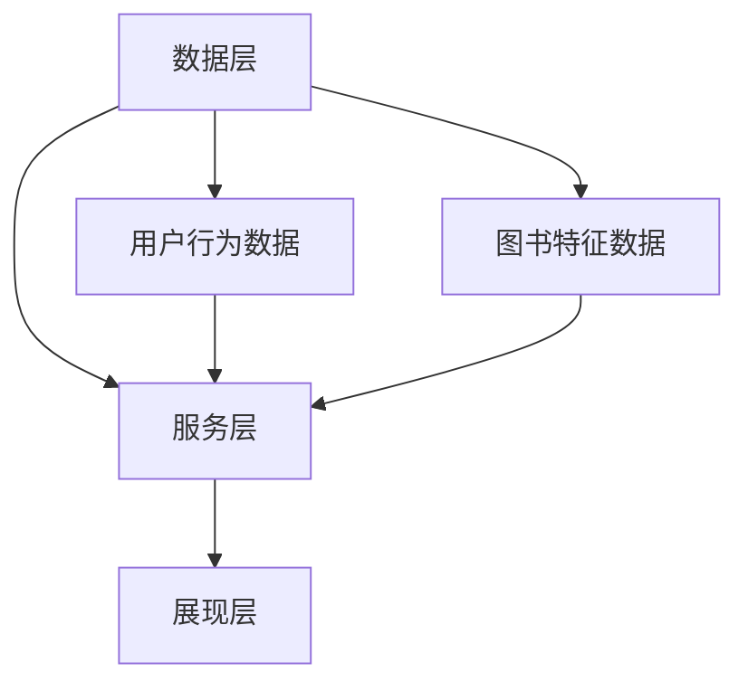

                 

# 文章标题：AI出版业机遇：垂直领域广阔

> 关键词：人工智能，出版业，垂直领域，内容创作，编辑辅助，推荐系统，应用案例，发展趋势，挑战与对策

> 摘要：本文探讨了人工智能在出版业的应用及其在垂直领域的机遇。通过分析AI技术的发展与应用，探讨了其在内容创作与编辑、图书出版、期刊出版等方面的应用，并结合具体案例展示了AI在出版业中的实际效果。同时，文章还分析了AI出版业的发展趋势和面临的挑战，为读者提供了全面的见解和思考。

## 《AI出版业机遇：垂直领域广阔》目录大纲

### 第一部分：AI在出版业的背景与机遇

#### 第1章：AI出版业概述

##### 1.1 出版业的现状与挑战

###### 1.1.1 出版业的发展历程

出版业作为文化产业发展的重要组成部分，其发展历程可以追溯到数千年前。从最初的甲骨文、竹简到纸张、印刷术的发明，再到现代的电子出版和数字出版，出版业经历了重大的变革。电子出版和数字出版的发展，为出版业带来了新的机遇和挑战。

###### 1.1.2 传统出版业面临的挑战

随着互联网和信息技术的飞速发展，传统出版业面临着一系列挑战。首先，出版市场的竞争日益激烈，出版社需要不断创新以吸引读者。其次，出版内容的形式和渠道发生了巨大变化，数字化、多媒体化和网络化趋势明显。最后，出版业的成本也在不断上升，包括纸张、印刷、物流等成本。

###### 1.1.3 AI在出版业的应用前景

人工智能技术在出版业的应用前景广阔。AI可以帮助出版社提高内容创作和编辑的效率，优化出版流程，降低成本，提升用户体验。此外，AI还可以帮助出版社实现精准推荐，提高销售和利润。总的来说，AI将为出版业带来深远的变革。

##### 1.2 AI技术的发展与应用

###### 1.2.1 人工智能的基础知识

人工智能（AI）是一门研究、开发用于模拟、延伸和扩展人的智能的理论、方法、技术及应用系统的技术科学。它包括机器学习、自然语言处理、计算机视觉、语音识别等多个子领域。

###### 1.2.2 机器学习在出版业的应用

机器学习是AI的核心技术之一，它在出版业的应用主要体现在内容创作、编辑辅助、推荐系统等方面。通过机器学习算法，可以自动生成内容、分析用户行为、预测用户需求，从而提高出版效率和用户体验。

###### 1.2.3 深度学习在出版业的应用

深度学习是机器学习的一个分支，它通过多层神经网络模型模拟人脑的思考方式。在出版业中，深度学习算法可以用于文本分析、图像识别、语音识别等方面，为出版业提供了更高效、精准的技术手段。

##### 1.3 垂直领域与AI结合

###### 1.3.1 垂直领域概述

垂直领域是指特定的行业或领域，如医疗、金融、教育等。在出版业中，垂直领域包括专业书籍、学术期刊、教育读物等。垂直领域的出版具有专业性强、受众明确等特点。

###### 1.3.2 AI在垂直领域出版中的应用

AI在垂直领域出版中的应用主要体现在内容创作、编辑辅助、推荐系统等方面。通过AI技术，可以更好地满足垂直领域用户的需求，提高出版物的质量和影响力。

### 第二部分：AI在内容创作与编辑中的应用

#### 第2章：AI在内容创作与编辑中的应用

##### 2.1 自动内容生成

###### 2.1.1 文本生成模型

文本生成模型是AI在内容创作中的一个重要应用。通过预训练的模型（如GPT-3、BERT等），可以生成高质量的文本内容。这些模型通常基于大规模语料库进行训练，具有强大的文本生成能力。

```python
# 示例：使用GPT-3生成文章摘要
import openai
response = openai.Completion.create(
  engine="text-davinci-002",
  prompt="请为以下新闻编写一篇摘要：NASA recently launched the James Webb Space Telescope, a major upgrade to the Hubble Space Telescope.",
  max_tokens=60
)
print(response.choices[0].text.strip())
```

###### 2.1.2 图像生成模型

图像生成模型（如GAN、VAE等）可以通过学习大量的图像数据生成新的图像。在出版业中，图像生成模型可以用于创建创意图像、封面设计等。

```python
# 示例：使用GAN生成艺术图像
from keras.models import Sequential
from keras.layers import Dense, Activation, Flatten

model = Sequential()
model.add(Dense(1024, input_dim=784))
model.add(Activation('relu'))
model.add(Dense(784))
model.add(Activation('sigmoid'))

model.compile(loss='binary_crossentropy', optimizer='rmsprop')
model.fit(x_train, y_train, batch_size=32, epochs=50)
```

###### 2.1.3 自动内容生成的应用场景

自动内容生成在出版业中具有广泛的应用场景。例如，可以用于自动生成新闻摘要、社交媒体内容、产品描述等。通过AI技术，可以大大提高内容创作效率，降低成本。

##### 2.2 智能编辑辅助

###### 2.2.1 文本分析工具

文本分析工具（如自然语言处理（NLP）工具）可以帮助编辑快速分析文本内容，包括关键词提取、情感分析、文本分类等。

```python
# 示例：使用NLP工具提取关键词
from nltk.tokenize import word_tokenize
from nltk.corpus import stopwords

text = "This is a sample text for keyword extraction."
tokens = word_tokenize(text)
filtered_tokens = [w for w in tokens if not w.lower() in stopwords.words('english')]

# 获取关键词
keywords = [word for word in filtered_tokens if word[0].isupper()]
print(keywords)
```

###### 2.2.2 图像编辑工具

图像编辑工具（如深度学习模型）可以帮助编辑对图像进行增强、修复、风格转换等。

```python
# 示例：使用深度学习模型修复图像
from keras.models import load_model

model = load_model('image_repair_model.h5')
repaired_image = model.predict(image)

# 显示修复后的图像
plt.imshow(repaired_image)
plt.show()
```

###### 2.2.3 智能编辑的流程与效果

智能编辑的流程通常包括文本分析、图像编辑、内容整合等步骤。通过AI技术，可以大大提高编辑效率，降低人力成本，同时提高内容质量。

##### 2.3 内容推荐系统

###### 2.3.1 推荐系统的基本原理

内容推荐系统是基于用户兴趣和行为数据进行内容推荐的系统。推荐系统通常分为基于内容的推荐和基于协同过滤的推荐。

基于内容的推荐：通过分析内容的特征，为用户推荐与其兴趣相关的其他内容。

基于协同过滤的推荐：通过分析用户之间的行为数据，为用户推荐其他用户喜欢的内容。

###### 2.3.2 基于内容的推荐

基于内容的推荐系统通过分析内容的特征（如关键词、标签、分类等），为用户推荐与其兴趣相关的其他内容。这种方法通常适用于垂直领域出版。

```python
# 示例：基于内容的推荐系统
from sklearn.metrics.pairwise import cosine_similarity
from sklearn.feature_extraction.text import TfidfVectorizer

# 假设已有一篇文档
document = "人工智能在出版业的应用"

# 建立TF-IDF向量模型
vectorizer = TfidfVectorizer()
tfidf_matrix = vectorizer.fit_transform([document])

# 计算相似度
similar_documents = cosine_similarity(tfidf_matrix, tfidf_matrix)

# 获取相似度最高的文档
index = np.argmax(similar_documents)
print(index)
```

###### 2.3.3 基于协同过滤的推荐

基于协同过滤的推荐系统通过分析用户之间的行为数据（如浏览、购买、评论等），为用户推荐其他用户喜欢的内容。这种方法通常适用于通用领域出版。

```python
# 示例：基于协同过滤的推荐系统
from surprise import KNNWithMeans
from surprise import Dataset, Reader

# 假设已有用户行为数据
user行为数据 = ...

# 创建Reader
reader = Reader(rating_scale=(1, 5))

# 加载数据集
data = Dataset.load_from_df(user行为数据, reader)

# 创建协同过滤算法
algorithm = KNNWithMeans()

# 训练模型
algorithm.fit(data)

# 为用户推荐内容
推荐内容 = algorithm.get Neighbor Recommend Items()

# 输出推荐内容
print(推荐内容)
```

### 第二部分：AI在出版业的具体应用案例

#### 第3章：AI在图书出版中的应用

##### 3.1 图书自动分类

###### 3.1.1 分类算法原理

图书自动分类是利用分类算法（如K-均值聚类、决策树等）对图书进行自动分类的过程。分类算法通过对图书的特征进行学习，将图书分为不同的类别。

```python
# 示例：使用K-均值聚类进行图书分类
from sklearn.cluster import KMeans
import numpy as np

# 假设已有图书特征数据
features = ...

# 设置聚类中心数量
n_clusters = 5

# 初始化K-均值聚类模型
kmeans = KMeans(n_clusters=n_clusters, random_state=0)

# 拟合模型
kmeans.fit(features)

# 获取图书类别
labels = kmeans.predict(features)

# 输出图书类别
print(labels)
```

###### 3.1.2 图书分类的应用场景

图书分类在出版业中具有广泛的应用场景。例如，可以用于自动构建图书目录、推荐相关图书、优化库存管理等。

###### 3.1.3 分类系统的实现与优化

图书分类系统的实现主要包括数据预处理、特征提取、模型选择和优化等步骤。在实现过程中，需要对图书的特征进行深入分析，并选择合适的分类算法。此外，还需要对分类系统进行持续优化，以提高分类准确率和效率。

##### 3.2 图书智能推荐

###### 3.2.1 推荐算法原理

图书智能推荐系统是基于用户历史行为数据（如购买、浏览、评论等）为用户推荐相关图书的算法。推荐算法主要包括基于内容的推荐和基于协同过滤的推荐。

基于内容的推荐：通过分析图书的内容特征，为用户推荐与其兴趣相关的其他图书。

基于协同过滤的推荐：通过分析用户之间的行为数据，为用户推荐其他用户喜欢的相关图书。

###### 3.2.2 智能推荐系统的架构

智能推荐系统通常包括数据层、服务层和展现层。数据层负责收集、存储和处理用户行为数据和图书特征数据；服务层负责实现推荐算法，为用户提供推荐结果；展现层负责将推荐结果呈现给用户。



###### 3.2.3 推荐系统的实现与评估

图书推荐系统的实现主要包括数据预处理、特征工程、模型训练和评估等步骤。在实现过程中，需要对用户行为数据和图书特征数据进行深入分析，并选择合适的推荐算法。此外，还需要对推荐系统进行持续评估和优化，以提高推荐效果。

##### 3.3 图书版权管理

###### 3.3.1 版权管理的基本概念

版权管理是指对图书的版权进行保护和管理的一系列措施。版权管理的基本概念包括版权声明、版权保护、版权许可等。

版权声明：在图书中明确说明作品的版权信息，包括版权所有者、版权有效期等。

版权保护：通过技术手段保护图书的版权，防止未经授权的复制、传播等行为。

版权许可：授权他人使用图书的版权，通常包括授权范围、授权期限等。

###### 3.3.2 版权保护的技术手段

版权保护的技术手段主要包括数字水印、数字签名、加密等。

数字水印：将特定的信息（如版权所有者、版权有效期等）嵌入到数字图书中，以证明版权归属。

数字签名：使用数字证书对图书进行签名，确保图书的完整性和可信度。

加密：对图书进行加密处理，只有授权用户才能解密和阅读。

###### 3.3.3 版权管理系统的实现与运营

版权管理系统的实现主要包括版权声明、版权保护、版权许可等功能的实现。版权管理系统需要与图书出版系统、用户管理系统等紧密集成，实现版权信息的自动收集、管理和发布。

### 第三部分：AI在期刊出版中的应用

#### 第4章：AI在期刊出版中的应用

##### 4.1 期刊智能审稿

###### 4.1.1 审稿过程的AI辅助

期刊智能审稿是利用AI技术辅助审稿过程，提高审稿效率和质量的系统。AI辅助审稿通常包括文本分析、智能标注、审稿评价等功能。

文本分析：利用NLP技术对论文进行内容分析，提取关键信息，评估论文的质量和可读性。

智能标注：利用机器学习算法对论文进行分类、标注，帮助审稿人快速识别论文的主要观点和贡献。

审稿评价：利用评估模型对审稿人的评价进行评分，提供审稿意见的参考。

###### 4.1.2 审稿系统的实现与评估

审稿系统的实现主要包括数据收集、模型训练、系统部署等步骤。在实现过程中，需要对审稿数据进行分析，选择合适的算法和评估指标，并对系统进行持续评估和优化。

###### 4.1.3 AI审稿的优势与挑战

AI审稿的优势包括提高审稿效率、降低审稿成本、减少人为误差等。然而，AI审稿也面临一些挑战，如算法的公平性、透明度、数据隐私等问题。

##### 4.2 期刊内容分析

###### 4.2.1 文章内容分析算法

文章内容分析算法主要包括文本分类、情感分析、关键词提取等。

文本分类：将文章分为不同的类别，如科技、医学、文学等。

情感分析：分析文章的情感倾向，如积极、消极、中性等。

关键词提取：从文章中提取关键信息，帮助用户快速了解文章的主要内容。

###### 4.2.2 期刊内容分析的应用场景

期刊内容分析在出版业中具有广泛的应用场景。例如，可以用于期刊选题、内容策划、读者需求分析等。

###### 4.2.3 内容分析系统的实现与优化

内容分析系统的实现主要包括数据预处理、特征提取、模型训练等步骤。在实现过程中，需要对文章的内容特征进行分析，选择合适的算法和评估指标，并对系统进行持续优化。

##### 4.3 期刊推广与营销

###### 4.3.1 期刊推广策略

期刊推广策略包括线上推广和线下推广两种方式。

线上推广：利用社交媒体、电子邮件、搜索引擎等渠道进行推广。

线下推广：通过参加学术会议、举办讲座、合作出版等方式进行推广。

###### 4.3.2 智能营销工具

智能营销工具（如AI客服、AI广告等）可以帮助期刊实现精准营销，提高市场占有率。

###### 4.3.3 期刊营销效果评估

期刊营销效果评估主要包括用户满意度、市场占有率、品牌影响力等指标。通过对这些指标的评估，可以了解期刊的营销效果，为后续营销策略提供参考。

### 第四部分：AI出版业的发展趋势与未来展望

#### 第5章：AI出版业的发展趋势

##### 5.1 技术发展趋势

AI技术在出版业的应用趋势包括以下几个方面：

1. 智能内容生成：通过预训练的模型（如GPT-3、BERT等），可以实现高质量的内容生成，满足不同领域的需求。

2. 智能编辑辅助：利用NLP和计算机视觉技术，可以提高编辑的效率和质量，降低人力成本。

3. 智能推荐系统：通过分析用户行为数据和内容特征，可以实现精准的内容推荐，提高用户体验和满意度。

4. 版权保护技术：利用数字水印、数字签名等加密技术，可以更好地保护版权，减少侵权行为。

##### 5.2 市场发展趋势

AI出版业的市场发展趋势包括以下几个方面：

1. 垂直领域市场的细分：随着AI技术的不断发展，垂直领域市场将越来越细分，满足专业用户的需求。

2. 数字化转型的加速：随着数字出版和电子书的普及，传统出版业将加速数字化转型，提高出版效率和降低成本。

3. 精准营销的普及：通过智能营销工具，可以实现精准营销，提高市场占有率和品牌影响力。

4. 法规和政策的不断完善：随着AI技术在出版业的广泛应用，各国将不断完善相关法规和政策，保障出版业的健康发展。

##### 5.3 技术发展对出版业的影响

AI技术的发展将对出版业产生深远的影响，包括：

1. 提高出版效率：通过自动化和智能化技术，可以大大提高出版效率，降低人力成本。

2. 改善用户体验：通过个性化推荐和智能编辑辅助，可以提供更优质的阅读体验。

3. 优化出版流程：通过数字化和智能化技术，可以优化出版流程，降低出版成本。

4. 促进产业升级：AI技术的应用将推动出版业的产业升级，培育新的经济增长点。

### 第五部分：结语

#### 第6章：结语

##### 6.1 AI出版业的现状与未来

当前，AI技术在出版业的应用已经取得了一定的成果，但仍然存在一些挑战，如算法公平性、数据隐私等。未来，随着AI技术的不断发展和普及，AI将在出版业发挥更大的作用，推动出版业的数字化转型和产业升级。

##### 6.2 结语

本文对AI在出版业的应用进行了全面的分析和探讨，从背景与机遇、具体应用案例、发展趋势与未来展望等多个方面进行了阐述。通过本文的阅读，读者可以了解到AI在出版业的广泛应用和巨大潜力。未来，AI技术将继续在出版业发挥重要作用，为出版业带来更多的机遇和挑战。

### 附录

#### 附录A：AI出版业相关术语解释

##### A.1 术语解释

- 人工智能（AI）：模拟、延伸和扩展人类智能的理论、方法、技术及应用系统。

- 机器学习（ML）：从数据中自动学习规律和模式，并对其进行预测和决策的技术。

- 深度学习（DL）：基于多层神经网络模型进行学习的一种机器学习方法。

- 自然语言处理（NLP）：研究如何让计算机理解和生成人类语言的技术。

- 内容推荐系统：基于用户兴趣和行为数据为用户推荐相关内容的系统。

- 数字水印：将特定信息嵌入到数字图书中，以证明版权归属。

- 数字签名：使用数字证书对图书进行签名，确保图书的完整性和可信度。

##### A.2 常用AI工具介绍

- TensorFlow：谷歌开发的开源机器学习框架，广泛应用于深度学习领域。

- PyTorch：Facebook开发的开源机器学习框架，具有简单易用、灵活性强等特点。

- Keras：基于TensorFlow和Theano的开源神经网络库，提供了简洁的API。

- 其他常用工具：Scikit-learn、NumPy、Pandas等。

##### A.3 AI出版业相关资源

- 学术论文与报告：相关领域的学术论文和报告，如ACL、ICML、NeurIPS等。

- 开源代码与数据集：相关项目的开源代码和数据集，如GitHub、Google Dataset Search等。

- 行业报告与白皮书：行业分析报告和白皮书，如IDC、CBInsights等。

- 相关组织与论坛：相关领域的组织与论坛，如IEEE、ACL、NAACL等。

