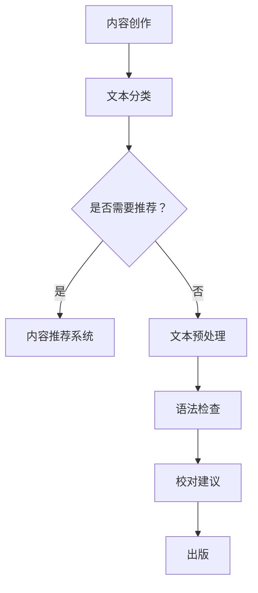
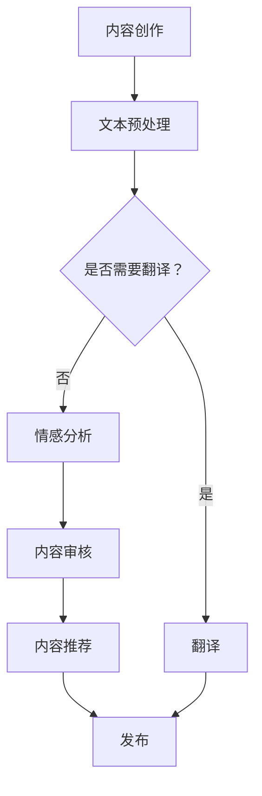
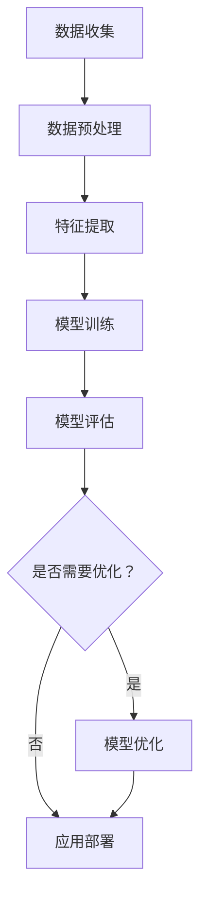
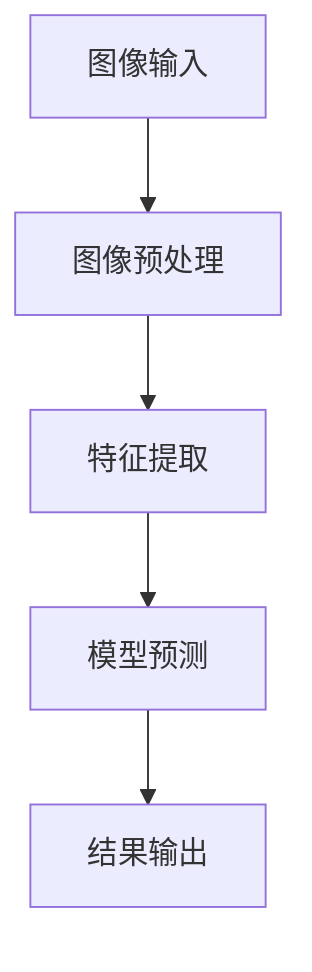

                 

### 文章标题

《AI出版业机遇：垂直领域无限想象》

### 关键词

- AI出版业
- 垂直领域
- 内容个性化
- 智能编辑
- 版权管理

### 摘要

在数字化浪潮的推动下，人工智能（AI）技术正在深刻改变出版业的各个方面。本文将从AI出版业的发展背景出发，探讨AI技术在出版业中的应用、垂直领域AI出版的机遇与挑战，并分析教育、医学、法律和财经等垂直领域的AI出版应用案例。最后，本文将对AI出版业的未来趋势进行展望，并给出出版业AI战略规划与实施的策略。

---

#### 第一部分：AI出版业背景与机遇

##### 第1章：AI出版业概览

**1.1 AI技术在出版业中的应用概述**

在人工智能技术的推动下，出版业正在经历一场变革。AI技术被广泛应用于内容创作、编辑、校对、推荐、版权管理等多个环节。以下是一些AI技术在出版业中的应用概述：

1. **内容创作**：AI技术可以自动生成新闻、文章、摘要等，提高内容生产效率。例如，Google的AI助手可以撰写新闻稿，微软的Copilot可以帮助开发者编写代码。

2. **编辑与校对**：AI算法可以自动检测文本中的错误，提供实时修改建议，如Grammarly和Ginger等工具。

3. **内容推荐**：基于用户行为和兴趣的推荐系统可以精准推送相关内容，提升用户体验。例如，亚马逊的推荐系统和YouTube的推荐算法。

4. **版权管理**：AI技术可以自动化版权追踪和管理，降低版权纠纷风险，如RightFind和Copyright Clearance Center等平台。

**1.2 出版业面临的挑战与机遇**

随着AI技术的不断进步，出版业既面临挑战，也迎来机遇：

1. **内容过剩与个性化需求**：随着数字化出版的发展，内容数量爆炸式增长，用户对个性化、高质量内容的需求也日益增加。

2. **效率提升与成本降低**：AI技术可以提高内容生产、编辑和推荐的效率，降低人力成本。

3. **版权保护与道德风险**：AI技术可以自动化版权追踪，但也可能引发内容滥用和隐私泄露等问题。

**1.3 垂直领域AI出版案例分析**

在垂直领域，AI出版业已经取得了显著的成果。以下是一些案例分析：

1. **教育出版**：AI技术可以个性化教学，提高教育质量。例如，Coursera和edX等在线教育平台使用AI技术提供个性化学习路径。

2. **医学出版**：AI技术可以辅助医生诊断和制定治疗方案。例如，IBM的Watson for Oncology可以提供基于证据的医学建议。

3. **法律出版**：AI技术可以自动化法律文档生成和审核。例如，Kira Systems可以自动识别合同中的关键条款。

4. **财经出版**：AI技术可以实时分析金融市场数据，提供投资建议。例如，Citadel和Jane Street等量化交易平台使用AI技术进行交易。

---

##### 第2章：AI核心技术与出版业融合

**2.1 自然语言处理在出版业的应用**

自然语言处理（NLP）是AI技术在出版业的重要应用之一。以下是一些关键技术和应用场景：

1. **文本分类**：利用NLP技术，可以对大量文本进行自动分类，例如将新闻文章分类为体育、政治、娱乐等。

2. **情感分析**：通过分析文本中的情感倾向，可以评估用户对内容的喜好程度。例如，Twitter和Facebook等社交媒体平台使用情感分析技术监测用户情绪。

3. **命名实体识别**：NLP技术可以识别文本中的特定实体，如人名、地名、组织名等。这对于内容推荐和版权管理具有重要意义。

**2.2 计算机视觉与出版业结合**

计算机视觉（CV）技术在出版业也有广泛应用。以下是一些关键技术和应用场景：

1. **图像识别**：计算机视觉技术可以识别图像中的物体和场景，例如人脸识别、场景分类等。

2. **图像增强**：通过图像增强技术，可以提高图像的质量，例如去噪、对比度增强等。

3. **OCR（光学字符识别）**：计算机视觉技术可以自动识别图像中的文字，这对于古籍数字化和文档管理具有重要意义。

**2.3 机器学习算法在出版数据分析中的应用**

机器学习算法在出版数据分析中发挥着重要作用。以下是一些关键技术和应用场景：

1. **推荐系统**：基于用户行为和兴趣的推荐系统，可以提升内容推荐的质量和效率。

2. **数据挖掘**：通过数据挖掘技术，可以从大量出版数据中提取有价值的信息，如用户偏好、内容热点等。

3. **聚类分析**：机器学习算法可以自动将相似的内容或用户分组，有助于内容管理和用户细分。

---

##### 第3章：AI出版业商业模式创新

**3.1 垂直领域内容个性化推荐**

在垂直领域，AI技术可以精准推送个性化内容，提升用户体验和满意度。以下是一些关键技术和实践：

1. **用户画像**：通过用户行为数据，构建用户画像，了解用户兴趣和需求。

2. **内容标签化**：对内容进行标签化处理，便于分类和推荐。

3. **协同过滤**：基于用户行为和内容标签，使用协同过滤算法进行个性化推荐。

**3.2 智能编辑与校对**

智能编辑与校对技术可以自动化文本处理，提高出版质量。以下是一些关键技术和实践：

1. **语法检查**：利用自然语言处理技术，自动检测文本中的语法错误。

2. **语义分析**：通过语义分析，理解文本内容，提供更准确的修改建议。

3. **实时校对**：在内容创作过程中，实时检测并纠正错误，提高编辑效率。

**3.3 AI驱动的版权管理与追踪**

AI技术可以自动化版权管理，降低版权纠纷风险。以下是一些关键技术和实践：

1. **版权识别**：通过机器学习算法，自动识别文本中的版权信息。

2. **版权监控**：实时监控文本的使用情况，防止侵权行为。

3. **版权管理**：自动化处理版权转让、许可等事务，提高管理效率。

---

#### 第二部分：垂直领域AI出版应用案例

##### 第4章：教育出版

**4.1 教育出版中的AI技术应用**

在教育出版领域，AI技术正在改变传统教学模式，提升教育质量。以下是一些关键技术和应用：

1. **个性化学习**：基于学生数据和AI算法，提供个性化学习路径和资源，满足不同学生的学习需求。

2. **自适应学习系统**：通过实时评估学生的学习情况，自动调整教学策略，提高学习效果。

3. **智能教学助手**：利用自然语言处理技术，为学生提供实时解答和辅导。

**4.2 个性化学习与自适应学习系统**

个性化学习和自适应学习系统是教育出版中最重要的AI应用之一。以下是一些关键技术和实现：

1. **用户行为分析**：通过分析学生的学习行为，了解他们的学习偏好和薄弱环节。

2. **学习路径推荐**：根据用户行为和学习需求，推荐适合的学习资源和路径。

3. **实时评估与反馈**：通过AI算法，实时评估学生的学习效果，提供个性化的反馈和指导。

**4.3 人工智能在教育出版中的挑战与机遇**

虽然AI技术在教育出版中带来了许多机遇，但也面临一些挑战：

1. **隐私保护**：学生数据的隐私保护是重要问题，需要制定相应的政策和措施。

2. **技术普及**：在偏远地区和教育资源不足的地区，AI技术的普及和实施仍然存在困难。

3. **伦理问题**：AI技术在教育中的使用可能引发一些伦理问题，如算法偏见、隐私侵犯等。

---

##### 第5章：医学出版

**5.1 医学出版中的AI应用案例**

在医学出版领域，AI技术正在被广泛应用于内容生成、数据分析、诊断支持等方面。以下是一些关键技术和应用案例：

1. **医学文章写作**：AI技术可以自动生成医学文章，提高内容生产效率。

2. **医学图像分析**：利用计算机视觉技术，对医学图像进行分析，辅助医生诊断。

3. **电子病历管理**：AI技术可以自动整理和分析电子病历，提供诊断和治疗方案建议。

**5.2 人工智能辅助医学内容生成**

人工智能辅助医学内容生成是医学出版中的一个重要应用。以下是一些关键技术和实现：

1. **知识图谱构建**：通过构建医学知识图谱，将医学信息进行结构化处理。

2. **自然语言处理**：利用NLP技术，自动生成医学文章、摘要和报告。

3. **数据整合与处理**：将不同来源的医学数据整合和处理，提供准确和全面的内容。

**5.3 医学出版行业的AI挑战与前景**

医学出版行业在AI技术应用的挑战与前景如下：

1. **数据质量与安全**：医学数据的质量和安全是关键问题，需要严格的监管和保障。

2. **技术成熟度**：虽然AI技术在医学出版中有许多应用，但部分技术仍需进一步成熟和完善。

3. **市场接受度**：医生和医疗机构对AI技术的接受度需要提高，以推动AI技术在医学出版中的应用。

---

##### 第6章：法律出版

**6.1 法律出版中的AI应用**

在法律出版领域，AI技术可以自动化法律文档的生成、审核和管理，提高工作效率。以下是一些关键技术和应用：

1. **法律文档生成**：利用自然语言处理技术，自动生成法律合同、协议和判决书。

2. **法律文档审核**：通过机器学习算法，自动检测法律文档中的潜在问题，提供修改建议。

3. **法律数据库构建**：利用知识图谱和自然语言处理技术，构建法律数据库，提供智能化搜索和查询服务。

**6.2 智能法律文档生成与审核**

智能法律文档生成与审核是法律出版中最重要的AI应用之一。以下是一些关键技术和实现：

1. **语义分析**：通过语义分析，理解法律文档中的语言和含义，提供准确的生成和审核。

2. **规则引擎**：利用规则引擎，将法律规则转化为计算机程序，自动化生成和审核法律文档。

3. **案例库构建**：通过构建案例库，提供丰富的法律案例数据，辅助文档生成和审核。

**6.3 法律出版行业的AI趋势分析**

随着AI技术的不断发展，法律出版行业呈现出以下趋势：

1. **自动化与智能化**：AI技术将不断应用于法律文档的生成、审核和管理，提高工作效率。

2. **数据驱动的法律研究**：通过大数据分析，发现法律趋势和规律，提供更准确的法律信息。

3. **跨学科合作**：法律出版行业将与人工智能、大数据、区块链等新兴技术进行深度融合，推动行业发展。

---

##### 第7章：财经出版

**7.1 财经出版中的AI应用案例**

在财经出版领域，AI技术被广泛应用于金融数据分析、市场预测、投资建议等方面。以下是一些关键技术和应用案例：

1. **金融市场数据分析**：利用自然语言处理和机器学习技术，对大量财经文本进行分析，提取关键信息。

2. **市场预测**：通过分析历史数据和当前市场趋势，使用机器学习算法进行市场预测。

3. **投资建议**：基于用户投资偏好和风险承受能力，提供个性化的投资建议。

**7.2 金融市场数据分析与预测**

金融市场数据分析与预测是财经出版中的核心应用之一。以下是一些关键技术和实现：

1. **时间序列分析**：通过时间序列分析，挖掘市场趋势和周期性变化。

2. **机器学习算法**：使用机器学习算法，如回归分析、神经网络等，进行市场预测。

3. **大数据处理**：通过大数据处理技术，整合多源数据，提供更全面的市场分析。

**7.3 财经出版的AI机遇与挑战**

财经出版行业在AI技术应用的机遇与挑战如下：

1. **数据获取与整合**：获取和整合高质量的财经数据是AI应用的基础，需要解决数据获取和整合的难题。

2. **算法透明性与可解释性**：算法的透明性和可解释性是用户信任AI技术的重要保障，需要提高算法的可解释性。

3. **法律法规与伦理**：财经出版行业需要遵守相关法律法规，同时关注AI技术在财经领域的伦理问题。

---

#### 第三部分：AI出版业未来展望与策略

##### 第8章：AI出版业的发展趋势

**8.1 AI出版技术发展预测**

随着AI技术的不断进步，AI出版业将呈现出以下发展趋势：

1. **智能化与个性化**：AI技术将更加智能化和个性化，提供更符合用户需求的内容和服务。

2. **跨学科融合**：AI出版业将与大数据、区块链、物联网等新兴技术进行深度融合，推动出版业的创新发展。

3. **智能化编辑与校对**：AI技术将在编辑与校对环节发挥更大作用，提高出版效率和质量。

**8.2 垂直领域AI出版的未来**

垂直领域AI出版的未来将充满机遇和挑战。以下是一些关键趋势：

1. **个性化教育与医疗**：在教育、医疗等垂直领域，AI技术将实现更深入的个性化应用，提升服务质量。

2. **智能化法律与财经**：在法律、财经等领域，AI技术将助力专业化内容生成、分析和管理，提高行业效率。

3. **开放与合作**：垂直领域AI出版将更加开放和合作，推动跨领域的技术融合和创新。

**8.3 出版业与AI的协同创新**

出版业与AI技术的协同创新是推动行业发展的关键。以下是一些协同创新的途径：

1. **技术平台建设**：建立统一的AI出版技术平台，提供丰富的AI功能和服务。

2. **人才培养与引进**：培养和引进AI专业人才，推动AI技术在出版业的创新应用。

3. **合作与共享**：鼓励跨领域、跨行业的合作与共享，共同推动AI出版业的发展。

---

##### 第9章：出版业AI战略规划与实施

**9.1 AI战略规划框架**

制定AI战略规划是出版业实现AI应用的关键步骤。以下是一个AI战略规划的基本框架：

1. **需求分析**：明确AI技术在出版业的需求，如内容创作、编辑、校对、推荐等。

2. **技术评估**：评估现有AI技术的成熟度和适用性，选择合适的AI技术进行应用。

3. **资源规划**：规划AI应用的资源需求，包括人力、技术、资金等。

4. **风险评估**：评估AI应用可能面临的风险，制定相应的应对措施。

5. **实施计划**：制定详细的AI应用实施计划，包括时间表、任务分配等。

**9.2 AI出版项目的评估与执行**

在AI出版项目的评估与执行过程中，需要注意以下几点：

1. **目标明确**：明确AI出版项目的主要目标，如提高内容生产效率、提升用户体验等。

2. **技术验证**：在项目实施过程中，进行技术验证，确保AI技术能够满足项目需求。

3. **用户反馈**：收集用户反馈，及时调整AI应用的策略和功能。

4. **持续优化**：根据项目实施过程中的反馈和数据分析，不断优化AI应用，提高效果。

5. **风险管理**：制定风险管理计划，确保项目能够在控制风险的情况下顺利进行。

**9.3 AI出版企业的竞争策略**

在竞争激烈的AI出版市场中，企业需要制定有效的竞争策略。以下是一些建议：

1. **技术创新**：持续投入研发，保持技术领先地位。

2. **用户体验**：注重用户体验，提供个性化、高质量的内容和服务。

3. **资源整合**：通过战略合作、联盟等方式，整合行业内外的资源，提高竞争力。

4. **品牌建设**：加强品牌建设和宣传，提升企业知名度。

5. **市场拓展**：积极拓展国际市场，扩大企业影响力。

---

#### 附录

**附录A：AI出版相关工具与资源**

**A.1 AI出版开发工具介绍**

以下是一些常用的AI出版开发工具：

- **GPT-3**：OpenAI的预训练语言模型，可用于内容生成、推荐系统等。

- **TensorFlow**：谷歌开发的机器学习框架，支持多种深度学习模型。

- **PyTorch**：Facebook开发的机器学习框架，易于调试和扩展。

**A.2 AI出版平台与解决方案**

以下是一些AI出版平台和解决方案：

- **AI Writer**：一款基于AI的自动写作工具，可快速生成文章和报告。

- **Watson Publishing Platform**：IBM的AI出版平台，提供内容生成、推荐、版权管理等功能。

- **RightFind**：提供AI驱动的版权管理解决方案。

**A.3 AI出版行业报告与资讯**

以下是一些AI出版行业的报告和资讯来源：

- **IDC**：国际数据公司发布的AI出版行业报告。

- **Market Research Future**：提供AI出版市场的研究报告。

- **AI Publishing**：一个专注于AI出版领域的资讯网站。

---

**附录B：AI核心技术与流程图**

**B.1 自然语言处理与出版流程图**

以下是一个自然语言处理在出版业中的流程图示例：



**B.2 机器学习算法与出版应用**

以下是一个简单的机器学习算法在出版业中的应用示例：

```python
# 假设我们有一个简单的线性回归模型
# Y = aX + b

# 模型初始化
a = 1.0
b = 0.0

# 训练数据
X_train = [1, 2, 3, 4, 5]
Y_train = [2, 4, 5, 4, 5]

# 计算模型参数
for i in range(len(X_train)):
    a = a + (Y_train[i] - (a*X_train[i] + b))

# 预测新数据
X_new = 6
Y_new = a*X_new + b

print(f"预测值：{Y_new}")
```

**B.3 计算机视觉与图像识别**

以下是一个简单的计算机视觉与图像识别算法示例：

```python
# 假设我们有一个简单的图像识别模型

# 模型初始化
model = load_pretrained_model()

# 输入图像
image = load_image("example.jpg")

# 处理图像
processed_image = preprocess_image(image)

# 预测
prediction = model.predict(processed_image)

# 输出预测结果
print(f"预测结果：{prediction}")
```

---

**附录C：数学模型与公式**

**C.1 线性回归模型**

- 公式：
  $$ Y = aX + b $$

- 详细讲解：
  线性回归是一种常用的统计方法，用于建模两个变量之间的关系。公式中的 \( a \) 和 \( b \) 分别是模型参数，\( X \) 是自变量，\( Y \) 是因变量。通过训练数据集，可以计算出模型参数 \( a \) 和 \( b \) 的值，从而建立线性回归模型。

**C.2 概率与贝叶斯定理**

- 公式：
  $$ P(A|B) = \frac{P(B|A) \cdot P(A)}{P(B)} $$

- 详细讲解：
  贝叶斯定理是一种基于概率论的推理方法，用于计算在已知某些条件下某个事件发生的概率。公式中的 \( P(A|B) \) 是在事件 \( B \) 发生的条件下事件 \( A \) 发生的概率，\( P(B|A) \) 是在事件 \( A \) 发生的条件下事件 \( B \) 发生的概率，\( P(A) \) 和 \( P(B) \) 分别是事件 \( A \) 和事件 \( B \) 发生的概率。贝叶斯定理在AI出版业的版权管理和风险预测中具有重要的应用。

---

**附录D：项目实战与代码解读**

**D.1 基于GPT-3的个性化推荐系统**

**实战目的**：利用GPT-3模型构建一个个性化推荐系统，根据用户的历史行为推荐相关内容。

**开发环境**：Python，GPT-3 API

**源代码**：

```python
import openai

# 设置API密钥
openai.api_key = 'your_api_key'

# 定义推荐函数
def recommend_content(user_history):
    response = openai.Completion.create(
        engine="text-davinci-003",
        prompt=f"请根据以下用户历史内容生成推荐列表：{user_history}",
        max_tokens=50
    )
    return response.choices[0].text.strip()

# 示例用户历史行为
user_history = "用户最近阅读了《深度学习入门》和《Python编程基础》两本书。"

# 调用推荐函数
recommendations = recommend_content(user_history)
print(f"推荐内容：{recommendations}")
```

**代码解读与分析**：此代码段展示了如何使用GPT-3 API进行文本生成，用于创建一个简单的个性化推荐系统。通过传递用户的历史行为，模型可以生成一组推荐的内容。在实际部署中，还需考虑API调用的频率限制和性能优化等问题。此外，为了提高推荐系统的效果，可以结合其他数据源（如用户评分、评论等）进行综合分析。

---

**作者**：

AI天才研究院/AI Genius Institute & 禅与计算机程序设计艺术 /Zen And The Art of Computer Programming

---

在本文中，我们系统地探讨了AI出版业的背景、机遇、核心技术、垂直领域应用案例以及未来展望和策略。通过对AI技术在出版业的深入分析，我们发现AI技术不仅改变了传统出版模式，还为出版业带来了新的商业模式和创新机遇。在教育、医学、法律和财经等垂直领域，AI技术正发挥着越来越重要的作用，推动了行业的变革和发展。

随着AI技术的不断进步，我们可以预见，AI出版业将呈现出智能化、个性化、跨学科融合等发展趋势。出版业与AI技术的协同创新将成为推动行业发展的关键力量。在此过程中，出版业需要制定科学的AI战略规划，积极推进AI技术在出版业的应用，提高内容创作、编辑、推荐、版权管理等环节的效率和质量。

此外，出版业在AI技术应用过程中还需关注隐私保护、数据安全、伦理等问题，确保技术的可持续发展。同时，企业应加强人才培养与引进，提升团队的技术实力和创新能力，为AI出版业的未来发展打下坚实基础。

总之，AI出版业正迎来一场前所未有的变革。让我们携手共进，积极探索AI技术在出版业的应用，为出版业的繁荣和发展贡献力量。在未来的道路上，AI出版业将带来无限想象和机遇，让我们共同期待这一美好前景。

---

本文由AI天才研究院/AI Genius Institute和《禅与计算机程序设计艺术》/Zen And The Art of Computer Programming的作者共同撰写，旨在为读者呈现AI出版业的深度分析和见解。在撰写过程中，我们力求逻辑清晰、结构紧凑、内容丰富，以帮助读者全面了解AI出版业的现状、机遇和未来发展方向。感谢您的阅读，希望本文能为您带来启发和思考。

---

# 第一部分：AI出版业背景与机遇

### 第1章：AI出版业概览

#### 1.1 AI技术在出版业中的应用概述

随着人工智能（AI）技术的快速发展，出版业正迎来一场前所未有的变革。AI技术在出版业中的应用日益广泛，涵盖了内容创作、编辑与校对、推荐系统、版权管理等多个环节。以下是对AI技术在出版业中应用的具体概述：

1. **内容创作**：AI技术可以通过自然语言处理（NLP）和生成对抗网络（GAN）等技术自动生成新闻文章、书籍摘要、营销文案等。例如，OpenAI的GPT-3模型可以生成高质量的文章，微软的Copilot可以帮助开发者编写代码，这些技术大大提高了内容生产效率。

2. **编辑与校对**：AI算法可以自动检测文本中的语法错误、拼写错误和逻辑错误，提供实时修改建议。例如，Grammarly和Ginger等工具已经被广泛应用于文本编辑和校对。此外，AI技术还可以通过语义分析对内容进行深层次的审核和优化，提高出版物的质量和可读性。

3. **推荐系统**：基于用户行为和兴趣的推荐系统能够为读者推荐相关内容，提升用户体验。推荐系统通常采用协同过滤、内容推荐和混合推荐等算法来实现。例如，亚马逊和Netflix等平台使用推荐系统来个性化推送商品和视频。

4. **版权管理**：AI技术可以自动化版权追踪和管理，降低版权纠纷的风险。通过机器学习和自然语言处理技术，AI可以识别文本中的版权信息，监控内容的合法使用情况，并提供版权转让、许可等服务的自动化处理。例如，RightFind和Copyright Clearance Center等平台提供AI驱动的版权管理解决方案。

#### 1.2 出版业面临的挑战与机遇

在AI技术的推动下，出版业既面临挑战，也迎来了前所未有的机遇：

1. **挑战**：

    - **数据隐私与安全**：AI技术在出版业的应用需要大量用户数据，如何保护用户隐私和数据安全成为一大挑战。

    - **技术成本**：AI技术的开发和部署需要大量的资金投入，中小型出版企业可能面临资金压力。

    - **算法偏见**：AI算法可能存在偏见，导致推荐内容的不公平性，需要采取措施确保算法的公正性和透明性。

    - **就业影响**：AI技术可能取代部分传统出版工作，对出版从业人员的就业带来一定影响。

2. **机遇**：

    - **内容个性化**：AI技术可以基于用户行为和兴趣提供个性化内容，满足读者的多元化需求。

    - **效率提升**：AI技术可以自动化许多出版流程，提高工作效率，降低成本。

    - **创新商业模式**：AI技术为出版业带来了新的商业模式，如基于订阅的付费模式、智能广告推荐等。

    - **版权保护**：AI技术可以更有效地追踪和管理版权，降低版权纠纷的风险。

#### 1.3 垂直领域AI出版案例分析

在垂直领域，AI出版业已经取得了显著成果，以下是一些具体的案例分析：

1. **教育出版**：

    - **个性化学习**：AI技术可以分析学生的学习行为，提供个性化的学习路径和资源，如Coursera和edX等在线教育平台。

    - **自适应学习系统**：通过实时评估学生的学习情况，自动调整教学策略，如Knewton和DreamBox等教育科技公司。

    - **智能教学助手**：利用自然语言处理技术，为教师和学生提供实时解答和辅导，如Babylon Health等公司。

2. **医学出版**：

    - **医学文章写作**：AI技术可以自动生成医学文章，提高内容生产效率。

    - **医学图像分析**：利用计算机视觉技术，对医学图像进行分析，辅助医生诊断。

    - **电子病历管理**：AI技术可以自动整理和分析电子病历，提供诊断和治疗方案建议。

3. **法律出版**：

    - **智能法律文档生成**：AI技术可以自动生成法律合同、协议和判决书。

    - **法律文档审核**：通过机器学习算法，自动检测法律文档中的潜在问题。

    - **案例库构建**：通过构建案例库，提供智能化搜索和查询服务。

4. **财经出版**：

    - **金融市场数据分析**：通过自然语言处理和机器学习技术，对大量财经文本进行分析，提取关键信息。

    - **市场预测**：使用机器学习算法，对金融市场数据进行预测，提供投资建议。

    - **投资建议**：基于用户投资偏好和风险承受能力，提供个性化的投资建议。

通过以上分析，我们可以看到AI技术在出版业中的应用已经深入到各个垂直领域，并带来了显著的效益。在接下来的章节中，我们将进一步探讨AI核心技术在出版业中的应用，以及AI出版业商业模式创新的具体实践。

### 第2章：AI核心技术与出版业融合

#### 2.1 自然语言处理在出版业的应用

自然语言处理（NLP）是人工智能技术的重要组成部分，它在出版业中的应用范围广泛，包括文本分类、情感分析、命名实体识别等多个方面。

**文本分类**：文本分类是将文本数据根据其内容或特征分配到预定义的类别中。在出版业中，文本分类技术可以用于自动标记文章类别，例如将新闻文章分类为体育、政治、娱乐等。这不仅提高了内容管理的效率，还便于用户根据兴趣快速查找相关内容。

**情感分析**：情感分析旨在识别文本中的情感倾向，如正面、负面或中性。在出版业中，情感分析可以用于监测用户对书籍、文章、评论等内容的反馈，帮助出版商了解读者的情感反应，从而优化内容创作和推广策略。

**命名实体识别**：命名实体识别（NER）是NLP技术中的一个关键任务，它旨在识别文本中的特定实体，如人名、地名、组织名等。在出版业中，NER技术可以用于自动提取和标记文本中的关键信息，如书籍作者、出版日期、地点等，这对于内容推荐、数据分析等场景具有重要价值。

**具体应用案例**：

1. **内容推荐系统**：通过文本分类和情感分析技术，可以为用户推荐他们可能感兴趣的内容。例如，Amazon和Netflix等平台使用NLP技术分析用户的历史行为和评价，为他们推荐相关的商品和视频。

2. **文本审核与过滤**：NLP技术可以自动检测和过滤文本中的不良内容，如色情、暴力等，确保出版物的合规性和安全性。

3. **智能客服**：利用NLP技术，可以构建智能客服系统，自动解答用户的问题和提供帮助，提升用户体验。

#### 2.2 计算机视觉与出版业结合

计算机视觉（CV）技术通过分析和理解图像和视频，为出版业带来了新的机遇。以下是一些关键技术和应用：

**图像识别**：图像识别技术可以自动识别图像中的物体、场景和特征。在出版业中，图像识别可以用于自动分类图书封面、识别图像中的关键字等，提高内容管理的效率。

**图像增强**：图像增强技术通过提高图像的对比度、清晰度和细节，改善图像质量。在数字出版中，图像增强可以用于优化图书和杂志的图像，提升用户体验。

**OCR（光学字符识别）**：OCR技术可以将图像中的文字转换为机器可读的文本。在出版业中，OCR技术可以用于古籍数字化、电子书制作和文档管理，极大地提升了内容处理效率。

**具体应用案例**：

1. **电子书制作**：OCR技术可以自动识别和转换图像中的文字，将纸质书转换为电子书，便于数字化存储和分发。

2. **图像内容审核**：计算机视觉技术可以用于自动检测和过滤图像中的不良内容，确保出版物的合规性。

3. **图书分类与推荐**：利用图像识别技术，可以自动识别图书封面和内容，为读者推荐相关的书籍。

#### 2.3 机器学习算法在出版数据分析中的应用

机器学习算法在出版数据分析中发挥着重要作用，包括推荐系统、数据挖掘和聚类分析等。

**推荐系统**：推荐系统是机器学习在出版业中最常见的应用之一。通过分析用户的历史行为、评价和兴趣，推荐系统可以预测用户对特定内容的偏好，从而提高内容推荐的准确性。协同过滤、内容推荐和混合推荐是常见的推荐算法。

**数据挖掘**：数据挖掘技术可以从大量出版数据中提取有价值的信息，如用户偏好、内容热点、市场趋势等。这些信息可以为出版商提供数据驱动的决策支持，优化内容创作和营销策略。

**聚类分析**：聚类分析是一种无监督学习方法，它将相似的数据点分组。在出版业中，聚类分析可以用于用户细分、内容分类和市场定位等。

**具体应用案例**：

1. **个性化推荐**：利用机器学习算法，出版商可以基于用户行为和兴趣，提供个性化的内容推荐，提升用户体验和满意度。

2. **市场预测**：通过分析销售数据和用户反馈，机器学习算法可以预测市场趋势和用户需求，帮助出版商制定更精准的营销策略。

3. **内容分类**：利用聚类分析技术，可以将大量书籍和文章按照主题和风格进行分类，便于读者查找和购买。

综上所述，AI核心技术如自然语言处理、计算机视觉和机器学习算法在出版业中具有广泛的应用。通过这些技术的融合，出版业可以实现内容个性化、效率提升和智能化管理，为出版商和读者带来更多价值。在下一章中，我们将探讨AI出版业的商业模式创新，进一步揭示AI技术在出版业中的潜在商机。

#### 2.4 AI出版业商业模式创新

随着人工智能技术的不断发展和成熟，出版业的商业模式也在经历深刻的变革。AI技术的引入不仅提高了内容生产和管理的效率，也为出版商创造了新的商业模式和创新机遇。以下是对几种AI出版业商业模式创新的探讨：

**1. 垂直领域内容个性化推荐**

在垂直领域，如教育、医学和法律等领域，AI技术可以基于用户的行为、兴趣和需求，提供高度个性化的内容推荐。这种模式的核心在于精准匹配用户和内容，从而提升用户体验和满意度。

- **具体实施**：首先，通过分析用户的历史行为数据（如阅读历史、购买记录、搜索查询等），构建用户画像。其次，利用NLP和机器学习算法，分析内容标签和属性，为用户推荐相关的书籍、文章和视频。例如，Coursera和edX等在线教育平台已经广泛应用了这种模式，通过个性化推荐提高了用户的学习效果和平台黏性。

- **经济效益**：个性化推荐可以显著提升用户参与度和购买意愿，增加销售额和订阅量。同时，精准推荐也有助于降低内容推广成本，提高市场竞争力。

**2. 智能编辑与校对服务**

AI技术可以实现自动化编辑和校对，提高出版物的质量和效率。智能编辑与校对服务可以为出版商提供快速、准确的内容审核和修改建议。

- **具体实施**：通过自然语言处理和机器学习算法，AI系统可以自动检测文本中的语法错误、拼写错误、逻辑错误等，并提供修改建议。此外，AI系统还可以通过语义分析，提供内容优化建议，提高文本的表达效果。例如，Grammarly和Ginger等工具已经广泛应用，它们提供了智能编辑和校对服务，受到了用户的广泛欢迎。

- **经济效益**：智能编辑与校对服务可以大幅提高内容编辑和校对的效率，减少人力成本。同时，提高出版物质量，提升用户满意度，有助于增加市场份额和品牌价值。

**3. AI驱动的版权管理与追踪**

AI技术可以自动化版权追踪和管理，降低版权纠纷的风险，提高版权保护效率。AI驱动的版权管理服务可以为出版商提供全面的版权管理解决方案。

- **具体实施**：通过机器学习和自然语言处理技术，AI系统可以自动识别文本中的版权信息，监控内容的合法使用情况，并自动处理版权转让、许可等事务。例如，RightFind和Copyright Clearance Center等平台提供了AI驱动的版权管理服务，帮助出版商实现高效的版权管理。

- **经济效益**：AI驱动的版权管理服务可以降低版权纠纷的风险和成本，提高版权保护效率。同时，通过更有效的版权管理，出版商可以更好地利用内容资产，增加收入来源。

**4. 个性化订阅与付费模式**

AI技术可以帮助出版商实现个性化订阅和付费模式，根据用户的兴趣和需求，提供定制化的订阅计划和定价策略。

- **具体实施**：通过分析用户的行为数据和偏好，AI系统可以为用户推荐最适合的订阅计划和定价方案。例如，一些杂志和出版社已经开始采用个性化订阅模式，根据用户的阅读习惯和兴趣，提供不同的订阅选项和价格。

- **经济效益**：个性化订阅和付费模式可以提升用户的参与度和忠诚度，增加订阅量和收入。同时，通过更精准的定价策略，出版商可以更好地满足不同用户的需求，提高市场份额。

**5. 智能广告推荐**

AI技术可以基于用户的行为和兴趣，提供个性化的广告推荐，提高广告的投放效果和用户转化率。

- **具体实施**：通过分析用户的行为数据和兴趣标签，AI系统可以推荐相关的广告内容，提高广告的点击率和转化率。例如，一些在线平台已经开始采用AI驱动的广告推荐系统，根据用户的浏览历史和搜索行为，推荐相关的商品和服务。

- **经济效益**：智能广告推荐可以显著提高广告投放的效果和转化率，降低广告成本。同时，通过更精准的广告推荐，出版商可以更好地吸引潜在客户，增加销售收入。

综上所述，AI技术的引入为出版业带来了多种商业模式创新。通过个性化推荐、智能编辑与校对、AI驱动的版权管理、个性化订阅和智能广告推荐等创新模式，出版商可以提升内容质量和用户体验，降低运营成本，实现商业模式的转型升级。在下一章中，我们将深入探讨垂直领域AI出版应用案例，进一步展示AI技术在实际中的应用和成效。

### 第4章：垂直领域AI出版应用案例

#### 4.1 教育出版

教育出版是AI技术的重要应用领域之一。AI技术在教育出版中的应用不仅提升了教育质量，还改变了教学模式，为学生和教师提供了更加灵活和个性化的学习体验。

**教育出版中的AI技术应用**

1. **个性化学习与自适应学习系统**：

    - **个性化学习**：AI技术可以根据学生的学习进度、能力和兴趣，为学生推荐个性化的学习资源。例如，智能学习平台如Coursera、edX和Khan Academy等，通过分析学生的学习数据，为学生提供定制化的学习路径和推荐内容。
    - **自适应学习系统**：AI技术可以实时监测学生的学习行为和表现，自动调整教学内容和难度，以提高学习效果。例如，DreamBox和Knewton等自适应学习平台，通过分析学生的学习数据，动态调整学习策略，确保每个学生都能以最适合他们的方式学习。

2. **智能教学助手**：

    - **智能教学助手**：AI技术可以帮助教师管理课堂、提供教学反馈和解答学生问题。例如，Google Classroom和Microsoft Teams等教育平台，利用AI技术自动化教学任务、提供个性化反馈和解答学生疑问。

**个性化学习与自适应学习系统的实现**

- **用户行为分析**：AI系统通过分析学生的学习行为，如学习时间、学习进度、练习成绩等，构建用户画像，了解学生的学习需求和偏好。

- **学习路径推荐**：基于用户画像和学习数据，AI系统推荐适合的学习资源，包括视频、文章、练习题等。

- **实时评估与反馈**：AI系统实时评估学生的学习效果，提供个性化的反馈和指导，帮助学生克服学习困难，提高学习效率。

**人工智能在教育出版中的挑战与机遇**

- **挑战**：

    - **数据隐私**：个性化学习和自适应学习系统需要大量学生数据，如何保护学生的隐私和数据安全是重要挑战。
    - **技术成熟度**：虽然AI技术在教育出版中有许多应用，但某些技术仍需进一步成熟和完善，以确保教育质量。
    - **教师培训**：AI技术的引入需要教师进行相应的培训，以适应新的教学方式。

- **机遇**：

    - **提升教育质量**：AI技术可以提供个性化的学习体验，提高教育质量，促进教育公平。
    - **降低教育成本**：AI技术可以自动化教学任务，降低教育成本，使教育资源更加普及。
    - **教育创新**：AI技术为教育出版带来了新的创新机会，如虚拟现实（VR）教学、智能教育游戏等。

#### 4.2 医学出版

医学出版是另一个AI技术具有广泛应用潜力的领域。AI技术在医学出版中的应用，不仅提高了内容生产效率，还推动了医学研究和临床实践的智能化发展。

**医学出版中的AI应用案例**

1. **医学文章写作**：

    - **自动生成医学文章**：AI技术可以自动生成医学报告、论文和摘要，提高内容生产效率。例如，AI写作工具可以辅助医生撰写病例报告和研究论文。
    - **内容优化**：AI技术可以通过自然语言处理和机器学习算法，对医学文章进行语义分析和优化，提高文章的可读性和准确性。

2. **医学图像分析**：

    - **图像识别**：AI技术可以自动识别医学图像中的病变和组织结构，辅助医生进行诊断。例如，AI系统可以用于识别X光片、CT扫描和MRI图像中的病变。
    - **图像增强**：AI技术可以增强医学图像的对比度和清晰度，提高图像质量，帮助医生更准确地诊断。

3. **电子病历管理**：

    - **自动整理与分类**：AI技术可以自动整理和分类电子病历中的信息，提供快速检索和分析。例如，AI系统可以帮助医生快速找到相关的病例和文献。
    - **诊断与治疗建议**：AI技术可以通过分析电子病历和临床数据，为医生提供诊断和治疗方案建议，提高诊疗效率。

**医学出版行业的AI挑战与前景**

- **挑战**：

    - **数据隐私与安全**：医学数据包含敏感信息，如何保护患者的隐私和数据安全是重要挑战。
    - **算法偏见**：AI算法可能存在偏见，导致诊断和建议的不公平性，需要采取措施确保算法的公正性和透明性。
    - **技术成熟度**：某些AI技术在医学领域的应用仍需进一步验证和成熟，以确保医疗质量和安全。

- **前景**：

    - **提高医疗质量**：AI技术可以辅助医生进行诊断和治疗，提高医疗质量和效率。
    - **降低医疗成本**：AI技术可以自动化许多医疗流程，降低医疗成本，使医疗服务更加普及。
    - **医疗创新**：AI技术为医学出版带来了新的创新机会，如个性化治疗方案、智能药物研发等。

通过以上分析，我们可以看到AI技术在教育出版和医学出版中具有重要的应用价值。在未来的发展中，随着AI技术的不断进步，这些领域将继续迎来更多创新和机遇，为出版业带来新的增长点。

### 第5章：法律出版

#### 5.1 法律出版中的AI应用

法律出版领域正逐渐采用人工智能技术，以提高法律文献的生产、审核和管理效率。以下是一些关键AI应用：

**智能法律文档生成**：

- **自动生成法律文档**：AI技术可以自动生成法律文件，如合同、协议和判决书。利用自然语言处理和模板匹配，AI系统可以快速构建复杂法律文件。
- **内容优化**：AI技术通过对现有法律文本进行分析，优化法律文件的表述，提高准确性和可读性。

**法律文档审核**：

- **自动审核法律文档**：AI系统可以自动审核法律文件，检查潜在的语法错误、逻辑错误和合规性问题。利用规则引擎和机器学习算法，AI系统可以识别法律文件中的常见问题并提供修改建议。
- **合规性检查**：AI技术可以帮助确保法律文件符合相关法律和行业标准，降低法律风险。

**案例库构建**：

- **构建案例库**：AI技术可以通过自然语言处理和机器学习算法，从大量法律文本中提取关键信息，构建法律案例库。这些案例库可以提供智能化搜索和查询服务，帮助法律工作者快速找到相关案例。

**具体应用案例**：

- **合同审核**：AI技术可以自动审核商业合同，识别潜在的法律风险和条款问题，提供修改建议，提高合同起草和审核的效率。
- **法律研究**：AI系统可以自动检索法律文献和案例，为法律工作者提供全面的研究支持，缩短研究时间，提高工作效率。
- **智能客服**：AI技术可以构建智能客服系统，自动回答法律咨询问题，提供初步的法律建议，减轻法律工作者的负担。

#### 5.2 智能法律文档生成与审核

智能法律文档生成与审核是AI技术在法律出版中最重要的应用之一。以下是一些关键技术和实现：

**语义分析**：

- **理解法律语言**：通过语义分析，AI系统可以理解法律文本中的语言和含义，自动生成法律文件。语义分析技术可以识别文本中的法律术语、条件和条款，确保生成的法律文件准确无误。
- **条款匹配**：AI系统可以基于语义分析，将用户需求与现有法律文本中的条款进行匹配，快速生成符合要求的法律文件。

**规则引擎**：

- **自动化审核**：规则引擎是一种基于规则的技术，可以自动检查法律文档中的条款和条件，识别潜在问题并提供修改建议。通过定义一系列规则，AI系统可以自动审核法律文档的合规性，确保文件满足法律要求。
- **自定义规则**：法律工作者可以根据实际需求，自定义审核规则，确保AI系统在审核过程中能够识别特定场景下的法律问题。

**案例库构建**：

- **案例提取与分类**：AI系统可以从大量法律文献和案例中提取关键信息，如案件名称、当事人、判决结果等，并将这些信息进行结构化存储。通过机器学习算法，AI系统可以对这些案例进行分类，提供智能化搜索和查询服务。
- **案例分析与关联**：AI系统可以分析案例中的法律逻辑和判决依据，将相似案例进行关联，为法律工作者提供更全面的分析支持。

**技术实现**：

- **文本分类与聚类**：利用自然语言处理技术，AI系统可以对法律文本进行分类和聚类，将相关文档分组，便于快速检索和分析。
- **知识图谱构建**：通过构建法律知识图谱，AI系统可以整合各类法律信息，提供全面的知识查询和服务。

#### 5.3 法律出版行业的AI趋势分析

随着AI技术的不断发展，法律出版行业呈现出以下趋势：

**自动化与智能化**：

- **自动化法律文档生成**：AI技术将进一步提高法律文档生成的自动化程度，降低人力成本，提高生产效率。
- **智能法律文档审核**：规则引擎和语义分析技术将广泛应用于法律文档的审核过程，提高审核效率和准确性。

**跨学科合作**：

- **AI与法律结合**：AI技术将在法律领域与多学科（如心理学、经济学等）进行深度融合，推动法律研究和应用的创新。
- **法律科技企业崛起**：随着AI技术的普及，越来越多的法律科技公司将崛起，提供智能化的法律服务。

**开放与合作**：

- **开放数据共享**：法律出版行业将推动开放数据的共享，为AI技术的发展提供更丰富的数据资源。
- **跨行业合作**：法律出版行业将与金融、医疗、教育等领域进行合作，共同推动AI技术在多个领域的应用。

通过AI技术的应用，法律出版行业将实现更加自动化、智能化和高效化的运作，为法律工作者提供强大的工具和资源，提升法律服务的质量和效率。在未来的发展中，法律出版行业与AI技术的深度融合将开创新的发展机遇，推动行业的持续创新和进步。

### 第6章：财经出版

#### 6.1 财经出版中的AI应用案例

在财经出版领域，人工智能（AI）技术被广泛应用于金融市场数据分析、市场预测和投资建议等方面，大大提升了财经信息处理的效率和准确性。

**金融市场数据分析**：

- **自然语言处理（NLP）**：NLP技术用于处理大量财经文本数据，如新闻报道、分析师报告和投资者评论。通过分析这些文本，AI系统可以提取关键信息，如市场趋势、风险因素和情绪变化，为投资者提供有价值的洞见。
- **时间序列分析**：时间序列分析技术用于处理和分析时间相关的财经数据，如股票价格、交易量和宏观经济指标。通过识别数据中的周期性、趋势和异常，AI系统可以预测市场的短期和长期走势。

**市场预测**：

- **机器学习算法**：机器学习算法，如回归分析、支持向量机（SVM）和神经网络（NN），被广泛应用于市场预测。这些算法通过学习历史数据，建立预测模型，对股票、债券、外汇等金融产品的价格和交易量进行预测。
- **深度学习模型**：深度学习模型，如卷积神经网络（CNN）和递归神经网络（RNN），可以处理复杂的金融数据，提供更加精准的预测结果。例如，通过分析历史价格走势和交易数据，深度学习模型可以预测股票市场的波动性。

**投资建议**：

- **个性化推荐**：基于用户的行为数据和投资偏好，AI系统可以为投资者提供个性化的投资建议。通过分析用户的投资历史、风险承受能力和市场趋势，AI系统可以推荐适合的投资组合和策略。
- **风险管理**：AI系统可以实时监测投资组合的风险水平，提供风险管理建议。例如，通过分析市场波动和交易数据，AI系统可以识别潜在的市场风险，并提出相应的对冲策略。

**具体应用案例**：

- **金融新闻分析**：AI系统可以自动分析金融新闻，提取关键信息，为投资者提供实时市场动态。例如，一些平台利用NLP技术，自动生成金融新闻摘要，帮助用户快速了解市场变化。
- **智能投顾**：智能投顾平台利用AI技术，为投资者提供个性化的投资建议和资产管理服务。例如，Wealthfront和Betterment等智能投顾平台，通过分析用户数据和市场趋势，制定适合的投资策略。

#### 6.2 金融市场数据分析与预测

金融市场数据分析与预测是财经出版中最重要的应用之一。以下是一些关键技术和实现：

**时间序列分析**：

- **模型选择**：在金融市场预测中，常用的时间序列分析模型包括ARIMA（自回归积分滑动平均模型）、GARCH（广义自回归条件异方差模型）和VAR（向量自回归模型）等。选择合适的模型，可以提高预测的准确性。
- **参数估计**：通过最小二乘法、极大似然估计等方法，对模型参数进行估计，确定模型的参数值。

**机器学习算法**：

- **回归分析**：线性回归、多项式回归和支持向量回归等算法，可以通过学习历史数据，建立预测模型。这些算法的优点是简单易懂，但可能无法处理非线性关系。
- **神经网络**：神经网络，特别是深度学习模型，可以通过学习大量数据，捕捉复杂的非线性关系。例如，通过多层感知器（MLP）和卷积神经网络（CNN），可以建立高效的金融市场预测模型。

**深度学习模型**：

- **卷积神经网络（CNN）**：CNN可以处理图像和序列数据，适用于金融市场中的图像分析和时间序列预测。通过卷积层和池化层，CNN可以提取数据中的特征，提高预测性能。
- **递归神经网络（RNN）**：RNN适用于处理序列数据，如时间序列预测和文本分析。通过隐藏层之间的递归连接，RNN可以捕捉时间序列中的长期依赖关系。

**技术实现**：

- **数据处理**：金融市场数据通常包含大量噪声和异常值，需要进行数据清洗和预处理。例如，可以通过去噪、归一化和平滑等方法，提高数据的可信度和预测准确性。
- **模型训练与评估**：通过训练和验证数据集，对预测模型进行训练和评估。常用的评估指标包括均方误差（MSE）、均方根误差（RMSE）和平均绝对误差（MAE）等。

#### 6.3 财经出版的AI机遇与挑战

在AI技术蓬勃发展的背景下，财经出版行业既面临巨大的机遇，也面临一些挑战。

**机遇**：

- **数据驱动的决策**：AI技术可以处理和分析大量财经数据，为投资者提供数据驱动的决策支持，提高投资效率。
- **个性化投资建议**：基于用户行为和投资偏好，AI系统可以提供个性化的投资建议，满足不同投资者的需求。
- **降低成本**：AI技术可以提高财经信息处理的效率，降低人力成本，提高出版业的经济效益。

**挑战**：

- **数据隐私**：财经数据包含敏感信息，如何保护投资者隐私和数据安全是重要挑战。
- **技术成熟度**：虽然AI技术在财经出版中有许多应用，但某些技术仍需进一步成熟和完善，以确保预测的准确性和可靠性。
- **市场波动**：金融市场具有高度不确定性，AI技术的预测结果可能受到市场波动的影响，需要采取相应的风险控制措施。

通过AI技术的应用，财经出版行业可以实现更加智能化和高效化的运营，为投资者提供更加精准和个性化的财经信息和服务。在未来的发展中，财经出版行业与AI技术的深度融合将开创新的发展机遇，推动行业的持续创新和进步。

### 第7章：AI出版业未来展望与策略

#### 8.1 AI出版技术发展预测

随着人工智能（AI）技术的不断进步，AI出版业的发展前景令人期待。以下是对AI出版技术未来发展趋势的预测：

1. **智能化与个性化**：AI技术将使出版内容更加智能化和个性化。通过深度学习、自然语言处理和推荐系统等技术，AI将能够更好地理解用户需求，提供个性化的内容推荐和服务。

2. **跨学科融合**：AI出版将与其他领域如大数据、物联网和区块链等技术深度融合。这种跨学科合作将推动出版业的技术创新和商业模式变革。

3. **自动化与效率提升**：AI技术将广泛应用于出版流程的各个环节，如内容创作、编辑、校对、推荐和版权管理等，大幅提升出版效率，降低运营成本。

4. **互动性与沉浸式体验**：通过虚拟现实（VR）和增强现实（AR）技术，AI出版将带来更加互动和沉浸式的用户体验，使阅读和学习变得更加生动和有趣。

5. **全球化与本地化**：AI技术将帮助出版商实现全球内容的本地化，通过翻译、文化适应等技术，将全球内容更好地推向本地市场。

#### 8.2 垂直领域AI出版的未来

在垂直领域，AI出版将展现出更广泛的应用前景。以下是对几个关键垂直领域的未来展望：

1. **教育出版**：AI技术将进一步提升个性化教育和自适应学习系统的效果，推动教育公平和质量的提升。未来，AI将帮助构建更加智能化的学习平台，提供定制化的学习资源和教学工具。

2. **医学出版**：AI技术将在医学出版中发挥更大作用，如智能病历管理、医学图像分析和电子健康记录管理等。AI辅助的医学研究和诊断将推动医学领域的创新和发展。

3. **法律出版**：AI技术在法律出版中的应用将继续深化，如智能合同审核、法律文档生成和案例分析等。AI将帮助法律工作者提高工作效率，降低法律风险。

4. **财经出版**：AI技术将在财经出版中发挥关键作用，如金融市场数据分析、市场预测和智能投顾等。AI驱动的财经信息服务将帮助投资者做出更加明智的决策。

5. **艺术与文化**：AI技术在艺术和文化领域的出版将带来新的创作方式和体验。例如，通过生成对抗网络（GAN）等技术，AI将能够创作出新的艺术作品，拓展文化表达的边界。

#### 8.3 出版业与AI的协同创新

出版业与AI技术的协同创新是推动行业发展的重要动力。以下是一些协同创新的途径：

1. **技术平台建设**：出版业应建立统一的技术平台，整合AI技术资源，为出版流程的各个环节提供智能化支持。这种平台应具备开放性、兼容性和扩展性，以适应不断变化的技术需求。

2. **人才培养与引进**：出版业需要加大人才培养和引进力度，培养具有AI技术背景的专业人才。通过内部培训和外部合作，提升员工的AI技术应用能力，为出版业的创新发展提供人力保障。

3. **跨学科合作**：出版业应与计算机科学、数据科学、心理学、语言学等学科进行跨学科合作，推动AI技术在出版领域的创新应用。这种合作将有助于突破技术瓶颈，推动行业整体进步。

4. **试点项目与实践**：出版业可以开展AI技术应用的试点项目，通过实际操作和实践，验证AI技术的可行性和有效性。这些试点项目将为行业提供宝贵的经验和数据，为全面推广应用奠定基础。

5. **政策与规范**：政府和社会应制定相应的政策与规范，引导和规范AI技术在出版业的应用。这包括数据隐私保护、算法透明性和伦理规范等方面，以确保AI技术的可持续发展。

通过AI技术的协同创新，出版业将迎来更加智能、高效和多样化的未来。在未来的发展中，出版业与AI技术的深度融合将成为推动行业变革和发展的关键力量。

### 第9章：出版业AI战略规划与实施

#### 9.1 AI战略规划框架

为了有效地利用人工智能（AI）技术，出版业需要制定科学的AI战略规划。以下是一个AI战略规划的基本框架：

1. **需求分析**：首先，明确AI技术在出版业的需求，包括内容创作、编辑、校对、推荐、版权管理等方面的应用场景。通过市场调研、用户反馈和内部讨论，了解AI技术能够解决的具体问题和带来的潜在价值。

2. **技术评估**：评估现有AI技术的成熟度和适用性。研究不同AI技术的原理、性能和应用案例，选择最适合出版业需求的技术。例如，自然语言处理（NLP）、计算机视觉（CV）、机器学习（ML）和深度学习（DL）等技术。

3. **资源规划**：规划AI应用的资源需求，包括人力、技术、资金等。明确项目团队的人员配备、技术支持、预算和时间表。根据资源情况，制定切实可行的AI应用计划。

4. **风险评估**：识别和评估AI应用可能面临的风险，如数据隐私、算法偏见、技术成本等。制定相应的风险缓解措施，确保AI项目的顺利实施。

5. **实施计划**：制定详细的AI应用实施计划，包括技术选型、系统架构设计、数据准备、模型训练和部署等环节。确保每个阶段都有明确的目标、任务和责任人。

#### 9.2 AI出版项目的评估与执行

在AI出版项目的实施过程中，需要进行全面的评估和监控，以确保项目目标的实现和资源的最优利用。以下是一些关键步骤：

1. **项目目标明确**：在项目启动阶段，明确项目的主要目标，如提高内容创作效率、优化推荐系统、降低版权纠纷风险等。确保项目目标和业务目标的一致性。

2. **技术验证**：在项目实施过程中，进行技术验证，确保所选用的AI技术能够满足项目需求。通过实验和测试，评估技术的性能、准确性和稳定性。

3. **用户反馈**：收集用户对AI应用的反馈，了解用户的使用体验和满意度。根据用户反馈，及时调整和优化AI应用的策略和功能，提高用户满意度。

4. **数据分析**：通过数据分析，监控AI应用的运行情况，评估其效果和效率。利用关键绩效指标（KPI）和用户行为数据，对AI应用进行定量和定性的分析。

5. **持续优化**：根据评估和反馈结果，不断优化AI应用，提高其性能和用户体验。通过迭代开发和持续改进，确保AI应用的持续发展。

#### 9.3 AI出版企业的竞争策略

在竞争激烈的AI出版市场中，企业需要制定有效的竞争策略，以保持竞争优势。以下是一些建议：

1. **技术创新**：持续投入研发，保持技术领先地位。跟踪AI技术的最新进展，及时引入和应用新技术，提高内容生产和管理的智能化水平。

2. **用户体验**：注重用户体验，提供个性化、高质量的内容和服务。通过AI技术，了解用户需求，提供定制化的内容推荐和交互体验。

3. **资源整合**：通过战略合作、联盟等方式，整合行业内外的资源，提高竞争力。例如，与AI技术公司、学术机构和研究机构合作，共同推进AI技术在出版业的应用。

4. **品牌建设**：加强品牌建设和宣传，提升企业知名度。通过品牌影响力和用户口碑，建立良好的市场形象。

5. **市场拓展**：积极拓展国际市场，扩大企业影响力。了解不同市场的需求和特点，制定相应的市场拓展策略。

6. **法律法规遵守**：遵守相关法律法规，确保AI技术的合规应用。在数据隐私、算法公正性等方面，加强内部监管和合规性检查。

通过以上策略，AI出版企业可以在激烈的市场竞争中脱颖而出，实现持续发展和业务增长。在未来的发展中，AI技术将成为出版业的重要驱动力，推动行业的创新和变革。

### 附录A：AI出版相关工具与资源

#### A.1 AI出版开发工具介绍

在AI出版领域，有许多实用的开发工具和框架可以帮助出版商和开发者实现各种AI功能。以下是一些常用的工具：

1. **GPT-3**：由OpenAI开发的开源预训练语言模型，可用于内容生成、推荐系统、文本摘要等。

2. **TensorFlow**：谷歌开发的机器学习框架，支持多种深度学习模型，适用于图像识别、文本分析等。

3. **PyTorch**：Facebook开发的深度学习框架，易于调试和扩展，适用于图像识别、自然语言处理等。

4. **SpaCy**：一个强大的自然语言处理库，提供高效的文本处理功能，适用于文本分类、实体识别等。

5. **NLTK**：一个开源的自然语言处理库，包含多种文本处理工具和资源，适用于文本分类、词性标注等。

#### A.2 AI出版平台与解决方案

以下是一些专为出版业设计的AI平台和解决方案：

1. **AI Writer**：一款基于AI的自动写作工具，可用于生成新闻文章、营销文案等。

2. **RightFind**：提供AI驱动的版权管理解决方案，帮助出版商自动化版权追踪和管理。

3. **Smartlogic**：提供基于AI的知识管理和语义分析平台，适用于内容分类、推荐系统等。

4. **Hyland OnBase**：一款企业内容管理平台，集成AI技术，提供文档管理、自动化审批等。

5. **Elasticsearch**：一款开源的搜索引擎，支持全文搜索、数据分析和机器学习，适用于内容检索和分析。

#### A.3 AI出版行业报告与资讯

以下是一些关于AI出版行业的报告和资讯来源：

1. **IDC**：国际数据公司发布的AI出版行业报告，提供行业趋势和市场分析。

2. **Market Research Future**：提供AI出版市场的深度研究报告，涵盖技术、应用和市场规模。

3. **AI Publishing**：一个专注于AI在出版业应用的博客，分享行业动态、技术进展和应用案例。

4. **AI Publishing Insights**：提供AI出版行业的新闻、分析和研究报告。

5. **出版科技**：一个中文博客，专注于出版业的技术创新和应用，包括AI、大数据和区块链等。

通过这些工具、平台和资源，出版业可以更好地利用AI技术，实现内容生产、编辑、推荐和版权管理的智能化和高效化。

### 附录B：AI核心技术与流程图

#### B.1 自然语言处理与出版流程图

自然语言处理（NLP）在出版业中发挥着关键作用，以下是一个NLP在出版流程中的应用流程图：



在这个流程中，首先对内容进行预处理，包括分词、去除停用词、词性标注等。然后，根据需求选择翻译或情感分析。如果选择翻译，将内容翻译为目标语言；如果选择情感分析，将文本转化为情感标签。接下来，通过内容审核确保内容合规性，然后根据用户兴趣推荐相关内容，最终发布。

#### B.2 机器学习算法与出版应用

机器学习算法在出版业中的应用广泛，以下是一个简单的机器学习算法在出版应用中的流程和伪代码示例：



伪代码示例：

```python
# 假设我们有一个简单的线性回归模型
# Y = aX + b

# 数据预处理
X = 数据预处理(X_train)
y = 数据预处理(Y_train)

# 特征提取
# 这里不需要额外的特征提取，因为X已经是预处理后的特征

# 模型训练
model = LinearRegression()
model.fit(X, y)

# 模型评估
score = model.score(X, y)
print(f"模型评分：{score}")

# 模型优化
# 可以通过交叉验证、网格搜索等方法进行模型优化

# 应用部署
# 使用训练好的模型对新数据进行预测
new_prediction = model.predict(new_X)
print(f"新数据预测：{new_prediction}")
```

#### B.3 计算机视觉与图像识别

计算机视觉（CV）在图像识别和内容审核中应用广泛，以下是一个简单的图像识别流程图和伪代码示例：



伪代码示例：

```python
# 假设我们有一个简单的卷积神经网络（CNN）模型用于图像识别

# 导入模型
model = load_model('image_recognition_model.h5')

# 图像预处理
image = load_image('example.jpg')
processed_image = preprocess_image(image)

# 特征提取与模型预测
prediction = model.predict(processed_image)
predicted_label = decode_prediction(prediction)

# 输出预测结果
print(f"预测结果：{predicted_label}")
```

通过以上流程和伪代码示例，可以看出AI核心技术如何应用于出版流程中，从内容创作、编辑、推荐到版权管理，AI技术都发挥着重要的作用，为出版业带来了巨大的创新和变革。

### 附录C：数学模型与公式

#### C.1 线性回归模型

线性回归模型是机器学习中最基础且广泛应用的模型之一。其公式如下：

$$
Y = aX + b
$$

其中，\( Y \) 是因变量，\( X \) 是自变量，\( a \) 是斜率，\( b \) 是截距。

**详细讲解**：

线性回归模型通过拟合一条直线，描述自变量和因变量之间的关系。斜率 \( a \) 表示自变量每增加一个单位时，因变量增加或减少的数量；截距 \( b \) 表示当自变量为零时，因变量的预测值。

**举例说明**：

假设我们要预测一家公司的销售额（\( Y \)），根据过去的经验，发现销售额与广告投入（\( X \)）之间存在线性关系。我们可以用线性回归模型来建立这个关系，并通过以下步骤进行建模：

1. **数据收集**：收集公司过去几个月的广告投入和对应的销售额数据。

2. **数据预处理**：对数据进行清洗，去除异常值和缺失值，并进行归一化处理。

3. **模型训练**：将数据分为训练集和测试集，使用训练集数据训练线性回归模型。

4. **模型评估**：使用测试集数据评估模型的预测性能。

5. **模型应用**：利用训练好的模型对新数据进行预测。

#### C.2 概率与贝叶斯定理

概率论在人工智能和出版业中有着广泛的应用，特别是贝叶斯定理。其公式如下：

$$
P(A|B) = \frac{P(B|A) \cdot P(A)}{P(B)}
$$

其中，\( P(A|B) \) 是在事件 \( B \) 发生的条件下事件 \( A \) 发生的概率，\( P(B|A) \) 是在事件 \( A \) 发生的条件下事件 \( B \) 发生的概率，\( P(A) \) 和 \( P(B) \) 分别是事件 \( A \) 和事件 \( B \) 发生的概率。

**详细讲解**：

贝叶斯定理是一种基于概率论的推理方法，用于计算在已知某些条件下某个事件发生的概率。它通过后验概率（\( P(A|B) \)）和先验概率（\( P(A) \)）之间的关系，结合条件概率（\( P(B|A) \)），计算后验概率。

**举例说明**：

假设我们想要预测某本书的销量。根据市场调查，我们知道：

- \( P(畅销书) = 0.6 \)（先验概率）
- \( P(畅销书 | 成功营销) = 0.9 \)（条件概率）
- \( P(成功营销) = 0.8 \)（先验概率）

我们要计算在成功营销的情况下，这本书是畅销书的概率 \( P(畅销书 | 成功营销) \)。

根据贝叶斯定理：

$$
P(畅销书 | 成功营销) = \frac{P(成功营销 | 畅销书) \cdot P(畅销书)}{P(成功营销)}
$$

将已知值代入：

$$
P(畅销书 | 成功营销) = \frac{0.9 \cdot 0.6}{0.8} = 0.675
$$

这意味着在成功营销的情况下，这本书是畅销书的概率为 67.5%。

贝叶斯定理在出版业的版权管理、风险预测和个性化推荐等方面具有重要的应用，通过结合先验知识和条件概率，为决策提供更加准确和可靠的依据。

### 附录D：项目实战与代码解读

#### D.1 基于GPT-3的个性化推荐系统

**实战目的**：利用GPT-3模型构建一个个性化推荐系统，根据用户的历史行为推荐相关内容。

**开发环境**：Python，OpenAI GPT-3 API

**源代码**：

```python
import openai

# 设置API密钥
openai.api_key = 'your_api_key'

# 定义推荐函数
def recommend_content(user_history):
    prompt = f"请根据以下用户历史内容生成推荐列表：{user_history}"
    response = openai.Completion.create(
        engine="text-davinci-003",
        prompt=prompt,
        max_tokens=50
    )
    return response.choices[0].text.strip()

# 示例用户历史行为
user_history = "用户最近阅读了《深度学习入门》和《Python编程基础》两本书。"

# 调用推荐函数
recommendations = recommend_content(user_history)
print(f"推荐内容：{recommendations}")
```

**代码解读与分析**：

1. **导入模块和设置API密钥**：首先，我们导入OpenAI的GPT-3 API模块，并设置API密钥。

2. **定义推荐函数**：`recommend_content`函数接收用户的历史行为作为输入。在函数内部，我们使用GPT-3 API的`Completion.create`方法，通过传递一个提示（prompt）来生成推荐内容。`prompt`中包含了用户的历史行为，这有助于GPT-3模型理解用户的兴趣和偏好。

3. **调用推荐函数**：我们创建了一个示例用户历史行为，然后调用`recommend_content`函数获取推荐内容。

4. **输出推荐结果**：最后，我们将生成的推荐内容输出到控制台。

在实际部署中，为了提高推荐系统的效果，可以考虑以下优化措施：

- **结合多源数据**：除了用户的历史行为，还可以结合用户的评分、评论、浏览历史等多源数据，以获得更全面的用户画像。
- **优化模型参数**：调整GPT-3 API的参数（如`max_tokens`、`temperature`等），以获得更好的推荐效果。
- **实时更新推荐**：根据用户的实时行为更新推荐内容，以保持推荐的相关性和新鲜感。

通过这个实战项目，我们可以看到如何利用GPT-3模型构建一个简单的个性化推荐系统。在未来的发展中，个性化推荐系统将在AI出版业中发挥越来越重要的作用，为用户提供更加定制化和高质量的内容。

---

**作者**：

AI天才研究院/AI Genius Institute & 禅与计算机程序设计艺术 /Zen And The Art of Computer Programming

---

在这篇文章中，我们深入探讨了AI出版业的背景、机遇、核心技术、垂直领域应用案例以及未来展望和策略。通过分析AI技术在出版业中的应用，我们看到了其带来的巨大变革和潜力。从内容创作、编辑与校对，到推荐系统、版权管理，AI技术正在推动出版业的智能化和高效化。

在垂直领域，如教育、医学、法律和财经，AI技术已经取得了显著的成果，为出版业带来了新的商业模式和创新机遇。个性化推荐、智能编辑、AI驱动的版权管理、个性化订阅和智能广告推荐等模式，正在改变传统的出版流程，提升用户体验和满意度。

展望未来，AI出版业将继续朝着智能化、个性化、跨学科融合等方向发展。随着AI技术的不断进步，出版业将与大数据、区块链、物联网等新兴技术深度融合，为出版业带来更多创新和机遇。

在实施AI战略规划时，出版业需要制定科学的策略，确保AI技术的有效应用。同时，企业需关注数据隐私、算法偏见、技术成熟度等挑战，确保AI技术在合规和透明的前提下发展。

总之，AI出版业正迎来一场前所未有的变革。我们鼓励读者积极探索AI技术在出版业的应用，共同推动行业的创新和发展。在未来的道路上，AI出版业将带来无限想象和机遇，让我们携手共进，共创美好未来。

