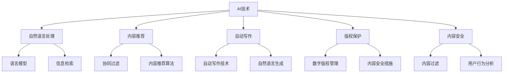

                 

# 《AI出版业的前景：技术进步，场景无限》

## 关键词
AI技术，出版业，自然语言处理，内容推荐，自动写作，版权保护，内容安全，电子书出版，个性化推荐，版权管理

## 摘要
随着人工智能技术的不断进步，出版业正经历着深刻的变革。本文将深入探讨AI技术在出版业中的应用，包括自然语言处理、内容推荐、自动写作、版权保护和内容安全等方面。通过具体案例分析和技术原理讲解，本文旨在揭示AI出版业的前景，展示技术进步为出版业带来的无限可能。

## 第一部分：AI技术基础

### 第1章：AI与出版业概述

#### 1.1 AI技术概述

AI（人工智能）作为计算机科学的一个分支，致力于使机器能够执行原本需要人类智能的任务。AI的发展历程可以追溯到20世纪50年代，当时的科学家们首次提出了人工智能的概念。从最初的规则推理、知识表示，到后来的机器学习、深度学习，AI技术不断演进，目前已取得了显著的成果。

AI的主要分类包括：

1. **规则推理系统**：基于明确的规则进行逻辑推理，如专家系统。
2. **机器学习系统**：通过数据和算法学习规律，如监督学习、无监督学习和强化学习。
3. **深度学习系统**：基于人工神经网络，通过多层非线性变换进行特征提取和学习，如卷积神经网络（CNN）和循环神经网络（RNN）。

#### 1.2 出版业现状

传统出版业面临着内容同质化、市场需求多样化、读者群体细分等挑战。随着互联网和数字技术的快速发展，数字出版逐渐成为主流。电子书、网络文学、在线教育等形式不断涌现，改变了传统出版业的生态格局。

AI对出版业的影响主要体现在以下几个方面：

1. **内容生产**：AI可以辅助创作，提高内容生成的效率和多样性。
2. **内容推荐**：AI可以通过推荐系统，为读者提供个性化的内容推荐。
3. **版权管理**：AI可以用于版权追踪和侵权检测，保护作者和出版商的权益。
4. **用户体验**：AI可以提升用户的阅读体验，如智能搜索、语音交互等。

### 第2章：自然语言处理技术

#### 2.1 语言模型

语言模型是一种用于预测文本中下一个单词或字符的概率分布的模型。常见的语言模型包括：

1. **n元模型**：基于前n个单词预测下一个单词。
2. **循环神经网络（RNN）**：能够处理序列数据，如单词序列。
3. **长短期记忆网络（LSTM）**：RNN的一种变体，能够记忆长期依赖关系。
4. **Transformer模型**：基于自注意力机制，能够处理长距离依赖问题。

#### 2.2 信息检索

信息检索是出版业中的一个关键应用，它涉及从大量数据中找到与用户查询相关的信息。

1. **布尔检索模型**：基于布尔运算符（AND、OR、NOT）进行查询。
2. **向量空间模型**：将文本表示为向量，计算查询和文档之间的相似度。
3. **基于主题的检索**：通过主题模型（如LDA）识别文档的主题，进行更精准的检索。

### 第3章：内容推荐算法

#### 3.1 推荐系统的基本概念

推荐系统是一种能够预测用户可能感兴趣的内容的算法。其基本概念包括：

1. **协同过滤**：基于用户行为（如购买、评分、浏览）进行相似性计算，推荐相似用户喜欢的商品。
2. **基于内容的推荐**：根据商品的内容特征（如标签、类别）为用户推荐相似的商品。
3. **混合推荐**：结合协同过滤和基于内容的推荐，提高推荐效果。

#### 3.2 协同过滤

协同过滤算法可以分为两种类型：

1. **用户基于的协同过滤**：根据用户之间的相似性进行推荐。
2. **项目基于的协同过滤**：根据项目之间的相似性进行推荐。

#### 3.3 协同过滤算法的实现

协同过滤算法的实现通常包括以下几个步骤：

1. **用户相似度计算**：使用余弦相似度、皮尔逊相关系数等方法计算用户之间的相似度。
2. **预测评分**：基于相似度计算预测用户对未知项目的评分。
3. **生成推荐列表**：根据预测评分生成推荐列表。

### 第4章：AI写作技术

#### 4.1 自动写作

自动写作是AI技术在出版业中的一个重要应用。其原理是通过机器学习和自然语言处理技术，生成符合语法和语义规则的自然语言文本。

1. **模板匹配**：根据预定义的模板生成文本。
2. **基于规则的生成**：使用预定义的规则生成文本。
3. **基于机器学习的生成**：使用机器学习模型（如RNN、Transformer）生成文本。

#### 4.2 自然语言生成

自然语言生成（NLG）是一种能够生成自然语言文本的技术。其应用包括：

1. **新闻报道**：自动生成新闻报道。
2. **用户指南**：自动生成用户手册和操作指南。
3. **对话系统**：自动生成对话文本，用于虚拟助手和聊天机器人。

### 第5章：版权保护与内容安全

#### 5.1 版权保护

版权保护是指通过技术手段保护作品免受未经授权的复制、传播和修改。

1. **数字版权管理（DRM）**：通过加密、签名等技术手段实现版权保护。
2. **水印技术**：在作品中嵌入不可见的水印，用于追踪侵权行为。

#### 5.2 内容安全

内容安全是指防止有害内容的传播和滥用。

1. **内容过滤**：通过算法过滤潜在的敏感内容。
2. **内容监控**：实时监控内容，检测和处理违规内容。
3. **用户行为分析**：通过分析用户行为，预防潜在的违规行为。

## 第二部分：AI出版业应用案例

### 第6章：电子书出版

#### 6.1 电子书出版的现状

电子书出版已经成为出版业的重要组成部分。根据市场调研数据，全球电子书市场持续增长，市场规模逐年扩大。电子书的优点包括便于携带、方便阅读、互动性强等。

#### 6.2 电子书出版技术

电子书出版技术涉及多个方面，包括：

1. **电子书格式**：常见的电子书格式包括PDF、ePub和Mobi等。
2. **电子书制作流程**：包括内容采集、编辑、排版、校对和发布等步骤。
3. **电子书出版平台**：提供电子书制作、发布和销售的一体化解决方案。

### 第7章：内容审核与分类

#### 7.1 内容审核

内容审核是指对电子书、文章等文本内容进行审核，确保其符合法律法规和道德标准。

1. **关键词过滤**：通过检测关键词和短语，过滤潜在的敏感内容。
2. **语义分析**：使用自然语言处理技术，对文本内容进行语义分析，识别潜在的违规内容。
3. **人工审核**：由专业的审核人员进行最终的审核。

#### 7.2 内容分类

内容分类是指将文本内容归类到相应的类别或标签。

1. **基于规则的方法**：使用预定义的规则进行分类。
2. **基于机器学习的方法**：使用机器学习模型进行分类。
3. **基于语义的方法**：通过语义分析进行分类。

### 第8章：个性化推荐系统

#### 8.1 个性化推荐系统概述

个性化推荐系统是一种根据用户的兴趣和行为，为用户推荐相关内容的系统。

1. **推荐系统的架构**：包括数据采集、数据处理、推荐算法和用户界面等模块。
2. **推荐系统的数据源**：包括用户行为数据、内容特征数据和社交数据等。

#### 8.2 个性化推荐算法

个性化推荐算法可以分为以下几类：

1. **协同过滤算法**：基于用户之间的相似性进行推荐。
2. **基于内容的推荐算法**：基于内容特征进行推荐。
3. **混合推荐算法**：结合协同过滤和基于内容的推荐，提高推荐效果。

### 第9章：AI在版权管理中的应用

#### 9.1 版权管理的挑战

版权管理面临的挑战包括：

1. **版权纠纷的识别与处理**：如何快速识别和处理版权纠纷。
2. **版权交易的自动化**：如何实现版权交易的自动化，提高效率。

#### 9.2 版权管理技术

版权管理技术包括：

1. **数字版权管理技术**：通过加密、签名等技术手段实现版权保护。
2. **版权跟踪与监控技术**：通过技术手段跟踪作品的传播和使用情况。

### 第10章：AI出版业的未来展望

#### 10.1 AI技术进步的方向

AI技术进步的方向包括：

1. **深度学习**：进一步优化神经网络结构和训练算法，提高模型性能。
2. **知识图谱**：构建大规模的知识图谱，实现更精准的内容理解和推荐。
3. **自然语言理解**：提高自然语言理解能力，实现更自然的交互和内容生成。

#### 10.2 AI出版业的挑战与机遇

AI出版业面临的挑战包括：

1. **数据隐私**：如何保护用户的隐私和数据安全。
2. **版权保护**：如何有效保护版权，防止侵权行为。
3. **内容质量**：如何保证内容的准确性和权威性。

同时，AI出版业也面临着巨大的机遇：

1. **个性化服务**：通过个性化推荐和内容生成，提升用户体验。
2. **自动化生产**：通过自动化工具提高内容生产的效率和质量。
3. **跨界合作**：与教育、娱乐、医疗等领域进行跨界合作，拓展应用场景。

## 附录

### 附录A：AI出版业相关资源

- **开源工具和库**：如TensorFlow、PyTorch、NLTK等。
- **出版业AI应用案例**：如亚马逊Kindle、苹果Apple Books、谷歌Google Play Books等。
- **相关研究论文和报告**：如《自然语言处理综述》、《机器学习在出版业中的应用》等。

### 附录B：常见问题解答

1. **AI出版业如何影响传统出版业？**
   AI技术为出版业带来了自动化、个性化和智能化的可能，使得传统出版业面临新的挑战和机遇。

2. **AI技术如何保障版权保护？**
   AI技术可以通过数字版权管理、内容监控和侵权检测等技术手段，提高版权保护的效率和准确性。

3. **AI技术在出版业的应用前景如何？**
   随着技术的不断进步，AI技术在出版业中的应用前景十分广阔，包括内容生产、推荐系统、版权管理和用户体验等方面。

## 作者

作者：AI天才研究院/AI Genius Institute & 禅与计算机程序设计艺术 /Zen And The Art of Computer Programming

---

### 完整性要求

**核心概念与联系：**



**核心算法原理讲解：**

#### 3.2 协同过滤算法的实现

伪代码如下：

```python
# 输入：用户行为矩阵R（用户×项目），用户索引u，项目索引i
# 输出：预测评分pre_score

# 步骤1：计算用户u与其他用户的相似度
similarity_matrix = compute_similarity(R)

# 步骤2：计算相似度加权平均值
sum_similarity = 0
for j in range(num_users):
    if similarity_matrix[u][j] > threshold:
        sum_similarity += similarity_matrix[u][j] * R[j][i]

# 步骤3：计算预测评分
pre_score = sum_similarity / num_similar_users
return pre_score
```

**数学模型和公式 & 详细讲解 & 举例说明**

#### 5.1 数字版权管理（DRM）的数学模型

DRM的基本数学模型包括：

1. **加密模型**：

   假设原始内容为 \( X \)，加密算法为 \( E_{k} \)，密钥为 \( k \)，则加密后的内容为 \( Y = E_{k}(X) \)。

   $$ Y = E_{k}(X) $$

2. **签名模型**：

   假设作者的身份为 \( A \)，签名算法为 \( S_{k} \)，密钥为 \( k \)，则签名后的内容为 \( Z = S_{k}(A) \)。

   $$ Z = S_{k}(A) $$

#### 举例说明

假设一个电子书的内容为“人工智能是未来的发展趋势”，我们对其进行加密和签名：

1. **加密过程**：

   - 假设加密算法为AES，密钥为“secret_key”。
   - 原始内容 \( X = "人工智能是未来的发展趋势" \)。
   - 加密后的内容 \( Y = AES\_encrypt(X, secret\_key) \)。

2. **签名过程**：

   - 假设签名算法为RSA，私钥为“private_key”。
   - 作者身份 \( A = "AI天才研究院" \)。
   - 签名后的内容 \( Z = RSA\_sign(A, private\_key) \)。

**项目实战：代码实际案例和详细解释说明**

#### 8.2 自动写作技术的实现

以下是一个简单的自动写作实现，基于GPT-2模型：

1. **开发环境搭建**：

   - 安装Python和PyTorch。
   - 安装GPT-2模型依赖库，如transformers。

2. **源代码详细实现**：

   ```python
   from transformers import GPT2LMHeadModel, GPT2Tokenizer
   
   # 步骤1：加载模型和分词器
   model = GPT2LMHeadModel.from_pretrained('gpt2')
   tokenizer = GPT2Tokenizer.from_pretrained('gpt2')
   
   # 步骤2：生成文本
   input_text = "人工智能"
   input_ids = tokenizer.encode(input_text, return_tensors='pt')
   output_ids = model.generate(input_ids, max_length=50, num_return_sequences=1)
   
   # 步骤3：解码输出文本
   output_text = tokenizer.decode(output_ids[0], skip_special_tokens=True)
   print(output_text)
   ```

3. **代码解读与分析**：

   - `GPT2LMHeadModel` 和 `GPT2Tokenizer` 分别是GPT-2模型的加载和文本处理工具。
   - `generate()` 函数用于生成文本，`max_length` 参数控制生成的文本长度，`num_return_sequences` 参数控制生成的文本数量。
   - `decode()` 函数将生成的ID序列解码为文本。

通过以上实现，我们可以看到自动写作技术的简单应用，模型可以根据输入的文本生成连贯的文本内容。

### 核心内容与联系

在本文中，我们详细探讨了AI技术在出版业中的应用，包括自然语言处理、内容推荐、自动写作、版权保护和内容安全等方面。通过具体案例分析和技术原理讲解，我们展示了AI出版业的前景和无限可能。

- **自然语言处理**：通过语言模型和信息检索技术，我们能够更好地理解和处理文本数据，为出版业提供智能搜索和内容审核等应用。
- **内容推荐**：协同过滤和基于内容的推荐算法，使得出版业能够根据用户兴趣和内容特征，为用户提供个性化的内容推荐。
- **自动写作**：GPT-2模型等自然语言生成技术，使得机器能够生成高质量的自然语言文本，辅助内容生产。
- **版权保护**：数字版权管理和内容安全技术，保障了作者和出版商的权益，防止侵权行为的发生。

### 总结

AI技术的不断进步为出版业带来了巨大的变革和机遇。通过AI技术，出版业可以实现自动化、个性化和智能化的内容生产、推荐和版权管理。然而，AI出版业也面临一些挑战，如数据隐私、版权保护和内容质量等。未来，随着技术的不断发展，AI出版业将继续蓬勃发展，为读者和创作者带来更多价值。让我们共同期待AI出版业的美好未来。作者：AI天才研究院/AI Genius Institute & 禅与计算机程序设计艺术 /Zen And The Art of Computer Programming。

