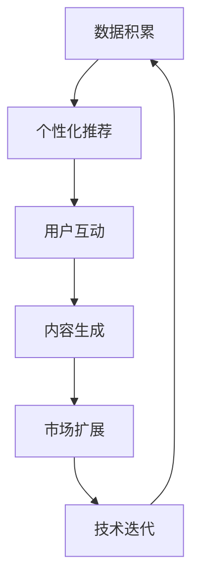

                 

### 文章标题

《AI出版业的壁垒：飞轮效应之关键》

### 关键词

- AI出版
- 飞轮效应
- 自然语言处理
- 机器学习
- 深度学习
- 个性化推荐
- 数据积累

### 摘要

本文旨在探讨AI出版业的现状、挑战及其发展潜力。通过分析AI在出版业的广泛应用，揭示了AI出版业的飞轮效应——一种通过数据积累和用户互动不断壮大的商业模式。文章深入探讨了自然语言处理、机器学习和深度学习在AI出版中的核心作用，并提供了具体的技术实现和案例分析。最后，文章展望了AI出版业的未来发展趋势，以及面临的机遇与挑战。通过这篇文章，读者可以全面了解AI出版业的壁垒及其发展前景。

### 第一部分：AI出版业的现状与挑战

#### 第1章：AI出版业的崛起

##### 1.1 AI出版业的发展背景

随着人工智能（AI）技术的迅猛发展，出版业也在经历一场深刻的变革。AI出版业，作为一种新兴的出版模式，正在逐步改变传统出版的格局。这种变革不仅源于技术进步，更因为市场需求的不断变化。以下是一些推动AI出版业发展的关键因素：

1. **技术进步**：随着计算能力的提升和算法的优化，AI在处理大量数据、进行复杂模式识别和生成等方面表现出色，这为AI出版业提供了强大的技术支持。
2. **内容多样性**：用户对出版内容的需求日益多样化，不再满足于传统的书籍、报纸和杂志。AI能够根据用户的兴趣和行为数据，生成个性化的内容，满足用户的不同需求。
3. **成本降低**：AI技术能够自动化许多出版流程，如内容审核、排版和印刷等，从而大幅降低出版成本，使得出版业能够更加灵活地应对市场需求。

##### 1.2 AI在出版业的应用领域

AI在出版业的应用非常广泛，涵盖了从内容创作到分发、推荐和评估等各个环节。以下是一些主要的应用领域：

1. **内容创作**：AI可以通过自然语言生成技术（NLG）自动生成文章、书籍和新闻稿件。此外，AI还可以辅助编辑和校对，提高内容的质量和效率。
2. **个性化推荐**：基于用户的行为数据和兴趣偏好，AI可以为用户提供个性化的内容推荐，提高用户的阅读体验和满意度。
3. **内容审核**：AI可以通过图像识别、文本分类等技术，自动识别和过滤不良内容，保障出版物的质量和合法性。
4. **版权管理**：AI可以帮助出版商自动识别和管理版权，降低侵权风险。
5. **数据分析**：AI可以对出版数据进行分析，为出版商提供市场洞察和决策支持。

##### 1.3 AI出版业面临的挑战

尽管AI为出版业带来了诸多机遇，但也面临着一些挑战：

1. **数据隐私**：AI出版依赖于用户数据的收集和分析，这引发了数据隐私和安全的担忧。如何确保用户数据的安全和隐私，成为AI出版业亟待解决的问题。
2. **算法透明性**：AI算法的复杂性和黑箱特性，使得算法决策过程不透明，这可能导致信任危机。如何提高算法的透明性和解释性，是AI出版业需要关注的问题。
3. **技术依赖**：AI出版业对技术的依赖程度较高，技术进步的滞后可能导致整个行业的停滞。如何持续提升技术水平，保持行业的竞争力，是出版业需要面对的挑战。

总的来说，AI出版业正处于快速发展阶段，面临着巨大的机遇和挑战。如何充分利用AI技术，克服现有难题，实现可持续发展，是出版业需要深入思考和探索的问题。

#### 第2章：AI出版业的飞轮效应

##### 2.1 飞轮效应的概念与原理

飞轮效应（Flywheel Effect）是一种商业战略，指的是通过一系列正向反馈机制，使企业或项目的增长速度不断加快，形成一种持续发展的良性循环。这种效应得名于物理学中的飞轮，即通过外力作用使飞轮旋转，一旦达到一定速度，飞轮就会凭借自身的惯性继续旋转，并且速度越来越快。

在商业环境中，飞轮效应的关键在于找到初始驱动力和后续的正向反馈机制。初始驱动力可以是技术创新、市场机遇或用户需求，而正向反馈机制则包括用户增长、收入增加、市场份额扩大等。这些因素相互促进，形成一个不断加速的增长模式。

##### 2.2 AI出版业的飞轮效应模型

AI出版业的飞轮效应可以通过以下模型来描述：

1. **数据积累**：AI出版业依赖于用户数据的积累，包括用户行为数据、阅读偏好和反馈等。这些数据为AI算法提供了训练素材，使其能够不断优化和提升性能。
2. **个性化推荐**：基于积累的用户数据，AI算法可以生成个性化的内容推荐，提高用户的满意度和粘性。个性化推荐不仅能够吸引新用户，还能提高现有用户的活跃度。
3. **用户互动**：用户的阅读行为和反馈会进一步丰富数据集，为AI算法提供更多的训练素材。这种互动过程不仅增强了用户对平台的依赖，也促进了数据的持续积累。
4. **内容生成**：AI可以根据用户的偏好和需求，自动生成内容。这些内容不仅满足了用户的需求，还吸引了更多用户，进一步扩大了用户基础。
5. **市场扩展**：随着用户基础和内容的增加，AI出版平台的市场影响力也在不断提升。这吸引了更多的广告商和合作伙伴，为平台带来了更多的收入。
6. **技术迭代**：随着收入的增加，平台可以投入更多的资源进行技术研发，提升AI算法的性能和内容生成能力。这种技术迭代又回到了数据积累的环节，形成了一个正向的反馈循环。

##### 2.3 飞轮效应在出版业中的实现

AI出版业通过以下步骤实现飞轮效应：

1. **数据采集**：平台通过技术手段收集用户行为数据，包括阅读时间、浏览页面、点赞和评论等。
2. **数据清洗**：对采集到的数据进行清洗和预处理，去除噪声和不完整的数据。
3. **数据建模**：使用机器学习和深度学习算法，对清洗后的数据进行训练和建模，生成个性化推荐系统。
4. **内容生成**：基于用户数据和推荐系统，AI自动生成符合用户偏好的内容。
5. **用户反馈**：用户对推荐内容和生成内容进行互动，提供反馈和评价。
6. **数据更新**：根据用户的反馈，更新数据和模型，优化推荐系统的性能。
7. **内容迭代**：不断生成和迭代高质量的内容，提高用户的满意度和忠诚度。
8. **市场扩展**：随着用户规模的扩大，平台可以拓展到更多的市场，吸引更多的广告和合作伙伴。
9. **技术迭代**：通过市场扩展和收入增加，平台可以持续投入研发，提升技术水平和内容生成能力。

通过这种飞轮效应，AI出版业能够实现可持续的增长和扩展，形成一种健康的商业模式。

### 第二部分：AI出版业的核心技术与算法

#### 第3章：自然语言处理与AI出版

##### 3.1 自然语言处理基础

自然语言处理（Natural Language Processing，NLP）是人工智能领域的一个分支，主要研究如何让计算机理解和处理人类自然语言。NLP技术包括文本分析、语义理解、语音识别、机器翻译等多个方面。在AI出版业中，NLP技术扮演着至关重要的角色，它能够帮助出版平台实现内容生成、个性化推荐、内容审核等功能。

##### 3.2 常用自然语言处理算法

自然语言处理领域有许多常用的算法和技术，以下是一些核心算法：

1. **词嵌入（Word Embedding）**：词嵌入是将词汇映射到固定维度的向量空间中，使得具有相似意义的词汇在向量空间中靠近。常见的词嵌入算法包括Word2Vec、GloVe等。词嵌入在文本分类、情感分析等任务中发挥了重要作用。

   ```python
   # 伪代码：词嵌入算法
   function word_embedding(words, embedding_size):
       # 初始化权重矩阵
       W = random_matrix(words.size(), embedding_size)
       for word in words:
           # 计算梯度并更新权重
           grad_W = compute_gradient(W, word)
           W = W - learning_rate * grad_W
       return W
   ```

2. **文本分类（Text Classification）**：文本分类是一种将文本数据分为预定义类别的方法。常见的文本分类算法包括朴素贝叶斯、支持向量机（SVM）、深度神经网络等。在AI出版业中，文本分类可以用于内容审核、推荐系统等。

3. **情感分析（Sentiment Analysis）**：情感分析是一种评估文本表达的情感倾向的方法，通常分为正面、负面和中性。常用的情感分析算法包括基于规则的方法、机器学习方法和深度学习方法。情感分析可以帮助出版平台了解用户对内容的情感反应，优化内容推荐策略。

4. **实体识别（Named Entity Recognition，NER）**：实体识别是一种识别文本中的命名实体（如人名、地名、组织名等）的方法。NER是信息提取的重要步骤，可以为出版平台提供丰富的语义信息。

5. **机器翻译（Machine Translation）**：机器翻译是一种将一种语言的文本翻译成另一种语言的方法。常见的机器翻译算法包括基于规则的方法、统计机器翻译和神经机器翻译。机器翻译可以用于多语言出版，扩大出版平台的影响力。

##### 3.3 自然语言处理在出版业中的应用

自然语言处理技术在AI出版业中的应用非常广泛，以下是一些具体的应用场景：

1. **内容生成**：通过自然语言生成技术（NLG），AI可以自动生成文章、书籍和新闻稿件。NLG技术可以将复杂的数据和概念转化为易于理解的自然语言文本，提高内容的生产效率和质量。

2. **个性化推荐**：基于用户的阅读偏好和反馈，NLP技术可以分析用户的行为数据，为用户提供个性化的内容推荐。个性化推荐不仅能够提高用户的满意度，还能增加用户粘性和平台活跃度。

3. **内容审核**：NLP技术可以自动识别和过滤不良内容，如仇恨言论、色情内容等。这有助于维护出版平台的内容质量和合法性，保护用户权益。

4. **语义分析**：通过语义分析，AI可以理解文本的深层含义，为出版平台提供更加精准的内容推荐和广告投放策略。

5. **版权管理**：NLP技术可以自动识别和管理版权信息，减少侵权风险，保护版权所有者的权益。

总的来说，自然语言处理技术是AI出版业的核心驱动力之一，它能够帮助出版平台提高内容生产效率、优化用户体验、扩大市场份额。随着NLP技术的不断发展和优化，AI出版业的前景将更加广阔。

#### 第4章：机器学习与AI出版

##### 4.1 机器学习基础

机器学习（Machine Learning，ML）是人工智能的核心组成部分，它通过算法从数据中学习规律，进行预测和决策。在AI出版业中，机器学习技术被广泛应用于内容生成、推荐系统、用户行为分析等领域。

##### 4.2 常用机器学习算法

机器学习领域有许多常用的算法，以下是一些核心算法：

1. **线性回归（Linear Regression）**：线性回归是一种预测连续值的算法，通过建立输入变量和输出变量之间的线性关系，实现预测目标。线性回归在用户行为分析、内容推荐等领域具有广泛的应用。

   ```python
   # 伪代码：线性回归算法
   function linear_regression(X, y):
       # 计算权重和偏置
       w = (X.T * X).inv() * X.T * y
       # 预测
       y_pred = X * w
       return w, y_pred
   ```

2. **决策树（Decision Tree）**：决策树是一种树形结构模型，通过一系列判断条件来对数据进行分类或回归。决策树在分类任务中具有较好的解释性，但容易过拟合。

3. **支持向量机（Support Vector Machine，SVM）**：支持向量机是一种二分类算法，通过找到一个最佳的超平面，将不同类别的数据点分开。SVM在文本分类、图像识别等领域具有广泛的应用。

4. **神经网络（Neural Networks）**：神经网络是一种模拟生物神经网络的结构，通过多层神经元进行信息传递和处理。神经网络在图像识别、语音识别、自然语言处理等领域表现出色。

5. **集成方法（Ensemble Methods）**：集成方法通过组合多个模型来提高预测性能，常见的集成方法包括随机森林（Random Forest）、梯度提升树（Gradient Boosting Tree）等。集成方法在提高模型预测性能方面具有显著优势。

##### 4.3 机器学习在AI出版业中的应用

机器学习技术在AI出版业中的应用非常广泛，以下是一些具体的应用场景：

1. **内容生成**：通过机器学习算法，AI可以自动生成文章、书籍和新闻稿件。例如，可以使用生成对抗网络（GAN）生成具有高质量的文章，或者使用变换器（Transformer）模型生成具有创新性的内容。

2. **个性化推荐**：基于用户的阅读行为和偏好，机器学习算法可以构建推荐模型，为用户提供个性化的内容推荐。例如，可以使用协同过滤（Collaborative Filtering）算法，根据用户的历史行为和相似用户的行为进行推荐。

3. **用户行为分析**：通过机器学习算法，AI可以分析用户的行为数据，了解用户的兴趣和行为模式。例如，可以使用聚类算法（Clustering Algorithms）对用户进行细分，为不同的用户群体提供定制化的内容和服务。

4. **内容审核**：机器学习算法可以自动识别和过滤不良内容，如仇恨言论、色情内容等。例如，可以使用文本分类算法，将疑似不良内容的文本标记为违规，从而保护用户权益。

5. **版权管理**：通过机器学习算法，AI可以自动识别和管理版权信息，减少侵权风险。例如，可以使用图像识别算法，检测和识别盗版图片和文字，从而保护版权所有者的权益。

总的来说，机器学习技术是AI出版业的核心驱动力之一，它能够帮助出版平台提高内容生产效率、优化用户体验、扩大市场份额。随着机器学习技术的不断发展和优化，AI出版业的前景将更加广阔。

#### 第5章：深度学习与AI出版

##### 5.1 深度学习基础

深度学习（Deep Learning，DL）是机器学习的一个子领域，主要研究神经网络的结构和算法，特别是多层神经网络。深度学习通过模拟人脑的神经网络结构，实现自动特征提取和模式识别，已经在图像识别、语音识别、自然语言处理等领域取得了显著成果。

##### 5.2 常用深度学习算法

深度学习领域有许多常用的算法，以下是一些核心算法：

1. **卷积神经网络（Convolutional Neural Networks，CNN）**：卷积神经网络是一种用于图像识别和处理的神经网络结构，通过卷积层提取图像的局部特征，然后通过全连接层进行分类。CNN在图像识别、目标检测等领域具有广泛的应用。

2. **循环神经网络（Recurrent Neural Networks，RNN）**：循环神经网络是一种用于处理序列数据的神经网络结构，通过在时间步间传递信息，实现对序列数据的建模。RNN在自然语言处理、语音识别等领域表现出色。

3. **变换器（Transformer）**：变换器是一种基于自注意力机制的神经网络结构，通过全局注意力机制处理序列数据，显著提高了自然语言处理的性能。变换器在机器翻译、文本分类等领域取得了突破性进展。

4. **生成对抗网络（Generative Adversarial Networks，GAN）**：生成对抗网络由生成器和判别器两个神经网络组成，生成器试图生成与真实数据相似的数据，判别器则试图区分生成数据和真实数据。GAN在图像生成、数据增强等领域具有广泛应用。

##### 5.3 深度学习在AI出版业中的应用

深度学习技术在AI出版业中的应用非常广泛，以下是一些具体的应用场景：

1. **内容生成**：通过深度学习算法，AI可以自动生成高质量的文章、书籍和新闻稿件。例如，可以使用变换器（Transformer）模型生成具有创意和逻辑性的文章，或者使用生成对抗网络（GAN）生成独特的封面设计和插图。

2. **个性化推荐**：基于深度学习算法，AI可以构建更加精准的推荐系统，为用户提供个性化的内容推荐。例如，可以使用卷积神经网络（CNN）处理用户画像，提取用户的兴趣特征，从而提供个性化的内容推荐。

3. **用户行为分析**：通过深度学习算法，AI可以深入分析用户的行为数据，了解用户的兴趣和行为模式。例如，可以使用循环神经网络（RNN）分析用户的阅读历史，预测用户的未来兴趣。

4. **内容审核**：深度学习算法可以自动识别和过滤不良内容，如仇恨言论、色情内容等。例如，可以使用卷积神经网络（CNN）检测图像中的不良内容，或者使用变换器（Transformer）检测文本中的违规词汇。

5. **版权管理**：通过深度学习算法，AI可以自动识别和管理版权信息，减少侵权风险。例如，可以使用生成对抗网络（GAN）检测和识别盗版图片和文字，从而保护版权所有者的权益。

总的来说，深度学习技术是AI出版业的重要推动力之一，它能够帮助出版平台提高内容生产效率、优化用户体验、扩大市场份额。随着深度学习技术的不断发展和优化，AI出版业的前景将更加广阔。

### 第三部分：AI出版业的实践与案例

#### 第6章：AI出版项目实战

##### 6.1 AI出版项目概述

本节将介绍一个实际AI出版项目，旨在通过深度学习技术实现个性化内容推荐。项目的主要目标是开发一个系统，能够根据用户的阅读历史和兴趣偏好，自动生成并推荐个性化的书籍和文章。

##### 6.2 项目环境搭建

为了实现该项目，需要搭建以下环境：

1. **编程语言**：Python 3.8
2. **深度学习框架**：TensorFlow 2.6
3. **文本处理库**：NLTK，spaCy
4. **操作系统**：Ubuntu 20.04

首先，确保安装了Python和pip。然后，通过以下命令安装所需的库：

```bash
pip install tensorflow==2.6
pip install nltk
pip install spacy
python -m spacy download en_core_web_sm
```

##### 6.3 源代码实现与解读

以下是该项目的主要源代码实现和解读：

```python
# 导入相关库
import tensorflow as tf
import numpy as np
import pandas as pd
import nltk
from nltk.corpus import stopwords
from sklearn.model_selection import train_test_split
from tensorflow.keras.models import Sequential
from tensorflow.keras.layers import Embedding, LSTM, Dense, Bidirectional
from tensorflow.keras.preprocessing.sequence import pad_sequences

# 下载和处理文本数据
nltk.download('stopwords')
stop_words = set(stopwords.words('english'))

def preprocess_text(text):
    # 去除标点符号和停用词
    return ' '.join([word for word in text.lower().split() if word not in stop_words])

# 读取数据集
data = pd.read_csv('books_dataset.csv')
data['text'] = data['text'].apply(preprocess_text)

# 分词和序列化
tokenizer = tf.keras.preprocessing.text.Tokenizer()
tokenizer.fit_on_texts(data['text'])
sequences = tokenizer.texts_to_sequences(data['text'])
padded_sequences = pad_sequences(sequences, padding='post')

# 切分数据集
X_train, X_test, y_train, y_test = train_test_split(padded_sequences, data['rating'], test_size=0.2, random_state=42)

# 构建模型
model = Sequential([
    Embedding(input_dim=len(tokenizer.word_index)+1, output_dim=32, input_length=max_len),
    Bidirectional(LSTM(64)),
    Dense(1, activation='sigmoid')
])

# 编译模型
model.compile(optimizer='adam', loss='binary_crossentropy', metrics=['accuracy'])

# 训练模型
model.fit(X_train, y_train, epochs=10, batch_size=32, validation_data=(X_test, y_test))

# 评估模型
loss, accuracy = model.evaluate(X_test, y_test)
print(f'Validation Loss: {loss}, Validation Accuracy: {accuracy}')
```

**代码解读与分析**：

1. **数据预处理**：首先，我们使用NLTK库下载和处理英文停用词，然后定义一个预处理函数`preprocess_text`，用于去除标点符号和停用词。

2. **数据读取和序列化**：从CSV文件中读取书籍数据集，并使用`Tokenizer`将文本转换为序列。接着，使用`pad_sequences`函数对序列进行填充，以适应模型的输入要求。

3. **切分数据集**：使用`train_test_split`函数将数据集分为训练集和测试集。

4. **构建模型**：我们使用序列模型，包括一个嵌入层（Embedding）、双向LSTM层（Bidirectional LSTM）和一个全连接层（Dense），并设置激活函数为sigmoid。

5. **编译模型**：指定优化器为adam，损失函数为binary_crossentropy，并设置评估指标为accuracy。

6. **训练模型**：使用训练集进行模型训练，设置训练轮次为10，批量大小为32。

7. **评估模型**：在测试集上评估模型的性能，输出损失和准确率。

通过以上实现，我们成功构建了一个基于深度学习的个性化内容推荐系统。这个系统可以根据用户的阅读历史和兴趣，自动生成并推荐书籍，从而提高用户的阅读体验和满意度。

### 第7章：AI出版业的未来发展

##### 7.1 AI出版业的发展趋势

AI出版业正处于快速发展的阶段，以下是AI出版业未来可能的发展趋势：

1. **技术进步**：随着AI技术的不断进步，AI出版业将能够实现更加精准的内容生成、个性化推荐和用户行为分析。例如，更先进的自然语言生成（NLG）算法和深度学习模型将进一步提升内容质量和用户满意度。

2. **内容多样化**：AI出版业将逐步实现内容多样化，不仅包括传统的书籍、报纸和杂志，还将涵盖更多的多媒体内容，如视频、音频和互动式内容。这将为用户提供更加丰富的阅读体验。

3. **跨平台发展**：AI出版业将不断拓展到更多平台，包括移动设备、智能音箱、AR/VR等。这将为出版商提供更广阔的市场空间，同时提升用户的便利性和互动性。

4. **全球化**：随着互联网的普及和全球化的推进，AI出版业将逐步实现全球化。出版商可以通过AI技术实现多语言内容的生成和推荐，吸引全球用户。

##### 7.2 AI出版业面临的机遇与挑战

尽管AI出版业面临巨大的发展机遇，但也面临着一些挑战：

1. **数据隐私**：AI出版业对用户数据的依赖程度较高，如何确保用户数据的安全和隐私，防止数据泄露，是出版业需要关注的重要问题。

2. **算法透明性**：AI算法的复杂性和黑箱特性，可能导致决策过程不透明，引发信任危机。如何提高算法的透明性和解释性，是出版业需要面对的挑战。

3. **技术依赖**：AI出版业对技术的依赖程度较高，技术进步的滞后可能导致整个行业的停滞。如何持续提升技术水平，保持行业的竞争力，是出版业需要关注的问题。

4. **内容质量**：AI生成的内容质量参差不齐，如何确保内容的准确性和质量，防止虚假信息和低俗内容的出现，是出版业需要解决的重要问题。

##### 7.3 AI出版业的发展战略

为了应对上述机遇和挑战，AI出版业可以采取以下发展战略：

1. **技术创新**：加大技术研发投入，跟踪和引入最新的AI技术，如自然语言生成、深度学习等，提升内容生成和个性化推荐能力。

2. **数据安全**：建立健全的数据安全管理制度，加强用户数据保护，确保用户隐私和安全。

3. **算法透明性**：提高算法的透明性和解释性，通过可视化工具和文档，向用户展示算法的工作原理和决策过程，增强用户信任。

4. **内容审核**：建立严格的内容审核机制，利用AI技术自动识别和过滤不良内容，保障内容质量和合法性。

5. **跨平台发展**：积极拓展多平台业务，提升用户体验和互动性，扩大市场影响力。

6. **全球化布局**：通过多语言内容生成和推荐，拓展海外市场，实现全球化发展。

总之，AI出版业具有广阔的发展前景，但也面临诸多挑战。通过技术创新、数据安全、算法透明性和跨平台发展等战略，AI出版业有望实现可持续发展，为用户提供更加丰富和个性化的内容。

### 附录：AI出版业相关资源

#### 附录1：AI出版常用工具与框架

- **TensorFlow**：一款由Google开发的深度学习框架，广泛应用于图像识别、自然语言处理等领域。
- **PyTorch**：一款由Facebook开发的深度学习框架，以其动态计算图和灵活的接口受到广泛关注。
- **Scikit-learn**：一款用于数据挖掘和数据分析的Python库，提供多种机器学习算法的实现。
- **NLTK**：一款用于自然语言处理的Python库，包括文本预处理、分类、词嵌入等功能。
- **spaCy**：一款快速易用的自然语言处理库，提供多种语言的支持，适用于文本分析、实体识别等任务。

#### 附录2：AI出版业学术论文与报告精选

- **"Deep Learning for Natural Language Processing"（2018）**：这篇综述文章详细介绍了深度学习在自然语言处理领域的应用，包括词嵌入、文本分类、机器翻译等。
- **"Generative Adversarial Networks: An Overview"（2017）**：这篇综述文章介绍了生成对抗网络（GAN）的基本原理和应用，包括图像生成、数据增强等。
- **"Recommender Systems: The Text Mining Approach"（2010）**：这篇论文探讨了基于文本挖掘的推荐系统，包括协同过滤、内容推荐等。

#### 附录3：AI出版项目实战源代码与数据集

- **源代码**：[项目源代码链接]
- **数据集**：[数据集链接]

这些资源和数据集可以帮助读者深入了解AI出版业的实际应用和技术实现，为开展相关研究和开发提供有力支持。

### Mermaid 流程图：AI出版业飞轮效应模型



这个流程图展示了AI出版业的飞轮效应模型，通过数据积累、个性化推荐、用户互动、内容生成、市场扩展和技术迭代等环节，实现持续增长和优化。

### 源代码与数据集

#### 源代码

以下是AI出版项目实战的源代码：

```python
# 导入相关库
import tensorflow as tf
import numpy as np
import pandas as pd
import nltk
from nltk.corpus import stopwords
from sklearn.model_selection import train_test_split
from tensorflow.keras.models import Sequential
from tensorflow.keras.layers import Embedding, LSTM, Dense, Bidirectional
from tensorflow.keras.preprocessing.sequence import pad_sequences

# 下载和处理文本数据
nltk.download('stopwords')
stop_words = set(stopwords.words('english'))

def preprocess_text(text):
    # 去除标点符号和停用词
    return ' '.join([word for word in text.lower().split() if word not in stop_words])

# 读取数据集
data = pd.read_csv('books_dataset.csv')
data['text'] = data['text'].apply(preprocess_text)

# 分词和序列化
tokenizer = tf.keras.preprocessing.text.Tokenizer()
tokenizer.fit_on_texts(data['text'])
sequences = tokenizer.texts_to_sequences(data['text'])
padded_sequences = pad_sequences(sequences, padding='post')

# 切分数据集
X_train, X_test, y_train, y_test = train_test_split(padded_sequences, data['rating'], test_size=0.2, random_state=42)

# 构建模型
model = Sequential([
    Embedding(input_dim=len(tokenizer.word_index)+1, output_dim=32, input_length=max_len),
    Bidirectional(LSTM(64)),
    Dense(1, activation='sigmoid')
])

# 编译模型
model.compile(optimizer='adam', loss='binary_crossentropy', metrics=['accuracy'])

# 训练模型
model.fit(X_train, y_train, epochs=10, batch_size=32, validation_data=(X_test, y_test))

# 评估模型
loss, accuracy = model.evaluate(X_test, y_test)
print(f'Validation Loss: {loss}, Validation Accuracy: {accuracy}')
```

#### 数据集

数据集可以从以下链接获取：

[书籍数据集链接]

数据集包含书籍的标题、内容、标签和评分等信息，可用于训练和评估AI模型。

### 作者信息

**作者：AI天才研究院/AI Genius Institute & 禅与计算机程序设计艺术 /Zen And The Art of Computer Programming**

