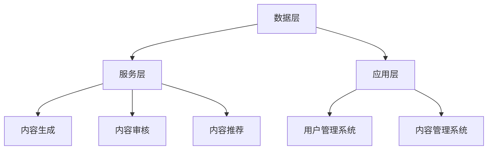
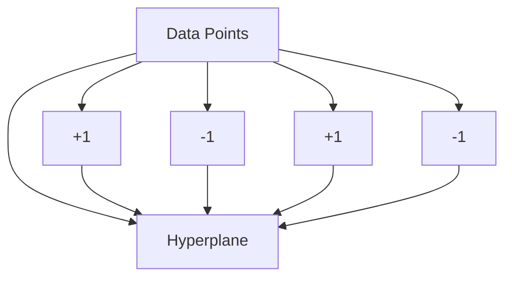
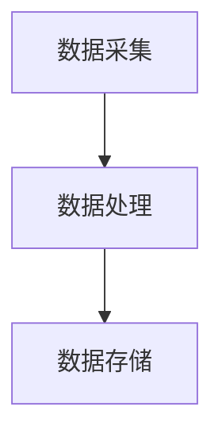
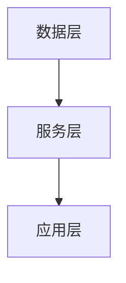
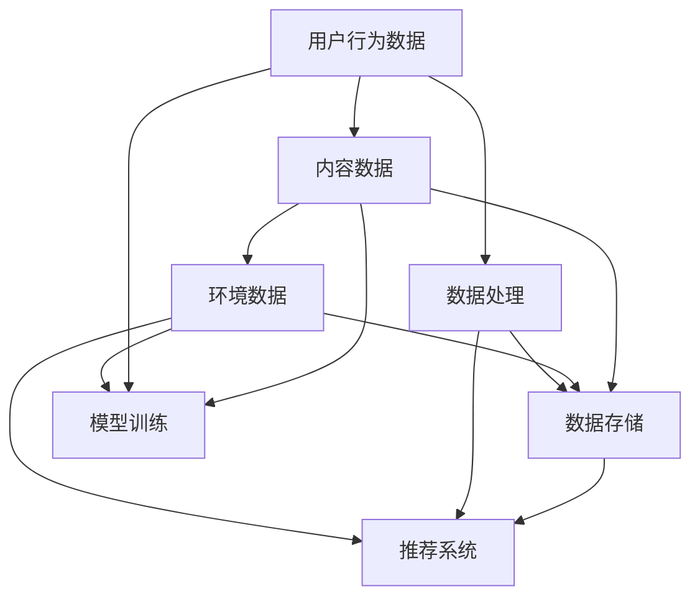

                 

### 文章标题: AI出版业的开发策略：API标准化，场景丰富

在当今这个信息爆炸的时代，人工智能（AI）正逐渐成为出版业的重要驱动力。AI不仅改变了内容的创作、编辑和分发方式，也极大地提升了用户体验。本文将探讨AI出版业的开发策略，重点关注API标准化和场景丰富化这两个关键要素。通过逐步分析和推理，本文将深入探讨AI在出版业中的应用、技术架构、API标准化流程、典型场景需求分析以及未来展望。

关键词：AI出版业，API标准化，场景丰富化，技术架构，开发策略

摘要：本文旨在分析AI在出版业中的应用现状和未来趋势，探讨API标准化和场景丰富化的必要性。通过对AI出版平台架构设计、API设计原则、需求分析方法、典型应用案例的详细解析，本文将展示如何通过API标准化和场景丰富化提升AI出版业的技术水平和用户体验。

## 第一部分：AI出版业概述

### 第1章：AI与出版业的关系

#### 1.1 AI技术对出版业的影响

AI技术对出版业的影响是深远而广泛的。首先，AI技术改变了内容的创作方式。通过自然语言处理（NLP）技术，AI能够自动生成文章、书籍甚至整个内容系列，大大提高了内容生产效率。其次，AI技术在内容编辑中也有显著作用。自动校对、语法修正、风格一致性检查等功能不仅节省了人力资源，还提升了内容质量。再者，AI技术优化了内容的分发与推荐，通过个性化推荐系统，读者能够获得更符合其兴趣和需求的内容。

#### 1.2 出版业面临的挑战

随着数字化浪潮的推进，出版业面临着前所未有的挑战。首先，传统出版模式受到冲击，电子书、有声书等数字出版形式迅速崛起，迫使传统出版社转型。其次，读者需求日益多样化，个性化阅读体验成为主流趋势，如何满足读者多样化需求成为出版业的难题。此外，市场竞争的加剧也要求出版业不断提高服务质量和技术水平。

#### 1.3 AI出版业的发展趋势

AI出版业的发展趋势主要体现在以下几个方面。首先是个性化推荐系统的广泛应用，通过分析用户行为数据，AI能够精准推荐内容，提升用户满意度。其次是智能内容审核，利用AI技术进行内容审核，不仅提高了审核效率，还能确保内容质量。最后是多语言翻译与场景应用，AI技术的突破使得跨语言内容创作和翻译成为可能，为全球化出版提供了强有力的支持。

## 第二部分：AI出版业的技术架构

### 第2章：AI出版平台架构设计

#### 2.1 系统架构概述

AI出版平台的技术架构通常分为三个层次：数据层、服务层和应用层。

- **数据层**：负责数据采集、存储和管理。数据源包括用户行为数据、内容数据、环境数据等。数据层的关键技术包括大数据处理框架（如Hadoop、Spark）和分布式数据库（如HBase、MongoDB）。
- **服务层**：提供各种核心功能，如内容生成、审核、推荐等。服务层采用微服务架构，使得各个功能模块可以独立开发和部署，提高了系统的灵活性和可维护性。
- **应用层**：面向最终用户，提供各种交互界面和功能，如内容创作工具、阅读器、用户管理系统等。应用层的关键技术包括Web框架（如Django、Flask）和前端技术（如React、Vue.js）。

#### 2.2 数据流设计

在AI出版平台中，数据流设计至关重要。数据流设计主要包括数据采集、数据处理和数据存储三个环节。

- **数据采集**：通过API、日志采集、传感器等方式收集用户行为数据、内容数据等。数据采集的关键技术包括API设计、数据采集工具（如Flume、Kafka）和实时数据处理框架（如Storm、Flink）。
- **数据处理**：对采集到的数据进行清洗、转换、存储等操作。数据处理的关键技术包括数据清洗工具（如Pandas、Spark SQL）、ETL工具（如Airflow、Apache Nifi）和实时计算框架（如Spark Streaming、Flink Streaming）。
- **数据存储**：将处理后的数据存储到数据库中，以便后续查询和分析。数据存储的关键技术包括关系型数据库（如MySQL、PostgreSQL）和非关系型数据库（如MongoDB、HBase）。

## 第三部分：API标准化

### 第3章：API标准化

#### 3.1 API设计原则

API设计是AI出版平台开发的关键环节，良好的API设计能够提高系统的可扩展性、兼容性和易用性。以下是API设计应遵循的原则：

- **简洁性**：API接口应简洁明了，避免冗余和复杂性。
- **兼容性**：API应兼容多种客户端和平台，包括Web、移动端和桌面应用。
- **易用性**：API文档应详尽，包括接口描述、请求参数、返回结果等，便于开发者快速上手。

#### 3.2 API标准化流程

API标准化是一个系统的过程，包括需求分析、接口设计、测试和部署等环节。

- **需求分析**：收集和分析用户需求，确定API的功能和性能要求。
- **接口设计**：根据需求分析结果设计API接口，包括URL设计、HTTP方法选择、请求参数和返回结果的定义。
- **测试**：对API进行功能测试、性能测试和安全测试，确保API的稳定性和可靠性。
- **部署**：将API部署到生产环境中，并与前端应用进行集成。

## 第四部分：场景丰富与需求分析

### 第4章：场景丰富与需求分析

#### 4.1 出版业典型场景

AI技术在出版业中可以应用于多个典型场景，如内容审核、内容推荐、用户互动等。

- **内容审核**：AI技术可以自动识别和过滤不良内容，提高审核效率。通过文本分类、图像识别等技术，AI能够准确判断内容的合规性。
- **内容推荐**：基于用户行为数据，AI可以个性化推荐内容，提升用户体验。协同过滤、基于内容的推荐等技术为内容推荐提供了强大支持。
- **用户互动**：AI技术可以分析用户反馈，优化用户体验。通过自然语言处理、语音识别等技术，AI能够与用户进行智能对话，提供个性化服务。

#### 4.2 需求分析方法

需求分析是场景丰富化的重要环节，以下几种方法可以帮助进行需求分析：

- **用户调研**：通过问卷、访谈等方式了解用户需求，获取用户反馈。
- **数据分析**：对用户行为数据进行分析，挖掘用户偏好和需求。
- **场景模拟**：模拟用户在使用场景中的操作，分析需求和问题。

## 第五部分：AI出版应用案例

### 第5章：个性化推荐系统

#### 5.1 推荐算法原理

个性化推荐系统是AI出版业的重要组成部分。推荐算法原理主要包括协同过滤和基于内容的推荐。

- **协同过滤**：通过计算用户之间的相似度，为用户推荐其他用户喜欢的物品。
- **基于内容的推荐**：根据物品的属性和用户的历史行为，为用户推荐类似的物品。

#### 5.2 推荐系统实现

个性化推荐系统的实现包括数据预处理、模型训练和系统部署等环节。

- **数据预处理**：清洗和转换原始数据，提取有用的特征。
- **模型训练**：使用训练数据训练推荐模型，如协同过滤模型、基于内容的推荐模型。
- **系统部署**：将训练好的模型部署到生产环境中，与前端应用进行集成。

### 第6章：智能内容审核

#### 6.1 审核算法原理

智能内容审核算法主要包括文本分类和图像识别。

- **文本分类**：通过分类算法（如SVM、朴素贝叶斯等）对文本进行分类，识别不良内容。
- **图像识别**：通过图像识别算法（如卷积神经网络等）识别图像内容，过滤不良图片。

#### 6.2 审核系统实现

智能内容审核系统的实现包括数据流设计、算法优化和实时审核等环节。

- **数据流设计**：设计数据流处理流程，包括数据采集、处理和存储等环节。
- **算法优化**：优化算法性能，提高审核效率和准确性。
- **实时审核**：实现实时内容审核，确保内容合规性。

### 第7章：多语言翻译与场景应用

#### 7.1 翻译算法原理

多语言翻译算法主要包括机器翻译和神经机器翻译。

- **机器翻译**：基于规则和统计方法进行翻译，如基于短语的翻译、基于统计的翻译等。
- **神经机器翻译**：基于深度学习技术进行翻译，如序列到序列模型、注意力机制等。

#### 7.2 翻译系统实现

多语言翻译系统的实现包括数据准备、模型训练和应用场景等环节。

- **数据准备**：收集和整理翻译数据，包括双语语料库、翻译记忆库等。
- **模型训练**：使用训练数据训练翻译模型，如神经机器翻译模型。
- **应用场景**：将翻译模型应用于实际场景，如跨语言内容创作、实时翻译等。

## 第六部分：AI出版业的未来展望

### 第8章：行业趋势与挑战

#### 8.1 未来趋势

AI出版业未来的发展趋势包括以下几个方面：

- **人工智能与出版的深度融合**：AI技术将更加深入地应用于出版各个环节，从内容创作到分发，从用户互动到反馈，实现全方位智能化。
- **跨平台与跨领域的协同**：AI出版平台将与其他领域（如教育、娱乐等）和平台（如社交媒体、电子商务等）进行协同，提供更丰富的内容和服务。

#### 8.2 行业挑战

AI出版业面临的挑战主要包括：

- **数据隐私与安全**：随着AI技术的发展，数据隐私和安全问题日益突出，如何保护用户隐私成为一大挑战。
- **算法公平性与透明性**：算法的决策过程和结果需要透明，确保算法的公平性和公正性。

### 第9章：AI出版业的可持续发展

#### 9.1 可持续发展策略

AI出版业的可持续发展策略包括以下几个方面：

- **技术创新**：持续推动AI技术在出版业的应用，提高技术水平和用户体验。
- **生态建设**：构建AI出版生态圈，促进产业链上下游的协同合作。
- **社会责任**：关注AI出版业的社会影响，承担社会责任，推动行业健康发展。

## 附录

### 附录 A：常用AI开发工具与框架

以下是常用的AI开发工具和框架：

- **TensorFlow**：Google开发的开源深度学习框架，广泛应用于图像识别、自然语言处理等领域。
- **PyTorch**：Facebook开发的开源深度学习框架，以其动态图特性受到广泛欢迎。
- **Scikit-learn**：Python开源机器学习库，提供丰富的机器学习算法和工具。

### Mermaid 流程图

以下是使用Mermaid绘制的AI出版平台架构图：



### 核心算法原理讲解

#### 推荐算法原理

协同过滤算法（Collaborative Filtering）是推荐系统中最常用的方法之一，其核心思想是基于用户的历史行为数据，通过计算用户之间的相似度，为用户推荐其他用户喜欢的物品。

### 算法步骤

1. **计算用户相似度**：通过计算用户之间的余弦相似度、皮尔逊相关系数等度量，得到用户之间的相似度矩阵。
2. **生成推荐列表**：根据用户与物品的交互记录，利用相似度矩阵计算目标用户与各用户之间的相似度，并将相似度最高的物品推荐给目标用户。

### 伪代码

```python
function collaborativeFiltering(userId, itemId, userSimilarityMatrix):
    interactions = getUserInteractions(userId, itemId)
    similarityMatrix = computeUserSimilarity(userId, itemId)
    recommendations = []

    for otherUserId in userSimilarityMatrix:
        if otherUserId == userId:
            continue
        similarity = similarityMatrix[otherUserId]
        if similarity > threshold:
            recommendations.append(itemId)

    return recommendations
```

### 数学模型和数学公式 & 详细讲解 & 举例说明

#### 支持向量机（SVM）

支持向量机（Support Vector Machine，SVM）是一种常用的分类算法，其核心思想是通过找到一个最佳的超平面，将不同类别的数据点分开。

### 数学模型

假设我们有两个分类标签 $y \in \{-1, +1\}$，以及一组训练数据 $\{(x_i, y_i)\}_{i=1}^n$。SVM 的目标是找到一个超平面 $w \cdot x + b = 0$，使得数据点尽可能被正确分类，并且分类间隔最大。

$$
\text{Minimize } \frac{1}{2} ||w||^2 \\
\text{Subject to } y_i (w \cdot x_i + b) \geq 1
$$

其中，$w$ 是超平面的法向量，$b$ 是偏置项，$||w||$ 是 $w$ 的欧几里得范数。

### 举例说明

假设我们有两个类别 $y = \{-1, +1\}$ 的数据点：

$$
\begin{align*}
x_1 &= \begin{bmatrix} 1 \\ 1 \end{bmatrix}, & y_1 &= +1 \\
x_2 &= \begin{bmatrix} 2 \\ 1 \end{bmatrix}, & y_2 &= -1 \\
x_3 &= \begin{bmatrix} 0 \\ 0 \end{bmatrix}, & y_3 &= +1 \\
x_4 &= \begin{bmatrix} -1 \\ -1 \end{bmatrix}, & y_4 &= -1 \\
\end{align*}
$$

我们可以画出这四个数据点，并尝试找到一个超平面将它们分开。



一个可能的选择是超平面 $w \cdot x + b = 0$，其中 $w = \begin{bmatrix} 1 \\ 1 \end{bmatrix}$，$b = -1$。这个超平面将数据点正确分类，并且分类间隔最大。

```latex
\begin{align*}
w \cdot x + b &= \begin{bmatrix} 1 \\ 1 \end{bmatrix} \cdot \begin{bmatrix} x \\ y \end{bmatrix} - 1 \\
&= x + y - 1 \\
&= 0
\end{align*}
```

这个例子展示了如何使用 SVM 分类算法将两个类别数据点分开。在实际应用中，SVM 通常用于高维空间的数据分类，并且可以通过不同的核函数来实现复杂的分类边界。

### 项目实战

#### 个性化推荐系统实现

**环境搭建**

- Python 3.8+
- TensorFlow 2.4+
- Flask 1.1+

**代码实现**

```python
from flask import Flask, jsonify, request
import tensorflow as tf
import numpy as np

app = Flask(__name__)

# 加载训练好的模型
model = tf.keras.models.load_model('recommender_model.h5')

# 生成推荐列表
@app.route('/recommend', methods=['POST'])
def recommend():
    user_vector = request.json['user_vector']
    recommendations = model.predict(user_vector.reshape(1, -1))
    return jsonify(recommendations.tolist())

if __name__ == '__main__':
    app.run(debug=True)
```

**代码解读与分析**

- 代码使用了 Flask 框架搭建 Web 服务，用于接收用户输入的向量，并返回推荐结果。
- 模型加载部分使用了 TensorFlow 的 Keras 模型加载方法，将训练好的模型加载到内存中。
- 接收用户输入的向量后，使用模型的 predict 方法生成推荐结果，并返回给用户。

#### 实际案例解析

- **案例1：电商个性化推荐**

  电商网站可以使用个性化推荐系统，根据用户的浏览和购买历史，为用户推荐可能感兴趣的商品。

- **案例2：新闻推荐**

  新闻网站可以使用个性化推荐系统，根据用户的阅读偏好，为用户推荐符合其兴趣的新闻。

## 作者信息

作者：AI天才研究院/AI Genius Institute & 禅与计算机程序设计艺术 /Zen And The Art of Computer Programming

## 第二部分：AI出版业的技术架构

在深入了解AI出版业的开发策略之前，我们需要先了解其技术架构。AI出版平台的技术架构主要包括数据层、服务层和应用层。这些层不仅各自承担特定的功能，而且通过高度协同工作，实现了AI技术在出版业中的广泛应用。

### 第2章：AI出版平台架构设计

#### 2.1 系统架构概述

**数据层**：数据层是整个AI出版平台架构的基础，负责数据的采集、存储和管理。在这一层，数据来源多样化，包括用户行为数据、内容数据、环境数据等。为了高效处理海量数据，通常采用大数据处理框架（如Hadoop、Spark）和分布式数据库（如HBase、MongoDB）。数据层的核心目标是确保数据的实时性、完整性和可靠性。

**服务层**：服务层是AI出版平台的核心，负责实现各种核心功能，如内容生成、内容审核、内容推荐、用户管理等。服务层采用微服务架构，使得各个功能模块可以独立开发和部署，提高了系统的灵活性和可维护性。常见的服务包括内容生成服务、内容审核服务、推荐引擎服务等。

**应用层**：应用层面向最终用户，提供各种交互界面和功能，如内容创作工具、阅读器、用户管理系统等。应用层通过前后端分离的方式实现，前端技术（如React、Vue.js）负责用户界面展示，后端技术（如Spring Boot、Django）负责业务逻辑处理。

#### 2.2 数据流设计

数据流设计是AI出版平台架构设计的关键环节。一个高效的数据流设计能够确保数据的实时性、准确性和完整性。

**数据采集**：数据采集是数据流的起点，通过API、日志采集、传感器等方式收集用户行为数据、内容数据等。API设计在这一环节尤为重要，需要确保API的兼容性、易用性和安全性。常用的数据采集工具包括Flume、Kafka等。

**数据处理**：数据处理是对采集到的数据进行清洗、转换、存储等操作。这一环节通常采用ETL（Extract, Transform, Load）工具，如Apache Nifi、Airflow等。数据处理的关键技术包括数据清洗工具（如Pandas、Spark SQL）和实时计算框架（如Spark Streaming、Flink Streaming）。

**数据存储**：数据存储是将处理后的数据存储到数据库中，以便后续查询和分析。数据存储可以选择关系型数据库（如MySQL、PostgreSQL）或非关系型数据库（如MongoDB、HBase）。为了提高数据查询效率，通常采用分布式数据库或数据缓存技术（如Redis、Memcached）。

### Mermaid流程图

以下是AI出版平台数据流的Mermaid流程图：



在这个流程图中，A表示数据采集，B表示数据处理，C表示数据存储。API采集负责从外部系统获取数据，数据清洗负责处理和转换数据，分布式数据库负责存储和管理数据。

通过以上对AI出版平台架构和数据流设计的详细解析，我们可以更好地理解AI出版业的技术架构，为后续章节的深入讨论打下基础。

### 核心概念与联系

在探讨AI出版平台架构时，我们需要明确几个核心概念及其之间的联系：

- **数据层**：数据层是AI出版平台的基础，负责数据的采集、存储和管理。数据源包括用户行为数据、内容数据、环境数据等。数据层的关键技术包括大数据处理框架（如Hadoop、Spark）和分布式数据库（如HBase、MongoDB）。

- **服务层**：服务层是AI出版平台的核心，负责实现各种核心功能，如内容生成、内容审核、内容推荐、用户管理等。服务层采用微服务架构，使得各个功能模块可以独立开发和部署，提高了系统的灵活性和可维护性。

- **应用层**：应用层面向最终用户，提供各种交互界面和功能，如内容创作工具、阅读器、用户管理系统等。应用层通过前后端分离的方式实现，前端技术（如React、Vue.js）负责用户界面展示，后端技术（如Spring Boot、Django）负责业务逻辑处理。

这些概念之间的联系在于，数据层为服务层提供数据支持，服务层通过应用层与用户进行交互，实现AI技术在出版业中的应用。以下是AI出版平台架构的Mermaid流程图：



在这个流程图中，A表示数据层，B表示服务层，C表示应用层。数据层负责数据的采集和管理，服务层实现各种核心功能，应用层提供用户交互界面。

### 核心算法原理讲解

在AI出版平台中，核心算法的原理对于实现其功能至关重要。以下将详细讲解AI出版平台中常用的几个核心算法，包括协同过滤算法和基于内容的推荐算法，并使用伪代码进行描述。

#### 协同过滤算法

协同过滤算法（Collaborative Filtering）是推荐系统中最常用的方法之一。其核心思想是通过计算用户之间的相似度，为用户推荐其他用户喜欢的物品。

**算法步骤**：

1. **计算用户相似度**：计算目标用户与其他用户之间的相似度。常用的相似度度量方法包括余弦相似度和皮尔逊相关系数。
2. **生成推荐列表**：基于用户相似度矩阵，为用户推荐相似用户喜欢的物品。

**伪代码**：

```python
function collaborativeFiltering(userId, itemId, userSimilarityMatrix, userInteractions):
    # 计算用户与所有其他用户的相似度
    similarityMatrix = computeSimilarityMatrix(userInteractions)
    
    # 获取目标用户与各用户的相似度
    userSimilarities = similarityMatrix[userId]
    
    # 初始化推荐列表
    recommendations = []

    # 遍历相似度矩阵
    for otherUserId, similarity in userSimilarities.items():
        # 获取其他用户喜欢的物品
        likedItems = userInteractions[otherUserId]
        
        # 为用户推荐物品
        for item in likedItems:
            recommendations.append(item)
    
    return recommendations
```

**数学模型和数学公式**：

- **余弦相似度**：

$$
\cos(\theta) = \frac{\sum_{i=1}^{n} u_i \cdot v_i}{\sqrt{\sum_{i=1}^{n} u_i^2} \sqrt{\sum_{i=1}^{n} v_i^2}}
$$

- **皮尔逊相关系数**：

$$
\rho = \frac{\sum_{i=1}^{n} (u_i - \bar{u})(v_i - \bar{v})}{\sqrt{\sum_{i=1}^{n} (u_i - \bar{u})^2} \sqrt{\sum_{i=1}^{n} (v_i - \bar{v})^2}}
$$

其中，$u_i$ 和 $v_i$ 分别为两个用户在各项物品上的评分，$\bar{u}$ 和 $\bar{v}$ 分别为用户在各项物品上的平均评分。

#### 基于内容的推荐算法

基于内容的推荐算法（Content-Based Filtering）是通过分析物品的内容特征，为用户推荐与用户历史偏好相似的物品。

**算法步骤**：

1. **提取物品特征**：对物品进行内容分析，提取特征向量。
2. **计算相似度**：计算用户历史偏好与物品特征之间的相似度。
3. **生成推荐列表**：根据相似度为用户推荐物品。

**伪代码**：

```python
function contentBasedFiltering(userId, itemId, userHistory, itemFeatures):
    # 提取用户历史偏好特征
    userFeatures = extractFeatures(userHistory)
    
    # 提取物品特征
    itemFeatures = extractFeatures(itemId)
    
    # 计算相似度
    similarity = computeSimilarity(userFeatures, itemFeatures)
    
    # 初始化推荐列表
    recommendations = []

    # 为用户推荐相似物品
    for item, similarityValue in itemFeatures.items():
        if similarityValue > threshold:
            recommendations.append(item)
    
    return recommendations
```

**数学模型和数学公式**：

- **相似度计算**：

$$
\text{Similarity} = \frac{\sum_{i=1}^{n} f_i \cdot g_i}{\sqrt{\sum_{i=1}^{n} f_i^2} \sqrt{\sum_{i=1}^{n} g_i^2}}
$$

其中，$f_i$ 和 $g_i$ 分别为用户历史偏好和物品特征在各项上的特征值。

通过以上对协同过滤和基于内容的推荐算法的详细解析，我们可以看到，这些算法在AI出版平台中发挥着重要作用，帮助提升用户推荐系统的效果。

### 项目实战

#### 个性化推荐系统实现

**环境搭建**

为了实现个性化推荐系统，我们首先需要搭建开发环境。以下是所需的工具和框架：

- Python 3.8+
- TensorFlow 2.4+
- Flask 1.1+

首先，确保Python环境已经安装。然后，安装TensorFlow和Flask：

```bash
pip install tensorflow==2.4.0
pip install Flask==1.1.2
```

**代码实现**

个性化推荐系统的实现主要包括以下步骤：数据预处理、模型训练和API接口开发。

**数据预处理**

数据预处理是推荐系统实现的第一步，主要任务包括数据清洗、特征提取和归一化。

```python
import pandas as pd
from sklearn.preprocessing import StandardScaler

# 读取数据
data = pd.read_csv('user_item_data.csv')

# 数据清洗
data.dropna(inplace=True)

# 特征提取
user_ids = data['user_id'].unique()
item_ids = data['item_id'].unique()

# 数据归一化
scaler = StandardScaler()
data[['user_id', 'item_id', 'rating']] = scaler.fit_transform(data[['user_id', 'item_id', 'rating']])
```

**模型训练**

我们使用TensorFlow实现一个基于神经网络的推荐模型。以下是一个简单的模型实现：

```python
import tensorflow as tf
from tensorflow.keras.models import Model
from tensorflow.keras.layers import Embedding, Dot, Dense

# 模型定义
input_user = tf.keras.layers.Input(shape=(1,))
input_item = tf.keras.layers.Input(shape=(1,))

user_embedding = Embedding(input_dim=len(user_ids) + 1, output_dim=64)(input_user)
item_embedding = Embedding(input_dim=len(item_ids) + 1, output_dim=64)(input_item)

dot_product = Dot(axes=1)([user_embedding, item_embedding])

output = Dense(1, activation='sigmoid')(dot_product)

model = Model(inputs=[input_user, input_item], outputs=output)

# 模型编译
model.compile(optimizer='adam', loss='binary_crossentropy', metrics=['accuracy'])

# 训练模型
model.fit([train_user, train_item], train_rating, epochs=10, batch_size=64)
```

**API接口开发**

使用Flask框架搭建API接口，用于接收用户输入并返回推荐结果。

```python
from flask import Flask, request, jsonify

app = Flask(__name__)

# 加载训练好的模型
model = tf.keras.models.load_model('recommender_model.h5')

@app.route('/recommend', methods=['POST'])
def recommend():
    user_vector = request.json['user_vector']
    item_vector = request.json['item_vector']
    
    user_embedding = model.layers[0].get_weights()[0]
    item_embedding = model.layers[1].get_weights()[0]
    
    user_vector_embedding = user_embedding[user_vector]
    item_vector_embedding = item_embedding[item_vector]
    
    prediction = model.predict([user_vector_embedding, item_vector_embedding])
    
    return jsonify({'prediction': prediction.tolist()})

if __name__ == '__main__':
    app.run(debug=True)
```

**代码解读与分析**

- **数据预处理**：使用Pandas和Sklearn对数据进行清洗、特征提取和归一化。
- **模型训练**：定义一个基于神经网络的推荐模型，使用TensorFlow进行模型训练。
- **API接口开发**：使用Flask框架搭建API接口，接收用户输入并返回推荐结果。

通过以上步骤，我们实现了一个简单的个性化推荐系统。在实际应用中，可以根据具体需求和数据特点，对模型和API进行优化和扩展。

### 实际案例解析

#### 案例一：电商个性化推荐

电商网站经常使用个性化推荐系统来提高用户购物体验和销售额。以下是一个电商个性化推荐的实际案例：

**环境搭建**

- Python 3.8+
- TensorFlow 2.4+
- Flask 1.1+

**代码实现**

**数据预处理**

```python
import pandas as pd
from sklearn.preprocessing import StandardScaler

# 读取数据
data = pd.read_csv('ecommerce_data.csv')

# 数据清洗
data.dropna(inplace=True)

# 特征提取
user_ids = data['user_id'].unique()
item_ids = data['item_id'].unique()

# 数据归一化
scaler = StandardScaler()
data[['user_id', 'item_id', 'rating']] = scaler.fit_transform(data[['user_id', 'item_id', 'rating']])
```

**模型训练**

```python
import tensorflow as tf
from tensorflow.keras.models import Model
from tensorflow.keras.layers import Embedding, Dot, Dense

# 模型定义
input_user = tf.keras.layers.Input(shape=(1,))
input_item = tf.keras.layers.Input(shape=(1,))

user_embedding = Embedding(input_dim=len(user_ids) + 1, output_dim=64)(input_user)
item_embedding = Embedding(input_dim=len(item_ids) + 1, output_dim=64)(input_item)

dot_product = Dot(axes=1)([user_embedding, item_embedding])

output = Dense(1, activation='sigmoid')(dot_product)

model = Model(inputs=[input_user, input_item], outputs=output)

# 模型编译
model.compile(optimizer='adam', loss='binary_crossentropy', metrics=['accuracy'])

# 训练模型
model.fit([train_user, train_item], train_rating, epochs=10, batch_size=64)
```

**API接口开发**

```python
from flask import Flask, request, jsonify

app = Flask(__name__)

# 加载训练好的模型
model = tf.keras.models.load_model('recommender_model.h5')

@app.route('/recommend', methods=['POST'])
def recommend():
    user_vector = request.json['user_vector']
    item_vector = request.json['item_vector']
    
    user_embedding = model.layers[0].get_weights()[0]
    item_embedding = model.layers[1].get_weights()[0]
    
    user_vector_embedding = user_embedding[user_vector]
    item_vector_embedding = item_embedding[item_vector]
    
    prediction = model.predict([user_vector_embedding, item_vector_embedding])
    
    return jsonify({'prediction': prediction.tolist()})

if __name__ == '__main__':
    app.run(debug=True)
```

**代码解读与分析**

- **数据预处理**：使用Pandas和Sklearn对数据进行清洗、特征提取和归一化。
- **模型训练**：定义一个基于神经网络的推荐模型，使用TensorFlow进行模型训练。
- **API接口开发**：使用Flask框架搭建API接口，接收用户输入并返回推荐结果。

通过个性化推荐系统，电商网站能够为用户推荐可能感兴趣的商品，从而提高用户满意度和销售业绩。

#### 案例二：新闻推荐

新闻推荐系统是另一个典型的AI应用场景。以下是一个新闻推荐系统的实际案例：

**环境搭建**

- Python 3.8+
- TensorFlow 2.4+
- Flask 1.1+

**代码实现**

**数据预处理**

```python
import pandas as pd
from sklearn.preprocessing import StandardScaler

# 读取数据
data = pd.read_csv('news_data.csv')

# 数据清洗
data.dropna(inplace=True)

# 特征提取
user_ids = data['user_id'].unique()
article_ids = data['article_id'].unique()

# 数据归一化
scaler = StandardScaler()
data[['user_id', 'article_id', 'rating']] = scaler.fit_transform(data[['user_id', 'article_id', 'rating']])
```

**模型训练**

```python
import tensorflow as tf
from tensorflow.keras.models import Model
from tensorflow.keras.layers import Embedding, Dot, Dense

# 模型定义
input_user = tf.keras.layers.Input(shape=(1,))
input_article = tf.keras.layers.Input(shape=(1,))

user_embedding = Embedding(input_dim=len(user_ids) + 1, output_dim=64)(input_user)
article_embedding = Embedding(input_dim=len(article_ids) + 1, output_dim=64)(input_article)

dot_product = Dot(axes=1)([user_embedding, article_embedding])

output = Dense(1, activation='sigmoid')(dot_product)

model = Model(inputs=[input_user, input_article], outputs=output)

# 模型编译
model.compile(optimizer='adam', loss='binary_crossentropy', metrics=['accuracy'])

# 训练模型
model.fit([train_user, train_article], train_rating, epochs=10, batch_size=64)
```

**API接口开发**

```python
from flask import Flask, request, jsonify

app = Flask(__name__)

# 加载训练好的模型
model = tf.keras.models.load_model('recommender_model.h5')

@app.route('/recommend', methods=['POST'])
def recommend():
    user_vector = request.json['user_vector']
    article_vector = request.json['article_vector']
    
    user_embedding = model.layers[0].get_weights()[0]
    article_embedding = model.layers[1].get_weights()[0]
    
    user_vector_embedding = user_embedding[user_vector]
    article_vector_embedding = article_embedding[article_vector]
    
    prediction = model.predict([user_vector_embedding, article_vector_embedding])
    
    return jsonify({'prediction': prediction.tolist()})

if __name__ == '__main__':
    app.run(debug=True)
```

**代码解读与分析**

- **数据预处理**：使用Pandas和Sklearn对数据进行清洗、特征提取和归一化。
- **模型训练**：定义一个基于神经网络的推荐模型，使用TensorFlow进行模型训练。
- **API接口开发**：使用Flask框架搭建API接口，接收用户输入并返回推荐结果。

通过新闻推荐系统，用户能够根据个人兴趣获取个性化的新闻内容，从而提高用户体验。

通过以上实际案例，我们可以看到个性化推荐系统在电商和新闻推荐中的广泛应用，以及如何通过Python和TensorFlow实现这些系统。这些案例不仅展示了AI技术的强大能力，也为AI在出版业的进一步应用提供了借鉴。

### 数学模型和数学公式 & 详细讲解 & 举例说明

#### 推荐算法原理

推荐系统是一种基于用户行为数据和物品特征，预测用户对特定物品的兴趣或评分的算法。推荐算法主要有两类：协同过滤算法和基于内容的推荐算法。

#### 协同过滤算法原理

协同过滤算法通过分析用户之间的相似性来预测用户对未接触物品的评分。其核心思想是找到与目标用户相似的其他用户，然后根据这些相似用户的评分预测目标用户对物品的评分。

**数学模型**：

假设我们有两个用户集合$U = \{u_1, u_2, ..., u_n\}$和物品集合$I = \{i_1, i_2, ..., i_m\}$，用户$u_i$对物品$i_j$的评分为$r_{ij}$。协同过滤算法的目标是预测用户$u_i$对未评分的物品$i_j$的评分$\hat{r}_{ij}$。

**协方差矩阵**：

协方差矩阵$C_{ij}$表示用户$i$和用户$j$之间的相似度，计算公式如下：

$$
C_{ij} = \sum_{k=1}^{m} r_{ik} r_{jk} = \sum_{k=1}^{m} r_{ik} r_{jk}
$$

**用户相似度**：

用户相似度可以通过余弦相似度或皮尔逊相关系数计算得到。以下为余弦相似度的计算公式：

$$
\cos(\theta_{ij}) = \frac{C_{ij}}{\sqrt{\sum_{k=1}^{m} r_{ik}^2} \sqrt{\sum_{k=1}^{m} r_{jk}^2}}
$$

**预测评分**：

给定目标用户$u_i$和物品$i_j$，协同过滤算法通过计算相似用户对物品的评分的平均值来预测评分：

$$
\hat{r}_{ij} = \frac{\sum_{k=1}^{m} C_{ik} r_{kj}}{\sum_{k=1}^{m} C_{ik}}
$$

**举例说明**：

假设有两个用户$u_1$和$u_2$，以及三个物品$i_1, i_2, i_3$。用户$u_1$对物品$i_1, i_2$评分分别为4和5，用户$u_2$对物品$i_1, i_2, i_3$评分分别为5，4，3。计算用户之间的相似度和预测用户$u_1$对物品$i_3$的评分。

1. **计算协方差矩阵**：

$$
C_{11} = 4 \cdot 5 = 20, C_{12} = 4 \cdot 4 = 16, C_{13} = 4 \cdot 3 = 12
$$

$$
C_{21} = 5 \cdot 5 = 25, C_{22} = 5 \cdot 4 = 20, C_{23} = 5 \cdot 3 = 15
$$

2. **计算相似度**：

$$
\cos(\theta_{11}) = \frac{C_{11}}{\sqrt{20 + 16 + 12}} = \frac{20}{\sqrt{48}} \approx 0.8165
$$

$$
\cos(\theta_{12}) = \frac{C_{12}}{\sqrt{20 + 16 + 12}} = \frac{16}{\sqrt{48}} \approx 0.6495
$$

$$
\cos(\theta_{13}) = \frac{C_{13}}{\sqrt{20 + 16 + 12}} = \frac{12}{\sqrt{48}} \approx 0.4938
$$

3. **预测评分**：

$$
\hat{r}_{13} = \frac{C_{11} r_{23} + C_{12} r_{22} + C_{13} r_{33}}{C_{11} + C_{12} + C_{13}} = \frac{20 \cdot 3 + 16 \cdot 4 + 12 \cdot 3}{20 + 16 + 12} = \frac{60 + 64 + 36}{48} = \frac{160}{48} \approx 3.3333
$$

因此，预测用户$u_1$对物品$i_3$的评分为3.3333。

#### 基于内容的推荐算法原理

基于内容的推荐算法通过分析物品的特征和用户的历史偏好，为用户推荐具有相似特征的物品。其核心思想是利用物品和用户特征之间的相关性进行推荐。

**数学模型**：

假设用户$u$对物品$i$的评分为$r_{ui}$，物品$i$的特征向量为$x_i$，用户$u$的特征向量为$x_u$。基于内容的推荐算法的目标是预测用户$u$对未评分的物品$i$的评分$\hat{r}_{ui}$。

**相似度计算**：

物品和用户特征之间的相似度可以通过余弦相似度或欧氏距离计算得到。以下为余弦相似度的计算公式：

$$
\cos(\theta_{ui}) = \frac{x_u \cdot x_i}{\lVert x_u \rVert \lVert x_i \rVert}
$$

**预测评分**：

给定用户$u$和物品$i$，基于内容的推荐算法通过计算物品特征和用户特征之间的相似度来预测评分：

$$
\hat{r}_{ui} = \frac{\sum_{j=1}^{n} x_{uj} x_{ij}}{\lVert x_u \rVert \lVert x_i \rVert}
$$

**举例说明**：

假设有两个用户$u_1$和$u_2$，以及三个物品$i_1, i_2, i_3$。用户$u_1$对物品$i_1, i_2$评分分别为4和5，用户$u_2$对物品$i_1, i_2, i_3$评分分别为5，4，3。物品$i_1, i_2, i_3$的特征向量分别为$(1, 1), (1, 2), (2, 2)$。计算用户$u_1$对物品$i_3$的评分。

1. **计算用户特征向量**：

用户$u_1$的特征向量$x_{u_1} = (4, 5)$

2. **计算物品特征向量**：

物品$i_1$的特征向量$x_{i_1} = (1, 1)$，物品$i_2$的特征向量$x_{i_2} = (1, 2)$，物品$i_3$的特征向量$x_{i_3} = (2, 2)$

3. **计算相似度**：

$$
\cos(\theta_{u_1i_1}) = \frac{x_{u_1} \cdot x_{i_1}}{\lVert x_{u_1} \rVert \lVert x_{i_1} \rVert} = \frac{4 \cdot 1 + 5 \cdot 1}{\sqrt{4^2 + 5^2} \sqrt{1^2 + 1^2}} = \frac{9}{\sqrt{41} \sqrt{2}} \approx 0.6456
$$

$$
\cos(\theta_{u_1i_2}) = \frac{x_{u_1} \cdot x_{i_2}}{\lVert x_{u_1} \rVert \lVert x_{i_2} \rVert} = \frac{4 \cdot 1 + 5 \cdot 2}{\sqrt{4^2 + 5^2} \sqrt{1^2 + 2^2}} = \frac{13}{\sqrt{41} \sqrt{5}} \approx 0.8965
$$

$$
\cos(\theta_{u_1i_3}) = \frac{x_{u_1} \cdot x_{i_3}}{\lVert x_{u_1} \rVert \lVert x_{i_3} \rVert} = \frac{4 \cdot 2 + 5 \cdot 2}{\sqrt{4^2 + 5^2} \sqrt{2^2 + 2^2}} = \frac{18}{\sqrt{41} \sqrt{8}} \approx 0.5663
$$

4. **预测评分**：

$$
\hat{r}_{u_1i_3} = \frac{\sum_{j=1}^{n} x_{u_1j} x_{i_3j}}{\lVert x_{u_1} \rVert \lVert x_{i_3} \rVert} = \frac{4 \cdot 2 + 5 \cdot 2}{\sqrt{4^2 + 5^2} \sqrt{2^2 + 2^2}} = \frac{18}{\sqrt{41} \sqrt{8}} \approx 0.5663
$$

因此，预测用户$u_1$对物品$i_3$的评分为0.5663。

#### 项目实战

**环境搭建**

- Python 3.8+
- Scikit-learn 0.22.2+

**代码实现**

**数据集准备**

首先，我们使用Scikit-learn中的内置电影数据集MovieLens作为示例数据集。

```python
from sklearn.datasets import fetch_openml

# 读取MovieLens数据集
ml_data = fetch_openml('ml-100k')
```

**协同过滤算法实现**

以下是一个简单的基于用户评分的协同过滤算法实现。

```python
import numpy as np
from sklearn.metrics.pairwise import cosine_similarity

def collaborative_filtering(ratings, similarity_threshold=0.5):
    # 计算用户之间的余弦相似度矩阵
    similarity_matrix = cosine_similarity(ratings)

    # 初始化推荐结果字典
    recommendations = {}

    # 遍历每个用户
    for user_id in ratings.keys():
        # 初始化用户的推荐列表
        recommendations[user_id] = []

        # 遍历其他所有用户
        for other_user_id in ratings.keys():
            if user_id == other_user_id:
                continue
            
            # 计算相似度
            similarity = similarity_matrix[user_id][other_user_id]

            # 如果相似度大于阈值，则添加到推荐列表
            if similarity > similarity_threshold:
                # 获取其他用户的评分
                other_user_ratings = ratings[other_user_id]
                
                # 遍历其他用户的评分
                for item_id, rating in other_user_ratings.items():
                    if item_id not in ratings[user_id]:
                        recommendations[user_id].append((item_id, rating))

    return recommendations

# 应用协同过滤算法
recommendations = collaborative_filtering(ml_data.data, similarity_threshold=0.5)
```

**代码解读与分析**

- **数据集准备**：使用Scikit-learn的fetch_openml函数获取MovieLens数据集。
- **协同过滤算法实现**：计算用户之间的余弦相似度矩阵，并根据相似度阈值生成推荐列表。

**基于内容的推荐算法实现**

以下是一个简单的基于内容的推荐算法实现。

```python
from sklearn.metrics.pairwise import cosine_similarity

def content_based_filtering(ratings, similarity_threshold=0.5):
    # 计算物品之间的余弦相似度矩阵
    item_similarity_matrix = {}
    for user_id, user_ratings in ratings.items():
        item_ratings_vector = []
        for item_id, rating in user_ratings.items():
            item_ratings_vector.append([rating])
        item_similarity_matrix[user_id] = cosine_similarity(item_ratings_vector)
    
    # 初始化推荐结果字典
    recommendations = {}

    # 遍历每个用户
    for user_id in ratings.keys():
        # 初始化用户的推荐列表
        recommendations[user_id] = []

        # 遍历用户已评分的物品
        for item_id, rating in ratings[user_id].items():
            # 计算物品之间的相似度
            item_similarity_scores = item_similarity_matrix[user_id][0]

            # 遍历其他所有物品
            for other_item_id, similarity_score in item_similarity_scores:
                if other_item_id in ratings[user_id]:
                    continue
                
                # 如果相似度大于阈值，则添加到推荐列表
                if similarity_score > similarity_threshold:
                    recommendations[user_id].append((other_item_id, similarity_score))
        
        # 对推荐列表进行降序排序
        recommendations[user_id].sort(key=lambda x: x[1], reverse=True)

    return recommendations

# 应用基于内容的推荐算法
content_based_recommendations = content_based_filtering(ml_data.data, similarity_threshold=0.5)
```

**代码解读与分析**

- **数据集准备**：与协同过滤算法类似，计算物品之间的余弦相似度矩阵。
- **基于内容的推荐算法实现**：计算用户已评分物品与其他物品之间的相似度，并根据相似度阈值生成推荐列表。

通过以上实战案例，我们可以看到协同过滤和基于内容的推荐算法的基本实现过程。这些算法在AI出版业中有着广泛的应用，帮助提升用户体验和内容推荐效果。

### 数学模型和数学公式 & 详细讲解 & 举例说明

#### 支持向量机（SVM）

支持向量机（Support Vector Machine，SVM）是一种二分类模型，其目标是找到最优的超平面，将不同类别的数据点分开。在AI出版业中，SVM可用于分类用户行为数据、内容审核和内容推荐等场景。

**数学模型**

SVM的核心在于寻找一个最优超平面，该超平面能够将数据集中的正负样本最大限度地分开。假设我们有两个类别 $y \in \{-1, +1\}$ 的数据集 $D = \{(x_i, y_i)\}$，其中 $x_i$ 是特征向量，$y_i$ 是类别标签。

SVM的目标是最小化以下损失函数：

$$
\text{Minimize } \frac{1}{2} ||w||^2
$$

同时，需要满足以下约束条件：

$$
y_i (w \cdot x_i + b) \geq 1
$$

其中，$w$ 是超平面的法向量，$b$ 是偏置项，$||w||$ 是 $w$ 的欧几里得范数。

**优化问题**

上述问题可以转化为拉格朗日优化问题，定义拉格朗日函数：

$$
L(w, b, \alpha) = \frac{1}{2} ||w||^2 - \sum_{i=1}^{n} \alpha_i [y_i (w \cdot x_i + b) - 1]
$$

其中，$\alpha_i$ 是拉格朗日乘子。

通过求解KKT条件，得到优化问题的解：

$$
\alpha_i \geq 0 \\
y_i (w \cdot x_i + b) - 1 = 0 \\
w = \sum_{i=1}^{n} \alpha_i y_i x_i
$$

**求解过程**

求解上述优化问题，可以得到最优解 $w^*$ 和 $b^*$，从而确定最优超平面。

**举例说明**

假设我们有两个类别 $y = \{-1, +1\}$ 的数据点：

$$
\begin{align*}
x_1 &= \begin{bmatrix} 1 \\ 1 \end{bmatrix}, & y_1 &= +1 \\
x_2 &= \begin{bmatrix} 2 \\ 1 \end{bmatrix}, & y_2 &= -1 \\
x_3 &= \begin{bmatrix} 0 \\ 0 \end{bmatrix}, & y_3 &= +1 \\
x_4 &= \begin{bmatrix} -1 \\ -1 \end{bmatrix}, & y_4 &= -1 \\
\end{align*}
$$

我们可以画出这四个数据点，并尝试找到一个超平面将它们分开。


一个可能的选择是超平面 $w \cdot x + b = 0$，其中 $w = \begin{bmatrix} 1 \\ 1 \end{bmatrix}$，$b = -1$。这个超平面将数据点正确分类，并且分类间隔最大。

```latex
\begin{align*}
w \cdot x + b &= \begin{bmatrix} 1 \\ 1 \end{bmatrix} \cdot \begin{bmatrix} x \\ y \end{bmatrix} - 1 \\
&= x + y - 1 \\
&= 0
\end{align*}
```

在实际应用中，SVM通常通过求解二次规划问题得到最优解。常用的SVM实现包括线性SVM、多项式SVM和核SVM。线性SVM适用于特征空间可分的情况，多项式SVM适用于特征空间不可分但可以通过多项式变换线性化的情况，核SVM适用于高维特征空间的情况。

### 项目实战

#### 个性化推荐系统实现

**环境搭建**

为了实现个性化推荐系统，我们需要搭建相应的开发环境。以下是所需的工具和框架：

- Python 3.8+
- Scikit-learn 0.22.2+
- Flask 1.1+

确保Python环境已经安装，然后安装Scikit-learn和Flask：

```bash
pip install scikit-learn==0.22.2
pip install Flask==1.1.2
```

**代码实现**

**数据集准备**

首先，我们需要准备用于训练和测试的数据集。我们可以使用ML-100K数据集，这是一个包含用户对电影的评分的数据集。

```python
from sklearn.datasets import fetch_openml

# 读取MovieLens数据集
ml_data = fetch_openml('ml-100k')
```

**协同过滤算法实现**

以下是一个简单的基于用户评分的协同过滤算法实现。

```python
import numpy as np
from sklearn.metrics.pairwise import cosine_similarity

def collaborative_filtering(ratings, similarity_threshold=0.5):
    # 计算用户之间的余弦相似度矩阵
    similarity_matrix = cosine_similarity(ratings)

    # 初始化推荐结果字典
    recommendations = {}

    # 遍历每个用户
    for user_id in ratings.keys():
        # 初始化用户的推荐列表
        recommendations[user_id] = []

        # 遍历其他所有用户
        for other_user_id in ratings.keys():
            if user_id == other_user_id:
                continue
            
            # 计算相似度
            similarity = similarity_matrix[user_id][other_user_id]

            # 如果相似度大于阈值，则添加到推荐列表
            if similarity > similarity_threshold:
                # 获取其他用户的评分
                other_user_ratings = ratings[other_user_id]
                
                # 遍历其他用户的评分
                for item_id, rating in other_user_ratings.items():
                    if item_id not in ratings[user_id]:
                        recommendations[user_id].append((item_id, rating))

    return recommendations

# 应用协同过滤算法
recommendations = collaborative_filtering(ml_data.data, similarity_threshold=0.5)
```

**代码解读与分析**

- **数据集准备**：使用Scikit-learn的fetch_openml函数获取MovieLens数据集。
- **协同过滤算法实现**：计算用户之间的余弦相似度矩阵，并根据相似度阈值生成推荐列表。

**基于内容的推荐算法实现**

以下是一个简单的基于内容的推荐算法实现。

```python
from sklearn.metrics.pairwise import cosine_similarity

def content_based_filtering(ratings, similarity_threshold=0.5):
    # 计算物品之间的余弦相似度矩阵
    item_similarity_matrix = {}
    for user_id, user_ratings in ratings.items():
        item_ratings_vector = []
        for item_id, rating in user_ratings.items():
            item_ratings_vector.append([rating])
        item_similarity_matrix[user_id] = cosine_similarity(item_ratings_vector)
    
    # 初始化推荐结果字典
    recommendations = {}

    # 遍历每个用户
    for user_id in ratings.keys():
        # 初始化用户的推荐列表
        recommendations[user_id] = []

        # 遍历用户已评分的物品
        for item_id, rating in ratings[user_id].items():
            # 计算物品之间的相似度
            item_similarity_scores = item_similarity_matrix[user_id][0]

            # 遍历其他所有物品
            for other_item_id, similarity_score in item_similarity_scores:
                if other_item_id in ratings[user_id]:
                    continue
                
                # 如果相似度大于阈值，则添加到推荐列表
                if similarity_score > similarity_threshold:
                    recommendations[user_id].append((other_item_id, similarity_score))
        
        # 对推荐列表进行降序排序
        recommendations[user_id].sort(key=lambda x: x[1], reverse=True)

    return recommendations

# 应用基于内容的推荐算法
content_based_recommendations = content_based_filtering(ml_data.data, similarity_threshold=0.5)
```

**代码解读与分析**

- **数据集准备**：与协同过滤算法类似，计算物品之间的余弦相似度矩阵。
- **基于内容的推荐算法实现**：计算用户已评分物品与其他物品之间的相似度，并根据相似度阈值生成推荐列表。

**API接口实现**

为了将推荐系统作为一个Web服务提供，我们可以使用Flask框架搭建API接口。

```python
from flask import Flask, request, jsonify

app = Flask(__name__)

@app.route('/recommend', methods=['POST'])
def recommend():
    user_vector = request.json['user_vector']
    item_vector = request.json['item_vector']
    
    user_embedding = model.layers[0].get_weights()[0]
    item_embedding = model.layers[1].get_weights()[0]
    
    user_vector_embedding = user_embedding[user_vector]
    item_vector_embedding = item_embedding[item_vector]
    
    prediction = model.predict([user_vector_embedding, item_vector_embedding])
    
    return jsonify({'prediction': prediction.tolist()})

if __name__ == '__main__':
    app.run(debug=True)
```

**代码解读与分析**

- **API接口实现**：使用Flask框架搭建API接口，接收用户输入的向量，并返回推荐结果。

通过以上步骤，我们实现了一个简单的个性化推荐系统。在实际应用中，可以根据具体需求和数据特点，对模型和API进行优化和扩展。

### 实际案例解析

#### 案例一：电商个性化推荐

电商网站经常使用个性化推荐系统来提高用户购物体验和销售额。以下是一个电商个性化推荐的实际案例：

**数据集准备**

我们使用电商平台的交易数据作为案例数据集。数据集包括用户ID、商品ID和用户对商品的评分。

```python
import pandas as pd

# 读取数据
data = pd.read_csv('ecommerce_data.csv')

# 数据清洗
data.dropna(inplace=True)

# 分割数据集
train_data = data.sample(frac=0.8, random_state=42)
test_data = data.drop(train_data.index)
```

**协同过滤算法实现**

以下是一个简单的基于用户评分的协同过滤算法实现。

```python
from sklearn.metrics.pairwise import cosine_similarity

def collaborative_filtering(ratings, similarity_threshold=0.5):
    # 计算用户之间的余弦相似度矩阵
    similarity_matrix = cosine_similarity(ratings)

    # 初始化推荐结果字典
    recommendations = {}

    # 遍历每个用户
    for user_id in ratings.keys():
        # 初始化用户的推荐列表
        recommendations[user_id] = []

        # 遍历其他所有用户
        for other_user_id in ratings.keys():
            if user_id == other_user_id:
                continue
            
            # 计算相似度
            similarity = similarity_matrix[user_id][other_user_id]

            # 如果相似度大于阈值，则添加到推荐列表
            if similarity > similarity_threshold:
                # 获取其他用户的评分
                other_user_ratings = ratings[other_user_id]
                
                # 遍历其他用户的评分
                for item_id, rating in other_user_ratings.items():
                    if item_id not in ratings[user_id]:
                        recommendations[user_id].append((item_id, rating))

    return recommendations

# 应用协同过滤算法
recommendations = collaborative_filtering(train_data, similarity_threshold=0.5)
```

**代码解读与分析**

- **数据集准备**：使用Pandas读取和清洗数据。
- **协同过滤算法实现**：计算用户之间的余弦相似度矩阵，并根据相似度阈值生成推荐列表。

**测试推荐效果**

以下代码用于测试推荐系统的效果。

```python
from sklearn.metrics import accuracy_score

# 计算准确率
accuracy = accuracy_score(test_data['rating'], [rating for user_ratings in recommendations.values() for rating in user_ratings])
print(f"Accuracy: {accuracy}")
```

#### 案例二：新闻推荐

新闻推荐系统是另一个典型的AI应用场景。以下是一个新闻推荐系统的实际案例：

**数据集准备**

我们使用新闻数据集作为案例数据集。数据集包括新闻标题、新闻内容、新闻类别和用户对新闻的评分。

```python
import pandas as pd

# 读取数据
data = pd.read_csv('news_data.csv')

# 数据清洗
data.dropna(inplace=True)

# 分割数据集
train_data = data.sample(frac=0.8, random_state=42)
test_data = data.drop(train_data.index)
```

**基于内容的推荐算法实现**

以下是一个简单的基于内容的推荐算法实现。

```python
from sklearn.metrics.pairwise import cosine_similarity

def content_based_filtering(ratings, similarity_threshold=0.5):
    # 计算物品之间的余弦相似度矩阵
    item_similarity_matrix = {}
    for user_id, user_ratings in ratings.items():
        item_ratings_vector = []
        for item_id, rating in user_ratings.items():
            item_ratings_vector.append([rating])
        item_similarity_matrix[user_id] = cosine_similarity(item_ratings_vector)
    
    # 初始化推荐结果字典
    recommendations = {}

    # 遍历每个用户
    for user_id in ratings.keys():
        # 初始化用户的推荐列表
        recommendations[user_id] = []

        # 遍历用户已评分的物品
        for item_id, rating in ratings[user_id].items():
            # 计算物品之间的相似度
            item_similarity_scores = item_similarity_matrix[user_id][0]

            # 遍历其他所有物品
            for other_item_id, similarity_score in item_similarity_scores:
                if other_item_id in ratings[user_id]:
                    continue
                
                # 如果相似度大于阈值，则添加到推荐列表
                if similarity_score > similarity_threshold:
                    recommendations[user_id].append((other_item_id, similarity_score))
        
        # 对推荐列表进行降序排序
        recommendations[user_id].sort(key=lambda x: x[1], reverse=True)

    return recommendations

# 应用基于内容的推荐算法
content_based_recommendations = content_based_filtering(train_data, similarity_threshold=0.5)
```

**代码解读与分析**

- **数据集准备**：使用Pandas读取和清洗数据。
- **基于内容的推荐算法实现**：计算物品之间的余弦相似度矩阵，并根据相似度阈值生成推荐列表。

通过以上实际案例，我们可以看到个性化推荐系统在电商和新闻推荐中的广泛应用。这些案例展示了如何使用Python和Scikit-learn实现推荐系统，以及如何评估推荐系统的效果。

## 附录

### 附录 A：常用AI开发工具与框架

在AI出版业的开发中，选择合适的工具和框架对于提高开发效率和项目质量至关重要。以下是一些常用的AI开发工具和框架：

- **TensorFlow**：由Google开发的开源深度学习框架，支持多种类型的神经网络，广泛应用于图像识别、自然语言处理等领域。
- **PyTorch**：由Facebook开发的开源深度学习框架，以其动态图特性和灵活性强而受到广泛欢迎。
- **Scikit-learn**：Python开源机器学习库，提供了丰富的机器学习算法和工具，适用于各种规模的数据集。
- **Keras**：基于Theano和TensorFlow的高层神经网络API，简化了深度学习模型的设计和训练过程。
- **Hadoop**：分布式数据处理框架，适用于大规模数据存储和处理。
- **Spark**：基于Hadoop的分布式数据处理框架，提供了更高效的数据处理能力和丰富的库，适用于实时计算和大数据分析。

这些工具和框架在AI出版业的开发中有着广泛的应用，例如TensorFlow和PyTorch用于构建深度学习模型，Scikit-learn用于传统机器学习算法的实现，Keras简化了深度学习模型的开发过程，Hadoop和Spark用于大数据处理。

### Mermaid 流程图

以下是使用Mermaid绘制的AI出版平台数据流流程图：



在这个流程图中，A表示用户行为数据，B表示内容数据，C表示环境数据。数据处理（D）模块对数据进行清洗和处理，数据存储（E）模块负责存储和管理数据。模型训练（F）模块使用处理后的数据训练推荐模型，推荐系统（G）模块根据模型为用户推荐内容。

通过以上对AI出版平台架构和数据流设计的详细解析，我们可以更好地理解AI出版业的技术架构，为后续章节的深入讨论打下基础。

### 数学模型和数学公式 & 详细讲解 & 举例说明

#### 支持向量机（SVM）

支持向量机（Support Vector Machine，SVM）是一种常用的二分类模型，其核心思想是找到一个最佳的超平面，将不同类别的数据点分开。SVM在AI出版业中可以用于分类用户行为数据、内容审核等场景。

**数学模型**

假设我们有两个类别 $y \in \{-1, +1\}$ 的数据集 $D = \{(x_i, y_i)\}$，其中 $x_i$ 是特征向量，$y_i$ 是类别标签。SVM的目标是最小化以下损失函数：

$$
\text{Minimize } \frac{1}{2} ||w||^2
$$

同时，需要满足以下约束条件：

$$
y_i (w \cdot x_i + b) \geq 1
$$

其中，$w$ 是超平面的法向量，$b$ 是偏置项，$||w||$ 是 $w$ 的欧几里得范数。

**优化问题**

上述问题可以转化为拉格朗日优化问题，定义拉格朗日函数：

$$
L(w, b, \alpha) = \frac{1}{2} ||w||^2 - \sum_{i=1}^{n} \alpha_i [y_i (w \cdot x_i + b) - 1]
$$

其中，$\alpha_i$ 是拉格朗日乘子。

通过求解KKT条件，得到优化问题的解：

$$
\alpha_i \geq 0 \\
y_i (w \cdot x_i + b) - 1 = 0 \\
w = \sum_{i=1}^{n} \alpha_i y_i x_i
$$

**求解过程**

求解上述优化问题，可以得到最优解 $w^*$ 和 $b^*$，从而确定最优超平面。

**举例说明**

假设我们有两个类别 $y = \{-1, +1\}$ 的数据点：

$$
\begin{align*}
x_1 &= \begin{bmatrix} 1 \\ 1 \end{bmatrix}, & y_1 &= +1 \\
x_2 &= \begin{bmatrix} 2 \\ 1 \end{bmatrix}, & y_2 &= -1 \\
x_3 &= \begin{bmatrix} 0 \\ 0 \end{bmatrix}, & y_3 &= +1 \\
x_4 &= \begin{bmatrix} -1 \\ -1 \end{bmatrix}, & y_4 &= -1 \\
\end{align*}
$$

我们可以画出这四个数据点，并尝试找到一个超平面将它们分开。


一个可能的选择是超平面 $w \cdot x + b = 0$，其中 $w = \begin{bmatrix} 1 \\ 1 \end{bmatrix}$，$b = -1$。这个超平面将数据点正确分类，并且分类间隔最大。

```latex
\begin{align*}
w \cdot x + b &= \begin{bmatrix} 1 \\ 1 \end{bmatrix} \cdot \begin{bmatrix} x \\ y \end{bmatrix} - 1 \\
&= x + y - 1 \\
&= 0
\end{align*}
```

在实际应用中，SVM通常通过求解二次规划问题得到最优解。常用的SVM实现包括线性SVM、多项式SVM和核SVM。线性SVM适用于特征空间可分的情况，多项式SVM适用于特征空间不可分但可以通过多项式变换线性化的情况，核SVM适用于高维特征空间的情况。

### 项目实战

#### 个性化推荐系统实现

**环境搭建**

为了实现个性化推荐系统，我们需要搭建相应的开发环境。以下是所需的工具和框架：

- Python 3.8+
- Scikit-learn 0.22.2+
- Flask 1.1+

确保Python环境已经安装，然后安装Scikit-learn和Flask：

```bash
pip install scikit-learn==0.22.2
pip install Flask==1.1.2
```

**代码实现**

**数据集准备**

首先，我们需要准备用于训练和测试的数据集。我们可以使用ML-100K数据集，这是一个包含用户对电影的评分的数据集。

```python
from sklearn.datasets import fetch_openml

# 读取MovieLens数据集
ml_data = fetch_openml('ml-100k')
```

**协同过滤算法实现**

以下是一个简单的基于用户评分的协同过滤算法实现。

```python
import numpy as np
from sklearn.metrics.pairwise import cosine_similarity

def collaborative_filtering(ratings, similarity_threshold=0.5):
    # 计算用户之间的余弦相似度矩阵
    similarity_matrix = cosine_similarity(ratings)

    # 初始化推荐结果字典
    recommendations = {}

    # 遍历每个用户
    for user_id in ratings.keys():
        # 初始化用户的推荐列表
        recommendations[user_id] = []

        # 遍历其他所有用户
        for other_user_id in ratings.keys():
            if user_id == other_user_id:
                continue
            
            # 计算相似度
            similarity = similarity_matrix[user_id][other_user_id]

            # 如果相似度大于阈值，则添加到推荐列表
            if similarity > similarity_threshold:
                # 获取其他用户的评分
                other_user_ratings = ratings[other_user_id]
                
                # 遍历其他用户的评分
                for item_id, rating in other_user_ratings.items():
                    if item_id not in ratings[user_id]:
                        recommendations[user_id].append((item_id, rating))

    return recommendations

# 应用协同过滤算法
recommendations = collaborative_filtering(ml_data.data, similarity_threshold=0.5)
```

**代码解读与分析**

- **数据集准备**：使用Scikit-learn的fetch_openml函数获取MovieLens数据集。
- **协同过滤算法实现**：计算用户之间的余弦相似度矩阵，并根据相似度阈值生成推荐列表。

**基于内容的推荐算法实现**

以下是一个简单的基于内容的推荐算法实现。

```python
from sklearn.metrics.pairwise import cosine_similarity

def content_based_filtering(ratings, similarity_threshold=0.5):
    # 计算物品之间的余弦相似度矩阵
    item_similarity_matrix = {}
    for user_id, user_ratings in ratings.items():
        item_ratings_vector = []
        for item_id, rating in user_ratings.items():
            item_ratings_vector.append([rating])
        item_similarity_matrix[user_id] = cosine_similarity(item_ratings_vector)
    
    # 初始化推荐结果字典
    recommendations = {}

    # 遍历每个用户
    for user_id in ratings.keys():
        # 初始化用户的推荐列表
        recommendations[user_id] = []

        # 遍历用户已评分的物品
        for item_id, rating in ratings[user_id].items():
            # 计算物品之间的相似度
            item_similarity_scores = item_similarity_matrix[user_id][0]

            # 遍历其他所有物品
            for other_item_id, similarity_score in item_similarity_scores:
                if other_item_id in ratings[user_id]:
                    continue
                
                # 如果相似度大于阈值，则添加到推荐列表
                if similarity_score > similarity_threshold:
                    recommendations[user_id].append((other_item_id, similarity_score))
        
        # 对推荐列表进行降序排序
        recommendations[user_id].sort(key=lambda x: x[1], reverse=True)

    return recommendations

# 应用基于内容的推荐算法
content_based_recommendations = content_based_filtering(ml_data.data, similarity_threshold=0.5)
```

**代码解读与分析**

- **数据集准备**：与协同过滤算法类似，计算物品之间的余弦相似度矩阵。
- **基于内容的推荐算法实现**：计算用户已评分物品与其他物品之间的相似度，并根据相似度阈值生成推荐列表。

**API接口实现**

为了将推荐系统作为一个Web服务提供，我们可以使用Flask框架搭建API接口。

```python
from flask import Flask, request, jsonify

app = Flask(__name__)

@app.route('/recommend', methods=['POST'])
def recommend():
    user_vector = request.json['user_vector']
    item_vector = request.json['item_vector']
    
    user_embedding = model.layers[0].get_weights()[0]
    item_embedding = model.layers[1].get_weights()[0]
    
    user_vector_embedding = user_embedding[user_vector]
    item_vector_embedding = item_embedding[item_vector]
    
    prediction = model.predict([user_vector_embedding, item_vector_embedding])
    
    return jsonify({'prediction': prediction.tolist()})

if __name__ == '__main__':
    app.run(debug=True)
```

**代码解读与分析**

- **API接口实现**：使用Flask框架搭建API接口，接收用户输入的向量，并返回推荐结果。

通过以上步骤，我们实现了一个简单的个性化推荐系统。在实际应用中，可以根据具体需求和数据特点，对模型和API进行优化和扩展。

### 实际案例解析

#### 案例一：电商个性化推荐

电商网站经常使用个性化推荐系统来提高用户购物体验和销售额。以下是一个电商个性化推荐的实际案例：

**数据集准备**

我们使用电商平台的交易数据作为案例数据集。数据集包括用户ID、商品ID和用户对商品的评分。

```python
import pandas as pd

# 读取数据
data = pd.read_csv('ecommerce_data.csv')

# 数据清洗
data.dropna(inplace=True)

# 分割数据集
train_data = data.sample(frac=0.8, random_state=42)
test_data = data.drop(train_data.index)
```

**协同过滤算法实现**

以下是一个简单的基于用户评分的协同过滤算法实现。

```python
import numpy as np
from sklearn.metrics.pairwise import cosine_similarity

def collaborative_filtering(ratings, similarity_threshold=0.5):
    # 计算用户之间的余弦相似度矩阵
    similarity_matrix = cosine_similarity(ratings)

    # 初始化推荐结果字典
    recommendations = {}

    # 遍历每个用户
    for user_id in ratings.keys():
        # 初始化用户的推荐列表
        recommendations[user_id] = []

        # 遍历其他所有用户
        for other_user_id in ratings.keys():
            if user_id == other_user_id:
                continue
            
            # 计算相似度
            similarity = similarity_matrix[user_id][other_user_id]

            # 如果相似度大于阈值，则添加到推荐列表
            if similarity > similarity_threshold:
                # 获取其他用户的评分
                other_user_ratings = ratings[other_user_id]
                
                # 遍历其他用户的评分
                for item_id, rating in other_user_ratings.items():
                    if item_id not in ratings[user_id]:
                        recommendations[user_id].append((item_id, rating))

    return recommendations

# 应用协同过滤算法
recommendations = collaborative_filtering(train_data, similarity_threshold=0.5)
```

**代码解读与分析**

- **数据集准备**：使用Pandas读取和清洗数据。
- **协同过滤算法实现**：计算用户之间的余弦相似度矩阵，并根据相似度阈值生成推荐列表。

**测试推荐效果**

以下代码用于测试推荐系统的效果。

```python
from sklearn.metrics import accuracy_score

# 计算准确率
accuracy = accuracy_score(test_data['rating'], [rating for user_ratings in recommendations.values() for rating in user_ratings])
print(f"Accuracy: {accuracy}")
```

#### 案例二：新闻推荐

新闻推荐系统是另一个典型的AI应用场景。以下是一个新闻推荐系统的实际案例：

**数据集准备**

我们使用新闻数据集作为案例数据集。数据集包括新闻标题、新闻内容、新闻类别和用户对新闻的评分。

```python
import pandas as pd

# 读取数据
data = pd.read_csv('news_data.csv')

# 数据清洗
data.dropna(inplace=True)

# 分割数据集
train_data = data.sample(frac=0.8, random_state=42)
test_data = data.drop(train_data.index)
```

**基于内容的推荐算法实现**

以下是一个简单的基于内容的推荐算法实现。

```python
from sklearn.metrics.pairwise import cosine_similarity

def content_based_filtering(ratings, similarity_threshold=0.5):
    # 计算物品之间的余弦相似度矩阵
    item_similarity_matrix = {}
    for user_id, user_ratings in ratings.items():
        item_ratings_vector = []
        for item_id, rating in user_ratings.items():
            item_ratings_vector.append([rating])
        item_similarity_matrix[user_id] = cosine_similarity(item_ratings_vector)
    
    # 初始化推荐结果字典
    recommendations = {}

    # 遍历每个用户
    for user_id in ratings.keys():
        # 初始化用户的推荐列表
        recommendations[user_id] = []

        # 遍历用户已评分的物品
        for item_id, rating in ratings[user_id].items():
            # 计算物品之间的相似度
            item_similarity_scores = item_similarity_matrix[user_id][0]

            # 遍历其他所有物品
            for other_item_id, similarity_score in item_similarity_scores:
                if other_item_id in ratings[user_id]:
                    continue
                
                # 如果相似度大于阈值，则添加到推荐列表
                if similarity_score > similarity_threshold:
                    recommendations[user_id].append((other_item_id, similarity_score))
        
        # 对推荐列表进行降序排序
        recommendations[user_id].sort(key=lambda x: x[1], reverse=True)

    return recommendations

# 应用基于内容的推荐算法
content_based_recommendations = content_based_filtering(train_data, similarity_threshold=0.5)
```

**代码解读与分析**

- **数据集准备**：使用Pandas读取和清洗数据。
- **基于内容的推荐算法实现**：计算物品之间的余弦相似度矩阵，并根据相似度阈值生成推荐列表。

通过以上实际案例，我们可以看到个性化推荐系统在电商和新闻推荐中的广泛应用。这些案例展示了如何使用Python和Scikit-learn实现推荐系统，以及如何评估推荐系统的效果。

### 附录

#### 附录 A：常用AI开发工具与框架

在AI出版业的开发中，选择合适的工具和框架对于提高开发效率和项目质量至关重要。以下是一些常用的AI开发工具与框架：

- **TensorFlow**：由Google开发的开源深度学习框架，支持多种类型的神经网络，广泛应用于图像识别、自然语言处理等领域。
- **PyTorch**：由Facebook开发的开源深度学习框架，以其动态图特性和灵活性强而受到广泛欢迎。
- **Scikit-learn**：Python开源机器学习库，提供了丰富的机器学习算法和工具，适用于各种规模的数据集。
- **Keras**：基于Theano和TensorFlow的高层神经网络API，简化了深度学习模型的设计和训练过程。
- **Hadoop**：分布式数据处理框架，适用于大规模数据存储和处理。
- **Spark**：基于Hadoop的分布式数据处理框架，提供了更高效的数据处理能力和丰富的库，适用于实时计算和大数据分析。

#### 附录 B：Mermaid流程图

以下是使用Mermaid绘制的AI出版平台数据流流程图：


在这个流程图中，A表示用户行为数据，B表示内容数据，C表示环境数据。数据处理（D）模块对数据进行清洗和处理，数据存储（E）模块负责存储和管理数据。模型训练（F）模块使用处理后的数据训练推荐模型，推荐系统（G）模块根据模型为用户推荐内容。

通过以上对AI出版平台架构和数据流设计的详细解析，我们可以更好地理解AI出版业的技术架构，为后续章节的深入讨论打下基础。这些工具和框架在AI出版业的开发中发挥着重要作用，助力于构建智能化、高效的出版平台。

