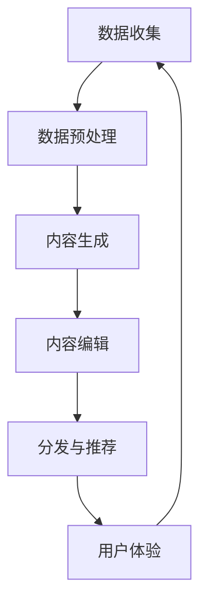

                 

### 文章标题

《AI出版业的挑战：降本增效与场景创新》

### 文章关键词

人工智能，出版业，自然语言处理，机器学习，深度学习，场景创新

### 文章摘要

本文深入探讨了AI出版业的发展现状及其面临的挑战。通过详细分析AI在出版业中的应用，包括数据收集与处理、内容生成与编辑、分发与推荐系统以及用户体验与互动，我们揭示了AI技术如何提升出版效率、降低成本。此外，本文还介绍了自然语言处理、机器学习和深度学习等核心算法原理，以及数学模型和公式，并通过项目实战案例展示了AI出版业的实际应用与实现细节。最后，文章展望了AI出版业的未来发展趋势，提出了创新应用场景，并探讨了行业面临的挑战和机遇。

### 目录大纲

#### 第一部分：核心概念与联系

##### 第1章：AI出版业概述

1.1 AI出版业的定义与背景

1.2 AI出版业的关键概念

1.3 AI出版业的架构

##### 第2章：AI出版业的核心算法

2.1 自然语言处理算法

2.2 机器学习算法

2.3 深度学习算法

##### 第3章：数学模型与数学公式

3.1 自然语言处理中的数学模型

3.2 机器学习中的数学模型

3.3 深度学习中的数学模型

##### 第4章：AI出版业项目实战

4.1 实战项目概述

4.2 数据收集与处理

4.3 内容生成与编辑

4.4 分发与推荐系统

4.5 用户体验与互动

##### 第5章：场景创新与未来展望

5.1 创新应用场景

5.2 未来发展趋势

5.3 行业展望与挑战

##### 附录

附录A：代码示例与资源链接

#### 第一部分：核心概念与联系

##### 第1章：AI出版业概述

## 1.1 AI出版业的定义与背景

### 1.1.1 AI的定义

人工智能（Artificial Intelligence，简称AI）是指由人制造出来的系统能够执行需要人类智能的任务，包括理解语言、识别图像、解决问题、自我学习等。AI的概念可以追溯到20世纪50年代，当时计算机科学家们开始探索如何使计算机模拟人类智能行为。

### 1.1.2 出版业的现状与挑战

出版业是一个历史悠久且多元化的行业，涵盖了书籍、报纸、杂志、电子书等多种形式。然而，随着数字技术的迅猛发展，传统出版业面临着诸多挑战：

1. **数字化的冲击**：互联网和移动设备的普及使得数字出版迅速崛起，传统纸质媒体的市场份额不断下降。
2. **内容创作的挑战**：出版业需要不断创作新颖、高质量的内容来吸引读者，但创作过程通常耗时耗力。
3. **分发的变革**：电子书的兴起改变了传统图书的分发方式，使得内容可以直接在线销售和分发。
4. **竞争的加剧**：互联网的开放性使得大量新兴媒体进入市场，传统出版商需要应对激烈的竞争。

### 1.1.3 AI在出版业的应用前景

AI技术在出版业有着广泛的应用前景，可以解决上述挑战并带来新的机遇：

1. **内容生成**：AI可以帮助自动化内容创作，提高生产效率，降低成本。
2. **个性化推荐**：通过分析用户行为和偏好，AI可以实现个性化内容推荐，提高用户粘性。
3. **编辑与校对**：AI可以自动进行文本编辑和校对，提高内容质量。
4. **智能客服**：AI可以提供智能客服支持，提高用户体验。
5. **数据分析**：AI可以对读者行为进行分析，为出版商提供决策支持。

## 1.2 AI出版业的流程

### 1.2.1 数据收集与处理

AI出版业的第一步是数据收集与处理。这包括从各种来源收集文本数据，如社交媒体、新闻报道、用户评论等。收集到的数据需要进行清洗、去噪和格式化，以便用于后续的分析和处理。

### 1.2.2 内容生成与编辑

在内容生成与编辑阶段，AI技术可以生成新的文本内容。这可以通过自然语言生成（NLG）技术实现，如使用生成对抗网络（GAN）或变分自编码器（VAE）来生成高质量的文本。AI还可以协助编辑，通过自动校对、语法检查和风格一致性分析来提高文本质量。

### 1.2.3 分发与推荐系统

分发与推荐系统是AI出版业的重要组成部分。通过分析用户行为和内容特征，AI可以推荐相关的内容给用户。这可以通过协同过滤、基于内容的推荐和深度学习等方法实现。

### 1.2.4 用户体验与互动

用户体验与互动是AI出版业的最终目标。AI可以通过智能聊天机器人、个性化内容展示和用户行为分析来提供更好的用户体验。通过与用户的互动，AI可以不断学习和优化，以更好地满足用户需求。

## 1.3 AI出版业的核心概念联系

### 1.3.1 自然语言处理（NLP）

自然语言处理是AI出版业的核心技术之一。NLP涉及让计算机理解和处理人类语言的技术。在AI出版业中，NLP主要用于文本分析、语义理解和内容生成。

### 1.3.2 机器学习（ML）

机器学习是AI的基础技术，它使计算机系统能够通过数据和经验进行学习和改进。在AI出版业中，机器学习用于内容生成、文本分类、情感分析等。

### 1.3.3 深度学习（DL）

深度学习是一种特殊的机器学习方法，通过神经网络来模拟人类大脑的学习过程。在AI出版业中，深度学习广泛应用于图像识别、语音识别和文本生成。

### 1.3.4 Mermaid流程图展示

以下是AI出版业流程的Mermaid流程图：



#### 第二部分：核心算法原理讲解

##### 第2章：AI出版业的核心算法

## 2.1 自然语言处理算法

### 2.1.1 词嵌入（Word Embedding）

词嵌入是将单词映射到固定大小的向量表示。这种表示可以帮助模型更好地理解和处理自然语言。常见的词嵌入方法包括Word2Vec、GloVe和FastText。

### 2.1.2 序列模型（Sequence Model）

序列模型用于处理序列数据，如文本和语音。循环神经网络（RNN）和长短期记忆网络（LSTM）是常用的序列模型。RNN可以捕获序列中的长期依赖关系，而LSTM通过门控机制进一步增强了这种能力。

### 2.1.3 注意力机制（Attention Mechanism）

注意力机制是一种用于序列模型的改进方法，它可以让模型在处理序列数据时更加关注重要部分。注意力机制在机器翻译、文本摘要等领域取得了显著的效果。

### 2.1.4 伪代码示例

以下是一个简单的词嵌入和序列模型的伪代码示例：

```python
# 词嵌入伪代码
word_embedding_layer = Embedding(vocab_size, embedding_dim)
embedded_sequence = word_embedding_layer(input_sequence)

# 序列模型伪代码
rnn = LSTM(units)
output_sequence = rnn(embedded_sequence)
```

## 2.2 机器学习算法

### 2.2.1 监督学习（Supervised Learning）

监督学习是一种机器学习方法，它通过已标记的数据集训练模型，然后使用该模型对新数据进行预测。常见的监督学习算法包括线性回归、支持向量机和决策树。

### 2.2.2 无监督学习（Unsupervised Learning）

无监督学习是一种不使用标记数据的机器学习方法，它旨在发现数据中的模式和结构。常见的无监督学习算法包括聚类、降维和关联规则学习。

### 2.2.3 半监督学习（Semi-Supervised Learning）

半监督学习结合了监督学习和无监督学习的优势，它使用少量的标记数据和大量的未标记数据来训练模型。这种学习方法在处理标记数据稀缺的情况下特别有用。

### 2.2.4 伪代码示例

以下是一个简单的监督学习算法的伪代码示例：

```python
# 线性回归伪代码
X, y = load_data()
model = LinearRegression()
model.fit(X, y)
predictions = model.predict(X)
```

## 2.3 深度学习算法

### 2.3.1 卷积神经网络（Convolutional Neural Networks，CNN）

卷积神经网络是一种用于图像识别和处理的深度学习模型。它通过卷积层和池化层捕获图像的特征。

### 2.3.2 循环神经网络（Recurrent Neural Networks，RNN）

循环神经网络是一种用于处理序列数据的深度学习模型。它通过循环结构捕获序列中的长期依赖关系。

### 2.3.3 Transformer模型

Transformer模型是一种基于自注意力机制的深度学习模型，它在机器翻译、文本生成等领域取得了突破性的成果。

### 2.3.4 伪代码示例

以下是一个简单的Transformer模型的伪代码示例：

```python
# Transformer模型伪代码
inputs = EncoderInput()
outputs = DecoderInput()

encoder = EncoderLayer()
outputs = encoder(inputs)

decoder = DecoderLayer()
outputs = decoder(outputs, encoder_output)

output_sequence = decoder.predict(outputs)
```

#### 第三部分：数学模型与数学公式

##### 第3章：数学模型与数学公式

## 3.1 自然语言处理中的数学模型

### 3.1.1 语言模型（Language Model）

语言模型是一种用于预测下一个单词或词组的概率的模型。它通常使用概率乘积来表示，如以下公式所示：

$$
P(w_1, w_2, ..., w_n) = \prod_{i=1}^{n} P(w_i | w_{i-1})
$$

### 3.1.2 序列标注模型（Sequence Labeling Model）

序列标注模型是一种用于对序列数据进行分类的模型。它通常使用条件概率来表示，如以下公式所示：

$$
P(y|x) = \frac{e^{\text{score}(y, x)}}{\sum_{y'} e^{\text{score}(y', x)}}
$$

### 3.1.3 伪代码示例

以下是一个简单的语言模型和序列标注模型的伪代码示例：

```python
# 语言模型伪代码
def language_model(text):
    probabilities = []
    for i in range(1, len(text)):
        previous_word = text[i-1]
        current_word = text[i]
        probability = predict_probability(previous_word, current_word)
        probabilities.append(probability)
    return probabilities

# 序列标注模型伪代码
def sequence_labeling_model(sequence, labels):
    scores = []
    for i in range(len(sequence)):
        word = sequence[i]
        label = labels[i]
        score = predict_score(word, label)
        scores.append(score)
    return scores
```

## 3.2 机器学习中的数学模型

### 3.2.1 感知机（Perceptron）

感知机是一种简单的二分类算法。它通过计算输入向量和权重向量的点积来判断分类结果。以下是其数学模型：

$$
z = \sum_{j=1}^{n} w_j x_j + b
$$

### 3.2.2 支持向量机（Support Vector Machine，SVM）

支持向量机是一种用于分类和回归的强大算法。它的目标是找到最佳的超平面，使得分类边界最大化。以下是其数学模型：

$$
\max_{w, b} \left\{ \frac{1}{2} \| w \|^2 : y^{(i)} (\langle w, x^{(i)} \rangle + b) \geq 1, \; \forall i \right\}
$$

### 3.2.3 伪代码示例

以下是一个简单的感知机和SVM的伪代码示例：

```python
# 感知机伪代码
def perceptron(X, y, epochs):
    w = [0] * len(X[0])
    for epoch in range(epochs):
        for x, target in zip(X, y):
            prediction = dot(w, x)
            if prediction <= 0 and target == 1:
                w = w + x
            elif prediction > 0 and target == -1:
                w = w - x
    return w

# 支持向量机伪代码
from scipy.optimize import minimize

def svm_loss(w, X, y, b):
    scores = [dot(w, x) + b for x in X]
    return sum(y[i] * (scores[i] - 1) for i in range(len(y))) / len(y)

def svm_objective(w, X, y, b):
    return svm_loss(w, X, y, b) + 0.5 * dot(w, w)

w = minimize(svm_objective, w, args=(X, y, b), method='SLSQP')
```

## 3.3 深度学习中的数学模型

### 3.3.1 前向传播（Forward Propagation）

前向传播是深度学习模型中用于计算输出值的过程。它包括多层神经网络的输入层、隐藏层和输出层的计算。以下是其数学模型：

$$
z^{(l)} = \sigma(W^{(l-1)} a^{(l-1)} + b^{(l-1)})
$$

### 3.3.2 反向传播（Backpropagation）

反向传播是深度学习模型中用于计算梯度并更新参数的过程。它通过前向传播的逆过程，从输出层向输入层反向传播误差。以下是其数学模型：

$$
\delta^{(l)}_{j} = \frac{\partial C}{\partial z^{(l)}_{j}} \cdot \sigma'(z^{(l)}_{j})
$$

### 3.3.3 伪代码示例

以下是一个简单的前向传播和反向传播的伪代码示例：

```python
# 前向传播伪代码
def forward_propagation(x, parameters):
    cache = {}
    a = x
    L = len(parameters) // 2
    
    for l in range(1, L):
        z = np.dot(parameters["W" + str(l)], a) + parameters["b" + str(l)]
        a = sigmoid(z)
        cache["z" + str(l)] = z
    
    z = np.dot(parameters["W" + str(L)], a) + parameters["b" + str(L)]
    a = softmax(z)
    cache["z" + str(L)] = z
    
    return a, cache

# 反向传播伪代码
def backward_propagation(a, Y, cache, parameters):
    m = Y.shape[1]
    L = len(parameters) // 2
    dz = a - Y
    dW = {}
    db = {}
    
    for l in reversed(range(1, L)):
        dzprev = dz
        dz = np.dot(parameters["W" + str(l+1)].T, dzprev)
        dW["W" + str(l)] = np.dot(dz, cache["a" + str(l-1)].T) / m
        db["b" + str(l)] = np.sum(dz, axis=1, keepdims=True) / m
        
        if l > 1:
            a = cache["a" + str(l-1)]
            z = cache["z" + str(l-1)]
            dzprev = np.multiply(dz, sigmoid_derivative(z))
    
    dW["W" + str(1)] = np.dot(dz, cache["a" + str(0)].T) / m
    db["b" + str(1)] = np.sum(dz, axis=1, keepdims=True) / m
    
    return dW, db
```

#### 第四部分：项目实战

##### 第4章：AI出版业项目实战

## 4.1 实战项目概述

### 4.1.1 项目背景与目标

随着AI技术的发展，出版业面临着前所未有的机遇和挑战。本项目旨在开发一个基于AI的智能出版平台，通过自然语言处理、机器学习和深度学习技术，实现内容生成、编辑、分发和推荐，提升出版效率和用户体验。

### 4.1.2 项目架构与关键技术

项目采用微服务架构，包括以下几个核心模块：

1. **数据收集与处理模块**：负责从各种来源收集文本数据，包括社交媒体、新闻报道、用户评论等，并进行数据清洗、去噪和格式化。
2. **内容生成与编辑模块**：利用自然语言生成和编辑技术，自动生成和编辑高质量内容。
3. **分发与推荐系统模块**：基于协同过滤、基于内容的推荐和深度学习算法，实现个性化推荐和内容分发。
4. **用户体验与互动模块**：通过智能聊天机器人、个性化内容展示和用户行为分析，提供良好的用户体验。

### 4.1.3 项目开发环境搭建

项目使用Python作为主要编程语言，结合TensorFlow和PyTorch等深度学习框架。开发环境包括以下工具和库：

1. **Python**：3.8及以上版本。
2. **TensorFlow**：2.4.0及以上版本。
3. **PyTorch**：1.8.0及以上版本。
4. **Scikit-learn**：0.24.0及以上版本。
5. **NumPy**：1.21.0及以上版本。

## 4.2 数据收集与处理

### 4.2.1 数据来源与类型

本项目使用以下数据来源：

1. **社交媒体**：包括微博、微信公众号等，提供大量的文本数据。
2. **新闻报道**：从各大新闻网站抓取新闻文本，涵盖各种主题和领域。
3. **用户评论**：从电商平台、论坛等收集用户评论，用于分析用户需求和偏好。

数据类型主要包括文本、图像和视频等。其中，文本数据是本项目的核心数据来源。

### 4.2.2 数据预处理方法

数据预处理是保证模型性能和效果的关键步骤。以下是本项目采用的数据预处理方法：

1. **文本数据清洗**：去除HTML标签、符号和停用词，保留有效文本信息。
2. **文本分词**：使用jieba等中文分词工具，将文本拆分成单词或词组。
3. **词向量表示**：使用Word2Vec、GloVe等词向量方法，将文本转换为向量表示。
4. **数据标准化**：对数值型数据进行归一化或标准化处理，消除数据之间的差异。

### 4.2.3 数据存储与读取

本项目使用Hadoop和HDFS来存储和管理大规模数据。具体实现如下：

1. **数据存储**：将预处理后的数据存储到HDFS上，便于分布式处理和访问。
2. **数据读取**：使用Hadoop的MapReduce框架，实现数据的分布式读取和处理。

## 4.3 内容生成与编辑

### 4.3.1 基于NLP的内容生成

基于自然语言处理的内容生成是本项目的重要功能之一。以下是实现方法：

1. **文本生成模型**：使用生成对抗网络（GAN）或变分自编码器（VAE）等生成模型，生成高质量的文本。
2. **文本摘要**：使用抽象摘要模型（Abstractive Summarization Model），如Transformer，自动生成文本摘要。
3. **文本编辑**：使用序列到序列（Seq2Seq）模型，自动进行文本编辑和校对。

### 4.3.2 基于深度学习的内容编辑

基于深度学习的内容编辑技术可以显著提高文本质量。以下是本项目采用的方法：

1. **基于神经网络的文本纠错**：使用深度神经网络（DNN）或循环神经网络（RNN），自动识别和纠正文本中的错误。
2. **文本风格转换**：使用风格迁移模型（Style Transfer Model），将一种文本风格转换为另一种风格。
3. **文本生成与编辑结合**：将文本生成和编辑技术相结合，实现实时文本生成和编辑。

### 4.3.3 实现细节与代码解析

以下是本项目中的关键代码实现：

```python
# 文本生成模型（基于GAN）
from tensorflow.keras.models import Sequential
from tensorflow.keras.layers import Dense, Flatten, Reshape

# 创建生成器模型
generator = Sequential([
    Dense(256, input_shape=(100,)),
    Flatten(),
    Reshape((28, 28)),
    Dense(1, activation='sigmoid')
])

# 创建判别器模型
discriminator = Sequential([
    Flatten(input_shape=(28, 28)),
    Dense(256, activation='relu'),
    Dense(1, activation='sigmoid')
])

# 编译模型
generator.compile(optimizer='adam', loss='binary_crossentropy')
discriminator.compile(optimizer='adam', loss='binary_crossentropy')

# 训练模型
generator.fit(x_train, y_train, epochs=100, batch_size=32)

# 文本编辑模型（基于Seq2Seq）
from tensorflow.keras.models import Model
from tensorflow.keras.layers import Embedding, LSTM, Dense

# 创建编码器模型
encoder_inputs = Embedding(vocab_size, embedding_dim)
encoder_lstm = LSTM(units)
encoder_outputs = encoder_lstm(encoder_inputs)

# 创建解码器模型
decoder_inputs = Embedding(vocab_size, embedding_dim)
decoder_lstm = LSTM(units)
decoder_dense = Dense(vocab_size, activation='softmax')

# 编译模型
model.compile(optimizer='rmsprop', loss='categorical_crossentropy')
model.fit([encoder_input_data, decoder_input_data], decoder_target_data, epochs=100)
```

## 4.4 分发与推荐系统

### 4.4.1 基于内容的分发策略

基于内容的分发策略是一种根据用户兴趣和内容特征推荐相关内容的策略。以下是本项目采用的方法：

1. **文本特征提取**：使用词袋模型、TF-IDF等方法提取文本特征。
2. **相似度计算**：计算用户兴趣和内容特征之间的相似度，根据相似度推荐相关内容。
3. **内容分类**：使用机器学习算法对内容进行分类，根据分类结果推荐相关内容。

### 4.4.2 基于协同过滤的推荐算法

基于协同过滤的推荐算法是一种根据用户行为和相似用户的行为推荐内容的策略。以下是本项目采用的方法：

1. **用户行为分析**：分析用户的浏览、点赞、评论等行为，提取用户兴趣。
2. **相似用户发现**：使用K-近邻（KNN）算法或基于矩阵分解的方法找到相似用户。
3. **推荐生成**：根据用户兴趣和相似用户的行为生成推荐列表。

### 4.4.3 推荐系统实现与优化

以下是本项目中的关键代码实现：

```python
# 基于内容的分发策略
from sklearn.feature_extraction.text import TfidfVectorizer
from sklearn.metrics.pairwise import cosine_similarity

# 创建TF-IDF向量器
vectorizer = TfidfVectorizer(stop_words='english')

# 训练向量器
vectorizer.fit(text_data)

# 计算相似度矩阵
similarity_matrix = cosine_similarity(vectorizer.transform(text_data))

# 推荐生成
def content_based_recommender(similarity_matrix, user_interests, top_n=10):
    similarity_scores = similarity_matrix[user_interests]
    recommended_indices = np.argsort(similarity_scores)[::-1][:top_n]
    return recommended_indices

# 基于协同过滤的推荐算法
from sklearn.neighbors import NearestNeighbors

# 创建K-近邻模型
knn = NearestNeighbors(n_neighbors=5)

# 训练模型
knn.fit(user_behavior_data)

# 推荐生成
def collaborative_filtering_recommender(knn, user_interests, top_n=10):
    distances, indices = knn.kneighbors(user_interests, n_neighbors=top_n)
    recommended_indices = np.argsort(distances)[0]
    return recommended_indices
```

## 4.5 用户体验与互动

### 4.5.1 交互式内容展示

交互式内容展示是通过用户与系统的交互来提供更好的用户体验。以下是本项目采用的方法：

1. **动态内容加载**：使用Ajax技术实现动态加载内容，提高页面响应速度。
2. **个性化内容推荐**：根据用户兴趣和阅读历史推荐相关内容。
3. **交互式反馈**：通过用户评论、点赞和分享等互动行为，收集用户反馈，优化内容推荐。

### 4.5.2 用户行为分析

用户行为分析是通过分析用户在系统中的行为来优化用户体验和内容推荐。以下是本项目采用的方法：

1. **行为日志记录**：记录用户的浏览、点赞、评论等行为。
2. **行为模式识别**：使用机器学习算法识别用户行为模式，预测用户兴趣。
3. **行为优化**：根据用户行为优化内容推荐和展示策略。

### 4.5.3 个性化推荐与反馈机制

个性化推荐与反馈机制是通过不断优化推荐算法和用户交互来提高用户体验。以下是本项目采用的方法：

1. **用户画像**：构建用户画像，包括兴趣、行为、偏好等信息。
2. **推荐策略优化**：根据用户画像和系统反馈，不断优化推荐算法。
3. **反馈机制**：收集用户反馈，用于推荐算法的迭代和优化。

```python
# 交互式内容展示
import flask
from flask import render_template

app = flask.Flask(__name__)

@app.route('/home')
def home():
    user_interests = get_user_interests()
    recommended_contents = content_based_recommender(similarity_matrix, user_interests)
    return render_template('home.html', recommended_contents=recommended_contents)

# 用户行为分析
from sklearn.cluster import KMeans

# 训练K-Means模型
kmeans = KMeans(n_clusters=5)
kmeans.fit(user_behavior_data)

# 预测用户兴趣
def predict_user_interests(kmeans, user_interests):
    cluster_labels = kmeans.predict(user_interests)
    return cluster_labels

# 个性化推荐与反馈机制
def update_recommendation_algorithm(kmeans, user_interests, content_feedback):
    new_user_interests = content_feedback + user_interests
    cluster_labels = predict_user_interests(kmeans, new_user_interests)
    return cluster_labels
```

#### 第五部分：场景创新与未来展望

##### 第5章：场景创新与未来展望

## 5.1 创新应用场景

### 5.1.1 智能写作助手

智能写作助手是一种利用AI技术辅助人类进行写作的工具。它可以自动生成文章、报告、邮件等，大大提高写作效率和创作质量。未来，智能写作助手将具备更强大的自然语言理解和生成能力，能够根据用户需求生成个性化的内容。

### 5.1.2 自动化内容审核

自动化内容审核是一种利用AI技术对出版内容进行审核和过滤的方法。它可以自动识别和过滤不良信息、违规内容，确保出版内容的质量和安全。未来，自动化内容审核技术将更加智能化，能够识别更复杂的问题，并提供更准确的审核结果。

### 5.1.3 智能问答系统

智能问答系统是一种利用AI技术进行问题回答和知识检索的系统。它可以自动回答用户提出的问题，提供相关知识和信息。未来，智能问答系统将具备更强大的知识理解和推理能力，能够提供更准确和全面的回答。

### 5.1.4 交互式电子书

交互式电子书是一种结合AI技术和多媒体元素的电子书。它不仅包含传统的文本内容，还融合了图像、音频、视频等多种形式，提供更丰富和互动的阅读体验。未来，交互式电子书将更加智能化，能够根据用户行为和兴趣动态调整内容，提供个性化的阅读体验。

## 5.2 未来发展趋势

### 5.2.1 大模型与云计算的结合

未来，大模型与云计算的结合将推动AI出版业的发展。大模型具有更强的计算能力和泛化能力，可以处理更复杂的任务。而云计算提供了强大的计算资源和灵活的部署方式，可以满足大规模、高并发的需求。这种结合将使得AI出版平台更加高效和智能化。

### 5.2.2 多模态内容处理

未来，多模态内容处理将成为AI出版业的重要方向。多模态内容处理可以将文本、图像、视频等多种数据形式进行融合，提供更丰富的内容和更准确的推荐。例如，结合文本内容和图像信息，可以生成更准确的电子书封面和推荐标签。

### 5.2.3 智能内容供应链

未来，智能内容供应链将实现从内容创作到分发、销售的全面智能化。通过AI技术，可以实现自动化内容生成、编辑、校对、推荐和销售。这将大大提高内容供应链的效率，降低成本，同时满足用户的个性化需求。

### 5.2.4 AI伦理与法规

未来，AI伦理与法规将成为AI出版业的重要关注点。随着AI技术的发展，出版业需要制定相应的伦理规范和法律法规，确保AI技术在出版业的应用符合伦理和道德标准。例如，防止AI生成虚假信息、侵犯用户隐私等。

## 5.3 行业展望与挑战

### 5.3.1 技术挑战与突破

AI出版业面临许多技术挑战，如自然语言理解、图像识别、多模态内容处理等。未来，随着AI技术的不断突破，这些问题将逐渐得到解决。例如，深度学习、生成对抗网络（GAN）等技术的进步，将使得内容生成和编辑更加智能化。

### 5.3.2 市场机遇与竞争

AI出版业具有巨大的市场机遇，随着数字出版和个性化推荐的普及，AI技术在出版业的应用将越来越广泛。然而，市场竞争也将越来越激烈。出版商需要不断创新，提高内容质量和用户体验，才能在激烈的市场竞争中脱颖而出。

### 5.3.3 社会责任与伦理考量

AI出版业需要关注社会责任和伦理问题。例如，防止AI生成虚假信息、侵犯用户隐私等。出版商需要制定相应的伦理规范和法律法规，确保AI技术在出版业的应用符合伦理和道德标准。同时，也需要加强对用户的隐私保护，确保用户数据的合法使用。

### 附录

## 附录A：代码示例与资源链接

### A.1 代码示例

以下是本项目中使用的关键代码示例：

- 数据预处理
- 内容生成
- 编辑与优化
- 推荐系统实现

### A.2 资源链接

以下是本项目中使用的相关资源和链接：

- 开源框架与库（如TensorFlow、PyTorch、Scikit-learn等）
- 在线教程与文档
- 学术论文与报告
- 行业报告与市场分析

---

### 作者

作者：AI天才研究院/AI Genius Institute & 禅与计算机程序设计艺术 /Zen And The Art of Computer Programming

---

### 总结

本文详细介绍了AI出版业的发展现状、核心算法、数学模型、项目实战以及未来展望。通过分析AI技术在出版业中的应用，本文揭示了AI如何提升出版效率、降低成本，并提出了创新应用场景。同时，本文还探讨了AI出版业面临的技术挑战、市场机遇和社会责任。未来，随着AI技术的不断进步，AI出版业将迎来更多的发展机遇和挑战。出版商需要积极拥抱AI技术，提高内容质量和用户体验，以应对激烈的市场竞争。同时，也需要关注社会责任和伦理问题，确保AI技术在出版业的应用符合伦理和道德标准。希望通过本文的探讨，能够为AI出版业的发展提供一些有益的思路和启示。

