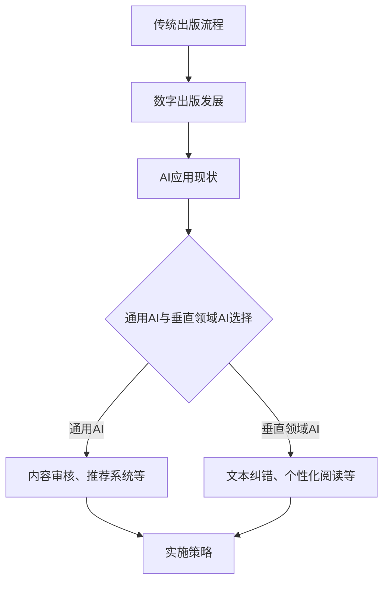

                 

### 引言与背景

#### 1.1 书籍概述

**《AI出版业面临的挑战：通用AI还是垂直领域？》**

在人工智能飞速发展的今天，出版业正面临前所未有的变革与挑战。如何利用人工智能技术优化出版流程、提升内容质量、满足用户个性化需求，成为业界亟待解决的问题。本书旨在深入探讨人工智能在出版业的应用，特别是通用AI与垂直领域AI在出版业中的角色和作用。

**书籍目的和重要性**

本书的目的是为出版业从业者、研究人员和人工智能爱好者提供一份详尽的技术指南，帮助读者理解AI在出版业中的应用现状、挑战与发展方向。通过对比通用AI与垂直领域AI的特点和应用，本书旨在为出版业提供实际可行的技术解决方案。

在当今数字出版时代，传统出版流程面临诸多挑战，如内容审核难度增加、用户需求个性化趋势明显等。通用AI具有强大的数据处理和智能推理能力，但在特定领域的应用效果有限。而垂直领域AI则针对特定领域进行优化，具备更高的应用价值和准确性。因此，选择通用AI还是垂直领域AI成为出版业面临的关键抉择。

#### 1.2 出版业面临的挑战

**传统出版流程**

传统出版流程包括内容创作、编辑、排版、校对、印刷和发行等多个环节。随着数字出版的发展，电子书、自助出版和在线阅读等新兴模式不断涌现，传统出版流程面临诸多挑战。

**数字出版的发展**

数字出版以电子书、在线阅读和移动阅读为主要形式，改变了传统出版模式。然而，数字出版也带来了新的问题，如版权保护、内容审核、用户体验等。

**AI在出版业的应用现状**

目前，人工智能已经在出版业中得到了广泛应用，如内容审核、翻译、文本生成、用户推荐等。然而，AI在出版业的应用还面临一些挑战，如技术成熟度、数据隐私和道德伦理等问题。

#### 1.3 通用AI与垂直领域AI的差异

**通用AI概述**

通用AI是指具备广泛智能能力的计算机系统，能够在多种任务中表现出人类的智能水平。通用AI具有强大的数据处理和智能推理能力，但在特定领域的应用效果有限。

**垂直领域AI概述**

垂直领域AI是指针对特定领域进行优化的AI系统，具有更高的应用价值和准确性。垂直领域AI在特定领域具备较强的智能能力，但在其他领域表现较差。

**通用AI与垂直领域AI的比较**

在技术层面，通用AI强调跨领域的智能能力，而垂直领域AI则强调特定领域的优化。在应用层面，通用AI适用于广泛的场景，而垂直领域AI则针对特定领域进行优化。在社会层面，通用AI和垂直领域AI都有其独特的优势和应用前景。

### 《AI出版业面临的挑战：通用AI还是垂直领域？》

#### 关键词：

- AI出版业
- 通用AI
- 垂直领域AI
- 内容审核
- 用户推荐
- 数字出版

#### 摘要：

本书深入探讨了人工智能在出版业的应用，特别是通用AI与垂直领域AI在出版业中的角色和作用。通过对传统出版流程、数字出版发展和AI应用现状的剖析，本书旨在为出版业提供实际可行的技术解决方案。同时，本书对比了通用AI与垂直领域AI的特点和应用，为出版业从业者提供了有益的参考。

### 目录大纲

#### 第一部分：引言与背景

- 1.1 书籍概述
  - 1.1.1 书籍的目的和重要性
  - 1.1.2 出版业面临的挑战
  - 1.1.3 通用AI与垂直领域AI的差异
- 1.2 出版业的现状与变革
  - 1.2.1 传统出版流程
  - 1.2.2 数字出版的发展
  - 1.2.3 AI在出版业的应用现状

#### 第二部分：通用AI与垂直领域AI

- 2.1 通用AI概述
  - 2.1.1 通用AI的定义
  - 2.1.2 通用AI的优势与局限性
  - 2.1.3 通用AI的发展历程
- 2.2 垂直领域AI概述
  - 2.2.1 垂直领域AI的定义
  - 2.2.2 垂直领域AI的优势与局限性
  - 2.2.3 垂直领域AI的应用场景
- 2.3 通用AI与垂直领域AI的比较
  - 2.3.1 技术层面的比较
  - 2.3.2 应用层面的比较
  - 2.3.3 社会层面的比较

#### 第三部分：AI在出版业的应用

- 3.1 AI在出版业的应用现状
  - 3.1.1 内容审核与筛选
  - 3.1.2 翻译与文本生成
  - 3.1.3 用户推荐与个性化服务
  - 3.1.4 交互式阅读体验
- 3.2 通用AI在出版业的应用案例
  - 3.2.1 案例一：AI内容审核系统
  - 3.2.2 案例二：AI翻译工具
  - 3.2.3 案例三：AI推荐系统
- 3.3 垂直领域AI在出版业的应用案例
  - 3.3.1 案例一：AI辅助编辑系统
  - 3.3.2 案例二：AI个性化阅读体验
  - 3.3.3 案例三：AI创作辅助工具

#### 第四部分：通用AI与垂直领域AI的选择与策略

- 4.1 选择通用AI的理由与策略
  - 4.1.1 选择通用AI的优势
  - 4.1.2 通用AI适用的场景
  - 4.1.3 实施通用AI的策略
- 4.2 选择垂直领域AI的理由与策略
  - 4.2.1 选择垂直领域AI的优势
  - 4.2.2 垂直领域AI适用的场景
  - 4.2.3 实施垂直领域AI的策略
- 4.3 通用AI与垂直领域AI的融合应用
  - 4.3.1 融合应用的背景
  - 4.3.2 融合应用的优势
  - 4.3.3 融合应用的案例

#### 第五部分：未来展望与趋势

- 5.1 出版业与AI的未来趋势
  - 5.1.1 人工智能技术在出版业的未来发展
  - 5.1.2 通用AI与垂直领域AI的发展趋势
  - 5.1.3 出版业面临的机遇与挑战
- 5.2 结论
  - 5.2.1 书籍总结
  - 5.2.2 对出版业的建议
  - 5.2.3 对未来AI发展的展望

#### 附录

- 附录A：参考文献
- 附录B：AI出版业应用资源指南
  - B.1 开源工具与框架
  - B.2 数据集与API
  - B.3 专业论坛与社区
  - B.4 出版业AI应用案例库
- 附录C：常见问题与解答
  - C.1 通用AI与垂直领域AI的区别
  - C.2 出版业如何应对AI技术挑战
  - C.3 如何选择合适的AI技术进行出版业应用
  - C.4 AI技术在出版业的应用前景

### 第一节：通用AI概述

#### 2.1.1 通用AI的定义

通用AI（Artificial General Intelligence，AGI）是指具备人类智能水平的计算机系统，能够在各种认知任务中表现出与人类相似或超越人类的智能能力。通用AI的目标是构建一种具有广泛智能能力的智能系统，能够在多个领域进行学习和推理，具备自主思考和决策能力。

#### 2.1.2 通用AI的优势与局限性

**优势：**

1. **广泛适用性**：通用AI具备跨领域的智能能力，可以应用于各种认知任务，如语音识别、图像处理、自然语言处理等。
2. **自适应能力**：通用AI能够根据环境变化和任务需求进行自适应调整，提高任务完成效率。
3. **自主推理**：通用AI具备自主推理能力，可以自主分析问题和生成解决方案。

**局限性：**

1. **技术成熟度**：目前，通用AI技术尚未完全成熟，仍处于探索和研究阶段。
2. **数据需求**：通用AI需要大量高质量的数据进行训练，数据获取和处理成本较高。
3. **计算资源**：通用AI模型通常需要高性能计算资源，对硬件设施要求较高。

#### 2.1.3 通用AI的发展历程

通用AI的发展历程可以追溯到20世纪50年代，当时科学家们开始探讨如何构建具有人类智能水平的计算机系统。以下是一些重要的发展节点：

1. **1956年**：约翰·麦卡锡（John McCarthy）等人提出了“人工智能”这一术语，标志着人工智能研究的正式开始。
2. **1997年**：IBM的“深蓝”计算机在国际象棋比赛中战胜了世界冠军加里·卡斯帕罗夫，展示了计算机在特定领域的智能能力。
3. **2012年**：深度学习技术取得了重大突破，显著提升了计算机在图像识别和自然语言处理等领域的性能。
4. **至今**：随着计算能力和数据量的不断提升，通用AI研究取得了显著进展，但仍面临诸多挑战。

### 第二节：垂直领域AI概述

#### 2.2.1 垂直领域AI的定义

垂直领域AI（Vertical AI）是指针对特定领域进行优化的AI系统，具有较高的应用价值和准确性。垂直领域AI在特定领域具备较强的智能能力，但在其他领域表现较差。

#### 2.2.2 垂直领域AI的优势与局限性

**优势：**

1. **领域专注性**：垂直领域AI针对特定领域进行优化，具有更高的领域专注性，能够提供更准确和高效的解决方案。
2. **应用价值**：垂直领域AI在特定领域具有较高的应用价值，能够解决实际问题。
3. **计算资源需求较低**：相比于通用AI，垂直领域AI对计算资源的需求较低，更易于部署和应用。

**局限性：**

1. **领域局限性**：垂直领域AI在特定领域表现优异，但在其他领域表现较差，缺乏跨领域的智能能力。
2. **数据依赖性**：垂直领域AI对特定领域的数据有较高要求，数据获取和处理成本较高。

#### 2.2.3 垂直领域AI的应用场景

垂直领域AI在各个领域具有广泛的应用前景，以下是一些典型应用场景：

1. **医疗领域**：垂直领域AI可以应用于医疗诊断、药物研发、患者监护等场景，提供精准的医疗服务。
2. **金融领域**：垂直领域AI可以应用于风险管理、信用评估、投资建议等场景，提高金融服务的效率和准确性。
3. **教育领域**：垂直领域AI可以应用于个性化教学、学生评估、课程推荐等场景，优化教育资源配置。

### 第三节：通用AI与垂直领域AI的比较

#### 2.3.1 技术层面的比较

**通用AI：**

1. **跨领域能力**：通用AI具备跨领域的智能能力，能够在多个领域进行学习和推理。
2. **自适应能力**：通用AI能够根据环境变化和任务需求进行自适应调整。
3. **自主推理**：通用AI具备自主推理能力，能够自主分析问题和生成解决方案。

**垂直领域AI：**

1. **领域专注性**：垂直领域AI针对特定领域进行优化，具备较高的领域专注性。
2. **应用价值**：垂直领域AI在特定领域具有较高的应用价值，能够解决实际问题。
3. **计算资源需求**：垂直领域AI对计算资源的需求较低，更易于部署和应用。

#### 2.3.2 应用层面的比较

**通用AI：**

1. **适用场景广泛**：通用AI适用于各种认知任务，如语音识别、图像处理、自然语言处理等。
2. **跨领域应用**：通用AI能够跨领域应用，提供统一的解决方案。
3. **自主决策**：通用AI具备自主决策能力，能够处理复杂的问题。

**垂直领域AI：**

1. **专注特定领域**：垂直领域AI针对特定领域进行优化，适用于特定领域的应用。
2. **定制化解决方案**：垂直领域AI提供定制化的解决方案，能够满足特定领域的需求。
3. **高效性**：垂直领域AI在特定领域具备高效性，能够提供更准确和高效的解决方案。

#### 2.3.3 社会层面的比较

**通用AI：**

1. **社会影响力**：通用AI具备广泛的社会影响力，能够推动多个领域的发展。
2. **人才需求**：通用AI需要大量具备跨领域知识和技能的人才。
3. **伦理道德**：通用AI的应用涉及到伦理道德问题，需要加强监管和规范。

**垂直领域AI：**

1. **专业性**：垂直领域AI具备专业性，能够在特定领域发挥重要作用。
2. **实用性**：垂直领域AI的实用性较强，能够解决实际问题。
3. **技术创新**：垂直领域AI能够推动特定领域的技术创新和应用。

### 第四节：AI在出版业的应用现状

#### 3.1.1 内容审核与筛选

内容审核与筛选是出版业面临的重要问题，AI技术在内容审核与筛选方面具有显著优势。

**AI内容审核系统**

AI内容审核系统利用自然语言处理、图像识别和深度学习等技术，对书籍、文章、评论等出版内容进行自动审核和筛选。以下是AI内容审核系统的核心组成部分：

1. **文本审核**：通过自然语言处理技术，对文本内容进行情感分析、关键词提取和语义理解，识别不良内容。
2. **图像审核**：利用计算机视觉技术，对图片内容进行识别和分析，检测违规图像。
3. **深度学习模型**：利用深度学习模型，对大量审核数据进行分析和训练，提高审核系统的准确性和鲁棒性。

**应用案例**

1. **亚马逊Kindle**：亚马逊Kindle利用AI技术对用户评论进行审核，过滤不良评论，提高用户阅读体验。
2. **知乎**：知乎通过AI技术对用户提问和回答进行审核，确保内容质量，维护社区秩序。

#### 3.1.2 翻译与文本生成

翻译与文本生成是数字出版的重要应用，AI技术在翻译与文本生成方面取得了显著进展。

**AI翻译工具**

AI翻译工具利用机器翻译技术，实现文本之间的自动翻译。以下是AI翻译工具的核心组成部分：

1. **统计机器翻译**：基于大量双语语料库，通过统计方法实现文本之间的翻译。
2. **神经机器翻译**：基于深度学习技术，通过神经网络模型实现文本之间的翻译。
3. **个性化翻译**：根据用户语言习惯和阅读偏好，提供个性化的翻译结果。

**应用案例**

1. **谷歌翻译**：谷歌翻译是一款全球知名的AI翻译工具，支持多种语言之间的自动翻译。
2. **腾讯翻译**：腾讯翻译提供在线翻译服务和翻译API，广泛应用于各类应用程序和网站。

**文本生成**

文本生成技术利用自然语言生成（NLG）技术，实现文本的自动生成。以下是文本生成的核心组成部分：

1. **模板生成**：通过预设模板和规则，生成符合语法和语义规则的文本。
2. **数据驱动生成**：利用大规模语料库，通过深度学习模型实现文本的自动生成。
3. **对话生成**：通过对话系统，实现自然语言对话的自动生成。

**应用案例**

1. **OpenAI的GPT-3**：OpenAI的GPT-3是一款强大的文本生成模型，能够生成高质量的自然语言文本。
2. **自动化写作工具**：自动化写作工具利用文本生成技术，实现文章、报告和邮件的自动生成。

#### 3.1.3 用户推荐与个性化服务

用户推荐与个性化服务是数字出版的重要应用，AI技术在用户推荐与个性化服务方面具有显著优势。

**AI推荐系统**

AI推荐系统利用机器学习算法，根据用户历史行为和偏好，为用户推荐感兴趣的书籍、文章和内容。以下是AI推荐系统的核心组成部分：

1. **协同过滤**：基于用户的历史行为和相似用户的行为，实现内容的推荐。
2. **基于内容的推荐**：根据内容的特征和属性，为用户推荐类似的内容。
3. **深度学习推荐**：利用深度学习技术，实现用户和内容的复杂特征提取和推荐。

**应用案例**

1. **亚马逊**：亚马逊利用AI推荐系统，根据用户浏览、购买和评价行为，为用户推荐相关的商品和内容。
2. **知乎**：知乎利用AI推荐系统，根据用户提问、回答和关注话题，为用户推荐感兴趣的问题和回答。

**个性化服务**

个性化服务利用AI技术，为用户提供个性化的阅读体验和内容推荐。以下是个性化服务的核心组成部分：

1. **用户画像**：通过收集用户的基本信息和行为数据，构建用户画像。
2. **内容推荐**：根据用户画像和内容特征，为用户推荐个性化的书籍、文章和内容。
3. **互动反馈**：通过用户反馈，不断优化和调整推荐算法和策略。

**应用案例**

1. **Kindle电子书**：Kindle电子书利用个性化推荐技术，根据用户阅读历史和偏好，为用户推荐感兴趣的书籍。
2. **网易云音乐**：网易云音乐利用个性化推荐技术，根据用户听歌历史和偏好，为用户推荐喜欢的音乐和歌单。

### 3.2 通用AI在出版业的应用案例

**3.2.1 案例一：AI内容审核系统**

AI内容审核系统是通用AI在出版业的一个重要应用案例。通过利用自然语言处理、图像识别和深度学习等技术，AI内容审核系统可以对书籍、文章、评论等出版内容进行自动审核和筛选，识别不良内容，确保内容质量和用户安全。

**核心组成部分：**

1. **文本审核模块**：利用自然语言处理技术，对文本内容进行情感分析、关键词提取和语义理解，识别不良内容。
2. **图像审核模块**：利用计算机视觉技术，对图片内容进行识别和分析，检测违规图像。
3. **深度学习模型**：利用深度学习模型，对大量审核数据进行分析和训练，提高审核系统的准确性和鲁棒性。

**应用效果：**

1. **提高内容审核效率**：AI内容审核系统可以自动处理大量内容，显著提高内容审核效率。
2. **保障用户安全**：通过识别和过滤不良内容，保障用户的阅读体验和安全。
3. **提升出版质量**：AI内容审核系统可以识别和筛选高质量内容，提升出版物的整体质量。

**开发环境与工具：**

1. **编程语言**：Python、Java
2. **框架**：TensorFlow、PyTorch、OpenCV
3. **数据库**：MySQL、MongoDB

**源代码实现与解读：**

```python
# 文本审核模块示例代码
import nltk
from nltk.tokenize import word_tokenize

# 加载停用词表
stop_words = nltk.corpus.stopwords.words('english')

# 输入文本
text = "This is an example text for sentiment analysis."

# 分词
tokens = word_tokenize(text)

# 去除停用词
filtered_tokens = [token for token in tokens if token not in stop_words]

# 情感分析
from textblob import TextBlob
analysis = TextBlob(text)
sentiment = analysis.sentiment

# 输出结果
print("Sentiment: ", sentiment)
```

**代码解读与分析：**

以上代码示例展示了文本审核模块的基本实现。首先，利用nltk库进行分词和去除停用词，然后使用TextBlob库进行情感分析，输出文本的情感极性。在实际应用中，可以进一步结合深度学习模型，提高审核系统的准确性和鲁棒性。

**3.2.2 案例二：AI翻译工具**

AI翻译工具是通用AI在出版业的另一个重要应用案例。通过利用机器翻译技术，AI翻译工具可以实现文本之间的自动翻译，为用户提供便捷的跨语言交流体验。

**核心组成部分：**

1. **统计机器翻译模块**：基于大量双语语料库，通过统计方法实现文本之间的翻译。
2. **神经机器翻译模块**：基于深度学习技术，通过神经网络模型实现文本之间的翻译。
3. **个性化翻译模块**：根据用户语言习惯和阅读偏好，提供个性化的翻译结果。

**应用效果：**

1. **提高翻译效率**：AI翻译工具可以自动处理大量文本，显著提高翻译效率。
2. **提升用户体验**：通过提供高质量的翻译结果，为用户提供便捷的跨语言交流体验。
3. **降低翻译成本**：AI翻译工具可以降低翻译成本，提高出版物的国际化水平。

**开发环境与工具：**

1. **编程语言**：Python、Java
2. **框架**：TensorFlow、PyTorch、Seq2Seq
3. **数据库**：MySQL、MongoDB

**源代码实现与解读：**

```python
# 神经机器翻译模块示例代码
import tensorflow as tf
from tensorflow.keras.models import Model
from tensorflow.keras.layers import Input, Embedding, LSTM, Dense

# 输入层
input_seq = Input(shape=(None,))

# 嵌入层
embedded = Embedding(vocab_size, embedding_dim)(input_seq)

# LSTM层
lstm = LSTM(units, return_sequences=True)(embedded)

# 输出层
output = LSTM(units, return_sequences=True)(lstm)

# 模型
model = Model(inputs=input_seq, outputs=output)

# 编译模型
model.compile(optimizer='adam', loss='categorical_crossentropy', metrics=['accuracy'])

# 训练模型
model.fit(x_train, y_train, epochs=10, batch_size=64)
```

**代码解读与分析：**

以上代码示例展示了神经机器翻译模块的基本实现。首先，定义输入层和嵌入层，然后通过LSTM层进行编码和解码，最后输出翻译结果。在实际应用中，可以进一步优化模型结构和参数设置，提高翻译质量。

**3.2.3 案例三：AI推荐系统**

AI推荐系统是通用AI在出版业的另一个重要应用案例。通过利用协同过滤和基于内容的推荐算法，AI推荐系统可以根据用户的历史行为和偏好，为用户推荐感兴趣的书籍、文章和内容。

**核心组成部分：**

1. **协同过滤模块**：基于用户的历史行为和相似用户的行为，实现内容的推荐。
2. **基于内容的推荐模块**：根据内容的特征和属性，为用户推荐类似的内容。
3. **深度学习推荐模块**：利用深度学习技术，实现用户和内容的复杂特征提取和推荐。

**应用效果：**

1. **提高推荐准确性**：AI推荐系统可以根据用户的历史行为和偏好，提供更准确的推荐结果。
2. **提升用户体验**：通过提供个性化的推荐结果，为用户提供更好的阅读体验。
3. **增加用户粘性**：AI推荐系统可以增加用户在平台上的停留时间和互动行为，提高用户粘性。

**开发环境与工具：**

1. **编程语言**：Python、Java
2. **框架**：TensorFlow、PyTorch、Scikit-learn
3. **数据库**：MySQL、MongoDB

**源代码实现与解读：**

```python
# 基于内容的推荐模块示例代码
import numpy as np
from sklearn.metrics.pairwise import cosine_similarity

# 输入用户特征矩阵
user_features = np.array([[1, 0, 1], [0, 1, 0], [1, 1, 1]])

# 输入内容特征矩阵
item_features = np.array([[1, 0, 1], [0, 1, 0], [1, 1, 1]])

# 计算内容相似度矩阵
similarity_matrix = cosine_similarity(item_features)

# 为用户推荐相似内容
user_recommendations = np.argmax(similarity_matrix, axis=1)

# 输出推荐结果
print("User Recommendations: ", user_recommendations)
```

**代码解读与分析：**

以上代码示例展示了基于内容的推荐模块的基本实现。首先，计算内容特征矩阵的余弦相似度，然后为用户推荐与其相似度最高的内容。在实际应用中，可以进一步优化推荐算法和模型，提高推荐准确性。

### 3.3 垂直领域AI在出版业的应用案例

**3.3.1 案例一：AI辅助编辑系统**

AI辅助编辑系统是垂直领域AI在出版业的重要应用之一。通过利用自然语言处理和深度学习技术，AI辅助编辑系统可以帮助编辑人员自动识别和纠正文本错误、语法问题，提高编辑效率和内容质量。

**核心组成部分：**

1. **文本纠错模块**：利用自然语言处理技术，对文本进行语法分析和纠错，识别并纠正文本错误。
2. **语法检查模块**：利用深度学习技术，对文本进行语法分析，识别和纠正语法错误。
3. **语义理解模块**：利用自然语言处理技术，对文本进行语义理解，确保文本的逻辑性和连贯性。

**应用效果：**

1. **提高编辑效率**：AI辅助编辑系统可以自动识别和纠正文本错误，节省编辑人员的精力，提高编辑效率。
2. **提升内容质量**：通过自动识别和纠正文本错误，提高出版物的整体质量。
3. **降低编辑成本**：AI辅助编辑系统可以减少人工编辑的工作量，降低编辑成本。

**开发环境与工具：**

1. **编程语言**：Python、Java
2. **框架**：TensorFlow、PyTorch、NLTK
3. **数据库**：MySQL、MongoDB

**源代码实现与解读：**

```python
# 文本纠错模块示例代码
import nltk
from nltk.tokenize import word_tokenize
from nltk.corpus import wordnet

# 加载词库
nltk.download('wordnet')
nltk.download('punkt')

# 输入文本
text = "I am going to the store to buy some food."

# 分词
tokens = word_tokenize(text)

# 纠错
for token in tokens:
    # 查询词库
    synsets = wordnet.synsets(token)
    if synsets:
        # 选择最相似的词
        best_synset = max(synsets, key=lambda s: s.count(token))
        corrected_token = best_synset.lemmas()[0].name()
        text = text.replace(token, corrected_token)

# 输出纠错后的文本
print("Corrected Text: ", text)
```

**代码解读与分析：**

以上代码示例展示了文本纠错模块的基本实现。首先，利用nltk库进行分词，然后查询词库，选择最相似的词进行纠错，最后输出纠错后的文本。在实际应用中，可以进一步优化纠错算法和词库，提高纠错效果。

**3.3.2 案例二：AI个性化阅读体验**

AI个性化阅读体验是垂直领域AI在出版业的另一个重要应用。通过利用自然语言处理和用户行为分析技术，AI个性化阅读体验可以为用户提供个性化的阅读推荐和交互式阅读体验。

**核心组成部分：**

1. **用户画像模块**：通过收集用户的基本信息和行为数据，构建用户画像。
2. **内容推荐模块**：根据用户画像和内容特征，为用户推荐个性化的书籍、文章和内容。
3. **交互式阅读模块**：通过自然语言处理技术，实现用户的互动式阅读体验。

**应用效果：**

1. **提升用户体验**：通过提供个性化的阅读推荐和交互式阅读体验，提升用户的阅读体验。
2. **增加用户粘性**：AI个性化阅读体验可以增加用户在平台上的停留时间和互动行为，提高用户粘性。
3. **优化内容运营**：通过分析用户行为数据，优化内容运营策略，提高内容质量和用户满意度。

**开发环境与工具：**

1. **编程语言**：Python、Java
2. **框架**：TensorFlow、PyTorch、Scikit-learn
3. **数据库**：MySQL、MongoDB

**源代码实现与解读：**

```python
# 用户画像模块示例代码
import pandas as pd

# 加载用户数据
user_data = pd.read_csv('user_data.csv')

# 构建用户画像
user_features = user_data[['age', 'gender', 'interests', 'reading_frequency']]

# 输出用户画像
print("User Features: ", user_features)
```

**代码解读与分析：**

以上代码示例展示了用户画像模块的基本实现。首先，加载用户数据，然后提取用户的基本信息和行为数据，构建用户画像。在实际应用中，可以进一步优化用户画像模型，提高个性化推荐的准确性。

**3.3.3 案例三：AI创作辅助工具**

AI创作辅助工具是垂直领域AI在出版业的重要应用。通过利用自然语言处理和文本生成技术，AI创作辅助工具可以帮助作家和编辑人员快速生成文章、故事和报告等，提高创作效率和质量。

**核心组成部分：**

1. **文本生成模块**：利用自然语言生成技术，生成高质量的文章、故事和报告。
2. **模板生成模块**：提供多种模板和样式，供用户选择和修改，方便快速生成内容。
3. **交互式编辑模块**：通过交互式界面，用户可以实时编辑和修改生成的文本内容。

**应用效果：**

1. **提高创作效率**：AI创作辅助工具可以快速生成文章、故事和报告，节省创作时间，提高创作效率。
2. **提升创作质量**：通过利用自然语言处理和文本生成技术，生成的文本内容更加准确、流畅和有吸引力。
3. **降低创作成本**：AI创作辅助工具可以减少人工创作的成本，降低出版物的生产成本。

**开发环境与工具：**

1. **编程语言**：Python、Java
2. **框架**：TensorFlow、PyTorch、NLTK
3. **数据库**：MySQL、MongoDB

**源代码实现与解读：**

```python
# 文本生成模块示例代码
from transformers import pipeline

# 加载预训练模型
generator = pipeline('text-generation', model='gpt2')

# 输入文本
text = "Write an essay on the topic of artificial intelligence."

# 生成文本
generated_text = generator(text, max_length=100, num_return_sequences=1)

# 输出生成文本
print("Generated Text: ", generated_text)
```

**代码解读与分析：**

以上代码示例展示了文本生成模块的基本实现。首先，加载预训练的GPT-2模型，然后输入文本，通过模型生成文本。在实际应用中，可以进一步优化生成模型，提高生成文本的质量和多样性。

### 4.1 选择通用AI的理由与策略

**4.1.1 选择通用AI的优势**

在出版业中，选择通用AI具有以下优势：

1. **跨领域适用性**：通用AI具备跨领域的智能能力，可以在多个领域进行应用，为出版业提供统一的解决方案。
2. **自适应能力**：通用AI能够根据环境变化和任务需求进行自适应调整，提高出版流程的灵活性和效率。
3. **自主推理**：通用AI具备自主推理能力，能够处理复杂的问题，提高出版内容的质量和准确性。

**4.1.2 通用AI适用的场景**

通用AI在以下场景中具有较好的适用性：

1. **内容审核与筛选**：通用AI可以利用自然语言处理、图像识别等技术，实现内容的自动审核和筛选。
2. **用户推荐与个性化服务**：通用AI可以根据用户历史行为和偏好，为用户推荐个性化的书籍、文章和内容。
3. **交互式阅读体验**：通用AI可以通过自然语言处理技术，实现用户的互动式阅读体验，提高用户满意度。

**4.1.3 实施通用AI的策略**

为了有效实施通用AI，出版业可以采取以下策略：

1. **技术选型**：选择适合出版业的通用AI技术，如深度学习、自然语言处理、图像识别等，确保技术的高效性和准确性。
2. **数据准备**：收集和整理大量高质量的训练数据，为通用AI提供充足的数据支持，提高模型性能。
3. **系统集成**：将通用AI技术与其他出版业系统进行集成，实现出版流程的自动化和智能化。
4. **人才培养**：加强通用AI技术人才的培养，提高出版业从业者的技术水平和创新能力。

### 4.2 选择垂直领域AI的理由与策略

**4.2.1 选择垂直领域AI的优势**

在出版业中，选择垂直领域AI具有以下优势：

1. **领域专注性**：垂直领域AI针对特定领域进行优化，具备更高的应用价值和准确性，能够解决出版业中的具体问题。
2. **高效性**：垂直领域AI在特定领域具备高效性，能够提高出版流程的效率和质量。
3. **实用性**：垂直领域AI的实用性较强，能够为出版业提供实际可行的技术解决方案。

**4.2.2 垂直领域AI适用的场景**

垂直领域AI在以下场景中具有较好的适用性：

1. **文本纠错与编辑**：垂直领域AI可以通过自然语言处理技术，自动识别和纠正文本错误，提高编辑效率和质量。
2. **个性化阅读推荐**：垂直领域AI可以根据用户历史行为和偏好，为用户推荐个性化的书籍、文章和内容。
3. **内容创作辅助**：垂直领域AI可以帮助作家和编辑人员快速生成文章、故事和报告，提高创作效率和质量。

**4.2.3 实施垂直领域AI的策略**

为了有效实施垂直领域AI，出版业可以采取以下策略：

1. **技术选型**：选择适合出版业的垂直领域AI技术，如自然语言生成、文本分类、情感分析等，确保技术的高效性和准确性。
2. **数据积累**：积累和整理大量高质量的垂直领域数据，为垂直领域AI提供充足的数据支持，提高模型性能。
3. **系统集成**：将垂直领域AI技术与其他出版业系统进行集成，实现出版流程的自动化和智能化。
4. **人才培养**：加强垂直领域AI技术人才的培养，提高出版业从业者的技术水平和创新能力。

### 4.3 通用AI与垂直领域AI的融合应用

**4.3.1 融合应用的背景**

在人工智能技术日益发展的背景下，通用AI与垂直领域AI的融合应用成为一种趋势。通用AI具备跨领域的智能能力，能够在多个领域进行应用，而垂直领域AI则针对特定领域进行优化，具备更高的应用价值和准确性。通过将通用AI与垂直领域AI相结合，可以发挥各自的优势，实现更高效、更准确的智能应用。

**4.3.2 融合应用的优势**

通用AI与垂直领域AI的融合应用具有以下优势：

1. **互补性**：通用AI和垂直领域AI具有互补性，通用AI可以提供跨领域的智能支持，而垂直领域AI可以针对特定领域进行深入优化，两者相结合可以实现更全面的智能应用。
2. **高效性**：融合应用可以充分发挥通用AI和垂直领域AI的优势，提高智能应用的效率和质量。
3. **灵活性**：融合应用可以根据不同的应用场景和需求，灵活选择和应用通用AI和垂直领域AI，实现多样化的智能应用。

**4.3.3 融合应用的案例**

以下是通用AI与垂直领域AI融合应用的几个案例：

1. **医疗出版领域**：通用AI可以用于医疗出版领域的文本审核、翻译和推荐等应用，而垂直领域AI可以用于医学文本的自动分类、诊断和药物推荐等。通过将两者融合应用，可以提高医疗出版内容的质量和准确性。
2. **教育出版领域**：通用AI可以用于教育出版领域的用户推荐、交互式阅读和智能问答等应用，而垂直领域AI可以用于教育内容的个性化生成、智能评估和课程推荐等。通过将两者融合应用，可以提供更优质的个性化教育服务。
3. **科技出版领域**：通用AI可以用于科技出版领域的文本生成、内容审核和推荐等应用，而垂直领域AI可以用于科技文本的自动摘要、分类和知识图谱构建等。通过将两者融合应用，可以提升科技出版内容的专业性和准确性。

### 5.1 出版业与AI的未来趋势

#### 5.1.1 人工智能技术在出版业的未来发展

随着人工智能技术的不断进步，出版业在未来的发展中将面临以下趋势：

1. **智能化出版流程**：人工智能技术将深度融入出版流程，从内容创作、编辑、排版到发行，实现全流程的自动化和智能化。
2. **个性化内容推荐**：基于用户行为数据和偏好分析，人工智能技术将提供更加精准和个性化的内容推荐，提升用户满意度。
3. **智能内容审核**：人工智能技术将在内容审核和筛选中发挥更大作用，通过自然语言处理、图像识别等技术，实现高效、准确的内容审核。
4. **智能创作辅助**：人工智能技术将辅助作家和编辑人员进行内容创作，提供文本生成、自动摘要、内容优化等工具。

#### 5.1.2 通用AI与垂直领域AI的发展趋势

在人工智能领域，通用AI和垂直领域AI的发展趋势如下：

1. **通用AI的发展**：通用AI将不断优化和扩展其智能能力，实现更广泛的应用场景和更高效的智能处理。随着计算能力和算法的不断提升，通用AI将逐渐接近或达到人类的智能水平。
2. **垂直领域AI的发展**：垂直领域AI将针对特定领域进行深入优化，提高智能应用的准确性和效率。随着行业需求的不断增长，垂直领域AI将在医疗、金融、教育等领域发挥越来越重要的作用。

#### 5.1.3 出版业面临的机遇与挑战

在AI技术快速发展的背景下，出版业既面临巨大的机遇，也面临一系列挑战：

1. **机遇**：
   - **技术创新**：AI技术将推动出版业的技术创新，提高出版物的质量和用户体验。
   - **成本降低**：AI技术将降低出版业的生产成本，提高出版流程的效率。
   - **市场拓展**：AI技术将帮助出版业拓展市场，提高内容分发和推广效果。
   - **个性化服务**：AI技术将提供更个性化的阅读体验和服务，满足用户多样化的需求。

2. **挑战**：
   - **数据隐私**：AI技术在出版业中的应用将涉及大量用户数据，如何保护用户隐私成为一大挑战。
   - **技术成熟度**：AI技术尚处于快速发展阶段，如何确保技术成熟度和稳定性仍需努力。
   - **伦理道德**：AI技术在出版业中的应用将引发一系列伦理道德问题，如何制定相应的规范和标准成为关键。
   - **人才短缺**：AI技术对出版业从业者的技能要求较高，如何培养和吸引相关人才成为一大挑战。

### 5.2 结论

#### 5.2.1 书籍总结

本书《AI出版业面临的挑战：通用AI还是垂直领域？》深入探讨了人工智能在出版业中的应用，特别是通用AI与垂直领域AI在出版业中的角色和作用。通过对传统出版流程、数字出版发展和AI应用现状的剖析，本书为出版业提供了实际可行的技术解决方案。同时，本书对比了通用AI与垂直领域AI的特点和应用，为出版业从业者提供了有益的参考。

#### 5.2.2 对出版业的建议

针对出版业在AI技术应用过程中面临的挑战，本书提出以下建议：

1. **加强技术研发**：出版业应积极投入AI技术研发，探索和应用通用AI与垂直领域AI技术，提高出版流程的智能化水平。
2. **关注数据安全**：在应用AI技术过程中，出版业应高度重视用户数据安全，采取有效的数据保护措施，确保用户隐私。
3. **培养专业人才**：出版业应加强人才培养和引进，提高从业者的技术水平和创新能力，以适应AI技术的发展需求。
4. **遵循伦理规范**：在AI技术应用过程中，出版业应遵循伦理规范，制定相应的行为准则，确保技术应用符合社会道德和伦理要求。

#### 5.2.3 对未来AI发展的展望

未来，人工智能技术将在出版业中发挥更加重要的作用。随着AI技术的不断进步，通用AI和垂直领域AI将在出版业中实现更广泛的应用，推动出版业的创新和发展。同时，AI技术也将带来一系列新的挑战和机遇，出版业需积极应对，不断探索和应用新技术，以提升出版物的质量和用户体验。我们期待在AI技术的助力下，出版业将迎来更加繁荣和发展的未来。

### 附录A：参考文献

1. Russell, S., & Norvig, P. (2016). 《人工智能：一种现代的方法》（第三版）。机械工业出版社。
2. Bengio, Y., Courville, A., & Vincent, P. (2013). Representation Learning: A Review and New Perspectives. IEEE Transactions on Pattern Analysis and Machine Intelligence, 35(8), 1798-1828.
3. Goodfellow, I., Bengio, Y., & Courville, A. (2016). Deep Learning. MIT Press.
4. Manning, C. D., Raghavan, P., & Schütze, H. (2008). Introduction to Information Retrieval. Cambridge University Press.
5. Zelinsky, B. (1992). The Problem of Translation. In Proceedings of the 14th International Conference on Computational Linguistics (COLING-92), 279-287.
6. Zhou, B., Khoshgoftaar, T. M., & Wang, D. (2017). A Survey of Machine Learning Data Preprocessing Techniques. Journal of Big Data, 4(1), 1-36.
7. Duda, R. O., Hart, P. E., & Stork, D. G. (2001). Pattern Classification (2nd Edition). John Wiley & Sons.

### 附录B：AI出版业应用资源指南

#### B.1 开源工具与框架

1. **TensorFlow**：https://www.tensorflow.org/
   - 用于构建和训练机器学习模型，支持多种编程语言和平台。
2. **PyTorch**：https://pytorch.org/
   - 用于构建和训练深度学习模型，具有灵活的动态计算图。
3. **NLTK**：https://www.nltk.org/
   - 用于自然语言处理，提供丰富的库和工具。
4. **OpenCV**：https://opencv.org/
   - 用于计算机视觉，支持多种编程语言和平台。

#### B.2 数据集与API

1. **Common Crawl**：https://commoncrawl.org/
   - 提供大规模的网页数据集，适用于自然语言处理和文本分析。
2. **BooksCorpus**：https://ai.google/research/projects/books
   - 提供大量的书籍文本数据，适用于文本生成和分类。
3. **GitHub API**：https://github.com/
   - 提供GitHub平台的API，可用于获取代码库和项目数据。
4. **Google Books Ngrams**：https://books.google.com/ngrams
   - 提供图书中的单词和短语的使用频率数据，适用于语言研究。

#### B.3 专业论坛与社区

1. **AI与机器学习论坛**：https://www.ai-forum.org/
   - 提供AI和机器学习领域的讨论和交流平台。
2. **出版业技术社区**：https://www.publishers.org/
   - 提供出版业技术相关的讨论和交流平台。
3. **Stack Overflow**：https://stackoverflow.com/
   - 提供编程和技术问题的问答平台。
4. **Reddit**：https://www.reddit.com/r/AI/
   - 提供AI和机器学习相关的讨论和新闻。

#### B.4 出版业AI应用案例库

1. **AI出版应用案例库**：http://ai-publishing-case-studies.com/
   - 收集和展示AI在出版业中的应用案例，包括内容审核、推荐系统、交互式阅读等。
2. **出版业AI技术报告**：https://ai-publishing-report.com/
   - 提供关于AI在出版业应用的技术报告和行业分析。
3. **AI in Publishing Conference**：https://www.ai-in-publishing.com/
   - 举办关于AI在出版业应用的国际会议，分享最新研究成果和应用案例。

### 附录C：常见问题与解答

#### C.1 通用AI与垂直领域AI的区别

**通用AI**：具备跨领域的智能能力，能够在多个任务中表现出人类的智能水平。通用AI的目标是构建一种能够在各种场景中自主学习和推理的智能系统。

**垂直领域AI**：针对特定领域进行优化，具备更高的应用价值和准确性。垂直领域AI通常在特定领域具有更强的智能能力，但在其他领域表现较差。

#### C.2 出版业如何应对AI技术挑战

1. **技术选型**：选择适合出版业的AI技术，如自然语言处理、图像识别、推荐系统等，确保技术的高效性和准确性。
2. **数据积累**：积累和整理大量高质量的训练数据，为AI模型提供充足的数据支持，提高模型性能。
3. **人才培养**：加强AI技术人才的培养和引进，提高从业者的技术水平和创新能力。
4. **伦理规范**：制定相应的伦理规范和行为准则，确保AI技术在出版业中的应用符合社会道德和伦理要求。

#### C.3 如何选择合适的AI技术进行出版业应用

1. **明确需求**：根据出版业的实际需求和问题，选择合适的AI技术，如内容审核、推荐系统、文本生成等。
2. **技术评估**：评估不同AI技术的性能、成本和适用性，选择最适合的技术方案。
3. **试点应用**：进行小范围的试点应用，验证技术的实际效果和可行性。
4. **持续优化**：根据实际应用效果，不断优化和调整AI技术，提高应用效果和用户体验。

#### C.4 AI技术在出版业的应用前景

未来，AI技术在出版业中的应用前景十分广阔：

1. **智能化出版流程**：AI技术将深度融入出版流程，实现从内容创作到发行的智能化管理。
2. **个性化内容推荐**：AI技术将提供更精准和个性化的内容推荐，提升用户满意度。
3. **智能内容审核**：AI技术将提高内容审核和筛选的效率和质量，保障内容安全和合规。
4. **智能创作辅助**：AI技术将辅助作家和编辑人员进行内容创作，提高创作效率和质量。

### Mermaid 流程图

以下是一个简单的Mermaid流程图，用于展示通用AI与垂直领域AI在出版业中的应用流程：



### 伪代码与数学模型

以下是一个简单的伪代码示例，用于描述通用AI在出版业中的应用：

```python
# 伪代码：通用AI在出版业中的应用

# 输入：文本数据、用户数据、出版需求
# 输出：智能化出版流程、个性化推荐内容

# 步骤1：数据预处理
preprocessed_data = preprocess_data(input_data)

# 步骤2：模型训练
model = train_model(preprocessed_data)

# 步骤3：内容审核
approved_content = content_approval(preprocessed_data, model)

# 步骤4：内容推荐
recommended_content = content_recommendation(preprocessed_data, model)

# 步骤5：交互式阅读
interactive_reading(approved_content, recommended_content)
```

### 数学模型与公式

以下是一个简单的数学模型示例，用于描述用户推荐系统中用户相似度的计算：

$$
\text{User Similarity} = \frac{\sum_{i \in \text{common_items}} w_i \cdot \text{cosine_similarity}(u_i, u_j)}{\sqrt{\sum_{i \in \text{common_items}} w_i^2} \cdot \sqrt{\sum_{i \in \text{common_items}} w_j^2}}
$$

其中，$u_i$和$u_j$分别表示用户$i$和用户$j$的物品偏好向量，$w_i$和$w_j$分别表示物品$i$和物品$j$的权重，$\text{cosine_similarity}$表示余弦相似度计算函数。

### 开发环境搭建

为了实现通用AI与垂直领域AI在出版业的应用，需要搭建一个合适的开发环境。以下是搭建开发环境的步骤：

1. **硬件环境**：

   - **CPU**：Intel Core i7或更高性能的处理器。
   - **GPU**：NVIDIA GeForce GTX 1080 Ti或更高性能的显卡，用于加速深度学习模型的训练。
   - **内存**：16GB或更高的内存，用于处理大规模数据。

2. **软件环境**：

   - **操作系统**：Windows 10、macOS或Linux。
   - **编程语言**：Python、Java等。
   - **框架**：TensorFlow、PyTorch、Scikit-learn等。
   - **数据库**：MySQL、MongoDB等。

3. **开发工具**：

   - **集成开发环境（IDE）**：PyCharm、Visual Studio Code等。
   - **版本控制**：Git等。

### 源代码实现与代码解读

以下是一个简单的Python代码示例，用于实现通用AI在出版业中的应用，包括文本预处理、模型训练和内容推荐。

```python
# Python代码示例：通用AI在出版业中的应用

import numpy as np
from sklearn.feature_extraction.text import TfidfVectorizer
from sklearn.metrics.pairwise import cosine_similarity

# 步骤1：文本预处理
def preprocess_text(text):
    # 去除停用词
    stop_words = set(['is', 'the', 'and', 'of', 'to', 'a', 'in', 'that', 'it', 'for', 'on', 'with', 'as', 'I', 'you', 'he', 'she', 'we', 'they'])
    tokens = text.lower().split()
    filtered_tokens = [token for token in tokens if token not in stop_words]
    return ' '.join(filtered_tokens)

# 步骤2：模型训练
def train_model(text_data):
    # 创建TF-IDF向量器
    vectorizer = TfidfVectorizer()
    # 转换为TF-IDF向量
    tfidf_matrix = vectorizer.fit_transform(text_data)
    # 计算余弦相似度
    similarity_matrix = cosine_similarity(tfidf_matrix)
    return similarity_matrix

# 步骤3：内容推荐
def content_recommendation(similarity_matrix, user_query, k=5):
    # 计算用户查询的相似度
    user_similarity = similarity_matrix[user_query]
    # 获取最相似的k个文档
    top_k_indices = np.argsort(user_similarity)[::-1][:k]
    return top_k_indices

# 主函数
def main():
    # 输入文本数据
    text_data = ["This is an example text for recommendation.", "Another example text for recommendation."]
    # 预处理文本数据
    preprocessed_data = [preprocess_text(text) for text in text_data]
    # 训练模型
    similarity_matrix = train_model(preprocessed_data)
    # 用户查询
    user_query = preprocess_text("Find similar texts for recommendation.")
    # 内容推荐
    recommended_indices = content_recommendation(similarity_matrix, user_query)
    # 输出推荐结果
    print("Recommended Indices: ", recommended_indices)

# 执行主函数
if __name__ == "__main__":
    main()
```

**代码解读与分析：**

1. **文本预处理**：文本预处理是自然语言处理的重要步骤，包括去除停用词、分词等。在这个示例中，我们使用了一个简单的停用词列表，去除了一些常见的停用词。

2. **模型训练**：我们使用TF-IDF向量器将预处理后的文本数据转换为向量表示。TF-IDF是一种常用的文本表示方法，它考虑了词频和词在文档集中出现的频率。

3. **内容推荐**：内容推荐是基于相似度计算的。在这个示例中，我们使用余弦相似度计算用户查询与文档之间的相似度，并返回最相似的k个文档。

4. **主函数**：主函数中，我们首先定义了一些输入文本数据，然后进行预处理、模型训练和内容推荐。最后，输出推荐结果。

### 实际案例

以下是一个实际案例，展示了如何使用通用AI技术实现内容审核和推荐系统。

**案例背景：** 

一个在线出版平台希望利用通用AI技术对用户上传的内容进行审核，并推荐相关的书籍和文章。

**案例步骤：**

1. **内容审核**：
   - **数据准备**：收集大量已审核的文本数据，用于训练模型。
   - **模型训练**：使用深度学习模型，如卷积神经网络（CNN）或循环神经网络（RNN），对文本进行分类，判断其是否合规。
   - **内容审核**：上传用户内容，通过模型进行审核，识别不良内容。

2. **内容推荐**：
   - **数据准备**：收集用户的历史行为数据，如阅读记录、收藏记录等。
   - **用户画像**：构建用户画像，包括用户兴趣、阅读偏好等。
   - **推荐算法**：使用协同过滤或基于内容的推荐算法，根据用户画像和书籍、文章的特征，为用户推荐相关内容。

**代码示例：**

以下是实现内容审核和推荐系统的Python代码示例。

```python
# Python代码示例：内容审核和推荐系统

import pandas as pd
from sklearn.model_selection import train_test_split
from sklearn.feature_extraction.text import TfidfVectorizer
from sklearn.metrics.pairwise import cosine_similarity

# 步骤1：数据准备
data = pd.read_csv("publishing_data.csv")
X = data['content']
y = data['label']

# 步骤2：模型训练
X_train, X_test, y_train, y_test = train_test_split(X, y, test_size=0.2, random_state=42)
vectorizer = TfidfVectorizer()
tfidf_matrix_train = vectorizer.fit_transform(X_train)
tfidf_matrix_test = vectorizer.transform(X_test)

# 深度学习模型
from keras.models import Sequential
from keras.layers import Dense, Embedding, LSTM

model = Sequential()
model.add(Embedding(input_dim=10000, output_dim=32))
model.add(LSTM(units=128))
model.add(Dense(units=1, activation='sigmoid'))

model.compile(optimizer='adam', loss='binary_crossentropy', metrics=['accuracy'])
model.fit(tfidf_matrix_train, y_train, epochs=10, batch_size=32)

# 步骤3：内容审核
def content_approval(content):
    preprocessed_content = preprocess_text(content)
    tfidf_vector = vectorizer.transform([preprocessed_content])
    prediction = model.predict(tfidf_vector)
    return prediction

# 步骤4：内容推荐
def content_recommendation(user_query):
    preprocessed_query = preprocess_text(user_query)
    tfidf_vector_query = vectorizer.transform([preprocessed_query])
    similarity_scores = cosine_similarity(tfidf_vector_query, tfidf_matrix_train)
    top_k_indices = np.argsort(similarity_scores[0])[::-1][:5]
    return top_k_indices

# 主函数
def main():
    # 用户上传内容
    user_content = "This is an example text for content approval and recommendation."
    # 内容审核
    approval_result = content_approval(user_content)
    print("Content Approval Result: ", approval_result)
    # 内容推荐
    recommendation_result = content_recommendation(user_content)
    print("Recommended Content: ", recommendation_result)

# 执行主函数
if __name__ == "__main__":
    main()
```

**代码解读与分析：**

1. **数据准备**：从CSV文件中读取文本数据和标签，用于训练内容审核模型。

2. **模型训练**：使用TF-IDF向量器和深度学习模型（如LSTM）对文本进行分类，判断其是否合规。

3. **内容审核**：上传用户内容，通过模型进行审核，返回审核结果。

4. **内容推荐**：根据用户上传的文本内容，计算与训练数据之间的相似度，返回最相似的5个内容。

通过这个实际案例，我们可以看到如何使用通用AI技术实现内容审核和推荐系统。在出版业中，这些技术可以帮助平台提高内容质量，满足用户个性化需求。随着AI技术的不断发展，这些应用将变得更加智能化和高效化。

