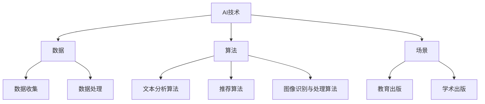
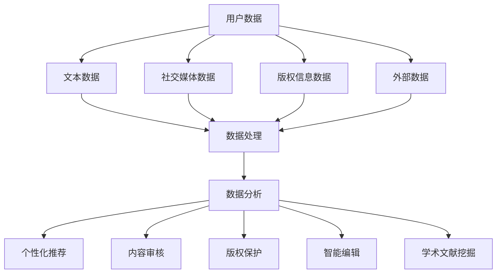
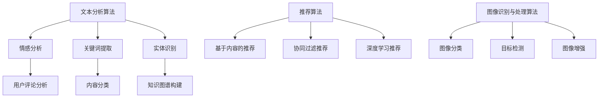

                 

### 文章标题：AI出版业：数据，算法和场景的协同作用

#### 关键词：
- **AI出版业**
- **数据收集与处理**
- **文本分析与处理算法**
- **推荐系统**
- **图像识别与处理**

#### 摘要：
随着人工智能技术的快速发展，AI出版业正逐渐成为出版行业的新趋势。本文从数据、算法和场景三个方面深入探讨AI出版业的协同作用。首先，我们回顾AI出版业的发展背景和核心概念；接着，详细解析数据收集与处理、文本分析与处理算法、推荐系统与图像识别与处理；然后，分析AI在教育出版和学术出版场景中的具体应用；最后，讨论AI出版业的挑战与未来趋势，并提供相关开发工具与资源。通过本文，读者可以全面了解AI出版业的现状与发展方向。

----------------------------------------------------------------

### 第一部分：AI出版业概述

#### 第1章：AI出版业引论

##### 1.1 AI出版业的发展背景

AI出版业的发展得益于人工智能技术的迅猛发展。随着深度学习、自然语言处理和计算机视觉等AI技术的不断进步，出版行业正在经历一场深刻的变革。传统出版行业面临着诸多挑战，如信息过载、内容同质化和读者需求多样化等。这些挑战促使出版行业寻求新的解决方案，而AI技术的应用正是其中之一。

首先，信息过载问题在互联网时代愈发突出。读者在面对海量信息时，往往感到无所适从，难以找到符合自己兴趣和需求的内容。AI出版业通过个性化推荐系统，根据用户的阅读历史、搜索记录和行为偏好，为用户推荐相关内容，从而缓解信息过载问题。

其次，内容同质化是传统出版行业的另一大挑战。在市场竞争激烈的环境下，出版商往往倾向于发布类似的内容，以吸引更多读者。这导致市场上充斥着大量雷同的作品，缺乏创新和差异化。AI出版业通过自动化内容生成技术，如自然语言生成（NLG）和生成对抗网络（GAN），为出版商提供创新的创作工具，从而丰富内容多样性。

最后，读者需求多样化也是传统出版行业面临的挑战之一。不同读者对内容的需求和偏好存在显著差异，传统出版行业难以满足这些多样化的需求。AI出版业通过个性化推荐系统和智能编辑技术，能够根据读者的兴趣和行为，为读者提供定制化的内容和阅读体验。

##### 1.2 AI技术在出版领域的应用

AI技术在出版领域的应用主要体现在以下几个方面：

1. **自动化内容生成**：自然语言生成（NLG）技术可以根据输入的模板和语料库，自动生成新闻报道、产品描述、书籍摘要等文本内容。生成对抗网络（GAN）可以生成逼真的图像和音频，为出版商提供丰富的视觉和听觉素材。

2. **推荐系统**：推荐系统可以根据用户的阅读历史、搜索记录和行为偏好，为用户推荐相关内容。协同过滤、基于内容的推荐和深度学习推荐是常用的推荐算法。通过推荐系统，出版商可以提高用户的阅读体验和忠诚度，同时增加销售额。

3. **智能编辑**：智能编辑技术包括自动摘要、内容审核和语义校对等。自动摘要可以从大量文本中提取关键信息，简化内容；内容审核可以识别和过滤不良内容；语义校对可以纠正文本中的错误和歧义。这些技术有助于提高出版质量，减少人力成本。

4. **版权保护**：AI技术可以用于版权保护和侵权检测。文本指纹技术和图像识别技术可以检测文本和图像的相似性，从而发现侵权行为。

##### 1.3 AI出版业的未来趋势

AI出版业的未来趋势将集中在以下几个方面：

1. **技术趋势**：随着AI技术的不断进步，深度学习、自然语言处理和计算机视觉等技术在出版领域的应用将更加广泛和深入。生成对抗网络（GAN）、强化学习、迁移学习等新技术的出现，将为出版业带来更多创新和可能性。

2. **商业模式**：AI出版业将推动新的商业模式的诞生。个性化内容、智能付费、订阅制等模式将成为主流。出版商可以通过AI技术更好地了解用户需求，提供个性化的内容和服务，从而提高用户满意度和忠诚度。

3. **跨界合作**：AI出版业将与其他行业，如教育、医疗、金融等，展开跨界合作。通过融合多领域的知识和技术，出版业可以创造更多价值，开拓更广阔的市场。

4. **开放共享**：开放共享将成为AI出版业的重要趋势。出版商可以通过开放数据平台和知识图谱，共享高质量的内容和数据，促进知识的传播和利用。

##### 1.4 核心概念联系图

为了更好地理解AI出版业的核心概念，我们可以通过一个联系图来展示各个概念之间的关系：

在这个联系图中，AI技术是核心，它通过数据收集和处理，利用文本分析算法、推荐算法和图像识别与处理算法，应用于教育出版和学术出版场景。

---

**小结**：
AI出版业的发展背景、AI技术在出版领域的应用和未来趋势为我们描绘了一幅AI在出版行业广泛应用的前景。在接下来的章节中，我们将进一步探讨AI出版业的核心概念，包括数据、算法和场景，并详细分析它们在出版领域的具体应用。

### 《AI出版业：数据，算法和场景的协同作用》目录大纲

#### 第一部分：AI出版业概述
- **第1章：AI出版业引论**
  - **1.1 AI出版业的发展背景**
  - **1.2 AI技术在出版领域的应用**
  - **1.3 AI出版业的未来趋势**
  - **1.4 核心概念联系图**

#### 第二部分：AI出版业的核心概念
- **第2章：数据在AI出版业中的作用**
  - **2.1 数据来源**
  - **2.2 数据处理**

- **第3章：算法在AI出版业的应用**
  - **3.1 文本分析算法**
  - **3.2 推荐算法**
  - **3.3 图像识别与处理算法**

#### 第三部分：AI出版业的场景分析
- **第4章：教育出版场景**
  - **4.1 智能教学系统**
  - **4.2 教育资源推荐**

- **第5章：学术出版场景**
  - **5.1 学术文献挖掘**
  - **5.2 学术文章推荐**

#### 第四部分：数据与算法
- **第6章：数据收集与处理**
  - **6.1 用户数据收集**
  - **6.2 文本数据收集**
  - **6.3 数据处理**

- **第7章：文本分析与处理算法**
  - **7.1 文本预处理**
  - **7.2 情感分析**
  - **7.3 关键词提取**
  - **7.4 实体识别**

- **第8章：推荐系统与算法**
  - **8.1 推荐系统概述**
  - **8.2 基于内容的推荐**
  - **8.3 协同过滤推荐**
  - **8.4 深度学习推荐**

- **第9章：图像识别与处理**
  - **9.1 图像识别基础**
  - **9.2 目标检测**
  - **9.3 图像增强**

#### 第五部分：AI在出版业的实际应用
- **第10章：AI在电子书出版中的应用**
  - **10.1 智能内容推荐**
  - **10.2 智能版权保护**
  - **10.3 智能编辑**

- **第11章：AI在学术出版中的应用**
  - **11.1 智能学术文献挖掘**
  - **11.2 智能论文审阅**
  - **11.3 智能期刊推荐**

#### 第六部分：AI出版业的挑战与未来
- **第12章：挑战**
  - **12.1 数据隐私与伦理**
  - **12.2 算法透明性与公平性**
  - **12.3 技术发展瓶颈**

- **第13章：未来趋势**
  - **13.1 跨界合作**
  - **13.2 自动化与智能化**
  - **13.3 开放共享**

#### 附录
- **附录A：AI出版业开发工具与资源**
  - **A.1 主流深度学习框架**
  - **A.2 自然语言处理库**
  - **A.3 图像识别库**
  - **A.4 开源数据集**

### 第二部分：AI出版业的核心概念

#### 第2章：数据在AI出版业中的作用

数据是AI出版业的核心资源，它不仅驱动了算法的优化，也为场景的应用提供了基础。本章节将深入探讨数据在AI出版业中的作用，包括数据来源、数据处理和数据在出版业中的具体应用。

##### 2.1 数据来源

在AI出版业中，数据的来源非常多样，主要包括以下几类：

1. **用户数据**：用户数据包括用户的阅读历史、搜索记录、评论、点击行为等。这些数据可以通过网站日志、应用程序接口（API）和第三方数据平台收集。

2. **文本数据**：文本数据来源于书籍、文章、新闻报道、用户评论等。这些文本数据可以通过爬虫技术、API接口调用和数据共享平台获取。

3. **社交媒体数据**：社交媒体数据包括用户的社交媒体活动，如点赞、评论、转发等。这些数据可以通过社交媒体API获取。

4. **版权信息数据**：版权信息数据包括作品的版权归属、授权信息等。这些数据可以通过版权数据库和版权交易平台获取。

5. **外部数据**：外部数据包括行业数据、市场数据、经济数据等。这些数据可以从公开数据源、行业报告和商业数据服务提供商获取。

##### 2.2 数据处理

数据处理是数据在AI出版业应用的重要环节，主要包括以下步骤：

1. **数据收集**：通过各种方式收集所需的用户数据、文本数据和外部数据。

2. **数据清洗**：对收集到的数据进行清洗，去除重复数据、缺失值、异常值等，确保数据的质量。

3. **数据存储**：将清洗后的数据存储在数据库中，以便后续的数据分析和挖掘。常用的数据库包括关系型数据库（如MySQL、PostgreSQL）和NoSQL数据库（如MongoDB、Cassandra）。

4. **数据预处理**：对存储的数据进行预处理，包括数据标准化、特征提取、数据融合等。预处理后的数据可以更好地满足算法的需求。

5. **数据分析**：使用统计分析、机器学习模型等工具对预处理后的数据进行分析，提取有价值的信息。

##### 2.3 数据在出版业中的具体应用

数据在出版业中的应用主要体现在以下几个方面：

1. **个性化推荐**：通过分析用户的阅读历史和行为偏好，个性化推荐系统可以为用户推荐符合其兴趣的内容。这种推荐系统可以大大提高用户的阅读体验和满意度。

2. **内容审核**：利用自然语言处理技术，可以对书籍、文章、评论等内容进行审核，识别和过滤不良信息，保护读者权益。

3. **版权保护**：通过文本指纹技术和图像识别技术，可以检测和防止侵权行为，保护版权方的利益。

4. **智能编辑**：利用自然语言生成（NLG）和自动摘要技术，可以自动生成书籍摘要、内容审核报告等，提高编辑效率。

5. **学术文献挖掘**：通过分析学术论文、作者关系、引用信息等，可以挖掘出有价值的研究成果和趋势。

#### 核心概念联系图

为了更好地理解数据在AI出版业中的作用，我们可以通过一个联系图来展示各个概念之间的关系：

在这个联系图中，数据来源是核心，通过数据处理和分析，实现个性化推荐、内容审核、版权保护、智能编辑和学术文献挖掘等功能。

---

**小结**：
本章详细探讨了数据在AI出版业中的作用，包括数据来源、数据处理和数据在出版业中的具体应用。在接下来的章节中，我们将深入探讨算法在AI出版业的应用，包括文本分析算法、推荐算法和图像识别与处理算法。

### 第二部分：AI出版业的核心概念

#### 第3章：算法在AI出版业的应用

算法是AI出版业的核心驱动力，它将数据转化为有价值的洞察和行动。本章节将详细讨论算法在AI出版业中的应用，包括文本分析算法、推荐算法和图像识别与处理算法，并解释它们的工作原理和具体应用。

##### 3.1 文本分析算法

文本分析算法是自然语言处理（NLP）的核心部分，它在AI出版业中发挥着重要作用。文本分析算法包括但不限于以下几种：

1. **情感分析**：情感分析算法用于识别文本中的情感倾向，如正面、负面或中性。这有助于出版商了解读者对书籍、文章或其他内容的情感反应。

   **算法原理**：
   $$\text{情感分析算法通常采用词袋模型或词嵌入模型，结合机器学习分类器（如朴素贝叶斯、支持向量机等）进行训练和预测。}$$

   **应用实例**：
   - **用户评论分析**：通过分析用户评论的情感倾向，出版商可以了解用户对书籍或文章的看法，从而进行内容优化。

2. **关键词提取**：关键词提取算法用于从文本中提取出对文本主题有重要影响的词汇。这有助于出版商进行内容分类和索引。

   **算法原理**：
   $$\text{关键词提取算法通常采用TF-IDF（词频-逆文档频率）模型，通过对文本进行特征提取，识别出对文本主题有重要贡献的词汇。}$$

   **应用实例**：
   - **内容分类**：通过提取关键词，出版商可以将书籍或文章分类到特定的主题或类别中，便于用户查找和推荐。

3. **实体识别**：实体识别算法用于从文本中识别出人、地点、组织、时间等实体。这有助于出版商进行内容索引和知识图谱构建。

   **算法原理**：
   $$\text{实体识别算法通常结合规则和机器学习方法，通过对文本进行解析，识别出实体并进行分类。}$$

   **应用实例**：
   - **知识图谱构建**：通过识别实体和它们之间的关系，出版商可以构建知识图谱，为读者提供更丰富的信息查询和推荐服务。

##### 3.2 推荐算法

推荐算法是AI出版业的重要组成部分，它用于预测用户对未知内容的兴趣，从而提高用户满意度和内容消费量。以下是一些常见的推荐算法：

1. **基于内容的推荐**：基于内容的推荐算法通过计算物品（如书籍、文章）之间的内容相似度，为用户推荐相关内容。

   **算法原理**：
   $$\text{基于内容的推荐算法通常采用词向量模型或TF-IDF模型，计算物品之间的相似度，并推荐相似度较高的内容。}$$

   **应用实例**：
   - **内容推荐**：出版商可以根据用户的阅读历史和兴趣，推荐相关的内容，提高用户的内容消费量。

2. **协同过滤推荐**：协同过滤推荐算法通过分析用户之间的相似度，为用户推荐其他用户喜欢的内容。

   **算法原理**：
   $$\text{协同过滤推荐算法包括用户基于物品的协同过滤和物品基于用户的协同过滤。用户基于物品的协同过滤通过计算用户之间的相似度，推荐其他用户喜欢的物品；物品基于用户的协同过滤通过计算物品之间的相似度，推荐给用户。}$$

   **应用实例**：
   - **书籍推荐**：出版商可以通过分析用户之间的相似度，为用户推荐其他用户喜欢的书籍。

3. **深度学习推荐**：深度学习推荐算法利用深度神经网络学习用户和物品的特征表示，进行个性化推荐。

   **算法原理**：
   $$\text{深度学习推荐算法通常采用序列模型（如循环神经网络RNN）或图神经网络（如图卷积网络GCN），通过学习用户和物品的特征，进行推荐。}$$

   **应用实例**：
   - **视频推荐**：视频平台可以通过深度学习推荐算法，根据用户的观看历史和偏好，推荐相关视频。

##### 3.3 图像识别与处理算法

图像识别与处理算法在AI出版业中也发挥着重要作用，主要用于版权保护、内容审核和个性化推荐等领域。

1. **图像分类**：图像分类算法用于将图像分类到预定义的类别中，如书籍封面分类、图片内容审核等。

   **算法原理**：
   $$\text{图像分类算法通常采用卷积神经网络（CNN），通过学习图像的特征，进行分类。}$$

   **应用实例**：
   - **版权保护**：通过图像分类算法，可以识别出侵权图像，保护版权方的权益。

2. **目标检测**：目标检测算法用于识别图像中的对象并标注其位置，如检测书籍封面中的作者头像。

   **算法原理**：
   $$\text{目标检测算法通常采用区域建议网络（R-CNN）或卷积神经网络（YOLO），通过学习图像的特征，识别并定位目标。}$$

   **应用实例**：
   - **内容审核**：通过目标检测算法，可以识别出图像中的不良内容，进行审核和过滤。

3. **图像增强**：图像增强算法用于改善图像的质量和清晰度，如提高书籍扫描图像的清晰度。

   **算法原理**：
   $$\text{图像增强算法通常采用图像增强技术（如卷积神经网络GAN），通过生成高质量的图像，提高图像的视觉效果。}$$

   **应用实例**：
   - **图像处理**：通过图像增强算法，可以改善书籍扫描图像的质量，提高用户体验。

#### 核心概念联系图

为了更好地理解算法在AI出版业中的应用，我们可以通过一个联系图来展示各个算法之间的关系：

在这个联系图中，文本分析算法、推荐算法和图像识别与处理算法共同作用于AI出版业，实现个性化推荐、内容审核、版权保护和图像处理等功能。

---

**小结**：
本章详细探讨了算法在AI出版业中的应用，包括文本分析算法、推荐算法和图像识别与处理算法。在接下来的章节中，我们将分析AI在具体出版场景中的应用，如教育出版和学术出版，并探讨AI出版业的挑战与未来趋势。

### 第三部分：AI出版业的场景分析

#### 第4章：教育出版场景

在教育出版场景中，人工智能（AI）的应用正逐步改变传统教学模式，提高教育质量和效率。本章节将详细探讨AI在教育出版中的应用，包括智能教学系统、教育资源推荐等。

##### 4.1 智能教学系统

智能教学系统是AI在教育出版中的重要应用，它通过个性化学习、学习分析等技术，为学生提供更加个性化的学习体验。

1. **个性化学习**：智能教学系统通过分析学生的学习历史、兴趣和行为偏好，为学生推荐适合的学习内容。这种个性化学习方式有助于提高学生的学习效率和兴趣。

   **算法原理**：
   $$\text{个性化学习算法通常采用协同过滤推荐和深度学习推荐。协同过滤推荐通过计算学生之间的相似度，推荐相似学生喜欢的学习内容；深度学习推荐通过学习学生的兴趣和行为，推荐个性化的学习内容。}$$

   **应用实例**：
   - **自适应学习平台**：通过智能教学系统，学生可以在不同的学习阶段获得针对性的学习建议，从而提高学习效果。

2. **学习分析**：智能教学系统通过收集和分析学生的学习数据，如学习时间、学习进度、考试成绩等，为教师提供教学反馈和学习诊断。

   **算法原理**：
   $$\text{学习分析算法通常采用统计分析、回归分析和机器学习模型。通过分析学生学习数据，可以识别学生的学习困难和知识点掌握情况，为教师提供针对性的教学建议。}$$

   **应用实例**：
   - **智能作业批改**：通过自然语言处理和计算机视觉技术，智能教学系统可以自动批改学生的作业，并提供即时反馈。

3. **智能辅导**：智能教学系统还可以提供智能辅导功能，根据学生的学习情况，自动生成练习题和辅导材料，帮助学生巩固知识点。

   **算法原理**：
   $$\text{智能辅导算法通常采用生成对抗网络（GAN）和强化学习。通过生成对抗网络，系统可以生成类似教学视频和辅导材料；通过强化学习，系统可以根据学生的学习反馈，不断优化辅导内容。}$$

   **应用实例**：
   - **智能辅导应用**：学生可以通过智能教学系统获取个性化的练习题和辅导材料，提高学习效果。

##### 4.2 教育资源推荐

教育资源推荐是AI在教育出版中的另一重要应用，它通过分析教师和学生的需求，推荐合适的教育资源和课程。

1. **课程推荐**：教育资源推荐系统可以根据教师的授课内容和学生的学习需求，推荐相关的课程和教材。

   **算法原理**：
   $$\text{课程推荐算法通常采用基于内容的推荐和协同过滤推荐。基于内容的推荐通过计算课程和教师之间的相似度，推荐相关课程；协同过滤推荐通过计算教师和学生的相似度，推荐其他教师或学生推荐的课程。}$$

   **应用实例**：
   - **课程选择建议**：教师可以通过教育资源推荐系统，获取与学生需求相匹配的课程建议，提高教学质量。

2. **教材推荐**：教育资源推荐系统还可以为教师推荐适合的教学辅助材料，如教学视频、PPT、习题集等。

   **算法原理**：
   $$\text{教材推荐算法通常采用基于用户行为的推荐和基于内容的推荐。基于用户行为的推荐通过分析教师的阅读历史和行为，推荐相关教材；基于内容的推荐通过计算教材和教师之间的相似度，推荐相关教材。}$$

   **应用实例**：
   - **教学辅助材料推荐**：教师可以通过教育资源推荐系统，获取适合的教学辅助材料，提高教学效果。

3. **专业发展建议**：教育资源推荐系统还可以为教师提供专业发展建议，如参加培训课程、阅读专业书籍等。

   **算法原理**：
   $$\text{专业发展建议算法通常采用基于用户行为的推荐和基于内容的推荐。基于用户行为的推荐通过分析教师的阅读历史和行为，推荐相关的专业发展建议；基于内容的推荐通过计算课程和教师之间的相似度，推荐相关的专业发展建议。}$$

   **应用实例**：
   - **专业发展路径规划**：教师可以通过教育资源推荐系统，规划自己的专业发展路径，不断提升教学能力。

---

**小结**：
本章详细探讨了AI在教育出版场景中的应用，包括智能教学系统和教育资源推荐。通过个性化学习、学习分析、智能辅导和课程、教材推荐等功能，AI为教育出版带来了前所未有的变革。在接下来的章节中，我们将分析AI在学术出版场景中的应用。

### 第三部分：AI出版业的场景分析

#### 第5章：学术出版场景

在学术出版场景中，人工智能（AI）的应用正在推动出版过程的自动化和智能化，提高学术文献的检索效率和推荐质量。本章节将详细探讨AI在学术出版中的应用，包括学术文献挖掘、学术文章推荐等。

##### 5.1 学术文献挖掘

学术文献挖掘是AI在学术出版中的重要应用，它通过分析大量的学术论文和文献，提取出有价值的信息和知识。

1. **关键词提取**：关键词提取是学术文献挖掘的基础，它从学术论文中提取出对论文主题有重要影响的词汇，便于后续的索引和检索。

   **算法原理**：
   $$\text{关键词提取算法通常采用TF-IDF（词频-逆文档频率）模型，通过对文本进行特征提取，识别出对文本主题有重要贡献的词汇。}$$

   **应用实例**：
   - **文献索引**：通过关键词提取，学术出版平台可以构建高效的文献索引系统，方便用户快速检索相关论文。

2. **引用分析**：引用分析是学术文献挖掘的重要环节，它通过分析论文之间的引用关系，挖掘出论文之间的关联性和影响力。

   **算法原理**：
   $$\text{引用分析算法通常采用图论和机器学习模型，通过构建论文之间的引用关系图，识别出重要论文和热点研究领域。}$$

   **应用实例**：
   - **学术影响力评估**：通过引用分析，学术出版平台可以为论文和作者提供学术影响力评估，帮助学术共同体识别高水平的研究成果。

3. **相似文献推荐**：相似文献推荐是基于学术文献挖掘的结果，为用户推荐与当前文献主题相似的论文。

   **算法原理**：
   $$\text{相似文献推荐算法通常采用协同过滤推荐和基于内容的推荐。协同过滤推荐通过计算用户之间的相似度，推荐其他用户喜欢的相似文献；基于内容的推荐通过计算文献之间的相似度，推荐相关文献。}$$

   **应用实例**：
   - **个性化推荐**：学术出版平台可以通过相似文献推荐，为用户推荐与其研究兴趣相关的论文，提高文献利用率。

##### 5.2 学术文章推荐

学术文章推荐是AI在学术出版中的另一重要应用，它通过分析用户的阅读历史、搜索记录和学术兴趣，为用户推荐合适的学术文章。

1. **基于用户行为的推荐**：基于用户行为的推荐算法通过分析用户的阅读历史、搜索记录和点击行为，为用户推荐相关文章。

   **算法原理**：
   $$\text{基于用户行为的推荐算法通常采用协同过滤推荐和基于内容的推荐。协同过滤推荐通过计算用户之间的相似度，推荐其他用户喜欢的相关文章；基于内容的推荐通过计算文章之间的相似度，推荐相关文章。}$$

   **应用实例**：
   - **个性化文章推荐**：学术出版平台可以通过基于用户行为的推荐，为用户推荐其可能感兴趣的文章，提高用户的阅读体验。

2. **基于内容的推荐**：基于内容的推荐算法通过分析文章的内容和结构，为用户推荐相关文章。

   **算法原理**：
   $$\text{基于内容的推荐算法通常采用词向量模型和文本相似度计算。通过将文章转化为词向量，计算文章之间的相似度，推荐相关文章。}$$

   **应用实例**：
   - **主题相关文章推荐**：学术出版平台可以通过基于内容的推荐，为用户推荐与其阅读文章主题相关的其他文章，拓宽用户的知识视野。

3. **作者推荐**：作者推荐是基于学术文章推荐的延伸，通过分析用户对作者的文章偏好，为用户推荐其他同领域的高水平作者。

   **算法原理**：
   $$\text{作者推荐算法通常采用协同过滤推荐和基于内容的推荐。协同过滤推荐通过计算用户对作者文章的偏好，推荐其他用户喜欢的作者；基于内容的推荐通过分析作者之间的合作和引用关系，推荐相关作者。}$$

   **应用实例**：
   - **学术导师推荐**：学术出版平台可以通过作者推荐，为研究生推荐与其研究方向相近的学术导师，促进学术交流和合作。

---

**小结**：
本章详细探讨了AI在学术出版场景中的应用，包括学术文献挖掘和学术文章推荐。通过关键词提取、引用分析、相似文献推荐、基于用户行为的推荐和基于内容的推荐等技术，AI为学术出版带来了自动化和智能化的变革。在接下来的章节中，我们将分析AI出版业的挑战与未来趋势。

### 第四部分：数据与算法

#### 第6章：数据收集与处理

在AI出版业中，数据收集与处理是至关重要的环节，它决定了后续算法的性能和应用效果。本章节将详细介绍数据收集与处理的过程，包括用户数据收集、文本数据收集和数据处理方法。

##### 6.1 数据收集

数据收集是数据驱动型AI出版业的第一步，它决定了后续数据分析和挖掘的基础。数据收集的方式和途径多种多样，主要包括以下几种：

1. **用户数据收集**：用户数据是AI出版业的核心资源，它包括用户的阅读历史、搜索记录、评论、点击行为等。用户数据的收集可以通过以下几种方式：

   - **网站日志**：通过分析网站服务器日志，可以收集用户的浏览行为、访问时间、页面停留时间等数据。
   - **API接口**：利用第三方数据平台或社交媒体API，可以获取用户的公开数据和活动数据。
   - **应用程序接口（SDK）**：通过集成SDK（Software Development Kit）到出版应用程序中，可以实时收集用户的使用行为数据。

   **应用实例**：
   - **用户行为分析**：通过收集用户的阅读历史和搜索记录，可以分析用户的兴趣和行为模式，为个性化推荐提供依据。

2. **文本数据收集**：文本数据是AI出版业的重要组成部分，它包括书籍、文章、评论、新闻报道等。文本数据的收集可以通过以下几种方式：

   - **网络爬虫**：利用网络爬虫技术，可以自动抓取互联网上的公开文本数据。
   - **数据共享平台**：通过数据共享平台或数据库，可以获取高质量的文本数据集。
   - **人工标注**：对于特定的研究任务，可以通过人工标注的方式收集高质量的文本数据。

   **应用实例**：
   - **内容推荐**：通过收集书籍和文章的文本数据，可以为用户推荐符合其兴趣的内容。

3. **社交媒体数据收集**：社交媒体数据包括用户的社交媒体活动，如点赞、评论、转发等。社交媒体数据的收集可以通过以下几种方式：

   - **社交媒体API**：利用社交媒体平台提供的API接口，可以获取用户的社交媒体活动数据。
   - **社交媒体爬虫**：通过爬取社交媒体网站，可以获取用户的社交媒体数据。

   **应用实例**：
   - **用户互动分析**：通过收集用户的社交媒体数据，可以分析用户的互动行为，提高用户参与度。

##### 6.2 数据处理

数据处理是数据收集之后的下一步，它旨在将原始数据进行清洗、转换和预处理，使其满足算法分析和挖掘的需求。数据处理的过程包括以下步骤：

1. **数据清洗**：数据清洗是数据处理的重要环节，它旨在去除数据中的噪声和异常值，提高数据的质量。数据清洗的方法包括：

   - **缺失值处理**：对于缺失的数据，可以通过填补、删除或插值等方法进行处理。
   - **异常值处理**：对于异常值，可以通过删除、修正或聚类等方法进行处理。
   - **数据标准化**：通过对数据进行归一化或标准化，使数据符合特定的范围或格式。

   **应用实例**：
   - **用户行为分析**：通过数据清洗，可以去除用户行为数据中的噪声，提高分析的准确性。

2. **数据转换**：数据转换是将原始数据转换为适合分析和挖掘的格式。数据转换的方法包括：

   - **数据类型转换**：将不同类型的数据转换为统一的数据类型，如将文本转换为数字或矩阵。
   - **数据编码**：将数据编码为特定的格式，如将文本编码为词袋模型或词嵌入向量。

   **应用实例**：
   - **文本分析**：通过数据转换，可以将文本数据编码为词向量，为文本分析算法提供输入。

3. **数据预处理**：数据预处理是数据清洗和转换的延伸，它旨在将数据调整为适合算法分析和挖掘的状态。数据预处理的方法包括：

   - **特征提取**：从原始数据中提取出对分析任务有重要影响的特征。
   - **数据降维**：通过降维技术，减少数据的维度，提高算法的效率和准确性。
   - **数据增强**：通过数据增强技术，增加数据的多样性和丰富性。

   **应用实例**：
   - **图像识别**：通过数据增强，可以提高图像识别模型的泛化能力和准确性。

##### 6.3 数据分析

数据分析是数据收集与处理的最后一步，它旨在从处理后的数据中提取出有价值的信息和洞察。数据分析的方法包括：

1. **统计分析**：通过统计分析，可以了解数据的分布、相关性、趋势等，为决策提供依据。

   **应用实例**：
   - **用户行为分析**：通过统计分析用户行为数据，可以了解用户的兴趣和行为模式。

2. **机器学习模型评估**：通过机器学习模型评估，可以评估模型的性能和准确性，为模型优化提供依据。

   **应用实例**：
   - **推荐系统**：通过模型评估，可以评估推荐系统的准确率、覆盖率等指标。

3. **可视化分析**：通过可视化分析，可以直观地展示数据的分布、趋势等，为数据理解和决策提供帮助。

   **应用实例**：
   - **内容推荐**：通过可视化分析，可以直观地展示推荐结果，为用户推荐提供参考。

---

**小结**：
本章详细介绍了数据收集与处理的过程，包括用户数据收集、文本数据收集和数据处理方法。通过数据清洗、转换、预处理和数据分析，AI出版业可以提取出有价值的信息和洞察，为个性化推荐、内容审核、版权保护等应用提供支持。在接下来的章节中，我们将进一步探讨文本分析与处理算法的具体应用。

### 第四部分：数据与算法

#### 第7章：文本分析与处理算法

文本分析与处理算法是自然语言处理（NLP）的重要组成部分，它们在AI出版业中发挥着关键作用。本章节将详细讨论文本分析与处理算法，包括文本预处理、情感分析、关键词提取和实体识别。

##### 7.1 文本预处理

文本预处理是文本分析与处理的第一步，它涉及去除无关信息、统一文本格式和准备文本数据以供算法使用。以下是文本预处理的几个关键步骤：

1. **文本清洗**：文本清洗的目的是去除文本中的噪声，如HTML标签、特殊字符和停用词。停用词是指对文本主题没有贡献的常见词，如“的”、“和”、“是”等。

   **算法原理**：
   $$\text{文本清洗通常采用正则表达式或词表匹配的方法，将噪声字符和停用词去除。}$$

   **应用实例**：
   - **去除HTML标签**：使用正则表达式去除HTML标签，如`<a href="#">Link</a>`。
   - **去除特殊字符**：使用正则表达式或字符替换方法去除特殊字符，如`"!" -> ""`。

2. **分词**：分词是将文本分割成有意义的单元（词或短语）的过程。中文文本由于没有明显的空格分隔，通常需要使用分词算法。

   **算法原理**：
   $$\text{分词算法包括基于规则的分词、基于统计的分词和基于深度学习的分词。基于规则的分词使用词典和规则进行分词；基于统计的分词使用概率模型进行分词；基于深度学习的分词使用神经网络模型进行分词。}$$

   **应用实例**：
   - **基于词典的分词**：使用预定义的词典，将文本划分为有意义的词语。
   - **基于深度学习的分词**：使用BERT、GPT等预训练模型进行分词，提高分词的准确性。

3. **词性还原**：词性还原是将分词结果中的词还原为它们的正确形式，如将“跑”还原为“跑步”、“看”还原为“看见”。

   **算法原理**：
   $$\text{词性还原通常采用基于规则的方法或统计模型，如条件随机场（CRF）进行词性标注。}$$

   **应用实例**：
   - **词性标注**：通过词性还原，将“看”标注为“动词”，“跑步”标注为“名词”。

##### 7.2 情感分析

情感分析是文本分析与处理算法中的一种，它用于识别文本中的情感倾向，如正面、负面或中性。

1. **情感分类**：情感分类是将文本分类为特定情感类别的过程。

   **算法原理**：
   $$\text{情感分类算法通常采用机器学习模型，如朴素贝叶斯、支持向量机（SVM）、随机森林（RF）等。}$$

   **应用实例**：
   - **评论分析**：通过情感分类，可以识别用户对书籍或产品的评论是正面、负面还是中性。

2. **情感极性分析**：情感极性分析是情感分析的一种变体，它用于量化文本中的情感倾向。

   **算法原理**：
   $$\text{情感极性分析通常采用基于规则的模型或机器学习模型，如线性回归、逻辑回归等。}$$

   **应用实例**：
   - **情感极性标注**：通过情感极性分析，可以标注文本中的情感极性，如“非常喜欢”或“不太满意”。

##### 7.3 关键词提取

关键词提取是从文本中提取出对文本主题有重要贡献的词汇，以便于后续的文本分析和索引。

1. **TF-IDF**：TF-IDF是一种常用的关键词提取方法，它基于词频（TF）和逆文档频率（IDF）进行关键词权重计算。

   **算法原理**：
   $$\text{TF-IDF的计算公式为：TF(t,d) \times IDF(t,D)，其中TF(t,d)是词t在文档d中的词频，IDF(t,D)是词t在整个文档集合D中的逆文档频率。}$$

   **应用实例**：
   - **文本分类**：通过TF-IDF，可以将关键词用于文本分类任务，提高分类的准确性。

2. **LDA（ latent Dirichlet Allocation）**：LDA是一种主题模型，它用于发现文本中的潜在主题。

   **算法原理**：
   $$\text{LDA模型通过概率模型将文本映射到潜在主题空间，每个文档由多个主题组成，每个主题由多个关键词组成。}$$

   **应用实例**：
   - **内容推荐**：通过LDA，可以提取文本中的潜在主题，为内容推荐提供依据。

##### 7.4 实体识别

实体识别是文本分析与处理中的重要任务，它用于识别文本中的人、地点、组织、时间等实体。

1. **命名实体识别**：命名实体识别是从文本中识别出具有特定意义的实体，如人名、地名、机构名等。

   **算法原理**：
   $$\text{命名实体识别通常采用基于规则的方法、机器学习模型或深度学习模型。基于规则的方法使用预定义的规则进行实体识别；机器学习模型使用监督学习方法进行实体识别；深度学习模型使用神经网络模型进行实体识别。}$$

   **应用实例**：
   - **信息抽取**：通过命名实体识别，可以从文本中提取出关键信息，如作者、地点、日期等。

2. **关系抽取**：关系抽取是识别实体之间的关系的任务，如“张三住在上海”。

   **算法原理**：
   $$\text{关系抽取通常采用基于规则的方法、机器学习模型或深度学习模型。基于规则的方法使用预定义的规则进行关系抽取；机器学习模型使用监督学习方法进行关系抽取；深度学习模型使用神经网络模型进行关系抽取。}$$

   **应用实例**：
   - **知识图谱构建**：通过关系抽取，可以将实体和它们之间的关系构建成知识图谱，为后续的问答、搜索等任务提供支持。

---

**小结**：
本章详细介绍了文本分析与处理算法，包括文本预处理、情感分析、关键词提取和实体识别。通过这些算法，AI出版业可以更好地理解和分析文本内容，为个性化推荐、内容审核、版权保护等应用提供支持。在接下来的章节中，我们将讨论推荐系统与算法。

### 第四部分：数据与算法

#### 第8章：推荐系统与算法

推荐系统是AI出版业中至关重要的一部分，它通过分析用户的行为和偏好，为用户推荐相关的内容。本章节将详细探讨推荐系统的基本结构、评价标准以及常见的推荐算法，包括基于内容的推荐、协同过滤推荐和深度学习推荐。

##### 8.1 推荐系统概述

推荐系统是一种信息过滤技术，旨在向用户推荐他们可能感兴趣的内容。推荐系统通常由以下几个基本组成部分：

1. **用户**：用户是推荐系统的核心，他们的行为和偏好数据用于生成推荐。
2. **物品**：物品是用户可能感兴趣的内容，如书籍、文章、电影、音乐等。
3. **评分/点击数据**：评分/点击数据是用户对物品的反馈，用于训练推荐模型。

##### 8.2 推荐系统的评价标准

推荐系统的评价标准是衡量推荐系统性能的重要指标。以下是一些常见的评价标准：

1. **准确率**：准确率是推荐系统中正确推荐物品的比例，它是衡量推荐系统精确度的重要指标。
2. **覆盖率**：覆盖率是推荐系统中推荐物品的数量与所有可能物品数量的比例，它衡量了推荐系统的广度。
3. **新颖性**：新颖性是指推荐系统中推荐物品的差异性，它反映了推荐系统的创造力。
4. **多样性**：多样性是指推荐系统中推荐物品的多样性，它避免了用户接收到重复的内容。

##### 8.3 基于内容的推荐

基于内容的推荐是一种通过分析物品和用户之间的内容相似性来生成推荐的方法。以下是其工作原理和应用实例：

1. **工作原理**：
   - **内容表示**：将物品和用户表示为向量，可以使用TF-IDF、词嵌入等技术。
   - **相似度计算**：计算物品和用户之间的相似度，常用的相似度度量方法有余弦相似度和欧几里得距离。
   - **推荐生成**：根据相似度度量，为用户推荐相似度最高的物品。

   **算法原理**：
   $$\text{基于内容的推荐算法可以表示为：}$$
   $$\text{相似度（Item\_i, User） = Similarity(Item\_i, Query)}$$
   $$\text{推荐列表 = Top N（相似度最高的物品）}$$

   **应用实例**：
   - **图书推荐**：通过分析书籍的标题、简介、标签等特征，为用户推荐相似主题的书籍。

##### 8.4 协同过滤推荐

协同过滤推荐是一种通过分析用户行为数据来生成推荐的方法，它分为用户基于物品的协同过滤和物品基于用户的协同过滤。

1. **用户基于物品的协同过滤**：
   - **工作原理**：通过计算用户之间的相似度，推荐其他用户喜欢的物品。
   - **算法原理**：
     $$\text{相似度（User\_i, User\_j） = Cosine Similarity(Sim\_Rating\_Vector\_i, Sim\_Rating\_Vector\_j)}$$
     $$\text{推荐列表 = User\_j喜欢的且User\_i未喜欢的物品}$$

   **应用实例**：
   - **音乐推荐**：通过分析用户听歌的行为，推荐其他用户喜欢的歌曲。

2. **物品基于用户的协同过滤**：
   - **工作原理**：通过计算物品之间的相似度，推荐给用户相似物品。
   - **算法原理**：
     $$\text{相似度（Item\_i, Item\_j） = Cosine Similarity(Item\_i, Item\_j)}$$
     $$\text{推荐列表 = 用户喜欢的且相似物品}$$

   **应用实例**：
   - **电影推荐**：通过分析用户观看的电影，推荐其他相似类型的电影。

##### 8.5 深度学习推荐

深度学习推荐是一种利用深度神经网络进行推荐的方法，它可以捕捉用户和物品的复杂特征。

1. **工作原理**：
   - **用户表示**：将用户的历史行为和偏好表示为向量。
   - **物品表示**：将物品的特征表示为向量。
   - **模型训练**：使用深度学习模型，如神经网络，学习用户和物品的特征表示。
   - **推荐生成**：通过模型预测用户对物品的评分，生成推荐列表。

   **算法原理**：
   $$\text{用户表示} \, \text{和} \, \text{物品表示：}$$
   $$\text{User\_i} = \text{Neural Network(User\_history, User\_preferences)}$$
   $$\text{Item\_j} = \text{Neural Network(Item\_features)}$$
   $$\text{推荐列表 = Top N（预测评分最高的物品）}$$

   **应用实例**：
   - **电子商务推荐**：通过分析用户的购物行为和物品的特征，为用户推荐相关的商品。

---

**小结**：
本章详细介绍了推荐系统的基本结构、评价标准和常见推荐算法。通过基于内容的推荐、协同过滤推荐和深度学习推荐，AI出版业可以为用户生成个性化的推荐列表，提高用户体验。在接下来的章节中，我们将探讨图像识别与处理算法。

### 第四部分：数据与算法

#### 第9章：图像识别与处理

图像识别与处理是人工智能领域中的一项重要技术，在AI出版业中同样有着广泛的应用。本章节将详细探讨图像识别与处理的基础知识、应用领域以及相关算法。

##### 9.1 图像识别基础

图像识别是指通过计算机算法从图像中识别出特定的对象或场景。图像识别技术的基础包括图像分类、目标检测和图像分割等。

1. **图像分类**：图像分类是将图像分类到预定义的类别中。常见的图像分类算法包括卷积神经网络（CNN）和迁移学习。

   **算法原理**：
   $$\text{卷积神经网络（CNN）通过卷积层、池化层和全连接层进行特征提取和分类。}$$
   $$\text{迁移学习利用预训练的模型，在目标数据集上进行微调，提高分类准确率。}$$

   **应用实例**：
   - **书籍封面分类**：通过图像分类算法，可以将书籍封面分类到不同的类别中，便于书籍管理和推荐。

2. **目标检测**：目标检测是在图像中识别出特定对象的位置和类别。常见的目标检测算法包括SSD、YOLO和Faster R-CNN。

   **算法原理**：
   $$\text{SSD（Single Shot MultiBox Detector）通过多尺度卷积神经网络同时进行特征提取和目标检测。}$$
   $$\text{YOLO（You Only Look Once）将图像分割成网格，在每个网格内预测目标的类别和位置。}$$
   $$\text{Faster R-CNN通过区域提议网络（RPN）生成候选区域，再进行分类和定位。}$$

   **应用实例**：
   - **图像审核**：通过目标检测算法，可以识别图像中的不良内容，如暴力、色情等，进行图像审核和过滤。

3. **图像分割**：图像分割是将图像分割成多个区域，以便于进一步分析和处理。常见的图像分割算法包括FCN和U-Net。

   **算法原理**：
   $$\text{FCN（Fully Convolutional Network）将卷积神经网络应用于全图像，输出每个像素的类别。}$$
   $$\text{U-Net是一种基于卷积神经网络的结构，特别适合于医学图像分割。}$$

   **应用实例**：
   - **图像标注**：通过图像分割算法，可以为图像中的对象进行精确标注，提高图像处理和分析的准确性。

##### 9.2 目标检测算法

目标检测是图像识别与处理中的重要任务，它旨在识别图像中的特定对象并标注其位置。以下是一些常见的目标检测算法：

1. **SSD（Single Shot MultiBox Detector）**
   - **算法原理**：
     $$\text{SSD是一种单阶段目标检测算法，通过多个尺度的特征图同时进行特征提取和目标检测。}$$
   - **应用实例**：
     - **自动标注**：在图像处理领域，SSD可以用于自动标注图像中的对象，提高图像标注的效率。

2. **YOLO（You Only Look Once）**
   - **算法原理**：
     $$\text{YOLO是一种单阶段目标检测算法，将图像分割成网格，在每个网格内预测目标的类别和位置。}$$
   - **应用实例**：
     - **图像审核**：在图像审核系统中，YOLO可以用于识别图像中的违规内容，进行实时审核。

3. **Faster R-CNN**
   - **算法原理**：
     $$\text{Faster R-CNN通过区域提议网络（RPN）生成候选区域，再进行分类和定位。}$$
   - **应用实例**：
     - **安防监控**：在安防监控系统中，Faster R-CNN可以用于识别监控视频中的异常行为，提高监控系统的预警能力。

##### 9.3 图像增强

图像增强是指通过处理和改进图像的质量，提高图像的可读性和视觉效果。常见的图像增强算法包括去噪、对比度增强和图像重建。

1. **去噪**：去噪算法旨在减少图像中的噪声，提高图像的质量。
   - **算法原理**：
     $$\text{去噪算法包括滤波方法（如中值滤波、高斯滤波）和深度学习方法（如自编码器、生成对抗网络）。}$$
   - **应用实例**：
     - **图像修复**：在图像修复领域，去噪算法可以用于去除图像中的污点、划痕等。

2. **对比度增强**：对比度增强算法旨在提高图像的对比度，使其更清晰。
   - **算法原理**：
     $$\text{对比度增强算法包括直方图均衡、对比度拉伸等方法。}$$
   - **应用实例**：
     - **图像质量检测**：在图像质量检测中，对比度增强算法可以用于提高图像的对比度，方便检测和分析。

3. **图像重建**：图像重建是指通过重建图像中的缺失部分，提高图像的完整性。
   - **算法原理**：
     $$\text{图像重建算法包括插值方法（如双线性插值、双三次插值）和深度学习方法（如生成对抗网络）。}$$
   - **应用实例**：
     - **图像修复**：在图像修复领域，图像重建算法可以用于填补图像中的缺失部分，提高图像的完整性。

---

**小结**：
本章详细介绍了图像识别与处理的基础知识、目标检测算法和图像增强算法。在AI出版业中，图像识别与处理技术可以应用于图像分类、图像审核、图像标注和图像修复等领域，提高图像处理和分析的效率和质量。在接下来的章节中，我们将探讨AI在电子书出版中的应用。

### 第四部分：数据与算法

#### 第10章：AI在电子书出版中的应用

随着人工智能技术的不断进步，电子书出版行业也在经历深刻的变革。AI技术在电子书出版中的应用，不仅提高了内容生产的效率，还极大地丰富了用户的阅读体验。本章节将详细探讨AI在电子书出版中的应用，包括智能内容推荐、智能版权保护和智能编辑。

##### 10.1 智能内容推荐

智能内容推荐是电子书出版中的一项核心应用，它通过分析用户的阅读历史、兴趣和行为偏好，为用户推荐符合其兴趣的电子书。智能内容推荐系统的设计包括以下几个关键步骤：

1. **用户数据收集**：收集用户的阅读历史、搜索记录、评论和点击行为等数据。这些数据可以通过电子书平台、社交媒体和第三方数据服务获取。

2. **用户兴趣建模**：通过对用户数据的分析，建立用户兴趣模型。这通常涉及到用户行为的统计分析和机器学习模型训练，如协同过滤推荐、基于内容的推荐和深度学习推荐等。

3. **推荐算法实现**：实现推荐算法，根据用户兴趣模型和电子书内容特征，生成个性化推荐列表。常用的推荐算法包括协同过滤推荐、基于内容的推荐和深度学习推荐。

   **算法原理**：
   $$\text{协同过滤推荐通过计算用户之间的相似度，推荐其他用户喜欢的电子书。}$$
   $$\text{基于内容的推荐通过计算电子书之间的相似度，推荐与用户当前阅读电子书相关的电子书。}$$
   $$\text{深度学习推荐通过学习用户和电子书的高维特征表示，进行个性化推荐。}$$

4. **推荐结果评估与优化**：评估推荐结果的质量，如准确率、新颖性和用户满意度。通过迭代优化推荐算法，提高推荐系统的性能。

**应用实例**：
- **个性化电子书推荐**：通过智能内容推荐，电子书平台可以为用户提供个性化的阅读推荐，提高用户的阅读体验和忠诚度。

##### 10.2 智能版权保护

智能版权保护是电子书出版中的一项重要任务，它通过技术手段保护电子书的版权，防止未经授权的复制和分发。智能版权保护系统的设计包括以下几个关键步骤：

1. **文本指纹技术**：通过文本指纹技术，为每本电子书生成唯一的指纹标识。文本指纹技术基于加密算法和哈希函数，确保电子书指纹的唯一性和稳定性。

2. **侵权检测**：利用文本指纹技术，对比用户上传的电子书与版权方的电子书，检测是否存在侵权行为。侵权检测可以通过文本指纹匹配算法实现。

3. **版权监控**：建立版权监控机制，实时监控电子书在互联网上的传播情况。通过监控，可以及时发现侵权行为并采取措施。

   **算法原理**：
   $$\text{文本指纹匹配算法通过计算两个文本指纹之间的相似度，判断是否存在侵权行为。}$$
   $$\text{相似度计算公式：Similarity(Fingerprint\_A, Fingerprint\_B) = Hash(Fingerprint\_A) \circ Hash(Fingerprint\_B)}$$

4. **用户行为分析**：分析用户的阅读行为和分享行为，识别潜在的风险用户。通过用户行为分析，可以预防潜在的侵权行为。

**应用实例**：
- **电子书版权保护**：通过智能版权保护系统，电子书平台可以有效地保护电子书的版权，减少侵权行为，提高版权方的收益。

##### 10.3 智能编辑

智能编辑是AI在电子书出版中的另一项重要应用，它通过自动化工具提高编辑效率，保证出版质量。智能编辑系统的设计包括以下几个关键步骤：

1. **自动摘要**：通过自然语言生成（NLG）技术，自动生成电子书的内容摘要。自动摘要可以帮助读者快速了解书籍的核心内容，提高阅读效率。

2. **内容审核**：利用自然语言处理（NLP）技术，对电子书的内容进行审核，识别和过滤不良信息。内容审核可以保证电子书的内容符合法律法规和道德标准。

3. **语义校对**：通过语义校对技术，自动纠正电子书中的语言错误和表达不清的问题。语义校对可以提高电子书的语言质量，增强阅读体验。

4. **内容优化**：根据用户的阅读反馈，对电子书的内容进行优化。通过内容优化，可以提升电子书的吸引力，增加用户满意度。

   **算法原理**：
   $$\text{自然语言生成（NLG）技术通过模板匹配和语言模型生成摘要。}$$
   $$\text{内容审核算法通过关键词过滤、情感分析和语法分析识别不良信息。}$$
   $$\text{语义校对算法通过上下文分析和语言模型纠正语言错误。}$$

**应用实例**：
- **电子书质量控制**：通过智能编辑系统，出版商可以自动化地处理编辑工作，提高出版效率，保证电子书的质量。

---

**小结**：
本章详细探讨了AI在电子书出版中的应用，包括智能内容推荐、智能版权保护和智能编辑。通过这些应用，AI不仅提高了电子书出版效率，还大大提升了用户体验。在接下来的章节中，我们将分析AI在学术出版中的应用。

### 第四部分：数据与算法

#### 第11章：AI在学术出版中的应用

在学术出版领域，人工智能（AI）技术的应用正在逐步改变传统的出版模式，提高学术文献的检索效率、推荐质量和审核效果。本章节将详细探讨AI在学术出版中的应用，包括智能学术文献挖掘、智能论文审阅和智能期刊推荐。

##### 11.1 智能学术文献挖掘

智能学术文献挖掘是AI在学术出版中的一项重要应用，它通过分析大量的学术论文和文献，提取出有价值的信息和知识，帮助研究人员快速发现相关的研究成果和趋势。

1. **关键词提取**：关键词提取是学术文献挖掘的基础，它从学术论文中提取出对论文主题有重要影响的词汇，便于后续的索引和检索。

   **算法原理**：
   $$\text{关键词提取算法通常采用TF-IDF（词频-逆文档频率）模型，通过对文本进行特征提取，识别出对文本主题有重要贡献的词汇。}$$

   **应用实例**：
   - **文献索引**：通过关键词提取，学术出版平台可以构建高效的文献索引系统，方便用户快速检索相关论文。

2. **引用分析**：引用分析是学术文献挖掘的重要环节，它通过分析论文之间的引用关系，挖掘出论文之间的关联性和影响力。

   **算法原理**：
   $$\text{引用分析算法通常采用图论和机器学习模型，通过构建论文之间的引用关系图，识别出重要论文和热点研究领域。}$$

   **应用实例**：
   - **学术影响力评估**：通过引用分析，学术出版平台可以为论文和作者提供学术影响力评估，帮助学术共同体识别高水平的研究成果。

3. **相似文献推荐**：相似文献推荐是基于学术文献挖掘的结果，为用户推荐与当前文献主题相似的论文。

   **算法原理**：
   $$\text{相似文献推荐算法通常采用协同过滤推荐和基于内容的推荐。协同过滤推荐通过计算用户之间的相似度，推荐其他用户喜欢的相似文献；基于内容的推荐通过计算文献之间的相似度，推荐相关文献。}$$

   **应用实例**：
   - **个性化推荐**：学术出版平台可以通过相似文献推荐，为用户推荐与其研究兴趣相关的论文，提高文献利用率。

##### 11.2 智能论文审阅

智能论文审阅是AI在学术出版中的另一项重要应用，它通过自动化工具提高审稿效率，保证论文质量。智能论文审阅系统的设计包括以下几个关键步骤：

1. **文本预处理**：对提交的论文进行文本预处理，包括去除格式、标记和噪声等，确保文本数据的一致性和可用性。

2. **语义分析**：利用自然语言处理（NLP）技术，对论文的文本进行语义分析，提取出论文的主要观点、方法、结果和结论。

3. **审稿建议生成**：基于语义分析的结果，生成审稿建议，包括论文的结构完整性、逻辑性、创新性和准确性等。

4. **审稿意见反馈**：将审稿建议反馈给作者，并提供修改指南，帮助作者提高论文质量。

   **算法原理**：
   $$\text{自然语言处理（NLP）技术通过文本分类、关系抽取和情感分析等算法，对论文内容进行语义分析。}$$
   $$\text{审稿建议生成算法通过分析论文结构、逻辑性和创新性，生成审稿意见。}$$

   **应用实例**：
   - **自动审稿**：通过智能论文审阅系统，编辑可以快速获得审稿建议，提高审稿效率。

##### 11.3 智能期刊推荐

智能期刊推荐是AI在学术出版中的应用，它通过分析学术文献的引用关系和影响力，为研究人员推荐合适的期刊。

1. **期刊评分**：通过引用分析和学术影响力评估，为期刊评分，衡量期刊的质量和影响力。

2. **推荐算法**：采用推荐算法，根据研究人员的学术兴趣和已发表的论文，推荐符合其研究方向的高质量期刊。

3. **推荐结果展示**：将推荐结果以可视化的形式展示给研究人员，便于其选择合适的期刊。

   **算法原理**：
   $$\text{推荐算法通常采用协同过滤推荐和基于内容的推荐。协同过滤推荐通过计算研究人员之间的相似度，推荐其他研究人员推荐的期刊；基于内容的推荐通过计算期刊之间的相似度，推荐相关期刊。}$$

   **应用实例**：
   - **期刊选择建议**：通过智能期刊推荐系统，研究人员可以根据推荐结果，选择适合自己研究方向的高质量期刊。

---

**小结**：
本章详细探讨了AI在学术出版中的应用，包括智能学术文献挖掘、智能论文审阅和智能期刊推荐。通过这些应用，AI提高了学术文献的检索效率和推荐质量，为研究人员提供了更好的学术服务。在接下来的章节中，我们将讨论AI出版业的挑战与未来趋势。

### 第五部分：AI出版业的挑战与未来

#### 第12章：挑战

尽管AI在出版业的应用带来了巨大的变革和机遇，但它也面临着一系列挑战。这些挑战主要集中在数据隐私与伦理、算法透明性与公平性以及技术发展瓶颈等方面。

##### 12.1 数据隐私与伦理

数据隐私与伦理是AI出版业面临的首要挑战。在AI出版过程中，用户数据被大量收集、处理和分析，这涉及到用户的隐私权和个人信息的保护。以下是一些具体的问题和解决方案：

1. **用户数据收集**：
   - **问题**：在收集用户数据时，如何确保用户的隐私权不受侵犯？
   - **解决方案**：引入隐私保护机制，如数据匿名化、数据最小化和数据加密等。此外，制定严格的隐私政策，确保用户了解其数据的使用方式和范围。

2. **数据处理**：
   - **问题**：在数据处理过程中，如何防止数据泄露和滥用？
   - **解决方案**：采用安全的数据处理流程，包括数据访问控制、数据加密和隐私保护算法。此外，定期进行安全审计和风险评估，确保数据处理的安全性和合规性。

3. **数据共享**：
   - **问题**：在数据共享过程中，如何保护用户隐私和数据安全？
   - **解决方案**：建立数据共享协议和标准，明确数据共享的目的、范围和方式。同时，采用区块链等技术，确保数据共享的安全和透明。

##### 12.2 算法透明性与公平性

算法透明性与公平性是AI出版业面临的另一个重大挑战。随着AI在出版业中的应用越来越广泛，算法的透明性和公平性变得越来越重要。以下是一些具体的问题和解决方案：

1. **算法透明性**：
   - **问题**：如何确保算法的决策过程透明，用户可以理解其推荐结果的原因？
   - **解决方案**：引入可解释性AI技术，如LIME（局部可解释模型解释）和SHAP（SHapley Additive exPlanations），使算法的决策过程更加透明。此外，制定算法透明的标准和规范，确保算法的透明性和可解释性。

2. **算法公平性**：
   - **问题**：算法是否可能存在偏见，导致某些用户或群体受到不公平对待？
   - **解决方案**：通过算法验证和公平性评估，确保算法的公平性和公正性。引入公平性指标，如公平性差异（Fairness Difference）、平衡性（Balancedness）和多样性（Diversity），评估算法的公平性。此外，定期进行算法审查和更新，消除潜在的偏见。

##### 12.3 技术发展瓶颈

技术发展瓶颈是AI出版业面临的另一挑战。尽管AI技术在出版业中的应用前景广阔，但技术的发展仍然面临着一些瓶颈。以下是一些具体的问题和解决方案：

1. **计算资源**：
   - **问题**：如何处理大规模数据和复杂的计算任务？
   - **解决方案**：采用分布式计算和云计算技术，提高计算资源的利用率和处理能力。此外，开发高效的算法和模型，减少计算资源的消耗。

2. **算法效率**：
   - **问题**：如何提高算法的效率和性能，以适应实时应用的需求？
   - **解决方案**：通过算法优化和模型压缩，提高算法的效率和性能。此外，采用边缘计算技术，将计算任务分配到边缘设备，减少中心服务器的负载。

3. **数据质量**：
   - **问题**：如何确保数据的质量和准确性，为算法提供可靠的输入？
   - **解决方案**：建立数据质量管理机制，包括数据清洗、数据验证和数据标准化等。此外，采用自动化数据质量监测工具，实时监控数据质量。

---

**小结**：
本章详细探讨了AI出版业面临的挑战，包括数据隐私与伦理、算法透明性与公平性以及技术发展瓶颈。通过引入隐私保护机制、可解释性AI技术和分布式计算，AI出版业可以应对这些挑战，实现更加安全、透明和高效的运营。

#### 第13章：未来趋势

展望未来，AI出版业将继续在技术创新、商业模式变革和行业融合等方面取得突破。以下是一些AI出版业未来发展的趋势：

##### 13.1 跨界合作

跨界合作将成为AI出版业的重要趋势。随着AI技术的不断进步，出版业将与教育、医疗、金融等行业展开深度合作，共同探索新的应用场景和商业模式。例如，AI技术可以与教育行业结合，为在线教育平台提供智能教学和个性化学习服务；与医疗行业结合，为医疗文献提供智能检索和推荐服务。

##### 13.2 自动化与智能化

自动化与智能化是AI出版业未来发展的核心方向。通过引入自动化工具和智能算法，出版业将实现从内容生产到分发、审核和推荐的全程智能化。例如，自然语言生成（NLG）技术可以实现自动化内容生成，减少人工编辑的工作量；智能编辑技术可以自动化地处理内容审核和语义校对，提高出版效率。

##### 13.3 开放共享

开放共享将成为AI出版业的重要趋势。随着数据和技术的发展，出版业将更加注重开放共享，促进知识的传播和利用。例如，出版商可以建立开放数据平台，共享高质量的出版数据；学术出版机构可以开放学术文献，促进学术成果的广泛传播和应用。

##### 13.4 虚拟现实与增强现实

虚拟现实（VR）与增强现实（AR）技术将为AI出版业带来新的机遇。通过VR和AR技术，出版业可以提供更加沉浸式和互动的阅读体验。例如，电子书可以结合AR技术，将文本内容与现实世界相结合，为读者提供更加丰富的信息；学术出版可以结合VR技术，为研究者提供沉浸式的学术环境，促进学术交流和合作。

##### 13.5 个性化推荐与智能付费

个性化推荐与智能付费将成为AI出版业的重要商业模式。通过个性化推荐系统，出版商可以更好地了解用户需求，提供个性化的内容和付费服务。例如，基于用户行为的推荐系统可以为用户推荐符合其兴趣的电子书和付费内容；智能付费系统可以根据用户的阅读行为和偏好，提供灵活的付费模式，提高用户的满意度。

##### 13.6 法规与伦理

法规与伦理将是AI出版业未来发展的重要关注点。随着AI技术的广泛应用，出版业需要遵循更加严格的法规和伦理标准，确保技术的合法性和道德性。例如，数据隐私保护法将规范用户数据的收集和使用；算法透明性法规将要求算法的决策过程公开透明；伦理法规将规范AI技术在出版业中的应用，防止技术滥用和伦理风险。

---

**小结**：
本章详细探讨了AI出版业未来的发展趋势，包括跨界合作、自动化与智能化、开放共享、虚拟现实与增强现实、个性化推荐与智能付费以及法规与伦理。这些趋势将推动AI出版业不断革新，为读者和出版商带来更多的机遇和价值。

### 附录

#### 附录A：AI出版业开发工具与资源

AI出版业的开发离不开各种工具和资源的支持。以下是一些常用的开发工具与资源，包括主流深度学习框架、自然语言处理库、图像识别库和开源数据集。

##### A.1 主流深度学习框架

1. **TensorFlow**：由Google开发的开源深度学习框架，支持多种深度学习模型的构建和训练。TensorFlow具有高度的可扩展性和灵活性，适用于各种规模的深度学习项目。

2. **PyTorch**：由Facebook开发的开源深度学习框架，以其动态计算图和简洁的API而受到开发者的喜爱。PyTorch在图像识别、自然语言处理等领域有广泛应用。

3. **Keras**：基于TensorFlow和Theano的开源深度学习库，提供简洁的API，使深度学习模型的构建变得更加容易。Keras适用于快速原型开发和模型验证。

##### A.2 自然语言处理库

1. **NLTK**：自然语言工具包，提供丰富的自然语言处理工具和库，适用于文本分类、分词、词性标注等任务。

2. **spaCy**：开源的工业级自然语言处理库，支持多种语言，提供高效的文本预处理和实体识别功能。

3. **TextBlob**：简单易用的自然语言处理库，提供情感分析、文本分类和词嵌入等功能，适用于快速原型开发。

##### A.3 图像识别库

1. **OpenCV**：开源的计算机视觉库，提供丰富的图像处理和计算机视觉功能，适用于图像分类、目标检测、图像分割等任务。

2. **TensorFlow Object Detection API**：基于TensorFlow的图像识别和目标检测库，提供预训练模型和自定义模型的训练工具。

##### A.4 开源数据集

1. **Common Crawl**：大规模的网页文本数据集，适用于文本分类、情感分析等任务。

2. **AG News**：新闻类别数据集，包含不同类别的新闻文章，适用于文本分类任务。

3. **ImageNet**：大规模的图像数据集，包含大量标注的图像，适用于图像分类、目标检测等任务。

---

这些工具和资源为AI出版业的开发提供了强大的支持，帮助开发者构建高效、可靠的AI系统。

