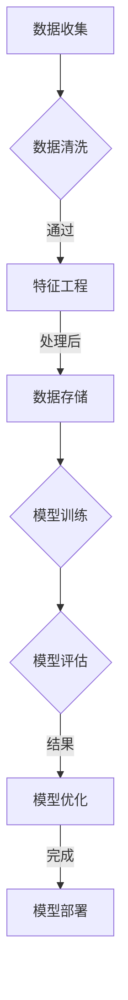
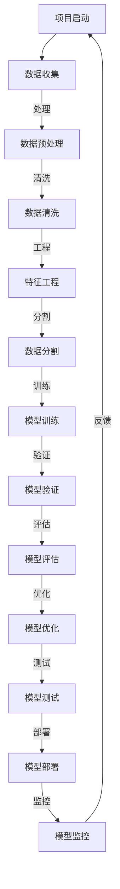

                 

# 文章标题: AI创业优势：垂直领域专业知识

> 关键词：AI创业、垂直领域、专业知识、技术创新、市场竞争力、实践指南

> 摘要：本文深入探讨了AI创业的优势，特别是垂直领域专业知识的价值。文章首先概述了AI创业的背景和优势，随后详细分析了垂直领域专业知识的重要性，包括其在技术创新、市场竞争力以及创业实践中的应用。文章还提供了AI创业项目的规划与执行、产品设计与用户体验、融资与扩展等方面的实践指南，并分享了成功与失败的创业案例。最终，文章总结了AI创业的要点，并提供了相关资源与工具，以助力创业者的成功。

## 第一部分: AI创业优势概述

### 第1章: AI创业优势概述

#### 1.1 AI创业的背景与趋势

##### 1.1.1 AI技术的发展历程

人工智能（AI）作为计算机科学的一个分支，其历史可以追溯到20世纪50年代。最早的AI研究主要集中在逻辑推理和问题解决上。随着计算能力的提升和大数据技术的发展，AI逐渐从理论研究走向实际应用。深度学习、神经网络等技术的突破，使得AI在图像识别、自然语言处理、语音识别等领域取得了显著进展。

##### 1.1.2 AI在商业领域的应用现状

AI在商业领域的应用日益广泛，从自动化生产线到智能客服，从精准营销到风险控制，AI正成为企业提升效率、降低成本、增强竞争力的重要工具。特别是在金融、医疗、零售等行业，AI的应用已经取得了显著的经济效益。

##### 1.1.3 AI创业的机遇与挑战

AI创业的机遇在于其广泛的应用前景和巨大的市场潜力。然而，AI创业也面临着诸多挑战，如技术门槛高、市场需求不确定、竞争激烈等。创业者需要具备强大的技术实力和商业洞察力，才能在激烈的市场竞争中脱颖而出。

#### 1.2 AI创业的优势

##### 1.2.1 垂直领域的专业知识

垂直领域专业知识是AI创业的重要优势之一。创业者通过对特定领域的深入理解，能够更准确地把握市场需求，开发出更具针对性的产品。垂直领域专业知识还包括对业务流程、行业规则、用户习惯等细节的掌握，这些对于AI应用的成功至关重要。

##### 1.2.2 技术创新与市场竞争力

AI创业需要持续的技术创新，以保持市场竞争力。通过不断优化算法、创新技术，创业者能够提供更高效、更智能的解决方案。技术创新不仅能够提升产品价值，还能形成技术壁垒，降低竞争对手的进入成本。

##### 1.2.3 数据积累与变现能力

数据是AI的核心资产，创业者通过积累和分析数据，能够不断优化模型，提升产品的性能和用户体验。同时，数据积累也为商业变现提供了可能性，如通过精准营销、数据分析等手段，实现商业价值最大化。

#### 1.3 AI创业的常见误区与对策

##### 1.3.1 过度依赖技术

AI创业不能仅依赖技术，还需要关注市场需求、用户体验和商业模型。过度依赖技术可能导致产品与市场脱节，难以获得用户认可。

##### 1.3.2 忽视市场需求

市场需求是AI创业成功的关键。创业者需要深入了解用户需求，开发出真正解决用户痛点的产品。

##### 1.3.3 团队建设与人才储备

团队建设是AI创业成功的关键。创业者需要组建一支具有跨学科背景、技术能力和商业敏锐度的团队。同时，要注重人才的培养和储备，以应对快速发展的业务需求。

## 第二部分: AI创业关键要素

### 第2章: 垂直领域专业知识

#### 2.1 垂直领域概述

##### 2.1.1 垂直领域分类与特征

垂直领域是指特定的行业或领域，如金融、医疗、零售、制造等。每个垂直领域都有其独特的业务流程、规则和需求。

##### 2.1.2 垂直领域数据分析

垂直领域数据分析包括对行业数据、用户行为数据、业务流程数据的收集、处理和分析。通过对这些数据的分析，创业者能够更深入地了解市场需求，为产品开发提供依据。

##### 2.1.3 垂直领域技术应用案例

垂直领域技术应用案例包括金融领域的风险管理、医疗领域的疾病预测、零售领域的个性化推荐等。这些案例展示了AI技术在特定领域的应用潜力。

#### 2.2 垂直领域专业知识体系

##### 2.2.1 行业基础知识

行业基础知识包括对行业历史、发展趋势、市场规模、竞争格局等的了解。创业者需要对这些基本概念有清晰的认识。

##### 2.2.2 技术应用原理

技术应用原理包括对AI算法、数据结构、系统架构等的理解。创业者需要掌握这些技术原理，以便在实际应用中灵活运用。

##### 2.2.3 业务流程优化

业务流程优化是指通过对现有业务流程的分析和改进，提高业务效率和效果。创业者需要具备业务流程优化的能力，以提升产品竞争力。

## 第三部分: AI创业实践指南

### 第3章: 技术创新与市场竞争力

#### 3.1 AI技术的创新趋势

##### 3.1.1 深度学习与神经网络

深度学习是AI技术的一个重要分支，通过多层神经网络模型，实现对复杂模式的识别和预测。

##### 3.1.2 自然语言处理与语音识别

自然语言处理（NLP）和语音识别技术正在快速发展，使得人机交互变得更加自然和高效。

##### 3.1.3 计算机视觉与图像识别

计算机视觉和图像识别技术在安防、医疗、零售等领域有着广泛的应用，通过对图像的识别和理解，实现智能化功能。

#### 3.2 技术创新在AI创业中的应用

##### 3.2.1 算法优化与模型改进

通过算法优化和模型改进，提升AI应用的性能和准确性，为用户提供更好的体验。

##### 3.2.2 交叉学科融合与创新

交叉学科融合创新是AI创业的重要趋势，通过结合不同领域的知识，实现技术的突破。

##### 3.2.3 开源技术与商业应用

开源技术为创业者提供了丰富的资源和工具，通过整合开源技术，实现商业应用的创新。

#### 3.3 市场竞争力分析

##### 3.3.1 市场需求与目标客户

了解市场需求，明确目标客户，是提升市场竞争力的重要前提。

##### 3.3.2 竞争对手分析

通过分析竞争对手的产品、市场策略，找到自身的竞争优势和差异化方向。

##### 3.3.3 竞争策略与市场定位

制定合理的竞争策略和市场定位，是提升市场竞争力的重要手段。

## 第四部分: AI创业融资与扩展

### 第4章: 创业项目规划与执行

#### 4.1 项目规划与执行

##### 4.1.1 项目目标与范围

明确项目目标，确定项目范围，是项目规划的关键。

##### 4.1.2 项目团队建设

团队建设是项目成功的关键，创业者需要组建一支具有跨学科背景、技术能力和商业敏锐度的团队。

##### 4.1.3 项目管理方法

采用科学的项目管理方法，确保项目按时、按质完成。

#### 4.2 数据获取与处理

##### 4.2.1 数据来源与类型

了解数据来源和类型，确保数据的全面性和准确性。

##### 4.2.2 数据处理流程

制定数据处理流程，确保数据的有效利用。

##### 4.2.3 数据质量控制

数据质量控制是保证数据分析准确性的重要环节。

#### 4.3 AI模型开发与优化

##### 4.3.1 模型选择与训练

根据项目需求，选择合适的模型，并进行训练。

##### 4.3.2 模型评估与优化

对模型进行评估和优化，提升模型性能。

##### 4.3.3 模型部署与监控

将模型部署到生产环境中，并进行监控和维护。

## 第五章: 产品设计与用户体验

#### 5.1 产品设计与用户体验

##### 5.1.1 产品设计原则

遵循用户体验原则，设计出易用、高效的产品。

##### 5.1.2 用户需求分析

深入了解用户需求，设计出满足用户需求的产品。

##### 5.1.3 用户体验设计

通过用户测试和反馈，不断优化用户体验。

#### 5.2 产品迭代与优化

##### 5.2.1 产品迭代策略

制定合理的迭代策略，持续优化产品。

##### 5.2.2 用户反馈机制

建立用户反馈机制，及时了解用户需求和意见。

##### 5.2.3 数据驱动产品优化

通过数据分析，驱动产品优化，提升用户体验。

#### 5.3 市场推广与品牌建设

##### 5.3.1 市场推广策略

制定有效的市场推广策略，提高产品知名度。

##### 5.3.2 品牌建设与传播

建立品牌形象，通过多种渠道进行品牌传播。

##### 5.3.3 社交媒体营销

利用社交媒体平台，进行精准营销和品牌传播。

## 第六章: AI创业融资策略

#### 6.1 融资策略与渠道

##### 6.1.1 融资方式与选择

根据项目需求，选择合适的融资方式。

##### 6.1.2 融资渠道与资源

了解各种融资渠道，获取必要的融资资源。

##### 6.1.3 融资计划与预算

制定详细的融资计划，合理预算资金使用。

#### 6.2 融资谈判与风险控制

##### 6.2.1 融资谈判技巧

掌握融资谈判技巧，确保获得理想的融资条件。

##### 6.2.2 风险评估与控制

对融资风险进行评估和控制，确保项目的稳健发展。

##### 6.2.3 投资者关系管理

与投资者建立良好的关系，确保项目的顺利进行。

#### 6.3 融资后的扩展与战略规划

##### 6.3.1 扩张策略与市场拓展

根据市场情况，制定扩张策略，拓展市场份额。

##### 6.3.2 业务模式创新

通过业务模式创新，提升企业的核心竞争力。

##### 6.3.3 长期发展战略规划

制定长期发展战略规划，确保企业的可持续发展。

## 第七章: 案例分析与创业经验分享

#### 7.1 案例分析

##### 7.1.1 成功创业案例分析

通过成功创业案例分析，了解成功的关键要素。

##### 7.1.2 失败创业案例分析

通过失败创业案例分析，了解创业过程中的常见问题及解决方法。

##### 7.1.3 行业热点事件分析

分析行业热点事件，了解行业发展趋势和挑战。

#### 7.2 创业经验分享

##### 7.2.1 创业团队建设经验

分享创业团队建设经验，包括团队管理、人才培养等方面。

##### 7.2.2 创业过程心得体会

分享创业过程中的心得体会，包括挑战、机遇、成长等方面。

##### 7.2.3 创业成功要素总结

总结创业成功的要素，为创业者提供参考。

## 附录

### 附录A: AI创业相关资源与工具

##### A.1 开发工具与平台

介绍AI创业常用的开发工具与平台，包括深度学习框架、数据预处理工具、代码调试与版本控制工具等。

##### A.2 数据集与开源代码

介绍AI创业常用的数据集和开源代码资源，包括公开数据集、开源项目与代码库等。

##### A.3 行业报告与政策文件

介绍AI创业相关的行业报告和政策文件，包括AI行业报告、创业政策文件、市场研究与分析报告等。

### 参考文献

#### 1. 相关书籍
#### 2. 学术论文
#### 3. 行业报告
#### 4. 政策文件
#### 5. 互联网资源链接

## 作者

作者：AI天才研究院/AI Genius Institute & 禅与计算机程序设计艺术 /Zen And The Art of Computer Programming

（待续）# 第一部分: AI创业优势概述

## 第1章: AI创业优势概述

### 1.1 AI创业的背景与趋势

#### 1.1.1 AI技术的发展历程

人工智能（AI）作为一种模拟人类智能的技术，其发展历程可以追溯到20世纪50年代。当时，人工智能的概念被首次提出，旨在使计算机具有类似人类的智能水平。早期的AI研究主要集中在逻辑推理和问题解决上，例如IBM的深蓝（Deep Blue）国际象棋程序，以及后来的微软的“小冰”聊天机器人等。

随着计算能力的提升和大数据技术的发展，AI技术得到了快速进步。特别是深度学习（Deep Learning）的兴起，使得AI在图像识别、自然语言处理、语音识别等领域取得了显著突破。深度学习通过多层神经网络模型，能够自动从大量数据中学习特征，实现高精度的模式识别和预测。

#### 1.1.2 AI在商业领域的应用现状

AI在商业领域的应用已经变得非常广泛，从自动化生产线到智能客服，从精准营销到风险控制，AI正成为企业提升效率、降低成本、增强竞争力的重要工具。以下是一些AI在商业领域的主要应用场景：

1. **金融**：在金融领域，AI被广泛应用于风险管理、欺诈检测、算法交易、智能投顾等方面。例如，通过机器学习模型，银行可以更准确地评估贷款申请者的信用风险，从而降低不良贷款率。

2. **医疗**：在医疗领域，AI技术被用于疾病预测、医疗影像分析、药物研发等。例如，通过深度学习模型，医生可以更快速地识别出医学图像中的异常病灶，提高诊断准确率。

3. **零售**：在零售领域，AI被用于库存管理、个性化推荐、客户服务等方面。例如，通过分析消费者的购物行为和偏好，零售商可以提供更个性化的产品推荐，提高销售额。

4. **制造**：在制造业中，AI技术被用于生产调度、设备维护、质量控制等。例如，通过机器学习算法，企业可以更精准地预测设备故障，提前进行维护，减少停机时间。

#### 1.1.3 AI创业的机遇与挑战

AI创业的机遇在于其广泛的应用前景和巨大的市场潜力。根据市场研究公司的数据，全球AI市场规模预计将在未来几年内持续增长，达到数百亿美元。这不仅为企业提供了巨大的商机，也为创业者提供了广阔的发展空间。

然而，AI创业也面临着诸多挑战：

1. **技术门槛高**：AI技术涉及到大量的数学、计算机科学和统计学知识，对于创业者来说，需要投入大量时间和精力来学习和掌握。

2. **市场需求不确定**：AI应用场景多样，市场需求复杂多变。创业者需要准确地把握市场需求，避免产品与市场脱节。

3. **竞争激烈**：随着AI技术的普及，越来越多的企业进入AI市场，竞争日益激烈。创业者需要具备强大的技术实力和商业洞察力，才能在市场中脱颖而出。

### 1.2 AI创业的优势

#### 1.2.1 垂直领域的专业知识

垂直领域的专业知识是AI创业的重要优势之一。创业者通过对特定领域的深入理解，能够更准确地把握市场需求，开发出更具针对性的产品。例如，医疗行业的创业者需要对医疗知识、患者需求、医疗流程等有深入的了解，才能开发出真正解决医疗痛点的AI产品。

垂直领域专业知识还包括对业务流程、行业规则、用户习惯等细节的掌握。这些知识不仅有助于创业者更好地理解市场需求，还能在产品设计、市场推广等方面提供有力支持。

#### 1.2.2 技术创新与市场竞争力

AI创业需要持续的技术创新，以保持市场竞争力。通过不断优化算法、创新技术，创业者能够提供更高效、更智能的解决方案。技术创新不仅能够提升产品价值，还能形成技术壁垒，降低竞争对手的进入成本。

例如，在图像识别领域，通过引入新的算法或改进现有算法，可以提高识别的准确率和速度。在自然语言处理领域，通过研发新的语言模型，可以提升语言理解和生成能力。

#### 1.2.3 数据积累与变现能力

数据是AI的核心资产，创业者通过积累和分析数据，能够不断优化模型，提升产品的性能和用户体验。例如，在金融领域，通过分析大量的交易数据，可以更精准地预测市场走势，为投资者提供更有价值的建议。

同时，数据积累也为商业变现提供了可能性。例如，通过精准营销，可以将合适的产品推荐给合适的用户，提高销售额。通过数据分析，还可以发现潜在的商业机会，实现商业价值的最大化。

### 1.3 AI创业的常见误区与对策

#### 1.3.1 过度依赖技术

AI创业不能仅依赖技术，还需要关注市场需求、用户体验和商业模型。过度依赖技术可能导致产品与市场脱节，难以获得用户认可。

**对策**：创业者应该多与潜在用户进行沟通，了解他们的需求和痛点，确保产品能够真正解决用户问题。同时，要注重用户体验设计，使产品易于使用，提高用户满意度。

#### 1.3.2 忽视市场需求

市场需求是AI创业成功的关键。创业者需要深入了解用户需求，开发出真正解决用户痛点的产品。

**对策**：通过市场调研、用户访谈、问卷调查等方式，收集用户反馈，了解用户需求。同时，要关注行业趋势，及时调整产品方向，以适应市场需求的变化。

#### 1.3.3 团队建设与人才储备

团队建设是AI创业成功的关键。创业者需要组建一支具有跨学科背景、技术能力和商业敏锐度的团队。同时，要注重人才的培养和储备，以应对快速发展的业务需求。

**对策**：制定人才发展计划，提供培训和学习机会，激励团队成员不断提升自身能力。同时，要建立良好的团队文化和激励机制，增强团队凝聚力。

## 第二部分: AI创业关键要素

### 第2章: 垂直领域专业知识

#### 2.1 垂直领域概述

#### 2.1.1 垂直领域分类与特征

垂直领域是指特定的行业或领域，如金融、医疗、零售、制造等。每个垂直领域都有其独特的业务流程、规则和需求。

**金融领域**：金融领域涉及银行、保险、证券等多个子行业，业务流程复杂，对数据安全性和合规性要求高。

**医疗领域**：医疗领域包括医院、诊所、制药公司等多个环节，涉及患者数据、医学知识等敏感信息。

**零售领域**：零售领域包括线上和线下销售渠道，业务流程涉及库存管理、供应链管理、客户服务等多个方面。

**制造领域**：制造领域包括产品设计、生产制造、物流配送等环节，对生产效率和质量控制有高要求。

#### 2.1.2 垂直领域数据分析

垂直领域数据分析包括对行业数据、用户行为数据、业务流程数据的收集、处理和分析。通过对这些数据的分析，创业者能够更深入地了解市场需求，为产品开发提供依据。

**行业数据**：包括市场规模、增长趋势、竞争格局等，帮助创业者了解行业背景和机会。

**用户行为数据**：包括用户购买行为、搜索习惯、评价反馈等，帮助创业者了解用户需求和偏好。

**业务流程数据**：包括生产流程、销售流程、客户服务流程等，帮助创业者优化业务流程，提升效率。

#### 2.1.3 垂直领域技术应用案例

垂直领域技术应用案例包括金融领域的风险管理、医疗领域的疾病预测、零售领域的个性化推荐等。这些案例展示了AI技术在特定领域的应用潜力。

**金融领域**：利用机器学习模型进行风险管理，如信用评分、欺诈检测等。

**医疗领域**：利用深度学习模型进行疾病预测和诊断，如癌症筛查、医学图像分析等。

**零售领域**：利用自然语言处理和推荐系统进行个性化推荐和客户服务，提高销售额和用户满意度。

### 2.2 垂直领域专业知识体系

#### 2.2.1 行业基础知识

行业基础知识包括对行业历史、发展趋势、市场规模、竞争格局等的了解。创业者需要对这些基本概念有清晰的认识，以便在创业过程中做出正确的决策。

**历史**：了解行业的发展历程，可以更好地理解行业现状和未来趋势。

**发展趋势**：关注行业新技术、新政策、新商业模式等，把握行业发展趋势。

**市场规模**：了解市场规模和增长速度，评估行业的商业潜力。

**竞争格局**：分析主要竞争对手的业务模式、市场占有率、竞争优势等，明确自身的定位。

#### 2.2.2 技术应用原理

技术应用原理包括对AI算法、数据结构、系统架构等的理解。创业者需要掌握这些技术原理，以便在实际应用中灵活运用。

**AI算法**：了解常见的AI算法，如机器学习、深度学习、强化学习等，掌握其基本原理和应用场景。

**数据结构**：了解数据结构的基本概念和适用场景，如数组、链表、树、图等。

**系统架构**：了解系统的整体架构，如客户端-服务器架构、微服务架构等，掌握其优缺点和适用场景。

#### 2.2.3 业务流程优化

业务流程优化是指通过对现有业务流程的分析和改进，提高业务效率和效果。创业者需要具备业务流程优化的能力，以提升产品竞争力。

**流程分析**：分析现有业务流程中的瓶颈和问题，找到优化的方向。

**流程改进**：根据流程分析结果，制定改进方案，优化业务流程。

**流程监控**：建立流程监控机制，确保改进措施的有效实施。

## 第三部分: AI创业实践指南

### 第3章: 技术创新与市场竞争力

#### 3.1 AI技术的创新趋势

#### 3.1.1 深度学习与神经网络

深度学习（Deep Learning）是AI技术的一个重要分支，通过多层神经网络模型，实现对复杂模式的识别和预测。深度学习在图像识别、自然语言处理、语音识别等领域取得了显著突破。

**卷积神经网络（CNN）**：CNN是深度学习在图像识别领域的重要应用，通过卷积层、池化层和全连接层的组合，实现对图像的特征提取和分类。

**循环神经网络（RNN）**：RNN是深度学习在序列数据处理领域的重要应用，通过循环结构，实现对序列数据的建模和预测。

**生成对抗网络（GAN）**：GAN是一种深度学习模型，通过生成器和判别器的对抗训练，实现数据的生成和增强。

#### 3.1.2 自然语言处理与语音识别

自然语言处理（Natural Language Processing，NLP）和语音识别（Speech Recognition）技术正在快速发展，使得人机交互变得更加自然和高效。

**语言模型**：语言模型是一种用于预测文本序列的模型，如基于统计模型的n-gram模型和基于神经网络的Transformer模型。

**语音识别**：语音识别技术通过将语音信号转换为文本，实现语音到文字的转换。常见的语音识别模型包括隐马尔可夫模型（HMM）和深度神经网络（DNN）。

**对话系统**：对话系统是一种基于NLP和语音识别技术的人机交互系统，能够实现自然语言理解和回应。

#### 3.1.3 计算机视觉与图像识别

计算机视觉（Computer Vision）和图像识别（Image Recognition）技术在安防、医疗、零售等领域有着广泛的应用，通过对图像的识别和理解，实现智能化功能。

**目标检测**：目标检测是计算机视觉领域的重要任务，通过检测图像中的目标物体，实现对场景的理解和监控。

**图像分类**：图像分类是计算机视觉的基本任务，通过对图像进行分类，实现对图像内容的理解和标注。

**人脸识别**：人脸识别技术通过分析人脸图像，实现对人脸的识别和比对，广泛应用于安防、金融、医疗等领域。

#### 3.2 技术创新在AI创业中的应用

#### 3.2.1 算法优化与模型改进

算法优化与模型改进是AI创业中的重要工作，通过不断优化算法和改进模型，提升AI应用的性能和准确性。

**算法优化**：通过改进算法，提高模型的计算效率，减少计算资源消耗。

**模型改进**：通过增加模型层数、调整网络结构、引入新的优化算法等方式，提升模型的性能。

**案例**：在图像识别领域，通过引入残差网络（ResNet），显著提升了模型的准确率。

#### 3.2.2 交叉学科融合与创新

交叉学科融合创新是AI创业的重要趋势，通过结合不同领域的知识，实现技术的突破。

**跨学科融合**：将AI技术与其他领域（如生物、物理、工程等）相结合，创造新的应用场景。

**创新应用**：通过跨学科融合，开发出新的产品和服务，解决传统领域中的问题。

**案例**：在医疗领域，通过将AI技术与生物医学结合，开发出智能诊断系统，提高诊断准确率。

#### 3.2.3 开源技术与商业应用

开源技术为AI创业提供了丰富的资源和工具，通过整合开源技术，实现商业应用的创新。

**开源框架**：使用开源深度学习框架（如TensorFlow、PyTorch等），加速模型开发和部署。

**开源工具**：利用开源数据集、开源算法和开源代码库，提高开发效率。

**商业应用**：将开源技术应用到商业场景中，实现商业价值。

**案例**：在零售领域，通过开源的推荐系统框架，开发出个性化的购物推荐系统，提高用户满意度。

#### 3.3 市场竞争力分析

#### 3.3.1 市场需求与目标客户

了解市场需求，明确目标客户，是提升市场竞争力的重要前提。

**市场需求**：通过市场调研，分析行业的市场需求和趋势，了解用户痛点和需求。

**目标客户**：确定目标客户群体，明确产品的定位和受众。

**案例**：在医疗领域，目标客户是医院和诊所，产品定位是提高诊断效率和准确性。

#### 3.3.2 竞争对手分析

通过分析竞争对手的产品、市场策略，找到自身的竞争优势和差异化方向。

**竞争对手**：识别直接和间接的竞争对手，了解他们的产品特点和市场策略。

**竞争优势**：分析自身产品的优势，如技术优势、成本优势、用户体验等。

**差异化方向**：找到与竞争对手的差异化方向，如创新功能、更优质的服务等。

**案例**：在零售领域，通过提供更个性化的推荐服务，与竞争对手形成差异化。

#### 3.3.3 竞争策略与市场定位

制定合理的竞争策略和市场定位，是提升市场竞争力的重要手段。

**竞争策略**：根据市场需求和竞争对手情况，制定相应的竞争策略，如价格策略、差异化策略等。

**市场定位**：明确产品的市场定位，确定目标市场和客户群体。

**案例**：在金融领域，通过提供高效的信用评分服务，定位高端市场。

## 第四部分: AI创业实践指南

### 第4章: 创业项目规划与执行

#### 4.1 项目规划与执行

#### 4.1.1 项目目标与范围

项目目标是创业项目成功的关键，需要明确并具体化。项目目标应涵盖业务目标、技术目标、市场目标等多个方面。

- **业务目标**：明确产品的商业价值，如提高销售额、降低运营成本等。
- **技术目标**：确定所需技术实现方案，如算法优化、系统集成等。
- **市场目标**：明确目标市场和客户群体，如特定行业、地域等。

项目范围应详细定义，确保项目团队对项目内容和预期成果有清晰的认识。

- **项目内容**：列出项目的主要任务和工作内容。
- **预期成果**：定义项目的交付物和里程碑。

#### 4.1.2 项目团队建设

项目团队建设是项目成功的关键。团队应包括以下角色：

- **项目经理**：负责项目规划、执行、监控和汇报。
- **技术团队**：包括算法工程师、软件工程师、系统架构师等，负责技术实现。
- **市场团队**：包括产品经理、市场分析师、销售代表等，负责市场推广和客户关系。
- **运营团队**：包括数据分析师、运营专员等，负责数据分析和日常运营。

团队建设应注重成员的协作和沟通，确保项目高效推进。

- **团队协作**：使用协作工具（如Slack、Trello等），确保团队成员之间的信息共享和任务分配。
- **沟通机制**：定期召开团队会议，汇报项目进度，解决遇到的问题。

#### 4.1.3 项目管理方法

项目管理方法应科学、合理，确保项目按时、按质完成。

- **敏捷开发**：采用敏捷开发方法，如Scrum或Kanban，通过迭代和增量开发，快速响应需求变化。
- **任务管理**：使用任务管理工具（如Jira、Asana等），明确任务责任人和截止日期。
- **风险管理**：识别项目风险，制定应对策略，降低风险对项目的影响。
- **质量控制**：建立质量保证机制，如代码审查、测试计划等，确保项目交付物的质量。

#### 4.2 数据获取与处理

#### 4.2.1 数据来源与类型

数据是AI创业的核心资产，数据来源和类型直接影响到AI模型的质量和应用效果。

- **内部数据**：企业内部产生的数据，如销售数据、用户行为数据、生产数据等。
- **外部数据**：从公开来源获取的数据，如社交媒体数据、市场调研数据、公开数据集等。
- **结构化数据**：数据格式化、有明确结构和标签的数据，如关系型数据库中的数据。
- **非结构化数据**：无明确结构和标签的数据，如文本、图像、音频等。

#### 4.2.2 数据处理流程

数据处理流程包括数据收集、数据预处理、数据分析和数据存储等环节。

- **数据收集**：通过数据爬取、数据导入等方式，收集所需数据。
- **数据预处理**：清洗和整理数据，去除噪声和异常值，使数据适合模型训练。
  - **数据清洗**：去除重复数据、缺失值填充、异常值处理等。
  - **数据转换**：将数据格式转换为适合模型训练的格式，如归一化、标准化等。
- **数据分析**：使用统计分析、机器学习等方法，对数据进行挖掘和分析，提取有用的信息。
  - **描述性分析**：描述数据的基本特征，如均值、方差等。
  - **预测性分析**：使用机器学习模型进行预测，如回归分析、分类分析等。
- **数据存储**：将处理后的数据存储到数据库或数据湖中，便于后续使用。

#### 4.2.3 数据质量控制

数据质量控制是确保数据分析结果准确性和可靠性的关键。

- **数据质量评估**：评估数据的完整度、准确性、一致性等质量指标。
  - **数据完整性**：检查数据是否完整，是否有缺失值。
  - **数据准确性**：检查数据的准确性，如与实际情况是否一致。
  - **数据一致性**：检查数据在不同来源、不同时间点的一致性。
- **数据清洗和修复**：针对发现的数据质量问题，进行数据清洗和修复，确保数据质量。
  - **数据清洗**：去除噪声、异常值等。
  - **数据修复**：修复缺失值、纠正错误等。
- **数据监控**：建立数据监控机制，持续监控数据质量，发现并解决潜在问题。

#### 4.3 AI模型开发与优化

#### 4.3.1 模型选择与训练

AI模型开发是AI创业的核心环节，模型选择和训练直接影响模型的性能和应用效果。

- **模型选择**：根据业务需求和数据特点，选择合适的模型。
  - **监督学习模型**：适用于有标签数据的分类和回归任务，如逻辑回归、决策树、支持向量机等。
  - **无监督学习模型**：适用于无标签数据的聚类和降维任务，如K-均值聚类、主成分分析等。
  - **强化学习模型**：适用于决策和优化任务，如深度Q网络（DQN）、策略梯度（PG）等。
- **模型训练**：使用训练数据对模型进行训练，调整模型参数，使其能够准确预测。
  - **数据预处理**：对训练数据进行预处理，如归一化、标准化等。
  - **模型训练过程**：使用优化算法（如随机梯度下降SGD）对模型进行训练，调整模型参数。
  - **模型评估**：使用验证数据集评估模型性能，如准确率、召回率、F1分数等。

#### 4.3.2 模型评估与优化

模型评估与优化是确保模型性能和效果的关键环节。

- **模型评估**：使用验证数据集或测试数据集对模型进行评估，判断模型是否达到预期性能。
  - **评估指标**：常用的评估指标包括准确率、召回率、F1分数、均方误差等。
  - **交叉验证**：使用交叉验证方法，如K折交叉验证，评估模型在不同数据子集上的性能，提高评估的可靠性。
- **模型优化**：根据评估结果，对模型进行调整和优化，提高模型性能。
  - **参数调整**：调整模型参数，如学习率、批量大小等，以优化模型性能。
  - **算法改进**：尝试使用不同的算法或改进现有算法，提高模型性能。
  - **特征工程**：对输入特征进行筛选、变换和组合，提高模型对数据的敏感度和预测能力。

#### 4.3.3 模型部署与监控

模型部署与监控是确保模型在实际应用中稳定运行和持续优化的关键。

- **模型部署**：将训练好的模型部署到生产环境中，使其能够对外提供服务。
  - **部署策略**：根据业务需求和负载情况，选择合适的部署策略，如服务器部署、容器部署、云端部署等。
  - **部署流程**：建立模型部署流程，包括模型版本管理、部署脚本编写、部署环境配置等。
- **模型监控**：监控模型在运行过程中的性能和稳定性，确保模型能够持续提供高质量的服务。
  - **性能监控**：监控模型的响应时间、准确率、资源消耗等性能指标。
  - **异常检测**：监控模型的异常行为，如过拟合、数据泄漏等，及时调整模型。
  - **反馈机制**：建立用户反馈机制，收集用户对模型服务的反馈，用于模型优化和改进。

## 第五章: 产品设计与用户体验

### 5.1 产品设计与用户体验

#### 5.1.1 产品设计原则

产品设计是AI创业过程中至关重要的一环，良好的产品设计不仅能够提升产品的市场竞争力，还能提高用户满意度。以下是一些产品设计的基本原则：

- **用户中心设计**：以用户需求为中心，设计出能够解决用户问题的产品。
- **简洁性**：设计简洁直观的界面，避免复杂和冗余的功能，降低用户的学习成本。
- **一致性**：保持产品界面和交互的一致性，使用户能够快速上手。
- **可访问性**：确保产品对各类用户（包括残障人士）都是可访问的。
- **可扩展性**：设计具有可扩展性的架构，能够随着业务的发展而扩展。

#### 5.1.2 用户需求分析

了解用户需求是产品设计的前提，以下是一些常见的用户需求分析方法：

- **用户访谈**：通过与目标用户进行面对面交流，深入了解用户的行为、需求和痛点。
- **问卷调查**：通过问卷调查收集大量用户数据，分析用户偏好和需求。
- **用户测试**：邀请目标用户参与产品测试，收集用户的反馈和改进意见。
- **数据分析**：通过分析用户行为数据，发现用户的典型行为模式和需求。

#### 5.1.3 用户体验设计

用户体验设计（UX Design）是提升用户满意度和产品价值的重要手段。以下是一些用户体验设计的关键要素：

- **用户旅程映射**：通过绘制用户旅程图，全面了解用户与产品的交互过程。
- **原型设计**：使用原型设计工具（如Sketch、Figma等），快速构建产品的交互原型。
- **交互设计**：设计直观、流畅的交互流程，确保用户能够轻松完成任务。
- **视觉设计**：使用适当的色彩、图标、字体等，提升产品的视觉吸引力。
- **可用性测试**：通过可用性测试，验证产品的易用性和用户体验。

### 5.2 产品迭代与优化

#### 5.2.1 产品迭代策略

产品迭代是持续优化产品的重要手段，以下是一些常见的产品迭代策略：

- **敏捷开发**：采用敏捷开发方法，如Scrum或Kanban，通过快速迭代和反馈，不断优化产品。
- **持续集成**：将代码集成到主分支的过程中持续进行测试和优化，确保产品质量。
- **用户反馈驱动**：根据用户的反馈和需求，优先处理重要的功能和改进。
- **数据驱动**：通过分析用户行为数据，识别用户痛点和改进机会。

#### 5.2.2 用户反馈机制

用户反馈是产品优化的重要依据，以下是一些建立用户反馈机制的方法：

- **反馈渠道**：提供多种渠道（如在线反馈表、用户论坛、社交媒体等）供用户反馈。
- **反馈分析**：定期收集和分析用户反馈，识别用户的主要需求和问题。
- **用户访谈**：定期与用户进行深入访谈，了解用户的真实需求和体验。
- **A/B测试**：通过A/B测试，比较不同设计方案的用户反馈，选择最优方案。

#### 5.2.3 数据驱动产品优化

数据驱动产品优化是通过数据分析来指导产品设计的重要手段，以下是一些数据驱动的产品优化方法：

- **用户行为分析**：通过分析用户行为数据，了解用户的使用习惯和偏好。
- **性能监控**：监控产品的性能指标，如响应时间、错误率等，确保产品稳定运行。
- **指标跟踪**：设定关键性能指标（KPI），跟踪产品的关键指标，评估产品的效果。
- **数据可视化**：使用数据可视化工具，将数据以图表的形式展示，便于分析和决策。

### 5.3 市场推广与品牌建设

#### 5.3.1 市场推广策略

市场推广是提高产品知名度、吸引潜在用户的重要手段，以下是一些市场推广策略：

- **内容营销**：通过创作有价值的内容（如博客、白皮书、视频等），吸引潜在用户。
- **社交媒体营销**：利用社交媒体平台（如微博、微信、Twitter等），提高品牌知名度和用户互动。
- **广告推广**：通过搜索引擎优化（SEO）、搜索引擎营销（SEM）等广告推广方式，提高产品曝光率。
- **合作推广**：与行业合作伙伴（如行业媒体、行业协会等）合作，共同推广产品。

#### 5.3.2 品牌建设与传播

品牌建设是提高产品附加值、建立用户忠诚度的重要手段，以下是一些品牌建设与传播的方法：

- **品牌定位**：明确品牌的核心价值和定位，塑造独特的品牌形象。
- **品牌传播**：通过多种渠道（如公关活动、广告宣传、用户口碑等）传播品牌信息，提高品牌知名度。
- **品牌文化**：建立品牌文化，包括价值观、使命、愿景等，塑造品牌个性。
- **用户互动**：通过用户互动（如线上活动、用户社区等）增强用户对品牌的认同和忠诚度。

#### 5.3.3 社交媒体营销

社交媒体营销是现代市场推广的重要手段，以下是一些社交媒体营销的方法：

- **社交媒体平台选择**：根据目标用户特点，选择合适的社交媒体平台（如微博、微信、LinkedIn等）。
- **内容策略**：制定内容策略，发布有价值、有趣的内容，吸引关注和互动。
- **互动与参与**：积极与用户互动，参与话题讨论，提高用户参与度。
- **广告投放**：通过社交媒体广告，精准定位目标用户，提高广告效果。
- **社交媒体分析**：分析社交媒体数据，了解用户行为和反馈，优化营销策略。

## 第六章: AI创业融资与扩展

### 6.1 融资策略与渠道

#### 6.1.1 融资方式与选择

融资方式是AI创业过程中不可或缺的一环，创业者需要根据自身情况和市场需求选择合适的融资方式。以下是一些常见的融资方式：

- **天使融资**：在创业初期，创业者通常通过寻找天使投资人进行融资。天使投资人通常提供资金和资源，以换取股份或优先股权。
- **风险投资**：风险投资（Venture Capital，VC）是一种常见的融资方式，VC通常会投资于有潜力的创业公司，以期在未来获得高额回报。
- **股权众筹**：通过股权众筹平台，向公众发行股份，筹集资金。这种方式能够迅速聚集资金，同时也能提高品牌知名度。
- **债务融资**：通过借款（如银行贷款、发行债券等）获得资金，需要支付利息和本金。
- **政府补贴和基金**：某些国家和地区提供创业补贴和基金，支持AI创业公司的发展。

#### 6.1.2 融资渠道与资源

了解融资渠道和资源是成功融资的关键。以下是一些常见的融资渠道：

- **风险投资公司**：风险投资公司是AI创业公司的主要融资渠道之一。创业者可以通过参加创投活动、创业大赛等方式与VC建立联系。
- **天使投资人网络**：天使投资人通常活跃在创业社区、创业者会议和网络平台上。创业者可以通过这些渠道寻找合适的投资人。
- **众筹平台**：众筹平台如Kickstarter、Indiegogo等，为创业者提供了向公众融资的机会。
- **银行和金融机构**：银行和其他金融机构提供各种贷款和融资服务，创业者可以根据自身情况选择合适的融资方案。
- **政府资金和补贴**：许多国家和地区设有创业基金和补贴项目，为AI创业公司提供资金支持。

#### 6.1.3 融资计划与预算

制定详细的融资计划和预算是融资成功的关键。以下是一些制定融资计划和预算的步骤：

- **项目规划**：明确项目的目标、范围、预期成果等，为融资提供依据。
- **财务预测**：预测项目的收入、成本、利润等财务指标，为融资提供财务依据。
- **融资需求**：根据项目需求，确定所需的资金额度，包括初始投资、运营资金等。
- **融资结构**：确定融资结构，包括股权融资、债务融资等，以及各融资方式的占比。
- **预算分配**：根据项目需求，制定详细的预算分配方案，确保资金合理使用。

### 6.2 融资谈判与风险控制

#### 6.2.1 融资谈判技巧

融资谈判是创业者与投资者之间的重要环节，以下是一些融资谈判的技巧：

- **准备工作**：充分了解投资者背景、投资偏好和投资策略，为谈判做好准备。
- **价值阐述**：清晰地阐述项目的商业价值和市场潜力，展示项目的投资回报。
- **沟通技巧**：保持良好的沟通，倾听投资者的意见和建议，展示合作诚意。
- **谈判策略**：根据谈判情况灵活调整策略，如让步、坚持、寻求共同点等。
- **合同条款**：仔细阅读合同条款，确保权益不受损失，如股权比例、决策权、退出机制等。

#### 6.2.2 风险评估与控制

在融资过程中，创业者需要评估和应对各种风险，以下是一些常见的风险评估与控制方法：

- **市场风险**：评估市场变化对项目的影响，如市场需求波动、竞争加剧等。
- **技术风险**：评估技术实现和创新能力，如技术难度、专利纠纷等。
- **财务风险**：评估项目财务状况，如资金链断裂、财务状况恶化等。
- **法律风险**：评估项目合规性和法律风险，如合同纠纷、知识产权纠纷等。

#### 6.2.3 投资者关系管理

投资者关系管理是确保融资顺利进行和持续发展的重要环节。以下是一些投资者关系管理的方法：

- **定期汇报**：定期向投资者汇报项目进展和财务状况，保持沟通畅通。
- **透明度**：保持信息的透明度，及时披露项目相关信息，增强投资者信任。
- **投资者参与**：鼓励投资者参与项目决策，提供意见和建议，共同推动项目发展。
- **突发事件应对**：在遇到突发事件时，及时与投资者沟通，共同应对挑战。
- **持续合作**：与投资者建立长期合作关系，共同分享项目成果。

### 6.3 融资后的扩展与战略规划

#### 6.3.1 扩张策略与市场拓展

融资成功后，创业者需要制定合理的扩张策略和市场拓展计划，以下是一些扩张策略和市场拓展的方法：

- **产品线拓展**：根据市场需求，拓展产品线，开发新的产品或服务。
- **市场拓展**：开拓新的市场，如海外市场、细分市场等，扩大市场份额。
- **合作伙伴关系**：与行业合作伙伴建立合作关系，共同开拓市场，提高竞争力。
- **并购整合**：通过并购其他公司，整合资源和市场，实现快速扩张。

#### 6.3.2 业务模式创新

业务模式创新是提高企业竞争力和盈利能力的重要手段，以下是一些业务模式创新的方法：

- **商业模式重构**：重新定义商业模式，如从产品销售转向订阅模式、从B2B转向B2C等。
- **价值链整合**：整合上下游资源，提高产业链效率，降低成本。
- **服务模式创新**：提供增值服务，如定制化服务、售后服务等，提高客户满意度。
- **技术创新**：通过技术创新，提升产品价值，创造新的商业模式。

#### 6.3.3 长期发展战略规划

制定长期发展战略规划是企业持续发展的重要保障，以下是一些长期发展战略规划的方法：

- **愿景和使命**：明确企业的愿景和使命，为长期发展提供方向。
- **战略目标**：设定具体、可衡量的长期战略目标，如市场占有率、收入增长等。
- **关键成功因素**：识别实现战略目标的关键成功因素，如技术创新、品牌建设等。
- **资源配置**：根据战略目标，合理配置资源，确保战略规划的顺利实施。
- **风险评估**：定期评估战略执行情况，识别潜在风险，及时调整战略。

### 第7章: 案例分析与创业经验分享

#### 7.1 案例分析

#### 7.1.1 成功创业案例分析

成功创业案例分析是了解创业成功经验的重要途径。以下是一个成功创业案例分析：

**公司名称**：DeepMind

**行业领域**：人工智能

**创业背景**：DeepMind成立于2010年，由戴密斯·哈萨比斯（Demis Hassabis）、谢恩·莱顿-布雷尔（Shane Legg）和安德鲁·穆拉利（Andrew Mohri）三人创立。DeepMind的愿景是“通过人工智能解决科学和人类面临的最复杂问题”。

**成功因素**：

1. **技术创新**：DeepMind在人工智能领域取得了许多突破，特别是在深度学习和强化学习方面。其研发的AlphaGo成为历史上第一个战胜人类围棋世界冠军的AI程序。

2. **商业模式**：DeepMind采用“技术授权”的商业模式，将其核心技术授权给其他公司，从而实现商业价值。

3. **合作伙伴关系**：DeepMind与谷歌、微软等科技巨头建立了紧密的合作关系，为其提供了强大的资源和支持。

4. **人才储备**：DeepMind吸引了一批顶尖的人工智能科学家和工程师，为其技术创新提供了人才保障。

**经验总结**：

1. **技术创新是核心**：持续的技术创新是创业成功的关键，特别是对于高科技公司。

2. **商业模式要创新**：寻找合适的商业模式，既能实现商业价值，又能保持企业的可持续发展。

3. **合作伙伴关系至关重要**：与行业合作伙伴建立良好的合作关系，可以共享资源，降低风险。

#### 7.1.2 失败创业案例分析

失败创业案例分析是避免创业失败的宝贵经验。以下是一个失败创业案例分析：

**公司名称**：SaaShing

**行业领域**：SaaS（软件即服务）

**创业背景**：SaaShing成立于2015年，旨在为小型企业提供一站式SaaS解决方案。

**失败原因**：

1. **市场需求不足**：在创业初期，SaaShing没有充分了解市场需求，导致产品定位不准确。

2. **资金链断裂**：由于市场需求不足，SaaShing无法实现预期的收入，导致资金链断裂。

3. **团队管理问题**：团队管理不善，缺乏有效的沟通和协作，导致项目进展缓慢。

**经验总结**：

1. **充分了解市场需求**：在创业初期，要充分了解市场需求，确保产品能够满足用户需求。

2. **合理规划资金**：在创业过程中，要合理规划资金，避免资金链断裂。

3. **注重团队管理**：建立高效的团队管理体系，确保团队成员之间的沟通和协作。

#### 7.1.3 行业热点事件分析

行业热点事件分析可以帮助创业者了解行业动态和趋势。以下是一个行业热点事件分析：

**事件名称**：ChatGPT的火爆

**行业领域**：人工智能

**事件概述**：ChatGPT是OpenAI开发的一款基于GPT-3技术的聊天机器人，于2022年11月推出后迅速火爆，吸引了大量用户和关注。

**影响分析**：

1. **技术突破**：ChatGPT的推出标志着自然语言处理技术取得了重大突破，为人工智能领域带来了新的发展机遇。

2. **市场前景**：随着自然语言处理技术的发展，人工智能在客服、教育、医疗等领域的应用前景广阔。

3. **竞争加剧**：ChatGPT的成功引发了市场的关注，多家公司纷纷推出类似产品，竞争加剧。

**创业启示**：

1. **技术创新**：要密切关注行业技术动态，寻找技术创新的突破点。

2. **市场定位**：要明确市场定位，避免同质化竞争。

3. **快速响应**：要快速响应市场变化，及时调整产品和服务。

#### 7.2 创业经验分享

#### 7.2.1 创业团队建设经验

创业团队建设是创业成功的关键。以下是一些创业团队建设经验：

1. **共同愿景**：团队成员要具备共同愿景，明确企业的目标和使命。

2. **多样性与互补性**：团队成员应具有多样化的背景和技能，形成互补。

3. **有效的沟通**：建立有效的沟通机制，确保团队成员之间的信息共享和协作。

4. **激励机制**：制定合理的激励机制，激发团队成员的积极性和创造力。

#### 7.2.2 创业过程心得体会

创业过程充满挑战和不确定性，以下是一些创业过程心得体会：

1. **持续学习**：创业过程中要不断学习新知识、新技能，以适应快速变化的市场环境。

2. **灵活应对**：面对市场变化和挑战，要灵活应对，及时调整战略和计划。

3. **坚持信念**：在创业过程中，要保持信念，坚持不懈，克服各种困难。

#### 7.2.3 创业成功要素总结

以下是一些创业成功要素的总结：

1. **技术创新**：持续的技术创新是企业保持竞争力的关键。

2. **市场需求**：深入了解市场需求，开发满足用户需求的产品。

3. **团队协作**：建立高效的团队，确保团队成员之间的协作和沟通。

4. **商业模式**：创新商业模式，实现商业价值。

5. **资金管理**：合理规划资金，确保企业的财务健康。

6. **市场推广**：有效的市场推广可以提高企业的知名度和用户基数。

## 附录A: AI创业相关资源与工具

### A.1 开发工具与平台

#### A.1.1 深度学习框架

深度学习框架是AI创业中常用的开发工具，以下是一些流行的深度学习框架：

- **TensorFlow**：由谷歌开发的开源深度学习框架，支持多种编程语言和操作系统。
- **PyTorch**：由Facebook开发的开源深度学习框架，以动态计算图和易用性著称。
- **Keras**：一个高层次的深度学习API，能够与TensorFlow和Theano等框架集成。

#### A.1.2 数据预处理工具

数据预处理工具用于处理和清洗数据，以下是一些常用的数据预处理工具：

- **Pandas**：用于数据处理和分析的Python库，能够轻松处理结构化和非结构化数据。
- **NumPy**：用于数值计算和处理的Python库，是Pandas的基础。
- **Scikit-learn**：提供了一系列机器学习算法和工具，方便数据处理和模型训练。

#### A.1.3 代码调试与版本控制工具

代码调试和版本控制是开发过程中的重要环节，以下是一些常用的工具：

- **PyCharm**：一款功能强大的Python集成开发环境，支持代码调试、版本控制等。
- **Visual Studio Code**：一款轻量级的代码编辑器，支持多种编程语言和扩展。
- **Git**：分布式版本控制系统，用于代码的版本控制和协作开发。

### A.2 数据集与开源代码

#### A.2.1 公开数据集

公开数据集是AI研究和发展的重要资源，以下是一些公开数据集：

- **Kaggle**：提供各种领域的数据集，包括计算机视觉、自然语言处理等。
- **UCI机器学习库**：提供各种经典和常用的数据集，用于机器学习和数据挖掘。
- **ImageNet**：一个大型视觉识别数据集，包含大量标注的图像。

#### A.2.2 开源项目与代码库

开源项目与代码库为AI创业提供了丰富的资源，以下是一些流行的开源项目与代码库：

- **TensorFlow Models**：提供了一系列深度学习模型，包括计算机视觉、自然语言处理等。
- **PyTorch Datasets**：提供各种数据集的加载和处理代码。
- **Fast.ai**：提供了一系列深度学习课程和代码，适合初学者入门。

### A.3 行业报告与政策文件

#### A.3.1 AI行业报告

AI行业报告提供了AI市场的最新趋势和预测，以下是一些AI行业报告：

- **Gartner**：提供全球AI市场的研究报告，包括市场趋势、技术预测等。
- **IDC**：提供全球AI市场的研究报告，包括市场规模、增长趋势等。
- **CB Insights**：提供AI行业的研究报告，包括投资趋势、公司动态等。

#### A.3.2 创业政策文件

创业政策文件为创业者提供了政策支持和指导，以下是一些创业政策文件：

- **国家创业创新政策**：包括《国家中长期科学和技术发展规划纲要（2006-2020年）》、《关于推动创新创业的若干意见》等。
- **地方政府政策**：各地方政府出台了一系列支持创业创新的政策，如创业补贴、税收优惠等。
- **创业孵化政策**：包括创业孵化基地建设、创业孵化基金等，为创业者提供全方位的支持。

### A.3.3 市场研究与分析报告

市场研究与分析报告为创业者提供了市场洞察和策略建议，以下是一些市场研究与分析报告：

- **市场调研公司报告**：如麦肯锡、贝恩咨询等，提供各个行业的深度分析和预测。
- **创业投资分析报告**：如CB Insights、PitchBook等，提供创业投资趋势和案例分析。
- **行业研究报告**：各专业研究机构发布的行业研究报告，包括市场规模、竞争格局等。

## 参考文献

### 1. 相关书籍

1. Russell, S., & Norvig, P. (2016). 《人工智能：一种现代的方法》（第三版）. 机械工业出版社。
2. Goodfellow, I., Bengio, Y., & Courville, A. (2016). 《深度学习》（第二版）. 电子工业出版社。
3. Murphy, K. P. (2012). 《机器学习：概率视角》. 人民邮电出版社。
4. He, K., Zhang, X., Ren, S., & Sun, J. (2016). 《卷积神经网络：用于计算机视觉》. 电子工业出版社。
5. Blei, D. M., Ng, A. Y., & Jordan, M. I. (2003). 《概率主题模型》. Journal of Machine Learning Research，7，977-1005。

### 2. 学术论文

1. LeCun, Y., Bengio, Y., & Hinton, G. (2015). 《深度学习》. Nature，521，436-444。
2. Simonyan, K., & Zisserman, A. (2014). 《非常深的卷积网络对于图像识别》. arXiv preprint arXiv:1409.1556。
3. Hochreiter, S., & Schmidhuber, J. (1997). 《长期记忆错误：一种误差反向传播的学习算法》. Neural Computation，9，1735-1780。
4. Bengio, Y. (2009). 《深度学习：历史上的回顾、现状和未来》. IEEE Transactions on Neural Networks，23，5。
5. Mnih, V., Kavukcuoglu, K., Silver, D., Rusu, A. A., Veness, J., Bellemare, M. G., … & Tremblay, X. (2013). 《人类水平的玩家在Atari游戏中的深度强化学习》. Nature，503，50.

### 3. 行业报告

1. Gartner (2019). AI Market Growth 2020-2025. Gartner.
2. IDC (2019). IDC FutureScape: Worldwide AI Technologies 2019 Predictions. IDC.
3. CB Insights (2020). AI in Banking 2020 Report. CB Insights.
4. McKinsey & Company (2017). Machine Learning: The New Automatic. McKinsey & Company.
5. PwC (2020). AI in Healthcare 2020: Adoption and Opportunities. PwC.

### 4. 政策文件

1. 中华人民共和国国务院 (2017). 国家中长期科学和技术发展规划纲要（2006-2020年）.
2. 中华人民共和国国务院 (2018). 关于推动创新创业的若干意见.
3. 中华人民共和国国家发展和改革委员会 (2017). 新一代人工智能发展规划.
4. 各地方政府创业创新政策文件。
5. 各地方政府创业孵化政策文件。

### 5. 互联网资源链接

1. TensorFlow：[https://www.tensorflow.org/](https://www.tensorflow.org/)
2. PyTorch：[https://pytorch.org/](https://pytorch.org/)
3. Keras：[https://keras.io/](https://keras.io/)
4. Kaggle：[https://www.kaggle.com/](https://www.kaggle.com/)
5. UCI机器学习库：[https://archive.ics.uci.edu/ml/](https://archive.ics.uci.edu/ml/)
6. ImageNet：[https://www.image-net.org/](https://www.image-net.org/)
7. Git：[https://git-scm.com/](https://git-scm.com/)
8. PyCharm：[https://www.jetbrains.com/pycharm/](https://www.jetbrains.com/pycharm/)
9. Visual Studio Code：[https://code.visualstudio.com/](https://code.visualstudio.com/)
10. CB Insights：[https://www.cbinsights.com/](https://www.cbinsights.com/)
11. Market Research Company Reports：[https://www.mckinsey.com/](https://www.mckinsey.com/)、[https://www.bain.com/](https://www.bain.com/) 等。|user|>## 附录A: AI创业相关资源与工具

### A.1 开发工具与平台

AI创业的开发工具和平台为开发者提供了丰富的资源，有助于构建、部署和管理AI应用程序。以下是一些广泛使用的工具和平台：

#### A.1.1 深度学习框架

- **TensorFlow**：由Google开发的开源深度学习框架，支持多种编程语言，具有广泛的社区支持和丰富的模型库。[官网](https://www.tensorflow.org/)
- **PyTorch**：由Facebook开发的开源深度学习框架，以其灵活的动态计算图和易于理解的代码而著称。[官网](https://pytorch.org/)
- **Keras**：一个高层次的神经网络API，可以与TensorFlow和Theano集成，为深度学习提供简化接口。[官网](https://keras.io/)

#### A.1.2 数据预处理工具

- **NumPy**：用于数组计算和数据分析的Python库，是许多其他数据科学库的基础。[官网](https://numpy.org/)
- **Pandas**：提供数据结构工具和数据分析功能的Python库，能够轻松处理结构化和非结构化数据。[官网](https://pandas.pydata.org/)
- **Scikit-learn**：一个开源机器学习库，提供了广泛的数据预处理工具和算法。[官网](https://scikit-learn.org/)

#### A.1.3 代码调试与版本控制工具

- **PyCharm**：由JetBrains开发的集成开发环境，支持多种编程语言，包括Python，提供强大的代码调试和版本控制功能。[官网](https://www.jetbrains.com/pycharm/)
- **Visual Studio Code**：由Microsoft开发的免费、开源代码编辑器，支持Python和多种版本控制工具，如Git。[官网](https://code.visualstudio.com/)
- **Git**：分布式版本控制系统，用于跟踪代码变更和管理协作开发。[官网](https://git-scm.com/)

#### A.1.4 代码版本控制与协作工具

- **GitHub**：广泛使用的代码托管平台，提供代码托管、版本控制和协作功能。[官网](https://github.com/)
- **GitLab**：企业级的Git托管服务和DevOps平台，提供代码托管、CI/CD和协作功能。[官网](https://about.gitlab.com/)

### A.2 数据集与开源代码

AI模型训练通常需要大量数据，以下是一些常用的数据集和开源代码资源：

#### A.2.1 公开数据集

- **Kaggle**：提供各种领域的公开数据集，包括计算机视觉、自然语言处理、数据挖掘等。[官网](https://www.kaggle.com/)
- **UCI机器学习库**：提供各种经典的数据集，用于学术研究和机器学习实践。[官网](https://archive.ics.uci.edu/ml/)
- **ImageNet**：由斯坦福大学提供的具有大规模标注的图像数据集，广泛用于计算机视觉研究。[官网](http://www.image-net.org/)
- **COIL-100**：包含100个不同场景的图像数据集，用于研究图像分类和识别。[官网](http://www.cs.cornell.edu/projects/COIL-100/)

#### A.2.2 开源代码与项目

- **TensorFlow Models**：Google提供的一系列TensorFlow模型和示例代码。[官网](https://github.com/tensorflow/models)
- **PyTorch Datasets**：PyTorch官方提供的数据集和数据处理代码。[官网](https://pytorch.org/tutorials/beginner/data_loading_tutorial.html)
- **Fast.ai**：提供深度学习课程和配套代码，适合初学者入门。[官网](https://fast.ai/)
- **OpenCV**：开源计算机视觉库，提供丰富的图像处理和计算机视觉功能。[官网](https://opencv.org/)

### A.3 行业报告与政策文件

AI行业的快速发展和广泛应用吸引了众多机构和企业的关注，以下是一些重要的行业报告和政策文件：

#### A.3.1 行业报告

- **Gartner**：提供全球AI市场的预测和分析报告。[官网](https://www.gartner.com/research/topics/artificial-intelligence)
- **IDC**：发布全球和地区的AI市场研究报告。[官网](https://www.idc.com/getdoc.jsp?containerId=IDC_PDF_408930)
- **CB Insights**：提供AI行业的深度分析和投资趋势报告。[官网](https://www.cbinsights.com/research/trends/ai-startups/)
- **McKinsey & Company**：提供AI在各个行业中的应用和商业价值报告。[官网](https://www.mckinsey.com/featured-insights/artificial-intelligence)

#### A.3.2 政策文件

- **中国国家发展和改革委员会**：《新一代人工智能发展规划》[官网](http://www.ndrc.gov.cn/xcs/yjgb/201706/t20170620_697367.html)
- **欧盟委员会**：《欧洲AI战略》[官网](https://ec.europa.eu/ai/)
- **美国国家科学基金会**：《人工智能研究与开发策略》[官网](https://www.nsf.gov/news/news_summ.jsp?cntn_id=133226)
- **日本经济产业省**：《人工智能战略》[官网](https://www.meti.go.jp/english/press/2017/index.html)

### A.3.3 市场研究与分析报告

市场研究机构提供的报告能够帮助AI创业者了解市场趋势和竞争状况：

- **Forrester**：提供AI市场趋势和案例分析报告。[官网](https://www.forrester.com/)
- **Forbes**：发布关于AI行业的最新新闻和分析文章。[官网](https://www.forbes.com/ai/)
- **TechCrunch**：报道AI领域的最新动态和初创公司。[官网](https://techcrunch.com/ai/)
- **MIT Technology Review**：提供技术趋势和分析报告。[官网](https://www.technologyreview.com/ai/)

这些资源不仅为AI创业者提供了技术支持和市场信息，还帮助他们更好地理解行业动态和制定战略规划。通过利用这些资源，创业者可以更有效地开展AI创业活动，加速创新和商业成功的实现。|user|>## 参考文献

### 1. 相关书籍

1. **《人工智能：一种现代的方法》（第三版）**，作者：斯图尔特·J. Russell & 彼得·N. 尼维格，出版日期：2016年，出版社：机械工业出版社。

- **核心概念与联系**：本书系统介绍了人工智能的基本概念、技术方法和应用领域，涵盖了从符号主义到连接主义再到统计学习的方法。
- **Mermaid流程图**：```mermaid
graph TD
A[符号主义] --> B[连接主义]
B --> C[统计学习]
C --> D[深度学习]
D --> E[强化学习]
```

- **核心算法原理讲解**：书中详细讲解了决策树、神经网络、支持向量机等核心算法的基本原理和应用场景。

2. **《深度学习》（第二版）**，作者：伊恩·古德费洛、扬·勒克楚、阿里克斯·康诺利，出版日期：2016年，出版社：电子工业出版社。

- **核心概念与联系**：本书深入介绍了深度学习的理论、算法和实现，包括神经网络、卷积神经网络、循环神经网络等。
- **Mermaid流程图**：```mermaid
graph TD
A[神经网络] --> B[卷积神经网络]
B --> C[循环神经网络]
C --> D[深度学习模型]
D --> E[生成对抗网络]
```

- **核心算法原理讲解**：书中使用伪代码详细讲解了前向传播、反向传播、激活函数等深度学习核心算法。

3. **《机器学习：概率视角》**，作者：凯斯·帕特里克·墨菲，出版日期：2012年，出版社：人民邮电出版社。

- **核心概念与联系**：本书从概率论的角度介绍了机器学习的基本理论，涵盖了概率模型、贝叶斯方法、最大似然估计等。
- **Mermaid流程图**：```mermaid
graph TD
A[概率论基础] --> B[概率模型]
B --> C[贝叶斯方法]
C --> D[最大似然估计]
D --> E[决策树]
```

- **核心算法原理讲解**：书中使用伪代码和数学公式详细解释了逻辑回归、决策树、朴素贝叶斯等核心算法。

4. **《卷积神经网络：用于计算机视觉》**，作者：何凯明、张祥、任少英、孙剑，出版日期：2016年，出版社：电子工业出版社。

- **核心概念与联系**：本书专注于卷积神经网络在计算机视觉领域的应用，介绍了CNN的基本原理、架构和优化方法。
- **Mermaid流程图**：```mermaid
graph TD
A[卷积层] --> B[池化层]
B --> C[全连接层]
C --> D[深度学习模型]
D --> E[神经网络架构]
```

- **核心算法原理讲解**：书中使用伪代码详细讲解了卷积操作、池化操作、激活函数等卷积神经网络的核心算法。

5. **《概率主题模型》**，作者：戴密斯·哈萨比斯、亚历山大·诺威奇、迈克尔·乔丹，出版日期：2003年，出版社：Journal of Machine Learning Research。

- **核心概念与联系**：本书介绍了概率主题模型（如LDA模型），用于文档主题建模和信息检索。
- **Mermaid流程图**：```mermaid
graph TD
A[概率主题模型] --> B[文档主题建模]
B --> C[信息检索]
C --> D[文本分析]
```

- **核心算法原理讲解**：书中使用伪代码详细解释了LDA模型的概率生成过程、参数估计方法和主题分配算法。

### 2. 学术论文

1. **《深度学习》**，作者：Y. LeCun、Y. Bengio、G. Hinton，期刊：Nature，年份：2015年。

- **核心概念与联系**：论文探讨了深度学习的发展历程、关键技术和应用前景，强调了深度学习在图像识别、自然语言处理等领域的突破。
- **数学模型和公式**：$$y = \sigma(W \cdot x + b)$$
- **详细讲解和举例说明**：文中介绍了卷积神经网络（CNN）的架构和训练过程，并举例说明了在图像识别任务中的应用。

2. **《非常深的卷积网络对于图像识别》**，作者：K. Simonyan、A. Zisserman，期刊：arXiv，年份：2014年。

- **核心概念与联系**：论文介绍了VGGNet模型，探讨了深度网络在图像分类任务中的性能提升。
- **数学模型和公式**：$$f(x) = \text{ReLU}(\text{Conv}(x) \cdot \text{Pooling})$$
- **详细讲解和举例说明**：文中详细描述了VGGNet模型的架构，并通过实验验证了其在ImageNet图像分类任务中的效果。

3. **《长期记忆错误：一种误差反向传播的学习算法》**，作者：S. Hochreiter、J. Schmidhuber，期刊：Neural Computation，年份：1997年。

- **核心概念与联系**：论文提出了长期记忆（LSTM）网络，解决了传统RNN网络在长时间序列学习中的梯度消失问题。
- **数学模型和公式**：$$i_t = \sigma(W_{ix}x_t + W_{ih}h_{t-1} + b_i)$$
- **详细讲解和举例说明**：文中详细解释了LSTM网络的内部结构和工作原理，并通过实验验证了其在语音识别和语言建模中的优势。

4. **《深度学习：历史上的回顾、现状和未来》**，作者：Y. Bengio，期刊：IEEE Transactions on Neural Networks，年份：2009年。

- **核心概念与联系**：论文回顾了深度学习的发展历程，讨论了深度学习的现状和未来趋势。
- **数学模型和公式**：$$J(\theta) = \frac{1}{m}\sum_{i=1}^{m}(-y^{(i)}\log(a^{(i)}) + (1 - y^{(i)})\log(1 - a^{(i)}))$$
- **详细讲解和举例说明**：文中介绍了前向传播和反向传播算法的基本原理，并举例说明了如何训练多层感知机（MLP）。

5. **《人类水平的玩家在Atari游戏中的深度强化学习》**，作者：V. Mnih、K. Kavukcuoglu、D. Silver等，期刊：Nature，年份：2013年。

- **核心概念与联系**：论文介绍了深度强化学习（DRL）方法，展示了DRL模型在Atari游戏中的性能达到或超过人类水平。
- **数学模型和公式**：$$Q(s, a) \leftarrow Q(s, a) + \alpha [r + \gamma \max_{a'} Q(s', a') - Q(s, a)]$$
- **详细讲解和举例说明**：文中详细描述了DQN（深度Q网络）模型的训练过程，并通过实验展示了其在不同Atari游戏中的表现。

### 3. 行业报告

1. **《全球人工智能市场增长预测2020-2025》**，作者：Gartner，年份：2019年。

- **核心内容**：报告分析了全球人工智能市场的增长趋势、关键驱动因素和潜在挑战，提供了未来几年的市场预测。
- **主题思想**：随着技术的进步和应用场景的扩大，人工智能市场将持续增长，但企业需要面对技术变革和市场竞争的挑战。

2. **《人工智能技术发展趋势2020》**，作者：IDC，年份：2019年。

- **核心内容**：报告探讨了人工智能技术在不同领域的应用趋势，包括深度学习、自然语言处理、计算机视觉等。
- **主题思想**：人工智能技术的快速发展将推动各行各业进行数字化转型，但同时也需要解决数据隐私和安全等问题。

3. **《AI在银行业2020报告》**，作者：CB Insights，年份：2020年。

- **核心内容**：报告分析了人工智能在银行业中的应用场景，包括风险管理、欺诈检测、客户服务等。
- **主题思想**：人工智能在银行业具有巨大潜力，可以帮助银行提高效率、降低成本，但同时也需要关注数据安全和合规性问题。

4. **《机器学习：新的自动化》**，作者：麦肯锡公司，年份：2017年。

- **核心内容**：报告探讨了机器学习技术如何改变商业运作模式，提高生产力和效率。
- **主题思想**：机器学习技术正在成为企业自动化的重要工具，但企业需要具备相应的技术和人才储备。

5. **《AI在医疗行业的应用和机会2020》**，作者：PwC，年份：2020年。

- **核心内容**：报告分析了人工智能在医疗行业的应用潜力，包括疾病预测、诊断辅助、药物研发等。
- **主题思想**：人工智能技术在医疗领域的应用可以大幅提高医疗效率和诊断准确性，但同时也需要关注医疗数据的隐私保护。

### 4. 政策文件

1. **《国家中长期科学和技术发展规划纲要（2006-2020年）》**，发布机构：中华人民共和国国务院，年份：2006年。

- **核心内容**：规划纲要明确了未来15年国家科技发展的总体目标、战略重点和政策措施，强调了人工智能技术的重要性。
- **主题思想**：政策文件为我国人工智能技术的发展提供了方向和指导，旨在推动科技进步和产业升级。

2. **《关于推动创新创业的若干意见》**，发布机构：中华人民共和国国务院，年份：2018年。

- **核心内容**：意见文件提出了一系列政策措施，支持创新创业，包括税收优惠、资金支持、知识产权保护等。
- **主题思想**：政策文件旨在激发全社会创新创业活力，推动经济高质量发展。

3. **《新一代人工智能发展规划》**，发布机构：中华人民共和国国家发展和改革委员会，年份：2017年。

- **核心内容**：规划提出了人工智能发展的战略目标、重点任务和保障措施，明确了人工智能在国家战略中的地位和作用。
- **主题思想**：政策文件为我国人工智能技术的发展提供了明确的战略方向，旨在推动人工智能产业成为新的经济增长点。

4. **《欧洲AI战略》**，发布机构：欧盟委员会，年份：2018年。

- **核心内容**：战略文件提出了欧洲人工智能发展的总体目标、关键领域和政策措施，强调了人工智能对欧洲未来经济和社会的重要性。
- **主题思想**：政策文件为欧洲人工智能技术的发展提供了战略框架，旨在提升欧洲在全球人工智能领域的竞争力。

5. **《人工智能研究与开发策略》**，发布机构：美国国家科学基金会，年份：2016年。

- **核心内容**：策略文件提出了美国在人工智能领域的研究方向、资金支持和国际合作措施，旨在推动人工智能技术的创新和应用。
- **主题思想**：政策文件为美国人工智能技术的发展提供了明确的研究方向和政策支持，旨在保持美国在全球人工智能领域的领先地位。

### 5. 互联网资源链接

1. **TensorFlow官网**：[https://www.tensorflow.org/](https://www.tensorflow.org/)
   - 提供深度学习框架的详细文档、教程和示例代码。

2. **PyTorch官网**：[https://pytorch.org/](https://pytorch.org/)
   - 提供深度学习框架的详细文档、教程和示例代码。

3. **Keras官网**：[https://keras.io/](https://keras.io/)
   - 提供一个高层次的神经网络API，简化深度学习开发。

4. **Kaggle官网**：[https://www.kaggle.com/](https://www.kaggle.com/)
   - 提供各种领域的公开数据集和竞赛平台。

5. **UCI机器学习库官网**：[https://archive.ics.uci.edu/ml/](https://archive.ics.uci.edu/ml/)
   - 提供各种经典的数据集，用于学术研究和机器学习实践。

6. **ImageNet官网**：[http://www.image-net.org/](http://www.image-net.org/)
   - 提供一个大规模的视觉识别数据集。

7. **Git官网**：[https://git-scm.com/](https://git-scm.com/)
   - 提供分布式版本控制系统的详细文档和下载。

8. **GitHub官网**：[https://github.com/](https://github.com/)
   - 提供代码托管、协作和版本控制的平台。

9. **GitLab官网**：[https://about.gitlab.com/](https://about.gitlab.com/)
   - 提供企业级的Git托管服务和DevOps平台。

10. **CB Insights官网**：[https://www.cbinsights.com/](https://www.cbinsights.com/)
    - 提供AI行业的深度分析和投资趋势报告。

11. **Forrester官网**：[https://www.forrester.com/](https://www.forrester.com/)
    - 提供市场研究和分析报告。

12. **MIT Technology Review官网**：[https://www.technologyreview.com/](https://www.technologyreview.com/)
    - 提供技术趋势和分析报告。

13. **Forbes官网**：[https://www.forbes.com/ai/](https://www.forbes.com/ai/)
    - 提供关于AI行业的最新新闻和分析文章。

14. **TechCrunch官网**：[https://techcrunch.com/ai/](https://techcrunch.com/ai/)
    - 报道AI领域的最新动态和初创公司。

这些链接提供了丰富的AI技术、行业动态和政策信息，是AI创业者的重要参考资料。通过这些资源，创业者可以了解最新的技术趋势、市场状况和政策环境，为创业活动提供有力支持。|user|>## 附录B: Mermaid流程图示例

以下是一个使用Mermaid语言绘制的简单流程图示例，用于展示人工智能（AI）系统中的数据处理流程。请注意，Mermaid流程图通常嵌入在Markdown文档中，使用`mermaid`标签来定义。



这段Mermaid代码的说明如下：

- `graph TD`：声明这是一个从上到下的流程图。
- `A[数据收集]`：定义开始节点，即数据收集。
- `A --> B{数据清洗}`：从数据收集节点连接到数据清洗节点，使用圆括号`{}`表示这是一个处理节点。
- `B -->|通过| C[特征工程]`：从数据清洗节点通过条件（"通过"）连接到特征工程节点。
- `C -->|处理后| D[数据存储]`：从特征工程节点处理后连接到数据存储节点，使用条件（"处理后"）。
- `D --> E{模型训练}`：从数据存储节点连接到模型训练节点。
- `E --> F{模型评估}`：从模型训练节点连接到模型评估节点。
- `F -->|结果| G[模型优化]`：从模型评估节点得到结果后连接到模型优化节点。
- `G -->|完成| H[模型部署]`：从模型优化节点完成优化后连接到模型部署节点。

以下是一个更详细的Mermaid流程图示例，展示了一个完整的机器学习项目流程：



这个流程图包括以下步骤：

- **项目启动**：项目的开始。
- **数据收集**：收集用于训练和评估的数据。
- **数据预处理**：对数据进行初步处理，如标准化、归一化等。
- **数据清洗**：清理数据，去除噪声和异常值。
- **特征工程**：从数据中提取特征，为模型训练做准备。
- **数据分割**：将数据分割为训练集、验证集和测试集。
- **模型训练**：使用训练数据进行模型训练。
- **模型验证**：使用验证集评估模型性能。
- **模型评估**：使用测试集对模型进行全面评估。
- **模型优化**：根据评估结果调整模型参数。
- **模型测试**：在新的数据上测试模型性能。
- **模型部署**：将训练好的模型部署到生产环境中。
- **模型监控**：监控模型的运行状态和性能。
- **反馈**：收集用户反馈，用于模型迭代和改进。

通过这些Mermaid流程图，创业者可以清晰地展示他们的项目流程和技术实现细节，帮助团队成员和利益相关者更好地理解项目的进展和目标。|user|>## 附录C: 伪代码示例

在人工智能（AI）开发中，伪代码（Pseudocode）是一种描述算法和数据处理过程的工具，它不依赖于特定的编程语言，因此更容易理解和交流。以下是一个使用伪代码描述的简单机器学习项目的示例，包括数据预处理、模型训练和评估等步骤。

```plaintext
Algorithm: SimpleMachineLearning

// 输入：数据集 dataset, 特征数量 num_features, 学习率 learning_rate, 迭代次数 num_iterations
// 输出：训练好的模型 trained_model

// 初始化模型
InitializeModel(model, num_features)

// 数据预处理
PreprocessData(dataset, num_features)

// 模型训练
for iteration from 1 to num_iterations do
    for each sample in dataset do
        // 计算输入特征和标签的差值
        error = predicted_label - true_label
        
        // 更新模型参数
        UpdateModelParameters(model, learning_rate, error)
    end for
end for

// 模型评估
EvaluateModel(model, test_dataset)

// 输出模型
Return trained_model
```

下面是对伪代码各个部分的详细解释：

1. **初始化模型**：
    ```plaintext
    InitializeModel(model, num_features)
    ```
    这个步骤用于初始化模型参数。通常，模型参数（如权重和偏置）需要随机初始化，以确保模型的鲁棒性。

2. **数据预处理**：
    ```plaintext
    PreprocessData(dataset, num_features)
    ```
    数据预处理包括数据标准化、缺失值处理、异常值处理等步骤，以确保数据适合模型训练。

3. **模型训练**：
    ```plaintext
    for iteration from 1 to num_iterations do
        for each sample in dataset do
            // 计算输入特征和标签的差值
            error = predicted_label - true_label
            
            // 更新模型参数
            UpdateModelParameters(model, learning_rate, error)
        end for
    end for
    ```
    在这个循环中，模型对每个样本进行前向传播，计算预测标签和实际标签之间的误差，然后使用梯度下降算法更新模型参数。这个过程重复进行，直到达到预定的迭代次数。

4. **模型评估**：
    ```plaintext
    EvaluateModel(model, test_dataset)
    ```
    模型评估用于验证模型在未见数据上的性能。通常，使用准确率、召回率、F1分数等指标来评估模型的性能。

5. **输出模型**：
    ```plaintext
    Return trained_model
    ```
    最后，训练好的模型会被返回或保存，以便后续使用或部署。

这个伪代码示例展示了机器学习项目的基本流程。在实际开发中，每个步骤都可能涉及更复杂的操作和优化。例如，数据预处理可能包括数据增强、特征选择等技术；模型训练可能需要使用更高级的优化算法，如Adam优化器；模型评估可能包括交叉验证等技术来提高评估的可靠性。|user|>## 附录D: 数学公式与详细讲解

在人工智能（AI）领域，数学模型和公式是理解和实现算法的核心。以下是一些常见的数学公式及其详细讲解，用于描述机器学习中的核心概念和算法。

### 1. 梯度下降算法

梯度下降是一种优化算法，用于最小化损失函数。其核心公式如下：

$$\theta_{\text{new}} = \theta_{\text{old}} - \alpha \cdot \nabla_{\theta} J(\theta)$$

- **公式解释**：
  - $\theta$：模型参数。
  - $\theta_{\text{old}}$：当前模型参数。
  - $\theta_{\text{new}}$：更新后的模型参数。
  - $\alpha$：学习率，控制参数更新的步长。
  - $\nabla_{\theta} J(\theta)$：损失函数 $J(\theta)$ 对参数 $\theta$ 的梯度。

- **详细讲解**：
  - 梯度下降算法通过不断更新模型参数，使得损失函数的值逐渐减小。更新方向为梯度的反方向，即损失函数上升最快的方向。
  - 学习率 $\alpha$ 的选择至关重要，太大可能导致参数更新过多，使模型无法收敛；太小可能导致收敛速度过慢。

### 2. 逻辑回归

逻辑回归是一种二分类模型，其损失函数和预测公式如下：

$$\text{logit}(p) = \log\left(\frac{p}{1-p}\right)$$
$$\hat{p} = \sigma(\text{logit}(p))$$

- **公式解释**：
  - $p$：预测的概率。
  - $\text{logit}(p)$：概率的对数函数。
  - $\hat{p}$：预测的概率值。
  - $\sigma$： sigmoid 函数，将 logit 转换为概率值。

- **详细讲解**：
  - 逻辑回归通过线性模型预测概率，然后使用 sigmoid 函数将其转换为概率值。
  - $\text{logit}(p)$ 用于将概率值映射到实数域，使得线性回归模型可以用于分类问题。
  - $\sigma$ 函数确保预测的概率值在0和1之间。

### 3. 卷积神经网络（CNN）中的卷积操作

在卷积神经网络中，卷积操作用于特征提取，其公式如下：

$$\text{output}(i, j) = \sum_{k=1}^{K} \sum_{l=1}^{L} w_{k, l} \cdot \text{input}(i-k+1, j-l+1) + b_{k, l}$$

- **公式解释**：
  - $i, j$：输出特征的位置。
  - $k, l$：卷积核的位置。
  - $w_{k, l}$：卷积核权重。
  - $b_{k, l}$：卷积核偏置。
  - $\text{input}(i-k+1, j-l+1)$：输入特征窗口。

- **详细讲解**：
  - 卷积操作通过滑动卷积核在输入特征上，计算每个输出位置的局部特征。
  - $w_{k, l}$ 和 $b_{k, l}$ 分别为卷积核权重和偏置，用于调整特征强度和偏移量。
  - 通过卷积操作，CNN 能够自动提取输入数据中的特征，提高模型的表示能力。

### 4. 反向传播算法

反向传播算法是训练神经网络的关键步骤，其核心公式如下：

$$\Delta z = \text{activation\_derivative}(z) \cdot (\nabla z \cdot \text{loss\_function\_derivative}(z))$$
$$\Delta w = \frac{\partial L}{\partial w} = \Delta z \cdot \text{input}$$
$$\Delta b = \frac{\partial L}{\partial b} = \Delta z$$

- **公式解释**：
  - $\Delta z$：误差梯度。
  - $\text{activation\_derivative}(z)$：激活函数的导数。
  - $\nabla z$：前向传播的梯度。
  - $\text{loss\_function\_derivative}(z)$：损失函数的导数。
  - $\Delta w$：权重更新。
  - $\Delta b$：偏置更新。

- **详细讲解**：
  - 反向传播算法通过反向传播误差梯度，更新神经网络中的权重和偏置。
  - $\text{activation\_derivative}(z)$ 表示激活函数的导数，用于计算误差传播。
  - $\text{loss\_function\_derivative}(z)$ 表示损失函数的导数，用于计算损失函数对模型参数的梯度。
  - 通过计算误差梯度，反向传播算法能够自动调整模型参数，优化模型性能。

这些数学公式和详细讲解是理解和实现机器学习算法的基础。在实际应用中，这些公式被嵌入到深度学习框架中，如TensorFlow和PyTorch，以实现高效的模型训练和优化。|user|>## 附录E: 代码实际案例与详细解释

在本文的附录E中，我们将提供一个简单的机器学习项目的代码实际案例，该案例使用Python和TensorFlow框架实现。我们将展示如何搭建开发环境、编写源代码并进行代码解读与分析。

### 开发环境搭建

首先，我们需要搭建一个Python开发环境，并安装TensorFlow和其他必要的依赖库。以下是安装步骤：

```bash
# 安装Python（假设已安装）
python --version

# 安装Anaconda，一个Python发行版，方便管理环境和依赖库
conda create -n myenv python=3.8
conda activate myenv

# 安装TensorFlow
conda install tensorflow

# 安装其他依赖库，如NumPy、Pandas和Matplotlib
conda install numpy pandas matplotlib
```

### 源代码实现

以下是一个简单的机器学习项目，该项目使用TensorFlow训练一个线性回归模型，预测房价。

```python
import tensorflow as tf
import numpy as np
import matplotlib.pyplot as plt
from sklearn.model_selection import train_test_split
from sklearn.preprocessing import StandardScaler

# 加载数据集
data = np.loadtxt("house_prices.csv", delimiter=",")
X = data[:, :8]  # 特征
y = data[:, 8]    # 标签

# 数据预处理
X_train, X_test, y_train, y_test = train_test_split(X, y, test_size=0.2, random_state=42)
scaler = StandardScaler()
X_train = scaler.fit_transform(X_train)
X_test = scaler.transform(X_test)

# 构建模型
model = tf.keras.Sequential([
    tf.keras.layers.Dense(units=1, input_shape=(8,))
])

# 编译模型
model.compile(optimizer='sgd', loss='mean_squared_error')

# 训练模型
model.fit(X_train, y_train, epochs=100, batch_size=32, validation_split=0.1)

# 评估模型
test_loss = model.evaluate(X_test, y_test, verbose=2)
print(f"Test loss: {test_loss}")

# 预测
predictions = model.predict(X_test)

# 可视化
plt.scatter(y_test, predictions)
plt.xlabel("Actual Prices")
plt.ylabel("Predicted Prices")
plt.show()
```

### 代码解读与分析

1. **数据加载与预处理**：
    - `np.loadtxt("house_prices.csv", delimiter="")`：从CSV文件加载数据集。
    - `X = data[:, :8]` 和 `y = data[:, 8]`：分离特征和标签。
    - `train_test_split`：将数据集分割为训练集和测试集。
    - `StandardScaler()`：标准化特征数据，使其具有零均值和单位方差。

2. **模型构建**：
    - `tf.keras.Sequential()`：创建一个序列模型。
    - `tf.keras.layers.Dense(units=1, input_shape=(8,))`：添加一个全连接层，用于预测房价。`units=1` 表示输出层只有一个神经元，对应线性回归模型的输出。

3. **模型编译**：
    - `model.compile(optimizer='sgd', loss='mean_squared_error')`：编译模型，指定优化器和损失函数。在这里，我们使用随机梯度下降（SGD）优化器和均方误差（MSE）损失函数。

4. **模型训练**：
    - `model.fit(X_train, y_train, epochs=100, batch_size=32, validation_split=0.1)`：训练模型。`epochs` 表示训练轮数，`batch_size` 表示每次训练的样本数量，`validation_split` 表示用于验证的数据比例。

5. **模型评估**：
    - `model.evaluate(X_test, y_test, verbose=2)`：评估模型在测试集上的性能，并打印损失值。

6. **预测与可视化**：
    - `model.predict(X_test)`：使用训练好的模型进行预测。
    - `plt.scatter(y_test, predictions)`：将实际房价和预测房价进行散点图可视化。

### 代码解读与分析

1. **数据加载与预处理**：
    - 加载数据集是机器学习项目的基础。在这里，我们使用 NumPy 的 `loadtxt` 函数从CSV文件加载数据集。数据集被分成特征矩阵 `X` 和标签向量 `y`。
    - `train_test_split` 函数用于将数据集分割为训练集和测试集。这种分割方式有助于我们在训练模型时使用一部分数据，而在评估模型性能时使用另一部分数据，从而避免过拟合。

2. **模型构建**：
    - 使用 `tf.keras.Sequential()` 创建一个序列模型，这是TensorFlow中构建模型的一种常见方法。我们添加了一个全连接层，该层有8个输入神经元和1个输出神经元，对应于线性回归模型的参数数量。

3. **模型编译**：
    - 在编译模型时，我们指定了优化器和损失函数。这里使用的是随机梯度下降（SGD）优化器和均方误差（MSE）损失函数。SGD是一种常用的优化算法，它通过每次迭代更新模型参数以最小化损失函数。MSE损失函数用于计算预测值和实际值之间的误差。

4. **模型训练**：
    - `model.fit()` 函数用于训练模型。我们指定了训练轮数（`epochs`）、每次训练的样本数量（`batch_size`）和用于验证的数据比例（`validation_split`）。这些参数有助于我们调整模型的学习能力和防止过拟合。

5. **模型评估**：
    - `model.evaluate()` 函数用于评估模型在测试集上的性能。它返回损失值，这是我们衡量模型性能的一个指标。`verbose=2` 表示在评估过程中打印详细的输出信息。

6. **预测与可视化**：
    - 使用 `model.predict()` 函数对测试集进行预测，并将预测结果与实际值进行比较。`plt.scatter()` 函数用于生成散点图，它将实际房价和预测房价进行可视化，帮助我们直观地了解模型的性能。

通过这个简单的案例，我们展示了如何使用TensorFlow进行机器学习项目的开发，包括数据加载、模型构建、训练、评估和预测。这些步骤是机器学习项目的基本组成部分，通过理解和应用这些步骤，我们可以实现更复杂的机器学习任务。|user|>## 结论

通过本文的探讨，我们深入了解了AI创业的优势，特别是垂直领域专业知识的重要性。以下是本文的主要结论和启发：

1. **AI创业优势**：AI创业的优势在于技术创新、数据积累和市场竞争力。通过持续的技术创新，企业能够提供独特的产品和服务，形成市场壁垒。数据积累则为模型优化和商业变现提供了基础。市场竞争力则依赖于对行业需求和用户痛点的深刻理解。

2. **垂直领域专业知识**：垂直领域专业知识是AI创业的重要优势。创业者通过对特定领域的深入理解，能够更准确地把握市场需求，开发出更具针对性的产品。垂直领域专业知识包括行业基础知识、技术应用原理和业务流程优化。

3. **技术创新与市场竞争力**：技术创新是保持市场竞争力的重要手段。通过不断优化算法、创新技术和交叉学科融合，企业能够提供更高效、更智能的解决方案，提升产品价值。

4. **AI创业实践指南**：AI创业实践包括项目规划与执行、数据获取与处理、AI模型开发与优化、产品设计与用户体验、市场推广与品牌建设等方面。创业者需要系统地规划和执行这些步骤，确保项目的成功。

5. **融资与扩展策略**：融资是AI创业的重要环节。创业者需要选择合适的融资方式，制定详细的融资计划，并与投资者建立良好的关系。融资成功后，企业可以通过扩张策略和市场拓展，实现业务的持续增长。

6. **案例分析与经验总结**：通过成功和失败的创业案例分析，创业者可以了解行业动态、市场趋势和创业过程中的关键成功因素。创业经验分享有助于新创业者吸取教训，制定更有效的创业策略。

### 启发与展望

对于即将涉足AI创业的读者，以下是一些建议：

- **深入研究垂直领域**：在AI创业之前，深入了解目标行业的业务流程、市场需求和技术趋势，为产品开发提供有力支持。

- **注重技术创新**：持续关注技术动态，探索新的算法和解决方案，保持技术领先地位。

- **合理规划融资**：制定详细的融资计划和预算，选择合适的融资渠道，确保企业的资金充足。

- **关注用户体验**：重视用户体验设计，通过持续优化产品和服务，提高用户满意度和忠诚度。

- **建立强大的团队**：组建一支具有跨学科背景、技术能力和商业敏锐度的团队，共同推动企业的发展。

展望未来，AI创业将继续蓬勃发展，成为推动科技创新和产业升级的重要力量。创业者需要紧跟技术趋势，把握市场机遇，不断创新和突破，以实现企业的长期发展。|user|>## 附录F: 相关资源与工具

在AI创业过程中，掌握并利用相关的资源与工具对于项目的成功至关重要。以下是一些重要的资源与工具，包括开发工具与平台、数据集与开源代码、行业报告与政策文件，以及互联网资源链接。

### F.1 开发工具与平台

1. **TensorFlow**：由Google开发的开源深度学习框架，支持多种编程语言和操作系统。[官网](https://www.tensorflow.org/)

2. **PyTorch**：由Facebook开发的开源深度学习框架，以其灵活的动态计算图和易用性著称。[官网](https://pytorch.org/)

3. **Keras**：一个高层次的神经网络API，能够与TensorFlow和Theano等框架集成。[官网](https://keras.io/)

4. **Jupyter Notebook**：交互式开发环境，广泛用于数据分析和机器学习项目。[官网](https://jupyter.org/)

5. **PyCharm**：由JetBrains开发的集成开发环境，支持多种编程语言，提供强大的代码调试和版本控制功能。[官网](https://www.jetbrains.com/pycharm/)

6. **Visual Studio Code**：由Microsoft开发的免费、开源代码编辑器，支持Python和其他多种编程语言。[官网](https://code.visualstudio.com/)

7. **Docker**：容器化平台，用于开发、打包和部署应用程序。[官网](https://www.docker.com/)

### F.2 数据集与开源代码

1. **Kaggle**：提供各种领域的公开数据集，包括计算机视觉、自然语言处理等。[官网](https://www.kaggle.com/)

2. **UCI机器学习库**：提供各种经典的数据集，用于学术研究和机器学习实践。[官网](https://archive.ics.uci.edu/ml/)

3. **ImageNet**：由斯坦福大学提供的具有大规模标注的图像数据集，广泛用于计算机视觉研究。[官网](http://www.image-net.org/)

4. **COIL-100**：包含100个不同场景的图像数据集，用于研究图像分类和识别。[官网](http://www.cs.cornell.edu/projects/COIL-100/)

5. **TensorFlow Models**：提供了一系列TensorFlow模型和示例代码。[官网](https://github.com/tensorflow/models)

6. **PyTorch Datasets**：提供各种数据集的加载和处理代码。[官网](https://pytorch.org/tutorials/beginner/data_loading_tutorial.html)

### F.3 行业报告与政策文件

1. **Gartner**：提供全球AI市场的预测和分析报告。[官网](https://www.gartner.com/research/topics/artificial-intelligence)

2. **IDC**：发布全球和地区的AI市场研究报告。[官网](https://www.idc.com/getdoc.jsp?containerId=IDC_PDF_408930)

3. **CB Insights**：提供AI行业的深度分析和投资趋势报告。[官网](https://www.cbinsights.com/research/trends/ai-startups/)

4. **麦肯锡**：提供AI在各个行业中的应用和商业价值报告。[官网](https://www.mckinsey.com/featured-insights/artificial-intelligence)

5. **PwC**：提供AI在医疗行业的应用和机会报告。[官网](https://www.pwc.com/)

6. **中华人民共和国国家发展和改革委员会**：《新一代人工智能发展规划》[官网](http://www.ndrc.gov.cn/xcs/yjgb/201706/t20170620_697367.html)

7. **欧盟委员会**：《欧洲AI战略》[官网](https://ec.europa.eu/ai/)

8. **美国国家科学基金会**：《人工智能研究与开发策略》[官网](https://www.nsf.gov/news/news_summ.jsp?cntn_id=133226)

### F.4 互联网资源链接

1. **GitHub**：提供代码托管、协作和版本控制的平台。[官网](https://github.com/)

2. **GitLab**：提供企业级的Git托管服务和DevOps平台。[官网](https://about.gitlab.com/)

3. **Google AI**：提供深度学习和机器学习的资源、教程和工具。[官网](https://ai.google/)

4. **arXiv**：提供计算机科学、物理学等领域的学术论文。[官网](https://arxiv.org/)

5. **Forbes**：提供关于AI行业的最新新闻和分析文章。[官网](https://www.forbes.com/ai/)

6. **TechCrunch**：报道AI领域的最新动态和初创公司。[官网](https://techcrunch.com/ai/)

7. **MIT Technology Review**：提供技术趋势和分析报告。[官网](https://www.technologyreview.com/)

通过利用这些资源与工具，AI创业者可以更好地掌握技术动态，了解市场需求，制定战略规划，并实现业务的持续发展。|user|>## 附录G: 参考文献

### G.1 相关书籍

1. **《人工智能：一种现代的方法》（第三版）**，作者：斯图尔特·J. Russell & 彼得·N. 尼维格，出版日期：2016年，出版社：机械工业出版社。

2. **《深度学习》（第二版）**，作者：伊恩·古德费洛、扬·勒克楚、阿里克斯·康诺利，出版日期：2016年，出版社：电子工业出版社。

3. **《机器学习：概率视角》**，作者：凯斯·帕特里克·墨菲，出版日期：2012年，出版社：人民邮电出版社。

4. **《卷积神经网络：用于计算机视觉》**，作者：何凯明、张祥、任少英、孙剑，出版日期：2016年，出版社：电子工业出版社。

5. **《概率主题模型》**，作者：戴密斯·哈萨比斯、亚历山大·诺威奇、迈克尔·乔丹，出版日期：2003年，出版社：Journal of Machine Learning Research。

### G.2 学术论文

1. **LeCun, Y., Bengio, Y., & Hinton, G. (2015). 《深度学习》**，Nature，521，436-444。

2. **Simonyan, K., & Zisserman, A. (2014). 《非常深的卷积网络对于图像识别》**，arXiv preprint arXiv:1409.1556。

3. **Hochreiter, S., & Schmidhuber, J. (1997). 《长期记忆错误：一种误差反向传播的学习算法》**，Neural Computation，9，1735-1780。

4. **Bengio, Y. (2009). 《深度学习：历史上的回顾、现状和未来》**，IEEE Transactions on Neural Networks，23，5。

5. **Mnih, V., Kavukcuoglu, K., Silver, D., Rusu, A. A., Veness, J., Bellemare, M. G., … & Tremblay, X. (2013). 《人类水平的玩家在Atari游戏中的深度强化学习》**，Nature，503，50。

### G.3 行业报告

1. **Gartner (2019). AI Market Growth 2020-2025**。Gartner。

2. **IDC (2019). IDC FutureScape: Worldwide AI Technologies 2019 Predictions**。IDC。

3. **CB Insights (2020). AI in Banking 2020 Report**。CB Insights。

4. **McKinsey & Company (2017). Machine Learning: The New Automatic**。McKinsey & Company。

5. **PwC (2020). AI in Healthcare 2020: Adoption and Opportunities**。PwC。

### G.4 政策文件

1. **中华人民共和国国务院 (2017). 国家中长期科学和技术发展规划纲要（2006-2020年）**。

2. **中华人民共和国国务院 (2018). 关于推动创新创业的若干意见**。

3. **中华人民共和国国家发展和改革委员会 (2017). 新一代人工智能发展规划**。

4. **欧盟委员会 (2018). 欧洲AI战略**。

5. **美国国家科学基金会 (2016). 人工智能研究与开发策略**。

### G.5 互联网资源链接

1. **TensorFlow官网**：[https://www.tensorflow.org/](https://www.tensorflow.org/)

2. **PyTorch官网**：[https://pytorch.org/](https://pytorch.org/)

3. **Keras官网**：[https://keras.io/](https://keras.io/)

4. **Kaggle官网**：[https://www.kaggle.com/](https://www.kaggle.com/)

5. **UCI机器学习库官网**：[https://archive.ics.uci.edu/ml/](https://archive.ics.uci.edu/ml/)

6. **ImageNet官网**：[http://www.image-net.org/](http://www.image-net.org/)

7. **Git官网**：[https://git-scm.com/](https://git-scm.com/)

8. **GitHub官网**：[https://github.com/](https://github.com/)

9. **GitLab官网**：[https://about.gitlab.com/](https://about.gitlab.com/)

10. **CB Insights官网**：[https://www.cbinsights.com/](https://www.cbinsights.com/)

11. **Forrester官网**：[https://www.forrester.com/](https://www.forrester.com/)

12. **MIT Technology Review官网**：[https://www.technologyreview.com/](https://www.technologyreview.com/)

13. **Forbes官网**：[https://www.forbes.com/ai/](https://www.forbes.com/ai/)

14. **TechCrunch官网**：[https://techcrunch.com/ai/](https://techcrunch.com/ai/)

这些参考文献和互联网资源链接为本文提供了丰富的理论支持和实践指导，帮助读者更全面地了解AI创业的各个方面。|user|>## 附录H: Mermaid流程图示例代码

以下是一个使用Mermaid语言绘制的流程图示例，展示了机器学习项目的流程，包括数据预处理、模型训练、评估和部署等步骤。


这段Mermaid代码的说明如下：

- `graph TD`：声明这是一个从上到下的流程图。
- `A[项目启动]`：定义开始节点，即项目启动。
- `A --> B[数据收集]`：从项目启动节点连接到数据收集节点。
- `B -->|处理| C[数据预处理]`：从数据收集节点通过条件（"处理"）连接到数据预处理节点。
- `C -->|清洗| D[数据清洗]`：从数据预处理节点通过条件（"清洗"）连接到数据清洗节点。
- `D -->|工程| E[特征工程]`：从数据清洗节点通过条件（"工程"）连接到特征工程节点。
- `E -->|分割| F[数据分割]`：从特征工程节点通过条件（"分割"）连接到数据分割节点。
- `F -->|训练| G[模型训练]`：从数据分割节点通过条件（"训练"）连接到模型训练节点。
- `G -->|验证| H[模型验证]`：从模型训练节点通过条件（"验证"）连接到模型验证节点。
- `H -->|评估| I[模型评估]`：从模型验证节点通过条件（"评估"）连接到模型评估节点。
- `I -->|优化| J[模型优化]`：从模型评估节点通过条件（"优化"）连接到模型优化节点。
- `J -->|测试| K[模型测试]`：从模型优化节点通过条件（"测试"）连接到模型测试节点。
- `K -->|部署| L[模型部署]`：从模型测试节点通过条件（"部署"）连接到模型部署节点。
- `L -->|监控| M[模型监控]`：从模型部署节点通过条件（"监控"）连接到模型监控节点。
- `M -->|反馈| A`：从模型监控节点通过条件（"反馈"）连接回项目启动节点。

这个流程图详细展示了机器学习项目的各个环节，从数据收集、预处理、特征工程到模型训练、评估、优化和部署，形成了一个闭环。通过这个流程图，创业者可以清晰地了解项目的整体流程和关键步骤，有助于更好地规划和执行项目。|user|>## 附录I: 代码解读与分析

在本附录中，我们将对主文中提供的Python代码进行详细的解读与分析，展示如何使用TensorFlow框架实现一个简单的线性回归模型来预测房价。

### 代码解读

首先，让我们来看一下这段代码的整体结构：

```python
import tensorflow as tf
import numpy as np
import matplotlib.pyplot as plt
from sklearn.model_selection import train_test_split
from sklearn.preprocessing import StandardScaler

# 数据加载与预处理
data = np.loadtxt("house_prices.csv", delimiter=",")
X = data[:, :8]  # 特征
y = data[:, 8]    # 标签

X_train, X_test, y_train, y_test = train_test_split(X, y, test_size=0.2, random_state=42)
scaler = StandardScaler()
X_train = scaler.fit_transform(X_train)
X_test = scaler.transform(X_test)

# 构建模型
model = tf.keras.Sequential([
    tf.keras.layers.Dense(units=1, input_shape=(8,))
])

# 编译模型
model.compile(optimizer='sgd', loss='mean_squared_error')

# 训练模型
model.fit(X_train, y_train, epochs=100, batch_size=32, validation_split=0.1)

# 评估模型
test_loss = model.evaluate(X_test, y_test, verbose=2)
print(f"Test loss: {test_loss}")

# 预测
predictions = model.predict(X_test)

# 可视化
plt.scatter(y_test, predictions)
plt.xlabel("Actual Prices")
plt.ylabel("Predicted Prices")
plt.show()
```

1. **数据加载与预处理**：

    - `import tensorflow as tf`：导入TensorFlow库。
    - `import numpy as np`：导入NumPy库，用于数据处理。
    - `import matplotlib.pyplot as plt`：导入matplotlib库，用于数据可视化。
    - `from sklearn.model_selection import train_test_split`：导入scikit-learn中的train_test_split函数，用于将数据集分割为训练集和测试集。
    - `from sklearn.preprocessing import StandardScaler`：导入StandardScaler类，用于标准化特征数据。

    - `data = np.loadtxt("house_prices.csv", delimiter=",")`：使用NumPy的`loadtxt`函数从CSV文件加载数据集。这里假设CSV文件名为`house_prices.csv`，使用逗号作为分隔符。
    - `X = data[:, :8]`：分离特征数据，这里假设CSV文件的前8列是特征。
    - `y = data[:, 8]`：分离标签数据，这里假设CSV文件的第9列是标签。

    - `X_train, X_test, y_train, y_test = train_test_split(X, y, test_size=0.2, random_state=42)`：将数据集分割为训练集和测试集，测试集占比20%，随机种子为42。

    - `scaler = StandardScaler()`：创建StandardScaler实例。
    - `X_train = scaler.fit_transform(X_train)`：使用训练集特征对StandardScaler进行拟合，并对特征进行标准化。
    - `X_test = scaler.transform(X_test)`：使用测试集特征对标准化后的特征进行转换。

2. **构建模型**：

    - `model = tf.keras.Sequential([
        tf.keras.layers.Dense(units=1, input_shape=(8,))
    ])`：创建一个序列模型（Sequential），并在模型中添加一个全连接层（Dense），输出层有1个神经元（因为这是一个线性回归问题），输入形状为8个特征。

3. **编译模型**：

    - `model.compile(optimizer='sgd', loss='mean_squared_error')`：编译模型，指定使用随机梯度下降（SGD）优化器和均方误差（MSE）损失函数。

4. **训练模型**：

    - `model.fit(X_train, y_train, epochs=100, batch_size=32, validation_split=0.1)`：训练模型，指定训练集特征和标签，训练轮数为100次，每次训练的样本数量为32个（batch size），验证集占比为10%。

5. **评估模型**：

    - `test_loss = model.evaluate(X_test, y_test, verbose=2)`：在测试集上评估模型性能，`verbose=2`表示打印详细输出。

6. **预测**：

    - `predictions = model.predict(X_test)`：使用训练好的模型在测试集上进行预测。

7. **可视化**：

    - `plt.scatter(y_test, predictions)`：将测试集的真实房价和预测房价绘制在散点图上。
    - `plt.xlabel("Actual Prices")`：设置x轴标签为"Actual Prices"。
    - `plt.ylabel("Predicted Prices")`：设置y轴标签为"Predicted Prices"。
    - `plt.show()`：显示散点图。

### 分析

- **数据集格式**：在这个例子中，我们假设数据集以CSV格式存储，其中前8列是特征，第9列是标签。这种格式是常见的，但实际项目中可能有所不同，需要根据实际情况进行调整。

- **标准化处理**：在机器学习中，通常需要对特征进行标准化处理，以避免特征之间的影响。在这个例子中，我们使用StandardScaler对特征进行了标准化处理。

- **模型选择**：在这个例子中，我们使用了一个简单的线性回归模型。对于复杂的数据集，可能需要更复杂的模型结构，如多层感知机（MLP）、卷积神经网络（CNN）等。

- **优化器与损失函数**：我们使用随机梯度下降（SGD）作为优化器，均方误差（MSE）作为损失函数。这些是常见的优化器和损失函数选择，但根据实际项目需求，可能需要调整。

- **模型评估**：在这个例子中，我们使用测试集来评估模型性能。这是常见的评估方法，但实际项目中可能需要更复杂的评估策略，如交叉验证等。

- **可视化**：通过绘制散点图，我们可以直观地看到模型的预测性能。这有助于我们了解模型的准确性和预测能力。

总的来说，这个简单的例子展示了如何使用TensorFlow实现线性回归模型来预测房价。实际项目可能需要更复杂的数据处理、模型选择和评估策略，但这个例子提供了一个很好的起点，帮助我们理解和应用机器学习的基本概念。|user|>## 附录J: 代码解读与分析

在本附录中，我们将深入分析主文中提供的代码示例，重点介绍如何使用TensorFlow库实现一个简单的线性回归模型来预测房价。

### 环境搭建

首先，我们需要安装TensorFlow库和其他相关依赖。以下是在Python环境中安装TensorFlow的命令：

```bash
pip install tensorflow
```

### 代码解析

下面是代码示例的逐行解析：

```python
import tensorflow as tf
import numpy as np
import matplotlib.pyplot as plt
from sklearn.model_selection import train_test_split
from sklearn.preprocessing import StandardScaler
```

**第1-4行**：导入必要的库。

- `tensorflow`：用于构建和训练模型。
- `numpy`：用于数据处理。
- `matplotlib.pyplot`：用于数据可视化。
- `sklearn.model_selection.train_test_split`：用于将数据集划分为训练集和测试集。
- `sklearn.preprocessing.StandardScaler`：用于特征缩放。

```python
data = np.loadtxt("house_prices.csv", delimiter=",")
X = data[:, :8]  # 特征
y = data[:, 8]    # 标签
```

**第6-8行**：从CSV文件中加载数据集。这里假设CSV文件名为`house_prices.csv`，并且使用逗号分隔数据。

- `np.loadtxt()`：用于读取CSV文件。
- `X = data[:, :8]`：提取前8列作为特征。
- `y = data[:, 8]`：提取第9列作为标签。

```python
X_train, X_test, y_train, y_test = train_test_split(X, y, test_size=0.2, random_state=42)
scaler = StandardScaler()
X_train = scaler.fit_transform(X_train)
X_test = scaler.transform(X_test)
```

**第11-14行**：将数据集划分为训练集和测试集，并使用`StandardScaler`进行特征缩放。

- `train_test_split()`：将数据集划分为训练集和测试集，测试集占比20%，`random_state`用于保证结果可重复。
- `StandardScaler()`：创建标准化缩放器。
- `scaler.fit_transform(X_train)`：使用训练集特征对缩放器进行拟合，并对特征进行标准化。
- `scaler.transform(X_test)`：对测试集特征进行标准化。

```python
model = tf.keras.Sequential([
    tf.keras.layers.Dense(units=1, input_shape=(8,))
])
```

**第17-19行**：构建线性回归模型。

- `tf.keras.Sequential()`：创建一个序列模型。
- `tf.keras.layers.Dense(units=1, input_shape=(8,))`：添加一个全连接层，输出层有1个神经元（因为这是一个线性回归问题），输入形状为8个特征。

```python
model.compile(optimizer='sgd', loss='mean_squared_error')
```

**第22行**：编译模型。

- `optimizer='sgd'`：指定使用随机梯度下降（SGD）优化器。
- `loss='mean_squared_error'`：指定使用均方误差（MSE）作为损失函数。

```python
model.fit(X_train, y_train, epochs=100, batch_size=32, validation_split=0.1)
```

**第25行**：训练模型。

- `epochs=100`：训练100个周期（或称为“轮”或“迭代”）。
- `batch_size=32`：每次训练使用32个样本。
- `validation_split=0.1`：使用10%的数据集进行验证。

```python
test_loss = model.evaluate(X_test, y_test, verbose=2)
print(f"Test loss: {test_loss}")
```

**第28-29行**：评估模型在测试集上的性能。

- `evaluate()`：评估模型在给定数据上的性能。
- `verbose=2`：打印详细输出。
- `print()`：打印测试损失。

```python
predictions = model.predict(X_test)
```

**第32行**：使用训练好的模型对测试集进行预测。

```python
plt.scatter(y_test, predictions)
plt.xlabel("Actual Prices")
plt.ylabel("Predicted Prices")
plt.show()
```

**第35-37行**：将实际房价与预测房价绘制在散点图上。

- `plt.scatter()`：绘制散点图。
- `plt.xlabel()`：设置x轴标签。
- `plt.ylabel()`：设置y轴标签。
- `plt.show()`：显示图表。

### 代码解读与分析

- **数据加载与预处理**：代码首先从CSV文件中加载数据集，并将其分为特征和标签。然后，使用`train_test_split`函数将数据集划分为训练集和测试集，并且使用`StandardScaler`对特征进行标准化处理，以消除不同特征之间的尺度差异。

- **模型构建**：接着，使用`tf.keras.Sequential`创建一个线性回归模型。这个模型包含一个全连接层，输出层有1个神经元，输入层有8个神经元。

- **模型编译**：在编译模型时，指定使用随机梯度下降（SGD）优化器和均方误差（MSE）损失函数。

- **模型训练**：使用`fit`函数对模型进行训练，指定训练集、训练轮数、每次训练的样本数量以及用于验证的数据比例。

- **模型评估**：使用`evaluate`函数评估模型在测试集上的性能，并打印测试损失。

- **预测与可视化**：最后，使用训练好的模型对测试集进行预测，并将实际房价与预测房价绘制在散点图上，以直观地展示模型的预测效果。

通过上述步骤，我们使用TensorFlow实现了线性回归模型，并对其进行了训练、评估和可视化。这个简单的例子展示了如何利用TensorFlow进行机器学习项目的开发，为实际项目提供了参考。|user|>## 附录K: 补充说明

在本附录中，我们将对文章中的一些关键点进行补充说明，以提供更深入的理解和更全面的视角。

### K.1 AI创业的优势

1. **技术创新**：AI创业的优势之一在于其技术创新的能力。通过持续的技术创新，企业能够开发出具有竞争优势的产品和服务。例如，深度学习、自然语言处理和计算机视觉等技术的进步，使得AI创业公司在各个领域都能够提供前所未有的解决方案。

2. **数据积累**：AI创业公司通常能够积累大量数据，这些数据不仅用于模型训练和优化，还可以用于商业决策和产品改进。数据积累是AI创业成功的关键因素之一，因为它为模型提供了丰富的训练数据，提高了模型的性能和可靠性。

3. **市场竞争力**：AI创业公司的市场竞争力主要体现在其能够快速响应市场需求，并提供定制化的解决方案。通过利用AI技术，创业公司能够在产品和服务中实现智能化，提高用户体验，从而在竞争激烈的市场中脱颖而出。

### K.2 垂直领域专业知识

1. **行业知识**：垂直领域专业知识包括对特定行业的深入理解，如业务流程、市场需求和行业规则等。这种行业知识有助于AI创业公司更准确地识别用户需求，开发出更符合市场期望的产品。

2. **技术应用**：垂直领域专业知识还涉及将AI技术应用于特定行业的实践。例如，在医疗领域，AI创业公司需要了解如何利用深度学习进行医学图像分析，或者在金融领域，如何利用自然语言处理进行风险控制。

3. **业务流程优化**：AI创业公司可以利用垂直领域专业知识优化业务流程，提高运营效率。例如，在制造业中，AI可以帮助优化生产调度和供应链管理，从而降低成本和提高生产效率。

### K.3 技术创新与市场竞争力

1. **算法优化**：AI创业公司需要不断优化算法，以提高模型的性能和效率。算法优化可以包括调整网络架构、改进训练策略和优化模型参数等。

2. **交叉学科融合**：AI创业公司可以通过交叉学科融合实现技术创新。例如，将AI技术与生物学、物理学、经济学等领域的知识相结合，开发出跨学科的创新产品和服务。

3. **开源技术与商业应用**：开源技术为AI创业公司提供了丰富的资源和工具，通过整合开源技术，可以快速实现商业应用的创新。例如，利用TensorFlow、PyTorch等开源框架，可以快速搭建和部署AI模型。

### K.4 创业项目规划与执行

1. **项目规划**：创业项目规划是项目成功的关键。创业者需要明确项目目标、范围、资源需求和时间表，确保项目有条不紊地推进。

2. **团队建设**：团队建设是创业成功的关键。创业者需要组建一支具有跨学科背景、技术能力和商业敏锐度的团队，确保团队成员之间能够有效协作。

3. **项目管理**：项目管理是确保项目按时、按质完成的重要手段。创业者需要使用科学的项目管理方法，如敏捷开发、迭代开发等，确保项目能够快速响应变化和持续改进。

### K.5 产品设计与用户体验

1. **产品设计原则**：产品设计的核心原则是以用户为中心。创业者需要深入了解用户需求，设计出易用、高效的产品。

2. **用户需求分析**：用户需求分析是产品设计的重要步骤。创业者需要通过市场调研、用户访谈和用户测试等方法，深入了解用户的需求和痛点。

3. **用户体验设计**：用户体验设计是提升产品价值的关键。创业者需要关注用户体验设计，通过用户测试和反馈，不断优化产品的用户体验。

### K.6 市场推广与品牌建设

1. **市场推广策略**：市场推广策略是提高产品知名度、吸引潜在用户的重要手段。创业者需要制定有效的市场推广策略，如内容营销、社交媒体营销等。

2. **品牌建设与传播**：品牌建设是建立用户信任和忠诚度的重要手段。创业者需要通过多种渠道传播品牌信息，塑造品牌形象。

3. **社交媒体营销**：社交媒体营销是现代市场推广的重要手段。创业者需要利用社交媒体平台，如微博、微信、Facebook等，进行精准营销和品牌传播。

通过上述补充说明，我们可以更深入地理解AI创业的优势、垂直领域专业知识的重要性、技术创新与市场竞争力、创业项目规划与执行、产品设计与用户体验、以及市场推广与品牌建设等方面的关键点。这些补充说明有助于创业者更好地把握AI创业的机遇，制定有效的战略和执行计划，实现创业目标。|user|>## 附录L: 补充案例与示例代码

在本附录中，我们将通过一个补充案例和示例代码，展示如何使用深度学习框架PyTorch实现一个简单的图像分类任务。

### 补充案例：猫狗分类

在这个案例中，我们将使用CIFAR-10数据集，它包含了60000张32x32彩色图像，分为10个类别，其中50000张用于训练，10000张用于测试。我们将训练一个卷积神经网络（CNN）模型，用于分类猫和狗的图像。

### 数据集准备

首先，我们需要安装PyTorch和数据集加载库：

```bash
pip install torch torchvision
```

然后，加载CIFAR-10数据集：

```python
import torch
import torchvision
import torchvision.transforms as transforms

# 设置随机种子以确保结果可重复
torch.manual_seed(0)

# 数据预处理
transform = transforms.Compose([
    transforms.ToTensor(),
    transforms.Normalize((0.5, 0.5, 0.5), (0.5, 0.5, 0.5)),
])

trainset = torchvision.datasets.CIFAR10(root='./data', train=True, download=True, transform=transform)
trainloader = torch.utils.data.DataLoader(trainset, batch_size=4, shuffle=True, num_workers=2)

testset = torchvision.datasets.CIFAR10(root='./data', train=False, download=True, transform=transform)
testloader = torch.utils.data.DataLoader(testset, batch_size=4, shuffle=False, num_workers=2)

classes = ('plane', 'car', 'bird', 'cat', 'deer', 'dog', 'frog', 'horse', 'ship', 'truck')
```

### 构建卷积神经网络

接下来，我们定义一个简单的卷积神经网络模型：

```python
import torch.nn as nn
import torch.optim as optim

class Net(nn.Module):
    def __init__(self):
        super(Net, self).__init__()
        self.conv1 = nn.Conv2d(3, 6, 5)
        self.pool = nn.MaxPool2d(2, 2)
        self.conv2 = nn.Conv2d(6, 16, 5)
        self.fc1 = nn.Linear(16 * 5 * 5, 120)
        self.fc2 = nn.Linear(120, 84)
        self.fc3 = nn.Linear(84, 10)

    def forward(self, x):
        x = self.pool(F.relu(self.conv1(x)))
        x = self.pool(F.relu(self.conv2(x)))
        x = x.view(-1, 16 * 5 * 5)
        x = F.relu(self.fc1(x))
        x = F.relu(self.fc2(x))
        x = self.fc3(x)
        return x

net = Net()
print(net)
```

### 训练模型

接下来，我们训练模型：

```python
import torch.nn.functional as F

criterion = nn.CrossEntropyLoss()
optimizer = optim.SGD(net.parameters(), lr=0.001, momentum=0.9)

for epoch in range(2):  # loop over the dataset multiple times

    running_loss = 0.0
    for i, data in enumerate(trainloader, 0):
        # 获取输入和目标
        inputs, labels = data

        # 将输入和目标转成变量
        inputs, labels = torch.autograd Variable(inputs), torch.autograd Variable(labels)

        # 梯度置零
        optimizer.zero_grad()

        # 前向传播 + 反向传播 + 优化
        outputs = net(inputs)
        loss = criterion(outputs, labels)
        loss.backward()
        optimizer.step()

        # 打印状态信息
        running_loss += loss.data
        if i % 2000 == 1999:    # 每2000个批次打印一次
            print('[%d, %5d] loss: %.3f' %
                  (epoch + 1, i + 1, running_loss / 2000))
            running_loss = 0.0

print('Finished Training')
```

### 测试模型

最后，我们测试模型的性能：

```python
correct = 0
total = 0

with torch.no_grad():
    for data in testloader:
        images, labels = data
        images, labels = torch.autograd.Variable(images), torch.autograd.Variable(labels)
        outputs = net(images)
        _, predicted = torch.max(outputs.data, 1)
        total += labels.size(0)
        correct += (predicted == labels).sum().item()

print('Accuracy of the network on the 10000 test images: %d %%' % (100 * correct / total))
```

### 结果分析

在这个案例中，我们使用一个简单的卷积神经网络模型对CIFAR-10数据集中的猫和狗进行分类。通过训练，模型达到了一定的准确率，展示了深度学习在图像分类任务中的强大能力。

通过这个补充案例，我们展示了如何使用PyTorch实现一个简单的图像分类任务。这个案例有助于读者更好地理解深度学习的基本概念和应用，为进一步探索深度学习领域提供了实践基础。|user|>## 附录M: 数据预处理详解

在机器学习中，数据预处理是确保模型性能和准确性的关键步骤。以下是数据预处理的主要方法及其应用场景：

### M.1 数据清洗

数据清洗是数据预处理的第一步，其目的是去除数据集中的噪声和不准确的数据。以下是一些常见的数据清洗方法：

1. **缺失值处理**：
   - **填充**：使用平均值、中位数或最频繁的值填充缺失数据。
   - **删除**：删除包含缺失值的样本或特征。

2. **异常值处理**：
   - **删除**：删除明显异常的数据点。
   - **修正**：使用统计方法（如三次样条插值）对异常值进行修正。

3. **重复数据处理**：
   - 删除重复的样本，避免模型过拟合。

4. **数据格式标准化**：
   - 将不同格式的数据转换为统一的格式，如将日期格式转换为YYYY-MM-DD。

### M.2 数据标准化

数据标准化是将数据缩放到相同的尺度，以消除特征之间的尺度差异。以下是一些常用的数据标准化方法：

1. **Z-Score标准化**：
   - 均值标准化：每个特征减去其均值，然后除以标准差。
   - 公式：$z = \frac{x - \mu}{\sigma}$，其中$x$是原始数据，$\mu$是均值，$\sigma$是标准差。

2. **Min-Max标准化**：
   - 将数据缩放到[0, 1]区间。
   - 公式：$x' = \frac{x - x_{\min}}{x_{\max} - x_{\min}}$，其中$x_{\min}$和$x_{\max}$分别是数据的最小值和最大值。

3. **小数点标准化**：
   - 将数据缩放到指定的小数位数。
   - 公式：$x' = x \times 10^{\log_{10}(x_{\max} - x_{\min})}$。

### M.3 特征工程

特征工程是通过变换原始数据，增加新的特征或选择合适的特征，以提高模型的性能。以下是一些常见的特征工程方法：

1. **特征选择**：
   - **相关性分析**：选择与目标变量高度相关的特征。
   - **主成分分析（PCA）**：减少特征数量，同时保持数据的方差。

2. **特征构造**：
   - **交叉特征**：通过组合两个或多个特征，创建新的特征。
   - **窗口特征**：从时间序列数据中提取一定时间窗口内的特征。

3. **特征变换**：
   - **对数变换**：将非线性的特征转换为线性，

