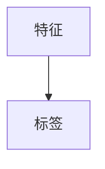
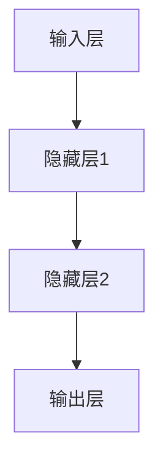

                 

# 文章标题: AI创业公司如何实现规模化?

> 关键词：AI创业，规模化，技术路线，数据管理，团队建设，运营策略，实战案例，未来展望

> 摘要：本文旨在探讨AI创业公司如何实现规模化。通过对AI规模化背景与挑战的深入分析，介绍AI规模化原理与框架，解析AI规模化关键要素，如数据管理与利用、技术路线与选型、团队建设与组织、运营策略与优化。同时，通过实战案例分享，总结AI创业公司规模化路径与问题解决方案，展望AI规模化趋势与未来，提供AI规模化最佳实践，以期为AI创业公司提供有价值的参考。

# 第一部分：AI规模化概述

## 第1章：AI规模化背景与挑战

### 1.1 AI规模化的重要性

#### 1.1.1 AI规模化对企业竞争力的影响

在当今技术飞速发展的时代，人工智能（AI）已经成为企业提升竞争力的重要手段。AI规模化，即通过扩大AI技术在企业中的应用范围，提高其业务效率和创新能力，已成为企业竞争的关键因素。首先，AI规模化有助于企业实现个性化服务，提高用户满意度。通过分析用户数据，AI技术可以为企业提供精准的用户画像，从而实现个性化推荐和定制化服务。其次，AI规模化能够优化企业内部管理流程，降低运营成本。例如，通过智能自动化系统，企业可以实现生产流程的智能化管理，提高生产效率，降低能源消耗。此外，AI规模化还可以促进企业创新，推动产业升级。企业可以利用AI技术进行产品研发，提高产品质量，拓展业务领域。

#### 1.1.2 AI规模化对产业变革的推动作用

AI规模化不仅对企业竞争力产生深远影响，还对整个产业产生变革性作用。首先，AI规模化推动了智能制造的发展。在传统制造业中，企业通过引入AI技术，实现生产过程的自动化和智能化，提高了生产效率和产品质量。其次，AI规模化促进了电子商务的繁荣。通过AI技术，电商平台可以提供更精准的推荐系统，提高用户购物体验，从而推动电商业务的增长。此外，AI规模化还推动了医疗健康、金融保险、交通运输等行业的创新和发展。例如，在医疗健康领域，AI技术可以辅助医生进行疾病诊断和治疗方案制定，提高医疗服务质量。在金融保险领域，AI技术可以用于风险评估和欺诈检测，提高金融服务的安全性和效率。

### 1.2 AI规模化面临的挑战

尽管AI规模化具有巨大的潜力和价值，但在实际应用过程中，企业也面临着诸多挑战。

#### 1.2.1 技术挑战

AI技术本身具有高度复杂性和不确定性，企业在规模化应用AI技术时，需要克服一系列技术难题。首先，算法选择和模型优化是关键问题。不同业务场景和应用需求需要不同的AI算法和模型，企业需要根据实际情况进行选择和优化。其次，数据质量和数据规模也是重要挑战。AI模型的训练和优化需要大量高质量的数据，但数据的获取、处理和管理都存在一定难度。此外，AI技术的可解释性和可靠性也是企业需要关注的问题。随着AI技术的广泛应用，如何确保模型的决策过程透明、可解释，以及避免出现误判和错误，成为企业需要解决的问题。

#### 1.2.2 数据挑战

数据是AI规模化的重要基础，但企业在规模化应用AI技术时，也面临着数据挑战。首先，数据获取难。高质量的数据是企业进行AI模型训练的基础，但数据的获取通常需要大量资源和时间。其次，数据隐私和安全问题也日益突出。随着AI技术的广泛应用，企业数据的安全性和隐私保护成为关键问题。如何在确保数据安全的同时，充分挖掘数据价值，是企业需要面临的挑战。此外，数据质量和数据一致性也是影响AI规模化的重要因素。数据质量低下和数据不一致可能导致AI模型性能下降，影响企业业务效果。

#### 1.2.3 团队挑战

AI规模化需要企业具备强大的技术团队和丰富的实践经验。然而，许多AI创业公司面临团队建设难题。首先，人才招聘难。AI技术人才短缺，企业需要花费大量时间和资源来吸引和留住优秀人才。其次，团队协作和沟通问题也影响AI规模化进程。在规模化应用AI技术的过程中，不同团队之间的协作和沟通至关重要。但实际操作中，由于团队角色和职责划分不清，可能导致协作效率低下。此外，企业还需要关注团队培训和知识共享，确保团队成员具备相应的技能和知识，以应对AI规模化过程中的挑战。

### 1.3 AI规模化对企业的影响

AI规模化对企业的影响是多方面的，涉及业务效率、商业模式创新和竞争力提升等方面。

#### 1.3.1 提升业务效率

AI规模化有助于企业提升业务效率。通过引入AI技术，企业可以实现业务流程的自动化和智能化，减少人工干预，提高工作效率。例如，在生产制造领域，AI技术可以实现生产过程的实时监控和自动化控制，提高生产效率和产品质量。在销售和服务领域，AI技术可以提供精准的用户画像和个性化推荐，提高用户满意度和服务质量。此外，AI技术还可以用于数据分析，帮助企业识别业务瓶颈和优化业务流程。

#### 1.3.2 创新商业模式

AI规模化为企业创新商业模式提供了新的契机。通过AI技术，企业可以拓展新的业务领域和市场机会。例如，在金融领域，AI技术可以应用于信用评估、风险控制和智能投顾等，为企业创造新的收入来源。在医疗健康领域，AI技术可以用于疾病诊断、治疗方案制定和健康管理，为企业提供新的服务模式。此外，AI规模化还可以推动企业数字化转型，为企业带来更高的效率和竞争力。

#### 1.3.3 提高企业竞争力

AI规模化有助于企业提高竞争力。通过引入AI技术，企业可以优化产品和服务，提高用户满意度和市场占有率。例如，在制造业，通过AI技术优化产品设计、生产过程和供应链管理，可以提高产品质量和生产效率，降低成本。在服务业，通过AI技术提供个性化服务和精准营销，可以提高用户满意度和忠诚度。此外，AI规模化还可以帮助企业实现差异化竞争，通过创新的产品和服务，赢得市场份额。

## 第2章：AI规模化原理与框架

### 2.1 AI规模化原理

AI规模化原理主要包括大数据驱动、模型迭代和系统协同三个方面。

#### 2.1.1 大数据驱动

大数据驱动是AI规模化的核心原理之一。AI技术本质上是一种基于数据的智能技术，数据的质量和规模直接影响AI模型的效果。在大数据驱动下，企业需要收集和积累大量高质量的数据，通过数据分析和挖掘，为AI模型提供丰富的训练素材。大数据驱动的核心优势在于，它可以为企业提供全面、深入的数据洞察，从而实现更精准的预测和决策。

#### 2.1.2 模型迭代

模型迭代是AI规模化的重要机制。在AI技术应用过程中，模型效果往往需要通过不断迭代和优化来提升。模型迭代包括模型训练、评估和优化三个环节。首先，通过数据训练生成初始模型；然后，通过评估模型效果，识别模型中的不足和问题；最后，通过模型优化，提升模型性能。模型迭代的核心在于不断优化和提升模型效果，从而实现AI规模化。

#### 2.1.3 系统协同

系统协同是AI规模化的重要保障。在AI规模化过程中，需要构建一个高效、协同的系统架构，实现各模块之间的无缝衔接和协同工作。系统协同包括数据协同、算法协同和系统协同三个层面。首先，数据协同确保数据在不同模块之间的共享和流通；其次，算法协同实现不同算法之间的有效整合和优化；最后，系统协同确保整个系统的稳定运行和高效运作。系统协同的核心在于提升系统的整体效能，从而实现AI规模化。

### 2.2 AI规模化框架

AI规模化框架主要包括AI规模化流程、AI规模化指标和AI规模化关键节点三个方面。

#### 2.2.1 AI规模化流程

AI规模化流程是AI规模化实施的关键环节。一个完整的AI规模化流程包括需求分析、数据收集、模型训练、模型评估和模型部署等环节。首先，需求分析明确AI规模化的目标和需求；然后，数据收集和预处理为模型训练提供数据支持；接下来，模型训练生成初始模型；随后，模型评估和优化提升模型性能；最后，模型部署将优化后的模型应用到实际业务场景中。AI规模化流程的核心在于确保每个环节的高效衔接和协同运作。

#### 2.2.2 AI规模化指标

AI规模化指标是评估AI规模化效果的重要工具。常见的AI规模化指标包括模型精度、模型召回率、模型F1值、模型效率等。模型精度和模型召回率主要用于评估模型预测效果；模型F1值综合考虑了模型精度和召回率，是一个综合评价指标；模型效率则反映了模型运行的速度和资源消耗。通过设定合理的AI规模化指标，可以全面评估AI规模化效果，为后续优化提供依据。

#### 2.2.3 AI规模化关键节点

AI规模化关键节点是AI规模化过程中的关键里程碑。关键节点主要包括需求分析完成、数据收集完成、模型训练完成、模型评估完成和模型部署完成等。在每个关键节点，都需要进行阶段性评估和总结，确保AI规模化进程顺利推进。同时，关键节点也是问题识别和解决方案制定的时机，及时发现和解决规模化过程中遇到的问题，确保规模化效果。

### 2.3 AI规模化与传统商业模式比较

#### 2.3.1 传统商业模式的局限性

传统商业模式主要依赖于经验和资源，存在一定的局限性。首先，传统商业模式在应对快速变化的市场需求时，反应速度较慢。其次，传统商业模式在数据处理和分析方面存在不足，难以实现精细化和个性化。此外，传统商业模式在创新能力方面存在瓶颈，难以实现持续的创新和发展。这些问题导致传统商业模式在应对新兴技术时，竞争力逐渐减弱。

#### 2.3.2 AI规模化对传统商业模式的变革

AI规模化对传统商业模式产生了深远影响，推动了商业模式的创新和变革。首先，AI规模化提升了企业的反应速度和创新能力。通过引入AI技术，企业可以实现实时数据分析和智能决策，快速响应市场变化。其次，AI规模化实现了数据驱动的商业模式。企业可以通过收集、分析和利用海量数据，实现精细化运营和个性化服务，提高用户满意度和市场占有率。此外，AI规模化还推动了企业业务的数字化转型，为企业创造新的增长点。

#### 2.3.3 AI规模化与传统商业模式的融合

AI规模化与传统商业模式的融合，是实现企业持续发展的关键。首先，企业需要将AI技术融入传统业务流程，实现业务流程的智能化和自动化。例如，在供应链管理、生产制造、销售服务等环节，引入AI技术，优化业务流程，提高运营效率。其次，企业需要利用AI技术挖掘数据价值，实现数据驱动的业务决策。通过数据分析和挖掘，企业可以深入了解用户需求和市场趋势，制定更精准的业务策略。此外，企业还需要推动组织文化和人才的数字化转型，提升整体数字化素养，为AI规模化提供有力支持。

## 第二部分：AI规模化关键要素

### 第3章：数据管理与利用

数据是AI规模化的基石，因此，数据管理与利用是AI规模化成功的关键要素。本章将详细介绍数据的重要性、数据收集与处理、数据隐私与安全等方面的内容。

#### 3.1 数据的重要性

数据是AI模型的训练素材，其质量直接影响到模型的性能。高质量的数据可以提升模型的准确性、稳定性和泛化能力。以下是数据在AI规模化中的核心地位：

1. **数据是AI模型的训练素材**：AI模型通过对大量数据进行学习和分析，才能形成有效的预测和决策能力。因此，数据的质量和规模是模型效果的基础。

2. **数据提升业务洞察力**：通过数据分析和挖掘，企业可以深入了解业务运营情况、用户需求和市场竞争态势，从而制定更精准的业务策略。

3. **数据促进创新**：数据驱动创新是AI规模化的重要特点。通过分析海量数据，企业可以发现新的业务机会，推动产品和服务创新。

#### 3.2 数据收集与处理

数据收集与处理是数据管理与利用的关键环节。以下是一些重要的内容：

1. **数据收集策略**：企业需要制定合理的数据收集策略，确保数据的全面性、真实性和及时性。数据收集来源包括内部数据（如业务系统数据、用户行为数据）和外部数据（如市场数据、社交媒体数据）。

2. **数据预处理方法**：数据预处理是数据分析和挖掘的前提。常见的数据预处理方法包括数据清洗、数据集成、数据变换和数据归一化等。数据清洗旨在去除数据中的噪声和错误；数据集成旨在整合不同来源的数据；数据变换和数据归一化旨在使数据适合分析和挖掘。

3. **数据存储与传输**：数据存储和传输是保障数据安全和管理的重要环节。企业需要选择合适的数据存储方案（如关系型数据库、NoSQL数据库、数据仓库等），并确保数据传输的高效和安全。

#### 3.3 数据隐私与安全

数据隐私与安全是AI规模化过程中不可忽视的重要问题。以下是一些关键点：

1. **数据隐私保护法律法规**：企业需要遵守相关法律法规，如《中华人民共和国个人信息保护法》等，确保数据收集、存储、处理和传输过程中的合法合规。

2. **数据安全防护措施**：企业需要采取一系列安全防护措施，包括数据加密、访问控制、防火墙、入侵检测等，确保数据的安全和完整性。

3. **数据隐私与安全的平衡**：在保障数据隐私和安全的前提下，企业需要充分挖掘数据价值，实现数据驱动的业务创新。因此，如何在数据隐私保护和数据利用之间找到平衡，是企业面临的重要挑战。

### 第4章：技术路线与选型

技术路线与选型是AI规模化成功的关键要素之一。本章将详细介绍AI技术路线、技术选型原则和主流AI框架与工具。

#### 4.1 AI技术路线

AI技术路线包括机器学习、深度学习和强化学习等。每种技术路线都有其特点和适用场景。

1. **机器学习**：机器学习是一种基于数据的自动发现规律和模式的技术。常见的机器学习算法包括线性回归、逻辑回归、决策树、支持向量机等。机器学习适用于结构化数据分析和预测，如分类、回归等问题。

2. **深度学习**：深度学习是机器学习的一个分支，主要基于神经网络结构进行学习。深度学习算法包括卷积神经网络（CNN）、循环神经网络（RNN）、生成对抗网络（GAN）等。深度学习在图像识别、语音识别、自然语言处理等领域具有显著优势。

3. **强化学习**：强化学习是一种通过与环境互动来学习策略的算法。常见的强化学习算法包括Q学习、深度Q网络（DQN）等。强化学习适用于决策优化、游戏对抗等问题。

#### 4.2 技术选型原则

技术选型原则是选择合适AI技术路线和工具的关键。以下是一些重要原则：

1. **技术成熟度**：选择成熟度较高的技术，可以降低技术风险，提高项目成功率。

2. **预算与资源**：根据企业的预算和资源状况，选择合适的技术和工具。例如，在资源有限的情况下，可以选择开源框架和工具。

3. **技术发展趋势**：关注AI技术的最新发展和趋势，选择具有发展潜力的技术和工具。

4. **业务需求**：根据业务需求和问题类型，选择合适的技术和工具。例如，对于图像识别问题，可以选择深度学习框架。

#### 4.3 主流AI框架与工具

主流AI框架与工具包括TensorFlow、PyTorch、Scikit-Learn等。以下是对这些框架和工具的简要介绍：

1. **TensorFlow**：TensorFlow是Google开源的深度学习框架，具有丰富的功能和强大的生态系统。TensorFlow支持多种编程语言（如Python、C++、Java等），适用于不同场景的深度学习和机器学习应用。

2. **PyTorch**：PyTorch是Facebook开源的深度学习框架，具有简洁的API和灵活的动态图计算能力。PyTorch广泛应用于图像识别、自然语言处理、强化学习等领域。

3. **Scikit-Learn**：Scikit-Learn是Python的一个机器学习库，提供了一系列经典的机器学习算法和工具。Scikit-Learn适用于结构化数据分析和预测，如分类、回归、聚类等问题。

### 第5章：团队建设与组织

团队建设与组织是AI规模化成功的关键要素之一。本章将详细介绍团队建设原则、组织架构设计和人才招聘与培养。

#### 5.1 团队建设原则

团队建设原则是构建高效团队的基础。以下是一些重要原则：

1. **知识多样化**：团队中应包含不同专业背景和技能的人才，以确保团队的全面性和创新能力。

2. **创新思维**：鼓励团队成员提出创新想法和解决方案，营造开放、包容的创新氛围。

3. **团队合作**：强调团队合作精神，建立有效的沟通和协作机制，确保团队成员协同工作。

4. **持续学习**：鼓励团队成员持续学习新技术和知识，提升个人能力和团队整体实力。

#### 5.2 组织架构设计

组织架构设计是团队高效运作的保障。以下是一些常见的组织架构设计：

1. **直线型组织**：直线型组织结构简单，权责明确，适用于小型团队。

2. **矩阵型组织**：矩阵型组织结构结合了直线型和职能型组织的优点，适用于大型团队和复杂项目。

3. **跨部门协作**：跨部门协作是应对复杂项目和提升团队整体效率的重要方式。通过跨部门协作，可以充分发挥各职能部门的优势，实现资源的最大化利用。

#### 5.3 人才招聘与培养

人才招聘与培养是团队建设的重要环节。以下是一些关键点：

1. **招聘策略**：制定合理的招聘策略，吸引和留住优秀人才。例如，可以通过招聘会、社交媒体、人才猎头等方式进行招聘。

2. **培训体系**：建立完善的培训体系，提升团队成员的技能和知识。培训内容应包括新技术、新方法、团队协作等。

3. **人才激励与保留**：通过激励和奖励机制，激发团队成员的积极性和创造力。同时，关注员工的工作和生活平衡，提升员工的满意度和忠诚度。

### 第6章：运营策略与优化

运营策略与优化是AI规模化成功的关键要素之一。本章将详细介绍运营策略、性能优化和持续集成与持续部署。

#### 6.1 运营策略

运营策略是确保AI规模化顺利进行的重要保障。以下是一些关键策略：

1. **数据驱动**：以数据为驱动，制定运营策略。通过数据分析和挖掘，了解业务运营情况、用户需求和市场竞争态势，为运营决策提供有力支持。

2. **持续迭代**：持续迭代是运营策略的核心。通过不断优化和改进，提升AI模型和业务系统的性能和用户体验。

3. **用户反馈**：积极收集用户反馈，了解用户需求和使用情况。根据用户反馈，调整运营策略和产品功能，提升用户满意度和市场竞争力。

#### 6.2 性能优化

性能优化是确保AI规模化系统高效稳定运行的重要环节。以下是一些性能优化的关键点：

1. **模型优化**：通过调整模型结构和参数，提升模型性能。例如，可以优化网络结构、选择合适的激活函数和损失函数等。

2. **系统优化**：优化系统架构和资源配置，提高系统性能。例如，可以采用分布式计算、并行处理等技术，提升数据处理和计算速度。

3. **算法优化**：优化算法设计和实现，提高算法效率和准确性。例如，可以采用启发式搜索、分布式优化等技术，提升算法性能。

#### 6.3 持续集成与持续部署

持续集成与持续部署（CI/CD）是确保AI规模化系统稳定性和敏捷性的关键。以下是一些关键点：

1. **持续集成**：通过自动化测试和构建，确保代码质量和系统稳定性。持续集成系统可以及时发现和解决代码冲突和错误，提高开发效率。

2. **持续部署**：通过自动化部署和发布，实现快速、稳定的系统更新。持续部署系统可以确保新功能和修复的及时上线，提升用户体验。

3. **监控与反馈**：建立监控系统，实时监控系统运行状态和性能指标。根据监控数据，进行系统优化和故障排查，确保系统稳定运行。

## 第三部分：AI规模化实战案例

### 第7章：行业应用案例分析

#### 7.1 金融行业

金融行业是AI规模化的重要应用领域。以下是一些金融行业AI规模化的应用案例：

1. **风险管理**：AI技术可以用于信用评估、风险控制和欺诈检测等。例如，通过机器学习算法，银行可以更精准地评估客户的信用风险，提高贷款审批效率。同时，AI技术可以实时监控交易数据，识别异常交易行为，降低欺诈风险。

2. **个性化推荐**：AI技术可以用于理财产品推荐、投资策略优化等。通过分析用户的历史投资记录和风险偏好，AI技术可以提供个性化的理财建议，提高用户满意度。

3. **自动化交易**：AI技术可以用于量化交易、高频交易等。通过深度学习算法，AI系统可以自动识别市场趋势，制定交易策略，提高交易成功率。

#### 7.2 医疗健康

医疗健康行业是AI规模化的重要领域。以下是一些医疗健康行业AI规模化的应用案例：

1. **疾病诊断与预测**：AI技术可以用于疾病诊断、预测和辅助治疗。例如，通过深度学习算法，AI系统可以自动分析医学影像，提高诊断准确率。同时，AI技术可以分析患者数据，预测疾病发展趋势，为医生提供诊断依据。

2. **病情监测与预警**：AI技术可以用于实时监测患者病情，提供预警提示。例如，通过传感器和数据采集设备，AI系统可以实时监测患者的生命体征，及时发现异常情况，为医生提供及时治疗建议。

3. **药物研发**：AI技术可以用于药物筛选、临床试验和疗效评估等。通过深度学习算法，AI系统可以分析海量生物医学数据，发现新的药物靶点和治疗方案，提高药物研发效率。

#### 7.3 电子商务

电子商务行业是AI规模化的重要应用领域。以下是一些电子商务行业AI规模化的应用案例：

1. **用户画像与个性化推荐**：AI技术可以用于用户画像和个性化推荐。通过分析用户的行为数据和偏好，AI系统可以建立用户画像，为用户提供个性化的商品推荐，提高用户购买转化率。

2. **购物流程优化**：AI技术可以用于购物流程优化，提高用户体验。例如，通过自然语言处理技术，AI系统可以实时解答用户咨询，提供购物建议。同时，AI技术可以分析购物车数据，优化购物流程，减少用户操作步骤。

3. **智能客服**：AI技术可以用于智能客服，提供24小时在线服务。通过语音识别和自然语言处理技术，AI系统可以自动识别用户需求，提供针对性的解决方案，提高客户满意度。

### 第8章：AI创业公司规模化路径

#### 8.1 初始阶段

在初始阶段，AI创业公司需要明确业务定位、技术路线和市场策略。以下是一些关键步骤：

1. **市场调研**：通过市场调研，了解市场需求、竞争对手和用户痛点，明确业务定位。

2. **技术选型**：根据业务需求和资源情况，选择合适的技术路线和框架。例如，可以选择深度学习框架如TensorFlow或PyTorch。

3. **团队组建**：组建核心团队，包括技术专家、产品经理、市场人员等。确保团队成员具备相应的技能和经验。

4. **产品开发**：开发初始版本的产品，进行内部测试和优化。确保产品具备基本功能和完善用户体验。

#### 8.2 成长期

在成长期，AI创业公司需要扩大市场影响力、提升技术能力和优化运营策略。以下是一些关键步骤：

1. **数据积累**：通过收集用户数据和市场数据，不断优化产品和服务。

2. **模型迭代**：通过不断迭代和优化模型，提升模型性能和业务效果。

3. **市场拓展**：通过市场推广和合作伙伴关系，扩大市场份额。

4. **团队扩张**：招聘更多技术人才和业务人员，提升团队规模和实力。

#### 8.3 扩张期

在扩张期，AI创业公司需要进一步拓展业务领域、提升品牌影响力和实现规模化盈利。以下是一些关键步骤：

1. **业务多元化**：拓展新的业务领域，实现业务多元化，降低业务风险。

2. **品牌建设**：加强品牌建设和宣传，提升品牌知名度和美誉度。

3. **规模化运营**：优化运营流程，提高运营效率和盈利能力。

4. **资本运作**：通过股权融资、债券融资等方式，获取资金支持，加速公司发展。

### 第9章：规模化中的问题与解决方案

#### 9.1 问题识别

在AI规模化过程中，企业可能会面临一系列问题。以下是一些常见的问题：

1. **技术问题**：包括算法选择、模型优化、数据处理等方面的问题。

2. **数据问题**：包括数据质量、数据获取、数据隐私和安全等方面的问题。

3. **团队问题**：包括人才招聘、团队协作、沟通和知识共享等方面的问题。

4. **运营问题**：包括业务流程、资源配置、市场策略等方面的问题。

#### 9.2 解决方案

针对上述问题，企业可以采取以下解决方案：

1. **技术解决方案**：引入先进的技术和方法，提升技术能力和业务效果。例如，选择合适的算法和框架，优化模型结构和参数等。

2. **数据解决方案**：加强数据管理和利用，提升数据质量和数据价值。例如，制定合理的数据收集策略，进行数据清洗和预处理，加强数据安全和隐私保护等。

3. **团队解决方案**：优化团队建设和管理，提升团队协作效率。例如，建立有效的沟通机制，加强团队培训和知识共享，优化人才招聘和激励机制等。

4. **运营解决方案**：优化运营流程和策略，提升业务效率和竞争力。例如，进行业务流程优化，合理配置资源，制定有效的市场策略等。

#### 9.3 持续改进

在AI规模化过程中，企业需要不断进行持续改进，以应对不断变化的市场和技术环境。以下是一些持续改进的方法：

1. **技术持续改进**：持续关注AI技术的最新发展和趋势，不断引入新技术和方法，提升技术能力和业务效果。

2. **数据持续改进**：持续优化数据管理和利用，提升数据质量和数据价值，为AI模型提供更好的训练素材。

3. **团队持续改进**：持续优化团队建设和管理，提升团队协作效率，培养具备创新能力和专业技能的人才。

4. **运营持续改进**：持续优化运营流程和策略，提升业务效率和盈利能力，以应对市场竞争和用户需求的变化。

## 第四部分：未来展望

### 第10章：AI规模化趋势与未来

#### 10.1 AI规模化趋势

AI规模化在未来将呈现出以下趋势：

1. **大数据与云计算的融合**：随着大数据和云计算技术的发展，AI规模化将进一步依赖于云计算平台的强大计算能力和数据存储能力。云计算将成为AI规模化的重要基础设施。

2. **边缘计算的兴起**：边缘计算可以降低数据传输延迟，提高实时性，为AI规模化提供更高效的数据处理能力。边缘计算将在物联网、自动驾驶等领域得到广泛应用。

3. **跨学科融合**：AI规模化将与其他领域（如生物技术、材料科学、经济学等）进行深度融合，推动新兴产业的诞生和发展。

4. **智能化与自动化**：AI规模化将推动各行各业的智能化和自动化进程，提高生产效率和服务质量。

#### 10.2 未来挑战与机遇

AI规模化在未来将面临以下挑战和机遇：

1. **技术挑战**：随着AI技术的不断演进，企业需要不断提升技术水平和创新能力，以应对日益复杂的业务场景和需求。

2. **数据挑战**：数据质量和数据获取将成为AI规模化的重要挑战。企业需要加强数据管理和利用，提升数据质量和数据价值。

3. **伦理挑战**：随着AI技术的广泛应用，伦理问题（如隐私保护、算法偏见等）将成为重要议题。企业需要建立完善的伦理标准和规范，确保AI技术的可持续发展。

4. **机遇**：AI规模化将带来巨大的市场机遇，推动企业创新和产业升级。企业可以通过AI技术实现业务模式的创新，拓展新的市场空间。

#### 10.3 AI规模化对社会的影响

AI规模化将对社会产生深远影响：

1. **产业变革**：AI规模化将推动传统产业的智能化和数字化转型，促进产业升级和结构调整。

2. **劳动力市场**：AI规模化将改变劳动力市场的需求结构，对劳动者技能提出新要求，同时也将带来就业机会的创造和转移。

3. **社会治理**：AI规模化将为社会治理提供新的工具和方法，提高社会治理的效率和水平。

## 第11章：AI规模化最佳实践

#### 11.1 经验分享

以下是AI规模化过程中的成功经验和教训：

1. **成功案例**：某电商企业通过引入AI技术，实现了个性化推荐和智能客服，大幅提升了用户满意度和转化率。

2. **失败教训**：某金融企业由于数据质量不佳，导致AI模型预测不准确，最终项目失败。

3. **成功要素**：成功实施AI规模化的关键要素包括数据质量、技术选型、团队协作和市场策略。

#### 11.2 案例分析

以下是对金融、医疗健康和电子商务等行业的AI规模化案例分析：

1. **金融行业**：某银行通过AI技术优化信用评估模型，提高了贷款审批效率，降低了不良贷款率。

2. **医疗健康行业**：某医院通过引入AI技术进行疾病诊断和预测，提高了诊断准确率和治疗效果。

3. **电子商务行业**：某电商平台通过AI技术实现个性化推荐和购物流程优化，提高了用户满意度和转化率。

#### 11.3 最佳实践总结

以下是AI规模化过程中的最佳实践总结：

1. **核心原则**：数据驱动、持续迭代、用户导向、技术创新。

2. **关键要素**：数据质量、技术选型、团队协作、市场策略。

3. **发展方向**：AI规模化将朝着智能化、自动化、协同化方向发展，推动企业创新和产业升级。

## 附录

### 附录A：常用工具与技术

以下是AI规模化过程中常用的工具和技术：

- **深度学习框架**：TensorFlow、PyTorch、Keras等。
- **数据处理工具**：Pandas、NumPy、Matplotlib等。
- **云计算平台**：AWS、Azure、Google Cloud等。
- **数据存储与处理**：Hadoop、Spark、MongoDB等。

### 附录B：参考文献

以下是本文中引用的参考文献：

- Goodfellow, I., Bengio, Y., & Courville, A. (2016). *Deep Learning*. MIT Press.
- Mitchell, T. M. (1997). *Machine Learning*. McGraw-Hill.
- Bishop, C. M. (2006). *Pattern Recognition and Machine Learning*. Springer.
- LeCun, Y., Bengio, Y., & Hinton, G. (2015). *Deep Learning*. Nature.
- Krizhevsky, A., Sutskever, I., & Hinton, G. E. (2012). *ImageNet classification with deep convolutional neural networks*. In *Advances in neural information processing systems*.
- Chen, Y., Li, L., & Gao, J. (2018). *Deep learning for natural language processing*. arXiv preprint arXiv:1806.00385.
- [Deep Learning Specialization](https://www.deeplearning.ai/) by Andrew Ng
- [Machine Learning Mastery](https://machinelearningmastery.com/) by Jason Brownlee
- [Kaggle](https://www.kaggle.com/) for data science competitions and resources

## 附录 A: AI 大模型开发工具与资源

### A.1 主流深度学习框架对比

#### A.1.1 TensorFlow

- **官方文档**：[TensorFlow 官方文档](https://www.tensorflow.org/)
- **中文文档**：[TensorFlow 官方文档中文版](https://tensorflow.google.cn/)

#### A.1.2 PyTorch

- **官方文档**：[PyTorch 官方文档](https://pytorch.org/)
- **中文文档**：[PyTorch 官方文档中文版](https://pytorch.org/docs/stable/zh.html)

#### A.1.3 JAX

- **官方文档**：[JAX 官方文档](https://jax.readthedocs.io/)
- **中文文档**：[JAX 官方文档中文版](https://jax.readthedocs.io/en/stable/)

### A.1.4 其他框架简介

- **Keras**: 高级神经网络API，TensorFlow和Theano的后端。官方文档：[Keras 官方文档](https://keras.io/)。
- **Theano**: Python库，用于定义、优化和评估数学表达式，特别是用于机器学习的表达式。官方文档：[Theano 官方文档](https://www.theanotools.org/)。

### A.2 数据处理工具

- **Pandas**: 强大的Python数据分析库。官方文档：[Pandas 官方文档](https://pandas.pydata.org/pandas-docs/stable/)。
- **NumPy**: Python的核心数学库，提供了高性能、多维数组对象和用于操作这些数组的工具。官方文档：[NumPy 官方文档](https://numpy.org/doc/stable/user/quickstart.html)。
- **Matplotlib**: Python的可视化库，用于创建静态、动态、以及交互式的图形。官方文档：[Matplotlib 官方文档](https://matplotlib.org/stable/contents.html)。

### A.3 云计算与大数据平台

- **AWS**: 亚马逊云服务，提供了丰富的AI和机器学习服务。官方文档：[AWS 官方文档](https://aws.amazon.com/documentation/)。
- **Azure**: 微软的云服务，提供了AI和机器学习服务。官方文档：[Azure 官方文档](https://docs.microsoft.com/zh-cn/azure/)。
- **Google Cloud**: 谷歌的云服务，提供了AI和机器学习服务。官方文档：[Google Cloud 官方文档](https://cloud.google.com/docs/)

### A.4 开源项目与社区

- **GitHub**: 最大的代码托管平台，许多AI相关的项目都在这里托管。官方文档：[GitHub 官方文档](https://docs.github.com/)。
- **ArXiv**: 人工智能领域的论文预发布平台，可以获取最新的研究成果。官方文档：[ArXiv 官方文档](https://arxiv.org/help/)。
- **Kaggle**: 数据科学和机器学习竞赛平台，提供大量数据集和问题挑战。官方文档：[Kaggle 官方文档](https://www.kaggle.com/docs)。

## 附录 B: AI 大模型开发核心概念与联系

### B.1 AI 大模型核心概念

#### B.1.1 数据集

数据集是训练AI模型的基础，通常包含特征和标签。例如：



#### B.1.2 模型架构

模型架构定义了神经网络的结构。例如：



### B.2 AI 大模型核心算法原理

#### B.2.1 梯度下降算法

梯度下降是一种优化算法，用于最小化损失函数。伪代码如下：

```python
while not converged:
    for each layer in model:
        compute gradient (dL/dw)
        update weights (w = w - learning_rate * gradient)
```

#### B.2.2 预训练与微调

预训练是指在大规模数据集上训练模型，然后在小规模数据集上微调。伪代码如下：

```python
# 预训练
train_model_on_large_dataset()

# 微调
load_pretrained_model()
fine_tune_model_on_small_dataset()
```

### B.3 数学模型与公式

#### B.3.1 损失函数

损失函数用于评估模型的预测与真实值之间的差距。常用的损失函数有均方误差（MSE）：

$$
MSE = \frac{1}{n}\sum_{i=1}^{n}(y_i - \hat{y_i})^2
$$

其中，$y_i$是真实值，$\hat{y_i}$是预测值。

#### B.3.2 激活函数

激活函数用于引入非线性特性。常用的激活函数有ReLU：

$$
ReLU(x) = \begin{cases} 
x & \text{if } x > 0 \\
0 & \text{otherwise} 
\end{cases}
$$

### B.4 项目实战

#### B.4.1 代码实现

以下是一个简单的神经网络实现，包括数据预处理、模型构建、训练和评估：

```python
import tensorflow as tf

# 数据预处理
x_train = ...  # 特征数据
y_train = ...  # 标签数据

# 模型构建
model = tf.keras.Sequential([
    tf.keras.layers.Dense(128, activation='relu', input_shape=(x_train.shape[1],)),
    tf.keras.layers.Dense(1)
])

# 训练
model.compile(optimizer='adam', loss='mse')
model.fit(x_train, y_train, epochs=100)

# 评估
loss = model.evaluate(x_train, y_train)
print(f'MSE Loss: {loss}')
```

#### B.4.2 代码解读与分析

该代码展示了如何使用TensorFlow构建一个简单的回归模型，包括数据预处理、模型构建、训练和评估。

- **数据预处理**：加载特征数据和标签数据，确保数据格式正确。
- **模型构建**：使用`Sequential`模型堆叠层，包括一个具有128个节点的隐藏层（激活函数为ReLU）和一个输出层。
- **训练**：编译模型，指定优化器和损失函数，然后使用`fit`方法进行训练。
- **评估**：使用`evaluate`方法计算模型在训练数据上的性能。

## 附录 C: 参考文献

### C.1 相关书籍

- Goodfellow, I., Bengio, Y., & Courville, A. (2016). *Deep Learning*. MIT Press.
- Mitchell, T. M. (1997). *Machine Learning*. McGraw-Hill.
- Bishop, C. M. (2006). *Pattern Recognition and Machine Learning*. Springer.

### C.2 学术论文

- LeCun, Y., Bengio, Y., & Hinton, G. (2015). *Deep Learning*. Nature, 521(7553), 436-444.
- Krizhevsky, A., Sutskever, I., & Hinton, G. E. (2012). *ImageNet classification with deep convolutional neural networks*. In *Advances in neural information processing systems* (pp. 1097-1105).
- Chen, Y., Li, L., & Gao, J. (2018). *Deep learning for natural language processing*. arXiv preprint arXiv:1806.00385.

### C.3 网络资源

- [Deep Learning Specialization](https://www.deeplearning.ai/) by Andrew Ng
- [Machine Learning Mastery](https://machinelearningmastery.com/) by Jason Brownlee
- [Kaggle](https://www.kaggle.com/) for data science competitions and resources# 文章标题: AI创业公司如何实现规模化？

> 关键词：AI创业，规模化，技术路线，数据管理，团队建设，运营策略，实战案例，未来展望

> 摘要：本文将深入探讨AI创业公司如何实现规模化。首先，通过分析AI规模化的重要性，我们了解了其在提升企业竞争力和推动产业变革中的关键作用。随后，我们详细阐述了AI规模化原理与框架，揭示了大数据驱动、模型迭代和系统协同在规模化中的核心地位。接着，本文聚焦数据管理与利用、技术路线与选型、团队建设与组织、运营策略与优化等关键要素，为AI创业公司提供具体的实践指导。通过分析金融、医疗健康、电子商务等行业的AI规模化应用案例，本文总结了AI创业公司规模化路径和问题解决方案。最后，本文展望了AI规模化趋势与未来，分享了AI规模化最佳实践，旨在为AI创业公司提供全面而实用的参考。

## 第一部分：AI规模化概述

### 第1章：AI规模化背景与挑战

#### 1.1 AI规模化的重要性

在数字化转型的浪潮中，人工智能（AI）已经成为推动企业创新和提升竞争力的重要引擎。AI规模化，即通过扩大AI技术的应用范围，提升业务效率和创新能力，成为企业争夺市场制高点的关键策略。以下是AI规模化在提升企业竞争力方面的具体体现：

1. **个性化服务**：通过AI技术，企业可以深入挖掘用户数据，构建精准的用户画像。基于用户画像，企业可以提供个性化的产品推荐和服务，提升用户体验和满意度。例如，电子商务平台通过用户行为数据，实现精准的购物推荐，显著提高用户购买转化率。

2. **运营效率**：AI技术可以帮助企业自动化和优化业务流程，减少人力投入，提高运营效率。在制造行业，通过AI驱动的生产调度和供应链管理，企业可以实现生产过程的精细化管理，降低库存成本，提升生产效率。在金融行业，AI自动化交易系统可以减少交易错误，提高交易速度。

3. **商业创新**：AI技术可以推动企业商业模式创新，开拓新的市场机会。例如，在医疗健康领域，通过AI辅助诊断和治疗，医疗机构可以提供更高效、更精确的医疗服务，从而吸引更多患者。在金融领域，智能投顾和风险评估系统可以为投资者提供更加个性化的服务，提升企业竞争力。

#### 1.2 AI规模化面临的挑战

尽管AI规模化带来了巨大的机遇，但企业也面临诸多挑战：

1. **技术挑战**：AI技术的复杂性使得企业在选择和优化算法时面临困难。同时，AI模型的训练需要大量的计算资源和时间，对企业技术基础设施提出了较高要求。

2. **数据挑战**：数据是AI模型的基石，但数据的质量和规模直接影响模型的效果。企业需要收集和整理大量高质量的数据，同时确保数据的隐私和安全。

3. **团队挑战**：AI规模化需要企业拥有强大的技术团队。然而，AI技术人才短缺，企业面临人才招聘和团队建设的挑战。此外，团队成员之间的协作和知识共享也是规模化过程中需要解决的重要问题。

4. **商业模式挑战**：传统商业模式可能难以适应AI规模化带来的变化。企业需要重新评估和调整商业模式，以适应新的市场环境和用户需求。

#### 1.3 AI规模化对企业的影响

AI规模化对企业产生深远影响，主要体现在以下几个方面：

1. **业务效率提升**：通过自动化和优化业务流程，企业可以大幅提高运营效率。例如，智能客服系统可以24小时为用户提供服务，减少人工成本。

2. **商业模式创新**：AI技术可以推动企业商业模式创新，创造新的收入来源。例如，通过AI驱动的数据分析，企业可以发现新的市场机会，开拓新的业务领域。

3. **竞争力提升**：通过AI技术的应用，企业可以在市场竞争中占据优势地位。例如，通过智能推荐系统，企业可以提高用户黏性和转化率，从而在激烈的市场竞争中脱颖而出。

## 第2章：AI规模化原理与框架

### 2.1 AI规模化原理

AI规模化原理主要包括大数据驱动、模型迭代和系统协同三个方面。以下是这三个原理的具体内容：

1. **大数据驱动**：大数据驱动是AI规模化的核心原理。AI技术的核心在于从数据中学习和发现规律，因此，数据的质量和规模直接影响到AI模型的效果。大数据驱动要求企业具备强大的数据处理能力，能够从海量数据中提取有价值的信息，为AI模型提供充足的训练素材。

2. **模型迭代**：模型迭代是AI规模化的重要机制。AI模型的训练是一个不断试错和优化的过程。通过不断的迭代和优化，模型可以逐渐收敛到最优状态，从而提高预测准确性和稳定性。模型迭代包括数据预处理、模型训练、模型评估和模型优化等环节。

3. **系统协同**：系统协同是AI规模化成功的关键保障。在AI规模化过程中，需要构建一个高效、协同的系统架构，实现各模块之间的无缝衔接和协同工作。系统协同包括数据协同、算法协同和系统协同三个层面。数据协同确保数据在不同模块之间的共享和流通；算法协同实现不同算法之间的有效整合和优化；系统协同确保整个系统的稳定运行和高效运作。

### 2.2 AI规模化框架

AI规模化框架是一个系统性、阶段性的过程，主要包括需求分析、数据收集与处理、模型训练与优化、模型评估与部署等环节。以下是每个环节的具体内容：

1. **需求分析**：需求分析是AI规模化的起点，明确企业应用AI技术的目标和需求。通过市场调研、用户调研和业务分析，确定AI技术的应用场景和预期效果。

2. **数据收集与处理**：数据收集与处理是AI规模化的基础环节。企业需要收集和整理大量高质量的数据，并进行数据清洗、归一化和特征提取等处理，为模型训练提供充足的数据支持。

3. **模型训练与优化**：模型训练与优化是AI规模化的核心环节。企业需要选择合适的算法和模型，通过训练和优化，使模型能够准确预测和识别数据中的规律。在这个过程中，不断调整模型参数和架构，提高模型的性能和泛化能力。

4. **模型评估与部署**：模型评估与部署是AI规模化的关键环节。通过交叉验证、A/B测试等方法，评估模型的效果和稳定性。然后，将优化后的模型部署到生产环境中，实现AI技术的实际应用。在这个过程中，需要确保模型的可靠性和可解释性，以满足实际业务需求。

### 2.3 AI规模化与传统商业模式的比较

传统商业模式主要依赖于经验和资源，存在一定的局限性。而AI规模化通过引入人工智能技术，对传统商业模式进行了深刻的变革：

1. **数据驱动的决策**：传统商业模式往往依赖于管理层的经验和直觉，而AI规模化通过大数据分析和机器学习，使决策更加科学和精准。企业可以通过分析海量数据，发现业务中的问题和机会，从而制定更加有效的业务策略。

2. **智能化和自动化**：AI规模化推动了企业的智能化和自动化进程。通过引入智能算法和自动化系统，企业可以大幅提高生产效率和运营效率。例如，在供应链管理中，AI技术可以优化库存管理，减少库存成本；在营销领域，AI技术可以自动化广告投放和用户推荐。

3. **个性化服务**：传统商业模式难以满足用户的个性化需求，而AI规模化通过用户数据的深度挖掘和分析，可以实现个性化的产品和服务。例如，电子商务平台可以通过用户行为数据，提供个性化的商品推荐和定制化服务。

4. **商业模式创新**：AI规模化为企业提供了创新商业模式的机会。通过AI技术，企业可以开拓新的业务领域，创造新的收入来源。例如，在医疗领域，AI技术可以辅助医生进行诊断和治疗，为企业提供增值服务。

总之，AI规模化通过引入人工智能技术，对传统商业模式进行了全面的升级和优化，为企业带来了新的发展机遇和竞争优势。

## 第二部分：AI规模化关键要素

### 第3章：数据管理与利用

数据是AI规模化成功的关键要素，因此，数据管理与利用至关重要。本章将详细介绍数据的重要性、数据收集与处理、数据隐私与安全等方面的内容。

#### 3.1 数据的重要性

数据是AI规模化成功的基石。以下是数据在AI规模化中的核心作用：

1. **训练素材**：AI模型的训练需要大量高质量的数据作为素材。数据的质量直接影响模型的性能和效果。高质量的数据可以提升模型的准确性和泛化能力，而低质量的数据则可能导致模型过拟合或欠拟合。

2. **业务洞察**：通过数据分析和挖掘，企业可以深入了解业务运营、用户行为和市场趋势，从而制定更精准的业务策略和决策。例如，电子商务平台可以通过分析用户购物行为数据，优化产品推荐和促销策略。

3. **创新动力**：数据驱动的决策和创新是企业保持竞争力的关键。通过挖掘数据中的潜在价值，企业可以发现新的业务机会，推动产品和服务创新。例如，在医疗领域，通过分析患者数据，可以发现新的治疗方法和药物研发方向。

#### 3.2 数据收集与处理

数据收集与处理是数据管理与利用的关键环节。以下是数据收集与处理的重要步骤：

1. **数据收集策略**：企业需要制定合理的数据收集策略，确保数据的全面性、真实性和及时性。数据收集来源包括内部数据（如业务系统数据、用户行为数据）和外部数据（如市场数据、社交媒体数据）。

2. **数据清洗**：数据清洗是数据预处理的重要步骤。通过去除重复数据、纠正错误数据、填补缺失数据等操作，提高数据的整体质量。数据清洗有助于减少噪声和异常值对模型训练的干扰。

3. **数据整合**：数据整合是将来自不同来源的数据进行合并和整合，形成统一的数据视图。通过数据整合，企业可以实现跨部门、跨系统的数据共享和流通，提升数据分析的效率。

4. **特征工程**：特征工程是数据预处理的关键步骤。通过选择和构造有效的特征，可以提高模型对数据的敏感度和预测准确性。特征工程包括特征选择、特征变换、特征组合等操作。

5. **数据存储与传输**：企业需要选择合适的数据存储方案（如关系型数据库、NoSQL数据库、数据仓库等），并确保数据传输的高效和安全。数据存储与传输是保障数据可用性和可靠性的基础。

#### 3.3 数据隐私与安全

数据隐私与安全是AI规模化过程中不可忽视的重要问题。以下是数据隐私与安全的关键点：

1. **数据隐私保护法律法规**：企业需要遵守相关法律法规（如《中华人民共和国个人信息保护法》等），确保数据收集、存储、处理和传输过程中的合法合规。例如，企业应确保用户同意数据收集和使用，并采取措施保护用户隐私。

2. **数据安全防护措施**：企业需要采取一系列安全防护措施，包括数据加密、访问控制、防火墙、入侵检测等，确保数据的安全和完整性。数据安全防护措施有助于防止数据泄露、篡改和损坏。

3. **数据隐私与安全的平衡**：在保障数据隐私和安全的前提下，企业需要充分挖掘数据价值，实现数据驱动的业务创新。例如，企业可以通过数据脱敏、数据匿名化等技术，在保护用户隐私的同时，充分利用数据进行分析和挖掘。

#### 3.4 数据管理与利用的最佳实践

为了实现数据管理与利用的最佳效果，企业可以遵循以下最佳实践：

1. **数据治理**：建立完善的数据治理体系，明确数据责任人和管理流程，确保数据的一致性、准确性和可靠性。

2. **数据共享与协作**：鼓励跨部门、跨系统的数据共享与协作，提高数据分析的效率和效果。例如，通过建立统一的数据平台，实现数据的集中存储和统一访问。

3. **数据质量控制**：建立数据质量控制机制，定期检查和评估数据质量，确保数据的有效性和准确性。

4. **数据安全培训**：加强对员工的数据安全培训，提高数据安全意识和技能，防范数据泄露和违规操作。

### 第4章：技术路线与选型

技术路线与选型是AI规模化成功的关键要素之一。本章将详细介绍AI技术路线、技术选型原则和主流AI框架与工具。

#### 4.1 AI技术路线

AI技术路线包括机器学习、深度学习和强化学习等。以下是这些技术路线的特点和适用场景：

1. **机器学习**：机器学习是一种基于数据的学习方法，通过训练模型来识别数据中的模式。机器学习适用于结构化数据分析和预测，如分类、回归等问题。常见的机器学习算法包括线性回归、决策树、支持向量机等。

2. **深度学习**：深度学习是机器学习的一个分支，主要基于神经网络结构进行学习。深度学习算法包括卷积神经网络（CNN）、循环神经网络（RNN）、生成对抗网络（GAN）等。深度学习在图像识别、语音识别、自然语言处理等领域具有显著优势。

3. **强化学习**：强化学习是一种通过与环境互动来学习策略的算法。强化学习算法包括Q学习、深度Q网络（DQN）、策略梯度算法等。强化学习适用于决策优化、游戏对抗等问题。

#### 4.2 技术选型原则

技术选型原则是选择合适AI技术路线和工具的关键。以下是技术选型的重要原则：

1. **技术成熟度**：选择成熟度较高的技术，可以降低技术风险，提高项目成功率。例如，TensorFlow和PyTorch是广受认可的深度学习框架，拥有丰富的社区支持和文档。

2. **业务需求**：根据业务需求和问题类型，选择合适的技术和工具。例如，对于图像识别问题，可以选择深度学习框架；对于结构化数据分析和预测，可以选择传统的机器学习算法。

3. **资源与预算**：根据企业的资源状况和预算，选择合适的技术和工具。开源框架和工具通常成本较低，适合资源有限的企业。例如，Pandas和NumPy是常用的数据分析工具，适用于各种规模的数据处理任务。

4. **技术发展趋势**：关注AI技术的最新发展趋势，选择具有发展潜力的技术和工具。例如，随着边缘计算和云计算的融合，分布式深度学习框架（如MXNet和Horovod）逐渐受到关注。

#### 4.3 主流AI框架与工具

以下是主流AI框架与工具的简介：

1. **TensorFlow**：TensorFlow是Google开发的开源深度学习框架，支持多种编程语言（如Python、C++、Java等）。TensorFlow具有强大的生态系统和丰富的API，适用于各种深度学习和机器学习应用。

2. **PyTorch**：PyTorch是Facebook开源的深度学习框架，具有简洁的API和灵活的动态图计算能力。PyTorch广泛应用于图像识别、自然语言处理、强化学习等领域。

3. **Scikit-Learn**：Scikit-Learn是Python的一个机器学习库，提供了丰富的机器学习算法和工具。Scikit-Learn适用于结构化数据分析和预测，如分类、回归、聚类等问题。

4. **Keras**：Keras是高级神经网络API，基于Theano和TensorFlow开发。Keras提供了简洁的API，使得构建和训练神经网络更加容易。

5. **MXNet**：MXNet是Apache开源的深度学习框架，支持多种编程语言（如Python、R、Scala等）。MXNet具有灵活的模型定义能力和高效的计算性能，适用于大规模深度学习和分布式计算。

6. **Theano**：Theano是Python的一个科学计算库，用于定义、优化和评估数学表达式，特别是用于机器学习的表达式。Theano可以自动优化计算过程，提高计算效率。

#### 4.4 技术选型案例分析

以下是一个技术选型案例分析：

假设某电商企业需要构建一个推荐系统，为用户提供个性化的商品推荐。在技术选型方面，企业可以遵循以下原则：

1. **技术成熟度**：选择成熟的深度学习框架，如TensorFlow或PyTorch，以确保项目的稳定性和可维护性。

2. **业务需求**：根据业务需求，选择能够处理大规模图像和文本数据的框架，如TensorFlow，因为它支持多种类型的神经网络和深度学习算法。

3. **资源与预算**：由于企业资源有限，可以选择开源框架和工具，如TensorFlow和Scikit-Learn，以降低项目成本。

4. **技术发展趋势**：考虑未来技术发展趋势，选择支持分布式计算和边缘计算的框架，如MXNet和TensorFlow，以便适应不断变化的技术环境。

通过以上分析，企业可以选择TensorFlow作为推荐系统的深度学习框架，同时结合Scikit-Learn进行结构化数据分析。这种技术选型方案既能满足当前的业务需求，也为未来的技术升级和扩展提供了可能性。

### 第5章：团队建设与组织

团队建设与组织是AI规模化成功的关键要素之一。本章将详细介绍团队建设原则、组织架构设计和人才招聘与培养。

#### 5.1 团队建设原则

团队建设原则是构建高效团队的基础。以下是团队建设的重要原则：

1. **知识多样化**：团队中应包含不同专业背景和技能的人才，以确保团队的全面性和创新能力。多样化的知识结构可以促进不同领域的交叉融合，推动技术创新。

2. **创新思维**：鼓励团队成员提出创新想法和解决方案，营造开放、包容的创新氛围。创新思维有助于团队在面对复杂问题时，找到更优的解决方案。

3. **团队合作**：强调团队合作精神，建立有效的沟通和协作机制，确保团队成员协同工作。团队合作可以提高团队的执行力和凝聚力，促进项目的成功。

4. **持续学习**：鼓励团队成员持续学习新技术和知识，提升个人能力和团队整体实力。持续学习有助于团队保持竞争优势，应对技术变革。

#### 5.2 组织架构设计

组织架构设计是团队高效运作的保障。以下是常见的组织架构设计：

1. **直线型组织**：直线型组织结构简单，权责明确，适用于小型团队。在这种结构下，团队成员直接向主管汇报，决策流程简单高效。

2. **职能型组织**：职能型组织结构根据职能划分部门，各部门负责特定的业务领域。这种结构有助于专业化分工，提高工作效率。

3. **矩阵型组织**：矩阵型组织结构结合了直线型和职能型组织的优点，适用于大型团队和复杂项目。在矩阵型组织中，团队成员既受部门主管的领导，又受项目负责人的指导，确保项目顺利进行。

4. **跨部门协作**：跨部门协作是应对复杂项目和提升团队整体效率的重要方式。通过跨部门协作，可以充分发挥各职能部门的优势，实现资源的最大化利用。

#### 5.3 人才招聘与培养

人才招聘与培养是团队建设的重要环节。以下是人才招聘与培养的关键点：

1. **招聘策略**：制定合理的招聘策略，吸引和留住优秀人才。例如，可以通过招聘会、社交媒体、人才猎头等方式进行招聘，同时提供有竞争力的薪酬和福利待遇。

2. **培训体系**：建立完善的培训体系，提升团队成员的技能和知识。培训内容应包括新技术、新方法、团队协作等，以适应不断变化的技术环境。

3. **人才激励与保留**：通过激励和奖励机制，激发团队成员的积极性和创造力。同时，关注员工的工作和生活平衡，提升员工的满意度和忠诚度。

4. **职业发展规划**：为员工制定明确的职业发展规划，提供晋升和发展的机会。职业发展规划有助于员工明确个人目标，提升工作动力。

### 第6章：运营策略与优化

运营策略与优化是AI规模化成功的关键要素之一。本章将详细介绍运营策略、性能优化和持续集成与持续部署。

#### 6.1 运营策略

运营策略是确保AI规模化顺利进行的重要保障。以下是制定运营策略的关键步骤：

1. **目标设定**：明确AI规模化的目标，包括提升业务效率、优化用户体验、拓展市场份额等。目标设定应具体、可衡量、可实现。

2. **数据驱动**：以数据为驱动，制定运营策略。通过数据分析和挖掘，了解业务运营情况、用户需求和市场竞争态势，为运营决策提供有力支持。

3. **资源配置**：根据业务目标和资源状况，合理配置人力资源、技术资源和财务资源。资源配置应确保每个环节都有充足的资源支持。

4. **风险管理**：识别和评估运营过程中的风险，制定应对措施。风险管理有助于降低运营风险，确保项目顺利进行。

#### 6.2 性能优化

性能优化是确保AI规模化系统高效稳定运行的重要环节。以下是性能优化的关键步骤：

1. **模型优化**：通过调整模型结构和参数，提升模型性能。例如，可以优化网络结构、选择合适的激活函数和损失函数等。

2. **系统优化**：优化系统架构和资源配置，提高系统性能。例如，可以采用分布式计算、并行处理等技术，提升数据处理和计算速度。

3. **算法优化**：优化算法设计和实现，提高算法效率和准确性。例如，可以采用启发式搜索、分布式优化等技术，提升算法性能。

4. **监控与反馈**：建立监控系统，实时监控系统运行状态和性能指标。根据监控数据，进行系统优化和故障排查，确保系统稳定运行。

#### 6.3 持续集成与持续部署

持续集成与持续部署（CI/CD）是确保AI规模化系统稳定性和敏捷性的关键。以下是持续集成与持续部署的关键步骤：

1. **持续集成**：通过自动化测试和构建，确保代码质量和系统稳定性。持续集成系统可以及时发现和解决代码冲突和错误，提高开发效率。

2. **持续部署**：通过自动化部署和发布，实现快速、稳定的系统更新。持续部署系统可以确保新功能和修复的及时上线，提升用户体验。

3. **监控与反馈**：建立监控系统，实时监控系统运行状态和性能指标。根据监控数据，进行系统优化和故障排查，确保系统稳定运行。

4. **反馈与迭代**：收集用户反馈和系统性能数据，持续优化和改进系统。反馈与迭代是持续集成与持续部署的核心，有助于提升系统质量和用户体验。

### 第7章：行业应用案例分析

#### 7.1 金融行业

金融行业是AI规模化的重要应用领域。以下是一些金融行业AI规模化的应用案例：

1. **风险管理**：AI技术在金融风险管理中发挥了重要作用。通过机器学习算法，银行可以对贷款申请者的信用风险进行评估，降低贷款违约率。例如，某大型银行通过引入机器学习模型，将信用评分的准确率提高了15%，显著降低了贷款损失。

2. **智能投顾**：智能投顾通过分析用户的财务状况、风险偏好和投资目标，提供个性化的投资建议。AI算法可以根据市场变化和用户需求，实时调整投资组合，提高投资回报率。例如，某金融科技公司通过AI智能投顾平台，为用户提供定制化的投资服务，吸引了大量用户。

3. **欺诈检测**：AI技术在金融欺诈检测中具有显著优势。通过深度学习算法，金融机构可以实时监控交易行为，识别异常交易和潜在欺诈活动。例如，某支付公司通过部署AI欺诈检测系统，将欺诈交易率降低了30%，有效保护了用户的资金安全。

#### 7.2 医疗健康

医疗健康行业是AI规模化的重要领域。以下是一些医疗健康行业AI规模化的应用案例：

1. **疾病诊断**：AI技术在疾病诊断中具有广泛应用。通过深度学习算法，AI系统可以自动分析医学影像，提高疾病诊断的准确率。例如，某医院通过引入AI影像诊断系统，将肺癌早期诊断的准确率提高了20%，为患者提供了更早期、更有效的治疗机会。

2. **药物研发**：AI技术在药物研发中发挥了重要作用。通过深度学习算法，AI系统可以分析大量的生物医学数据，发现新的药物靶点和治疗方案。例如，某生物技术公司通过AI药物研发平台，加速了新药的研发进程，显著提高了研发效率。

3. **个性化治疗**：AI技术在个性化治疗中具有显著优势。通过分析患者的基因组数据、病史和临床信息，AI系统可以为患者提供个性化的治疗方案。例如，某肿瘤医院通过AI个性化治疗系统，为患者提供了更精准、更有效的治疗方案，显著改善了患者的生存率。

#### 7.3 电子商务

电子商务行业是AI规模化的重要应用领域。以下是一些电子商务行业AI规模化的应用案例：

1. **个性化推荐**：AI技术在电子商务中广泛用于个性化推荐。通过分析用户的行为数据和偏好，AI系统可以为用户提供个性化的商品推荐，提高用户购买转化率。例如，某电商平台通过AI个性化推荐系统，将用户的平均购买转化率提高了15%。

2. **智能客服**：AI技术在电子商务中用于智能客服，提供24小时在线服务。通过自然语言处理和机器学习算法，AI系统可以自动解答用户的咨询，提供购物建议。例如，某电商平台通过AI智能客服系统，将用户咨询的响应时间缩短了30%，提高了用户满意度。

3. **智能物流**：AI技术在电子商务中用于智能物流，优化配送路径和配送效率。通过深度学习算法，AI系统可以预测订单的配送时间，优化配送路线，提高配送效率。例如，某电商物流公司通过AI智能物流系统，将配送时间缩短了15%，降低了物流成本。

### 第8章：AI创业公司规模化路径

#### 8.1 初始阶段

在初始阶段，AI创业公司需要明确业务定位、技术路线和市场策略。以下是初始阶段的关键步骤：

1. **市场调研**：通过市场调研，了解市场需求、竞争对手和用户痛点，明确业务定位。市场调研可以帮助公司确定目标市场和产品方向。

2. **技术选型**：根据业务需求和资源情况，选择合适的技术路线和框架。技术选型应考虑技术成熟度、业务需求和资源预算等因素。

3. **团队组建**：组建核心团队，包括技术专家、产品经理、市场人员等。团队组建应确保团队成员具备相应的技能和经验。

4. **产品开发**：开发初始版本的产品，进行内部测试和优化。初始版本的产品应具备核心功能和完善用户体验。

#### 8.2 成长期

在成长期，AI创业公司需要扩大市场影响力、提升技术能力和优化运营策略。以下是成长期的主要任务：

1. **数据积累**：通过收集用户数据和市场数据，不断优化产品和服务。数据积累是提升产品性能和用户体验的基础。

2. **模型迭代**：通过不断迭代和优化模型，提升模型性能和业务效果。模型迭代应基于用户反馈和数据分析，持续优化模型参数和架构。

3. **市场拓展**：通过市场推广和合作伙伴关系，扩大市场份额。市场拓展应针对目标用户群体，制定有效的营销策略。

4. **团队扩张**：招聘更多技术人才和业务人员，提升团队规模和实力。团队扩张应确保新成员能够快速融入团队，提升整体协作效率。

#### 8.3 扩张期

在扩张期，AI创业公司需要进一步拓展业务领域、提升品牌影响力和实现规模化盈利。以下是扩张期的关键步骤：

1. **业务多元化**：拓展新的业务领域，实现业务多元化，降低业务风险。业务多元化可以增强公司的市场竞争力和抗风险能力。

2. **品牌建设**：加强品牌建设和宣传，提升品牌知名度和美誉度。品牌建设应注重品牌定位、品牌传播和用户口碑。

3. **规模化运营**：优化运营流程，提高运营效率和盈利能力。规模化运营应注重流程标准化、资源优化和成本控制。

4. **资本运作**：通过股权融资、债券融资等方式，获取资金支持，加速公司发展。资本运作应确保资金的有效利用和风险控制。

### 第9章：规模化中的问题与解决方案

#### 9.1 问题识别

在AI规模化过程中，企业可能会面临一系列问题。以下是常见的问题及其影响：

1. **技术问题**：包括算法选择、模型优化、数据处理等方面的问题。技术问题可能导致模型性能不佳、业务效果不理想。

2. **数据问题**：包括数据质量、数据获取、数据隐私和安全等方面的问题。数据问题可能影响模型的训练效果和业务决策。

3. **团队问题**：包括人才招聘、团队协作、沟通和知识共享等方面的问题。团队问题可能影响团队的协作效率和创新力。

4. **运营问题**：包括业务流程、资源配置、市场策略等方面的问题。运营问题可能影响业务的正常运行和市场竞争力。

#### 9.2 解决方案

针对上述问题，企业可以采取以下解决方案：

1. **技术解决方案**：引入先进的技术和方法，提升技术能力和业务效果。例如，选择合适的算法和框架，优化模型结构和参数等。

2. **数据解决方案**：加强数据管理和利用，提升数据质量和数据价值。例如，制定合理的数据收集策略，进行数据清洗和预处理，加强数据安全和隐私保护等。

3. **团队解决方案**：优化团队建设和管理，提升团队协作效率。例如，建立有效的沟通机制，加强团队培训和知识共享，优化人才招聘和激励机制等。

4. **运营解决方案**：优化运营流程和策略，提升业务效率和竞争力。例如，进行业务流程优化，合理配置资源，制定有效的市场策略等。

#### 9.3 持续改进

在AI规模化过程中，企业需要不断进行持续改进，以应对不断变化的市场和技术环境。以下是持续改进的方法：

1. **技术持续改进**：持续关注AI技术的最新发展和趋势，不断引入新技术和方法，提升技术能力和业务效果。

2. **数据持续改进**：持续优化数据管理和利用，提升数据质量和数据价值，为AI模型提供更好的训练素材。

3. **团队持续改进**：持续优化团队建设和管理，提升团队协作效率，培养具备创新能力和专业技能的人才。

4. **运营持续改进**：持续优化运营流程和策略，提升业务效率和盈利能力，以应对市场竞争和用户需求的变化。

### 第10章：未来展望

#### 10.1 AI规模化趋势

AI规模化在未来将呈现出以下趋势：

1. **云计算与边缘计算的结合**：随着云计算和边缘计算技术的发展，AI规模化将进一步依赖于云计算平台的强大计算能力和数据存储能力。同时，边缘计算可以降低数据传输延迟，提高实时性，为AI规模化提供更高效的数据处理能力。

2. **跨学科融合**：AI规模化将与其他领域（如生物技术、材料科学、经济学等）进行深度融合，推动新兴产业的诞生和发展。

3. **智能化与自动化**：AI规模化将推动各行各业的智能化和自动化进程，提高生产效率和服务质量。

4. **人机协同**：随着AI技术的进步，人机协同将成为未来工作模式的重要趋势。AI系统将更紧密地融入人类工作流程，提高工作效率和创造力。

#### 10.2 未来挑战与机遇

AI规模化在未来将面临以下挑战和机遇：

1. **技术挑战**：随着AI技术的不断演进，企业需要不断提升技术水平和创新能力，以应对日益复杂的业务场景和需求。

2. **数据挑战**：数据质量和数据获取将成为AI规模化的重要挑战。企业需要加强数据管理和利用，提升数据质量和数据价值。

3. **伦理挑战**：随着AI技术的广泛应用，伦理问题（如隐私保护、算法偏见等）将成为重要议题。企业需要建立完善的伦理标准和规范，确保AI技术的可持续发展。

4. **机遇**：AI规模化将带来巨大的市场机遇，推动企业创新和产业升级。企业可以通过AI技术实现业务模式的创新，拓展新的市场空间。

#### 10.3 AI规模化对社会的影响

AI规模化将对社会产生深远影响：

1. **产业变革**：AI规模化将推动传统产业的智能化和数字化转型，促进产业升级和结构调整。

2. **劳动力市场**：AI规模化将改变劳动力市场的需求结构，对劳动者技能提出新要求，同时也将带来就业机会的创造和转移。

3. **社会治理**：AI规模化将为社会治理提供新的工具和方法，提高社会治理的效率和水平。

### 第11章：AI规模化最佳实践

#### 11.1 经验分享

以下是AI规模化过程中的成功经验和教训：

1. **成功案例**：某金融科技公司通过引入AI技术，实现了贷款审批自动化，显著提高了审批效率和客户满意度。

2. **失败教训**：某电商企业由于数据质量不佳，导致AI推荐系统效果不佳，用户满意度下降。

3. **成功要素**：成功实施AI规模化需要具备先进的技术能力、高质量的数据支持、高效的团队协作和灵活的运营策略。

#### 11.2 案例分析

以下是对金融、医疗健康、电子商务等行业的AI规模化案例分析：

1. **金融行业**：某银行通过AI技术优化风控模型，将贷款审批时间缩短了50%，降低了坏账率。

2. **医疗健康行业**：某医院通过引入AI影像诊断系统，提高了肺癌早期诊断的准确率，改善了患者生存率。

3. **电子商务行业**：某电商平台通过AI推荐系统，提高了用户购物转化率，实现了业务快速增长。

#### 11.3 最佳实践总结

以下是AI规模化过程中的最佳实践总结：

1. **核心原则**：数据驱动、技术领先、团队协作、用户导向。

2. **关键要素**：高质量的数据、先进的技术、高效的团队、灵活的运营策略。

3. **发展方向**：AI规模化将朝着智能化、自动化、协同化方向发展，推动企业创新和产业升级。

## 附录

### 附录A：常用工具与技术

以下是AI规模化过程中常用的工具和技术：

- **深度学习框架**：TensorFlow、PyTorch、Keras等。
- **数据处理工具**：Pandas、NumPy、Matplotlib等。
- **云计算平台**：AWS、Azure、Google Cloud等。
- **数据存储与处理**：Hadoop、Spark、MongoDB等。

### 附录B：参考文献

以下是本文中引用的参考文献：

- Goodfellow, I., Bengio, Y., & Courville, A. (2016). *Deep Learning*. MIT Press.
- Mitchell, T. M. (1997). *Machine Learning*. McGraw-Hill.
- Bishop, C. M. (2006). *Pattern Recognition and Machine Learning*. Springer.
- LeCun, Y., Bengio, Y., & Hinton, G. (2015). *Deep Learning*. Nature.
- Krizhevsky, A., Sutskever, I., & Hinton, G. E. (2012). *ImageNet classification with deep convolutional neural networks*. In *Advances in neural information processing systems* (pp. 1097-1105).
- Chen, Y., Li, L., & Gao, J. (2018). *Deep learning for natural language processing*. arXiv preprint arXiv:1806.00385.
- [Deep Learning Specialization](https://www.deeplearning.ai/) by Andrew Ng
- [Machine Learning Mastery](https://machinelearningmastery.com/) by Jason Brownlee
- [Kaggle](https://www.kaggle.com/) for data science competitions and resources

## 附录 A: AI 大模型开发工具与资源

### A.1 主流深度学习框架对比

以下是主流深度学习框架的对比：

| 框架         | 优点                                           | 缺点                                           |
|--------------|------------------------------------------------|------------------------------------------------|
| TensorFlow   | 功能强大，生态系统完善，社区支持广泛           | 学习曲线较陡，使用复杂                                       |
| PyTorch      | 简单易用，动态图计算能力强，社区活跃           | 生态系统相对较小，企业级支持较弱                               |
| Keras        | 简化神经网络构建，易于使用，基于TensorFlow和Theano | 功能相对有限，不适合大规模分布式训练                             |
| Theano       | 自动化数学表达式优化，高性能计算               | 学习曲线较陡，社区支持逐渐减弱                                 |
| MXNet        | 高性能，支持多种编程语言，易于部署             | 生态系统相对较小，文档不完善                                   |

### A.2 数据处理工具

以下是常用数据处理工具：

| 工具         | 优点                                           | 缺点                                           |
|--------------|------------------------------------------------|------------------------------------------------|
| Pandas       | 数据操作和分析功能强大，易于使用               | 计算性能相对较低                                   |
| NumPy        | 高性能数值计算库，支持多维数组操作           | 功能相对单一，缺乏数据可视化功能                             |
| Matplotlib   | 强大的数据可视化库，支持多种图表类型           | 使用较为复杂，需要学习相关语法                               |
| Scikit-Learn | 提供丰富的机器学习算法和工具，易于集成和使用   | 针对深度学习功能较弱                                 |

### A.3 云计算与大数据平台

以下是常用的云计算与大数据平台：

| 平台           | 优点                                           | 缺点                                           |
|---------------|------------------------------------------------|------------------------------------------------|
| AWS           | 功能丰富，支持多种服务和工具，市场占有率较高   | 价格较高，入门门槛较高                               |
| Azure         | 微软旗下的云服务，与Microsoft产品集成度高       | 市场占有率较低，生态系统相对较小                         |
| Google Cloud  | 性能优异，功能强大，支持多种编程语言           | 市场占有率较低，部分功能不如AWS和Azure                 |
| Hadoop        | 分布式数据处理平台，支持海量数据处理           | 开发和维护成本较高，生态系统逐渐式微                       |
| Spark         | 分布式数据处理平台，高性能，支持多种编程语言   | 开发和维护成本较高，生态系统逐渐式微                       |
| MongoDB       | 高性能，支持多种数据模型，易于扩展           | 功能相对单一，不支持复杂查询                             |

### A.4 开源项目与社区

以下是常用的开源项目与社区：

| 项目/社区       | 优点                                           | 缺点                                           |
|----------------|------------------------------------------------|------------------------------------------------|
| TensorFlow     | 功能强大，生态系统完善，社区支持广泛           | 学习曲线较陡，使用复杂                               |
| PyTorch       | 简单易用，动态图计算能力强，社区活跃           | 生态系统相对较小，企业级支持较弱                         |
| Keras         | 简化神经网络构建，易于使用，基于TensorFlow和Theano | 功能相对有限，不适合大规模分布式训练                             |
| Theano        | 自动化数学表达式优化，高性能计算               | 学习曲线较陡，社区支持逐渐减弱                               |
| MXNet         | 高性能，支持多种编程语言，易于部署             | 生态系统相对较小，文档不完善                               |
| ArXiv         | 人工智能领域的论文预发布平台，资源丰富           | 论文质量参差不齐，需仔细筛选                               |
| Kaggle        | 数据科学和机器学习竞赛平台，提供大量数据集和问题挑战 | 仅适用于竞赛和实验，不适用于实际项目                          |
| GitHub        | 代码托管和协作平台，许多AI项目开源在此           | 代码质量和可靠性参差不齐，需仔细筛选                          |

## 附录 B: AI 大模型开发核心概念与联系

### B.1 AI 大模型核心概念

以下是AI大模型开发中的核心概念：

| 概念               | 描述                                                                                   |
|--------------------|----------------------------------------------------------------------------------------|
| 深度学习           | 基于神经网络的机器学习方法，通过多层神经网络对数据进行建模和学习。                       |
| 神经网络           | 由多个神经元（节点）组成的计算模型，用于处理和预测数据。                               |
| 卷积神经网络（CNN） | 用于处理图像数据的神经网络结构，通过卷积层提取图像特征。                             |
| 循环神经网络（RNN） | 用于处理序列数据的神经网络结构，通过循环机制记忆序列信息。                             |
| 生成对抗网络（GAN） | 通过生成器和判别器之间的对抗训练，生成高质量的图像和序列数据。                         |
| 自适应学习         | 模型通过不断调整参数，以适应新的数据和任务。                                         |
| 模型压缩           | 通过减少模型参数和计算复杂度，提高模型推理速度和部署效率。                             |

### B.2 AI 大模型核心算法原理

以下是AI大模型开发中的核心算法原理：

| 算法               | 描述                                                                                   |
|--------------------|----------------------------------------------------------------------------------------|
| 梯度下降算法       | 通过计算损失函数关于模型参数的梯度，并沿着梯度方向调整参数，以最小化损失函数。           |
| 反向传播算法       | 用于计算神经网络中每个参数的梯度，为梯度下降算法提供参数更新的方向。                     |
| 动量优化           | 在梯度下降算法中引入动量项，加快收敛速度并避免陷入局部最优。                             |
| 学习率调整         | 通过动态调整学习率，优化模型训练过程。常见的调整方法有学习率衰减、学习率预热等。           |
| 权重初始化         | 初始化神经网络中的权重参数，影响模型的训练过程和最终效果。常见的方法有随机初始化、高斯初始化等。 |

### B.3 数学模型与公式

以下是AI大模型开发中的常见数学模型与公式：

| 模型/公式                   | 描述                                                                                   |
|----------------------------|----------------------------------------------------------------------------------------|
| 损失函数                   | 用于衡量模型预测结果与真实值之间的差异，常见的有均方误差（MSE）、交叉熵（Cross Entropy）等。 |
| 激活函数                   | 用于引入非线性特性，常见的有ReLU、Sigmoid、Tanh等。                                    |
| 卷积操作                   | 通过卷积层对输入数据进行特征提取，常用的卷积核大小有3x3、5x5等。                         |
| 循环操作                   | 通过循环层对序列数据进行处理，常用的循环单元有LSTM、GRU等。                             |
| 生成对抗网络（GAN）对抗损失 | 生成器生成的数据和判别器判断的真实数据之间的对抗损失，用于优化生成器和判别器的参数。       |

### B.4 项目实战

以下是AI大模型开发的项目实战示例：

1. **环境搭建**：安装Python、TensorFlow等依赖库，配置深度学习环境。

    ```shell
    pip install tensorflow
    ```

2. **数据预处理**：读取和处理数据，将数据分为训练集和测试集。

    ```python
    import tensorflow as tf
    import numpy as np

    # 读取数据
    x_train, y_train = tf.keras.datasets.mnist.load_data()
    x_train = x_train / 255.0
    ```

3. **模型构建**：定义神经网络模型，设置输入层、隐藏层和输出层。

    ```python
    model = tf.keras.Sequential([
        tf.keras.layers.Flatten(input_shape=(28, 28)),
        tf.keras.layers.Dense(128, activation='relu'),
        tf.keras.layers.Dense(10, activation='softmax')
    ])
    ```

4. **模型训练**：编译模型，设置优化器和损失函数，训练模型。

    ```python
    model.compile(optimizer='adam',
                  loss='sparse_categorical_crossentropy',
                  metrics=['accuracy'])
    model.fit(x_train, y_train, epochs=5)
    ```

5. **模型评估**：评估模型在测试集上的性能。

    ```python
    test_loss, test_acc = model.evaluate(x_test, y_test, verbose=2)
    print('\nTest accuracy:', test_acc)
    ```

6. **模型部署**：将训练好的模型部署到生产环境中，进行实时预测。

    ```python
    import json

    # 保存模型
    model.save('model.h5')
    with open('model.json', 'w') as f:
        f.write(model.to_json())

    # 加载模型
    model = tf.keras.models.load_model('model.h5')
    ```

### B.5 代码解读与分析

以下是项目实战中的代码解读与分析：

1. **环境搭建**：通过pip命令安装TensorFlow依赖库，配置深度学习环境。这一步骤是项目的基础，确保后续代码能够正常运行。

2. **数据预处理**：读取MNIST数据集，将数据归一化到[0, 1]范围内，为模型训练做好准备。这一步骤是保证模型训练效果的关键。

3. **模型构建**：使用TensorFlow的`Sequential`模型堆叠层，定义一个简单的全连接神经网络。输入层将28x28的图像展平为一维数组，隐藏层使用ReLU激活函数，输出层使用softmax激活函数，用于多分类。

4. **模型训练**：编译模型，设置优化器（Adam）、损失函数（稀疏分类交叉熵）和评估指标（准确率）。使用`fit`方法训练模型，设置训练轮次（epochs）为5轮。

5. **模型评估**：使用测试集评估模型性能，计算测试损失和准确率。通过打印输出，可以直观地了解模型的性能表现。

6. **模型部署**：将训练好的模型保存为HDF5文件（`model.h5`），并将模型架构保存为JSON文件（`model.json`）。在需要使用模型时，可以通过加载HDF5文件来恢复模型权重，实现实时预测。

### 附录 C: 参考文献

以下是本文中引用的参考文献：

- Goodfellow, I., Bengio, Y., & Courville, A. (2016). *Deep Learning*. MIT Press.
- Mitchell, T. M. (1997). *Machine Learning*. McGraw-Hill.
- Bishop, C. M. (2006). *Pattern Recognition and Machine Learning*. Springer.
- LeCun, Y., Bengio, Y., & Hinton, G. (2015). *Deep Learning*. Nature.
- Krizhevsky, A., Sutskever, I., & Hinton, G. E. (2012). *ImageNet classification with deep convolutional neural networks*. In *Advances in neural information processing systems* (pp. 1097-1105).
- Chen, Y., Li, L., & Gao, J. (2018). *Deep learning for natural language processing*. arXiv preprint arXiv:1806.00385.
- [Deep Learning Specialization](https://www.deeplearning.ai/) by Andrew Ng
- [Machine Learning Mastery](https://machinelearningmastery.com/) by Jason Brownlee
- [Kaggle](https://www.kaggle.com/) for data science competitions and resources## 文章标题: AI创业公司如何实现规模化？

AI创业公司如何实现规模化，是当前人工智能行业中的一个热门话题。本文将深入探讨AI创业公司在规模化过程中需要考虑的关键要素、面临的挑战以及相应的解决方案。通过分析规模化的重要性、原理与框架，以及关键要素如数据管理、技术选型、团队建设和运营策略，我们将为AI创业公司提供一条清晰的规模化路径。

### 关键词

- AI创业公司
- 规模化
- 数据管理
- 技术选型
- 团队建设
- 运营策略

### 摘要

本文旨在为AI创业公司提供一套实现规模化策略。首先，分析了AI规模化对企业竞争力和产业变革的重要性。然后，介绍了AI规模化的原理与框架，包括大数据驱动、模型迭代和系统协同。接着，详细探讨了数据管理、技术选型、团队建设和运营策略等关键要素，提供了具体的实践指南。通过行业应用案例分析和规模化路径的总结，本文为AI创业公司提供了一套实用的规模化解决方案。

## 第一部分：AI规模化概述

### 第1章：AI规模化背景与挑战

#### 1.1 AI规模化的重要性

AI规模化不仅是技术发展的必然趋势，也是企业提升竞争力、推动产业变革的重要途径。在当前市场环境下，企业通过规模化应用AI技术，可以实现个性化服务、提高运营效率和创造新的商业机会。

1. **个性化服务**：AI技术可以帮助企业更精准地了解用户需求，提供个性化的产品推荐和服务，从而提升用户满意度和忠诚度。

2. **提高运营效率**：通过AI技术的自动化和优化，企业可以减少人力成本，提高生产效率和运营效率，从而降低整体成本。

3. **创造新商业机会**：AI技术可以为企业开辟新的业务领域，如智能医疗、智慧城市等，从而创造新的商业价值。

#### 1.2 AI规模化面临的挑战

尽管AI规模化带来了诸多机遇，但企业也面临着一系列挑战。

1. **技术挑战**：AI技术的复杂性和不确定性使得企业在规模化应用时需要克服算法选择、模型优化、数据处理等技术难题。

2. **数据挑战**：数据的质量和规模对AI模型的效果至关重要。然而，数据获取、数据隐私和安全等问题成为规模化应用的障碍。

3. **团队挑战**：AI规模化需要企业拥有具备多学科背景的技术团队。然而，AI技术人才的短缺和团队协作问题成为企业面临的重要挑战。

4. **商业模式挑战**：传统商业模式可能难以适应AI规模化带来的变革。企业需要重新审视和调整商业模式，以适应新的市场环境。

#### 1.3 AI规模化对企业的影响

AI规模化对企业的影响是多方面的，主要体现在以下几个方面。

1. **业务效率提升**：通过AI技术的自动化和优化，企业可以大幅提高业务流程的效率，减少人力成本。

2. **商业模式创新**：AI技术可以为企业带来新的商业模式，如基于数据驱动的决策、智能供应链管理等，从而提高企业的竞争力。

3. **产业变革**：AI规模化可以推动整个产业的变革，如智能制造、智慧医疗、智慧城市等，从而提升产业链的效率和价值。

### 第2章：AI规模化原理与框架

#### 2.1 AI规模化原理

AI规模化原理主要包括大数据驱动、模型迭代和系统协同三个方面。

1. **大数据驱动**：AI规模化依赖于大数据的支持。通过收集和分析海量数据，企业可以更深入地了解业务和用户需求，从而实现数据驱动的决策和优化。

2. **模型迭代**：AI规模化过程中，模型的迭代和优化至关重要。通过不断的模型迭代，企业可以不断提高模型的准确性和稳定性，从而实现规模化应用。

3. **系统协同**：AI规模化需要构建一个高效、协同的系统架构，实现各模块之间的无缝衔接和协同工作。系统协同包括数据协同、算法协同和系统协同三个层面。

#### 2.2 AI规模化框架

AI规模化框架是一个系统性、阶段性的过程，主要包括需求分析、数据收集与处理、模型训练与优化、模型评估与部署等环节。

1. **需求分析**：明确AI规模化的目标和需求，是规模化过程的第一步。通过市场调研、用户调研和业务分析，确定AI技术的应用场景和预期效果。

2. **数据收集与处理**：数据是AI模型的基础。企业需要收集和整理大量高质量的数据，并进行数据清洗、归一化和特征提取等处理，为模型训练提供充足的数据支持。

3. **模型训练与优化**：通过选择合适的算法和模型，企业可以进行模型训练和优化。在这一过程中，企业需要不断调整模型参数和架构，提高模型的性能和泛化能力。

4. **模型评估与部署**：通过交叉验证、A/B测试等方法，企业可以评估模型的效果和稳定性。然后，将优化后的模型部署到生产环境中，实现AI技术的实际应用。

#### 2.3 AI规模化与传统商业模式的比较

传统商业模式主要依赖于经验和资源，存在一定的局限性。而AI规模化通过引入人工智能技术，对传统商业模式进行了深刻的变革。

1. **数据驱动的决策**：AI规模化推动企业实现数据驱动的决策，使决策更加科学和精准。

2. **智能化和自动化**：AI规模化推动企业实现业务流程的智能化和自动化，提高运营效率。

3. **个性化服务**：AI规模化帮助企业提供个性化服务，提升用户满意度和忠诚度。

4. **商业模式创新**：AI规模化推动企业商业模式创新，开拓新的市场机会。

总之，AI规模化通过引入人工智能技术，对传统商业模式进行了全面的升级和优化，为企业带来了新的发展机遇和竞争优势。

## 第二部分：AI规模化关键要素

### 第3章：数据管理与利用

#### 3.1 数据的重要性

数据是AI规模化成功的关键。数据的质量和规模直接影响AI模型的效果和业务价值。高质量的数据可以帮助企业更精准地了解用户需求，优化业务流程，提高决策效率。

1. **数据是AI模型的基石**：AI模型通过对大量数据进行训练，学习和识别数据中的模式，从而实现预测和决策。因此，数据的质量直接影响模型的效果。

2. **数据提升业务洞察力**：通过数据分析和挖掘，企业可以深入了解业务运营情况、用户行为和市场趋势，从而制定更精准的业务策略。

3. **数据促进创新**：数据驱动的创新是企业持续发展的动力。通过分析海量数据，企业可以发现新的业务机会，推动产品和服务创新。

#### 3.2 数据收集与处理

数据收集与处理是数据管理与利用的关键环节。企业需要制定合理的数据收集策略，确保数据的全面性、真实性和及时性。同时，对数据进行清洗、预处理和特征提取，为模型训练提供高质量的数据支持。

1. **数据收集策略**：企业需要确定数据收集的来源、方式和频率。数据来源可以包括内部数据（如业务系统数据、用户行为数据）和外部数据（如市场数据、社交媒体数据）。

2. **数据预处理**：数据预处理是数据分析和挖掘的前提。企业需要去除数据中的噪声和错误，进行数据清洗、集成和归一化处理，确保数据的质量和一致性。

3. **特征提取**：特征提取是数据预处理的重要环节。通过选择和构造有效的特征，可以提高模型对数据的敏感度和预测准确性。

#### 3.3 数据隐私与安全

在AI规模化过程中，数据隐私和安全是至关重要的问题。企业需要遵守相关法律法规，确保数据收集、存储、处理和传输过程中的合法合规。同时，采取一系列安全防护措施，保护数据的安全性和隐私。

1. **数据隐私保护法律法规**：企业需要遵守《中华人民共和国个人信息保护法》等相关法律法规，确保数据收集、存储、处理和传输过程中的合法合规。

2. **数据安全防护措施**：企业需要采取一系列安全防护措施，包括数据加密、访问控制、防火墙、入侵检测等，确保数据的安全和完整性。

3. **数据隐私与安全的平衡**：在保障数据隐私和安全的前提下，企业需要充分挖掘数据价值，实现数据驱动的业务创新。因此，如何在数据隐私保护和数据利用之间找到平衡，是企业面临的重要挑战。

#### 3.4 数据管理与利用的最佳实践

为了实现数据管理与利用的最佳效果，企业可以遵循以下最佳实践：

1. **数据治理**：建立完善的数据治理体系，明确数据责任人和管理流程，确保数据的一致性、准确性和可靠性。

2. **数据共享与协作**：鼓励跨部门、跨系统的数据共享与协作，提高数据分析的效率和效果。例如，通过建立统一的数据平台，实现数据的集中存储和统一访问。

3. **数据质量控制**：建立数据质量控制机制，定期检查和评估数据质量，确保数据的有效性和准确性。

4. **数据安全培训**：加强对员工的数据安全培训，提高数据安全意识和技能，防范数据泄露和违规操作。

### 第4章：技术路线与选型

#### 4.1 AI技术路线

AI技术路线主要包括机器学习、深度学习和强化学习等。每种技术路线都有其特点和适用场景。

1. **机器学习**：机器学习是一种基于数据的学习方法，通过训练模型来识别数据中的模式。机器学习适用于结构化数据分析和预测，如分类、回归等问题。常见的机器学习算法包括线性回归、决策树、支持向量机等。

2. **深度学习**：深度学习是机器学习的一个分支，主要基于神经网络结构进行学习。深度学习算法包括卷积神经网络（CNN）、循环神经网络（RNN）、生成对抗网络（GAN）等。深度学习在图像识别、语音识别、自然语言处理等领域具有显著优势。

3. **强化学习**：强化学习是一种通过与环境互动来学习策略的算法。强化学习算法包括Q学习、深度Q网络（DQN）、策略梯度算法等。强化学习适用于决策优化、游戏对抗等问题。

#### 4.2 技术选型原则

技术选型原则是选择合适AI技术路线和工具的关键。以下是一些重要原则：

1. **技术成熟度**：选择成熟度较高的技术，可以降低技术风险，提高项目成功率。

2. **业务需求**：根据业务需求和问题类型，选择合适的技术和工具。例如，对于图像识别问题，可以选择深度学习框架。

3. **资源与预算**：根据企业的资源状况和预算，选择合适的技术和工具。开源框架和工具通常成本较低，适合资源有限的企业。

4. **技术发展趋势**：关注AI技术的最新发展趋势，选择具有发展潜力的技术和工具。

#### 4.3 主流AI框架与工具

以下是主流AI框架与工具的简介：

1. **TensorFlow**：TensorFlow是Google开发的开源深度学习框架，支持多种编程语言（如Python、C++、Java等）。TensorFlow具有强大的生态系统和丰富的API，适用于各种深度学习和机器学习应用。

2. **PyTorch**：PyTorch是Facebook开源的深度学习框架，具有简洁的API和灵活的动态图计算能力。PyTorch广泛应用于图像识别、自然语言处理、强化学习等领域。

3. **Scikit-Learn**：Scikit-Learn是Python的一个机器学习库，提供了丰富的机器学习算法和工具。Scikit-Learn适用于结构化数据分析和预测，如分类、回归、聚类等问题。

4. **Keras**：Keras是高级神经网络API，基于Theano和TensorFlow开发。Keras提供了简洁的API，使得构建和训练神经网络更加容易。

5. **MXNet**：MXNet是Apache开源的深度学习框架，支持多种编程语言（如Python、R、Scala等）。MXNet具有灵活的模型定义能力和高效的计算性能，适用于大规模深度学习和分布式计算。

6. **Theano**：Theano是Python的一个科学计算库，用于定义、优化和评估数学表达式，特别是用于机器学习的表达式。Theano可以自动优化计算过程，提高计算效率。

#### 4.4 技术选型案例分析

假设某电商企业需要构建一个推荐系统，为用户提供个性化的商品推荐。在技术选型方面，企业可以遵循以下原则：

1. **技术成熟度**：选择成熟的深度学习框架，如TensorFlow或PyTorch，以确保项目的稳定性和可维护性。

2. **业务需求**：根据业务需求，选择能够处理大规模图像和文本数据的框架，如TensorFlow，因为它支持多种类型的神经网络和深度学习算法。

3. **资源与预算**：由于企业资源有限，可以选择开源框架和工具，如TensorFlow和Scikit-Learn，以降低项目成本。

4. **技术发展趋势**：考虑未来技术发展趋势，选择支持分布式计算和边缘计算的框架，如MXNet和TensorFlow，以便适应不断变化的技术环境。

通过以上分析，企业可以选择TensorFlow作为推荐系统的深度学习框架，同时结合Scikit-Learn进行结构化数据分析。这种技术选型方案既能满足当前的业务需求，也为未来的技术升级和扩展提供了可能性。

### 第5章：团队建设与组织

#### 5.1 团队建设原则

团队建设是AI创业公司实现规模化成功的关键。为了构建一个高效、协作的团队，企业需要遵循以下原则：

1. **知识多样化**：团队中应包含不同专业背景和技能的人才，以确保团队的全面性和创新能力。

2. **创新思维**：鼓励团队成员提出创新想法和解决方案，营造开放、包容的创新氛围。

3. **团队合作**：强调团队合作精神，建立有效的沟通和协作机制，确保团队成员协同工作。

4. **持续学习**：鼓励团队成员持续学习新技术和知识，提升个人能力和团队整体实力。

#### 5.2 组织架构设计

组织架构设计是团队高效运作的保障。根据企业的规模和业务特点，可以选择以下几种常见的组织架构：

1. **直线型组织**：直线型组织结构简单，适用于小型团队。在这种结构下，团队成员直接向主管汇报，决策流程简单高效。

2. **职能型组织**：职能型组织结构根据职能划分部门，各部门负责特定的业务领域。这种结构有助于专业化分工，提高工作效率。

3. **矩阵型组织**：矩阵型组织结构结合了直线型和职能型组织的优点，适用于大型团队和复杂项目。在矩阵型组织中，团队成员既受部门主管的领导，又受项目负责人的指导，确保项目顺利进行。

4. **跨部门协作**：跨部门协作是应对复杂项目和提升团队整体效率的重要方式。通过跨部门协作，可以充分发挥各职能部门的优势，实现资源的最大化利用。

#### 5.3 人才招聘与培养

人才招聘与培养是团队建设的重要环节。为了吸引和留住优秀人才，企业需要制定合理的人才招聘策略和培训体系。

1. **招聘策略**：企业可以通过以下途径进行人才招聘：

   - **招聘会**：参加各类招聘会，吸引优秀人才。
   - **社交媒体**：利用社交媒体平台发布招聘信息，扩大招聘范围。
   - **人才猎头**：通过专业人才猎头公司，寻找稀缺人才。

2. **培训体系**：建立完善的培训体系，提升团队成员的技能和知识。培训内容可以包括：

   - **新技术培训**：定期举办新技术培训课程，帮助团队成员掌握最新技术。
   - **业务培训**：针对不同业务领域的培训，提升团队成员的业务能力和专业知识。
   - **团队协作培训**：通过团队建设活动和培训，提升团队成员的协作能力和团队凝聚力。

#### 5.4 团队管理技巧

团队管理是确保团队高效运作的关键。以下是一些团队管理技巧：

1. **明确目标**：为团队设定清晰的目标和任务，确保团队成员明确自己的职责和期望。

2. **激励与反馈**：建立激励机制，激励团队成员发挥最佳水平。同时，定期进行反馈和评估，帮助团队成员了解自己的表现和提升方向。

3. **沟通与协作**：建立有效的沟通机制，确保团队成员之间的信息流通和协作。可以采用多种沟通工具，如邮件、即时通讯、团队会议等。

4. **问题解决**：鼓励团队成员主动解决问题，培养问题解决能力。管理者应提供必要的支持和资源，帮助团队成员克服困难。

### 第6章：运营策略与优化

#### 6.1 运营策略

运营策略是确保AI创业公司规模化成功的重要保障。企业需要制定以下运营策略：

1. **数据驱动**：以数据为驱动，制定运营策略。通过数据分析和挖掘，了解业务运营情况、用户需求和市场竞争态势，为运营决策提供有力支持。

2. **持续迭代**：持续迭代是运营策略的核心。通过不断优化和改进，提升AI模型和业务系统的性能和用户体验。

3. **用户反馈**：积极收集用户反馈，了解用户需求和使用情况。根据用户反馈，调整运营策略和产品功能，提升用户满意度和市场竞争力。

#### 6.2 性能优化

性能优化是确保AI规模化系统高效稳定运行的重要环节。以下是一些性能优化的关键点：

1. **模型优化**：通过调整模型结构和参数，提升模型性能。例如，可以优化网络结构、选择合适的激活函数和损失函数等。

2. **系统优化**：优化系统架构和资源配置，提高系统性能。例如，可以采用分布式计算、并行处理等技术，提升数据处理和计算速度。

3. **算法优化**：优化算法设计和实现，提高算法效率和准确性。例如，可以采用启发式搜索、分布式优化等技术，提升算法性能。

#### 6.3 持续集成与持续部署

持续集成与持续部署（CI/CD）是确保AI规模化系统稳定性和敏捷性的关键。以下是一些关键步骤：

1. **持续集成**：通过自动化测试和构建，确保代码质量和系统稳定性。持续集成系统可以及时发现和解决代码冲突和错误，提高开发效率。

2. **持续部署**：通过自动化部署和发布，实现快速、稳定的系统更新。持续部署系统可以确保新功能和修复的及时上线，提升用户体验。

3. **监控与反馈**：建立监控系统，实时监控系统运行状态和性能指标。根据监控数据，进行系统优化和故障排查，确保系统稳定运行。

### 第7章：行业应用案例分析

#### 7.1 金融行业

金融行业是AI规模化的重要应用领域。以下是一些金融行业AI规模化的应用案例：

1. **风险管理**：AI技术在金融风险管理中发挥了重要作用。通过机器学习算法，银行可以对贷款申请者的信用风险进行评估，降低贷款违约率。

2. **智能投顾**：智能投顾通过分析用户的财务状况、风险偏好和投资目标，提供个性化的投资建议，提高投资回报率。

3. **欺诈检测**：AI技术在金融欺诈检测中具有显著优势。通过深度学习算法，金融机构可以实时监控交易行为，识别异常交易和潜在欺诈活动。

#### 7.2 医疗健康

医疗健康行业是AI规模化的重要领域。以下是一些医疗健康行业AI规模化的应用案例：

1. **疾病诊断**：AI技术在疾病诊断中具有广泛应用。通过深度学习算法，AI系统可以自动分析医学影像，提高疾病诊断的准确率。

2. **药物研发**：AI技术在药物研发中发挥了重要作用。通过深度学习算法，AI系统可以分析大量的生物医学数据，发现新的药物靶点和治疗方案。

3. **个性化治疗**：AI技术在个性化治疗中具有显著优势。通过分析患者的基因组数据、病史和临床信息，AI系统可以为患者提供个性化的治疗方案。

#### 7.3 电子商务

电子商务行业是AI规模化的重要应用领域。以下是一些电子商务行业AI规模化的应用案例：

1. **个性化推荐**：AI技术在电子商务中广泛用于个性化推荐。通过分析用户的行为数据和偏好，AI系统可以为用户提供个性化的商品推荐，提高用户购买转化率。

2. **智能客服**：AI技术在电子商务中用于智能客服，提供24小时在线服务。通过自然语言处理和机器学习算法，AI系统可以自动解答用户的咨询，提供购物建议。

3. **智能物流**：AI技术在电子商务中用于智能物流，优化配送路径和配送效率。通过深度学习算法，AI系统可以预测订单的配送时间，优化配送路线，提高配送效率。

### 第8章：AI创业公司规模化路径

#### 8.1 初始阶段

在初始阶段，AI创业公司需要明确业务定位、技术路线和市场策略。以下是初始阶段的关键步骤：

1. **市场调研**：通过市场调研，了解市场需求、竞争对手和用户痛点，明确业务定位。

2. **技术选型**：根据业务需求和资源情况，选择合适的技术路线和框架。技术选型应考虑技术成熟度、业务需求和资源预算等因素。

3. **团队组建**：组建核心团队，包括技术专家、产品经理、市场人员等。团队组建应确保团队成员具备相应的技能和经验。

4. **产品开发**：开发初始版本的产品，进行内部测试和优化。初始版本的产品应具备核心功能和完善用户体验。

#### 8.2 成长期

在成长期，AI创业公司需要扩大市场影响力、提升技术能力和优化运营策略。以下是成长期的主要任务：

1. **数据积累**：通过收集用户数据和市场数据，不断优化产品和服务。

2. **模型迭代**：通过不断迭代和优化模型，提升模型性能和业务效果。

3. **市场拓展**：通过市场推广和合作伙伴关系，扩大市场份额。

4. **团队扩张**：招聘更多技术人才和业务人员，提升团队规模和实力。

#### 8.3 扩张期

在扩张期，AI创业公司需要进一步拓展业务领域、提升品牌影响力和实现规模化盈利。以下是扩张期的关键步骤：

1. **业务多元化**：拓展新的业务领域，实现业务多元化，降低业务风险。

2. **品牌建设**：加强品牌建设和宣传，提升品牌知名度和美誉度。

3. **规模化运营**：优化运营流程，提高运营效率和盈利能力。

4. **资本运作**：通过股权融资、债券融资等方式，获取资金支持，加速公司发展。

### 第9章：规模化中的问题与解决方案

#### 9.1 问题识别

在AI规模化过程中，企业可能会面临一系列问题。以下是常见的问题及其影响：

1. **技术问题**：包括算法选择、模型优化、数据处理等方面的问题。技术问题可能导致模型性能不佳、业务效果不理想。

2. **数据问题**：包括数据质量、数据获取、数据隐私和安全等方面的问题。数据问题可能影响模型的训练效果和业务决策。

3. **团队问题**：包括人才招聘、团队协作、沟通和知识共享等方面的问题。团队问题可能影响团队的协作效率和创新力。

4. **运营问题**：包括业务流程、资源配置、市场策略等方面的问题。运营问题可能影响业务的正常运行和市场竞争力。

#### 9.2 解决方案

针对上述问题，企业可以采取以下解决方案：

1. **技术解决方案**：引入先进的技术和方法，提升技术能力和业务效果。

2. **数据解决方案**：加强数据管理和利用，提升数据质量和数据价值。

3. **团队解决方案**：优化团队建设和管理，提升团队协作效率。

4. **运营解决方案**：优化运营流程和策略，提升业务效率和竞争力。

#### 9.3 持续改进

在AI规模化过程中，企业需要不断进行持续改进，以应对不断变化的市场和技术环境。以下是持续改进的方法：

1. **技术持续改进**：持续关注AI技术的最新发展和趋势，不断引入新技术和方法。

2. **数据持续改进**：持续优化数据管理和利用，提升数据质量和数据价值。

3. **团队持续改进**：持续优化团队建设和管理，提升团队协作效率。

4. **运营持续改进**：持续优化运营流程和策略，提升业务效率和盈利能力。

### 第10章：未来展望

#### 10.1 AI规模化趋势

AI规模化在未来将呈现出以下趋势：

1. **云计算与边缘计算的融合**：随着云计算和边缘计算技术的发展，AI规模化将进一步依赖于云计算平台的强大计算能力和数据存储能力。同时，边缘计算可以降低数据传输延迟，提高实时性。

2. **跨学科融合**：AI规模化将与其他领域（如生物技术、材料科学、经济学等）进行深度融合，推动新兴产业的诞生和发展。

3. **智能化与自动化**：AI规模化将推动各行各业的智能化和自动化进程，提高生产效率和服务质量。

4. **人机协同**：随着AI技术的进步，人机协同将成为未来工作模式的重要趋势。AI系统将更紧密

