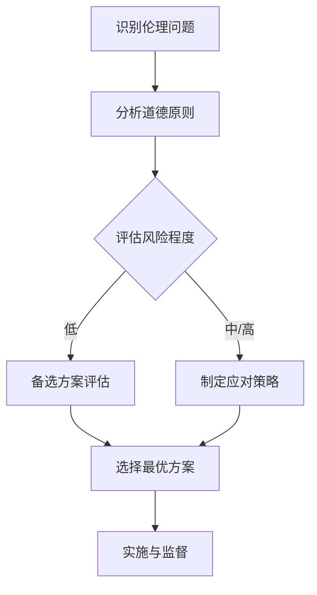

                 

## 文章标题

《AI创业公司如何应对伦理挑战?》

随着人工智能技术的飞速发展，越来越多的创业公司投身于AI领域，希望在未来的科技浪潮中占据一席之地。然而，AI技术的广泛应用也带来了一系列伦理挑战。如何应对这些伦理挑战，成为AI创业公司面临的重要课题。本文将深入探讨AI创业公司如何识别、评估、决策和应对伦理挑战，旨在为创业公司提供实用的指导和建议。

关键词：人工智能，伦理挑战，创业公司，决策框架，责任归属，数据隐私，算法歧视。

摘要：本文首先介绍了AI伦理挑战的背景和核心概念，然后详细阐述了AI伦理挑战的识别与评估方法，接着提出了制定伦理决策与策略的框架，并通过具体案例分析展示了伦理策略的制定与实施。最后，本文对未来AI伦理发展趋势进行了展望，并给出了创业公司应对策略的建议。

### 第一部分：引言与核心概念

#### 1.1 书籍引言

人工智能伦理挑战是指在人工智能技术的研发、应用和推广过程中，涉及到的道德、法律、社会等方面的争议和问题。随着AI技术的日益普及，伦理挑战也逐渐成为公众和学术界关注的焦点。对于AI创业公司来说，如何应对这些伦理挑战，不仅关系到企业的长期发展，也关乎社会的和谐与进步。

#### 1.1.1 AI伦理挑战的背景

近年来，AI技术在全球范围内取得了显著进展，从自动驾驶汽车到智能家居，从医疗诊断到金融分析，AI的应用场景越来越广泛。然而，这些应用也引发了一系列伦理问题，如数据隐私、算法歧视、责任归属等。例如，自动驾驶汽车在遇到紧急情况时如何做出决策，医疗诊断算法是否公平公正，金融分析算法是否会导致市场失衡等。这些问题不仅引发了公众的担忧，也成为了学术界和产业界研究的热点。

#### 1.1.2 创业公司在AI伦理挑战中的重要性

AI创业公司作为AI技术的先驱者和实践者，其在应对伦理挑战中扮演着重要角色。首先，创业公司往往具有更高的灵活性和创新性，能够更快地适应和应对新的伦理挑战。其次，创业公司通常规模较小，决策更加高效，能够更快地制定和实施伦理策略。此外，创业公司作为新兴力量，其伦理实践也往往能够引领行业趋势，推动整个行业向更健康、更可持续的方向发展。

#### 1.2 AI伦理核心概念

要应对AI伦理挑战，首先需要理解AI伦理的核心概念。以下是几个关键概念及其关系：

##### 1.2.1 人工智能伦理学的基本框架

人工智能伦理学是研究AI技术与伦理道德之间关系的学科。其基本框架包括以下几个方面：

1. **道德原则**：如尊重个体权利、公正、透明等。
2. **责任归属**：确定在AI系统中谁应承担责任的规则。
3. **隐私保护**：确保个人数据的安全和隐私。
4. **公平与正义**：确保AI系统的决策和结果对所有人都是公平和公正的。

##### 1.2.2 伦理与法律的关系

伦理和法律在AI伦理挑战中扮演着不同的角色。伦理是指导人类行为的原则和价值观，而法律是国家或组织制定的具有强制力的规范。在AI伦理挑战中，伦理往往先于法律出现，因为伦理原则可以引导法律的制定和执行。然而，法律也为伦理提供了具体的约束和保障。

##### 1.2.3 伦理决策的基本原则

伦理决策是指在面临伦理困境时做出决策的过程。伦理决策的基本原则包括：

1. **功利主义**：追求最大化的整体幸福。
2. **康德伦理学**：强调个体权利和自由。
3. **权利伦理学**：重视个体的权利和尊严。
4. **公正伦理学**：追求结果的公平和公正。

##### 1.3 AI伦理案例介绍

为了更好地理解AI伦理挑战，以下介绍几个典型的AI伦理案例：

1. **数据隐私**：Facebook数据泄露事件引发了对AI数据隐私保护的广泛讨论。
2. **算法歧视**：Google搜索算法被指控存在种族歧视。
3. **自动化战争**：无人驾驶武器系统在道德和合法性方面的争议。

通过这些案例，我们可以看到AI伦理挑战的多样性和复杂性。

#### 1.3.1 典型AI伦理挑战案例

以下介绍几个典型的AI伦理挑战案例，并分析其影响和解决方法：

1. **数据隐私**：2018年，Facebook被爆出泄露8700万用户的数据给剑桥分析公司，用于政治广告投放。这一事件引发了全球范围内对AI数据隐私保护的广泛关注。解决方法包括加强数据隐私立法、提高用户隐私意识、采用加密技术和匿名化处理等。

2. **算法歧视**：Google搜索算法被指控存在种族歧视，导致黑人用户的搜索结果较少。解决方法包括改进算法设计，确保搜索结果的公正性，以及加强算法透明性和可解释性。

3. **自动化战争**：无人驾驶武器系统在道德和合法性方面引发了争议。解决方法包括制定国际法规，禁止使用致命性AI武器，以及确保AI系统的道德约束和人类监督。

#### 1.3.2 案例分析与应用

通过对这些案例的分析，我们可以看到AI伦理挑战的多样性和复杂性。对于AI创业公司来说，理解这些案例，不仅有助于识别和评估潜在的伦理风险，还可以为制定伦理策略提供参考。

### 第二部分：AI伦理挑战的识别与评估

#### 2.1 AI伦理挑战识别

识别AI伦理挑战是应对这些挑战的第一步。以下是几种常见的伦理问题分类与识别方法：

##### 2.1.1 伦理问题分类与识别方法

1. **数据隐私问题**：涉及个人数据的收集、存储和使用。
2. **算法歧视问题**：算法可能导致不公平、歧视性的结果。
3. **责任归属问题**：在AI系统的故障或错误中，谁应承担责任。
4. **自动化战争问题**：AI武器系统的道德和合法性。
5. **透明性和可解释性问题**：AI系统的决策过程是否透明和可解释。

##### 2.1.2 创业公司内部伦理风险评估

创业公司内部伦理风险评估是识别潜在伦理挑战的重要环节。以下是一个简单的伦理风险评估框架：

1. **识别潜在伦理问题**：通过对AI应用场景的分析，识别可能存在的伦理问题。
2. **评估风险程度**：对识别出的伦理问题进行风险程度评估，包括可能性、影响程度等。
3. **制定应对策略**：根据风险程度，制定相应的应对策略，包括预防措施、应对措施和恢复措施。

#### 2.2 伦理挑战评估

评估AI伦理挑战的目的是确定其严重性和影响，为制定伦理策略提供依据。以下是几种常用的伦理评估框架和工具：

##### 2.2.1 伦理评估框架与工具

1. **基于风险的伦理评估框架**：将伦理挑战视为风险，采用风险管理的思路进行评估。
2. **多标准评估框架**：结合多个伦理原则和标准进行评估，如尊重隐私、公正、透明等。
3. **利益相关者分析**：分析不同利益相关者对伦理挑战的看法和需求。

##### 2.2.2 评估过程与流程

伦理评估的过程通常包括以下几个步骤：

1. **问题识别**：通过文献调研、案例分析等方法，识别潜在的伦理挑战。
2. **初步评估**：采用定性或定量方法，对识别出的伦理挑战进行初步评估。
3. **详细评估**：通过专家访谈、问卷调查等方式，对初步评估结果进行验证和细化。
4. **制定评估报告**：综合评估结果，撰写评估报告，提出建议和改进措施。

##### 2.2.3 伦理风险评估实例

以下是一个简化的伦理风险评估实例：

**案例：自动驾驶汽车的伦理挑战**

1. **问题识别**：自动驾驶汽车可能面临的伦理挑战包括交通事故责任归属、道德决策（如撞人情境）、数据隐私等。
2. **初步评估**：通过文献调研和专家访谈，确定每个伦理挑战的风险程度。
3. **详细评估**：采用问卷调查和访谈的方法，收集利益相关者（如消费者、制造商、监管机构）的意见和建议。
4. **制定评估报告**：根据评估结果，提出改进建议，如加强数据隐私保护、制定明确的交通事故责任归属规则等。

通过这个实例，我们可以看到伦理风险评估的过程和步骤。对于AI创业公司来说，掌握这些方法，有助于更好地识别和评估伦理挑战。

### 第三部分：制定伦理决策与策略

#### 3.1 伦理决策框架

伦理决策是指在面对伦理困境时，根据伦理原则和价值观，做出合理和公正的决策。一个有效的伦理决策框架应包括以下几个步骤：

##### 3.1.1 伦理决策流程

1. **问题识别**：明确面临的伦理问题。
2. **道德原则分析**：分析问题涉及的道德原则和价值观。
3. **备选方案评估**：列出可能的解决方案，并评估其伦理后果。
4. **决策选择**：根据评估结果，选择最优方案。
5. **实施与监督**：执行决策，并持续监督和评估其效果。

##### 3.1.2 决策模型与工具

在伦理决策过程中，可以采用以下模型和工具：

1. **决策树**：用于分析不同决策路径和结果。
2. **道德计算模型**：将伦理原则量化为数学模型，用于评估决策方案。
3. **利益相关者分析**：分析不同利益相关者的需求和期望，确保决策的公正性。

#### 3.2 伦理策略制定

伦理策略制定是指根据伦理决策的结果，制定具体的行动计划和措施。以下是伦理策略制定的原则和步骤：

##### 3.2.1 伦理策略制定原则

1. **合法性**：确保策略符合相关法律法规。
2. **公正性**：确保策略对所有人都是公平的。
3. **透明性**：确保决策过程和结果公开透明。
4. **适应性**：策略应具备适应新情况的能力。

##### 3.2.2 伦理策略实施步骤

1. **制定目标**：明确伦理策略的目标和预期效果。
2. **制定行动计划**：分解目标，制定具体的行动方案。
3. **资源分配**：确保有足够的资源支持计划的实施。
4. **监控与评估**：定期监控策略实施情况，评估效果，及时调整。

#### 3.3 企业伦理文化塑造

企业伦理文化是指企业在日常运营中形成的伦理价值观和行为准则。塑造良好的企业伦理文化，有助于提高员工的道德素养，促进企业的可持续发展。以下是塑造企业伦理文化的策略和方法：

##### 3.3.1 伦理文化的定义与意义

1. **伦理文化的定义**：伦理文化是企业内部对伦理价值观和行为准则的共同认同和遵循。
2. **伦理文化的意义**：有助于提高企业的道德水平，增强员工的归属感和凝聚力，提升企业的社会形象。

##### 3.3.2 塑造伦理文化的策略与方法

1. **领导示范**：领导者的言行举止对员工有示范作用，领导者应带头遵守伦理规范。
2. **培训与教育**：定期开展伦理培训和教育活动，提高员工的伦理意识和素养。
3. **制度建设**：建立健全的伦理制度和流程，确保伦理规范在企业内部的执行。
4. **激励机制**：建立激励机制，鼓励员工遵守伦理规范，表彰优秀行为。

通过以上策略和方法，企业可以逐步塑造出良好的伦理文化，为企业的长期发展奠定坚实基础。

### 第四部分：具体应用案例分析

#### 4.1 案例一：数据隐私保护

随着AI技术的广泛应用，数据隐私问题日益突出。以下是一个关于数据隐私保护的案例，以及相应的策略与实施步骤。

##### 4.1.1 案例背景

某AI创业公司开发了一款面向消费者的智能健康助手，通过收集用户健康数据提供个性化的健康建议。然而，在产品上线后，用户对数据隐私保护表示了担忧。

##### 4.1.2 数据隐私保护策略与实施

1. **策略制定**：
   - **数据收集最小化**：仅收集必要的数据，避免过度收集。
   - **数据加密**：采用先进的加密技术，确保数据在传输和存储过程中的安全。
   - **数据匿名化**：对敏感数据进行匿名化处理，减少隐私泄露风险。
   - **透明度**：明确告知用户数据收集和使用的目的，获取用户授权。

2. **实施步骤**：
   - **数据收集最小化**：在产品设计阶段，明确所需数据类型，避免过度收集。
   - **数据加密**：与第三方安全公司合作，确保数据传输和存储的安全。
   - **数据匿名化**：采用匿名化算法，对敏感数据进行处理。
   - **透明度**：在用户协议中明确说明数据收集和使用的目的，并通过隐私政策告知用户。

通过以上策略和实施步骤，该AI创业公司有效地保护了用户的数据隐私，赢得了用户的信任和支持。

#### 4.2 案例二：算法歧视与公平性

算法歧视是指在AI系统中，算法对某些群体存在不公平的偏见和歧视。以下是一个关于算法歧视的案例，以及相应的伦理决策与策略。

##### 4.2.1 案例背景

某AI创业公司开发了一款面向求职者的推荐算法，然而，算法在推荐职位时对某些性别、种族存在歧视现象，引发了社会广泛关注。

##### 4.2.2 针对算法歧视的伦理决策与策略

1. **伦理决策**：
   - **公平性原则**：确保算法对所有用户都是公平的，不产生歧视。
   - **透明性原则**：确保算法的决策过程透明，可解释。
   - **责任归属原则**：明确算法歧视的责任归属，确保责任到人。

2. **策略实施**：
   - **数据清洗**：对训练数据进行清洗，排除可能引起歧视的数据。
   - **算法优化**：采用公平性度量指标，优化算法，减少歧视。
   - **透明度提升**：在用户界面中展示算法决策过程，增加透明度。
   - **责任归属**：建立明确的责任制度，确保算法歧视事件能够及时处理和追究责任。

通过以上伦理决策和策略实施，该AI创业公司有效地解决了算法歧视问题，提升了产品公平性和用户满意度。

#### 4.3 案例三：责任归属与风险控制

在AI技术的应用中，责任归属和风险控制是两个关键问题。以下是一个关于责任归属与风险控制的案例，以及相应的策略与实施步骤。

##### 4.3.1 案例背景

某AI创业公司开发了一款自动驾驶汽车，然而，在测试阶段发生了一起交通事故，导致一名行人受伤。事故发生后，公众和媒体对责任归属和风险控制提出了质疑。

##### 4.3.2 责任归属与风险控制策略

1. **策略制定**：
   - **责任归属**：明确在交通事故中，各方的责任归属，包括车辆制造商、软件开发商、车主等。
   - **风险控制**：制定有效的风险控制措施，确保自动驾驶汽车的安全性能。

2. **实施步骤**：
   - **责任归属**：通过事故调查，明确各方责任，与保险公司、法律顾问合作，确保责任归属的公正性。
   - **风险控制**：
     - **安全测试**：在产品上线前，进行严格的安全测试，确保自动驾驶汽车符合安全标准。
     - **实时监控**：在自动驾驶汽车运行过程中，进行实时监控，确保系统的稳定性和安全性。
     - **应急响应**：制定应急响应计划，确保在突发情况下，能够及时处理和应对。

通过以上策略和实施步骤，该AI创业公司有效地解决了责任归属和风险控制问题，提升了产品的安全性和公众信任度。

### 第五部分：未来展望与建议

#### 5.1 AI伦理发展趋势

随着AI技术的不断进步，AI伦理挑战也在不断演变。以下是几个可能的AI伦理发展趋势：

##### 5.1.1 伦理法规与政策演变

随着AI技术的广泛应用，各国政府纷纷出台相关的伦理法规和政策。未来，AI伦理法规将更加完善，覆盖范围更广，执行力度更强。

##### 5.1.2 未来AI伦理挑战预测

未来，AI伦理挑战将更加多样化，包括但不限于以下几个方面：

1. **自动化决策的伦理问题**：如自动驾驶汽车的道德决策、智能客服的伦理边界等。
2. **AI与人类共生的伦理问题**：如AI助手对人类隐私的侵犯、AI医生对病人的决策影响等。
3. **AI技术与传统道德观念的冲突**：如AI武器、基因编辑等。

#### 5.2 创业公司应对策略建议

为了应对未来的AI伦理挑战，AI创业公司可以采取以下策略：

##### 5.2.1 持续关注AI伦理研究的建议

1. **建立内部AI伦理研究团队**：专门研究AI伦理问题，跟踪最新的研究进展。
2. **参与外部AI伦理讨论**：积极参与行业协会、学术团体等的AI伦理讨论，了解行业趋势。
3. **开展AI伦理培训**：定期为员工提供AI伦理培训，提高员工的伦理意识和素养。

##### 5.2.2 提高AI伦理培训与意识

1. **加强伦理培训**：将AI伦理纳入员工培训计划，定期开展专题培训。
2. **提升公众意识**：通过线上线下活动，提升公众对AI伦理问题的认识和关注。
3. **构建伦理文化**：将AI伦理价值观融入企业文化，营造尊重伦理、关注伦理的企业氛围。

##### 5.2.3 建立跨部门协作与伦理委员会

1. **跨部门协作**：在产品开发、运营、市场等各个部门建立AI伦理协作机制，确保AI伦理问题能够在各个环节得到有效解决。
2. **设立伦理委员会**：成立独立的AI伦理委员会，负责评估和监督公司的AI伦理决策，提供专业的伦理建议。

通过以上策略和建议，AI创业公司可以更好地应对未来的AI伦理挑战，确保企业的可持续发展。

### 附录

#### 附录A：AI伦理相关资源与工具

##### A.1 常见伦理资源

1. **AI伦理研究机构**：
   - 电子伦理学研究中心（Center for Ethics and Technology）
   - 人工智能伦理研究院（Institute for Ethics and Emerging Technologies）

2. **伦理学在线课程**：
   - Coursera上的《人工智能伦理》课程
   - edX上的《伦理学导论》课程

##### A.2 伦理评估工具介绍

1. **伦理决策支持工具**：
   - Ethical Framework for Information Systems（IS-EFI）
   - Ethics Analysis Tool（EAT）

2. **隐私评估工具**：
   - Privacy Impact Assessment（PIA）模板
   - GDPR合规工具

#### 附录B：AI伦理参考文献

##### B.1 伦理学基础

1. **《道德哲学导论》（Introduction to Ethics）》- William K. Frankena
2. **《伦理学原理》（Principles of Ethics）》- W.D. Ross

##### B.2 AI伦理案例分析

1. **《人工智能伦理案例分析》（Ethical Issues in AI Case Studies）》- Luciano Floridi
2. **《AI伦理实践指南》（Ethical Guidelines for AI Practitioners）》- AI联盟（Alliance for AI）

##### B.3 法律法规与政策

1. **《通用数据保护条例》（General Data Protection Regulation, GDPR）**
2. **《算法公平性法案》（Algorithmic Accountability Act）**

#### 附录C：Mermaid流程图示例

##### C.1 AI伦理决策流程



##### C.2 AI伦理挑战识别流程

```mermaid
graph TD
    A[确定应用场景] --> B[收集伦理问题资料]
    B --> C{分析伦理问题]
    C --> D[分类与识别]
    D --> E[初步评估]
    E --> F{详细评估]
    F --> G[撰写评估报告]
```

#### 附录D：伪代码示例

##### D.1 数据隐私保护算法伪代码

```python
# 数据隐私保护算法伪代码

# 输入：原始数据集
# 输出：匿名化数据集

function AnonymizeData(dataset):
    for each record in dataset:
        for each attribute in record:
            if attribute is sensitive:
                attribute = Encrypt(attribute)
            else:
                attribute = Mask(attribute)
    return dataset
```

##### D.2 算法歧视检测算法伪代码

```python
# 算法歧视检测算法伪代码

# 输入：训练数据集、测试数据集
# 输出：歧视指数

function DetectDiscrimination(training_set, testing_set):
    for each feature in testing_set:
        calculate difference in feature values between different groups
        calculate average difference
        if average difference is significant:
            flag feature as discriminatory
    return sum of discriminatory features
```

#### 附录E：数学公式与解释

##### E.1 数据隐私保护中的数学模型

$$
L = -\sum_{i=1}^{n} P(x_i) \log_2 P(x_i)
$$

- **公式解释**：这是信息熵（Entropy）的公式，用于衡量数据的不确定性。在数据隐私保护中，通过降低信息熵来减少数据的可预测性，从而保护隐私。

##### E.2 算法歧视中的数学模型

$$
D = \frac{1}{N}\sum_{i=1}^{N} (y_i - \hat{y}_i)^2
$$

- **公式解释**：这是均方误差（Mean Squared Error, MSE）的公式，用于衡量算法预测值与真实值之间的差距。在算法歧视检测中，通过计算MSE来评估算法的公平性和准确性。

#### 附录F：项目实战代码解读

##### F.1 数据隐私保护项目代码解读

```python
# 数据隐私保护项目代码

# 代码描述：对用户数据进行匿名化处理，包括姓名、地址等敏感信息

# 导入所需库
import hashlib
import random

# 定义匿名化函数
def anonymize_data(data):
    anonymized_data = {}
    for key, value in data.items():
        if key in ['name', 'address']:
            anonymized_data[key] = hashlib.sha256(value.encode()).hexdigest()
        else:
            anonymized_data[key] = value
    return anonymized_data

# 测试代码
data = {
    'name': 'John Doe',
    'address': '123 Main St',
    'age': 30,
    'email': 'johndoe@example.com'
}
anonymized_data = anonymize_data(data)
print(anonymized_data)
```

- **代码解读**：该代码实现了对用户数据进行匿名化处理的功能。对于敏感信息（如姓名和地址），使用SHA-256算法进行哈希处理，从而保护用户隐私。

##### F.2 算法歧视检测项目代码解读

```python
# 算法歧视检测项目代码

# 代码描述：使用逻辑回归模型检测算法是否存在性别歧视

# 导入所需库
import pandas as pd
import numpy as np
from sklearn.linear_model import LogisticRegression
from sklearn.model_selection import train_test_split

# 加载数据集
data = pd.read_csv('discrimination_data.csv')

# 数据预处理
data = data.dropna()

# 分割特征和标签
X = data.drop('label', axis=1)
y = data['label']

# 划分训练集和测试集
X_train, X_test, y_train, y_test = train_test_split(X, y, test_size=0.2, random_state=42)

# 训练逻辑回归模型
model = LogisticRegression()
model.fit(X_train, y_train)

# 测试模型
predictions = model.predict(X_test)
accuracy = np.mean(predictions == y_test)
print(f'Model accuracy: {accuracy:.2f}')
```

- **代码解读**：该代码实现了使用逻辑回归模型检测算法是否存在性别歧视的功能。首先加载并预处理数据集，然后使用训练集训练逻辑回归模型，最后使用测试集评估模型性能。

#### 附录G：AI伦理培训与资源

##### G.1 培训计划

- **内容**：涵盖AI伦理基础、案例研究、风险评估与决策等
- **时长**：2天
- **受众**：公司内部员工、合作伙伴

##### G.2 常用伦理资源与链接

- **AI伦理研究报告**：[AI联盟（Alliance for AI）](https://www.allianceforai.org/)
- **伦理课程**：[Coursera上的《人工智能伦理》](https://www.coursera.org/learn/ethics-artificial-intelligence)
- **伦理指南**：[IEEE伦理准则](https://www.ieee.org/ethics)

### 作者信息

作者：AI天才研究院/AI Genius Institute & 禅与计算机程序设计艺术 /Zen And The Art of Computer Programming

### 致谢

感谢您阅读本文，希望本文能为您在AI伦理领域的探索提供有益的参考。如有任何问题或建议，欢迎随时与我们联系。让我们共同推动AI技术的发展，为人类创造更美好的未来。

---

本文旨在探讨AI创业公司如何应对伦理挑战，从识别、评估、决策到策略实施，再到具体案例分析，全面解析了AI伦理问题。通过本文，读者可以了解到AI伦理的核心概念、识别与评估方法，以及应对策略。同时，本文还提供了丰富的代码示例、数学公式和流程图，帮助读者深入理解AI伦理挑战的应对方法。

在未来的发展中，AI创业公司需要持续关注AI伦理研究，提高员工伦理意识和素养，建立跨部门协作与伦理委员会，确保AI技术的发展符合伦理规范。让我们共同努力，推动AI技术的健康发展，为人类创造更美好的未来。

