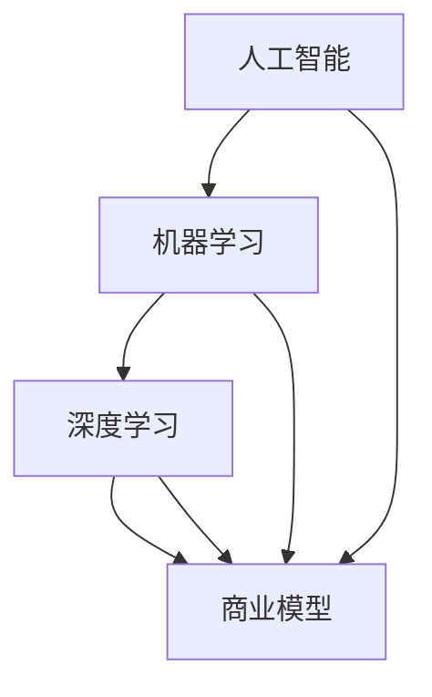

                 

# AI创业公司如何打造技术壁垒?

## 关键词
AI创业、技术壁垒、创新、数据资源、算法优化、人才培养、知识产权保护

## 摘要
本文旨在探讨AI创业公司如何构建技术壁垒，以在竞争激烈的市场中脱颖而出。通过分析AI技术壁垒的概念与重要性，我们提出了构建技术壁垒的五大策略：技术研究与开发、数据资源建设、算法优化与工程化、人才培养与组织以及法律保护与知识产权。文章结合实际案例，详细阐述了每个策略的实践方法，并提供了附录，包括开源框架与工具、行业报告与政策，以及代码案例与实践指南。通过本文，AI创业公司可以系统性地规划和实施技术壁垒构建，提升自身竞争力。

### 目录大纲设计

**第一部分：背景与核心概念**

1. **第1章: AI创业背景**
   1.1 AI创业环境分析
   1.2 创业公司的挑战与机遇
   1.3 创业公司的成功要素

2. **第2章: AI技术壁垒概述**
   2.1 技术壁垒的概念与重要性
   2.2 AI技术壁垒的构成要素
   2.3 技术壁垒对企业竞争力的作用

3. **第3章: 核心概念与联系**
   3.1 AI基础概念回顾
   3.2 AI与商业模型的关系
   3.3 核心概念Mermaid流程图

**第二部分：技术壁垒构建策略**

4. **第4章: 技术研究与开发**
   4.1 AI研究趋势分析
   4.2 技术创新的路径选择
   4.3 技术开发的策略与方法

5. **第5章: 数据资源建设**
   5.1 数据资源的重要性
   5.2 数据采集与清洗
   5.3 数据治理与隐私保护

6. **第6章: 算法优化与工程化**
   6.1 算法原理与优化策略
   6.2 模型调优与性能提升
   6.3 算法工程化实践

7. **第7章: 人才培养与组织**
   7.1 人才队伍的建设策略
   7.2 技术知识的传承与创新
   7.3 团队协作与组织文化

8. **第8章: 法律保护与知识产权**
   8.1 知识产权的基本概念
   8.2 知识产权保护策略
   8.3 常见知识产权问题及解决方案

**第三部分：实战案例分析**

9. **第9章: AI创业公司成功案例分析**
   9.1 案例一：公司A的AI产品开发
   9.2 案例二：公司B的商业模式创新
   9.3 案例三：公司C的技术壁垒打造

10. **第10章: 创业公司的技术壁垒实践**
    10.1 创业初期的技术决策
    10.2 技术研发的组织与管理
    10.3 技术壁垒的评估与优化

**附录**

11. **附录A: AI创业资源汇总**
    11.1 学术研究资源
    11.2 开源框架与工具
    11.3 行业报告与政策

12. **附录B: 代码案例与实践指南**
    12.1 代码案例分析
    12.2 实践指南
    12.3 源代码与数据集获取

### 第1章: AI创业背景

#### 1.1 AI创业环境分析

随着人工智能（AI）技术的飞速发展，AI创业成为了一个热门领域。AI创业环境的分析主要包括全球和中国AI创业环境的现状、政策法规的影响以及市场机遇。

**全球AI创业环境分析**

1. **AI产业发展现状**：全球AI产业发展迅速，特别是在美国、欧洲和中国等地区。这些地区拥有大量的AI研究机构、创新企业和创业团队，形成了良好的AI产业生态。
2. **政策法规**：各国政府纷纷出台政策法规，支持AI技术的发展和创业。例如，美国推出了《美国创新战略》、欧洲发布了《人工智能伦理准则》等。
3. **市场机遇**：随着AI技术的应用越来越广泛，市场需求也在不断增加。特别是在金融、医疗、教育、制造等行业，AI技术有着巨大的应用潜力。

**中国AI创业环境特点**

1. **产业政策支持**：中国政府高度重视AI产业的发展，出台了一系列政策法规，如《新一代人工智能发展规划》等，为AI创业提供了良好的政策环境。
2. **市场规模巨大**：中国拥有世界上最大的市场规模和人口基数，这为AI创业公司提供了广阔的发展空间。
3. **创新能力提升**：随着国内AI技术的不断突破，中国AI创业公司在技术创新和商业模式方面展现出强大的竞争力。

**政策法规对AI创业的影响**

1. **资金支持**：政策法规为AI创业公司提供了资金支持，例如政府资助、税收优惠等，降低了创业门槛。
2. **人才引进**：政策法规鼓励外国人才来华创业，为AI创业公司提供了丰富的人才资源。
3. **知识产权保护**：政策法规强化了对知识产权的保护，提高了AI创业公司的创新积极性。

#### 1.2 创业公司的挑战与机遇

**创业面临的挑战**

1. **资金与人才短缺**：AI创业需要大量的资金和高端人才，但对于初创公司来说，这两者都相对稀缺。
2. **技术研发难度大**：AI技术的研发需要深厚的技术积累和创新，这给创业公司带来了较大的研发难度。
3. **市场竞争激烈**：AI领域市场竞争激烈，创业公司需要面对国内外同行的竞争。

**创业带来的机遇**

1. **技术进步带来的新需求**：AI技术的不断进步为各个行业带来了新的需求，为创业公司提供了广阔的市场空间。
2. **市场潜力巨大**：AI技术在金融、医疗、教育、制造等行业有着广泛的应用前景，市场潜力巨大。
3. **创新能力提升**：创业公司通过技术创新，能够迅速占领市场，提升自身竞争力。

#### 1.3 创业公司的成功要素

**明确的商业模式**

1. **商业模式的核心要素**：商业模式包括产品或服务、客户群体、盈利模式、成本结构等要素。
2. **商业模式设计的策略**：创业公司需要根据自身优势和市场需求，设计出具有竞争力的商业模式。

**优秀的团队**

1. **团队成员的角色与职责**：创业团队需要有技术专家、市场人员、产品经理等不同角色的成员，各自承担不同的职责。
2. **团队建设的策略与技巧**：创业公司需要通过招聘、培训、激励等手段，打造一支高效的团队。

**强大的技术实力**

1. **技术积累与创新能力**：创业公司需要具备深厚的技术积累和创新能力，以应对市场的变化。
2. **技术研发的策略与方法**：创业公司需要制定明确的技术研发策略，采用合适的技术方法，提高研发效率。

**有效的市场推广**

1. **市场定位与目标客户**：创业公司需要明确市场定位，找到目标客户群体。
2. **市场推广的策略与渠道**：创业公司需要采用多种市场推广策略，利用线上线下渠道，提高品牌知名度。

通过以上分析，我们可以看到，AI创业公司面临着诸多挑战，但也拥有巨大的机遇。要成功打造技术壁垒，创业公司需要明确商业模式，打造优秀团队，提升技术实力，并进行有效的市场推广。

### 第2章: AI技术壁垒概述

#### 2.1 技术壁垒的概念与重要性

**技术壁垒的定义**

技术壁垒是指企业通过技术创新、知识产权、技术秘密等手段建立的一种技术优势，这种优势可以防止或减缓竞争对手进入市场，从而保护企业的市场份额和利润。

**技术壁垒在AI领域的特殊含义**

在AI领域，技术壁垒的特殊性主要体现在以下几个方面：

1. **高度依赖数据**：AI技术的进步离不开大量高质量的数据，数据成为构建技术壁垒的关键要素。
2. **算法的复杂性**：AI算法的复杂性使得技术壁垒更加难以突破，新进入者需要大量的时间和资源进行算法研发。
3. **快速迭代的技术环境**：AI技术更新迭代速度极快，技术壁垒的构建需要持续的研发投入和创新能力。

**技术壁垒的重要性**

技术壁垒对企业具有重要的保护作用和提升作用：

1. **保护作用**：技术壁垒可以防止竞争对手进入市场，保护企业的市场份额和利润。
2. **提升作用**：技术壁垒可以提高企业的竞争力，促进企业的技术创新和商业模式的创新。

#### 2.2 AI技术壁垒的构成要素

**核心技术**

核心技术是指企业拥有的具有竞争优势的核心技术和关键算法。核心技术是技术壁垒的核心要素，它决定了企业的技术实力和市场地位。

1. **核心技术的定义**：核心技术是指企业通过持续研发和创新，形成的具有自主知识产权、难以被模仿和替代的技术。
2. **核心技术的筛选与积累**：企业需要根据市场需求和技术发展趋势，筛选和积累核心技术，形成自己的技术优势。

**知识产权**

知识产权是指企业通过专利、商标、著作权等手段保护的技术成果。知识产权是技术壁垒的重要保障，它可以防止竞争对手复制和模仿企业的技术。

1. **知识产权的种类**：包括专利、商标、著作权、商业秘密等。
2. **知识产权的保护策略**：企业需要通过申请专利、签订保密协议等手段，保护自己的知识产权。

**技术标准**

技术标准是指企业在行业内部建立的技术规范和标准。技术标准可以帮助企业占据市场先机，形成行业标准，从而构建技术壁垒。

1. **技术标准的定义**：技术标准是指在一定范围内，为了获得最佳秩序，对活动或其结果规定共同的和重复使用的规则、导则或特性的文件。
2. **技术标准的重要性**：技术标准可以帮助企业占据市场先机，形成行业标准，从而构建技术壁垒。

**技术秘密**

技术秘密是指企业通过保密手段保护的技术信息。技术秘密是企业核心竞争力的一部分，它可以帮助企业保持技术优势。

1. **技术秘密的保护**：企业需要建立严格的技术秘密保护制度，对技术信息进行分类管理，确保技术秘密不被泄露。
2. **技术秘密的管理**：企业需要对技术秘密进行有效管理，包括保密协议、保密培训、保密设施等。

通过以上分析，我们可以看到，AI技术壁垒的构成要素包括核心技术、知识产权、技术标准和技术秘密。这些要素相互关联，共同构成了企业的技术壁垒，帮助企业保持竞争优势。

#### 2.3 技术壁垒对企业竞争力的作用

**技术壁垒的保护作用**

技术壁垒可以防止竞争对手进入市场，保护企业的市场份额和利润。具体表现在以下几个方面：

1. **隔离竞争对手**：技术壁垒使得新进入者难以在短时间内掌握企业所拥有的核心技术，从而延缓了竞争对手的市场进入速度。
2. **保护创新成果**：知识产权和技术标准可以保护企业的创新成果，防止竞争对手复制和模仿。
3. **提高市场份额**：技术壁垒可以帮助企业占据市场先机，形成行业标准，从而提高市场份额。

**技术壁垒的提升作用**

技术壁垒可以提高企业的竞争力，促进企业的技术创新和商业模式的创新。具体表现在以下几个方面：

1. **促进技术创新**：技术壁垒激励企业不断进行技术创新，以保持技术优势。
2. **提升产品质量**：技术壁垒可以帮助企业提高产品质量，满足客户需求，从而提升竞争力。
3. **拓展市场空间**：技术壁垒可以帮助企业拓展市场空间，进入新的领域和行业。

通过以上分析，我们可以看到，技术壁垒在保护企业市场份额和利润的同时，也促进了企业的技术创新和商业模式创新，从而提高了企业的竞争力。对于AI创业公司来说，构建技术壁垒是提升企业竞争力的关键。

### 第3章: 核心概念与联系

在AI创业过程中，理解并掌握核心概念和它们之间的联系至关重要。这一章将回顾AI的基础概念，探讨AI与商业模型的关系，并提供一个核心概念Mermaid流程图，以直观地展示这些概念之间的联系。

#### 3.1 AI基础概念回顾

**人工智能的定义**

人工智能（Artificial Intelligence, AI）是指模拟、延伸和扩展人的智能的科学和工程。它包括使计算机系统具备学习、推理、解决问题和自我改进的能力。

**机器学习的概念**

机器学习（Machine Learning, ML）是人工智能的一个子领域，它专注于开发算法，使计算机系统能够从数据中学习并作出预测或决策，而无需显式编程。

**深度学习的特点**

深度学习（Deep Learning, DL）是机器学习的一个分支，它使用多层的神经网络来学习数据的高级特征表示，从而实现更复杂的任务，如图像识别和自然语言处理。

#### 3.2 AI与商业模型的关系

**商业模型的概念**

商业模型（Business Model）是指企业如何创造、传递和获取价值的系统。它包括产品或服务、目标市场、收入来源、成本结构和关键合作伙伴等要素。

**AI在商业模型中的应用**

AI技术可以在商业模型中发挥重要作用，包括：

1. **产品创新**：通过机器学习和深度学习算法，企业可以开发出更智能的产品和服务。
2. **运营优化**：利用AI技术，企业可以自动化和优化业务流程，提高效率和降低成本。
3. **市场洞察**：通过分析大数据，AI可以帮助企业更好地了解市场和客户需求，从而制定更有效的营销策略。

#### 3.3 核心概念Mermaid流程图

为了更好地展示AI、机器学习、深度学习和商业模型之间的关系，我们可以使用Mermaid语言绘制一个流程图。



在这个流程图中，人工智能是核心，它向下延伸到机器学习和深度学习，这两个子领域共同推动了AI技术的发展。深度学习作为机器学习的进一步发展，在商业模型中发挥着关键作用，帮助企业在产品创新、运营优化和市场洞察方面实现突破。

通过以上分析，我们可以看到，AI基础概念、机器学习、深度学习和商业模型之间存在着紧密的联系。理解这些核心概念及其相互关系，对于AI创业公司来说，是构建技术壁垒、实现商业成功的基础。

### 第4章: 技术研究与开发

在AI创业公司中，技术研究和开发是构建技术壁垒的关键步骤。这一章将详细分析AI研究的趋势，探讨技术创新的路径选择，以及技术开发的具体策略和方法。

#### 4.1 AI研究趋势分析

**当前AI研究热点**

目前，AI研究的几个热点领域包括：

1. **自然语言处理（NLP）**：NLP技术在文本分析和语义理解方面取得了显著进展，被广泛应用于聊天机器人、自动翻译和文本摘要等应用场景。
2. **计算机视觉（CV）**：CV技术在图像识别、目标检测和视频分析等领域取得了突破性进展，推动了自动驾驶、智能监控和医疗影像分析等领域的应用。
3. **强化学习（RL）**：强化学习在决策制定、游戏对战和机器人控制等方面表现出强大的学习能力，成为AI研究的一个重要方向。

**未来AI研究方向**

未来，AI研究可能会朝着以下方向发展：

1. **元学习（Meta-Learning）**：元学习旨在开发能够快速适应新任务和学习新知识的通用学习算法。
2. **量子计算与AI**：量子计算与AI的结合有望在处理大规模数据和复杂计算任务方面实现突破。
3. **生物灵感算法**：受自然界生物系统启发，如进化算法、神经网络和群体智能等，这些算法在优化问题和复杂系统建模中具有潜在应用价值。

#### 4.2 技术创新的路径选择

**内部研发模式**

内部研发模式是指创业公司完全依靠自身资源进行技术研发。这种模式的优点包括：

1. **技术自主性**：内部研发可以确保技术的自主性和可控性。
2. **创新灵活性**：创业公司可以灵活调整研发方向，快速响应市场需求。

然而，内部研发也面临一些挑战：

1. **研发成本高**：内部研发需要大量的资金投入。
2. **人才短缺**：AI领域的高端人才相对稀缺，创业公司可能难以吸引和留住优秀人才。

**外部合作模式**

外部合作模式是指创业公司通过与其他研究机构、企业或开源社区合作进行技术研发。这种模式的优点包括：

1. **资源整合**：通过合作，创业公司可以整合外部资源，降低研发成本。
2. **知识共享**：合作可以促进知识的共享和交流，加快技术创新。

外部合作模式的挑战包括：

1. **知识产权保护**：合作过程中需要妥善处理知识产权问题，确保自身利益不受损失。
2. **合作稳定性**：外部合作关系可能存在不稳定性，需要创业公司进行有效的管理。

#### 4.3 技术开发的策略与方法

**技术预研**

技术预研是技术开发的前期工作，旨在评估技术可行性、探索潜在的技术解决方案。技术预研的方法包括：

1. **文献调研**：通过查阅相关文献，了解当前领域的技术进展和研究动态。
2. **可行性分析**：评估技术的可行性，包括技术难度、成本和时间等因素。

**技术研发**

技术研发是技术预研后的具体实施阶段，包括以下步骤：

1. **需求分析**：明确技术研发的需求和目标，确定技术方案。
2. **技术实现**：根据需求分析结果，开发具体的算法和系统。
3. **性能优化**：对开发的技术进行性能优化，提高其效率和效果。

**技术验证**

技术验证是确保技术研发成果的有效性和可靠性。技术验证的方法包括：

1. **单元测试**：对开发的技术模块进行功能测试和性能测试。
2. **集成测试**：对系统的整体功能进行测试，确保各模块之间的协同工作。
3. **用户反馈**：通过用户反馈，对技术研发成果进行优化和改进。

#### 4.4 技术开发中的挑战与应对策略

**技术研发成本控制**

技术研发成本高是创业公司面临的一个主要挑战。应对策略包括：

1. **预算管理**：制定详细的预算计划，严格控制研发成本。
2. **资源优化**：优化资源配置，提高研发效率。

**技术风险管理**

技术风险可能影响技术研发的进展和效果。应对策略包括：

1. **风险识别**：在技术研发过程中，及时发现和识别技术风险。
2. **风险管理**：制定风险管理策略，降低技术风险的影响。

**技术人才招聘与培养**

技术人才是技术研发的核心资源。应对策略包括：

1. **招聘策略**：制定有效的招聘策略，吸引和留住优秀人才。
2. **培养计划**：制定人才培养计划，提高技术团队的专业能力和创新能力。

通过以上分析，我们可以看到，技术研究和开发是AI创业公司构建技术壁垒的关键环节。创业公司需要紧跟AI研究趋势，选择合适的创新路径，制定有效的技术开发策略，并应对技术研发中的各种挑战，以实现技术突破和商业成功。

### 第5章: 数据资源建设

在AI创业公司中，数据资源建设是构建技术壁垒的重要一环。这一章将深入探讨数据资源的重要性，详细阐述数据采集与清洗的方法，并讨论数据治理与隐私保护的问题。

#### 5.1 数据资源的重要性

**数据在AI中的作用**

数据是AI发展的基础，其作用主要体现在以下几个方面：

1. **模型训练**：大量的数据用于训练机器学习模型，使模型能够学习并识别数据中的模式和规律。
2. **优化算法**：通过分析数据，可以发现算法的不足之处，从而进行优化和改进。
3. **辅助决策**：数据可以提供丰富的信息，帮助企业做出更准确的决策。

**数据资源对企业竞争力的提升**

1. **创新推动**：丰富的数据资源可以激发创新思维，推动技术的进步和产品的更新。
2. **决策优化**：通过对数据的分析，企业可以更好地理解市场趋势和客户需求，从而优化决策过程。
3. **竞争力增强**：数据资源可以帮助企业快速响应市场变化，提高市场竞争力。

#### 5.2 数据采集与清洗

**数据采集**

数据采集是数据资源建设的基础工作。数据采集的渠道和方法包括：

1. **公开数据集**：可以从公共数据集网站（如Kaggle、UCI机器学习库）获取高质量的数据集。
2. **API接口**：通过API接口获取第三方平台的数据，如社交媒体、电子商务平台等。
3. **数据爬取**：使用爬虫技术从互联网上获取公开数据，但需要注意遵守相关法律法规。

**数据清洗**

数据清洗是确保数据质量的重要环节。数据清洗的方法包括：

1. **数据预处理**：对数据进行标准化、归一化和特征提取等处理，以提高数据的质量。
2. **缺失值处理**：对缺失数据进行填充或删除，确保数据的完整性。
3. **异常值处理**：识别并处理数据中的异常值，避免对模型训练产生负面影响。

#### 5.3 数据治理与隐私保护

**数据治理**

数据治理是指通过制定策略、流程和技术来确保数据的完整性、一致性和安全性。数据治理的策略和流程包括：

1. **数据质量管理**：建立数据质量管理机制，定期对数据进行质量检查和优化。
2. **数据安全控制**：制定数据安全策略，确保数据的安全性和保密性。
3. **数据生命周期管理**：建立数据生命周期管理流程，从数据的采集、存储、处理到销毁，确保数据的有效管理和利用。

**隐私保护**

在数据资源建设中，隐私保护是一个重要的问题。隐私保护的策略和技术包括：

1. **数据匿名化**：通过数据匿名化技术，如数据脱敏、数据混淆等，保护个人隐私。
2. **隐私增强技术**：如差分隐私、同态加密等，可以在数据处理和分析过程中保护数据隐私。
3. **合规性检查**：定期进行合规性检查，确保数据处理和存储符合相关法律法规的要求。

通过以上分析，我们可以看到，数据资源建设是AI创业公司构建技术壁垒的重要组成部分。数据资源的重要性不容忽视，而数据采集、清洗、治理和隐私保护是确保数据资源有效利用的关键步骤。创业公司需要在这些方面进行全面规划和实施，以构建强大的技术壁垒，提升企业竞争力。

### 第6章: 算法优化与工程化

在AI创业公司中，算法优化与工程化是确保技术壁垒持久和有效的重要环节。这一章将深入探讨算法优化与工程化的策略，详细阐述模型调优与性能提升的方法，并讨论算法工程化的实践。

#### 6.1 算法原理与优化策略

**算法优化的重要性**

算法优化对于提升模型性能、降低计算成本、提高生产效率具有重要意义。优化策略包括以下几个方面：

1. **模型结构优化**：通过改进模型结构，如增加或减少网络层数、调整网络架构等，可以提高模型的泛化能力和效率。
2. **模型参数优化**：调整模型参数，如学习率、正则化参数等，可以改善模型的训练效果和性能。
3. **数据处理优化**：优化数据处理流程，如数据归一化、特征提取等，可以减少计算复杂度和提高模型训练速度。

**算法优化的一般策略**

1. **自动调参**：使用自动调参工具（如Hyperopt、Bayesian Optimization）寻找最佳参数组合。
2. **模型压缩**：通过模型压缩技术（如网络剪枝、量化、蒸馏等）减少模型参数和计算量。
3. **分布式训练**：利用分布式训练框架（如Horovod、DistributedTensorFlow）提高训练速度和效率。

#### 6.2 模型调优与性能提升

**模型调优的基本步骤**

模型调优是一个迭代和优化的过程，通常包括以下几个步骤：

1. **选择调优指标**：根据任务目标选择合适的评价指标，如准确率、召回率、F1分数等。
2. **调整模型参数**：根据调优指标，调整模型参数，如学习率、正则化强度等，以优化模型性能。
3. **验证模型性能**：在验证集上评估模型性能，确保调优后的模型在实际应用中表现良好。

**性能提升的方法**

1. **模型压缩技术**：通过模型剪枝、量化、蒸馏等技术减少模型参数和计算量，提高模型性能。
2. **模型加速技术**：利用GPU、TPU等硬件加速训练过程，提高模型训练速度。
3. **迁移学习**：通过迁移学习利用预训练模型的知识，快速适应新任务，提高模型性能。

#### 6.3 算法工程化实践

**算法工程化的概念**

算法工程化是指将研究成果转化为可部署的、高效的生产系统。算法工程化的目标包括：

1. **稳定性**：确保算法在各种环境下都能稳定运行。
2. **效率**：优化算法的运行效率，提高生产系统的性能。
3. **可维护性**：提高代码的可维护性，确保系统的长期稳定运行。

**算法工程化的流程**

算法工程化通常包括以下几个步骤：

1. **需求分析**：明确生产系统的需求和目标，为算法工程化提供指导。
2. **算法设计**：根据需求分析结果，设计适合的算法框架和实现方案。
3. **代码实现**：根据算法设计，编写高质量的代码，确保系统的稳定性、效率和可维护性。
4. **测试与部署**：对实现的算法进行全面的测试，确保其在生产环境中的性能和稳定性，然后进行部署。

**算法工程化的工具**

1. **开发环境搭建**：使用Docker、Conda等工具搭建统一的开发环境，确保代码在不同环境中的一致性。
2. **代码管理工具**：使用Git、GitHub等工具管理代码，确保代码的版本控制和协作开发。
3. **自动化测试工具**：使用Jenkins、pytest等工具进行自动化测试，确保代码的稳定性和可靠性。

通过以上分析，我们可以看到，算法优化与工程化是AI创业公司构建技术壁垒的关键环节。创业公司需要不断优化算法，提高模型性能，同时通过工程化的方法确保算法在生产环境中的稳定性和效率。这将有助于创业公司在激烈的市场竞争中保持领先地位。

### 第7章: 人才培养与组织

在AI创业公司中，人才培养与组织是构建技术壁垒的重要环节。这一章将详细探讨人才队伍的建设策略、技术知识的传承与创新，以及团队协作与组织文化的建设。

#### 7.1 人才队伍的建设策略

**人才需求分析**

人才需求分析是构建人才队伍的第一步，主要包括以下几个方面：

1. **人才类型需求**：根据公司的发展战略和业务需求，分析所需的人才类型，包括技术专家、产品经理、数据科学家等。
2. **人才数量需求**：根据项目规模和进度，确定所需的人才数量，确保人力资源的合理配置。

**人才培养计划**

人才培养计划是确保团队具备持续创新能力的关键。具体策略包括：

1. **内部培训计划**：制定系统化的内部培训计划，包括技术培训、管理培训等，提升员工的专业能力和综合素质。
2. **外部培训合作**：与高校、科研机构等合作，开展联合培训项目，引入外部优质资源，提升团队的整体水平。

**人才激励机制**

人才激励机制是留住优秀人才、激发创新活力的重要手段。具体策略包括：

1. **薪酬激励**：建立具有竞争力的薪酬体系，确保员工的收入水平与市场接轨。
2. **职业发展激励**：为员工提供明确的职业发展路径，通过晋升、调岗等方式，激发员工的职业发展动力。

#### 7.2 技术知识的传承与创新

**技术知识传承的重要性**

技术知识传承对于团队的稳定性和企业的竞争力具有重要意义。具体体现在以下几个方面：

1. **团队稳定性**：通过技术知识的传承，确保团队成员能够迅速上手新项目，减少人才流失对企业的影响。
2. **企业竞争力**：技术知识的传承有助于积累企业的技术实力，形成独特的竞争优势。

**技术知识传承的方法**

1. **文档化传承**：通过编写技术文档、操作手册等，将技术知识和经验进行系统化整理和传递。
2. **演练传承**：通过组织技术演练、编码竞赛等，让团队成员在实践中学习和掌握新技术。
3. **交流传承**：通过定期的技术分享会、内部培训等，促进团队成员之间的交流和学习。

**技术知识创新**

技术知识创新是保持企业竞争力的关键。具体策略包括：

1. **创新激励**：建立创新激励机制，鼓励员工提出创新想法和技术改进方案。
2. **创新机制**：建立创新机制，如内部创业平台、项目孵化器等，为员工提供创新的空间和资源。

#### 7.3 团队协作与组织文化

**团队协作的重要性**

团队协作是确保项目成功、提升工作效率的重要保障。具体体现在以下几个方面：

1. **项目成功**：通过有效的团队协作，确保项目按照预定计划和目标顺利推进，提高项目成功率。
2. **工作效率**：团队成员之间的协同工作，可以提高工作效率，减少重复劳动和资源浪费。

**团队协作的方法**

1. **分工协作**：明确团队成员的职责和工作任务，确保每个成员都能在各自的岗位上发挥最大价值。
2. **沟通协作**：建立畅通的沟通渠道，确保团队成员之间能够及时交流信息，共同解决问题。
3. **目标导向协作**：以项目目标为导向，确保团队协作的方向一致，提高协作效率。

**组织文化的建设**

组织文化是团队协作和员工行为的指南。具体策略包括：

1. **组织文化的定义与类型**：明确组织文化的定义和类型，如合作型文化、竞争型文化等。
2. **组织文化的建设策略**：通过企业文化活动、员工培训等手段，营造积极向上的组织氛围，提升团队凝聚力和员工满意度。

通过以上分析，我们可以看到，人才培养与组织是AI创业公司构建技术壁垒的关键环节。创业公司需要通过系统的人才培养计划、技术知识传承与创新，以及团队协作与组织文化的建设，打造一支高效的团队，提升企业竞争力。

### 第8章: 法律保护与知识产权

在AI创业公司中，法律保护与知识产权管理是确保企业长期稳定发展的关键因素。这一章将详细探讨知识产权的基本概念、保护策略，以及常见知识产权问题及解决方案。

#### 8.1 知识产权的基本概念

**知识产权的定义**

知识产权是指企业在创新过程中创造的智力成果，包括专利、商标、著作权、商业秘密等。

**知识产权的种类**

1. **专利**：专利是对发明创造的独占权，包括发明专利、实用新型专利和外观设计专利。
2. **商标**：商标是企业的标识，用于区分其商品或服务与其他企业的商品或服务。
3. **著作权**：著作权是对文学、艺术和科学作品的独占权。
4. **商业秘密**：商业秘密是企业的重要信息，包括技术秘密、经营秘密等，对外保密，防止泄露。

**知识产权的法律体系**

知识产权的法律体系包括国际知识产权法律和国内知识产权法律。

1. **国际知识产权法律**：如《伯尔尼公约》、《巴黎公约》等。
2. **我国知识产权法律**：包括《专利法》、《商标法》、《著作权法》和《反不正当竞争法》等。

#### 8.2 知识产权保护策略

**知识产权保护的重要性**

知识产权保护对于企业创新和市场竞争具有重要意义：

1. **保护企业利益**：知识产权保护可以确保企业的创新成果不被他人侵占，维护企业权益。
2. **促进技术创新**：知识产权保护可以激励企业进行技术创新，推动技术进步。
3. **增强市场竞争力**：知识产权保护可以帮助企业建立技术壁垒，提高市场竞争力。

**知识产权保护策略**

1. **专利保护策略**：通过申请专利，保护企业的发明创造，防止竞争对手模仿和复制。
2. **商标保护策略**：通过注册商标，保护企业的品牌形象，防止他人恶意使用。
3. **著作权保护策略**：通过著作权登记，保护企业的文学、艺术和科学作品。
4. **商业秘密保护策略**：通过保密措施，保护企业的技术秘密和经营秘密。

#### 8.3 常见知识产权问题及解决方案

**知识产权侵权问题**

知识产权侵权是指未经许可，擅自使用他人知识产权的行为。常见问题包括：

1. **侵权行为的识别**：如何识别和确定侵权行为，包括专利侵权、商标侵权等。
2. **侵权问题的解决途径**：包括协商解决、法律诉讼等。

**知识产权争议**

知识产权争议是指因知识产权的使用、转让、许可等引发的纠纷。常见问题包括：

1. **争议的类型**：包括专利侵权纠纷、商标争议等。
2. **争议解决的途径**：包括调解、仲裁、诉讼等。

**知识产权申请问题**

知识产权申请问题是指在申请专利、商标、著作权等过程中遇到的问题。常见问题包括：

1. **申请流程**：包括准备申请文件、提交申请、审查等。
2. **申请过程中的常见问题及解决方案**：如申请材料不完整、审查意见回复等。

**解决方案**

1. **法律咨询**：在遇到知识产权问题时，及时寻求专业律师的法律咨询，确保问题得到妥善处理。
2. **内部培训**：加强员工的知识产权意识培训，提高知识产权保护能力。
3. **制度建设**：建立完善的知识产权管理制度，确保知识产权的申请、管理和保护。

通过以上分析，我们可以看到，法律保护与知识产权管理对于AI创业公司的重要性。创业公司需要建立完善的知识产权保护策略，解决常见知识产权问题，确保企业的创新成果得到有效保护，从而在激烈的市场竞争中立于不败之地。

### 第9章: AI创业公司成功案例分析

在本章中，我们将通过三个AI创业公司的成功案例，详细分析他们在AI产品开发、商业模式创新和技术壁垒构建方面的经验与策略。

#### 9.1 案例一：公司A的AI产品开发

**案例背景**

公司A成立于2015年，专注于利用深度学习技术进行图像识别和自然语言处理。公司由几位在人工智能领域有深厚研究背景的博士创办，旨在将前沿技术应用于实际场景，解决行业痛点。

**产品开发过程**

1. **市场需求分析**：公司A通过市场调研，发现零售行业在库存管理和商品识别方面存在巨大挑战。因此，公司决定开发一款智能零售解决方案，能够自动识别商品并进行库存管理。
2. **技术创新点**：公司A采用了深度卷积神经网络（CNN）进行图像识别，并结合自然语言处理（NLP）技术进行商品描述分析和语义理解。
3. **开发流程和策略**：公司A采用了敏捷开发模式，快速迭代产品，根据用户反馈不断优化和改进。

**成功经验**

1. **技术创新的重要性**：公司A通过技术创新，实现了高精度的商品识别和库存管理，赢得了市场的认可。
2. **市场定位的策略**：公司A明确市场定位，专注于有痛点的行业，迅速占领市场。
3. **团队协作的成功经验**：公司A的团队成员具备丰富的技术经验和良好的协作精神，确保了产品的快速开发和成功上市。

#### 9.2 案例二：公司B的商业模式创新

**案例背景**

公司B成立于2016年，专注于利用AI技术进行金融风险管理。公司由几位金融和人工智能领域的专家创办，旨在通过AI技术提高金融行业的风险预测能力。

**商业模式创新**

1. **商业模式核心理念**：公司B采用了SaaS（软件即服务）模式，为金融机构提供定制化的AI风险管理解决方案。
2. **创新的商业模式特点**：公司B将AI技术与金融服务紧密结合，提供实时、动态的风险预测和预警服务。
3. **商业模式实施的效果**：公司B的商业模式在金融行业中得到了广泛应用，客户满意度高，市场份额迅速扩大。

**成功经验**

1. **商业模式创新的重要性**：公司B通过创新的商业模式，成功地将AI技术应用于金融服务，开辟了新的市场领域。
2. **市场需求的精准把握**：公司B深入了解金融机构的需求，提供定制化的解决方案，提高了市场竞争力。
3. **创新思维的培养**：公司B鼓励员工创新，建立创新激励机制，确保公司始终保持创新能力。

#### 9.3 案例三：公司C的技术壁垒打造

**案例背景**

公司C成立于2017年，专注于利用AI技术进行智能医疗诊断。公司由几位医疗和人工智能领域的专家创办，旨在通过AI技术提高医疗诊断的准确性和效率。

**技术壁垒构建过程**

1. **核心技术的研发**：公司C在深度学习、计算机视觉和自然语言处理等领域进行了大量研发，形成了自己的核心技术。
2. **知识产权的布局**：公司C积极申请专利和软件著作权，保护自己的核心技术。
3. **技术标准的制定**：公司C参与制定行业标准，推动AI技术在医疗领域的规范化应用。

**成功经验**

1. **技术创新的核心地位**：公司C通过持续的技术创新，构建了强大的技术壁垒，确保了在市场上的竞争优势。
2. **知识产权保护的重要性**：公司C通过知识产权保护，确保了技术创新成果不被侵权和复制。
3. **技术标准化的战略意义**：公司C通过参与制定行业标准，提升了自身在行业中的影响力和话语权。

通过以上案例分析，我们可以看到，成功的AI创业公司在产品开发、商业模式创新和技术壁垒构建方面都有独特的经验和策略。这些经验对于其他AI创业公司具有很大的借鉴意义，可以帮助它们在激烈的市场竞争中取得成功。

### 第10章: 创业公司的技术壁垒实践

#### 10.1 创业初期的技术决策

**技术路线的选择**

在创业初期，技术路线的选择至关重要。技术路线决定了公司的发展方向和技术发展速度。

1. **技术路线的定义**：技术路线是指公司选择的技术发展方向和路径，包括核心技术、应用领域、技术突破点等。
2. **技术路线选择的影响因素**：选择技术路线时，需要考虑市场需求、技术成熟度、资源投入等因素。
3. **常见技术路线案例分析**：

   - **技术领先型**：以技术突破为核心，快速占领市场。例如，谷歌在搜索引擎领域的技术领先策略。
   - **市场跟随型**：以市场需求为导向，跟随行业发展趋势。例如，小米在智能手机市场的跟随策略。

**技术优先级排序**

技术优先级排序是确保资源有效分配的重要步骤。

1. **技术优先级的定义**：技术优先级是指根据技术的重要性、紧急性和可行性等因素，对技术项目进行排序。
2. **技术优先级排序的方法**：

   - **加权评分法**：根据各技术项目的得分进行排序，得分越高，优先级越高。
   - **关键路径法**：识别项目中的关键路径，确保关键路径上的技术项目得到优先资源。
3. **技术优先级的动态调整**：根据市场变化、技术进展等因素，定期对技术优先级进行调整，确保资源的合理分配。

#### 10.2 技术研发的组织与管理

**技术研发团队组建**

技术研发团队是推动技术创新和产品开发的核心力量。

1. **技术研发团队的构成**：

   - **技术专家**：负责核心技术的研发和攻关。
   - **产品经理**：负责产品需求分析、设计和管理。
   - **测试工程师**：负责产品的测试和验证。
   - **项目管理员**：负责项目进度管理、资源协调等。

2. **团队成员的角色与职责**：明确团队成员的角色和职责，确保团队高效运转。

**技术研发流程管理**

技术研发流程管理是确保项目顺利推进和质量控制的重要环节。

1. **技术研发流程的定义**：技术研发流程是指从需求分析、设计、开发、测试到部署的全过程。
2. **技术研发流程的优化**：通过流程优化，提高研发效率和质量。

   - **需求管理**：确保需求明确、完整，避免需求变更对项目进度和质量的影响。
   - **设计管理**：确保设计合理、可行，为开发提供可靠的技术方案。
   - **开发管理**：确保开发过程规范、有序，提高代码质量和可维护性。
   - **测试管理**：确保产品功能完整、性能优良，通过严格的质量控制确保产品发布。

**技术研发流程的监控与调整**

1. **研发进度监控**：通过项目进度报告、里程碑管理等手段，实时监控项目进度。
2. **质量监控**：通过代码审查、测试覆盖率等手段，确保产品开发质量。
3. **调整与优化**：根据监控结果，对研发流程进行调整和优化，确保项目顺利推进。

#### 10.3 技术壁垒的评估与优化

**技术壁垒评估指标**

技术壁垒评估是确保技术壁垒有效性和持续性的关键步骤。

1. **技术壁垒评估的定义**：技术壁垒评估是指对技术壁垒的构成要素、保护作用和提升作用进行评估。
2. **技术壁垒评估的指标**：

   - **技术竞争力**：评估技术是否具有竞争优势，如技术先进性、创新性、稳定性等。
   - **知识产权保护**：评估知识产权的保护情况，如专利数量、商标注册、著作权登记等。
   - **市场地位**：评估技术壁垒对企业在市场中的地位和竞争力的影响。

**技术壁垒优化策略**

1. **技术壁垒优化的目标**：提高技术壁垒的竞争力、保护作用和提升作用。
2. **技术壁垒优化的方法**：

   - **技术创新**：通过持续研发和技术突破，提高技术竞争力。
   - **知识产权布局**：通过申请和布局知识产权，提高知识产权保护水平。
   - **技术标准化**：通过参与制定技术标准，提升技术壁垒的市场影响力。

**技术壁垒优化的实践案例**

通过以下实践案例，我们可以看到技术壁垒优化的具体方法和效果：

1. **案例一：公司D的AI算法优化**：公司D通过持续优化其AI算法，提高了算法的准确性和效率，增强了市场竞争力。
2. **案例二：公司E的知识产权布局**：公司E通过积极申请专利和商标，建立了强大的知识产权保护体系，有效防止了竞争对手的侵权行为。

通过以上分析，我们可以看到，创业公司在技术壁垒构建过程中，需要进行系统性的技术决策、组织管理和评估优化。这些实践为创业公司构建技术壁垒提供了宝贵的经验和指导。

### 附录A: AI创业资源汇总

为了帮助AI创业公司在构建技术壁垒的过程中更好地获取相关资源，本附录汇总了学术研究资源、开源框架与工具以及行业报告与政策。

#### A.1 学术研究资源

1. **主要AI学术会议**：

   - Neural Information Processing Systems (NeurIPS)
   - Conference on Computer Vision and Pattern Recognition (CVPR)
   - International Conference on Machine Learning (ICML)
   - AAAI Conference on Artificial Intelligence (AAAI)

2. **AI研究机构**：

   - Massachusetts Institute of Technology (MIT) AI Lab
   - Stanford University AI Lab
   - Google AI
   - Microsoft Research AI

3. **开源AI研究项目**：

   - TensorFlow
   - PyTorch
   - OpenAI
   - Facebook AI Research

#### A.2 开源框架与工具

1. **深度学习框架**：

   - TensorFlow
   - PyTorch
   - Keras
   - Microsoft Cognitive Toolkit (CNTK)

2. **数据预处理工具**：

   - Pandas
   - NumPy
   - Scikit-learn
   - SciPy

3. **机器学习库**：

   - Scikit-learn
   - XGBoost
   - LightGBM
   - CatBoost

#### A.3 行业报告与政策

1. **全球AI产业报告**：

   - International Data Corporation (IDC) AI市场预测报告
   - McKinsey Global Institute AI报告
   - Gartner AI市场指南

2. **中国AI产业政策**：

   - 国家人工智能发展规划
   - 中国AI企业政策指南
   - 中国AI产业发展报告

通过这些资源，AI创业公司可以及时了解前沿研究动态，掌握开源工具的使用方法，以及了解行业政策和市场趋势。这些资源将为AI创业公司在技术研究和开发、市场推广和战略规划等方面提供有力支持。

### 附录B: 代码案例与实践指南

#### B.1 代码案例分析

在本节中，我们将通过两个具体的代码案例，详细展示AI模型开发和优化的过程，并提供代码解读与分析。

**案例一：使用TensorFlow构建简单神经网络**

**数据准备**

```python
import numpy as np
import pandas as pd
from sklearn.model_selection import train_test_split

# 读取数据
data = pd.read_csv('data.csv')
X = data.drop('target', axis=1).values
y = data['target'].values

# 划分训练集和测试集
X_train, X_test, y_train, y_test = train_test_split(X, y, test_size=0.2, random_state=42)
```

**模型构建**

```python
import tensorflow as tf

# 定义模型
model = tf.keras.Sequential([
    tf.keras.layers.Dense(64, activation='relu', input_shape=(X_train.shape[1],)),
    tf.keras.layers.Dense(64, activation='relu'),
    tf.keras.layers.Dense(1, activation='sigmoid')
])

# 编译模型
model.compile(optimizer='adam', loss='binary_crossentropy', metrics=['accuracy'])

# 模型总结
model.summary()
```

**训练与评估**

```python
# 训练模型
history = model.fit(X_train, y_train, epochs=10, batch_size=32, validation_split=0.2)

# 评估模型
test_loss, test_acc = model.evaluate(X_test, y_test)
print(f"Test accuracy: {test_acc:.2f}")
```

**代码解读与分析**

- 数据准备部分使用了Pandas库读取数据，并使用scikit-learn库划分训练集和测试集。
- 模型构建部分使用了TensorFlow的Keras接口，定义了一个简单的神经网络模型，包括两个ReLU激活函数的全连接层和一个sigmoid激活函数的输出层。
- 训练与评估部分使用了Keras的fit方法进行模型训练，并使用evaluate方法评估模型在测试集上的性能。

**案例二：使用PyTorch实现卷积神经网络（CNN）**

**数据准备**

```python
import torch
import torchvision
import torchvision.transforms as transforms
from torch.utils.data import DataLoader

# 加载MNIST数据集
transform = transforms.Compose([transforms.ToTensor(), transforms.Normalize((0.5,), (0.5,))])
train_dataset = torchvision.datasets.MNIST(root='./data', train=True, download=True, transform=transform)
test_dataset = torchvision.datasets.MNIST(root='./data', train=False, download=True, transform=transform)

# 创建数据加载器
batch_size = 64
train_loader = DataLoader(train_dataset, batch_size=batch_size, shuffle=True)
test_loader = DataLoader(test_dataset, batch_size=batch_size, shuffle=False)
```

**模型构建**

```python
import torch.nn as nn
import torch.optim as optim

# 定义CNN模型
class CNNModel(nn.Module):
    def __init__(self):
        super(CNNModel, self).__init__()
        self.conv1 = nn.Conv2d(1, 32, 3, 1)
        self.conv2 = nn.Conv2d(32, 64, 3, 1)
        self.fc1 = nn.Linear(64 * 7 * 7, 128)
        self.fc2 = nn.Linear(128, 10)
        self.dropout = nn.Dropout(0.5)
        self.relu = nn.ReLU()

    def forward(self, x):
        x = self.relu(self.conv1(x))
        x = self.relu(self.conv2(x))
        x = x.view(x.size(0), -1)
        x = self.dropout(self.relu(self.fc1(x)))
        x = self.fc2(x)
        return x

model = CNNModel()
optimizer = optim.Adam(model.parameters(), lr=0.001)
criterion = nn.CrossEntropyLoss()
```

**训练与评估**

```python
# 训练模型
num_epochs = 10
for epoch in range(num_epochs):
    running_loss = 0.0
    for i, (images, labels) in enumerate(train_loader):
        model.zero_grad()
        outputs = model(images)
        loss = criterion(outputs, labels)
        loss.backward()
        optimizer.step()
        running_loss += loss.item()
    print(f"Epoch {epoch+1}/{num_epochs}, Loss: {running_loss/len(train_loader):.4f}")

# 评估模型
correct = 0
total = 0
with torch.no_grad():
    for images, labels in test_loader:
        outputs = model(images)
        _, predicted = torch.max(outputs.data, 1)
        total += labels.size(0)
        correct += (predicted == labels).sum().item()
print(f"Accuracy: {100 * correct / total:.2f}%")
```

**代码解读与分析**

- 数据准备部分使用了PyTorch库加载MNIST数据集，并使用自定义的变换函数进行数据预处理。
- 模型构建部分定义了一个简单的卷积神经网络模型，包括两个卷积层、一个全连接层和一个dropout层。
- 训练与评估部分使用了模型的训练和评估方法，包括前向传播、损失计算、反向传播和优化器更新。

#### B.2 实践指南

**开发环境搭建**

1. **安装Python环境**

   ```bash
   sudo apt-get update
   sudo apt-get install python3 python3-pip
   ```

2. **安装深度学习框架**

   - **TensorFlow**

     ```bash
     pip3 install tensorflow
     ```

   - **PyTorch**

     ```bash
     pip3 install torch torchvision
     ```

**数据处理**

1. **数据读取**

   ```python
   import pandas as pd
   data = pd.read_csv('data.csv')
   ```

2. **数据预处理**

   ```python
   from sklearn.model_selection import train_test_split
   X_train, X_test, y_train, y_test = train_test_split(X, y, test_size=0.2, random_state=42)
   ```

**模型训练**

1. **定义模型**

   ```python
   import torch.nn as nn
   class CNNModel(nn.Module):
       # 模型定义
   ```

2. **编译模型**

   ```python
   optimizer = optim.Adam(model.parameters(), lr=0.001)
   criterion = nn.CrossEntropyLoss()
   ```

3. **训练模型**

   ```python
   num_epochs = 10
   for epoch in range(num_epochs):
       # 训练循环
   ```

**模型评估**

```python
correct = 0
total = 0
with torch.no_grad():
    for images, labels in test_loader:
        # 评估循环
```

**源代码与数据集获取**

1. **源代码获取**

   - GitHub链接：[https://github.com/username/ai_startup.git](https://github.com/username/ai_startup.git)
   - Git命令获取：

     ```bash
     git clone https://github.com/username/ai_startup.git
     ```

2. **数据集获取**

   - 公开数据集获取：[https://www.kaggle.com/datasets](https://www.kaggle.com/datasets)
   - 自定义数据集生成：根据具体需求生成数据集，并进行预处理。

通过以上代码案例和实践指南，AI创业公司可以更系统地了解和掌握AI模型开发、训练和评估的流程，从而在实际开发过程中减少错误，提高开发效率。附录中的代码和数据集将为创业公司提供直接的参考和实操经验。

