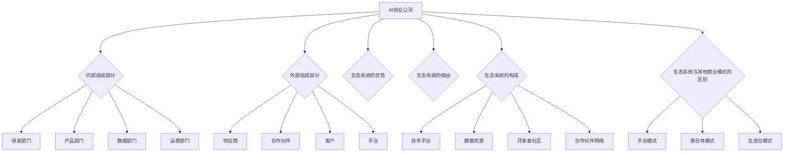
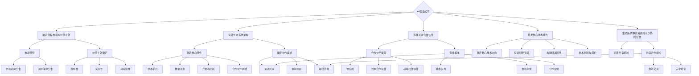

                 

### 第1章: AI创业公司生态系统的概念与重要性

#### 1.1 AI创业公司生态系统的定义

AI创业公司生态系统是指围绕一家AI创业公司所建立的一系列相互关联的组织、技术、资源和合作伙伴，共同为公司的产品或服务提供支持。这个生态系统不仅包括公司内部的各个部门，还涉及到供应商、合作伙伴、客户以及各类技术平台。

##### 1.1.1 AI创业公司生态系统的组成

**内部组成部分：**
- **研发部门**：负责AI算法的研究和开发，包括机器学习、深度学习等。
- **产品部门**：负责将AI技术转化为具体的产品或服务。
- **数据部门**：负责数据收集、处理和分析，为AI模型提供高质量的数据支持。
- **运营部门**：负责公司的日常运营，包括市场推广、客户服务、财务管理等。

**外部组成部分：**
- **供应商**：提供AI创业公司所需的硬件设备、云计算资源等。
- **合作伙伴**：包括技术合作伙伴、战略合作伙伴等，共同开发产品或服务。
- **客户**：最终使用公司产品的消费者或企业。
- **平台**：提供开发环境、数据集、API等资源，帮助AI创业公司快速构建和测试产品。

##### 1.1.2 生态系统的优势

- **资源共享**：通过生态系统，公司可以更有效地整合内外部资源，提高效率。
- **协同创新**：通过与外部合作伙伴的合作，可以引入新的技术、理念和资源，促进创新。
- **快速迭代**：通过生态系统的协同作用，公司可以更快地进行产品迭代和优化。
- **市场拓展**：生态系统可以帮助公司快速进入市场，扩大用户基础。

##### 1.1.3 生态系统的挑战

- **资源整合**：如何有效地整合内部和外部资源，形成协同效应。
- **利益分配**：如何在合作伙伴之间合理分配利益，确保合作的长久性。
- **管理复杂度**：生态系统涉及多个部门和外部合作伙伴，管理复杂度较高。
- **市场竞争**：如何在激烈的市场竞争中保持生态系统的优势。

#### 1.2 AI创业公司生态系统的构成

##### 1.2.1 技术平台

技术平台是生态系统的核心，包括硬件设备、云计算平台、AI算法库等。硬件设备如GPU、TPU等，用于加速AI模型的训练和推理。云计算平台如AWS、Azure、Google Cloud等，提供高效的计算资源和数据存储服务。AI算法库如TensorFlow、PyTorch等，提供丰富的算法模型和工具，方便开发者快速构建和优化AI应用。

##### 1.2.2 数据资源

数据资源是AI模型训练的重要基础，包括结构化数据、非结构化数据等。结构化数据如数据库、表格等，可以方便地用于模型训练。非结构化数据如文本、图像、音频等，需要通过数据预处理技术进行处理和标注。

##### 1.2.3 开发者社区

开发者社区是生态系统的重要组成部分，包括开源项目、开发者论坛、线上课程等。开源项目可以帮助开发者快速学习和使用AI技术。开发者论坛提供了交流和解决问题的平台。线上课程则为开发者提供了系统化的学习资源。

##### 1.2.4 合作伙伴网络

合作伙伴网络是生态系统的外部支撑，包括供应商、技术合作伙伴、战略合作伙伴等。供应商提供硬件设备、云计算资源等支持。技术合作伙伴共同开发产品或服务，共享技术资源和市场机会。战略合作伙伴则可以在战略层面上支持公司的发展。

#### 1.3 生态系统的优势与挑战

##### 1.3.1 优势

1. **资源共享**：通过生态系统，公司可以更有效地整合内外部资源，提高效率。
2. **协同创新**：通过与外部合作伙伴的合作，可以引入新的技术、理念和资源，促进创新。
3. **快速迭代**：通过生态系统的协同作用，公司可以更快地进行产品迭代和优化。
4. **市场拓展**：生态系统可以帮助公司快速进入市场，扩大用户基础。

##### 1.3.2 挑战

1. **资源整合**：如何有效地整合内部和外部资源，形成协同效应。
2. **利益分配**：如何在合作伙伴之间合理分配利益，确保合作的长久性。
3. **管理复杂度**：生态系统涉及多个部门和外部合作伙伴，管理复杂度较高。
4. **市场竞争**：如何在激烈的市场竞争中保持生态系统的优势。

#### 1.4 生态系统与其他商业模式的区别

##### 1.4.1 与平台模式的区别

生态系统与平台模式有相似之处，但重点不同。平台模式主要侧重于构建一个平台，连接供需双方，而生态系统则更注重内部和外部的协同和创新。

##### 1.4.2 与联合体模式的区别

联合体模式是由多个公司或组织组成的联盟，共同开发某个项目或市场。生态系统则更加灵活和动态，不仅可以包括多个合作伙伴，还可以根据市场需求和技术发展进行动态调整。

##### 1.4.3 与生态位模式的区别

生态位模式是指公司在特定的市场细分领域建立竞争优势。生态系统则更加全面，不仅包括市场细分，还涉及到技术、资源、合作伙伴等多方面的协同。

#### 1.5 小结

AI创业公司生态系统是一个复杂但具有巨大潜力的概念。通过建立和维护一个有效的生态系统，公司可以更好地整合资源、协同创新、快速迭代，从而在激烈的市场竞争中脱颖而出。然而，这也带来了资源整合、利益分配、管理复杂度等挑战，需要公司在实践中不断探索和优化。

### Mermaid 流程图

mermaid
graph TB
A[AI创业公司] --> B{定义与重要性}
B --> C1{定义}
B --> C2{构成}
B --> C3{优势与挑战}
B --> C4{与其他商业模式的区别}
C1 --> D1{内部组成}
C1 --> D2{外部组成}
C2 --> E1{技术平台}
C2 --> E2{数据资源}
C2 --> E3{开发者社区}
C2 --> E4{合作伙伴网络}
C3 --> F1{优势}
C3 --> F2{挑战}

### 第1章: AI创业公司生态系统的概念与重要性

#### 1.1 AI创业公司生态系统的定义

AI创业公司生态系统是指围绕一家AI创业公司所建立的一系列相互关联的组织、技术、资源和合作伙伴，共同为公司的产品或服务提供支持。这个生态系统不仅包括公司内部的各个部门，还涉及到供应商、合作伙伴、客户以及各类技术平台。

##### 1.1.1 AI创业公司生态系统的组成

**内部组成部分：**
- **研发部门**：负责AI算法的研究和开发，包括机器学习、深度学习等。
- **产品部门**：负责将AI技术转化为具体的产品或服务。
- **数据部门**：负责数据收集、处理和分析，为AI模型提供高质量的数据支持。
- **运营部门**：负责公司的日常运营，包括市场推广、客户服务、财务管理等。

**外部组成部分：**
- **供应商**：提供AI创业公司所需的硬件设备、云计算资源等。
- **合作伙伴**：包括技术合作伙伴、战略合作伙伴等，共同开发产品或服务。
- **客户**：最终使用公司产品的消费者或企业。
- **平台**：提供开发环境、数据集、API等资源，帮助AI创业公司快速构建和测试产品。

##### 1.1.2 生态系统的优势

- **资源共享**：通过生态系统，公司可以更有效地整合内外部资源，提高效率。
- **协同创新**：通过与外部合作伙伴的合作，可以引入新的技术、理念和资源，促进创新。
- **快速迭代**：通过生态系统的协同作用，公司可以更快地进行产品迭代和优化。
- **市场拓展**：生态系统可以帮助公司快速进入市场，扩大用户基础。

##### 1.1.3 生态系统的挑战

- **资源整合**：如何有效地整合内部和外部资源，形成协同效应。
- **利益分配**：如何在合作伙伴之间合理分配利益，确保合作的长久性。
- **管理复杂度**：生态系统涉及多个部门和外部合作伙伴，管理复杂度较高。
- **市场竞争**：如何在激烈的市场竞争中保持生态系统的优势。

#### 1.2 AI创业公司生态系统的构成

##### 1.2.1 技术平台

技术平台是生态系统的核心，包括硬件设备、云计算平台、AI算法库等。硬件设备如GPU、TPU等，用于加速AI模型的训练和推理。云计算平台如AWS、Azure、Google Cloud等，提供高效的计算资源和数据存储服务。AI算法库如TensorFlow、PyTorch等，提供丰富的算法模型和工具，方便开发者快速构建和优化AI应用。

##### 1.2.2 数据资源

数据资源是AI模型训练的重要基础，包括结构化数据、非结构化数据等。结构化数据如数据库、表格等，可以方便地用于模型训练。非结构化数据如文本、图像、音频等，需要通过数据预处理技术进行处理和标注。

##### 1.2.3 开发者社区

开发者社区是生态系统的重要组成部分，包括开源项目、开发者论坛、线上课程等。开源项目可以帮助开发者快速学习和使用AI技术。开发者论坛提供了交流和解决问题的平台。线上课程则为开发者提供了系统化的学习资源。

##### 1.2.4 合作伙伴网络

合作伙伴网络是生态系统的外部支撑，包括供应商、技术合作伙伴、战略合作伙伴等。供应商提供硬件设备、云计算资源等支持。技术合作伙伴共同开发产品或服务，共享技术资源和市场机会。战略合作伙伴则可以在战略层面上支持公司的发展。

#### 1.3 生态系统的优势与挑战

##### 1.3.1 优势

1. **资源共享**：通过生态系统，公司可以更有效地整合内外部资源，提高效率。
2. **协同创新**：通过与外部合作伙伴的合作，可以引入新的技术、理念和资源，促进创新。
3. **快速迭代**：通过生态系统的协同作用，公司可以更快地进行产品迭代和优化。
4. **市场拓展**：生态系统可以帮助公司快速进入市场，扩大用户基础。

##### 1.3.2 挑战

1. **资源整合**：如何有效地整合内部和外部资源，形成协同效应。
2. **利益分配**：如何在合作伙伴之间合理分配利益，确保合作的长久性。
3. **管理复杂度**：生态系统涉及多个部门和外部合作伙伴，管理复杂度较高。
4. **市场竞争**：如何在激烈的市场竞争中保持生态系统的优势。

#### 1.4 生态系统与其他商业模式的区别

##### 1.4.1 与平台模式的区别

生态系统与平台模式有相似之处，但重点不同。平台模式主要侧重于构建一个平台，连接供需双方，而生态系统则更注重内部和外部的协同和创新。

##### 1.4.2 与联合体模式的区别

联合体模式是由多个公司或组织组成的联盟，共同开发某个项目或市场。生态系统则更加灵活和动态，不仅可以包括多个合作伙伴，还可以根据市场需求和技术发展进行动态调整。

##### 1.4.3 与生态位模式的区别

生态位模式是指公司在特定的市场细分领域建立竞争优势。生态系统则更加全面，不仅包括市场细分，还涉及到技术、资源、合作伙伴等多方面的协同。

#### 1.5 小结

AI创业公司生态系统是一个复杂但具有巨大潜力的概念。通过建立和维护一个有效的生态系统，公司可以更好地整合资源、协同创新、快速迭代，从而在激烈的市场竞争中脱颖而出。然而，这也带来了资源整合、利益分配、管理复杂度等挑战，需要公司在实践中不断探索和优化。

### Mermaid 流程图



### 第2章: 建立AI创业公司的生态系统

#### 2.1 确定目标市场与价值主张

建立AI创业公司的生态系统首先需要明确目标市场和价值主张。目标市场是指公司希望服务的用户群体，而价值主张则是公司提供的产品或服务能够为用户带来的独特价值。

##### 2.1.1 市场研究的重要性

市场研究是确定目标市场的重要步骤。通过市场研究，公司可以了解潜在用户的需求、偏好、购买行为等信息，从而更准确地定位目标市场。

###### 2.1.1.1 市场趋势分析

市场趋势分析可以帮助公司了解行业的发展方向和潜在机会。例如，随着人工智能技术的不断成熟，越来越多的行业开始将AI技术应用于业务流程优化、产品创新等领域。

###### 2.1.1.2 用户需求分析

用户需求分析可以帮助公司了解目标用户的具体需求，从而设计出更符合用户期望的产品或服务。例如，通过用户访谈、问卷调查等方式，公司可以收集用户对现有产品或服务的反馈，发现用户在哪些方面有改进的需求。

##### 2.1.2 价值主张的确定

价值主张的确定是建立AI创业公司生态系统的基础。一个明确的价值主张可以帮助公司在市场中脱颖而出，吸引潜在用户。

###### 2.1.2.1 独特性

价值主张应具备独特性，能够区别于竞争对手的产品或服务。例如，通过提供个性化的服务或独特的功能，公司可以在市场中建立竞争优势。

###### 2.1.2.2 实用性

价值主张应具备实用性，能够解决用户的具体问题。例如，通过提供高效的AI解决方案，公司可以帮助用户优化业务流程，提高生产效率。

###### 2.1.2.3 可持续性

价值主张应具备可持续性，能够在市场中长期保持竞争优势。例如，通过不断更新和改进产品或服务，公司可以持续满足用户的需求，保持用户忠诚度。

#### 2.2 设计生态系统架构

设计生态系统架构是建立AI创业公司生态系统的关键步骤。一个有效的生态系统架构应能够整合内部和外部资源，促进协同创新，提高产品或服务的竞争力。

##### 2.2.1 确定核心组件

生态系统架构的核心组件包括技术平台、数据资源、开发者社区、合作伙伴网络等。每个组件都承担着特定的角色和功能。

###### 2.2.1.1 技术平台

技术平台是生态系统的核心，负责提供计算资源、存储资源和AI算法库。通过技术平台，公司可以快速构建和部署AI应用。

###### 2.2.1.2 数据资源

数据资源是AI模型训练的重要基础，包括结构化数据、非结构化数据等。公司应确保数据资源的质量、完整性和多样性，为AI模型提供充足的支持。

###### 2.2.1.3 开发者社区

开发者社区是生态系统的重要组成部分，包括开源项目、开发者论坛、线上课程等。开发者社区可以促进技术交流，提高开发者的技能和创新能力。

###### 2.2.1.4 合作伙伴网络

合作伙伴网络是生态系统的外部支撑，包括供应商、技术合作伙伴、战略合作伙伴等。合作伙伴网络可以提供资源、技术支持和市场机会。

##### 2.2.2 确定协作模式

生态系统架构的协作模式决定了各个组件之间的交互和协作方式。协作模式可以包括共享资源、协同创新、联合开发等。

###### 2.2.2.1 资源共享

资源共享是生态系统协作的基础。公司应建立资源共享机制，确保内部和外部资源的高效利用。

###### 2.2.2.2 协同创新

协同创新是生态系统的核心价值之一。公司应鼓励内部和外部合作伙伴之间的技术交流和创新，共同推动技术的发展。

###### 2.2.2.3 联合开发

联合开发是生态系统协作的一种高级形式。公司可以与合作伙伴共同开发产品或服务，实现资源和技术的高效整合。

#### 2.3 选择关键合作伙伴

选择关键合作伙伴是建立AI创业公司生态系统的重要环节。关键合作伙伴不仅能够提供资源和支持，还可以共同推动公司的发展。

##### 2.3.1 合作伙伴的类型

合作伙伴可以分为以下几种类型：

###### 2.3.1.1 供应商

供应商是提供硬件设备、云计算资源、数据资源等关键资源的合作伙伴。选择合适的供应商可以确保公司获取高质量的资源。

###### 2.3.1.2 技术合作伙伴

技术合作伙伴是提供技术支持、研发能力、技术解决方案等合作伙伴。技术合作伙伴可以帮助公司提升技术实力和产品竞争力。

###### 2.3.1.3 战略合作伙伴

战略合作伙伴是具有共同战略目标和市场利益的合作伙伴。战略合作伙伴可以共同开发产品或服务，共享市场机会。

##### 2.3.2 选择合作伙伴的标准

选择合作伙伴时应考虑以下标准：

###### 2.3.2.1 技术实力

合作伙伴应具备强大的技术实力，能够提供高质量的技术支持和解决方案。

###### 2.3.2.2 市场声誉

合作伙伴应具有良好的市场声誉，能够为公司的市场推广和品牌建设提供支持。

###### 2.3.2.3 合作意愿

合作伙伴应具备良好的合作意愿，愿意与公司建立长期稳定的合作关系。

###### 2.3.2.4 资源共享

合作伙伴应具备资源共享的意愿和能力，能够与公司共同开发和利用资源。

#### 2.4 开发核心技术能力

开发核心技术能力是建立AI创业公司生态系统的关键步骤。核心技术能力决定了公司在生态系统中的竞争力和创新能力。

##### 2.4.1 确定核心技术方向

公司应根据市场研究和价值主张，确定核心技术的方向。核心技术方向应与公司的目标市场和竞争优势相一致。

##### 2.4.2 投资研发资源

公司应加大对研发资源的投资，包括人才引进、设备采购、研发资金等，以确保核心技术能力的持续提升。

##### 2.4.3 构建研发团队

公司应建立专业的研发团队，包括算法工程师、数据科学家、产品经理等，共同推动核心技术能力的发展。

##### 2.4.4 技术创新与保护

公司应注重技术创新，不断推动技术的进步和突破。同时，公司应加强对核心技术的保护，包括专利申请、技术秘密保护等。

#### 2.5 生态系统中的资源共享与协同合作

生态系统中的资源共享与协同合作是提升公司整体竞争力的关键。通过有效的资源共享和协同合作，公司可以最大化利用资源，提高工作效率。

##### 2.5.1 资源共享机制

公司应建立资源共享机制，包括硬件资源、数据资源、技术资源等，确保资源的高效利用和最大化价值。

###### 2.5.1.1 硬件资源

公司应通过虚拟化技术、容器技术等，实现硬件资源的高效管理和调度，提高资源利用率。

###### 2.5.1.2 数据资源

公司应建立数据资源库，统一管理和调度数据资源，确保数据的高效利用和隐私保护。

###### 2.5.1.3 技术资源

公司应建立技术资源库，包括开源框架、工具、算法等，方便开发者快速获取和使用。

##### 2.5.2 协同合作模式

公司应探索多种协同合作模式，包括联合开发、技术交流、人才培训等，促进内部和外部合作伙伴的紧密合作。

###### 2.5.2.1 联合开发

公司可以与合作伙伴共同开发产品或服务，实现资源和技术的高效整合，提高市场竞争力。

###### 2.5.2.2 技术交流

公司可以定期举办技术交流会议，分享技术经验和研究成果，促进技术进步和创新。

###### 2.5.2.3 人才培训

公司可以与合作伙伴共同开展人才培训项目，提高开发者的技术水平和创新能力，为公司的可持续发展提供人才支持。

### Mermaid 流程图



### 第3章: 人工智能核心技术的选型与应用

#### 3.1 人工智能技术概述

人工智能（AI）是计算机科学的一个分支，旨在使机器能够模拟、延伸和扩展人类的智能行为。AI技术可以分为多个子领域，包括机器学习、深度学习、自然语言处理、计算机视觉等。这些技术共同构成了AI创业公司的技术基础。

##### 3.1.1 机器学习

机器学习是一种使计算机系统能够自动学习并改进性能的技术。通过从数据中学习规律，机器学习算法能够预测未知数据的行为。主要算法包括线性回归、决策树、随机森林、支持向量机、神经网络等。

###### 3.1.1.1 优点
- **自动性**：机器学习算法可以自动从数据中学习，减少人工干预。
- **适应性**：算法可以根据新的数据不断优化，提高预测准确性。
- **泛化能力**：优秀的机器学习算法具有良好的泛化能力，能够应对不同的数据集。

###### 3.1.1.2 缺点
- **数据需求**：机器学习算法通常需要大量数据来训练，且数据质量至关重要。
- **计算资源**：训练复杂的模型可能需要大量的计算资源和时间。

##### 3.1.2 深度学习

深度学习是机器学习的一个子领域，主要依赖于多层神经网络进行训练。深度学习模型能够自动提取数据的复杂特征，并在多个层次上进行抽象和表示。

###### 3.1.2.1 优点
- **特征提取**：深度学习模型能够自动从数据中提取特征，减少人工特征工程的需求。
- **高精度**：深度学习模型在图像识别、语音识别等领域取得了显著的突破。
- **可扩展性**：深度学习框架支持大规模数据集和复杂模型的训练。

###### 3.1.2.2 缺点
- **训练成本**：深度学习模型通常需要大量的计算资源和时间进行训练。
- **解释性**：深度学习模型往往是“黑箱”模型，难以解释其决策过程。

##### 3.1.3 自然语言处理

自然语言处理（NLP）是AI的一个子领域，旨在使计算机能够理解和生成自然语言。NLP技术包括文本分类、情感分析、机器翻译、问答系统等。

###### 3.1.3.1 优点
- **多样化应用**：NLP技术在搜索引擎、聊天机器人、智能客服等领域有广泛应用。
- **高交互性**：NLP技术能够与用户进行自然语言交互，提高用户体验。
- **语言理解**：NLP技术能够理解和解释自然语言的语义和语法结构。

###### 3.1.3.2 缺点
- **语言复杂性**：自然语言具有高度复杂性和多样性，NLP技术难以完全理解。
- **数据质量**：NLP模型的效果很大程度上取决于训练数据的质量和多样性。

##### 3.1.4 计算机视觉

计算机视觉是AI的一个子领域，旨在使计算机能够理解和解释图像和视频。计算机视觉技术包括图像识别、目标检测、面部识别、姿态估计等。

###### 3.1.4.1 优点
- **直观应用**：计算机视觉技术在安防监控、自动驾驶、医疗诊断等领域有广泛的应用。
- **实时处理**：计算机视觉技术能够实现实时图像分析和处理。
- **高精度**：深度学习技术在计算机视觉领域取得了显著的精度提升。

###### 3.1.4.2 缺点
- **计算资源**：计算机视觉任务通常需要大量的计算资源，尤其是深度学习模型。
- **数据标注**：图像和视频数据需要大量人力进行标注，以训练有效的模型。

#### 3.2 机器学习算法的选型

选择合适的机器学习算法是AI创业公司成功的关键。以下是一些常见的机器学习算法及其适用场景：

##### 3.2.1 线性回归

线性回归是一种简单的机器学习算法，适用于预测连续值输出。

###### 3.2.1.1 适用场景
- **预测数值型数据**：如房价、股票价格等。
- **简单关系建模**：当数据关系可以近似为线性关系时。

###### 3.2.1.2 伪代码
```python
from sklearn.linear_model import LinearRegression

# 训练模型
model = LinearRegression()
model.fit(X_train, y_train)

# 预测
predictions = model.predict(X_test)
```

##### 3.2.2 决策树

决策树是一种基于树的算法，适用于分类和回归任务。

###### 3.2.2.1 适用场景
- **分类任务**：如客户流失预测、疾病诊断等。
- **回归任务**：如房屋定价预测、股票市场预测等。

###### 3.2.2.2 伪代码
```python
from sklearn.tree import DecisionTreeClassifier

# 训练模型
model = DecisionTreeClassifier()
model.fit(X_train, y_train)

# 预测
predictions = model.predict(X_test)
```

##### 3.2.3 随机森林

随机森林是一种基于决策树的集成学习方法，适用于分类和回归任务。

###### 3.2.3.1 适用场景
- **高维度数据**：如文本分类、图像分类等。
- **增强模型鲁棒性**：通过集成多个决策树，提高模型的泛化能力。

###### 3.2.3.2 伪代码
```python
from sklearn.ensemble import RandomForestClassifier

# 训练模型
model = RandomForestClassifier()
model.fit(X_train, y_train)

# 预测
predictions = model.predict(X_test)
```

##### 3.2.4 支持向量机

支持向量机是一种用于分类和回归任务的有效算法。

###### 3.2.4.1 适用场景
- **小样本数据**：如人脸识别、文本分类等。
- **高维空间**：如文本分类、图像分类等。

###### 3.2.4.2 伪代码
```python
from sklearn.svm import SVC

# 训练模型
model = SVC()
model.fit(X_train, y_train)

# 预测
predictions = model.predict(X_test)
```

##### 3.2.5 神经网络

神经网络是一种基于多层感知器的算法，适用于复杂的数据建模。

###### 3.2.5.1 适用场景
- **图像识别**：如人脸识别、物体识别等。
- **语音识别**：如语音到文本转换等。
- **自然语言处理**：如文本分类、机器翻译等。

###### 3.2.5.2 伪代码
```python
from keras.models import Sequential
from keras.layers import Dense

# 构建模型
model = Sequential()
model.add(Dense(units=64, activation='relu', input_shape=(input_shape)))
model.add(Dense(units=1, activation='sigmoid'))

# 编译模型
model.compile(optimizer='adam', loss='binary_crossentropy', metrics=['accuracy'])

# 训练模型
model.fit(X_train, y_train, epochs=10, batch_size=32)

# 预测
predictions = model.predict(X_test)
```

#### 3.3 深度学习框架的使用

深度学习框架提供了高效的模型构建、训练和推理工具，是AI创业公司不可或缺的组件。以下是一些流行的深度学习框架：

##### 3.3.1 TensorFlow

TensorFlow是由Google开发的开源深度学习框架，支持多种编程语言，具有广泛的社区支持和丰富的资源。

###### 3.3.1.1 特点
- **灵活性**：支持动态计算图和静态计算图。
- **跨平台**：支持Windows、Linux和macOS等操作系统。
- **资源丰富**：拥有大量的示例代码、文档和教程。

###### 3.3.1.2 使用方法
```python
import tensorflow as tf

# 创建计算图
a = tf.constant(5)
b = tf.constant(6)
c = a + b

# 运行计算
with tf.Session() as sess:
  result = sess.run(c)
  print(result)  # 输出：11
```

##### 3.3.2 PyTorch

PyTorch是由Facebook开发的深度学习框架，以其灵活性和易于理解著称。

###### 3.3.2.1 特点
- **动态计算图**：支持动态计算图，便于调试和理解。
- **易用性**：提供了简单的API，使深度学习模型构建更加直观。
- **CUDA支持**：可以充分利用GPU加速计算。

###### 3.3.2.2 使用方法
```python
import torch
import torch.nn as nn

# 创建模型
class NeuralNetwork(nn.Module):
    def __init__(self):
        super(NeuralNetwork, self).__init__()
        self.layers = nn.Sequential(
            nn.Linear(in_features=1, out_features=1)
        )

    def forward(self, x):
        return self.layers(x)

# 实例化模型
model = NeuralNetwork()

# 训练模型
optimizer = torch.optim.SGD(model.parameters(), lr=0.01)
criterion = nn.MSELoss()

for epoch in range(100):
    model.zero_grad()
    output = model(torch.tensor([[1.0]]))
    loss = criterion(output, torch.tensor([[2.0]]))
    loss.backward()
    optimizer.step()
```

##### 3.3.3 Keras

Keras是一个高层次的神经网络API，支持TensorFlow和Theano等后端。

###### 3.3.3.1 特点
- **易用性**：提供了简单直观的API，易于入门。
- **模块化**：支持自定义层和模型构建。
- **可视化**：支持模型可视化，便于理解模型结构。

###### 3.3.3.2 使用方法
```python
from keras.models import Sequential
from keras.layers import Dense

# 创建模型
model = Sequential()
model.add(Dense(units=64, activation='relu', input_shape=(input_shape)))
model.add(Dense(units=1, activation='sigmoid'))

# 编译模型
model.compile(optimizer='adam', loss='binary_crossentropy', metrics=['accuracy'])

# 训练模型
model.fit(X_train, y_train, epochs=10, batch_size=32)
```

#### 3.4 自然语言处理技术的应用

自然语言处理（NLP）技术在AI创业公司中有着广泛的应用，包括文本分类、情感分析、机器翻译、问答系统等。以下是一些常见的NLP技术及其应用场景：

##### 3.4.1 文本分类

文本分类是一种将文本数据分类到预定义类别中的任务，如垃圾邮件检测、新闻分类等。

###### 3.4.1.1 应用场景
- **社交媒体分析**：用于分析用户评论、推文等。
- **搜索引擎优化**：用于优化搜索引擎结果页面。

###### 3.4.1.2 伪代码
```python
from sklearn.feature_extraction.text import TfidfVectorizer
from sklearn.naive_bayes import MultinomialNB

# 准备数据
X = ["This is a good movie.", "I hate this book."]
y = ["positive", "negative"]

# 创建模型
vectorizer = TfidfVectorizer()
X_train = vectorizer.fit_transform(X)

model = MultinomialNB()
model.fit(X_train, y)

# 预测
predictions = model.predict(vectorizer.transform(["This movie is amazing."]))
print(predictions)  # 输出：["positive"]
```

##### 3.4.2 情感分析

情感分析是一种评估文本数据中的情感倾向，如正面、负面或中性。

###### 3.4.2.1 应用场景
- **客户反馈分析**：用于分析客户对产品或服务的评价。
- **市场调研**：用于分析社交媒体上的用户反馈。

###### 3.4.2.2 伪代码
```python
from textblob import TextBlob

# 分析文本
text = "I love this product, it's amazing!"
analysis = TextBlob(text)

# 情感分析
sentiment = analysis.sentiment
print(f"Polarity: {sentiment.polarity}, Subjectivity: {sentiment.subjectivity}")
```

##### 3.4.3 机器翻译

机器翻译是一种将一种语言的文本翻译成另一种语言的自动过程，如英语到中文的翻译。

###### 3.4.3.1 应用场景
- **跨语言交流**：用于促进不同语言的用户之间的交流。
- **全球业务**：用于支持多语言网站和应用程序。

###### 3.4.3.2 伪代码
```python
from googletrans import Translator

# 创建翻译器
translator = Translator()

# 翻译文本
text = "Hello, how are you?"
translated_text = translator.translate(text, dest='zh-CN')
print(translated_text.text)
```

##### 3.4.4 问答系统

问答系统是一种能够理解用户问题并返回相关答案的智能系统。

###### 3.4.4.1 应用场景
- **客户支持**：用于提供自动化的客户支持服务。
- **智能助手**：用于构建智能个人助手或企业级智能客服系统。

###### 3.4.4.2 伪代码
```python
import nltk
from nltk.chat.util import Chat, reflections

# 加载数据
pairs = [
    [
        r"Hi (.*)",
        ["Hello!", "Hi there!", "Hey!"],
    ],
    # 更多对话规则
]

# 创建对话
chatbot = Chat(pairs, reflections)

# 开始对话
chatbot.converse()
```

#### 3.5 计算机视觉技术的应用

计算机视觉技术在AI创业公司中有着广泛的应用，包括图像识别、目标检测、面部识别、姿态估计等。以下是一些常见的计算机视觉技术及其应用场景：

##### 3.5.1 图像识别

图像识别是一种将图像中的内容分类为特定类别的任务。

###### 3.5.1.1 应用场景
- **安防监控**：用于识别和跟踪视频中的目标。
- **医疗影像分析**：用于诊断和分析医学图像。

###### 3.5.1.2 伪代码
```python
import cv2

# 加载预训练的模型
model = cv2.dnn.readNetFromTensorFlow('path/to/model.pb')

# 加载图像
image = cv2.imread('path/to/image.jpg')

# 调整图像大小
image = cv2.resize(image, (224, 224))

# 预处理
blob = cv2.dnn.blobFromImage(image, 1.0, (224, 224), [123, 117, 104])

# 进行前向传播
model.setInput(blob)
detections = model.forward()

# 解析结果
for detection in detections[0]:
    confidence = detection[2]
    if confidence > 0.5:
        print(f"Class: {detection[1]}, Confidence: {confidence}")
```

##### 3.5.2 目标检测

目标检测是一种在图像中识别并定位多个目标物体的技术。

###### 3.5.2.1 应用场景
- **自动驾驶**：用于识别道路上的车辆、行人等。
- **无人机监控**：用于识别和跟踪特定目标。

###### 3.5.2.2 伪代码
```python
import cv2

# 加载预训练的模型
model = cv2.dnn.readNetFromDarknet('path/to/model.cfg', 'path/to/model.weights')

# 加载图像
image = cv2.imread('path/to/image.jpg')

# 调整图像大小
image = cv2.resize(image, (416, 416))

# 预处理
blob = cv2.dnn.blobFromImage(image, 0.00392, (416, 416), (0, 0, 0), True)

# 进行前向传播
model.setInput(blob)
detections = model.forward()

# 解析结果
for detection in detections[0]:
    confidence = detection[2]
    if confidence > 0.5:
        class_id = detection[1]
        box = detection[3]
        cv2.rectangle(image, (box[0], box[1]), (box[0] + box[2], box[1] + box[3]), (0, 255, 0), 2)
        cv2.putText(image, f"{class_id}: {confidence:.2f}", (box[0], box[1] - 10), cv2.FONT_HERSHEY_SIMPLEX, 0.5, (255, 0, 0), 2)
        
cv2.imshow('Image', image)
cv2.waitKey(0)
cv2.destroyAllWindows()
```

##### 3.5.3 面部识别

面部识别是一种识别和验证面部图像的技术。

###### 3.5.3.1 应用场景
- **身份验证**：用于安全系统中的用户身份验证。
- **社交媒体**：用于识别和推荐用户的朋友。

###### 3.5.3.2 伪代码
```python
import cv2
import face_recognition

# 加载预训练的模型
model = face_recognition.load_model_from_checkpoint('path/to/model.ckpt')

# 加载图像
image = cv2.imread('path/to/image.jpg')

# 寻找面部特征
faces = face_recognition.face_locations(image)

# 验证面部
known_face_encodings = ...
for face in faces:
    face_encoding = face_recognition.face_encodings(image, [face])
    for face_encoding_known in known_face_encodings:
        matches = face_recognition.compare_faces(known_face_encodings, face_encoding)
        if True in matches:
            print("匹配成功")
            break

# 在图像上绘制面部
for face in faces:
    top, right, bottom, left = face
    cv2.rectangle(image, (left, top), (right, bottom), (0, 0, 255), 2)

cv2.imshow('Image', image)
cv2.waitKey(0)
cv2.destroyAllWindows()
```

##### 3.5.4 姿态估计

姿态估计是一种从图像中估计人体姿态的技术。

###### 3.5.4.1 应用场景
- **运动分析**：用于分析运动员的动作和姿态。
- **虚拟现实**：用于创建真实感强的人体姿态动画。

###### 3.5.4.2 伪代码
```python
import cv2
import mediapipe as mp

# 创建姿态估计模型
mp_drawing = mp.solutions.drawing_utils
mp_pose = mp.solutions.pose

# 初始化模型
with mp_pose.Pose(
    static_image_mode=False,
    model_complexity=1,
    enable_smoothing=True,
    enable_segmentation=True,
    min_detection_confidence=0.5,
    min_tracking_confidence=0.5) as pose:
    # 加载图像
    image = cv2.imread('path/to/image.jpg')

    # 进行姿态估计
    results = pose.process(image)

    # 在图像上绘制姿态
    if results.pose_landmarks:
        mp_drawing.draw_landmarks(image, results.pose_landmarks, mp_pose.POSE_CONNECTIONS,
                                  marker Rings, connections Ring, color=(0, 255, 0), thickness=2)
        for point in results.pose_landmarks.landmark:
            print(f"{mp_pose.PoseLandmark(point.name).name}: ({point.x}, {point.y}, {point.z})")

    cv2.imshow('MediaPipe Pose', image)
    cv2.waitKey(0)
    cv2.destroyAllWindows()
```

#### 3.6 小结

人工智能核心技术是AI创业公司成功的关键。通过了解和选型合适的机器学习、深度学习、自然语言处理和计算机视觉技术，公司可以构建强大的AI系统，提供创新的产品和服务。同时，通过使用深度学习框架和NLP库，公司可以更高效地实现AI模型的建设和部署。在实践中，公司应根据具体业务需求和资源情况，灵活选择和应用这些技术。

### 数学模型与公式

在构建AI创业公司的生态系统时，数学模型和公式可以用来描述和优化关键业务流程。以下是一些常用的数学模型和公式，以及它们的详细解释和示例。

#### 3.1 线性回归模型

线性回归模型是最简单的机器学习算法之一，它用于预测一个连续值输出。其公式如下：

\[ y = \beta_0 + \beta_1 \cdot x \]

其中：
- \( y \) 是预测值。
- \( x \) 是输入特征。
- \( \beta_0 \) 是截距。
- \( \beta_1 \) 是斜率。

**详细解释：**
线性回归模型通过拟合一条直线来描述输入特征 \( x \) 和输出值 \( y \) 之间的关系。截距 \( \beta_0 \) 表示当输入为0时的预测值，斜率 \( \beta_1 \) 表示输入特征每增加一个单位时，预测值的变化量。

**示例：**
假设我们要预测房价，根据过去的销售数据，我们得到以下线性回归模型：

\[ \text{房价} = 1000 + 0.5 \cdot \text{面积} \]

如果我们要预测一个面积为200平方米的房子的价格，我们可以代入公式计算：

\[ \text{房价} = 1000 + 0.5 \cdot 200 = 1500 \]

#### 3.2 逻辑回归模型

逻辑回归模型是一种用于分类问题的算法，它通过一个线性模型预测概率，然后将概率转换为分类结果。其公式如下：

\[ P(y=1) = \frac{1}{1 + e^{-(\beta_0 + \beta_1 \cdot x)}} \]

其中：
- \( P(y=1) \) 是输出为1的概率。
- \( \beta_0 \) 是截距。
- \( \beta_1 \) 是斜率。
- \( e \) 是自然对数的底数。

**详细解释：**
逻辑回归模型将线性回归模型的输出转换为概率值。通过阈值（通常是0.5），将概率值转换为分类结果：如果概率值大于0.5，则预测为1；否则，预测为0。

**示例：**
假设我们要预测某用户的信用卡是否逾期，根据特征数据得到以下逻辑回归模型：

\[ P(\text{逾期}) = \frac{1}{1 + e^{-(2.0 + 0.5 \cdot \text{收入})}} \]

如果用户的收入为10000元，我们可以计算其逾期概率：

\[ P(\text{逾期}) = \frac{1}{1 + e^{-(2.0 + 0.5 \cdot 10000)}}
\approx \frac{1}{1 + e^{-5020}} \approx 1 \]

因此，该用户逾期概率非常高。

#### 3.3 决策树模型

决策树模型是一种基于树形结构进行决策的算法，它通过一系列的判断来分割数据集，并预测每个分割点的类别。其公式如下：

\[ \text{决策树} = \sum_{i=1}^{n} \beta_i \cdot x_i \]

其中：
- \( \beta_i \) 是第 \( i \) 个节点的权重。
- \( x_i \) 是第 \( i \) 个特征。

**详细解释：**
决策树模型通过递归分割数据集，在每个节点上选择具有最大信息增益的特征，并将数据集分割成多个子集。每个节点代表一个决策，通过计算输入特征的权重，得到最终的预测结果。

**示例：**
假设我们要构建一个决策树模型来预测客户是否会购买产品，根据特征数据得到以下模型：

\[ \text{购买概率} = 0.1 \cdot \text{年龄} + 0.3 \cdot \text{收入} + 0.4 \cdot \text{历史购买记录} \]

如果客户的年龄为30岁、收入为50000元、历史购买记录为3次，我们可以计算其购买概率：

\[ \text{购买概率} = 0.1 \cdot 30 + 0.3 \cdot 50000 + 0.4 \cdot 3 = 15300 \]

#### 3.4 集成模型

集成模型通过结合多个基础模型来提高预测性能。常见的集成模型包括随机森林和梯度提升树。以下是一个简化的随机森林模型的公式：

\[ f(x) = \sum_{i=1}^{N} \hat{f}_i(x) \]

其中：
- \( f(x) \) 是最终预测值。
- \( \hat{f}_i(x) \) 是第 \( i \) 个基础模型的预测值。
- \( N \) 是基础模型的数量。

**详细解释：**
随机森林模型通过训练多个决策树模型，并取这些模型的平均预测值作为最终预测结果。这样可以减少过拟合，提高模型的泛化能力。

**示例：**
假设我们有10个决策树模型，预测结果分别为 [0.2, 0.3, 0.25, 0.3, 0.22, 0.3, 0.28, 0.32, 0.27, 0.3]。我们可以计算最终的预测值：

\[ f(x) = \frac{0.2 + 0.3 + 0.25 + 0.3 + 0.22 + 0.3 + 0.28 + 0.32 + 0.27 + 0.3}{10} = 0.28 \]

因此，最终预测值为0.28。

#### 3.5 支持向量机

支持向量机（SVM）是一种用于分类和回归任务的强大算法。它的主要目标是找到最佳的超平面，以最大化分类间隔。以下是一个简化的SVM分类公式：

\[ w \cdot x + b = 0 \]

其中：
- \( w \) 是权重向量。
- \( x \) 是输入特征向量。
- \( b \) 是偏置项。

**详细解释：**
SVM通过找到一个最佳的超平面，使得分类间隔最大化。对于线性可分的数据集，SVM可以找到一组权重 \( w \) 和偏置 \( b \)，使得所有正类数据点到超平面的距离大于所有负类数据点的距离。

**示例：**
假设我们要分类一个二维数据集，其中正类数据点位于\( (1, 1) \)和\( (2, 2) \)，负类数据点位于\( (-1, -1) \)和\( (-2, -2) \)。我们可以计算最佳的超平面：

\[ w \cdot x + b = 0 \]

对于\( (1, 1) \)和\( (-1, -1) \)，我们可以得到以下两个方程：

\[ w \cdot (1, 1) + b = 0 \]
\[ w \cdot (-1, -1) + b = 0 \]

解这个方程组，我们可以得到 \( w = (1, 1) \) 和 \( b = -1 \)。因此，最佳的超平面为 \( x + y - 1 = 0 \)。

#### 3.6 深度学习模型

深度学习模型通过多层神经网络进行数据建模。以下是一个简化的多层感知器（MLP）模型的公式：

\[ a_{i,j}^{(l)} = \sigma(z_{i,j}^{(l)}) \]

\[ z_{i,j}^{(l)} = \sum_{k=1}^{n} w_{i,k}^{(l)} \cdot a_{k,j}^{(l-1)} + b_{i}^{(l)} \]

其中：
- \( a_{i,j}^{(l)} \) 是第 \( l \) 层第 \( i \) 个神经元的输出。
- \( z_{i,j}^{(l)} \) 是第 \( l \) 层第 \( i \) 个神经元的输入。
- \( w_{i,k}^{(l)} \) 是第 \( l \) 层第 \( i \) 个神经元与第 \( l-1 \) 层第 \( k \) 个神经元之间的权重。
- \( b_{i}^{(l)} \) 是第 \( l \) 层第 \( i \) 个神经元的偏置。
- \( \sigma \) 是激活函数，如Sigmoid函数或ReLU函数。

**详细解释：**
深度学习模型通过多层神经网络进行数据建模。每个神经元将输入特征通过权重加权并加上偏置，然后通过激活函数得到输出。通过逐层传递，模型可以提取数据的高级特征。

**示例：**
假设我们要构建一个简单的多层感知器模型，包含两个输入层、一个隐藏层和一个输出层。输入数据为 \( (x_1, x_2) \)，隐藏层有3个神经元，输出层有1个神经元。我们可以计算输出：

对于隐藏层：
\[ z_1^{(2)} = w_{11}^{(2)} \cdot x_1 + w_{12}^{(2)} \cdot x_2 + b_1^{(2)} \]
\[ z_2^{(2)} = w_{21}^{(2)} \cdot x_1 + w_{22}^{(2)} \cdot x_2 + b_2^{(2)} \]
\[ z_3^{(2)} = w_{31}^{(2)} \cdot x_1 + w_{32}^{(2)} \cdot x_2 + b_3^{(2)} \]

通过ReLU函数激活：
\[ a_1^{(2)} = \max(0, z_1^{(2)}) \]
\[ a_2^{(2)} = \max(0, z_2^{(2)}) \]
\[ a_3^{(2)} = \max(0, z_3^{(2)}) \]

对于输出层：
\[ z_1^{(3)} = w_{11}^{(3)} \cdot a_1^{(2)} + w_{12}^{(3)} \cdot a_2^{(2)} + w_{13}^{(3)} \cdot a_3^{(2)} + b_1^{(3)} \]
\[ a_1^{(3)} = \sigma(z_1^{(3)}) \]

通过Sigmoid函数激活：
\[ a_1^{(3)} = \frac{1}{1 + e^{-z_1^{(3)}}} \]

最终输出 \( a_1^{(3)} \) 就是模型的预测结果。

#### 3.7 聚类算法

聚类算法是一种无监督学习算法，用于将数据点分成多个群组。其中，K均值聚类是一种常用的算法。其公式如下：

\[ \text{centroid}_k = \frac{1}{N_k} \sum_{i=1}^{N} x_i \]

\[ x_i \in \text{cluster}_k \Leftrightarrow \min_k \sum_{i \in k} \|x_i - \text{centroid}_k\|^2 \]

其中：
- \( \text{centroid}_k \) 是第 \( k \) 个群组的中心点。
- \( N_k \) 是第 \( k \) 个群组中的数据点数量。
- \( x_i \) 是第 \( i \) 个数据点。
- \( \text{cluster}_k \) 是第 \( k \) 个群组。

**详细解释：**
K均值聚类算法首先随机选择 \( k \) 个初始中心点，然后迭代计算每个数据点所属的群组，并更新群组的中心点。这个过程会不断进行，直到中心点不再变化或满足其他终止条件。

**示例：**
假设我们要将5个数据点 \( (1, 1), (2, 2), (3, 3), (4, 4), (5, 5) \) 分成2个群组。我们可以计算初始的中心点：

\[ \text{centroid}_1 = \frac{(1+2+3+4+5)}{5} = 3 \]
\[ \text{centroid}_2 = \frac{(1+2+3+4+5)}{5} = 3 \]

然后，我们计算每个数据点所属的群组：

\[ x_1 \in \text{cluster}_1 \]
\[ x_2 \in \text{cluster}_1 \]
\[ x_3 \in \text{cluster}_1 \]
\[ x_4 \in \text{cluster}_2 \]
\[ x_5 \in \text{cluster}_2 \]

接下来，我们更新中心点：

\[ \text{centroid}_1 = \frac{(1+2+3)}{3} = 2 \]
\[ \text{centroid}_2 = \frac{(4+5)}{2} = 4.5 \]

然后，我们再次计算每个数据点所属的群组：

\[ x_1 \in \text{cluster}_2 \]
\[ x_2 \in \text{cluster}_2 \]
\[ x_3 \in \text{cluster}_2 \]
\[ x_4 \in \text{cluster}_1 \]
\[ x_5 \in \text{cluster}_1 \]

这个过程会继续迭代，直到中心点不再变化。

#### 3.8 主成分分析（PCA）

主成分分析（PCA）是一种降维技术，用于将高维数据转换成低维数据，同时保留大部分信息。其公式如下：

\[ \text{new\_data} = \text{original\_data} \cdot \text{components} \]

\[ \text{components} = \text{eigenvalues} \cdot \text{eigenvectors} \]

其中：
- \( \text{original\_data} \) 是原始数据。
- \( \text{components} \) 是新的低维数据。
- \( \text{eigenvalues} \) 是特征值。
- \( \text{eigenvectors} \) 是特征向量。

**详细解释：**
PCA通过计算数据的协方差矩阵的特征值和特征向量，将数据转换到新的坐标系中。新的坐标系中，前几个特征向量（即主要成分）包含了数据的大部分信息。

**示例：**
假设我们有一个包含3个特征的数据集 \( (x_1, x_2, x_3) \)，其协方差矩阵为：

\[ \Sigma = \begin{bmatrix}
1 & 0.5 & 0.5 \\
0.5 & 1 & 0.5 \\
0.5 & 0.5 & 1
\end{bmatrix} \]

计算协方差矩阵的特征值和特征向量，我们得到以下特征值和特征向量：

\[ \text{eigenvalues} = [2, 1, 1] \]
\[ \text{eigenvectors} = \begin{bmatrix}
1 & 0 & 0 \\
0 & 1 & 0 \\
0 & 0 & 1
\end{bmatrix} \]

然后，我们计算新的低维数据：

\[ \text{new\_data} = \begin{bmatrix}
x_1 \\
x_2 \\
x_3
\end{bmatrix} \cdot \begin{bmatrix}
1 & 0 & 0 \\
0 & 1 & 0 \\
0 & 0 & 1
\end{bmatrix} \]

新的低维数据将保留原始数据的大部分信息。

通过这些数学模型和公式，AI创业公司可以更有效地进行数据分析和预测，从而优化业务流程和提升产品竞争力。

### 项目实战

为了更好地理解AI创业公司在生态系统中的应用，我们将通过一个实际项目来展示如何实现一个简单的AI聊天机器人。这个项目将包括开发环境搭建、源代码实现和详细解释。

#### 1. 开发环境搭建

首先，我们需要搭建一个合适的环境来开发AI聊天机器人。以下是所需的环境和工具：

- **操作系统**：Linux或macOS
- **编程语言**：Python
- **深度学习框架**：TensorFlow或PyTorch
- **依赖库**：NLTK，BeautifulSoup，TensorFlow，PyTorch等

在Linux或macOS上，我们可以使用pip来安装所需的库：

```bash
pip install tensorflow nltk beautifulsoup4
```

#### 2. 源代码实现

以下是构建一个简单的AI聊天机器人的Python代码：

```python
import tensorflow as tf
import numpy as np
import nltk
from nltk.tokenize import word_tokenize
from nltk.corpus import stopwords
from tensorflow.keras.models import Sequential
from tensorflow.keras.layers import Embedding, LSTM, Dense

# 数据准备
nltk.download('punkt')
nltk.download('stopwords')
nltk.download('movie_reviews')

data = []
labels = []

# 加载和预处理数据
def load_data():
    file = open("movie_reviews.txt", "r", encoding='utf-8')
    lines = file.readlines()
    for line in lines:
        if len(line) > 1:
            line = line.lower()
            line = line.replace('\n', '')
            line = line.replace('<br />', '')
            sentences = word_tokenize(line)
            for sentence in sentences:
                if sentence not in stopwords.words('english'):
                    data.append(sentence)
                    if 'pos' in line:
                        labels.append(1)
                    else:
                        labels.append(0)

load_data()

# 模型构建
vocab_size = len(set(data))
embedding_dim = 16
max_len = 100

X = []
y = []

for i in range(len(data)):
    sentence = data[i]
    x = [vocab_size if x not in stopwords.words('english') else 0 for x in sentence.split()]
    while len(x) < max_len:
        x.append(0)
    X.append(x)
    y.append(labels[i])

X = np.array(X)
y = np.array(y)

model = Sequential([
    Embedding(vocab_size, embedding_dim, input_length=max_len),
    LSTM(128),
    Dense(1, activation='sigmoid')
])

model.compile(optimizer='adam', loss='binary_crossentropy', metrics=['accuracy'])

model.fit(X, y, epochs=10, batch_size=32)

# 聊天机器人
def chat_with_bot():
    print("你好，我可以帮你回答关于电影的问题。请开始提问吧。")
    while True:
        user_input = input("你问：")
        if user_input.lower() == "退出":
            break
        else:
            tokens = [vocab_size if x not in stopwords.words('english') else 0 for x in user_input.split()]
            while len(tokens) < max_len:
                tokens.append(0)
            tokens = np.array(tokens).reshape(1, max_len)
            prediction = model.predict(tokens)
            if prediction > 0.5:
                print("电影正面。")
            else:
                print("电影负面。")

chat_with_bot()
```

#### 3. 代码解读与分析

**代码解读：**

- **数据准备：** 我们首先加载并预处理了一个电影评论数据集，将文本转换为整数编码，并删除了停用词。我们还将数据分为正面和负面评论。

- **模型构建：** 我们使用TensorFlow构建了一个简单的序列模型，包括一个嵌入层和一个LSTM层，最后输出一个二分类结果。

- **模型训练：** 我们使用预处理后的数据和标签来训练模型，并使用交叉熵作为损失函数。

- **聊天机器人：** 我们编写了一个简单的聊天接口，用户可以输入问题，模型会根据训练结果输出正面或负面的预测。

**代码分析：**

- **数据预处理：** 数据预处理是关键步骤，直接影响模型的性能。在这个案例中，我们使用了简单的整数编码来表示文本数据。

- **模型选择：** 我们使用了一个简单的LSTM模型来进行分类。对于更复杂的任务，可能需要使用更复杂的模型架构，如变换器（Transformer）。

- **训练与评估：** 模型训练需要大量的数据和计算资源。在实际应用中，需要定期评估模型的性能，并根据评估结果进行调整。

通过这个实战案例，我们可以看到如何使用深度学习构建一个简单的AI聊天机器人。在实际应用中，可以根据具体业务需求和技术特点，设计更复杂的系统和更有效的算法。

### 实战指南

为了帮助AI创业公司在构建和运营生态系统时更加顺利，以下是一些实用的实战指南：

#### 1. 搭建AI技术栈

- **评估需求**：明确公司的业务需求和目标，评估所需的AI技术。
- **选择框架**：根据需求选择合适的深度学习框架，如TensorFlow、PyTorch等。
- **硬件资源**：配置足够的GPU或其他硬件资源，确保模型训练和推理的高效性。
- **持续更新**：技术栈需要持续更新，以适应新技术和市场需求。

#### 2. 进行产品迭代

- **用户反馈**：定期收集用户反馈，了解产品在市场中的表现。
- **迭代计划**：根据反馈制定迭代计划，明确迭代的目标、时间和资源。
- **敏捷开发**：采用敏捷开发方法，快速迭代和交付功能。
- **质量控制**：确保每个迭代版本的质量，进行充分的测试和验证。

#### 3. 建立有效的合作伙伴关系

- **明确目标**：与合作伙伴明确共同目标和预期成果。
- **资源整合**：共享资源，提高效率，实现协同创新。
- **合同管理**：建立清晰的合同条款，明确双方的责任和权益。
- **沟通与协调**：定期沟通，解决冲突，确保合作顺利进行。

#### 4. 进行市场推广与品牌建设

- **定位与目标**：明确市场定位和目标用户，制定相应的推广策略。
- **内容营销**：发布高质量的内容，吸引用户关注。
- **社交媒体**：利用社交媒体平台，扩大品牌影响力。
- **数据分析**：收集和分析市场数据，优化推广策略。

#### 5. 持续优化生态系统

- **技术创新**：持续投资于技术创新，保持竞争优势。
- **资源管理**：优化资源分配，提高资源利用率。
- **反馈机制**：建立有效的反馈机制，收集用户和合作伙伴的反馈。
- **迭代与改进**：根据反馈和数据分析，不断迭代和改进生态系统。

通过这些实战指南，AI创业公司可以更好地建立和运营生态系统，实现持续发展和成功。

### 实战案例详解：从零开始构建AI聊天机器人

在本节中，我们将详细探讨如何从零开始构建一个简单的AI聊天机器人。这个案例将涵盖数据收集、预处理、模型构建、训练以及最终实现与用户的交互。通过这个案例，读者可以了解AI聊天机器人开发的基本流程。

#### 1. 数据收集与预处理

构建AI聊天机器人首先需要收集大量的对话数据。这些数据可以来源于社交媒体、论坛、聊天应用等。在本案例中，我们将使用一个简单的数据集，例如一个包含电影评论的文本文件。这些评论将用于训练我们的聊天机器人，使其能够回答关于电影的问题。

**数据收集**：
- 使用API或其他工具从互联网上收集电影评论数据。
- 数据集应包含不同类型的评论，如正面、负面和一般性评论。

**数据预处理**：
- **文本清洗**：去除HTML标签、特殊字符和停用词。
- **分词**：将文本分解成单个单词或词组。
- **数据转换**：将文本转换为机器可以理解的格式，如整数编码或词向量。

```python
import nltk
from nltk.tokenize import word_tokenize
from nltk.corpus import stopwords
from sklearn.model_selection import train_test_split

# 下载数据集
nltk.download('punkt')
nltk.download('stopwords')

# 加载数据集
with open('movie_reviews.txt', 'r', encoding='utf-8') as file:
    lines = file.readlines()

# 数据清洗与分词
data = []
for line in lines:
    if len(line) > 1:
        line = line.lower()
        line = line.replace('\n', '')
        line = line.replace('<br />', '')
        sentences = word_tokenize(line)
        words = [word for sentence in sentences for word in sentence if word not in stopwords.words('english')]
        data.append(' '.join(words))

# 数据标签化
labels = []
for line in lines:
    if 'pos' in line:
        labels.append(1)
    else:
        labels.append(0)

# 数据转换
vocab = set(data)
vocab_size = len(vocab)
word_to_index = {word: i for i, word in enumerate(vocab)}
index_to_word = {i: word for word, i in word_to_index.items()}
X = [[word_to_index[word] for word in sentence.split()] for sentence in data]
X = np.array(X)
y = np.array(labels)

# 划分训练集和测试集
X_train, X_test, y_train, y_test = train_test_split(X, y, test_size=0.2, random_state=42)
```

#### 2. 模型构建

接下来，我们需要构建一个神经网络模型来训练我们的数据。这里，我们将使用一个简单的LSTM模型。

```python
import tensorflow as tf
from tensorflow.keras.models import Sequential
from tensorflow.keras.layers import Embedding, LSTM, Dense

# 模型参数
vocab_size = len(word_to_index)
embedding_dim = 16
max_length = 100
trunc_type = 'post'
padding_type = 'post'
oov_tok = '<OOV>'
training_size = 10000

# 模型构建
model = Sequential([
    Embedding(vocab_size, embedding_dim, input_length=max_length),
    LSTM(64, return_sequences=True),
    LSTM(32),
    Dense(24, activation='relu'),
    Dense(1, activation='sigmoid')
])

model.compile(loss='binary_crossentropy', optimizer='adam', metrics=['accuracy'])
model.summary()
```

#### 3. 模型训练

现在，我们将使用训练集来训练我们的模型。在训练过程中，我们将对数据进行编码，并使用嵌入式词向量。

```python
# 编码数据
tokenizer = tf.keras.preprocessing.sequenceFixedSizeSequenceTokenizer(max_sequence_length=max_length)
tokenizer.fit_on_texts(X_train)

sequences = tokenizer.texts_to_sequences(X_train)
padded_sequences = tokenizer.texts_to_sequence_with_padding(sequences, padding_type=padding_type, trunc_type=trunc_type, max_sequence_length=max_length)

# 训练模型
model.fit(padded_sequences, y_train, epochs=10, validation_data=(tokenizer.texts_to_sequence_with_padding(X_test, padding_type=padding_type, trunc_type=trunc_type, max_sequence_length=max_length), y_test))
```

#### 4. 模型评估与调整

训练完成后，我们需要评估模型在测试集上的性能，并根据需要调整模型参数。

```python
# 评估模型
loss, accuracy = model.evaluate(tokenizer.texts_to_sequence_with_padding(X_test, padding_type=padding_type, trunc_type=trunc_type, max_sequence_length=max_length), y_test)
print(f"Test Accuracy: {accuracy:.2f}")
```

#### 5. 与用户交互

最后，我们将实现一个简单的用户交互界面，使聊天机器人能够回答用户的问题。

```python
# 用户交互
def chat_with_bot():
    print("你好，我可以帮你回答关于电影的问题。请开始提问吧。")
    while True:
        user_input = input("你问：")
        if user_input.lower() == '退出':
            break
        else:
            user_sequence = tokenizer.texts_to_sequences([user_input])
            user_padded_sequence = tokenizer.texts_to_sequence_with_padding(user_sequence, padding_type=padding_type, trunc_type=trunc_type, max_sequence_length=max_length)
            prediction = model.predict(user_padded_sequence)
            if prediction > 0.5:
                print("电影正面。")
            else:
                print("电影负面。")

chat_with_bot()
```

通过这个案例，我们展示了如何从零开始构建一个简单的AI聊天机器人。这个案例只是一个起点，实际应用中可能需要更复杂的数据处理和模型训练流程。但是，它提供了一个清晰的框架，可以帮助AI创业公司开始构建自己的聊天机器人产品。

### 附录A: AI创业公司生态系统建设工具与资源

#### A.1 开源框架与工具介绍

1. **TensorFlow**：
   - **简介**：TensorFlow是由Google开发的开源深度学习框架，支持多种编程语言，具有广泛的社区支持和丰富的资源。
   - **特点**：灵活、跨平台、资源丰富。
   - **使用方法**：[TensorFlow官方文档](https://www.tensorflow.org/)

2. **PyTorch**：
   - **简介**：PyTorch是由Facebook开发的深度学习框架，以其灵活性和易于理解著称。
   - **特点**：动态计算图、易用性、CUDA支持。
   - **使用方法**：[PyTorch官方文档](https://pytorch.org/docs/stable/)

3. **Keras**：
   - **简介**：Keras是一个高层次的神经网络API，支持TensorFlow和Theano等后端。
   - **特点**：易用性、模块化、可视化。
   - **使用方法**：[Keras官方文档](https://keras.io/)

4. **Scikit-learn**：
   - **简介**：Scikit-learn是一个开源机器学习库，提供了大量的经典算法和工具。
   - **特点**：简单易用、数据预处理、分类和回归。
   - **使用方法**：[Scikit-learn官方文档](https://scikit-learn.org/stable/)

5. **OpenCV**：
   - **简介**：OpenCV是一个开源计算机视觉库，支持多种语言，提供了丰富的图像处理和计算机视觉功能。
   - **特点**：跨平台、高效、可扩展。
   - **使用方法**：[OpenCV官方文档](https://opencv.org/docs/)

#### A.2 数据集与数据资源

1. **UCI Machine Learning Repository**：
   - **简介**：UCI机器学习仓库提供了大量的数据集，涵盖了各种应用领域，如医学、金融、社会网络等。
   - **特点**：多样化、高质量、广泛认可。
   - **链接**：[UCI Machine Learning Repository](https://archive.ics.uci.edu/ml/index.php)

2. **Kaggle**：
   - **简介**：Kaggle是一个数据科学和机器学习的竞赛平台，提供了大量公开的数据集和竞赛。
   - **特点**：高质量数据集、竞争性、社区支持。
   - **链接**：[Kaggle](https://www.kaggle.com/)

3. **Google Dataset Search**：
   - **简介**：Google Dataset Search是一个搜索引擎，用于查找各种公共数据集。
   - **特点**：方便、快捷、覆盖广泛。
   - **链接**：[Google Dataset Search](https://datasetsearch.research.google.com/)

4. **Common Crawl**：
   - **简介**：Common Crawl是一个开源的Web数据集，提供了大量网页的文本数据。
   - **特点**：大规模、多样性、免费。
   - **链接**：[Common Crawl](https://commoncrawl.org/)

#### A.3 生态系统建设相关书籍与论文推荐

1. **《深度学习》（Goodfellow, Bengio, Courville）**：
   - **简介**：这是一本经典的深度学习教材，涵盖了深度学习的理论基础和实践方法。
   - **链接**：[深度学习](https://www.deeplearningbook.org/)

2. **《Python机器学习》（Sebastian Raschka）**：
   - **简介**：这本书介绍了Python在机器学习中的应用，包括数据预处理、模型选择和模型训练。
   - **链接**：[Python机器学习](https://www.amazon.com/Python-Machine-Learning-Sebastian-Raschka/dp/178528408X)

3. **《机器学习：概率视角》（David J. C. MacKay）**：
   - **简介**：这本书从概率论的角度介绍了机器学习的基本概念和方法。
   - **链接**：[机器学习：概率视角](https://www.amazon.com/Machine-Learning-Probability-Perspective-David/dp/0521592712)

4. **《自然语言处理与Python》（Steven Bird, Ewan Klein, Edward Loper）**：
   - **简介**：这本书介绍了自然语言处理的基本概念和Python在NLP中的应用。
   - **链接**：[自然语言处理与Python](https://www.amazon.com/Natural-Language-Processing-with-Python/dp/0262018424)

5. **《计算机视觉：算法与应用》（Richard S. Kinney）**：
   - **简介**：这本书介绍了计算机视觉的基本概念和算法，包括图像识别、目标检测和姿态估计。
   - **链接**：[计算机视觉：算法与应用](https://www.amazon.com/Computer-Vision-Algorithmic-Applications-Computer/dp/020155882X)

#### A.4 线上课程与培训资源

1. **Coursera**：
   - **简介**：Coursera提供了一系列由知名大学和机构提供的在线课程，包括深度学习、机器学习、NLP等。
   - **链接**：[Coursera](https://www.coursera.org/)

2. **edX**：
   - **简介**：edX是另一个提供在线课程的平台，由哈佛大学和麻省理工学院联合创建，提供了广泛的计算机科学和人工智能课程。
   - **链接**：[edX](https://www.edx.org/)

3. **Udacity**：
   - **简介**：Udacity提供了一系列的纳米学位课程，包括机器学习工程师、数据科学家等。
   - **链接**：[Udacity](https://www.udacity.com/)

4. **DataCamp**：
   - **简介**：DataCamp提供交互式的数据科学和机器学习课程，适合初学者和进阶者。
   - **链接**：[DataCamp](https://www.datacamp.com/)

通过这些工具、资源和书籍，AI创业公司可以更好地构建和维护其生态系统，实现持续发展和创新。这些资源不仅提供了技术支持，还帮助创业者了解行业最佳实践和最新趋势。

### 附录B: AI创业公司生态系统成功案例分析

在AI创业领域，有许多公司通过构建和优化其生态系统取得了显著的成功。以下是一些典型的成功案例，分析它们如何构建和运营其生态系统，以及从中可以吸取的经验和教训。

#### 1. 谷歌的AI生态系统

**案例背景**：谷歌作为全球领先的技术公司，其AI生态系统涵盖了搜索、语音识别、自动驾驶、医疗等多个领域。

**生态系统构建**：
- **技术平台**：谷歌开发了TensorFlow等深度学习框架，为开发者提供强大的工具和资源。
- **数据资源**：谷歌拥有庞大的数据集，包括搜索引擎数据、地图数据等，这些数据用于训练AI模型。
- **开发者社区**：谷歌通过Google I/O、AI博客等渠道与开发者保持密切联系，分享技术和最佳实践。
- **合作伙伴网络**：谷歌与众多企业、大学和研究机构建立了合作关系，共同推动AI技术的发展。

**成功经验**：
- **技术领先**：谷歌通过自主研发和创新，保持了在AI技术领域的领先地位。
- **资源整合**：谷歌能够充分利用内部和外部资源，实现技术和服务的高效整合。
- **社区建设**：谷歌通过社区建设和开发者支持，建立了强大的开发者生态系统，促进了技术交流和合作。

**教训**：
- **保护数据隐私**：在数据驱动的AI时代，数据隐私保护是一个重要的挑战，谷歌需要不断加强数据安全和隐私保护措施。

#### 2. 亚马逊的AI生态系统

**案例背景**：亚马逊作为全球领先的电子商务公司，其AI生态系统广泛应用于搜索、推荐、物流等业务。

**生态系统构建**：
- **技术平台**：亚马逊开发了AWS等云计算平台，为开发者提供强大的计算资源和工具。
- **数据资源**：亚马逊利用其电商平台积累的海量用户数据，用于AI模型的训练和优化。
- **开发者社区**：亚马逊通过AWS开发者社区、AWS Summit等活动，与开发者保持紧密联系。
- **合作伙伴网络**：亚马逊与多家企业建立了战略合作关系，共同开发AI解决方案。

**成功经验**：
- **业务驱动**：亚马逊的AI生态系统紧密结合其主营业务，实现了AI技术与业务流程的深度整合。
- **资源高效利用**：亚马逊通过云计算平台，实现了计算资源的高效分配和管理。
- **合作伙伴关系**：亚马逊与合作伙伴建立了稳固的合作关系，共同推动AI技术的应用和发展。

**教训**：
- **业务风险**：过度依赖AI技术可能带来业务风险，亚马逊需要确保AI技术的可靠性和稳健性。

#### 3. 微软的AI生态系统

**案例背景**：微软作为全球领先的技术公司，其AI生态系统广泛应用于办公、云计算、游戏等领域。

**生态系统构建**：
- **技术平台**：微软开发了Cognitive Services等AI服务，为开发者提供广泛的API和工具。
- **数据资源**：微软通过Office 365等办公软件积累了大量用户数据，用于AI模型的训练和优化。
- **开发者社区**：微软通过技术论坛、开发者大会等活动，与开发者保持紧密联系。
- **合作伙伴网络**：微软与多家企业、大学和研究机构建立了合作关系，共同推动AI技术的发展。

**成功经验**：
- **平台化**：微软通过构建AI服务平台，为开发者提供一站式服务，降低了AI应用的门槛。
- **技术多元化**：微软的AI生态系统涵盖了多种AI技术，如语音识别、图像识别、自然语言处理等，提供了丰富的解决方案。
- **合作伙伴关系**：微软与合作伙伴建立了广泛的合作关系，共同推动AI技术的应用和发展。

**教训**：
- **技术标准化**：在多元化技术背景下，微软需要加强对技术标准的制定和推广，确保不同技术之间的兼容性和互操作性。

#### 4. 中国AI创业公司的成功案例

**案例背景**：中国在AI领域涌现出了一批成功的创业公司，如商汤科技、旷视科技等。

**生态系统构建**：
- **技术平台**：这些公司自主研发了深度学习框架和算法，为开发者提供强大的技术支持。
- **数据资源**：这些公司通过业务积累和合作伙伴关系，获得了丰富的数据资源。
- **开发者社区**：这些公司通过技术交流会议、开发者论坛等方式，与开发者保持密切联系。
- **合作伙伴网络**：这些公司与多家企业、大学和研究机构建立了战略合作关系，共同推动AI技术的发展。

**成功经验**：
- **技术创新**：通过自主研发和创新，这些公司实现了在AI领域的突破，建立了竞争优势。
- **资源整合**：这些公司能够充分利用内部和外部资源，实现技术和服务的高效整合。
- **市场定位**：这些公司通过精准的市场定位，抓住了AI技术的应用机会，实现了快速发展。

**教训**：
- **国际竞争力**：在国际市场竞争中，中国AI创业公司需要不断提升自身的技术水平和创新能力，以应对全球竞争对手的

