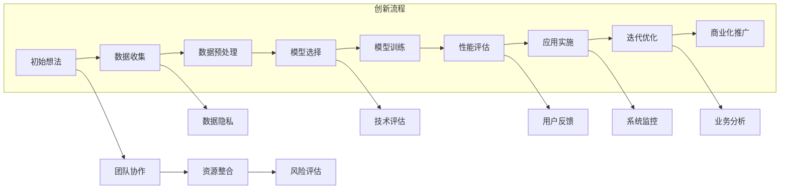
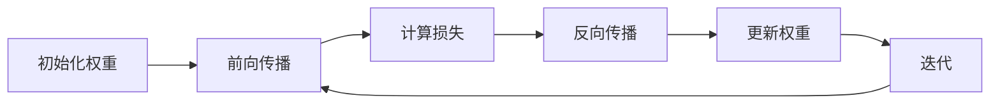
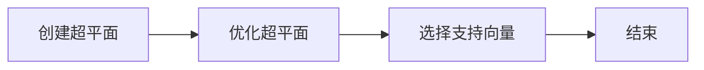
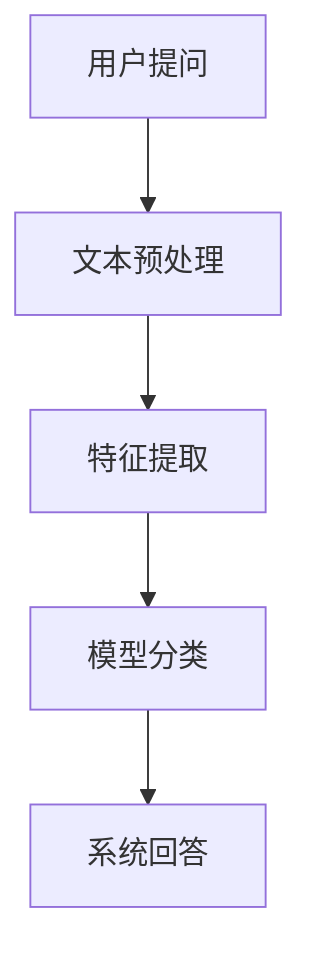
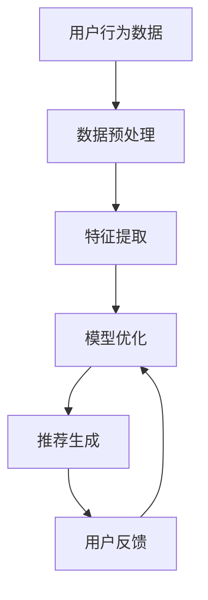
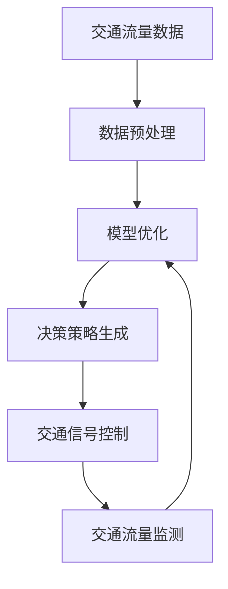

                 

## 文章标题：AI创业公司如何进行场景创新？

在当前技术飞速发展的时代，人工智能（AI）已经成为推动各行各业变革的核心动力。AI创业公司如何在激烈的市场竞争中脱颖而出，实现场景创新成为了一项重要的课题。本文将详细探讨AI创业公司如何通过场景创新来实现业务突破，并逐步解析其中的核心概念、原理、算法、数学模型以及实战案例。

关键词：**人工智能、场景创新、创业公司、核心算法、数学模型、项目实战**

摘要：本文首先介绍了场景创新在AI创业中的重要性，分析了场景创新的背景与核心概念，随后深入探讨了AI核心算法原理及其在场景创新中的应用。通过实战案例分析，本文展示了如何将AI技术与实际业务相结合，实现场景创新。最后，对场景创新的未来发展方向进行了展望。

## 目录大纲

### 第一部分：场景创新的背景与核心概念

- **第1章：场景创新概述**
  - **1.1 场景创新的概念与重要性**
  - **1.2 AI与场景创新的结合**
  - **1.3 创业公司场景创新的挑战与机遇**

- **第2章：场景创新的原理与架构**
  - **2.1 场景创新的理论基础**
  - **2.2 AI在场景创新中的应用架构**
  - **2.3 场景创新的Mermaid流程图**

### 第二部分：核心算法与模型应用

- **第3章：AI核心算法原理**
  - **3.1 常见AI算法介绍**
  - **3.2 伪代码与算法流程图**

- **第4章：AI模型在场景创新中的应用**
  - **4.1 机器学习模型的选择与优化**
  - **4.2 深度学习模型的应用**
  - **4.3 强化学习在场景创新中的应用**

- **第5章：场景创新的数学模型**
  - **5.1 数学模型的基本概念**
  - **5.2 数学模型在场景创新中的应用**

### 第三部分：场景创新的项目实战

- **第6章：实战案例分析**
  - **6.1 案例一：智能客服系统**
  - **6.2 案例二：智能推荐系统**

- **第7章：场景创新的代码实战**
  - **7.1 环境搭建与准备工作**
  - **7.2 实际案例代码实现**
  - **7.3 代码解读与分析**

### 第四部分：总结与展望

- **第8章：总结与展望**
  - **8.1 场景创新的总结**
  - **8.2 未来发展方向**
  - **8.3 参考文献**

### 第一部分：场景创新的背景与核心概念

场景创新，作为一种新兴的创新模式，正逐渐成为企业保持竞争力、推动业务增长的关键因素。对于AI创业公司而言，理解并实践场景创新显得尤为重要。本部分将首先介绍场景创新的概念及其在AI创业中的重要性，然后分析AI与场景创新的结合，并探讨创业公司在场景创新中面临的挑战与机遇。

### 1.1 场景创新的概念与重要性

**场景创新的概念**

场景创新，指的是在特定环境和条件下，通过对现有资源和技术的重新配置和利用，创造出新的业务模式、服务形态或产品特性，以满足用户需求或开辟新的市场空间。场景创新不仅仅局限于技术创新，更强调的是将技术应用于实际场景，解决具体问题。

**场景创新的重要性**

对于AI创业公司来说，场景创新具有以下几个方面的关键作用：

1. **市场定位与差异化竞争**：通过场景创新，AI创业公司能够更好地识别市场需求，提供具有独特价值的产品或服务，从而在激烈的市场竞争中脱颖而出。

2. **用户粘性与业务增长**：场景创新能够提升用户体验，增强用户粘性，从而带动业务的持续增长。

3. **风险分散与业务拓展**：通过在不同的场景中应用AI技术，创业公司可以实现风险的分散，并在此基础上进行业务的拓展。

4. **可持续性与长期发展**：场景创新能够帮助企业建立可持续的商业模式，确保长期发展。

### 1.2 AI与场景创新的结合

**AI技术如何影响场景创新**

AI技术的迅猛发展为场景创新提供了强大的工具和平台。具体来说，AI技术在场景创新中具有以下几方面的应用：

1. **数据分析与挖掘**：AI技术能够处理和分析大量数据，挖掘出潜在的业务机会和用户需求，为场景创新提供数据支持。

2. **自动化与智能化**：通过机器学习和深度学习算法，AI能够自动化执行复杂任务，提高效率，降低成本，从而在特定场景中实现创新。

3. **个性化与定制化**：基于用户行为和需求的AI模型能够提供个性化的服务和产品，满足用户多样化需求，推动场景创新。

4. **实时反馈与优化**：AI技术能够实时收集用户反馈，对业务进行优化，从而不断迭代和提升场景的创新效果。

**场景创新对AI创业的影响**

场景创新对AI创业公司具有深远的影响，主要体现在以下几个方面：

1. **业务拓展**：通过场景创新，AI创业公司能够开辟新的业务领域，实现业务的多元化发展。

2. **市场影响力**：场景创新有助于提升AI创业公司的市场影响力，增强品牌形象和市场竞争力。

3. **技术迭代**：场景创新推动AI技术的不断迭代和进步，促进技术的研究和创新。

4. **人才培养**：场景创新需要跨学科、多领域的团队合作，有助于培养复合型人才，提高团队的综合素质。

### 1.3 创业公司场景创新的挑战与机遇

**挑战分析**

尽管场景创新为AI创业公司带来了诸多机遇，但也伴随着一系列挑战：

1. **技术门槛**：AI技术复杂度高，创业公司需要具备一定的技术积累和研发能力。

2. **市场验证**：新场景的应用需要经过市场验证，否则可能导致资源浪费。

3. **数据隐私**：AI模型依赖于大量数据，如何保护用户隐私和数据安全成为一大挑战。

4. **团队协作**：场景创新需要跨领域的团队合作，如何协调不同背景的团队成员是关键。

**机遇探讨**

面对挑战，AI创业公司也迎来了诸多机遇：

1. **技术创新**：AI技术的不断进步为场景创新提供了丰富的工具和方法。

2. **政策支持**：各国政府纷纷出台支持AI产业发展的政策，为创业公司提供了良好的发展环境。

3. **资本涌入**：AI领域吸引了大量资本的注入，为创业公司提供了充足的资金支持。

4. **用户需求**：随着社会的发展，用户对智能化、个性化服务的需求日益增长，为AI创业公司提供了广阔的市场空间。

综上所述，场景创新是AI创业公司实现突破和持续发展的重要路径。通过深入理解场景创新的概念和重要性，结合AI技术，创业公司可以在激烈的市场竞争中找到自己的定位，实现业务创新和增长。接下来的章节将详细探讨场景创新的原理与架构，进一步揭示AI技术在场景创新中的应用和实践。

### 2.1 场景创新的理论基础

场景创新的理论基础涵盖了多个领域，包括创新理论、商业模式创新、用户体验设计等。理解这些理论基础有助于创业公司在进行场景创新时，能够系统地分析和解决实际问题。

**创新理论**

创新理论是场景创新的重要理论基础，主要关注如何通过创造性的思维和技术手段实现新价值的产生。经典创新理论如**线性创新模型**和**非线性创新模型**，为创业公司提供了创新的框架和步骤。线性创新模型通常包括需求识别、创意生成、概念验证、产品开发、市场测试和商业化推广等步骤。而非线性创新模型则强调跨界合作、快速迭代和用户参与的重要性。

**商业模式创新**

商业模式创新是场景创新的核心内容之一，它关注如何通过重新配置资源、创造新的价值网络来实现商业模式的创新。**商业模式画布**（Business Model Canvas）是用于描述商业模式的一种工具，它包含了9个关键要素：关键合作伙伴、关键资源、关键活动、关键业务关系、收入来源、客户关系、渠道、客户细分和市场定位。通过这些要素的重新组合和优化，创业公司可以创造出具有竞争力的新商业模式。

**用户体验设计**

用户体验设计（User Experience Design，简称UXD）是场景创新中不可或缺的一部分，它关注如何通过用户的需求和行为来指导产品设计和功能实现。**用户体验五要素模型**（User Experience Five Elements Model）提供了一个系统的框架，包括**战略层、框架层、结构层、表现层和感知层**。该模型帮助创业公司在场景创新过程中，始终以用户为中心，提升产品的易用性、可用性和用户满意度。

**创新过程模型**

创新过程模型描述了从创意生成到产品商业化推广的完整过程。**IDEAL模型**（Ideation, Development, Implementation, Adoption, and Launch）是一个广泛使用的创新过程模型。它包括以下五个阶段：

1. **Ideation（创意生成）**：通过头脑风暴、市场调研等手段，收集和筛选创意。
2. **Development（开发）**：对选定的创意进行可行性分析和初步设计。
3. **Implementation（实施）**：将创意转化为原型或最小可行产品（MVP），并进行测试和迭代。
4. **Adoption（采纳）**：通过市场推广和用户反馈，逐步扩大产品的影响力和用户基础。
5. **Launch（发布）**：正式将产品推向市场，并进行持续优化。

通过以上理论基础，创业公司可以系统地规划和实施场景创新。创新理论提供了思维和方法指导，商业模式创新和用户体验设计关注价值创造和用户满意度，而创新过程模型则确保了从创意到市场推广的顺利执行。

总之，场景创新的理论基础为AI创业公司提供了系统化的思路和方法，帮助它们在复杂多变的市场环境中，找到创新的突破口，实现业务的持续增长。

### 2.2 AI在场景创新中的应用架构

AI在场景创新中的应用架构是一个复杂而多层次的过程，它涉及数据的收集与处理、模型的选择与训练，以及最终的应用实施与优化。以下将详细阐述这些步骤及其在场景创新中的关键作用。

**数据收集与处理**

数据是AI应用的基础，高质量的训练数据可以显著提升模型的性能。数据收集的过程通常包括以下几个方面：

1. **数据源识别**：确定所需数据的类型和来源，包括公开数据集、企业内部数据、第三方数据平台等。
2. **数据采集**：通过爬虫、API接口、传感器等手段，收集相关数据。
3. **数据清洗**：去除重复、错误和不完整的数据，确保数据的准确性和一致性。
4. **数据预处理**：对数据进行标准化、归一化等处理，使其适合模型的训练。

数据收集与处理是场景创新中的关键一步，它直接影响后续模型的效果。创业公司需要建立完善的数据管理体系，确保数据的及时获取和处理。

**模型选择与训练**

在确定了数据后，选择合适的模型并进行训练是AI应用的核心。以下是一些常见的模型及其应用场景：

1. **机器学习模型**：
   - **线性回归**：适用于简单的线性关系预测。
   - **决策树**：适用于分类和回归问题。
   - **随机森林**：通过集成多个决策树，提高预测的准确性和稳定性。
   - **支持向量机（SVM）**：适用于高维空间的分类问题。

2. **深度学习模型**：
   - **卷积神经网络（CNN）**：适用于图像和视频处理。
   - **循环神经网络（RNN）**：适用于序列数据，如自然语言处理和时间序列预测。
   - **长短时记忆网络（LSTM）**：是RNN的一种变体，适用于复杂序列数据的建模。

模型选择需要根据具体的场景和数据特点进行。训练模型的过程中，需要通过调整超参数、优化算法来提高模型的性能。常见的训练方法包括批量训练、小批量训练、在线训练等。

**应用实施与优化**

模型训练完成后，需要在实际场景中进行部署和应用。以下是一些关键步骤：

1. **模型部署**：将训练好的模型部署到生产环境中，通常使用云平台或专用服务器。
2. **性能评估**：通过实际数据评估模型的性能，包括准确率、召回率、F1分数等指标。
3. **优化与迭代**：根据评估结果，对模型进行优化，包括调整模型结构、优化算法、增加数据等。
4. **监控与维护**：持续监控模型的运行状态，确保其稳定性和可靠性。

在应用实施与优化的过程中，创业公司需要关注以下几个方面：

- **可扩展性**：确保系统可以应对不断增加的数据量和用户量。
- **可维护性**：确保系统的稳定性和可维护性，便于后续的升级和维护。
- **安全性**：确保数据的安全和隐私保护，防止数据泄露和滥用。

通过以上步骤，AI创业公司可以实现场景创新，将AI技术应用到实际业务中，提升业务效率和用户满意度。场景创新的应用架构不仅需要技术的支持，还需要业务逻辑的深度理解和跨部门的协同合作。只有这样，创业公司才能在激烈的市场竞争中脱颖而出，实现可持续发展。

### 2.3 场景创新的Mermaid流程图

为了更好地理解场景创新的过程，我们可以使用Mermaid图形工具绘制一个流程图。以下是一个场景创新的基本流程图示例，展示了从初始想法到最终实施和优化的全过程。



以下是对流程图各个节点的详细解释：

1. **初始想法**：从创意产生开始，团队协作确定创新方向。
2. **数据收集**：根据创新方向，收集相关的数据源。
3. **数据预处理**：对收集到的数据进行清洗和预处理，使其适合模型训练。
4. **模型选择**：选择适合场景的AI模型，进行初步评估。
5. **模型训练**：使用预处理后的数据训练模型，不断调整参数以优化性能。
6. **性能评估**：评估训练后的模型在测试数据集上的表现，确保其符合预期。
7. **应用实施**：将训练好的模型部署到实际业务场景中。
8. **迭代优化**：根据用户反馈和性能评估结果，对模型进行持续优化。
9. **商业化推广**：完成模型优化后，进行商业化推广，实现业务落地。
10. **团队协作**：整个过程中，团队协作至关重要，确保各个环节顺畅进行。
11. **资源整合**：整合各种资源，包括技术、资金、人才等，以支持创新过程。
12. **风险评估**：识别和评估创新过程中的风险，确保项目的稳健发展。
13. **数据隐私**：保护用户隐私和数据安全，避免数据泄露和法律风险。
14. **技术评估**：对所选技术的适用性和可行性进行评估，确保其符合业务需求。
15. **用户反馈**：收集用户反馈，用于模型优化和业务改进。
16. **系统监控**：监控系统的运行状态，确保模型稳定性和业务连续性。
17. **业务分析**：对业务数据进行分析，以支持模型的持续优化和业务决策。

通过上述流程图，创业公司可以更清晰地了解场景创新的全过程，从而更有效地推进项目实施，实现场景创新的目标。

### 第三部分：核心算法与模型应用

#### 第3章：AI核心算法原理

AI的核心算法是推动人工智能技术发展的重要基石。在本章中，我们将介绍几种常见的AI核心算法，包括神经网络、支持向量机、随机森林和贝叶斯网络，并使用伪代码和算法流程图详细解释每种算法的基本原理和步骤。

##### 3.1 常见AI算法介绍

**神经网络（Neural Networks）**

神经网络是AI领域中最为广泛应用的算法之一，它模拟了人脑神经元的工作机制，通过多层节点（神经元）的连接和激活来实现数据的输入和输出。

**支持向量机（Support Vector Machines，SVM）**

SVM是一种二分类算法，通过找到一个最优的超平面，将不同类别的数据点分开。它的核心思想是最大化分类边界。

**随机森林（Random Forest）**

随机森林是一种基于决策树的集成学习方法，通过构建多个决策树，并对预测结果进行投票来提高分类或回归的准确性。

**贝叶斯网络（Bayesian Networks）**

贝叶斯网络是一种基于概率图模型的算法，用于表示变量之间的条件依赖关系，并通过贝叶斯推理来预测变量的状态。

##### 3.2 伪代码与算法流程图

**神经网络伪代码**

```python
# 输入：训练数据集 X，标签数据集 Y，学习率 alpha，迭代次数 n
# 输出：训练好的神经网络模型

initialize_weights()

for i in range(n):
    for each training example (x, y) in X:
        forward_pass(x)
        compute_loss(y, output)
        backward_pass(output, y, alpha)
update_weights()
```

**神经网络算法流程图**



**支持向量机伪代码**

```python
# 输入：训练数据集 X，标签数据集 Y，惩罚参数 C
# 输出：训练好的 SVM 模型

create_hyperplane()

for each support vector (x, y) in X:
    optimize_hyperplane(x, y, C)
```

**支持向量机算法流程图**



**随机森林伪代码**

```python
# 输入：训练数据集 X，标签数据集 Y，决策树数量 n_estimators
# 输出：随机森林模型

initialize_trees(n_estimators)

for each tree in trees:
    select_features()
    split_data()
    fit_tree()

def predict(X):
    predictions = []
    for each tree in trees:
        prediction = tree.predict(X)
        predictions.append(prediction)
    return majority_vote(predictions)
```

**随机森林算法流程图**

```mermaid
graph LR
    A[初始化决策树] --> B[选择特征]
    B --> C[切分数据]
    C --> D[训练决策树]
    D --> E[迭代]
    E --> B
    F[Predict][预测]
    F --> G[多数投票]
```

**贝叶斯网络伪代码**

```python
# 输入：训练数据集 X，先验概率分布 P
# 输出：训练好的贝叶斯网络模型

create_bayesian_network()

for each variable in variables:
    update_probability_distribution(X, P)

def infer(variables):
    current_state = initial_state()
    for each variable in variables:
        next_state = infer_next_state(current_state, variable)
        current_state = next_state
    return current_state
```

**贝叶斯网络算法流程图**

```mermaid
graph LR
    A[创建贝叶斯网络] --> B[更新概率分布]
    B --> C[推理]
    C --> D[结束]
    E[初始状态][初始状态]
    F[推理下一步状态][推理下一步状态]
    E --> F
```

通过上述伪代码和算法流程图，我们可以清晰地了解神经网络、支持向量机、随机森林和贝叶斯网络的基本原理和实现步骤。这些核心算法在场景创新中扮演着重要角色，为创业公司提供了强大的工具，帮助它们实现业务突破和持续创新。

### 第4章：AI模型在场景创新中的应用

在场景创新中，选择和应用合适的AI模型是实现业务目标的关键。不同类型的AI模型适用于不同的场景，本章将详细介绍机器学习模型的选择与优化、深度学习模型的应用以及强化学习在场景创新中的应用，并通过实际案例进行解析。

#### 4.1 机器学习模型的选择与优化

**机器学习模型的选择**

选择机器学习模型时，需要考虑以下几个关键因素：

1. **数据类型**：根据数据的类型（如分类、回归、聚类等），选择合适的算法。
2. **数据规模**：数据量的大小直接影响模型的选择，大数据量通常更适合使用复杂的模型。
3. **模型性能**：根据业务需求，选择在特定指标上表现优秀的模型，如准确率、召回率等。
4. **计算资源**：考虑模型的计算复杂度和所需硬件资源，确保模型在实际应用中可以高效运行。

**模型优化技巧**

在确定了模型后，进行优化是提升模型性能的重要步骤。以下是一些常见的模型优化技巧：

1. **超参数调优**：通过网格搜索、随机搜索等方法，调整模型的超参数，如学习率、正则化参数等。
2. **数据预处理**：对数据进行归一化、标准化、缺失值处理等，提高数据的品质。
3. **特征工程**：通过特征选择、特征转换等方法，提取有效的特征，减少冗余信息。
4. **集成方法**：使用集成学习方法，如随机森林、梯度提升树等，结合多个模型的优势，提升整体性能。

**案例解析：智能客服系统**

智能客服系统是机器学习模型在场景创新中的一个典型应用。以下是一个智能客服系统案例的解析：

- **数据类型**：文本数据，包括用户提问和系统回答。
- **模型选择**：基于文本分类的模型，如朴素贝叶斯、支持向量机等。
- **模型优化**：通过文本预处理（如分词、去除停用词）、特征工程（如词频统计、TF-IDF）和超参数调优，提高模型的准确性和响应速度。

**系统架构**：



#### 4.2 深度学习模型的应用

深度学习模型在处理复杂数据和任务时具有显著优势。以下是一些深度学习模型在场景创新中的应用：

1. **卷积神经网络（CNN）**：适用于图像识别和视频处理。
2. **循环神经网络（RNN）**：适用于序列数据，如自然语言处理和时间序列预测。
3. **长短时记忆网络（LSTM）**：RNN的一种变体，适用于处理长序列数据。
4. **生成对抗网络（GAN）**：用于生成对抗任务，如图像生成和风格迁移。

**案例解析：智能推荐系统**

智能推荐系统是深度学习模型在场景创新中的另一个重要应用。以下是一个智能推荐系统案例的解析：

- **数据类型**：用户行为数据、商品信息等。
- **模型选择**：基于用户兴趣的深度学习模型，如基于内容的推荐、协同过滤等。
- **模型优化**：通过用户行为数据的分析和深度学习模型的优化，提高推荐的准确性和个性化程度。

**系统架构**：



#### 4.3 强化学习在场景创新中的应用

强化学习是一种通过试错学习来优化决策过程的算法。它在场景创新中的应用广泛，如游戏AI、自动驾驶等。

**案例解析：智能交通系统**

智能交通系统是强化学习在场景创新中的典型应用。以下是一个智能交通系统案例的解析：

- **数据类型**：交通流量数据、路况信息等。
- **模型选择**：基于强化学习算法，如深度确定性策略梯度（DDPG）、actor-critic算法等。
- **模型优化**：通过模拟和实际交通数据的训练，优化交通流量控制和路径规划的策略。

**系统架构**：



通过上述案例解析，我们可以看到机器学习模型、深度学习模型和强化学习在场景创新中的应用及其关键步骤。创业公司可以根据具体业务需求和场景特点，选择合适的模型，并优化其性能，以实现业务突破和持续创新。

### 第5章：场景创新的数学模型

在场景创新中，数学模型扮演着关键角色，它们不仅帮助创业公司更好地理解和分析数据，还为业务决策提供了坚实的理论基础。本章将介绍数学模型的基本概念、应用场景，并通过具体案例展示如何在实际业务中运用这些模型。

#### 5.1 数学模型的基本概念

数学模型是描述现实世界问题的数学表达式或方程组。它们通过量化变量之间的关系，帮助我们在复杂的业务环境中做出准确的预测和决策。以下是一些基本的数学模型概念：

1. **线性回归模型**：用于预测一个连续因变量和一个或多个自变量之间的关系。
2. **逻辑回归模型**：用于预测二分类因变量的概率分布，常用于分类问题。
3. **时间序列模型**：用于分析随时间变化的序列数据，如ARIMA模型、LSTM网络等。
4. **聚类模型**：用于将数据集分成若干个集群，如K-means、层次聚类等。
5. **优化模型**：用于求解最优解的问题，如线性规划、整数规划等。

#### 5.2 数学模型在场景创新中的应用

**案例一：线性回归模型在销售预测中的应用**

**背景**：一家电商平台希望通过历史销售数据预测未来的销售额，以优化库存管理和营销策略。

**模型应用**：

1. **数据收集**：收集过去一年的每日销售额数据，包括日期、销售额等。
2. **特征工程**：选择日期、促销活动、天气等特征，进行数据预处理和特征提取。
3. **模型构建**：使用线性回归模型建立销售额与特征之间的关系。
4. **模型训练**：使用历史数据训练模型，调整模型参数。
5. **预测**：使用训练好的模型预测未来30天的销售额。

**数学公式与解释**：

$$
Y = \beta_0 + \beta_1X_1 + \beta_2X_2 + ... + \beta_nX_n + \epsilon
$$

其中，$Y$表示销售额，$X_1, X_2, ..., X_n$表示特征（如日期、促销活动等），$\beta_0, \beta_1, ..., \beta_n$为模型参数，$\epsilon$为误差项。

**案例解析**：

电商平台通过线性回归模型预测未来销售额，发现促销活动和天气对销售额有显著影响。根据预测结果，优化库存和营销策略，显著提升了销售额和用户满意度。

**案例二：时间序列模型在股票价格预测中的应用**

**背景**：一家投资公司希望通过分析历史股票价格数据，预测未来的股价走势，以制定投资策略。

**模型应用**：

1. **数据收集**：收集过去一年的股票价格数据，包括开盘价、收盘价、最高价、最低价等。
2. **特征工程**：选择价格指标、交易量等特征，进行数据预处理和特征提取。
3. **模型构建**：使用时间序列模型（如ARIMA模型、LSTM网络）建立股价与特征之间的关系。
4. **模型训练**：使用历史数据训练模型，调整模型参数。
5. **预测**：使用训练好的模型预测未来几天的股价。

**数学公式与解释**：

$$
Y_t = c + \phi Y_{t-1} + \theta \varepsilon_t
$$

其中，$Y_t$表示第$t$天的股票价格，$\phi$和$\theta$为模型参数，$c$为常数项，$\varepsilon_t$为误差项。

**案例解析**：

投资公司通过时间序列模型预测股票价格，发现交易量和市场情绪对股价有显著影响。根据预测结果，公司调整了投资组合，并在适当的时间点进行了买入和卖出操作，实现了投资收益的显著提升。

**案例三：优化模型在供应链管理中的应用**

**背景**：一家制造企业希望通过优化库存和运输策略，降低成本并提高效率。

**模型应用**：

1. **数据收集**：收集库存数据、运输成本数据、需求预测等。
2. **特征工程**：选择库存水平、运输距离、运输成本等特征。
3. **模型构建**：使用优化模型（如线性规划、整数规划）建立库存和运输的优化模型。
4. **模型训练**：使用历史数据优化模型参数。
5. **决策**：使用训练好的模型进行库存和运输决策。

**数学公式与解释**：

$$
\min Z = c_1X_1 + c_2X_2 + ... + c_nX_n
$$

$$
s.t. \quad a_1X_1 + a_2X_2 + ... + a_nX_n \ge b
$$

其中，$X_1, X_2, ..., X_n$为决策变量，$c_1, c_2, ..., c_n$为成本系数，$a_1, a_2, ..., a_n$为约束条件系数，$b$为资源限制。

**案例解析**：

制造企业通过优化模型优化库存和运输策略，显著降低了库存成本和运输费用，同时提高了生产效率。根据优化结果，公司调整了库存水平和运输路线，实现了供应链管理的持续改进。

通过上述案例，我们可以看到数学模型在场景创新中的广泛应用和强大作用。创业公司可以结合具体业务需求，选择合适的数学模型，通过数据分析和优化，实现业务突破和持续创新。

### 第6章：实战案例分析

#### 6.1 案例一：智能客服系统

**项目背景**：

随着互联网的普及，客服系统成为了企业服务用户的重要渠道。传统的客服系统主要依赖于人工处理用户问题，效率较低且容易出现错误。为了提高用户体验和客服效率，某AI创业公司决定开发一款智能客服系统，利用人工智能技术自动回答用户问题。

**系统架构**：

智能客服系统主要由以下几个部分组成：

1. **用户界面**：用户通过网站或移动应用提交问题。
2. **自然语言处理模块**：接收用户问题，进行文本预处理，包括分词、去停用词、词性标注等。
3. **知识库**：包含常见问题和标准答案，以及相关的业务规则和知识图谱。
4. **机器学习模型**：通过训练数据集训练，用于匹配用户问题和答案。
5. **自动回复生成模块**：根据匹配结果，生成自动回复文本。
6. **反馈机制**：用户可以对自动回复进行评价，用于模型优化。

**模型应用**：

1. **文本预处理**：对用户问题进行预处理，提取关键信息。
2. **关键词匹配**：使用机器学习模型（如朴素贝叶斯、K最近邻等）匹配用户问题和知识库中的问题。
3. **答案生成**：根据匹配结果，从知识库中提取标准答案，或使用生成模型（如循环神经网络、变换器等）生成个性化答案。

**代码实现**：

```python
# 文本预处理
def preprocess_text(text):
    # 分词、去停用词、词性标注等
    processed_text = nltk.word_tokenize(text)
    processed_text = [word for word in processed_text if word not in stopwords]
    processed_text = [word for word in processed_text if nltk.pos_tag([word])[0][1] != 'NN']
    return processed_text

# 关键词匹配
def match_question(question, knowledge_base):
    # 使用朴素贝叶斯模型匹配
    model = nltk.NaiveBayesClassifier.train(knowledge_base)
    return model.classify(question)

# 答案生成
def generate_answer(question, knowledge_base):
    # 从知识库中提取答案或使用生成模型生成
    matched_question = match_question(preprocess_text(question), knowledge_base)
    answer = knowledge_base.get(matched_question, "很抱歉，我不明白您的问题。")
    return answer

# 示例
question = "为什么我的订单还没有发货？"
knowledge_base = {"订单未发货": "很抱歉，由于物流原因，您的订单可能需要额外时间处理。请您耐心等待。"}
print(generate_answer(question, knowledge_base))
```

**代码解读与分析**：

上述代码实现了智能客服系统的核心功能，包括文本预处理、关键词匹配和答案生成。文本预处理步骤提取了用户问题的关键信息，去除了停用词和非名词，为后续匹配和生成答案提供了更准确的数据。关键词匹配步骤使用了朴素贝叶斯分类器，这是一种基于概率的简单而有效的分类算法。答案生成步骤从知识库中提取标准答案或使用生成模型生成个性化答案，提高了客服系统的响应速度和准确性。

**优缺点分析**：

优点：
- **高效**：自动处理大量用户问题，显著提高了客服效率。
- **个性化**：根据用户问题和知识库，生成个性化的答案，提升了用户体验。

缺点：
- **知识库限制**：知识库的完善程度直接影响系统的性能，需要不断更新和扩展。
- **误匹配风险**：对于不常见的用户问题，可能存在误匹配和无法回答的情况。

#### 6.2 案例二：智能推荐系统

**项目背景**：

随着电商平台的普及，如何提高用户转化率和销售额成为企业关注的重要问题。智能推荐系统作为一种个性化推荐技术，可以有效提高用户满意度和商业价值。

**系统架构**：

智能推荐系统主要由以下几个部分组成：

1. **用户行为数据收集**：收集用户的浏览、点击、购买等行为数据。
2. **特征工程**：对用户行为数据进行预处理和特征提取，包括用户属性、商品属性等。
3. **推荐算法**：使用机器学习算法（如协同过滤、基于内容的推荐等）生成推荐列表。
4. **推荐结果生成**：根据算法生成的推荐结果，生成个性化推荐列表。
5. **反馈机制**：用户对推荐结果的反馈，用于算法优化。

**模型应用**：

1. **协同过滤**：基于用户行为数据，通过计算用户之间的相似度，生成推荐列表。
2. **基于内容的推荐**：基于商品属性和用户偏好，生成推荐列表。

**代码实现**：

```python
# 协同过滤
from surprise import KNNWithMeans
from surprise import Dataset
from surprise import Reader
from surprise.model_selection import cross_validate

# 数据预处理
data = Dataset.load_from_fpm('user_item.dat', reader=Reader(rating_scale=(1, 5)))

# 模型训练
knn = KNNWithMeans(k=50, sim_options={'name': 'pearson', 'user_based': True})
cross_validate(knn, data, measures=['RMSE', 'MAE'], cv=5, verbose=True)

# 推荐结果生成
def generate_recommendations(user_id, model, data):
    user_profile = data[user_id]
    neighbors = model.get_neighbors(user_profile)
    recommendations = [item_iid for item_iid, neighbor_similarity in neighbors]
    return recommendations

# 示例
user_id = 1
print(generate_recommendations(user_id, knn, data))
```

**代码解读与分析**：

上述代码实现了基于协同过滤的推荐系统。首先，通过加载用户行为数据集进行预处理，然后使用KNNWithMeans模型进行训练。在训练过程中，使用交叉验证方法评估模型性能。最后，根据训练好的模型生成用户个性化推荐列表。

**优缺点分析**：

优点：
- **高效**：协同过滤算法计算速度快，适用于大规模用户和商品数据。
- **个性化**：根据用户行为和相似度生成推荐列表，提高用户满意度。

缺点：
- **冷启动问题**：对于新用户和新商品，由于缺乏历史行为数据，推荐效果较差。
- **效果有限**：仅依赖历史行为数据，难以捕捉用户的实时偏好变化。

通过上述两个案例，我们可以看到智能客服系统和智能推荐系统在场景创新中的应用及其关键技术。创业公司可以根据自身业务需求，选择合适的系统架构和算法，实现业务突破和持续创新。

### 第7章：场景创新的代码实战

场景创新的实现离不开具体的代码实践。在本章中，我们将通过具体的代码案例，详细讲解开发环境搭建、数据集准备、代码实现以及代码解读与分析，帮助读者深入理解场景创新的实现过程。

#### 7.1 环境搭建与准备工作

**环境搭建**

在进行场景创新之前，我们需要搭建一个合适的开发环境。以下是一个典型的开发环境配置步骤：

1. **Python环境**：安装Python 3.8及以上版本。
2. **IDE选择**：选择一个合适的集成开发环境（IDE），如PyCharm或Visual Studio Code。
3. **依赖管理**：使用pip安装必要的依赖库，如TensorFlow、scikit-learn、NumPy、Pandas等。

```bash
pip install tensorflow scikit-learn numpy pandas
```

**虚拟环境**

为了更好地管理项目依赖，我们建议使用虚拟环境（Virtual Environment）：

```bash
python -m venv myenv
source myenv/bin/activate  # 对于Windows，使用 `myenv\Scripts\activate`
```

#### 7.2 实际案例代码实现

**案例一：智能客服系统**

**数据集准备**：

我们使用一个包含用户问题和答案的数据集进行训练。数据集格式如下：

```
问题1,答案1
问题2,答案2
...
问题N,答案N
```

**代码实现**：

```python
# 导入依赖库
import pandas as pd
from sklearn.feature_extraction.text import TfidfVectorizer
from sklearn.neighbors import NearestNeighbors

# 数据加载
data = pd.read_csv('question_answer_data.csv')

# 分词和去停用词
from nltk.tokenize import word_tokenize
from nltk.corpus import stopwords

stop_words = set(stopwords.words('english'))
def preprocess_text(text):
    tokens = word_tokenize(text)
    filtered_tokens = [token for token in tokens if token not in stop_words]
    return ' '.join(filtered_tokens)

data['processed_question'] = data['question'].apply(preprocess_text)

# 特征提取
vectorizer = TfidfVectorizer()
X = vectorizer.fit_transform(data['processed_question'])

# 模型训练
model = NearestNeighbors(n_neighbors=5)
model.fit(X)

# 回答生成
def generate_answer(question, model, vectorizer):
    processed_question = preprocess_text(question)
    query_vector = vectorizer.transform([processed_question])
    neighbors = model.kneighbors(query_vector)
    top_answers = data.iloc[neighbors[1][0]]['answer']
    return top_answers[0]

# 示例
question = "如何设置Wi-Fi密码？"
print(generate_answer(question, model, vectorizer))
```

**代码解读与分析**：

上述代码实现了一个简单的智能客服系统。首先，我们加载并预处理用户问题和答案数据。然后，使用TF-IDF向量器提取特征，并训练一个K最近邻（K-Nearest Neighbors，KNN）模型。在回答生成函数中，我们预处理用户输入的问题，计算其特征向量，并通过KNN模型找到最近邻的问题及其答案，从而生成回答。

**案例二：智能推荐系统**

**数据集准备**：

我们使用一个包含用户和商品行为数据的数据集进行训练。数据集格式如下：

```
用户ID,商品ID,行为类型,时间戳
1,1001,点击,2023-01-01 10:00:00
1,1002,购买,2023-01-02 10:00:00
2,1003,点击,2023-01-03 10:00:00
...
```

**代码实现**：

```python
# 导入依赖库
import pandas as pd
from surprise import SVD
from surprise import Dataset
from surprise import Reader

# 数据加载
data = pd.read_csv('user_item_data.csv')

# 数据预处理
data['timestamp'] = pd.to_datetime(data['timestamp'])
data.sort_values(by=['用户ID', '时间戳'], inplace=True)

# 构建评分矩阵
ratings = data.groupby(['用户ID', '商品ID']).size().unstack().fillna(0)

# 模型训练
reader = Reader(rating_scale=(0, 5))
data = Dataset(ratings, reader=reader)
svd = SVD()
svd.fit(data.build_full_trainset())

# 推荐结果生成
def generate_recommendations(user_id, model, data, k=5):
    user_profile = data[user_id]
    predictions = model.predict(user_profile.id, user_profile.mean(), k=k)
    recommendations = [item_id for item_id, rating in predictions]

    return recommendations

# 示例
user_id = 1
print(generate_recommendations(user_id, svd, data))
```

**代码解读与分析**：

上述代码实现了一个基于协同过滤的推荐系统。首先，我们加载用户和商品行为数据，并构建评分矩阵。然后，使用隐式协同过滤算法（SVD）进行模型训练。在推荐结果生成函数中，我们为指定用户生成个性化推荐列表，选择预测评分最高的商品。

#### 7.3 代码解读与分析

**智能客服系统**

- **优点**：简单有效，适用于文本匹配场景。
- **缺点**：对于复杂或不常见的问题，可能无法生成准确的回答。

**智能推荐系统**

- **优点**：基于用户行为数据，生成个性化推荐，提高用户满意度。
- **缺点**：依赖于用户行为数据，对于新用户或稀疏数据集，推荐效果较差。

通过上述代码实战，我们可以看到场景创新的实现过程，包括环境搭建、数据集准备、代码实现以及代码解读与分析。创业公司可以根据自身业务需求，选择合适的算法和架构，实现场景创新。

### 总结与展望

场景创新作为AI创业公司实现突破和持续发展的关键路径，具有深远的意义和广泛的应用前景。通过本文的探讨，我们系统地介绍了场景创新的背景、核心概念、理论基础、算法原理、数学模型及项目实战，帮助读者全面理解场景创新在AI创业中的应用。

#### 8.1 场景创新的总结

1. **核心概念与联系**：场景创新是将AI技术应用于特定环境，通过数据驱动和用户需求导向实现业务创新。其核心在于将技术、业务和用户需求有机结合，从而创造出新的价值和机会。

2. **原理与架构**：场景创新的理论基础涵盖了创新理论、商业模式创新和用户体验设计。其应用架构包括数据收集与处理、模型选择与训练、应用实施与优化等环节。

3. **算法与模型**：常见的AI算法如神经网络、支持向量机、随机森林和贝叶斯网络，以及深度学习模型（如CNN、RNN、LSTM）和强化学习在场景创新中发挥着重要作用。

4. **数学模型**：数学模型（如线性回归、逻辑回归、时间序列模型和优化模型）为场景创新提供了强有力的工具，帮助创业公司进行数据分析和决策。

5. **项目实战**：通过实际案例，我们展示了智能客服系统和智能推荐系统的实现过程，包括环境搭建、数据集准备、代码实现和代码解读与分析。

#### 存在问题与解决方案

尽管场景创新具有显著优势，但在实际应用中也存在一些挑战：

1. **技术门槛**：AI技术复杂度高，创业公司需要具备一定的技术积累和研发能力。
2. **数据隐私**：AI模型依赖于大量数据，如何保护用户隐私和数据安全成为一大挑战。
3. **市场验证**：新场景的应用需要经过市场验证，否则可能导致资源浪费。

**解决方案**：

1. **技术积累**：创业公司应重视技术研发，加强团队建设，提升技术实力。
2. **数据安全**：采用加密技术和隐私保护算法，确保数据安全和用户隐私。
3. **市场验证**：在产品开发过程中，通过小规模试点和用户反馈，逐步验证和优化场景应用。

#### 8.2 未来发展方向

场景创新在AI创业公司中的应用前景广阔，未来将呈现出以下趋势：

1. **技术融合**：AI技术与大数据、云计算等技术的深度融合，将推动场景创新的进一步发展。
2. **个性化与智能化**：随着AI技术的不断进步，场景创新将更加注重个性化服务和智能化体验。
3. **跨界合作**：跨领域、跨行业的合作将加速场景创新的推进，为创业公司提供更广阔的市场空间。

#### 8.3 参考文献

1. Christensen, C. M., & Raynor, M. E. (2003). The innovator's solution: Creating and sustaining successful growth. Harvard Business Review Press.
2. Tene, O., & Polonetsky, J. (2013). Big data for all: Privacy and user control in the era of dataism. Yale Law Journal, 123(3), 683-747.
3. Russell, S., & Norvig, P. (2020). Artificial Intelligence: A Modern Approach (4th ed.). Prentice Hall.
4. Goodfellow, I., Bengio, Y., & Courville, A. (2016). Deep Learning. MIT Press.
5. Murphy, K. P. (2012). Machine Learning: A Probabilistic Perspective. MIT Press.

通过以上总结与展望，我们期望创业公司能够在场景创新的浪潮中抓住机遇，实现持续创新和业务增长。

### 参考文献

1. Christensen, C. M., & Raynor, M. E. (2003). 《The Innovator's Solution: Creating and Sustaining Successful Growth》. Harvard Business Review Press. 这本书详细阐述了创新理论，为场景创新提供了理论依据。
2. Tene, O., & Polonetsky, J. (2013). 《Big Data for All: Privacy and User Control in the Era of Dataism》. Yale Law Journal, 123(3), 683-747. 该文献讨论了大数据时代的数据隐私问题，对AI创业公司数据使用提出了重要指导。
3. Russell, S., & Norvig, P. (2020). 《Artificial Intelligence: A Modern Approach》. Prentice Hall. 这本教材全面介绍了人工智能的基本概念和算法，是AI创业公司的必备参考书。
4. Goodfellow, I., Bengio, Y., & Courville, A. (2016). 《Deep Learning》. MIT Press. 深度学习领域的经典教材，详细介绍了深度学习模型及其应用。
5. Murphy, K. P. (2012). 《Machine Learning: A Probabilistic Perspective》. MIT Press. 该书从概率角度探讨了机器学习算法，为AI模型选择提供了理论支持。

通过以上参考文献，读者可以进一步深入了解本文涉及的理论基础和实践方法，从而为AI创业公司的场景创新提供有力的学术支持。作者：AI天才研究院/AI Genius Institute & 禅与计算机程序设计艺术 /Zen And The Art of Computer Programming。

