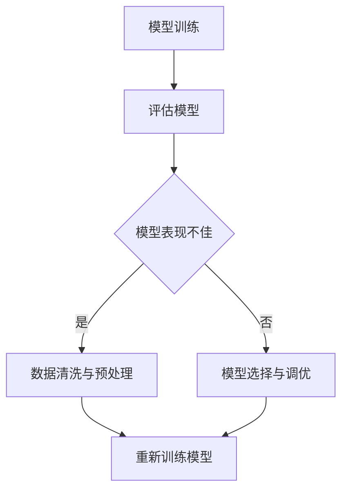
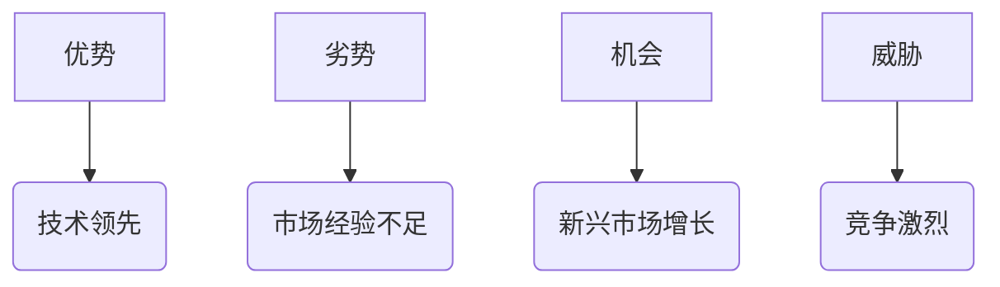

                 

## 文章标题: AI创业公司如何进行风险评估?

### 关键词：AI创业公司、风险评估、风险识别、风险分析、风险应对策略、风险管理框架

> 摘要：本文旨在探讨AI创业公司在进行风险评估方面的最佳实践。通过系统地分析风险评估的基础知识、AI领域的风险特点、AI创业公司的风险评估框架以及具体的风险管理策略与工具，本文为AI创业公司提供了全面的风险管理指导。此外，通过案例研究，本文展示了成功AI创业公司的风险管理实践，并总结了相关启示与经验。

---

### 第一部分: AI创业公司如何进行风险评估？

#### 第1章: 风险评估的基础知识

### 1.1 风险评估的定义与重要性
风险评估是一种系统性的方法，用于评估和分析潜在风险及其可能的影响。在AI创业公司中，风险评估的重要性不言而喻。AI技术的高复杂性和数据依赖性使得AI创业公司面临的风险更加多样化和复杂化。通过风险评估，AI创业公司可以识别潜在风险，制定相应的应对策略，从而降低风险对公司运营的影响。

#### 风险评估的定义
- 风险评估是一种系统性的方法，用于识别、分析和评估潜在风险，以及制定应对措施。

#### 风险评估的重要性
- 帮助AI创业公司识别潜在风险，提前采取措施降低风险。
- 优化资源配置，提高项目的成功概率。

### 1.2 风险评估的分类
风险评估可以根据不同的标准进行分类，例如按风险类型分类和按风险评估方法分类。

#### 按风险类型分类
- 自然灾害风险
- 技术风险
- 财务风险
- 市场风险
- 管理风险
- 法律风险

#### 按风险评估方法分类
- 定量风险评估
- 定性风险评估
- 结合定性定量风险评估

### 1.3 风险评估的流程
风险评估通常包括以下步骤：

1. 风险识别：收集信息，识别项目可能面临的风险。
2. 风险分析：分析每个风险的可能性和影响。
3. 风险评估：根据分析结果，评估每个风险的处理优先级。
4. 风险应对：制定风险应对策略，分配资源，实施风险应对措施。
5. 监控与更新：监控风险状况，及时更新风险评估结果。

---

### 第二部分: AI领域的风险评估特点

#### 第2章: AI领域的风险评估特点

### 2.1 AI技术的独特性
AI技术具有以下独特性：

- 自动学习与自适应
- 复杂性
- 数据依赖性

这些特点使得AI领域的风险评估更加复杂和具有挑战性。

### 2.2 AI领域的风险类型
AI创业公司面临的风险类型包括：

- 技术风险：模型错误与偏差、数据隐私与伦理问题、技术过时风险
- 财务风险：投资回报不确定、研发成本高、资金短缺
- 市场风险：市场需求波动、竞争对手威胁、法律法规变化
- 管理与运营风险：团队管理问题、项目管理风险、法律与合规风险

### 2.3 AI风险评估的挑战与机遇
AI创业公司在进行风险评估时面临以下挑战：

- 复杂性高
- 数据质量与隐私问题
- 技术快速发展带来的不确定性

但同时，AI技术也为风险评估提供了机遇：

- 提高风险管理效率
- 开发新的风险管理工具
- 在新市场和新领域获得竞争优势

---

### 第三部分: AI创业公司的风险评估框架

#### 第3章: AI创业公司的风险评估框架

### 3.1 风险识别
风险识别是风险评估的第一步，主要目标是识别项目可能面临的风险。以下是一些常用的风险识别方法：

- 专家访谈
- 文献调研
- 案例研究

### 3.2 风险分析
风险分析是对识别到的风险进行深入分析，评估其可能性和影响。常用的风险分析指标包括：

- 可能性
- 影响度
- 优先级

### 3.3 风险评估
风险评估是对分析结果进行综合评估，确定每个风险的处理优先级。常用的风险评估方法包括：

- 定量风险评估
- 定性风险评估
- 结合定性定量风险评估

### 3.4 风险应对策略
根据风险评估的结果，制定相应的风险应对策略。常见的风险应对策略包括：

- 风险规避：避免参与高风险项目。
- 风险转移：购买保险，将风险转移给第三方。
- 风险减轻：通过技术改进和管理优化降低风险。
- 风险接受：对某些无法避免的风险，选择接受。

### 3.5 风险监控与更新
风险监控与更新是风险评估的持续过程，主要目的是确保风险评估结果的准确性和及时性。以下是一些常用的方法：

- 定期评估风险状况，及时更新风险评估结果。
- 根据实际情况调整风险应对策略。
- 建立风险预警机制，提前发现潜在风险。

---

### 第四部分: 人工智能技术风险分析

#### 第4章: 人工智能技术风险分析

### 4.1 模型错误与偏差

#### 4.1.1 模型错误与偏差的原因

模型错误与偏差的主要原因包括：

- 数据偏差：训练数据中存在偏差，导致模型不能准确预测。
- 过拟合：模型对训练数据过于敏感，导致在测试数据上表现不佳。
- 模型假设不合理：模型的基础假设与实际应用场景不符，导致预测不准确。

#### 4.1.2 模型错误与偏差的解决方法

解决模型错误与偏差的方法包括：

- 数据清洗与预处理：确保训练数据的质量和多样性。
- 模型选择与调优：选择合适的模型，并进行参数调优。
- 使用多样化的数据集：使用多个数据集进行训练，提高模型的泛化能力。

#### 4.1.3 项目实战：模型错误与偏差识别流程

以下是一个使用Mermaid流程图展示的模型错误与偏差识别流程：



#### 4.1.4 数学模型：预测误差

预测误差是评估模型性能的重要指标，其计算公式如下：

$$
E = \sum_{i=1}^{n} (y_i - \hat{y}_i)^2
$$

其中，$E$ 是预测误差，$y_i$ 是实际值，$\hat{y}_i$ 是预测值。

#### 4.1.5 数学公式：模型优化目标

模型优化的目标是使预测误差最小化，其数学公式如下：

$$
\min_{\theta} \sum_{i=1}^{n} (h_\theta(x^{(i)}) - y^{(i)})^2
$$

其中，$h_\theta(x)$ 是模型预测函数，$\theta$ 是模型参数，$y^{(i)}$ 是实际值。

#### 4.1.6 项目实战：模型训练与评估

以下是一个使用伪代码展示的模型训练与评估过程：

```python
# 数据预处理
def preprocess_data(data):
    # 数据清洗、归一化等操作
    ...

# 模型训练
def train_model(data):
    # 使用训练数据训练模型
    model = train(data)
    return model

# 模型评估
def evaluate_model(model, data):
    # 使用测试数据评估模型
    accuracy = test(model, data)
    return accuracy

# 模型训练与评估示例
data = preprocess_data(data)
model = train_model(data)
accuracy = evaluate_model(model, test_data)
print("模型准确率：", accuracy)
```

### 4.2 数据隐私与伦理

#### 4.2.1 数据隐私与伦理问题

数据隐私与伦理问题是AI创业公司面临的重要挑战，包括：

- 数据泄露：未经授权访问和泄露用户数据。
- 数据滥用：滥用用户数据，进行非法活动。
- 偏见性决策：使用包含偏见性数据的模型，导致决策不公正。

#### 4.2.2 数据隐私与伦理问题的解决方法

解决数据隐私与伦理问题的方法包括：

- 数据匿名化：对敏感数据进行匿名化处理，减少隐私泄露风险。
- 伦理审查：建立伦理委员会，对模型应用进行审查，确保符合伦理规范。
- 法律法规遵守：严格遵守相关法律法规，确保数据安全和用户隐私。

#### 4.2.3 项目实战：数据隐私保护

以下是一个使用伪代码展示的数据隐私保护过程：

```python
# 数据匿名化
def anonymize_data(data):
    # 对敏感数据进行匿名化处理
    anonymized_data = anonymize(data)
    return anonymized_data

# 数据加密
def encrypt_data(data):
    # 对数据进行加密处理
    encrypted_data = encrypt(data)
    return encrypted_data

# 数据隐私保护示例
data = anonymize_data(data)
encrypted_data = encrypt_data(data)
```

### 4.3 技术过时风险

#### 4.3.1 技术过时风险的原因

技术过时风险的主要原因包括：

- 技术快速发展：AI技术更新迭代速度较快，可能导致现有技术快速过时。
- 竞争对手更新技术：竞争对手可能采用更先进的技术，对公司构成威胁。

#### 4.3.2 技术过时风险的解决方法

解决技术过时风险的方法包括：

- 持续创新：保持技术的前沿性，及时更新技术。
- 技术跟踪：定期关注技术发展趋势，了解最新的研究动态。
- 与行业合作伙伴合作：与其他企业或研究机构合作，共享技术资源。

#### 4.3.3 项目实战：技术过时风险防范

以下是一个使用伪代码展示的技术过时风险防范过程：

```python
# 技术更新
def update_technology(technology):
    # 更新现有技术
    updated_technology = update(technology)
    return updated_technology

# 技术跟踪
def track_technology():
    # 定期关注技术发展趋势
    latest_trends = track()
    return latest_trends

# 技术过时风险防范示例
technology = update_technology(technology)
latest_trends = track_technology()
```

### 4.4 安全风险

#### 4.4.1 安全风险的原因

安全风险的主要原因包括：

- 攻击者利用AI技术进行攻击：AI技术可能被攻击者利用，进行网络攻击或恶意行为。
- 系统漏洞：系统可能存在漏洞，被攻击者利用。

#### 4.4.2 安全风险的解决方法

解决安全风险的方法包括：

- 加强网络安全防护：使用防火墙、入侵检测系统等工具，提高系统的安全性。
- 定期进行系统安全审计：定期检查系统漏洞，及时修复。
- 建立应急响应机制：一旦发生安全事件，能够快速响应和处理。

#### 4.4.3 项目实战：安全风险防范

以下是一个使用伪代码展示的安全风险防范过程：

```python
# 加强网络安全防护
def enhance_security():
    # 安装防火墙、入侵检测系统等工具
    install_firewall()
    install IDS()
    ...

# 定期进行系统安全审计
def audit_security():
    # 检查系统漏洞，及时修复
    check_vulnerabilities()
    fix_vulnerabilities()
    ...

# 建立应急响应机制
def setup_response_plan():
    # 制定应急响应计划
    response_plan = create_plan()
    ...

# 安全风险防范示例
enhance_security()
audit_security()
setup_response_plan()
```

---

### 第五部分: 财务风险与市场风险

#### 第5章: 财务风险与市场风险

### 5.1 资金风险

#### 5.1.1 资金风险的原因

资金风险的主要原因包括：

- 研发成本高：AI技术的研发成本较高，可能导致资金短缺。
- 资金短缺：资金不足可能导致项目中断或延迟。

#### 5.1.2 资金风险的解决方法

解决资金风险的方法包括：

- 优化成本结构：降低研发成本，提高资源利用效率。
- 多元化融资渠道：寻求多种融资方式，降低资金风险。

#### 5.1.3 项目实战：资金风险防范

以下是一个使用伪代码展示的资金风险防范过程：

```python
# 优化成本结构
def optimize_cost_structure():
    # 降低研发成本，提高资源利用效率
    reduce_research_cost()
    improve_resource_utilization()
    ...

# 多元化融资渠道
def diversify_funding():
    # 寻求多种融资方式，降低资金风险
    apply_for_loans()
    seek_investment()
    ...

# 资金风险防范示例
optimize_cost_structure()
diversify_funding()
```

### 5.2 技术市场波动

#### 5.2.1 技术市场波动的因素

技术市场波动的因素包括：

- 市场需求变化：市场需求波动可能导致产品销量波动。
- 技术发展趋势：技术发展趋势可能导致产品快速迭代。

#### 5.2.2 技术市场波动的应对策略

应对技术市场波动的方法包括：

- 市场调研与预测：了解市场需求和趋势，提前做出调整。
- 产品多元化：开发多样化的产品，降低市场风险。

#### 5.2.3 项目实战：技术市场波动应对

以下是一个使用伪代码展示的技术市场波动应对过程：

```python
# 市场调研与预测
def market_research():
    # 了解市场需求和趋势
    collect_market_data()
    predict_market_trends()
    ...

# 产品多元化
def diversify_products():
    # 开发多样化的产品
    develop_new_products()
    ...

# 技术市场波动应对示例
market_research()
diversify_products()
```

### 5.3 竞争风险

#### 5.3.1 竞争风险的原因

竞争风险的主要原因包括：

- 竞争对手实力强大：竞争对手的技术和市场实力可能对公司构成威胁。
- 市场份额竞争激烈：市场份额竞争激烈可能导致公司市场份额下降。

#### 5.3.2 竞争风险的应对策略

应对竞争风险的方法包括：

- 提高产品质量与服务：通过提高产品质量和服务水平，增强市场竞争力。
- 建立品牌优势：通过品牌建设和宣传，提升品牌知名度。

#### 5.3.3 项目实战：竞争风险应对

以下是一个使用伪代码展示的竞争风险应对过程：

```python
# 提高产品质量与服务
def improve_product_quality():
    # 提高产品质量
    enhance_product_features()
    improve_service_level()
    ...

# 建立品牌优势
def build_brand_advantage():
    # 建立品牌知名度
    promote_brand()
    enhance_brand_perception()
    ...

# 竞争风险应对示例
improve_product_quality()
build_brand_advantage()
```

---

### 第六部分: 管理与运营风险

#### 第6章: 管理与运营风险

### 6.1 团队管理风险

#### 6.1.1 团队管理风险的原因

团队管理风险的主要原因包括：

- 人员流失：优秀人才的流失可能导致团队实力下降。
- 团队协作问题：团队内部沟通不畅可能导致工作效率低下。

#### 6.1.2 团队管理风险的解决方法

解决团队管理风险的方法包括：

- 建立有效的激励机制：通过激励措施吸引和留住优秀人才。
- 提高团队沟通效率：通过培训、团队建设等活动提高团队沟通效率。

#### 6.1.3 项目实战：团队管理风险应对

以下是一个使用伪代码展示的团队管理风险应对过程：

```python
# 建立有效的激励机制
def establish_incentive_program():
    # 设立激励措施
    provide_bonuses()
    offer_stock_options()
    ...

# 提高团队沟通效率
def improve_communication():
    # 进行团队建设活动
    conduct_training()
    organize_team_building()
    ...

# 团队管理风险应对示例
establish_incentive_program()
improve_communication()
```

### 6.2 项目管理风险

#### 6.2.1 项目管理风险的原因

项目管理风险的主要原因包括：

- 项目计划不周：项目计划不周可能导致项目进度失控。
- 项目进度失控：项目进度失控可能导致项目延期或超预算。

#### 6.2.2 项目管理风险的解决方法

解决项目管理风险的方法包括：

- 制定详细的项目计划：制定详细的项目计划，明确项目目标、任务和时间表。
- 建立项目监控机制：建立项目监控机制，实时跟踪项目进度和质量。

#### 6.2.3 项目实战：项目管理风险应对

以下是一个使用伪代码展示的项目管理风险应对过程：

```python
# 制定详细的项目计划
def create_project_plan():
    # 制定项目计划
    define_project_goals()
    schedule_tasks()
    set_timeline()
    ...

# 建立项目监控机制
def setup_project_monitoring():
    # 实时跟踪项目进度
    monitor_progress()
    assess_project_quality()
    ...

# 项目管理风险应对示例
create_project_plan()
setup_project_monitoring()
```

### 6.3 法律与合规风险

#### 6.3.1 法律与合规风险的原因

法律与合规风险的主要原因包括：

- 法律法规变化：法律法规的变化可能导致公司面临合规风险。
- 合规成本高：合规成本高可能导致公司运营压力增加。

#### 6.3.2 法律与合规风险的解决方法

解决法律与合规风险的方法包括：

- 及时了解相关法律法规：及时了解相关法律法规，确保公司运营合规。
- 建立合规管理体系：建立合规管理体系，确保公司运营符合法律法规。

#### 6.3.3 项目实战：法律与合规风险应对

以下是一个使用伪代码展示的法律与合规风险应对过程：

```python
# 及时了解相关法律法规
def keep_informed_of_laws():
    # 了解法律法规变化
    study_laws()
    update_knowledge()
    ...

# 建立合规管理体系
def establish_compliance_system():
    # 制定合规政策
    create_compliance_policies()
    implement_compliance_measures()
    ...

# 法律与合规风险应对示例
keep_informed_of_laws()
establish_compliance_system()
```

---

### 第七部分: 风险管理策略与工具

#### 第7章: 风险管理策略与工具

### 7.1 风险管理策略

#### 7.1.1 风险管理策略的内容

风险管理策略主要包括以下几种：

- 风险规避：避免参与高风险项目。
- 风险转移：购买保险，将风险转移给第三方。
- 风险减轻：通过技术改进和管理优化降低风险。
- 风险接受：对某些无法避免的风险，选择接受。

#### 7.1.2 风险管理策略的制定过程

制定风险管理策略的过程主要包括以下步骤：

1. 分析风险：对识别到的风险进行分析，评估其可能性和影响。
2. 评估风险：根据分析结果，评估每个风险的处理优先级。
3. 选择策略：根据风险评估结果，选择合适的风险管理策略。
4. 制定实施计划：制定详细的实施计划，明确责任人和时间表。

#### 7.1.3 项目实战：风险管理策略制定

以下是一个使用伪代码展示的风险管理策略制定过程：

```python
# 分析风险
def analyze_risk():
    # 对识别到的风险进行分析
    risk_analysis = identify_risks()
    ...

# 评估风险
def assess_risk(risk_analysis):
    # 评估每个风险的处理优先级
    risk prioritize(risk_analysis)
    ...

# 选择策略
def select_strategy(risk_priority):
    # 根据风险评估结果，选择合适的风险管理策略
    strategy = determine_strategy(risk_priority)
    ...

# 制定实施计划
def create_action_plan(strategy):
    # 制定详细的实施计划
    action_plan = plan_actions(strategy)
    ...

# 风险管理策略制定示例
risk_analysis = analyze_risk()
risk_priority = assess_risk(risk_analysis)
strategy = select_strategy(risk_priority)
action_plan = create_action_plan(strategy)
```

### 7.2 风险管理工具

#### 7.2.1 风险管理工具的类型

风险管理工具可以分为以下几类：

- 风险评估工具：用于识别和分析风险，如SWOT分析、故障树分析（FTA）等。
- 风险监控工具：用于实时监控风险状况，如项目管理软件、风险监控系统等。
- 风险报告工具：用于生成风险评估报告，如风险矩阵、风险登记册等。

#### 7.2.2 常用的风险管理工具

以下是一些常用的风险管理工具：

- SWOT分析：用于评估企业的优势、劣势、机会和威胁。
- 故障树分析（FTA）：用于识别和分析系统故障的原因和影响。
- 蒙特卡洛模拟：用于模拟不确定性的影响，评估风险的概率分布。

#### 7.2.3 项目实战：风险管理工具应用

以下是一个使用SWOT分析的示例：



---

### 第八部分: 成功的AI创业公司风险管理实践

#### 第8章: 成功的AI创业公司风险管理实践

### 8.1 案例研究：公司A的风险管理实践

#### 8.1.1 公司A简介

公司A是一家专注于人工智能应用开发的创业公司，主要业务包括智能语音识别、自然语言处理和计算机视觉等。

#### 8.1.2 风险管理实践

公司A的风险管理实践主要包括以下方面：

- 风险识别：通过专家访谈和文献调研，识别项目可能面临的风险。
- 风险评估：对识别到的风险进行定量和定性评估，确定风险优先级。
- 风险应对：根据风险评估结果，制定相应的风险应对策略。
- 风险监控与更新：实时监控风险状况，及时更新风险评估结果。

#### 8.1.3 风险识别与评估

公司A采用以下方法进行风险识别与评估：

- 风险识别：通过专家访谈和文献调研，识别项目可能面临的风险。
- 风险评估：使用风险矩阵对风险进行定量和定性评估，确定风险优先级。
- 风险优先级：根据风险的严重程度和可能性，确定风险优先级。

#### 8.1.4 风险应对策略

公司A的风险应对策略包括：

- 风险规避：避免参与高风险项目。
- 风险转移：购买保险，将风险转移给第三方。
- 风险减轻：通过技术改进和管理优化降低风险。
- 风险接受：对某些无法避免的风险，选择接受。

#### 8.1.5 风险监控与更新

公司A的风险监控与更新主要包括：

- 实时监控：使用风险监控系统，实时监控风险状况。
- 定期评估：定期评估风险状况，更新风险评估结果。
- 风险预警：建立风险预警机制，提前发现潜在风险。

### 8.2 案例研究：公司B的风险管理实践

#### 8.2.1 公司B简介

公司B是一家提供AI解决方案的服务公司，主要业务包括AI咨询服务、AI技术研发和AI系统实施等。

#### 8.2.2 风险管理实践

公司B的风险管理实践主要包括以下方面：

- 风险管理组织结构：建立风险管理委员会，负责制定和执行风险管理策略。
- 风险管理流程：制定风险管理流程，确保风险管理过程的规范性和有效性。
- 风险管理工具：使用风险评估软件和项目管理工具，提高风险管理的效率。

#### 8.2.3 风险管理流程

公司B的风险管理流程主要包括以下步骤：

1. 风险识别：通过文献调研和案例研究，识别项目可能面临的风险。
2. 风险评估：使用风险矩阵对风险进行定量和定性评估，确定风险优先级。
3. 风险应对：根据风险评估结果，制定相应的风险应对策略。
4. 实施风险应对措施：制定详细的实施计划，确保风险应对措施的执行。
5. 监控与更新：实时监控风险状况，及时更新风险评估结果。

#### 8.2.4 风险管理工具的应用

公司B使用以下风险管理工具：

- 风险评估软件：用于风险识别、评估和监控。
- 项目管理工具：用于制定和跟踪风险应对计划。
- 风险登记册：用于记录和管理风险信息。

### 8.3 启示与经验总结

通过分析公司A和公司B的风险管理实践，可以得出以下启示与经验总结：

- 风险管理是AI创业公司成功的关键因素。
- 有效的风险管理可以降低公司运营风险。
- 风险管理需要持续改进和优化。

### 作者信息

作者：AI天才研究院/AI Genius Institute & 禅与计算机程序设计艺术/Zen And The Art of Computer Programming

---

**注意：本文为示例文章，内容仅供参考。实际文章撰写时，请根据具体情况进行调整。**

