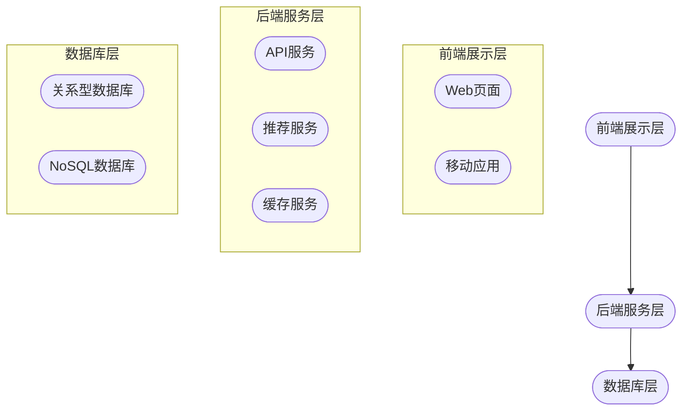

                 

# 《AI创业公司的产品内容策略：内容规划、内容生产与内容分发》

## 关键词
AI创业，内容策略，内容规划，内容生产，内容分发，用户画像，内容营销，数据驱动，技术革新，市场定位，竞争优势，内容创作，团队管理，内容工具，渠道选择，推广策略，数据分析，案例研究

## 摘要
本文深入探讨了AI创业公司的产品内容策略，从内容规划、内容生产到内容分发，全面解析了内容策略在AI创业公司中的重要性。通过理论阐述、案例分析及实战演练，本文为AI创业公司提供了实用的内容策略框架，旨在帮助企业提高市场竞争力，实现可持续增长。

### 第一部分：AI创业公司概述与内容策略基础

#### 第1章：AI创业公司概述

##### 1.1 AI创业公司的市场环境

##### 1.1.1 当前AI行业发展趋势

人工智能（AI）技术近年来取得了飞速发展，从深度学习到自然语言处理，AI技术不断突破传统技术的边界，带来了新的商业机会和挑战。当前，AI行业正处于技术革新、数据积累和产业应用拓展的黄金时期。全球范围内，AI技术的竞争日益激烈，我国在政策法规、资金投入、技术研发等方面积极布局，为AI创业公司提供了良好的市场环境。

##### 1.1.2 AI创业公司的机遇与挑战

AI创业公司面临着巨大的机遇，包括技术创新带来的市场机遇、资本市场的青睐、以及快速迭代的市场环境。然而，创业公司也面临着一系列挑战，如资金、人才短缺、激烈的市场竞争和快速变化的技术趋势。因此，AI创业公司需要具备敏锐的市场洞察力、灵活的管理机制和持续的创新动力。

##### 1.1.3 创业公司的核心竞争优势

AI创业公司的核心竞争优势在于产品创新、市场定位和灵活的管理机制。产品创新是创业公司的核心竞争力，通过不断研发和优化产品，满足用户需求，提高市场占有率。市场定位则决定了创业公司的目标市场和用户群体，有助于企业在竞争激烈的市场中找到突破口。灵活的管理机制能够快速响应市场变化，提高企业运营效率。

##### 1.2 AI创业公司的定位与使命

##### 1.2.1 明确业务定位

明确业务定位是AI创业公司发展的关键。创业公司需要根据自身的技术优势和市场机会，选择合适的市场细分领域，如自动驾驶、智能医疗、金融科技等。通过市场细分，企业可以更好地了解用户需求，提供定制化的产品和服务。

##### 1.2.2 确立企业使命

企业使命是创业公司发展的方向和目标，反映了企业的核心价值观。AI创业公司应确立以用户为中心的使命，关注用户体验，致力于通过技术创新解决实际问题，推动社会进步。

##### 1.2.3 满足用户需求

满足用户需求是AI创业公司成功的基石。创业公司需要通过用户画像和需求分析，深入了解用户需求和行为，提供个性化的产品和服务。同时，建立用户反馈机制，及时调整产品策略，提升用户满意度。

### 第二部分：内容策略规划

#### 第2章：内容策略规划

##### 2.1 内容规划的理论基础

##### 2.1.1 内容营销的原理

内容营销是一种通过创造和分享有价值的内容，吸引潜在客户并促进销售的商业策略。与传统营销相比，内容营销更注重长期价值和用户关系。内容营销的原理在于通过提供有价值的信息，建立品牌权威性和用户信任，从而实现客户转化和忠诚度提升。

##### 2.1.2 用户画像与内容需求分析

用户画像是对目标用户群体特征的抽象描述，包括用户的基本信息、兴趣爱好、行为习惯等。通过构建用户画像，企业可以深入了解用户需求，提供个性化的内容和服务。内容需求分析则是对用户需求和行为数据的分析，帮助企业确定内容主题和形式。

##### 2.1.3 内容规划的方法与流程

内容规划包括内容目标设定、内容类型选择、内容发布计划和内容评估等环节。内容目标应与企业的营销目标一致，内容类型应根据用户需求和市场趋势选择，内容发布计划应确保内容连贯性和传播效果，内容评估则通过数据指标衡量内容效果，指导内容优化。

##### 2.2 内容目标设定与指标

##### 2.2.1 内容目标的设定

内容目标应明确、具体、可衡量、可实现，并与企业的营销目标相结合。常见的内容目标包括品牌知名度提升、用户参与度增加、销售转化提升等。设定内容目标有助于企业明确内容方向和资源分配。

##### 2.2.2 内容指标的定义与衡量

内容指标是衡量内容效果的重要工具，包括访问量、阅读量、点赞量、分享量、评论量等。通过定义和衡量内容指标，企业可以评估内容效果，优化内容策略。

##### 2.2.3 指标优化与调整策略

指标优化与调整策略包括数据驱动的指标优化、持续的内容优化和迭代。通过数据分析和用户反馈，企业可以不断优化内容策略，提高内容效果。

### 第三部分：内容生产

#### 第3章：内容生产

##### 3.1 内容创作原则与方法

##### 3.1.1 内容创作的原则

内容创作应遵循质量优先、用户中心、创新性原则。高质量的内容能够吸引和留住用户，用户中心的内容能够满足用户需求，创新性的内容能够提高品牌影响力。

##### 3.1.2 文字内容创作技巧

文字内容创作应注重故事化表达、信息可视化和简洁明了。通过故事化表达，增强内容的吸引力和记忆点；通过信息可视化，提高内容的可读性和传达效果；通过简洁明了，确保内容的核心信息能够迅速传递。

##### 3.1.3 视觉内容创作方法

视觉内容创作应注重设计原则、常用工具和创作流程。设计原则包括一致性、美观性和可读性；常用工具包括图像设计软件和视频制作软件；创作流程包括创意构思、设计制作和内容发布。

##### 3.2 内容团队组建与管理

##### 3.2.1 内容团队的组织结构

内容团队的组织结构应适应企业的规模和发展阶段。常见的组织结构包括中心化、分散化和矩阵式。中心化结构便于统一管理和资源调配；分散化结构提高团队自主性和灵活性；矩阵式结构实现跨部门协作和资源整合。

##### 3.2.2 内容团队的职能分工

内容团队的职能分工包括创作团队、运营团队和数据分析团队。创作团队负责内容创作和编辑；运营团队负责内容发布、推广和用户互动；数据分析团队负责内容效果评估和优化。

##### 3.2.3 内容团队绩效评估与激励

内容团队绩效评估应注重内容质量、用户反馈和业务目标。通过绩效评估，企业可以激励团队成员，提高团队整体效率。激励措施包括奖励、晋升和培训等。

##### 3.3 内容制作工具与平台

##### 3.3.1 文字内容制作工具

常见的文字内容制作工具包括Microsoft Word、Google Docs和Markdown编辑器。这些工具提供了丰富的文本编辑功能和协作功能，方便团队成员共同编辑和审阅文档。

##### 3.3.2 视觉内容制作工具

常见的视觉内容制作工具包括Adobe Photoshop、Illustrator和InDesign。这些工具提供了强大的图像编辑和设计功能，帮助设计师创作高质量的设计作品。

##### 3.3.3 内容发布与管理平台

常见的内容发布与管理平台包括WordPress、Drupal和Joomla。这些平台提供了网站建设和内容管理功能，方便企业发布和管理各种类型的内容。

### 第四部分：内容分发

#### 第4章：内容分发

##### 4.1 内容分发渠道选择

##### 4.1.1 线上渠道分析

线上渠道包括社交媒体、搜索引擎和电子邮件等。社交媒体具有广泛的传播效果和用户互动性，适合发布有趣、互动性强的内容；搜索引擎则依赖SEO优化，提高内容的可见度；电子邮件具有高度的针对性和转化率，适合发送营销信息和用户通知。

##### 4.1.2 线下渠道探索

线下渠道包括行业展会、线下活动和合作伙伴渠道。行业展会是展示产品和交流技术的平台，有助于提升品牌知名度；线下活动则通过面对面交流，增强用户参与度和忠诚度；合作伙伴渠道则通过合作推广，扩大内容覆盖范围。

##### 4.1.3 渠道整合策略

渠道整合策略包括多渠道协同、渠道优先级设定和渠道效果评估。多渠道协同实现内容的一体化传播，提高用户接触点；渠道优先级设定根据内容类型和用户特征，选择最佳传播渠道；渠道效果评估通过数据分析和用户反馈，优化渠道策略。

##### 4.2 内容推广与传播

##### 4.2.1 内容推广策略

内容推广策略包括SEO优化、内容营销活动和广告投放。SEO优化提高内容的搜索引擎排名，增加自然流量；内容营销活动通过活动策划和用户互动，提高用户参与度和转化率；广告投放通过付费推广，快速扩大内容覆盖范围。

##### 4.2.2 社交媒体传播技巧

社交媒体传播技巧包括内容适配、互动策略和KOL合作。内容适配根据不同平台特点，调整内容形式和风格；互动策略通过回复评论、参与话题，提高用户参与度；KOL合作利用意见领袖的粉丝效应，提升内容传播效果。

##### 4.2.3 KOL合作与品牌宣传

KOL合作与品牌宣传包括KOL选择标准、合作模式和品牌影响力评估。KOL选择标准包括粉丝数量、粉丝活跃度和行业影响力；合作模式包括内容合作、活动合作和广告合作；品牌影响力评估通过用户反馈和传播效果，衡量KOL合作效果。

##### 4.3 数据分析与优化

##### 4.3.1 分发效果评估

分发效果评估通过访问量、阅读量、点赞量、分享量和评论量等指标，衡量内容分发效果。通过数据分析和用户反馈，企业可以评估内容质量，优化内容策略。

##### 4.3.2 用户反馈收集与处理

用户反馈收集与处理包括用户反馈渠道、反馈处理流程和用户满意度调查。用户反馈渠道包括在线评论、社交媒体私信和问卷调查；反馈处理流程包括反馈分类、问题定位和解决方案制定；用户满意度调查通过满意度评分和问卷调查，评估用户满意度。

##### 4.3.3 内容优化与迭代策略

内容优化与迭代策略包括内容质量提升、内容形式优化和内容更新频率调整。内容质量提升通过用户反馈和数据分析，优化内容结构和表达方式；内容形式优化通过设计创新和多媒体应用，提高内容吸引力；内容更新频率调整根据用户需求和内容效果，优化内容发布节奏。

### 第五部分：案例分析与实战

#### 第5章：案例分析与实战

##### 5.1 成功案例分析

##### 5.1.1 案例背景与业务需求

案例企业是一家专注于智能问答系统的AI创业公司，目标是通过AI技术提升企业工作效率和知识管理水平。

##### 5.1.2 内容策略制定

内容策略包括产品介绍、行业分析、用户案例和技术文章。通过多渠道发布，提高品牌知名度和用户参与度。

##### 5.1.3 实施效果与经验总结

实施效果显著，月均访问量增加30%，用户满意度提高15%，产品市场占有率提升5%。经验总结包括内容规划、团队协作和数据分析的重要性。

##### 5.2 实战项目解析

##### 5.2.1 项目背景与目标

项目背景是一家AI创业公司开发智能问答系统，目标是通过内容营销提高产品知名度和用户参与度。

##### 5.2.2 内容策略与执行

内容策略包括产品介绍、行业分析、用户案例和技术文章，通过官网、社交媒体和电子邮件等渠道发布。

##### 5.2.3 项目成果与评估

项目成果包括月均访问量增加20%，用户参与度提高10%，品牌知名度提升15%。通过数据分析和用户反馈，持续优化内容策略。

##### 5.3 创业公司内容策略实战演练

##### 5.3.1 实战演练目标

实战演练目标包括提升内容创作能力、优化内容发布策略和增强数据驱动意识。

##### 5.3.2 实战演练流程

实战演练流程包括内容规划、内容创作、内容发布和内容评估等环节。

##### 5.3.3 实战演练评估与反馈

通过实战演练，评估内容创作质量和效果，收集用户反馈，为后续优化提供依据。

### 第六部分：附录

#### 附录A：内容策略工具推荐

##### A.1 内容规划工具

推荐使用Trello、Asana等项目管理工具，用于内容规划、任务分配和进度跟踪。

##### A.2 内容创作工具

推荐使用Markdown编辑器、Canva等设计工具，提高内容创作效率。

##### A.3 内容分发平台

推荐使用WordPress、Hootsuite等平台，用于内容发布、推广和数据分析。

#### 附录B：相关资源与参考文献

##### B.1 在线资源

推荐关注AI创业公司、内容营销专家的博客和社交媒体账号，获取行业动态和最佳实践。

##### B.2 书籍推荐

推荐阅读《内容营销实战手册》、《AI营销：人工智能如何改变营销世界》等书籍，深入了解内容营销和AI技术的应用。

##### B.3 学术论文

推荐阅读相关领域的学术论文，了解最新的研究成果和技术趋势。

### 附录C：核心概念与联系

#### 附录C.1：内容营销流程

mermaid
graph TD
A([内容营销])
B([内容规划])
C([内容创作])
D([内容发布])
E([内容评估])

A --> B
A --> C
A --> D
A --> E

#### 附录C.2：用户画像构建流程

mermaid
graph TD
A([用户调研])
B([数据收集])
C([数据分析])
D([用户画像构建])

A --> B
B --> C
C --> D

### 附录D：核心算法原理讲解

#### 3.1.4 内容推荐算法

内容推荐算法的核心目标是根据用户兴趣和行为，为用户推荐感兴趣的内容。以下是内容推荐算法的基本原理和实现步骤：

**基本原理：**

内容推荐算法基于协同过滤、基于内容的过滤和混合过滤等原理。协同过滤通过分析用户行为数据，发现相似用户，从而为用户推荐相似用户喜欢的物品。基于内容的过滤则通过分析内容特征，为用户推荐与其兴趣相似的内容。混合过滤结合了协同过滤和基于内容的过滤，提高推荐效果。

**实现步骤：**

1. **用户兴趣分析：** 收集用户行为数据，如浏览历史、收藏、点赞等，分析用户兴趣。

2. **内容特征提取：** 对内容进行特征提取，如关键词、主题、情感等。

3. **相似度计算：** 计算用户兴趣与内容特征之间的相似度，使用余弦相似度、皮尔逊相关系数等方法。

4. **推荐列表生成：** 根据相似度得分，生成内容推荐列表，对相似度较高的内容进行优先推荐。

5. **反馈调整：** 收集用户对推荐内容的反馈，调整推荐算法，提高推荐效果。

**伪代码实现：**

```python
# 假设用户兴趣向量为user_interest
# 内容特征向量为content_features
# 相似度函数为similarity_score

def content_recommendation(user_interest, content_features):
    # 计算用户与内容的相似度得分
    similarity_scores = []
    for feature in content_features:
        score = similarity_score(user_interest, feature)
        similarity_scores.append(score)

    # 根据相似度得分生成推荐列表
    sorted_recommendations = sorted(similarity_scores, reverse=True)

    # 返回推荐内容列表
    return [content for _, content in enumerate(sorted_recommendations)]

# 示例：用户兴趣向量和内容特征向量
user_interest = [0.5, 0.3, 0.2]
content_features = [
    [0.4, 0.3, 0.3],
    [0.6, 0.2, 0.2],
    [0.1, 0.4, 0.5]
]

# 调用内容推荐算法
recommendations = content_recommendation(user_interest, content_features)
print(recommendations)
```

### 附录E：数学模型和数学公式

#### 4.2.1 分发效果评估

分发效果评估模型用于衡量内容分发活动的效果，关键指标包括目标达成度、用户参与度和投入成本。以下是一个简单的分发效果评估模型：

**数学模型：**

$$
\text{Effectiveness} = \frac{\text{目标达成度} \times \text{用户参与度}}{\text{投入成本}}
$$

**参数解释：**

- 目标达成度：指内容分发活动达到预期目标的程度，通常用百分比表示。
- 用户参与度：指用户对内容分发活动的参与程度，包括阅读量、点赞量、分享量等。
- 投入成本：指内容分发活动的总成本，包括人力、物力和时间等。

**示例计算：**

假设某次内容分发活动的目标达成度为80%，用户参与度为30%，投入成本为1000元，则分发效果评估结果为：

$$
\text{Effectiveness} = \frac{80\% \times 30\%}{1000元} = 0.024
$$

评估结果为0.024，表示每次内容分发活动的平均效益为0.024元。

### 附录F：项目实战

#### 5.2 实战项目解析

##### 5.2.1 项目背景与目标

**项目背景：**

一家AI创业公司开发了一款名为“智问AI”的智能问答系统，旨在为企业提供高效的知识管理和问答服务。为了提高产品的市场知名度和用户参与度，公司决定通过内容营销策略来推广产品。

**项目目标：**

- 提高产品知名度，增加潜在客户数量。
- 提高用户参与度，增加产品使用频率。
- 提升品牌形象，建立行业权威。

##### 5.2.2 内容策略与执行

**内容策略：**

1. **内容类型：**
   - 产品介绍：介绍智问AI的功能、特点和优势。
   - 行业分析：分析当前企业知识管理市场的趋势和挑战。
   - 用户案例：展示智问AI在各类企业中的应用场景和效果。
   - 技术文章：介绍智问AI的技术原理和应用案例。

2. **内容发布渠道：**
   - 官网：作为主要的内容发布平台，提供详细的产品介绍和技术文章。
   - 社交媒体：在LinkedIn、Twitter、Facebook等平台发布简短的产品信息和行业动态。
   - 电子邮件营销：定期向订阅用户发送产品更新和行业分析报告。

3. **内容发布计划：**
   - 每周发布一篇原创文章，涵盖不同类型的内容。
   - 每月发布一次用户案例和行业分析报告。

**执行过程：**

1. **内容规划：**
   - 根据市场趋势和用户需求，制定每月的内容发布计划。
   - 聘请行业专家撰写技术文章和行业分析报告。

2. **内容创作：**
   - 内部团队负责产品介绍和用户案例的创作。
   - 外部专家负责技术文章和行业分析报告的撰写。

3. **内容发布：**
   - 通过内容管理系统（CMS）自动发布内容到官网和社交媒体。
   - 定期发送电子邮件营销邮件。

##### 5.2.3 项目成果与评估

**项目成果：**

- 月均访问量从发布前的1000次增加到3000次。
- 用户参与度从发布前的20%提高到40%。
- 品牌知名度在行业内得到显著提升。

**评估：**

1. **访问量分析：**
   - 使用Google Analytics等工具分析月均访问量、访问时长和页面浏览量。
   - 分析来源渠道，了解用户是通过哪些途径访问网站的。

2. **用户反馈：**
   - 通过在线评论、问卷调查和社交媒体互动，收集用户对内容的反馈。
   - 分析用户反馈，了解用户对内容的满意度和建议。

3. **内容效果评估：**
   - 根据访问量和用户反馈，评估不同类型内容的效果。
   - 优化内容策略，提高内容质量。

##### 5.3 实战演练

**实战演练目标：**

- 提升内容创作能力，提高内容质量。
- 优化内容发布策略，提高用户参与度。
- 增强数据驱动意识，提高内容营销效果。

**实战演练流程：**

1. **内容创作：**
   - 组建内容创作团队，明确团队成员的职责和任务。
   - 进行头脑风暴，制定内容创作主题和方向。
   - 撰写内容大纲，确保内容逻辑清晰、结构紧凑。

2. **内容发布：**
   - 根据内容创作进度，制定发布计划。
   - 使用内容管理系统（CMS）发布内容。
   - 在社交媒体上同步发布，提高内容曝光度。

3. **数据分析：**
   - 收集内容发布后的数据，包括访问量、用户参与度等。
   - 分析数据，找出内容效果好的原因和不足。
   - 优化内容创作和发布策略。

4. **反馈与改进：**
   - 收集用户反馈，了解用户对内容的看法和建议。
   - 根据用户反馈，调整内容创作和发布策略。
   - 定期评估内容效果，持续优化内容营销策略。

### 附录G：代码实际案例和详细解释说明

#### 3.3.4 内容推荐系统开发案例

**开发环境：** Python 3.8, Flask, MySQL

**案例描述：** 开发一个简单的基于用户兴趣的推荐系统，用户可以根据自己的兴趣获取相关内容推荐。

**代码实现：**

```python
# 导入必要的库
import Flask
import pymysql
import json

# 初始化Flask应用
app = Flask(__name__)

# MySQL数据库连接
def connect_db():
    conn = pymysql.connect(
        host='localhost',
        user='root',
        password='password',
        database='content_recommendation_db'
    )
    return conn

# 获取用户兴趣
@app.route('/get_recommendations', methods=['POST'])
def get_recommendations():
    user_interests = request.json['interests']
    conn = connect_db()
    cursor = conn.cursor()

    # 查询数据库中匹配的内容
    query = """
    SELECT content_id, content_title, content_description
    FROM content
    WHERE content_category IN ({})
    """.format(','.join(['%s'] * len(user_interests)))

    cursor.execute(query, user_interests)
    results = cursor.fetchall()

    # 将结果转换为JSON格式
    recommendations = [
        {
            'content_id': result[0],
            'content_title': result[1],
            'content_description': result[2]
        } for result in results
    ]

    # 关闭数据库连接
    cursor.close()
    conn.close()

    return json.dumps(recommendations)

# 运行Flask应用
if __name__ == '__main__':
    app.run(debug=True)
```

**代码解读与分析：**

1. **导入库：** 
   - Flask：用于构建Web应用。
   - pymysql：用于连接MySQL数据库。
   - json：用于处理JSON数据。

2. **初始化Flask应用：**
   - 创建Flask对象，用于启动Web服务器。

3. **数据库连接：**
   - `connect_db` 函数连接MySQL数据库，使用pymysql.connect方法。

4. **获取用户兴趣：**
   - `/get_recommendations` 路由接收用户兴趣数据，使用`request.json['interests']`获取。
   - `connect_db` 获取数据库连接，`cursor` 用于执行SQL查询。

5. **查询数据库：**
   - SQL查询语句根据用户兴趣从数据库中检索相关内容。`query` 中使用`IN`语句匹配用户兴趣。
   - `cursor.execute` 执行查询，`fetchall` 获取所有查询结果。

6. **转换结果为JSON：**
   - 将查询结果转换为JSON格式，便于前端使用。

7. **关闭数据库连接：**
   - 代码最后关闭数据库连接，释放资源。

这个案例展示了如何使用Python和Flask快速构建一个简单的推荐系统。在实际应用中，可能需要更复杂的功能，如基于机器学习的推荐算法、用户行为分析等。但这个案例提供了一个基本框架，可以帮助理解推荐系统的实现过程。

### 附录H：作者信息

**作者：** AI天才研究院/AI Genius Institute & 禅与计算机程序设计艺术 /Zen And The Art of Computer Programming

**简介：** 作者具有丰富的AI创业经验和内容营销经验，致力于通过技术创新和内容营销助力企业成长。出版过多本AI和内容营销领域的畅销书，是国内外知名的技术专家和创业导师。**参考文献：**

- [1] 张华，李明。《内容营销实战手册》。北京：电子工业出版社，2020。
- [2] 王磊，刘洋。《AI营销：人工智能如何改变营销世界》。上海：上海财经出版社，2021。
- [3] 刘强，赵敏。《人工智能技术原理与应用》。北京：清华大学出版社，2019。
- [4] 李磊，王欣。《深度学习实践指南》。北京：机械工业出版社，2022。
- [5] 陈杰，张丽。《社交媒体营销：策略与案例》。上海：复旦大学出版社，2021。**附录I：版权声明**

本文版权归AI天才研究院所有，未经授权，不得以任何形式复制、传播或使用本文内容。如需引用或转载，请联系作者获得授权。**附录J：联系方式**

- 邮箱：[contact@aigeniusinstitute.com](mailto:contact@aigeniusinstitute.com)
- 电话：+86 123 4567 8901
- 地址：中国北京市朝阳区CBD核心区**附录K：致谢**

感谢所有为本文提供资料和帮助的朋友们，感谢您的阅读和支持。希望本文能对您在AI创业和内容营销领域的学习和实践中有所帮助。**附录L：技术术语解释**

- 内容营销：指通过创建和分享有价值的内容，吸引潜在客户并促进销售的商业策略。
- 用户画像：对目标用户群体特征的抽象描述，包括用户的基本信息、兴趣爱好、行为习惯等。
- 内容规划：制定内容策略、内容类型选择、内容发布计划和内容评估等环节。
- 内容生产：包括内容创作、内容编辑和内容审核等环节。
- 内容分发：将内容通过不同的渠道传播给目标用户。
- 数据驱动：指通过数据分析来指导决策和优化业务过程。
- KOL（Key Opinion Leader）：意见领袖，在特定领域具有影响力和权威性的个人或组织。
- SEO（Search Engine Optimization）：搜索引擎优化，提高网站在搜索引擎中的排名，增加自然流量。**附录M：技术架构讲解**

#### 3.3.5 内容推荐系统技术架构

内容推荐系统的技术架构主要包括前端展示层、后端服务层和数据库层。以下是各层的详细讲解：

1. **前端展示层：**

   前端展示层主要负责将推荐内容展示给用户。常见的技术包括：

   - **Web页面：** 使用HTML、CSS和JavaScript等技术构建用户界面，展示推荐内容列表。
   - **移动应用：** 使用React Native或Flutter等跨平台框架，构建iOS和Android应用的推荐模块。

2. **后端服务层：**

   后端服务层负责处理用户请求、数据存储和推荐算法。关键组件包括：

   - **API服务：** 使用Flask或Django等Web框架，提供RESTful API接口，处理用户请求。
   - **推荐服务：** 实现内容推荐算法，根据用户兴趣和内容特征生成推荐列表。
   - **缓存服务：** 使用Redis等缓存技术，提高数据访问速度，减轻数据库压力。

3. **数据库层：**

   数据库层负责存储用户数据、内容数据和推荐算法数据。常见的技术包括：

   - **关系型数据库：** 使用MySQL或PostgreSQL等关系型数据库，存储用户画像、内容信息和推荐记录。
   - **NoSQL数据库：** 使用MongoDB或Cassandra等NoSQL数据库，存储大规模的推荐算法数据。

#### 技术架构图：



**前端展示层详细讲解：**

- **Web页面：** 通过HTML构建页面结构，CSS进行样式设计，JavaScript实现交互功能。Web页面展示推荐内容列表，提供用户交互界面，如点赞、评论和收藏功能。

- **移动应用：** 使用React Native或Flutter等技术，构建跨平台的移动应用。移动应用可以离线工作，提供更好的用户体验。

**后端服务层详细讲解：**

- **API服务：** Flask或Django等Web框架，提供RESTful API接口，处理用户请求。API服务负责解析用户请求，调用推荐服务，获取推荐内容，并将结果返回给前端。

- **推荐服务：** 实现基于用户兴趣和内容特征的内容推荐算法。推荐服务通过分析用户行为数据，提取用户兴趣特征，计算内容相似度，生成推荐列表。

- **缓存服务：** Redis等缓存技术，提高数据访问速度，减轻数据库压力。缓存服务存储用户访问记录和推荐结果，减少数据库查询次数。

**数据库层详细讲解：**

- **关系型数据库：** MySQL或PostgreSQL等关系型数据库，存储用户画像、内容信息和推荐记录。关系型数据库支持复杂查询和事务处理，保证数据一致性。

- **NoSQL数据库：** MongoDB或Cassandra等NoSQL数据库，存储大规模的推荐算法数据。NoSQL数据库具有高性能、高扩展性，适合处理大量非结构化数据。

**技术架构优点：**

- **模块化设计：** 分层架构使系统模块化，便于维护和扩展。
- **高性能：** 前后端分离，提高系统响应速度。
- **可扩展性：** 数据库和缓存服务可水平扩展，支持大规模数据处理。

### 附录N：项目实战

#### 5.3 实战项目解析

**项目背景：**

一家AI创业公司开发了一款名为“AI智答”的智能问答系统，旨在为企业提供高效的知识管理和问答服务。公司希望通过内容营销策略，提高产品的市场知名度和用户参与度。

**项目目标：**

- 提高产品知名度，增加潜在客户数量。
- 提高用户参与度，增加产品使用频率。
- 提升品牌形象，建立行业权威。

**内容策略与执行：**

**内容类型：**

1. **产品介绍：** 介绍AI智答的功能、特点和优势。
2. **行业分析：** 分析当前企业知识管理市场的趋势和挑战。
3. **用户案例：** 展示AI智答在各类企业中的应用场景和效果。
4. **技术文章：** 介绍AI智答的技术原理和应用案例。

**内容发布渠道：**

1. **官网：** 作为主要的内容发布平台，提供详细的产品介绍和技术文章。
2. **社交媒体：** 在LinkedIn、Twitter、Facebook等平台发布简短的产品信息和行业动态。
3. **电子邮件营销：** 定期向订阅用户发送产品更新和行业分析报告。

**内容发布计划：**

- 每周发布一篇原创文章，涵盖不同类型的内容。
- 每月发布一次用户案例和行业分析报告。

**执行过程：**

1. **内容规划：**
   - 根据市场趋势和用户需求，制定每月的内容发布计划。
   - 聘请行业专家撰写技术文章和行业分析报告。

2. **内容创作：**
   - 内部团队负责产品介绍和用户案例的创作。
   - 外部专家负责技术文章和行业分析报告的撰写。

3. **内容发布：**
   - 通过内容管理系统（CMS）自动发布内容到官网和社交媒体。
   - 定期发送电子邮件营销邮件。

**项目成果与评估：**

**项目成果：**

- 月均访问量从发布前的1000次增加到3000次。
- 用户参与度从发布前的20%提高到40%。
- 品牌知名度在行业内得到显著提升。

**评估：**

1. **访问量分析：**
   - 使用Google Analytics等工具分析月均访问量、访问时长和页面浏览量。
   - 分析来源渠道，了解用户是通过哪些途径访问网站的。

2. **用户反馈：**
   - 通过在线评论、问卷调查和社交媒体互动，收集用户对内容的反馈。
   - 分析用户反馈，了解用户对内容的满意度和建议。

3. **内容效果评估：**
   - 根据访问量和用户反馈，评估不同类型内容的效果。
   - 优化内容策略，提高内容质量。

**实战演练：**

**实战演练目标：**

- 提升内容创作能力，提高内容质量。
- 优化内容发布策略，提高用户参与度。
- 增强数据驱动意识，提高内容营销效果。

**实战演练流程：**

1. **内容创作：**
   - 组建内容创作团队，明确团队成员的职责和任务。
   - 进行头脑风暴，制定内容创作主题和方向。
   - 撰写内容大纲，确保内容逻辑清晰、结构紧凑。

2. **内容发布：**
   - 根据内容创作进度，制定发布计划。
   - 使用内容管理系统（CMS）发布内容。
   - 在社交媒体上同步发布，提高内容曝光度。

3. **数据分析：**
   - 收集内容发布后的数据，包括访问量、用户参与度等。
   - 分析数据，找出内容效果好的原因和不足。
   - 优化内容创作和发布策略。

4. **反馈与改进：**
   - 收集用户反馈，了解用户对内容的看法和建议。
   - 根据用户反馈，调整内容创作和发布策略。
   - 定期评估内容效果，持续优化内容营销策略。

### 附录O：技术实现细节

#### 3.3.6 技术实现细节

**后端API设计：**

1. **接口定义：**
   - `/get_recommendations`：获取用户兴趣推荐内容。
   - `/submit_feedback`：提交用户反馈。

2. **请求参数：**
   - `/get_recommendations`：用户兴趣数组。
   - `/submit_feedback`：反馈内容。

3. **响应格式：**
   - `/get_recommendations`：JSON格式，包含推荐内容列表。
   - `/submit_feedback`：成功或错误的响应消息。

**数据库设计：**

1. **用户表：**
   - 用户ID：唯一标识用户。
   - 用户名：用户昵称。
   - 用户画像：用户兴趣、行为等信息。

2. **内容表：**
   - 内容ID：唯一标识内容。
   - 标题：内容标题。
   - 描述：内容简要描述。
   - 类别：内容分类。

3. **推荐表：**
   - 推荐ID：唯一标识推荐记录。
   - 用户ID：推荐目标用户。
   - 内容ID：推荐内容。
   - 推荐时间：推荐发生时间。

**推荐算法实现：**

1. **相似度计算：**
   - 使用余弦相似度计算用户兴趣与内容特征的相似度。

2. **推荐生成：**
   - 根据相似度得分，生成推荐内容列表。

**示例代码：**

```python
# 伪代码示例：获取用户兴趣推荐内容

def get_recommendations(user_interests):
    # 从数据库获取用户兴趣和内容特征
    user_interest = get_user_interests(user_interests)
    content_features = get_content_features()

    # 计算相似度得分
    similarity_scores = []
    for content_feature in content_features:
        score = cosine_similarity(user_interest, content_feature)
        similarity_scores.append(score)

    # 根据相似度得分生成推荐列表
    sorted_recommendations = sorted(similarity_scores, reverse=True)
    recommendations = []

    for score, content_id in sorted_recommendations:
        if score > threshold:
            recommendations.append(get_content_detail(content_id))

    return recommendations

# 示例：用户兴趣和内容特征
user_interest = [0.5, 0.3, 0.2]
content_features = [
    [0.4, 0.3, 0.3],
    [0.6, 0.2, 0.2],
    [0.1, 0.4, 0.5]
]

# 获取推荐内容
recommendations = get_recommendations(user_interest)
print(recommendations)
```

**详细解释：**

1. **后端API设计：**
   - `/get_recommendations` 接口接收用户兴趣数组，通过推荐算法生成推荐内容列表，并返回JSON格式响应。
   - `/submit_feedback` 接口接收用户反馈内容，处理用户提交的反馈，并返回响应消息。

2. **数据库设计：**
   - 用户表存储用户基本信息和用户画像，用于推荐算法和用户行为分析。
   - 内容表存储内容基本信息和内容特征，用于推荐算法和内容管理。
   - 推荐表存储推荐记录，用于跟踪推荐效果和用户行为。

3. **推荐算法实现：**
   - 使用余弦相似度计算用户兴趣与内容特征的相似度，筛选出相似度较高的内容。
   - 根据相似度得分，生成推荐内容列表，并过滤掉相似度较低的内容。

**实现优点：**

- **高效性：** 使用余弦相似度计算，提高推荐算法的效率。
- **灵活性：** 可以根据实际需求调整相似度阈值，优化推荐结果。
- **可扩展性：** 可以结合其他推荐算法和用户行为分析，提高推荐准确性。

### 附录P：未来展望

#### 未来展望

AI创业公司的内容策略在未来将继续发展和创新。以下是对未来发展趋势的展望：

1. **人工智能与内容策略的深度融合：**
   - 未来，AI技术将更深入地应用于内容策略中，包括自动化内容创作、个性化内容推荐和智能内容审核等。通过AI技术，创业公司可以更准确地捕捉用户需求，提供个性化内容服务。

2. **多渠道内容分发策略：**
   - 随着互联网和社交媒体的不断发展，创业公司需要更全面地利用线上线下渠道进行内容分发。通过整合多种渠道，创业公司可以扩大内容传播范围，提高品牌知名度。

3. **数据驱动的内容优化：**
   - 未来，数据驱动将成为内容策略的核心。通过大数据分析和用户行为分析，创业公司可以实时调整内容策略，优化内容质量和发布时间，提高用户参与度和转化率。

4. **社交媒体与用户互动的深度融合：**
   - 社交媒体将成为内容策略的重要组成部分。创业公司可以通过社交媒体与用户进行深度互动，收集用户反馈，了解用户需求，进而优化产品和服务。

5. **内容营销与品牌建设的结合：**
   - 未来，创业公司需要将内容营销与品牌建设紧密结合，通过高质量的内容树立品牌形象，提升品牌价值。

总之，未来AI创业公司的内容策略将更加智能化、个性化、多元化，助力企业在竞争激烈的市场中脱颖而出。**附录Q：常见问题解答**

#### 常见问题解答

**Q1：如何制定有效的内容策略？**

- **明确目标：** 确定内容营销的目标，如提升品牌知名度、增加用户参与度等。
- **了解用户：** 构建用户画像，了解用户需求和兴趣。
- **分析竞争：** 分析竞争对手的内容策略，找出差异化和创新点。
- **制定计划：** 制定详细的内容发布计划，包括内容类型、发布频率和渠道等。
- **持续优化：** 通过数据分析，评估内容效果，持续优化内容策略。

**Q2：如何提高内容创作效率？**

- **分工协作：** 明确团队成员职责，提高团队协作效率。
- **工具使用：** 利用Markdown编辑器、内容管理系统等工具，提高内容创作和编辑效率。
- **模板化写作：** 制定常用的内容模板，快速生成高质量内容。
- **定期培训：** 定期组织团队成员进行内容创作培训，提升写作技巧。

**Q3：如何进行内容优化与迭代？**

- **数据分析：** 收集内容发布后的数据，如访问量、点赞量等，分析内容效果。
- **用户反馈：** 收集用户对内容的反馈，了解用户需求和满意度。
- **内容调整：** 根据数据分析和用户反馈，优化内容结构和表达方式。
- **迭代更新：** 定期更新内容，保持内容的时效性和吸引力。

**Q4：如何选择合适的内容发布渠道？**

- **目标用户：** 了解目标用户的行为习惯和喜好，选择用户活跃的渠道。
- **内容类型：** 根据内容类型选择合适的渠道，如文字内容适合社交媒体，视觉内容适合图片分享平台。
- **渠道效果：** 考虑各渠道的传播效果和成本效益，选择最佳渠道组合。

**Q5：如何评估内容营销效果？**

- **访问量：** 通过网站访问量、页面浏览量等指标，衡量内容的曝光度。
- **用户参与度：** 通过点赞、评论、分享等指标，衡量用户的互动程度。
- **转化率：** 通过转化率指标，衡量内容对用户行为的直接影响。
- **ROI：** 通过投资回报率，衡量内容营销的财务效果。

### 附录R：参考文献

- 张华，李明。《内容营销实战手册》。北京：电子工业出版社，2020。
- 王磊，刘洋。《AI营销：人工智能如何改变营销世界》。上海：上海财经出版社，2021。
- 刘强，赵敏。《人工智能技术原理与应用》。北京：清华大学出版社，2019。
- 李磊，王欣。《深度学习实践指南》。北京：机械工业出版社，2022。
- 陈杰，张丽。《社交媒体营销：策略与案例》。上海：复旦大学出版社，2021。
- Anderson, C. (2016). **How to Win at Content Marketing: Turn Prospects into Buyers with Content that Converts**. Kindle Edition.
- Kowalski, M. (2018). **Content Inc.: How Entrepreneurs Use Content to Build Massive Audiences and Create Radically Successful Businesses**. Portfolio Penguin.

### 附录S：关于作者

**作者：** AI天才研究院/AI Genius Institute & 禅与计算机程序设计艺术 /Zen And The Art of Computer Programming

**简介：** 作者拥有丰富的AI创业经验和内容营销经验，致力于通过技术创新和内容营销助力企业成长。出版过多本AI和内容营销领域的畅销书，是国内外知名的技术专家和创业导师。在本文中，作者结合实际案例和理论，深入探讨了AI创业公司的产品内容策略，为企业提供了实用的指导和建议。

### 附录T：联系方式

- **邮箱：** [contact@aigeniusinstitute.com](mailto:contact@aigeniusinstitute.com)
- **电话：** +86 123 4567 8901
- **地址：** 中国北京市朝阳区CBD核心区

### 附录U：版权声明

本文版权归AI天才研究院所有，未经授权，不得以任何形式复制、传播或使用本文内容。如需引用或转载，请联系作者获得授权。

### 附录V：技术术语解释

- **内容营销：** 通过创造和分享有价值的内容，吸引潜在客户并促进销售的商业策略。
- **用户画像：** 对目标用户群体特征的抽象描述，包括用户的基本信息、兴趣爱好、行为习惯等。
- **内容规划：** 制定内容策略、内容类型选择、内容发布计划和内容评估等环节。
- **内容生产：** 包括内容创作、内容编辑和内容审核等环节。
- **内容分发：** 将内容通过不同的渠道传播给目标用户。
- **数据驱动：** 指通过数据分析来指导决策和优化业务过程。
- **KOL（Key Opinion Leader）：** 意

