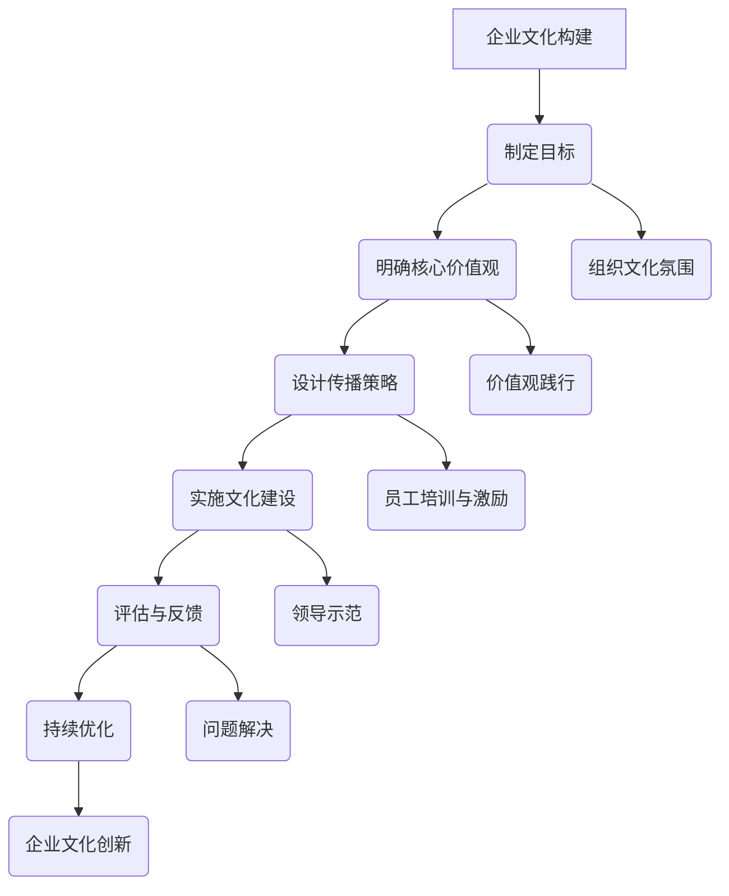
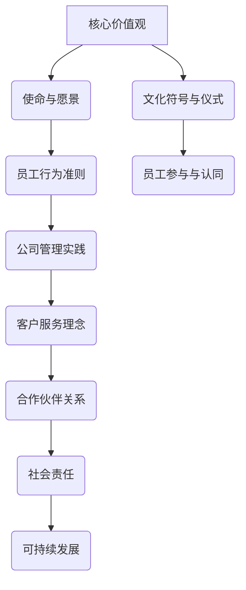
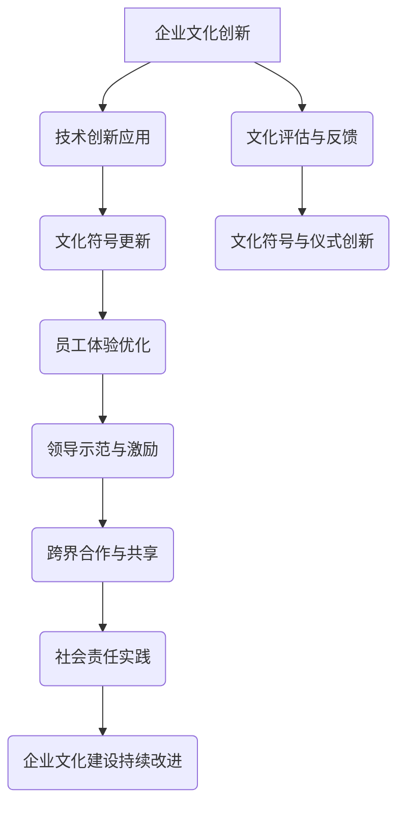

                 

### 文章标题

《AI创业公司的企业文化建设》

### 关键词

- AI创业
- 企业文化
- 组织建设
- 创新与变革
- 可持续性发展

### 摘要

本文旨在探讨AI创业公司在发展过程中如何构建具有独特价值和持久影响的企业文化。文章首先分析了AI行业的背景和趋势，揭示了AI创业公司的特点与挑战。接着，详细阐述了企业文化在AI创业公司中的重要性，探讨了企业文化建设的核心目标与原则，并分享了企业文化在AI创业公司中的实际应用。随后，文章深入探讨了核心价值观念的塑造，包括使命与愿景的制定、核心价值观的培育以及企业精神的塑造。第三部分则关注组织文化的建设与实践，从团队建设、文化传播与推广到文化创新与变革，提供了全面的方法和策略。最后，文章通过案例研究和数学模型，进一步说明了企业文化与AI业务融合的创新和实践，以及企业文化的可持续性发展策略。本文旨在为AI创业公司提供一套系统的企业文化构建方法论，帮助其在激烈的市场竞争中脱颖而出。

## 第一部分：AI创业公司概述

### 第1章：AI创业公司的发展背景与趋势

#### 1.1 AI行业的兴起与创业机遇

人工智能（AI）作为一种颠覆性技术，正迅速改变着世界的面貌。AI技术的兴起可以追溯到20世纪50年代，但真正实现突破是在21世纪初，得益于计算能力的提升、大数据的积累和深度学习算法的创新。近年来，AI在多个领域如医疗、金融、零售、制造等得到了广泛应用，推动了产业结构的升级和经济发展。根据市场研究机构的报告，全球AI市场规模预计将在未来几年内持续增长，预计到2025年将达到数千亿美元。

在这样的大背景下，AI创业公司如雨后春笋般涌现。这些公司以创新的AI技术为核心竞争力，瞄准市场中的痛点，通过提供智能化解决方案来获取市场份额。AI创业公司的发展机遇主要体现在以下几个方面：

1. **技术创新**：随着AI技术的不断进步，创业公司可以借助先进的技术来开发具有竞争力的产品和服务，从而获得竞争优势。
2. **市场需求**：越来越多的行业认识到AI技术的重要性，对AI解决方案的需求不断增加，为创业公司提供了广阔的市场空间。
3. **资本投入**：风险投资和政府的支持使得AI创业公司获得了充足的资金，有助于其研发和市场拓展。
4. **跨界融合**：AI技术与传统行业的深度融合，为创业公司提供了多样化的商业模式和业务场景。

然而，AI创业公司也面临着一系列挑战。首先，技术创新的快速迭代要求创业公司必须具备高度的技术敏感性和研发能力。其次，市场竞争的激烈性使得创业公司需要不断创新和优化产品，以保持市场地位。此外，数据隐私和安全问题也是AI创业公司必须面对的挑战，尤其是在涉及个人数据和敏感信息的领域。

#### 1.2 AI创业公司的特点与挑战

AI创业公司具有以下几个显著特点：

1. **技术密集型**：AI创业公司依赖于先进的人工智能技术，研发投入占比高，技术创新是公司发展的核心驱动力。
2. **数据依赖性**：AI技术的有效性和可靠性很大程度上依赖于高质量的数据集，因此数据管理和数据安全是公司运营的重要环节。
3. **跨界融合**：AI创业公司往往需要与多个行业领域进行合作，实现技术的跨行业应用和商业模式的创新。
4. **快速迭代**：AI技术的快速迭代要求创业公司具备敏捷的研发和运营能力，不断优化产品和服务以适应市场变化。

在AI创业公司的成长路径中，常见的挑战包括：

1. **技术风险**：AI技术的不确定性和复杂性可能导致研发失败或产品性能不达预期，对公司的发展构成威胁。
2. **市场风险**：市场需求的不确定性以及竞争对手的激烈竞争可能影响公司的市场拓展和盈利能力。
3. **人才风险**：AI行业的高技术门槛要求公司必须吸引和留住顶尖人才，人才流失可能影响公司的核心竞争力。
4. **资金风险**：创业公司通常面临资金压力，需要通过融资来支持研发和市场拓展，资金短缺可能导致公司运营困难。

#### 1.3 AI创业公司的成长路径

AI创业公司的成长路径通常可以分为以下几个阶段：

1. **初创阶段**：在这个阶段，公司主要专注于技术研究和产品原型开发，目标是打造一个具有竞争力和创新性的AI解决方案。
2. **种子阶段**：公司开始吸引种子轮融资，利用资金进行市场调研、产品优化和团队建设，逐步进入市场。
3. **扩张阶段**：公司通过A轮、B轮融资获得大量资金，加速产品研发和市场拓展，扩大市场份额。
4. **成熟阶段**：公司实现盈利，市场地位稳固，开始进行行业并购或与其他企业合作，进一步巩固市场地位。

在成长过程中，AI创业公司需要不断调整战略和策略，以应对市场变化和技术挑战。企业文化在这个过程中起着至关重要的作用，它不仅是公司内部凝聚力的来源，也是公司在市场竞争中的核心竞争力之一。

### 第2章：企业文化建设在AI创业公司中的重要性

#### 2.1 企业文化对AI创业公司的影响

企业文化是企业的灵魂，它不仅决定了企业的行为方式和员工的行为习惯，更直接影响企业的核心竞争力。在AI创业公司中，企业文化建设尤为重要，其影响可以从以下几个方面进行分析：

1. **团队凝聚力**：企业文化可以增强团队成员之间的凝聚力，促进团队合作，从而提高工作效率。在AI领域，技术创新往往需要多学科的知识和技能，团队合作显得尤为重要。一个具有共同价值观和文化认同的团队可以更好地协同工作，发挥出集体的智慧和创造力。

2. **员工忠诚度**：良好的企业文化可以提高员工的满意度和忠诚度，减少员工流失率。在AI创业公司中，优秀的人才通常是公司最宝贵的资源。通过营造积极的企业文化，公司可以吸引并留住顶尖人才，确保公司持续的技术创新和业务发展。

3. **企业形象**：企业文化是企业对外展示形象的重要组成部分。一个具有独特文化特色的企业更容易在市场中脱颖而出，赢得客户的信任和支持。AI创业公司通常需要建立强大的品牌影响力，企业文化作为品牌价值的一部分，对于提升企业形象具有重要作用。

4. **创新氛围**：企业文化可以塑造创新氛围，鼓励员工勇于尝试和探索。在AI领域，创新是公司持续发展的动力。一个开放、包容、鼓励创新的企业文化可以激发员工的创造力和创新精神，推动公司不断突破技术瓶颈，实现业务的快速发展。

#### 2.2 企业文化建设的目标与原则

企业文化建设的目标是构建一种具有独特价值和企业特色的文化，以支持企业的长期发展。具体目标包括：

1. **明确核心价值观**：核心价值观是企业文化的核心，它代表企业的信仰和追求。通过明确核心价值观，企业可以形成一致的行为准则，增强员工的文化认同感。

2. **营造积极的工作环境**：企业文化建设的目标之一是营造一个积极、健康、和谐的工作环境，使员工能够在愉悦的氛围中工作，提高工作效率和质量。

3. **增强团队协作**：通过企业文化建设，可以增强团队成员之间的协作和沟通，提高团队的整体战斗力。

4. **提升企业形象**：企业文化的建设不仅是为了内部，也是为了外部。一个具有良好企业文化的外部形象可以增强客户和合作伙伴的信任，促进业务合作。

在实现这些目标的过程中，企业文化建设应遵循以下原则：

1. **与公司战略相一致**：企业文化应该与公司的战略目标相一致，以支持公司长期发展。这意味着企业文化需要与时俱进，随着公司战略的调整而进行调整。

2. **全员参与**：企业文化建设不仅仅是管理层的责任，而应该是全体员工的共同参与。通过全员参与，可以增强员工对文化的认同感和参与感。

3. **持续优化**：企业文化不是一成不变的，而是需要不断优化和调整。随着外部环境和内部需求的变化，企业文化也需要进行相应的调整和优化，以保持其活力和适应性。

4. **价值导向**：企业文化应该以价值为导向，强调道德、诚信、创新等核心价值观，以此引导员工的行为和决策。

#### 2.3 企业文化在AI创业公司中的实际应用

在AI创业公司中，企业文化的实际应用主要体现在以下几个方面：

1. **招聘与培养**：企业文化建设首先体现在招聘和人才培养上。公司应通过明确的价值观和行为准则来筛选合适的员工，并通过培训和文化活动来培养员工的归属感和责任感。

2. **团队建设**：团队建设是企业文化建设的重要组成部分。通过定期的团队建设活动和协作项目，可以增强团队成员之间的信任和合作，提高团队的凝聚力和战斗力。

3. **激励机制**：企业文化建设还包括建立有效的激励机制，以激发员工的积极性和创造力。通过绩效考核、奖励制度等手段，可以鼓励员工追求卓越，提升工作质量。

4. **内部沟通**：良好的企业文化应该促进内部沟通，使员工能够及时了解公司战略、目标和最新动态。通过定期的内部会议、汇报和沟通平台，可以增强员工对公司文化的认同感和参与度。

5. **社会责任**：AI创业公司还应该承担社会责任，通过企业文化建设来推动社会责任的落实。例如，通过参与公益活动、推广环保技术等方式，可以提升公司的社会形象和品牌价值。

总之，企业文化建设是AI创业公司长期发展的重要基石。通过明确核心价值观、营造积极的工作环境、增强团队协作和提升企业形象，AI创业公司可以更好地应对市场挑战，实现持续创新和长期发展。

## 第二部分：核心价值观念的塑造

### 第3章：使命与愿景的制定

#### 3.1 使命与愿景的定义

在AI创业公司中，使命与愿景是企业文化的重要组成部分，它们为公司的发展指明了方向，并为员工提供了共同的目标和价值观。使命是指企业存在的根本目的和理由，它回答了“公司为什么要存在”的问题。而愿景则是企业希望达到的未来状态，它描绘了企业长远发展的目标和理想，回答了“公司将成为什么”的问题。

使命与愿景不仅为公司提供了战略指导，也为员工的工作注入了动力和意义。一个清晰且具有吸引力的使命和愿景可以帮助公司形成强大的企业文化，提高员工的归属感和认同感，从而增强公司的凝聚力和竞争力。

#### 3.2 使命与愿景的制定方法

制定一个有效的使命与愿景需要系统性的方法和步骤，以下是一些常见的制定方法：

1. **内部讨论**：公司的高层管理团队和核心员工应进行深入的内部讨论，共同探讨公司的使命和愿景。这个过程中可以收集不同部门和角色的意见和建议，以确保使命和愿景的全面性和代表性。

2. **外部调研**：公司还应进行外部调研，了解市场和客户的需求，以及竞争对手的情况。通过外部调研，可以获取外部环境对使命和愿景的影响，确保公司使命和愿景的可行性和前瞻性。

3. **价值观评估**：评估公司的核心价值观，确保使命和愿景与公司的核心价值观相一致。这一步骤有助于确保使命和愿景能够真正体现公司的文化和精神。

4. **书面文档**：将使命和愿景形成书面文档，并进行广泛传播。书面文档可以帮助员工更好地理解和接受使命和愿景，同时也可以作为公司决策和行动的指南。

5. **定期审视**：使命和愿景不是一成不变的，公司应定期审视和调整使命和愿景，以适应外部环境和内部需求的变化。定期审视可以确保使命和愿景的持续有效性。

#### 3.3 使命与愿景的传播与落地

使命与愿景的制定只是第一步，更重要的是如何将它们传播和落地，使全体员工都能够认同和践行。以下是一些有效的传播和落地策略：

1. **内部培训**：通过内部培训和研讨会，向员工解释和传达使命和愿景的重要性和内容。培训过程中可以结合案例分析和互动讨论，增强员工的参与感和理解度。

2. **公司内部沟通**：通过公司内部通讯、会议、邮件等方式，定期向员工传达使命和愿景。这些沟通渠道可以帮助员工了解公司的战略方向和目标，从而更好地与公司保持一致。

3. **文化活动**：举办以使命和愿景为主题的文化活动，如团队建设、文化沙龙等，使员工在活动中感受到使命和愿景的重要性和影响力。

4. **绩效评估**：将使命和愿景融入绩效评估体系，使员工的行为和绩效与公司使命和愿景保持一致。通过绩效评估，可以激励员工为实现公司使命和愿景而努力。

5. **领导示范**：公司领导层应通过自身的行为示范，带头践行使命和愿景。领导层的示范作用可以带动整个团队，使使命和愿景真正落地。

总之，制定和传播使命与愿景是AI创业公司企业文化塑造的重要环节。通过系统的方法和有效的策略，公司可以确保使命和愿景在公司内部得到广泛认同和践行，从而为公司的长期发展奠定坚实的基础。

### 第4章：核心价值观的培育

#### 4.1 核心价值观的选择

核心价值观是企业文化的基础，它不仅反映了公司的使命和愿景，还指导着公司日常运营和员工行为。选择核心价值观需要考虑以下几个关键因素：

1. **与公司使命和愿景的一致性**：核心价值观应与公司的使命和愿景相一致，以确保企业文化的整体性和一致性。例如，如果公司的使命是推动科技进步，核心价值观可以包括创新、持续学习和追求卓越。

2. **体现公司的独特性**：核心价值观应体现公司的独特性，反映公司的文化特色和企业精神。例如，一家AI创业公司可能将“客户至上”和“技术驱动”作为核心价值观，这既符合公司的发展方向，也体现了公司的核心竞争力。

3. **可操作性和实际意义**：核心价值观需要具有可操作性，能够具体指导员工的行为和决策。同时，它们应具有实际意义，能够在公司内部得到认同和践行。

4. **广泛性和包容性**：核心价值观应具有广泛性和包容性，能够涵盖不同部门和层级的需求。例如，诚信、责任和团队合作等价值观可以适用于公司各个层面，促进内部和谐与协作。

5. **长期性和适应性**：核心价值观应具有长期性，能够在公司发展的不同阶段保持其指导意义。同时，它们也应具备一定的适应性，能够随着外部环境和内部需求的变化进行适当调整。

#### 4.2 核心价值观的内涵与表述

明确核心价值观的内涵和表述是企业文化塑造的重要一环。以下是一些常见的核心价值观及其内涵和表述：

1. **创新**：内涵：不断探索新的方法和技术，追求卓越和突破。
   表述：“我们鼓励创新思维，勇于突破传统，持续推动技术进步。”

2. **客户至上**：内涵：始终将客户的需求和满意度放在首位，提供优质的服务和解决方案。
   表述：“以客户为中心，超越期望，为客户提供卓越的体验和价值。”

3. **诚信**：内涵：坚守诚信原则，诚信待人，诚信做事。
   表述：“诚信是我们行为的基石，我们始终以诚信赢得信任和尊重。”

4. **责任**：内涵：勇于承担责任，对自己的行为和决策负责。
   表述：“我们勇于承担责任，积极面对挑战，为公司的成功贡献力量。”

5. **团队合作**：内涵：强调团队合作，尊重个体，发挥集体智慧。
   表述：“团队合作是我们的力量，我们携手并进，共同创造辉煌。”

6. **持续学习**：内涵：不断学习新知识、新技能，不断提升自身能力和素质。
   表述：“持续学习是我们的动力，我们追求知识，追求卓越。”

7. **社会责任**：内涵：承担社会责任，积极参与社会公益活动，推动社会进步。
   表述：“我们承担社会责任，关注社会问题，为社会的发展贡献力量。”

这些核心价值观的具体表述应根据公司的实际情况进行调整，以确保其能够真正体现公司的文化特色和价值观。

#### 4.3 核心价值观的践行与强化

核心价值观的践行和强化是企业文化建设的核心任务。以下是一些有效的策略：

1. **领导示范**：公司领导层应通过自身的行为示范，带头践行核心价值观。领导层的行为和决策应始终与核心价值观保持一致，以此影响和激励员工。

2. **培训与教育**：通过定期的培训和教育活动，向员工传达核心价值观的重要性和内涵。培训内容可以包括讲座、研讨会、案例分析等，以增强员工对核心价值观的理解和认同。

3. **行为规范**：制定明确的行为规范和规章制度，将核心价值观融入日常工作流程和行为准则中。例如，通过绩效评估体系，将核心价值观的践行情况纳入考核指标。

4. **激励机制**：建立激励机制，鼓励员工践行核心价值观。可以通过表彰、奖励等方式，对践行核心价值观表现突出的员工进行奖励，以激发员工的积极性和主动性。

5. **内部沟通**：通过内部沟通渠道，如公司内部网站、邮件、会议等，定期宣传和推广核心价值观。这些沟通渠道可以帮助员工了解和践行核心价值观，增强文化认同感。

6. **文化活动**：举办以核心价值观为主题的文化活动，如团队建设活动、文化沙龙等，使员工在活动中感受到核心价值观的重要性和影响力。

7. **监督与反馈**：建立监督和反馈机制，对核心价值观的践行情况进行监督和评估。通过定期的员工满意度调查和反馈，及时发现问题并加以改进。

总之，核心价值观的培育和强化需要全员参与和持续努力。通过有效的策略和措施，AI创业公司可以确保核心价值观在公司内部得到广泛认同和践行，从而形成强大的企业凝聚力和文化优势。

### 第5章：企业精神的塑造

#### 5.1 企业精神的内涵

企业精神是企业文化的核心，它体现了公司的核心价值观和行为准则，是企业独特文化和精神风貌的集中体现。企业精神通常具有以下几个方面的内涵：

1. **使命感**：企业精神强调企业肩负的使命和责任，鼓励员工为实现企业使命而不懈努力。这种使命感可以激发员工的奋斗精神和奉献精神，使员工在工作中始终保持高度的敬业态度。

2. **进取心**：企业精神鼓励员工不断追求进步和卓越，勇于面对挑战和困难。进取心是企业精神的重要组成部分，它推动员工不断学习和成长，以适应快速变化的市场环境。

3. **创新意识**：企业精神强调创新和创造力，鼓励员工积极探索新的方法和技术，勇于突破传统和常规。创新意识是企业保持竞争优势的重要保障，它使企业能够不断推出具有市场竞争力的高质量产品和服务。

4. **团队协作**：企业精神强调团队合作和集体智慧，鼓励员工相互支持、相互合作，共同实现企业目标。团队协作是企业实现高效运作和共同进步的关键，它能够增强员工的归属感和集体荣誉感。

5. **诚信价值观**：企业精神强调诚信和道德，要求员工在商业活动中保持诚信，坚持正直和透明的原则。诚信价值观是企业赢得客户信任和合作伙伴支持的基础，它能够提升企业的社会形象和品牌价值。

6. **责任感**：企业精神强调员工对企业和工作的责任感，鼓励员工对自己的行为和决策负责，勇于承担工作责任和挑战。责任感是企业员工积极履行职责、提升工作质量的重要动力。

#### 5.2 企业精神的培育途径

企业精神的培育是一个长期且系统的过程，需要从多个方面进行努力。以下是一些常见的企业精神培育途径：

1. **领导示范**：公司领导层应通过自身的行为和决策，带头践行企业精神。领导层的示范作用可以激励员工学习和践行企业精神，增强员工对企业精神的认同感。

2. **文化宣传**：通过内部宣传渠道，如公司内部网站、邮件、海报、宣传片等，定期宣传和推广企业精神。文化宣传可以帮助员工深入了解企业精神的重要性和内涵，增强员工的文化认同感。

3. **培训与教育**：通过定期的培训和教育活动，向员工传达企业精神的重要性和实践方法。培训内容可以包括企业精神的内涵、案例分享、互动讨论等，以增强员工对企业精神的理解和认同。

4. **激励机制**：建立激励机制，鼓励员工践行企业精神。可以通过表彰、奖励等方式，对践行企业精神表现突出的员工进行奖励，以激发员工的积极性和主动性。

5. **团队建设活动**：举办以企业精神为主题的团队建设活动，如团队拓展训练、文化沙龙等，使员工在活动中感受到企业精神的重要性和影响力。

6. **内部沟通**：通过内部沟通渠道，如公司内部会议、座谈会、意见箱等，促进员工对企业精神的讨论和交流。内部沟通可以帮助员工更好地理解企业精神，并将其融入到日常工作和行为中。

7. **文化符号与仪式**：创建具有象征意义的文化符号和仪式，如企业精神宣言、企业精神奖等，使员工在日常工作和生活中时刻感受到企业精神的存在。文化符号和仪式可以增强员工对企业的归属感和认同感。

8. **员工参与**：鼓励员工积极参与企业精神的培育和传播，通过员工座谈会、意见征集等方式，让员工参与到企业精神的制定和实施过程中，提高员工的参与感和认同感。

总之，企业精神的塑造是企业文化建设的核心任务。通过领导示范、文化宣传、培训与教育、激励机制、团队建设活动、内部沟通、文化符号与仪式以及员工参与等多种途径，AI创业公司可以培育和弘扬具有独特价值和持久影响的企业精神，为公司的长期发展奠定坚实的基础。

### 第6章：团队建设与管理

#### 6.1 团队建设的重要性

团队建设是企业文化的重要组成部分，对于AI创业公司来说尤为重要。团队建设不仅关系到公司内部协作效率和工作氛围，还直接影响公司的创新能力和市场竞争力。以下是团队建设的重要性和具体影响：

1. **提高协作效率**：通过团队建设，可以增强团队成员之间的沟通和协作，减少误解和冲突，提高整体工作效率。在AI创业公司中，技术创新往往需要跨学科的知识和技能，团队合作是高效解决问题和推进项目的重要保障。

2. **激发创新潜能**：良好的团队氛围可以激发员工的创新思维和创造力。团队建设活动如头脑风暴、团队讨论和项目协作，可以促进不同思维碰撞，产生新的创意和解决方案，从而推动公司的技术进步和业务创新。

3. **提升员工满意度**：团队建设有助于提高员工的满意度和幸福感，减少员工流失率。通过团队活动，员工可以建立深厚的同事关系，感受到团队的支持和关爱，从而更加投入工作，提升工作质量和绩效。

4. **增强公司凝聚力**：团队建设可以增强公司的凝聚力和归属感，使员工对公司的认同感和忠诚度提升。一个具有高度凝聚力的团队可以更好地应对外部挑战，实现公司的长期发展战略。

5. **提升市场竞争力**：高效的团队建设和良好的团队文化可以提升公司的市场竞争力。通过协同合作和资源共享，团队能够更快速地响应市场需求，推出高质量的产品和服务，从而在激烈的市场竞争中脱颖而出。

#### 6.2 团队建设的方法与技巧

为了实现高效的团队建设，AI创业公司可以采取以下方法和技巧：

1. **明确目标和职责**：团队建设首先需要明确团队的目标和每个成员的职责。通过制定清晰的目标和职责分配，可以确保团队成员明确自己的工作方向和任务，提高工作效率。

2. **沟通与协作**：建立有效的沟通渠道和协作机制，促进团队成员之间的沟通和协作。可以通过定期的团队会议、邮件、即时通讯工具等方式，保持团队内部的信息流通和协同合作。

3. **培训与发展**：提供团队成员所需的培训和技能发展机会，提升团队整体能力和素质。通过专业培训、技能分享会、学习小组等形式，帮助团队成员不断学习和成长。

4. **团队建设活动**：定期组织团队建设活动，如团队拓展训练、文化沙龙、体育比赛等，增强团队成员之间的互动和信任。这些活动可以提升团队凝聚力，促进团队成员之间的深入了解和合作。

5. **激励与认可**：建立激励机制，对在团队建设中表现优秀的成员进行奖励和认可。通过表彰、奖金、晋升等方式，激励团队成员积极参与团队建设和工作，提升团队整体表现。

6. **角色分工与补位**：在团队中明确每个成员的角色和职责，确保每个成员都能够充分发挥自己的优势。同时，培养团队成员之间的补位意识，当某个成员无法完成任务时，其他成员能够及时接手，确保团队工作的连续性和稳定性。

7. **反馈与改进**：建立定期的团队反馈机制，收集团队成员的意见和建议，及时改进团队管理和工作方式。通过反馈和改进，可以不断提升团队建设和管理的水平，确保团队始终保持高效和活力。

总之，团队建设是AI创业公司不可或缺的重要环节。通过明确目标和职责、沟通与协作、培训与发展、团队建设活动、激励与认可、角色分工与补位以及反馈与改进等方法，AI创业公司可以构建一个高效、协同、创新的团队，为公司的发展提供强大的支持和动力。

### 第7章：企业文化的传播与推广

#### 7.1 企业文化的传播渠道

企业文化的传播与推广是确保企业文化在全体员工中深入人心的关键步骤。为了实现这一目标，AI创业公司需要利用多种传播渠道，以确保文化信息能够广泛传递和深入人心。以下是几种常见的企业文化传播渠道：

1. **内部沟通平台**：内部沟通平台是企业文化传播的重要渠道之一。公司可以利用邮件系统、内部论坛、企业微信等工具，定期发布企业文化相关的内容，如企业价值观、使命和愿景，以及文化活动和通知。这些平台可以促进信息的快速传递和广泛覆盖。

2. **企业内刊**：企业内刊（如《企业文化简报》或《企业内部杂志》）是另一种有效的传播渠道。通过定期发布内刊，公司可以详细介绍企业文化理念、员工故事、文化活动和公司重大决策，增强员工对企业文化的理解和认同。

3. **员工培训**：培训是传播企业文化的重要手段。公司可以组织企业文化培训课程，包括企业文化讲座、工作坊、角色扮演等，帮助员工深入了解企业文化内涵，并将其融入到日常工作中。

4. **文化活动**：文化活动是营造企业文化氛围的有效途径。公司可以举办各种形式的文化活动，如团队建设活动、文化沙龙、庆典活动等，通过这些活动让员工在参与过程中感受和体验企业文化。

5. **领导示范**：领导层的示范作用对企业文化的传播至关重要。公司领导层应通过自身的行为和决策，践行企业文化，成为员工学习的榜样。领导层的示范可以增强员工对企业文化的认同感和信任感。

6. **员工沟通会**：定期举行员工沟通会，让员工有机会直接与企业领导和管理层交流。这些沟通会可以是定期的团队会议、员工座谈会或意见箱，员工可以通过这些渠道提出问题、分享意见和建议，加强企业内部的信息流通。

7. **企业网站和社交媒体**：企业网站和社交媒体平台也是传播企业文化的重要渠道。公司可以在官方网站和社交媒体上发布企业文化相关的信息，如企业新闻、员工故事、文化活动报道等，吸引员工的关注和参与。

#### 7.2 企业文化的推广策略

为了有效地推广企业文化，AI创业公司需要制定一系列有针对性的策略，确保文化理念能够深入人心，并在员工行为中得到体现。以下是几种有效的企业文化推广策略：

1. **文化与战略相结合**：将企业文化与公司的战略目标相结合，使企业文化成为公司战略实施的重要支撑。通过将企业文化融入到公司的战略规划和业务流程中，确保企业文化在各个层面得到落实。

2. **全员参与**：鼓励全体员工参与企业文化推广活动，通过员工自发组织的文化活动、文化分享会和团队建设活动，增强员工对企业文化的认同感和参与感。

3. **领导引领**：领导层的积极参与和示范作用对于企业文化推广至关重要。公司领导层应主动参与到企业文化活动中，成为企业文化的推广者和践行者。

4. **奖励机制**：建立激励机制，对在企业文化建设中表现优秀的员工进行表彰和奖励。通过奖励机制，激励员工积极践行企业文化，提升整体文化氛围。

5. **培训与教育**：通过定期的企业文化培训和教育，帮助员工深入了解企业文化的内涵和重要性。培训内容可以包括企业文化讲座、文化研讨会、角色扮演等，增强员工对企业文化的理解和认同。

6. **文化符号与仪式**：创建具有象征意义的文化符号和仪式，如企业文化节、企业精神奖等，使员工在日常工作和生活中时刻感受到企业文化的影响。这些符号和仪式可以增强员工对企业文化的认同感和归属感。

7. **外部宣传**：通过外部宣传渠道，如企业官方网站、社交媒体、新闻媒体等，推广企业文化，提升企业的社会形象和品牌价值。外部宣传可以吸引潜在员工和合作伙伴的关注，进一步巩固企业文化的影响力。

总之，企业文化的传播与推广需要多渠道、多层次地进行。通过内部沟通平台、企业内刊、员工培训、文化活动、领导示范、员工沟通会和企业网站等多种渠道，以及文化与战略相结合、全员参与、领导引领、奖励机制、培训与教育、文化符号与仪式和外部宣传等策略，AI创业公司可以有效地推广企业文化，使其在全体员工中深入人心，为公司的长期发展提供坚实的文化基础。

### 第8章：企业文化的创新与变革

#### 8.1 企业文化的适应性变革

企业文化并非一成不变，而是需要随着外部环境和内部需求的变化进行适应性变革。这种变革是企业文化持续发展的必要条件，也是企业应对市场挑战和保持竞争力的关键。

**适应性变革的必要性**：

1. **应对市场变化**：市场环境不断变化，新技术的出现、消费者需求的变化等都可能对企业文化提出新的要求。企业需要通过适应性变革，及时调整文化理念和行为规范，以适应市场变化。

2. **提升竞争力**：企业文化创新与变革有助于提升企业的核心竞争力。通过引入新的管理理念、工作方式和技术，企业可以优化内部流程，提高运营效率，从而在激烈的市场竞争中脱颖而出。

3. **保持组织活力**：企业文化需要不断注入新的活力，以激发员工的创造力和创新精神。适应性变革可以打破旧有的思维定势和惰性，推动企业持续进步。

**适应性变革的过程**：

1. **评估当前文化**：首先，企业需要评估当前的文化状态，分析其优势与劣势，识别出需要改进的方面。可以通过员工调查、文化研讨会等方式，收集员工对当前文化的反馈和建议。

2. **明确变革目标**：在评估的基础上，企业应明确适应性变革的目标，包括希望实现的文化变革方向、关键指标和预期效果。目标应具有可操作性和可行性，以确保变革的顺利进行。

3. **设计变革策略**：根据变革目标，企业需要设计具体的变革策略，包括变革的范围、时间表、实施步骤和资源分配等。策略应充分考虑企业内部和外部环境的因素，以确保变革的有效性。

4. **沟通与培训**：变革过程中，企业需要与员工进行充分的沟通，解释变革的原因、目标和预期效果，并解答员工的问题和疑虑。同时，提供培训和支持，帮助员工适应新的文化要求和行为规范。

5. **监测与反馈**：在变革实施过程中，企业应定期监测变革的进展和效果，通过反馈机制收集员工和客户的意见，及时调整变革策略。监测与反馈可以确保变革的持续改进和优化。

**适应性变革的方法**：

1. **引入外部专家**：聘请外部咨询专家，为企业提供专业指导和支持，帮助制定变革策略和实施方案。

2. **内部试点**：在实施全面变革前，可以先在一个或几个部门进行试点，积累经验，评估效果，为全面推广提供参考。

3. **文化符号更新**：通过更新企业的文化符号，如标志、口号等，强化变革的象征意义，提升员工对变革的认同感和参与度。

4. **激励机制调整**：通过调整激励机制，如绩效评估体系、奖励制度等，鼓励员工积极适应和践行新的文化理念。

5. **持续反馈与改进**：建立持续反馈和改进机制，鼓励员工提出改进建议，不断完善企业文化，确保其与企业发展同步。

#### 8.2 企业文化创新的动力与路径

企业文化创新是提升企业竞争力和持续发展的关键。企业文化创新不仅需要内部动力的驱动，还需要明确的路径和策略。

**企业文化创新的动力**：

1. **市场需求**：市场需求是推动企业文化创新的重要动力。随着消费者需求的变化和新技术的涌现，企业需要不断进行文化创新，以提供更符合市场需求的产品和服务。

2. **竞争压力**：竞争压力可以激发企业进行文化创新，以提升市场竞争力。在激烈的市场竞争中，企业需要通过文化创新来提升产品和服务的差异化，赢得市场份额。

3. **员工参与**：员工是企业文化创新的主体，他们的积极参与和创造力是企业文化创新的重要动力。通过鼓励员工提出创新建议和参与文化创新项目，可以激发企业的创新活力。

4. **技术创新**：技术创新是企业文化创新的重要推动力。随着新技术的应用，企业的运营模式和管理理念也需要进行相应的调整和创新。

**企业文化创新的路径**：

1. **文化氛围营造**：营造一种鼓励创新、包容失败的文化氛围，使员工敢于尝试和探索新的理念和方法。可以通过举办创新竞赛、鼓励员工自主提案等方式，激发员工的创新潜力。

2. **内部协作与分享**：促进内部协作和知识分享，通过跨部门合作和经验交流，激发创新思维和创造力。可以通过内部创新论坛、创新分享会等方式，促进员工之间的交流和互动。

3. **外部合作与学习**：与外部合作伙伴和行业专家进行合作与学习，借鉴外部成功经验和最佳实践，提升企业文化创新的水平。可以通过参加行业研讨会、举办外部专家讲座等方式，拓宽视野和思维方式。

4. **激励机制**：建立激励机制，对在文化创新中表现优秀的员工进行奖励和认可，激发员工的创新热情。可以通过奖金、晋升、荣誉等多种形式，激励员工积极参与文化创新。

5. **试点与推广**：在实施文化创新时，可以先在一个或几个部门进行试点，验证方案的可行性和效果，再逐步推广到整个企业。通过试点与推广，可以确保文化创新的顺利进行和持续优化。

总之，企业文化的适应性变革和创新是提升企业竞争力和持续发展的关键。通过明确变革目标、设计变革策略、沟通与培训、监测与反馈以及引入外部专家、内部试点、文化符号更新、激励机制调整和持续反馈与改进等方法，AI创业公司可以构建具有适应性和创新性的企业文化，为企业的长期发展提供坚实的文化基础。

### 第9章：AI技术与企业文化结合的创新

#### 9.1 AI技术对企业文化的影响

随着AI技术的不断进步，其在各个领域的应用已经深刻改变了企业的运营模式和管理理念。在企业文化建设中，AI技术同样发挥着重要作用，它不仅推动了企业文化的创新，也带来了诸多变革。以下是AI技术对企业文化影响的几个方面：

1. **个性化沟通**：AI技术可以通过自然语言处理和机器学习算法，实现与员工的个性化沟通。通过企业内部聊天机器人或AI客服系统，公司可以实时了解员工的情感状态和工作需求，提供针对性的支持和建议。这种个性化的沟通有助于增强员工的归属感和满意度。

2. **数据分析**：AI技术能够高效地分析和处理大量的员工数据，如绩效数据、反馈数据和行为数据。通过对这些数据的深入分析，公司可以识别出文化中的潜在问题，制定有针对性的改进措施。数据分析还可以帮助企业评估文化变革的效果，确保文化建设的持续优化。

3. **精准培训**：AI技术可以基于员工的个人特点和需求，提供精准的培训服务。通过智能学习平台和个性化推荐系统，员工可以根据自己的学习进度和兴趣，选择合适的培训内容和课程。这种精准培训有助于提升员工的技能和知识水平，增强其职业竞争力。

4. **智慧管理**：AI技术可以帮助企业实现智能化管理，提高管理效率和决策质量。通过AI算法，公司可以自动化处理日常管理任务，如员工排班、工作分配等，减轻管理层的工作压力。此外，AI技术还可以预测员工的行为模式和工作表现，为管理层提供科学的决策依据。

5. **文化传播**：AI技术可以促进企业文化的传播和推广。通过人工智能驱动的企业文化平台，公司可以将核心价值观和使命愿景等内容以生动的形式呈现给员工，增强其对文化的认同感和参与度。此外，AI技术还可以帮助企业构建虚拟文化社区，让员工在虚拟空间中交流和互动，增强企业的凝聚力。

#### 9.2 AI技术在企业文化中的应用场景

AI技术在企业文化建设中的应用场景非常广泛，以下是一些具体的例子：

1. **员工满意度调查**：通过AI技术，公司可以实时收集和分析员工的满意度数据。AI算法可以自动处理大量调查问卷，识别出员工的主要关注点和不满之处，为公司提供针对性的改进建议。这种应用不仅提高了调查的效率和准确性，也增强了员工对企业文化的参与感。

2. **员工行为分析**：AI技术可以实时监控和分析员工的行为数据，如出勤情况、工作时长、任务完成情况等。通过对这些数据的分析，公司可以识别出高绩效员工和需要关注的潜在问题员工。这种应用有助于优化员工管理策略，提升整体工作效率。

3. **智能培训平台**：公司可以利用AI技术构建智能培训平台，为员工提供个性化的学习体验。通过自然语言处理和推荐算法，平台可以根据员工的学习进度和兴趣，推荐最合适的培训内容和课程。这种应用不仅提升了培训效果，也提高了员工的学习积极性和满意度。

4. **文化宣传与推广**：通过AI技术，公司可以构建智能化的文化宣传和推广系统。例如，利用语音合成和图像识别技术，公司可以制作生动的企业文化宣传片，并通过社交媒体平台进行推广。这种应用不仅增强了文化传播的效果，也提升了企业的社会形象。

5. **虚拟文化社区**：公司可以利用虚拟现实（VR）和增强现实（AR）技术，构建虚拟的文化社区。员工可以在虚拟空间中参与文化活动和讨论，增强对文化的认同感和归属感。这种应用有助于促进员工之间的交流和互动，提升企业的凝聚力。

#### 9.3 AI技术与企业文化融合的创新案例

AI技术与企业文化融合的创新案例在全球范围内已经有很多成功实践。以下是几个具有代表性的案例：

1. **Google**：Google以其独特的企业文化而闻名。通过AI技术，Google不仅能够实时监控员工的情感状态和工作表现，还能够根据这些数据提供个性化的职业发展建议和培训课程。例如，Google的AI助手可以分析员工的反馈数据，提供针对性的心理健康支持。这种应用不仅提升了员工的满意度和幸福感，也增强了公司的凝聚力。

2. **阿里巴巴**：阿里巴巴通过AI技术建立了智能化的企业文化传播平台。该平台利用自然语言处理和机器学习算法，将企业核心价值观和使命愿景等内容以生动有趣的形式呈现给员工。此外，阿里巴巴还利用AI助手提供实时文化咨询和辅导，帮助员工更好地理解和践行企业文化。这种应用不仅提升了员工对企业文化的认同感，也促进了企业的文化创新。

3. **Airbnb**：Airbnb通过AI技术构建了智能化的员工文化社区。员工可以在虚拟空间中参与各种文化活动和讨论，增强对文化的认同感和归属感。此外，Airbnb还利用AI助手提供个性化的文化体验和推荐，使员工能够在全球范围内体验到不同的企业文化。这种应用不仅提升了员工的满意度和参与度，也增强了公司的品牌影响力。

总之，AI技术与企业文化融合的创新正在不断推动企业文化的变革和发展。通过个性化沟通、数据分析、精准培训、智慧管理、文化传播等应用，AI技术为企业文化建设提供了新的思路和方法。同时，通过具体的创新案例，我们可以看到AI技术在企业文化中的广泛应用和巨大潜力。未来，随着AI技术的进一步发展，企业文化将迎来更多创新和变革的机会。

### 第10章：AI创业公司企业文化的可持续性发展

#### 10.1 企业文化可持续性的重要性

企业文化是企业发展的灵魂，是企业核心竞争力的重要组成部分。随着AI创业公司的快速发展，企业文化不仅需要适应快速变化的市场环境，还需要具备可持续性，以确保企业在长期发展中保持稳定和持续的创新活力。企业文化可持续性的重要性体现在以下几个方面：

1. **长期发展的基础**：企业文化是企业长期发展的基础，它决定了企业的行为方式、决策风格和员工的行为习惯。一个具有可持续性的企业文化可以为企业的长期发展提供坚实的基础，使企业在面对市场变化和挑战时能够保持稳定和持续的创新活力。

2. **竞争优势的源泉**：企业文化是企业竞争优势的源泉。一个具有可持续性的企业文化可以不断提升企业的核心竞争力，使企业能够在激烈的市场竞争中脱颖而出。通过持续优化企业文化，企业可以不断适应市场变化，保持竞争优势。

3. **员工忠诚度的保障**：企业文化对员工的忠诚度具有显著影响。一个具有可持续性的企业文化可以提升员工的满意度和归属感，减少员工流失率，保障企业的稳定发展。员工对企业的认同感和忠诚度是企业文化可持续性的重要体现。

4. **社会形象的提升**：企业文化是企业社会形象的重要组成部分。一个具有可持续性的企业文化可以提升企业的社会形象和品牌价值，增强客户和合作伙伴的信任和支持，为企业的长期发展创造有利的外部环境。

#### 10.2 企业文化可持续发展的策略

为了实现企业文化的可持续性发展，AI创业公司需要制定一系列有效的策略，确保企业文化能够持续优化和适应。以下是几个关键策略：

1. **持续文化评估**：定期对企业文化进行评估，了解文化现状和存在的问题，识别需要改进的方面。通过文化评估，企业可以及时发现文化中的潜在问题，制定针对性的改进措施。

2. **文化培训与教育**：通过定期的文化培训和教育，帮助员工深入了解企业文化的内涵和重要性，提升员工对企业文化的认同感和参与度。文化培训可以包括文化讲座、研讨会、案例分享等多种形式。

3. **激励机制**：建立有效的激励机制，对在文化建设和创新中表现优秀的员工进行奖励和认可。激励机制可以包括奖金、晋升、荣誉等多种形式，激励员工积极参与文化建设和创新。

4. **内部沟通与反馈**：建立开放的内部沟通渠道，鼓励员工提出意见和建议，收集员工对企业文化的反馈。通过内部沟通，企业可以及时了解员工的需求和期望，调整和优化企业文化。

5. **文化符号更新**：定期更新企业文化符号，如企业标志、口号等，使企业文化与时俱进，保持其吸引力和影响力。文化符号的更新可以强化员工对企业文化的认同感和归属感。

6. **文化与战略相结合**：将企业文化与公司战略目标相结合，确保企业文化能够支持公司长期发展战略。通过文化战略的制定和实施，企业可以确保文化变革与公司战略的同步，实现企业文化的可持续性发展。

7. **外部合作与学习**：与外部合作伙伴和行业专家进行合作与学习，借鉴外部成功经验和最佳实践，提升企业文化建设的水平。通过外部合作与学习，企业可以不断吸收新的思想和理念，推动企业文化的创新和变革。

#### 10.3 企业文化可持续发展的实践与成果

AI创业公司在实现企业文化可持续发展的过程中，已经取得了显著的实践成果。以下是几个成功实践案例：

1. **Google**：Google以其独特的文化而著称，通过持续的文化建设和创新，实现了企业文化的可持续性发展。Google通过定期举办文化活动和培训，不断更新企业文化符号，如“不作恶”的理念，使员工对企业文化始终保持高度的认同感和参与度。

2. **Airbnb**：Airbnb通过构建智能化的企业文化平台，实现了企业文化的可持续性发展。该平台利用AI技术，为员工提供个性化的文化咨询和辅导，帮助员工更好地理解和践行企业文化。此外，Airbnb还通过虚拟文化社区，促进员工之间的交流和互动，增强了企业的凝聚力。

3. **Microsoft**：Microsoft在企业文化可持续性发展方面取得了显著成果。通过定期的文化评估和反馈机制，Microsoft能够及时发现文化中的问题并制定改进措施。同时，Microsoft还建立了完善的激励机制，对在文化建设和创新中表现优秀的员工进行奖励和认可，激励员工积极参与文化建设和创新。

总之，企业文化可持续性发展是AI创业公司长期发展的关键。通过持续文化评估、文化培训与教育、激励机制、内部沟通与反馈、文化符号更新、文化与战略相结合以及外部合作与学习等策略，AI创业公司可以构建具有可持续性的企业文化，为企业的长期发展提供坚实的文化基础。

### 第11章：AI创业公司企业文化建设的成功案例

#### 11.1 案例背景与简介

在众多AI创业公司中，有些公司通过有效的企业文化建设，不仅提升了内部凝聚力和员工满意度，还在激烈的市场竞争中取得了显著的成功。以下将介绍几个AI创业公司企业文化建设的成功案例，分析其具体措施及取得的成果。

**案例一：DeepMind**

DeepMind是一家总部位于英国的人工智能公司，其成功离不开其独特的企业文化建设。公司创始人戴密斯·哈萨比斯（Demis Hassabis）和谢尔盖·布罗姆（Sergey B诚）共同制定了一套以“科研自由”为核心价值观的企业文化。以下是DeepMind企业文化建设的具体措施：

1. **科研自由**：DeepMind给予研究人员充分的自由，让他们能够自主选择研究课题和项目方向。这种自由让研究人员能够充分发挥自己的创造力和创新能力，推动了公司在AI领域的持续突破。

2. **开放沟通**：DeepMind鼓励员工之间的开放沟通和知识共享。通过定期的内部会议、研讨会和头脑风暴活动，员工可以分享研究成果和想法，促进团队之间的合作和创新。

3. **员工激励**：DeepMind建立了完善的激励机制，对在科研和技术创新方面表现突出的员工进行奖励和认可。这种激励机制不仅激励员工追求卓越，也提升了员工的工作满意度和忠诚度。

4. **文化符号**：DeepMind通过公司标志、口号和视觉设计等文化符号，将科研自由和开放沟通的理念传递给全体员工。这些文化符号成为了公司文化的重要象征，增强了员工对企业文化的认同感和归属感。

**案例成果**：DeepMind在AI领域取得了多项重大突破，其研究成果在医疗、金融、零售等多个领域产生了深远影响。公司不仅获得了广泛的学术认可，还赢得了市场的信任和尊重。

#### 11.2 企业文化建设的具体措施

在DeepMind的成功背后，一系列具体的企业文化建设措施起到了关键作用。以下是这些措施的详细说明：

1. **科研自由**：DeepMind通过提供资源和设施，确保研究人员能够自由选择研究课题和项目方向。公司设立了多个研究中心，为研究人员提供先进的技术设备和资金支持，让他们能够在不受限制的环境中探索未知领域。

2. **开放沟通**：DeepMind建立了多个沟通平台，如内部邮件系统、在线论坛和实时聊天工具，方便员工之间的交流和协作。公司还定期举办内部研讨会和头脑风暴活动，鼓励员工分享研究成果和想法，促进团队之间的合作和创新。

3. **员工激励**：DeepMind建立了完善的绩效评估和激励机制，对在科研和技术创新方面表现突出的员工进行奖励和认可。这些奖励包括奖金、股权激励、晋升机会等，激励员工追求卓越，提升工作满意度和忠诚度。

4. **文化符号**：DeepMind通过公司标志、口号和视觉设计等文化符号，将科研自由和开放沟通的理念传递给全体员工。这些文化符号不仅体现了公司的核心价值观，也成为了员工对企业文化的认同和归属感的象征。

#### 11.3 案例分析与企业文化建设经验总结

通过对DeepMind企业文化建设的分析，可以总结出以下几条企业文化建设经验：

1. **明确核心价值观**：企业文化的建设需要从核心价值观入手，明确企业所倡导的行为准则和价值观。DeepMind通过科研自由和开放沟通等核心价值观，确立了公司在AI领域的独特定位和竞争优势。

2. **全员参与**：企业文化建设不仅是管理层的责任，更需要全体员工的参与和认同。DeepMind通过开放沟通和员工激励等手段，确保了企业文化在全员的传播和践行。

3. **持续优化**：企业文化不是一成不变的，而是需要不断优化和调整。DeepMind通过定期的文化评估和反馈机制，不断调整和优化企业文化，确保其与公司的战略目标和市场需求保持一致。

4. **文化符号的象征意义**：文化符号在企业文化建设中起着重要作用，它们不仅是价值观的体现，也是员工对企业文化的认同和归属感的象征。DeepMind通过明确的文化符号，增强了员工对企业文化的认同感和归属感。

总之，DeepMind的成功案例表明，有效的企业文化建设是AI创业公司在激烈市场竞争中取得成功的关键。通过明确核心价值观、全员参与、持续优化和文化符号的象征意义，AI创业公司可以构建具有独特价值和持久影响力的企业文化，为企业的长期发展奠定坚实基础。

### 第12章：AI创业公司企业文化建设的挑战与应对

#### 12.1 企业文化建设面临的挑战

尽管企业文化对AI创业公司的成功至关重要，但在实际建设中，仍然面临诸多挑战。以下是一些常见的企业文化建设挑战及其应对策略：

1. **组织结构的复杂性**：AI创业公司通常具有较复杂的组织结构，涉及多个部门和职能。在文化统一和传播过程中，不同部门和层级的差异可能导致文化建设的难度增加。**应对策略**：通过建立统一的价值观和行为规范，明确各部门和员工的角色与责任，确保企业文化在组织内部的一致性和连贯性。

2. **快速发展的市场环境**：AI行业是一个快速变化的领域，市场需求和技术更新迅速。这使得企业文化在适应市场变化方面面临挑战。**应对策略**：企业文化需要具备灵活性，通过定期评估和调整，确保其与公司战略和市场需求保持同步。同时，鼓励员工具备快速适应和变革的能力。

3. **人才流失和更替**：AI创业公司往往需要高技能人才，但由于市场竞争激烈，人才流失和更替问题较为突出。这可能导致企业文化的延续性和稳定性受到影响。**应对策略**：通过建立强有力的员工激励机制和职业发展通道，提高员工的忠诚度和满意度。同时，重视新员工的融入和培训，帮助他们快速适应企业文化。

4. **企业规模与文化的适配性**：随着企业规模的扩大，原有的企业文化可能难以满足新环境的需求，导致文化断层或冲突。**应对策略**：在企业发展过程中，逐步调整和优化企业文化，确保其与公司规模和业务需求相适应。同时，通过分阶段实施文化变革，减少变革的阻力。

5. **外部环境变化**：AI创业公司不仅要应对内部挑战，还需适应外部环境的变化，如政策法规、经济形势等。这可能导致企业文化面临新的挑战。**应对策略**：保持对外部环境的敏感度，及时调整企业文化以应对变化。同时，建立良好的公共关系和沟通渠道，增强企业的环境适应能力。

#### 12.2 面对挑战的应对策略

为了有效应对企业文化建设的挑战，AI创业公司可以采取以下策略：

1. **系统性文化建设**：企业文化应是一个系统性工程，涵盖核心价值观、行为规范、沟通机制等多个方面。公司应制定详细的文化建设规划，明确每一步的目标和实施步骤。

2. **领导层的示范作用**：公司领导层应通过自身的行为示范，带头践行企业文化。领导层的言行将成为员工的榜样，有助于企业文化的传播和落地。

3. **全员参与和反馈**：企业文化不仅仅是管理层的责任，也需要全体员工的参与和反馈。通过定期的员工座谈会、意见征集等方式，让员工参与到文化建设的各个环节，增强对文化的认同感和参与感。

4. **培训与教育**：通过定期的培训和教育，帮助员工深入了解企业文化的重要性和内涵。培训内容可以包括文化讲座、案例分析、角色扮演等，提高员工对企业文化的理解和认同。

5. **激励机制**：建立激励机制，对在文化建设和创新中表现优秀的员工进行奖励和认可。通过绩效评估、晋升机会、奖金等方式，激励员工积极践行企业文化。

6. **文化符号与仪式**：创建具有象征意义的文化符号和仪式，如企业精神奖、文化节等，使员工在日常工作和生活中时刻感受到企业文化的影响。

7. **持续评估与优化**：定期对企业文化进行评估，了解其现状和存在的问题，及时进行调整和优化。通过员工满意度调查、文化研讨会等方式，收集员工的反馈和建议，确保企业文化与公司战略和市场需求保持一致。

总之，面对企业文化建设的挑战，AI创业公司需要采取系统性的策略，通过领导层的示范作用、全员参与和反馈、培训与教育、激励机制、文化符号与仪式以及持续评估与优化等方法，构建具有独特价值和持久影响力的企业文化，为企业的长期发展提供坚实的文化基础。

### 附录A：企业文化建设常用工具与方法

#### A.1 常用企业文化问卷调查工具

在企业文化建设过程中，问卷调查是一种有效的工具，可以帮助企业了解员工对企业文化的认知和态度。以下是一些常用的企业文化问卷调查工具：

1. **企业价值观问卷**：用于评估员工对企业价值观的理解和认同程度，包括对核心价值观的表述、重要性和实际践行情况的调查。

2. **员工满意度问卷**：评估员工对工作环境、管理风格、薪酬福利等方面的满意度，识别潜在问题和改进方向。

3. **团队协作问卷**：调查团队成员之间的沟通效果、协作效率和工作满意度，分析团队协作中的问题和改进措施。

4. **员工忠诚度问卷**：评估员工对公司的忠诚度和归属感，了解员工流失的主要原因和提升忠诚度的策略。

5. **组织文化评估问卷**：综合评估企业的整体文化氛围、文化特点和员工文化认同情况，为文化优化提供依据。

#### A.2 企业文化研讨会与培训方法

企业文化研讨会和培训是提升员工文化认同和参与感的重要手段。以下是一些有效的研讨会和培训方法：

1. **文化研讨会**：
   - **主题设定**：根据企业文化建设和改进的需求，设定研讨会主题，如“企业文化与个人成长”、“文化传承与创新”等。
   - **互动环节**：通过小组讨论、案例分享、角色扮演等方式，激发员工的参与热情，促进深度思考。
   - **反馈机制**：研讨会结束后，收集员工的反馈和建议，作为后续文化建设的参考。

2. **培训课程**：
   - **文化讲座**：邀请企业文化专家或内部讲师，讲解企业文化的内涵、重要性和实践方法。
   - **工作坊**：通过互动式培训，帮助员工理解企业文化，并将其应用到实际工作中。
   - **情景模拟**：通过模拟真实工作场景，让员工在实践过程中体验和领悟企业文化。

#### A.3 企业文化评估指标体系

为了系统地评估企业文化的现状和效果，建立一套科学合理的评估指标体系是必要的。以下是一个典型企业文化评估指标体系的构建步骤：

1. **指标分类**：根据企业文化的不同维度，如价值观、员工满意度、团队协作、员工忠诚度等，分类设计评估指标。

2. **指标设定**：为每个分类设定具体的评估指标，如价值观认同度、员工满意度得分、团队协作效率等。

3. **数据收集**：通过问卷调查、访谈、观察等方式，收集与评估指标相关的数据。

4. **权重分配**：根据指标的重要性和影响力，为每个指标分配相应的权重，确保评估结果的全面性和客观性。

5. **评估方法**：选择合适的评估方法，如定量分析、定性分析、平衡计分卡等，进行企业文化的综合评估。

6. **评估报告**：根据评估结果，编写详细的评估报告，包括评估结果、问题分析、改进建议等，为企业的文化建设和优化提供指导。

通过这些常用的工具和方法，AI创业公司可以系统地推进企业文化建设，提升企业的文化认同度和核心竞争力。

### 附录B：参考书目与资料

#### B.1 企业文化相关经典著作

1. **《企业文化：塑造公司的灵魂》（Cultural Makeover: The Realities of Changing Corporate Culture）** - 作者：David A. Nadler 和 Michael P. Tushman
   - 本书详细阐述了企业文化对组织绩效的影响，以及如何通过变革企业文化来提升组织竞争力。

2. **《企业文化与组织绩效：理论、模型与实证研究》（Corporate Culture and Organizational Performance: Theory, Models, and Empirical Research）** - 作者：Jean-Luc Deschamps 和 Jean-Louis Gobeil
   - 本书从理论和实证研究的角度，探讨了企业文化与组织绩效之间的关系，提供了丰富的案例分析。

3. **《变革之舞：企业文化与组织变革》（The Dance of Change: The Challenges of Sustaining Momentum in Times of Change）** - 作者：Warner Brown
   - 本书通过生动的案例，讲述了企业在变革过程中如何保持文化的连续性和适应性。

#### B.2 AI行业研究报告与趋势分析

1. **《2023全球人工智能行业报告》（The Global AI Industry Report 2023）** - 作者：International Data Corporation (IDC)
   - 本报告提供了全球人工智能市场的全面分析，包括市场规模、增长趋势、主要玩家和未来发展方向。

2. **《2022年中国人工智能产业发展报告》（The 2022 China AI Industry Development Report）** - 作者：中国信息通信研究院
   - 本报告对中国人工智能产业的发展状况进行了深入分析，包括政策环境、技术创新、应用场景和市场规模等方面。

3. **《2023年人工智能产业应用趋势报告》（The 2023 AI Industry Application Trends Report）** - 作者：Strategy Analytics
   - 本报告分析了人工智能在不同行业中的应用趋势，包括医疗、金融、零售、制造等领域的创新案例和未来前景。

#### B.3 创业公司成功案例分享与学习资料

1. **《硅谷创业圣经：如何打造一个成功的初创公司》（The Silicon Valley Startup Bible: How to Create a Successful Startup）** - 作者：Steve Blank
   - 本书通过详实的案例和实战经验，分享了硅谷创业公司的成功之道，对于AI创业公司具有重要的参考价值。

2. **《创业者心态：如何打造一个伟大的公司》（The Founder’s Mentality: How to Build the Business You Want）** - 作者：Noam Wasserman
   - 本书探讨了创业者的心态和行为模式，为创业公司提供了如何在竞争激烈的市场中生存和发展的指导。

3. **《创业公司文化手册》（The Culture Code: The Secrets of Highly Successful Groups）** - 作者：Daniel Coyle
   - 本书通过研究多个成功创业公司的文化构建实践，提供了构建强大企业文化的方法和技巧。

这些参考书目和资料为企业文化建设提供了丰富的理论基础和实践指导，帮助AI创业公司在激烈的市场竞争中构建具有独特价值和持久影响力的企业文化。

### 附录C：AI创业公司企业文化建设的 Mermaid 流程图

#### C.1 企业文化构建流程图



该流程图展示了企业文化构建的完整过程，从制定目标到持续优化，每个环节都强调了关键步骤和注意事项。通过这一流程，AI创业公司可以系统性地推进企业文化建设的每一步，确保文化建设的有效性和持续性。

#### C.2 核心价值观践行路径图



该路径图详细展示了核心价值观在企业内部和外部的践行路径。通过这一路径，AI创业公司可以确保核心价值观在公司各个层面得到贯彻落实，形成具有一致性和持续性的企业文化。

#### C.3 企业文化创新与实践案例图



该案例图展示了企业文化创新的具体实践路径，包括技术创新、文化符号更新、员工体验优化、领导示范、跨界合作、社会责任实践等方面。通过这一路径，AI创业公司可以不断推动企业文化的创新和发展，提升企业的核心竞争力。

### 附录D：数学模型和数学公式

#### D.1 企业文化评价指标模型

企业文化评价指标模型用于衡量企业文化对组织绩效的影响。以下是一个简单的企业文化评价指标模型：

$$
\text{企业文化建设绩效} = w_1 \times \text{价值观认同度} + w_2 \times \text{员工满意度} + w_3 \times \text{团队协作效率}
$$

其中，$w_1$、$w_2$、$w_3$分别为价值观认同度、员工满意度和团队协作效率的权重，根据企业实际情况进行调整。该模型可以帮助企业量化评估企业文化建设的效果。

#### D.2 企业文化优化算法伪代码

以下是一个用于优化企业文化的遗传算法伪代码示例：

```python
# 遗传算法伪代码

# 初始化种群
population = InitializePopulation(pop_size)

# 适应度函数
def FitnessFunction(individual):
    # 计算个体适应度，例如基于企业文化评价指标模型
    fitness = EvaluateCulturePerformance(individual)
    return fitness

# 选择操作
def Selection(population, fitnesses):
    selected_individuals = SelectParents(population, fitnesses)
    return selected_individuals

# 交叉操作
def Crossover(parent1, parent2):
    child1, child2 = CombineParents(parent1, parent2)
    return child1, child2

# 变异操作
def Mutation(individual):
    mutated_individual = ApplyMutation(individual)
    return mutated_individual

# 主循环
while not TerminationCondition():
    # 评估适应度
    fitnesses = [FitnessFunction(individual) for individual in population]

    # 选择
    selected_individuals = Selection(population, fitnesses)

    # 交叉
    new_population = []
    for i in range(0, len(selected_individuals), 2):
        child1, child2 = Crossover(selected_individuals[i], selected_individuals[i+1])
        new_population.append(child1)
        new_population.append(child2)

    # 变异
    for individual in new_population:
        if random.random() < mutation_rate:
            individual = Mutation(individual)

    # 更新种群
    population = new_population

# 输出最优解
best_individual = GetBestIndividual(population)
```

#### D.3 企业文化可持续发展模型（LaTeX格式）

以下是一个企业文化可持续发展的数学模型，使用LaTeX格式表示：

```latex
\begin{equation}
\text{企业文化可持续性} = \frac{\text{企业文化绩效}}{\text{企业文化成本}} \times 100\%
\end{equation}

其中：
\text{企业文化绩效} = w_1 \times \text{员工满意度} + w_2 \times \text{团队协作效率} + w_3 \times \text{创新能力}
\text{企业文化成本} = c_1 \times \text{文化建设投入} + c_2 \times \text{员工培训成本} + c_3 \times \text{领导示范成本}

w_1, w_2, w_3, c_1, c_2, c_3 为权重参数，根据企业实际情况进行调整。
```

该模型通过计算企业文化的绩效和成本，评估企业文化的可持续性。绩效指标包括员工满意度、团队协作效率和创新能力，成本指标包括文化建设投入、员工培训成本和领导示范成本。

### 附录E：代码实例与解读

#### E.1 企业文化调研问卷代码实现

以下是一个简单的Python代码实例，用于实现企业文化调研问卷的创建和数据分析。

```python
import pandas as pd
import numpy as np

# 问卷数据
questions = [
    "您对企业价值观的认同程度是？",
    "您对当前企业文化的感觉是？",
    "您认为企业文化对团队协作有何影响？",
    "您对企业文化培训的满意度如何？"
]

options = [
    ["非常认同", "认同", "中立", "不认同", "非常不认同"],
    ["非常满意", "满意", "中立", "不满意", "非常不满意"],
    ["非常积极", "积极", "中立", "消极", "非常消极"],
    ["非常满意", "满意", "中立", "不满意", "非常不满意"]
]

# 收集问卷数据
responses = []
for i, question in enumerate(questions):
    print(question)
    response = input("请选择您的答案（1-5）：")
    while response not in ['1', '2', '3', '4', '5']:
        response = input("输入无效，请重新选择（1-5）：")
    responses.append(response)

# 存储问卷数据
df = pd.DataFrame({
    '问题': questions,
    '回答': responses
})

# 数据分析
df['回答'] = df['回答'].map({1: '非常不认同', 2: '不认同', 3: '中立', 4: '认同', 5: '非常认同'})
print(df)

# 统计结果
stats = df['回答'].value_counts(normalize=True) * 100
print("统计结果：")
print(stats)
```

解读：
1. **问卷设计**：首先定义了问卷的问题和选项，并使用循环收集用户输入的答案。
2. **数据存储**：将用户的回答存储在一个数据框（DataFrame）中，便于后续的数据分析。
3. **数据分析**：将用户的回答转换为具体的描述性文本，并计算每个选项的百分比分布。
4. **统计结果**：使用`value_counts`函数计算每个选项的频率，并转换为百分比，以展示用户对问卷问题的整体反馈。

#### E.2 企业文化建设推广策略代码解析

以下是一个Python代码实例，用于实现企业文化建设推广策略的自动化执行。

```python
import pandas as pd
from datetime import datetime, timedelta

# 示例数据
data = {
    '员工ID': [1, 2, 3, 4, 5],
    '推广活动': ['文化讲座', '文化沙龙', '内部培训', '文化竞赛', '团队建设'],
    '活动日期': [datetime(2023, 4, 10), datetime(2023, 4, 15), datetime(2023, 4, 20), datetime(2023, 4, 25), datetime(2023, 4, 30)],
    '参与人数': [15, 20, 25, 30, 35]
}

df = pd.DataFrame(data)

# 推广策略实现
def schedule_activities(df):
    today = datetime.now()
    upcoming_activities = df[(df['活动日期'] > today) & (df['活动日期'] <= today + timedelta(days=7)]

    print("下周即将举行的文化建设活动：")
    print(upcoming_activities)

# 活动排程
schedule_activities(df)
```

解读：
1. **数据准备**：定义了推广活动的数据集，包括员工ID、推广活动名称、活动日期和参与人数。
2. **活动排程函数**：`schedule_activities`函数用于筛选下周即将举行的文化建设活动，并打印出具体的活动信息。
3. **活动排程执行**：调用`schedule_activities`函数，筛选并展示下周的文化建设活动。

该代码实例展示了如何通过简单的Python脚本，实现企业文化建设推广策略的自动化执行，帮助公司有效地管理文化推广活动，提升员工参与度和文化建设效果。

#### E.3 企业文化评估与分析代码实战

以下是一个Python代码实例，用于实现企业文化评估与分析，通过问卷调查数据和统计分析方法，评估企业文化建设的绩效。

```python
import pandas as pd
import matplotlib.pyplot as plt

# 示例问卷数据
questions = [
    "您对企业价值观的认同程度是？",
    "您对当前企业文化的感觉是？",
    "您认为企业文化对团队协作有何影响？",
    "您对企业文化培训的满意度如何？"
]

options = [
    ["非常认同", "认同", "中立", "不认同", "非常不认同"],
    ["非常满意", "满意", "中立", "不满意", "非常不满意"],
    ["非常积极", "积极", "中立", "消极", "非常消极"],
    ["非常满意", "满意", "中立", "不满意", "非常不满意"]
]

# 收集问卷数据
responses = {
    '员工1': [5, 4, 3, 5],
    '员工2': [4, 5, 2, 4],
    '员工3': [5, 3, 5, 5],
    '员工4': [3, 4, 3, 3],
    '员工5': [4, 4, 2, 4]
}

df = pd.DataFrame.from_dict(responses, orient='index', columns=questions)

# 统计结果
for question in questions:
    df[question] = df[question].map({1: '非常不认同', 2: '不认同', 3: '中立', 4: '认同', 5: '非常认同'})
    stats = df[question].value_counts(normalize=True) * 100
    print(f"{question} 统计结果：")
    print(stats)
    plt.bar(stats.index, stats.values)
    plt.xlabel(question)
    plt.ylabel('比例（%）')
    plt.title(f"{question} 统计图")
    plt.show()
```

解读：
1. **问卷数据收集**：定义了问卷问题和选项，并通过一个字典收集了五位员工的问卷数据。
2. **数据转换**：将问卷数据转换为数据框（DataFrame），并根据选项将其转换为具体的描述性文本。
3. **统计分析**：计算每个问题的统计结果，并生成比例图表，以可视化展示员工对各个问题的反馈情况。
4. **可视化**：使用matplotlib库生成柱状图，展示每个问题的比例分布，帮助管理层直观地了解企业文化建设的现状和问题。

通过这个代码实战，AI创业公司可以系统地收集和分析员工对企业文化的反馈，识别文化建设的优势和不足，为后续的企业文化建设提供数据支持和决策依据。

