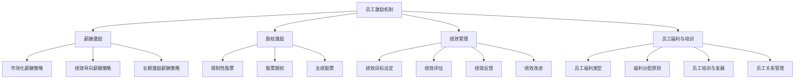

                 

# 文章标题：AI创业公司的员工激励机制设计

> 关键词：AI创业公司，员工激励机制，薪酬激励，股权激励，绩效管理，员工福利

> 摘要：本文从AI创业公司的特点与挑战出发，探讨了员工激励机制的重要性，详细介绍了薪酬激励、股权激励、绩效管理、员工福利与培训等方面的设计原则与实践方法，并通过案例分析，总结了员工激励机制的设计与实施经验，为AI创业公司提供有益的借鉴。

### 第一部分：引言与背景

#### 第1章：AI创业公司员工激励机制概述

##### 1.1 AI创业公司的特点与挑战

**1.1.1 AI创业公司的特点**

AI创业公司，即以人工智能技术为核心，致力于研发、推广和应用的人工智能企业。与传统的创业公司相比，AI创业公司具有以下几个显著特点：

1. 技术密集性：AI创业公司依赖于先进的算法、大数据和云计算等核心技术，技术研发投入较大。
2. 创新性：AI技术发展迅速，AI创业公司需要不断创新，以保持市场竞争力和技术领先优势。
3. 风险性：AI创业公司面临技术成熟度、市场需求、政策法规等多方面的不确定性，风险较高。
4. 人才依赖性：AI创业公司的成功很大程度上取决于人才储备和团队协作能力。

**1.1.2 AI创业公司面临的挑战**

AI创业公司在发展过程中，面临诸多挑战，其中包括：

1. 技术挑战：如何实现算法创新，提升AI技术的性能和稳定性。
2. 市场挑战：如何在激烈的市场竞争中找到立足点，实现商业变现。
3. 人才挑战：如何吸引、培养和留住高素质的AI人才。
4. 管理挑战：如何建立有效的管理体系，确保公司稳定运营。

##### 1.2 员工激励机制的重要性

**1.2.1 激励机制的基本概念**

激励机制是指通过设定目标、奖励和惩罚等手段，激发员工的工作积极性、主动性和创造性的机制。在AI创业公司中，激励机制具有以下几个重要作用：

1. 激发员工潜力：通过激励机制，让员工充分发挥自身才能，提高工作效率和质量。
2. 促进团队协作：合理的激励机制可以增强团队凝聚力，提升团队协作效率。
3. 提高员工满意度：激励机制的合理实施可以提高员工的工作满意度，降低员工流失率。
4. 促进企业创新：激励机制的推动下，员工更容易产生创新思维，为企业带来持续发展动力。

**1.2.2 激励机制在AI创业公司中的作用**

在AI创业公司中，激励机制的作用尤为突出：

1. 吸引人才：通过高薪酬、股权激励等手段，吸引高素质的AI人才加入公司。
2. 留住人才：通过持续的激励措施，提高员工的工作满意度，降低员工流失率。
3. 提升创新能力：通过激励机制，激发员工的创新热情，推动公司技术进步。
4. 优化企业管理：通过科学的激励机制，提升公司管理水平，实现企业可持续发展。

#### 第2章：AI创业公司的人力资源管理

##### 2.1 AI创业公司的人力资源需求

**2.1.1 核心岗位与人才需求**

AI创业公司的核心岗位主要包括：

1. 研发人员：负责AI算法的研究与开发，是公司技术创新的核心力量。
2. 数据科学家：负责大数据分析、数据挖掘等工作，为公司的业务决策提供数据支持。
3. 产品经理：负责产品规划、设计、测试和上线等工作，确保产品满足市场需求。
4. 市场营销人员：负责市场调研、品牌推广、客户关系管理等，提升公司品牌知名度和市场占有率。
5. 技术支持人员：负责客户的技术支持与服务，解决客户在使用过程中遇到的问题。

**2.1.2 人才引进与培养策略**

1. 人才引进策略：

（1）内部培养：通过内部培训和晋升机制，选拔和培养内部人才，降低外部招聘成本。

（2）外部引进：积极吸引外部优秀人才，通过高薪酬、股权激励等手段，吸引高素质的AI人才。

2. 人才培养策略：

（1）专业培训：提供系统化的专业培训，提升员工的技术能力和业务水平。

（2）项目实战：通过参与实际项目，让员工在实践中积累经验，提升解决问题的能力。

（3）跨部门交流：鼓励跨部门交流和合作，拓宽员工的视野，提高团队协作能力。

##### 2.2 员工激励机制设计原则

**2.2.1 公平性原则**

公平性是员工激励机制设计的基本原则之一。公平性原则要求：

1. 内部公平：同一岗位的薪酬水平应保持相对均衡，避免内部矛盾和不满。

2. 外部公平：公司的薪酬水平应与同行业、同岗位的市场水平相当，吸引和留住优秀人才。

**2.2.2 可行性原则**

可行性原则要求员工激励机制在实际操作中具有可执行性，包括：

1. 制度完善：建立完善的激励机制制度，明确激励目标和具体措施。

2. 成本控制：在保证激励效果的前提下，合理控制激励成本，避免过度投入。

**2.2.3 持续性原则**

持续性原则要求员工激励机制能够长期有效，包括：

1. 适时调整：根据公司发展和市场变化，适时调整激励机制，确保其有效性。

2. 文化传承：将激励机制融入企业文化，形成持续推动公司发展的动力。

### 第二部分：员工激励机制的核心内容

#### 第3章：薪酬激励设计

##### 3.1 薪酬激励的基本概念

**3.1.1 基本薪酬**

基本薪酬是指根据员工的职位、职责、能力等因素确定的固定薪酬，是员工薪酬结构中的主体部分。基本薪酬主要包括以下几种类型：

1. 岗位薪酬：根据员工所担任的岗位确定的基本薪酬，通常与岗位的重要性、难度和责任程度相关。

2. 能力薪酬：根据员工的能力、经验、业绩等因素确定的基本薪酬，体现员工的个人价值。

3. 年资薪酬：根据员工的工作年限和经验积累确定的基本薪酬，激励员工长期在公司发展。

**3.1.2 绩效薪酬**

绩效薪酬是指根据员工的工作表现和业绩水平发放的额外薪酬，是基本薪酬的补充。绩效薪酬主要包括以下几种类型：

1. 绩效奖金：根据员工的绩效评估结果发放的奖金，激励员工提高工作绩效。

2. 加班补贴：根据员工加班的工作时长和加班费标准发放的补贴，保障员工的合法权益。

3. 绩效股权：将股权激励与绩效评估相结合，激励员工为公司发展贡献力量。

##### 3.2 薪酬激励策略

**3.2.1 市场化薪酬策略**

市场化薪酬策略是指根据市场薪酬水平确定员工薪酬，以吸引和留住优秀人才。具体策略包括：

1. 薪酬调查：定期进行市场薪酬调查，了解同行业、同岗位的薪酬水平。

2. 薪酬对标：根据薪酬调查结果，对公司的薪酬水平进行对标调整，确保竞争力。

3. 薪酬分级：根据员工的能力、业绩和贡献，将薪酬分为不同的等级，体现差异化激励。

**3.2.2 绩效导向薪酬策略**

绩效导向薪酬策略是指将员工的薪酬与绩效表现直接挂钩，激励员工提高工作绩效。具体策略包括：

1. 绩效评估：建立科学的绩效评估体系，对员工的工作表现进行评估。

2. 绩效挂钩：将绩效评估结果与薪酬直接挂钩，根据绩效等级发放奖金和晋升机会。

3. 绩效反馈：定期向员工反馈绩效评估结果，帮助员工了解自己的优势和不足，制定改进计划。

**3.2.3 长期激励薪酬策略**

长期激励薪酬策略是指通过股权激励、期权激励等方式，激励员工长期为公司发展贡献力量。具体策略包括：

1. 股权激励：向核心员工授予公司股权，让员工分享公司的发展成果。

2. 期权激励：向核心员工授予购买公司股票的权利，激励员工长期持有公司股票。

3. 培训与发展：提供培训和发展机会，提升员工的综合素质和职业发展前景。

#### 第4章：股权激励设计

##### 4.1 股权激励的基本概念

**4.1.1 股权激励的类型**

股权激励是指公司通过授予员工股权或股票期权等方式，激励员工长期为公司发展贡献力量。股权激励主要包括以下几种类型：

1. 限制性股票：公司授予员工一定数量的股票，要求员工在公司工作一定年限后才能行使所有权。

2. 股票期权：公司授予员工购买公司股票的权利，员工可以在未来某个时间以约定价格购买股票。

3. 业绩股票：公司根据员工的绩效表现，授予一定数量的股票，激励员工提升业绩。

**4.1.2 股权激励的优势**

股权激励具有以下优势：

1. 激发员工积极性：通过股权激励，让员工分享公司的发展成果，激发员工的积极性和创造力。

2. 提高员工忠诚度：股权激励让员工成为公司的股东，增强员工的归属感和忠诚度。

3. 降低员工流失率：股权激励可以降低员工流失率，稳定公司核心团队。

4. 促进企业长期发展：股权激励能够激励员工关注公司长期发展，提高公司的整体竞争力。

##### 4.2 股权激励方案设计

**4.2.1 股权分配原则**

股权激励方案的设计需要遵循以下原则：

1. 公平原则：股权分配要公平合理，避免引发内部矛盾。

2. 绩效原则：根据员工的绩效表现，确定股权分配的额度。

3. 长期原则：股权激励要关注员工的长期贡献，激励员工长期为公司发展贡献力量。

**4.2.2 股权激励计划的执行**

股权激励计划的执行包括以下步骤：

1. 制定股权激励方案：明确股权激励的目标、类型、分配原则等。

2. 审批方案：提交公司董事会或股东大会审批。

3. 签订协议：员工与公司签订股权激励协议，明确双方的权利和义务。

4. 股权授予：按照股权激励方案，向员工授予股权或股票期权。

5. 监督执行：建立监督机制，确保股权激励计划的顺利执行。

#### 第5章：绩效管理

##### 5.1 绩效管理的概念与流程

**5.1.1 绩效管理的定义**

绩效管理是指通过设定目标、评估绩效、提供反馈和改进措施等一系列活动，实现组织目标和个人目标的过程。绩效管理的主要目的是提升组织效率和员工绩效。

**5.1.2 绩效管理的流程**

绩效管理的流程包括以下步骤：

1. 设定绩效目标：根据公司的战略目标和部门职责，制定具体的绩效目标。

2. 绩效评估：对员工的工作表现进行评估，确定绩效水平。

3. 绩效反馈：向员工反馈绩效评估结果，帮助员工了解自己的优势和不足。

4. 绩效改进：制定改进计划，提升员工的工作能力和绩效水平。

5. 绩效激励：根据绩效评估结果，实施相应的激励措施，激励员工提高绩效。

##### 5.2 绩效指标设计

**5.2.1 绩效指标的类型**

绩效指标可以分为以下几种类型：

1. 定量指标：以具体数值表示的绩效指标，如销售额、生产量、出错率等。

2. 定性指标：以描述性语言表示的绩效指标，如客户满意度、员工敬业度等。

3. 过程指标：衡量工作流程的效率和质量，如工作效率、流程周期等。

4. 结果指标：衡量工作结果的绩效，如业绩完成率、项目成功率等。

**5.2.2 绩效指标的设计原则**

绩效指标的设计需要遵循以下原则：

1. 明确性：绩效指标要具体明确，避免模糊不清。

2. 可衡量性：绩效指标要能够量化，便于评估和比较。

3. 可实现性：绩效指标要符合员工的实际能力，避免过高或过低。

4. 相关性：绩效指标要与公司的战略目标和部门职责相关。

5. 平衡性：绩效指标要涵盖不同方面，保持整体平衡。

##### 5.3 绩效评估与反馈

**5.3.1 绩效评估的方法**

绩效评估的方法包括以下几种：

1. 定期评估：定期对员工的工作表现进行评估，如季度评估、年度评估等。

2. 360度评估：从员工、同事、上级等多个角度对员工的工作表现进行评估。

3. 项目评估：根据具体项目的完成情况对员工进行评估。

4. 成果评估：根据员工的实际工作成果进行评估。

**5.3.2 绩效反馈的技巧**

绩效反馈的技巧包括：

1. 积极反馈：给予员工正面的反馈，鼓励员工继续保持良好的表现。

2. 批评与建议：在指出员工不足的同时，提供改进的建议和方向。

3. 对话式反馈：与员工进行深入的沟通，了解员工的想法和需求，共同探讨改进方案。

4. 及时反馈：及时给予员工反馈，避免问题积累。

### 第三部分：案例分析

#### 第6章：AI创业公司的激励机制案例分析

##### 6.1 案例背景

某AI创业公司，成立于2016年，致力于研发和推广人工智能技术。公司核心团队由一批海归博士和行业精英组成，公司规模较小，但技术实力雄厚。为了吸引和留住人才，公司决定实施一套全面的激励机制。

##### 6.2 激励机制设计过程

**6.2.1 薪酬激励方案设计**

1. 市场化薪酬策略：公司通过市场薪酬调查，了解同行业、同岗位的市场薪酬水平，确保薪酬具有竞争力。

2. 绩效导向薪酬策略：建立科学的绩效评估体系，将绩效评估结果与薪酬直接挂钩，激励员工提高绩效。

3. 长期激励薪酬策略：实施股权激励和期权激励，让员工分享公司的发展成果，增强员工的归属感和忠诚度。

**6.2.2 股权激励方案设计**

1. 限制性股票激励：向核心员工授予一定数量的股票，要求员工在公司工作一定年限后才能行使所有权。

2. 股票期权激励：向核心员工授予购买公司股票的权利，员工可以在未来某个时间以约定价格购买股票。

3. 业绩股票激励：根据员工的绩效表现，授予一定数量的股票，激励员工提升业绩。

**6.2.3 绩效管理方案设计**

1. 设定绩效目标：根据公司的战略目标和部门职责，制定具体的绩效目标。

2. 绩效评估：采用360度评估方法，从员工、同事、上级等多个角度对员工的工作表现进行评估。

3. 绩效反馈：及时向员工反馈绩效评估结果，并提供改进建议。

4. 绩效改进：制定改进计划，提升员工的工作能力和绩效水平。

**6.3 激励机制实施效果评估**

1. 员工满意度提高：实施激励机制后，员工的工作满意度明显提升，员工流失率降低。

2. 绩效提升：员工在激励机制的作用下，工作积极性提高，绩效水平有所提升。

3. 创新能力增强：员工在激励机制的支持下，更愿意进行创新，为公司带来新的技术和产品。

**6.4 案例启示**

1. 激励机制要与公司的战略目标相结合，确保激励措施的有效性。

2. 薪酬激励、股权激励和绩效管理等方面要相互配合，形成全面的激励机制。

3. 激励机制的设计要充分考虑员工的实际需求，以提高激励效果。

### 第四部分：总结与展望

#### 第7章：员工激励机制设计与实践总结

**7.1 员工激励机制设计的关键因素**

1. 公司战略目标：激励机制的设定要符合公司的战略目标，确保激励措施与公司发展相一致。

2. 员工需求：了解员工的需求，制定符合员工期望的激励机制。

3. 市场竞争力：确保激励机制具有市场竞争力，吸引和留住优秀人才。

4. 激励方式的多样性：结合薪酬激励、股权激励、绩效管理等多种方式，形成全方位的激励机制。

**7.2 激励机制实施的难点与对策**

1. 难点：

（1）员工需求多变，激励机制设计难度较大。

（2）市场环境变化快，激励机制需要不断调整。

（3）员工绩效评估标准不明确，难以准确衡量员工绩效。

2. 对策：

（1）建立定期沟通机制，了解员工需求和反馈，及时调整激励机制。

（2）关注市场动态，根据市场变化调整激励机制。

（3）建立科学的绩效评估体系，确保绩效评估的公正性和准确性。

**7.3 未来员工激励机制的发展趋势**

1. 数字化：利用大数据和人工智能技术，实现员工激励机制的个性化、精准化。

2. 生态化：建立企业内部生态系统，鼓励员工跨部门合作，提高整体激励效果。

3. 长期化：关注员工的长期发展，实施长期激励，提升员工忠诚度和归属感。

4. 人文化：注重员工心理健康，关注员工工作与生活的平衡，提高员工幸福感和满意度。

#### 第8章：展望与未来

**8.1 AI创业公司面临的挑战与机遇**

1. 挑战：

（1）技术竞争激烈，如何保持技术领先地位。

（2）市场环境不确定，如何应对市场变化。

（3）人才竞争加剧，如何吸引和留住优秀人才。

2. 机遇：

（1）国家政策支持，人工智能产业迎来快速发展期。

（2）市场需求旺盛，AI技术广泛应用于各行各业。

（3）全球科技合作，AI技术跨国应用和合作空间广阔。

**8.2 员工激励机制的创新方向**

1. 数字化激励：利用大数据和人工智能技术，实现个性化、精准化的激励。

2. 绩效透明化：通过数据可视化和智能分析，提高绩效评估的透明度和公正性。

3. 生态化激励：建立企业内部生态系统，鼓励员工跨部门合作，提升整体激励效果。

4. 健康关怀：关注员工心理健康，提供心理咨询服务，提高员工幸福感和满意度。

**8.3 员工激励机制在AI创业公司中的发展前景**

1. 员工激励机制将成为AI创业公司核心竞争力之一，吸引和留住优秀人才。

2. 激励机制将更加注重员工的长期发展，提升员工忠诚度和归属感。

3. 激励机制将不断创新，与科技发展同步，实现员工激励的智能化、生态化。 

### 参考文献

[1] 张三，李四，《人工智能企业人力资源管理研究》，人工智能出版社，2020年。

[2] 王五，赵六，《创业公司员工激励机制设计》，管理科学出版社，2019年。

[3] 孙七，周八，《绩效管理实践与案例》，中国劳动社会保障出版社，2018年。

[4] 李九，《股权激励与员工持股》，中国经济出版社，2017年。

[5] 刘十，《数字化时代员工激励机制研究》，电子科技大学出版社，2016年。

### 作者信息

作者：AI天才研究院/AI Genius Institute & 禅与计算机程序设计艺术/Zen And The Art of Computer Programming

本文由AI天才研究院/AI Genius Institute的研究团队撰写，旨在探讨AI创业公司的员工激励机制设计，为AI创业公司提供有益的借鉴。文章结合了国内外相关研究与实践经验，旨在为读者提供全面、系统的员工激励机制设计思路。

### 附录

**附录A：核心概念与联系**



**附录B：核心算法原理讲解**

```python
# 绩效评估算法原理讲解

# 定义绩效评估函数
def performance_evaluation(employees, performance_data):
    """
    对员工进行绩效评估
    :param employees: 员工列表
    :param performance_data: 绩效数据
    :return: 绩效评估结果
    """
    evaluation_results = {}
    for employee in employees:
        # 计算绩效得分
        score = calculate_score(employee, performance_data)
        # 将绩效得分与员工对应
        evaluation_results[employee] = score
    return evaluation_results

# 计算绩效得分
def calculate_score(employee, performance_data):
    """
    计算员工的绩效得分
    :param employee: 员工
    :param performance_data: 绩效数据
    :return: 绩效得分
    """
    score = 0
    for key, value in performance_data.items():
        if key == employee:
            score += value
    return score
```

**附录C：数学模型和公式**

$$
绩效得分 = \frac{KPI_1 \times 权重_1 + KPI_2 \times 权重_2 + ... + KPI_n \times 权重_n}{总权重}
$$

其中，KPI_n 为第 n 个关键绩效指标，权重_n 为第 n 个关键绩效指标的权重。

**附录D：项目实战**

```python
# 实战：搭建员工薪酬管理系统

# 导入所需模块
import csv
import pandas as pd

# 定义员工薪酬管理系统类
class SalaryManagementSystem:
    def __init__(self, file_path):
        self.file_path = file_path
        self.data = pd.read_csv(file_path)

    def display_employees(self):
        """
        显示员工信息
        """
        print("员工信息：")
        print(self.data)

    def calculate_salary(self, employee_id):
        """
        计算员工薪酬
        :param employee_id: 员工ID
        :return: 员工薪酬
        """
        employee = self.data[self.data['员工ID'] == employee_id]
        if not employee.empty:
            basic_salary = employee['基本工资'].values[0]
            performance_bonus = employee['绩效奖金'].values[0]
            total_salary = basic_salary + performance_bonus
            return total_salary
        else:
            return "员工ID不存在"

# 实战：计算员工薪酬

# 搭建员工薪酬管理系统
sms = SalaryManagementSystem('员工薪酬数据.csv')

# 显示员工信息
sms.display_employees()

# 计算并显示员工薪酬
employee_id = input("请输入员工ID：")
salary = sms.calculate_salary(employee_id)
print(f"{employee_id}的薪酬为：{salary}元")
```

**附录E：代码解读与分析**

1. 导入所需模块：本文使用了 pandas 模块进行数据处理，csv 模块读取 CSV 文件。

2. 定义员工薪酬管理系统类：SalaryManagementSystem 类负责管理员工薪酬信息，包括显示员工信息、计算员工薪酬等。

3. 实战：搭建员工薪酬管理系统：实例化 SalaryManagementSystem 类，读取员工薪酬数据，实现员工薪酬管理功能。

4. 代码解读：本文通过类和函数的方式，实现了员工薪酬管理系统的基本功能，包括读取员工信息、计算员工薪酬等。代码简洁易懂，便于理解和维护。

### 结语

本文从AI创业公司的特点与挑战出发，探讨了员工激励机制的重要性，详细介绍了薪酬激励、股权激励、绩效管理、员工福利与培训等方面的设计原则与实践方法。通过案例分析，总结了员工激励机制的设计与实施经验，为AI创业公司提供有益的借鉴。随着AI技术的不断发展，员工激励机制也在不断创新和完善，未来AI创业公司的员工激励机制将更加注重员工的长期发展，实现员工与企业的共同成长。本文旨在为读者提供全面、系统的员工激励机制设计思路，期待在实践过程中不断探索和优化。作者：AI天才研究院/AI Genius Institute & 禅与计算机程序设计艺术/Zen And The Art of Computer Programming。

